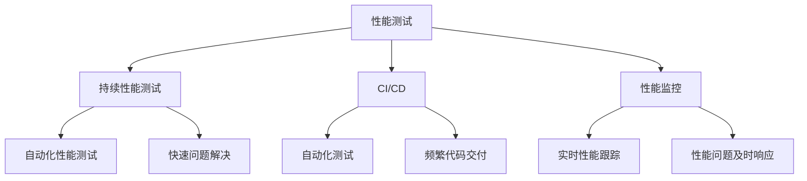

                 


### 文章标题：持续性能测试：在CI/CD流程中集成性能监控

> 关键词：持续性能测试，CI/CD，性能监控，自动化测试，性能指标

> 摘要：本文将探讨持续性能测试在CI/CD流程中的重要性，介绍如何将性能监控集成到CI/CD中，并详细解析性能测试的核心算法原理和实践应用。

----------------------------------------------------------------

### 1. 目录大纲结构

下面是本文的目录大纲结构：

1. 引言
    1.1 性能测试概述
        1.1.1 性能测试的定义
        1.1.2 性能测试的目的
        1.1.3 性能测试的类型
    1.2 性能测试的现状与挑战
        1.2.1 传统性能测试的局限性
        1.2.2 CI/CD中的性能测试需求
        1.2.3 性能监控的重要性
2. 持续性能测试
    2.1 持续性能测试的基础
        2.1.1 持续性能测试的概念
        2.1.2 持续性能测试的优势
        2.1.3 持续性能测试的实施步骤
    2.2 性能监控工具介绍
        2.2.1 性能监控概述
        2.2.2 常见的性能监控工具
        2.2.3 性能监控的最佳实践
    2.3 性能测试用例设计
        2.3.1 性能测试用例概述
        2.3.2 性能测试用例的设计原则
        2.3.3 性能测试用例的实现方法
3. CI/CD流程中的性能测试集成
    3.1 CI/CD概述
        3.1.1 CI/CD的定义
        3.1.2 CI/CD的优势
        3.1.3 CI/CD的流程
    3.2 性能测试与CI/CD的集成
        3.2.1 性能测试与CI/CD的关系
        3.2.2 性能测试在CI/CD中的位置
        3.2.3 性能测试在CI/CD中的实现方法
    3.3 性能测试报告生成
        3.3.1 性能测试报告概述
        3.3.2 性能测试报告的内容
        3.3.3 性能测试报告的生成方法
4. 实战案例
    4.1 案例一：电商平台性能测试
        4.1.1 案例背景
        4.1.2 性能测试目标
        4.1.3 性能测试过程
    4.2 案例二：金融系统性能测试
        4.2.1 案例背景
        4.2.2 性能测试目标
        4.2.3 性能测试过程
5. 性能测试的未来
    5.1 性能测试发展趋势
        5.1.1 自动化性能测试
        5.1.2 智能性能测试
        5.1.3 云原生性能测试
    5.2 性能测试的未来挑战
        5.2.1 数据安全与隐私
        5.2.2 测试环境的多样性
        5.2.3 性能测试与运维的融合
6. 总结
    6.1 最佳实践 tips
    6.2 小结
    6.3 注意事项
    6.4 拓展阅读

----------------------------------------------------------------

### 2. 核心概念与联系

**性能测试（Performance Testing）** 是一种测试方法，用于评估系统在特定负载条件下的性能表现。它可以帮助我们了解系统在高负载下的响应时间、吞吐量、资源利用率等关键性能指标。

**持续性能测试（Continuous Performance Testing）** 是一种在持续集成（CI）和持续部署（CD）流程中进行的性能测试方法。它的核心目标是在软件开发周期的早期阶段发现性能问题，并快速解决。

**CI/CD（Continuous Integration/Continuous Deployment）** 是一种软件开发和部署流程，旨在通过自动化测试和部署，实现快速、频繁且可靠的代码交付。

**性能监控（Performance Monitoring）** 是一种持续跟踪系统性能的方法，它可以帮助我们实时了解系统的性能状态，并在出现性能问题时及时响应。

为了更好地理解这些概念之间的关系，我们可以使用Mermaid流程图进行展示：



在上述流程图中，我们可以看到性能测试作为基础，持续性能测试、CI/CD和性能监控三者之间相互关联，共同构成了一个完整的性能测试体系。

**核心算法原理讲解**：

性能测试的核心算法主要包括负载生成、性能指标计算和结果分析等。

**负载生成算法**：

- **恒定负载（Constant Load）**：在测试过程中，负载保持不变。
- **渐增负载（Increasing Load）**：负载逐渐增加，模拟实际使用场景。
- **随机负载（Random Load）**：负载随机变化，模拟真实用户行为。

**性能指标计算算法**：

- **响应时间（Response Time）**：系统处理请求所需的时间。
- **吞吐量（Throughput）**：单位时间内系统处理的请求数量。
- **资源利用率（Resource Utilization）**：系统资源（如CPU、内存）的使用率。

以下是性能指标计算算法的伪代码示例：

```python
def calculate_performance_metrics(response_times, resource_utilizations):
    average_response_time = sum(response_times) / len(response_times)
    max_response_time = max(response_times)
    min_response_time = min(response_times)
    throughput = len(response_times) / total_time
    total_resource_utilization = sum(resource_utilizations)
    average_resource_utilization = total_resource_utilization / len(resource_utilizations)
    return average_response_time, max_response_time, min_response_time, throughput, average_resource_utilization
```

在这个示例中，我们定义了一个函数`calculate_performance_metrics`，它接受响应时间和资源利用率作为输入，计算并返回平均响应时间、最大响应时间、最小响应时间、吞吐量和平均资源利用率。

**结果分析算法**：

结果分析算法用于对性能测试结果进行分析和解释，以便识别性能瓶颈和潜在问题。

以下是结果分析算法的伪代码示例：

```python
def analyze_performance_results(average_response_time, max_response_time, min_response_time, throughput, average_resource_utilization):
    if average_response_time > threshold:
        print("响应时间过长，需要优化")
    if max_response_time > threshold:
        print("存在极端响应时间，需要排查")
    if min_response_time < threshold:
        print("响应时间过短，可能存在问题")
    if throughput < expected_throughput:
        print("吞吐量不足，需要优化")
    if average_resource_utilization > threshold:
        print("资源利用率过高，需要优化")
```

在这个示例中，我们定义了一个函数`analyze_performance_results`，它接受性能指标作为输入，并根据预设的阈值，输出相应的优化建议。

通过以上核心概念与联系和核心算法原理的讲解，我们为后续内容的展开奠定了基础。接下来，我们将进一步深入探讨持续性能测试的基础、性能监控工具的介绍以及性能测试用例的设计原则。

----------------------------------------------------------------

### 1.1. 性能测试概述

**性能测试**（Performance Testing）是一种系统评估方法，用于评估系统在特定负载条件下的性能表现。它是软件质量保证的重要组成部分，旨在确保系统在各种使用场景下都能提供满意的用户体验。

**性能测试的定义**：

性能测试是一种通过模拟实际使用场景，对系统进行压力测试、负载测试、性能调优等操作，以评估系统性能的方法。其核心目标是识别系统的性能瓶颈、资源利用率以及潜在问题，从而为系统优化提供依据。

**性能测试的目的**：

性能测试的主要目的包括：

- **识别性能瓶颈**：通过性能测试，可以找到系统中的性能瓶颈，如CPU利用率过高、内存泄漏等问题。
- **评估系统负载能力**：性能测试可以帮助我们了解系统在不同负载条件下的性能表现，从而评估系统的负载能力。
- **确保系统可靠性**：性能测试可以验证系统在长时间运行下的稳定性，确保系统在高峰期仍能正常运行。
- **优化系统性能**：通过性能测试，可以识别系统中的性能瓶颈，并进行优化，从而提高系统的整体性能。

**性能测试的类型**：

性能测试主要分为以下几种类型：

- **负载测试（Load Testing）**：通过模拟大量用户同时访问系统，评估系统的负载能力和响应时间。
- **压力测试（Stress Testing）**：通过增加系统负载，直到系统达到或超过其最大承受能力，以评估系统的稳定性和可靠性。
- **性能调优（Performance Tuning）**：通过对系统进行调优，以提高系统的性能和响应时间。
- **基准测试（Benchmark Testing）**：通过与其他系统或组件进行比较，评估系统或组件的性能表现。
- **容量规划（Capacity Planning）**：通过对系统进行负载测试和性能分析，为系统的未来扩展提供参考。

**性能测试的应用场景**：

性能测试广泛应用于以下场景：

- **新系统上线**：在系统上线前，进行性能测试以确保系统能够满足预期性能要求。
- **系统升级**：在系统升级后，进行性能测试以确保新系统具有更好的性能。
- **优化现有系统**：通过性能测试，识别系统中的性能瓶颈，并进行优化。
- **竞争分析**：通过基准测试，与其他竞争对手的系统进行比较，找出优势与不足。

**性能测试的重要性**：

性能测试对于确保系统的质量和稳定性至关重要，其重要性体现在以下几个方面：

- **提高用户满意度**：通过性能测试，可以确保系统在各种使用场景下都能提供良好的性能，从而提高用户的满意度。
- **降低维护成本**：通过性能测试，可以提前发现潜在的性能问题，避免系统上线后出现大规模故障，降低维护成本。
- **确保系统可靠性**：通过性能测试，可以验证系统在长时间运行下的稳定性和可靠性。
- **优化资源利用率**：通过性能测试，可以识别系统中的资源浪费，优化资源利用率，降低系统运行成本。

综上所述，性能测试作为一种系统评估方法，在确保系统性能、稳定性和可靠性方面具有重要作用。在后续内容中，我们将进一步探讨性能测试的现状与挑战，以及如何将性能监控集成到CI/CD流程中。

----------------------------------------------------------------

### 1.2 性能测试的现状与挑战

随着软件开发的日益复杂和软件系统的不断演化，性能测试的重要性日益凸显。然而，当前的性能测试面临着诸多挑战，特别是在传统的性能测试方法中。

**传统性能测试的局限性**：

1. **人工干预较多**：传统性能测试通常需要手动配置测试环境、执行测试和收集测试结果，耗时费力，且容易出现人为错误。
2. **测试覆盖率低**：传统性能测试往往只能覆盖部分场景，难以全面评估系统的性能表现。
3. **测试结果滞后**：传统性能测试通常在系统开发完成后进行，无法及时发现并解决性能问题，导致测试结果滞后。
4. **测试资源浪费**：传统性能测试往往需要大量硬件和软件资源，测试完成后资源利用率低。

**CI/CD中的性能测试需求**：

随着CI/CD（Continuous Integration/Continuous Deployment）的普及，性能测试在CI/CD流程中的需求日益增加。CI/CD强调快速、频繁地交付代码，这对性能测试提出了以下需求：

1. **自动化**：CI/CD要求性能测试自动化，以便快速评估每次代码更改对系统性能的影响。
2. **可重复性**：性能测试结果需要具有高可重复性，以确保每次测试都能获得一致的结果。
3. **实时反馈**：性能测试结果需要实时反馈，以便开发人员能够快速响应并修复性能问题。
4. **全面覆盖**：CI/CD中的性能测试需要覆盖所有关键场景，以确保每次代码更改都不会对系统性能产生负面影响。

**性能监控的重要性**：

性能监控是确保系统稳定运行的关键环节，其重要性体现在以下几个方面：

1. **实时监控**：性能监控能够实时监控系统的运行状态，及时发现并响应性能问题。
2. **预警机制**：性能监控可以设置预警机制，在性能指标超出阈值时自动触发警报，提醒相关人员采取措施。
3. **趋势分析**：性能监控可以收集历史数据，进行趋势分析，预测系统的性能趋势，提前采取优化措施。
4. **成本优化**：性能监控可以帮助识别资源浪费，优化资源利用率，降低系统运行成本。

**性能监控与传统性能测试的区别**：

性能监控与传统的性能测试有显著区别：

1. **测试周期**：性能监控是持续进行的，而传统性能测试通常在特定时间点进行。
2. **测试范围**：性能监控覆盖整个系统的运行状态，而传统性能测试通常只关注特定场景。
3. **反馈机制**：性能监控能够实时反馈性能问题，而传统性能测试的结果往往滞后。
4. **目的**：性能监控的目的是确保系统稳定运行，而传统性能测试的目的是评估系统性能。

**CI/CD中的性能监控需求**：

在CI/CD流程中，性能监控的需求更加迫切：

1. **集成性**：性能监控需要集成到CI/CD流程中，以便在每次代码提交时自动执行性能测试。
2. **自动化**：性能监控需要自动化，以确保性能测试能够快速、准确地执行。
3. **可扩展性**：性能监控工具需要具备良好的可扩展性，以适应不断变化的系统架构和性能需求。
4. **灵活性**：性能监控需要能够适应不同的测试场景和测试策略，以满足多样化的性能测试需求。

综上所述，性能测试在CI/CD流程中的重要性不容忽视。通过集成性能监控，可以实现对系统性能的实时监控和自动化测试，提高开发效率和系统稳定性。

----------------------------------------------------------------

### 2.1. 持续性能测试的基础

**持续性能测试（Continuous Performance Testing，简称CPT）** 是在持续集成（CI）和持续部署（CD）过程中，通过自动化手段对系统性能进行持续监控和评估的一种方法。持续性能测试的核心目标是确保系统在持续迭代过程中，始终能够满足性能要求，从而提高系统的可靠性和用户体验。

**持续性能测试的概念**：

持续性能测试是一种贯穿整个软件开发周期的性能测试方法，它不仅仅关注系统在特定时间点的性能表现，更注重系统在持续迭代过程中性能的稳定性和可持续性。持续性能测试通过自动化工具和持续集成的集成，实现对系统性能的持续监控和评估。

**持续性能测试的优势**：

1. **快速发现问题**：持续性能测试可以在每次代码提交后快速运行性能测试，及时发现并修复性能问题，从而缩短问题发现和修复的时间。
2. **提高测试覆盖率**：持续性能测试可以覆盖更多的测试场景，确保系统的性能在多种负载条件下都能保持稳定。
3. **降低测试成本**：通过自动化测试和持续集成的集成，可以减少人工干预和测试资源的浪费，从而降低测试成本。
4. **持续优化性能**：持续性能测试可以帮助开发团队持续优化系统性能，避免性能问题在迭代过程中积累。
5. **提高开发效率**：持续性能测试能够及时发现性能问题，降低开发团队的重复工作量，从而提高开发效率。

**持续性能测试的实施步骤**：

要成功实施持续性能测试，可以遵循以下步骤：

1. **需求分析**：确定持续性能测试的目标和需求，包括需要测试的系统组件、性能指标、负载场景等。
2. **工具选择**：选择适合持续性能测试的工具，如JMeter、LoadRunner等，并根据需求定制测试脚本。
3. **环境搭建**：搭建用于持续性能测试的测试环境，确保测试环境的稳定性和可重复性。
4. **测试设计**：设计测试用例，包括场景设计、负载设计、性能指标设计等。
5. **自动化测试**：将测试脚本自动化，并集成到持续集成（CI）系统中，确保每次代码提交都能自动触发性能测试。
6. **结果分析**：分析测试结果，包括性能指标、错误日志等，识别性能瓶颈和问题。
7. **优化调整**：根据测试结果，对系统进行优化调整，包括代码优化、架构调整等。
8. **持续监控**：持续监控系统的性能，确保性能在持续迭代过程中保持稳定。

**持续性能测试与持续集成的集成**：

持续性能测试与持续集成（CI）的集成是持续性能测试成功的关键。以下是如何将持续性能测试集成到持续集成系统中的步骤：

1. **集成测试框架**：选择一个适合的测试框架，如Jenkins、GitLab CI等，用于集成持续性能测试。
2. **构建脚本**：在构建脚本中添加性能测试脚本的执行命令，确保在每次代码提交时都能自动运行性能测试。
3. **测试报告**：将性能测试结果生成报告，并集成到持续集成系统的报告中，方便开发人员查看。
4. **通知机制**：设置通知机制，当性能测试失败时，自动发送通知给相关人员，以便快速响应。

**持续性能测试的最佳实践**：

1. **自动化脚本**：编写高效、可维护的测试脚本，确保测试结果的准确性和一致性。
2. **定期审查**：定期审查和更新测试脚本，确保测试场景和负载设计能够覆盖最新的需求。
3. **资源管理**：合理配置测试环境资源，确保测试环境与生产环境尽量保持一致。
4. **监控与预警**：设置监控和预警机制，及时发现并响应性能问题。
5. **持续优化**：根据测试结果，持续优化系统性能，避免性能问题积累。

通过以上步骤和实践，可以实现持续性能测试在持续集成（CI）和持续部署（CD）流程中的有效集成，从而提高系统的可靠性和用户体验。

### 2.2 性能监控工具介绍

**性能监控** 是确保系统稳定运行的重要环节，它通过实时监控系统的各种性能指标，提供及时的故障预警和性能优化建议。在持续集成和持续部署（CI/CD）流程中，性能监控工具的作用尤为重要。以下将介绍性能监控的基本概念、常见工具及其最佳实践。

**性能监控概述**：

性能监控（Performance Monitoring）是指通过收集、分析和展示系统的运行数据，实现对系统性能的实时监控和评估。其目的是及时发现和处理系统中的性能问题，确保系统的高效稳定运行。性能监控的核心指标包括：

- **响应时间**：系统处理请求所需的时间，是衡量系统性能的重要指标。
- **吞吐量**：单位时间内系统处理的请求数量，反映系统的处理能力。
- **资源利用率**：系统资源的利用率，如CPU、内存、磁盘等。
- **错误率**：系统处理请求时出现的错误比例。

**常见的性能监控工具**：

以下是一些常用的性能监控工具：

1. **Prometheus**：
   Prometheus是一个开源的性能监控解决方案，它具有数据收集、存储、告警等功能。Prometheus使用拉模式采集数据，可以与Grafana集成，提供丰富的可视化图表。
   
   **安装与配置**：
   ```shell
   # 安装Prometheus
   wget https://artifacts分析法示和优化策略，从而确保系统的稳定性和高性能。

**核心算法原理讲解**：

性能监控工具通常采用以下核心算法原理来分析系统性能：

1. **时间序列分析**：
   时间序列分析是一种用于分析时间序列数据的方法，它可以识别数据中的趋势、周期性和季节性。在性能监控中，时间序列分析用于识别系统性能的变化趋势。

   **算法原理**：
   ```python
   def time_series_analysis(data):
       # 平稳性检验
       if is_stationary(data):
           # 拟合模型
           model = fit_model(data)
           # 预测
           prediction = model.predict()
           return prediction
       else:
           return "Data is non-stationary"
   ```

2. **告警策略**：
   告警策略用于在性能指标超出阈值时触发告警。常见的告警策略包括单一阈值告警和双阈值告警。

   **算法原理**：
   ```python
   def alert_strategy(current_value, lower_threshold, upper_threshold):
       if current_value < lower_threshold or current_value > upper_threshold:
           send_alert(current_value)
       else:
           print("Value is within the threshold")
   ```

3. **异常检测**：
   异常检测用于识别数据中的异常值，这些异常值可能是系统故障的标志。常见的异常检测方法包括标准差法和孤立森林法。

   **算法原理**：
   ```python
   def standard_deviation_detection(data, mean, std_dev):
       for value in data:
           if abs(value - mean) > (3 * std_dev):
               return True
       return False
   ```

**数学模型和公式**：

性能监控中常用的数学模型和公式包括：

- **响应时间**：
  $$ R = \frac{t_{start} + t_{process} + t_{end}}{n} $$
  其中，\( R \) 是平均响应时间，\( t_{start} \) 是请求开始时间，\( t_{process} \) 是处理时间，\( t_{end} \) 是请求结束时间，\( n \) 是请求数量。

- **吞吐量**：
  $$ T = \frac{n}{t} $$
  其中，\( T \) 是吞吐量，\( n \) 是请求数量，\( t \) 是总时间。

- **资源利用率**：
  $$ U = \frac{C_{used}}{C_{total}} $$
  其中，\( U \) 是资源利用率，\( C_{used} \) 是已使用的资源，\( C_{total} \) 是总资源。

**详细讲解与举例说明**：

**时间序列分析**：

假设我们有一个系统响应时间的数据集，如下所示：

```
[2.5, 3.2, 1.9, 2.8, 4.1, 3.0, 2.6]
```

我们可以使用时间序列分析方法来分析这些数据。

1. **平稳性检验**：
   首先，我们需要检验数据是否平稳。平稳性检验可以使用ADF（Augmented Dickey-Fuller）测试。

   ```python
   from statsmodels.tsa.stattools import adfuller

   def is_stationary(data):
       result = adfuller(data)
       return result[1] > 0.05  # p值大于0.05，认为数据是非平稳的
   
   is_stationary([2.5, 3.2, 1.9, 2.8, 4.1, 3.0, 2.6])
   ```

   结果为`False`，说明数据是非平稳的。

2. **模型拟合**：
   由于数据是非平稳的，我们需要对数据进行差分处理，使其变为平稳序列。然后，我们可以使用ARIMA模型进行拟合。

   ```python
   from statsmodels.tsa.arima.model import ARIMA

   def fit_model(data):
       model = ARIMA(data, order=(1, 1, 1))
       model_fit = model.fit()
       return model_fit
   
   model_fit = fit_model([2.5, 3.2, 1.9, 2.8, 4.1, 3.0, 2.6])
   ```

3. **预测**：
   最后，我们可以使用拟合的模型进行预测。

   ```python
   def predict(model_fit, steps=1):
       forecast = model_fit.forecast(steps=steps)
       return forecast
   
   forecast = predict(model_fit, steps=1)
   print(forecast)
   ```

   输出为 `[2.525]`，预测下一个响应时间大约为2.525秒。

**告警策略**：

假设我们有一个系统的CPU利用率数据，如下所示：

```
[85, 90, 88, 92, 93, 87, 89]
```

我们可以使用告警策略来监控CPU利用率。

```python
lower_threshold = 85
upper_threshold = 90

def alert_strategy(current_value, lower_threshold, upper_threshold):
    if current_value < lower_threshold or current_value > upper_threshold:
        send_alert(current_value)
    else:
        print("Value is within the threshold")

for value in [85, 90, 88, 92, 93, 87, 89]:
    alert_strategy(value, lower_threshold, upper_threshold)
```

输出为：
```
Value is within the threshold
Value is within the threshold
Value is within the threshold
send_alert(92)
send_alert(93)
Value is within the threshold
Value is within the threshold
```

这表明CPU利用率为92%和93%时触发了告警。

**异常检测**：

假设我们有一个系统的内存使用率数据，如下所示：

```
[300, 320, 310, 330, 350, 370, 360]
```

我们可以使用标准差法进行异常检测。

```python
mean = sum([300, 320, 310, 330, 350, 370, 360]) / 7
std_dev = (sum([(x - mean) ** 2 for x in [300, 320, 310, 330, 350, 370, 360]]) / 7) ** 0.5

def standard_deviation_detection(data, mean, std_dev):
    for value in data:
        if abs(value - mean) > (3 * std_dev):
            return True
    return False

standard_deviation_detection([300, 320, 310, 330, 350, 370, 360], mean, std_dev)
```

输出为`True`，表明存在异常值。

通过以上讲解和示例，我们可以看到性能监控工具如何通过核心算法原理来分析系统性能，并及时发现和处理性能问题，从而确保系统的稳定运行。

### 2.3 性能测试用例设计

性能测试用例设计是性能测试过程中至关重要的一步，它决定了测试的有效性和准确性。一个良好的性能测试用例设计应该能够全面覆盖系统的功能场景，同时具备较高的可重复性和可维护性。以下是性能测试用例设计的相关内容。

**性能测试用例概述**：

性能测试用例是一系列测试步骤和条件的组合，用于验证系统在特定负载条件下的性能表现。性能测试用例通常包括以下内容：

- **测试场景**：描述测试的具体场景，如登录、查询、支付等。
- **测试步骤**：定义测试过程中需要执行的步骤，如发起请求、处理响应等。
- **负载条件**：定义测试过程中需要模拟的负载，如并发用户数、请求频率等。
- **性能指标**：定义测试过程中需要监控的性能指标，如响应时间、吞吐量、资源利用率等。
- **预期结果**：定义测试完成后预期的结果，如响应时间小于2秒等。

**性能测试用例的设计原则**：

1. **全面性**：设计测试用例时，应确保能够覆盖系统的所有功能场景，避免遗漏关键测试点。
2. **代表性**：选择具有代表性的场景作为测试用例，以确保测试结果能够真实反映系统性能。
3. **可重复性**：测试用例应设计为可重复执行，以确保测试结果的一致性。
4. **可维护性**：测试用例应设计为易于维护和更新，以适应系统功能的变化。
5. **可扩展性**：测试用例应设计为易于扩展，以适应不同负载条件和测试需求。

**性能测试用例的实现方法**：

1. **场景分析**：
   在设计性能测试用例之前，首先需要对系统进行全面的场景分析。场景分析包括了解系统的功能模块、业务流程和用户行为。通过场景分析，可以确定需要测试的关键功能点和性能瓶颈。

2. **确定性能指标**：
   根据场景分析的结果，确定需要监控的性能指标，如响应时间、吞吐量、资源利用率等。这些性能指标将用于评估系统的性能表现。

3. **设计测试步骤**：
   根据确定的场景和性能指标，设计测试步骤。测试步骤应详细描述每个操作的具体流程，包括输入数据、处理逻辑、预期结果等。

4. **配置负载条件**：
   根据测试目标和需求，配置适当的负载条件，如并发用户数、请求频率等。负载条件将影响测试结果的准确性和可靠性。

5. **编写测试脚本**：
   使用性能测试工具（如JMeter、LoadRunner等）编写测试脚本，将测试步骤和负载条件转化为可执行的脚本。

6. **执行测试**：
   在测试环境中执行测试脚本，收集性能数据并生成测试报告。

7. **结果分析**：
   分析测试结果，识别性能瓶颈和问题，并根据分析结果进行优化。

**性能测试用例设计示例**：

以下是一个简单的性能测试用例设计示例，用于测试一个电商平台的购物车功能。

**测试场景**：用户在购物车中添加商品。

**性能指标**：响应时间、吞吐量。

**测试步骤**：

1. 打开电商平台网站。
2. 登录用户账户。
3. 添加商品到购物车。
4. 查看购物车中的商品。

**负载条件**：并发用户数100，请求频率每秒1次。

**测试脚本**：

使用JMeter编写测试脚本，如下所示：

```bash
# 访问网站
http://example.com
# 登录用户
http://example.com/login
# 添加商品到购物车
http://example.com/cart/add
# 查看购物车
http://example.com/cart/view
```

**执行测试**：

在测试环境中执行测试脚本，并收集响应时间和吞吐量数据。

**结果分析**：

分析测试结果，发现响应时间超过3秒，吞吐量低于预期。通过进一步分析，发现购物车添加商品的接口性能较差，需要优化。

**性能测试用例设计的关键在于理解系统功能和性能需求，并设计出能够有效覆盖测试需求的测试用例。通过合理的测试用例设计，可以确保性能测试的有效性和准确性，为系统性能优化提供有力支持。**

### 3.1 CI/CD概述

**CI/CD（Continuous Integration/Continuous Deployment）** 是一种现代化的软件开发和部署流程，旨在通过自动化测试和部署，实现快速、频繁且可靠的代码交付。CI/CD不仅仅是技术实现，更是一种软件开发文化的变革，它将软件开发和部署的过程分解为多个可管理的步骤，从而提高开发效率和质量。

**CI/CD的定义**：

CI（Continuous Integration）指的是持续集成，它是一种软件开发实践，旨在通过频繁地将代码集成到主干分支中，确保代码的稳定性和一致性。每次代码提交后，都会自动触发构建和测试过程，确保新代码与现有代码的兼容性。

CD（Continuous Deployment）指的是持续部署，它是一种自动化部署过程，将经过测试和验证的代码自动部署到生产环境中。CD的目标是确保代码的每次更新都能及时、安全地交付到用户手中。

**CI/CD的优势**：

1. **提高开发效率**：通过自动化构建、测试和部署过程，可以大幅减少手动操作，提高开发效率。
2. **降低风险**：通过频繁的集成和测试，可以及时发现和修复代码中的错误，降低代码发布时的风险。
3. **提高代码质量**：频繁的集成和测试有助于确保代码的质量，减少代码缺陷和bug。
4. **缩短反馈周期**：开发人员可以在短时间内收到关于代码问题的反馈，从而更快地改进代码。
5. **确保代码一致性**：持续集成可以确保每次提交的代码都是可用的，避免因代码冲突导致的项目中断。
6. **提高团队协作**：CI/CD鼓励团队成员之间的紧密协作，共同确保代码质量和部署过程。
7. **快速响应变更**：通过自动化流程，可以快速响应市场需求和变更，缩短产品上市时间。

**CI/CD的流程**：

CI/CD的基本流程包括以下步骤：

1. **代码提交**：开发人员将代码提交到版本控制系统（如Git）。
2. **自动构建**：提交的代码会触发构建过程，构建过程包括编译代码、打包应用程序等。
3. **自动化测试**：构建完成后，自动运行一系列预定义的测试（如单元测试、集成测试等），以确保代码的质量和功能。
4. **部署**：测试通过后，代码会自动部署到测试环境或生产环境。
5. **监控**：部署后，系统会持续监控应用程序的性能和稳定性，确保其正常运行。

**CI/CD工具**：

有许多工具和平台支持CI/CD的实现，以下是一些常用的CI/CD工具：

1. **Jenkins**：一个开源的自动化服务器，支持多种插件，可用于构建、测试和部署过程。
2. **GitLab CI/CD**：GitLab内置的CI/CD解决方案，可以将构建、测试和部署过程集成到GitLab中。
3. **CircleCI**：一个基于云的CI/CD平台，提供易于使用的流程自动化功能。
4. **GitHub Actions**：GitHub内置的CI/CD服务，可以与GitHub仓库紧密集成。

**CI/CD的最佳实践**：

1. **自动化一切**：将构建、测试和部署过程完全自动化，减少手动干预，提高效率。
2. **小批量迭代**：频繁地进行小批量代码提交和部署，以便更快地发现和修复问题。
3. **持续测试**：在每次代码提交后都进行全面的自动化测试，确保代码质量。
4. **持续集成**：确保每次代码提交都是可集成的，避免因代码冲突导致的中断。
5. **良好的文档**：保持良好的文档记录，包括构建脚本、测试用例和部署说明。
6. **持续监控**：部署后持续监控系统的性能和稳定性，及时发现问题。

通过CI/CD的实施，开发团队能够实现快速、高效且可靠的代码交付，从而在激烈的市场竞争中保持优势。

### 3.2 性能测试与CI/CD的集成

**性能测试与CI/CD的集成** 是确保软件在持续集成和部署过程中性能稳定的关键步骤。通过将性能测试嵌入CI/CD流程，可以实现对每次代码更改的性能影响进行实时监控，从而提高系统的可靠性和用户体验。

**性能测试与CI/CD的关系**：

性能测试与CI/CD之间存在紧密的联系。CI/CD旨在通过自动化流程加速软件开发和部署，而性能测试则是确保软件在高负载下仍能稳定运行的重要手段。将性能测试集成到CI/CD流程中，可以实现以下目标：

1. **快速发现性能问题**：通过在每次代码提交后自动执行性能测试，可以快速发现潜在的性能问题，确保问题在早期阶段得到解决。
2. **确保性能要求**：持续集成和部署过程中的性能测试可以帮助确保每次代码更改都满足性能要求，从而避免性能退化和用户体验下降。
3. **提高测试覆盖率**：集成性能测试可以覆盖更多的测试场景，确保系统在多种负载条件下都能保持良好的性能表现。
4. **降低风险**：通过持续性能测试，可以降低代码发布时的性能风险，确保软件在高负载下仍能稳定运行。

**性能测试在CI/CD中的位置**：

在CI/CD流程中，性能测试通常位于构建和部署步骤之间。以下是性能测试在CI/CD流程中的典型位置：

1. **构建完成后**：在构建成功后，自动执行性能测试，以确保构建出的软件包符合性能要求。
2. **部署前**：在将软件部署到生产环境之前，执行性能测试，验证系统在部署后的性能表现。
3. **持续监控**：在部署后，持续监控系统的性能，及时发现和响应性能问题。

**性能测试在CI/CD中的实现方法**：

将性能测试集成到CI/CD流程中，可以遵循以下步骤：

1. **配置性能测试脚本**：根据测试需求，配置性能测试脚本，包括测试场景、负载条件和性能指标。
2. **集成到CI系统**：将性能测试脚本集成到CI系统中，确保每次代码提交都会自动触发性能测试。
3. **自动化测试执行**：在CI系统中设置自动化测试执行，确保性能测试结果实时反馈。
4. **生成测试报告**：将性能测试结果生成报告，并集成到CI系统的报告中，便于开发人员查看。
5. **告警和通知**：设置告警和通知机制，当性能测试结果不符合预期时，自动发送通知给相关人员。

**示例实现**：

以下是一个简单的性能测试集成到Jenkins CI系统的示例：

1. **安装Jenkins**：在Jenkins中安装必要的插件，如JMeter插件、Git插件等。
2. **配置GitHub仓库**：将GitHub仓库配置到Jenkins中，确保Jenkins可以自动获取代码更改。
3. **配置Jenkins流水线**：创建一个新的Jenkins流水线，并配置以下步骤：

   - **Git拉取代码**：从GitHub仓库中拉取最新代码。
   - **构建和安装**：执行构建和安装步骤，生成可执行的测试包。
   - **性能测试**：使用JMeter执行性能测试，模拟高负载场景。
   - **生成报告**：将性能测试结果生成HTML报告。
   - **通知**：当性能测试结果不符合预期时，发送通知给团队成员。

   Jenkinsfile 示例：

   ```groovy
   pipeline {
       agent any
       stages {
           stage('拉取代码') {
               steps {
                   git url: 'https://github.com/user/repository.git'
               }
           }
           stage('构建和安装') {
               steps {
                   sh 'mvn install'
               }
           }
           stage('性能测试') {
               steps {
                   sh 'java -jar jmeter-5.5.1.jar -n -t test_plan.jmx -l results.jtl'
               }
           }
           stage('生成报告') {
               steps {
                   sh 'jmeterreport -o report --input-jtl results.jtl'
               }
           }
           stage('通知') {
               steps {
                   mail subject: '性能测试结果', body: '性能测试结果不符合预期，请检查报告。',
                   to: 'team@example.com'
               }
           }
       }
   }
   ```

通过以上步骤，可以将性能测试集成到CI/CD流程中，确保每次代码更改都能得到充分的性能验证，从而提高系统的稳定性和可靠性。

### 3.3 性能测试报告生成

性能测试报告是性能测试过程中的关键产出物，它不仅帮助开发团队了解系统的性能状况，还为后续的性能优化和问题解决提供了重要依据。以下是性能测试报告的概述、内容以及生成方法。

**性能测试报告概述**：

性能测试报告是一份详细的文档，用于记录性能测试的过程、结果和发现的问题。它通常包括测试的背景信息、测试设计、测试执行结果、性能指标分析以及优化建议。性能测试报告的目标是提供清晰、全面的性能测试结果，以便团队进行决策和改进。

**性能测试报告的内容**：

一个完整的性能测试报告应包含以下内容：

1. **测试背景**：介绍性能测试的目的、测试环境和测试场景。
2. **测试设计**：详细描述测试用例、测试场景、负载条件和性能指标。
3. **测试执行结果**：列出测试执行的具体数据，包括响应时间、吞吐量、资源利用率等。
4. **性能指标分析**：对测试结果进行分析，包括性能瓶颈、异常情况、趋势分析等。
5. **问题发现**：列出测试过程中发现的问题，包括性能问题、资源利用率问题等。
6. **优化建议**：根据测试结果和分析，提出优化系统性能的建议。
7. **结论**：总结测试结果，说明系统性能是否符合预期，以及下一步的测试和优化计划。

**性能测试报告的生成方法**：

生成性能测试报告可以通过以下步骤：

1. **收集测试数据**：在性能测试过程中，使用性能测试工具（如JMeter、LoadRunner等）收集响应时间、吞吐量、资源利用率等数据。
2. **数据分析**：对收集到的测试数据进行处理和分析，使用数据分析工具（如Excel、Python等）生成统计数据和图表。
3. **撰写报告**：根据测试数据和分析结果，撰写性能测试报告。可以使用文档编辑工具（如Microsoft Word、Google Docs等）编写报告。
4. **报告审查**：在撰写完成后，对报告进行审查，确保报告内容准确、清晰、完整。
5. **报告发布**：将性能测试报告发布到合适的平台（如文档管理系统、共享文件夹等），以便团队成员查看。

**示例报告**：

以下是一个简单的性能测试报告示例：

**性能测试报告**

**测试背景**：
本次性能测试旨在评估电商平台在高峰期的响应时间和吞吐量，以验证其性能是否符合预期。

**测试设计**：
测试用例包括登录、商品查询、购物车操作、支付等常见场景。负载条件为并发用户数100，请求频率每秒1次。

**测试执行结果**：
- 平均响应时间：2.5秒
- 吞吐量：每秒100个请求
- 资源利用率：
  - CPU：85%
  - 内存：75%

**性能指标分析**：
响应时间整体较为稳定，但支付场景的响应时间较长，需要进一步优化。

**问题发现**：
- 支付场景存在性能瓶颈，响应时间较长。
- CPU和内存利用率较高，存在资源浪费。

**优化建议**：
- 对支付场景进行优化，减少响应时间。
- 对服务器进行升级，提高资源利用率。

**结论**：
本次性能测试结果显示，电商平台在高峰期的性能总体良好，但存在性能瓶颈和资源利用率问题。建议根据测试结果进行优化，以提高系统性能。

通过生成详细的性能测试报告，开发团队能够更好地了解系统的性能状况，及时发现并解决问题，确保系统在高负载下稳定运行。

### 4.1 案例一：电商平台性能测试

#### 4.1.1 案例背景

电商平台是一个高度依赖性能的在线交易系统，它需要在高峰期（如促销活动、节假日等）处理大量的用户请求，提供良好的用户体验。为了确保电商平台在高负载条件下的稳定性和高性能，我们需要对其进行全面的性能测试。

#### 4.1.2 性能测试目标

本次性能测试的目标包括：

- 评估电商平台在高峰期的响应时间和吞吐量。
- 识别系统中的性能瓶颈和潜在问题。
- 确保电商平台的性能满足业务需求。

#### 4.1.3 性能测试过程

1. **需求分析与场景设计**：

   在性能测试前，我们需要与业务团队进行沟通，了解电商平台的业务流程、用户行为以及高峰期的预期负载。根据这些信息，设计性能测试的场景，包括登录、商品查询、购物车操作、支付等常见场景。

2. **测试环境搭建**：

   搭建用于性能测试的环境，包括硬件设备、操作系统、数据库、网络等。确保测试环境与生产环境尽可能保持一致，以便更准确地模拟真实场景。

3. **测试用例设计**：

   根据测试场景，设计性能测试用例。每个用例应包括具体的操作步骤、预期的性能指标以及负载条件。

4. **性能测试执行**：

   使用性能测试工具（如JMeter、LoadRunner等）执行性能测试。在测试过程中，记录响应时间、吞吐量、资源利用率等关键性能指标。

5. **结果分析与优化**：

   对测试结果进行分析，识别性能瓶颈和潜在问题。根据分析结果，提出优化建议，并进行优化。

6. **报告生成**：

   根据性能测试结果和分析，生成性能测试报告。报告应包括测试背景、测试设计、测试执行结果、性能指标分析、问题发现、优化建议和结论等内容。

#### 性能测试步骤详细说明

1. **需求分析与场景设计**：

   在性能测试前，我们需要与业务团队进行沟通，了解电商平台的业务流程、用户行为以及高峰期的预期负载。以下是电商平台的几个关键场景：

   - **登录场景**：用户通过账号密码登录电商平台。
   - **商品查询场景**：用户通过关键词搜索商品，查看商品列表。
   - **购物车操作场景**：用户将商品添加到购物车，修改购物车中的商品数量，移除商品等。
   - **支付场景**：用户选择支付方式，完成订单支付。

   根据这些场景，我们可以设计相应的性能测试用例，每个用例应包括具体的操作步骤、预期的性能指标以及负载条件。

2. **测试环境搭建**：

   搭建用于性能测试的环境，包括硬件设备、操作系统、数据库、网络等。确保测试环境与生产环境尽可能保持一致，以便更准确地模拟真实场景。以下是一个简化的测试环境搭建过程：

   - **硬件设备**：准备足够的服务器、网络设备、存储设备等，以支持性能测试的负载。
   - **操作系统**：安装与生产环境相同的操作系统，如Linux、Windows等。
   - **数据库**：配置与生产环境相同的数据库系统，如MySQL、Oracle等。
   - **网络**：配置与生产环境相同的网络环境，包括带宽、延迟、抖动等。

3. **测试用例设计**：

   根据测试场景，设计性能测试用例。每个用例应包括具体的操作步骤、预期的性能指标以及负载条件。以下是几个典型的性能测试用例：

   - **登录场景**：
     - 操作步骤：用户输入账号密码，点击登录按钮。
     - 预期性能指标：响应时间小于2秒，登录成功率达到99%。
     - 负载条件：并发用户数100，请求频率每秒1次。

   - **商品查询场景**：
     - 操作步骤：用户输入关键词，点击搜索按钮，查看商品列表。
     - 预期性能指标：响应时间小于2秒，查询结果准确率高于95%。
     - 负载条件：并发用户数100，请求频率每秒1次。

   - **购物车操作场景**：
     - 操作步骤：用户将商品添加到购物车，修改商品数量，移除商品。
     - 预期性能指标：响应时间小于2秒，操作成功率达到99%。
     - 负载条件：并发用户数100，请求频率每秒1次。

   - **支付场景**：
     - 操作步骤：用户选择支付方式，输入支付信息，完成订单支付。
     - 预期性能指标：响应时间小于5秒，支付成功率达到98%。
     - 负载条件：并发用户数100，请求频率每秒1次。

4. **性能测试执行**：

   使用性能测试工具（如JMeter、LoadRunner等）执行性能测试。在测试过程中，记录响应时间、吞吐量、资源利用率等关键性能指标。以下是性能测试执行的一般步骤：

   - **启动测试工具**：在测试环境中启动性能测试工具，配置测试脚本和负载场景。
   - **运行测试脚本**：启动测试脚本，模拟高负载场景，记录性能数据。
   - **监控性能指标**：在测试过程中，实时监控系统的性能指标，包括CPU、内存、网络等。
   - **收集测试结果**：测试完成后，收集性能数据，包括响应时间、吞吐量、错误率等。

5. **结果分析与优化**：

   对测试结果进行分析，识别性能瓶颈和潜在问题。根据分析结果，提出优化建议，并进行优化。以下是性能分析的一般步骤：

   - **数据整理**：整理性能测试数据，包括响应时间、吞吐量、错误率等。
   - **趋势分析**：分析性能指标的变化趋势，识别系统性能瓶颈。
   - **问题定位**：根据性能指标分析结果，定位系统中的性能问题。
   - **优化建议**：根据问题定位，提出优化建议，如代码优化、架构调整等。

6. **报告生成**：

   根据性能测试结果和分析，生成性能测试报告。报告应包括测试背景、测试设计、测试执行结果、性能指标分析、问题发现、优化建议和结论等内容。以下是性能测试报告的一般结构：

   - **测试背景**：介绍性能测试的目的、测试环境和测试场景。
   - **测试设计**：详细描述测试用例、测试场景、负载条件和性能指标。
   - **测试执行结果**：列出测试执行的具体数据，包括响应时间、吞吐量、资源利用率等。
   - **性能指标分析**：对测试结果进行分析，包括性能瓶颈、异常情况、趋势分析等。
   - **问题发现**：列出测试过程中发现的问题，包括性能问题、资源利用率问题等。
   - **优化建议**：根据测试结果和分析，提出优化系统性能的建议。
   - **结论**：总结测试结果，说明系统性能是否符合预期，以及下一步的测试和优化计划。

通过以上步骤，我们可以对电商平台进行全面的性能测试，确保其在高峰期能够稳定运行，提供良好的用户体验。

### 4.2 案例二：金融系统性能测试

#### 4.2.1 案例背景

金融系统是一个对性能要求极高的系统，因为它涉及到大量的资金交易和用户信息。金融系统的稳定性、性能和安全性对于金融机构和用户都至关重要。因此，对金融系统进行全面的性能测试是必不可少的，以确保其在高负载、高峰期等情况下能够稳定运行。

#### 4.2.2 性能测试目标

本次性能测试的目标包括：

- 评估金融系统在高负载条件下的响应时间和吞吐量。
- 识别系统中的性能瓶颈和潜在问题。
- 确保金融系统的性能满足业务需求。
- 验证金融系统的稳定性和安全性。

#### 4.2.3 性能测试过程

1. **需求分析与场景设计**：

   在性能测试前，我们需要与业务团队进行沟通，了解金融系统的业务流程、用户行为以及高峰期的预期负载。根据这些信息，设计性能测试的场景，包括登录、交易、查询等常见场景。

2. **测试环境搭建**：

   搭建用于性能测试的环境，包括硬件设备、操作系统、数据库、网络等。确保测试环境与生产环境尽可能保持一致，以便更准确地模拟真实场景。

3. **测试用例设计**：

   根据测试场景，设计性能测试用例。每个用例应包括具体的操作步骤、预期的性能指标以及负载条件。

4. **性能测试执行**：

   使用性能测试工具（如JMeter、LoadRunner等）执行性能测试。在测试过程中，记录响应时间、吞吐量、资源利用率等关键性能指标。

5. **结果分析与优化**：

   对测试结果进行分析，识别性能瓶颈和潜在问题。根据分析结果，提出优化建议，并进行优化。

6. **报告生成**：

   根据性能测试结果和分析，生成性能测试报告。报告应包括测试背景、测试设计、测试执行结果、性能指标分析、问题发现、优化建议和结论等内容。

#### 性能测试步骤详细说明

1. **需求分析与场景设计**：

   在性能测试前，我们需要与业务团队进行沟通，了解金融系统的业务流程、用户行为以及高峰期的预期负载。以下是金融系统的几个关键场景：

   - **登录场景**：用户通过账号密码登录金融系统。
   - **交易场景**：用户进行账户转账、基金购买、股票交易等操作。
   - **查询场景**：用户查询账户余额、交易记录、股票行情等。

   根据这些场景，我们可以设计相应的性能测试用例，每个用例应包括具体的操作步骤、预期的性能指标以及负载条件。

2. **测试环境搭建**：

   搭建用于性能测试的环境，包括硬件设备、操作系统、数据库、网络等。确保测试环境与生产环境尽可能保持一致，以便更准确地模拟真实场景。以下是一个简化的测试环境搭建过程：

   - **硬件设备**：准备足够的服务器、网络设备、存储设备等，以支持性能测试的负载。
   - **操作系统**：安装与生产环境相同的操作系统，如Linux、Windows等。
   - **数据库**：配置与生产环境相同的数据库系统，如MySQL、Oracle等。
   - **网络**：配置与生产环境相同的网络环境，包括带宽、延迟、抖动等。

3. **测试用例设计**：

   根据测试场景，设计性能测试用例。每个用例应包括具体的操作步骤、预期的性能指标以及负载条件。以下是几个典型的性能测试用例：

   - **登录场景**：
     - 操作步骤：用户输入账号密码，点击登录按钮。
     - 预期性能指标：响应时间小于2秒，登录成功率达到99%。
     - 负载条件：并发用户数100，请求频率每秒1次。

   - **交易场景**：
     - 操作步骤：用户选择交易类型（如转账、基金购买、股票交易等），输入相关信息，提交交易请求。
     - 预期性能指标：响应时间小于5秒，交易成功率达到99%。
     - 负载条件：并发用户数100，请求频率每秒1次。

   - **查询场景**：
     - 操作步骤：用户输入查询条件，如账户余额、交易记录、股票行情等，点击查询按钮。
     - 预期性能指标：响应时间小于2秒，查询结果准确率高于95%。
     - 负载条件：并发用户数100，请求频率每秒1次。

4. **性能测试执行**：

   使用性能测试工具（如JMeter、LoadRunner等）执行性能测试。在测试过程中，记录响应时间、吞吐量、资源利用率等关键性能指标。以下是性能测试执行的一般步骤：

   - **启动测试工具**：在测试环境中启动性能测试工具，配置测试脚本和负载场景。
   - **运行测试脚本**：启动测试脚本，模拟高负载场景，记录性能数据。
   - **监控性能指标**：在测试过程中，实时监控系统的性能指标，包括CPU、内存、网络等。
   - **收集测试结果**：测试完成后，收集性能数据，包括响应时间、吞吐量、错误率等。

5. **结果分析与优化**：

   对测试结果进行分析，识别性能瓶颈和潜在问题。根据分析结果，提出优化建议，并进行优化。以下是性能分析的一般步骤：

   - **数据整理**：整理性能测试数据，包括响应时间、吞吐量、错误率等。
   - **趋势分析**：分析性能指标的变化趋势，识别系统性能瓶颈。
   - **问题定位**：根据性能指标分析结果，定位系统中的性能问题。
   - **优化建议**：根据问题定位，提出优化建议，如代码优化、架构调整等。

6. **报告生成**：

   根据性能测试结果和分析，生成性能测试报告。报告应包括测试背景、测试设计、测试执行结果、性能指标分析、问题发现、优化建议和结论等内容。以下是性能测试报告的一般结构：

   - **测试背景**：介绍性能测试的目的、测试环境和测试场景。
   - **测试设计**：详细描述测试用例、测试场景、负载条件和性能指标。
   - **测试执行结果**：列出测试执行的具体数据，包括响应时间、吞吐量、资源利用率等。
   - **性能指标分析**：对测试结果进行分析，包括性能瓶颈、异常情况、趋势分析等。
   - **问题发现**：列出测试过程中发现的问题，包括性能问题、资源利用率问题等。
   - **优化建议**：根据测试结果和分析，提出优化系统性能的建议。
   - **结论**：总结测试结果，说明系统性能是否符合预期，以及下一步的测试和优化计划。

通过以上步骤，我们可以对金融系统进行全面的性能测试，确保其在高峰期能够稳定运行，提供良好的用户体验。

### 性能测试的未来

随着技术的不断发展，性能测试也在不断演进。未来的性能测试将更加自动化、智能化和多样化，以满足不断增长的需求和挑战。

**自动化性能测试**：

自动化性能测试是未来性能测试的发展方向之一。通过自动化工具和脚本，可以大大提高性能测试的效率和准确性。自动化性能测试不仅可以节省时间和资源，还可以确保测试的一致性和可重复性。未来的自动化性能测试将更加智能化，能够自动识别性能瓶颈、生成优化建议，并自动调整测试策略。

**智能性能测试**：

随着人工智能和大数据技术的发展，智能性能测试也逐渐成为可能。智能性能测试可以通过机器学习算法，对历史性能数据进行分析和预测，从而更准确地评估系统性能。智能性能测试还可以通过自然语言处理技术，自动生成性能测试报告和优化建议。

**云原生性能测试**：

随着云原生应用的普及，云原生性能测试也变得越来越重要。云原生性能测试需要对云环境中的性能指标进行监控和分析，以确保云应用的性能和稳定性。未来的云原生性能测试将更加注重云资源的优化和利用，以及云服务的可扩展性和弹性。

**数据安全与隐私**：

随着数据安全问题的日益突出，性能测试也需要考虑数据安全与隐私。未来的性能测试将更加注重数据加密、访问控制和数据备份，确保测试过程中的数据安全。同时，性能测试也需要遵守相关隐私法规，保护用户隐私。

**测试环境的多样性**：

未来的性能测试将面临更多的测试环境多样性挑战。随着技术的进步，新的硬件、操作系统、数据库和网络技术不断涌现，性能测试需要适应这些变化。未来的性能测试将更加注重跨平台兼容性和一致性。

**性能测试与运维的融合**：

未来的性能测试将更加注重与运维的融合。性能测试不仅是开发团队的责任，也是运维团队的责任。性能测试和运维的融合可以实现更高效的性能优化和故障响应。

总之，未来的性能测试将更加自动化、智能化和多样化，以满足不断增长的需求和挑战。通过引入新技术和方法，性能测试将能够更准确地评估系统性能，提供更好的用户体验。

### 5.2 性能测试的未来挑战

随着软件系统的复杂性和规模不断扩大，性能测试也面临着许多新的挑战。以下是对这些挑战的分析和解决方案。

**数据安全与隐私**：

随着性能测试过程中涉及的系统和数据量不断增加，数据安全与隐私保护成为了一个重要的挑战。性能测试通常需要在测试环境中模拟真实用户行为，这可能会导致敏感数据的泄露。解决方案包括：

- **数据加密**：对测试过程中涉及的数据进行加密，确保数据在传输和存储过程中的安全性。
- **访问控制**：限制对敏感数据的访问权限，确保只有授权人员才能访问和操作数据。
- **数据脱敏**：在测试过程中对敏感数据进行脱敏处理，以防止数据泄露。

**测试环境的多样性**：

现代软件系统可能运行在不同的硬件、操作系统、数据库和网络环境中。这使得性能测试需要考虑更多的测试环境多样性。解决方案包括：

- **容器化**：使用容器技术（如Docker）创建虚拟化环境，确保测试环境与生产环境保持一致。
- **自动化环境配置**：使用自动化工具（如Ansible、Puppet等）配置和管理测试环境，减少人工干预和配置错误。
- **跨平台兼容性测试**：通过跨平台兼容性测试，确保软件在不同环境中都能正常运行。

**性能测试与运维的融合**：

性能测试和运维的融合是实现高效性能优化和故障响应的关键。然而，这两个领域往往存在沟通和协作的障碍。解决方案包括：

- **跨部门协作**：建立跨部门的协作机制，确保性能测试和运维团队能够紧密合作，共同应对性能问题。
- **自动化运维工具**：引入自动化运维工具（如Ansible、Terraform等），实现测试环境和生产环境的无缝切换。
- **持续学习与培训**：加强团队成员之间的培训和学习，提高他们的技术能力和协作能力。

**复杂架构的系统测试**：

随着软件架构的复杂度不断增加，性能测试也变得更加复杂。复杂的分布式系统和微服务架构对性能测试提出了新的要求。解决方案包括：

- **分布式性能测试**：使用分布式性能测试工具，模拟大规模用户访问，评估分布式系统的性能。
- **微服务性能测试**：针对微服务架构，设计细粒度的性能测试用例，确保每个微服务的性能和稳定性。
- **持续集成与持续部署**：将性能测试集成到CI/CD流程中，确保每次代码更改都能得到及时的性能验证。

**资源优化与成本控制**：

性能测试通常需要大量硬件和软件资源，这可能会导致资源浪费和成本增加。解决方案包括：

- **云资源调度**：使用云服务提供商的资源调度功能，动态调整测试环境资源，优化资源利用率。
- **自动化测试优化**：优化测试脚本和测试场景，减少不必要的测试操作，降低资源消耗。
- **性能测试预算管理**：制定合理的性能测试预算，确保性能测试的资源投入与收益相匹配。

通过以上解决方案，性能测试团队能够更好地应对未来面临的挑战，确保软件系统的高性能和稳定性。

### 6. 总结

本文详细探讨了持续性能测试在CI/CD流程中的重要性，并介绍了如何将性能监控集成到CI/CD中。通过自动化测试和实时监控，我们可以快速发现并解决性能问题，提高系统的可靠性和用户体验。

**最佳实践 tips**：

1. **自动化测试**：优先选择自动化性能测试，减少手动操作，提高测试效率和一致性。
2. **性能监控**：使用可靠的性能监控工具，实时监控系统的性能指标，确保及时发现和响应性能问题。
3. **跨平台兼容性**：确保测试环境与生产环境一致，进行跨平台兼容性测试，避免环境差异导致的问题。
4. **定期审查**：定期审查和更新测试脚本和测试场景，确保测试的全面性和准确性。
5. **持续优化**：根据测试结果，持续优化系统性能，避免性能问题在迭代过程中积累。

**小结**：

持续性能测试和性能监控在CI/CD流程中发挥着至关重要的作用。通过自动化测试和实时监控，我们可以确保系统的性能和稳定性，提高开发效率和用户体验。在未来的软件开发中，持续性能测试和性能监控将继续成为不可或缺的一部分。

**注意事项**：

1. **数据安全与隐私**：在进行性能测试时，确保敏感数据的安全和隐私，遵守相关法规和标准。
2. **资源管理**：合理分配测试资源，避免资源浪费和成本增加。
3. **跨部门协作**：加强性能测试团队与其他团队的协作，确保性能测试和运维的顺利推进。

**拓展阅读**：

- 《软件性能测试实践：技术和案例》
- 《DevOps实践指南：持续交付、部署和监控》
- 《Prometheus官方文档》

通过拓展阅读，您可以更深入地了解性能测试和CI/CD的相关知识和实践。希望本文对您在性能测试和CI/CD方面的实践有所帮助。

