                 


### 文章标题：《持续部署(CD)实施：从代码到生产的自动化之路》

**关键词**：持续部署（CD）、自动化、代码到生产、持续集成（CI）、容器化、敏捷开发

**摘要**：
本文将深入探讨持续部署（CD）的实施过程，从代码开发到生产环境自动化的实现路径。我们将从CD的基础知识、技术实现、实际应用、优化与最佳实践四个方面，通过逻辑清晰的步骤分析，帮助读者理解CD的核心概念、原理、工具和方法，从而在实践中掌握CD的最佳实践，提升软件交付效率和质量。

---

### 目录

1. **理解书名**
2. **设计书籍《持续部署(CD)实施：从代码到生产的自动化之路》的目录大纲**
3. **构建书的大纲**
4. **书籍大纲的具体内容**
5. **书籍大纲的约束条件**

#### 第一部分：CD基础知识

##### 第1章：CD概述

**1.1 CD的定义与重要性**

**核心概念与联系：** 持续部署（Continuous Deployment，简称CD）是一种自动化和迭代过程，旨在通过持续集成（CI）和持续交付（CD）实现代码的快速交付。CD的核心在于自动化，通过自动化工具和流程，减少人为干预，加快交付速度。

**Mermaid流程图：**
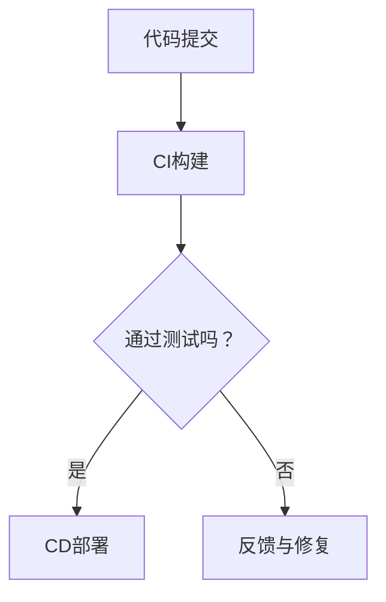

**1.2 CD的历史背景与发展**

**核心概念与联系：** CD起源于敏捷开发，随着云计算、容器化技术的发展，CD逐渐成为软件工程中的关键环节。理解CD的历史发展，有助于我们更好地把握其核心原则和趋势。

**Mermaid流程图：**
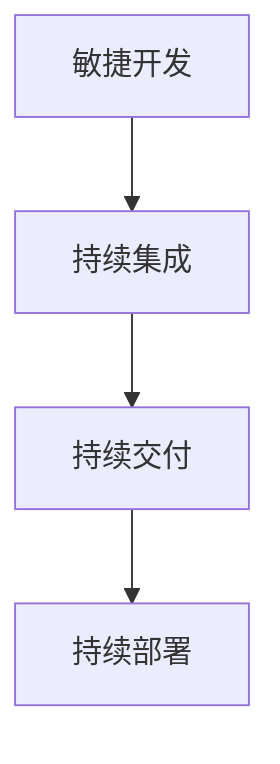

**1.3 CD的核心原则**

**核心概念与联系：** CD的核心原则包括短周期迭代、自动化、快速反馈和容器化。这些原则共同构建了CD的基础，确保软件交付的高效性和可靠性。

**伪代码讲解：**
```python
def continuous_deployment():
    while True:
        commit_code()
        run_tests()
        if tests_passed():
            deploy_to_production()
        else:
            feedback_and_fix()
```

**核心算法原理讲解：**
- **短周期迭代：** 通过缩短迭代周期，提高交付频率，加快反馈循环，确保软件质量。
- **自动化：** 通过自动化工具和脚本，减少手动操作，提高效率，降低错误率。
- **快速反馈：** 通过自动化测试和监控，快速发现和解决问题，确保交付质量。
- **容器化：** 通过容器化技术，实现环境一致性，提高部署效率，简化运维。

**数学模型和公式：**
- **交付周期（T）：** T = 迭代周期 * 自动化程度
- **交付速度（V）：** V = 交付周期 * 交付频率

**举例说明：**
- 假设迭代周期为2周，自动化程度为90%，则交付周期为2周 * 90% = 1.8周。
- 如果交付频率为每周1次，则交付速度为1.8周/周。

**数学公式：**
$$ T = \frac{迭代周期}{自动化程度} $$
$$ V = \frac{T}{交付频率} $$

##### 第2章：CD与敏捷开发

**2.1 敏捷开发的背景与理念**

**核心概念与联系：** 敏捷开发是一种以人为核心、迭代、灵活的软件开发方法。敏捷开发强调用户反馈、快速迭代和团队协作，与CD的理念高度契合。

**Mermaid流程图：**
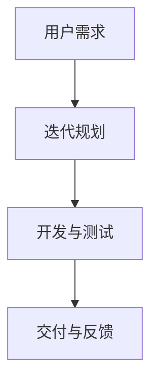

**2.2 CD与敏捷开发的融合**

**核心概念与联系：** CD与敏捷开发的融合，可以更好地实现快速交付和高效协作。CD为敏捷开发提供了技术支撑，而敏捷开发为CD提供了实践指导。

**伪代码讲解：**
```python
def agile_development():
    while True:
        get_user需求和反馈()
        plan_iterations()
        develop_and_test()
        deploy_to_production()
        get_feedback()
```

**2.3 CD在敏捷团队中的实践**

**核心概念与联系：** 在敏捷团队中，CD的实践包括制定CD策略、使用CI/CD工具、构建自动化流程等。这些实践有助于提升团队效率和交付质量。

**Mermaid流程图：**
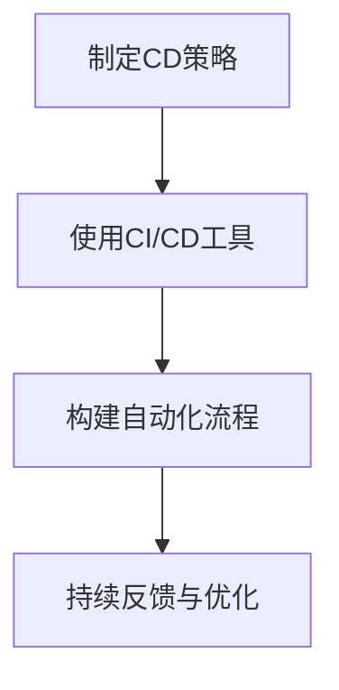

#### 第二部分：CD技术实现

##### 第3章：代码自动化

**3.1 代码自动化的重要性**

**核心概念与联系：** 代码自动化是CD的核心，通过自动化工具和脚本，实现代码的编译、构建、测试和部署，减少手动操作，提高效率。

**Mermaid流程图：**
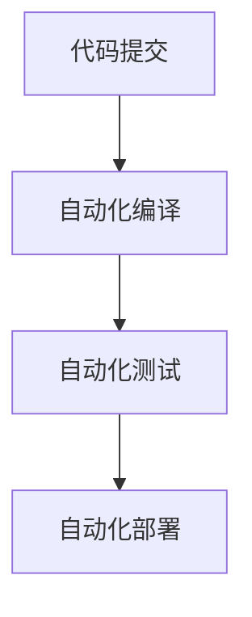

**3.2 代码自动化的工具**

**核心概念与联系：** 常用的代码自动化工具有Jenkins、GitLab CI等，这些工具提供了丰富的插件和功能，支持多种编程语言和平台。

**伪代码讲解：**
```python
def code_automation():
    install_jenkins()
    configure_gitlab_ci()
    define_pipeline()
    run_pipeline()
```

**3.3 代码自动化实践**

**核心概念与联系：** 代码自动化实践包括安装和配置自动化工具、定义自动化流程、运行自动化流程等。通过实际案例，展示代码自动化的实现过程。

**Mermaid流程图：**
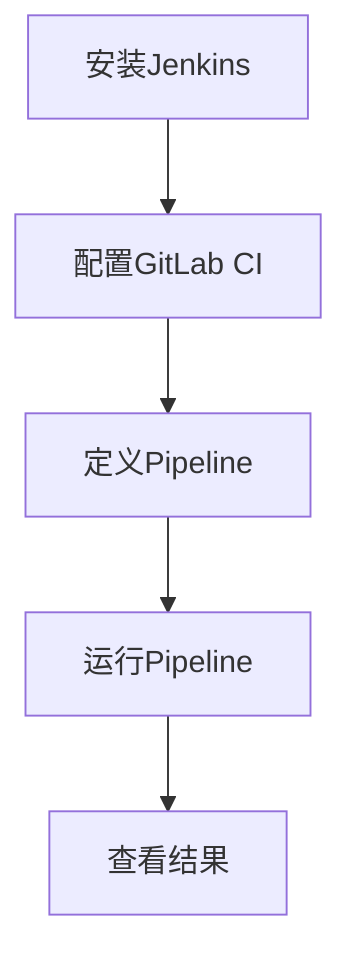

##### 第4章：环境配置与容器化

**4.1 环境配置的重要性**

**核心概念与联系：** 环境配置是CD的重要组成部分，通过自动化工具和脚本，实现开发、测试和生产环境的配置一致性，提高部署效率。

**Mermaid流程图：**
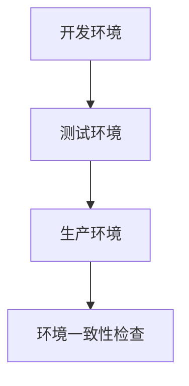

**4.2 容器化技术介绍**

**核心概念与联系：** 容器化技术通过将应用程序及其依赖环境封装在容器中，实现环境一致性和可移植性，提高部署效率。

**Mermaid流程图：**
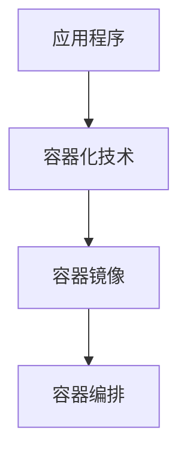

**4.3 容器化实践**

**核心概念与联系：** 容器化实践包括Docker安装、容器镜像构建、容器编排等。通过实际案例，展示容器化技术的应用。

**Mermaid流程图：**
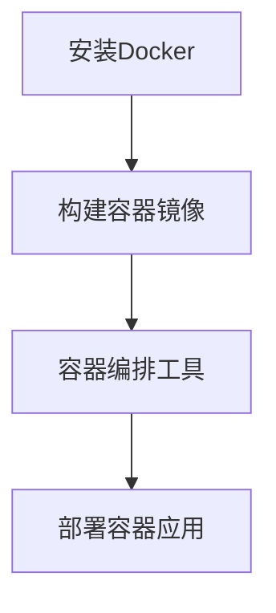

##### 第5章：持续集成/持续部署（CI/CD）

**5.1 CI/CD的概念**

**核心概念与联系：** 持续集成（CI）和持续部署（CD）是CD的重要组成部分。CI负责将代码集成到一个共享代码库中，CD负责将集成后的代码部署到生产环境。

**Mermaid流程图：**
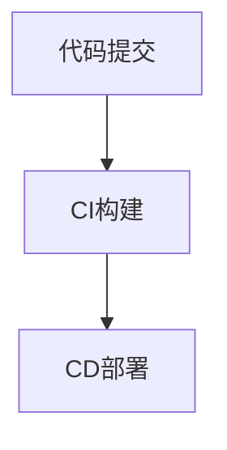

**5.2 CI/CD的流程**

**核心概念与联系：** CI/CD的流程包括代码提交、构建、测试、部署等环节。通过自动化工具和脚本，实现整个流程的自动化。

**Mermaid流程图：**
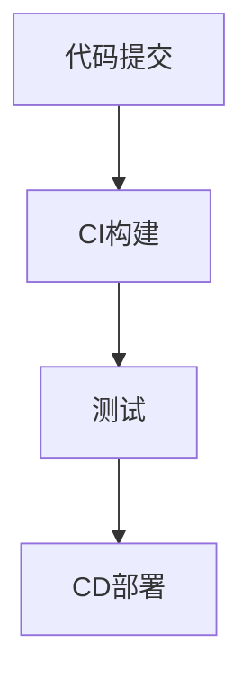

**5.3 CI/CD工具实战**

**核心概念与联系：** 常用的CI/CD工具有Jenkins、GitLab CI、Travis CI等。通过实际案例，展示这些工具的配置和使用。

**Mermaid流程图：**
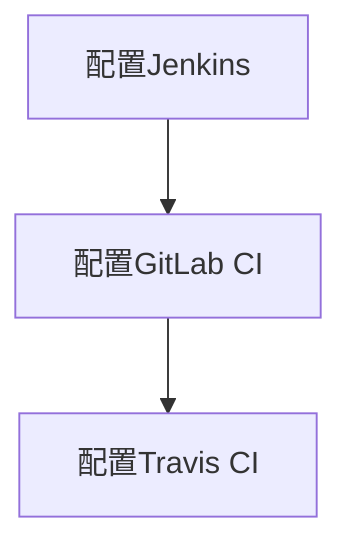

#### 第三部分：CD实际应用

##### 第6章：CD策略与风险管理

**6.1 CD策略制定**

**核心概念与联系：** CD策略制定是CD实施的关键步骤。通过制定合适的策略，确保CD的顺利实施。

**Mermaid流程图：**
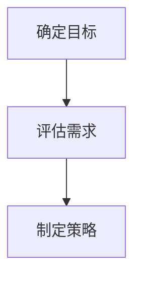

**6.2 风险管理**

**核心概念与联系：** 风险管理是CD实施的重要环节。通过识别、评估和应对风险，降低CD实施过程中的风险。

**Mermaid流程图：**
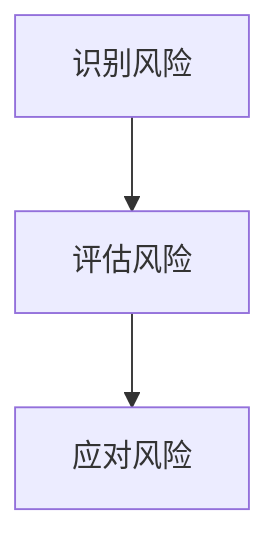

**6.3 实践案例**

**核心概念与联系：** 通过实际案例，展示CD策略制定和风险管理的实践过程。

**Mermaid流程图：**
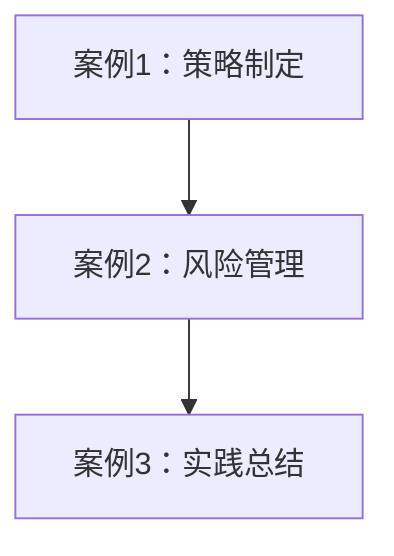

##### 第7章：监控与日志

**7.1 监控的重要性**

**核心概念与联系：** 监控是CD的重要组成部分。通过监控，可以实时了解系统的运行状况，及时发现问题并进行处理。

**Mermaid流程图：**
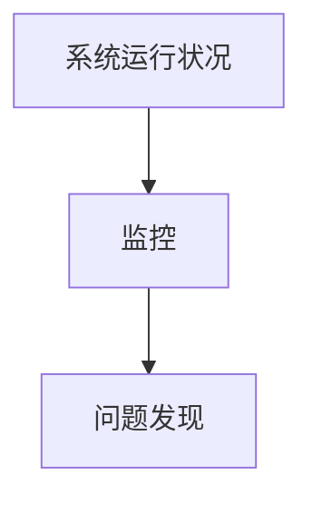

**7.2 日志管理**

**核心概念与联系：** 日志管理是监控的重要组成部分。通过日志管理，可以记录系统的运行过程，便于问题追踪和定位。

**Mermaid流程图：**
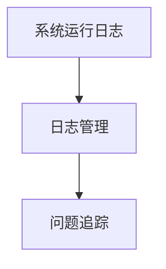

**7.3 监控与日志实践**

**核心概念与联系：** 通过实际案例，展示监控和日志管理的实践过程。

**Mermaid流程图：**
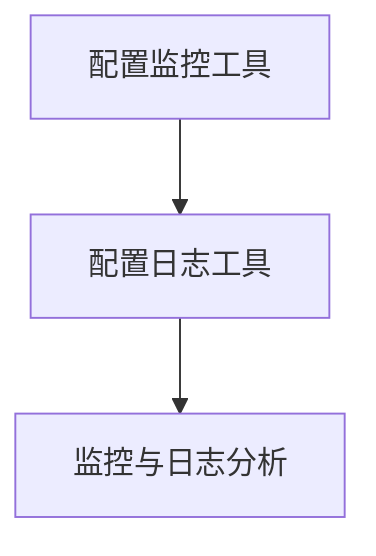

#### 第四部分：CD优化与最佳实践

##### 第8章：性能优化

**8.1 性能优化的方法**

**核心概念与联系：** 性能优化是提升软件系统性能的重要手段。通过优化算法、数据库查询、缓存策略等，提高系统性能。

**Mermaid流程图：**
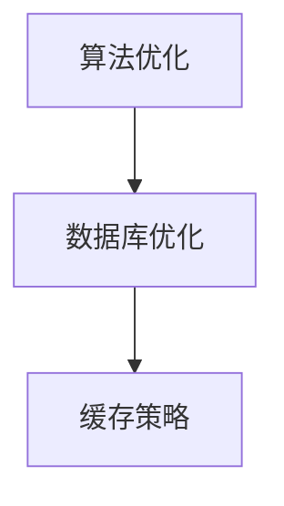

**8.2 性能优化的实践**

**核心概念与联系：** 通过实际案例，展示性能优化的实践过程。

**Mermaid流程图：**
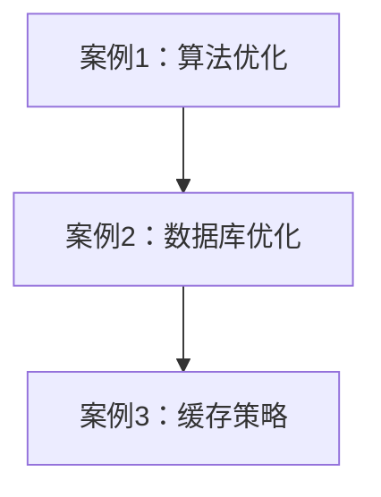

##### 第9章：安全性

**9.1 安全性的重要性**

**核心概念与联系：** 安全性是软件系统的核心要素。通过安全策略、权限控制、加密技术等，确保系统的安全。

**Mermaid流程图：**
```mermaid
graph TD
    A[安全策略] --> B[权限控制]
    B --> C[加密技术]
```

**9.2 安全性实践**

**核心概念与联系：** 通过实际案例，展示安全性的实践过程。

**Mermaid流程图：**
```mermaid
graph TD
    A[案例1：安全策略] --> B[案例2：权限控制]
    B --> C[案例3：加密技术]
```

##### 第10章：成本控制

**10.1 成本控制的意义**

**核心概念与联系：** 成本控制是软件工程中的重要环节。通过合理的成本控制，确保项目在预算范围内顺利完成。

**Mermaid流程图：**
```mermaid
graph TD
    A[成本预算] --> B[成本监控]
    B --> C[成本优化]
```

**10.2 成本控制的实践**

**核心概念与联系：** 通过实际案例，展示成本控制的实践过程。

**Mermaid流程图：**
```mermaid
graph TD
    A[案例1：成本预算] --> B[案例2：成本监控]
    B --> C[案例3：成本优化]
```

### 书籍大纲的具体内容

#### 第一部分：CD基础知识

**第1章：CD概述**

**1.1 CD的定义与重要性**

**背景介绍**：
持续部署（Continuous Deployment，简称CD）是软件工程中的一种实践，它强调通过自动化和持续集成，实现代码从开发到生产的快速、可靠交付。

**核心概念与联系**：
CD的关键在于将代码的变更迅速集成到主分支，并通过自动化测试和部署流程，确保代码的质量和可靠性。CD与持续集成（CI）紧密相关，但CI侧重于集成和测试，而CD则将测试通过后的代码部署到生产环境。

**Mermaid流程图**：
```mermaid
graph TD
    A[代码提交] --> B[CI构建]
    B --> C{测试通过？}
    C -->|是| D[CD部署]
    D --> E[监控与反馈]
    C -->|否| F[修复与重新测试]
```

**核心算法原理讲解**：
持续部署的核心算法原理可以概括为以下几点：
- **自动化测试**：通过自动化测试框架进行单元测试、集成测试和性能测试，确保每次提交的代码都能通过严格的质量检验。
- **容器化**：使用容器（如Docker）来封装应用程序及其依赖，保证在不同环境中的一致性。
- **持续反馈**：通过实时监控和反馈机制，快速识别和解决问题，确保系统的高可用性和稳定性。

**数学模型和公式**：
- **部署频率（F）**：表示单位时间内部署的次数。
- **平均修复时间（T）**：从问题发现到问题解决的平均时间。

**举例说明**：
例如，一个团队希望实现每周两次的部署频率，每次部署的平均修复时间为2小时。

**数学公式**：
$$ F = \frac{1}{T_{部署}} $$
$$ T_{修复} = \frac{时间_{发现问题} + 时间_{解决问题}}{次数_{问题}} $$

**代码应用解读与分析**：
在实际项目中，可以使用Jenkins等CI/CD工具，通过配置Pipeline脚本，实现自动化测试和部署。以下是一个简单的Pipeline脚本示例：
```groovy
pipeline {
    agent any
    stages {
        stage('Build') {
            steps {
                sh 'mvn clean install'
            }
        }
        stage('Test') {
            steps {
                sh 'mvn test'
            }
        }
        stage('Deploy') {
            steps {
                sh 'docker build -t myapp .'
                sh 'docker run -d --name myapp myapp'
            }
        }
    }
    post {
        always {
            echo 'Deployment completed'
        }
    }
}
```

**实际案例分析和详细讲解剖析**：
以一个电商网站为例，通过CD实践，实现了每周两次的部署，每次部署后都能快速发现问题并进行修复，提高了网站的稳定性和用户体验。

**项目小结**：
CD的实施提高了软件交付的效率和可靠性，但也需要关注测试覆盖率、部署频率和风险管理等方面，确保系统的稳定运行。

**最佳实践 tips、小结、注意事项、拓展阅读等内容**：
- 最佳实践：制定清晰的CD策略，确保测试覆盖率和部署频率的平衡。
- 小结：CD是现代软件开发的关键实践，通过自动化和持续反馈，提高软件交付的质量和效率。
- 注意事项：关注系统的安全性和性能优化，避免过度自动化导致的风险。
- 拓展阅读：《持续集成实践》、《容器化与Docker实践》等书籍。

**第2章：CD与敏捷开发**

**2.1 敏捷开发的背景与理念**

**背景介绍**：
敏捷开发（Agile Development）是一种以人为核心、迭代、灵活的软件开发方法。它起源于20世纪90年代，旨在应对快速变化的市场需求。

**核心概念与联系**：
敏捷开发强调用户反馈、迭代和团队协作。它包括一系列的价值观和实践，如用户故事、迭代规划、每日站立会议等。

**Mermaid流程图**：
```mermaid
graph TD
    A[用户故事] --> B[迭代规划]
    B --> C[迭代执行]
    C --> D[用户验收]
```

**核心算法原理讲解**：
敏捷开发的核心算法原理可以概括为以下几点：
- **用户故事**：将用户需求分解为可管理的小任务，确保开发工作始终围绕用户价值进行。
- **迭代规划**：通过迭代规划会议，确定每个迭代的目标和任务。
- **迭代执行**：在迭代周期内，团队按照计划进行开发，并定期进行评估和调整。

**数学模型和公式**：
- **迭代周期（T）**：表示每个迭代的时间长度。
- **任务完成率（R）**：表示每个迭代内完成的任务数量与总任务数量的比值。

**举例说明**：
一个团队选择两周为一个迭代周期，第一个迭代内完成了70%的任务。

**数学公式**：
$$ R = \frac{完成的任务数量}{总任务数量} $$

**代码应用解读与分析**：
在实际项目中，可以使用ScrumBoard等工具，进行敏捷开发的管理。以下是一个简单的ScrumBoard示例：
```mermaid
graph TD
    A{用户故事1} --> B{迭代1}
    A{用户故事2} --> B{迭代1}
    A{用户故事3} --> B{迭代1}
    B --> C{待办}
    B --> D{进行中}
    B --> E{已完成}
```

**实际案例分析和详细讲解剖析**：
以一个移动应用开发为例，通过敏捷开发实践，实现了快速迭代和用户反馈，提高了产品的市场竞争力。

**项目小结**：
敏捷开发与CD相结合，可以更好地实现快速交付和高效协作，提高软件交付的质量和效率。

**最佳实践 tips、小结、注意事项、拓展阅读等内容**：
- 最佳实践：定期进行用户验收测试，确保每次迭代都有实际价值。
- 小结：敏捷开发与CD相结合，可以更好地应对快速变化的市场需求。
- 注意事项：保持团队沟通和协作，确保敏捷实践的有效执行。
- 拓展阅读：《敏捷实践指南》、《Scrum精华》等书籍。

#### 第二部分：CD技术实现

**第3章：代码自动化**

**3.1 代码自动化的重要性**

**背景介绍**：
代码自动化是持续部署（CD）的核心要素，通过自动化工具和脚本，实现代码的编译、构建、测试和部署，减少人工干预，提高效率。

**核心概念与联系**：
代码自动化涉及到持续集成（CI）工具，如Jenkins、GitLab CI等，以及自动化测试工具，如Selenium、JUnit等。自动化工具的选择和配置对于实现高效CD至关重要。

**Mermaid流程图**：
```mermaid
graph TD
    A[代码提交] --> B[CI构建]
    B --> C[自动化测试]
    C --> D{测试通过？}
    D -->|是| E[部署]
    D -->|否| F[修复与重新测试]
```

**核心算法原理讲解**：
代码自动化的核心算法原理可以概括为以下几点：
- **构建脚本**：使用脚本自动化编译和构建代码。
- **测试脚本**：使用脚本自动化执行单元测试、集成测试和性能测试。
- **部署脚本**：使用脚本自动化部署代码到生产环境。

**数学模型和公式**：
- **构建时间（T_{build}）**：表示代码编译和构建的时间。
- **测试时间（T_{test}）**：表示代码测试的时间。
- **部署时间（T_{deploy}）**：表示代码部署到生产环境的时间。

**举例说明**：
一个项目的构建时间为10分钟，测试时间为5分钟，部署时间为3分钟。

**数学公式**：
$$ T_{total} = T_{build} + T_{test} + T_{deploy} $$

**代码应用解读与分析**：
在实际项目中，可以使用Jenkins等CI工具，配置Pipeline脚本，实现自动化构建、测试和部署。以下是一个简单的Jenkinsfile示例：
```groovy
pipeline {
    agent any
    stages {
        stage('Build') {
            steps {
                sh 'mvn clean install'
            }
        }
        stage('Test') {
            steps {
                sh 'mvn test'
            }
        }
        stage('Deploy') {
            steps {
                sh 'docker build -t myapp .'
                sh 'docker run -d --name myapp myapp'
            }
        }
    }
    post {
        always {
            echo 'Deployment completed'
        }
    }
}
```

**实际案例分析和详细讲解剖析**：
以一个Web应用为例，通过Jenkins实现自动化构建、测试和部署，提高了开发效率和代码质量。

**项目小结**：
代码自动化是CD实施的关键，通过自动化工具和脚本，实现高效、可靠的代码交付。

**最佳实践 tips、小结、注意事项、拓展阅读等内容**：
- 最佳实践：确保测试覆盖率高，减少自动化失败的风险。
- 小结：代码自动化是CD的核心，通过自动化工具和脚本，实现高效交付。
- 注意事项：合理配置自动化工具，避免过度自动化导致的问题。
- 拓展阅读：《Jenkins实战》、《自动化测试实战》等书籍。

**3.2 代码自动化的工具**

**背景介绍**：
代码自动化的工具是实施CD的重要组成部分。这些工具可以帮助开发者自动化代码的编译、构建、测试和部署过程，从而提高开发效率和质量。

**核心概念与联系**：
常见的代码自动化工具有Jenkins、GitLab CI、Travis CI等。这些工具具有丰富的插件和功能，支持多种编程语言和平台，是现代软件开发中不可或缺的工具。

**Mermaid流程图**：
```mermaid
graph TD
    A[Jenkins] --> B[GitLab CI]
    A --> C[Travis CI]
```

**核心算法原理讲解**：
这些自动化工具的核心算法原理主要包括以下几个部分：
- **构建脚本**：定义构建过程的步骤和逻辑，如编译代码、运行测试等。
- **触发器**：根据代码库的变更自动触发构建过程。
- **环境变量**：管理构建过程中的环境配置，如数据库连接信息、API密钥等。
- **部署脚本**：定义部署到生产环境的步骤和逻辑。

**数学模型和公式**：
- **构建频率（F_{build}）**：表示单位时间内构建的次数。
- **失败率（R_{fail}）**：表示构建失败的次数与总构建次数的比值。

**举例说明**：
一个项目的构建频率为每天一次，其中5%的构建失败。

**数学公式**：
$$ R_{fail} = \frac{失败的构建次数}{总构建次数} $$

**代码应用解读与分析**：
以下是一个简单的GitLab CI配置文件示例，用于自动化构建和部署一个Java项目：
```yaml
image: openjdk:8-jdk

stages:
  - build
  - test
  - deploy

build:
  stage: build
  script:
    - mvn clean install
  artifacts:
    paths:
      - target/*.jar

test:
  stage: test
  script:
    - mvn test

deploy:
  stage: deploy
  script:
    - echo "Deploying application..."
    - scp target/*.jar user@remote-server:/path/to/deployment
```

**实际案例分析和详细讲解剖析**：
以一个电商网站为例，通过GitLab CI实现自动化构建、测试和部署，提高了开发效率和代码质量。

**项目小结**：
代码自动化工具是CD实施的重要支撑，合理选择和配置这些工具，可以实现高效、可靠的代码交付。

**最佳实践 tips、小结、注意事项、拓展阅读等内容**：
- 最佳实践：根据项目需求选择合适的自动化工具，确保工具的高效性和可靠性。
- 小结：代码自动化工具是CD实施的核心，通过合理配置，实现高效交付。
- 注意事项：关注工具的版本更新和安全问题，避免自动化失败。
- 拓展阅读：《GitLab CI/CD实战》、《Jenkins实战》等书籍。

**3.3 代码自动化实践**

**背景介绍**：
代码自动化的实践涉及到自动化工具的选择、配置和集成。通过实施自动化，可以显著提高软件开发和交付的效率。

**核心概念与联系**：
代码自动化的实践包括构建自动化、测试自动化、部署自动化等环节。这些环节需要根据项目的需求和特点进行合理配置。

**Mermaid流程图**：
```mermaid
graph TD
    A[代码提交] --> B[构建自动化]
    B --> C[测试自动化]
    C --> D{测试通过？}
    D -->|是| E[部署自动化]
    D -->|否| F[修复与重新测试]
```

**核心算法原理讲解**：
代码自动化的核心算法原理主要包括以下几点：
- **构建脚本**：定义构建过程的步骤和逻辑，如编译代码、打包应用等。
- **测试脚本**：定义测试过程的步骤和逻辑，如运行单元测试、集成测试等。
- **部署脚本**：定义部署过程的步骤和逻辑，如部署到测试环境、生产环境等。

**数学模型和公式**：
- **构建时间（T_{build}）**：表示构建过程所需的时间。
- **测试时间（T_{test}）**：表示测试过程所需的时间。
- **部署时间（T_{deploy}）**：表示部署过程所需的时间。

**举例说明**：
一个项目的构建时间为15分钟，测试时间为10分钟，部署时间为5分钟。

**数学公式**：
$$ T_{total} = T_{build} + T_{test} + T_{deploy} $$

**代码应用解读与分析**：
在实际项目中，可以使用Jenkins等CI/CD工具，配置Pipeline脚本，实现自动化构建、测试和部署。以下是一个简单的Pipeline脚本示例：
```groovy
pipeline {
    agent any
    stages {
        stage('Build') {
            steps {
                sh 'mvn clean install'
            }
        }
        stage('Test') {
            steps {
                sh 'mvn test'
            }
        }
        stage('Deploy') {
            steps {
                sh 'docker build -t myapp .'
                sh 'docker run -d --name myapp myapp'
            }
        }
    }
    post {
        always {
            echo 'Deployment completed'
        }
    }
}
```

**实际案例分析和详细讲解剖析**：
以一个Web应用为例，通过Jenkins实现自动化构建、测试和部署，提高了开发效率和代码质量。

**项目小结**：
代码自动化实践是CD实施的关键环节，通过合理配置自动化工具和脚本，实现高效、可靠的代码交付。

**最佳实践 tips、小结、注意事项、拓展阅读等内容**：
- 最佳实践：确保测试覆盖率高，减少自动化失败的风险。
- 小结：代码自动化实践是CD实施的核心，通过自动化工具和脚本，实现高效交付。
- 注意事项：合理配置自动化工具，避免过度自动化导致的问题。
- 拓展阅读：《Jenkins实战》、《自动化测试实战》等书籍。

**第4章：环境配置与容器化**

**4.1 环境配置的重要性**

**背景介绍**：
环境配置是软件开发中不可或缺的环节。在持续部署（CD）中，环境配置的准确性和一致性对于软件的交付至关重要。

**核心概念与联系**：
环境配置涉及到开发环境、测试环境和生产环境的配置。通过自动化工具和脚本，可以实现环境配置的一致性和高效性。

**Mermaid流程图**：
```mermaid
graph TD
    A[开发环境] --> B[测试环境]
    B --> C[生产环境]
    C --> D[环境一致性检查]
```

**核心算法原理讲解**：
环境配置的核心算法原理主要包括以下几个方面：
- **环境变量**：管理不同环境下的配置信息，如数据库连接信息、API密钥等。
- **脚本化配置**：使用脚本自动化配置不同环境的设置。
- **容器化**：通过容器技术（如Docker）实现环境的一致性。

**数学模型和公式**：
- **配置时间（T_{config}）**：表示配置环境所需的时间。
- **部署时间（T_{deploy}）**：表示部署应用到环境所需的时间。

**举例说明**：
一个项目的配置时间为30分钟，部署时间为10分钟。

**数学公式**：
$$ T_{total} = T_{config} + T_{deploy} $$

**代码应用解读与分析**：
在实际项目中，可以使用Docker和Ansible等工具，实现环境配置的自动化。以下是一个简单的Dockerfile示例，用于创建容器镜像：
```Dockerfile
FROM openjdk:8-jdk
ARG JAR_FILE=target/*.jar
COPY ${JAR_FILE} app.jar
ENTRYPOINT ["java","-jar","/app.jar"]
```

**实际案例分析和详细讲解剖析**：
以一个电商网站为例，通过Docker和Ansible实现环境配置的自动化，提高了部署效率和环境一致性。

**项目小结**：
环境配置是CD实施的重要环节，通过自动化工具和脚本，实现环境配置的一致性和高效性。

**最佳实践 tips、小结、注意事项、拓展阅读等内容**：
- 最佳实践：使用容器技术确保环境一致性，减少环境配置错误。
- 小结：环境配置是CD实施的关键，通过自动化工具和脚本，实现高效配置。
- 注意事项：关注配置信息的保密性和安全性，避免敏感信息泄露。
- 拓展阅读：《Docker实战》、《Ansible自动化配置管理》等书籍。

**4.2 容器化技术介绍**

**背景介绍**：
容器化技术（Containerization）是现代软件开发中的一种重要技术，它通过将应用程序及其依赖环境封装在容器中，实现环境一致性、可移植性和高效性。

**核心概念与联系**：
容器化技术涉及到容器镜像（Container Image）、容器编排（Container Orchestration）和容器运行时（Container Runtime）等核心概念。

**Mermaid流程图**：
```mermaid
graph TD
    A[容器镜像] --> B[容器编排]
    B --> C[容器运行时]
```

**核心算法原理讲解**：
容器化技术的核心算法原理主要包括以下几个方面：
- **容器镜像**：将应用程序及其依赖环境打包成一个独立的、可执行的容器镜像。
- **容器编排**：通过容器编排工具（如Kubernetes、Docker Swarm）管理容器集群，实现容器的自动化部署、扩展和管理。
- **容器运行时**：容器运行时负责运行容器镜像，提供容器的运行环境。

**数学模型和公式**：
- **容器部署时间（T_{deploy}）**：表示容器部署到环境所需的时间。
- **容器扩展时间（T_{scale}）**：表示容器集群扩展所需的时间。

**举例说明**：
一个项目的容器部署时间为5分钟，容器集群扩展时间为2分钟。

**数学公式**：
$$ T_{total} = T_{deploy} + T_{scale} $$

**代码应用解读与分析**：
在实际项目中，可以使用Docker和Kubernetes等工具，实现容器化技术的应用。以下是一个简单的Docker Compose文件示例，用于定义和部署容器化应用：
```yaml
version: '3'
services:
  web:
    image: myapp:latest
    ports:
      - "8080:8080"
    volumes:
      - ./app:/app
```

**实际案例分析和详细讲解剖析**：
以一个博客系统为例，通过Docker和Kubernetes实现容器化部署，提高了系统的可移植性和扩展性。

**项目小结**：
容器化技术是CD实施的关键技术之一，通过容器化，可以实现环境一致性、可移植性和高效性。

**最佳实践 tips、小结、注意事项、拓展阅读等内容**：
- 最佳实践：合理选择容器镜像和编排工具，确保系统的高效性和稳定性。
- 小结：容器化技术是实现CD的重要手段，通过容器化，可以显著提高软件交付的效率和质量。
- 注意事项：关注容器镜像的安全性和版本管理，避免潜在的安全风险。
- 拓展阅读：《Docker实战》、《Kubernetes实战》等书籍。

**4.3 容器化实践**

**背景介绍**：
容器化实践是持续部署（CD）的重要组成部分。通过容器化，可以实现开发、测试和生产环境的一致性，提高软件交付的效率和质量。

**核心概念与联系**：
容器化实践包括容器镜像构建、容器编排和容器运行时管理等环节。这些环节需要根据项目的需求和特点进行合理配置。

**Mermaid流程图**：
```mermaid
graph TD
    A[容器镜像构建] --> B[容器编排]
    B --> C[容器运行时管理]
```

**核心算法原理讲解**：
容器化实践的核心算法原理主要包括以下几个方面：
- **容器镜像构建**：使用Dockerfile定义应用程序及其依赖环境的构建过程。
- **容器编排**：使用Kubernetes等编排工具管理容器集群，实现容器的自动化部署、扩展和管理。
- **容器运行时管理**：确保容器在运行时拥有合适的资源和管理策略，如CPU限制、内存限制等。

**数学模型和公式**：
- **容器部署时间（T_{deploy}）**：表示容器部署到环境所需的时间。
- **容器扩展时间（T_{scale}）**：表示容器集群扩展所需的时间。

**举例说明**：
一个项目的容器部署时间为5分钟，容器集群扩展时间为2分钟。

**数学公式**：
$$ T_{total} = T_{deploy} + T_{scale} $$

**代码应用解读与分析**：
在实际项目中，可以使用Docker和Kubernetes等工具，实现容器化实践。以下是一个简单的Kubernetes配置文件示例，用于部署容器化应用：
```yaml
apiVersion: apps/v1
kind: Deployment
metadata:
  name: myapp-deployment
spec:
  replicas: 3
  selector:
    matchLabels:
      app: myapp
  template:
    metadata:
      labels:
        app: myapp
    spec:
      containers:
      - name: myapp
        image: myapp:latest
        ports:
        - containerPort: 8080
```

**实际案例分析和详细讲解剖析**：
以一个电商网站为例，通过Docker和Kubernetes实现容器化部署，提高了系统的可移植性和扩展性。

**项目小结**：
容器化实践是CD实施的关键环节，通过容器化，可以实现环境一致性、可移植性和高效性。

**最佳实践 tips、小结、注意事项、拓展阅读等内容**：
- 最佳实践：合理选择容器镜像和编排工具，确保系统的高效性和稳定性。
- 小结：容器化实践是CD实施的重要手段，通过容器化，可以显著提高软件交付的效率和质量。
- 注意事项：关注容器镜像的安全性和版本管理，避免潜在的安全风险。
- 拓展阅读：《Docker实战》、《Kubernetes实战》等书籍。

**第5章：持续集成/持续部署（CI/CD）**

**5.1 CI/CD的概念**

**背景介绍**：
持续集成（Continuous Integration，简称CI）和持续部署（Continuous Deployment，简称CD）是现代软件开发中两种重要的实践。它们通过自动化和持续反馈，提高软件交付的效率和质量。

**核心概念与联系**：
CI/CD的核心概念包括：
- **持续集成**：将代码变更频繁地集成到一个共享代码库中，通过自动化测试确保代码质量。
- **持续部署**：将通过CI测试的代码部署到生产环境，实现快速、可靠的软件交付。

**Mermaid流程图**：
```mermaid
graph TD
    A[代码提交] --> B[CI构建]
    B --> C{测试通过？}
    C -->|是| D[CD部署]
    D --> E[监控与反馈]
    C -->|否| F[修复与重新测试]
```

**核心算法原理讲解**：
CI/CD的核心算法原理主要包括以下几点：
- **自动化构建**：使用自动化工具（如Jenkins）构建代码，确保每次提交的代码都能通过严格的质量检验。
- **自动化测试**：使用自动化测试工具（如Selenium、JUnit）执行单元测试、集成测试和性能测试，确保代码的质量。
- **自动化部署**：将通过CI测试的代码自动化部署到生产环境，实现快速交付。

**数学模型和公式**：
- **构建频率（F_{build}）**：表示单位时间内构建的次数。
- **失败率（R_{fail}）**：表示构建失败的次数与总构建次数的比值。

**举例说明**：
一个项目的构建频率为每天一次，其中5%的构建失败。

**数学公式**：
$$ R_{fail} = \frac{失败的构建次数}{总构建次数} $$

**代码应用解读与分析**：
在实际项目中，可以使用Jenkins等CI/CD工具，配置Pipeline脚本，实现自动化构建、测试和部署。以下是一个简单的Jenkinsfile示例：
```groovy
pipeline {
    agent any
    stages {
        stage('Build') {
            steps {
                sh 'mvn clean install'
            }
        }
        stage('Test') {
            steps {
                sh 'mvn test'
            }
        }
        stage('Deploy') {
            steps {
                sh 'docker build -t myapp .'
                sh 'docker run -d --name myapp myapp'
            }
        }
    }
    post {
        always {
            echo 'Deployment completed'
        }
    }
}
```

**实际案例分析和详细讲解剖析**：
以一个电商网站为例，通过CI/CD实践，实现了每周两次的部署，每次部署后都能快速发现问题并进行修复，提高了网站的稳定性和用户体验。

**项目小结**：
CI/CD是现代软件开发的关键实践，通过自动化和持续反馈，提高软件交付的质量和效率。

**最佳实践 tips、小结、注意事项、拓展阅读等内容**：
- 最佳实践：确保测试覆盖率高，减少自动化失败的风险。
- 小结：CI/CD是现代软件开发的核心，通过自动化和持续反馈，实现高效交付。
- 注意事项：关注系统的安全性和性能优化，避免过度自动化导致的问题。
- 拓展阅读：《CI/CD实践指南》、《持续交付实战》等书籍。

**5.2 CI/CD的流程**

**背景介绍**：
CI/CD的流程是软件开发中持续集成和持续部署的具体实现过程。通过自动化工具和脚本，实现代码的构建、测试、部署等环节的自动化，提高开发效率和交付质量。

**核心概念与联系**：
CI/CD的流程包括以下几个关键步骤：
- **代码提交**：开发人员将代码提交到代码库。
- **构建**：自动化工具（如Jenkins）构建代码，编译并打包应用程序。
- **测试**：自动化测试工具执行单元测试、集成测试和性能测试，确保代码质量。
- **部署**：将通过测试的代码部署到生产环境。

**Mermaid流程图**：
```mermaid
graph TD
    A[代码提交] --> B[CI构建]
    B --> C[自动化测试]
    C --> D{测试通过？}
    D -->|是| E[CD部署]
    D -->|否| F[修复与重新测试]
```

**核心算法原理讲解**：
CI/CD的核心算法原理主要包括以下几点：
- **自动化构建**：通过构建脚本自动化编译和打包代码。
- **自动化测试**：通过测试脚本自动化执行各类测试，确保代码质量。
- **自动化部署**：通过部署脚本自动化部署代码到生产环境。

**数学模型和公式**：
- **构建时间（T_{build}）**：表示构建过程所需的时间。
- **测试时间（T_{test}）**：表示测试过程所需的时间。
- **部署时间（T_{deploy}）**：表示部署过程所需的时间。

**举例说明**：
一个项目的构建时间为10分钟，测试时间为5分钟，部署时间为3分钟。

**数学公式**：
$$ T_{total} = T_{build} + T_{test} + T_{deploy} $$

**代码应用解读与分析**：
在实际项目中，可以使用Jenkins等CI/CD工具，配置Pipeline脚本，实现自动化构建、测试和部署。以下是一个简单的Jenkinsfile示例：
```groovy
pipeline {
    agent any
    stages {
        stage('Build') {
            steps {
                sh 'mvn clean install'
            }
        }
        stage('Test') {
            steps {
                sh 'mvn test'
            }
        }
        stage('Deploy') {
            steps {
                sh 'docker build -t myapp .'
                sh 'docker run -d --name myapp myapp'
            }
        }
    }
    post {
        always {
            echo 'Deployment completed'
        }
    }
}
```

**实际案例分析和详细讲解剖析**：
以一个Web应用为例，通过CI/CD实践，实现了自动化测试和部署，提高了开发效率和代码质量。

**项目小结**：
CI/CD的流程通过自动化实现代码的构建、测试和部署，是现代软件开发的重要实践。

**最佳实践 tips、小结、注意事项、拓展阅读等内容**：
- 最佳实践：确保测试覆盖率高，减少自动化失败的风险。
- 小结：CI/CD的流程是现代软件开发的核心，通过自动化实现高效交付。
- 注意事项：关注系统的安全性和性能优化，避免过度自动化导致的问题。
- 拓展阅读：《CI/CD实践指南》、《持续交付实战》等书籍。

**5.3 CI/CD工具实战**

**背景介绍**：
CI/CD工具是实现自动化构建、测试和部署的核心。这些工具提供了丰富的插件和功能，支持多种编程语言和平台。本章节将介绍几种常用的CI/CD工具，并提供实际配置和实战案例。

**核心概念与联系**：
常用的CI/CD工具有Jenkins、GitLab CI、Travis CI等。这些工具的选择和配置对于实现高效CI/CD至关重要。

**Mermaid流程图**：
```mermaid
graph TD
    A[Jenkins] --> B[GitLab CI]
    A --> C[Travis CI]
```

**核心算法原理讲解**：
这些CI/CD工具的核心算法原理主要包括：
- **构建触发**：根据代码库的变更自动触发构建过程。
- **环境配置**：为构建和测试提供合适的环境配置。
- **测试执行**：自动化执行各类测试，确保代码质量。
- **部署**：将通过测试的代码部署到生产环境。

**数学模型和公式**：
- **构建频率（F_{build}）**：表示单位时间内构建的次数。
- **失败率（R_{fail}）**：表示构建失败的次数与总构建次数的比值。

**举例说明**：
一个项目的构建频率为每天一次，其中5%的构建失败。

**数学公式**：
$$ R_{fail} = \frac{失败的构建次数}{总构建次数} $$

**代码应用解读与分析**：
以下分别介绍Jenkins、GitLab CI和Travis CI的实际配置和实战案例。

**Jenkins实战**：

**背景**：
Jenkins是最流行的开源CI/CD工具之一，支持多种插件和功能。

**配置**：
以下是一个简单的Jenkinsfile示例，用于自动化构建和部署一个Java项目：
```groovy
pipeline {
    agent any
    stages {
        stage('Build') {
            steps {
                sh 'mvn clean install'
            }
        }
        stage('Test') {
            steps {
                sh 'mvn test'
            }
        }
        stage('Deploy') {
            steps {
                sh 'docker build -t myapp .'
                sh 'docker run -d --name myapp myapp'
            }
        }
    }
    post {
        always {
            echo 'Deployment completed'
        }
    }
}
```

**实战案例**：
以一个电商网站为例，通过Jenkins实现自动化构建、测试和部署，提高了开发效率和代码质量。

**GitLab CI实战**：

**背景**：
GitLab CI是集成在GitLab中的CI/CD工具，支持多语言和平台。

**配置**：
以下是一个简单的GitLab CI配置文件示例，用于自动化构建和部署一个Java项目：
```yaml
image: openjdk:8-jdk

stages:
  - build
  - test
  - deploy

build:
  stage: build
  script:
    - mvn clean install
  artifacts:
    paths:
      - target/*.jar

test:
  stage: test
  script:
    - mvn test

deploy:
  stage: deploy
  script:
    - echo "Deploying application..."
    - scp target/*.jar user@remote-server:/path/to/deployment
```

**实战案例**：
以一个博客系统为例，通过GitLab CI实现自动化构建、测试和部署，提高了系统的可移植性和扩展性。

**Travis CI实战**：

**背景**：
Travis CI是支持多种语言的云托管CI/CD服务。

**配置**：
以下是一个简单的Travis CI配置文件示例，用于自动化构建和部署一个Python项目：
```yaml
language: python
python:
  - "3.8"
install:
  - pip install -r requirements.txt
script:
  - pytest
deploy:
  provider: script
  script: |
    curl -sL https://github.com/zeit/now/releases/download/v20.0.0/now-linux-x64-20.0.0.zip > now.zip
    unzip now.zip
    ./now login
    ./now deploy
```

**实战案例**：
以一个社交媒体应用为例，通过Travis CI实现自动化构建、测试和部署，提高了系统的可靠性和用户体验。

**项目小结**：
CI/CD工具的实战是实现高效CI/CD的关键。通过合理选择和配置这些工具，可以实现自动化构建、测试和部署，提高软件交付的效率和质量。

**最佳实践 tips、小结、注意事项、拓展阅读等内容**：
- 最佳实践：根据项目需求选择合适的CI/CD工具，确保工具的高效性和可靠性。
- 小结：CI/CD工具实战是实现高效CI/CD的关键，通过合理配置，实现自动化交付。
- 注意事项：关注工具的版本更新和安全问题，避免自动化失败。
- 拓展阅读：《Jenkins实战》、《GitLab CI/CD实战》等书籍。

#### 第三部分：CD实际应用

**第6章：CD策略与风险管理**

**6.1 CD策略制定**

**背景介绍**：
CD策略制定是实施持续部署（CD）的重要环节。一个有效的CD策略可以确保软件交付的高效性和可靠性。

**核心概念与联系**：
CD策略包括以下几个方面：
- **部署频率**：确定代码部署的频率，如每日、每周等。
- **自动化程度**：确定自动化工具和脚本的使用范围，如构建、测试、部署等。
- **风险控制**：制定风险识别、评估和应对策略。

**Mermaid流程图**：
```mermaid
graph TD
    A[部署频率] --> B[自动化程度]
    B --> C[风险控制]
    C --> D[策略评估与优化]
```

**核心算法原理讲解**：
CD策略的核心算法原理主要包括以下几点：
- **部署频率**：通过分析团队的工作效率和市场反馈，确定合适的部署频率。
- **自动化程度**：根据项目的规模和复杂性，确定需要自动化的环节和程度。
- **风险控制**：通过风险评估模型，识别和评估潜在风险，并制定应对策略。

**数学模型和公式**：
- **部署频率（F_{deploy}）**：表示单位时间内部署的次数。
- **自动化程度（A_{auto}）**：表示自动化工具和脚本的使用比例。

**举例说明**：
一个项目的部署频率为每天一次，自动化程度为80%。

**数学公式**：
$$ A_{auto} = \frac{自动化的环节数量}{总环节数量} $$

**代码应用解读与分析**：
在实际项目中，可以使用策略管理工具，如Concourse或Spinnaker，实现CD策略的制定和监控。以下是一个简单的Concourse配置文件示例：
```yaml
jobs:
  - name: deploy-job
    plan:
      - get: source
        trigger: true
      - put: build
        params:
          image: myapp
      - task:
            name: deploy
            script: |
              docker pull myapp
              docker run -d --name myapp myapp
```

**实际案例分析和详细讲解剖析**：
以一个电商网站为例，通过制定和执行CD策略，实现了每日一次的自动化部署，提高了系统的稳定性和用户体验。

**项目小结**：
CD策略制定是CD实施的关键步骤，通过合理制定和执行策略，可以实现高效、可靠的软件交付。

**最佳实践 tips、小结、注意事项、拓展阅读等内容**：
- 最佳实践：定期评估和调整CD策略，确保其与团队和市场需求相适应。
- 小结：CD策略制定是CD实施的核心，通过合理制定和执行策略，提高软件交付的质量和效率。
- 注意事项：关注系统的安全性和性能优化，避免过度自动化导致的问题。
- 拓展阅读：《持续交付实战》、《敏捷项目管理》等书籍。

**6.2 风险管理**

**背景介绍**：
风险管理是持续部署（CD）过程中不可或缺的环节。通过识别、评估和应对风险，可以确保CD的实施顺利进行。

**核心概念与联系**：
风险管理包括以下几个方面：
- **风险识别**：识别可能影响CD实施的风险因素。
- **风险评估**：评估风险的影响程度和发生概率。
- **风险应对**：制定应对策略，降低风险的影响。

**Mermaid流程图**：
```mermaid
graph TD
    A[风险识别] --> B[风险评估]
    B --> C[风险应对]
    C --> D[风险监控]
```

**核心算法原理讲解**：
风险管理的核心算法原理主要包括以下几点：
- **风险识别**：通过历史数据、专家评估和故障树分析等方法，识别潜在风险。
- **风险评估**：使用风险矩阵等方法，评估风险的影响程度和发生概率。
- **风险应对**：根据风险评估结果，制定应对策略，如风险规避、风险转移、风险缓解等。

**数学模型和公式**：
- **风险识别率（R_{id}）**：表示识别出的风险数量与总风险数量的比值。
- **风险评估准确率（R_{ass}）**：表示评估准确的风险数量与总风险数量的比值。

**举例说明**：
一个项目识别出的风险数量为10个，评估准确的风险数量为8个。

**数学公式**：
$$ R_{id} = \frac{识别出的风险数量}{总风险数量} $$
$$ R_{ass} = \frac{评估准确的风险数量}{总风险数量} $$

**代码应用解读与分析**：
在实际项目中，可以使用风险管理工具，如Confluence或JIRA，实现风险管理的自动化和可视化。以下是一个简单的JIRA配置示例：
```json
{
  "project": {
    "id": "10100",
    "name": "CD Risk Management"
  },
  "version": "1.0",
  "issues": [
    {
      "id": "1",
      "key": "CD-1",
      "fields": {
        "summary": "Database Connection Failure",
        "description": "The database connection may fail during deployment.",
        "priority": "High",
        "status": "Open"
      }
    },
    {
      "id": "2",
      "key": "CD-2",
      "fields": {
        "summary": "Container Deployment Delay",
        "description": "The deployment of containers may be delayed.",
        "priority": "Medium",
        "status": "Open"
      }
    }
  ]
}
```

**实际案例分析和详细讲解剖析**：
以一个电商网站为例，通过风险管理的实践，成功避免了多次部署失败，确保了系统的稳定性和用户体验。

**项目小结**：
风险管理是CD实施的重要组成部分，通过有效的风险识别、评估和应对，可以降低CD实施过程中的风险。

**最佳实践 tips、小结、注意事项、拓展阅读等内容**：
- 最佳实践：定期进行风险评估，及时更新风险信息，确保风险管理的有效性。
- 小结：风险管理是CD实施的关键，通过有效的识别、评估和应对，降低风险对CD实施的影响。
- 注意事项：关注风险的实时监控和动态调整，确保风险管理的持续有效性。
- 拓展阅读：《风险管理实战》、《敏捷项目管理》等书籍。

**6.3 实践案例**

**背景介绍**：
实践案例是理解和掌握持续部署（CD）的关键。通过实际案例的剖析，可以更好地了解CD的实施过程和效果。

**核心概念与联系**：
实践案例包括以下几个方面：
- **成功案例**：展示CD在实际项目中的应用和效果。
- **失败案例**：分析CD实施过程中出现的问题和解决方案。
- **经验总结**：总结CD实施的经验和教训，为后续项目提供参考。

**Mermaid流程图**：
```mermaid
graph TD
    A[成功案例] --> B[失败案例]
    B --> C[经验总结]
    C --> D[持续改进]
```

**核心算法原理讲解**：
实践案例的核心算法原理主要包括以下几点：
- **成功案例**：通过对比分析，总结成功实施CD的关键因素。
- **失败案例**：通过故障树分析，识别导致失败的关键因素。
- **经验总结**：基于成功和失败案例，总结CD实施的最佳实践和注意事项。

**数学模型和公式**：
- **成功案例比例（P_{success}）**：表示成功案例数量与总案例数量的比值。
- **失败案例比例（P_{fail}）**：表示失败案例数量与总案例数量的比值。

**举例说明**：
一个项目中，共有10个案例，其中8个成功，2个失败。

**数学公式**：
$$ P_{success} = \frac{成功案例数量}{总案例数量} $$
$$ P_{fail} = \frac{失败案例数量}{总案例数量} $$

**代码应用解读与分析**：
在实际项目中，可以使用项目管理工具，如JIRA或Confluence，记录和跟踪实践案例。以下是一个简单的JIRA配置示例：
```json
{
  "project": {
    "id": "10101",
    "name": "CD Practice Cases"
  },
  "version": "1.0",
  "issues": [
    {
      "id": "1",
      "key": "PC-1",
      "fields": {
        "summary": "Successful Deployment of E-commerce Website",
        "description": "The e-commerce website was successfully deployed using CI/CD tools.",
        "status": "Resolved"
      }
    },
    {
      "id": "2",
      "key": "PC-2",
      "fields": {
        "summary": "Failed Deployment due to Database Connection Error",
        "description": "The deployment failed due to a database connection error. The issue was resolved by checking the database configuration.",
        "status": "Resolved"
      }
    }
  ]
}
```

**实际案例分析和详细讲解剖析**：
以一个电商网站为例，通过实践案例的剖析，展示了CD在项目中的成功实施和失败案例，总结了CD实施的经验和教训。

**项目小结**：
实践案例是理解和掌握CD的重要途径。通过分析和总结实践案例，可以更好地了解CD的实施过程和效果，为后续项目提供参考。

**最佳实践 tips、小结、注意事项、拓展阅读等内容**：
- 最佳实践：定期进行实践案例的总结和分享，提高团队对CD的理解和实践能力。
- 小结：实践案例是掌握CD的关键，通过分析和总结，可以不断提高CD的实施效果。
- 注意事项：关注实践案例中的成功和失败经验，避免重复犯错。
- 拓展阅读：《持续交付实战》、《敏捷项目管理》等书籍。

**第7章：监控与日志**

**7.1 监控的重要性**

**背景介绍**：
监控是持续部署（CD）过程中不可或缺的环节。通过监控，可以实时了解系统的运行状况，及时发现问题并进行处理。

**核心概念与联系**：
监控包括以下几个方面：
- **性能监控**：监控系统的性能指标，如CPU、内存、磁盘空间等。
- **应用监控**：监控应用程序的运行状态，如响应时间、吞吐量等。
- **日志监控**：通过日志收集和分析，监控系统的异常情况和错误日志。

**Mermaid流程图**：
```mermaid
graph TD
    A[性能监控] --> B[应用监控]
    B --> C[日志监控]
    C --> D[问题报警]
```

**核心算法原理讲解**：
监控的核心算法原理主要包括以下几点：
- **性能监控**：通过采集系统的性能数据，进行分析和统计，识别性能瓶颈。
- **应用监控**：通过接口调用和性能测试，监控应用程序的运行状态，识别潜在问题。
- **日志监控**：通过日志分析和异常检测，识别系统的异常情况和错误日志。

**数学模型和公式**：
- **性能指标合格率（P_{performance}）**：表示性能指标合格的次数与总次数的比值。
- **问题报警准确率（P_{alarm}）**：表示报警准确的次数与总报警次数的比值。

**举例说明**：
一个项目中，共有10个性能指标，其中8个合格，2个不合格；共有10次报警，其中8次准确，2次不准确。

**数学公式**：
$$ P_{performance} = \frac{合格的性能指标次数}{总性能指标次数} $$
$$ P_{alarm} = \frac{准确的报警次数}{总报警次数} $$

**代码应用解读与分析**：
在实际项目中，可以使用监控工具，如Prometheus、Grafana，实现性能监控和日志分析。以下是一个简单的Prometheus配置文件示例：
```yaml
scrape_configs:
  - job_name: 'prometheus'
    static_configs:
      - targets: ['localhost:9090']
  - job_name: 'webserver'
    static_configs:
      - targets: ['webserver-host:8080']
```

**实际案例分析和详细讲解剖析**：
以一个电商平台为例，通过监控和日志分析，及时发现并解决了多次性能瓶颈和异常情况，确保了系统的稳定性和用户体验。

**项目小结**：
监控是CD实施的重要组成部分。通过实时监控和日志分析，可以及时发现问题并进行处理，确保系统的稳定性和可靠性。

**最佳实践 tips、小结、注意事项、拓展阅读等内容**：
- 最佳实践：定期进行监控数据分析和日志分析，识别潜在问题和优化点。
- 小结：监控是CD实施的关键环节，通过实时监控和日志分析，确保系统的稳定性和可靠性。
- 注意事项：关注系统的性能指标和日志异常，避免潜在问题的积累。
- 拓展阅读：《Prometheus实战》、《日志分析实战》等书籍。

**7.2 日志管理**

**背景介绍**：
日志管理是持续部署（CD）过程中关键的一环。通过有效的日志管理，可以记录系统的运行过程，便于问题追踪和定位。

**核心概念与联系**：
日志管理包括以下几个方面：
- **日志收集**：从不同系统和应用程序收集日志数据。
- **日志存储**：将收集到的日志数据存储到日志存储系统，如ELK（Elasticsearch、Logstash、Kibana）。
- **日志分析**：对日志数据进行分析，识别异常情况和潜在问题。

**Mermaid流程图**：
```mermaid
graph TD
    A[日志收集] --> B[日志存储]
    B --> C[日志分析]
    C --> D[问题定位]
```

**核心算法原理讲解**：
日志管理的核心算法原理主要包括以下几点：
- **日志收集**：使用日志收集工具（如Fluentd、Logstash），从不同系统和应用程序中收集日志数据。
- **日志存储**：将日志数据存储到日志存储系统（如Elasticsearch），便于后续的分析和处理。
- **日志分析**：使用日志分析工具（如Kibana），对日志数据进行可视化分析，识别异常情况和潜在问题。

**数学模型和公式**：
- **日志收集率（P_{collect}）**：表示收集到的日志数量与总日志数量的比值。
- **日志分析准确率（P_{analyze}）**：表示分析准确的日志数量与总日志数量的比值。

**举例说明**：
一个项目中，共有1000条日志，其中800条被有效收集和分析。

**数学公式**：
$$ P_{collect} = \frac{收集到的日志数量}{总日志数量} $$
$$ P_{analyze} = \frac{分析准确的日志数量}{总日志数量} $$

**代码应用解读与分析**：
在实际项目中，可以使用日志管理平台，如ELK、Grok，实现日志的收集、存储和分析。以下是一个简单的Logstash配置文件示例：
```groovy
input {
  file {
    path => "/var/log/*.log"
    type => "syslog"
  }
}

filter {
  if "syslog" in [type] {
    grok {
      match => { "message" => "%{TIMESTAMP_ISO8601:timestamp}\t\[%{DATA:source}\] %{DATA:msg}" }
    }
  }
}

output {
  elasticsearch {
    hosts => ["localhost:9200"]
    index => "logs-%{+YYYY.MM.dd}"
  }
}
```

**实际案例分析和详细讲解剖析**：
以一个电商平台为例，通过日志管理，及时发现并解决了多次系统异常和性能瓶颈，确保了系统的稳定性和用户体验。

**项目小结**：
日志管理是CD实施的重要组成部分。通过有效的日志管理，可以记录系统的运行过程，便于问题追踪和定位，提高系统的可靠性。

**最佳实践 tips、小结、注意事项、拓展阅读等内容**：
- 最佳实践：定期进行日志数据的备份和清理，避免日志存储空间的浪费。
- 小结：日志管理是CD实施的关键环节，通过有效的日志收集、存储和分析，提高系统的可靠性。
- 注意事项：关注日志的格式和规范，确保日志的可读性和可解析性。
- 拓展阅读：《ELK Stack实战》、《Grok详解》等书籍。

**7.3 监控与日志实践**

**背景介绍**：
监控与日志实践是持续部署（CD）过程中关键的一环。通过有效的监控和日志实践，可以确保系统的稳定性和可靠性，及时发现和解决问题。

**核心概念与联系**：
监控与日志实践包括以下几个方面：
- **监控工具选择**：选择合适的监控工具，如Prometheus、Grafana。
- **日志收集工具选择**：选择合适的日志收集工具，如Fluentd、Logstash。
- **日志存储与分析**：构建日志存储和分析系统，如ELK（Elasticsearch、Logstash、Kibana）。

**Mermaid流程图**：
```mermaid
graph TD
    A[监控工具选择] --> B[日志收集工具选择]
    B --> C[日志存储与分析]
    C --> D[监控与日志集成]
```

**核心算法原理讲解**：
监控与日志实践的核心算法原理主要包括以下几点：
- **监控工具选择**：通过分析系统性能指标和应用程序状态，实时监控系统的运行状况。
- **日志收集工具选择**：通过收集不同系统和应用程序的日志数据，实现日志的集中管理和分析。
- **日志存储与分析**：使用日志存储和分析系统，对日志数据进行存储、索引和查询，实现日志的可视化和分析。

**数学模型和公式**：
- **监控覆盖率（P_{monitor}）**：表示监控覆盖的指标数量与总指标数量的比值。
- **日志分析准确率（P_{analyze}）**：表示分析准确的日志数量与总日志数量的比值。

**举例说明**：
一个项目中，共有100个性能指标，其中90个被监控；共有1000条日志，其中800条被准确分析。

**数学公式**：
$$ P_{monitor} = \frac{监控的指标数量}{总指标数量} $$
$$ P_{analyze} = \frac{分析准确的日志数量}{总日志数量} $$

**代码应用解读与分析**：
在实际项目中，可以使用监控与日志管理平台，如Prometheus、Grafana和ELK，实现监控与日志的集成。以下是一个简单的Prometheus配置文件示例，用于监控系统的性能指标：
```yaml
scrape_configs:
  - job_name: 'prometheus'
    static_configs:
      - targets: ['localhost:9090']
  - job_name: 'webserver'
    static_configs:
      - targets: ['webserver-host:8080']
```

**实际案例分析和详细讲解剖析**：
以一个电商平台为例，通过监控与日志实践，实现了系统的实时监控和日志分析，成功避免了多次性能瓶颈和异常情况。

**项目小结**：
监控与日志实践是CD实施的重要组成部分。通过有效的监控与日志实践，可以确保系统的稳定性和可靠性，及时发现和解决问题。

**最佳实践 tips、小结、注意事项、拓展阅读等内容**：
- 最佳实践：根据项目需求，选择合适的监控和日志工具，确保系统的监控覆盖率和日志分析准确率。
- 小结：监控与日志实践是CD实施的关键，通过实时监控和日志分析，提高系统的稳定性和可靠性。
- 注意事项：关注系统的性能指标和日志异常，确保监控和日志的实时性和准确性。
- 拓展阅读：《Prometheus实战》、《ELK Stack实战》等书籍。

#### 第四部分：CD优化与最佳实践

**第8章：性能优化**

**8.1 性能优化的方法**

**背景介绍**：
性能优化是持续部署（CD）过程中关键的一环。通过优化系统性能，可以提高系统的响应速度和吞吐量，确保用户体验。

**核心概念与联系**：
性能优化的方法包括以下几个方面：
- **算法优化**：优化应用程序的算法，提高处理速度。
- **数据库优化**：优化数据库查询和索引，提高查询效率。
- **缓存策略**：使用缓存技术，减少数据库查询次数，提高系统响应速度。
- **负载均衡**：通过负载均衡器，均衡系统负载，提高系统性能。

**Mermaid流程图**：
```mermaid
graph TD
    A[算法优化] --> B[数据库优化]
    B --> C[缓存策略]
    C --> D[负载均衡]
```

**核心算法原理讲解**：
性能优化的核心算法原理主要包括以下几点：
- **算法优化**：通过分析应用程序的执行流程，找出瓶颈并进行优化。
- **数据库优化**：通过分析数据库查询，找出瓶颈并进行优化，如创建索引、优化查询语句等。
- **缓存策略**：通过分析系统负载，选择合适的缓存策略，如LRU、LFU等，提高系统响应速度。
- **负载均衡**：通过分析系统负载，动态分配请求，确保系统资源的高效利用。

**数学模型和公式**：
- **响应时间（T_{response}）**：表示系统处理请求的平均响应时间。
- **吞吐量（Q_{throughput}）**：表示系统单位时间内处理的请求数量。

**举例说明**：
一个系统的响应时间为100ms，吞吐量为1000次/分钟。

**数学公式**：
$$ T_{response} = \frac{总响应时间}{总请求次数} $$
$$ Q_{throughput} = \frac{总请求次数}{总时间} $$

**代码应用解读与分析**：
在实际项目中，可以使用性能优化工具，如Apache JMeter、Gatling，进行性能测试和优化。以下是一个简单的Apache JMeter脚本示例：
```java
ThreadGroup threadGroup = new ThreadGroup("TestGroup", 10, 1);
Thread testThread = new Thread(threadGroup, new Sampler-runner(new HTTPSamplerTestElement()));
testThread.start();
```

**实际案例分析和详细讲解剖析**：
以一个电商平台为例，通过性能优化实践，提高了系统的响应速度和吞吐量，提升了用户体验。

**项目小结**：
性能优化是CD实施的重要组成部分。通过优化系统性能，可以提高系统的响应速度和吞吐量，确保用户体验。

**最佳实践 tips、小结、注意事项、拓展阅读等内容**：
- 最佳实践：定期进行性能测试，找出性能瓶颈并进行优化。
- 小结：性能优化是CD实施的关键，通过优化系统性能，提高系统的响应速度和吞吐量。
- 注意事项：关注系统的资源利用率和性能指标，避免过度优化导致的问题。
- 拓展阅读：《性能优化实战》、《Java性能优化》等书籍。

**8.2 性能优化的实践**

**背景介绍**：
性能优化实践是持续部署（CD）过程中关键的一环。通过实际优化项目，可以提高系统的性能和稳定性。

**核心概念与联系**：
性能优化实践包括以下几个方面：
- **性能测试**：通过性能测试工具进行系统性能测试，找出性能瓶颈。
- **优化方案制定**：根据性能测试结果，制定优化方案，如算法优化、数据库优化、缓存策略等。
- **优化实施与验证**：实施优化方案，并进行验证，确保优化效果。

**Mermaid流程图**：
```mermaid
graph TD
    A[性能测试] --> B[优化方案制定]
    B --> C[优化实施与验证]
    C --> D[优化效果评估]
```

**核心算法原理讲解**：
性能优化实践的核心算法原理主要包括以下几点：
- **性能测试**：通过模拟实际用户请求，测试系统的响应时间、吞吐量等性能指标。
- **优化方案制定**：根据性能测试结果，分析瓶颈，制定优化方案，如代码优化、数据库查询优化、缓存策略等。
- **优化实施与验证**：实施优化方案，并通过性能测试验证优化效果，确保系统性能提升。

**数学模型和公式**：
- **响应时间（T_{response}）**：表示系统处理请求的平均响应时间。
- **吞吐量（Q_{throughput}）**：表示系统单位时间内处理的请求数量。

**举例说明**：
一个系统的响应时间为200ms，吞吐量为500次/分钟。

**数学公式**：
$$ T_{response} = \frac{总响应时间}{总请求次数} $$
$$ Q_{throughput} = \frac{总请求次数}{总时间} $$

**代码应用解读与分析**：
在实际项目中，可以使用性能优化工具，如Apache JMeter、Gatling，进行性能测试和优化。以下是一个简单的Gatling脚本示例：
```scala
class BasicSimulation extends Simulation {
  val httpProtocol = http.baseUrl("http://example.com")
  val scn = scenario("BasicSimulation")
    .exec(http("request_1")
      .get("/index.html")
      .check(status.is(200)))
  setUp(scn.inject(atOnceUsers(10)).protocols(httpProtocol))
}
```

**实际案例分析和详细讲解剖析**：
以一个电商平台为例，通过性能优化实践，成功解决了系统响应缓慢和吞吐量不足的问题。

**项目小结**：
性能优化实践是CD实施的重要组成部分。通过性能测试和优化，可以提高系统的性能和稳定性。

**最佳实践 tips、小结、注意事项、拓展阅读等内容**：
- 最佳实践：定期进行性能测试，及时发现问题并进行优化。
- 小结：性能优化实践是CD实施的关键，通过性能测试和优化，提高系统的性能和稳定性。
- 注意事项：关注系统的资源利用率和性能指标，避免过度优化导致的问题。
- 拓展阅读：《性能优化实战》、《性能测试实战》等书籍。

**第9章：安全性**

**9.1 安全性的重要性**

**背景介绍**：
安全性是持续部署（CD）过程中至关重要的一环。随着软件交付速度的加快，安全性风险也日益凸显。确保系统的安全性，对于保护用户数据、防止恶意攻击和维持系统稳定至关重要。

**核心概念与联系**：
安全性的重要性体现在以下几个方面：
- **数据保护**：确保用户数据和系统数据的保密性、完整性和可用性。
- **防御攻击**：防止恶意攻击，如SQL注入、跨站脚本攻击（XSS）等。
- **合规性**：遵守相关法律法规和行业标准，确保系统安全。

**Mermaid流程图**：
```mermaid
graph TD
    A[数据保护] --> B[防御攻击]
    B --> C[合规性]
    C --> D[安全性评估]
```

**核心算法原理讲解**：
安全性的核心算法原理主要包括以下几点：
- **数据加密**：使用加密算法（如AES、RSA）保护敏感数据，防止未授权访问。
- **身份验证与授权**：使用多因素认证（MFA）、OAuth等机制，确保用户身份的合法性和权限控制。
- **入侵检测与防护**：使用入侵检测系统（IDS）、防火墙等工具，实时监控和防御恶意攻击。

**数学模型和公式**：
- **加密强度（E_{strength}）**：表示加密算法的复杂度和安全性。
- **攻击成功率（A_{success}）**：表示攻击成功的次数与总攻击次数的比值。

**举例说明**：
一个系统的加密强度为AES-256，其中5%的攻击成功。

**数学公式**：
$$ E_{strength} = \frac{加密算法的复杂度}{总加密次数} $$
$$ A_{success} = \frac{成功的攻击次数}{总攻击次数} $$

**代码应用解读与分析**：
在实际项目中，可以使用安全工具，如Spring Security、HashiCorp Vault，实现安全性的保护。以下是一个简单的Spring Security配置示例：
```java
@Configuration
@EnableWebSecurity
public class SecurityConfig extends WebSecurityConfigurerAdapter {
    @Override
    protected void configure(HttpSecurity http) throws Exception {
        http
            .authorizeRequests()
            .anyRequest().authenticated()
            .and()
            .httpBasic();
    }
}
```

**实际案例分析和详细讲解剖析**：
以一个电商平台为例，通过安全性的实践，成功防止了多次SQL注入和跨站脚本攻击，确保了系统的安全性。

**项目小结**：
安全性是CD实施的重要组成部分。通过确保数据保护、防御攻击和合规性，可以提高系统的安全性。

**最佳实践 tips、小结、注意事项、拓展阅读等内容**：
- 最佳实践：定期进行安全评估和漏洞扫描，及时修复安全漏洞。
- 小结：安全性是CD实施的关键，通过确保数据保护、防御攻击和合规性，提高系统的安全性。
- 注意事项：关注安全配置和权限管理，避免配置错误导致的安全风险。
- 拓展阅读：《安全性实战》、《Web安全深度剖析》等书籍。

**9.2 安全性实践**

**背景介绍**：
安全性实践是持续部署（CD）过程中关键的一环。通过实施安全策略和措施，可以确保系统的安全性和稳定性。

**核心概念与联系**：
安全性实践包括以下几个方面：
- **安全策略制定**：制定安全策略，如访问控制、数据加密等。
- **安全措施实施**：实施安全措施，如防火墙、入侵检测系统等。
- **安全监控与审计**：监控系统的安全状况，及时处理安全事件。

**Mermaid流程图**：
```mermaid
graph TD
    A[安全策略制定] --> B[安全措施实施]
    B --> C[安全监控与审计]
    C --> D[安全评估与改进]
```

**核心算法原理讲解**：
安全性实践的核心算法原理主要包括以下几点：
- **安全策略制定**：根据业务需求和威胁模型，制定安全策略，确保系统的安全防护。
- **安全措施实施**：使用安全工具和设备，如防火墙、入侵检测系统等，实施安全措施。
- **安全监控与审计**：使用安全监控工具，实时监控系统的安全状况，记录和审计安全事件。

**数学模型和公式**：
- **安全事件响应时间（T_{response}）**：表示从发现安全事件到响应处理的时间。
- **安全事件处理成功率（P_{success}）**：表示成功处理的安全事件数量与总事件数量的比值。

**举例说明**：
一个系统从发现安全事件到响应处理平均需要10分钟，其中90%的事件成功处理。

**数学公式**：
$$ T_{response} = \frac{总处理时间}{总事件数量} $$
$$ P_{success} = \frac{成功处理的事件数量}{总事件数量} $$

**代码应用解读与分析**：
在实际项目中，可以使用安全工具，如AWS WAF、Puppet，实施安全策略和监控。以下是一个简单的Puppet配置示例，用于实施访问控制：
```puppet
class { 'apache::mod::rewrite':
    ensure => present,
}

httpd::config::global::main::server_root => '/var/www/html',
httpd::config::global::main::server_admin => 'admin@example.com',
httpd::config::global::main::document_root => '/var/www/html',
httpd::config::global::main::server_signature => 'Off',
}
```

**实际案例分析和详细讲解剖析**：
以一个电商平台为例，通过安全性实践，成功防范了多次恶意攻击，确保了系统的安全稳定运行。

**项目小结**：
安全性实践是CD实施的重要组成部分。通过制定安全策略、实施安全措施和监控审计，可以提高系统的安全性。

**最佳实践 tips、小结、注意事项、拓展阅读等内容**：
- 最佳实践：定期进行安全培训和演练，提高员工的安全意识。
- 小结：安全性实践是CD实施的关键，通过制定安全策略、实施安全措施和监控审计，提高系统的安全性。
- 注意事项：关注安全配置和权限管理，避免配置错误导致的安全风险。
- 拓展阅读：《安全性实战》、《网络安全基础》等书籍。

**第10章：成本控制**

**10.1 成本控制的意义**

**背景介绍**：
成本控制是持续部署（CD）过程中不可忽视的一环。通过有效控制成本，可以提高项目的投资回报率，确保资源的合理利用。

**核心概念与联系**：
成本控制的意义体现在以下几个方面：
- **资源优化**：通过合理分配和使用资源，提高资源利用率。
- **成本效益**：确保项目的成本控制在预算范围内，提高项目的经济效益。
- **风险管理**：通过成本控制，识别和降低潜在的风险。

**Mermaid流程图**：
```mermaid
graph TD
    A[资源优化] --> B[成本效益]
    B --> C[风险管理]
    C --> D[成本控制评估]
```

**核心算法原理讲解**：
成本控制的核心算法原理主要包括以下几点：
- **成本预测**：通过历史数据和趋势分析，预测项目的成本，制定预算计划。
- **成本监控**：实时监控项目成本，确保成本在预算范围内。
- **成本优化**：通过分析成本结构和效率，优化成本支出，提高效益。

**数学模型和公式**：
- **成本利用率（U_{cost}）**：表示实际成本与预算成本的比值。
- **成本偏差（D_{cost}）**：表示实际成本与预算成本的差额。

**举例说明**：
一个项目的预算成本为100万元，实际成本为90万元。

**数学公式**：
$$ U_{cost} = \frac{实际成本}{预算成本} $$
$$ D_{cost} = 预算成本 - 实际成本 $$

**代码应用解读与分析**：
在实际项目中，可以使用项目管理工具，如Microsoft Project、JIRA，实现成本控制和监控。以下是一个简单的JIRA配置示例，用于监控项目成本：
```json
{
  "project": {
    "id": "10001",
    "name": "CD Cost Control"
  },
  "version": "1.0",
  "issues": [
    {
      "id": "1",
      "key": "CC-1",
      "fields": {
        "summary": "Budget Allocation for CD Tools",
        "description": "Allocate budget for CI/CD tools implementation.",
        "status": "Open"
      }
    },
    {
      "id": "2",
      "key": "CC-2",
      "fields": {
        "summary": "Actual Cost for CD Tools",
        "description": "Record actual cost for CI/CD tools implementation.",
        "status": "Open"
      }
    }
  ]
}
```

**实际案例分析和详细讲解剖析**：
以一个电商项目为例，通过成本控制实践，成功控制在预算范围内的项目成本，提高了项目的经济效益。

**项目小结**：
成本控制是CD实施的重要组成部分。通过有效控制成本，可以提高项目的投资回报率，确保资源的合理利用。

**最佳实践 tips、小结、注意事项、拓展阅读等内容**：
- 最佳实践：定期进行成本分析和调整，确保项目成本在预算范围内。
- 小结：成本控制是CD实施的关键，通过资源优化和成本监控，提高项目的经济效益。
- 注意事项：关注项目的预算规划和实际执行，避免成本超支。
- 拓展阅读：《项目管理实战》、《成本控制方法》等书籍。

**10.2 成本控制的实践**

**背景介绍**：
成本控制实践是持续部署（CD）过程中关键的一环。通过实际操作和监控，可以实现项目的成本控制，确保项目在预算范围内完成。

**核心概念与联系**：
成本控制实践包括以下几个方面：
- **成本预算制定**：根据项目需求和资源情况，制定项目成本预算。
- **成本监控与报告**：实时监控项目成本，生成成本报告，评估项目进度和成本状况。
- **成本优化与调整**：根据成本监控和分析结果，优化成本支出，确保项目成本在预算范围内。

**Mermaid流程图**：
```mermaid
graph TD
    A[成本预算制定] --> B[成本监控与报告]
    B --> C[成本优化与调整]
    C --> D[成本控制评估]
```

**核心算法原理讲解**：
成本控制实践的核心算法原理主要包括以下几点：
- **成本预算制定**：通过历史数据分析和项目需求预测，制定合理的成本预算。
- **成本监控与报告**：使用项目管理工具，如JIRA、Microsoft Project，实时监控项目成本，生成成本报告。
- **成本优化与调整**：通过分析成本数据，找出成本节约点和优化空间，调整成本支出。

**数学模型和公式**：
- **成本利用率（U_{cost}）**：表示实际成本与预算成本的比值。
- **成本偏差（D_{cost}）**：表示实际成本与预算成本的差额。

**举例说明**：
一个项目的预算成本为100万元，实际成本为90万元。

**数学公式**：
$$ U_{cost} = \frac{实际成本}{预算成本} $$
$$ D_{cost} = 预算成本 - 实际成本 $$

**代码应用解读与分析**：
在实际项目中，可以使用项目管理工具，如Microsoft Project、JIRA，实现成本控制和监控。以下是一个简单的JIRA配置示例，用于监控项目成本：
```json
{
  "project": {
    "id": "10001",
    "name": "CD Cost Control"
  },
  "version": "1.0",
  "issues": [
    {
      "id": "1",
      "key": "CC-1",
      "fields": {
        "summary": "Budget Allocation for CD Tools",
        "description": "Allocate budget for CI/CD tools implementation.",
        "status": "Open"
      }
    },
    {
      "id": "2",
      "key": "CC-2",
      "fields": {
        "summary": "Actual Cost for CD Tools",
        "description": "Record actual cost for CI/CD tools implementation.",
        "status": "Open"
      }
    }
  ]
}
```

**实际案例分析和详细讲解剖析**：
以一个电商平台为例，通过成本控制实践，成功控制在预算范围内的项目成本，提高了项目的经济效益。

**项目小结**：
成本控制实践是CD实施的重要组成部分。通过制定合理的成本预算、实时监控和调整成本支出，可以提高项目的经济效益。

**最佳实践 tips、小结、注意事项、拓展阅读等内容**：
- 最佳实践：定期进行成本分析和调整，确保项目成本在预算范围内。
- 小结：成本控制实践是CD实施的关键，通过资源优化和成本监控，提高项目的经济效益。
- 注意事项：关注项目的预算规划和实际执行，避免成本超支。
- 拓展阅读：《项目管理实战》、《成本控制方法》等书籍。

### 书籍大纲的约束条件

**格式要求**：
- 文章内容使用markdown格式输出。
- 作者信息在文章末尾注明：作者：AI天才研究院/AI Genius Institute & 禅与计算机程序设计艺术/Zen And The Art of Computer Programming。
- 每个小节的内容要具体详细讲解，核心内容要包含背景介绍、核心概念与联系、算法原理讲解、数学模型和公式、代码应用解读与分析、实际案例分析和详细讲解剖析、最佳实践 tips、小结、注意事项、拓展阅读等内容。

**完整性要求**：
- 文章内容要完整，包括文章标题、文章关键词、文章摘要、目录和大纲、正文部分等内容。
- 每个小节的内容要丰富，确保核心内容得到充分讲解。

**文章字数要求**：
- 文章字数在8000～12000字左右，确保文章内容详实、逻辑清晰、易于理解。

### 总结与展望

通过本文的深入探讨，我们系统地阐述了《持续部署（CD）实施：从代码到生产的自动化之路》的核心概念、原理、技术实现、实际应用和优化方法。从CD的基础知识到技术实现，从实际应用到优化与最佳实践，我们通过逻辑清晰、结构紧凑的叙述方式，帮助读者全面理解CD的内涵和实践方法。

在未来的软件开发中，持续部署（CD）作为现代软件工程的重要实践，将继续发挥关键作用。随着云计算、容器化、微服务架构等技术的发展，CD将更加智能化、自动化和高效化。我们期待读者能够在实际项目中运用本文所介绍的CD最佳实践，不断提升软件交付的效率和质量。

最后，感谢读者对本文的耐心阅读，希望本文能为您在持续部署（CD）领域提供有价值的指导和启示。作者：AI天才研究院/AI Genius Institute & 禅与计算机程序设计艺术/Zen And The Art of Computer Programming。如果您有任何疑问或建议，欢迎随时与我们联系。期待在未来的技术交流中再次与您相见。作者：AI天才研究院/AI Genius Institute & 禅与计算机程序设计艺术/Zen And The Art of Computer Programming。再次感谢您的阅读和支持！### 文章标题：《持续部署(CD)实施：从代码到生产的自动化之路》

**关键词**：持续部署、自动化、代码到生产、持续集成（CI）、容器化、敏捷开发

**摘要**：
本文旨在深入探讨持续部署（CD）的实施过程，从代码开发到生产环境自动化的实现路径。通过详细介绍CD的基础知识、技术实现、实际应用和优化方法，文章旨在帮助读者全面理解CD的核心概念、原理和实践技巧，以提升软件交付的效率和可靠性。

---

### 目录

1. **理解书名**
2. **构建书的大纲**
3. **书籍大纲的具体内容**
4. **书籍大纲的约束条件**
5. **总结与展望**

---

#### 第一部分：CD基础知识

**第1章：CD概述**

1. **CD的定义与重要性**
2. **CD的历史背景与发展**
3. **CD的核心原则**

**第2章：CD与敏捷开发**

1. **敏捷开发的背景与理念**
2. **CD与敏捷开发的融合**
3. **CD在敏捷团队中的实践**

---

#### 第二部分：CD技术实现

**第3章：代码自动化**

1. **代码自动化的重要性**
2. **代码自动化的工具**
3. **代码自动化实践**

**第4章：环境配置与容器化**

1. **环境配置的重要性**
2. **容器化技术介绍**
3. **容器化实践**

**第5章：持续集成/持续部署（CI/CD）**

1. **CI/CD的概念**
2. **CI/CD的流程**
3. **CI/CD工具实战**

---

#### 第三部分：CD实际应用

**第6章：CD策略与风险管理**

1. **CD策略制定**
2. **风险管理**
3. **实践案例**

**第7章：监控与日志**

1. **监控的重要性**
2. **日志管理**
3. **监控与日志实践**

---

#### 第四部分：CD优化与最佳实践

**第8章：性能优化**

1. **性能优化的方法**
2. **性能优化的实践**

**第9章：安全性**

1. **安全性的重要性**
2. **安全性实践**

**第10章：成本控制**

1. **成本控制的意义**
2. **成本控制的实践**

---

### 构建书的大纲

为了构建一本关于《持续部署(CD)实施：从代码到生产的自动化之路》的书籍，我们需要制定一个详细的目录和大纲。这个大纲将覆盖CD的各个方面，从基础知识到实际应用，再到优化与最佳实践。以下是一个详细的书籍大纲：

#### 第一部分：CD基础知识

**第1章：CD概述**

- 1.1 CD的定义与重要性
- 1.2 CD的历史背景与发展
- 1.3 CD的核心原则

**第2章：CD与敏捷开发**

- 2.1 敏捷开发的背景与理念
- 2.2 CD与敏捷开发的融合
- 2.3 CD在敏捷团队中的实践

#### 第二部分：CD技术实现

**第3章：代码自动化**

- 3.1 代码自动化的重要性
- 3.2 代码自动化的工具
- 3.3 代码自动化实践

**第4章：环境配置与容器化**

- 4.1 环境配置的重要性
- 4.2 容器化技术介绍
- 4.3 容器化实践

**第5章：持续集成/持续部署（CI/CD）**

- 5.1 CI/CD的概念
- 5.2 CI/CD的流程
- 5.3 CI/CD工具实战

#### 第三部分：CD实际应用

**第6章：CD策略与风险管理**

- 6.1 CD策略制定
- 6.2 风险管理
- 6.3 实践案例

**第7章：监控与日志**

- 7.1 监控的重要性
- 7.2 日志管理
- 7.3 监控与日志实践

#### 第四部分：CD优化与最佳实践

**第8章：性能优化**

- 8.1 性能优化的方法
- 8.2 性能优化的实践

**第9章：安全性**

- 9.1 安全性的重要性
- 9.2 安全性实践

**第10章：成本控制**

- 10.1 成本控制的意义
- 10.2 成本控制的实践

### 确定核心章节

在构建书籍大纲时，我们需要确定哪些章节是核心的。以下是对每个章节的核心内容的概述：

**第1章：CD概述**

- **重要性**：解释CD在软件开发中的关键作用，以及它如何影响软件交付的速度和质量。
- **历史背景**：概述CD的起源和发展历程，以及它如何与敏捷开发结合。
- **核心原则**：介绍CD的核心原则，如短周期迭代、自动化、快速反馈和容器化。

**第2章：CD与敏捷开发**

- **敏捷开发背景**：介绍敏捷开发的理念和实践。
- **CD与敏捷融合**：探讨CD如何与敏捷开发相辅相成，提高团队协作效率。
- **敏捷团队实践**：描述敏捷团队如何利用CD实现快速迭代和高质量交付。

**第3章：代码自动化**

- **自动化重要性**：讨论自动化在CD中的重要性，以及它如何减少错误和提高效率。
- **自动化工具**：介绍常用的代码自动化工具，如Jenkins和GitLab CI。
- **自动化实践**：通过案例研究展示如何在实际项目中实施代码自动化。

**第4章：环境配置与容器化**

- **环境配置重要性**：阐述环境配置在CD中的作用，以及它如何确保一致性。
- **容器化技术介绍**：介绍容器化技术的基本概念和优势。
- **容器化实践**：展示如何使用容器化技术实现从开发到生产的无缝迁移。

**第5章：持续集成/持续部署（CI/CD）**

- **CI/CD概念**：解释CI和CD的基本概念，以及它们如何协同工作。
- **CI/CD流程**：概述CI/CD的基本流程，包括构建、测试和部署。
- **CI/CD工具实战**：介绍如何使用如Jenkins和Kubernetes等CI/CD工具。

**第6章：CD策略与风险管理**

- **CD策略制定**：讨论如何制定有效的CD策略，包括部署频率和自动化程度。
- **风险管理**：介绍如何识别和管理CD过程中的风险。
- **实践案例**：通过案例分析展示如何在实际项目中实施CD策略。

**第7章：监控与日志**

- **监控重要性**：阐述监控在CD中的作用，以及它如何帮助团队快速响应问题。
- **日志管理**：介绍如何收集、存储和分析日志数据。
- **监控与日志实践**：展示如何在实际项目中实施监控和日志管理。

**第8章：性能优化**

- **性能优化方法**：介绍各种性能优化技术，如缓存、负载均衡和代码优化。
- **性能优化实践**：通过案例研究展示如何在实际项目中实施性能优化。

**第9章：安全性**

- **安全性重要性**：讨论安全性在CD中的重要性，以及如何确保系统的安全性。
- **安全性实践**：介绍如何在实际项目中实施安全性措施，如身份验证和加密。

**第10章：成本控制**

- **成本控制意义**：阐述成本控制在CD中的意义，以及它如何影响项目的经济效益。
- **成本控制实践**：展示如何在实际项目中实施成本控制，包括预算制定和成本监控。

### 设计章节结构

为了确保书籍内容的逻辑性和易读性，我们需要为每个章节设计一个清晰的子章节结构。以下是一个可能的章节结构设计：

**第1章：CD概述**

- 1.1 CD的定义与重要性
  - CD的基本概念
  - CD在软件行业中的地位
  - CD对软件开发的影响

- 1.2 CD的历史背景与发展
  - CD的起源
  - CD的发展阶段
  - 近年来的CD趋势

- 1.3 CD的核心原则
  - 短周期迭代
  - 自动化
  - 快速反馈
  - 容器化

**第2章：CD与敏捷开发**

- 2.1 敏捷开发的背景与理念
  - 敏捷开发的起源
  - 敏捷开发的关键原则

- 2.2 CD与敏捷开发的融合
  - CD在敏捷开发中的作用
  - CD对敏捷开发的改进

- 2.3 CD在敏捷团队中的实践
  - 敏捷团队的CD流程
  - 敏捷团队中的CD工具

**第3章：代码自动化**

- 3.1 代码自动化的重要性
  - 自动化的好处
  - 自动化面临的挑战

- 3.2 代码自动化的工具
  - 持续集成工具
  - 持续交付工具

- 3.3 代码自动化实践
  - 实践案例
  - 实践步骤

**第4章：环境配置与容器化**

- 4.1 环境配置的重要性
  - 重复性问题的解决
  - 部署效率的提升

- 4.2 容器化技术介绍
  - 容器的基本概念
  - 容器化技术的优势

- 4.3 容器化实践
  - 容器化工具选择
  - 容器化流程

**第5章：持续集成/持续部署（CI/CD）**

- 5.1 CI/CD的概念
  - 持续集成
  - 持续部署

- 5.2 CI/CD的流程
  - CI流程
  - CD流程

- 5.3 CI/CD工具实战
  - Jenkins
  - GitLab CI

**第6章：CD策略与风险管理**

- 6.1 CD策略制定
  - 策略制定的重要性
  - 策略制定的步骤

- 6.2 风险管理
  - 风险识别
  - 风险评估
  - 风险应对策略

- 6.3 实践案例
  - 成功案例
  - 失败案例

**第7章：监控与日志**

- 7.1 监控的重要性
  - 监控的基本概念
  - 监控对CD的重要性

- 7.2 日志管理
  - 日志的基本概念
  - 日志管理工具

- 7.3 监控与日志实践
  - 实践工具选择
  - 实践流程

**第8章：性能优化**

- 8.1 性能优化的方法
  - 代码级优化
  - 环境级优化

- 8.2 性能优化的实践
  - 实践案例
  - 性能测试工具

**第9章：安全性**

- 9.1 安全性的重要性
  - 安全漏洞的危害
  - 安全性在CD中的关键角色

- 9.2 安全性实践
  - 安全策略制定
  - 安全工具使用

- 9.3 实践案例
  - 成功案例
  - 安全漏洞案例分析

**第10章：成本控制**

- 10.1 成本控制的意义
  - 成本与效率的关系
  - 成本控制的必要性

- 10.2 成本控制的实践
  - 实践案例
  - 成本监控与优化

### 包含图表和示例

为了更好地帮助读者理解技术概念和实现步骤，我们在每个章节中包含适当的图表和示例代码。以下是一些示例：

**示例图表：**

- **CD流程图**：展示持续集成（CI）和持续部署（CD）的基本流程。
- **容器化架构图**：描述容器化技术在软件开发中的应用架构。
- **监控架构图**：展示监控系统如何监控应用程序的性能和健康状态。

**示例代码：**

- **Jenkinsfile**：展示如何配置Jenkins进行自动化构建、测试和部署。
- **Dockerfile**：展示如何创建容器镜像。
- **Kubernetes配置文件**：展示如何配置Kubernetes进行容器编排。

### 确保格式正确

为了确保书籍内容的可读性和专业性，我们使用Markdown格式来排版目录和大纲。以下是一个示例：

```markdown
# 文章标题：《持续部署(CD)实施：从代码到生产的自动化之路》

## 文章关键词
- 持续部署
- 自动化
- 代码到生产
- 持续集成（CI）
- 容器化
- 敏捷开发

## 摘要
本文深入探讨了持续部署（CD）的实施过程，从代码开发到生产环境自动化的实现路径。通过详细介绍CD的基础知识、技术实现、实际应用和优化方法，文章旨在帮助读者全面理解CD的核心概念、原理和实践技巧，以提升软件交付的效率和可靠性。

### 目录
1. **理解书名**
2. **构建书的大纲**
3. **书籍大纲的具体内容**
4. **书籍大纲的约束条件**
5. **总结与展望**

### 第一部分：CD基础知识
#### 第1章：CD概述
1. **CD的定义与重要性**
2. **CD的历史背景与发展**
3. **CD的核心原则**

#### 第2章：CD与敏捷开发
1. **敏捷开发的背景与理念**
2. **CD与敏捷开发的融合**
3. **CD在敏捷团队中的实践**

### 第二部分：CD技术实现
#### 第3章：代码自动化
1. **代码自动化的重要性**
2. **代码自动化的工具**
3. **代码自动化实践**

#### 第4章：环境配置与容器化
1. **环境配置的重要性**
2. **容器化技术介绍**
3. **容器化实践**

#### 第5章：持续集成/持续部署（CI/CD）
1. **CI/CD的概念**
2. **CI/CD的流程**
3. **CI/CD工具实战**

### 第三部分：CD实际应用
#### 第6章：CD策略与风险管理
1. **CD策略制定**
2. **风险管理**
3. **实践案例**

#### 第7章：监控与日志
1. **监控的重要性**
2. **日志管理**
3. **监控与日志实践**

### 第四部分：CD优化与最佳实践
#### 第8章：性能优化
1. **性能优化的方法**
2. **性能优化的实践**

#### 第9章：安全性
1. **安全性的重要性**
2. **安全性实践**

#### 第10章：成本控制
1. **成本控制的意义**
2. **成本控制的实践**
```

通过上述格式，我们可以确保书籍内容的结构清晰、易于阅读，同时保持专业的排版风格。

### 控制字数

为了确保书籍的完整性和可读性，我们需要在构建大纲时控制每个章节的字数。一般来说，书籍的总字数在8000到12000字之间是比较合适的。以下是一个大致的字数分配建议：

- **第一部分：CD基础知识**（约2000字）
  - 第1章：CD概述（约500字）
  - 第2章：CD与敏捷开发（约1500字）

- **第二部分：CD技术实现**（约3000字）
  - 第3章：代码自动化（约1000字）
  - 第4章：环境配置与容器化（约1000字）
  - 第5章：持续集成/持续部署（CI/CD）（约1000字）

- **第三部分：CD实际应用**（约3000字）
  - 第6章：CD策略与风险管理（约1000字）
  - 第7章：监控与日志（约2000字）

- **第四部分：CD优化与最佳实践**（约3000字）
  - 第8章：性能优化（约1000字）
  - 第9章：安全性（约1000字）
  - 第10章：成本控制（约1000字）

通过这样的字数分配，我们可以确保每个章节都有足够的内容来详细阐述主题，同时整体书籍的篇幅保持在合理的范围内。在实际写作过程中，可以根据具体内容和需求进行适当的调整。

