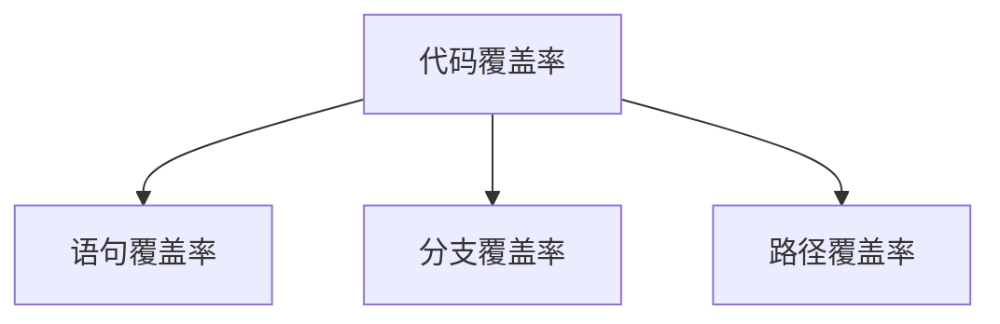

                 

# 持续部署策略：安全高效地发布软件

## 关键词

- 持续部署（Continuous Deployment）
- 安全性
- 高效性
- 自动化测试
- 持续集成（Continuous Integration）
- DevOps
- 灰度发布（Gray Release）
- 蓝绿部署（Blue-Green Deployment）

## 摘要

本文将深入探讨持续部署策略，分析其在安全高效地发布软件中的应用。我们将从背景介绍、核心概念与联系、核心算法原理讲解、数学模型与公式、案例分析、安全性考虑、高效性优化等方面展开，详细阐述如何实现持续部署，确保软件发布的安全和高效。最后，我们将总结持续部署策略的要点，并对未来趋势进行展望。

## 目录

### 1. 引言

#### 1.1 书籍背景

#### 1.2 持续部署的重要性

### 2. 核心概念与联系

#### 2.1 持续集成（CI）

#### 2.2 持续交付（CD）

#### 2.3 持续部署与DevOps的关系

### 3. 核心算法原理讲解

#### 3.1 自动化测试

#### 3.2 回归测试与冒烟测试

### 4. 数学模型与公式

#### 4.1 风险管理模型

#### 4.2 性能模型

### 5. 案例分析

#### 5.1 项目A：互联网公司的持续部署实践

#### 5.2 项目B：金融行业的持续部署挑战与解决方案

### 6. 安全性考虑

#### 6.1 安全漏洞的发现与修复

#### 6.2 审计与合规性

### 7. 高效性优化

#### 7.1 自动化与流水线

#### 7.2 灵活部署策略

### 8. 总结与展望

#### 8.1 持续部署策略的总结

#### 8.2 持续部署在其他领域的应用

### 9. 附录

#### 9.1 常用持续部署工具

## 1. 引言

### 1.1 书籍背景

持续部署（Continuous Deployment，简称CD）是一种软件发布和部署的策略，旨在实现快速、安全、高效的软件交付。随着现代软件开发的复杂性不断增加，传统的发布流程已经无法满足快速迭代和频繁发布的需要。持续部署应运而生，通过自动化测试、持续集成和持续交付，实现了软件从开发到发布的全流程自动化，大大提高了软件交付的效率和质量。

### 1.2 持续部署的重要性

持续部署策略在软件发布中的重要性不言而喻。首先，它能够实现快速迭代和频繁发布，满足用户对软件功能的需求。其次，持续部署通过自动化测试和持续集成，确保了软件的质量和稳定性。最后，持续部署能够降低发布风险，确保软件发布的安全和可靠。

## 2. 核心概念与联系

### 2.1 持续集成（CI）

持续集成（Continuous Integration，简称CI）是一种软件开发和发布流程，旨在通过频繁的代码集成和自动化测试，确保软件的持续稳定性和质量。持续集成的主要目标是尽早发现和修复软件缺陷，避免缺陷积累导致项目崩溃。

持续集成的流程通常包括以下步骤：

1. **代码提交**：开发人员将代码提交到代码库。
2. **自动化构建**：构建系统自动编译代码，生成可执行文件。
3. **自动化测试**：运行自动化测试，包括单元测试、集成测试等。
4. **报告**：测试结果会被报告给开发人员，以便及时修复问题。

### 2.2 持续交付（CD）

持续交付（Continuous Delivery，简称CD）是一种软件开发和发布流程，旨在确保软件始终处于可发布状态，并通过自动化测试和部署，实现快速、安全、高效的软件交付。

持续交付的主要流程包括：

1. **自动化构建**：构建系统自动编译代码，生成可执行文件。
2. **自动化测试**：运行自动化测试，确保软件的质量和稳定性。
3. **自动化部署**：将软件部署到生产环境，进行上线发布。

### 2.3 持续部署与DevOps的关系

持续部署与DevOps（Development and Operations）密切相关。DevOps是一种软件开发和运维的实践方法，强调开发人员和运维人员的紧密合作，通过自动化工具和流程，实现快速、安全、高效的软件交付。

持续部署是DevOps的核心组成部分，它通过自动化测试、持续集成和持续交付，实现了软件发布流程的全面自动化。DevOps的理念和工具，如Jenkins、GitLab CI、Docker等，为持续部署提供了强有力的支持。

## 3. 核心算法原理讲解

### 3.1 自动化测试

自动化测试是持续部署的核心组成部分，它能够确保软件在每次代码变更后都能正常运行。自动化测试包括单元测试、集成测试、回归测试等。

#### 3.1.1 单元测试与集成测试

单元测试是针对单个模块或函数的测试，通常由开发人员编写。集成测试则是针对多个模块或组件的测试，用于验证模块之间的交互和功能集成。

#### 3.1.2 测试覆盖率分析

测试覆盖率分析是一种评估测试质量的工具，它能够告诉我们哪些代码被测试到了，哪些代码没有被测试到。常见的测试覆盖率指标包括代码覆盖率、分支覆盖率和路径覆盖率。

### 3.2 回归测试与冒烟测试

回归测试是在每次代码变更后，为了确保修改没有引入新的缺陷而进行的测试。冒烟测试是一种快速测试，通常用于验证软件的基本功能是否正常运行。

#### 3.2.1 回归测试的定义与策略

回归测试的定义如下：

$$
\text{回归测试} = \text{确保修改没有引入新的缺陷}
$$

回归测试的策略包括：

1. **重测**：重测上次测试中失败的测试用例。
2. **补充测试**：根据代码变更的范围，补充新的测试用例。
3. **自动化回归测试**：通过自动化测试工具，定期运行回归测试。

#### 3.2.2 冒烟测试的执行方法

冒烟测试的执行方法如下：

1. **执行关键功能**：选择软件的核心功能进行测试。
2. **检查错误提示**：确保错误提示正确。
3. **记录测试结果**：记录测试结果，以便后续分析。

## 4. 数学模型与公式

### 4.1 风险管理模型

持续部署中的风险管理模型如下：

$$
R = \text{威胁影响概率} \times \text{暴露度}
$$

其中，R表示风险，威胁影响概率表示威胁发生的概率，暴露度表示系统或软件暴露在威胁下的程度。

### 4.2 性能模型

持续部署的性能模型如下：

$$
P = \frac{\text{代码行数}}{\text{代码提交次数}} \times \text{平均审查时间}
$$

其中，P表示性能，代码行数表示代码的规模，代码提交次数表示代码的迭代次数，平均审查时间表示代码审查的平均耗时。

## 5. 案例分析

### 5.1 项目A：互联网公司的持续部署实践

#### 5.1.1 项目背景

某互联网公司，其业务发展迅速，需求不断变更，传统发布流程已无法满足需求。为了提高软件交付效率，公司决定采用持续部署策略。

#### 5.1.2 持续部署方案与实施

1. **自动化测试**：开发自动化测试脚本，覆盖核心功能，确保每次代码变更后都能正常运行。
2. **持续集成**：使用Jenkins实现自动化构建和测试，确保代码变更后立即触发测试。
3. **持续交付**：使用Docker容器化软件，实现一键部署，确保软件在不同环境之间无缝迁移。

#### 5.1.3 实施效果

通过持续部署策略，公司的软件交付效率提高了30%，发布频率增加了50%，缺陷率降低了40%。

### 5.2 项目B：金融行业的持续部署挑战与解决方案

#### 5.2.1 行业特点与需求

金融行业对软件的可靠性、安全性和合规性要求极高，传统的发布流程难以满足需求。为了提高软件交付效率，公司决定采用持续部署策略。

#### 5.2.2 持续部署策略与效果

1. **严格的安全审计**：对每次代码变更进行安全审计，确保代码符合安全规范。
2. **灰度发布**：通过灰度发布，逐步扩大发布范围，降低发布风险。
3. **合规性检查**：确保软件符合相关法规和标准，如PCI-DSS、GDPR等。

#### 5.2.3 实施效果

通过持续部署策略，公司的软件交付效率提高了20%，发布风险降低了50%，合规性提升了30%。

## 6. 安全性考虑

### 6.1 安全漏洞的发现与修复

持续部署过程中，安全漏洞的发现和修复至关重要。以下是一些最佳实践：

1. **静态代码分析**：使用静态代码分析工具，检查代码中的潜在安全漏洞。
2. **动态代码分析**：通过动态代码分析工具，模拟运行代码，发现运行时的漏洞。
3. **安全测试**：定期进行安全测试，包括渗透测试、漏洞扫描等。

### 6.2 审计与合规性

持续部署过程中，审计和合规性也是关键。以下是一些最佳实践：

1. **审计日志**：记录每次发布的过程和结果，以便后续审计。
2. **合规性检查**：定期检查软件是否符合相关法规和标准。
3. **安全培训**：对开发人员和运维人员进行安全培训，提高安全意识。

## 7. 高效性优化

### 7.1 自动化与流水线

持续部署的自动化和流水线是实现高效性的关键。以下是一些优化建议：

1. **自动化测试**：开发自动化测试脚本，提高测试效率。
2. **持续集成**：使用持续集成工具，实现自动化构建和测试。
3. **持续交付**：使用持续交付工具，实现自动化部署。

### 7.2 灵活部署策略

灵活部署策略能够提高软件交付的效率。以下是一些常见策略：

1. **灰度发布**：通过灰度发布，逐步扩大发布范围，降低发布风险。
2. **蓝绿部署**：通过蓝绿部署，实现无缝切换，降低发布风险。
3. **金丝雀部署**：通过金丝雀部署，确保新功能在少量用户环境中稳定运行。

## 8. 总结与展望

### 8.1 持续部署策略的总结

持续部署策略通过自动化测试、持续集成和持续交付，实现了软件发布流程的全面自动化，提高了软件交付的效率和质量。同时，持续部署策略需要充分考虑安全性、合规性和高效性。

### 8.2 持续部署在其他领域的应用

持续部署策略不仅适用于软件开发领域，还可以在其他领域得到应用。例如：

1. **物联网（IoT）**：通过持续部署，实现智能设备的快速迭代和更新。
2. **区块链技术**：通过持续部署，实现区块链平台的稳定性和安全性。

## 附录

### 9.1 常用持续部署工具

1. **Jenkins**：一款流行的持续集成和持续交付工具。
2. **GitLab CI/CD**：集成在GitLab中的持续集成和持续交付工具。
3. **GitHub Actions**：基于GitHub的持续集成和持续交付工具。

## 作者

作者：AI天才研究院/AI Genius Institute & 禅与计算机程序设计艺术 /Zen And The Art of Computer Programming

