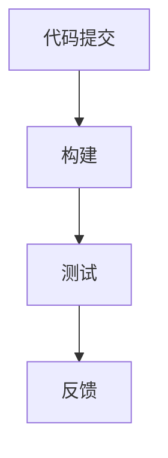
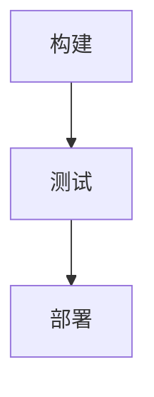
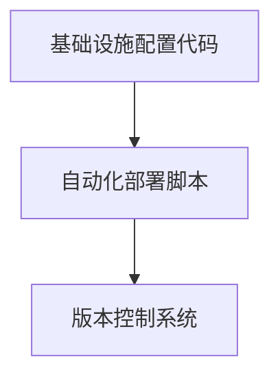
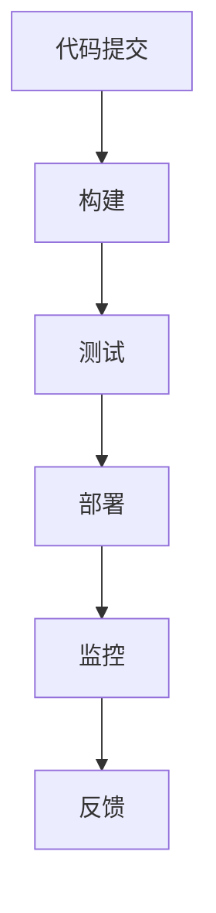
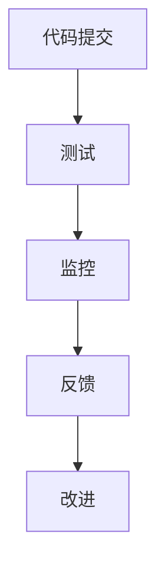

                 

## 文章标题

### 持续部署：加速软件交付的技术与流程

持续部署（Continuous Deployment，简称CD）是现代软件开发领域的一项重要实践，它通过自动化和优化软件交付流程，实现了快速、频繁且安全的软件发布。随着敏捷开发、DevOps文化以及云计算技术的普及，持续部署已成为提升软件交付效率和质量的关键手段。本文将详细探讨持续部署的核心概念、技术实现、流程优化以及项目实战，帮助读者全面理解并掌握这一重要领域。

### 关键词

- 持续部署（Continuous Deployment）
- 软件交付（Software Delivery）
- 持续集成（Continuous Integration，CI）
- 持续交付（Continuous Delivery，CD）
- 自动化测试（Automated Testing）
- 容器化（Containerization）
- 基础设施即代码（Infrastructure as Code，IaC）

### 摘要

本文旨在全面介绍持续部署的概念、技术实现、流程优化以及项目实战。首先，我们将回顾持续部署的背景和意义，探讨其在现代软件开发中的重要性。接着，我们将详细讲解持续部署的核心概念，包括持续集成（CI）、持续交付（CD）和基础设施即代码（IaC）。然后，我们将深入探讨实现持续部署的技术基础，如自动化测试、容器化和相关工具。在流程优化部分，我们将分析如何通过持续部署提升软件交付效率和质量。最后，通过实际项目案例，我们将展示如何实施持续部署，并探讨其未来发展趋势和挑战。通过本文的阅读，读者将能够全面了解持续部署的各个方面，为实际项目提供指导。

### 目录

1. 引言  
    1.1 持续部署的背景  
    1.2 持续部署的重要性  
    1.3 持续部署与敏捷开发的关系

2. 核心概念  
    2.1 持续集成（CI）  
    2.2 持续交付（CD）  
    2.3 基础设施即代码（IaC）

3. 技术实现  
    3.1 自动化测试  
    3.2 容器化技术  
    3.3 持续集成工具  
    3.4 持续交付工具

4. 流程优化  
    4.1 流程模型设计  
    4.2 流程自动化与优化  
    4.3 质量控制与风险管理  
    4.4 敏捷团队协作

5. 项目实战  
    5.1 项目背景与需求  
    5.2 环境搭建与工具选择  
    5.3 实施过程与挑战  
    5.4 结果评估与改进

6. 未来展望  
    6.1 未来技术发展趋势  
    6.2 行业挑战与解决方案  
    6.3 持续部署的最佳实践

### 引言

持续部署（Continuous Deployment，简称CD）是现代软件开发领域的一项重要实践，它通过自动化和优化软件交付流程，实现了快速、频繁且安全的软件发布。在传统的软件开发过程中，软件发布通常是一个耗时且繁琐的过程，往往需要经过多轮测试和人工干预。而持续部署则通过自动化测试、容器化和持续集成（CI）、持续交付（CD）等技术的应用，将软件发布过程简化为自动化操作，从而大大提高了软件交付的效率和可靠性。

持续部署的背景可以追溯到敏捷开发（Agile Development）和DevOps文化的兴起。敏捷开发强调快速迭代、持续反馈和持续改进，以应对不断变化的需求和市场环境。而DevOps则强调开发（Development）和运维（Operations）之间的紧密协作，通过自动化和协作工具实现软件开发、测试、部署等环节的无缝衔接。持续部署正是这一理念的进一步延伸，通过自动化和优化，实现软件发布的快速、频繁和可靠。

### 1.1 持续部署的背景

持续部署的背景可以追溯到敏捷开发（Agile Development）和DevOps文化的兴起。敏捷开发强调快速迭代、持续反馈和持续改进，以应对不断变化的需求和市场环境。而DevOps则强调开发（Development）和运维（Operations）之间的紧密协作，通过自动化和协作工具实现软件开发、测试、部署等环节的无缝衔接。持续部署正是这一理念的进一步延伸，通过自动化和优化，实现软件发布的快速、频繁和可靠。

敏捷开发的核心原则之一是“工作软件是进度的主要衡量标准”。传统的软件开发过程中，软件发布通常需要经过多个阶段，包括需求分析、设计、编码、测试和部署。每个阶段都需要大量的人工干预和协调，导致软件发布周期长、效率低。而敏捷开发则通过快速迭代和持续交付，将软件发布周期缩短，实现了更频繁的软件更新和更快的响应速度。

DevOps文化的兴起进一步推动了持续部署的发展。DevOps强调开发、测试、运维等各个环节的紧密协作，通过自动化工具和流程，实现从代码提交到生产环境部署的快速、安全、可靠的流程。持续部署作为DevOps实践的重要组成部分，通过自动化测试、容器化技术和持续集成/持续交付工具的应用，实现了软件交付的快速迭代和持续优化。

### 1.2 持续部署的重要性

持续部署在现代软件开发中的重要性不可忽视。首先，持续部署能够显著提高软件交付的效率。通过自动化测试和持续集成，开发团队可以快速发现和修复代码中的问题，减少了人工干预和协调的时间，从而加快了软件发布的速度。其次，持续部署能够提高软件交付的可靠性。自动化测试确保了每次发布的软件都是经过充分测试的，减少了因人为错误导致的问题，提高了软件的稳定性和用户体验。

此外，持续部署还有助于提高团队的协作效率和开发质量。通过持续集成和持续交付，开发、测试和运维团队可以更加紧密地协作，共同推进项目的进展。同时，自动化测试和代码审查等机制有助于提高代码质量，减少缺陷和漏洞的出现。最后，持续部署能够更好地适应快速变化的需求和市场环境。通过频繁的软件更新和快速迭代，开发团队能够更快地响应市场变化，提高产品的竞争力。

总之，持续部署不仅能够提高软件交付的效率和质量，还能够促进团队的协作和响应速度，从而在激烈的市场竞争中脱颖而出。

### 1.3 持续部署与敏捷开发的关系

持续部署与敏捷开发之间存在紧密的关系。敏捷开发强调快速迭代、持续反馈和持续改进，而持续部署则是实现这一目标的关键手段之一。在敏捷开发过程中，每次迭代都涉及到需求分析、设计、编码、测试和部署等多个阶段。持续部署通过自动化和优化，将这些阶段无缝衔接，实现快速、频繁且可靠的软件交付。

首先，持续部署与敏捷开发在理念上高度契合。敏捷开发强调团队协作、客户反馈和持续改进，而持续部署通过自动化和持续集成，确保每次迭代都能迅速交付高质量的软件。持续部署的核心目标是缩短软件交付周期，提高交付频率，从而更好地适应快速变化的需求和市场环境。

其次，持续部署在技术层面上为敏捷开发提供了强大的支持。通过自动化测试、持续集成和持续交付，开发团队可以更快地发现和修复代码中的问题，确保每次迭代都能顺利交付。自动化测试不仅提高了测试的效率和覆盖率，还减少了人工干预和协调的时间，使团队能够专注于核心开发工作。持续集成和持续交付则确保了每次代码变更都能及时集成和测试，避免了因版本冲突和遗留问题导致的中断和延误。

此外，持续部署有助于提升团队的协作效率。在敏捷开发过程中，团队成员需要紧密协作，共同推进项目的进展。持续部署通过自动化和标准化，减少了重复工作和协调成本，使团队成员能够更加专注于各自的核心任务。同时，持续部署提供了清晰的反馈机制，使团队能够及时了解项目的进展和存在的问题，从而进行有效的调整和改进。

最后，持续部署与敏捷开发在实践中的应用也相互促进。敏捷开发通过持续部署，实现了快速迭代和频繁交付，从而更好地适应了市场变化和客户需求。而持续部署通过敏捷开发，实现了更高效、更高质量的软件交付，进一步提升了团队的协作和响应速度。

总之，持续部署与敏捷开发在理念和实践中相互支持，共同推动了现代软件开发的发展。通过结合持续部署的实践，敏捷开发团队能够更好地应对复杂多变的市场环境，提高软件交付的效率和可靠性。

### 核心概念

在深入探讨持续部署之前，了解其核心概念是至关重要的。持续部署涉及多个关键概念，如持续集成（CI）、持续交付（CD）和基础设施即代码（IaC），这些概念共同构成了持续部署的基础架构。下面我们将逐一介绍这些概念，并解释它们之间的关系。

#### 2.1 持续集成（Continuous Integration，CI）

持续集成（CI）是一种软件开发实践，旨在确保代码库中的每个提交都是可集成的，并且能够构建和测试。其核心思想是通过频繁地合并代码和自动化的构建与测试，确保代码质量。

**核心概念与联系：**

持续集成涉及以下几个关键步骤：

1. **代码提交**：开发人员将代码提交到版本控制系统。
2. **构建**：每次提交后，构建系统自动构建代码，生成可执行文件或应用程序。
3. **测试**：构建完成后，运行一系列自动化测试，确保新代码不会破坏现有功能。
4. **反馈**：测试结果及时反馈给开发人员，以便他们快速修复问题。

持续集成与持续交付的关系紧密。持续集成确保每次代码提交都是稳定的，而持续交付则利用这些稳定的提交进行进一步的测试和部署。

**Mermaid 流程图：**



#### 2.2 持续交付（Continuous Delivery，CD）

持续交付（CD）是一种确保软件可以随时发布到生产环境的技术实践。它通过自动化测试和部署流程，确保每次提交的代码都是可部署的，并且可以快速、安全地发布。

**核心概念与联系：**

持续交付的核心步骤包括：

1. **构建**：与持续集成类似，构建阶段生成可执行的软件。
2. **测试**：执行一系列自动化测试，包括功能测试、性能测试和安全性测试。
3. **部署**：将经过测试的软件部署到生产环境，确保其能够正常运行。

持续交付的目标是实现“零停机部署”，即在软件发布过程中，用户不会感受到服务中断。持续交付与持续集成的关系是，持续集成确保代码是可测试的，而持续交付则确保这些代码是可以部署的。

**Mermaid 流程图：**



#### 2.3 基础设施即代码（Infrastructure as Code，IaC）

基础设施即代码（IaC）是一种使用代码来管理和配置基础设施的方法。这种方法将基础设施的配置和管理抽象为代码，从而实现自动化和标准化。

**核心概念与联系：**

基础设施即代码的关键点包括：

1. **代码化配置**：将基础设施的配置信息（如网络、服务器、数据库等）存储在版本控制系统中，通过代码进行管理。
2. **自动化部署**：使用脚本或工具（如Terraform、Ansible等）来自动化基础设施的部署和配置。
3. **版本控制**：通过版本控制系统跟踪和管理基础设施配置的变更。

基础设施即代码与持续部署的关系在于，它使得基础设施的配置和部署可以与代码一起管理和更新，从而实现更一致和可靠的持续部署流程。

**Mermaid 流�程图：**



通过上述核心概念，我们可以构建一个持续部署的整体架构，其中持续集成、持续交付和基础设施即代码相互协作，共同实现软件的快速、安全和可靠交付。

### 自动化测试

在持续部署的框架中，自动化测试是确保软件质量和交付效率的关键环节。自动化测试通过编写和执行预定义的测试脚本，自动化地进行功能测试、性能测试、安全性测试等，从而大大提高了测试的效率和覆盖率。以下将详细讨论自动化测试的核心原理、技术实现方法以及其在持续部署中的作用。

#### 核心原理

自动化测试的核心原理是使用工具或脚本模拟用户的操作，验证软件的功能和性能是否符合预期。与手动测试相比，自动化测试具有以下几个显著优势：

1. **高效率**：自动化测试可以重复执行，节省了手动测试的时间。
2. **高覆盖率**：通过编写各种测试脚本，自动化测试可以覆盖更多的测试场景和路径。
3. **准确性**：自动化测试减少了人为错误的可能性，提高了测试结果的可靠性。
4. **可重复性**：自动化测试结果可重复验证，确保每次测试的一致性。

#### 技术实现方法

自动化测试的实现通常包括以下几个步骤：

1. **测试设计**：根据软件需求规格说明书和用户故事，设计测试用例，确定测试的范围和目标。
2. **测试脚本编写**：使用编程语言或测试工具编写测试脚本，模拟用户操作。常用的测试脚本编写语言包括Python、Java、C#等。同时，也有专门的自动化测试框架，如Selenium、JUnit、TestNG等，提供丰富的API和工具，方便编写和执行测试脚本。
3. **执行测试**：运行测试脚本，验证软件的功能和性能。测试结果会生成报告，包括通过数、失败数、错误日志等。
4. **结果分析**：分析测试结果，识别软件中的问题和缺陷，并反馈给开发团队进行修复。

#### 自动化测试工具

市面上有许多自动化测试工具，根据测试目标和需求的不同，可以选择合适的工具：

1. **功能测试工具**：如Selenium、Appium，用于自动化网页、移动应用的功能测试。
2. **性能测试工具**：如JMeter、LoadRunner，用于模拟大量用户访问，评估软件的性能和负载能力。
3. **安全性测试工具**：如Burp Suite、OWASP ZAP，用于检测软件的安全漏洞和弱点。

#### 在持续部署中的作用

在持续部署的框架中，自动化测试发挥着至关重要的作用：

1. **快速反馈**：每次代码提交后，自动化测试可以迅速执行，提供测试结果，帮助开发人员及时发现和修复问题。
2. **持续集成**：自动化测试是持续集成（CI）的重要组成部分。通过CI，每次代码提交都会触发自动化测试，确保代码库中的每个提交都是可集成的。
3. **持续交付**：在持续交付（CD）过程中，自动化测试确保每次发布的软件都是经过充分测试的，降低了发布失败的风险。
4. **提高效率**：自动化测试减少了手动测试的工作量，使开发团队能够专注于核心开发任务，提高了软件交付的效率。

**伪代码示例：**

以下是一个简单的自动化测试伪代码示例，用于验证一个简单的计算器应用的功能。

```python
# 导入测试库
import unittest

# 定义测试类
class TestCalculator(unittest.TestCase):

    # 测试加法功能
    def test_add(self):
        result = calculator.add(2, 3)
        self.assertEqual(result, 5)

    # 测试减法功能
    def test_subtract(self):
        result = calculator.subtract(5, 3)
        self.assertEqual(result, 2)

    # 测试乘法功能
    def test_multiply(self):
        result = calculator.multiply(2, 3)
        self.assertEqual(result, 6)

    # 测试除法功能
    def test_divide(self):
        result = calculator.divide(6, 3)
        self.assertEqual(result, 2)

# 运行测试
if __name__ == '__main__':
    unittest.main()
```

通过上述示例，我们可以看到，自动化测试通过定义一系列测试用例，自动化地验证计算器应用的基本功能，确保其符合预期。

总之，自动化测试是持续部署的重要环节，通过高效的测试和反馈机制，提高了软件交付的质量和效率。在持续部署的实践中，自动化测试不仅能够帮助开发团队快速识别和修复问题，还能够确保软件在每次发布时都是高质量的，为用户提供稳定和可靠的服务。

### 容器化技术

容器化技术是现代软件开发和持续部署中不可或缺的一部分。它通过将应用程序及其依赖项打包到一个独立的容器中，实现了环境的标准化和部署的灵活性。以下将详细讨论容器化技术的核心原理、主要工具（如Docker和Kubernetes）以及其在持续部署中的应用。

#### 核心原理

容器化技术的核心原理是将应用程序及其运行环境打包成一个统一的容器镜像，从而实现“一次编写，到处运行”。容器与传统的虚拟机相比，具有以下几个显著优势：

1. **轻量级**：容器不包含操作系统，仅包含应用程序及其依赖项，因此更轻量，启动速度更快。
2. **隔离性**：容器提供了独立的运行环境，确保了应用程序之间的隔离，避免了环境冲突。
3. **可移植性**：容器镜像是一种标准化的打包形式，可以在不同的操作系统和环境中运行，实现了应用程序的跨平台部署。
4. **资源效率**：容器直接运行在宿主机的操作系统上，无需额外的操作系统资源，提高了资源利用效率。

#### 主要工具

在容器化技术中，Docker和Kubernetes是两个最为重要的工具。

**Docker**

Docker是一个开源的应用容器引擎，用于构建、运行和分发应用程序容器。其主要组件包括：

1. **Docker Engine**：Docker的核心组件，负责容器的创建、启动、运行和停止。
2. **Dockerfile**：用于定义如何构建容器镜像的脚本文件，包含了应用程序的依赖项、安装步骤等。
3. **Docker Hub**：Docker的官方仓库，提供了大量的预构建的容器镜像，方便用户直接使用。

**Kubernetes**

Kubernetes是一个开源的容器编排平台，用于自动化容器的部署、扩展和管理。其主要组件包括：

1. **Master Node**：Kubernetes集群的主节点，负责集群的管理和协调。
2. **Worker Node**：Kubernetes集群的工作节点，负责运行容器化的应用程序。
3. **Pod**：Kubernetes中的最小部署单位，包含一个或多个容器。
4. **Service**：Kubernetes中的服务抽象，用于将容器化的应用程序暴露给外部网络。

#### 在持续部署中的应用

容器化技术在持续部署中的应用主要体现在以下几个方面：

1. **环境一致性**：通过Docker容器，开发、测试和生产环境可以保持一致，避免了因环境差异导致的问题。
2. **快速部署**：容器化的应用程序可以快速部署到任何支持Docker的节点上，实现了快速、灵活的部署。
3. **自动化扩展**：通过Kubernetes的自动化扩展功能，可以根据需求自动调整应用程序的副本数量，实现弹性伸缩。
4. **灾难恢复**：容器化应用程序可以通过备份和迁移容器镜像实现快速灾难恢复。
5. **持续交付**：容器化技术与持续集成（CI）和持续交付（CD）相结合，实现了从代码提交到生产环境部署的自动化流程。

**示例：**

以下是一个简单的Dockerfile示例，用于构建一个Web应用程序的容器镜像。

```Dockerfile
# 使用官方的Python镜像作为基础镜像
FROM python:3.8

# 设置工作目录
WORKDIR /app

# 复制应用程序代码到容器
COPY . .

# 安装依赖项
RUN pip install -r requirements.txt

# 暴露Web服务端口
EXPOSE 8000

# 运行应用程序
CMD ["python", "app.py"]
```

在这个示例中，Dockerfile定义了如何构建一个基于Python的Web应用程序的容器镜像。通过这个镜像，开发团队可以确保应用程序在不同环境中的运行一致性，从而简化了持续部署的过程。

总之，容器化技术通过其核心原理和主要工具，为持续部署提供了强大的支持。通过容器化，开发团队可以实现环境一致性、快速部署、自动化扩展和灾难恢复，从而提高软件交付的效率和质量。

### 持续集成工具

持续集成（Continuous Integration，CI）是持续部署（CD）过程中的关键环节，它通过自动化测试和构建，确保每次代码提交都是可集成的。本文将详细介绍几个常用的持续集成工具，如Jenkins、Travis CI和GitLab CI/CD，并讨论它们的核心功能和适用场景。

#### Jenkins

Jenkins是一个开源的持续集成工具，广泛用于各种规模的开发项目中。其主要特点如下：

**核心功能：**

1. **插件生态系统**：Jenkins拥有丰富的插件，可以扩展其功能，包括代码库集成、测试工具集成、自动化部署等。
2. **构建流水线**：Jenkins支持构建流水线（Pipeline），允许开发者以代码的形式定义整个CI/CD流程，提高了流程的可维护性和可扩展性。
3. **多环境支持**：Jenkins可以与多种代码库、测试工具和部署平台集成，支持多环境的构建和测试。

**适用场景：**

- **大型企业级项目**：Jenkins的灵活性和扩展性使其适合大型企业级项目，能够满足多样化的需求。
- **多语言支持**：Jenkins支持多种编程语言和构建工具，如Maven、Gradle、Golang等。

**示例配置：**

以下是一个简单的Jenkins Pipeline配置示例，用于构建和测试一个Python应用程序。

```groovy
pipeline {
    agent any

    stages {
        stage('Build') {
            steps {
                sh 'python setup.py build'
            }
        }
        stage('Test') {
            steps {
                sh 'python -m unittest discover -s tests'
            }
        }
    }
}
```

#### Travis CI

Travis CI是一个云端的持续集成服务，专为开源项目设计。其主要特点如下：

**核心功能：**

1. **免费开源支持**：Travis CI对GitHub上的开源项目提供免费支持，吸引了大量的开源项目使用。
2. **多语言支持**：Travis CI支持多种编程语言和框架，如Python、Ruby、JavaScript等。
3. **环境配置自动化**：Travis CI可以自动化配置构建环境，包括安装依赖项、设置环境变量等。

**适用场景：**

- **开源项目**：Travis CI的免费和易于使用的特点使其成为开源项目的理想选择。
- **个人项目**：对于个人开发者或小型团队，Travis CI提供了方便的持续集成服务。

**示例配置：**

以下是一个简单的`.travis.yml`配置文件示例，用于构建和测试一个Python应用程序。

```yaml
language: python
python:
  - "3.8"
install:
  - pip install -r requirements.txt
script:
  - python -m unittest discover -s tests
```

#### GitLab CI/CD

GitLab CI/CD是GitLab内置的持续集成和持续交付工具。其主要特点如下：

**核心功能：**

1. **集成工作流**：GitLab CI/CD与GitLab平台深度集成，提供从代码提交到生产环境部署的完整工作流。
2. **多阶段构建**：支持多阶段构建，可以在不同阶段使用不同的构建环境和工具，提高了构建的灵活性和性能。
3. **部署策略**：GitLab CI/CD支持多种部署策略，如滚动更新、蓝绿部署等，确保部署过程的平稳和可控。

**适用场景：**

- **企业内部项目**：GitLab CI/CD适合企业内部项目，提供强大的集成和部署功能。
- **多种语言支持**：GitLab CI/CD支持多种编程语言和框架，如Go、Java、Node.js等。

**示例配置：**

以下是一个简单的`.gitlab-ci.yml`配置文件示例，用于构建、测试和部署一个Python应用程序。

```yaml
image: python:3.8

stages:
  - build
  - test
  - deploy

build:
  stage: build
  script:
    - pip install -r requirements.txt
    - python setup.py build

test:
  stage: test
  script:
    - python -m unittest discover -s tests

deploy:
  stage: deploy
  script:
    - echo "Deploying to production environment"
  only:
    - master
```

通过上述三个持续集成工具的介绍，我们可以看到，它们各自具有独特的优势和适用场景。Jenkins适合大型企业级项目，Travis CI适合开源项目和独立开发者，而GitLab CI/CD则适合企业内部项目，提供全面的持续集成和持续交付解决方案。选择合适的持续集成工具，可以显著提高软件交付的效率和可靠性。

### 持续交付工具

持续交付（Continuous Delivery，CD）是确保软件可以随时发布到生产环境的重要环节。它通过自动化测试、部署和监控，确保每次发布的软件都是经过充分验证的，并且可以快速、安全地部署到生产环境。以下将详细介绍几个常用的持续交付工具，如Circle CI、GitLab CI/CD和AWS CodePipeline，并讨论它们的核心功能和适用场景。

#### Circle CI

Circle CI是一个云端的持续集成和持续交付工具，以其简单易用和快速部署而闻名。其主要特点如下：

**核心功能：**

1. **并行构建**：Circle CI支持并行构建，可以在多个环境中同时运行多个构建任务，大大提高了构建效率。
2. **无服务器构建**：Circle CI使用云基础设施，无需管理服务器，简化了运维工作。
3. **全面集成**：Circle CI与多种代码库、测试工具和部署平台集成，提供了丰富的插件和扩展功能。

**适用场景：**

- **个人项目和开源项目**：Circle CI的免费和易于使用的特性使其适合个人项目和开源项目。
- **小型团队**：Circle CI的快速部署和并行构建功能适合小型团队，可以轻松实现持续交付。

**示例配置：**

以下是一个简单的`.circleci/config.yml`配置文件示例，用于构建、测试和部署一个Python应用程序。

```yaml
version: 2.1

orbs:
  python: circleci/python@1.3.1

parameters:
  python-version:
    value: "3.8"

workflows:
  version: 2
  my-build-pipeline:
    jobs:
      build-and-test:
        docker:
          - image: cimg/python:3.8
        steps:
          - checkout
          - run:
              name: Install dependencies
              command: pip install -r requirements.txt
          - run:
              name: Run tests
              command: python -m unittest discover -s tests
      deploy-to-aws:
        docker:
          - image: cimg/base:latest
        steps:
          - run:
              name: Deploy to AWS
              command: echo "Deploying to AWS"
```

#### GitLab CI/CD

GitLab CI/CD是GitLab内置的持续集成和持续交付工具，提供了从代码提交到生产环境部署的完整工作流。其主要特点如下：

**核心功能：**

1. **多阶段构建**：GitLab CI/CD支持多阶段构建，可以在不同阶段使用不同的构建环境和工具，提高了构建的灵活性和性能。
2. **部署策略**：GitLab CI/CD支持多种部署策略，如滚动更新、蓝绿部署等，确保部署过程的平稳和可控。
3. **集成监控**：GitLab CI/CD可以与GitLab的监控工具集成，实现自动监控和告警。

**适用场景：**

- **企业内部项目**：GitLab CI/CD适合企业内部项目，提供强大的集成和部署功能。
- **多语言支持**：GitLab CI/CD支持多种编程语言和框架，如Go、Java、Node.js等。

**示例配置：**

以下是一个简单的`.gitlab-ci.yml`配置文件示例，用于构建、测试和部署一个Python应用程序。

```yaml
image: python:3.8

stages:
  - build
  - test
  - deploy

build:
  stage: build
  script:
    - pip install -r requirements.txt
    - python setup.py build

test:
  stage: test
  script:
    - python -m unittest discover -s tests

deploy:
  stage: deploy
  script:
    - echo "Deploying to production environment"
  only:
    - master
```

#### AWS CodePipeline

AWS CodePipeline是Amazon Web Services（AWS）提供的一款持续集成和持续交付服务，可以与AWS的其他服务无缝集成。其主要特点如下：

**核心功能：**

1. **自动化部署**：AWS CodePipeline可以自动化地从源代码管理系统中提取代码，进行构建、测试和部署。
2. **部署管道**：AWS CodePipeline提供了可视化的部署管道创建和管理功能，可以轻松定义和调整部署流程。
3. **集成与扩展**：AWS CodePipeline可以与多种源代码管理工具、构建工具和部署平台集成，如GitHub、Bitbucket、AWS CodeBuild等。

**适用场景：**

- **云原生应用**：AWS CodePipeline适合在AWS云环境中构建和部署云原生应用。
- **企业级部署**：AWS CodePipeline提供了强大的自动化和监控功能，适合企业级应用。

**示例配置：**

以下是一个简单的AWS CloudFormation模板示例，用于创建AWS CodePipeline管道。

```yaml
Resources:
  MyPipeline:
    Type: AWS::CodePipeline::Pipeline
    Properties:
      Name: MyPipeline
      RoleArn: !GetAtt CodePipelineServiceRole.Arn
      ArtifactStore:
        Type: AWS::CodePipeline::ArtifactStore
        Properties:
          Location: !Ref S3Bucket
          Type: S3
      Stages:
        - Name: Source
          Actions:
            - Name: GetSource
              Action: AWS::CodePipeline::GetSourceAction
              Configuration:
                BranchName: master
                Repository:
                  Type: GitHub
                  Owner: username
                  Name: repo-name
                Output:
                  Name: SourceOutput
        - Name: Build
          Actions:
            - Name: BuildProject
              Action: AWS::CodePipeline::BuildAction
              Configuration:
                ProjectName: build-project
                Input:
                  Artifacts:
                    - Name: SourceOutput
        - Name: Test:
          Actions:
            - Name: TestProject
              Action: AWS::CodePipeline::TestAction
              Configuration:
                ProjectName: test-project
                Input:
                  Artifacts:
                    - Name: BuildOutput
        - Name: Deploy
          Actions:
            - Name: DeployProject
              Action: AWS::CodePipeline::DeployAction
              Configuration:
                DeploymentGroupName: deploy-group
                ProjectName: deploy-project
                Input:
                  Artifacts:
                    - Name: TestOutput
```

通过上述三个持续交付工具的介绍，我们可以看到，它们各自具有独特的优势和适用场景。Circle CI适合个人项目和开源项目，GitLab CI/CD适合企业内部项目，而AWS CodePipeline则适合云原生应用和企业级部署。选择合适的持续交付工具，可以显著提高软件交付的效率和可靠性。

### 流程模型设计

在持续部署的框架中，流程模型设计是确保软件交付高效、稳定和可靠的重要步骤。一个良好的流程模型应该能够将开发、测试、部署等各个环节无缝衔接，实现自动化和标准化。以下将详细讨论流程模型设计的关键要素、最佳实践以及相关的工具和平台。

#### 关键要素

1. **自动化**：流程模型的核心是自动化，通过自动化工具和脚本，实现从代码提交到生产环境部署的各个环节。
2. **标准化**：流程模型应该遵循标准化原则，确保各个环节的操作和输出都是一致的，便于管理和监控。
3. **灵活性**：流程模型需要具备一定的灵活性，能够根据项目需求和环境变化进行调整和优化。
4. **反馈机制**：流程模型应包含反馈机制，及时报告各个环节的状态和结果，帮助团队快速响应和处理问题。

#### 最佳实践

1. **定义清晰的流程**：首先，明确每个环节的任务和责任，定义清晰的流程图，确保团队成员对流程有共同的理解和认知。
2. **模块化设计**：将流程分解为多个模块，每个模块负责一个特定的任务，便于管理和维护。
3. **使用版本控制**：将流程定义和配置文件存储在版本控制系统中，确保版本的跟踪和管理。
4. **持续优化**：定期评估流程的效率和效果，通过反馈和数据分析，不断优化流程。

#### 工具和平台

1. **Jenkins**：Jenkins是一个强大的持续集成和持续交付工具，支持构建流水线和多种插件，可以灵活构建复杂的流程。
2. **GitLab CI/CD**：GitLab CI/CD内置在GitLab平台中，提供多阶段构建和部署功能，适合企业内部项目。
3. **AWS CodePipeline**：AWS CodePipeline是AWS提供的一款持续集成和持续交付服务，与AWS其他服务深度集成，适合云原生应用。
4. **Terraform**：Terraform是一个基础设施即代码工具，可以自动化基础设施的配置和部署，与持续部署流程紧密结合。

#### 示例流程

以下是一个简单的持续部署流程示例，包括代码提交、构建、测试、部署和监控等环节：

1. **代码提交**：开发人员将代码提交到版本控制系统，触发CI/CD流程。
2. **构建**：CI工具（如Jenkins或GitLab CI/CD）自动构建代码，生成可执行文件或应用程序。
3. **测试**：执行自动化测试，包括单元测试、集成测试和性能测试，确保代码质量。
4. **部署**：将经过测试的代码部署到测试环境或生产环境，可以使用容器化技术（如Docker和Kubernetes）实现自动化部署。
5. **监控**：使用监控工具（如Prometheus和Grafana）实时监控应用程序的状态和性能，确保稳定运行。
6. **反馈**：将流程结果反馈给开发团队，包括测试结果、部署状态和性能指标，帮助团队持续优化流程。

**Mermaid 流程图：**



通过上述示例，我们可以看到，流程模型设计的关键是自动化、标准化和反馈机制。通过合理设计流程模型，开发团队可以实现高效的软件交付，提高软件质量和用户体验。

### 流程自动化与优化

在持续部署的实践中，流程自动化和优化是提高软件交付效率和降低成本的关键步骤。通过自动化，可以减少手动操作，降低人为错误，提高生产效率；通过优化，可以不断改进流程，提高流程的可靠性和可持续性。以下将详细讨论如何实现流程自动化和优化，以及相关的工具和方法。

#### 自动化

1. **自动化构建**：使用CI/CD工具（如Jenkins、GitLab CI/CD、AWS CodePipeline等）自动构建应用程序。这些工具可以自动化地编译代码、打包应用程序和创建可执行文件或容器镜像。

2. **自动化测试**：通过编写和执行自动化测试脚本，实现自动化测试。这些测试可以涵盖单元测试、集成测试、性能测试和安全测试，确保每次代码提交都是高质量的。

3. **自动化部署**：使用自动化部署工具（如Kubernetes、Ansible、Terraform等）实现应用程序的自动化部署。这些工具可以自动化地部署应用程序到不同的环境中，包括开发、测试和生产环境。

4. **自动化监控**：使用监控工具（如Prometheus、Grafana、New Relic等）自动收集和展示应用程序的性能和状态数据，实时监控应用程序的运行状况，及时发现和解决问题。

#### 优化

1. **流程简化**：通过减少不必要的步骤和环节，简化流程。例如，可以合并多个测试阶段，减少重复工作。

2. **减少人工干预**：通过自动化工具，减少手动操作和人工干预。例如，使用自动部署工具，避免手动部署应用程序。

3. **持续改进**：通过持续反馈和数据分析，不断优化流程。例如，根据测试结果和性能指标，调整测试策略和部署策略。

4. **资源优化**：通过优化资源使用，提高资源利用率。例如，使用容器化技术，动态调整应用程序的部署规模，根据需求自动扩展或缩减资源。

#### 工具和方法

1. **CI/CD工具**：使用Jenkins、GitLab CI/CD、AWS CodePipeline等CI/CD工具，实现自动化构建、测试和部署。

2. **自动化测试框架**：使用Selenium、JUnit、TestNG等自动化测试框架，编写和执行自动化测试脚本。

3. **自动化部署工具**：使用Kubernetes、Ansible、Terraform等自动化部署工具，实现自动化部署和扩展。

4. **监控工具**：使用Prometheus、Grafana、New Relic等监控工具，实现自动化监控和告警。

5. **数据分析工具**：使用Python、R等数据分析工具，对测试结果和性能指标进行分析，优化流程。

#### 实例

假设一个团队正在开发一个Web应用程序，他们希望实现持续部署，以下是具体的步骤：

1. **代码提交**：开发人员将代码提交到GitLab，触发GitLab CI/CD流程。

2. **构建**：GitLab CI/CD工具自动构建应用程序，包括编译代码、打包应用程序和创建容器镜像。

3. **测试**：执行自动化测试，包括单元测试、集成测试和性能测试，确保应用程序的质量。

4. **部署**：将经过测试的应用程序部署到Kubernetes集群中，使用Helm进行自动化部署。

5. **监控**：使用Prometheus和Grafana监控应用程序的性能和状态，设置告警规则，确保应用程序的稳定运行。

通过上述步骤，团队可以实现高效的持续部署，提高软件交付的效率和质量。

总之，通过流程自动化和优化，开发团队可以显著提高软件交付的效率和可靠性，降低成本，提高市场竞争力。自动化和优化不仅是一种技术手段，更是一种文化理念，需要团队持续改进和优化。通过合理使用工具和方法，开发团队可以更好地实现持续部署的目标。

### 质量控制与风险管理

在持续部署的过程中，质量控制与风险管理是确保软件交付质量和稳定性的关键环节。通过科学的方法和工具，开发团队可以有效地监控和预防潜在问题，确保软件的高质量交付。以下将详细讨论如何进行质量控制、风险识别与评估，以及如何通过监控和反馈机制来降低风险。

#### 质量控制

1. **测试覆盖**：确保测试覆盖全面，包括单元测试、集成测试、性能测试和安全测试。通过自动化测试工具，如Selenium、JUnit和TestNG，实现测试的自动化和高效执行。

2. **代码审查**：进行代码审查，通过静态代码分析工具（如SonarQube）和人工审查，识别潜在的问题和漏洞，确保代码质量。

3. **持续监控**：使用监控工具（如Prometheus和Grafana）实时监控软件的运行状态和性能指标，及时发现和处理异常。

4. **版本控制**：使用版本控制系统（如Git）进行代码管理，确保代码的版本可追溯，便于问题定位和复现。

5. **文档化**：记录测试结果、代码变更和部署日志，确保所有相关信息都得到妥善保存和归档，便于后续审计和回顾。

#### 风险识别与评估

1. **风险评估**：对项目的各个方面进行风险评估，包括技术风险、业务风险和市场风险。使用定性和定量方法进行评估，确定风险等级和优先级。

2. **风险监控**：通过持续集成和持续交付流程，监控代码提交、测试结果和部署状态，及时发现潜在的风险。

3. **风险管理计划**：制定详细的风险管理计划，包括风险应对策略、风险缓解措施和应急响应流程。

4. **定期审查**：定期审查和更新风险管理计划，确保风险管理的有效性，根据实际情况进行调整。

#### 监控与反馈机制

1. **实时监控**：使用实时监控工具（如Prometheus和Grafana）监控软件的运行状态，设置告警规则，及时发现和处理异常。

2. **反馈机制**：建立反馈机制，确保团队成员之间的信息传递畅通，及时报告问题和风险。

3. **问题跟踪**：使用问题跟踪工具（如JIRA或Bugzilla），记录和跟踪问题，确保问题得到及时解决。

4. **持续改进**：根据监控和反馈信息，持续改进测试流程和部署策略，降低风险，提高软件质量。

**Mermaid 流程图：**



通过上述流程，开发团队可以实现全面的质量控制和风险管理，确保软件交付的质量和稳定性。

### 敏捷团队协作

在持续部署的实践中，敏捷团队协作是确保项目顺利进行和高效交付的关键。敏捷开发强调团队协作、透明沟通和快速响应变化，通过有效的协作方式，团队可以更好地应对项目中的各种挑战。以下将详细讨论敏捷团队协作的方法、工具和最佳实践。

#### 敏捷团队协作的方法

1. **站立会议（Stand-up Meeting）**：每日站立会议是敏捷团队的核心协作方式，团队成员在会议上快速汇报自己的进展、遇到的困难和计划。这种简短、高频的沟通有助于及时发现和解决问题。

2. **迭代回顾（Iteration Review）**：在每次迭代结束时，团队进行回顾会议，讨论迭代的成果、问题和改进点。通过回顾，团队可以总结经验教训，不断提升协作效率。

3. **信息可视化**：使用看板（Kanban Board）或任务管理工具（如JIRA），将任务和进度可视化，团队成员可以清晰地了解项目状态，便于协调和分配任务。

4. **结对编程（Pair Programming）**：通过双人合作，可以提高代码质量、减少错误，并促进知识分享和技能提升。

5. **代码审查（Code Review）**：定期进行代码审查，确保代码的质量和一致性，同时促进团队成员之间的知识交流。

#### 敏捷团队协作的工

### 项目实战

#### 项目背景与需求

本案例以一个电商网站的开发与部署为例，展示如何在实际项目中实施持续部署。电商网站是一个高并发、高可用性的系统，对性能和稳定性有较高要求。为了提高开发效率和软件质量，项目团队决定采用持续部署（CD）实践。

#### 环境搭建与工具选择

1. **代码仓库**：使用Git进行版本控制，代码存储在GitHub上。
2. **持续集成工具**：选择Jenkins作为持续集成（CI）工具，用于自动化构建和测试。
3. **容器化技术**：使用Docker进行应用容器化，确保环境一致性。
4. **容器编排**：使用Kubernetes进行容器编排和管理，实现自动化部署和扩展。
5. **监控工具**：使用Prometheus和Grafana进行实时监控和性能分析。

#### 实施过程与挑战

1. **构建与测试**：每次代码提交都会触发Jenkins构建，构建过程包括编译代码、打包Docker镜像和运行自动化测试。测试结果会实时反馈给开发人员，确保代码质量。
2. **容器化与部署**：通过Dockerfile构建应用程序的容器镜像，并将镜像推送到Docker Hub。使用Kubernetes部署和管理容器化应用，实现自动化部署和扩展。
3. **自动化部署脚本**：编写Kubernetes的YAML配置文件，实现自动化部署脚本，确保部署过程的一致性和可靠性。
4. **挑战与解决**：在实施过程中，团队遇到了以下挑战：
   - **环境一致性**：通过Docker和Kubernetes确保开发、测试和生产环境的一致性，减少了因环境差异导致的问题。
   - **部署失败**：在第一次部署时，由于配置错误导致部署失败。团队通过日志分析和反馈机制，快速定位并修复了问题。
   - **性能优化**：在部署过程中，发现某些服务存在性能瓶颈。团队通过优化数据库查询和缓存策略，提升了系统的性能和响应速度。

#### 代码实现与代码解读

以下是应用程序的Dockerfile示例：

```Dockerfile
# 使用官方的Python镜像作为基础镜像
FROM python:3.8

# 设置工作目录
WORKDIR /app

# 复制应用程序代码到容器
COPY . .

# 安装依赖项
RUN pip install -r requirements.txt

# 暴露Web服务端口
EXPOSE 8000

# 运行应用程序
CMD ["gunicorn", "app:app"]
```

在Dockerfile中，我们首先选择Python 3.8作为基础镜像，设置工作目录并复制应用程序代码到容器中。接下来，安装依赖项，并暴露Web服务端口（8000）。最后，定义CMD指令，启动Gunicorn Web服务器。

以下是Kubernetes的YAML配置文件示例，用于部署应用程序：

```yaml
apiVersion: apps/v1
kind: Deployment
metadata:
  name: ecommerce-app
spec:
  replicas: 3
  selector:
    matchLabels:
      app: ecommerce
  template:
    metadata:
      labels:
        app: ecommerce
    spec:
      containers:
      - name: ecommerce
        image: username/ecommerce:latest
        ports:
        - containerPort: 8000
```

在这个配置文件中，我们定义了一个名为“ecommerce-app”的Deployment，配置了3个副本，并设置选择器标签为“app: ecommerce”。在template部分，我们定义了容器的名称、镜像名称和端口映射。

通过上述示例，我们可以看到如何使用Dockerfile和Kubernetes配置文件实现应用程序的容器化和自动化部署。

#### 实际案例分析与详细讲解剖析

在实施持续部署的过程中，团队通过以下步骤实现了电商网站的高效交付：

1. **环境一致性**：通过Docker和Kubernetes，团队确保了开发、测试和生产环境的一致性。每个环境都使用相同的Docker镜像和Kubernetes配置，减少了因环境差异导致的问题。

2. **自动化构建与测试**：每次代码提交都会触发Jenkins构建，构建过程包括编译代码、打包Docker镜像和运行自动化测试。测试结果实时反馈给开发人员，确保代码质量。

3. **自动化部署**：通过Kubernetes的YAML配置文件，团队实现了自动化部署。部署过程包括创建新的Pod、更新服务版本和自动扩展。团队使用Helm进行高级部署管理，简化了部署流程。

4. **监控与反馈**：使用Prometheus和Grafana，团队实时监控应用程序的性能和状态。设置告警规则，及时发现和处理异常。监控数据帮助团队优化部署策略和系统性能。

#### 项目小结

通过本案例，我们可以看到持续部署在电商网站开发与部署中的成功应用。实施持续部署提高了开发效率、代码质量和系统稳定性，降低了运维成本。以下是小结：

1. **环境一致性**：通过Docker和Kubernetes，实现开发、测试和生产环境的一致性，减少了因环境差异导致的问题。
2. **自动化构建与测试**：自动化构建和测试确保了代码质量，减少了人工干预和错误。
3. **自动化部署**：自动化部署简化了部署流程，提高了部署效率，减少了部署风险。
4. **监控与反馈**：实时监控和告警机制帮助团队及时发现和处理问题，优化部署策略和系统性能。

总之，持续部署为电商网站的快速迭代和高效交付提供了强有力的支持，是现代软件开发和运维的重要实践。

### 未来展望

随着技术的不断发展，持续部署（Continuous Deployment，简称CD）也在不断演进。未来的持续部署将面临一系列新的趋势、挑战和解决方案。以下将探讨这些方面，并展望持续部署的发展方向。

#### 未来技术发展趋势

1. **自动化与智能化**：未来的持续部署将进一步融合人工智能（AI）和机器学习（ML）技术，实现更高级的自动化和智能化。通过AI和ML算法，持续部署可以自动识别和修复潜在问题，优化部署流程，提高交付效率和可靠性。

2. **无服务器架构**：无服务器架构（Serverless）的发展将对持续部署产生深远影响。Serverless架构允许开发人员无需管理服务器，只需关注应用程序的开发和部署。这将为持续部署提供更高效、更灵活的部署方式，降低运维成本。

3. **多云和混合云**：随着多云和混合云的普及，持续部署将需要支持跨云平台的部署和管理。未来的持续部署工具将能够与多种云服务提供商（如AWS、Azure、Google Cloud等）无缝集成，实现跨云环境的一致性。

4. **区块链技术**：区块链技术有望在持续部署中发挥重要作用，特别是在安全性要求较高的领域。通过区块链，可以确保代码和部署记录的不可篡改性和透明性，增强持续部署的安全性和信任度。

#### 行业挑战与解决方案

1. **安全性**：随着软件发布频率的增加，安全性成为持续部署的一个重要挑战。未来的持续部署将需要更强大的安全措施，如自动化安全测试、静态代码分析和动态分析，以确保每次发布都是安全的。

2. **合规性**：不同行业的合规要求各异，持续部署需要确保符合行业标准和法规。例如，金融行业的持续部署需要遵守《萨班斯-奥克斯利法案》（Sarbanes-Oxley Act）和《通用数据保护条例》（GDPR）。未来的解决方案将包括自动化合规检查和报告工具。

3. **持续集成与持续部署的融合**：随着持续集成（Continuous Integration，CI）和持续交付（Continuous Deployment，CD）的融合，未来的持续部署将更加一体化。CI/CD平台将提供更全面的功能，从代码提交到生产环境部署的一站式服务。

#### 持续部署的最佳实践

1. **自动化与标准化**：实现自动化和标准化是持续部署的核心。通过自动化测试、构建和部署脚本，减少手动操作和重复工作，提高效率。

2. **持续监控与反馈**：实时监控和反馈机制是持续部署的重要环节。通过监控工具，如Prometheus和Grafana，实时监测系统性能和状态，及时处理异常。

3. **安全性与合规性**：在持续部署过程中，必须确保安全性和合规性。实施自动化安全测试、代码审查和合规检查，确保每次发布都是安全的。

4. **团队协作与沟通**：持续部署需要团队协作和沟通。通过站立会议、迭代回顾和信息可视化工具，确保团队成员对项目状态和问题有共同的理解。

总之，持续部署的未来充满机遇和挑战。通过自动化、智能化、跨云平台和区块链技术，持续部署将不断提升软件交付的效率和可靠性。同时，面临的安全性和合规性挑战也需要不断创新和解决方案。通过最佳实践，开发团队可以更好地应对这些挑战，实现持续部署的成功。

### 最佳实践 Tips

在实施持续部署的过程中，以下是一些最佳实践和注意事项，以帮助您更好地进行软件交付：

1. **自动化一切**：尽量将每个环节自动化，包括构建、测试、部署和监控。自动化不仅可以提高效率，还可以减少人为错误。

2. **版本控制**：使用版本控制系统（如Git）对代码和配置文件进行版本控制，确保每次变更都可追溯。

3. **代码审查**：定期进行代码审查，确保代码质量。使用静态代码分析工具（如SonarQube）和代码质量门禁（Gate）来强制执行代码标准。

4. **测试覆盖率**：确保测试覆盖率达到足够的水平，包括单元测试、集成测试、性能测试和安全测试。

5. **监控和告警**：使用监控工具（如Prometheus和Grafana）实时监控系统的性能和状态，设置告警规则，及时发现和处理问题。

6. **环境一致性**：确保开发、测试和生产环境的一致性，使用容器化技术（如Docker和Kubernetes）实现环境一致性。

7. **容器镜像管理**：定期清理旧的容器镜像，优化镜像存储和管理。

8. **备份和恢复**：定期备份代码、配置和数据库，确保在出现问题时可以快速恢复。

9. **文档和知识共享**：保持项目文档的更新，确保团队成员对项目有共同的理解。定期进行知识共享和培训。

10. **团队协作**：建立良好的团队协作机制，如站立会议、迭代回顾和代码审查，确保团队成员之间的信息传递和问题解决。

通过遵循这些最佳实践，您可以确保持续部署的成功，提高软件交付的效率和质量。

### 小结

本文详细探讨了持续部署（Continuous Deployment，CD）的核心概念、技术实现、流程优化以及项目实战。通过逐步分析，我们了解到持续部署通过自动化和优化，实现了软件快速、频繁且可靠的交付。核心概念如持续集成（CI）、持续交付（CD）和基础设施即代码（IaC）构成了持续部署的基础架构。技术实现方面，自动化测试、容器化和持续集成/持续交付工具发挥了关键作用。在流程优化部分，我们讨论了如何通过自动化和标准化提高软件交付效率。最后，通过实际项目案例，我们展示了如何实施持续部署，并总结了其成功经验。

持续部署的重要性不言而喻，它不仅提高了软件交付的效率和质量，还促进了团队的协作和响应速度。在未来的软件开发中，持续部署将继续发挥重要作用，随着自动化、智能化和跨云平台技术的发展，将持续部署推向新的高度。

### 注意事项

在实施持续部署时，以下是一些需要特别注意的事项：

1. **安全性**：确保每个环节都有安全措施，包括代码审查、自动化安全测试和合规性检查。
2. **监控和告警**：实时监控系统的性能和状态，设置告警规则，及时发现和处理问题。
3. **环境一致性**：确保开发、测试和生产环境的一致性，使用容器化技术实现环境一致性。
4. **备份和恢复**：定期备份代码、配置和数据库，确保在出现问题时可以快速恢复。
5. **团队协作**：建立良好的团队协作机制，确保团队成员对项目有共同的理解。

通过遵循这些注意事项，您可以确保持续部署的顺利实施，并提高软件交付的效率和质量。

### 拓展阅读

持续部署是一个广泛的领域，涉及多个技术和方法。以下是一些建议的拓展阅读资源，帮助您更深入地了解这一领域：

1. **《持续交付：发布可靠软件的系统方法》**（"Continuous Delivery: Reliable Software Releases through Build, Test, and Deployment Automation"） - 作者：Jez Humble和Dave Farley。这是一本经典的持续交付书籍，详细介绍了持续交付的原理和实践。

2. **《DevOps：实践指南》**（"The Practice of Cloud System Administration: The AWS Way"） - 作者：Thomas Ahearn和Andrew Case。这本书介绍了DevOps文化以及如何利用AWS服务实现持续部署。

3. **《Docker实战》**（"Docker Deep Dive"） - 作者：刘欣。这本书深入讲解了Docker的核心概念和实战应用，是了解容器化技术的绝佳资源。

4. **《Kubernetes权威指南》**（"Kubernetes Up & Running"） - 作者：Kelsey Hightower、Bryan Liles和Chris Negus。这本书介绍了Kubernetes的基本原理和应用场景，是了解容器编排的重要指南。

5. **《基础设施即代码》**（"Infrastructure as Code: A Quick-Start Guide to Terraform"） - 作者：Trent Henley。这本书介绍了基础设施即代码的概念和如何使用Terraform实现基础设施的自动化管理。

通过阅读这些资源，您将能够更全面地理解持续部署的各个方面，为实际项目提供有力的指导。

