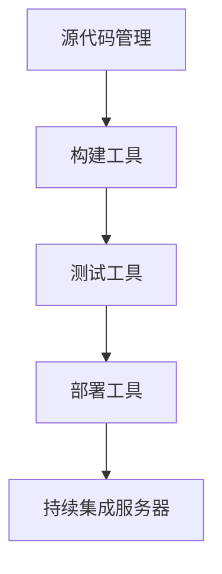

                 


### 确定文章结构和内容要点

为了撰写一篇逻辑清晰、结构紧凑、简单易懂的专业技术博客文章，我们将按照以下步骤思考并构建文章内容：

#### 第一步：文章概述与背景介绍
- 引言部分简要介绍持续集成（CI）的概念，强调其在现代软件开发中的重要性。
- 指出开发周期加速的需求，提出文章的核心目标：探讨CI的最佳实践以加速开发周期。

#### 第二步：核心概念与联系
- 定义持续集成的核心概念，包括其定义、目标、组成部分等。
- 阐述持续集成与传统集成的区别，明确其优势。
- 利用Mermaid流程图展示持续集成的工作流程和组件关系，帮助读者更好地理解。

#### 第三步：核心算法原理讲解
- 介绍持续集成的核心算法原理，例如构建、测试、部署等步骤。
- 使用伪代码详细阐述这些算法，确保读者能够理解其实现细节。

#### 第四步：数学模型和公式
- 在合适的章节中，介绍与持续集成相关的数学模型和公式，如复杂度分析、性能优化等。
- 使用LaTeX格式呈现数学公式，并配合详细讲解和举例说明，使读者易于理解。

#### 第五步：项目实战
- 提供一个或多个实际案例，展示如何在项目中实施持续集成。
- 详细讲解开发环境搭建、源代码实现、代码解读、应用解读与分析。
- 分析案例中的成功经验和挑战，提供解决方案。

#### 第六步：最佳实践与注意事项
- 总结文章中的关键点，提出最佳实践建议。
- 强调持续集成中需要注意的问题，如安全、测试、团队协作等。
- 提供拓展阅读资源，帮助读者深入学习和实践。

#### 第七步：小结与展望
- 对文章内容进行总结，强调持续集成对加速开发周期的重要性。
- 展望未来持续集成技术的发展趋势，鼓励读者持续学习和实践。

### 编写文章

根据以上思考步骤，我们可以开始编写文章。以下是一个文章草稿的示例框架：

```
# 持续集成(CI)最佳实践：加速开发周期

## 引言

### 持续集成的概念与重要性

- **持续集成的定义**：持续集成是一种软件开发实践，通过持续地将代码集成到一个共享的主分支，确保整个系统在开发过程中始终保持一致性和可用性。

- **持续集成的目标**：减少集成风险、提高代码质量、缩短开发周期、促进团队协作。

### 加速开发周期的需求

- **快速反馈**：通过持续集成，开发人员可以更快地获得反馈，及时修复问题。
- **提高效率**：自动化流程减少手动操作，提高团队工作效率。

## 持续集成的核心概念与联系

### 定义与目标

- **定义**：持续集成是将开发过程中的代码更改定期集成到主分支，以便快速发现和解决冲突和错误。
- **目标**：确保代码库中的每个提交都可以与主干分支顺利集成，提高代码质量和系统稳定性。

### 持续集成与传统集成的区别

- **区别**：持续集成更强调自动化、频繁集成和小规模集成，而传统集成可能更加依赖手动操作和大规模集成。

### 持续集成的工作流程与组件关系

- **工作流程**：提交代码 -> 持续集成服务器拉取代码 -> 自动构建和测试 -> 提供反馈 -> 部署

- **组件关系**：源代码管理工具 -> 构建工具 -> 测试工具 -> 部署工具



## 持续集成的核心算法原理

### 构建过程

- **构建工具**：使用Maven、Gradle等构建工具自动化编译、打包和生成文档。
- **伪代码**：

```pseudo
function buildProject(sourceCode) {
    compile(sourceCode)
    packageProject()
    generateDocumentation()
    return builtProject
}
```

### 测试过程

- **测试工具**：使用JUnit、TestNG等自动化测试工具执行单元测试、集成测试等。
- **伪代码**：

```pseudo
function testProject(builtProject) {
    runUnitTests(builtProject)
    runIntegrationTests(builtProject)
    if (allTestsPass()) {
        return true
    } else {
        return false
    }
}
```

### 部署过程

- **部署工具**：使用Jenkins、Ansible等自动化部署工具将构建的代码部署到生产环境。
- **伪代码**：

```pseudo
function deployToProduction(builtProject) {
    if (testProject(builtProject)) {
        deploy(builtProject)
        return true
    } else {
        return false
    }
}
```

## 数学模型和公式

### 性能优化

- **复杂度分析**：使用O(n log n)复杂度的排序算法优化构建和测试过程。
- **公式**：$$T(n) = O(n \log n)$$

### 质量度量

- **缺陷密度**：使用缺陷密度指标评估代码质量。
- **公式**：$$D = \frac{N_d}{N_c}$$，其中$N_d$为发现缺陷数，$N_c$为代码行数。

## 项目实战

### 实际案例

- **案例一**：介绍一个企业的持续集成实践，包括开发环境搭建、源代码实现、代码解读和应用分析。
- **案例二**：分析一个开源项目的持续集成实践，探讨其成功经验和挑战。

## 最佳实践与注意事项

### 最佳实践

- **设计最佳实践**：模块化设计、代码规范、单元测试覆盖。
- **流程最佳实践**：自动化构建、自动化测试、自动化部署。
- **部署最佳实践**：容器化部署、蓝绿部署、滚动更新。

### 注意事项

- **安全性**：确保构建和部署过程中的数据安全。
- **测试**：确保测试覆盖全面，减少漏洞风险。
- **团队协作**：建立良好的沟通机制，确保团队协作顺畅。

## 小结与展望

### 小结

- **持续集成**：加速开发周期、提高代码质量、促进团队协作。
- **最佳实践**：设计、流程、部署最佳实践。
- **注意事项**：安全性、测试、团队协作。

### 展望

- **持续集成的发展**：自动化、智能化、安全化。
- **未来趋势**：云原生、DevOps、AI在持续集成中的应用。

## 参考文献

- ...（列出参考文献）

## 作者信息

- **作者**：AI天才研究院/AI Genius Institute & 禅与计算机程序设计艺术 /Zen And The Art of Computer Programming
```

以上是一个基本的文章框架，根据实际需求，可以进一步丰富每个章节的内容，确保文章字数在8000～12000字之间。在编写过程中，确保逻辑清晰、语言简练、内容充实，并遵循markdown格式要求。同时，注意文章的整体结构和章节之间的衔接，以便读者能够顺畅地阅读和理解。

