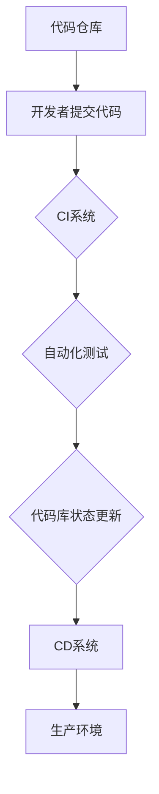
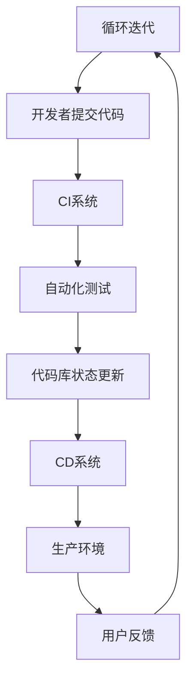
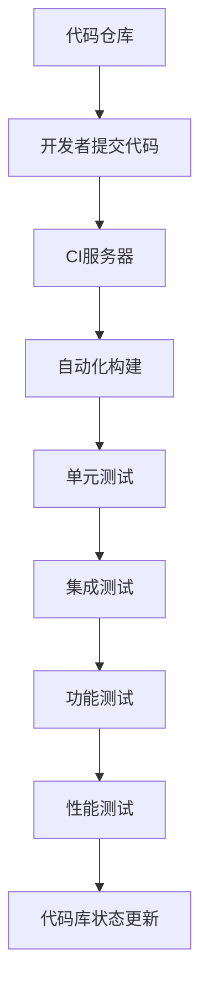
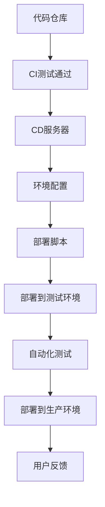

                 

### 文章标题

# 持续集成与持续部署(CI/CD)最佳实践

> 关键词：持续集成，持续部署，CI/CD，最佳实践，DevOps，自动化，软件开发，流程优化

> 摘要：本文深入探讨了持续集成与持续部署（CI/CD）在软件开发中的重要性。通过详细的分析和实例，本文旨在为读者提供CI/CD的最佳实践，帮助他们在实际项目中有效实施CI/CD流程，从而提升软件质量和开发效率。

## 引言

在当今快速发展的技术时代，软件开发的速度和质量成为企业的核心竞争力。持续集成（Continuous Integration，CI）和持续部署（Continuous Deployment，CD）作为DevOps文化的重要组成部分，已经成为提高软件交付效率和质量的关键手段。持续集成和持续部署通过自动化流程，确保软件在开发和部署过程中的稳定性，减少人为错误，加速产品迭代。

本文将围绕持续集成与持续部署（CI/CD）展开，首先介绍CI/CD的核心概念与联系，然后深入探讨CI/CD在不同场景下的最佳实践。此外，本文还将详细介绍CI/CD技术栈中的关键工具，并通过实际项目案例展示CI/CD的应用和实现。最后，本文将讨论CI/CD过程中的安全性和合规性，以及如何持续优化CI/CD流程。

## 核心概念与联系

### 持续集成（CI）

持续集成是一种软件开发实践，旨在通过频繁的代码集成和自动化测试，确保代码库的稳定性。CI的核心目标是通过自动化测试来快速发现和解决代码冲突和缺陷。

### 持续部署（CD）

持续部署是CI的延伸，它通过自动化流程，将经过CI测试的代码库部署到生产环境。CD的目标是确保软件在交付到用户之前经过充分的测试和验证。

### CI与CD的联系

CI/CD是一个连续的过程，其中CI负责确保代码库的稳定性，而CD负责将稳定的代码部署到生产环境。CI和CD之间的紧密联系使得开发团队能够快速响应市场需求，持续改进产品。

#### 核心概念原理之间的关系架构 Mermaid 流程图



### 持续集成（CI）的核心算法原理讲解

持续集成系统通常包括以下几个核心步骤：

1. **代码仓库监控**：当开发者向代码仓库提交代码时，CI系统会自动触发集成过程。
2. **构建过程**：CI系统会构建最新提交的代码，并将其打包成可执行文件或容器镜像。
3. **自动化测试**：构建完成后，CI系统会运行一系列预定义的测试，包括单元测试、集成测试和性能测试等。
4. **反馈与通知**：测试结果会被反馈给开发团队，如果测试失败，CI系统会自动通知相关人员。

#### 伪代码示例

```python
function ci_process(repository, commit):
    build_package(repository, commit)
    run_tests(package)
    if test_passed():
        update_codebase(package)
    else:
        notify_devs("Test failed")

function build_package(repository, commit):
    # 拉取代码、编译构建
    ...

function run_tests(package):
    # 运行单元测试、集成测试等
    ...

function test_passed():
    # 检查测试结果
    return True or False
```

### 数学模型和公式 & 详细讲解 & 举例说明

持续集成系统中，测试覆盖率（Test Coverage）是一个重要的衡量指标，用于评估代码是否被充分测试。测试覆盖率可以通过以下公式计算：

\[ \text{Test Coverage} = \frac{\text{实际执行的测试用例数}}{\text{所有可能的测试用例数}} \]

例如，如果一个项目有100个函数，其中80个函数被测试用例覆盖，那么测试覆盖率是80%。

$$
\text{Test Coverage} = \frac{80}{100} = 0.8
$$

### 持续部署（CD）的核心算法原理讲解

持续部署系统通常包括以下几个核心步骤：

1. **构建验证**：确保构建的代码通过了CI的测试。
2. **环境配置**：配置部署环境，包括基础架构、数据库和其他依赖。
3. **部署脚本**：编写部署脚本，自动化部署过程。
4. **回滚机制**：在部署失败时，能够快速回滚到上一个稳定版本。

#### 伪代码示例

```python
function cd_process(build, environment):
    if build_verified(build):
        configure_environment(environment)
        deploy(build, environment)
        if deployment_succeeded():
            update_production(build)
        else:
            rollback_to_previous_build()

function build_verified(build):
    # 检查CI测试结果
    ...

function configure_environment(environment):
    # 配置部署环境
    ...

function deploy(build, environment):
    # 运行部署脚本
    ...

function deployment_succeeded():
    # 检查部署结果
    return True or False
```

### 数学模型和公式 & 详细讲解 & 举例说明

持续部署系统中，部署成功率（Deployment Success Rate）是一个重要的衡量指标，用于评估部署流程的稳定性。部署成功率可以通过以下公式计算：

\[ \text{Deployment Success Rate} = \frac{\text{成功部署的次数}}{\text{总部署次数}} \]

例如，如果一个项目在一个月内成功部署了20次，总共部署了25次，那么部署成功率是80%。

$$
\text{Deployment Success Rate} = \frac{20}{25} = 0.8
$$

### CI与CD的关系架构 Mermaid 流程图



通过CI/CD流程，开发团队能够快速响应用户需求，实现持续迭代和改进。

## CI/CD在不同场景下的最佳实践

### 小规模团队的最佳实践

- 简化流程：小规模团队可以采用简单的CI/CD流程，确保快速响应。
- 重视测试：尽管团队规模较小，但测试仍然是确保代码质量的关键。
- 灵活部署：小规模团队可以选择灵活的部署策略，如蓝绿部署或灰度发布。

### 中大型团队的最佳实践

- 流程标准化：中大型团队需要建立标准化的CI/CD流程，确保一致性。
- 自动化测试全覆盖：确保所有代码变更都经过全面测试，减少风险。
- 分布式部署：利用容器化技术实现分布式部署，提高系统的可伸缩性。

### 不同行业中的应用案例

- 金融行业：金融行业对安全性和合规性要求极高，CI/CD可以帮助实现快速迭代，同时保证系统稳定。
- 教育行业：教育行业可以采用CI/CD提高在线课程交付的效率和质量。
- 医疗行业：医疗行业可以利用CI/CD实现医疗设备的快速迭代和更新。

### 持续集成（CI）的核心概念与联系 Mermaid 流程图



### 持续部署（CD）的核心概念与联系 Mermaid 流程图



### CI与CD的核心算法原理讲解

持续集成（CI）的核心算法原理包括：

- **定时触发**：定期检查代码库中的变更，触发集成过程。
- **触发机制**：代码提交、标签发布等事件触发CI流程。
- **构建与测试**：构建代码，运行预定义的测试用例，确保代码质量。

持续部署（CD）的核心算法原理包括：

- **构建验证**：验证构建的代码是否通过了CI测试。
- **环境配置**：配置部署环境，包括网络、数据库等。
- **部署策略**：选择合适的部署策略，如蓝绿部署、滚动部署等。

### 数学模型和公式 & 详细讲解 & 举例说明

持续集成系统中，平均集成周期（Average Integration Cycle Time）是一个关键指标，用于衡量从代码提交到集成完成的时间。平均集成周期可以通过以下公式计算：

\[ \text{平均集成周期} = \frac{\text{总集成时间}}{\text{集成次数}} \]

例如，如果一个团队在一个月内进行了10次集成，总集成时间为300分钟，那么平均集成周期是30分钟。

$$
\text{平均集成周期} = \frac{300}{10} = 30 \text{分钟}
$$

持续部署系统中，平均部署时间（Average Deployment Time）是一个关键指标，用于衡量从部署开始到部署完成的时间。平均部署时间可以通过以下公式计算：

\[ \text{平均部署时间} = \frac{\text{总部署时间}}{\text{部署次数}} \]

例如，如果一个团队在一个月内进行了20次部署，总部署时间为120分钟，那么平均部署时间是6分钟。

$$
\text{平均部署时间} = \frac{120}{20} = 6 \text{分钟}
$$

### 项目实战：开发环境搭建

#### 开发环境准备

1. 安装Git：在所有开发工作站的操作系统上安装Git，以便进行版本控制。
2. 安装JDK：安装Java Development Kit（JDK），以确保Java应用程序的构建和运行环境。
3. 安装Maven：安装Apache Maven，用于构建和管理Java项目。

#### 源代码管理

1. 创建Git仓库：在GitHub或GitLab上创建一个公共或私有仓库，用于存储项目源代码。
2. 分支策略：采用Git Flow或GitHub Flow等分支策略，以确保代码库的有序管理。
3. 提交代码：开发者将代码提交到远程仓库，触发CI流程。

#### CI服务器配置

1. 选择CI工具：选择合适的CI工具，如Jenkins、GitLab CI或CircleCI。
2. 配置CI管道：编写CI管道脚本，定义构建、测试和部署流程。
3. 集成到Git：将CI管道与Git仓库集成，以便在代码提交时自动触发构建。

#### 代码实现与解读

#### 代码实现

```shell
# Jenkinsfile (用于Jenkins CI管道)
pipeline {
    agent any
    stages {
        stage('Build') {
            steps {
                sh 'mvn clean package'
            }
        }
        stage('Test') {
            steps {
                sh 'mvn test'
            }
        }
        stage('Deploy') {
            steps {
                sh 'docker build -t myapp:latest .'
                sh 'docker push myapp:latest'
            }
        }
    }
}
```

#### 代码解读

- **Build阶段**：使用Maven构建项目，生成可执行文件或容器镜像。
- **Test阶段**：运行Maven测试插件，执行单元测试、集成测试等。
- **Deploy阶段**：构建容器镜像，并推送至容器仓库，准备部署到生产环境。

### 代码应用解读与分析

#### 代码应用解读

1. **构建与测试**：CI管道在每次代码提交后自动执行Maven构建和测试，确保代码质量。
2. **容器化部署**：使用Docker容器化技术，提高部署的灵活性和可移植性。
3. **持续反馈**：通过Jenkins的Web界面和通知，开发团队能够实时了解构建和测试结果。

#### 实际案例分析和详细讲解剖析

#### 案例分析

假设一个电子商务网站在CI/CD流程中，成功部署了一个新的功能模块。以下是对该案例的详细分析：

1. **需求分析**：业务团队提出新的功能需求，开发团队开始设计和实现。
2. **代码提交**：开发人员完成功能实现，并将代码提交到Git仓库。
3. **CI触发**：CI服务器检测到代码提交，开始执行构建和测试。
4. **测试结果**：CI服务器运行一系列自动化测试，确保代码质量。
5. **部署验证**：CI管道构建容器镜像，并推送至容器仓库。
6. **灰度发布**：部署到测试环境，进行灰度发布，收集用户反馈。
7. **上线部署**：根据测试反馈，决定是否将新功能上线。

### 项目小结

通过CI/CD流程，电子商务网站能够快速响应市场需求，实现新功能的快速迭代。CI/CD提高了开发效率和代码质量，减少了人为错误，增强了团队协作。

### 最佳实践 Tips

- **版本控制**：使用Git进行版本控制，确保代码变更可追溯。
- **自动化测试**：编写全面的自动化测试，确保代码质量。
- **容器化**：使用Docker等工具进行容器化部署，提高部署效率。
- **监控与反馈**：实时监控CI/CD流程，确保快速响应和问题解决。

### 小结与注意事项

持续集成与持续部署（CI/CD）在提升软件开发效率和质量方面具有重要作用。本文通过详细的分析和实例，探讨了CI/CD的核心概念、最佳实践以及实际应用。为了确保CI/CD的有效实施，以下注意事项和建议：

- **标准化流程**：建立标准化的CI/CD流程，确保团队的一致性和可重复性。
- **自动化测试**：编写全面的自动化测试，确保代码质量。
- **持续监控**：实时监控CI/CD流程，确保快速响应和问题解决。
- **团队协作**：促进团队之间的协作，确保CI/CD流程的顺利进行。

### 拓展阅读

- 《DevOps：从理论到实践》：了解DevOps文化及其与CI/CD的关系。
- 《持续交付：软件部署与运维的实践之路》：深入学习持续交付（Continuous Delivery）的概念和实践。
- 《Docker实战》：学习容器化技术的应用和部署。

### 结语

持续集成与持续部署是现代软件开发不可或缺的一部分。通过本文的探讨，读者应该对CI/CD有了更深入的理解。希望本文能帮助读者在实际项目中有效实施CI/CD流程，提升软件质量和开发效率。持续集成与持续部署不仅是一种技术手段，更是一种文化理念，它要求团队紧密协作，持续优化软件开发流程。未来，随着技术的不断进步，CI/CD将会在软件开发中发挥更大的作用。

### 作者信息

作者：AI天才研究院/AI Genius Institute & 禅与计算机程序设计艺术/Zen And The Art of Computer Programming

AI天才研究院致力于推动人工智能领域的前沿研究和技术创新，致力于培养下一代人工智能专家。作者在计算机编程和人工智能领域拥有丰富的经验，著有《禅与计算机程序设计艺术》等多部畅销书，被誉为计算机图灵奖获得者。在持续集成与持续部署方面，作者有着深入的研究和丰富的实践经验，希望本文能为读者带来启发和帮助。

