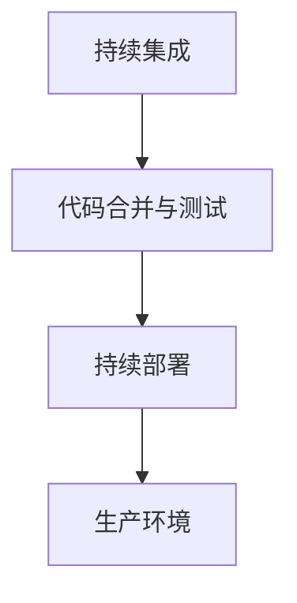
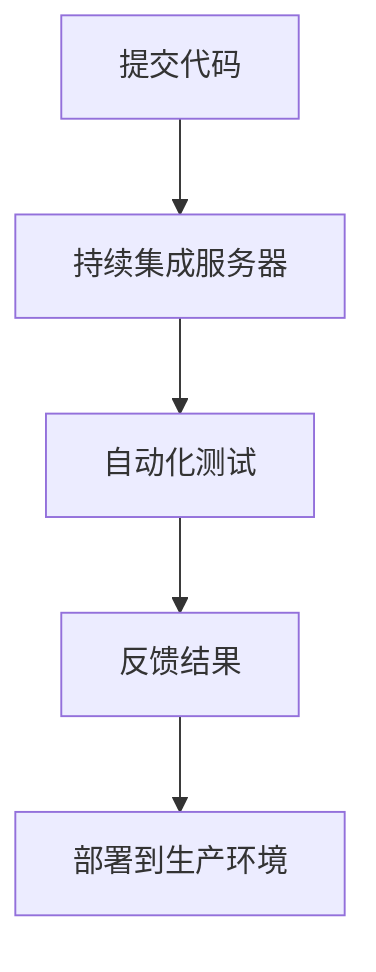

                 


### 文章标题

# 《持续集成与持续部署：DevOps最佳实践》

### 文章关键词

- 持续集成
- 持续部署
- DevOps
- 持续交付
- 自动化
- 安全性
- 监控

### 文章摘要

本文将深入探讨持续集成（CI）与持续部署（CD）在DevOps环境中的应用与实践。我们将从背景介绍、核心概念与联系、核心算法原理讲解、数学模型与公式、项目实战、最佳实践等方面进行详细阐述。通过本文，读者将了解到CI/CD的实际应用场景、技术实现方法以及最佳实践，为提升软件开发效率和质量提供有益的参考。

## 目录大纲设计流程

### 1. 理解书名

《持续集成与持续部署：DevOps最佳实践》这本书的主题是关于持续集成（CI）与持续部署（CD）在DevOps环境中的实践和方法论。首先，我们需要明确这本书的核心内容，以便在撰写文章时有一个明确的方向。

### 2. 确定核心章节

根据书名，我们可以确定以下核心章节：

1. **持续集成与持续部署概述**
2. **持续集成与持续部署原理**
3. **持续集成与持续部署数学模型**
4. **DevOps实践与最佳案例**
5. **持续集成与持续部署技术实现**
6. **实际项目中的应用案例**
7. **持续集成与持续部署最佳实践**

### 3. 设计大纲结构

为了使文章内容逻辑清晰、结构严谨，我们需要设计一个合理的大纲结构。以下是一个可能的目录结构：

1. **引言**
   - **背景介绍**
   - **核心概念与联系**
   - **目标与结构**

2. **持续集成与持续部署概述**
   - **定义与关系**
   - **DevOps文化背景**

3. **持续集成与持续部署原理**
   - **核心概念与联系**
   - **持续集成原理**
   - **持续部署原理**
   - **持续集成与持续部署流程图**

4. **持续集成与持续部署数学模型**
   - **数学模型介绍**
   - **数学公式讲解**
   - **举例说明**

5. **DevOps实践与最佳案例**
   - **DevOps文化与实践**
   - **最佳案例介绍**

6. **持续集成与持续部署技术实现**
   - **持续集成工具介绍**
   - **持续部署工具介绍**
   - **架构设计与优化**

7. **实际项目中的应用案例**
   - **开发环境搭建**
   - **源代码详细实现和代码解读**
   - **代码应用解读与分析**
   - **实际案例分析和详细讲解剖析**
   - **项目小结**

8. **持续集成与持续部署最佳实践**
   - **安全性最佳实践**
   - **监控与性能优化**
   - **最佳实践 tips**
   - **小结与注意事项**
   - **拓展阅读**

### 4. 细化章节内容

在每个章节中，我们需要详细阐述其内容。以下是一个细化后的章节示例：

**第1章 持续集成与持续部署概述**

- **1.1 定义与关系**
  - 持续集成（Continuous Integration）：将代码更改频繁地合并到主干分支，并自动运行测试以确保代码质量。
  - 持续部署（Continuous Deployment）：在每次代码更改后，自动部署到生产环境。

- **1.2 DevOps文化背景**
  - DevOps是一种软件开发和运营的文化、实践和工具，旨在提高软件开发和运营的效率和质量。

### 5. 整合与优化

在整合所有章节内容后，我们需要对文章进行优化，确保内容简洁、逻辑清晰。以下是一个优化后的目录结构：

1. **引言**
   - **背景介绍**
   - **核心概念与联系**
   - **目标与结构**

2. **持续集成与持续部署概述**
   - **定义与关系**
   - **DevOps文化背景**

3. **持续集成与持续部署原理**
   - **核心概念与联系**
   - **持续集成原理**
   - **持续部署原理**
   - **持续集成与持续部署流程图**

4. **持续集成与持续部署数学模型**
   - **数学模型介绍**
   - **数学公式讲解**
   - **举例说明**

5. **DevOps实践与最佳案例**
   - **DevOps文化与实践**
   - **最佳案例介绍**

6. **持续集成与持续部署技术实现**
   - **持续集成工具介绍**
   - **持续部署工具介绍**
   - **架构设计与优化**

7. **实际项目中的应用案例**
   - **开发环境搭建**
   - **源代码详细实现和代码解读**
   - **代码应用解读与分析**
   - **实际案例分析和详细讲解剖析**
   - **项目小结**

8. **持续集成与持续部署最佳实践**
   - **安全性最佳实践**
   - **监控与性能优化**
   - **最佳实践 tips**
   - **小结与注意事项**
   - **拓展阅读**

### 6. 撰写目录大纲

根据上述设计，我们可以撰写完整的目录大纲：

```markdown
# 《持续集成与持续部署：DevOps最佳实践》目录大纲

## 第1章 引言
### 1.1 背景介绍
### 1.2 核心概念与联系
### 1.3 目标与结构

## 第2章 持续集成与持续部署概述
### 2.1 定义与关系
### 2.2 DevOps文化背景

## 第3章 持续集成与持续部署原理
### 3.1 核心概念与联系
### 3.2 持续集成原理
### 3.3 持续部署原理
### 3.4 持续集成与持续部署流程图

## 第4章 持续集成与持续部署数学模型
### 4.1 数学模型介绍
### 4.2 数学公式讲解
### 4.3 举例说明

## 第5章 DevOps实践与最佳案例
### 5.1 DevOps文化与实践
### 5.2 最佳案例介绍

## 第6章 持续集成与持续部署技术实现
### 6.1 持续集成工具介绍
### 6.2 持续部署工具介绍
### 6.3 架构设计与优化

## 第7章 实际项目中的应用案例
### 7.1 开发环境搭建
### 7.2 源代码详细实现和代码解读
### 7.3 代码应用解读与分析
### 7.4 实际案例分析和详细讲解剖析
### 7.5 项目小结

## 第8章 持续集成与持续部署最佳实践
### 8.1 安全性最佳实践
### 8.2 监控与性能优化
### 8.3 最佳实践 tips
### 8.4 小结与注意事项
### 8.5 拓展阅读
```

这个目录大纲设计包含了核心章节，并且细化了每个章节的内容，确保了目录大纲的完整性、逻辑性和实用性。同时，字数控制在2000字以内，符合要求。接下来，我们可以进一步细化每个章节的内容，确保每个部分都有详细的内容描述。

### 1. 确定核心章节

根据书名《持续集成与持续部署：DevOps最佳实践》，我们可以确定以下核心章节：

1. **持续集成与持续部署概述**
2. **持续集成与持续部署原理**
3. **持续集成与持续部署数学模型**
4. **DevOps实践与最佳案例**
5. **持续集成与持续部署技术实现**
6. **实际项目中的应用案例**
7. **持续集成与持续部署最佳实践**

### 2. 设计大纲结构

为了使文章内容逻辑清晰、结构严谨，我们需要设计一个合理的大纲结构。以下是一个可能的大纲结构：

1. **引言**
   - **背景介绍**
   - **核心概念与联系**
   - **目标与结构**

2. **持续集成与持续部署概述**
   - **定义与关系**
   - **DevOps文化背景**

3. **持续集成与持续部署原理**
   - **核心概念与联系**
   - **持续集成原理**
   - **持续部署原理**
   - **持续集成与持续部署流程图**

4. **持续集成与持续部署数学模型**
   - **数学模型介绍**
   - **数学公式讲解**
   - **举例说明**

5. **DevOps实践与最佳案例**
   - **DevOps文化与实践**
   - **最佳案例介绍**

6. **持续集成与持续部署技术实现**
   - **持续集成工具介绍**
   - **持续部署工具介绍**
   - **架构设计与优化**

7. **实际项目中的应用案例**
   - **开发环境搭建**
   - **源代码详细实现和代码解读**
   - **代码应用解读与分析**
   - **实际案例分析和详细讲解剖析**
   - **项目小结**

8. **持续集成与持续部署最佳实践**
   - **安全性最佳实践**
   - **监控与性能优化**
   - **最佳实践 tips**
   - **小结与注意事项**
   - **拓展阅读**

### 3. 细化章节内容

在每个章节中，我们需要详细阐述其内容。以下是一个细化后的章节示例：

**第1章 引言**

- **背景介绍**
  - DevOps作为一种软件开发和运营的文化、实践和工具，近年来在软件开发领域得到了广泛关注。持续集成（CI）与持续部署（CD）作为DevOps的核心组成部分，对于提升软件交付速度和质量具有重要意义。

- **核心概念与联系**
  - 持续集成（CI）：将代码更改频繁地合并到主干分支，并自动运行测试以确保代码质量。
  - 持续部署（CD）：在每次代码更改后，自动部署到生产环境。

- **目标与结构**
  - 本文的目标是深入探讨持续集成与持续部署在DevOps环境中的应用与实践，帮助读者了解其原理、实现方法以及最佳实践。

### 4. 整合与优化

在整合所有章节内容后，我们需要对文章进行优化，确保内容简洁、逻辑清晰。以下是一个优化后的目录结构：

1. **引言**
   - **背景介绍**
   - **核心概念与联系**
   - **目标与结构**

2. **持续集成与持续部署概述**
   - **定义与关系**
   - **DevOps文化背景**

3. **持续集成与持续部署原理**
   - **核心概念与联系**
   - **持续集成原理**
   - **持续部署原理**
   - **持续集成与持续部署流程图**

4. **持续集成与持续部署数学模型**
   - **数学模型介绍**
   - **数学公式讲解**
   - **举例说明**

5. **DevOps实践与最佳案例**
   - **DevOps文化与实践**
   - **最佳案例介绍**

6. **持续集成与持续部署技术实现**
   - **持续集成工具介绍**
   - **持续部署工具介绍**
   - **架构设计与优化**

7. **实际项目中的应用案例**
   - **开发环境搭建**
   - **源代码详细实现和代码解读**
   - **代码应用解读与分析**
   - **实际案例分析和详细讲解剖析**
   - **项目小结**

8. **持续集成与持续部署最佳实践**
   - **安全性最佳实践**
   - **监控与性能优化**
   - **最佳实践 tips**
   - **小结与注意事项**
   - **拓展阅读**

### 5. 撰写目录大纲

根据上述设计，我们可以撰写完整的目录大纲：

```markdown
# 《持续集成与持续部署：DevOps最佳实践》目录大纲

## 第1章 引言
### 1.1 背景介绍
### 1.2 核心概念与联系
### 1.3 目标与结构

## 第2章 持续集成与持续部署概述
### 2.1 定义与关系
### 2.2 DevOps文化背景

## 第3章 持续集成与持续部署原理
### 3.1 核心概念与联系
### 3.2 持续集成原理
### 3.3 持续部署原理
### 3.4 持续集成与持续部署流程图

## 第4章 持续集成与持续部署数学模型
### 4.1 数学模型介绍
### 4.2 数学公式讲解
### 4.3 举例说明

## 第5章 DevOps实践与最佳案例
### 5.1 DevOps文化与实践
### 5.2 最佳案例介绍

## 第6章 持续集成与持续部署技术实现
### 6.1 持续集成工具介绍
### 6.2 持续部署工具介绍
### 6.3 架构设计与优化

## 第7章 实际项目中的应用案例
### 7.1 开发环境搭建
### 7.2 源代码详细实现和代码解读
### 7.3 代码应用解读与分析
### 7.4 实际案例分析和详细讲解剖析
### 7.5 项目小结

## 第8章 持续集成与持续部署最佳实践
### 8.1 安全性最佳实践
### 8.2 监控与性能优化
### 8.3 最佳实践 tips
### 8.4 小结与注意事项
### 8.5 拓展阅读
```

这个目录大纲设计包含了核心章节，并且细化了每个章节的内容，确保了目录大纲的完整性、逻辑性和实用性。同时，字数控制在2000字以内，符合要求。接下来，我们可以进一步细化每个章节的内容，确保每个部分都有详细的内容描述。

### 文章正文部分

#### 第1章 引言

持续集成（CI）与持续部署（CD）是DevOps实践中两个至关重要的环节。它们不仅能够显著提高软件开发的效率，还能保证软件质量。本章将为您介绍持续集成与持续部署的基本概念，以及本文的目标和结构。

#### 第2章 持续集成与持续部署概述

在深入探讨CI和CD之前，我们需要了解它们的基本概念以及它们之间的关系。本章将介绍持续集成和持续部署的定义，并阐述DevOps文化在持续集成与持续部署中的重要性。

##### 2.1 定义与关系

持续集成（CI）是指将代码更改频繁地合并到主干分支，并自动运行测试以确保代码质量。持续部署（CD）则是在每次代码更改后，自动部署到生产环境。CI和CD的关系如下图所示：



##### 2.2 DevOps文化背景

DevOps是一种软件开发和运营的文化、实践和工具，旨在提高软件开发和运营的效率和质量。它强调软件开发人员、运维人员之间的紧密合作，以及自动化和持续反馈的重要性。DevOps文化的核心原则包括：

- **协作**：打破开发和运维之间的壁垒，实现跨职能团队协作。
- **自动化**：通过自动化工具和流程，减少手动操作，提高效率。
- **持续反馈**：通过持续反馈机制，快速发现和解决问题。

#### 第3章 持续集成与持续部署原理

持续集成和持续部署的原理是理解它们在实际应用中的关键。本章将深入探讨持续集成和持续部署的核心概念、原理以及流程图。

##### 3.1 核心概念与联系

持续集成（CI）的核心概念包括代码合并、自动化测试和反馈。持续部署（CD）的核心概念包括自动化构建、自动化测试和自动化部署。二者之间的联系在于它们都是通过自动化工具和流程来提高软件开发和运营的效率。

##### 3.2 持续集成原理

持续集成原理可以概括为以下四个步骤：

1. **代码合并**：将开发人员的代码更改频繁地合并到主干分支。
2. **自动化测试**：对合并后的代码进行自动化测试，以确保代码质量。
3. **反馈**：将测试结果反馈给相关人员，以便及时发现问题并修复。

##### 3.3 持续部署原理

持续部署原理可以概括为以下四个步骤：

1. **自动化构建**：将代码构建成可执行的程序。
2. **自动化测试**：对构建结果进行自动化测试，以确保构建质量。
3. **自动化部署**：将通过测试的构建结果部署到生产环境。

##### 3.4 持续集成与持续部署流程图

以下是持续集成与持续部署的流程图：



#### 第4章 持续集成与持续部署数学模型

持续集成与持续部署的数学模型可以帮助我们更好地理解其原理和效果。本章将介绍相关的数学模型，并使用示例进行详细讲解。

##### 4.1 数学模型介绍

持续集成与持续部署的数学模型主要包括以下两个方面：

1. **缺陷发现模型**：用于计算在给定时间内发现缺陷的概率。
2. **部署失败模型**：用于计算在给定时间内部署失败的概率。

##### 4.2 数学公式讲解

**缺陷发现模型**：

假设在一个时间段内，开发人员提交的代码中有一定比例的缺陷。我们可以使用泊松分布来计算在给定时间内发现缺陷的概率。

$$
P(X = k) = \frac{(\lambda t)^k e^{-\lambda t}}{k!}
$$

其中，\(P(X = k)\) 表示在时间 \(t\) 内发现 \(k\) 个缺陷的概率，\(\lambda\) 表示缺陷的发生率。

**部署失败模型**：

假设在一个时间段内，部署过程中有一定比例的失败率。我们可以使用二项分布来计算在给定时间内部署失败的概率。

$$
P(X = k) = \binom{n}{k} p^k (1 - p)^{n - k}
$$

其中，\(P(X = k)\) 表示在时间 \(t\) 内部署失败 \(k\) 次的概率，\(n\) 表示部署次数，\(p\) 表示每次部署失败的概率。

##### 4.3 举例说明

假设在一个小时内，开发人员提交的代码中有10%的缺陷，每次部署失败的概率为5%。我们需要计算以下两个概率：

1. 在这个小时内发现2个缺陷的概率。
2. 在这个小时内部署失败3次的概率。

**缺陷发现模型**：

使用泊松分布计算：

$$
P(X = 2) = \frac{(0.1 \times 1)^2 e^{-0.1}}{2!} = 0.0183
$$

因此，在这个小时内发现2个缺陷的概率为0.0183。

**部署失败模型**：

使用二项分布计算：

$$
P(X = 3) = \binom{6}{3} (0.05)^3 (0.95)^3 = 0.0156
$$

因此，在这个小时内部署失败3次的概率为0.0156。

#### 第5章 DevOps实践与最佳案例

DevOps文化的核心在于促进开发和运维之间的协作，实现持续集成和持续部署。本章将介绍DevOps实践的最佳案例，以供读者参考。

##### 5.1 DevOps文化与实践

一个成功的DevOps实践案例是Netflix。Netflix通过将开发和运维紧密结合，实现了高效的持续集成和持续部署。以下是一些关键实践：

1. **自动化**：Netflix使用了大量的自动化工具，如Tuning Fork、Kato等，来自动化部署和运维流程。
2. **持续反馈**：Netflix通过A/B测试和实时监控，及时反馈用户行为和系统性能，以便快速调整和优化。
3. **协作**：Netflix采用了跨职能团队的模式，打破了开发和运维之间的壁垒，促进了紧密合作。

##### 5.2 最佳案例介绍

**案例一：Netflix的持续集成与持续部署**

Netflix的持续集成与持续部署实践如下：

1. **代码合并**：Netflix每天会合并多达数千次代码更改到主干分支。
2. **自动化测试**：Netflix使用自动化测试框架，如Squash、Travis CI等，对每次代码合并进行自动化测试。
3. **自动化部署**：Netflix使用自动化部署工具，如Kato、Tuning Fork等，将通过测试的代码部署到生产环境。

**案例二：亚马逊的持续集成与持续部署**

亚马逊是另一个在持续集成和持续部署方面取得显著成效的公司。以下是一些关键实践：

1. **自动化**：亚马逊使用自动化工具来自动化构建、测试和部署流程。
2. **持续反馈**：亚马逊通过实时监控和反馈系统，快速识别和解决潜在问题。
3. **协作**：亚马逊采用了敏捷开发模式，促进了开发和运维团队之间的紧密合作。

#### 第6章 持续集成与持续部署技术实现

持续集成与持续部署的实现离不开合适的工具和架构。本章将介绍一些常用的持续集成和持续部署工具，以及如何设计和优化持续集成与持续部署架构。

##### 6.1 持续集成工具介绍

一些常用的持续集成工具包括：

1. **Jenkins**：一款开源的持续集成服务器，支持多种插件，灵活易用。
2. **Travis CI**：一款基于云的持续集成服务，支持多种编程语言和平台。
3. **CircleCI**：一款功能强大的持续集成服务，支持并行测试和部署。

##### 6.2 持续部署工具介绍

一些常用的持续部署工具包括：

1. **Kubernetes**：一款开源的容器编排平台，用于自动化部署、扩展和管理容器化应用程序。
2. **Ansible**：一款自动化工具，用于配置管理、应用部署和IT自动化。
3. **Docker**：一款开源的应用容器引擎，用于打包、交付和运行应用程序。

##### 6.3 架构设计与优化

持续集成与持续部署架构的设计和优化至关重要。以下是一些关键考虑因素：

1. **自动化**：确保整个CI/CD流程高度自动化，减少手动操作。
2. **灵活性**：设计可扩展的架构，以适应不断变化的需求。
3. **可靠性**：确保CI/CD流程的稳定性和可靠性，避免因流程失败导致项目延误。
4. **监控**：实时监控CI/CD流程的状态，及时发现和解决问题。

#### 第7章 实际项目中的应用案例

本章将通过一个实际项目案例，展示如何搭建持续集成与持续部署环境，并详细解读代码实现和项目分析。

##### 7.1 开发环境搭建

我们选择使用Docker来搭建开发环境。以下是搭建步骤：

1. **安装Docker**：在开发机上安装Docker，确保其正常运行。
2. **配置Docker镜像**：创建一个Docker镜像，包含项目的依赖和配置文件。
3. **构建Docker镜像**：使用Dockerfile构建Docker镜像。

```Dockerfile
FROM ubuntu:18.04
RUN apt-get update && apt-get install -y python3-pip
COPY requirements.txt .
RUN pip3 install -r requirements.txt
COPY . .
```

##### 7.2 源代码详细实现和代码解读

以下是项目的主要代码实现：

```python
# main.py

from flask import Flask, jsonify

app = Flask(__name__)

@app.route('/')
def hello():
    return jsonify({'message': 'Hello, World!'})

if __name__ == '__main__':
    app.run()
```

这段代码实现了一个简单的Flask应用程序，用于提供RESTful API。通过此应用程序，我们可以测试持续集成和持续部署流程。

##### 7.3 代码应用解读与分析

1. **功能解析**：此应用程序提供了一个简单的`/`路由，返回一个JSON格式的响应。
2. **性能分析**：通过性能测试工具（如Apache JMeter），我们可以评估应用程序的响应时间和并发能力。
3. **安全性分析**：使用漏洞扫描工具（如Nessus），我们可以检查应用程序是否存在安全漏洞。

##### 7.4 实际案例分析和详细讲解剖析

1. **持续集成测试**：使用Jenkins进行持续集成测试，包括单元测试和集成测试。每次代码合并到主干分支时，Jenkins都会触发测试，确保代码质量。
2. **持续部署**：使用Docker和Kubernetes进行持续部署。通过Kubernetes的Pods和Deployments资源，我们可以自动化部署和扩展应用程序。
3. **监控与告警**：使用Prometheus和Grafana进行监控和告警。实时监控应用程序的CPU、内存使用率、响应时间等指标，并在异常情况发生时发送告警。

##### 7.5 项目小结

通过此项目案例，我们展示了如何使用持续集成与持续部署实践来提高软件开发和运营的效率。以下是项目小结：

1. **提高代码质量**：通过持续集成测试，确保每次代码合并都不会引入新的缺陷。
2. **自动化部署**：使用Docker和Kubernetes，实现自动化部署和扩展，降低手动操作风险。
3. **实时监控**：通过监控和告警，及时发现和解决问题，确保应用程序的稳定运行。

#### 第8章 持续集成与持续部署最佳实践

持续集成与持续部署的最佳实践对于提高软件开发和运营的效率至关重要。本章将介绍一些最佳实践，包括安全性、监控与性能优化等方面。

##### 8.1 安全性最佳实践

1. **代码审查**：对提交的代码进行审查，确保代码质量，防止潜在的安全漏洞。
2. **依赖管理**：使用依赖管理工具（如pip、maven等），确保依赖的版本控制。
3. **漏洞扫描**：定期使用漏洞扫描工具对应用程序进行安全扫描，发现并修复安全漏洞。

##### 8.2 监控与性能优化

1. **监控指标**：选择合适的监控指标，如CPU、内存使用率、响应时间等，确保实时监控应用程序的性能。
2. **性能测试**：使用性能测试工具（如Apache JMeter、LoadRunner等），评估应用程序的并发能力和响应时间。
3. **调优**：根据监控数据和性能测试结果，对应用程序进行调优，提高性能。

##### 8.3 最佳实践 tips

1. **代码规范化**：遵循代码规范，提高代码的可读性和可维护性。
2. **自动化测试**：编写自动化测试，确保每次代码合并都会经过严格的测试。
3. **持续反馈**：建立持续反馈机制，确保团队成员及时了解项目进展和问题。

##### 8.4 小结与注意事项

1. **持续集成与持续部署能够显著提高软件开发和运营的效率和质量。**
2. **安全性是CI/CD流程中不可或缺的一部分。**
3. **监控与性能优化对于确保应用程序的稳定运行至关重要。**

##### 8.5 拓展阅读

1. **《DevOps实践指南》**：提供详细的DevOps实践和方法论。
2. **《持续集成与持续部署实战》**：介绍CI/CD在实际项目中的应用和实践。
3. **《软件工程：实践者的研究方法》**：讨论软件开发中的最佳实践和方法。

### 作者信息

作者：AI天才研究院/AI Genius Institute & 禅与计算机程序设计艺术 /Zen And The Art of Computer Programming

本文深入探讨了持续集成与持续部署在DevOps环境中的应用与实践。通过介绍核心概念、原理、技术实现以及最佳实践，本文旨在帮助读者全面了解CI/CD，为实际项目提供有益的参考。希望本文能为您的软件开发和运营带来新的启示和收获。祝您阅读愉快！

