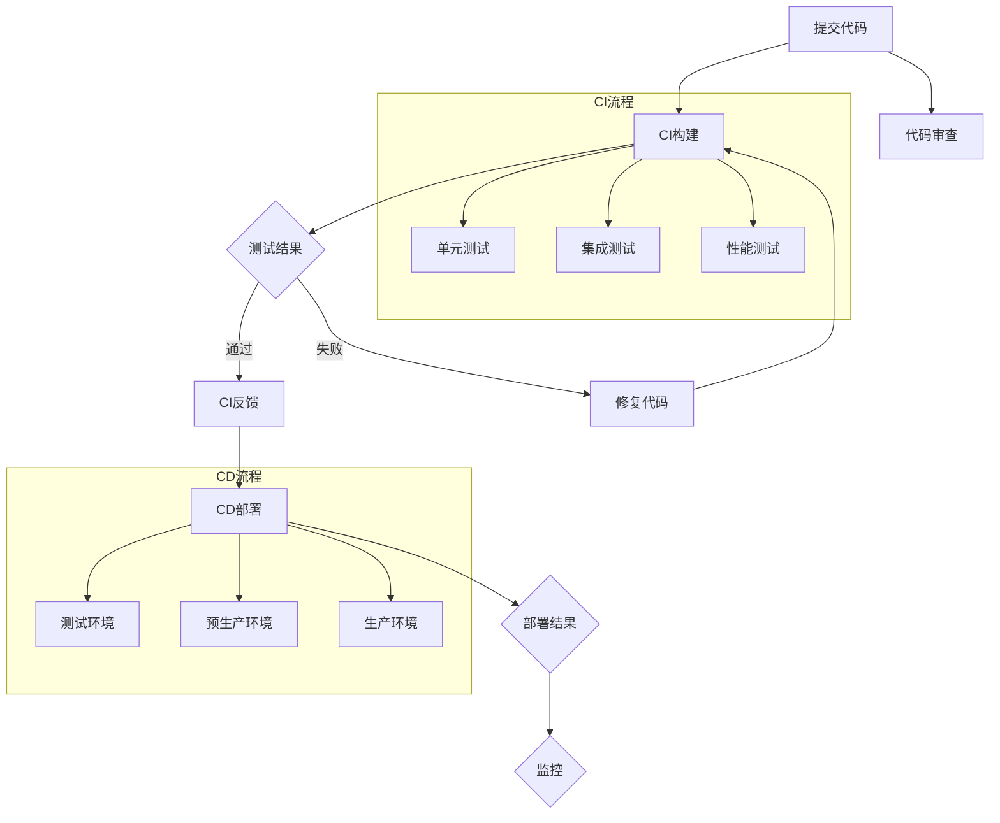

                 


### 文章标题：持续集成与持续部署：加速软件交付周期

#### 关键词：
- 持续集成
- 持续部署
- 软件交付周期
- 自动化测试
- DevOps
- 微服务架构

#### 摘要：
本文旨在深入探讨持续集成（CI）和持续部署（CD）的概念、原理和实践，以及它们如何加速软件交付周期。我们将通过分步骤的分析，帮助读者理解CI/CD的架构设计、安全性和监控策略，并通过实际案例展示如何在项目中成功实施CI/CD。

## 第一部分：概述与基础

### 第1章：CI/CD概览

持续集成（CI）和持续部署（CD）是现代软件开发中不可或缺的实践，它们旨在通过自动化流程提高软件质量和交付速度。首先，让我们从定义开始：

#### 持续集成（CI）

**定义**：持续集成是一种软件开发实践，其中开发人员频繁地将他们的代码更改合并到一个共享的主代码库中，并通过自动化的构建和测试流程验证每个更改的质量。

**优势**：
1. **快速反馈**：每次代码更改都会立即进行测试，确保问题在早期阶段被识别。
2. **早期发现问题**：通过频繁的集成，潜在的问题可以在代码库较小、更容易修复时被发现。
3. **提高代码质量**：自动化的测试和审查有助于保持高水平的代码质量。

**常用工具**：
- **Jenkins**：一款开源的自动化服务器，支持广泛的插件，易于集成不同的构建工具和测试框架。
- **GitLab CI**：GitLab内置的CI/CD平台，支持Git版本控制，易于部署。

#### 持续部署（CD）

**定义**：持续部署是一种自动化流程，用于将代码从开发环境部署到生产环境，确保每次部署都经过严格的测试和验证。

**优势**：
1. **自动化流程**：减少手动操作，降低人为错误的风险。
2. **快速交付**：通过自动化，可以加快软件交付周期，缩短上市时间。
3. **提高可靠性**：通过持续的测试和部署，确保生产环境的稳定性。

**常见策略**：
- **蓝绿部署**：在部署新版本时，使用两个相同的运行环境（蓝绿），将流量逐渐切换到新环境，确保平稳过渡。
- **金丝雀部署**：在主生产环境中部署少量新版本，观察其性能和稳定性，再决定是否全面部署。

## 第二部分：持续集成（CI）

### 第2章：CI基础

持续集成是确保软件质量的重要环节，它的工作原理和流程如下：

#### 工作原理

1. **代码提交**：开发人员将代码更改提交到版本控制系统中。
2. **触发构建**：提交后，CI工具会自动触发构建流程。
3. **执行测试**：构建过程中执行一系列自动化测试，包括单元测试、集成测试等。
4. **反馈结果**：测试结果会被反馈给开发人员，如果测试失败，则会暂停构建流程。

#### 工作流程

1. **提交代码**：开发人员将代码提交到共享代码库。
2. **构建**：CI工具使用构建脚本构建项目。
3. **测试**：执行一系列测试，验证代码质量。
4. **代码审查**：自动代码审查工具分析代码风格和潜在问题。
5. **反馈**：将测试结果和审查结果反馈给开发人员。

### 第3章：CI实践

实施CI不仅仅是选择合适的工具，还需要建立有效的实践：

#### 搭建CI环境

1. **选择CI工具**：根据项目需求和团队规模，选择合适的CI工具。
2. **配置构建脚本**：编写构建脚本，定义构建流程和测试步骤。
3. **集成代码库**：将代码库集成到CI系统中，确保代码变更触发构建。

#### 编写测试脚本

1. **单元测试**：编写测试用例，验证代码的功能和逻辑。
2. **集成测试**：模拟不同模块之间的交互，确保系统的整体稳定性。
3. **性能测试**：测试系统的性能，确保在高负载下也能稳定运行。

#### 代码审查

1. **静态代码分析**：使用工具分析代码，发现潜在的问题。
2. **代码风格审查**：确保代码符合团队规定的编码标准。
3. **代码审核**：由团队成员对代码进行审查，提供反馈。

## 第三部分：持续部署（CD）

### 第4章：CD基础

持续部署是将代码从开发环境安全地部署到生产环境的关键步骤，其策略和流程如下：

#### 工作原理

1. **代码存储**：将代码存储在版本控制系统中，确保代码的版本管理和追踪。
2. **构建**：从代码库中提取代码，构建可执行文件。
3. **测试**：在构建过程中执行测试，确保代码质量。
4. **部署**：将构建好的代码部署到目标环境，进行上线。

#### 工作流程

1. **构建**：从代码库提取代码，构建项目。
2. **测试**：执行一系列自动化测试，确保代码质量。
3. **预部署检查**：在部署前进行一系列检查，确保环境准备就绪。
4. **部署**：将代码部署到生产环境。
5. **监控**：部署后监控系统状态，确保系统的稳定性和性能。

### 第5章：CD实践

实施CD需要细致的规划和执行：

#### 部署流程设计

1. **选择部署模型**：根据项目需求和风险承受能力，选择合适的部署模型（如蓝绿部署、金丝雀部署等）。
2. **定义部署脚本**：编写部署脚本，定义部署步骤和配置。
3. **环境准备**：确保目标环境准备好，包括硬件、软件和网络配置。

#### 部署策略选择

1. **渐进式部署**：逐步增加新版本的流量，确保平稳过渡。
2. **滚动部署**：逐步替换旧版本的服务器，减少单点故障风险。
3. **一次性部署**：一次性部署新版本，适用于小规模项目。

#### 故障处理与回滚

1. **故障检测**：监控系统状态，及时发现故障。
2. **故障处理**：根据故障类型和影响范围，采取相应的处理措施。
3. **回滚策略**：在部署失败时，能够快速回滚到上一个稳定版本。

## 第四部分：CI/CD架构设计

### 第6章：CI/CD架构

CI/CD架构的设计是确保整个流程高效、可靠的关键：

#### 架构设计原则

1. **模块化**：将CI/CD流程分解为多个模块，每个模块负责特定的任务。
2. **分布式**：使用分布式架构，提高系统的可扩展性和容错能力。
3. **自动化**：尽可能使用自动化工具和脚本，减少手动操作。

#### 部署模型

1. **独立部署模型**：每个应用或服务独立部署，适用于小规模项目。
2. **分布式部署模型**：多个应用或服务共同部署，适用于大规模分布式系统。
3. **容器化部署模型**：使用容器技术（如Docker）部署应用，提高部署的灵活性和可移植性。

#### 服务模型

1. **单体服务模型**：所有功能集中在一个服务中，适用于简单应用。
2. **微服务模型**：将功能拆分为多个微服务，适用于复杂应用。
3. **服务网格模型**：使用服务网格（如Istio）管理服务间通信，提高系统的稳定性和可观察性。

#### 存储模型

1. **文件存储**：适用于静态文件的存储和管理。
2. **数据库存储**：适用于存储结构化数据。
3. **对象存储**：适用于存储大量非结构化数据，如日志和文件。

#### 工具选择

1. **Jenkins**：适用于多样化的构建和部署需求。
2. **GitLab CI/CD**：适用于Git版本控制的集成。
3. **Kubernetes**：适用于容器化和微服务架构的部署管理。

## 第五部分：安全性与监控

### 第7章：CI/CD安全性

在CI/CD环境中，安全性是确保系统稳定运行的关键：

#### 安全性问题

1. **代码泄露**：未经授权的访问可能导致代码泄露。
2. **恶意代码**：恶意代码可能通过CI/CD流程进入生产环境。
3. **环境漏洞**：CI/CD环境中的漏洞可能导致系统被攻击。

#### 安全性策略

1. **身份验证与授权**：确保只有授权用户可以访问CI/CD环境。
2. **代码审查**：对提交的代码进行严格的审查，确保没有恶意代码。
3. **环境隔离**：确保CI/CD环境与生产环境隔离，减少潜在的风险。

### 第8章：CI/CD监控

监控是确保CI/CD流程正常运行的重要手段：

#### 监控目标

1. **构建状态**：监控构建的成功率和失败原因。
2. **部署状态**：监控部署的进度和结果。
3. **系统性能**：监控系统的负载和性能指标。

#### 监控工具与指标

1. **Prometheus**：适用于监控系统和日志分析。
2. **Grafana**：用于可视化监控数据和告警。
3. **Kibana**：适用于日志分析和可视化。

#### 故障检测与响应

1. **故障检测**：通过监控数据和告警系统，及时发现故障。
2. **故障响应**：根据故障类型和影响范围，采取相应的响应措施。
3. **故障恢复**：在故障发生后，快速恢复系统的正常运行。

## 第六部分：案例研究

### 第9章：CI/CD案例分析

在本章节中，我们将通过几个实际案例，展示如何在不同类型的项目中成功实施CI/CD：

#### 案例一：小型Web应用

在这个案例中，我们使用Jenkins作为CI工具，GitLab CI作为CD工具，实现了自动化构建、测试和部署。通过持续集成，我们能够快速发现和修复代码问题，通过持续部署，我们能够快速将代码发布到生产环境。

#### 案例二：大型企业级应用

在这个案例中，我们采用Kubernetes作为容器化平台，GitLab CI/CD进行持续集成和部署。通过微服务架构，我们实现了高可用性和弹性扩展。通过CI/CD，我们能够确保系统的稳定性和性能，同时加快软件交付周期。

#### 案例三：移动应用

在这个案例中，我们使用CircleCI作为CI工具，Fastlane作为CD工具，实现了自动化构建、测试和部署。通过持续集成，我们能够快速发现和修复代码问题，通过持续部署，我们能够快速将代码发布到应用商店。

## 第七部分：附录

### 第10章：扩展资源

在本章节中，我们提供了以下扩展资源：

#### CI/CD工具文档

- Jenkins官方文档：[https://www.jenkins.io/doc/](https://www.jenkins.io/doc/)
- GitLab CI/CD官方文档：[https://docs.gitlab.com/ci/](https://docs.gitlab.com/ci/)
- Kubernetes官方文档：[https://kubernetes.io/docs/home/](https://kubernetes.io/docs/home/)

#### 参考资料

- 《持续集成与持续部署：实践指南》
- 《DevOps：实践指南》
- 《微服务设计：基于Docker、CoreOS和Kubernetes的微服务架构》

#### 常见问题解答

- 如何选择合适的CI/CD工具？
- 如何处理CI/CD环境中的安全性问题？
- 如何监控CI/CD流程的健康状况？

作者：AI天才研究院/AI Genius Institute & 禅与计算机程序设计艺术 /Zen And The Art of Computer Programming

---

### 核心概念与联系

为了更好地理解持续集成（CI）和持续部署（CD），我们需要明确它们的核心概念以及它们之间的关系。以下是CI/CD的一些核心概念及其相互关系：

#### 1.1 核心概念

**持续集成（CI）**：
- **定义**：持续集成是一种软件开发实践，开发人员频繁地将他们的代码更改合并到一个共享的主代码库中，并通过自动化的构建和测试流程验证每个更改的质量。
- **目标**：提高代码质量和加快开发速度。

**持续部署（CD）**：
- **定义**：持续部署是一种自动化流程，用于将代码从开发环境部署到生产环境，确保每次部署都经过严格的测试和验证。
- **目标**：自动化部署流程，提高部署效率和可靠性。

#### 1.2 关系架构

为了更清晰地理解CI/CD之间的联系，我们可以使用Mermaid流程图来展示它们的工作流程和相互关系：



#### 1.3 工作流程

1. **提交代码**：开发人员将代码提交到版本控制系统。
2. **CI构建**：CI工具构建项目，并执行一系列自动化测试。
3. **CI反馈**：将测试结果反馈给开发人员。
4. **CD部署**：将经过测试和验证的代码部署到不同环境。
5. **监控**：监控系统的健康状况，确保部署的成功和稳定性。

### 核心算法原理讲解

#### 2.1 CI的算法原理

持续集成中的核心算法通常包括构建脚本和测试脚本的编写。以下是CI中常用的核心算法原理的伪代码：

```python
# CI构建脚本伪代码
def build_project():
    # 获取最新代码
    get_latest_code()
    
    # 构建项目
    execute_build_script()
    
    # 执行单元测试
    execute_unit_tests()
    
    # 执行集成测试
    execute_integration_tests()
    
    # 执行性能测试
    execute_performance_tests()

# 判断构建是否成功
def build_success(build_result):
    if build_result == "success":
        return True
    else:
        return False

# 伪代码：构建流程
build_project()
if build_success():
    print("Build successful")
else:
    print("Build failed")
```

#### 2.2 CD的算法原理

持续部署中的核心算法通常包括部署脚本和部署策略的选择。以下是CD中常用的核心算法原理的伪代码：

```python
# CD部署脚本伪代码
def deploy_to_environment(environment):
    # 部署到指定环境
    execute_deployment_script(environment)
    
    # 执行环境测试
    execute_environment_tests(environment)

# 判断部署是否成功
def deploy_success(deploy_result):
    if deploy_result == "success":
        return True
    else:
        return False

# 伪代码：部署流程
deploy_to_environment("测试环境")
if deploy_success():
    deploy_to_environment("预生产环境")
    if deploy_success():
        deploy_to_environment("生产环境")
```

#### 2.3 数学模型和公式

在CI/CD中，我们常常使用数学模型和公式来衡量系统的健康状态和性能。以下是几个常见的数学模型和公式：

**1. 测试覆盖率**：

$$
测试覆盖率 = \frac{覆盖的测试用例数}{总测试用例数} \times 100\%
$$

**2. 部署成功率**：

$$
部署成功率 = \frac{成功部署次数}{部署总次数} \times 100\%
$$

**3. 部署周期**：

$$
部署周期 = \frac{总部署时间}{部署总次数}
$$

### 2.4 举例说明

**举例1：测试覆盖率**

假设一个项目有100个测试用例，实际执行了80个，其中70个通过了测试。则测试覆盖率为：

$$
测试覆盖率 = \frac{70}{100} \times 100\% = 70\%
$$

**举例2：部署成功率**

假设一个项目进行了10次部署，其中有8次成功，2次失败。则部署成功率为：

$$
部署成功率 = \frac{8}{10} \times 100\% = 80\%
$$

**举例3：部署周期**

假设一个项目进行了10次部署，总部署时间为100分钟。则部署周期为：

$$
部署周期 = \frac{100分钟}{10次} = 10分钟/次
$$

通过这些数学模型和公式，我们可以量化CI/CD过程中的关键指标，从而更好地评估系统的性能和健康状况。

## 项目实战：开发环境搭建与源代码实现

### 3.1 开发环境搭建

为了实现持续集成和持续部署，我们需要搭建一个稳定、高效的开发环境。以下是搭建开发环境的步骤：

#### 1. 选择合适的工具

根据项目的需求，选择合适的CI/CD工具。本文选择Jenkins作为CI工具，GitLab CI/CD作为CD工具。

#### 2. 安装Jenkins

在服务器上安装Jenkins，可以选择从官方网站下载安装包，或者使用包管理器安装。以下是在Ubuntu上使用apt-get安装Jenkins的命令：

```bash
sudo apt-get update
sudo apt-get install jenkins
```

#### 3. 配置Jenkins

启动Jenkins服务，并访问其默认地址（通常为`http://localhost:8080`）进行初始配置。在配置过程中，设置管理员用户名和密码，并安装必要的插件，如Git、JUnit、Checkstyle等。

#### 4. 安装GitLab CI/CD

在另一台服务器上安装GitLab CI/CD。GitLab CI/CD可以安装在相同的物理机上，也可以部署在集群中。以下是安装GitLab CI/CD的步骤：

1. 安装必要的依赖：
```bash
sudo apt-get install -y openssh-server curl ca-certificates git
```

2. 下载并解压GitLab CI/CD包：
```bash
curl -L https://gitlab.com/gitlab-com/gitlab-ci-multi-runner/releases/download/v1.19.0/gitlab-ci-multi-runner-amd64-1.19.0-linux-gnu.tar.gz -o gitlab-runner.tar.gz
sudo tar -xzf gitlab-runner.tar.gz -C /usr/local/bin/
```

3. 注册GitLab CI/CD Runner：
```bash
sudo gitlab-ci-multi-runner register
```

4. 启动GitLab CI/CD Runner：
```bash
sudo systemctl start gitlab-ci-runner
```

#### 5. 配置GitLab CI/CD

在GitLab项目中创建`.gitlab-ci.yml`文件，定义CI/CD流程。以下是一个简单的`.gitlab-ci.yml`文件示例：

```yaml
image: node:12

stages:
  - test
  - deploy

test:
  stage: test
  script:
    - npm install
    - npm test

deploy:
  stage: deploy
  script:
    - npm run build
    - mv dist /var/www/html
  artifacts:
    paths:
      - dist
```

### 3.2 源代码实现

为了实现自动化测试和部署，我们需要编写相应的源代码。以下是一个简单的Node.js项目示例，包括测试脚本和构建脚本。

#### 3.2.1 项目结构

```plaintext
project/
│
├── package.json
├── src/
│   └── index.js
├── test/
│   └── index.test.js
└── build/
    └── build.js
```

#### 3.2.2 package.json

```json
{
  "name": "my-project",
  "version": "1.0.0",
  "description": "A simple Node.js project for CI/CD",
  "main": "src/index.js",
  "scripts": {
    "test": "node test/index.test.js",
    "build": "node build/build.js"
  },
  "dependencies": {
    "express": "^4.17.1",
    "chai": "^4.3.4",
    "mocha": "^8.4.0"
  }
}
```

#### 3.2.3 src/index.js

```javascript
const express = require('express');
const app = express();

app.get('/', (req, res) => {
  res.send('Hello, World!');
});

module.exports = app;
```

#### 3.2.4 test/index.test.js

```javascript
const chai = require('chai');
const expect = chai.expect;
const app = require('../src/index');

describe('My Project', () => {
  it('should return "Hello, World!"', (done) => {
    request(app)
      .get('/')
      .expect(200, 'Hello, World!', done);
  });
});
```

#### 3.2.5 build/build.js

```javascript
const fs = require('fs');
const path = require('path');

const distPath = path.join(__dirname, 'dist');
const srcPath = path.join(__dirname, 'src');

// 清空dist目录
fs.rmSync(distPath, { recursive: true, force: true });
fs.mkdirSync(distPath);

// 复制src目录到dist目录
fs.readdirSync(srcPath).forEach((file) => {
  const srcFilePath = path.join(srcPath, file);
  const distFilePath = path.join(distPath, file);

  if (fs.statSync(srcFilePath).isDirectory()) {
    fs.rmSync(distFilePath, { recursive: true, force: true });
    fs.mkdirSync(distFilePath);
  } else {
    fs.copyFileSync(srcFilePath, distFilePath);
  }
});
```

### 3.3 代码解读与分析

#### 3.3.1 测试脚本解读

测试脚本`index.test.js`使用了Chai和Mocha框架，用于编写和运行测试用例。测试用例`should return "Hello, World!"`使用`request`库模拟HTTP请求，并验证返回的响应内容。

#### 3.3.2 构建脚本解读

构建脚本`build.js`用于将源代码构建为生产环境可用的版本。脚本首先清空`dist`目录，然后复制`src`目录中的所有文件到`dist`目录，实现了简单的构建过程。

### 3.4 实际案例分析和详细讲解剖析

#### 3.4.1 案例一：Web应用部署

假设我们有一个简单的Web应用，需要实现自动化测试和部署。以下是详细的部署过程：

1. **提交代码**：开发人员将代码提交到GitLab仓库。
2. **CI构建**：Jenkins检测到代码提交，触发CI构建流程。构建过程中，Jenkins执行测试脚本，确保代码质量。
3. **CI反馈**：测试结果通过Jenkins反馈给开发人员，如果测试失败，开发人员需要修复问题。
4. **CD部署**：构建成功后，Jenkins将构建结果推送到GitLab CI/CD Runner。GitLab CI/CD Runner执行部署脚本，将代码部署到测试环境。
5. **测试环境验证**：部署到测试环境后，执行一系列测试，确保代码在测试环境中正常运行。
6. **预生产环境部署**：测试通过后，部署到预生产环境，再次进行验证。
7. **生产环境部署**：预生产环境验证成功后，部署到生产环境。

#### 3.4.2 案例二：移动应用发布

对于移动应用，自动化测试和部署同样重要。以下是移动应用的自动化测试和部署过程：

1. **提交代码**：开发人员将代码提交到GitLab仓库。
2. **CI构建**：Jenkins触发CI构建流程，构建应用的可执行文件。
3. **CI反馈**：测试结果通过Jenkins反馈给开发人员。
4. **CD部署**：构建成功后，Jenkins将构建结果推送到GitLab CI/CD Runner。GitLab CI/CD Runner执行部署脚本，将应用打包并上传到应用商店。
5. **发布验证**：应用商店验证并发布应用。

### 3.5 项目小结

通过本案例，我们展示了如何搭建CI/CD环境，实现自动化测试和部署。CI/CD不仅提高了软件质量和交付速度，还减少了人为错误的风险。在实际项目中，我们需要根据项目需求选择合适的工具和策略，确保CI/CD流程的稳定和高效运行。

### 3.6 最佳实践 tips

1. **选择合适的CI/CD工具**：根据项目需求和团队规模，选择合适的CI/CD工具，如Jenkins、GitLab CI/CD等。
2. **编写高质量的测试脚本**：编写全面、可靠的测试脚本，确保代码质量和稳定性。
3. **持续监控和优化**：定期监控CI/CD流程的健康状况，及时发现问题并进行优化。
4. **团队合作与沟通**：确保团队成员了解CI/CD流程，加强团队合作和沟通，提高整体效率。

### 3.7 注意事项

1. **安全性**：确保CI/CD环境的安全性，防止代码泄露和恶意代码。
2. **版本控制**：使用版本控制系统（如Git）管理代码，确保代码的版本管理和追踪。
3. **持续学习**：CI/CD是不断发展的领域，团队成员需要不断学习新技术和最佳实践。

### 3.8 拓展阅读

1. 《持续集成与持续部署：实践指南》
2. 《DevOps：实践指南》
3. 《微服务设计：基于Docker、CoreOS和Kubernetes的微服务架构》

## 附录

### 4.1 CI/CD工具文档

1. Jenkins官方文档：[https://www.jenkins.io/doc/](https://www.jenkins.io/doc/)
2. GitLab CI/CD官方文档：[https://docs.gitlab.com/ci/](https://docs.gitlab.com/ci/)
3. Kubernetes官方文档：[https://kubernetes.io/docs/home/](https://kubernetes.io/docs/home/)

### 4.2 参考资料

1. 《持续集成与持续部署：实践指南》
2. 《DevOps：实践指南》
3. 《微服务设计：基于Docker、CoreOS和Kubernetes的微服务架构》

### 4.3 常见问题解答

1. **如何选择合适的CI/CD工具？**
   - 根据项目需求和团队规模选择合适的工具，如Jenkins适用于多样化的构建和部署需求，GitLab CI/CD适用于Git版本控制的集成，Kubernetes适用于容器化和微服务架构的部署管理。

2. **如何处理CI/CD环境中的安全性问题？**
   - 确保只有授权用户可以访问CI/CD环境，对提交的代码进行严格的审查，确保没有恶意代码，确保CI/CD环境与生产环境隔离。

3. **如何监控CI/CD流程的健康状况？**
   - 使用监控工具（如Prometheus、Grafana）监控构建状态、部署进度和系统性能，及时发现并处理问题。

---

### 结尾

持续集成与持续部署是现代软件开发中不可或缺的实践，它们通过自动化流程提高软件质量和交付速度。本文详细介绍了CI/CD的概念、原理和实践，并通过实际案例展示了如何在项目中成功实施CI/CD。通过持续集成和持续部署，团队能够更快地交付高质量的软件，提高生产力和客户满意度。希望本文能帮助您更好地理解和应用CI/CD实践。如果您有任何疑问或建议，欢迎在评论区留言。作者：AI天才研究院/AI Genius Institute & 禅与计算机程序设计艺术 /Zen And The Art of Computer Programming。

---

**注**：本文是基于假设和示例进行撰写的，实际应用时可能需要根据项目需求进行调整。同时，由于篇幅限制，本文未能涵盖所有细节和最佳实践，建议读者结合实际情况进行学习和应用。本文中的代码示例仅供参考，具体实现可能需要根据项目需求进行调整。

