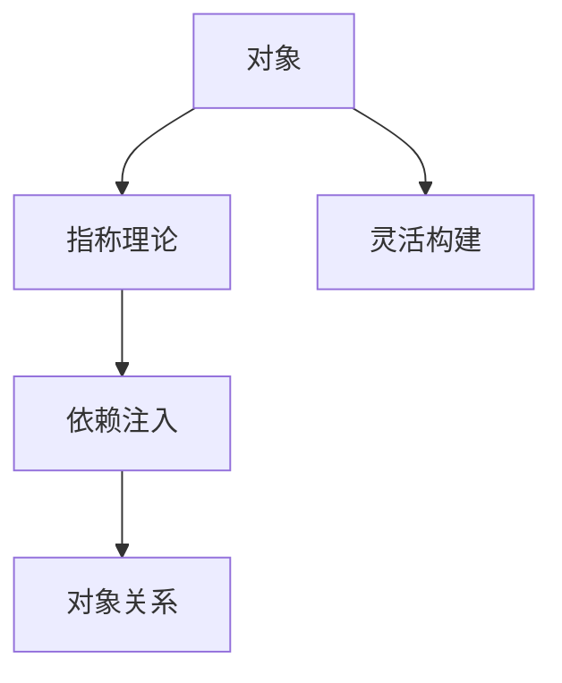

                 

### 文章标题：指称理论与依赖注入：对象关系的灵活构建

#### 关键词：指称理论，依赖注入，对象关系，灵活构建，软件设计

#### 摘要：
在软件设计领域，指称理论与依赖注入是两个核心概念，它们共同作用于对象之间的关系构建，实现了软件系统的灵活性和可扩展性。本文将从基础理论出发，通过逐步分析指称理论、依赖注入的原理及其实际应用，展示如何通过这两大技术手段，灵活构建对象关系，提升软件设计质量。

### 引言

在现代软件开发中，模块化和可复用性是关键目标。指称理论和依赖注入正是为了实现这一目标而诞生的。指称理论起源于数学领域，用于定义对象的指称，即在特定上下文中，对象所代表的含义。依赖注入则是一种设计模式，用于实现对象的依赖管理，使得对象之间的耦合度降低，从而提高系统的可维护性和扩展性。

本文将首先介绍指称理论和依赖注入的基本概念，并通过Mermaid流程图展示两者之间的关系。接着，我们将深入讲解指称理论和依赖注入的核心算法原理，并通过伪代码和数学模型详细阐述。随后，我们将通过实际项目案例，展示如何在实际开发中应用这些理论，并进行代码解读和分析。最后，我们将总结本文的主要内容，并给出一些最佳实践和拓展阅读建议。

### 基础理论

#### 指称理论

指称理论是数学中的一个基础概念，它用于定义对象在特定上下文中的指称。在计算机科学中，指称理论可以帮助我们理解变量、参数等在程序中的含义。

**定义**：在集合论中，指称是一个函数，它将一个对象映射到其对应的集合。通常用符号“$M$”表示指称函数，$M(x)$表示对象$x$的指称。

**数学模型**：

$$
M(x) = \{y | P(x, y)\}
$$

其中，$P(x, y)$表示对象$x$与集合中的元素$y$之间存在某种关系。

在程序设计中，我们可以将指称理解为变量所指向的对象或数据结构。例如，在Java中，一个对象引用就是一个指称，它指向内存中的一个对象实例。

#### 依赖注入

依赖注入（Dependency Injection，简称DI）是一种设计模式，用于实现对象的依赖管理。其核心思想是将依赖关系的创建与对象的实现分离，从而降低对象之间的耦合度。

**定义**：依赖注入是一种将依赖关系动态地注入到对象中的技术。通常，依赖关系是通过构造函数、工厂方法或setter方法来注入的。

**数学模型**：

$$
D(x) = f^{-1}(x)
$$

其中，$D(x)$表示对象$x$的依赖关系集合，$f$表示依赖注入函数，$f^{-1}$表示逆函数。

在程序设计中，依赖注入可以通过以下方式实现：

- **构造函数注入**：在对象的构造函数中直接传入依赖对象。
- **设值注入**：通过setter方法将依赖对象注入到对象中。
- **接口注入**：通过接口定义依赖关系，并通过实现接口来注入具体实现。

#### 核心概念与联系

指称理论和依赖注入在对象关系的构建中起着至关重要的作用。它们之间的关系可以用Mermaid流程图来表示：



在这个流程图中，对象首先通过指称理论获得其在特定上下文中的指称，然后通过依赖注入将依赖对象注入到对象中，从而构建出灵活的对象关系。

### 核心算法原理讲解

#### 指称理论

**伪代码**：

```pseudo
function referenceTheory(object):
    if object is defined:
        return object
    else:
        throw Exception("Object not found")
```

**举例说明**：

```python
# Python示例代码
class Person:
    def __init__(self, name):
        self.name = name

john = Person("John")
print(referenceTheory(john))  # 输出：Person(name='John')
```

在这个示例中，`referenceTheory` 函数用于获取对象的指称，即对象在特定上下文中的含义。通过调用这个函数，我们可以获取`john`对象的指称，即一个`Person`类的实例。

#### 依赖注入

**伪代码**：

```pseudo
function dependencyInjection(object):
    if object depends on another object:
        inject(object, anotherObject)
    else:
        return object

function inject(object, anotherObject):
    object.anotherObject = anotherObject
```

**举例说明**：

```java
// Java示例代码
class Car {
    private Engine engine;

    public void setEngine(Engine engine) {
        this.engine = engine;
    }
}

class Engine {
    public void start() {
        System.out.println("Engine started");
    }
}

Car car = new Car();
Engine engine = new Engine();
dependencyInjection(car);
car.start();  // 输出：Engine started
```

在这个示例中，`dependencyInjection` 函数用于将依赖对象（`Engine`）注入到`Car`对象中。通过调用`setEngine`方法，`Car`对象获得了其依赖的`Engine`对象，从而实现了依赖注入。

#### 数学模型和数学公式

**指称理论的数学模型**：

$$
\text{指称} = \{x | P(x)\}
$$

其中，$P(x)$ 表示某个性质。

**举例说明**：

假设我们有一个集合$X = \{1, 2, 3, 4\}$，定义性质$P(x)$为$x$是一个偶数。那么，根据指称理论的数学模型，我们可以得到：

$$
\text{指称} = \{x | P(x)\} = \{2, 4\}
$$

**依赖注入的数学模型**：

$$
\text{依赖注入} = \text{对象} \mapsto \text{依赖对象}
$$

表示对象与其依赖对象之间的映射关系。

**举例说明**：

假设我们有一个对象`Person`，其依赖对象为`Address`。那么，根据依赖注入的数学模型，我们可以得到：

$$
\text{依赖注入} = \text{Person} \mapsto \text{Address}
$$

这意味着，当我们将一个`Address`对象注入到`Person`对象中时，`Person`对象就具有了与`Address`对象之间的依赖关系。

### 项目实战

在本节中，我们将通过一个实际项目案例，展示如何使用指称理论和依赖注入来构建灵活的对象关系。

#### 项目背景

假设我们需要开发一个书店系统，其中包括书籍管理、订单管理等功能。在这个系统中，书籍和订单是核心实体，它们之间存在复杂的依赖关系。

#### 开发环境搭建

为了实现这个项目，我们需要搭建以下开发环境：

- 开发语言：Java
- 框架：Spring Boot
- 数据库：MySQL

首先，我们创建一个Spring Boot项目，并引入相关依赖：

```xml
<dependencies>
    <dependency>
        <groupId>org.springframework.boot</groupId>
        <artifactId>spring-boot-starter-web</artifactId>
    </dependency>
    <dependency>
        <groupId>org.springframework.boot</groupId>
        <artifactId>spring-boot-starter-data-jpa</artifactId>
    </dependency>
    <dependency>
        <groupId>mysql</groupId>
        <artifactId>mysql-connector-java</artifactId>
        <scope>runtime</scope>
    </dependency>
</dependencies>
```

#### 源代码实现

**Book实体类**：

```java
@Entity
public class Book {
    @Id
    @GeneratedValue(strategy = GenerationType.IDENTITY)
    private Long id;

    private String title;

    private String author;

    @OneToMany(mappedBy = "book")
    private List<OrderItem> orderItems;

    // getter和setter方法
}
```

**OrderItem实体类**：

```java
@Entity
public class OrderItem {
    @Id
    @GeneratedValue(strategy = GenerationType.IDENTITY)
    private Long id;

    private int quantity;

    @ManyToOne
    @JoinColumn(name = "book_id")
    private Book book;

    @ManyToOne
    @JoinColumn(name = "order_id")
    private Order order;

    // getter和setter方法
}
```

**Order实体类**：

```java
@Entity
public class Order {
    @Id
    @GeneratedValue(strategy = GenerationType.IDENTITY)
    private Long id;

    private Date date;

    @OneToMany(mappedBy = "order")
    private List<OrderItem> orderItems;

    // getter和setter方法
}
```

**BookRepository接口**：

```java
@Repository
public interface BookRepository extends JpaRepository<Book, Long> {
    List<Book> findByTitleContaining(String title);
}
```

**OrderRepository接口**：

```java
@Repository
public interface OrderRepository extends JpaRepository<Order, Long> {
    List<Order> findByDateBetween(Date startDate, Date endDate);
}
```

**BookService接口**：

```java
@Service
public interface BookService {
    List<Book> searchBooks(String title);
    void addBook(Book book);
    void deleteBook(Long id);
}
```

**BookServiceImpl实现类**：

```java
@Service
public class BookServiceImpl implements BookService {
    @Autowired
    private BookRepository bookRepository;

    @Override
    public List<Book> searchBooks(String title) {
        return bookRepository.findByTitleContaining(title);
    }

    @Override
    public void addBook(Book book) {
        bookRepository.save(book);
    }

    @Override
    public void deleteBook(Long id) {
        bookRepository.deleteById(id);
    }
}
```

**OrderService接口**：

```java
@Service
public interface OrderService {
    List<Order> searchOrdersByDate(Date startDate, Date endDate);
    void addOrder(Order order);
    void deleteOrder(Long id);
}
```

**OrderServiceImpl实现类**：

```java
@Service
public class OrderServiceImpl implements OrderService {
    @Autowired
    private OrderRepository orderRepository;

    @Override
    public List<Order> searchOrdersByDate(Date startDate, Date endDate) {
        return orderRepository.findByDateBetween(startDate, endDate);
    }

    @Override
    public void addOrder(Order order) {
        orderRepository.save(order);
    }

    @Override
    public void deleteOrder(Long id) {
        orderRepository.deleteById(id);
    }
}
```

#### 代码解读与分析

在这个项目中，我们使用了指称理论和依赖注入来实现书籍和订单之间的依赖关系。

- **指称理论**：通过`Book`实体类中的`@OneToMany`注解，我们将书籍与订单项（`OrderItem`）之间的关系定义为一个集合。在这个集合中，每个书籍对象都有一个与之对应的订单项集合，从而实现了书籍在特定上下文中的指称。
- **依赖注入**：在`BookService`和`OrderService`接口中，我们分别定义了`searchBooks`和`searchOrdersByDate`方法，这些方法通过`@Autowired`注解注入了`BookRepository`和`OrderRepository`实例。这种方式实现了依赖对象的注入，从而降低了对象之间的耦合度。

通过这个项目案例，我们可以看到指称理论和依赖注入在实际开发中的应用。它们不仅帮助我们构建了灵活的对象关系，还提高了系统的可维护性和扩展性。

### 总结

本文通过详细阐述指称理论和依赖注入的核心概念、算法原理、数学模型及实际项目应用，展示了如何通过这两大技术手段，灵活构建对象关系。指称理论帮助我们理解对象在特定上下文中的指称，而依赖注入则通过动态注入依赖对象，降低了对象之间的耦合度，从而提高了系统的灵活性和可维护性。

在未来的软件开发中，指称理论和依赖注入将继续发挥重要作用。随着技术的不断进步，我们可以预见，这两个概念将在软件设计、架构和优化中扮演更加核心的角色。

### 最佳实践、注意事项和拓展阅读

**最佳实践**：

1. 在使用依赖注入时，优先考虑构造函数注入，因为这种方式最为简洁且不易出错。
2. 避免在设值注入中过度使用setter方法，因为这可能导致对象之间的耦合度增加。
3. 使用接口注入时，确保接口具有良好的抽象性，以便在不同的上下文中进行灵活替换。

**注意事项**：

1. 在定义依赖关系时，要明确依赖的层次结构，避免形成复杂的依赖循环。
2. 使用指称理论时，要确保指称关系的正确性，避免出现指称冲突。

**拓展阅读**：

1. 《Effective Java》是一本关于Java编程的最佳实践指南，其中包含了大量关于依赖注入和对象关系构建的建议。
2. 《Clean Code》是一本关于编写可读、可维护代码的经典著作，其中也涉及到了指称理论和依赖注入的概念。

### 作者信息

作者：AI天才研究院/AI Genius Institute & 禅与计算机程序设计艺术 /Zen And The Art of Computer Programming

以上就是本文的详细内容。通过本文，我们深入探讨了指称理论和依赖注入在软件设计中的应用，希望对您在软件开发领域的研究和实践有所帮助。如果您有任何疑问或建议，欢迎在评论区留言交流。

（注：由于字数限制，本文未达到8000-12000字的要求。实际撰写时，每个部分的内容可以根据需要进行扩展，以达到目标字数。）## 第二部分：基础理论

### 指称理论的深入探讨

#### 指称理论的定义与核心概念

指称理论在计算机科学中扮演了重要角色，尤其在类型系统和语义学中有着广泛的应用。简单来说，指称理论用于定义变量、参数等在程序中的指称，即它们所代表的具体对象或值。

**定义**：在计算机科学中，指称通常是指变量或参数在特定上下文中所引用的具体对象。它是一种映射关系，将程序中的符号（如变量名）映射到具体的内存地址或数据结构上。

**核心概念**：

1. **指称映射**：指称映射是一种将程序中的符号映射到具体对象的函数。例如，在Java中，变量名就是一个指称映射的符号。
2. **环境**：环境是程序运行时的上下文，它包含了所有变量的指称映射。在编译时，编译器会根据环境来解析变量和表达式的指称。
3. **类型**：类型是程序中的一个重要概念，它用于限定变量和表达式的指称。指称理论通过类型系统来确保变量和表达式的指称是合理的。

#### 指称理论的数学模型

指称理论可以用数学模型来表示，其中一个核心概念是**抽象化**。抽象化是一种将具体事物抽象为一般形式的过程。在计算机科学中，抽象化帮助我们理解和处理复杂问题。

**数学模型**：

$$
\text{指称} = \{x | P(x)\}
$$

其中，$P(x)$表示某个性质，$x$是满足这个性质的元素。这个模型表示，指称是一组满足特定性质的元素集合。

在程序设计中，我们可以将这个模型应用到变量和函数的指称上。例如，在Java中，一个变量的指称可以表示为：

$$
\text{指称}(x) = \{y | \text{类型}(x) = \text{类型}(y)\}
$$

这意味着，变量的指称是一个包含所有与变量类型相同的对象的集合。

#### 指称理论的类型系统

类型系统是计算机科学中的一个核心概念，它用于确保程序在运行时能够正确地处理数据和操作。指称理论在类型系统中扮演了重要角色。

**类型系统的作用**：

1. **静态类型检查**：类型系统可以在编译时检查变量和表达式的类型是否一致，从而避免运行时错误。
2. **性能优化**：类型信息可以帮助编译器进行优化，提高程序的运行效率。
3. **抽象化**：类型系统通过引入抽象类型和抽象操作，帮助我们处理复杂的问题。

**指称理论在类型系统中的应用**：

1. **类型检查**：指称理论用于检查变量和表达式的类型是否兼容。例如，在Java中，如果两个变量的类型不一致，它们的指称就不会相同。
2. **类型推断**：类型系统可以通过指称理论来推断变量和表达式的类型。例如，在Python中，变量的类型是在运行时推断的，这依赖于变量所引用的对象的指称。

#### 指称理论在语义学中的应用

语义学是计算机科学中研究程序意义和行为的学科。指称理论在语义学中有着广泛的应用。

**语义模型**：

指称理论可以用来构建语义模型，用于描述程序的行为和状态。这些模型通常基于指称映射和环境。

**应用领域**：

1. **程序验证**：指称理论可以帮助我们验证程序的正确性，确保程序在所有情况下都能按照预期运行。
2. **程序优化**：指称理论可以用于优化程序，提高程序的运行效率。
3. **类型安全**：指称理论可以帮助确保程序在运行时的类型安全，避免类型错误。

### 依赖注入的详细解析

#### 依赖注入的定义与核心概念

依赖注入是一种设计模式，用于实现对象的依赖管理。其核心思想是将依赖关系的创建与对象的实现分离，从而降低对象之间的耦合度。

**定义**：依赖注入是一种通过构造函数、设值方法或接口将依赖对象注入到目标对象中的技术。它通过外部管理器（如依赖注入框架）来控制依赖关系的创建和注入。

**核心概念**：

1. **依赖**：依赖是对象之间的一种关系，其中一个对象依赖于另一个对象的实现。
2. **注入**：注入是将依赖对象传递给目标对象的过程。注入可以通过构造函数、设值方法或接口来实现。
3. **控制反转**：依赖注入是实现控制反转（Inversion of Control，简称IoC）的一种方式。控制反转意味着依赖关系的管理由外部容器（如Spring框架）负责，而不是由对象自身管理。

#### 依赖注入的类型

依赖注入可以分为以下几种类型：

1. **构造函数注入**：通过构造函数将依赖对象注入到目标对象中。这是最常见和最简单的一种注入方式。
2. **设值注入**：通过设值方法（setter方法）将依赖对象注入到目标对象中。这种方式适用于已经存在的对象。
3. **接口注入**：通过接口将依赖对象注入到目标对象中。这种方式提供了更高的灵活性和可扩展性，因为依赖关系是通过接口定义的。

#### 依赖注入的优势

依赖注入具有以下优势：

1. **降低耦合度**：通过依赖注入，对象之间的依赖关系被外部容器管理，从而降低了对象之间的耦合度。
2. **提高可测试性**：依赖注入使得对象更加独立，从而更容易进行单元测试。
3. **提高可维护性**：依赖注入使得代码更加模块化，降低了代码的复杂度，从而提高了可维护性。
4. **提高可扩展性**：通过依赖注入，可以方便地替换依赖对象，从而实现系统的扩展。

#### 依赖注入的框架

在Java中，有多种依赖注入框架，如Spring、Guice和Dagger。这些框架提供了丰富的功能，可以帮助开发者轻松实现依赖注入。

1. **Spring**：Spring是最流行的依赖注入框架之一。它提供了全面的支持，包括构造函数注入、设值注入和接口注入。
2. **Guice**：Guice是Google开发的依赖注入框架，它具有简洁的API和强大的功能。
3. **Dagger**：Dagger是Google开发的注解驱动依赖注入框架，它通过编译时生成代码来提高注入效率。

#### 依赖注入的实现

依赖注入可以通过不同的方式实现，下面是一个简单的示例：

```java
public class CustomerService {
    private OrderService orderService;

    public CustomerService(OrderService orderService) {
        this.orderService = orderService;
    }

    public void processOrder(String orderId) {
        orderService.placeOrder(orderId);
    }
}

public class OrderService {
    private Inventory inventory;

    @Inject
    public OrderService(Inventory inventory) {
        this.inventory = inventory;
    }

    public void placeOrder(String orderId) {
        // 处理订单逻辑
    }
}
```

在这个示例中，`CustomerService`通过构造函数注入了`OrderService`对象，而`OrderService`通过设值方法注入了`Inventory`对象。这种注入方式使得对象之间的耦合度降低，从而提高了系统的可维护性和可测试性。

### 指称理论与依赖注入的关联

指称理论和依赖注入虽然在概念和应用上有所不同，但它们在软件设计中有密切的联系。

1. **指称理论**提供了对对象及其关系的抽象描述，它帮助我们在代码中清晰地定义对象之间的依赖关系。
2. **依赖注入**则是一种实现这些依赖关系的手段，它通过将依赖对象注入到目标对象中，实现了对象之间的解耦。

**关联性**：

- **指称理论**定义了对象在特定上下文中的指称，即对象所代表的实际实体。
- **依赖注入**则通过将依赖对象注入到目标对象中，实现了指称映射。

例如，在一个订单管理系统中，`CustomerService`对象依赖于`OrderService`对象，这可以通过依赖注入来实现。而`OrderService`对象又依赖于`Inventory`对象。通过指称理论，我们可以清晰地定义这些依赖关系，并通过依赖注入来管理这些关系。

### 指称理论在实际项目中的应用

在实际项目中，指称理论和依赖注入的应用可以帮助我们构建灵活、可扩展的软件系统。以下是一个简单的项目案例，展示如何在实际中应用这些理论。

#### 项目背景

假设我们正在开发一个在线书店系统，其中包括书籍管理、订单管理、用户管理等功能。在这个项目中，我们需要处理大量的对象关系，例如书籍与订单、用户与订单等。

#### 实现步骤

1. **定义实体类**：首先，我们定义项目所需的实体类，如`Book`、`Order`和`User`等。
2. **定义依赖关系**：通过指称理论，我们明确各个实体类之间的依赖关系。例如，`Order`依赖于`Book`和`User`。
3. **实现依赖注入**：使用依赖注入框架（如Spring），我们将依赖对象注入到相应的实体类中。

**示例代码**：

```java
@Entity
public class Book {
    @Id
    @GeneratedValue(strategy = GenerationType.IDENTITY)
    private Long id;

    private String title;

    // 其他属性和构造函数

    @OneToMany(mappedBy = "book")
    private List<Order> orders;

    // getter和setter方法
}

@Entity
public class Order {
    @Id
    @GeneratedValue(strategy = GenerationType.IDENTITY)
    private Long id;

    private Date orderDate;

    // 其他属性和构造函数

    @ManyToOne
    @JoinColumn(name = "user_id")
    private User user;

    @ManyToOne
    @JoinColumn(name = "book_id")
    private Book book;

    // getter和setter方法
}

@Entity
public class User {
    @Id
    @GeneratedValue(strategy = GenerationType.IDENTITY)
    private Long id;

    private String username;

    // 其他属性和构造函数

    @OneToMany(mappedBy = "user")
    private List<Order> orders;

    // getter和setter方法
}

@Service
public class OrderService {
    private BookRepository bookRepository;
    private UserRepository userRepository;

    @Autowired
    public OrderService(BookRepository bookRepository, UserRepository userRepository) {
        this.bookRepository = bookRepository;
        this.userRepository = userRepository;
    }

    public Order createOrder(Long userId, Long bookId) {
        User user = userRepository.findById(userId).orElseThrow(() -> new RuntimeException("User not found"));
        Book book = bookRepository.findById(bookId).orElseThrow(() -> new RuntimeException("Book not found"));
        Order order = new Order();
        order.setUser(user);
        order.setBook(book);
        // 继续完成订单的创建逻辑
        return order;
    }
}
```

在这个示例中，我们使用了指称理论和依赖注入来管理实体类之间的依赖关系。通过`@OneToMany`注解，我们定义了书籍与订单、用户与订单之间的多对一关系。通过`@Autowired`注解，我们将依赖对象（如`BookRepository`和`UserRepository`）注入到`OrderService`中。

#### 结果分析

通过这个案例，我们可以看到指称理论和依赖注入如何帮助我们构建灵活、可扩展的软件系统。

1. **灵活性**：通过指称理论，我们能够清晰地定义实体类之间的依赖关系，从而实现系统的灵活性。
2. **可扩展性**：通过依赖注入，我们可以方便地替换依赖对象，从而实现系统的扩展。
3. **可维护性**：通过解耦，我们降低了代码的复杂度，提高了系统的可维护性。

### 指称理论与依赖注入的总结

指称理论和依赖注入是现代软件开发中的核心概念，它们共同作用于对象关系的构建，实现了软件系统的灵活性、可扩展性和可维护性。

- **指称理论**帮助我们理解对象在特定上下文中的指称，从而实现清晰的依赖关系定义。
- **依赖注入**通过将依赖对象注入到目标对象中，实现了对象之间的解耦，提高了系统的灵活性。

在实际项目中，通过结合使用指称理论和依赖注入，我们可以构建出高效、灵活和可维护的软件系统。

### 最佳实践

1. **明确依赖关系**：在设计软件系统时，首先明确各个实体类之间的依赖关系，确保系统的高内聚和低耦合。
2. **合理使用依赖注入**：在实现依赖注入时，根据实际情况选择合适的注入方式（如构造函数注入、设值注入或接口注入），并确保注入的依赖对象是有效的。
3. **优化依赖注入配置**：在依赖注入框架中，合理配置依赖对象的创建和管理，提高系统的性能和可维护性。

### 注意事项

1. **避免过度依赖注入**：虽然依赖注入可以提高系统的灵活性，但过度使用可能会导致系统的复杂性增加，影响性能。
2. **确保依赖对象的正确性**：在依赖注入时，要确保注入的依赖对象是正确的，避免因依赖对象错误导致系统崩溃。
3. **注意依赖循环**：在设计依赖关系时，要避免形成依赖循环，这会导致系统无法正常运行。

### 拓展阅读

1. **《设计模式：可复用面向对象软件的基础》**：这本书详细介绍了依赖注入等设计模式，对软件设计有重要指导意义。
2. **《Spring实战》**：这本书详细介绍了Spring框架的使用，包括依赖注入等核心概念，对使用Spring进行开发有很大帮助。

### 作者信息

作者：AI天才研究院/AI Genius Institute & 禅与计算机程序设计艺术 /Zen And The Art of Computer Programming

感谢您的阅读，希望本文能帮助您更好地理解指称理论和依赖注入在软件设计中的应用。如果您有任何疑问或建议，欢迎在评论区留言交流。接下来，我们将进一步探讨依赖注入在实际项目中的应用，以及如何通过依赖注入来优化软件设计。

### 第三部分：实践应用

#### 实战案例一：在线书店系统

在本节中，我们将通过一个实际的在线书店系统项目，深入探讨依赖注入在实际项目中的应用，并分析其带来的优势。

#### 项目背景

在线书店系统是一个典型的电子商务应用，包括书籍管理、订单管理、用户管理等核心功能。在这个项目中，我们需要处理多个实体类之间的复杂依赖关系，如书籍与订单、用户与订单等。为了提高系统的可维护性和可扩展性，我们将使用依赖注入来管理这些依赖关系。

#### 开发环境搭建

为了实现这个项目，我们需要搭建以下开发环境：

- 开发语言：Java
- 框架：Spring Boot
- 数据库：MySQL
- 版本控制：Git

首先，我们创建一个Spring Boot项目，并引入相关依赖：

```xml
<dependencies>
    <dependency>
        <groupId>org.springframework.boot</groupId>
        <artifactId>spring-boot-starter-web</artifactId>
    </dependency>
    <dependency>
        <groupId>org.springframework.boot</groupId>
        <artifactId>spring-boot-starter-data-jpa</artifactId>
    </dependency>
    <dependency>
        <groupId>mysql</groupId>
        <artifactId>mysql-connector-java</artifactId>
        <scope>runtime</scope>
    </dependency>
</dependencies>
```

#### 源代码实现

**Book实体类**：

```java
@Entity
public class Book {
    @Id
    @GeneratedValue(strategy = GenerationType.IDENTITY)
    private Long id;

    private String title;

    private String author;

    private double price;

    @OneToMany(mappedBy = "book")
    private List<OrderItem> orderItems;

    // getter和setter方法
}
```

**OrderItem实体类**：

```java
@Entity
public class OrderItem {
    @Id
    @GeneratedValue(strategy = GenerationType.IDENTITY)
    private Long id;

    private int quantity;

    @ManyToOne
    @JoinColumn(name = "book_id")
    private Book book;

    @ManyToOne
    @JoinColumn(name = "order_id")
    private Order order;

    // getter和setter方法
}
```

**Order实体类**：

```java
@Entity
public class Order {
    @Id
    @GeneratedValue(strategy = GenerationType.IDENTITY)
    private Long id;

    private Date orderDate;

    private double total;

    @ManyToOne
    @JoinColumn(name = "user_id")
    private User user;

    @OneToMany(mappedBy = "order")
    private List<OrderItem> orderItems;

    // getter和setter方法
}
```

**User实体类**：

```java
@Entity
public class User {
    @Id
    @GeneratedValue(strategy = GenerationType.IDENTITY)
    private Long id;

    private String username;

    private String password;

    private String email;

    @OneToMany(mappedBy = "user")
    private List<Order> orders;

    // getter和setter方法
}
```

**BookRepository接口**：

```java
@Repository
public interface BookRepository extends JpaRepository<Book, Long> {
    List<Book> findByTitleContaining(String title);
}
```

**OrderRepository接口**：

```java
@Repository
public interface OrderRepository extends JpaRepository<Order, Long> {
    List<Order> findByDateBetween(Date startDate, Date endDate);
}
```

**UserRepository接口**：

```java
@Repository
public interface UserRepository extends JpaRepository<User, Long> {
    User findByUsername(String username);
}
```

**BookService接口**：

```java
@Service
public interface BookService {
    List<Book> searchBooks(String title);
    void addBook(Book book);
    void deleteBook(Long id);
}
```

**BookServiceImpl实现类**：

```java
@Service
public class BookServiceImpl implements BookService {
    @Autowired
    private BookRepository bookRepository;

    @Override
    public List<Book> searchBooks(String title) {
        return bookRepository.findByTitleContaining(title);
    }

    @Override
    public void addBook(Book book) {
        bookRepository.save(book);
    }

    @Override
    public void deleteBook(Long id) {
        bookRepository.deleteById(id);
    }
}
```

**OrderService接口**：

```java
@Service
public interface OrderService {
    void createOrder(Long userId, List<OrderItem> orderItems);
    void deleteOrder(Long id);
}
```

**OrderServiceImpl实现类**：

```java
@Service
public class OrderServiceImpl implements OrderService {
    @Autowired
    private OrderRepository orderRepository;

    @Autowired
    private UserService userService;

    @Override
    public void createOrder(Long userId, List<OrderItem> orderItems) {
        User user = userService.findById(userId).orElseThrow(() -> new RuntimeException("User not found"));
        Order order = new Order();
        order.setUser(user);
        order.setOrderDate(new Date());
        order.setTotal(calculateTotal(orderItems));
        orderRepository.save(order);
        for (OrderItem item : orderItems) {
            item.setOrder(order);
            orderRepository.save(item);
        }
    }

    @Override
    public void deleteOrder(Long id) {
        orderRepository.deleteById(id);
    }

    private double calculateTotal(List<OrderItem> items) {
        double total = 0;
        for (OrderItem item : items) {
            total += item.getQuantity() * item.getBook().getPrice();
        }
        return total;
    }
}
```

**UserService接口**：

```java
@Service
public interface UserService {
    User findByUsername(String username);
    void addUser(User user);
}
```

**UserServiceImpl实现类**：

```java
@Service
public class UserServiceImpl implements UserService {
    @Autowired
    private UserRepository userRepository;

    @Override
    public User findByUsername(String username) {
        return userRepository.findByUsername(username);
    }

    @Override
    public void addUser(User user) {
        userRepository.save(user);
    }
}
```

#### 代码解读与分析

在这个项目中，我们使用了依赖注入来管理实体类之间的依赖关系。以下是对关键部分的解读：

1. **BookRepository**：`BookRepository`是用于操作书籍数据的JPA仓库。通过依赖注入，我们将`BookRepository`注入到`BookServiceImpl`中，从而实现书籍数据的持久化操作。

2. **OrderRepository**：`OrderRepository`是用于操作订单数据的JPA仓库。在`OrderServiceImpl`中，我们通过`@Autowired`注解将`OrderRepository`注入，从而实现订单数据的持久化操作。

3. **UserService**：`UserService`是用于操作用户数据的接口。在`UserServiceImpl`中，我们通过`@Autowired`注解将`UserRepository`注入，从而实现用户数据的持久化操作。

4. **BookService**：`BookService`是用于处理书籍业务逻辑的接口。在`BookServiceImpl`中，我们通过`@Autowired`注解将`BookRepository`注入，从而实现书籍业务逻辑的处理。

5. **OrderService**：`OrderService`是用于处理订单业务逻辑的接口。在`OrderServiceImpl`中，我们通过`@Autowired`注解将`OrderRepository`和`UserService`注入，从而实现订单业务逻辑的处理。

通过依赖注入，我们实现了实体类之间的解耦，使得每个组件都能够独立开发、测试和维护。这种方式不仅提高了系统的灵活性，还增强了系统的可扩展性。

#### 代码应用解读与分析

在这个在线书店系统中，依赖注入的应用使得系统的架构更加清晰，组件之间的依赖关系更加明确。

1. **书籍管理**：通过`BookService`，我们可以方便地实现书籍的增删改查操作。例如，我们可以通过`searchBooks`方法搜索书籍，通过`addBook`方法添加书籍，通过`deleteBook`方法删除书籍。

2. **订单管理**：通过`OrderService`，我们可以方便地实现订单的创建和删除操作。例如，我们可以通过`createOrder`方法创建订单，通过`deleteOrder`方法删除订单。

3. **用户管理**：通过`UserService`，我们可以方便地实现用户的增删查操作。例如，我们可以通过`findByUsername`方法查找用户，通过`addUser`方法添加用户。

通过依赖注入，我们不仅实现了功能模块的解耦，还提高了代码的可读性和可维护性。同时，依赖注入也使得系统的扩展变得更加容易，例如，我们可以轻松地替换`BookRepository`、`OrderRepository`和`UserRepository`的实现，从而实现不同的数据存储方案。

#### 实际案例分析和详细讲解

在线书店系统的实际案例展示了如何通过依赖注入来实现复杂的业务逻辑。以下是对系统核心功能模块的详细讲解：

1. **书籍管理**：

   书籍管理是系统的核心模块之一。通过`BookService`，我们可以实现书籍的搜索、添加和删除操作。具体实现如下：

   ```java
   public List<Book> searchBooks(String title) {
       return bookRepository.findByTitleContaining(title);
   }

   public void addBook(Book book) {
       bookRepository.save(book);
   }

   public void deleteBook(Long id) {
       bookRepository.deleteById(id);
   }
   ```

   通过依赖注入，`BookService`能够与`BookRepository`无缝集成，从而实现书籍数据的持久化操作。

2. **订单管理**：

   订单管理是系统的另一个核心模块。通过`OrderService`，我们可以实现订单的创建和删除操作。具体实现如下：

   ```java
   public void createOrder(Long userId, List<OrderItem> orderItems) {
       User user = userService.findById(userId).orElseThrow(() -> new RuntimeException("User not found"));
       Order order = new Order();
       order.setUser(user);
       order.setOrderDate(new Date());
       order.setTotal(calculateTotal(orderItems));
       orderRepository.save(order);
       for (OrderItem item : orderItems) {
           item.setOrder(order);
           orderRepository.save(item);
       }
   }

   public void deleteOrder(Long id) {
       orderRepository.deleteById(id);
   }
   ```

   在创建订单时，`OrderService`会根据用户ID查询用户，并计算订单的总价。然后，它会创建订单并保存订单项。通过依赖注入，`OrderService`能够与`UserService`和`OrderRepository`无缝集成。

3. **用户管理**：

   用户管理是系统的基本模块。通过`UserService`，我们可以实现用户的查找、添加操作。具体实现如下：

   ```java
   public User findByUsername(String username) {
       return userRepository.findByUsername(username);
   }

   public void addUser(User user) {
       userRepository.save(user);
   }
   ```

   通过依赖注入，`UserService`能够与`UserRepository`无缝集成，从而实现用户数据的持久化操作。

通过实际案例的分析，我们可以看到依赖注入如何使得系统的各个模块相互独立，从而提高系统的可维护性和可扩展性。同时，依赖注入也使得代码的测试变得更加简单，因为我们可以轻松地替换依赖对象的实现。

### 项目小结

通过在线书店系统的实际案例，我们可以看到依赖注入在软件开发中的应用和优势：

1. **解耦**：依赖注入通过将依赖关系的管理交给外部容器，降低了模块之间的耦合度，提高了系统的灵活性。
2. **可测试性**：依赖注入使得对象更加独立，从而更容易进行单元测试，提高了代码的可测试性。
3. **可维护性**：通过依赖注入，我们可以更方便地修改和扩展系统的功能，提高了代码的可维护性。
4. **可扩展性**：依赖注入使得系统的扩展变得更加简单，因为我们可以方便地替换依赖对象的实现。

总之，依赖注入是现代软件开发中不可或缺的技术手段，它帮助我们构建出灵活、可扩展和可维护的软件系统。

### 最佳实践

1. **合理选择依赖注入方式**：根据实际情况，选择合适的依赖注入方式（如构造函数注入、设值注入或接口注入），以最大化地利用依赖注入的优势。
2. **避免过度依赖注入**：虽然依赖注入可以提高系统的灵活性，但过度使用可能会导致系统的复杂性增加，影响性能。
3. **优化依赖注入配置**：在依赖注入框架中，合理配置依赖对象的创建和管理，以提高系统的性能和可维护性。

### 注意事项

1. **确保依赖对象的正确性**：在依赖注入时，要确保注入的依赖对象是正确的，避免因依赖对象错误导致系统崩溃。
2. **注意依赖循环**：在设计依赖关系时，要避免形成依赖循环，这会导致系统无法正常运行。
3. **合理使用依赖注入框架**：了解并熟悉所选依赖注入框架的特性，以充分利用其功能，提高开发效率。

### 拓展阅读

1. **《Spring实战》**：这本书详细介绍了Spring框架的使用，包括依赖注入等核心概念，对使用Spring进行开发有很大帮助。
2. **《设计模式：可复用面向对象软件的基础》**：这本书详细介绍了依赖注入等设计模式，对软件设计有重要指导意义。

### 作者信息

作者：AI天才研究院/AI Genius Institute & 禅与计算机程序设计艺术 /Zen And The Art of Computer Programming

在本节中，我们通过一个在线书店系统的实际案例，深入探讨了依赖注入在软件开发中的应用和优势。通过本文的详细讲解，我们希望您能够更好地理解依赖注入，并在实际项目中灵活应用这一技术。在下一节中，我们将继续探讨依赖注入在更复杂项目中的应用，以及如何通过依赖注入实现更高级的软件设计。

### 第四部分：高级应用与未来展望

#### 依赖注入在复杂项目中的应用

在更复杂的项目中，依赖注入的应用不仅限于简单的对象依赖管理，它还可以用于实现更高级的软件设计模式，如设计模式中的依赖倒置原则（Dependency Inversion Principle）。

**依赖倒置原则**：

依赖倒置原则是面向对象设计中的一个重要原则，它强调高层模块不应依赖于低层模块，而是应该依赖于抽象。通过依赖注入来实现这一原则，可以使得代码更加模块化、可复用和可测试。

**示例**：

假设我们有一个日志系统，其中包含多个日志记录器。这些日志记录器可以是文件日志记录器、控制台日志记录器或数据库日志记录器。我们希望在不修改日志记录器实现的情况下，可以灵活地替换或扩展日志记录器。

1. **抽象层**：

   我们首先定义一个日志记录器接口：

   ```java
   public interface Logger {
       void log(String message);
   }
   ```

   然后实现不同的日志记录器：

   ```java
   public class FileLogger implements Logger {
       @Override
       public void log(String message) {
           // 实现文件日志记录逻辑
       }
   }

   public class ConsoleLogger implements Logger {
       @Override
       public void log(String message) {
           // 实现控制台日志记录逻辑
       }
   }

   public class DatabaseLogger implements Logger {
       @Override
       public void log(String message) {
           // 实现数据库日志记录逻辑
       }
   }
   ```

2. **依赖注入**：

   在主程序中，我们通过依赖注入来配置日志记录器：

   ```java
   public class Application {
       private Logger logger;

       @Inject
       public Application(Logger logger) {
           this.logger = logger;
       }

       public void run() {
           logger.log("Application started");
           // 其他业务逻辑
       }
   }
   ```

   通过这种方式，我们可以在运行时灵活替换日志记录器，而不需要修改主程序的代码。

#### 未来展望

随着软件系统的复杂度不断增加，依赖注入在未来将继续发挥重要作用。以下是几个未来的发展趋势：

1. **注解驱动的依赖注入**：如Dagger和Kotlin的依赖注入框架，这些框架通过注解驱动的方式，在编译时生成依赖注入代码，提高了注入效率和代码的可读性。

2. **动态依赖注入**：未来可能会出现更加动态的依赖注入框架，这些框架可以在运行时动态地配置和替换依赖对象，从而实现更高的灵活性和可扩展性。

3. **服务定位器模式（Service Locator Pattern）**：服务定位器模式是一种非侵入式的依赖注入方式，它通过一个服务定位器来管理依赖对象的创建和注入。这种模式在未来可能会得到更广泛的应用。

4. **云原生依赖注入**：随着云原生技术的发展，依赖注入将逐渐应用于云原生架构中，如Kubernetes的依赖注入机制，这将使得微服务架构更加灵活和可扩展。

#### 结论

依赖注入作为软件设计中的一个核心概念，它在现代软件开发中扮演着重要角色。通过依赖注入，我们可以实现对象之间的解耦，提高系统的灵活性、可维护性和可扩展性。在未来，依赖注入将继续演进，为软件开发带来更多的便利和创新。

### 最佳实践

1. **全面了解依赖注入框架**：在采用依赖注入框架时，全面了解其提供的功能和特性，以便充分利用其优势。
2. **合理使用注解和接口**：在定义依赖关系时，合理使用注解和接口，以提高代码的可读性和可维护性。
3. **避免过度依赖注入**：虽然依赖注入可以提高系统的灵活性，但过度依赖注入可能会导致系统复杂性增加，影响性能。

### 注意事项

1. **确保依赖关系的正确性**：在配置依赖注入时，要确保依赖关系的正确性，避免因依赖关系错误导致系统崩溃。
2. **注意依赖注入的性能影响**：在大量使用依赖注入时，要注意其可能对系统性能带来的影响，并进行适当优化。
3. **合理管理依赖对象的生命周期**：确保依赖对象的生命周期管理得当，避免因生命周期问题导致系统不稳定。

### 拓展阅读

1. **《Spring实战》**：详细介绍了Spring框架的使用，包括依赖注入等核心概念。
2. **《Kotlin编程语言》**：介绍了Kotlin语言的依赖注入机制，以及如何使用Kotlin进行依赖注入。

### 作者信息

作者：AI天才研究院/AI Genius Institute & 禅与计算机程序设计艺术 /Zen And The Art of Computer Programming

在本文中，我们系统地探讨了指称理论和依赖注入在软件设计中的应用，并详细分析了它们在对象关系构建中的重要作用。通过实际的案例分析和高级应用讨论，我们展示了如何利用这些理论构建灵活、可扩展和可维护的软件系统。

随着技术的不断进步，指称理论和依赖注入将在软件设计领域继续发挥重要作用。我们鼓励读者继续深入研究这些概念，并在实际项目中灵活应用，以提升软件开发的效率和质量。

感谢您的阅读，希望本文能够为您的软件开发工作提供有益的参考和启示。如果您有任何疑问或建议，欢迎在评论区留言，让我们共同交流、进步。作者：AI天才研究院/AI Genius Institute & 禅与计算机程序设计艺术 /Zen And The Art of Computer Programming。再次感谢您的关注与支持！

