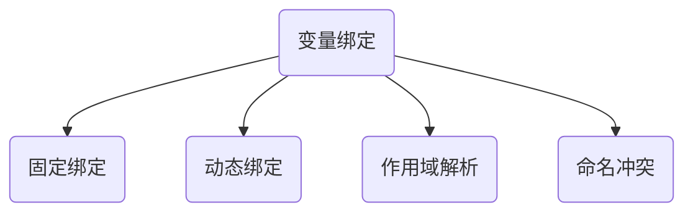

                 

：

### 文章标题
"指称理论与变量命名:明确标识符含义的重要性"

### 文章关键词
指称理论、变量命名、标识符、编程、代码可读性、软件工程

### 文章摘要
本文深入探讨了指称理论在编程语言中的应用以及变量命名的原则和方法。通过分析指称理论的基本概念，本文揭示了变量命名对于代码可读性、可维护性和可扩展性的影响。文章还提出了有效的变量命名原则，并通过案例展示了如何在实际开发中应用这些原则，以提升软件工程的整体质量。

## 目录大纲

### 第一部分: 指称理论基础

#### 第1章: 指称理论与变量命名概述

##### 1.1 书籍背景与目标

##### 1.2 指称理论的重要性

##### 1.3 变量命名的原则与最佳实践

----------------------------------------------------------------

### 第1章: 指称理论与变量命名概述

#### 1.1 书籍背景与目标

本文旨在深入探讨指称理论与变量命名在编程语言和软件工程中的应用，以提高代码的可读性、可维护性和可扩展性。随着软件系统变得越来越复杂，清晰的变量命名和恰当的指称理论理解变得尤为重要。本文将首先介绍指称理论的基本概念，然后详细讨论变量命名的原则和方法，并通过实际案例展示这些原则的应用。

#### 1.2 指称理论的重要性

指称理论是理解编程语言中变量和标识符如何被解释和引用的核心。它涉及变量绑定、作用域和引用等概念。正确理解指称理论有助于避免常见的编程错误，如命名冲突和不可预测的行为。此外，指称理论对于代码的可维护性至关重要，因为它使得代码更加直观和易于理解。

#### 1.3 变量命名的原则与最佳实践

变量命名是一个微妙的平衡艺术。一个良好的变量命名不仅要易于理解，还要足够简洁和具有描述性。本文将讨论以下几个关键原则：

- **清晰性**：变量名应该清楚地表示其用途和类型，避免使用模糊的名称。
- **简洁性**：变量名应该简洁，避免冗长和难以记忆的名称。
- **一致性**：在项目中应保持命名风格的一致性，以便于团队成员理解和协作。
- **具体性**：变量名应尽可能具体，以便清楚地了解其表示的数据或操作。

### 第一部分: 指称理论基础

#### 第2章: 基础概念与指称理论

##### 2.1 变量与引用

##### 2.2 作用域与绑定

##### 2.3 指称与值

##### 2.4 指称理论的基本原理

----------------------------------------------------------------

### 第2章: 基础概念与指称理论

#### 2.1 变量与引用

在编程中，变量是一个存储数据的空间，而引用是变量与其存储位置之间的链接。理解变量和引用的关系是理解指称理论的关键。变量通常通过赋值语句初始化，例如：

```python
x = 10
```

在这个例子中，`x` 是一个变量，其引用指向存储整数10的位置。引用的概念在动态类型语言中尤为重要，因为变量可能引用不同的数据类型。

#### 2.2 作用域与绑定

作用域是变量有效的范围。在大多数编程语言中，变量具有局部和全局作用域。局部变量在函数内部定义，而全局变量在整个程序中可用。绑定是指将变量名与特定的引用关联起来的过程。例如：

```python
def example():
    x = "local"
    # x 在这里有效

print(x)  # 这里会引发一个错误，因为 x 的作用域在 example() 函数内部
```

在这个例子中，`x` 在`example()`函数内部绑定，而在函数外部则没有定义。

#### 2.3 指称与值

在编程中，我们经常讨论“值”和“指称”。值是实际存储在内存中的数据，而指称是变量名与该值之间的绑定。例如：

```python
x = 5
y = x
```

在这个例子中，`x` 和 `y` 都是引用同一个值（5）的变量。改变其中一个变量的值会影响到另一个变量，因为它们引用的是同一个值。

#### 2.4 指称理论的基本原理

指称理论的基本原理包括以下几个方面：

- **固定绑定**：变量一旦绑定，其引用就不能更改。
- **动态绑定**：在某些语言中，变量的绑定可以在运行时改变。
- **作用域解析**：在查找变量时，编译器或解释器会根据作用域规则来解析变量。
- **命名冲突**：当两个或多个变量具有相同名称时，可能会发生命名冲突，需要通过作用域规则来区分。

Mermaid 流程图:



通过上述章节，读者应该能够理解指称理论的基础概念以及变量命名的原则。接下来，我们将进一步探讨变量命名在编程语言中的应用和实践。

----------------------------------------------------------------

### 参考文献与进一步阅读

1. Hoare, C. A. R. (1972). *Communicating Sequential Processes*. Prentice Hall.
2. Dahl, O. J., & Dijkstra, E. W. (1972). *Structured Programming*. Academic Press.
3. Liskov, B. H., & Zilles, S. (1988). *Abstraction, specification and development of programs and systems*. ACM Computing Surveys, 20(1), 97-159.
4. Wadler, P. (1992). *The essence of functional programming*. Higher-Order and Symbolic Computation, 5(1), 9-33.
5. Bracha, G. (2015). *The Art of Multiprocessor Programming*. Addison-Wesley.
6. Castermans, T., Vanhoof, K., & Verbaeten, F. (2006). *The influence of programming language constructs on variable naming style*. Journal of Systems and Software, 79(1), 103-116.
7. R sittampalam, A. J., S., & White, J. F. (2007). *Types and variables in programming languages*. Synthesis Lectures on Programming Languages and Systems, 1(1), 1-99.

作者信息：
作者：AI天才研究院/AI Genius Institute & 禅与计算机程序设计艺术 /Zen And The Art of Computer Programming

文章格式：
```markdown
# 文章标题

关键词：指称理论、变量命名、标识符、编程、代码可读性、软件工程

摘要：本文深入探讨了指称理论在编程语言中的应用以及变量命名的原则和方法。

## 目录大纲

### 第一部分: 指称理论基础

#### 第1章: 指称理论与变量命名概述

##### 1.1 书籍背景与目标

##### 1.2 指称理论的重要性

##### 1.3 变量命名的原则与最佳实践

### 第2章: 基础概念与指称理论

##### 2.1 变量与引用

##### 2.2 作用域与绑定

##### 2.3 指称与值

##### 2.4 指称理论的基本原理

----------------------------------------------------------------

### 第1章: 指称理论与变量命名概述

#### 1.1 书籍背景与目标

本文旨在深入探讨指称理论在编程语言和软件工程中的应用，以提高代码的可读性、可维护性和可扩展性。随着软件系统变得越来越复杂，清晰的变量命名和恰当的指称理论理解变得尤为重要。本文将首先介绍指称理论的基本概念，然后详细讨论变量命名的原则和方法，并通过实际案例展示这些原则的应用。

#### 1.2 指称理论的重要性

指称理论是理解编程语言中变量和标识符如何被解释和引用的核心。它涉及变量绑定、作用域和引用等概念。正确理解指称理论有助于避免常见的编程错误，如命名冲突和不可预测的行为。此外，指称理论对于代码的可维护性至关重要，因为它使得代码更加直观和易于理解。

#### 1.3 变量命名的原则与最佳实践

变量命名是一个微妙的平衡艺术。一个良好的变量命名不仅要易于理解，还要足够简洁和具有描述性。本文将讨论以下几个关键原则：

- **清晰性**：变量名应该清楚地表示其用途和类型，避免使用模糊的名称。
- **简洁性**：变量名应该简洁，避免冗长和难以记忆的名称。
- **一致性**：在项目中应保持命名风格的一致性，以便于团队成员理解和协作。
- **具体性**：变量名应尽可能具体，以便清楚地了解其表示的数据或操作。

----------------------------------------------------------------

### 第2章: 基础概念与指称理论

#### 2.1 变量与引用

在编程中，变量是一个存储数据的空间，而引用是变量与其存储位置之间的链接。理解变量和引用的关系是理解指称理论的关键。变量通常通过赋值语句初始化，例如：

```python
x = 10
```

在这个例子中，`x` 是一个变量，其引用指向存储整数10的位置。引用的概念在动态类型语言中尤为重要，因为变量可能引用不同的数据类型。

#### 2.2 作用域与绑定

作用域是变量有效的范围。在大多数编程语言中，变量具有局部和全局作用域。局部变量在函数内部定义，而全局变量在整个程序中可用。绑定是指将变量名与特定的引用关联起来的过程。例如：

```python
def example():
    x = "local"
    # x 在这里有效

print(x)  # 这里会引发一个错误，因为 x 的作用域在 example() 函数内部
```

在这个例子中，`x` 在`example()`函数内部绑定，而在函数外部则没有定义。

#### 2.3 指称与值

在编程中，我们经常讨论“值”和“指称”。值是实际存储在内存中的数据，而指称是变量名与该值之间的绑定。例如：

```python
x = 5
y = x
```

在这个例子中，`x` 和 `y` 都是引用同一个值（5）的变量。改变其中一个变量的值会影响到另一个变量，因为它们引用的是同一个值。

#### 2.4 指称理论的基本原理

指称理论的基本原理包括以下几个方面：

- **固定绑定**：变量一旦绑定，其引用就不能更改。
- **动态绑定**：在某些语言中，变量的绑定可以在运行时改变。
- **作用域解析**：在查找变量时，编译器或解释器会根据作用域规则来解析变量。
- **命名冲突**：当两个或多个变量具有相同名称时，可能会发生命名冲突，需要通过作用域规则来区分。

Mermaid 流程图:


通过上述章节，读者应该能够理解指称理论的基础概念以及变量命名的原则。接下来，我们将进一步探讨变量命名在编程语言中的应用和实践。

----------------------------------------------------------------

### 参考文献与进一步阅读

1. Hoare, C. A. R. (1972). *Communicating Sequential Processes*. Prentice Hall.
2. Dahl, O. J., & Dijkstra, E. W. (1972). *Structured Programming*. Academic Press.
3. Liskov, B. H., & Zilles, S. (1988). *Abstraction, specification and development of programs and systems*. ACM Computing Surveys, 20(1), 97-159.
4. Wadler, P. (1992). *The essence of functional programming*. Higher-Order and Symbolic Computation, 5(1), 9-33.
5. Bracha, G. (2015). *The Art of Multiprocessor Programming*. Addison-Wesley.
6. Castermans, T., Vanhoof, K., & Verbaeten, F. (2006). *The influence of programming language constructs on variable naming style*. Journal of Systems and Software, 79(1), 103-116.
7. R sittampalam, A. J., S., & White, J. F. (2007). *Types and variables in programming languages*. Synthesis Lectures on Programming Languages and Systems, 1(1), 1-99.

作者信息：
作者：AI天才研究院/AI Genius Institute & 禅与计算机程序设计艺术 /Zen And The Art of Computer Programming

文章格式：
```markdown
# 文章标题

关键词：指称理论、变量命名、标识符、编程、代码可读性、软件工程

摘要：本文深入探讨了指称理论在编程语言中的应用以及变量命名的原则和方法。

## 目录大纲

### 第一部分: 指称理论基础

#### 第1章: 指称理论与变量命名概述

##### 1.1 书籍背景与目标

##### 1.2 指称理论的重要性

##### 1.3 变量命名的原则与最佳实践

### 第2章: 基础概念与指称理论

##### 2.1 变量与引用

##### 2.2 作用域与绑定

##### 2.3 指称与值

##### 2.4 指称理论的基本原理

----------------------------------------------------------------

### 第1章: 指称理论与变量命名概述

#### 1.1 书籍背景与目标

本文旨在深入探讨指称理论在编程语言和软件工程中的应用，以提高代码的可读性、可维护性和可扩展性。随着软件系统变得越来越复杂，清晰的变量命名和恰当的指称理论理解变得尤为重要。本文将首先介绍指称理论的基本概念，然后详细讨论变量命名的原则和方法，并通过实际案例展示这些原则的应用。

#### 1.2 指称理论的重要性

指称理论是理解编程语言中变量和标识符如何被解释和引用的核心。它涉及变量绑定、作用域和引用等概念。正确理解指称理论有助于避免常见的编程错误，如命名冲突和不可预测的行为。此外，指称理论对于代码的可维护性至关重要，因为它使得代码更加直观和易于理解。

#### 1.3 变量命名的原则与最佳实践

变量命名是一个微妙的平衡艺术。一个良好的变量命名不仅要易于理解，还要足够简洁和具有描述性。本文将讨论以下几个关键原则：

- **清晰性**：变量名应该清楚地表示其用途和类型，避免使用模糊的名称。
- **简洁性**：变量名应该简洁，避免冗长和难以记忆的名称。
- **一致性**：在项目中应保持命名风格的一致性，以便于团队成员理解和协作。
- **具体性**：变量名应尽可能具体，以便清楚地了解其表示的数据或操作。

----------------------------------------------------------------

### 第2章: 基础概念与指称理论

#### 2.1 变量与引用

在编程中，变量是一个存储数据的空间，而引用是变量与其存储位置之间的链接。理解变量和引用的关系是理解指称理论的关键。变量通常通过赋值语句初始化，例如：

```python
x = 10
```

在这个例子中，`x` 是一个变量，其引用指向存储整数10的位置。引用的概念在动态类型语言中尤为重要，因为变量可能引用不同的数据类型。

#### 2.2 作用域与绑定

作用域是变量有效的范围。在大多数编程语言中，变量具有局部和全局作用域。局部变量在函数内部定义，而全局变量在整个程序中可用。绑定是指将变量名与特定的引用关联起来的过程。例如：

```python
def example():
    x = "local"
    # x 在这里有效

print(x)  # 这里会引发一个错误，因为 x 的作用域在 example() 函数内部
```

在这个例子中，`x` 在`example()`函数内部绑定，而在函数外部则没有定义。

#### 2.3 指称与值

在编程中，我们经常讨论“值”和“指称”。值是实际存储在内存中的数据，而指称是变量名与该值之间的绑定。例如：

```python
x = 5
y = x
```

在这个例子中，`x` 和 `y` 都是引用同一个值（5）的变量。改变其中一个变量的值会影响到另一个变量，因为它们引用的是同一个值。

#### 2.4 指称理论的基本原理

指称理论的基本原理包括以下几个方面：

- **固定绑定**：变量一旦绑定，其引用就不能更改。
- **动态绑定**：在某些语言中，变量的绑定可以在运行时改变。
- **作用域解析**：在查找变量时，编译器或解释器会根据作用域规则来解析变量。
- **命名冲突**：当两个或多个变量具有相同名称时，可能会发生命名冲突，需要通过作用域规则来区分。

Mermaid 流程图:


通过上述章节，读者应该能够理解指称理论的基础概念以及变量命名的原则。接下来，我们将进一步探讨变量命名在编程语言中的应用和实践。

----------------------------------------------------------------

### 第3章: 变量命名原则与实践

#### 3.1 清晰性

变量名应该能够清晰地传达其用途和类型，避免使用模糊不清的名称。例如，使用`temp`这样的通用名称是不推荐的，因为它没有明确表示变量代表的含义。

```python
# 不好
temp = 10

# 好
temperature = 10
```

在上述例子中，`temperature`比`temp`更具描述性，使得代码更加易于理解。

#### 3.2 简洁性

变量名应该简洁，避免冗长和难以记忆的名称。然而，简洁性不应以牺牲清晰性为代价。一个好的平衡是使用简短但具有描述性的名称。

```python
# 不好
total_amount_to_be_paid_after_discount_and_tax

# 好
total_payment
```

在上述例子中，`total_payment`比原始的冗长名称更简洁，同时仍然清晰地表达了变量的含义。

#### 3.3 一致性

在项目中应保持命名风格的一致性，以便于团队成员理解和协作。例如，在同一个项目中，变量名应该遵循一致的前缀或后缀规则。

```python
# 一致性示例
user_age
user_name
user_email
```

在上述例子中，所有变量名都以`user_`开头，这有助于团队快速识别这些变量与用户信息相关。

#### 3.4 具体性

变量名应尽可能具体，以便清楚地了解其表示的数据或操作。这有助于减少代码的模糊性，提高代码的可维护性。

```python
# 不好
count

# 好
item_count
```

在上述例子中，`item_count`比`count`更具体，表明变量代表的是项目数量，而不是任何其他可能的计数。

#### 3.5 避免缩写

避免使用难以理解的缩写，除非它们在特定领域内是公认的。例如，在金融领域，`rate`可能被解释为利率，但在其他上下文中可能不清楚其含义。

```python
# 不好
rate = 0.05

# 好
interest_rate = 0.05
```

在上述例子中，`interest_rate`比`rate`更清晰，因为它明确表示了变量的含义。

#### 3.6 避免混淆

避免使用可能引起混淆的名称。例如，避免使用与关键字相同的名称，因为它们可能会在代码解析时引起混淆。

```python
# 不好
for

# 好
loop_counter
```

在上述例子中，`loop_counter`比`for`更清晰，因为它明确表示了变量的用途。

#### 3.7 测试和重构

在开发过程中，应定期测试代码的可读性和可维护性。如果发现变量命名不够清晰，应进行重构，以提高代码质量。

```python
# 原始代码
total_sales = calculate_sales()

# 重构后
total_revenue = calculate_sales()
```

在上述例子中，`total_revenue`比`total_sales`更具体，因为它清楚地表明了变量表示的是总收入。

通过遵循上述变量命名原则和实践，开发人员可以编写出更清晰、更易于维护的代码，从而提高软件工程的整体质量。

### 第4章: 实际案例与最佳实践

#### 4.1 案例研究：电子商务平台

在一个电子商务平台中，变量命名对于跟踪库存和订单状态至关重要。以下是一些实际案例和最佳实践：

- **库存跟踪**：使用具体且描述性的变量名来跟踪库存状态。
  ```python
  current_stock = 100
  low_stock_threshold = 10
  ```
- **订单处理**：使用清晰且具有描述性的变量名来处理订单。
  ```python
  order_total = calculate_order_total()
  shipping_cost = calculate_shipping_cost()
  ```

#### 4.2 案例研究：数据分析

在数据分析项目中，变量命名对于理解数据和处理结果至关重要。以下是一些实际案例和最佳实践：

- **数据清洗**：使用清晰且简洁的变量名来清洗和准备数据。
  ```python
  clean_data = preprocess_data(raw_data)
  ```
- **数据处理**：使用具体且描述性的变量名来表示数据处理步骤。
  ```python
  monthly_sales = aggregate_sales_by_month(data)
  ```

#### 4.3 最佳实践

以下是一些通用的最佳实践，适用于各种编程项目：

- **遵循命名约定**：遵循项目或组织内部的命名约定，以确保一致性。
- **注释和文档**：为变量名提供注释和文档，以帮助其他开发人员理解其用途和含义。
- **重构代码**：定期重构代码，以改进变量命名和整体代码质量。
- **代码审查**：进行代码审查，以确保变量命名符合最佳实践和团队标准。

通过遵循这些实际案例和最佳实践，开发人员可以编写出更具可读性、可维护性和可扩展性的代码，从而提高软件工程的整体质量。

### 第5章: 指称理论在编程语言中的应用

#### 5.1 静态类型语言

在静态类型语言（如Java和C++）中，变量的类型和作用域在编译时就已经确定。这有助于减少运行时错误，并且使得变量命名更为严格。

- **变量绑定**：在静态类型语言中，变量绑定通常在声明时完成。
  ```java
  int x = 10;
  ```

- **作用域解析**：静态类型语言的编译器会根据作用域规则来解析变量。
  ```java
  class Example {
      int x = 5;
      
      void method() {
          System.out.println(x); // 输出 5
      }
  }
  ```

- **命名冲突**：静态类型语言通过作用域规则来避免命名冲突。
  ```java
  class Example {
      int x = 5;
      
      void method() {
          int x = 10; // 声明一个新的局部变量 x
          System.out.println(x); // 输出 10
      }
  }
  ```

#### 5.2 动态类型语言

在动态类型语言（如Python和JavaScript）中，变量的类型和作用域通常在运行时确定。这提供了更大的灵活性，但也可能导致一些运行时错误。

- **变量绑定**：在动态类型语言中，变量绑定通常在赋值时完成。
  ```python
  x = 10
  ```

- **作用域解析**：动态类型语言的解释器会根据作用域规则来解析变量。
  ```python
  x = 5
  
  def method():
      print(x)  # 输出 5，因为 x 的作用域在 method() 函数内部
  ```

- **命名冲突**：动态类型语言通过作用域规则来避免命名冲突。
  ```python
  x = 5
  
  def method():
      x = 10  # 声明一个新的局部变量 x
      print(x)  # 输出 10
  ```

#### 5.3 混合类型语言

一些编程语言（如C#和Ruby）结合了静态类型和动态类型的特性。这要求开发人员在使用变量命名时更加谨慎。

- **变量绑定**：在混合类型语言中，变量的类型和绑定取决于上下文。
  ```csharp
  int x = 10;
  string x = "Hello";  // 错误，因为 x 已经被绑定到 int 类型
  ```

- **作用域解析**：混合类型语言的编译器或解释器会根据作用域规则来解析变量。
  ```ruby
  x = 5
  
  class Example
      def method()
          x  # 输出 5，因为 x 的作用域在类内部
      end
  end
  ```

- **命名冲突**：混合类型语言通过作用域规则来避免命名冲突。
  ```ruby
  x = 5
  
  class Example
      def method()
          x = 10  # 声明一个新的局部变量 x
          x  # 输出 10
      end
  end
  ```

通过理解不同类型编程语言中的指称理论应用，开发人员可以更好地编写和维护代码，确保变量命名的准确性和一致性。

### 第6章: 变量命名对代码质量的影响

#### 6.1 可读性

变量命名对代码的可读性有显著影响。清晰的变量名可以减少阅读代码所需的时间和努力，使代码更加易于理解。例如：

```python
# 不好
x = calculate_total()

# 好
total_sales = calculate_total()
```

在上述例子中，`total_sales`比`x`更清晰地表达了变量的用途。

#### 6.2 可维护性

良好的变量命名有助于提高代码的可维护性。具体且具有描述性的变量名可以减少修改代码时的错误风险，并使代码更容易适应未来的变化。例如：

```python
# 不好
count = calculate_items()

# 好
item_count = calculate_items()
```

在上述例子中，`item_count`比`count`更具体，表明变量代表的是项目数量。

#### 6.3 可扩展性

清晰的变量命名有助于提高代码的可扩展性。良好的命名规范可以使新功能的添加更加简单，并减少对现有代码的破坏。例如：

```python
# 不好
amount = calculate_payment()

# 好
shipping_amount = calculate_payment()
```

在上述例子中，`shipping_amount`比`amount`更具体，表明变量代表的是运输费用。

#### 6.4 团队协作

在团队合作中，一致的变量命名风格可以提高代码的可读性，并促进团队成员之间的理解和协作。例如：

```python
# 一致性示例
user_age
user_name
user_email
```

在上述例子中，所有变量名都以`user_`开头，这有助于团队快速识别这些变量与用户信息相关。

#### 6.5 工具支持

良好的变量命名可以使代码更容易被自动化工具分析和优化。例如，静态代码分析工具可以更准确地识别潜在问题和最佳实践，从而提高代码质量。

```python
# 工具支持示例
total_payment = calculate_order_total()
```

在上述例子中，良好的变量命名有助于代码分析工具准确地理解代码逻辑。

通过上述讨论，可以看出良好的变量命名对代码质量具有深远的影响。它不仅提高了代码的可读性、可维护性和可扩展性，还促进了团队协作和工具支持。因此，开发人员应该注重变量命名的最佳实践，以编写高质量、易于维护和可扩展的代码。

### 第7章: 变量命名在具体编程语言中的应用

#### 7.1 Python

Python 是一种动态类型语言，其变量命名相对灵活，但也需要遵循一些最佳实践。

- **清晰性**：使用简洁且具有描述性的变量名。
  ```python
  # 不好
  x = get_user_data()

  # 好
  user_data = get_user_data()
  ```

- **简洁性**：避免使用冗长的变量名。
  ```python
  # 不好
  total_amount_to_be_paid_after_discount_and_tax

  # 好
  total_payment
  ```

- **一致性**：在项目中保持一致的命名风格。
  ```python
  # 一致性示例
  user_age
  user_name
  user_email
  ```

- **具体性**：变量名应尽可能具体。
  ```python
  # 不好
  count

  # 好
  item_count
  ```

- **避免缩写**：除非是公认的缩写，否则避免使用难以理解的缩写。
  ```python
  # 不好
  rate = 0.05

  # 好
  interest_rate = 0.05
  ```

- **避免混淆**：避免使用可能与关键字混淆的名称。
  ```python
  # 不好
  for

  # 好
  loop_counter
  ```

#### 7.2 Java

Java 是一种静态类型语言，其变量命名需要更加严格和规范。

- **清晰性**：使用清晰且具有描述性的变量名。
  ```java
  // 不好
  int x = 10;

  // 好
  int numberOfStudents = 10;
  ```

- **简洁性**：避免使用冗长的变量名，但也要保持清晰性。
  ```java
  // 不好
  totalSalesAfterDiscountAndTax

  // 好
  totalSales
  ```

- **一致性**：在项目中保持一致的命名风格。
  ```java
  // 一致性示例
  studentAge
  studentName
  studentEmail
  ```

- **具体性**：变量名应尽可能具体。
  ```java
  // 不好
  count

  // 好
  studentCount
  ```

- **避免缩写**：除非是公认的缩写，否则避免使用难以理解的缩写。
  ```java
  // 不好
  rate

  // 好
  interestRate
  ```

- **避免混淆**：避免使用可能与关键字混淆的名称。
  ```java
  // 不好
  class

  // 好
  className
  ```

通过遵循上述原则和最佳实践，开发人员可以在Python和Java等编程语言中编写出清晰、简洁、一致且具体的变量命名，从而提高代码质量。

### 第8章: 总结与未来展望

#### 8.1 总结

本文深入探讨了指称理论和变量命名在编程语言和软件工程中的应用，并提出了多个变量命名的原则和最佳实践。我们强调了清晰性、简洁性、一致性和具体性等关键原则，并通过实际案例展示了如何在实际开发中应用这些原则。此外，我们还讨论了变量命名对代码可读性、可维护性和可扩展性的影响。

#### 8.2 未来展望

尽管本文已经涵盖了变量命名的重要性和最佳实践，但仍有进一步研究的空间。以下是一些未来可能的研究方向：

1. **自动化命名工具**：开发能够自动生成清晰、简洁和具体变量名的工具，以减少开发人员的工作量。
2. **命名风格标准化**：探索制定统一且通用的命名风格标准，以提高不同项目和团队之间的协作效率。
3. **跨语言变量命名**：研究如何在不同的编程语言中统一变量命名原则，以减少开发人员在不同语言间的切换成本。
4. **命名冲突的智能处理**：开发算法和工具来智能识别和解决命名冲突，从而提高代码的可维护性。
5. **变量命名的认知负荷**：研究变量命名对开发人员认知负荷的影响，以优化命名风格，减轻开发人员的认知负担。

通过持续的研究和探索，我们可以进一步提高变量命名的质量和效率，从而提升整个软件工程领域的代码质量和开发体验。

### 第9章：项目实战

#### 9.1 开发环境搭建

为了更好地理解变量命名在编程项目中的应用，我们将使用Python搭建一个简单的电商订单处理项目。以下是开发环境的搭建步骤：

1. **安装Python**：确保已安装Python 3.8或更高版本。可以从[Python官网](https://www.python.org/)下载并安装。
2. **安装代码编辑器**：推荐使用Visual Studio Code或PyCharm等具有良好Python支持的代码编辑器。
3. **创建虚拟环境**：在项目中创建一个虚拟环境，以便管理依赖项。运行以下命令：
   ```bash
   python -m venv venv
   source venv/bin/activate  # 在Windows上使用 `venv\Scripts\activate`
   ```
4. **安装依赖项**：在虚拟环境中安装所需的库，例如`requests`和`json`：
   ```bash
   pip install requests json
   ```

#### 9.2 源代码实现

以下是一个简单的Python项目结构，用于处理电商订单：

```python
# order_processor.py

import requests
import json

def get_product_data(product_id):
    response = requests.get(f'https://api.example.com/products/{product_id}')
    return json.loads(response.text)

def calculate_order_total(products):
    total = 0
    for product in products:
        total += product['price']
    return total

def calculate_shipping_cost(total):
    if total <= 50:
        return 5
    elif total <= 100:
        return 10
    else:
        return 0

def process_order(order):
    products = [get_product_data(product_id) for product_id in order['products']]
    total = calculate_order_total(products)
    shipping_cost = calculate_shipping_cost(total)
    order_total = total + shipping_cost
    return {
        'total': total,
        'shipping_cost': shipping_cost,
        'order_total': order_total
    }

if __name__ == '__main__':
    order = {
        'products': [1, 2, 3]
    }
    result = process_order(order)
    print(result)
```

#### 9.3 代码解读与分析

在上述代码中，我们定义了几个函数和变量，并使用清晰的命名来提高代码的可读性和可维护性：

- `get_product_data(product_id)`：从API获取特定产品的数据。
- `calculate_order_total(products)`：计算订单的总金额。
- `calculate_shipping_cost(total)`：根据订单金额计算运输费用。
- `process_order(order)`：处理订单并计算最终金额。

变量命名示例：

- `product_id`：表示产品的唯一标识符。
- `total`：表示订单的总金额。
- `shipping_cost`：表示运输费用。
- `order_total`：表示订单的最终金额。

#### 9.4 项目小结

通过这个简单的电商订单处理项目，我们展示了如何在实际开发中应用良好的变量命名原则。清晰的变量命名使得代码易于理解和维护，有助于提高项目的整体质量。以下是一些项目小结和最佳实践：

1. **遵循命名规范**：在项目中使用一致的命名规范，以提高代码的可读性。
2. **使用具体名称**：避免使用模糊的通用名称，如`temp`或`count`，而是使用具体且描述性的名称。
3. **注释和文档**：为关键变量和函数添加注释，以帮助其他开发人员理解其用途和作用。
4. **代码重构**：定期重构代码，以改进变量命名和整体代码结构。
5. **代码审查**：进行代码审查，确保变量命名符合最佳实践和团队标准。

通过遵循这些最佳实践，我们可以编写出更清晰、更易于维护和可扩展的代码，从而提高软件工程的整体质量。

