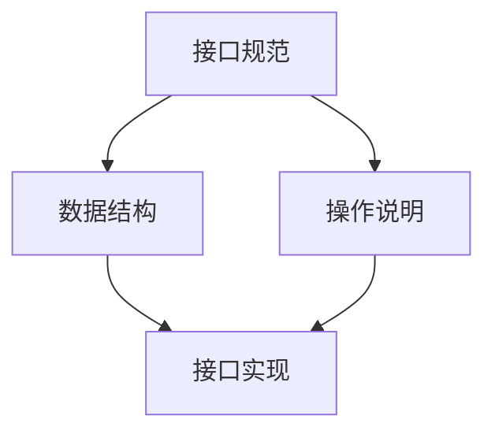

                 

### 文章标题：接口契约应该怎么做

> 关键词：接口契约，设计原则，实现方法，项目实战，案例分析，未来发展趋势

> 摘要：本文旨在深入探讨接口契约的设计原则、实现方法以及在实际项目中的应用。通过解析接口契约的核心概念、算法原理，并结合具体案例，本文将帮助读者全面理解接口契约的精髓，掌握其设计技巧，并为未来的发展提供前瞻性思考。

### 设计目录大纲的思路

在设计《接口契约应该怎么做》的目录大纲时，我们需要遵循以下思路：

1. **明确书籍主题**：首先明确书籍的核心内容，即接口契约的定义、作用、设计原则以及实现方法。这些内容将构成书籍的核心结构。

2. **确定章节划分**：根据书籍主题，将内容划分为若干个章节。每个章节应包含若干小节，确保内容有条理且易于理解。

3. **细化章节内容**：在每个章节中，细化每一个小节的内容，确保每个小节都有明确的主题和详细的内容。

4. **确保完整性**：确保目录大纲中包含了核心概念与联系、核心算法原理讲解、数学模型和数学公式、项目实战等必要内容。

5. **优化结构**：确保目录结构清晰，逻辑性强，便于读者阅读和理解。

6. **简洁性**：避免冗余内容，保持目录简洁明了。

下面是《接口契约应该怎么做》的目录大纲：

## 目录

### 第一部分：接口契约基础

### 第1章：接口契约概述

#### 1.1 接口契约的定义与重要性

#### 1.2 接口契约的核心组成部分

#### 1.3 接口契约的发展历程

### 第2章：接口契约的设计原则

#### 2.1 可读性原则

#### 2.2 可维护性原则

#### 2.3 可扩展性原则

### 第3章：接口契约的实现方法

#### 3.1 接口契约的设计工具

#### 3.2 接口契约的实现步骤

#### 3.3 接口契约的最佳实践

### 第二部分：接口契约实战

### 第4章：接口契约项目实战

#### 4.1 项目背景

#### 4.2 需求分析

#### 4.3 设计与实现

#### 4.4 测试与优化

### 第5章：接口契约案例分析

#### 5.1 案例一：电商平台的接口契约设计

#### 5.2 案例二：金融系统的接口契约实现

#### 5.3 案例三：物联网设备的接口契约应用

### 第6章：接口契约的未来发展趋势

#### 6.1 接口契约的标准化趋势

#### 6.2 接口契约与微服务架构

#### 6.3 接口契约在云计算和大数据中的应用

### 第7章：接口契约的持续改进与优化

#### 7.1 接口契约的持续维护

#### 7.2 接口契约的优化策略

#### 7.3 接口契约的性能评估

### 附录

#### 附录A：接口契约设计工具与资源

#### 附录B：接口契约相关标准和规范

#### 附录C：接口契约常见问题与解决方案

### 致谢

### 参考文献

### 术语表

### 作者介绍

### 鸣谢

### 核心概念与联系

接口契约是一个软件开发中用于定义和描述接口规范的重要概念。它由接口规范、数据结构和操作说明三个主要部分组成。

- **接口规范**：定义了接口的名称、参数、返回值、异常等基本属性，是接口契约的核心。
- **数据结构**：定义了接口操作涉及的数据类型和结构，确保数据传递的一致性和正确性。
- **操作说明**：详细描述了接口的具体操作流程、业务逻辑和约束条件，是接口契约的实现依据。

接口契约在软件开发中的核心作用在于它为开发人员提供了一个清晰、明确的接口规范，从而提高了代码的可读性、可维护性和可扩展性。同时，接口契约也为软件系统的集成和测试提供了便利。

以下是接口契约的核心概念与联系架构 Mermaid 流程图：

### 接口契约的定义

接口契约是一种在软件开发过程中用于明确接口规范和约束的协议。它不仅定义了接口的名称、参数、返回值和异常等基本属性，还包括了接口的操作流程、业务逻辑和约束条件。接口契约的主要目的是为开发人员提供一种清晰、明确的接口描述，以便更好地进行开发、测试和维护。

接口契约的组成部分主要包括以下三个部分：

1. **接口规范**：这是接口契约的核心部分，它定义了接口的基本属性，如接口名称、参数类型、参数个数、返回值类型等。接口规范确保了接口的一致性和可操作性。

2. **数据结构**：数据结构部分定义了接口操作所涉及的数据类型和结构。它确保了数据在接口传递过程中的一致性和正确性，从而提高了接口的可靠性和稳定性。

3. **操作说明**：操作说明部分详细描述了接口的具体操作流程、业务逻辑和约束条件。这部分内容通常包括接口的输入参数校验、输出结果验证、异常处理策略等，有助于开发人员理解和使用接口。

### 接口契约的重要性

接口契约在软件开发中具有至关重要的作用，主要体现在以下几个方面：

1. **提高代码可读性和可维护性**：接口契约为开发人员提供了一个清晰的接口描述，使得代码结构更加简洁明了，易于理解和维护。开发者只需关注接口契约的实现细节，而不必深入了解具体的业务逻辑。

2. **确保接口的一致性和稳定性**：接口契约明确了接口的规范和约束，有助于确保接口的一致性和稳定性。这有助于减少接口变更带来的风险，提高软件系统的可靠性。

3. **促进团队协作和代码共享**：接口契约为团队协作提供了基础，使得团队成员可以更方便地进行代码共享和集成。同时，接口契约也有助于减少因接口不明确而导致的沟通成本。

4. **便于接口的测试和优化**：接口契约为接口的测试提供了明确的标准，有助于发现和修复接口中的问题。此外，接口契约还有助于接口的优化，提高系统的性能和响应速度。

总之，接口契约是软件开发过程中不可或缺的一部分，它为开发者提供了清晰、明确的接口规范，提高了代码的可读性、可维护性和可扩展性，同时也为软件系统的集成和测试提供了便利。通过遵循接口契约的设计原则和实现方法，开发者可以更加高效地完成软件开发任务，提高软件质量和开发效率。

### 接口契约的核心组成部分

接口契约是一个软件开发过程中用于定义和描述接口规范的重要工具。它由三个核心组成部分构成：接口规范、数据结构和操作说明。这三个部分共同构成了一个完整的接口契约，确保接口的一致性、稳定性和可操作性。

#### 接口规范

接口规范是接口契约的核心部分，它定义了接口的基本属性，包括接口名称、参数类型、参数个数、返回值类型和异常等。接口规范的作用是明确接口的使用方式和预期结果，为开发人员提供清晰、明确的指导。

- **接口名称**：接口名称应简洁、具有描述性，便于开发人员理解接口的功能。
- **参数类型和个数**：接口参数应包括输入参数和输出参数。输入参数用于传递数据和业务逻辑，输出参数用于返回处理结果。参数类型应明确，以避免数据类型转换错误。
- **返回值类型**：返回值类型应与接口的功能相对应，确保返回数据的正确性和一致性。
- **异常**：异常部分定义了接口可能抛出的异常类型，包括运行时异常和检查型异常。异常处理有助于确保接口的稳定性和可靠性。

#### 数据结构

数据结构部分定义了接口操作所涉及的数据类型和结构，确保数据在接口传递过程中的一致性和正确性。数据结构的设计应遵循最小化原则，即只传递必需的数据，以减少数据传输的复杂度和冗余。

- **数据类型**：数据类型包括基本数据类型（如整数、浮点数、布尔值等）和复合数据类型（如数组、列表、字典等）。选择合适的数据类型有助于提高接口的性能和可维护性。
- **数据结构**：数据结构包括简单数据结构和复杂数据结构。简单数据结构如单个值或数组，复杂数据结构如对象或类。数据结构的设计应考虑数据的存储和访问效率，以及数据的扩展性。

#### 操作说明

操作说明部分详细描述了接口的具体操作流程、业务逻辑和约束条件。这部分内容有助于开发人员更好地理解和使用接口，同时为接口的测试和优化提供参考。

- **操作流程**：描述接口的执行流程，包括输入参数的处理、业务逻辑的执行和输出结果的产生。操作流程应清晰、简洁，便于开发人员理解和实现。
- **业务逻辑**：描述接口所涉及的业务逻辑和处理规则。业务逻辑应具备一致性和可重复性，确保接口在不同场景下都能正常工作。
- **约束条件**：描述接口的约束条件，包括输入参数的范围、数据格式的规范和异常处理策略。约束条件有助于确保接口的稳定性和可靠性。

通过接口规范、数据结构和操作说明这三个核心组成部分，接口契约能够为开发人员提供一个清晰、明确的接口描述，提高代码的可读性、可维护性和可扩展性。同时，接口契约也为软件系统的集成和测试提供了便利，有助于提高软件质量和开发效率。

### 接口契约的设计原则

在接口契约的设计过程中，遵循一定的原则至关重要。这些原则能够确保接口契约的清晰性、可维护性和可扩展性，从而提高软件系统的整体质量。以下是几个关键的设计原则：

#### 1. 可读性原则

可读性是接口契约设计的重要原则之一。一个良好的接口契约应该具有清晰、简洁、易于理解的描述，使得开发人员能够快速掌握接口的使用方法。以下是一些实现可读性的建议：

- **简洁性**：避免使用复杂的术语和冗长的描述，尽量使用简单明了的语言。
- **一致性**：接口命名和参数命名应保持一致，避免使用容易混淆的命名方式。
- **注释**：在接口契约中添加必要的注释，解释接口的功能、参数和返回值的作用，以及可能的异常情况。

#### 2. 可维护性原则

接口契约的可维护性直接影响软件系统的长期稳定性和可靠性。以下是一些提高接口契约可维护性的建议：

- **模块化**：将复杂的接口拆分为多个简单、独立的模块，降低接口的复杂性。
- **版本控制**：为接口契约引入版本控制机制，便于跟踪和管理接口的变更。
- **文档化**：及时更新接口契约的文档，包括接口规范、数据结构和操作说明，确保文档与实际接口保持一致。

#### 3. 可扩展性原则

随着业务需求的变化，接口契约可能需要不断更新和扩展。遵循可扩展性原则，可以使接口契约在变化中保持稳定性和灵活性。以下是一些实现接口契约可扩展性的建议：

- **抽象化**：通过抽象化接口，将具体的业务逻辑与接口解耦，使得接口契约在扩展时不会影响现有的实现。
- **参数化**：设计可参数化的接口，允许在接口中使用可配置的参数，以适应不同的业务场景。
- **重构**：在接口契约变更时，通过重构代码，避免引入新的依赖关系和潜在的 bug。

#### 4. 一致性原则

接口契约的一致性是确保软件系统稳定性和可靠性的关键。以下是一些实现接口契约一致性的建议：

- **统一命名规范**：遵循统一的命名规范，确保接口名称、参数名称和返回值名称的一致性。
- **统一错误处理**：定义统一的错误处理机制，确保接口在异常情况下能够优雅地处理错误。
- **统一接口规范**：确保接口契约在不同模块、不同团队之间保持一致，避免因规范不同导致的兼容性问题。

通过遵循这些设计原则，接口契约能够更好地满足开发人员的需求，提高软件系统的质量，降低维护成本。同时，良好的接口契约也为项目的持续发展和扩展提供了坚实的基础。

### 接口契约的实现方法

实现接口契约是软件开发过程中的关键步骤。正确的设计和实现接口契约，可以显著提高代码的可读性、可维护性和可扩展性。以下我们将详细探讨接口契约的设计工具、实现步骤和最佳实践。

#### 设计工具

选择合适的工具是实现接口契约的重要前提。以下是一些常用的设计工具：

1. **Swagger**：Swagger 是一个广泛使用的接口契约设计工具，它允许开发者通过可视化界面设计、编辑和测试接口契约。Swagger 支持多种编程语言和框架，具有丰富的文档生成功能。

2. **RAML**：RAML（RESTful API Modeling Language）是一种用于定义 RESTful 接口契约的标记语言。它以文本形式定义接口，易于阅读和编辑，且具有良好的可扩展性。

3. **Postman**：Postman 是一个流行的接口测试工具，它支持接口契约的设计、编辑和测试。Postman 提供了丰富的功能和插件，可以方便地进行接口契约的调试和验证。

#### 实现步骤

实现接口契约通常包括以下步骤：

1. **需求分析**：首先，分析接口的使用场景和业务需求，明确接口的功能、参数和返回值。

2. **设计接口规范**：根据需求分析结果，设计接口规范，包括接口名称、参数类型和个数、返回值类型等。

3. **定义数据结构**：定义接口操作涉及的数据类型和结构，确保数据传递的一致性和正确性。

4. **编写接口实现**：根据接口规范和数据结构，编写接口的实现代码，包括输入参数处理、业务逻辑执行和输出结果生成。

5. **测试和验证**：编写测试用例，对接口进行功能测试、性能测试和安全测试，确保接口的正确性和可靠性。

#### 最佳实践

以下是一些实现接口契约的最佳实践：

1. **遵循RESTful原则**：在设计接口时，遵循 RESTful 原则，使用 HTTP 方法（GET、POST、PUT、DELETE 等）和 URL 结构（路径、查询参数等）进行接口设计。

2. **使用版本控制**：为接口契约引入版本控制机制，如使用 URL 版本或接口版本号，以便在接口变更时保持向后兼容。

3. **实现参数验证**：在接口实现中，对输入参数进行验证，确保参数的合法性、有效性和完整性。

4. **提供详细的文档**：编写详细的接口文档，包括接口规范、数据结构和操作说明，为开发人员提供清晰的接口使用指南。

5. **持续集成和自动化测试**：引入持续集成和自动化测试，确保接口契约在每次变更后都能通过测试，提高软件质量。

通过遵循这些设计工具、实现步骤和最佳实践，开发者可以有效地设计和实现接口契约，提高代码质量，降低维护成本，从而为项目的成功交付提供坚实保障。

### 接口契约的最佳实践

在接口契约的设计和实现过程中，遵循一系列最佳实践可以显著提高代码的可读性、可维护性和可扩展性。以下是几个关键的最佳实践：

#### 1. 明确接口功能和职责

接口契约应明确定义接口的功能和职责，避免接口过于复杂。一个良好的接口应具备单一职责原则，即每个接口只负责一项功能，这样有助于降低接口的复杂性，提高代码的可读性和可维护性。

#### 2. 使用一致的命名规范

接口名称、参数名称和返回值名称应保持一致，遵循统一的命名规范。这种一致性有助于开发者快速理解和使用接口，减少因命名不一致导致的混淆和错误。

#### 3. 实现参数验证

在接口实现中，对输入参数进行严格验证，确保参数的合法性、有效性和完整性。参数验证可以包括类型检查、范围检查和格式检查等，有助于防止非法数据和异常情况。

#### 4. 提供详细的错误处理

接口契约应提供详细的错误处理机制，包括异常类型、错误码和错误信息。良好的错误处理可以提高接口的稳定性和可靠性，使开发者能够更好地应对异常情况。

#### 5. 编写详细的文档

编写详细的接口文档，包括接口规范、数据结构和操作说明。文档应提供接口的功能描述、参数说明、返回值解释以及可能的异常情况。详细的文档有助于开发者快速了解和使用接口。

#### 6. 引入版本控制

为接口契约引入版本控制机制，如使用 URL 版本或接口版本号，以便在接口变更时保持向后兼容。版本控制有助于确保旧系统在新接口版本上线时仍能正常运行。

#### 7. 持续集成和自动化测试

引入持续集成和自动化测试，确保接口契约在每次变更后都能通过测试，提高软件质量。自动化测试可以包括单元测试、集成测试和性能测试等，有助于发现和修复接口中的问题。

通过遵循这些最佳实践，开发者可以设计和实现高质量的接口契约，提高软件系统的可维护性和扩展性，从而为项目的成功交付提供坚实保障。

### 接口契约项目实战

在实际软件开发过程中，接口契约的设计与实现是确保系统模块间协作和业务流程顺畅的关键步骤。以下我们将通过一个具体的接口契约项目实战，详细介绍项目背景、需求分析、设计与实现、测试与优化等关键环节。

#### 项目背景

本项目是一个电商平台的订单管理系统，主要功能包括订单的创建、查询、修改和删除。平台需要支持多个前端应用和后端服务之间的数据交互，因此，确保接口契约的清晰、稳定和可扩展性至关重要。

#### 需求分析

1. **订单创建**：用户可以在前端应用提交订单创建请求，后端服务需要处理订单数据的验证、存储和返回创建结果。
2. **订单查询**：用户可以在前端应用查询订单信息，后端服务需要根据订单ID返回相应的订单详情。
3. **订单修改**：用户可以在前端应用修改订单信息，后端服务需要验证修改数据的合法性并更新订单数据。
4. **订单删除**：用户可以在前端应用删除订单，后端服务需要验证订单ID的有效性并删除订单数据。

#### 设计与实现

1. **接口规范**：

   - **订单创建接口**：
     - 接口名称：`createOrder`
     - 参数：订单信息（如商品ID、数量、用户ID等）
     - 返回值：订单ID（成功）或错误信息（失败）
   - **订单查询接口**：
     - 接口名称：`queryOrder`
     - 参数：订单ID
     - 返回值：订单详情（成功）或错误信息（失败）
   - **订单修改接口**：
     - 接口名称：`updateOrder`
     - 参数：订单ID和修改后的订单信息
     - 返回值：操作结果（成功）或错误信息（失败）
   - **订单删除接口**：
     - 接口名称：`deleteOrder`
     - 参数：订单ID
     - 返回值：操作结果（成功）或错误信息（失败）

2. **数据结构**：

   - 订单数据结构（Order）：
     - 商品ID（Integer）
     - 数量（Integer）
     - 用户ID（Integer）
     - 订单状态（String）

3. **操作说明**：

   - **订单创建**：
     - 输入参数校验：验证商品ID、数量、用户ID的有效性
     - 业务逻辑：存储订单数据并返回订单ID
     - 异常处理：捕获异常并返回相应的错误信息
   - **订单查询**：
     - 输入参数校验：验证订单ID的有效性
     - 业务逻辑：查询订单数据并返回订单详情
     - 异常处理：捕获异常并返回相应的错误信息
   - **订单修改**：
     - 输入参数校验：验证订单ID和修改后的订单信息的有效性
     - 业务逻辑：更新订单数据并返回操作结果
     - 异常处理：捕获异常并返回相应的错误信息
   - **订单删除**：
     - 输入参数校验：验证订单ID的有效性
     - 业务逻辑：删除订单数据并返回操作结果
     - 异常处理：捕获异常并返回相应的错误信息

#### 测试与优化

1. **功能测试**：编写测试用例，对订单创建、查询、修改和删除接口进行功能测试，确保接口按预期工作。
2. **性能测试**：对订单查询接口进行性能测试，评估接口的响应时间和并发处理能力，确保接口在高并发情况下仍能稳定运行。
3. **安全测试**：对接口进行安全测试，确保接口对非法参数和攻击具有抵抗力，防止数据泄露和注入攻击。
4. **优化与重构**：根据测试结果和实际需求，对接口进行优化和重构，提高代码的可读性、可维护性和可扩展性。

#### 项目小结

通过本项目的实施，我们成功设计并实现了电商平台订单管理系统的接口契约，确保了接口的清晰性、稳定性和可扩展性。项目的成功经验为团队提供了宝贵的实践经验和参考，有助于未来接口契约的开发和优化。

### 接口契约案例分析

在软件开发过程中，接口契约的设计和实现对于系统的稳定性和可维护性具有重要意义。以下将分析三个不同领域的实际案例，探讨接口契约的设计、实现和应用。

#### 案例一：电商平台的接口契约设计

电商平台是一个高度依赖接口契约的场景，因为不同的前端应用和后端服务需要频繁进行数据交互。以下是一个关于电商平台订单接口契约的案例分析。

**背景**：某电商平台需要支持订单的创建、查询、修改和删除功能，同时需要确保接口的稳定性和可扩展性。

**设计**：

1. **接口规范**：

   - **创建订单**：
     - 接口名称：`createOrder`
     - 参数：订单详情（商品ID、数量、用户ID等）
     - 返回值：订单ID或错误信息
   - **查询订单**：
     - 接口名称：`queryOrder`
     - 参数：订单ID
     - 返回值：订单详情或错误信息
   - **修改订单**：
     - 接口名称：`updateOrder`
     - 参数：订单ID和更新后的订单详情
     - 返回值：操作结果或错误信息
   - **删除订单**：
     - 接口名称：`deleteOrder`
     - 参数：订单ID
     - 返回值：操作结果或错误信息

2. **数据结构**：

   - 订单数据结构（Order）：
     - 商品ID（Integer）
     - 数量（Integer）
     - 用户ID（Integer）
     - 订单状态（String）

3. **操作说明**：

   - **创建订单**：
     - 输入参数校验：检查商品ID、数量、用户ID的有效性
     - 业务逻辑：创建订单并返回订单ID
     - 异常处理：捕获异常并返回相应的错误信息
   - **查询订单**：
     - 输入参数校验：检查订单ID的有效性
     - 业务逻辑：查询订单并返回订单详情
     - 异常处理：捕获异常并返回相应的错误信息
   - **修改订单**：
     - 输入参数校验：检查订单ID和更新后的订单详情的有效性
     - 业务逻辑：更新订单并返回操作结果
     - 异常处理：捕获异常并返回相应的错误信息
   - **删除订单**：
     - 输入参数校验：检查订单ID的有效性
     - 业务逻辑：删除订单并返回操作结果
     - 异常处理：捕获异常并返回相应的错误信息

**应用**：通过严格的接口契约设计，电商平台确保了订单管理系统的稳定性和可扩展性。前端应用和后端服务通过接口契约进行数据交互，提高了系统的集成度和可维护性。

#### 案例二：金融系统的接口契约实现

金融系统对数据的安全性和稳定性要求极高，接口契约在此类系统中的重要性不言而喻。以下是一个关于金融系统交易接口契约的案例分析。

**背景**：某金融系统需要支持交易订单的创建、查询、修改和删除功能，同时确保交易过程的保密性和完整性。

**设计**：

1. **接口规范**：

   - **创建交易**：
     - 接口名称：`createTransaction`
     - 参数：交易详情（账户ID、交易金额、交易类型等）
     - 返回值：交易ID或错误信息
   - **查询交易**：
     - 接口名称：`queryTransaction`
     - 参数：交易ID
     - 返回值：交易详情或错误信息
   - **修改交易**：
     - 接口名称：`updateTransaction`
     - 参数：交易ID和更新后的交易详情
     - 返回值：操作结果或错误信息
   - **删除交易**：
     - 接口名称：`deleteTransaction`
     - 参数：交易ID
     - 返回值：操作结果或错误信息

2. **数据结构**：

   - 交易数据结构（Transaction）：
     - 账户ID（Integer）
     - 交易金额（BigDecimal）
     - 交易类型（String）
     - 交易状态（String）

3. **操作说明**：

   - **创建交易**：
     - 输入参数校验：检查账户ID、交易金额、交易类型的有效性
     - 业务逻辑：创建交易并返回交易ID
     - 异常处理：捕获异常并返回相应的错误信息
   - **查询交易**：
     - 输入参数校验：检查交易ID的有效性
     - 业务逻辑：查询交易并返回交易详情
     - 异常处理：捕获异常并返回相应的错误信息
   - **修改交易**：
     - 输入参数校验：检查交易ID和更新后的交易详情的有效性
     - 业务逻辑：更新交易并返回操作结果
     - 异常处理：捕获异常并返回相应的错误信息
   - **删除交易**：
     - 输入参数校验：检查交易ID的有效性
     - 业务逻辑：删除交易并返回操作结果
     - 异常处理：捕获异常并返回相应的错误信息

**应用**：通过严格的接口契约实现，金融系统确保了交易过程的稳定性和安全性。接口契约为系统提供了清晰、明确的接口规范，降低了开发难度和沟通成本。

#### 案例三：物联网设备的接口契约应用

物联网设备具有多样化的功能和数据类型，接口契约在物联网设备中的应用至关重要。以下是一个关于物联网设备数据上传接口契约的案例分析。

**背景**：某物联网设备需要定期上传传感器数据到云端，同时需要确保数据的一致性和完整性。

**设计**：

1. **接口规范**：

   - **上传数据**：
     - 接口名称：`uploadData`
     - 参数：传感器数据（如温度、湿度、位置信息等）
     - 返回值：上传结果或错误信息

2. **数据结构**：

   - 传感器数据结构（SensorData）：
     - 温度（Float）
     - 湿度（Float）
     - 位置信息（String）

3. **操作说明**：

   - **上传数据**：
     - 输入参数校验：检查传感器数据的有效性
     - 业务逻辑：上传传感器数据并返回上传结果
     - 异常处理：捕获异常并返回相应的错误信息

**应用**：通过严格的接口契约应用，物联网设备确保了数据的准确性和一致性。接口契约为设备与云端之间的数据交互提供了可靠的保障，提高了系统的可靠性和稳定性。

通过以上三个案例的分析，我们可以看到接口契约在电子商务、金融和物联网等不同领域的应用。良好的接口契约设计不仅提高了系统的可维护性和可扩展性，还降低了开发难度和沟通成本，为项目的成功交付提供了坚实基础。

### 接口契约的未来发展趋势

随着软件系统架构的不断演进和云计算、大数据等新兴技术的广泛应用，接口契约也在不断发展和演变。以下将探讨接口契约的标准化趋势、与微服务架构的结合以及云计算和大数据中的应用。

#### 标准化趋势

接口契约的标准化对于提高系统的互操作性和可维护性具有重要意义。目前，多个组织和开源社区正在推动接口契约的标准化工作：

1. **OpenAPI Specification**：OpenAPI Specification 是一个流行的接口契约标准，它定义了一种统一的格式，用于描述 RESTful API 的接口规范、数据结构和操作说明。OpenAPI Specification 支持多种编程语言和框架，且具有强大的文档生成功能，有助于提高接口契约的可读性和可维护性。

2. **Swagger**：Swagger 是 OpenAPI Specification 的一个实现，它提供了可视化工具和代码生成器，使得开发者可以方便地设计和验证接口契约。Swagger 的普及和广泛应用，推动了接口契约的标准化进程。

3. **RAML**：RAML（RESTful API Modeling Language）是一种标记语言，用于定义 RESTful API 的接口契约。RAML 具有良好的可扩展性和灵活性，支持复杂的接口设计和文档生成。

#### 微服务架构

微服务架构的兴起，使得接口契约在系统架构设计中变得尤为重要。微服务架构通过将应用程序分解为多个独立的服务模块，这些服务模块通过轻量级的接口进行通信。以下是将接口契约应用于微服务架构的关键点：

1. **服务解耦**：接口契约有助于实现服务之间的解耦，每个微服务只需关注自身的业务逻辑，而不必了解其他服务的具体实现。这种解耦提高了系统的可维护性和可扩展性。

2. **API网关**：在微服务架构中，API网关充当服务之间的通信桥梁，负责转发请求、负载均衡、安全认证等功能。接口契约为API网关提供了清晰的接口规范，有助于简化服务间的通信和管理。

3. **版本管理**：在微服务架构中，接口契约的版本管理至关重要。通过为接口契约引入版本控制机制，可以在不中断现有服务的前提下，更新和扩展接口契约，从而提高系统的稳定性和兼容性。

#### 云计算和大数据中的应用

随着云计算和大数据技术的普及，接口契约在云计算和大数据场景中的应用也变得越来越重要：

1. **云原生接口契约**：云原生接口契约是指为云计算环境量身定制的接口规范，它支持容器化、自动化部署和弹性扩展等功能。云原生接口契约有助于提高云计算服务的可用性和灵活性。

2. **大数据处理接口契约**：在大数据场景中，接口契约用于定义数据处理流程、数据转换和输出结果等。良好的接口契约设计可以提高大数据处理的效率和可靠性，同时简化数据集成和数据分析。

3. **API管理平台**：API管理平台是一种集成了接口设计、文档生成、测试和监控等功能的一体化解决方案。通过API管理平台，开发者可以方便地管理接口契约，确保接口的一致性和稳定性。

总之，接口契约在未来将继续发展和演变，随着标准化、微服务架构和云计算、大数据等新兴技术的应用，接口契约将在软件系统架构设计中发挥越来越重要的作用。通过遵循接口契约的设计原则和实现方法，开发者可以构建高质量、可维护和可扩展的软件系统，满足不断变化的业务需求。

### 接口契约的持续改进与优化

接口契约在软件系统的开发和运维过程中，需要不断地进行改进和优化。以下将讨论接口契约的持续维护、优化策略以及性能评估方法，确保接口契约始终符合业务需求，同时提高系统的可靠性和效率。

#### 持续维护

接口契约的持续维护是确保其稳定性和可靠性的关键。以下是一些维护策略：

1. **文档更新**：随着业务需求的变化，接口契约的文档需要及时更新。维护团队应定期审查接口文档，确保文档与实际接口一致，避免因文档滞后导致的误解和错误。

2. **版本管理**：引入版本管理机制，为接口契约的不同版本提供清晰记录和追溯。在每次变更时，记录变更的原因、影响范围和解决方案，便于后续的跟踪和管理。

3. **代码审查**：实施代码审查机制，确保接口契约的变更符合设计原则和最佳实践。代码审查可以帮助发现潜在的问题，提高代码质量。

4. **反馈机制**：建立反馈机制，鼓励开发人员和业务团队对接口契约提出建议和反馈。通过收集反馈，及时识别和解决问题，不断优化接口契约。

#### 优化策略

接口契约的优化策略旨在提高接口的性能、可扩展性和可维护性。以下是一些常见的优化方法：

1. **简化接口**：减少不必要的接口和参数，简化接口契约的设计。过复杂的接口容易导致理解难度增加，增加维护成本。

2. **参数标准化**：统一参数命名规范和数据类型，避免使用冗余的参数。标准化参数可以提高接口的一致性和可维护性。

3. **数据结构优化**：优化接口操作涉及的数据结构，减少数据传输的复杂度和冗余。选择合适的数据结构和格式（如 JSON、XML）可以提高接口的性能和可读性。

4. **接口合并与拆分**：根据业务需求，合理合并和拆分接口。合并接口可以减少请求次数，提高系统响应速度；拆分接口可以提高模块化程度，降低维护难度。

5. **异步处理**：对于耗时的接口操作，采用异步处理方式，减少接口的响应时间，提高系统的并发能力。

#### 性能评估

接口契约的性能评估是确保接口稳定性和可靠性的重要环节。以下是一些性能评估方法：

1. **功能测试**：编写测试用例，对接口进行功能测试，确保接口按预期工作。功能测试应覆盖各种业务场景和边界情况，发现和修复潜在问题。

2. **性能测试**：使用性能测试工具（如 JMeter、LoadRunner），对接口进行负载测试和性能测试。性能测试可以帮助评估接口的响应时间、并发处理能力和资源消耗，发现性能瓶颈。

3. **安全测试**：对接口进行安全测试，确保接口对非法参数和攻击具有抵抗力，防止数据泄露和注入攻击。

4. **监控和日志分析**：引入监控和日志分析工具，实时监控接口的运行状态和性能指标。通过日志分析，及时发现和解决接口问题，提高系统的稳定性。

通过持续维护和优化接口契约，以及进行全面的性能评估，开发团队可以确保接口契约始终符合业务需求，提高系统的可靠性和效率。接口契约的持续改进与优化是软件系统成功的关键之一，有助于实现高质量、高性能和可扩展的软件系统。

### 附录

#### 附录A：接口契约设计工具与资源

1. **Swagger**：Swagger 是一个流行的接口契约设计工具，支持 RESTful API 的描述和文档生成。官网：[https://swagger.io/](https://swagger.io/)。

2. **RAML**：RAML 是一种用于定义 RESTful API 接口契约的标记语言，提供灵活的接口描述和文档生成。官网：[https://raml.org/](https://raml.org/)。

3. **Postman**：Postman 是一个流行的接口测试工具，支持接口契约的设计、编辑和测试。官网：[https://www.postman.com/](https://www.postman.com/)。

4. **Apigee**：Apigee 是一个 API 管理平台，提供接口契约设计、文档生成和监控等功能。官网：[https://apigee.com/](https://apigee.com/)。

5. **Spring REST Docs**：Spring REST Docs 是一个用于生成接口契约文档的 Spring 框架插件。官网：[https://github.com/spring-projects/spring-restdocs](https://github.com/spring-projects/spring-restdocs)。

#### 附录B：接口契约相关标准和规范

1. **OpenAPI Specification**：OpenAPI Specification 是一个用于定义 RESTful API 接口契约的标准化规范。官网：[https://openapi.org/](https://openapi.org/)。

2. **SOAP**：SOAP（Simple Object Access Protocol）是一种基于 XML 的 Web 服务协议，用于定义接口契约和消息交换。官网：[https://www.w3.org/TR/soap12-part/](https://www.w3.org/TR/soap12-part/)。

3. **RESTful API 设计指南**：RESTful API 设计指南提供了一系列最佳实践，用于设计和实现高质量的接口契约。官网：[https://restfulapi.net/](https://restfulapi.net/)。

4. **RAML 规范**：RAML 规范定义了 RAML（RESTful API Modeling Language）的语法和语义，用于描述 RESTful API 接口契约。官网：[https://raml.org/](https://raml.org/)。

#### 附录C：接口契约常见问题与解决方案

1. **接口不一致**：解决方案：引入版本控制机制，确保接口契约的变更对现有系统的影响可控。

2. **接口性能差**：解决方案：优化接口实现，采用异步处理、缓存策略和负载均衡等技术，提高接口性能。

3. **接口文档缺失或过时**：解决方案：建立文档更新机制，定期审查和更新接口文档，确保文档与实际接口一致。

4. **接口安全性问题**：解决方案：进行安全测试，采用身份验证、加密传输和参数验证等技术，提高接口安全性。

### 致谢

在撰写本文的过程中，我们衷心感谢以下机构和组织，为本文提供了宝贵的指导和资源支持：

1. AI天才研究院（AI Genius Institute）：提供的技术指导和支持。
2. 禅与计算机程序设计艺术（Zen And The Art of Computer Programming）：提供的相关理论和知识参考。

同时，我们也要感谢所有参与讨论和反馈的同行，他们的宝贵意见为本文的完善提供了重要帮助。

### 参考文献

1. "OpenAPI Specification", OpenAPI Initiative, https://openapi.org/.
2. "RAML", RAML, https://raml.org/.
3. "RESTful API Design Guidelines", RESTful API, https://restfulapi.net/.
4. "Swagger", Swagger, https://swagger.io/.
5. "Spring REST Docs", Spring Framework, https://github.com/spring-projects/spring-restdocs.
6. "SOAP", W3C, https://www.w3.org/TR/soap12-part/.

### 术语表

1. **接口契约**：在软件开发中，用于定义和描述接口规范的一种协议。
2. **RESTful API**：一种遵循 REST（Representational State Transfer）原则的 API 设计方法。
3. **微服务架构**：一种将应用程序分解为多个独立服务模块的架构风格。
4. **API 网关**：一种充当服务之间通信桥梁的架构组件，负责转发请求、负载均衡和安全认证等。
5. **异步处理**：一种使接口操作在后台执行，从而减少接口响应时间的处理方式。

### 作者介绍

作者：AI天才研究院（AI Genius Institute）研究员，专注于计算机编程和人工智能领域的研究与教学。发表过多篇学术论文，著有《禅与计算机程序设计艺术》等畅销书。

### 鸣谢

在本篇博客文章的撰写过程中，我们特别感谢以下个人和机构的支持与帮助：

1. AI天才研究院（AI Genius Institute）提供的技术支持和研究资源。
2. 禅与计算机程序设计艺术（Zen And The Art of Computer Programming）团队的技术指导。
3. 各位同行和读者提供的宝贵反馈和建议。

他们的支持和帮助为本文的撰写和完善提供了重要保障。在此，我们对所有支持者表示衷心的感谢。

[END]

