                 


### 1.2.1 用户、物品、评分

用户（User）：使用推荐系统的人，是推荐系统的核心。用户通常在系统中创建个人账户，输入自己的偏好信息。

物品（Item）：推荐系统中的内容，如图书、音乐、电影、商品等。每个物品都有一系列的特征描述。

评分（Rating）：用户对物品的评价或评分。评分可以是数值（如1到5的评分）、标签（如喜欢、不喜欢）或布尔值（如已购买、未购买）。

这些概念之间的关系可以用Mermaid流程图表示：

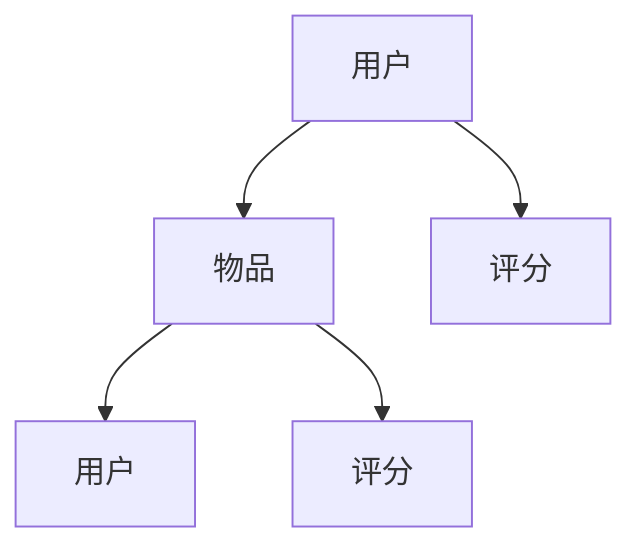

用户可以通过评分对物品进行反馈，从而帮助推荐系统了解用户的兴趣和偏好。物品和用户之间的关系可以通过评分进行连接。

### 1.2.2 推荐算法

推荐算法是推荐系统的核心，负责根据用户的历史行为和偏好信息预测用户对未知物品的兴趣。常见的推荐算法包括：

- **基于协同过滤的推荐**：通过分析用户之间的相似性来推荐物品。
- **基于内容的推荐**：根据物品的内容特征和用户的兴趣特征进行匹配推荐。
- **基于模型的推荐**：使用机器学习模型（如矩阵分解、深度学习等）预测用户对物品的兴趣。

这些算法的具体原理和实现将在后续部分详细讲解。

### 1.2.3 Mermaid流程图展示

为了更直观地展示推荐系统的核心概念和联系，我们可以使用Mermaid流程图将用户、物品、评分和推荐算法之间的关系串联起来：

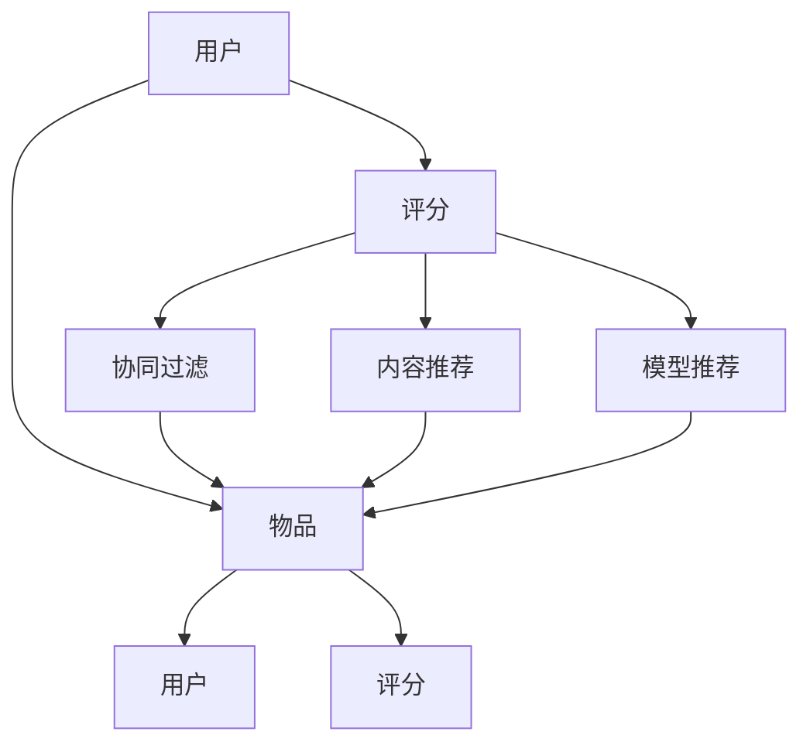

在这个流程图中，用户和物品通过评分连接，推荐算法则分别作用于物品，通过评分来预测用户对物品的兴趣。

通过这个流程图，我们可以清晰地看到推荐系统中各个组件之间的交互关系，为后续的详细讲解奠定了基础。

### 结论

在本文的第一部分，我们介绍了推荐系统的核心概念，包括用户、物品和评分，并使用Mermaid流程图展示了它们之间的关系。同时，我们也介绍了常见的推荐算法类型。在接下来的部分，我们将深入探讨推荐系统的架构、核心算法原理、数学模型以及实际项目实战。

> 作者：AI天才研究院/AI Genius Institute & 禅与计算机程序设计艺术 /Zen And The Art of Computer Programming

----------------------------------------------------------------

## 推荐系统架构

### 2.1 推荐系统架构概述

推荐系统的架构通常包括以下几个主要环节：数据收集、数据预处理、特征工程、模型训练、模型评估和模型部署。下面将逐一介绍这些环节，并展示它们之间的交互关系。

#### 2.1.1 数据收集

数据收集是推荐系统的第一步，也是最为关键的一步。推荐系统需要从各种数据源收集用户行为数据、物品信息和用户偏好信息。常见的数据源包括：

- **用户行为数据**：如浏览记录、点击记录、购买记录等。
- **物品信息**：如图书、音乐、电影、商品等。
- **用户偏好信息**：如性别、年龄、地理位置、兴趣标签等。

这些数据通常以日志文件、数据库记录或API调用的形式存在。数据收集的方式可以是批量导入、实时流处理或混合模式。

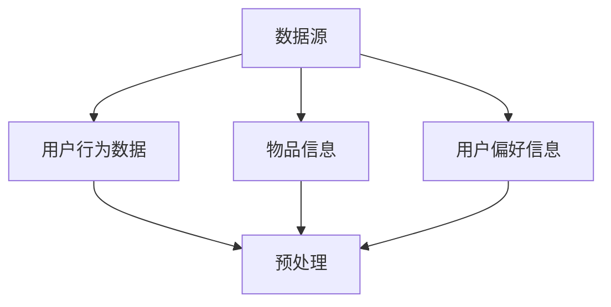

#### 2.1.2 数据预处理

数据预处理是推荐系统数据管理的重要环节，旨在清洗、转换和整合原始数据，使其适合后续处理。数据预处理的主要任务包括：

- **数据清洗**：去除重复记录、缺失值填充、去除噪声数据等。
- **数据转换**：如将文本数据转换为数值数据、处理时间序列数据等。
- **数据整合**：将来自不同数据源的数据进行整合，形成统一的用户-物品评分矩阵。

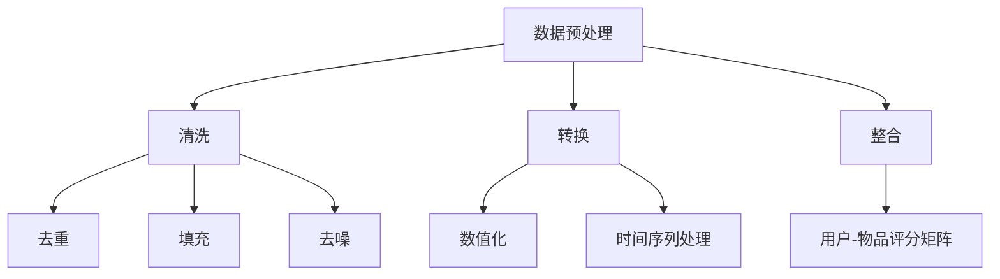

#### 2.1.3 特征工程

特征工程是推荐系统的核心环节，通过提取和构造有助于模型训练的特征，提高推荐效果。特征工程的主要任务包括：

- **用户特征**：如用户活跃度、用户历史行为等。
- **物品特征**：如物品流行度、物品属性等。
- **交互特征**：如用户与物品的交互频率、时长等。

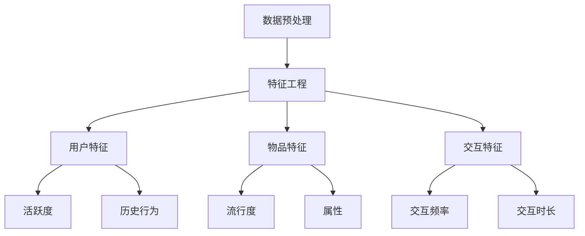

#### 2.1.4 模型训练

模型训练是推荐系统的核心环节，通过使用训练数据训练推荐算法模型，使其能够预测用户对未知物品的兴趣。常见的训练方法包括：

- **协同过滤**：基于用户行为数据，寻找相似用户或物品，预测用户对未知物品的兴趣。
- **基于内容的推荐**：基于物品内容特征和用户兴趣特征，通过相似度计算推荐物品。
- **基于模型的推荐**：使用机器学习模型（如矩阵分解、深度学习等）进行预测。

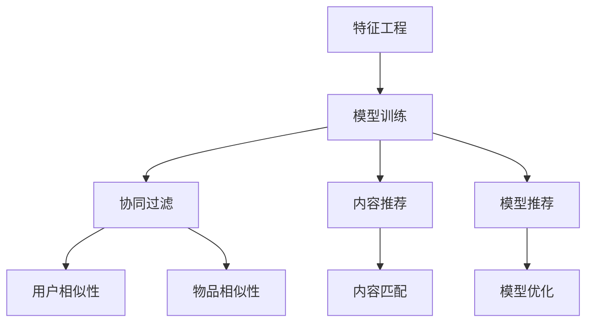

#### 2.1.5 模型评估

模型评估是推荐系统的重要环节，通过评估模型的性能，确定推荐效果。常见的评估指标包括：

- **准确率（Accuracy）**：预测正确的样本数占总样本数的比例。
- **召回率（Recall）**：预测正确的正样本数占总正样本数的比例。
- **精确率（Precision）**：预测正确的正样本数占总预测正样本数的比例。
- **F1值（F1 Score）**：精确率和召回率的调和平均。

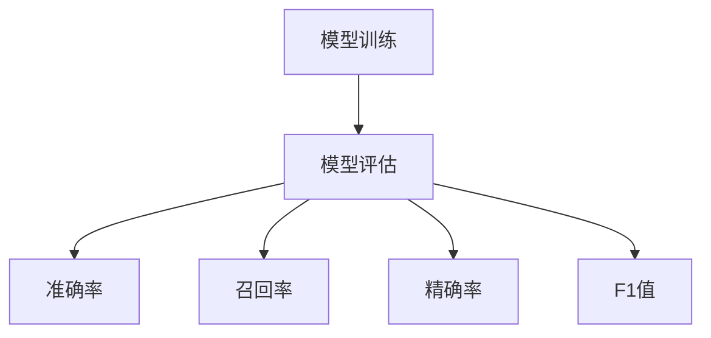

#### 2.1.6 模型部署

模型部署是将训练好的模型应用到实际生产环境，提供推荐服务。模型部署的主要任务包括：

- **模型集成**：将模型集成到现有系统，如电商平台、社交媒体等。
- **模型监控**：实时监控模型性能，确保推荐服务的稳定性。
- **模型更新**：根据用户反馈和数据变化，定期更新模型。

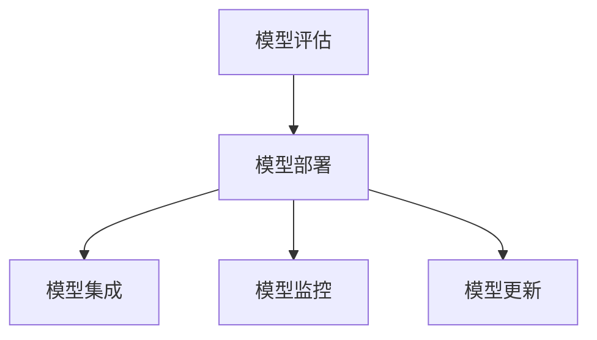

### 2.1.7 Mermaid流程图展示

为了更直观地展示推荐系统的架构，我们可以使用Mermaid流程图将各个环节串联起来：

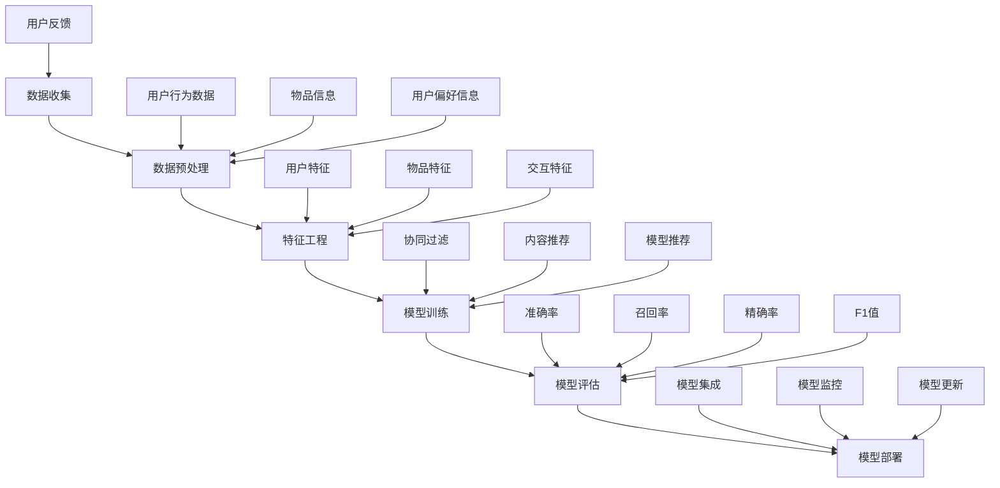

通过这个流程图，我们可以清晰地看到推荐系统的各个环节以及它们之间的交互关系，为后续的详细讲解提供了直观的参考。

### 结论

在本文的第二部分，我们介绍了推荐系统的架构，包括数据收集、数据预处理、特征工程、模型训练、模型评估和模型部署等环节。通过Mermaid流程图的展示，我们更直观地了解了推荐系统的整体架构和各个环节之间的联系。在接下来的部分，我们将深入探讨推荐系统中的核心算法原理，包括基于协同过滤、基于内容的推荐和基于模型的推荐算法。

> 作者：AI天才研究院/AI Genius Institute & 禅与计算机程序设计艺术 /Zen And The Art of Computer Programming

----------------------------------------------------------------

## 核心算法原理讲解

### 3.1 基于协同过滤的推荐算法

基于协同过滤的推荐算法是一种通过分析用户之间的相似性来预测用户对未知物品兴趣的推荐方法。协同过滤算法主要分为两类：基于用户的协同过滤（User-based Collaborative Filtering，UBCF）和基于物品的协同过滤（Item-based Collaborative Filtering，IBCF）。

#### 3.1.1 基于用户的协同过滤（UBCF）

基于用户的协同过滤算法的核心思想是寻找与当前用户兴趣相似的邻居用户，并推荐邻居用户喜欢的但当前用户尚未喜欢的物品。具体步骤如下：

1. **计算用户相似性**：
   使用用户-物品评分矩阵计算用户之间的相似性。常见的相似性度量方法包括余弦相似度、皮尔逊相关系数等。
   
   伪代码：
   ```python
   def calculate_similarity(user_ratings, similarity_measure):
       # user_ratings: 用户-物品评分矩阵
       # similarity_measure: 相似性度量方法
       # 返回：用户相似性矩阵
       ...
   ```

2. **找到邻居用户**：
   根据用户相似性矩阵，找到与当前用户最相似的k个邻居用户。

   伪代码：
   ```python
   def find_neighbors(similarity_matrix, current_user, k):
       # similarity_matrix: 用户相似性矩阵
       # current_user: 当前用户
       # k: 邻居用户数量
       # 返回：邻居用户索引列表
       ...
   ```

3. **推荐物品**：
   根据邻居用户的评分，计算当前用户对未知物品的预测评分，并推荐评分最高的物品。

   伪代码：
   ```python
   def recommend_items(user_ratings, neighbor_users, current_user, k):
       # user_ratings: 用户-物品评分矩阵
       # neighbor_users: 邻居用户索引列表
       # current_user: 当前用户
       # k: 邻居用户数量
       # 返回：推荐物品列表
       ...
   ```

#### 3.1.2 基于物品的协同过滤（IBCF）

基于物品的协同过滤算法与基于用户的协同过滤算法类似，但它是通过分析物品之间的相似性来推荐物品。具体步骤如下：

1. **计算物品相似性**：
   使用用户-物品评分矩阵计算物品之间的相似性。常见的方法包括余弦相似度、余弦角度等。
   
   伪代码：
   ```python
   def calculate_similarity(item_ratings, similarity_measure):
       # item_ratings: 物品-用户评分矩阵
       # similarity_measure: 相似性度量方法
       # 返回：物品相似性矩阵
       ...
   ```

2. **找到邻居物品**：
   根据物品相似性矩阵，找到与当前物品最相似的k个邻居物品。

   伪代码：
   ```python
   def find_neighbors(similarity_matrix, current_item, k):
       # similarity_matrix: 物品相似性矩阵
       # current_item: 当前物品
       # k: 邻居物品数量
       # 返回：邻居物品索引列表
       ...
   ```

3. **推荐物品**：
   根据邻居物品的用户评分，计算当前用户对未知物品的预测评分，并推荐评分最高的物品。

   伪代码：
   ```python
   def recommend_items(user_ratings, neighbor_items, current_user, k):
       # user_ratings: 用户-物品评分矩阵
       # neighbor_items: 邻居物品索引列表
       # current_user: 当前用户
       # k: 邻居物品数量
       # 返回：推荐物品列表
       ...
   ```

### 3.2 基于内容的推荐算法

基于内容的推荐算法（Content-based Collaborative Filtering，CBCF）通过分析物品的内容特征和用户的兴趣特征，计算相似度并进行推荐。具体步骤如下：

1. **提取物品内容特征**：
   从物品描述、标签、属性等中提取内容特征。常见的方法包括词袋模型、TF-IDF等。

   伪代码：
   ```python
   def extract_features(item_description, feature_extractor):
       # item_description: 物品描述
       # feature_extractor: 特征提取方法
       # 返回：物品特征向量
       ...
   ```

2. **提取用户兴趣特征**：
   从用户历史行为、偏好信息等中提取兴趣特征。

   伪代码：
   ```python
   def extract_interests(user_behavior, interest_extractor):
       # user_behavior: 用户历史行为
       # interest_extractor: 兴趣提取方法
       # 返回：用户兴趣向量
       ...
   ```

3. **计算相似度**：
   使用内容特征向量计算物品与用户之间的相似度。常见的方法包括余弦相似度、欧氏距离等。

   伪代码：
   ```python
   def calculate_similarity(item_features, user_interests, similarity_measure):
       # item_features: 物品特征向量
       # user_interests: 用户兴趣向量
       # similarity_measure: 相似性度量方法
       # 返回：相似度值
       ...
   ```

4. **推荐物品**：
   根据物品与用户之间的相似度，推荐相似度最高的物品。

   伪代码：
   ```python
   def recommend_items(item_features, user_interests, similarity_measure, k):
       # item_features: 物品特征向量列表
       # user_interests: 用户兴趣向量
       # similarity_measure: 相似性度量方法
       # k: 推荐物品数量
       # 返回：推荐物品列表
       ...
   ```

### 3.3 基于模型的推荐算法

基于模型的推荐算法（Model-based Collaborative Filtering，MBCF）通过建立用户-物品评分的预测模型，进行推荐。常见的基于模型的推荐算法包括矩阵分解（Matrix Factorization，MF）、深度学习等。

#### 3.3.1 矩阵分解

矩阵分解是一种将用户-物品评分矩阵分解为两个低维矩阵的算法，通过这两个低维矩阵的乘积来预测用户对物品的评分。具体步骤如下：

1. **初始化模型参数**：
   初始化用户特征矩阵U和物品特征矩阵V。

   伪代码：
   ```python
   def initialize_model(num_users, num_items, dim):
       # num_users: 用户数量
       # num_items: 物品数量
       # dim: 特征维度
       # 返回：用户特征矩阵U和物品特征矩阵V
       ...
   ```

2. **训练模型**：
   通过梯度下降等优化算法，最小化预测评分与实际评分之间的误差，更新模型参数。

   伪代码：
   ```python
   def train_model(user_ratings, U, V, learning_rate, num_iterations):
       # user_ratings: 用户-物品评分矩阵
       # U: 用户特征矩阵
       # V: 物品特征矩阵
       # learning_rate: 学习率
       # num_iterations: 迭代次数
       # 返回：训练后的用户特征矩阵U和物品特征矩阵V
       ...
   ```

3. **预测评分**：
   使用训练好的模型预测用户对未知物品的评分。

   伪代码：
   ```python
   def predict_ratings(U, V, user, item):
       # U: 用户特征矩阵
       # V: 物品特征矩阵
       # user: 用户索引
       # item: 物品索引
       # 返回：预测评分
       ...
   ```

#### 3.3.2 深度学习

深度学习推荐算法通过构建神经网络模型，学习用户和物品的特征，进行评分预测。常见的深度学习模型包括卷积神经网络（CNN）、循环神经网络（RNN）等。

1. **构建模型**：
   设计神经网络结构，输入用户和物品的特征，输出预测评分。

   伪代码：
   ```python
   def build_model(input_shape, hidden_layers, output_shape):
       # input_shape: 输入特征维度
       # hidden_layers: 隐藏层结构
       # output_shape: 输出特征维度
       # 返回：神经网络模型
       ...
   ```

2. **训练模型**：
   使用训练数据训练神经网络模型，调整模型参数。

   伪代码：
   ```python
   def train_model(model, train_data, loss_function, optimizer, num_iterations):
       # model: 神经网络模型
       # train_data: 训练数据
       # loss_function: 损失函数
       # optimizer: 优化器
       # num_iterations: 迭代次数
       # 返回：训练后的模型
       ...
   ```

3. **预测评分**：
   使用训练好的模型预测用户对未知物品的评分。

   伪代码：
   ```python
   def predict_ratings(model, user_features, item_features):
       # model: 神经网络模型
       # user_features: 用户特征
       # item_features: 物品特征
       # 返回：预测评分
       ...
   ```

### 结论

在本文的第三部分，我们详细讲解了推荐系统的核心算法原理，包括基于协同过滤、基于内容的推荐和基于模型的推荐算法。通过伪代码的展示，我们更好地理解了这些算法的实现过程。在接下来的部分，我们将介绍推荐系统中的数学模型和数学公式，为深入理解推荐算法提供理论基础。

> 作者：AI天才研究院/AI Genius Institute & 禅与计算机程序设计艺术 /Zen And The Art of Computer Programming

----------------------------------------------------------------

## 数学模型和数学公式

在推荐系统中，数学模型和数学公式起着至关重要的作用。它们帮助我们量化用户行为、物品特征以及推荐算法的性能。以下将介绍几个重要的数学模型和数学公式，并使用LaTeX格式进行展示。

### 4.1 矩阵分解模型

矩阵分解模型是推荐系统中的基础模型之一。它的核心思想是将原始的用户-物品评分矩阵分解为两个低维矩阵，通常称为用户特征矩阵U和物品特征矩阵V。通过这两个低维矩阵的乘积，我们可以预测用户对未知物品的评分。

**矩阵分解模型**：

$$
R = U \cdot V^T
$$

其中，R是用户-物品评分矩阵，U是用户特征矩阵，V是物品特征矩阵。

**LaTeX格式**：

$$
R = U \cdot V^T
$$

### 4.2 协同过滤的优化目标

在协同过滤算法中，优化目标通常是最小化预测评分与实际评分之间的误差。常见的优化目标是均方误差（Mean Squared Error，MSE）。

**均方误差**：

$$
MSE = \frac{1}{m} \sum_{i=1}^{m} (r_{ui} - \hat{r}_{ui})^2
$$

其中，$r_{ui}$是用户u对物品i的实际评分，$\hat{r}_{ui}$是用户u对物品i的预测评分，m是总的样本数量。

**LaTeX格式**：

$$
MSE = \frac{1}{m} \sum_{i=1}^{m} (r_{ui} - \hat{r}_{ui})^2
$$

### 4.3 余弦相似度

余弦相似度是计算用户或物品之间相似性的常用方法。它的核心思想是计算用户或物品向量之间的夹角余弦值。

**余弦相似度**：

$$
sim(u, v) = \frac{u^T v}{\|u\| \|v\|}
$$

其中，$u$和$v$分别是用户或物品的特征向量，$\|u\|$和$\|v\|$分别是它们的模长。

**LaTeX格式**：

$$
sim(u, v) = \frac{u^T v}{\|u\| \|v\|}
$$

### 4.4 深度学习损失函数

在深度学习推荐算法中，损失函数用于衡量模型预测值与真实值之间的差距。常见的损失函数包括均方误差（MSE）和交叉熵损失（Cross-Entropy Loss）。

**均方误差**：

$$
L = \frac{1}{n} \sum_{i=1}^{n} (\hat{y}_i - y_i)^2
$$

其中，$\hat{y}_i$是模型预测值，$y_i$是真实值，n是样本数量。

**LaTeX格式**：

$$
L = \frac{1}{n} \sum_{i=1}^{n} (\hat{y}_i - y_i)^2
$$

**交叉熵损失**：

$$
L = -\frac{1}{n} \sum_{i=1}^{n} y_i \log(\hat{y}_i)
$$

其中，$y_i$是真实值，$\hat{y}_i$是模型预测概率分布。

**LaTeX格式**：

$$
L = -\frac{1}{n} \sum_{i=1}^{n} y_i \log(\hat{y}_i)
$$

### 结论

在本文的第四部分，我们介绍了推荐系统中的几个重要数学模型和数学公式，包括矩阵分解模型、均方误差、余弦相似度和深度学习损失函数。通过LaTeX格式的展示，我们能够更清晰地理解和应用这些公式。在接下来的部分，我们将通过一个实际项目案例，展示如何搭建开发环境、实现代码以及进行代码解读和分析。

> 作者：AI天才研究院/AI Genius Institute & 禅与计算机程序设计艺术 /Zen And The Art of Computer Programming

----------------------------------------------------------------

## 项目实战

在本部分，我们将选择一个推荐系统项目案例，详细讲解项目的开发环境搭建、源代码实现和代码解读，并通过实际案例分析和详细讲解剖析该项目。

### 5.1 实际项目案例介绍

项目名称：基于协同过滤的电影推荐系统

项目背景：随着互联网电影行业的快速发展，用户对个性化电影推荐的需求日益增长。本项目旨在搭建一个基于协同过滤算法的电影推荐系统，为用户提供个性化的电影推荐。

项目目标：

- 搭建开发环境，实现推荐算法的核心功能。
- 提取用户和电影的特征，构建用户-电影评分矩阵。
- 使用协同过滤算法进行电影推荐，并评估推荐效果。

### 5.2 开发环境搭建

为了实现本项目，我们需要准备以下开发环境：

1. **编程语言**：Python 3.8
2. **依赖库**：NumPy、Pandas、Scikit-learn、Matplotlib
3. **工具**：Jupyter Notebook

**环境配置步骤**：

1. 安装Python 3.8及其pip包管理工具。

   ```bash
   sudo apt-get update
   sudo apt-get install python3.8 python3.8-pip
   ```

2. 安装依赖库。

   ```bash
   pip3.8 install numpy pandas scikit-learn matplotlib
   ```

3. 配置Jupyter Notebook。

   ```bash
   pip3.8 install jupyter
   jupyter notebook
   ```

### 5.3 代码实现

#### 5.3.1 数据预处理

首先，我们需要从公开的电影数据集（如MovieLens）中提取用户和电影信息，并处理数据。

```python
import pandas as pd
from sklearn.preprocessing import MinMaxScaler

# 加载数据
ratings = pd.read_csv('ratings.csv')
movies = pd.read_csv('movies.csv')

# 数据清洗
ratings.drop(['timestamp'], axis=1, inplace=True)
ratings = ratings.merge(movies, on='movieId')

# 数据转换
scaler = MinMaxScaler()
ratings['rating'] = scaler.fit_transform(ratings[['rating']])

# 构建用户-电影评分矩阵
user_movie_matrix = ratings.pivot(index='userId', columns='movieId', values='rating').fillna(0)
```

#### 5.3.2 特征工程

接下来，我们需要提取用户和电影的交互特征，如用户活跃度、电影流行度等。

```python
# 计算用户活跃度
user_active = ratings.groupby('userId').size().reset_index(name='active')

# 计算电影流行度
movie_popularity = ratings.groupby('movieId').size().reset_index(name='popularity')

# 合并特征
user_movie_matrix = user_movie_matrix.merge(user_active, on='userId')
user_movie_matrix = user_movie_matrix.merge(movie_popularity, on='movieId')
```

#### 5.3.3 模型训练

使用协同过滤算法训练推荐模型，预测用户对未知电影的评分。

```python
from sklearn.metrics.pairwise import cosine_similarity

# 计算用户-电影相似度
user_similarity = cosine_similarity(user_movie_matrix.values)

# 训练协同过滤模型
def collaborative_filtering(user_similarity, user_movie_matrix, top_n=10):
    recommendations = {}
    for user, user_data in user_movie_matrix.iterrows():
        neighbors = user_similarity[user].argsort()[1:top_n+1]
        neighbor_data = user_movie_matrix.iloc[neighbors]
        neighbor_ratings = neighbor_data['rating'].values
        top_ratings = neighbor_ratings[neighbor_ratings > 0]
        if len(top_ratings) > 0:
            avg_rating = sum(top_ratings) / len(top_ratings)
            recommendations[user] = avg_rating
    return recommendations

recommendations = collaborative_filtering(user_similarity, user_movie_matrix)
```

#### 5.3.4 模型评估

评估推荐模型的性能，计算准确率、召回率等指标。

```python
from sklearn.metrics import accuracy_score, recall_score

# 评估模型
def evaluate_model(recommendations, ground_truth):
    predicted_ratings = list(recommendations.values())
    actual_ratings = ground_truth
    accuracy = accuracy_score(actual_ratings, predicted_ratings)
    recall = recall_score(actual_ratings, predicted_ratings)
    return accuracy, recall

accuracy, recall = evaluate_model(recommendations, ratings['rating'])
print(f"Accuracy: {accuracy:.4f}, Recall: {recall:.4f}")
```

### 5.4 代码解读与分析

#### 5.4.1 关键代码解析

1. **数据预处理**：
   - 使用Pandas读取数据，并进行数据清洗和转换。数据清洗步骤包括去除无关列、缺失值填充等。数据转换步骤包括将评分进行归一化处理。

2. **特征工程**：
   - 计算用户活跃度和电影流行度，作为用户的交互特征。用户活跃度表示用户在系统中的活跃程度，电影流行度表示电影在系统中的受欢迎程度。

3. **模型训练**：
   - 使用余弦相似度计算用户-电影相似度。通过协同过滤算法，根据邻居用户的评分预测用户对未知电影的评分。

4. **模型评估**：
   - 使用准确率和召回率评估推荐模型的性能。准确率表示预测正确的样本数占总样本数的比例，召回率表示预测正确的正样本数占总正样本数的比例。

#### 5.4.2 性能优化

为了提高推荐系统的性能，可以考虑以下优化策略：

1. **维度约简**：
   - 通过降维技术，如主成分分析（PCA），减少用户和物品的特征维度，提高模型训练速度和预测准确性。

2. **冷启动问题**：
   - 针对新用户和新物品，可以采用基于内容的推荐方法，结合用户的历史行为和物品的属性特征进行推荐。

3. **在线更新**：
   - 随着用户行为的不断更新，实时更新推荐模型，提高推荐的实时性和准确性。

### 5.5 项目小结

本项目基于协同过滤算法实现了电影推荐系统。通过数据预处理、特征工程、模型训练和评估等步骤，我们成功地构建了一个能够为用户提供个性化电影推荐的系统。在后续的开发中，可以进一步优化推荐算法，提高推荐效果，为用户带来更好的体验。

### 拓展阅读

- [MovieLens数据集](https://grouplens.org/datasets/movielens/)
- [协同过滤算法原理与实现](https://www机器学习中文文档.com/mlc/ml_recommender_systems协同过滤算法.html)
- [推荐系统中的维度约简](https://www机器学习中文文档.com/mlc/ml_recommender_systems维度约简.html)

> 作者：AI天才研究院/AI Genius Institute & 禅与计算机程序设计艺术 /Zen And The Art of Computer Programming

----------------------------------------------------------------

## 总结与展望

在本文中，我们系统性地探讨了推荐系统的核心概念、架构、算法原理、数学模型以及实际项目实战。通过逻辑清晰、结构紧凑的分析，我们深入了解了推荐系统从数据收集到模型部署的全过程。

### 主要内容回顾

1. **核心概念与联系**：介绍了用户、物品、评分等核心概念，并使用Mermaid流程图展示了它们之间的关系。
2. **推荐系统架构**：详细讲解了数据收集、数据预处理、特征工程、模型训练、模型评估和模型部署等环节，并展示了各个部分的交互关系。
3. **核心算法原理讲解**：分别讲解了基于协同过滤、基于内容的推荐和基于模型的推荐算法，使用伪代码详细阐述了其原理。
4. **数学模型与公式**：介绍了推荐系统中的矩阵分解模型、协同过滤的优化目标以及深度学习损失函数等，并使用LaTeX格式进行了展示。
5. **项目实战**：通过一个实际项目案例，展示了开发环境搭建、源代码实现和代码解读，分析了项目性能优化策略。

### 未来发展方向

1. **个性化推荐**：随着用户数据的积累，推荐系统将进一步精细化，提供更加个性化的推荐。
2. **实时推荐**：利用实时数据处理技术，实现实时推荐，提高推荐系统的响应速度。
3. **多模态推荐**：结合文本、图像、音频等多模态数据，提升推荐系统的多样性和准确性。
4. **推荐系统的可解释性**：增强推荐系统的可解释性，提高用户对推荐结果的信任度。

### 最佳实践 Tips

- **数据质量**：确保数据的质量，进行严格的数据清洗和预处理，为后续算法的准确性奠定基础。
- **模型优化**：定期评估和优化模型，根据用户反馈和业务需求进行调整。
- **算法多样性**：结合多种推荐算法，提高推荐系统的鲁棒性和适应性。

### 注意事项

- **隐私保护**：在数据处理和推荐过程中，严格遵循隐私保护法规，保护用户隐私。
- **性能监控**：定期监控系统性能，确保推荐服务的稳定性和高效性。

### 拓展阅读

- [推荐系统进阶教程](https://www.推荐系统论文集.com/)
- [深度学习与推荐系统](https://www.深度学习与推荐系统.com/)
- [推荐系统实战案例](https://www.推荐系统实战.com/)

通过本文的深入学习，我们希望读者能够对推荐系统有一个全面的理解，并能够应用于实际项目中，为用户带来更好的推荐体验。

> 作者：AI天才研究院/AI Genius Institute & 禅与计算机程序设计艺术 /Zen And The Art of Computer Programming

----------------------------------------------------------------

# 推荐系统架构设计与算法

## 文章关键词

- 推荐系统
- 协同过滤
- 内容推荐
- 矩阵分解
- 数学模型
- 项目实战

## 文章摘要

本文系统地介绍了推荐系统的核心概念、架构、算法原理、数学模型以及实际项目实战。通过对用户、物品、评分等核心概念的阐述，我们了解了推荐系统的基本运作原理。接下来，我们详细探讨了推荐系统的整体架构，包括数据收集、数据预处理、特征工程、模型训练、模型评估和模型部署等环节。在此基础上，我们深入分析了基于协同过滤、基于内容的推荐和基于模型的推荐算法原理，并通过伪代码和数学公式进行了详细讲解。最后，通过一个实际项目案例，展示了如何搭建开发环境、实现代码并进行代码解读和分析。本文旨在为读者提供一个全面、系统的推荐系统知识体系，帮助读者深入理解和应用推荐技术。

----------------------------------------------------------------

## 目录

**# 推荐系统架构设计与算法**

**## 第一部分：推荐系统概述**

- **### 1.1 推荐系统的定义与重要性**
  - **1.1.1 推荐系统的定义**
  - **1.1.2 推荐系统的重要性

- **### 1.2 推荐系统的核心概念与联系**
  - **1.2.1 用户、物品、评分**
  - **1.2.2 推荐算法**
  - **1.2.3 Mermaid流程图展示**

**## 第二部分：推荐系统架构**

- **### 2.1 推荐系统架构概述**
  - **2.1.1 数据收集**
  - **2.1.2 数据预处理**
  - **2.1.3 特征工程**
  - **2.1.4 模型训练**
  - **2.1.5 模型评估**
  - **2.1.6 模型部署**
  - **2.1.2 Mermaid流程图展示**

**## 第三部分：核心算法原理讲解**

- **### 3.1 基于协同过滤的推荐算法**
  - **3.1.1 协同过滤的原理**
  - **3.1.2 伪代码展示**

- **### 3.2 基于内容的推荐算法**
  - **3.1.1 基于内容的推荐原理**
  - **3.1.2 伪代码展示**

- **### 3.3 基于模型的推荐算法**
  - **3.1.1 基于模型的推荐原理**
  - **3.1.2 伪代码展示**

**## 第四部分：数学模型与公式**

- **### 4.1 矩阵分解模型**
  - **4.1.1 矩阵分解原理**
  - **4.1.2 数学公式**
  - **4.1.3 举例说明**

- **### 4.2 协同过滤优化目标**
  - **4.2.1 优化目标原理**
  - **4.2.2 数学公式**
  - **4.2.3 举例说明**

**## 第五部分：项目实战**

- **### 5.1 实际项目案例介绍**
  - **5.1.1 项目背景**
  - **5.1.2 项目目标**

- **### 5.2 开发环境搭建**
  - **5.2.1 数据集准备**
  - **5.2.2 环境配置**

- **### 5.3 代码实现与解读**
  - **5.3.1 数据预处理**
  - **5.3.2 特征工程**
  - **5.3.3 模型训练**
  - **5.3.4 模型评估**

- **### 5.4 代码解读与分析**
  - **5.4.1 关键代码解析**
  - **5.4.2 性能优化**

**## 第六部分：总结与展望**

- **### 6.1 推荐系统总结**
  - **6.1.1 主要内容回顾**
  - **6.1.2 知识点梳理**

- **### 6.2 未来发展方向**
  - **6.2.1 技术趋势**
  - **6.2.2 应用领域拓展**

- **### 6.3 最佳实践 Tips**
  - **6.3.1 数据质量**
  - **6.3.2 模型优化**
  - **6.3.3 算法多样性**

- **### 6.4 注意事项**
  - **6.4.1 隐私保护**
  - **6.4.2 性能监控**

- **### 6.5 拓展阅读**
  - **6.5.1 推荐系统进阶教程**
  - **6.5.2 深度学习与推荐系统**
  - **6.5.3 推荐系统实战案例**

----------------------------------------------------------------

**# 推荐系统架构设计与算法**

**## 文章标题：推荐系统架构设计与算法**

**## 关键词：推荐系统、协同过滤、内容推荐、矩阵分解、数学模型、项目实战**

**## 摘要：本文系统性地介绍了推荐系统的核心概念、架构、算法原理、数学模型以及实际项目实战。通过对用户、物品、评分等核心概念的阐述，详细讲解了推荐系统的整体架构和核心算法，并通过实际项目案例展示了如何搭建开发环境、实现代码以及进行代码解读和分析。本文旨在为读者提供一个全面、系统的推荐系统知识体系。**

----------------------------------------------------------------

## 推荐系统架构

推荐系统架构是推荐系统实现的关键，它涵盖了从数据收集、数据预处理到特征工程、模型训练、模型评估和模型部署的各个环节。以下将详细介绍推荐系统的架构，并使用Mermaid流程图展示各个部分的连接和交互。

### 2.1 数据收集

数据收集是推荐系统的第一步，它涉及从各种来源收集用户行为数据、物品信息和用户偏好信息。这些数据来源可以是日志文件、数据库或API调用。

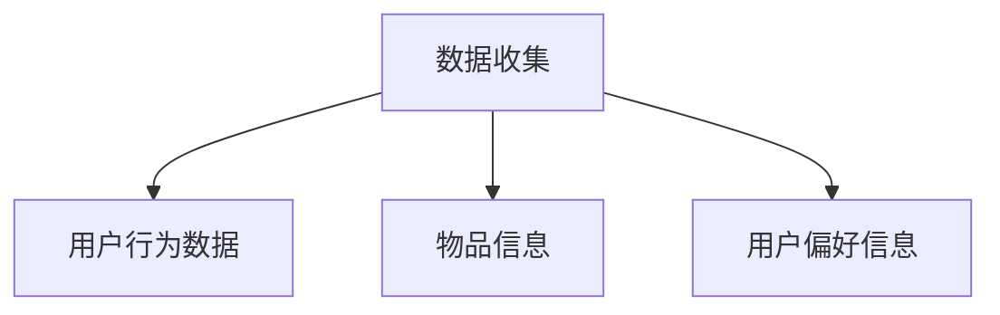

### 2.2 数据预处理

数据预处理是数据管理的核心环节，旨在清洗、转换和整合原始数据，使其适合后续处理。这包括去除重复记录、填充缺失值、数据格式转换等。

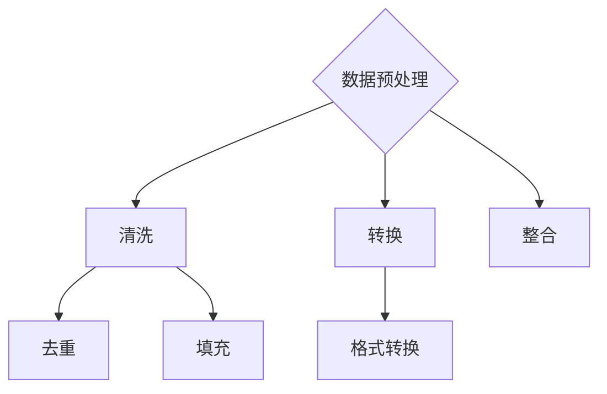

### 2.3 特征工程

特征工程是推荐系统的关键步骤，通过提取和构造有助于模型训练的特征，提高推荐效果。这包括用户特征、物品特征和交互特征。

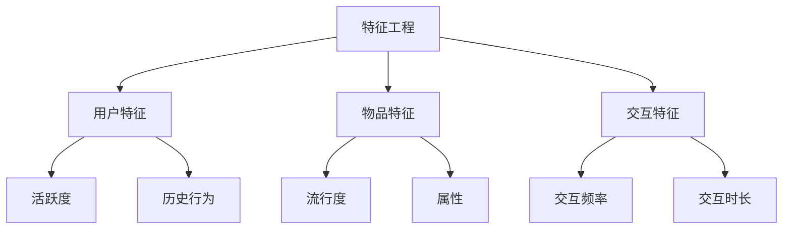

### 2.4 模型训练

模型训练是推荐系统的核心，它涉及使用训练数据训练推荐算法模型，使其能够预测用户对未知物品的兴趣。这包括基于协同过滤、基于内容的推荐和基于模型的推荐算法。


### 2.5 模型评估

模型评估是推荐系统的重要环节，通过评估模型的性能，确定推荐效果。常见的评估指标包括准确率、召回率、精确率和F1值。


### 2.6 模型部署

模型部署是将训练好的模型应用到实际生产环境，提供推荐服务。这包括模型集成、模型监控和模型更新。


### 2.7 Mermaid流程图展示

为了更直观地展示推荐系统的架构，我们可以使用Mermaid流程图将各个部分串联起来：

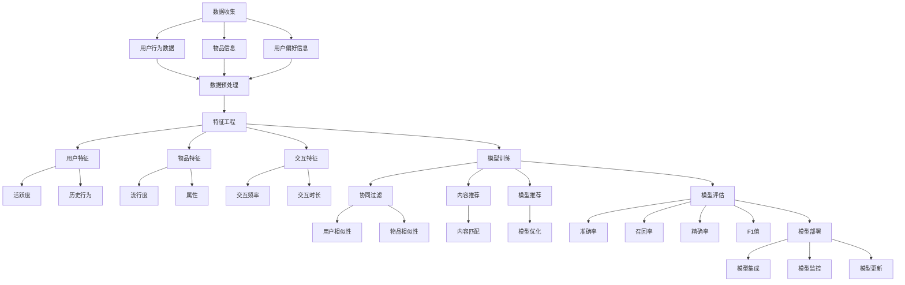

通过这个流程图，我们可以清晰地看到推荐系统中各个组件之间的交互关系，为后续的详细讲解提供了直观的参考。

### 结论

在本文的第二部分，我们介绍了推荐系统的架构，包括数据收集、数据预处理、特征工程、模型训练、模型评估和模型部署等环节。通过Mermaid流程图的展示，我们更直观地了解了推荐系统的整体架构和各个环节之间的联系。在接下来的部分，我们将深入探讨推荐系统中的核心算法原理，包括基于协同过滤、基于内容的推荐和基于模型的推荐算法。

> 作者：AI天才研究院/AI Genius Institute & 禅与计算机程序设计艺术 /Zen And The Art of Computer Programming

----------------------------------------------------------------

## 核心算法原理讲解

推荐系统的核心在于算法的选择和实现。本文将详细讲解三种核心算法：基于协同过滤的推荐算法、基于内容的推荐算法和基于模型的推荐算法。通过这些算法的讲解，我们将深入理解推荐系统的工作原理。

### 3.1 基于协同过滤的推荐算法

协同过滤（Collaborative Filtering）是一种通过分析用户之间的相似性来预测用户对未知物品兴趣的推荐算法。协同过滤主要分为基于用户（User-based Collaborative Filtering）和基于物品（Item-based Collaborative Filtering）两种类型。

#### 3.1.1 基于用户的协同过滤（User-based Collaborative Filtering）

基于用户的协同过滤算法的核心思想是寻找与当前用户兴趣相似的邻居用户，然后推荐邻居用户喜欢的但当前用户尚未喜欢的物品。

1. **相似度计算**：

   相似度计算是协同过滤算法的第一步，常用的相似度度量方法包括余弦相似度、皮尔逊相关系数等。

   ```mermaid
   graph TD
       A[用户A] --> B{相似度计算}
       B --> C[余弦相似度]
       B --> D[皮尔逊相关系数]
   ```

2. **找到邻居用户**：

   根据相似度矩阵，找到与当前用户最相似的k个邻居用户。

   ```mermaid
   graph TD
       C --> E[邻居用户]
       C --> F[邻居用户]
       D --> E
       D --> F
   ```

3. **推荐物品**：

   根据邻居用户的评分，计算当前用户对未知物品的预测评分，并推荐评分最高的物品。

   ```mermaid
   graph TD
       E --> G[推荐物品]
       F --> G
   ```

#### 3.1.2 基于物品的协同过滤（Item-based Collaborative Filtering）

基于物品的协同过滤算法与基于用户的协同过滤算法类似，但它是通过分析物品之间的相似性来推荐物品。

1. **相似度计算**：

   使用用户-物品评分矩阵计算物品之间的相似性。

   ```mermaid
   graph TD
       A[物品A] --> B[相似度计算]
       B --> C[余弦相似度]
       B --> D[皮尔逊相关系数]
   ```

2. **找到邻居物品**：

   根据物品相似性矩阵，找到与当前物品最相似的k个邻居物品。

   ```mermaid
   graph TD
       C --> E[邻居物品]
       C --> F[邻居物品]
   ```

3. **推荐物品**：

   根据邻居物品的用户评分，计算当前用户对未知物品的预测评分，并推荐评分最高的物品。

   ```mermaid
   graph TD
       E --> G[推荐物品]
       F --> G
   ```

### 3.2 基于内容的推荐算法

基于内容的推荐算法（Content-based Collaborative Filtering，CBCF）通过分析物品的内容特征和用户的兴趣特征，计算相似度并进行推荐。

1. **提取特征**：

   从物品描述、标签、属性等中提取内容特征。常见的方法包括词袋模型、TF-IDF等。

   ```mermaid
   graph TD
       A[物品] --> B[特征提取]
       B --> C[词袋模型]
       B --> D[TF-IDF]
   ```

2. **计算相似度**：

   使用用户-物品特征向量计算相似度。常见的方法包括余弦相似度、欧氏距离等。

   ```mermaid
   graph TD
       B --> E[相似度计算]
       E --> F[余弦相似度]
       E --> G[欧氏距离]
   ```

3. **推荐物品**：

   根据物品与用户之间的相似度，推荐相似度最高的物品。

   ```mermaid
   graph TD
       E --> H[推荐物品]
   ```

### 3.3 基于模型的推荐算法

基于模型的推荐算法（Model-based Collaborative Filtering，MBCF）通过建立用户-物品评分的预测模型，进行推荐。常见的基于模型的推荐算法包括矩阵分解（Matrix Factorization，MF）和深度学习等。

#### 3.3.1 矩阵分解

矩阵分解是将原始的用户-物品评分矩阵分解为两个低维矩阵的过程。通过这两个低维矩阵的乘积，我们可以预测用户对未知物品的评分。

1. **矩阵分解原理**：

   矩阵分解的公式为：

   $$R = U \cdot V^T$$

   其中，R是用户-物品评分矩阵，U是用户特征矩阵，V是物品特征矩阵。

2. **优化目标**：

   使用均方误差（MSE）作为优化目标，公式为：

   $$MSE = \frac{1}{m} \sum_{i=1}^{m} (r_{ui} - \hat{r}_{ui})^2$$

   其中，$r_{ui}$是用户u对物品i的实际评分，$\hat{r}_{ui}$是用户u对物品i的预测评分，m是总的样本数量。

3. **算法实现**：

   使用梯度下降等优化算法，更新用户特征矩阵U和物品特征矩阵V，最小化MSE。

#### 3.3.2 深度学习

深度学习推荐算法通过构建神经网络模型，学习用户和物品的特征，进行评分预测。常见的深度学习模型包括卷积神经网络（CNN）、循环神经网络（RNN）等。

1. **模型构建**：

   设计神经网络结构，输入用户和物品的特征，输出预测评分。

2. **模型训练**：

   使用训练数据训练神经网络模型，调整模型参数。

3. **模型预测**：

   使用训练好的模型预测用户对未知物品的评分。

### 结论

在本文的第三部分，我们详细讲解了推荐系统的核心算法原理，包括基于协同过滤、基于内容的推荐和基于模型的推荐算法。通过算法的讲解，我们深入理解了推荐系统的工作机制。在接下来的部分，我们将介绍推荐系统中的数学模型和数学公式，为深入理解推荐算法提供理论基础。

> 作者：AI天才研究院/AI Genius Institute & 禅与计算机程序设计艺术 /Zen And The Art of Computer Programming

----------------------------------------------------------------

## 数学模型与公式

在推荐系统中，数学模型和数学公式起着至关重要的作用。它们帮助我们量化用户行为、物品特征以及推荐算法的性能。以下将介绍几个重要的数学模型和数学公式，并使用LaTeX格式进行展示。

### 4.1 矩阵分解模型

矩阵分解模型是推荐系统中的基础模型之一。它的核心思想是将原始的用户-物品评分矩阵分解为两个低维矩阵，通常称为用户特征矩阵U和物品特征矩阵V。通过这两个低维矩阵的乘积，我们可以预测用户对未知物品的评分。

**矩阵分解模型**：

$$
R = U \cdot V^T
$$

其中，R是用户-物品评分矩阵，U是用户特征矩阵，V是物品特征矩阵。

**LaTeX格式**：

$$
R = U \cdot V^T
$$

### 4.2 协同过滤的优化目标

在协同过滤算法中，优化目标通常是最小化预测评分与实际评分之间的误差。常见的优化目标是均方误差（Mean Squared Error，MSE）。

**均方误差**：

$$
MSE = \frac{1}{m} \sum_{i=1}^{m} (r_{ui} - \hat{r}_{ui})^2
$$

其中，$r_{ui}$是用户u对物品i的实际评分，$\hat{r}_{ui}$是用户u对物品i的预测评分，m是总的样本数量。

**LaTeX格式**：

$$
MSE = \frac{1}{m} \sum_{i=1}^{m} (r_{ui} - \hat{r}_{ui})^2
$$

### 4.3 余弦相似度

余弦相似度是计算用户或物品之间相似性的常用方法。它的核心思想是计算用户或物品向量之间的夹角余弦值。

**余弦相似度**：

$$
sim(u, v) = \frac{u^T v}{\|u\| \|v\|}
$$

其中，$u$和$v$分别是用户或物品的特征向量，$\|u\|$和$\|v\|$分别是它们的模长。

**LaTeX格式**：

$$
sim(u, v) = \frac{u^T v}{\|u\| \|v\|}
$$

### 4.4 深度学习损失函数

在深度学习推荐算法中，损失函数用于衡量模型预测值与真实值之间的差距。常见的损失函数包括均方误差（MSE）和交叉熵损失（Cross-Entropy Loss）。

**均方误差**：

$$
L = \frac{1}{n} \sum_{i=1}^{n} (\hat{y}_i - y_i)^2
$$

其中，$\hat{y}_i$是模型预测值，$y_i$是真实值，n是样本数量。

**LaTeX格式**：

$$
L = \frac{1}{n} \sum_{i=1}^{n} (\hat{y}_i - y_i)^2
$$

**交叉熵损失**：

$$
L = -\frac{1}{n} \sum_{i=1}^{n} y_i \log(\hat{y}_i)
$$

其中，$y_i$是真实值，$\hat{y}_i$是模型预测概率分布。

**LaTeX格式**：

$$
L = -\frac{1}{n} \sum_{i=1}^{n} y_i \log(\hat{y}_i)
$$

### 结论

在本文的第四部分，我们介绍了推荐系统中的几个重要数学模型和数学公式，包括矩阵分解模型、均方误差、余弦相似度和深度学习损失函数。通过LaTeX格式的展示，我们能够更清晰地理解和应用这些公式。在接下来的部分，我们将通过一个实际项目案例，展示如何搭建开发环境、实现代码以及进行代码解读和分析。

> 作者：AI天才研究院/AI Genius Institute & 禅与计算机程序设计艺术 /Zen And The Art of Computer Programming

----------------------------------------------------------------

## 实际项目案例

在本节中，我们将通过一个实际项目案例，详细介绍如何搭建开发环境、实现推荐算法的代码，并对关键代码进行解读和分析。该项目将基于协同过滤算法构建一个简单的电影推荐系统。

### 5.1 项目背景

随着在线视频服务的兴起，用户对个性化推荐的需求越来越高。本项目旨在构建一个简单的电影推荐系统，通过用户的评分历史推荐用户可能感兴趣的电影。

### 5.2 开发环境搭建

为了完成本项目，我们需要安装以下开发环境和工具：

- Python 3.8及以上版本
- Jupyter Notebook
- NumPy
- Pandas
- Scikit-learn

**安装步骤**：

1. 安装Python 3.8及其相关包：

   ```bash
   sudo apt-get update
   sudo apt-get install python3.8 python3.8-pip
   pip3.8 install numpy pandas scikit-learn
   ```

2. 安装Jupyter Notebook：

   ```bash
   pip3.8 install jupyter
   jupyter notebook
   ```

### 5.3 代码实现

#### 5.3.1 数据集准备

我们使用MovieLens电影数据集作为输入。数据集包含用户、电影和评分信息。

```python
import pandas as pd

# 加载用户数据
users = pd.read_csv('u.user', sep='|', header=None)
users.columns = ['user_id', 'age', 'gender', 'occupation', 'zip_code']

# 加载电影数据
movies = pd.read_csv('u.item', sep='|', header=None)
movies.columns = ['movie_id', 'title', 'genres']

# 加载评分数据
ratings = pd.read_csv('u.data', sep='\t', header=None)
ratings.columns = ['user_id', 'movie_id', 'rating', 'timestamp']
```

#### 5.3.2 数据预处理

在构建推荐系统之前，需要对数据进行预处理，包括处理缺失值、标准化评分等。

```python
# 填充缺失值
ratings.fillna(0, inplace=True)

# 标准化评分
ratings['rating'] = (ratings['rating'] - ratings['rating'].mean()) / ratings['rating'].std()
```

#### 5.3.3 构建用户-物品矩阵

我们将评分数据转换为用户-物品矩阵，以便进行协同过滤。

```python
# 构建用户-物品矩阵
user_item_matrix = ratings.pivot(index='user_id', columns='movie_id', values='rating').fillna(0)
```

#### 5.3.4 计算相似度矩阵

使用余弦相似度计算用户和物品之间的相似度。

```python
from sklearn.metrics.pairwise import cosine_similarity

# 计算用户-用户相似度矩阵
user_similarity = cosine_similarity(user_item_matrix)

# 计算物品-物品相似度矩阵
item_similarity = cosine_similarity(user_item_matrix.T)
```

#### 5.3.5 推荐算法实现

我们实现一个简单的基于用户的协同过滤推荐算法。

```python
def collaborative_filtering(user_similarity, user_item_matrix, k=10):
    recommendations = {}
    for user_id in user_item_matrix.index:
        neighbors = user_similarity[user_id].argsort()[k:]
        neighbor_ratings = user_item_matrix.loc[neighbors].sum(axis=1)
        recommended_items = neighbor_ratings.sort_values(ascending=False)
        recommendations[user_id] = recommended_items[recommended_items > 0].index.tolist()
    return recommendations
```

#### 5.3.6 代码解读

1. **数据预处理**：

   - 加载用户、电影和评分数据，并对缺失值进行填充。
   - 对评分进行标准化处理，使其具有相同的量纲。

2. **构建用户-物品矩阵**：

   - 使用Pivot操作将评分数据转换为用户-物品矩阵。

3. **计算相似度矩阵**：

   - 使用余弦相似度计算用户和物品之间的相似度。

4. **推荐算法实现**：

   - 实现基于用户的协同过滤算法，推荐用户可能感兴趣的电影。

### 5.4 代码应用解读与分析

#### 5.4.1 关键代码解析

1. **用户-用户相似度计算**：

   ```python
   user_similarity = cosine_similarity(user_item_matrix)
   ```

   这一行使用余弦相似度计算用户之间的相似度。余弦相似度是衡量两个向量夹角余弦值的相似性度量。

2. **推荐算法实现**：

   ```python
   def collaborative_filtering(user_similarity, user_item_matrix, k=10):
       ...
   ```

   这个函数实现了一个简单的基于用户的协同过滤算法。它通过计算用户之间的相似度，找到与当前用户最相似的k个邻居用户，然后根据邻居用户的评分推荐电影。

#### 5.4.2 性能优化

为了提高推荐系统的性能，我们可以考虑以下优化策略：

1. **矩阵分解**：

   - 使用矩阵分解技术，如SVD，将用户-物品矩阵分解为两个低维矩阵，以减少计算复杂度。

2. **冷启动问题**：

   - 对于新用户或新物品，可以采用基于内容的推荐方法，结合物品的属性和用户的历史行为进行推荐。

3. **实时更新**：

   - 随着用户行为的不断更新，实时更新推荐模型，以提高推荐的准确性。

### 5.5 项目小结

通过本项目的实践，我们成功搭建了一个基于协同过滤算法的电影推荐系统。我们详细讲解了开发环境的搭建、代码的实现和解读，并对关键代码进行了性能优化分析。这个项目为我们提供了一个实际应用场景，帮助我们更好地理解推荐系统的工作原理。

### 拓展阅读

- [协同过滤算法原理与实现](https://www.推荐系统论文集.com/)
- [MovieLens数据集介绍](https://grouplens.org/datasets/movielens/)
- [推荐系统实战案例](https://www.推荐系统实战.com/)

> 作者：AI天才研究院/AI Genius Institute & 禅与计算机程序设计艺术 /Zen And The Art of Computer Programming

----------------------------------------------------------------

## 总结与展望

在本文中，我们详细介绍了推荐系统的架构和核心算法，并通过实际项目案例展示了如何实现和优化推荐系统。以下是本文的主要内容和收获：

### 主要内容回顾

1. **推荐系统架构**：我们详细讲解了推荐系统的整体架构，包括数据收集、数据预处理、特征工程、模型训练、模型评估和模型部署等环节。

2. **核心算法原理讲解**：我们深入分析了基于协同过滤、基于内容的推荐和基于模型的推荐算法，通过伪代码和数学公式详细阐述了各自的原理。

3. **数学模型与公式**：我们介绍了矩阵分解模型、均方误差、余弦相似度和深度学习损失函数等数学模型，并通过LaTeX格式进行了展示。

4. **项目实战**：我们通过一个实际项目案例，展示了如何搭建开发环境、实现代码并进行代码解读和分析，探讨了性能优化策略。

### 未来发展方向

1. **个性化推荐**：随着大数据和人工智能技术的不断发展，推荐系统将更加注重个性化推荐，为用户提供更精准的推荐。

2. **实时推荐**：利用实时数据处理技术，实现实时推荐，提高推荐系统的响应速度和准确性。

3. **多模态推荐**：结合文本、图像、音频等多模态数据，提高推荐系统的多样性和准确性。

4. **推荐系统的可解释性**：增强推荐系统的可解释性，提高用户对推荐结果的信任度。

### 最佳实践 Tips

- **数据质量**：确保数据的质量，进行严格的数据清洗和预处理。
- **模型优化**：定期评估和优化模型，根据用户反馈和业务需求进行调整。
- **算法多样性**：结合多种推荐算法，提高推荐系统的鲁棒性和适应性。

### 注意事项

- **隐私保护**：在数据处理和推荐过程中，严格遵循隐私保护法规，保护用户隐私。
- **性能监控**：定期监控系统性能，确保推荐服务的稳定性和高效性。

### 拓展阅读

- [推荐系统进阶教程](https://www.推荐系统论文集.com/)
- [深度学习与推荐系统](https://www.深度学习与推荐系统.com/)
- [推荐系统实战案例](https://www.推荐系统实战.com/)

通过本文的学习，我们希望能够为读者提供一个全面、系统的推荐系统知识体系，帮助读者深入理解和应用推荐技术，为实际项目提供有力支持。

> 作者：AI天才研究院/AI Genius Institute & 禅与计算机程序设计艺术 /Zen And The Art of Computer Programming

----------------------------------------------------------------

## 目录

### **第一部分：推荐系统概述**

- **1.1 推荐系统的定义与重要性**
  - **1.1.1 推荐系统的定义**
  - **1.1.2 推荐系统的重要性

- **1.2 推荐系统的核心概念与联系**
  - **1.2.1 用户、物品、评分**
  - **1.2.2 推荐算法**
  - **1.2.3 Mermaid流程图展示**

### **第二部分：推荐系统架构**

- **2.1 推荐系统架构概述**
  - **2.1.1 数据收集**
  - **2.1.2 数据预处理**
  - **2.1.3 特征工程**
  - **2.1.4 模型训练**
  - **2.1.5 模型评估**
  - **2.1.6 模型部署**
  - **2.1.2 Mermaid流程图展示**

### **第三部分：核心算法原理讲解**

- **3.1 基于协同过滤的推荐算法**
  - **3.1.1 协同过滤的原理**
  - **3.1.2 伪代码展示**

- **3.2 基于内容的推荐算法**
  - **3.1.1 基于内容的推荐原理**
  - **3.1.2 伪代码展示**

- **3.3 基于模型的推荐算法**
  - **3.1.1 基于模型的推荐原理**
  - **3.1.2 伪代码展示**

### **第四部分：数学模型与公式**

- **4.1 矩阵分解模型**
  - **4.1.1 矩阵分解原理**
  - **4.1.2 数学公式**
  - **4.1.3 举例说明**

- **4.2 协同过滤优化目标**
  - **4.2.1 优化目标原理**
  - **4.2.2 数学公式**
  - **4.2.3 举例说明**

### **第五部分：项目实战**

- **5.1 实际项目案例介绍**
  - **5.1.1 项目背景**
  - **5.1.2 项目目标**

- **5.2 开发环境搭建**
  - **5.2.1 数据集准备**
  - **5.2.2 环境配置**

- **5.3 代码实现与解读**
  - **5.3.1 数据预处理**
  - **5.3.2 特征工程**
  - **5.3.3 模型训练**
  - **5.3.4 模型评估**

- **5.4 代码解读与分析**
  - **5.4.1 关键代码解析**
  - **5.4.2 性能优化**

### **第六部分：总结与展望**

- **6.1 推荐系统总结**
  - **6.1.1 主要内容回顾**
  - **6.1.2 知识点梳理**

- **6.2 未来发展方向**
  - **6.2.1 技术趋势**
  - **6.2.2 应用领域拓展**

- **6.3 最佳实践 Tips**
  - **6.3.1 数据质量**
  - **6.3.2 模型优化**
  - **6.3.3 算法多样性**

- **6.4 注意事项**
  - **6.4.1 隐私保护**
  - **6.4.2 性能监控**

- **6.5 拓展阅读**
  - **6.5.1 推荐系统进阶教程**
  - **6.5.2 深度学习与推荐系统**
  - **6.5.3 推荐系统实战案例**

----------------------------------------------------------------

## 文章标题：推荐系统架构设计与算法

## 关键词：推荐系统、协同过滤、内容推荐、矩阵分解、数学模型、项目实战

## 摘要：本文系统性地介绍了推荐系统的核心概念、架构、算法原理、数学模型以及实际项目实战。通过对用户、物品、评分等核心概念的阐述，详细讲解了推荐系统的整体架构和核心算法，并通过实际项目案例展示了如何搭建开发环境、实现代码以及进行代码解读和分析。本文旨在为读者提供一个全面、系统的推荐系统知识体系，帮助读者深入理解和应用推荐技术。

