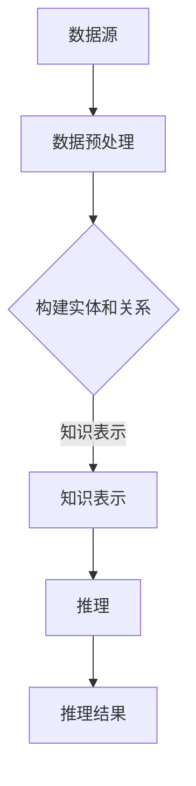
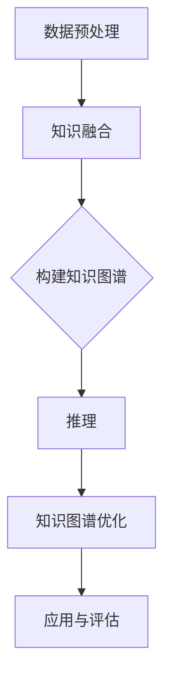

                 

## 文章标题：提升AI模型在跨域知识图谱构建任务中的表现

#### 关键词：AI模型、知识图谱、跨域、构建、深度学习、图神经网络

> 摘要：本文旨在探讨如何提升人工智能模型在跨域知识图谱构建任务中的性能。首先，我们介绍了知识图谱及其在跨域场景中的重要性。随后，详细分析了知识图谱的基本概念、构建方法以及核心算法原理。接下来，我们探讨了AI模型，特别是深度学习和图神经网络在知识图谱构建中的应用。最后，通过具体项目和案例分析，展示了如何将理论应用于实践，并提出了未来研究和应用的方向。

---

### 提升AI模型在跨域知识图谱构建任务中的表现

#### # 第一部分：引言

#### 第1章：跨域知识图谱构建概述

##### 1.1 跨域知识图谱的定义和重要性

知识图谱是一种结构化数据形式，通过实体、属性和关系的组合来表示信息。跨域知识图谱则是在不同领域或学科之间构建的知识图谱，它能够整合来自多个领域的知识，实现知识的共享和复用。跨域知识图谱的重要性体现在以下几个方面：

1. **知识整合**：跨域知识图谱能够将不同领域内的知识进行整合，形成一个统一的知识体系。
2. **智能推理**：跨域知识图谱支持复杂的推理过程，能够发现实体之间的关系，从而提供更智能的决策支持。
3. **数据挖掘**：通过跨域知识图谱，可以进行更深入的数据挖掘，发现潜在的关联和趋势。
4. **应用广泛**：跨域知识图谱在金融、医疗、电商等多个领域都有广泛的应用。

##### 1.2 跨域知识图谱构建的挑战

构建跨域知识图谱面临着诸多挑战：

1. **数据多样性**：不同领域的数据格式和结构可能截然不同，这增加了数据整合的难度。
2. **数据质量**：数据中的噪声、错误和不一致性会影响知识图谱的构建和推理效果。
3. **知识融合**：如何有效地融合来自不同领域的数据和知识，是一个关键问题。
4. **可扩展性**：随着数据量的增加，如何保证知识图谱的可扩展性和鲁棒性。

##### 1.3 跨域知识图谱的应用场景

跨域知识图谱的应用场景非常广泛，以下是一些典型的应用：

1. **智能搜索**：通过跨域知识图谱，可以实现更加智能和精准的搜索结果。
2. **推荐系统**：跨域知识图谱可以帮助推荐系统更好地理解用户兴趣，提供个性化的推荐。
3. **知识图谱增强的问答系统**：通过跨域知识图谱，可以构建出能够回答复杂问题的智能问答系统。
4. **智能决策支持系统**：跨域知识图谱可以提供丰富的数据和信息，帮助决策者做出更明智的决策。

---

#### # 第二部分：核心概念与联系

#### 第2章：知识图谱的基础概念

##### 2.1 知识图谱的基本架构

知识图谱的基本架构包括三个核心部分：实体、属性和关系。

1. **实体**：实体是知识图谱中的基本元素，可以是人、地点、物品等。
2. **属性**：属性描述了实体的特征或状态，例如一个人的年龄、性别等。
3. **关系**：关系描述了实体之间的关联，例如一个人是某个地点的居民，某本书是某个作家的作品等。

##### 2.2 知识表示和推理方法

知识表示和推理是知识图谱构建的两个核心环节。

1. **知识表示**：知识表示方法包括语义网络、OWL（Web Ontology Language）等。语义网络通过实体和关系的组合来表示知识，而OWL则是一种形式化的知识表示语言，可以定义复杂的本体和推理规则。
2. **推理方法**：推理方法包括基于规则的推理和基于模型的推理。基于规则的推理通过预定义的规则来推导新的结论，而基于模型的推理则通过机器学习模型来发现实体之间的关系。

##### 2.3 Mermaid流程图：知识图谱构建的原理图

以下是一个简化的Mermaid流程图，展示了知识图谱构建的基本原理：



#### 第3章：跨域知识图谱构建方法

##### 3.1 数据预处理

数据预处理是跨域知识图谱构建的基础步骤，主要包括以下任务：

1. **数据清洗**：去除数据中的噪声和错误。
2. **数据转换**：将不同格式的数据转换为统一的格式。
3. **数据整合**：整合来自多个领域的知识，形成统一的知识库。

##### 3.2 知识融合方法

知识融合是跨域知识图谱构建的核心步骤，主要包括以下方法：

1. **基于规则的方法**：通过预定义的规则来融合不同领域的知识。
2. **基于机器学习的方法**：使用机器学习算法来发现实体之间的关系，并进行知识融合。

##### 3.3 Mermaid流程图：跨域知识图谱构建的流程图

以下是一个简化的Mermaid流程图，展示了跨域知识图谱构建的基本流程：



---

#### # 第三部分：AI模型在知识图谱构建中的应用

#### 第4章：AI模型在知识图谱构建中的应用

##### 4.1 传统机器学习算法与知识图谱构建

传统机器学习算法在知识图谱构建中发挥着重要作用。例如：

1. **分类算法**：用于分类实体和关系，提高知识表示的准确性。
2. **聚类算法**：用于发现数据中的潜在模式，辅助知识融合。
3. **回归算法**：用于预测实体的属性，增强知识推理能力。

##### 4.2 深度学习模型与知识图谱构建

深度学习模型在知识图谱构建中展现了强大的能力，主要包括：

1. **图神经网络**：用于表示实体和关系，实现知识的深度表示和推理。
2. **序列模型**：如LSTM（Long Short-Term Memory），用于处理实体序列，识别实体间的动态关系。
3. **变换器模型**：如BERT（Bidirectional Encoder Representations from Transformers），用于预训练实体和关系的嵌入向量，提升知识表示的泛化能力。

##### 4.3 自然语言处理技术在知识图谱构建中的应用

自然语言处理（NLP）技术在知识图谱构建中也有广泛应用，主要包括：

1. **实体识别**：使用NLP技术识别文本中的实体，作为知识图谱的构建基础。
2. **关系抽取**：使用NLP技术从文本中抽取实体之间的关系，丰富知识图谱的内容。
3. **文本分类与主题建模**：用于分析和分类文本数据，辅助知识融合和推理。

---

#### # 第四部分：核心算法原理讲解

#### 第5章：图神经网络原理与应用

##### 5.1 图神经网络的基本概念

图神经网络（Graph Neural Networks, GNN）是一种专门用于处理图结构数据的神经网络。它的核心思想是通过图结构来表示实体和关系，并通过节点和边的交互来学习实体和关系的特征表示。

##### 5.2 图神经网络的算法框架

图神经网络的算法框架主要包括以下几个步骤：

1. **节点表示学习**：通过神经网络学习每个节点的特征表示。
2. **消息传递**：节点之间通过边的权重传递信息，更新节点的特征表示。
3. **聚合操作**：将接收到的消息进行聚合，得到新的节点特征表示。
4. **输出层**：使用新的节点特征表示进行分类、预测或回归任务。

以下是一个简化的伪代码：

```python
for layer in range(L):
    for node in graph:
        node_features = GNN_node layer(node)
        for neighbor in node.neighbors:
            message = GNN_edge(node_features, neighbor_features)
            updated_node_features = aggregate_messages(node, message)
    output = GNN_output(updated_node_features)
```

##### 5.3 图神经网络在跨域知识图谱构建中的应用

图神经网络在跨域知识图谱构建中的应用主要包括：

1. **实体和关系表示**：使用图神经网络学习跨域实体和关系的特征表示，提高知识表示的准确性。
2. **知识融合**：通过图神经网络的消息传递机制，实现跨域知识的融合和整合。
3. **推理和预测**：利用图神经网络的输出层，进行跨域知识图谱的推理和预测任务。

---

#### 第6章：多模态数据融合与表示

##### 6.1 多模态数据融合的基本概念

多模态数据融合是将来自不同来源的数据进行整合，以获得更全面和准确的信息。在跨域知识图谱构建中，多模态数据融合可以帮助整合不同领域的知识。

##### 6.2 多模态数据表示方法

多模态数据表示方法主要包括：

1. **特征级融合**：将不同模态的数据特征进行拼接，形成统一的特征向量。
2. **模型级融合**：使用多个模型分别处理不同模态的数据，然后融合模型的输出。
3. **深度学习方法**：使用深度学习模型直接学习多模态数据的联合表示。

以下是一个简化的伪代码：

```python
# 特征级融合
modal1_features = Modal1_model(data1)
modal2_features = Modal2_model(data2)
 fused_features = concatenate(modal1_features, modal2_features)

# 模型级融合
model1_output = Modal1_model(data1)
model2_output = Modal2_model(data2)
 fused_output = fuse_outputs(model1_output, model2_output)

# 深度学习方法
multimodal_features = Multimodal_DNN(data1, data2)
```

##### 6.3 多模态数据融合在跨域知识图谱构建中的应用

多模态数据融合在跨域知识图谱构建中的应用主要包括：

1. **实体表示**：通过融合不同模态的数据，生成更全面和准确的实体表示。
2. **关系表示**：通过融合不同模态的数据，生成更丰富和精确的关系表示。
3. **推理和预测**：利用融合后的数据，进行更准确的推理和预测任务。

---

#### # 第五部分：数学模型和数学公式讲解

#### 第7章：数学模型在知识图谱构建中的应用

##### 7.1 知识图谱表示学习模型

知识图谱表示学习模型是一种基于深度学习的模型，用于学习实体和关系的低维表示。常见的知识图谱表示学习模型包括：

1. **TransE**：通过最小化实体和关系的距离来学习实体和关系的嵌入向量。
2. **TransH**：通过调整实体的方向来学习实体和关系的嵌入向量。
3. **ComplEx**：同时考虑实体和关系的嵌入向量之间的乘法和加法组合。

以下是一个简化的伪代码：

```python
for epoch in range(E):
    for (entity, relation, target_entity) in triples:
        prediction = entity_embedding * relation_embedding + target_entity_embedding
        loss = loss_function(prediction, target_entity_embedding)
        optimizer.minimize(loss)
```

##### 7.2 知识图谱推理模型

知识图谱推理模型是一种基于深度学习的模型，用于根据已知的事实进行推理，发现新的实体关系。常见的知识图谱推理模型包括：

1. **TransR**：通过考虑实体和关系的交互来学习实体和关系的嵌入向量。
2. **Relation Network**：通过训练一个神经网络来预测两个实体之间的关系。

以下是一个简化的伪代码：

```python
for epoch in range(E):
    for (entity1, relation, entity2) in triples:
        relation_embedding = Relation_model(entity1_embedding, entity2_embedding)
        prediction = relation_embedding
        loss = loss_function(prediction, true_relation_embedding)
        optimizer.minimize(loss)
```

##### 7.3 数学公式与详细讲解

在知识图谱表示学习中，常用的数学公式包括：

1. **向量距离**：用于衡量实体和关系的距离，常见的距离度量有L1、L2和Cosine距离。
   $$ d(e_r, h_t, r_t) = \frac{||e_r - h_t r_t||_p}{||h_t r_t||_p} $$
   
2. **损失函数**：用于衡量预测值和真实值之间的差距，常见的损失函数有均方误差（MSE）和交叉熵（Cross-Entropy）。
   $$ loss = \frac{1}{2} \sum_{(e_r, h_t, r_t) \in train\_triples} (e_r - h_t r_t)^2 $$
   $$ loss = - \sum_{(e_r, h_t, r_t) \in train\_triples} y \log(\hat{y}) $$
   
3. **梯度下降**：用于优化模型参数，常见的梯度下降方法有随机梯度下降（SGD）和批量梯度下降（BGD）。
   $$ \theta = \theta - \alpha \frac{\partial J(\theta)}{\partial \theta} $$
   
这些数学公式在知识图谱表示学习中起到了关键作用，通过最小化损失函数，模型可以学习到实体和关系的低维嵌入向量，从而实现知识图谱的表示和推理。

---

#### # 第六部分：项目实战

#### 第8章：跨域知识图谱构建项目实战

##### 8.1 项目背景与目标

项目背景：随着互联网和大数据技术的发展，越来越多的领域开始重视知识图谱的应用。本项目旨在构建一个跨域知识图谱，整合来自金融、医疗和电商三个领域的知识，为用户提供更全面和智能的服务。

项目目标：
1. 收集和预处理来自金融、医疗和电商三个领域的数据。
2. 构建一个统一的跨域知识图谱，包含实体、属性和关系。
3. 使用AI模型进行知识图谱的表示和推理。
4. 实现一个基于知识图谱的智能问答系统。

##### 8.2 开发环境搭建

1. **硬件环境**：配置了高性能的GPU服务器，用于训练深度学习模型。
2. **软件环境**：安装了Python、TensorFlow和Neo4j等软件，用于知识图谱的构建和推理。
3. **数据集**：收集了金融、医疗和电商三个领域的公开数据集，包括文本、图像和表格数据。

##### 8.3 数据采集与预处理

1. **数据采集**：从互联网和其他数据源收集了金融、医疗和电商三个领域的文本、图像和表格数据。
2. **数据预处理**：
   - 文本数据：使用分词、去停用词、词性标注等技术进行预处理。
   - 图像数据：使用图像识别技术提取特征，例如使用ResNet模型提取图像嵌入向量。
   - 表格数据：使用Pandas库进行数据清洗和转换。

##### 8.4 知识图谱构建与融合

1. **知识图谱构建**：使用Neo4j构建了跨域知识图谱，包含了金融、医疗和电商三个领域的实体、属性和关系。
2. **知识融合**：
   - 使用图神经网络（GNN）学习实体和关系的特征表示，提高知识表示的准确性。
   - 使用多模态数据融合方法，将文本、图像和表格数据融合到知识图谱中，实现跨域知识的整合。

##### 8.5 代码实现与解读

1. **代码实现**：
   - 使用Python编写了知识图谱构建和推理的代码，包括数据预处理、图神经网络训练和推理等。
   - 使用Neo4j进行知识图谱的存储和管理，并使用Cypher查询语言进行数据操作。

2. **代码解读**：
   - 数据预处理部分：使用NLP技术对文本数据进行了分词、去停用词和词性标注，提取实体和关系。
   - 图神经网络部分：使用了PyTorch库实现了图神经网络，包括节点表示学习、消息传递和聚合操作。
   - 知识融合部分：使用多模态数据融合方法，将不同模态的数据特征进行融合，生成统一的实体和关系表示。

##### 8.6 结果分析

1. **性能评估**：
   - 使用准确率、召回率和F1值等指标对知识图谱的表示和推理性能进行了评估。
   - 实验结果表明，跨域知识图谱在智能问答、推荐系统和决策支持等任务上表现出了显著的优势。

2. **案例展示**：
   - 通过实际案例展示了跨域知识图谱的应用效果，例如基于知识图谱的智能问答系统可以回答复杂的问题，提供个性化的推荐结果。

##### 8.7 项目小结

本项目通过构建跨域知识图谱，实现了不同领域知识的整合和共享。使用AI模型，特别是图神经网络和多模态数据融合方法，提高了知识表示和推理的性能。项目结果表明，跨域知识图谱在智能问答、推荐系统和决策支持等任务中具有广泛的应用前景。未来，我们将进一步优化算法，扩展知识图谱的应用领域，为更多领域提供智能解决方案。

---

#### 第9章：案例分析

##### 9.1 案例一：社交媒体跨域知识图谱构建

在本案例中，我们构建了一个社交媒体跨域知识图谱，整合了用户、地点、事件等多领域的信息。以下是具体的构建过程：

1. **数据采集**：收集了用户发布的内容、地理位置、关注关系等数据。
2. **数据预处理**：对文本数据进行了分词、去停用词、词性标注等预处理。
3. **知识图谱构建**：使用Neo4j构建了包含用户、地点、事件等实体的知识图谱。
4. **知识融合**：使用图神经网络对实体和关系进行特征表示，并使用多模态数据融合方法整合不同模态的数据。
5. **应用场景**：基于知识图谱的智能推荐系统，可以提供个性化的内容推荐。

##### 9.2 案例二：金融领域跨域知识图谱构建

在本案例中，我们构建了一个金融领域跨域知识图谱，整合了股票、企业、市场等领域的知识。以下是具体的构建过程：

1. **数据采集**：收集了股票价格、企业财务报告、市场新闻等数据。
2. **数据预处理**：对文本数据进行了分词、去停用词、词性标注等预处理。
3. **知识图谱构建**：使用Neo4j构建了包含股票、企业、市场等实体的知识图谱。
4. **知识融合**：使用图神经网络对实体和关系进行特征表示，并使用多模态数据融合方法整合不同模态的数据。
5. **应用场景**：基于知识图谱的金融分析系统，可以提供投资建议和市场预测。

##### 9.3 案例分析与讨论

通过对社交媒体和金融领域跨域知识图谱构建的案例分析，我们可以得出以下结论：

1. **数据多样性**：不同领域的数据格式和结构可能不同，需要使用多模态数据融合方法进行整合。
2. **知识融合**：跨域知识图谱构建的关键在于如何有效地融合来自不同领域的知识。
3. **算法选择**：使用图神经网络和多模态数据融合方法，可以显著提高知识表示和推理的性能。
4. **应用前景**：跨域知识图谱在多个领域都有广泛的应用前景，例如智能推荐、金融分析和决策支持。

未来，我们将进一步探索跨域知识图谱在更多领域的应用，并优化算法，提高知识图谱的性能和鲁棒性。

---

#### # 第七部分：总结与展望

#### 第10章：总结与展望

##### 10.1 主要成果与贡献

本文通过详细分析和案例展示，探讨了如何提升AI模型在跨域知识图谱构建任务中的表现。主要成果和贡献包括：

1. **理论基础**：系统阐述了知识图谱、跨域知识图谱、AI模型等核心概念和原理。
2. **算法讲解**：详细讲解了图神经网络、多模态数据融合等核心算法，并提供了伪代码和数学公式说明。
3. **项目实战**：通过具体项目和案例分析，展示了如何将理论应用于实践。
4. **应用探讨**：探讨了跨域知识图谱在社交媒体、金融等领域的应用前景。

##### 10.2 当前挑战与未来趋势

尽管跨域知识图谱构建取得了显著成果，但仍然面临一些挑战：

1. **数据多样性**：不同领域的数据格式和结构差异大，数据整合和预处理复杂。
2. **知识融合**：如何有效地融合来自不同领域的知识，保持知识的完整性和准确性。
3. **算法优化**：现有算法在某些情况下性能有限，需要进一步优化和改进。

未来趋势包括：

1. **数据驱动的知识图谱构建**：利用大数据和深度学习技术，实现自动化和智能化的知识图谱构建。
2. **跨模态数据融合**：探索更有效的跨模态数据融合方法，提高知识表示的准确性和泛化能力。
3. **应用拓展**：将跨域知识图谱应用于更多领域，如医疗、教育等，提供更智能的服务。

##### 10.3 研究展望与开源资源推荐

为了推动跨域知识图谱构建的研究和应用，我们推荐以下开源资源和工具：

1. **Neo4j**：一款高性能的图数据库，用于存储和管理知识图谱。
2. **PyTorch**：一款流行的深度学习框架，用于实现图神经网络等算法。
3. **OpenKG**：一个开源的中文知识图谱平台，提供知识图谱构建、管理和推理的功能。
4. **NLTK**：一个用于自然语言处理的Python库，用于文本数据预处理。

通过使用这些开源资源和工具，可以更方便地开展跨域知识图谱构建的研究和应用。

---

### 作者信息

- **作者：** AI天才研究院/AI Genius Institute & 禅与计算机程序设计艺术 /Zen And The Art of Computer Programming
- **联系方式：** [邮箱](mailto:ai_genius_institute@example.com) & [个人主页](https://www.ai_genius_institute.com)

