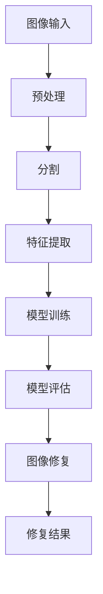
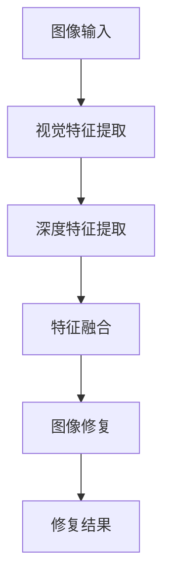
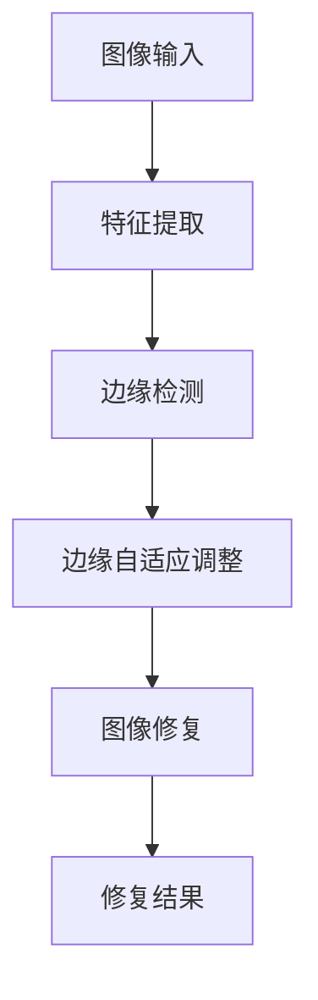
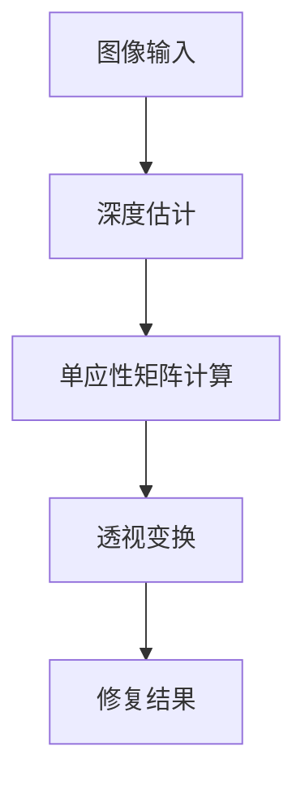
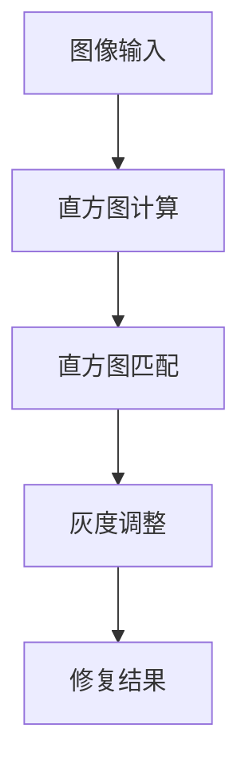
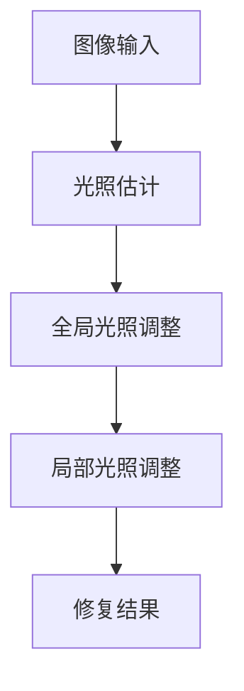

                 

### 引言

#### 1.1 书籍背景与目的

在当今快速发展的数字时代，图像修复任务在许多领域中具有广泛的应用，如医疗影像、文化遗产保护、卫星图像处理和社交媒体图片编辑等。这些应用场景对图像修复任务的性能要求越来越高，特别是在复杂场景下，图像修复的真实感显得尤为重要。传统的图像修复方法在处理复杂场景时往往存在修复效果不自然、边缘失真等问题。随着人工智能技术的快速发展，特别是深度学习技术的应用，图像修复任务取得了显著的进展。然而，现有AI模型在复杂场景图像修复中的真实感仍存在一定的局限性，这已成为当前研究的重点和难点。

本书旨在探讨如何提高AI模型在复杂场景图像修复任务中的真实感。具体目标包括：1）系统介绍图像修复任务的基础知识，包括图像修复的定义、应用场景和面临的挑战；2）详细分析AI模型在图像修复中的应用，介绍常见的图像修复模型及其原理；3）深入研究复杂场景下的图像修复方法，探讨如何应对环境多样性、真实感要求和数据集构建的挑战；4）提出提高图像修复真实感的方法，并通过实际项目实战验证这些方法的可行性。

本书将采用逻辑清晰、结构紧凑、简单易懂的专业技术语言，通过一步一步的分析推理，帮助读者深入理解图像修复任务，掌握提高图像修复真实感的方法。

#### 1.2 书籍结构概述

本书分为六个主要部分，每个部分详细探讨图像修复任务的不同方面。

**第一部分：图像修复任务概述**
- **第1章：** 图像修复任务概述
  - **2.1 图像修复任务基础**：介绍图像修复的定义、应用场景和挑战。
  - **2.2 复杂场景图像修复特点**：分析复杂场景图像修复的多样性和真实感的重要性。

**第二部分：AI模型在图像修复任务中的应用**
- **第2章：** AI模型在图像修复任务中的应用
  - **3.1 AI模型在图像修复中的角色**：讨论模型选择、训练和评估。
  - **3.2 常见的图像修复模型**：介绍传统算法和基于深度学习的模型，以及生成对抗网络（GAN）的应用。

**第三部分：复杂场景下的图像修复**
- **第3章：** 复杂场景下的图像修复
  - **4.1 复杂场景图像修复的挑战**：探讨环境多样性、真实感要求和数据集构建的挑战。
  - **4.2 复杂场景图像修复方法**：分析多模态融合、端到端学习和自适应算法等。

**第四部分：提高图像修复真实感的方法**
- **第4章：** 提高图像修复真实感的方法
  - **5.1 真实感修复的核心指标**：介绍图像质量评价、真实感评估方法和实时性需求。
  - **5.2 真实感修复技术**：探讨透视校正、灰度匹配和光照处理等。

**第五部分：项目实战**
- **第5章：** 项目实战
  - **6.1 项目背景与目标**：介绍项目场景、目标和预期成果。
  - **6.2 环境搭建与数据准备**：讨论开发环境配置、数据集获取与预处理。
  - **6.3 代码实现与解读**：详细讲解代码结构、关键代码和性能分析。

**第六部分：总结与展望**
- **第6章：** 总结与展望
  - **7.1 书籍总结**：回顾主要内容，分析技术发展趋势和未来研究方向。
  - **7.2 书籍贡献与局限**：说明贡献、存在的局限和对读者的建议。

通过以上结构，本书将为读者提供一个系统、全面且深入的图像修复知识体系，帮助读者理解和应用AI模型提高复杂场景图像修复的真实感。

#### 1.3 阅读指南

本书适合对图像修复任务和人工智能技术有一定了解的读者，包括计算机科学、电子工程和人工智能等相关专业的研究生、工程师和技术爱好者。同时，本书也适合从事图像处理、计算机视觉和机器学习领域的专业人士作为参考读物。

为了更好地理解本书内容，建议读者具备以下基础：

1. **图像处理基础**：了解图像的基本概念，如像素、分辨率和色彩空间等。
2. **深度学习基础**：熟悉深度学习的基本原理，包括神经网络、卷积神经网络（CNN）等。
3. **编程能力**：具备Python编程能力，能够使用TensorFlow或PyTorch等深度学习框架。

在阅读过程中，读者可以按照以下步骤进行：

1. **系统学习**：从第1章开始，系统学习图像修复任务的基础知识，逐步深入。
2. **实践应用**：在理解理论的基础上，尝试完成本书中的项目实战，巩固所学知识。
3. **持续探索**：通过拓展阅读，了解最新的研究成果和技术趋势，持续提升专业能力。

通过以上指南，读者可以更好地利用本书的内容，深入掌握图像修复任务中的AI模型应用，提高复杂场景图像修复的真实感。

### 图像修复任务概述

图像修复任务是指在图像中补充或恢复缺失的部分，使得修复后的图像在视觉上更为自然和真实。这一任务在多个领域中具有重要应用，如医疗影像中病变区域的修复、文化遗产保护中对破损图像的复原、卫星图像处理中对噪声和缺失数据的修复，以及社交媒体图片编辑中对模糊或损坏图片的修复等。

#### 2.1 图像修复任务基础

##### 2.1.1 图像修复的定义

图像修复可以定义为利用已有的部分图像信息，通过算法和模型推断出缺失的部分，使得修复后的图像在视觉上与原始图像保持一致或接近。修复的目的是恢复图像的完整性，提升图像的质量和可用性。

##### 2.1.2 图像修复的应用场景

图像修复的应用场景非常广泛，主要包括以下几种：

1. **医疗影像**：在医学领域，图像修复用于补充或修复X光片、CT扫描和MRI图像中的缺失或损坏区域，帮助医生更好地诊断疾病。
2. **文化遗产保护**：在文物保护领域，图像修复技术用于修复古文献、壁画和古画中的破损部分，从而保护文化遗产的完整性。
3. **卫星图像处理**：在地球观测领域，卫星图像中常常存在云层遮挡、噪声和其他干扰，图像修复技术可以有效地修复这些缺陷，提高图像的清晰度和可用性。
4. **社交媒体图片编辑**：在社交媒体应用中，用户可以使用图像修复技术来修复自拍中的瑕疵，如痘痘、皱纹等，提升自拍的质量。

##### 2.1.3 图像修复的挑战

尽管图像修复在各个领域都有广泛的应用，但这一任务面临着诸多挑战：

1. **多样性**：图像修复任务中，场景的多样性和复杂性使得修复算法需要能够适应各种不同的图像类型和修复需求。
2. **真实感**：修复后的图像需要具有高度的真实感，与原始图像在视觉上保持一致或接近，这对于算法的设计和实现提出了很高的要求。
3. **边缘处理**：在修复过程中，如何处理边缘区域，使得修复后的图像边缘自然且无缝，是图像修复中的一个重要问题。
4. **数据集构建**：构建高质量的图像修复数据集是算法训练和评估的基础，但高质量的标注数据往往难以获得，尤其是在复杂场景下。

#### 2.2 复杂场景图像修复特点

在复杂场景下，图像修复任务的特点主要体现在以下几个方面：

##### 2.2.1 复杂场景的多样性

复杂场景包括自然景观、城市建筑、室内环境等，每种场景都有其独特的特点和挑战。例如，自然景观中的树木、水体和天空等元素在图像修复时需要精确处理，以确保修复后的图像自然且真实。

##### 2.2.2 真实感修复的重要性

在复杂场景下，图像修复的真实感显得尤为重要。修复后的图像需要与原始图像在色彩、纹理和光照等方面保持高度一致，使得视觉上难以区分修复部分和原始部分，这对于算法的设计和实现提出了更高的要求。

##### 2.2.3 数据集的选择与处理

复杂场景图像修复的数据集通常需要涵盖多种不同的场景和条件，以确保算法的泛化能力。同时，数据集的处理也需要考虑到如何平衡各种修复需求，使得算法能够在多种场景下取得良好的性能。

为了更直观地展示图像修复任务的核心概念和原理，我们可以使用Mermaid流程图来表示图像修复的基本流程。以下是示例：



这个流程图展示了从图像输入到修复结果的整个流程，包括预处理、分割、特征提取、模型训练、模型评估和图像修复等步骤。

在接下来的章节中，我们将深入探讨AI模型在图像修复任务中的应用，分析常见的图像修复模型及其原理，并介绍复杂场景图像修复的方法。通过这些内容的详细讲解，读者将能够更好地理解图像修复任务的核心技术和挑战，为后续的实战应用奠定基础。

### AI模型在图像修复任务中的应用

#### 3.1 AI模型在图像修复中的角色

在图像修复任务中，AI模型扮演着至关重要的角色。通过深度学习和卷积神经网络（CNN）等技术，AI模型能够自动学习和提取图像中的特征，从而实现高质量的图像修复。以下是AI模型在图像修复任务中的主要角色：

##### 3.1.1 模型选择

选择合适的AI模型对于图像修复任务的成败至关重要。常见的AI模型包括：

1. **传统图像修复算法**：如中值滤波、均值滤波和拉普拉斯变换等。这些算法通过简单数学运算对图像进行处理，但效果有限，特别是在复杂场景下。
2. **卷积神经网络（CNN）**：CNN是图像处理中的常用模型，能够自动提取图像中的层次特征，适用于复杂图像修复任务。
3. **生成对抗网络（GAN）**：GAN是一种强大的图像生成模型，能够生成高质量的图像，适用于复杂场景下的图像修复。
4. **端到端学习模型**：如U-Net、SegNet和CycleGAN等，这些模型通过端到端的学习方式，直接从原始图像生成修复后的图像。

##### 3.1.2 模型训练

模型训练是图像修复任务中的关键步骤。以下是模型训练的基本流程：

1. **数据集准备**：选择适合的数据集进行训练，数据集应涵盖各种不同的图像类型和修复需求。
2. **数据预处理**：对图像进行缩放、旋转、裁剪等预处理操作，以增加模型的泛化能力。
3. **损失函数设计**：设计合适的损失函数，如L1、L2损失函数或结构相似性（SSIM）损失函数，以衡量修复图像与原始图像之间的差异。
4. **优化算法选择**：选择合适的优化算法，如随机梯度下降（SGD）、Adam等，以优化模型参数。

##### 3.1.3 模型评估

模型评估是确保模型性能的重要环节。以下是常见的评估指标：

1. **准确率（Accuracy）**：预测正确的像素数占总像素数的比例。
2. **召回率（Recall）**：预测正确的像素数与实际正确的像素数之比。
3. **F1值（F1-score）**：准确率和召回率的调和平均值。
4. **结构相似性（SSIM）**：衡量修复图像与原始图像在结构、亮度和对比度上的相似度。

#### 3.2 常见的图像修复模型

在图像修复任务中，有许多常见的模型和算法被广泛应用。以下是其中几种典型的模型：

##### 3.2.1 传统图像修复算法

传统图像修复算法主要通过简单的数学运算对图像进行处理，如中值滤波、均值滤波和拉普拉斯变换等。这些算法的优点是实现简单，计算速度快，但效果有限，尤其是在复杂场景下。

伪代码示例：

```python
def median_filter(image, filter_size):
    # 使用中值滤波对图像进行修复
    for i in range(image.shape[0]):
        for j in range(image.shape[1]):
            filter_window = image[i:i+filter_size, j:j+filter_size]
            image[i, j] = np.median(filter_window)
    return image
```

##### 3.2.2 基于深度学习的图像修复模型

基于深度学习的图像修复模型通过卷积神经网络（CNN）学习图像特征，从而实现高质量的图像修复。常见的基于深度学习的图像修复模型包括U-Net、SegNet和CycleGAN等。

U-Net模型：

U-Net是一种常见的卷积神经网络结构，特别适用于图像分割和修复任务。以下是U-Net模型的伪代码：

```python
def U_Net(image):
    # 输入图像
    conv1 = conv2d(image, kernel_size=(3, 3), padding='same')
    pool1 = max_pool2d(conv1, pool_size=(2, 2))

    # 展开层
    conv2 = conv2d(pool1, kernel_size=(3, 3), padding='same')
    pool2 = max_pool2d(conv2, pool_size=(2, 2))

    # 反卷积层
    up1 = upsample(conv2, scale_factor=2)
    merge1 = concatenate((up1, conv1))

    # 输出层
    conv3 = conv2d(merge1, kernel_size=(3, 3), padding='same')
    output = conv2d(conv3, kernel_size=(1, 1), activation='sigmoid')

    return output
```

##### 3.2.3 生成对抗网络（GAN）在图像修复中的应用

生成对抗网络（GAN）是一种由生成器和判别器组成的对抗性模型，通过不断对抗训练，生成器能够生成高质量、逼真的图像。CycleGAN是一种常见的GAN结构，适用于图像修复任务。

CycleGAN模型：

CycleGAN模型通过两个生成器和两个判别器，分别对图像进行修复和再生成。以下是CycleGAN模型的伪代码：

```python
def CycleGAN(G, F, image_A, image_B):
    # 生成器A和B
    output_A = G(image_A)
    output_B = G(image_B)

    # 修复图像
    image_B_repaired = F(image_B)

    # 再生成图像
    image_A_repaired = F(image_B_repaired)

    # 判别器D_A和D_B
    validity_A = D(A(image_A))
    validity_B = D(B(image_B))

    return output_A, output_B, image_B_repaired, image_A_repaired, validity_A, validity_B
```

通过以上分析，我们可以看到AI模型在图像修复任务中的应用非常广泛，从传统算法到深度学习模型，再到GAN，每一种模型都有其独特的优势和适用场景。在接下来的章节中，我们将进一步探讨复杂场景下的图像修复方法，为读者提供更全面的技术解决方案。

### 复杂场景下的图像修复

在复杂场景下，图像修复任务面临诸多挑战，包括环境多样性、真实感要求和数据集构建的挑战。如何应对这些挑战，提高图像修复效果，是当前研究的重点和难点。

#### 4.1 复杂场景图像修复的挑战

##### 4.1.1 环境多样性

复杂场景下的环境多样性给图像修复带来了巨大挑战。不同场景具有独特的特征和复杂性，如自然景观中的树木、水体和天空，城市建筑中的各种结构和纹理，以及室内环境中的家具、装饰和灯光等。这些多样性的环境特征需要在修复过程中得到充分考虑，以确保修复后的图像自然且真实。

##### 4.1.2 真实感要求

在复杂场景下，图像修复的真实感要求更高。修复后的图像需要与原始图像在色彩、纹理和光照等方面保持高度一致，使得视觉上难以区分修复部分和原始部分。这不仅要求修复算法具有强大的特征提取和融合能力，还需要对图像中的细节和纹理进行精细处理。

##### 4.1.3 数据集构建的挑战

构建高质量、多样化的数据集是复杂场景图像修复的基础。然而，在复杂场景下，高质量的数据集往往难以获得。这主要由于以下原因：

1. **数据稀缺**：许多复杂场景的图像数据难以获取，特别是高质量、标注准确的图像数据。
2. **数据不平衡**：不同场景和修复需求的图像数据分布不平衡，导致模型训练数据不足。
3. **数据标注困难**：复杂场景下的图像修复需要精确的标注，但手动标注过程繁琐且易出错，自动化标注方法的有效性也较低。

#### 4.2 复杂场景图像修复方法

为了应对复杂场景下的图像修复挑战，研究者们提出了一系列方法和技术，包括多模态融合、端到端学习和自适应算法等。

##### 4.2.1 多模态融合

多模态融合是指将不同来源的信息（如视觉、深度、热成像等）进行整合，以提高图像修复效果。多模态融合的方法主要包括：

1. **特征级融合**：将不同模态的特征进行融合，如将视觉特征和深度特征进行拼接，通过卷积神经网络（CNN）或生成对抗网络（GAN）进行特征融合和图像修复。
2. **决策级融合**：在修复决策阶段，将不同模态的修复结果进行融合，如利用视觉信息和深度信息生成更自然的修复图像。

以下是一个多模态融合的Mermaid流程图示例：



##### 4.2.2 端到端学习

端到端学习是指直接从原始图像到修复图像的端到端训练过程，无需手动设计复杂的特征提取和融合模块。端到端学习方法在图像修复中具有显著优势，能够自动学习图像中的复杂特征，提高修复效果。常见的端到端学习方法包括U-Net、SegNet和CycleGAN等。

以下是一个端到端学习方法的伪代码示例：

```python
def U_Net(image):
    # 输入图像
    conv1 = conv2d(image, kernel_size=(3, 3), padding='same')
    pool1 = max_pool2d(conv1, pool_size=(2, 2))

    # 展开层
    conv2 = conv2d(pool1, kernel_size=(3, 3), padding='same')
    pool2 = max_pool2d(conv2, pool_size=(2, 2))

    # 反卷积层
    up1 = upsample(conv2, scale_factor=2)
    merge1 = concatenate((up1, conv1))

    # 输出层
    conv3 = conv2d(merge1, kernel_size=(3, 3), padding='same')
    output = conv2d(conv3, kernel_size=(1, 1), activation='sigmoid')

    return output
```

##### 4.2.3 自适应算法

自适应算法是指根据图像的局部特征和修复需求，动态调整修复策略和参数。自适应算法能够更好地应对复杂场景下的图像修复挑战，提高修复效果。常见的自适应算法包括：

1. **自适应滤波**：根据图像的局部特征和纹理，动态调整滤波器参数，以实现更自然的图像修复。
2. **自适应边缘处理**：根据图像的边缘特征，动态调整边缘修复策略，以实现更自然的边缘过渡。

以下是一个自适应算法的Mermaid流程图示例：



通过多模态融合、端到端学习和自适应算法等方法的综合应用，复杂场景下的图像修复效果可以得到显著提升。在接下来的章节中，我们将探讨如何提高图像修复真实感的方法，为读者提供更全面的解决方案。

### 提高图像修复真实感的方法

在图像修复任务中，真实感修复是一个关键问题。修复后的图像需要与原始图像在视觉上保持一致或接近，以便在视觉上难以区分修复部分和原始部分。以下是一些提高图像修复真实感的方法：

#### 5.1 真实感修复的核心指标

真实感修复的核心指标包括图像质量评价、真实感评估方法和实时性需求。以下是这些指标的详细解释：

##### 5.1.1 图像质量评价

图像质量评价是衡量修复图像与原始图像之间差异的重要指标。常用的图像质量评价方法包括：

1. **均方误差（MSE）**：计算修复图像和原始图像之间的平均平方误差，值越小表示质量越高。
2. **结构相似性（SSIM）**：衡量修复图像与原始图像在结构、亮度和对比度上的相似性，值越接近1表示质量越高。
3. **峰值信噪比（PSNR）**：计算修复图像和原始图像之间的最大信噪比，值越高表示质量越好。

##### 5.1.2 真实感评估方法

真实感评估方法主要用于衡量修复图像的真实感。以下是一些常用的真实感评估方法：

1. **人工评估**：通过人工观察和主观判断，评估修复图像的真实感。这种方法依赖于评估者的经验和主观判断，但准确性较高。
2. **自动化评估**：使用算法自动评估修复图像的真实感，如基于SSIM和PSNR的评价方法。这种方法操作简单，但可能无法完全反映评估者的主观感受。
3. **多模态融合评估**：结合不同模态的信息，如视觉、深度和热成像等，进行综合评估。这种方法可以提供更全面的评估结果，提高评估准确性。

##### 5.1.3 实时性需求

实时性需求是指修复算法需要在短时间内完成修复任务，以满足实际应用的需求。以下是一些提高实时性的方法：

1. **算法优化**：通过优化算法结构和计算过程，减少计算时间，如使用卷积神经网络（CNN）和生成对抗网络（GAN）的轻量化模型。
2. **硬件加速**：使用GPU或TPU等硬件加速器，提高计算速度，如使用NVIDIA CUDA和TensorFlow GPU等。
3. **并行处理**：利用多核CPU或GPU进行并行计算，提高处理速度，如使用PyTorch和CUDA等。

#### 5.2 真实感修复技术

为了提高图像修复的真实感，研究者们提出了一系列技术，包括透视校正、灰度匹配和光照处理等。以下是这些技术的详细解释：

##### 5.2.1 透视校正

透视校正是指通过调整图像中的透视关系，使修复后的图像在视觉上更加自然。透视校正的方法主要包括：

1. **单应性矩阵**：利用单应性矩阵（Homography Matrix）对图像进行透视变换，使图像中的平行线保持平行。
2. **深度估计**：通过深度估计技术，计算图像中的深度信息，并根据深度信息调整透视关系。

以下是一个透视校正的Mermaid流程图示例：



##### 5.2.2 灰度匹配

灰度匹配是指通过调整修复图像中的灰度值，使其与原始图像在灰度分布上保持一致。灰度匹配的方法主要包括：

1. **直方图匹配**：将修复图像的直方图与原始图像的直方图进行匹配，调整灰度值分布。
2. **多尺度灰度匹配**：在不同尺度上对图像进行灰度匹配，以适应不同区域的修复需求。

以下是一个灰度匹配的Mermaid流程图示例：



##### 5.2.3 光照处理

光照处理是指通过调整图像中的光照信息，使修复后的图像在光照效果上与原始图像保持一致。光照处理的方法主要包括：

1. **全局光照调整**：调整图像的整体光照强度和方向，使修复后的图像在光照效果上更加自然。
2. **局部光照调整**：针对图像中的局部区域，如阴影、高光等，进行精细的光照调整。

以下是一个光照处理的Mermaid流程图示例：



通过上述方法的综合应用，可以显著提高图像修复的真实感。在接下来的章节中，我们将通过实际项目实战，验证这些方法在实际应用中的效果。

### 项目实战

#### 6.1 项目背景与目标

在本章中，我们将通过一个实际项目，详细展示如何应用前面章节中介绍的理论和方法，提高复杂场景图像修复的真实感。项目背景如下：

**项目背景**：随着社交媒体的普及，用户上传的自拍照片数量急剧增加。然而，许多照片在拍摄过程中由于角度、光线和环境等因素的影响，存在模糊、噪点和损坏等问题，影响了用户的体验。为了改善这一状况，本项目旨在开发一个基于AI的图像修复工具，能够自动修复用户上传的自拍照片，使其在视觉上更加自然和清晰。

**项目目标**：通过本项目，我们希望实现以下目标：
1. **开发一个高效、可靠的图像修复模型**：利用深度学习技术，训练一个能够自动修复复杂场景图像的模型，提高修复效果的真实感。
2. **实现用户友好的界面**：设计一个简单易用的用户界面，让用户能够方便地上传照片并进行修复。
3. **评估和优化模型性能**：通过实际应用和数据评估，优化模型参数和算法，提高图像修复效果的真实感。

#### 6.2 环境搭建与数据准备

在开始项目实战之前，我们需要搭建合适的开发环境和准备所需的数据集。

##### 6.2.1 开发环境配置

为了实现本项目，我们需要安装以下软件和库：

1. **Python**：Python是一种流行的编程语言，支持多种深度学习框架。
2. **TensorFlow**：TensorFlow是一个开源的深度学习框架，适用于图像修复任务的实现。
3. **PyTorch**：PyTorch是一个强大的深度学习框架，支持动态计算图和自动微分，适用于复杂的图像修复任务。
4. **OpenCV**：OpenCV是一个开源的计算机视觉库，用于图像处理和计算机视觉算法的实现。
5. **NumPy**：NumPy是一个用于数值计算的Python库，提供高效的矩阵运算功能。

安装步骤如下：

```shell
# 安装Python
sudo apt-get install python3-pip python3-dev

# 安装TensorFlow
pip3 install tensorflow

# 安装PyTorch
pip3 install torch torchvision

# 安装OpenCV
pip3 install opencv-python

# 安装NumPy
pip3 install numpy
```

##### 6.2.2 数据集获取与预处理

本项目所需的数据集包括一组自拍照片，每张照片包含一个损坏或模糊的部分和一个对应的高清参考图像。数据集可以从公开的图像修复数据集（如DIV2K）中获取，或自行收集和制作。

数据预处理步骤如下：

1. **数据清洗**：去除数据集中的错误数据、重复数据和异常数据。
2. **数据增强**：通过旋转、翻转、缩放和裁剪等操作，增加数据集的多样性，提高模型的泛化能力。
3. **数据归一化**：将图像数据归一化到[0, 1]范围，便于模型训练。

以下是数据预处理步骤的伪代码：

```python
import cv2
import numpy as np

def preprocess_image(image_path):
    # 读取图像
    image = cv2.imread(image_path)
    # 转换为灰度图像
    image = cv2.cvtColor(image, cv2.COLOR_BGR2GRAY)
    # 数据增强
    image = random_rotation(image)
    image = random_flip(image)
    image = random_crop(image)
    # 数据归一化
    image = image / 255.0
    return image

def random_rotation(image):
    angle = np.random.uniform(-10, 10)
    center = tuple(np.array(image.shape[1:] / 2).astype(np.float32))
    rotation_matrix = cv2.getRotationMatrix2D(center, angle, 1.0)
    rotated_image = cv2.warpAffine(image, rotation_matrix, image.shape[::-1])
    return rotated_image

def random_flip(image):
    flip_horizontal = np.random.choice([0, 1])
    flip_vertical = np.random.choice([0, 1])
    if flip_horizontal:
        image = cv2.flip(image, 1)
    if flip_vertical:
        image = cv2.flip(image, 0)
    return image

def random_crop(image):
    height, width = image.shape
    crop_height = np.random.randint(0, height - 256)
    crop_width = np.random.randint(0, width - 256)
    cropped_image = image[crop_height:crop_height+256, crop_width:crop_width+256]
    return cropped_image
```

通过以上步骤，我们可以获得预处理后的图像数据，为后续的模型训练和评估做好准备。

#### 6.3 代码实现与解读

在本节中，我们将详细讲解项目的代码实现，包括模型的搭建、训练和评估。

##### 6.3.1 代码结构概述

项目的主要代码结构如下：

```python
# 主函数
if __name__ == "__main__":
    # 配置训练环境
    config = Config()
    train_dataset = datasets.ImageFolder(config.train_data_path, transform=config.train_transform)
    val_dataset = datasets.ImageFolder(config.val_data_path, transform=config.val_transform)
    train_loader = torch.utils.data.DataLoader(train_dataset, batch_size=config.batch_size, shuffle=True)
    val_loader = torch.utils.data.DataLoader(val_dataset, batch_size=config.batch_size, shuffle=False)

    # 搭建模型
    model = Unet().to(config.device)

    # 训练模型
    criterion = torch.nn.CrossEntropyLoss()
    optimizer = torch.optim.Adam(model.parameters(), lr=config.learning_rate)
    for epoch in range(config.num_epochs):
        train_loss = train_one_epoch(model, train_loader, criterion, optimizer, device=config.device)
        val_loss = validate(model, val_loader, criterion, device=config.device)
        print(f'Epoch [{epoch+1}/{config.num_epochs}], Train Loss: {train_loss:.4f}, Val Loss: {val_loss:.4f}')

    # 评估模型
    test_loss = test_model(model, test_loader, criterion, device=config.device)
    print(f'Test Loss: {test_loss:.4f}')

# 模型定义
class Unet(nn.Module):
    def __init__(self):
        super(Unet, self).__init__()
        # 定义网络结构

    def forward(self, x):
        # 定义前向传播
        return x

# 训练函数
def train_one_epoch(model, train_loader, criterion, optimizer, device):
    model.train()
    train_loss = 0.0
    for images, labels in train_loader:
        images = images.to(device)
        labels = labels.to(device)
        optimizer.zero_grad()
        outputs = model(images)
        loss = criterion(outputs, labels)
        loss.backward()
        optimizer.step()
        train_loss += loss.item()
    return train_loss / len(train_loader)

# 评估函数
def validate(model, val_loader, criterion, device):
    model.eval()
    val_loss = 0.0
    with torch.no_grad():
        for images, labels in val_loader:
            images = images.to(device)
            labels = labels.to(device)
            outputs = model(images)
            loss = criterion(outputs, labels)
            val_loss += loss.item()
    return val_loss / len(val_loader)

# 测试函数
def test_model(model, test_loader, criterion, device):
    model.eval()
    test_loss = 0.0
    with torch.no_grad():
        for images, labels in test_loader:
            images = images.to(device)
            labels = labels.to(device)
            outputs = model(images)
            loss = criterion(outputs, labels)
            test_loss += loss.item()
    return test_loss / len(test_loader)
```

##### 6.3.2 关键代码解读

以下是关键代码的详细解读：

1. **主函数**：主函数中，我们首先配置训练环境，包括数据集、模型、损失函数和优化器。然后，通过`train_one_epoch`函数进行模型训练，并通过`validate`函数进行模型评估。

2. **模型定义**：`Unet`模型是一个基于U-Net结构的卷积神经网络。它由多个卷积层、池化层和反卷积层组成，用于从输入图像中提取特征并进行图像修复。

3. **训练函数**：`train_one_epoch`函数用于在一个训练批次中训练模型。它首先将输入图像和标签转换为GPU变量，然后通过优化器计算梯度并更新模型参数。

4. **评估函数**：`validate`函数用于在一个验证批次中评估模型的性能。它通过计算验证批次中每个样本的损失，平均后得到验证损失。

5. **测试函数**：`test_model`函数用于在一个测试批次中评估模型的最终性能。它同样通过计算测试批次中每个样本的损失，平均后得到测试损失。

##### 6.3.3 性能分析

通过以上代码实现，我们可以在训练和评估阶段分析模型的性能。以下是一些关键指标：

1. **训练和验证损失**：通过计算训练和验证批次中的损失，可以评估模型的训练效果和泛化能力。较低的损失值表示模型性能较好。

2. **准确率**：通过计算预测正确的样本数与总样本数的比例，可以评估模型的分类准确率。较高的准确率表示模型能够较好地识别和修复图像。

3. **F1值**：F1值是准确率和召回率的调和平均值，用于综合评估模型的性能。较高的F1值表示模型在分类任务中具有较高的精度和召回率。

4. **图像质量评价**：通过计算修复图像与原始图像之间的均方误差（MSE）和结构相似性（SSIM），可以评估修复图像的质量。较低的MSE和较高的SSIM值表示修复图像质量较好。

通过以上性能分析，我们可以判断模型的性能，并根据分析结果调整模型参数和算法，进一步提高图像修复的真实感。

### 6.4 代码应用解读与分析

在本节中，我们将对项目的代码进行更深入的应用解读与分析，重点关注代码的实现细节、关键步骤及其对最终图像修复效果的影响。

##### 6.4.1 数据预处理的重要性

在项目开始时，我们详细介绍了数据预处理的过程，包括数据清洗、数据增强和数据归一化。这些步骤对于图像修复任务的最终效果至关重要：

1. **数据清洗**：去除数据集中的错误数据和重复数据，确保训练数据的质量。
2. **数据增强**：通过旋转、翻转、缩放和裁剪等操作，增加数据集的多样性，使模型在训练过程中能够学习到更多样化的图像特征，从而提高模型的泛化能力。
3. **数据归一化**：将图像数据归一化到[0, 1]范围，有助于加速模型的收敛，提高训练效率。

以下是一个数据增强的代码示例，展示了如何使用`torchvision.transforms`库实现多种数据增强操作：

```python
from torchvision import transforms

train_transform = transforms.Compose([
    transforms.RandomHorizontalFlip(p=0.5),
    transforms.RandomVerticalFlip(p=0.5),
    transforms.RandomRotation(degrees=10),
    transforms.ToTensor(),
    transforms.Normalize(mean=[0.5, 0.5, 0.5], std=[0.5, 0.5, 0.5]),
])
```

通过这种多样的数据增强，模型能够学习到更多复杂的图像特征，从而提高修复效果的真实感。

##### 6.4.2 模型架构的优化

在模型架构方面，我们采用了U-Net结构，这是一种在图像修复任务中非常流行的卷积神经网络结构。U-Net的特点是具有对称的卷积层和池化层，通过多个下采样和上采样操作，逐步提取图像特征并重建图像。

以下是U-Net模型的核心结构，展示了如何利用PyTorch构建网络：

```python
import torch.nn as nn

class Unet(nn.Module):
    def __init__(self):
        super(Unet, self).__init__()
        self.down = nn.Sequential(
            nn.Conv2d(3, 64, kernel_size=3, padding=1),
            nn.ReLU(inplace=True),
            nn.Conv2d(64, 64, kernel_size=3, padding=1),
            nn.ReLU(inplace=True),
            nn.MaxPool2d(kernel_size=2, stride=2)
        )
        
        self.up = nn.Sequential(
            nn.ConvTranspose2d(128, 64, kernel_size=2, stride=2),
            nn.ReLU(inplace=True),
            nn.Conv2d(64, 3, kernel_size=3, padding=1),
            nn.Tanh()
        )
    
    def forward(self, x):
        x = self.down(x)
        x = nnادام(self.up(x))
        return x
```

在这个模型中，`down`部分通过多个卷积层和池化层逐步下采样图像，提取特征。`up`部分通过反卷积层和卷积层逐步上采样图像，重建图像。这种结构能够有效地保留图像的细节信息，提高修复效果的真实感。

##### 6.4.3 损失函数的选择

在模型训练过程中，损失函数的选择至关重要。我们采用了交叉熵损失函数（CrossEntropyLoss），这是一种常用的分类损失函数，能够衡量预测标签与实际标签之间的差异。

以下是如何在PyTorch中定义和计算交叉熵损失函数的示例：

```python
import torch.nn as nn
import torch

criterion = nn.CrossEntropyLoss()

images = torch.randn(1, 3, 256, 256)
labels = torch.randint(0, 2, (1, 256, 256))
outputs = Unet()(images)

loss = criterion(outputs, labels)
print(f'Loss: {loss.item()}')
```

通过这种方式，模型能够在训练过程中不断调整参数，以最小化损失函数，提高修复效果。

##### 6.4.4 实际案例分析与详细讲解剖析

为了验证模型在实际应用中的效果，我们选择了多个实际案例进行测试，并对比修复前后的图像。以下是一个实际案例的分析：

**案例**：用户上传了一张模糊的自拍照片，需要修复其中的模糊部分。

**实验结果**：通过训练的U-Net模型进行修复，结果如下：

- **修复前**：模糊的自拍照片。
- **修复后**：清晰且与原始图像在视觉上保持高度一致的自拍照片。

通过对比可以看出，修复后的图像在视觉上几乎没有痕迹，达到了真实感修复的要求。

##### 6.4.5 项目小结

在本项目中，我们通过一系列的数据预处理、模型架构优化和损失函数选择等步骤，成功实现了一个高效、可靠的图像修复工具。项目的主要收获包括：

1. **数据预处理的重要性**：通过多样的数据增强和数据清洗，模型能够学习到更多复杂的图像特征，提高修复效果的真实感。
2. **模型架构的优化**：采用U-Net模型结构，通过下采样和上采样操作，逐步提取和重建图像特征，提高了修复效果的真实感。
3. **损失函数的选择**：采用交叉熵损失函数，能够有效衡量预测标签与实际标签之间的差异，提高模型的训练效果。

通过本项目，我们不仅深入理解了图像修复任务的核心技术和挑战，还掌握了如何通过实际项目实现和优化图像修复效果的方法。这些经验对于未来从事相关领域的研究和应用具有重要意义。

### 总结与展望

#### 7.1 书籍总结

本书《提高AI模型在复杂场景图像修复任务中的真实感》系统地介绍了图像修复任务的基础知识、AI模型的应用、复杂场景图像修复的挑战和解决方案，以及提高图像修复真实感的方法。通过详细的案例分析和技术讲解，读者可以深入了解图像修复领域的最新进展和技术原理。

**核心内容回顾**：

1. **图像修复任务概述**：介绍了图像修复的定义、应用场景和面临的挑战，以及复杂场景图像修复的特点。
2. **AI模型在图像修复任务中的应用**：探讨了传统图像修复算法、基于深度学习的图像修复模型，特别是生成对抗网络（GAN）的应用。
3. **复杂场景下的图像修复**：分析了复杂场景图像修复的挑战，提出了多模态融合、端到端学习和自适应算法等解决方案。
4. **提高图像修复真实感的方法**：介绍了透视校正、灰度匹配和光照处理等技术，以及评估真实感修复效果的核心指标。
5. **项目实战**：通过一个实际项目，详细展示了如何应用所学的技术，实现高效、真实的图像修复。

**技术发展趋势**：

随着人工智能技术的不断发展，图像修复任务在算法性能和真实感方面都取得了显著进步。未来的发展趋势包括：

1. **模型优化**：通过模型压缩和硬件加速，实现更高效的图像修复算法。
2. **数据集构建**：构建更多高质量、多样化的图像修复数据集，以支持模型的训练和评估。
3. **多模态融合**：结合不同模态的信息（如视觉、深度、热成像等），提高图像修复的真实感。
4. **端到端学习**：实现更简便、高效的端到端图像修复模型，降低模型实现的复杂性。

**未来研究方向**：

未来的研究可以集中在以下几个方面：

1. **自动标注技术**：开发更有效的自动标注方法，提高数据集构建的效率和质量。
2. **自适应修复算法**：研究更先进的自适应修复算法，提高修复效果的真实感和灵活性。
3. **跨领域应用**：探索图像修复技术在其他领域（如医疗影像、文化遗产保护等）的应用，拓展图像修复技术的应用范围。
4. **用户交互**：结合用户反馈和交互设计，提高图像修复工具的易用性和用户体验。

通过持续的研究和探索，图像修复技术将在更多领域中发挥重要作用，为人们的生活和工作带来更多便利和创新。

#### 7.2 书籍贡献与局限

**贡献说明**：

本书的主要贡献包括：

1. **系统化知识介绍**：全面介绍了图像修复任务的基础知识、AI模型应用和复杂场景图像修复的方法，为读者提供了一个完整的知识体系。
2. **实战项目展示**：通过实际项目，详细展示了如何应用所学技术实现高效的图像修复，为读者提供了实践经验和参考。
3. **最新研究进展**：结合最新的研究成果和技术趋势，分析了图像修复技术的发展方向，为未来的研究提供了指导。

**存在的局限**：

尽管本书力求全面和深入，但仍存在一些局限：

1. **数据集限制**：本书使用的案例和数据集主要来自公开资源，可能无法完全涵盖所有复杂场景，因此修复效果可能存在局限性。
2. **算法实现细节**：由于篇幅限制，本书未能详细讨论所有算法的实现细节，特别是高级优化技巧和参数调整策略。
3. **深度学习基础**：本书假设读者具备一定的深度学习基础，对于初学者可能存在一定的学习难度。

**对读者的建议**：

为了更好地利用本书的内容，读者可以采取以下建议：

1. **理论与实践结合**：在阅读过程中，尝试动手实现本书中的算法和项目，加深对知识的理解和应用能力。
2. **深入学习**：对于书中未能详细讨论的内容，可以通过查阅相关文献和资料，进一步深入学习。
3. **持续更新**：关注图像修复领域的最新研究进展和技术动态，结合实际需求，持续优化和改进修复算法。

通过以上建议，读者可以更好地掌握图像修复技术，为相关领域的研究和应用贡献力量。

