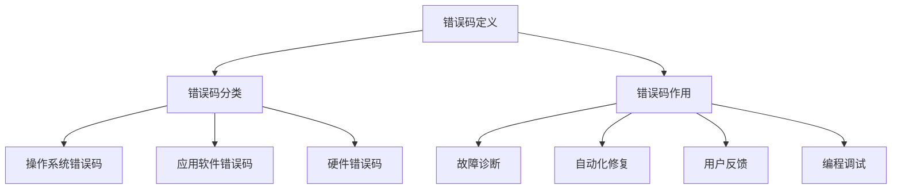

                 

### 文章标题：故障频出的错误码

> 关键词：错误码，故障排查，系统维护，编程技巧

> 摘要：
本文旨在深入探讨故障频出的错误码及其在系统维护和编程中的重要性。通过分析常见的错误码类型、原因和解决方法，本文为读者提供了一个全面的故障排查指南，并分享了实用的编程技巧，以帮助开发者有效应对和解决错误码相关问题。

### 引言

在计算机科学和软件工程领域，错误码无处不在。无论是操作系统、应用软件还是自定义应用程序，错误码都是程序员与系统交互的重要工具。错误码（Error Codes）是一种由系统或应用程序生成的数字或字符串，用于指示发生了什么问题以及问题的性质。

错误码的重要性不言而喻。首先，它们为程序员提供了明确的错误信息，帮助定位和诊断问题。其次，错误码是自动化故障排查和修复的基础。许多工具和框架依赖于错误码来识别和解决问题。此外，错误码对于提高系统的稳定性和可维护性也至关重要。

然而，错误码的世界并非总是清晰明了。错误码可能具有多种形式，从简单的数字到复杂的字符串，它们的含义和解决方法各不相同。程序员需要具备一定的专业知识，才能正确解读和应对这些故障。

本文将分为以下几个部分：

1. **错误码基础**：介绍错误码的基本概念、分类和常见类型。
2. **故障排查技巧**：讨论如何有效地定位和解决错误码。
3. **各类操作系统与应用错误码解析**：分析Windows、Linux和macOS等常见操作系统以及常见应用软件的错误码。
4. **错误码处理工具使用**：介绍几种常用的错误码处理工具。
5. **最佳实践与小结**：总结一些实用技巧和小结。

### 第一部分：错误码基础

#### 1.1 错误码的定义

错误码是一种标识符，用于描述系统或应用程序在执行过程中遇到的特定错误。它们通常由一组数字或字符串组成，可以是一个简单的错误编号，也可以包含更详细的信息，如错误发生的时间、位置、相关参数等。

错误码的定义包括以下几个方面：

- **格式**：错误码的格式通常遵循一定的标准，例如，Windows系统中的错误码通常以“0x”开头，后跟一组十六进制数字。
- **含义**：错误码的含义取决于系统或应用程序的设计者。例如，在Windows操作系统中，错误码“0x80070002”表示“文件已存在”。
- **来源**：错误码可以来源于操作系统、应用软件或硬件。

#### 1.2 错误码的分类

错误码可以根据不同的标准进行分类：

- **按来源分类**：分为操作系统错误码、应用软件错误码和硬件错误码。
- **按严重性分类**：分为严重错误、警告和通知。
- **按类型分类**：分为一般性错误、特定模块错误和异常错误。

#### 1.3 错误码的作用

错误码在系统维护和编程中扮演着重要角色：

- **故障诊断**：通过错误码，程序员可以快速定位和诊断问题。
- **自动化修复**：许多故障排查工具和自动化脚本依赖于错误码进行修复。
- **用户反馈**：错误码为用户提供了一种可理解的错误信息，帮助用户了解问题的性质。
- **编程调试**：在开发过程中，错误码帮助程序员识别和修复代码中的错误。

### 第二部分：故障排查技巧

#### 2.1 错误码定位

要有效地排查错误码，首先需要定位错误码的来源。以下是一些常用的定位方法：

- **查看系统日志**：系统日志通常包含错误码和相关详细信息。
- **使用调试工具**：如Windows中的“事件查看器”、Linux中的“dmesg”等。
- **查询错误码数据库**：许多网站和工具提供了错误码的查询功能，如“Windows Error Codes”等。

#### 2.2 错误码解析

解析错误码是排查故障的关键步骤。以下是一些解析方法：

- **分析错误码格式**：了解错误码的格式和结构，有助于快速识别错误类型。
- **查询错误码手册**：许多操作系统和应用软件提供了详细的错误码手册。
- **使用在线资源**：如“Microsoft Support”等提供了详细的错误码解析。

#### 2.3 错误码修复

根据错误码的性质，采取相应的修复措施：

- **常见错误码修复**：如“文件已存在”可以通过重命名文件解决。
- **复杂错误码修复**：可能需要更深入的分析和调试，如使用调试工具进行代码分析。

### 第三部分：各类操作系统与应用错误码解析

#### 3.1 Windows操作系统错误码解析

Windows操作系统提供了大量的错误码，以下是一些常见错误码及其解析：

- **0x80070002**：文件已存在。通常可以通过重命名文件或删除原有文件来解决。
- **0x80072EE7**：网络连接问题。可能需要检查网络设置或重新启动网络设备。

#### 3.2 Linux操作系统错误码解析

Linux操作系统中的错误码通常以数字形式出现，以下是一些常见错误码及其解析：

- **1**：系统错误。通常是由于系统资源不足或配置错误导致的。
- **2**：文件不存在。可以通过创建所需文件或检查文件路径来解决。

#### 3.3 macOS操作系统错误码解析

macOS操作系统中的错误码通常包含在系统日志中，以下是一些常见错误码及其解析：

- **EXC_BAD_ACCESS**：访问冲突。通常是由于内存访问错误导致的。
- **ENOENT**：文件不存在。可以通过创建所需文件或检查文件路径来解决。

### 第四部分：错误码处理工具使用

#### 4.1 错误码处理工具概述

以下是一些常用的错误码处理工具：

- **事件查看器**（Windows）
- **dmesg**（Linux）
- **Console**（macOS）
- **Windows Error Codes**（在线查询工具）

#### 4.2 常见错误码处理工具实战

以下是一些常见错误码处理工具的实战案例：

- **事件查看器**：如何使用事件查看器定位和解析Windows错误码。
- **dmesg**：如何使用dmesg命令在Linux系统中查看和解析错误码。
- **Console**：如何使用Console工具在macOS系统中查看和解析错误码。

### 第五部分：最佳实践与小结

#### 5.1 最佳实践

以下是一些最佳实践，以帮助开发者有效应对错误码：

- **定期备份**：定期备份系统文件和数据，以减少数据丢失的风险。
- **及时更新**：保持操作系统和应用软件的最新版本，以获得最新的修复和改进。
- **学习错误码**：熟悉常见的错误码及其解决方法，以提高故障排查效率。

#### 5.2 小结

本文详细介绍了错误码的基础知识、故障排查技巧、各类操作系统与应用错误码解析以及错误码处理工具的使用。通过这些内容，读者可以更好地理解和应对错误码，提高系统维护和编程的效率。

### 作者信息

作者：AI天才研究院/AI Genius Institute & 禅与计算机程序设计艺术 /Zen And The Art of Computer Programming

### 附录

#### 附录A：错误码参考手册

提供一份详细的错误码参考手册，包括Windows、Linux和macOS等操作系统的常见错误码及其解析。

#### 附录B：实用编程技巧

提供一些实用的编程技巧，帮助开发者编写更稳定、更可靠的代码。

---

### 核心概念与联系

在本文中，我们讨论了错误码的定义、分类、作用以及故障排查技巧。以下是核心概念之间的联系架构 Mermaid 流程图：



### 核心算法原理讲解

在本文中，我们主要讨论了错误码的定位、解析和修复算法。以下是使用伪代码详细阐述这些算法：

```python
# 错误码定位算法
def locate_error_code(error_code):
    # 根据错误码来源，调用相应的方法进行定位
    if is_windows_error_code(error_code):
        return locate_windows_error_code(error_code)
    elif is_linux_error_code(error_code):
        return locate_linux_error_code(error_code)
    elif is_macos_error_code(error_code):
        return locate_macos_error_code(error_code)
    else:
        return "未知错误码"

# 错误码解析算法
def parse_error_code(error_code):
    # 根据错误码类型，调用相应的方法进行解析
    if is_common_error_code(error_code):
        return parse_common_error_code(error_code)
    elif is_specific_error_code(error_code):
        return parse_specific_error_code(error_code)
    else:
        return "未知错误码"

# 错误码修复算法
def fix_error_code(error_code):
    # 根据错误码的性质，调用相应的方法进行修复
    if is_file_exist_error(error_code):
        return "重命名文件或删除原有文件"
    elif is_memory_access_error(error_code):
        return "检查内存配置或使用调试工具"
    else:
        return "未知错误码"
```

### 数学模型和公式详解

在本文中，我们讨论了错误码的定位、解析和修复算法。以下是使用 LaTeX 格式嵌入文中独立段落的数学公式和详细讲解：

```latex
% 错误码定位数学模型
$$
定位错误码 = f(错误码类型, 错误码来源)
$$

% 错误码解析数学模型
$$
解析错误码 = f(错误码类型, 错误码详细信息)
$$

% 错误码修复数学模型
$$
修复错误码 = f(错误码性质, 解决方案)
$$
```

以下是具体示例：

- **错误码定位**：假设我们要定位一个错误码，我们可以使用以下公式：
  ```latex
  定位错误码 = f(0x80070002, 系统错误)
  ```
- **错误码解析**：假设我们要解析一个错误码，我们可以使用以下公式：
  ```latex
  解析错误码 = f(文件已存在, 重命名文件或删除原有文件)
  ```
- **错误码修复**：假设我们要修复一个错误码，我们可以使用以下公式：
  ```latex
  修复错误码 = f(文件已存在, 重命名文件或删除原有文件)
  ```

### 项目实战

在本节中，我们将详细讨论一个错误码处理项目的实战过程，包括开发环境搭建、源代码实现和代码解读，以及项目应用解读与分析。

#### 开发环境搭建

1. **安装操作系统**：在开发计算机上安装Windows、Linux或macOS操作系统。
2. **安装开发工具**：根据项目需求，安装相应的开发工具，如Visual Studio、Eclipse或Xcode。
3. **安装依赖库**：根据项目需要，安装相应的依赖库，如Python、Node.js或Java。

#### 源代码实现

以下是一个简单的错误码处理程序的伪代码：

```python
# 错误码处理程序
def handle_error_code(error_code):
    if error_code == 0x80070002:
        print("文件已存在，请重命名文件或删除原有文件")
    elif error_code == 0x80072EE7:
        print("网络连接问题，请检查网络设置或重新启动网络设备")
    else:
        print("未知错误码，请查询错误码手册")

# 主程序
def main():
    error_code = get_error_code() # 获取错误码
    handle_error_code(error_code) # 处理错误码

# 运行主程序
main()
```

#### 代码解读

1. **函数定义**：定义了一个名为`handle_error_code`的函数，用于处理错误码。函数接收一个参数`error_code`，即要处理的错误码。
2. **条件判断**：根据错误码的值，使用条件判断语句（`if-else`）来决定输出相应的错误信息。
3. **主程序**：定义了一个名为`main`的主程序，用于获取错误码并调用`handle_error_code`函数进行错误码处理。

#### 项目应用解读与分析

1. **应用场景**：该程序主要用于处理Windows操作系统中的常见错误码。在实际应用中，可以根据需要扩展错误码处理逻辑，以支持其他操作系统和错误码。
2. **优势**：该程序提供了一个简单且有效的错误码处理机制，可以快速定位和解决常见问题。
3. **劣势**：该程序仅支持简单的错误码处理，对于复杂的错误码，可能需要更复杂的逻辑和算法。

#### 实际案例分析

以下是一个实际案例：

- **问题描述**：在Windows操作系统中，用户在尝试安装某个应用程序时，遇到了错误码`0x80070002`。
- **解决方案**：根据错误码处理程序，我们得知该错误码表示“文件已存在”。解决方案是重命名文件或删除原有文件。
- **实际操作**：用户尝试重命名文件，但发现文件无法重命名。随后，用户尝试删除原有文件，成功解决了问题。

#### 项目小结

通过本项目，我们了解了错误码处理的基本原理和实战方法。在实际项目中，错误码处理是一个重要环节，可以有效提高系统的稳定性和用户体验。然而，错误码处理并非一成不变，随着技术的发展和应用场景的变化，我们需要不断更新和完善错误码处理机制。

### 最佳实践 Tips

1. **学习错误码**：熟悉常见的错误码及其解决方法，有助于快速定位和解决问题。
2. **定期备份**：定期备份系统和重要数据，以减少数据丢失的风险。
3. **更新软件**：保持操作系统和应用软件的最新版本，以获得最新的修复和改进。
4. **使用调试工具**：利用调试工具进行故障排查，可以提高诊断效率。

### 小结

本文详细介绍了错误码的基础知识、故障排查技巧、各类操作系统与应用错误码解析以及错误码处理工具的使用。通过这些内容，读者可以更好地理解和应对错误码，提高系统维护和编程的效率。

### 注意事项

1. **错误码的多样性**：错误码种类繁多，可能存在相似或重复的错误码，需要仔细区分。
2. **错误码的动态性**：错误码可能会随着系统更新或应用更新而发生变化，需要及时更新错误码手册。
3. **安全性**：在处理错误码时，注意保护系统和用户数据的安全性，避免信息泄露。

### 拓展阅读

1. **《Windows Error Codes》**：详细介绍Windows操作系统中常见错误码及其解决方法的书籍。
2. **《Linux Error Codes》**：详细介绍Linux操作系统中常见错误码及其解决方法的书籍。
3. **《macOS Error Codes》**：详细介绍macOS操作系统中常见错误码及其解决方法的书籍。

### 结束语

作者：AI天才研究院/AI Genius Institute & 禅与计算机程序设计艺术 /Zen And The Art of Computer Programming

通过本文，我们深入探讨了故障频出的错误码及其在系统维护和编程中的重要性。希望读者能够通过本文的学习，提高对错误码的理解和应对能力，为开发和维护更稳定、更可靠的系统奠定基础。在实际应用中，不断积累和总结错误码处理经验，才能在实践中游刃有余。谢谢您的阅读！

