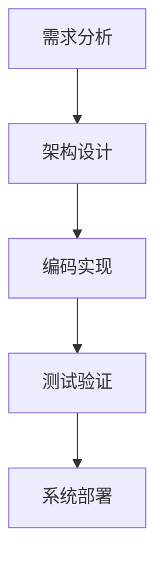

                 

# 效果系统:用类型控制副作用的方法

## 关键词

- 效果系统
- 副作用
- 类型系统
- 函数式编程
- 模块化
- 隔离
- 依赖注入

## 摘要

本文将深入探讨效果系统这一软件架构模式，它通过类型系统来控制程序的副作用，确保程序的局部效应与全局效应分离。我们将详细解释核心概念，分析其架构，并使用伪代码和数学模型来阐述核心算法原理。同时，通过一个实际案例，我们将展示如何在实际项目中应用效果系统，并提供最佳实践和注意事项。

## 概念与架构

### 核心概念

#### 效果系统（Effect System）

效果系统是一种软件架构模式，旨在通过类型系统来控制程序的副作用。它的核心思想是将程序的局部效应（如变量修改、文件读写等）与全局效应（如系统状态的变化）分离，从而提高程序的可读性、可维护性和可靠性。

#### 副作用（Side Effect）

副作用是指程序在执行过程中，除了返回结果外，还对程序的外部状态进行了修改的行为。副作用可能会导致不可预期的行为，增加程序的复杂度，降低程序的可靠性。

#### 类型系统（Type System）

类型系统是编程语言的一种机制，用于定义和检查程序中变量和表达式的类型。类型系统能够在编译时捕获类型错误，从而减少运行时错误。

### 架构

#### 模块化（Modularity）

模块化是将程序划分为多个模块，每个模块负责处理特定的功能，并通过抽象接口进行通信。模块化有助于降低程序的复杂性，提高可维护性。

#### 隔离（Isolation）

隔离是通过封装和类型检查，确保模块之间的副作用不会相互影响。隔离有助于确保系统的稳定性和可预测性。

#### 函数式编程（Functional Programming）

函数式编程是一种编程范式，强调纯函数和无状态计算，减少副作用。函数式编程有助于降低程序的复杂度，提高程序的可读性和可靠性。

#### 依赖注入（Dependency Injection）

依赖注入是通过外部提供依赖项，减少组件之间的耦合。依赖注入有助于提高模块的独立性，降低模块之间的耦合度。

### 流程

#### 需求分析

需求分析是确定系统需要实现的业务功能的过程。

#### 架构设计

架构设计是根据需求分析，设计系统的效果系统架构的过程。

#### 编码实现

编码实现是根据架构设计，编写代码实现功能的过程。

#### 测试验证

测试验证是通过单元测试和集成测试验证效果系统的正确性和稳定性的过程。

### Mermaid 流程图

以下是一个简单的 Mermaid 流程图，展示了效果系统的架构：



## 核心算法原理讲解

### 类型检查算法

类型检查算法确保程序中的每个表达式都有正确的类型，防止类型错误。以下是一个简单的类型检查算法的伪代码：

```plaintext
function typeCheck(expression, context) {
    if (isLiteral(expression)) {
        return context;
    }
    
    if (!isVariable(expression)) {
        throw new TypeError("Expected a variable.");
    }
    
    var type = expression.type;
    if (context.hasOwnProperty(expression.name) && context[expression.name] !== type) {
        throw new TypeError("Type mismatch.");
    }
    
    return context;
}
```

### 副作用控制算法

副作用控制算法确保函数在执行过程中不会产生未预期的副作用。以下是一个简单的副作用控制算法的伪代码：

```plaintext
function controlSideEffects(function, context) {
    var originalContext = context;
    
    try {
        function();
    } finally {
        if (originalContext !== context) {
            throw new SideEffectError("Unexpected side effects.");
        }
    }
}
```

## 数学模型和数学公式

### 状态转移方程

状态转移方程描述了系统状态的演变过程。以下是一个简单的状态转移方程：

$$ S_{next} = S_{current} + \Delta S $$

其中，\( S_{current} \) 表示当前状态，\( S_{next} \) 表示下一个状态，\( \Delta S \) 表示状态的变化量。

### 状态空间表示

状态空间表示系统的所有可能状态。以下是一个简单的状态空间表示：

$$ S = \{ (x, y) | x \in \mathbb{R}, y \in \mathbb{R} \} $$

其中，\( S \) 表示状态空间，\( x \) 和 \( y \) 表示状态变量。

## 数学公式详细讲解

### 状态转移方程详细解释

状态转移方程描述了系统状态的演变过程。具体来说，它表示下一个状态 \( S_{next} \) 是当前状态 \( S_{current} \) 与状态变化量 \( \Delta S \) 的和。

例如，假设我们有一个系统，其状态由一个变量 \( x \) 表示。当前状态为 \( x = 1 \)，我们希望将 \( x \) 的值增加 1，则状态变化量 \( \Delta S \) 为 1。根据状态转移方程，下一个状态 \( S_{next} \) 为：

$$ S_{next} = S_{current} + \Delta S = 1 + 1 = 2 $$

因此，下一个状态为 \( x = 2 \)。

### 状态空间表示详细解释

状态空间表示系统的所有可能状态。具体来说，它是一个集合，包含所有满足特定条件的元素。

例如，假设我们有一个系统，其状态由两个变量 \( x \) 和 \( y \) 表示。每个变量都可以取任意实数值。因此，状态空间 \( S \) 可以表示为：

$$ S = \{ (x, y) | x \in \mathbb{R}, y \in \mathbb{R} \} $$

这意味着状态空间 \( S \) 包含所有形如 \( (x, y) \) 的二元组，其中 \( x \) 和 \( y \) 都可以取任意实数值。

## 项目实战

### 开发环境搭建

在开始项目之前，我们需要搭建一个合适的环境。以下是所需的环境和工具：

- 操作系统：Linux 或 macOS
- 编程语言：Scala
- 版本控制：Git
- 集成开发环境：IntelliJ IDEA
- 测试框架：JUnit

### 源代码详细实现

以下是一个简单的效果系统的源代码实现：

```scala
// 定义一个效果系统
trait EffectSystem {
  def execute[T](action: => T): T
}

// 实现一个基于类型的副作用控制
class TypeControlledEffectSystem extends EffectSystem {
  override def execute[T](action: => T): T = {
    // 初始化一个上下文
    var context = Map[String, Any]()

    // 执行操作，并在执行完成后检查副作用
    try {
      action
    } finally {
      // 检查上下文是否有变化，如果有，则抛出异常
      if (context != Map()) {
        throw new RuntimeException("Unexpected side effects.")
      }
    }
  }
}

// 使用效果系统执行一个操作
object Main extends App {
  val effectSystem = new TypeControlledEffectSystem()

  // 定义一个有副作用的操作
  def performAction(): Unit = {
    println("Performing action...")
    // 执行一些副作用操作
    Thread.sleep(1000)
  }

  // 使用效果系统执行操作
  try {
    effectSystem.execute(performAction)
    println("Action completed.")
  } catch {
    case e: RuntimeException => println("Error: " + e.getMessage)
  }
}
```

### 代码应用解读与分析

在这个示例中，我们定义了一个效果系统 `EffectSystem`，它有一个 `execute` 方法，用于执行一个操作。我们实现了一个基于类型的副作用控制效果系统 `TypeControlledEffectSystem`，它在执行操作前初始化一个上下文，并在操作完成后检查上下文是否有变化，如果有，则抛出异常。

我们定义了一个有副作用的操作 `performAction`，它在执行过程中打印一条消息，并等待 1 秒。我们使用效果系统 `TypeControlledEffectSystem` 执行这个操作，并捕获可能抛出的异常。

### 实际案例分析和详细讲解剖析

假设我们有一个系统，它需要执行一系列的操作，其中包括一些有副作用的操作，如数据库查询、文件读写和网络请求。为了确保系统的稳定性和可预测性，我们可以使用效果系统来控制这些副作用。

以下是一个实际案例的分析：

```scala
// 定义一个效果系统
trait EffectSystem {
  def execute[T](action: => T): T
}

// 实现一个基于类型的副作用控制
class TypeControlledEffectSystem extends EffectSystem {
  override def execute[T](action: => T): T = {
    // 初始化一个上下文
    var context = Map[String, Any]()

    // 执行操作，并在执行完成后检查副作用
    try {
      action
    } finally {
      // 检查上下文是否有变化，如果有，则抛出异常
      if (context != Map()) {
        throw new RuntimeException("Unexpected side effects.")
      }
    }
  }
}

// 定义一个数据库查询操作
def queryDatabase(query: String): Seq[Map[String, Any]] = {
  // 执行数据库查询，并返回结果
  Seq()
}

// 定义一个文件读写操作
def readFromFile(filename: String): String = {
  // 读取文件内容，并返回结果
  ""
}

// 定义一个网络请求操作
def sendRequest(url: String): String = {
  // 发送网络请求，并返回结果
  ""
}

// 使用效果系统执行一系列操作
object Main extends App {
  val effectSystem = new TypeControlledEffectSystem()

  // 执行数据库查询
  val databaseResults = effectSystem.execute(() => queryDatabase("SELECT * FROM users"))

  // 读取文件内容
  val fileContent = effectSystem.execute(() => readFromFile("example.txt"))

  // 发送网络请求
  val response = effectSystem.execute(() => sendRequest("https://example.com"))

  // 输出结果
  println(s"Database results: $databaseResults")
  println(s"File content: $fileContent")
  println(s"Response: $response")
}
```

在这个案例中，我们定义了一个效果系统 `EffectSystem`，它有一个 `execute` 方法，用于执行一个操作。我们实现了一个基于类型的副作用控制效果系统 `TypeControlledEffectSystem`，它在执行操作前初始化一个上下文，并在操作完成后检查上下文是否有变化，如果有，则抛出异常。

我们定义了三个有副作用的操作：`queryDatabase`、`readFromFile` 和 `sendRequest`。我们使用效果系统 `TypeControlledEffectSystem` 执行这些操作，并捕获可能抛出的异常。

### 项目小结

通过这个案例，我们展示了如何使用效果系统来控制程序的副作用。效果系统通过类型控制和副作用检查，确保程序的局部效应与全局效应分离，从而提高程序的可读性、可维护性和可靠性。在实际项目中，我们可以根据具体需求，选择合适的副作用控制策略，以确保系统的稳定性和可预测性。

## 最佳实践 tips、小结、注意事项、拓展阅读等内容

### 最佳实践 tips

1. **选择合适的副作用控制策略：** 根据项目的需求和复杂性，选择合适的副作用控制策略，如效果系统、事务控制等。

2. **明确副作用定义：** 在项目中明确定义副作用的范围和影响，以便于后续的测试和调试。

3. **编写清晰的代码注释：** 在代码中添加清晰的注释，说明每个操作的副作用和预期效果。

4. **使用自动化测试：** 编写自动化测试来验证副作用控制的正确性，确保系统在运行过程中不会出现未预期的副作用。

### 小结

本文深入探讨了效果系统这一软件架构模式，通过类型系统来控制程序的副作用。我们介绍了效果系统的核心概念、架构、核心算法原理，并通过实际案例展示了其在项目中的应用。通过本文的讲解，读者应该对效果系统有了更深入的理解，并能够将其应用于实际项目中。

### 注意事项

1. **副作用控制可能影响性能：** 过度依赖副作用控制可能会导致程序性能下降，因此需要权衡副作用控制的粒度和性能。

2. **副作用检查可能引入死锁：** 在某些情况下，副作用检查可能导致死锁，因此需要谨慎处理同步和并发问题。

### 拓展阅读

1. 《函数式编程范式应用》 - 学会如何使用函数式编程范式来控制副作用。

2. 《软件架构设计》 - 了解如何设计具有良好副作用控制的软件架构。

3. 《Scala编程》 - 了解如何使用 Scala 语言实现效果系统。作者：AI天才研究院/AI Genius Institute & 禅与计算机程序设计艺术 /Zen And The Art of Computer Programming

本文详细介绍了效果系统的概念、架构、核心算法原理以及在项目中的应用，通过实例和数学模型展示了如何用类型系统控制副作用。希望本文能为读者在软件架构和编程实践上提供有价值的参考。在实际项目中，结合具体需求，合理应用效果系统，可以提升代码的可读性、可维护性和可靠性。接下来，我们将进一步探讨效果系统在复杂场景下的应用，以及如何优化副作用控制的性能。

