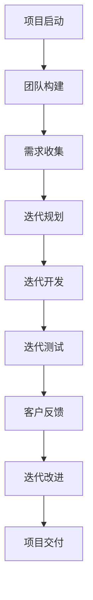
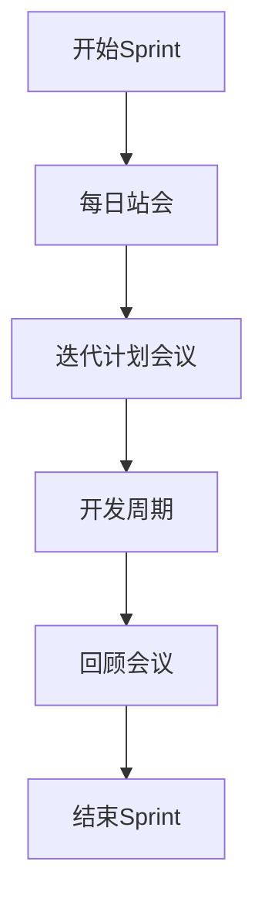
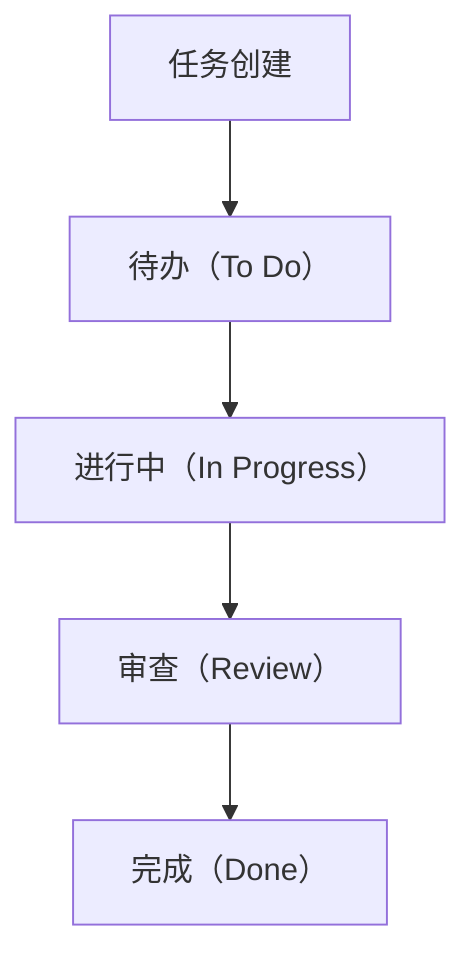
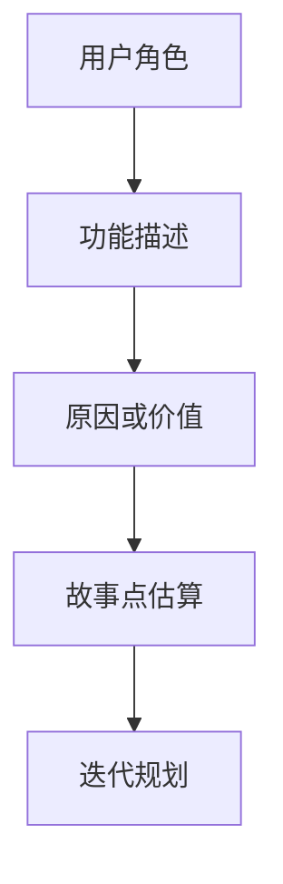

                 

### 文章标题：敏捷开发实践与团队协作

### 关键词：敏捷开发、Scrum、看板、团队协作、用户故事、迭代、持续改进

### 摘要：
本文旨在深入探讨敏捷开发的实践方法及其在团队协作中的应用。我们将从敏捷开发的基本原则和核心价值观出发，逐步介绍敏捷开发的核心方法，如Scrum和看板，并使用伪代码和数学模型进行详细讲解。随后，文章将探讨团队协作的重要性及其关键要素，展示敏捷团队搭建与运作的方法。通过实际案例分析，我们将展示敏捷开发在项目中的应用，并探讨敏捷开发与团队协作的持续改进策略。最后，文章将提供最佳实践和注意事项，以帮助读者更好地理解和实践敏捷开发。

## 第一部分：敏捷开发基础

### 第1章：敏捷开发概述

### 1.1 敏捷开发的基本原则与价值观

敏捷开发是一种以人为核心、迭代、增量和协作的软件开发方法。它强调个体和互动、可工作的软件、客户合作和响应变化。敏捷开发的基本原则包括：

1. **个体和互动重于过程和工具**：敏捷开发认为，团队成员的沟通和协作比遵循严格的过程和工具更为重要。
2. **可工作的软件重于详尽的文档**：敏捷开发强调快速交付可工作的软件，而不是过度依赖详细的文档。
3. **客户合作重于合同谈判**：敏捷开发倡导与客户紧密合作，以确保产品符合客户需求。
4. **响应变化重于遵循计划**：敏捷开发认为，变化是不可避免的，因此更注重适应变化。

敏捷开发与团队协作的关系密切。敏捷团队强调跨职能团队的合作，团队成员共同参与项目决策，确保项目进展顺利。以下是一个敏捷开发流程和团队协作机制的Mermaid流程图：



### 1.2 敏捷开发与传统开发方法的对比

传统开发方法，如瀑布模型，通常遵循严格的过程和计划，而在敏捷开发中，过程和计划是灵活的、迭代的。以下是两种方法的对比：

| 对比项 | 传统开发方法 | 敏捷开发方法 |
| ------ | ------------ | ------------ |
| 开发周期 | 长期、固定 | 短期、迭代 |
| 需求变更 | 难以适应 | 可以适应 |
| 团队协作 | 较少协作 | 强调协作 |
| 质量控制 | 后期进行 | 持续进行 |
| 客户参与 | 较少参与 | 紧密合作 |

### 1.3 敏捷开发的核心理念与模式

敏捷开发的核心理念是快速迭代和持续改进。敏捷开发通常采用Scrum或看板等框架，以实现这一目标。以下是这两种框架的基本原理：

#### Scrum

Scrum是一种迭代和增量的软件开发方法，它包括以下核心组件：

1. **角色**：Scrum包括产品负责人、Scrum Master和开发团队。
2. **会议**：Scrum包括每日站会、迭代计划会议、回顾会议等。
3. **迭代**：Scrum采用固定长度的迭代周期（称为sprint），通常为2-4周。

以下是Scrum伪代码示例：



#### 看板

看板是一种可视化流程管理工具，它通过看板板（Kanban Board）来跟踪和管理任务。以下是看板的基本原理：

1. **看板板**：看板板是一个可视化工具，用于展示项目任务的状态和进度。
2. **工作流**：看板板定义了工作流，包括任务从开始到结束的各个阶段。
3. **限制在制品（WIP）**：限制在制品数量有助于提高工作效率和质量。

以下是看板伪代码示例：



### 第二部分：核心算法原理讲解

#### 第2章：敏捷开发的核心方法

### 2.1 Scrum框架

#### 2.1.1 Scrum的角色

在Scrum框架中，有三个核心角色：

1. **产品负责人（Product Owner）**：负责定义产品需求、优先级和目标，确保产品满足用户需求。
2. **Scrum Master**：负责确保团队遵循Scrum实践，解决团队遇到的障碍，促进团队协作。
3. **开发团队**：负责实现产品需求，通常由具有不同技能的成员组成。

#### 2.1.2 Scrum的会议和迭代周期

Scrum的迭代周期通常称为sprint，持续时间为2-4周。以下是Scrum的主要会议：

1. **每日站会（Daily Stand-up）**：每日站会持续15分钟，团队成员分享工作进展、遇到的问题和计划。
2. **迭代计划会议（Sprint Planning）**：迭代计划会议在sprint开始时举行，产品负责人和团队共同制定迭代目标和工作计划。
3. **回顾会议（Retrospective）**：回顾会议在sprint结束时举行，团队成员讨论迭代过程中的经验和教训，并提出改进建议。

#### 2.1.3 Scrum伪代码示例

以下是Scrum伪代码示例：


### 2.2 看板系统

#### 2.2.1 看板的基本概念

看板是一种用于流程管理的方法，通过可视化板（Kanban Board）来跟踪和管理任务。看板的基本概念包括：

1. **任务卡片（Task Cards）**：任务卡片代表项目中的任务，包括任务的名称、描述、状态和优先级。
2. **看板板（Kanban Board）**：看板板是一个可视化工具，用于展示任务的状态和进度。
3. **工作流（Workflow）**：工作流定义了任务从开始到结束的各个阶段。

#### 2.2.2 看板的实施与运作

实施看板系统包括以下步骤：

1. **定义工作流**：定义任务从开始到结束的各个阶段。
2. **创建任务卡片**：为每个任务创建任务卡片，并按照工作流放置。
3. **跟踪任务进度**：团队成员更新任务卡片状态，以反映任务的进展。
4. **限制在制品（WIP）**：设置在制品限制，以防止工作过多导致效率下降。

#### 2.2.3 看板伪代码示例

以下是看板伪代码示例：


### 2.3 用户故事与优先级排序

#### 2.3.1 用户故事的编写

用户故事是敏捷开发中的核心需求描述方式，通常采用以下格式：

```
As a [用户角色],
I want [功能描述],
so that [原因或价值].
```

例如：

```
As a user,
I want to search for products,
so that I can find what I'm looking for quickly.
```

#### 2.3.2 用户故事的估算与规划

用户故事的估算通常使用故事点（Story Points）来衡量复杂度和工作量。估算故事点的方法包括：

1. **专家判断**：根据团队经验估算故事点。
2. **故事点投票**：团队成员共同投票决定故事点。

在规划阶段，产品负责人和团队使用估算的故事点来规划迭代目标和工作量。

#### 2.3.3 用户故事伪代码示例

以下是用户故事伪代码示例：



## 第三部分：团队协作与敏捷实践

### 第3章：团队协作基础

### 3.1 团队协作的重要性

团队协作在敏捷开发中至关重要。良好的团队协作可以提高工作效率、降低错误率、增强团队凝聚力。以下是团队协作的重要性：

1. **提高工作效率**：团队成员共同参与项目决策，可以更快地解决问题。
2. **降低错误率**：团队成员之间的沟通和反馈有助于发现和修复错误。
3. **增强团队凝聚力**：共同的目标和任务可以增强团队成员之间的信任和合作。

### 3.2 团队协作的关键要素

团队协作的关键要素包括：

1. **沟通**：有效的沟通是团队协作的基础。团队成员需要定期交流进展、问题和解决方案。
2. **共享知识**：团队需要共享知识，以确保每个成员都能理解项目的各个方面。
3. **信任**：信任是团队协作的关键。团队成员需要相互信任，以便更好地合作。
4. **共同目标**：团队需要共同的目标和愿景，以确保团队成员在正确的方向上努力。

### 3.3 团队协作工具与技术

团队协作工具可以帮助团队成员更好地沟通和协作。以下是一些常见的团队协作工具：

1. **即时通讯工具**：如Slack、Microsoft Teams等，用于实时沟通和协作。
2. **项目管理工具**：如Trello、JIRA等，用于任务跟踪和进度管理。
3. **文档共享平台**：如Google Docs、Confluence等，用于文档共享和协作编辑。
4. **代码协作平台**：如GitHub、GitLab等，用于代码管理、版本控制和协作开发。

## 第四部分：敏捷开发实战

### 第4章：敏捷团队搭建与运作

### 4.1 敏捷团队搭建

敏捷团队的搭建需要考虑以下几个方面：

1. **人员选择**：选择具有不同技能和背景的团队成员，以确保团队具备完成项目所需的各种技能。
2. **角色分配**：明确团队成员的角色，如产品负责人、Scrum Master和开发团队成员。
3. **团队文化**：建立以协作、学习和创新为核心的团队文化。

### 4.2 敏捷团队的沟通与协作

敏捷团队的成功依赖于良好的沟通与协作。以下是一些关键要素：

1. **日常站会**：每日站会用于团队成员分享进展、问题和计划，以确保团队同步。
2. **迭代计划会议**：迭代计划会议用于团队共同制定迭代目标和计划。
3. **回顾会议**：回顾会议用于团队评估迭代过程、识别改进机会。

### 4.3 敏捷团队的工作流程与规范

敏捷团队的工作流程和规范包括：

1. **迭代周期**：敏捷团队通常采用固定长度的迭代周期，如2-4周。
2. **任务分配**：团队根据迭代目标和任务难度，合理分配任务。
3. **质量控制**：敏捷团队采用持续集成和持续交付等方法，确保产品质量。

### 第5章：敏捷项目管理

### 5.1 敏捷项目计划

敏捷项目计划包括以下几个方面：

1. **迭代计划**：团队根据产品需求，制定每个迭代的目标和任务。
2. **风险管理**：团队识别项目风险，并制定相应的应对策略。
3. **资源分配**：团队根据任务需求和团队成员的技能，合理分配资源。

### 5.2 敏捷项目监控与控制

敏捷项目监控与控制包括以下几个方面：

1. **迭代进度跟踪**：团队通过看板、Trello等工具，实时跟踪任务进度。
2. **质量评估**：团队定期评估产品质量，以确保项目目标实现。
3. **变更管理**：团队根据项目进展和客户需求，及时调整项目计划。

### 5.3 敏捷项目风险管理

敏捷项目风险管理包括以下几个方面：

1. **风险识别**：团队识别项目风险，如技术风险、人员风险等。
2. **风险分析**：团队分析风险的严重性和可能性。
3. **风险应对**：团队制定相应的风险应对策略，如预防措施、应急计划等。

## 第五部分：敏捷开发与团队协作的持续改进

### 第6章：敏捷开发案例分析

### 6.1 案例一：敏捷在软件开发中的应用

#### 案例背景

某软件公司正在开发一款企业级管理系统，项目需求不断变化，开发团队面临着巨大的压力。为了提高开发效率和产品质量，公司决定采用敏捷开发方法。

#### 案例过程

1. **团队搭建**：公司组建了一个由产品负责人、Scrum Master和开发团队成员组成的敏捷团队。
2. **需求管理**：产品负责人与客户紧密合作，确保需求明确、优先级合理。
3. **迭代开发**：团队采用Scrum框架，每两周进行一次迭代，每个迭代完成一部分功能。
4. **质量保证**：团队采用持续集成和持续交付方法，确保产品质量。

#### 案例结果

通过敏捷开发，开发团队成功应对了需求变化，项目进度得到保障，产品质量得到提高。客户对项目的满意度显著提升。

### 6.2 案例二：敏捷在产品开发中的实践

#### 案例背景

某科技公司正在开发一款智能家居产品，项目涉及多个部门，沟通协调困难。为了提高开发效率和产品质量，公司决定采用敏捷开发方法。

#### 案例过程

1. **团队搭建**：公司组建了一个跨部门敏捷团队，包括产品经理、工程师、设计师和测试人员。
2. **需求管理**：产品经理与客户、设计师紧密合作，确保需求明确、优先级合理。
3. **迭代开发**：团队采用Scrum框架，每两周进行一次迭代，每个迭代完成一部分功能。
4. **质量保证**：团队采用持续集成和持续交付方法，确保产品质量。

#### 案例结果

通过敏捷开发，团队有效解决了沟通协调问题，项目进度得到保障，产品质量得到提高。客户对项目的满意度显著提升。

### 6.3 案例三：敏捷在团队协作中的效果分析

#### 案例背景

某互联网公司正在开发一款在线教育平台，项目涉及多个团队，协作效率低下。为了提高团队协作效率，公司决定采用敏捷开发方法。

#### 案例过程

1. **团队搭建**：公司组建了一个由项目经理、开发团队、测试团队和运维团队组成的敏捷团队。
2. **需求管理**：项目经理与客户、设计师紧密合作，确保需求明确、优先级合理。
3. **迭代开发**：团队采用Scrum框架，每两周进行一次迭代，每个迭代完成一部分功能。
4. **质量保证**：团队采用持续集成和持续交付方法，确保产品质量。
5. **协作工具**：团队使用Trello、Slack等协作工具，确保团队成员实时沟通和协作。

#### 案例结果

通过敏捷开发，团队协作效率显著提高，项目进度得到保障，产品质量得到提高。团队成员对项目的满意度显著提升。

## 第六部分：敏捷开发与团队协作的持续改进

### 第7章：敏捷开发与团队协作的持续改进

### 7.1 敏捷开发的反馈与迭代

敏捷开发的核心在于快速反馈和迭代。通过迭代，团队可以不断改进产品，提高客户满意度。以下是敏捷开发的反馈与迭代过程：

1. **迭代规划**：团队在每次迭代开始时，规划迭代目标和任务。
2. **迭代开发**：团队在迭代周期内完成指定任务。
3. **迭代评估**：团队在迭代结束时，评估迭代结果，包括产品质量、进度和客户满意度。
4. **迭代改进**：团队根据评估结果，提出改进措施，并在下一个迭代中实施。

### 7.2 团队协作中的持续改进

团队协作中的持续改进是提高团队效率和质量的关键。以下是一些持续改进的方法：

1. **定期回顾**：团队定期回顾协作过程，识别问题和改进机会。
2. **反馈机制**：团队建立有效的反馈机制，鼓励成员提出意见和建议。
3. **培训与发展**：团队定期进行培训和发展，提高成员的技能和知识。

### 7.3 敏捷文化与团队建设

敏捷文化与团队建设是敏捷开发成功的关键。以下是一些敏捷文化建设和团队建设的策略：

1. **以客户为中心**：团队始终以客户需求为导向，确保产品满足客户期望。
2. **团队协作**：团队鼓励成员之间的沟通和协作，共同解决问题。
3. **学习和成长**：团队鼓励成员不断学习和成长，提高个人和团队的能力。
4. **信任与尊重**：团队建立信任和尊重的氛围，确保团队成员感受到支持和关怀。

## 第七部分：最佳实践、小结、注意事项与拓展阅读

### 7.1 最佳实践

在敏捷开发实践中，以下最佳实践可以帮助团队提高效率和质量：

1. **保持简单**：简化流程和工具，避免过度复杂化。
2. **频繁交付**：定期交付可工作的软件，以快速获得客户反馈。
3. **持续集成**：实施持续集成，确保代码质量。
4. **代码审查**：定期进行代码审查，提高代码质量。
5. **自动化测试**：实施自动化测试，确保产品质量。

### 7.2 小结

敏捷开发是一种以人为核心、迭代、增量和协作的软件开发方法。它强调快速反馈和持续改进，以提高工作效率和质量。敏捷开发的核心方法包括Scrum和看板，这些方法通过迭代和协作，帮助团队更好地满足客户需求。

### 7.3 注意事项

在实施敏捷开发时，团队需要注意以下几点：

1. **确保团队成员具备敏捷思维**：团队成员需要理解敏捷开发的基本原则和实践，以有效参与项目。
2. **保持沟通与协作**：良好的沟通和协作是敏捷开发成功的关键。
3. **适应变化**：敏捷开发强调适应变化，团队需要灵活应对需求变更。
4. **确保资源充足**：确保团队拥有足够的资源和时间，以实现项目目标。

### 7.4 拓展阅读

1. 《Scrum精髓：了解并掌握Scrum方法》
2. 《看板方法：成功的实践与案例》
3. 《敏捷实践指南：面向软件开发人员的最佳实践》
4. 《敏捷项目管理：迭代、增量方法与实践》

---

通过以上目录大纲，我们为《敏捷开发实践与团队协作》这本书提供了一个详细的框架，涵盖了核心概念、方法、实践和持续改进策略。每个章节的内容都经过精心设计，以确保读者能够全面理解敏捷开发及其团队协作的重要性。在撰写具体内容时，我们将使用专业的技术语言，结合实际案例和代码示例，为读者提供深入、实用的指导。希望这本书能够成为敏捷开发实践者的重要参考资料。作者：AI天才研究院/AI Genius Institute & 禅与计算机程序设计艺术 /Zen And The Art of Computer Programming。

