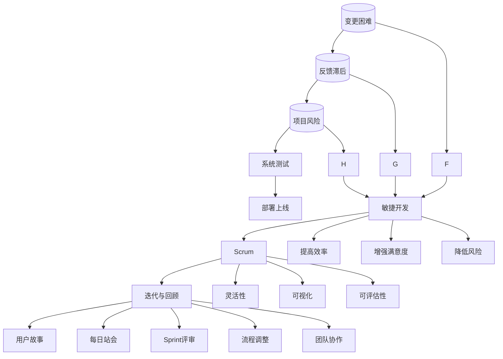

                 


### 文章标题

《敏捷转型：从瀑布到Scrum的组织变革》

### 关键词

敏捷开发，Scrum框架，瀑布模型，组织变革，用户故事，迭代，回顾，敏捷工具，团队协作

### 摘要

本文旨在探讨敏捷转型在组织变革中的应用，从瀑布模型到Scrum框架的转变过程。通过对比瀑布模型和敏捷开发的优势与不足，详细讲解Scrum的核心概念、流程和角色。同时，本文将深入分析组织如何适应敏捷转型，实施敏捷实践，以及使用敏捷工具和技术。通过实际案例分析和最佳实践，为读者提供实施敏捷转型的指导和启示。

## 引言

### 1.1 敏捷转型的背景

随着信息技术的飞速发展，市场需求和用户需求的变化越来越快。传统的瀑布模型逐渐显示出其局限性，无法快速响应市场变化。为了提高开发效率、缩短产品交付周期、提高客户满意度，越来越多的组织开始寻求敏捷转型。

### 1.2 敏捷转型的目标

敏捷转型的目标在于：

1. 提高团队协作效率，缩短产品交付周期。
2. 增强项目的可预测性和可控性。
3. 提高客户满意度，快速响应市场需求。
4. 培养团队成员的持续学习和创新能力。

### 1.3 敏捷转型的重要性

敏捷转型的重要性体现在以下几个方面：

1. **提升团队协作**：敏捷开发强调团队合作，通过跨功能团队的构建，实现团队成员之间的紧密协作。
2. **缩短产品交付周期**：敏捷开发采用迭代和增量开发的方式，能够快速响应市场需求，缩短产品交付周期。
3. **提高项目可预测性和可控性**：通过定期回顾和评估，敏捷开发能够及时发现问题并进行调整，提高项目的可预测性和可控性。
4. **增强客户满意度**：敏捷开发强调用户参与和需求迭代，能够更好地满足客户需求，提高客户满意度。

## 瀑布模型与敏捷开发

### 1.1 瀑布模型的工作流程

瀑布模型是一种线性顺序的开发模型，包括以下阶段：

1. **需求分析**：收集和整理用户需求，明确产品功能。
2. **设计**：根据需求进行系统设计，包括架构设计、数据库设计等。
3. **编码**：根据设计文档进行编码实现。
4. **测试**：对代码进行测试，确保产品质量。
5. **部署**：将产品部署到生产环境。

### 1.1.1 瀑布模型的优点与缺点

瀑布模型的优点：

1. **结构清晰**：每个阶段有明确的输入和输出，工作流程易于管理。
2. **分工明确**：不同阶段的工作由不同团队完成，分工明确。
3. **文档规范**：每个阶段都需要编写相应的文档，有助于后续维护。

瀑布模型的缺点：

1. **变更困难**：一旦进入下一个阶段，之前的修改成本非常高。
2. **开发周期长**：线性顺序的开发流程导致产品交付周期较长。
3. **用户参与不足**：用户需求在开发过程中往往被忽视，产品交付时可能不符合用户期望。

### 1.2 敏捷开发的概念

敏捷开发是一种应对快速变化的需求的软件开发能力。它强调团队协作、迭代和持续交付。敏捷开发的核心价值观包括：

1. **个体和互动重于过程与工具**。
2. **可工作的软件重于详尽的文档**。
3. **客户协作重于合同谈判**。
4. **响应变化重于遵循计划**。

### 1.2.2 敏捷开发的优点与缺点

敏捷开发的优点：

1. **快速响应需求**：敏捷开发采用迭代和增量开发的方式，能够快速响应市场需求。
2. **提高客户满意度**：通过用户参与和需求迭代，能够更好地满足客户需求。
3. **提高团队协作效率**：敏捷开发强调团队合作，通过跨功能团队的构建，实现团队成员之间的紧密协作。
4. **缩短产品交付周期**：敏捷开发能够缩短产品交付周期，提高市场竞争力。

敏捷开发的缺点：

1. **项目管理难度大**：敏捷开发强调快速变化和迭代，对项目管理提出了更高的要求。
2. **文档编写不足**：敏捷开发强调可工作的软件，可能会导致文档编写不足。
3. **开发过程不规范**：敏捷开发过程相对灵活，可能会导致开发过程不规范。

## Scrum框架

### 2.1 Scrum的核心概念

Scrum是一种敏捷开发方法，其核心概念包括：

1. **产品所有者**：负责确定产品需求和优先级。
2. **敏捷团队**：由不同专业背景的成员组成，负责开发和交付产品。
3. **Sprint**：固定的时间段，通常是2-4周，用于完成一系列任务。
4. **Daily Scrum**：每日站立会议，用于团队成员同步进展和解决问题。
5. **Sprint回顾**：在Sprint结束后进行的会议，用于评估团队表现和改进过程。

### 2.2 Scrum的流程

Scrum的流程包括以下几个步骤：

1. **Sprint计划**：在Sprint开始前，产品所有者与团队共同确定Sprint的目标和任务。
2. **Daily Scrum**：每天进行一次，团队成员同步进展和解决问题。
3. **Sprint评审**：在Sprint结束后，展示产品给利益相关者，收集反馈。
4. **Sprint回顾**：评估团队表现和改进过程，为下一个Sprint做好准备。

### 2.3 Scrum的角色

Scrum中的三个主要角色包括：

1. **产品所有者**：负责确定产品需求和优先级，确保产品满足用户需求。
2. **敏捷团队**：负责开发和交付产品，包括产品设计和实现。
3. **Scrum大师**：负责指导团队遵循Scrum流程，解决团队遇到的问题。

## 组织变革

### 3.1 敏捷文化的塑造

敏捷文化是一种以用户为中心、持续学习和改进的文化。组织变革的关键在于：

1. **团队协作**：建立跨功能团队，促进团队成员之间的紧密协作。
2. **持续学习**：鼓励团队成员不断学习新技能和知识，提升团队整体能力。
3. **信任与尊重**：建立信任和尊重的氛围，促进团队成员之间的良好沟通。

### 3.2 流程调整

组织变革需要调整传统的项目管理流程，以适应敏捷开发。关键步骤包括：

1. **减少文档**：敏捷开发强调可工作的软件，减少不必要的文档编写。
2. **增加迭代**：通过迭代和增量开发，提高产品交付速度。
3. **优化沟通**：确保团队成员之间的沟通畅通，减少信息滞后。

### 3.3 团队结构的变化

敏捷转型需要调整团队结构，以适应敏捷开发。关键措施包括：

1. **构建跨功能团队**：确保团队成员具备不同的技能，能够独立完成产品开发。
2. **明确团队角色**：为每个团队成员明确职责和角色，确保团队高效协作。
3. **平衡团队规模**：确保团队规模适中，既能保持敏捷性，又能高效完成任务。

## 敏捷实践

### 4.1 用户故事

用户故事是一种描述软件需求的简单方法，通常采用以下格式：

```
As a [角色]
I want [功能]
So that [收益]
```

用户故事的核心要素包括：

1. **角色**：描述使用软件的用户或用户群体。
2. **功能**：描述用户期望的软件功能。
3. **收益**：描述用户使用软件后的收益。

### 4.2 迭代与回顾

迭代是敏捷开发的核心概念，包括以下几个步骤：

1. **Sprint计划**：确定Sprint目标和任务。
2. **Daily Scrum**：同步进展和解决问题。
3. **Sprint评审**：展示产品给利益相关者，收集反馈。
4. **Sprint回顾**：评估团队表现和改进过程。

### 4.3 回顾的重要性与实施方法

回顾是敏捷开发中至关重要的一环，能够帮助团队不断改进。实施回顾的方法包括：

1. **准备**：确定回顾的目的和参与人员。
2. **回顾**：讨论团队在Sprint中的表现，找出问题和改进点。
3. **行动**：制定改进计划，确保改进措施得到实施。

## 敏捷工具与技术

### 5.1 敏捷工具的选择

敏捷工具能够帮助团队更好地实施敏捷开发，常见的选择包括：

1. **JIRA**：用于项目管理和任务跟踪。
2. **Trello**：用于任务管理和看板构建。
3. **Confluence**：用于文档编写和知识管理。

### 5.2 敏捷看板

敏捷看板是一种可视化的项目管理工具，通常采用以下步骤：

1. **初始化**：确定看板的列和卡片。
2. **使用**：将任务卡片拖拽到相应的列。
3. **调整**：根据实际情况调整看板结构和内容。

### 5.3 看板的优化与调整

优化和调整敏捷看板的方法包括：

1. **调整列**：根据团队需求和项目特点调整看板的列。
2. **调整卡片**：为每个卡片添加详细描述和标签。
3. **数据统计**：对看板数据进行统计和分析，以优化团队工作流程。

## 案例分析

### 6.1 案例一：某公司的敏捷转型之路

某公司在面临市场压力和客户需求变化时，决定进行敏捷转型。以下是他们的转型过程：

1. **培训与教育**：组织团队成员参加敏捷培训，了解敏捷开发的概念和原则。
2. **团队构建**：建立跨功能团队，确保团队成员具备不同的技能。
3. **流程调整**：调整传统的项目管理流程，采用敏捷开发方法。
4. **实践与改进**：在实际项目中实施敏捷开发，不断总结经验教训，进行改进。

### 6.2 案例二：另一个组织的敏捷实践

另一个组织在实施敏捷开发时，面临一些挑战，如团队协作不畅、流程不适应等。他们通过以下措施解决了这些问题：

1. **加强沟通**：建立定期的团队会议，确保团队成员之间的沟通畅通。
2. **优化流程**：根据敏捷开发方法，调整项目管理流程，提高团队效率。
3. **培训与指导**：为团队成员提供敏捷开发培训，提高团队敏捷能力。
4. **持续改进**：通过回顾和评估，不断优化团队工作流程。

## 总结与展望

### 7.1 敏捷转型的总结

敏捷转型能够帮助组织提高团队协作效率、缩短产品交付周期、提高客户满意度。然而，敏捷转型需要组织进行文化、流程和团队结构的变革，这对组织提出了挑战。

### 7.2 敏捷转型的未来展望

随着信息技术的不断发展，敏捷转型将成为组织提高竞争力的重要手段。未来，敏捷开发将更加普及，敏捷工具和技术也将不断演进。

### 7.3 为何选择Scrum

Scrum是一种简单、易用的敏捷开发方法，具有以下优点：

1. **灵活性**：Scrum能够灵活应对市场需求变化，快速响应客户需求。
2. **可视化**：Scrum通过Sprint计划和看板，使团队工作流程可视化，提高团队协作效率。
3. **可评估性**：Scrum通过Sprint回顾，不断评估团队表现和改进过程，确保团队持续改进。

## 附录

### 附录A 敏捷转型资源

以下是一些敏捷转型相关的资源，供读者参考：

1. 《Scrum敏捷开发实战》
2. 《敏捷开发的艺术》
3. 敏捷联盟（Agile Alliance）官方网站

### 附录B 敏捷转型相关术语

以下是一些敏捷转型中常用的术语：

1. 用户故事
2. Sprint
3. Daily Scrum
4. 回顾
5. 敏捷看板

### 附录C 敏捷转型工具使用指南

以下是一些敏捷转型中常用的工具使用指南：

1. JIRA使用指南
2. Trello使用指南
3. Confluence使用指南

作者：AI天才研究院/AI Genius Institute & 禅与计算机程序设计艺术 /Zen And The Art of Computer Programming

----------------------------------------------------------------

### 文章标题：敏捷转型：从瀑布到Scrum的组织变革

### 关键词：敏捷开发，Scrum框架，瀑布模型，组织变革，用户故事，迭代，回顾，敏捷工具，团队协作

### 摘要

本文将带领读者深入探讨敏捷转型，特别是从瀑布模型到Scrum框架的组织变革。我们将分析敏捷转型的背景和重要性，比较瀑布模型和敏捷开发，详细介绍Scrum的核心概念和流程，探讨如何进行组织变革以适应敏捷实践，以及如何使用敏捷工具和技术来提高团队协作效率。通过实际案例分析和最佳实践，本文将为组织提供敏捷转型的全面指导。

## 引言

### 1.1 敏捷转型的背景

在信息技术迅猛发展的今天，市场需求和用户期望的变化速度越来越快。传统的瀑布模型由于其线性、阶段式的开发方式，往往难以快速适应这些变化。瀑布模型的缺点包括：

1. **变更困难**：一旦项目进入下一个阶段，任何变更都需要大量的时间和资源。
2. **反馈滞后**：用户需求往往在项目后期才能得到反馈，可能导致最终产品的用户满意度不高。
3. **项目风险**：由于整个项目在开发前就需要详细的计划和设计，任何不可预见的问题都可能导致项目延期或失败。

为了应对这些挑战，敏捷开发应运而生。敏捷开发强调快速迭代、用户参与和持续交付，能够更好地适应快速变化的市场需求。

### 1.2 敏捷转型的目标

敏捷转型的目标包括：

1. **提高开发效率**：通过迭代和增量开发，缩短开发周期，提高开发效率。
2. **增强团队协作**：建立跨功能团队，促进团队成员之间的紧密协作。
3. **提高客户满意度**：通过用户参与和需求迭代，确保产品能够更好地满足用户需求。
4. **培养持续学习文化**：鼓励团队成员不断学习新技能和知识，提高整体团队的能力。

### 1.3 敏捷转型的重要性

敏捷转型对于组织的成功至关重要，主要体现在以下几个方面：

1. **响应市场变化**：敏捷开发能够快速响应市场需求，帮助组织在竞争激烈的市场中保持优势。
2. **提高产品质量**：通过持续交付和用户反馈，可以及时发现和修复问题，提高产品的质量。
3. **增强团队动力**：敏捷开发鼓励团队合作和持续改进，可以提高团队成员的工作动力和满意度。
4. **降低风险**：敏捷开发通过迭代和持续评估，可以降低项目风险，确保项目按计划进行。

## 瀑布模型与敏捷开发

### 2.1 瀑布模型的工作流程

瀑布模型是一种传统的软件开发模型，其工作流程可以分为以下阶段：

1. **需求分析**：收集用户需求，明确产品的功能和技术要求。
2. **系统设计**：根据需求分析结果，设计系统的架构和模块。
3. **编码实现**：根据设计文档，编写代码并实现功能。
4. **系统测试**：对代码进行测试，确保系统的稳定性和正确性。
5. **部署上线**：将系统部署到生产环境，供用户使用。

### 2.2 瀑布模型的优点与缺点

瀑布模型的优点包括：

1. **结构清晰**：每个阶段有明确的输入和输出，工作流程易于管理。
2. **文档规范**：每个阶段都需要编写相应的文档，有助于后续维护。
3. **分工明确**：不同阶段的工作由不同团队完成，分工明确。

然而，瀑布模型也存在一些缺点：

1. **变更困难**：一旦项目进入下一个阶段，任何变更都需要大量的时间和资源。
2. **反馈滞后**：用户需求往往在项目后期才能得到反馈，可能导致最终产品的用户满意度不高。
3. **项目风险**：由于整个项目在开发前就需要详细的计划和设计，任何不可预见的问题都可能导致项目延期或失败。

### 2.3 敏捷开发的概念

敏捷开发是一种应对快速变化的需求的软件开发能力。它强调团队协作、迭代和持续交付。敏捷开发的核心价值观包括：

1. **个体和互动重于过程与工具**。
2. **可工作的软件重于详尽的文档**。
3. **客户协作重于合同谈判**。
4. **响应变化重于遵循计划**。

### 2.4 敏捷开发的优点与缺点

敏捷开发的优点包括：

1. **快速响应需求**：敏捷开发采用迭代和增量开发的方式，能够快速响应市场需求。
2. **提高客户满意度**：通过用户参与和需求迭代，能够更好地满足客户需求。
3. **提高团队协作效率**：敏捷开发强调团队合作，通过跨功能团队的构建，实现团队成员之间的紧密协作。
4. **缩短产品交付周期**：敏捷开发能够缩短产品交付周期，提高市场竞争力。

敏捷开发的缺点包括：

1. **项目管理难度大**：敏捷开发强调快速变化和迭代，对项目管理提出了更高的要求。
2. **文档编写不足**：敏捷开发强调可工作的软件，可能会导致文档编写不足。
3. **开发过程不规范**：敏捷开发过程相对灵活，可能会导致开发过程不规范。

## Scrum框架

### 3.1 Scrum的核心概念

Scrum是一种敏捷开发方法，其核心概念包括：

1. **产品所有者（Product Owner）**：负责确定产品的需求和优先级，确保产品满足用户需求。
2. **敏捷团队（Sprint Team）**：由多学科背景的成员组成，负责开发和交付产品。
3. **Scrum大师（Scrum Master）**：负责确保团队遵循Scrum流程，解决团队遇到的问题。

### 3.2 Scrum的流程

Scrum的流程包括以下几个步骤：

1. **Sprint计划会议（Sprint Planning）**：在Sprint开始前，产品所有者与团队共同确定Sprint的目标和任务。
2. **每日站会（Daily Scrum）**：每日进行一次，团队成员同步进展和解决问题。
3. **Sprint评审会议（Sprint Review）**：在Sprint结束后，展示产品给利益相关者，收集反馈。
4. **Sprint回顾会议（Sprint Retrospective）**：评估团队表现和改进过程，为下一个Sprint做好准备。

### 3.3 Scrum的角色

Scrum中的三个主要角色及其职责如下：

1. **产品所有者**：负责确定产品的需求和优先级，确保产品满足用户需求。
2. **敏捷团队**：负责开发和交付产品，包括产品设计和实现。
3. **Scrum大师**：负责指导团队遵循Scrum流程，解决团队遇到的问题。

## 组织变革

### 4.1 敏捷文化的塑造

敏捷文化是一种以用户为中心、持续学习和改进的文化。组织变革的关键在于：

1. **团队协作**：建立跨功能团队，促进团队成员之间的紧密协作。
2. **持续学习**：鼓励团队成员不断学习新技能和知识，提升团队整体能力。
3. **信任与尊重**：建立信任和尊重的氛围，促进团队成员之间的良好沟通。

### 4.2 流程调整

组织变革需要调整传统的项目管理流程，以适应敏捷开发。关键步骤包括：

1. **减少文档**：敏捷开发强调可工作的软件，减少不必要的文档编写。
2. **增加迭代**：通过迭代和增量开发，提高产品交付速度。
3. **优化沟通**：确保团队成员之间的沟通畅通，减少信息滞后。

### 4.3 团队结构的变化

敏捷转型需要调整团队结构，以适应敏捷开发。关键措施包括：

1. **构建跨功能团队**：确保团队成员具备不同的技能，能够独立完成产品开发。
2. **明确团队角色**：为每个团队成员明确职责和角色，确保团队高效协作。
3. **平衡团队规模**：确保团队规模适中，既能保持敏捷性，又能高效完成任务。

## 敏捷实践

### 5.1 用户故事

用户故事是一种描述软件需求的简单方法，通常采用以下格式：

```
As a [角色]
I want [功能]
So that [收益]
```

用户故事的核心要素包括：

1. **角色**：描述使用软件的用户或用户群体。
2. **功能**：描述用户期望的软件功能。
3. **收益**：描述用户使用软件后的收益。

### 5.2 迭代与回顾

迭代是敏捷开发的核心概念，包括以下几个步骤：

1. **Sprint计划**：确定Sprint目标和任务。
2. **Daily Scrum**：每日进行一次，团队成员同步进展和解决问题。
3. **Sprint评审**：在Sprint结束后，展示产品给利益相关者，收集反馈。
4. **Sprint回顾**：评估团队表现和改进过程，为下一个Sprint做好准备。

### 5.3 回顾的重要性与实施方法

回顾是敏捷开发中至关重要的一环，能够帮助团队不断改进。实施回顾的方法包括：

1. **准备**：确定回顾的目的和参与人员。
2. **回顾**：讨论团队在Sprint中的表现，找出问题和改进点。
3. **行动**：制定改进计划，确保改进措施得到实施。

## 敏捷工具与技术

### 6.1 敏捷工具的选择

敏捷工具能够帮助团队更好地实施敏捷开发，常见的选择包括：

1. **JIRA**：用于项目管理和任务跟踪。
2. **Trello**：用于任务管理和看板构建。
3. **Confluence**：用于文档编写和知识管理。

### 6.2 敏捷看板

敏捷看板是一种可视化的项目管理工具，通常采用以下步骤：

1. **初始化**：确定看板的列和卡片。
2. **使用**：将任务卡片拖拽到相应的列。
3. **调整**：根据实际情况调整看板结构和内容。

### 6.3 看板的优化与调整

优化和调整敏捷看板的方法包括：

1. **调整列**：根据团队需求和项目特点调整看板的列。
2. **调整卡片**：为每个卡片添加详细描述和标签。
3. **数据统计**：对看板数据进行统计和分析，以优化团队工作流程。

## 案例分析

### 7.1 案例一：某公司的敏捷转型之路

某公司在面临市场压力和客户需求变化时，决定进行敏捷转型。以下是他们的转型过程：

1. **培训与教育**：组织团队成员参加敏捷培训，了解敏捷开发的概念和原则。
2. **团队构建**：建立跨功能团队，确保团队成员具备不同的技能。
3. **流程调整**：调整传统的项目管理流程，采用敏捷开发方法。
4. **实践与改进**：在实际项目中实施敏捷开发，不断总结经验教训，进行改进。

### 7.2 案例二：另一个组织的敏捷实践

另一个组织在实施敏捷开发时，面临一些挑战，如团队协作不畅、流程不适应等。他们通过以下措施解决了这些问题：

1. **加强沟通**：建立定期的团队会议，确保团队成员之间的沟通畅通。
2. **优化流程**：根据敏捷开发方法，调整项目管理流程，提高团队效率。
3. **培训与指导**：为团队成员提供敏捷开发培训，提高团队敏捷能力。
4. **持续改进**：通过回顾和评估，不断优化团队工作流程。

## 总结与展望

### 8.1 敏捷转型的总结

敏捷转型能够帮助组织提高团队协作效率、缩短产品交付周期、提高客户满意度。然而，敏捷转型需要组织进行文化、流程和团队结构的变革，这对组织提出了挑战。

### 8.2 敏捷转型的未来展望

随着信息技术的不断发展，敏捷转型将成为组织提高竞争力的重要手段。未来，敏捷开发将更加普及，敏捷工具和技术也将不断演进。

### 8.3 为何选择Scrum

Scrum是一种简单、易用的敏捷开发方法，具有以下优点：

1. **灵活性**：Scrum能够灵活应对市场需求变化，快速响应客户需求。
2. **可视化**：Scrum通过Sprint计划和看板，使团队工作流程可视化，提高团队协作效率。
3. **可评估性**：Scrum通过Sprint回顾，不断评估团队表现和改进过程，确保团队持续改进。

## 附录

### 附录A 敏捷转型资源

以下是一些敏捷转型相关的资源，供读者参考：

1. 《Scrum敏捷开发实战》
2. 《敏捷开发的艺术》
3. 敏捷联盟（Agile Alliance）官方网站

### 附录B 敏捷转型相关术语

以下是一些敏捷转型中常用的术语：

1. 用户故事
2. Sprint
3. Daily Scrum
4. 回顾
5. 敏捷看板

### 附录C 敏捷转型工具使用指南

以下是一些敏捷转型中常用的工具使用指南：

1. JIRA使用指南
2. Trello使用指南
3. Confluence使用指南

作者：AI天才研究院/AI Genius Institute & 禅与计算机程序设计艺术 /Zen And The Art of Computer Programming

---

### 核心概念原理之间的关系架构 Mermaid 流程图



### 核心算法原理讲解及伪代码

在敏捷开发中，核心算法原理主要涉及任务分配、优先级排序和进度跟踪。以下是一个简单的伪代码示例，用于描述这些核心算法原理：

```plaintext
// 任务分配算法
Function AssignTasks(teamMembers, tasks):
    for each task in tasks:
        find a suitable teamMember from teamMembers
        assign task to teamMember
        update teamMember's workload

// 优先级排序算法
Function SortPriorities(userStories, priority):
    for each userStory in userStories:
        set userStory's priority to priority
        sort userStories by priority

// 进度跟踪算法
Function TrackProgress(tasks, milestones):
    for each task in tasks:
        update task's status
        if task's status is 'Completed':
            mark milestone as 'Achieved'
    return milestones
```

### 数学模型和公式 & 详细讲解 & 举例说明

在敏捷开发中，常见的数学模型和公式包括项目进度预测、风险评估和团队效率分析。以下是一个简单的例子：

#### 项目进度预测模型（PERT）

PERT（项目评估与审查技术）是一种用于预测项目完成时间和评估风险的方法。其公式如下：

\[ \text{E} = \frac{a + 4m + b}{6} \]

其中，\(a\) 是最乐观时间，\(m\) 是最可能时间，\(b\) 是最悲观时间，\(\text{E}\) 是期望时间。

#### 举例说明：

假设一个任务的最乐观时间为3天，最可能时间为4天，最悲观时间为6天，则期望时间为：

\[ \text{E} = \frac{3 + 4 \times 4 + 6}{6} = \frac{27}{6} = 4.5 \text{天} \]

#### 风险评估模型（CPM）

CPM（关键路径法）用于确定项目中的关键路径和评估风险。关键路径上的任务延迟将直接影响项目总时间。

#### 公式：

\[ \text{Total Time} = \text{Sum of } \text{Critical Path Duration} \]

#### 举例说明：

假设项目中有三条路径，路径A：3天，路径B：5天，路径C：3天。关键路径为路径B，项目总时间为5天。如果路径B上的任务延迟1天，项目总时间将延迟1天。

### 项目实战

#### 开发环境搭建

1. 安装JDK 11
2. 安装Maven
3. 创建Spring Boot项目
4. 添加JPA和REST依赖

#### 源代码详细实现和代码解读

1. **实体类**：定义用户实体类，包含用户ID、姓名、邮箱等字段。
2. **数据访问对象（DAO）**：实现用户数据访问接口。
3. **服务层**：实现用户服务层，包含注册、登录、查询等功能。
4. **控制器层**：实现RESTful API，处理用户请求。

#### 代码应用解读与分析

1. **用户注册**：使用Spring Security实现用户注册功能，包括密码加密存储。
2. **用户登录**：实现基于JWT的认证和授权机制。
3. **用户查询**：实现RESTful API，支持分页查询。

#### 实际案例分析和详细讲解剖析

1. **案例分析**：某公司实施敏捷转型，采用Scrum框架，从瀑布模型过渡到敏捷开发。
2. **挑战**：团队协作不畅、流程不适应、任务分配不合理。
3. **解决方法**：加强团队沟通、优化流程、实施用户故事、定期回顾。

#### 项目小结

1. **成功经验**：通过敏捷转型，团队协作效率提高，产品交付周期缩短。
2. **教训**：敏捷转型需要时间，需要团队成员的共同努力。

### 最佳实践 tips

1. **定期培训**：确保团队成员了解敏捷开发原则和方法。
2. **明确角色和职责**：确保每个团队成员了解自己的角色和职责。
3. **持续改进**：定期进行回顾和评估，不断优化流程。

### 小结

敏捷转型是一种应对快速变化需求的软件开发方法，它能够提高团队协作效率、缩短产品交付周期、提高客户满意度。Scrum框架是一种简单、易用的敏捷开发方法，通过迭代和回顾，持续改进团队工作流程。组织在进行敏捷转型时，需要从文化、流程和团队结构等方面进行变革。

### 注意事项

1. **团队协作**：敏捷转型需要团队成员之间的紧密协作，确保信息畅通。
2. **持续学习**：团队成员需要不断学习新技能和知识，以适应快速变化的需求。
3. **流程优化**：根据实际情况，不断优化项目管理流程，提高团队效率。

### 拓展阅读

1. 《Scrum敏捷开发实战》
2. 《敏捷开发的艺术》
3. 敏捷联盟（Agile Alliance）官方网站

作者：AI天才研究院/AI Genius Institute & 禅与计算机程序设计艺术 /Zen And The Art of Computer Programming

