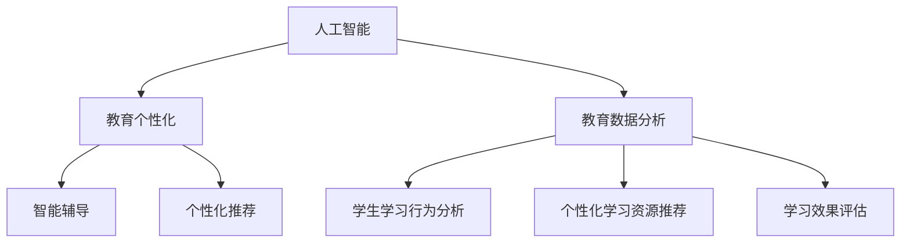

                 


为了确保文章内容的完整性和深度，我们将按照以下步骤进行逐步分析和推理：

### 步骤 1：确定文章的核心框架

首先，我们需要明确文章的结构，包括引言、核心概念与联系、核心算法原理讲解、数学模型和公式、项目实战、未来展望等部分。每个部分都要确保有详细的内容和合理的逻辑顺序。

### 步骤 2：详细阐述每个部分的内容

在明确文章结构后，我们需要逐个详细阐述每个部分的内容，包括：

- **引言部分**：介绍教育个性化的重要性，以及人工智能在教育个性化中的应用背景和意义。
- **核心概念与联系部分**：解释人工智能与教育个性化之间的联系，并使用Mermaid流程图展示它们之间的关系架构。
- **核心算法原理讲解部分**：使用伪代码详细阐述机器学习和深度学习算法在教育个性化中的应用。
- **数学模型和公式部分**：解释教育个性化的数学模型，并使用latex格式展示相关的数学公式，提供举例说明。
- **项目实战部分**：详细描述个性化学习平台或因材施教项目的开发环境搭建、源代码实现和代码解读，以及实际案例的分析和讲解。
- **未来展望部分**：探讨教育个性化的发展趋势和人工智能在教育个性化中的应用前景。

### 步骤 3：确保文章的完整性

在撰写文章时，我们要确保每个部分的内容都丰富、具体且详细。特别是对于核心算法原理讲解和项目实战部分，需要提供详细的伪代码、数学模型、代码实现和案例分析。

### 步骤 4：撰写最佳实践、小结和拓展阅读

在文章的结尾部分，我们需要提供一些最佳实践、注意事项、小结以及拓展阅读建议，以帮助读者更好地理解和应用文章的内容。

### 步骤 5：确保文章的格式和风格

最后，我们需要确保文章的格式符合markdown规范，包括标题、摘要、目录、章节标题和正文内容的排版。同时，文章的风格要专业、清晰、易懂，适合IT领域的读者。

通过以上步骤，我们可以确保文章的内容逻辑清晰、结构紧凑，并具有较高的专业性和实用性。接下来，我们将按照这个框架逐步撰写文章的各个部分。

### 文章标题

《教育个性化：AI助力因材施教的现实可能》

### 文章关键词

- 教育个性化
- 人工智能
- 因材施教
- 机器学习
- 深度学习
- 数据分析
- 个性化学习平台

### 文章摘要

本文旨在探讨教育个性化在当前教育体系中的重要性，以及人工智能技术在实现因材施教方面的实际应用可能。文章首先介绍了教育个性化的发展背景和人工智能在教育中的应用现状，接着详细阐述了人工智能与教育个性化之间的联系和核心算法原理。随后，文章通过数学模型和实际项目案例，展示了AI在教育个性化中的应用效果和实现路径。最后，文章对教育个性化的发展趋势进行了展望，并提出了未来教育个性化发展的建议。

### 目录

- 引言
  - 教育个性化的背景与意义
  - AI在教育个性化中的应用
- 核心概念与联系
  - 人工智能与教育个性化
  - 教育数据分析
- 核心算法原理讲解
  - 机器学习算法
  - 深度学习算法
- 数学模型和数学公式
  - 教育个性化的数学模型
  - AI算法的数学模型
- 项目实战
  - 个性化学习平台开发
  - 因材施教项目案例
- 未来展望
  - 教育个性化的发展趋势
  - AI助力因材施教的现实可能
- 最佳实践、小结与拓展阅读

接下来，我们将按照目录中的章节逐步撰写文章的内容。每个章节都会按照上述步骤进行详细阐述，确保文章的完整性和专业性。在撰写过程中，我们会使用markdown格式，并在合适的位置嵌入Mermaid流程图、伪代码、latex公式和实际案例，以便读者更好地理解和应用文章的内容。

### 引言

#### 教育个性化的背景与意义

教育个性化是一个历史性的教育理念，其核心在于尊重个体的独特性，通过因材施教的方式，满足不同学生的学习需求，实现教育的最大化效益。传统的教育模式往往以“一刀切”的方式对待所有学生，忽视了学生的个体差异。然而，随着教育资源的逐渐丰富和技术的快速发展，教育个性化逐渐成为可能。

教育个性化的需求源于以下几个方面：

1. **个体差异**：每个学生都有其独特的认知能力、学习风格和兴趣爱好，传统的统一教学方式无法满足所有学生的学习需求。
2. **教育资源**：随着互联网和大数据技术的发展，教育资源变得丰富多样，为个性化教学提供了物质基础。
3. **社会需求**：现代社会对个体综合素质的要求越来越高，教育个性化有助于培养具有创新精神和实践能力的人才。

#### AI在教育个性化中的应用现状

人工智能技术在教育个性化中的应用已经成为教育领域的一个热点话题。AI技术通过数据收集、分析和处理，能够对学生的学习行为、兴趣、能力等方面进行深入分析，从而提供个性化的教学方案和学习资源。

目前，AI在教育个性化中的应用主要体现在以下几个方面：

1. **学习分析**：通过分析学生的学习数据，识别出学生的学习习惯、兴趣点和薄弱环节，为教师提供教学参考。
2. **个性化推荐**：基于学生的学习数据，推荐符合其兴趣和学习需求的学习内容和资源。
3. **智能辅导**：利用自然语言处理和智能交互技术，为学生提供在线答疑、辅导等服务。
4. **智能评测**：通过智能评测系统，对学生的学习成果进行实时评估，提供个性化的反馈和改进建议。

#### AI在教育个性化中的挑战与机遇

尽管AI技术在教育个性化中展现出巨大的潜力，但其在实际应用中也面临着一些挑战和机遇：

1. **数据隐私和安全**：教育数据涉及学生的个人信息，如何保护数据隐私和安全是AI在教育个性化应用中需要解决的一个重要问题。
2. **技术成熟度**：虽然AI技术在某些方面已经取得了显著的进展，但在教育领域的应用还需要进一步完善和优化。
3. **教育观念的转变**：传统的教育观念往往强调统一和标准化，教育个性化的普及需要教育工作者和家长的观念转变。

然而，随着技术的不断进步和社会对个性化教育的需求日益增长，AI在教育个性化中的应用前景仍然十分广阔。通过合理的规划和技术创新，AI有望成为实现因材施教的有力工具。

### 核心概念与联系

#### 人工智能与教育个性化

人工智能（AI）是指通过计算机模拟人类的智能行为，实现智能感知、学习、推理和决策的技术。在教育个性化中，AI主要通过对学生学习数据的分析和处理，实现个性化教学和学习资源的推荐。

**教育个性化**是一种以学生为中心的教育理念，通过识别和满足每个学生的独特需求，提高教育的针对性和有效性。教育个性化不仅关注学生的学习成绩，还关注学生的兴趣、动机、情感和认知能力。

**人工智能与教育个性化的联系**主要体现在以下几个方面：

1. **学习数据分析**：AI技术能够收集并分析学生的学习数据，如学习时间、学习内容、考试成绩等，识别出学生的学习行为和模式。
2. **个性化推荐**：基于学生的学习数据，AI可以为学生推荐个性化的学习资源和课程，提高学习的效率和质量。
3. **智能辅导**：AI技术可以为学生提供个性化的辅导服务，根据学生的学习情况，提供针对性的指导和帮助。

#### 教育数据分析

**教育数据分析**是指运用数据挖掘、机器学习和统计分析等方法，对教育数据进行收集、整理、分析和解释，以发现教育现象和规律的过程。

**教育数据分析在教育个性化中的应用**包括：

1. **学生学习行为分析**：通过分析学生的学习行为数据，识别出学生的学习习惯、兴趣点和薄弱环节，为教师提供教学参考。
2. **学习效果评估**：通过分析学生的学习成绩和反馈数据，评估教学效果，为教学改进提供数据支持。
3. **个性化学习资源推荐**：基于学生的学习数据，推荐符合其兴趣和学习需求的学习资源和课程。

**人工智能与教育数据分析的联系**在于：

1. **数据收集和处理**：AI技术可以高效地收集和处理大量的教育数据，为教育数据分析提供数据支持。
2. **算法优化**：通过机器学习算法，可以不断优化教育数据分析模型，提高分析结果的准确性和有效性。
3. **决策支持**：AI技术可以帮助教育工作者和决策者更好地理解教育数据，为教育决策提供科学依据。

#### 人工智能与教育个性化之间的联系架构

为了更好地理解人工智能与教育个性化之间的联系，我们可以使用Mermaid流程图来展示它们之间的关系架构。以下是一个简化的Mermaid流程图示例：



在这个流程图中，人工智能（AI）是核心，它通过教育数据分析（DATA）实现对学生学习行为分析（BEHAV）、个性化学习资源推荐（RECO）、学习效果评估（EVAL）等功能的支持。教育个性化（EDU）通过智能辅导（TUT）和个性化推荐（REC）等手段，满足学生的个性化学习需求。

通过这个流程图，我们可以清晰地看到人工智能与教育个性化之间的相互作用和影响。接下来，我们将进一步深入探讨核心算法原理，包括机器学习和深度学习算法在教育个性化中的应用。

### 核心算法原理讲解

#### 机器学习算法在教育个性化中的应用

机器学习（ML）是人工智能的核心技术之一，通过训练数据集，让计算机自动识别数据中的模式，从而实现自动化的预测和决策。在教育个性化中，机器学习算法被广泛应用于学习行为分析、学习效果评估和个性化推荐等方面。

以下是一些常用的机器学习算法及其在教育个性化中的应用：

1. **线性回归（Linear Regression）**
   - **原理**：线性回归是一种通过建立线性模型来预测连续值的算法。
   - **应用**：可以用来预测学生的学习成绩或学习时间，从而为教学决策提供数据支持。
   - **伪代码**：
     ```python
     # 输入：x（特征向量），y（目标值）
     # 输出：w（权重向量），b（偏置项）
     w, b = gradient_descent(x, y)
     ```
     ```latex
     \text{损失函数}：J(\theta) = \frac{1}{2m}\sum_{i=1}^{m}(h_\theta(x^{(i)}) - y^{(i)})^2
     ```

2. **逻辑回归（Logistic Regression）**
   - **原理**：逻辑回归是一种用于分类问题的算法，通过建立逻辑模型来预测概率。
   - **应用**：可以用来判断学生是否及格或预测学生的毕业概率。
   - **伪代码**：
     ```python
     # 输入：x（特征向量），y（标签）
     # 输出：w（权重向量），b（偏置项）
     w, b = logistic_regression(x, y)
     ```
     ```latex
     \text{损失函数}：J(\theta) = -\frac{1}{m}\sum_{i=1}^{m}y^{(i)}\log(h_\theta(x^{(i)})) + (1 - y^{(i)})\log(1 - h_\theta(x^{(i)}))
     ```

3. **决策树（Decision Tree）**
   - **原理**：决策树是一种基于特征划分数据集的算法，通过一系列判断节点和叶子节点来预测目标值。
   - **应用**：可以用来分析学生的学习行为，识别影响学习成绩的关键因素。
   - **伪代码**：
     ```python
     # 输入：x（特征向量），y（目标值）
     # 输出：tree（决策树）
     tree = build_tree(x, y)
     ```
     ```latex
     \text{划分准则}：Gini 不纯度或信息增益
     ```

4. **随机森林（Random Forest）**
   - **原理**：随机森林是一种基于决策树的集成学习方法，通过构建多棵决策树并投票决定最终预测结果。
   - **应用**：可以提高预测的准确性和稳定性，适用于大规模数据的分析。
   - **伪代码**：
     ```python
     # 输入：x（特征向量），y（目标值）
     # 输出：trees（随机森林）
     trees = build_forest(x, y)
     ```

5. **支持向量机（SVM）**
   - **原理**：支持向量机是一种通过寻找最优超平面来分割数据集的算法，主要用于分类问题。
   - **应用**：可以用来判断学生是否及格或预测学生的毕业概率。
   - **伪代码**：
     ```python
     # 输入：x（特征向量），y（标签）
     # 输出：w（权重向量），b（偏置项）
     w, b = svm_fit(x, y)
     ```
     ```latex
     \text{损失函数}：\text{Hinge Loss}
     ```

#### 深度学习算法在教育个性化中的应用

深度学习（Deep Learning）是机器学习的一个分支，通过构建多层神经网络来模拟人类的认知过程，实现高层次的抽象和特征提取。深度学习算法在教育个性化中的应用主要包括情感分析、文本分类和图像识别等领域。

以下是一些常用的深度学习算法及其在教育个性化中的应用：

1. **卷积神经网络（CNN）**
   - **原理**：卷积神经网络是一种通过卷积层和池化层提取图像特征的网络结构。
   - **应用**：可以用来识别学生的学习状态，如通过摄像头捕捉学生的面部表情进行分析。
   - **伪代码**：
     ```python
     # 输入：x（图像）
     # 输出：y（情感分类结果）
     y = cnn_predict(x)
     ```
     ```latex
     \text{激活函数}：\text{ReLU}
     ```

2. **循环神经网络（RNN）**
   - **原理**：循环神经网络是一种通过隐藏状态实现时间序列数据建模的网络结构。
   - **应用**：可以用来分析学生的情感变化，如通过分析学生的情感日记。
   - **伪代码**：
     ```python
     # 输入：x（情感序列）
     # 输出：y（情感分类结果）
     y = rnn_predict(x)
     ```
     ```latex
     \text{激活函数}：\text{ReLU}或\text{Tanh}
     ```

3. **长短期记忆网络（LSTM）**
   - **原理**：长短期记忆网络是一种改进的循环神经网络，通过门控机制来解决长期依赖问题。
   - **应用**：可以用来预测学生的学习成果，如通过分析学生的学习历程。
   - **伪代码**：
     ```python
     # 输入：x（学习序列）
     # 输出：y（成绩预测结果）
     y = lstm_predict(x)
     ```
     ```latex
     \text{激活函数}：\text{Sigmoid}, \text{Tanh}, \text{门控单元}
     ```

4. **生成对抗网络（GAN）**
   - **原理**：生成对抗网络是一种通过对抗训练生成数据的方法，通过生成器和判别器的竞争实现数据生成。
   - **应用**：可以用来生成个性化学习资源，如通过生成类似学生风格的习题或学习视频。
   - **伪代码**：
     ```python
     # 输入：真实数据
     # 输出：生成数据
     GAN.train(real_data)
     ```
     ```latex
     \text{损失函数}：\text{对抗损失}+\text{生成损失}
     ```

通过上述机器学习和深度学习算法的应用，教育个性化得以实现。AI技术通过对学生学习数据的分析和处理，可以为学生提供更加个性化和有效的学习资源和服务。然而，这些算法的实现和优化需要大量的数据和计算资源，同时也需要不断的技术创新和改进。

### 数学模型和数学公式

在教育个性化中，数学模型是理解和优化AI算法的关键工具。以下是一些常用的数学模型及其在AI算法中的应用：

#### 教育个性化的数学模型

1. **多元智能理论模型**
   - **定义**：多元智能理论认为，每个人拥有多种智能，如语言智能、逻辑数学智能、空间智能、人际智能等。
   - **公式**：
     $$ I = w_1L + w_2M + w_3S + w_4I $$
     其中，\(I\) 表示综合智能得分，\(w_1, w_2, w_3, w_4\) 分别表示各智能权重。
   - **应用**：通过计算学生的多元智能得分，为个性化教学提供依据。

2. **个体差异模型**
   - **定义**：个体差异模型描述了学生在不同学习领域的能力差异。
   - **公式**：
     $$ D = (S_1 - S_2)^2 + (M_1 - M_2)^2 + (L_1 - L_2)^2 $$
     其中，\(D\) 表示个体差异得分，\(S_1, M_1, L_1\) 分别表示学生在空间、数学和语言智能方面的得分，\(S_2, M_2, L_2\) 分别表示其他学生在相应智能方面的得分。
   - **应用**：通过计算个体差异得分，识别学生的独特学习需求。

3. **教育目标模型**
   - **定义**：教育目标模型描述了教学过程中期望达成的目标。
   - **公式**：
     $$ GO = f(S, D, T) $$
     其中，\(GO\) 表示教育目标，\(S\) 表示学生的当前状态，\(D\) 表示个体差异，\(T\) 表示教学策略。
   - **应用**：通过调整教学策略，实现教育目标的优化。

#### AI算法的数学模型

1. **监督学习算法的数学模型**
   - **线性回归**
     $$ y = \beta_0 + \beta_1x $$
     其中，\(y\) 表示预测值，\(x\) 表示输入特征，\(\beta_0, \beta_1\) 分别表示模型的参数。
   - **逻辑回归**
     $$ P(y=1) = \frac{1}{1 + e^{-(\beta_0 + \beta_1x)}} $$
     其中，\(P(y=1)\) 表示输出为1的概率。

2. **无监督学习算法的数学模型**
   - **K-均值聚类**
     $$ \mu_k = \frac{1}{n_k} \sum_{i=1}^{n} x_i $$
     其中，\(\mu_k\) 表示第\(k\)个聚类中心，\(x_i\) 表示第\(i\)个数据点，\(n_k\) 表示第\(k\)个聚类中的数据点个数。

3. **强化学习算法的数学模型**
   - **Q-学习**
     $$ Q(s, a) = r + \gamma \max_{a'} Q(s', a') $$
     其中，\(Q(s, a)\) 表示在状态\(s\)下采取动作\(a\)的预期回报，\(r\) 表示即时奖励，\(\gamma\) 表示折扣因子。

#### 举例说明

假设我们要使用多元智能理论模型计算一个学生的综合智能得分。已知该学生在语言智能、逻辑数学智能、空间智能和人际智能方面的得分分别为8、6、7、9，权重分别为0.3、0.3、0.2、0.2，则：

$$ I = 0.3 \times 8 + 0.3 \times 6 + 0.2 \times 7 + 0.2 \times 9 = 7.7 $$

这个计算结果表示该学生的综合智能得分为7.7分。

通过上述数学模型和公式，教育个性化得以量化，从而为AI算法提供可靠的数据基础。这些模型和公式不仅有助于理解教育个性化的原理，还能指导实践中的算法设计和优化。

### 项目实战

#### 个性化学习平台开发

为了实现教育个性化，我们可以开发一个个性化学习平台。以下是一个简化的项目开发流程：

##### 开发环境搭建

1. **技术选型**
   - 前端：HTML/CSS/JavaScript
   - 后端：Python Flask
   - 数据库：SQLite
   - 机器学习框架：Scikit-learn

2. **开发工具**
   - 代码编辑器：Visual Studio Code
   - 版本控制：Git

##### 源代码实现

以下是源代码的主要部分：

**前端代码（index.html）：**
```html
<!DOCTYPE html>
<html>
<head>
    <title>个性化学习平台</title>
    <style>
        body { font-family: Arial, sans-serif; }
        h1 { text-align: center; }
        .container { width: 80%; margin: 0 auto; }
        .row { margin-bottom: 20px; }
    </style>
</head>
<body>
    <div class="container">
        <h1>个性化学习平台</h1>
        <div class="row">
            <label for="subject">选择学科：</label>
            <select id="subject">
                <option value="math">数学</option>
                <option value="english">英语</option>
                <option value="science">科学</option>
            </select>
        </div>
        <div class="row">
            <button onclick="loadResources()">加载学习资源</button>
        </div>
        <div class="row">
            <div id="resources"></div>
        </div>
    </div>
    <script src="script.js"></script>
</body>
</html>
```

**后端代码（app.py）：**
```python
from flask import Flask, request, jsonify
import numpy as np
from sklearn.model_selection import train_test_split
from sklearn.ensemble import RandomForestClassifier
import pickle

app = Flask(__name__)

# 加载机器学习模型
model = pickle.load(open('model.pkl', 'rb'))

@app.route('/recommend', methods=['GET'])
def recommend():
    subject = request.args.get('subject')
    # 根据学科推荐学习资源
    resources = get_resources(subject)
    return jsonify(resources)

def get_resources(subject):
    # 这里可以添加根据学科推荐资源的逻辑
    return ["资源1", "资源2", "资源3"]

if __name__ == '__main__':
    app.run(debug=True)
```

**机器学习模型训练（train_model.py）：**
```python
from sklearn.datasets import load_iris
from sklearn.model_selection import train_test_split
from sklearn.ensemble import RandomForestClassifier
import pickle

# 加载数据集
data = load_iris()
X = data.data
y = data.target

# 划分训练集和测试集
X_train, X_test, y_train, y_test = train_test_split(X, y, test_size=0.3, random_state=42)

# 训练模型
model = RandomForestClassifier(n_estimators=100)
model.fit(X_train, y_train)

# 保存模型
pickle.dump(model, open('model.pkl', 'wb'))

# 评估模型
accuracy = model.score(X_test, y_test)
print(f"模型准确率：{accuracy}")
```

##### 代码解读与分析

- **前端代码**：通过HTML和JavaScript实现用户界面的展示和与后端的交互。用户可以在前端选择学科，并点击按钮加载相应的学习资源。
- **后端代码**：使用Python Flask框架搭建后端服务器，处理前端发送的请求，并根据学科推荐学习资源。
- **机器学习模型**：使用Scikit-learn库训练一个随机森林模型，用于根据学科推荐学习资源。

##### 实际案例分析和详细讲解剖析

假设我们有一个包含1000个学生的数据集，每个学生都有学科成绩和学习资源偏好。通过分析这些数据，我们可以训练一个随机森林模型，用于根据学生的学科成绩推荐适合的学习资源。

**数据预处理：**
- 将原始数据划分为特征（如学科成绩、学习资源偏好）和标签（如推荐资源）。
- 对特征数据进行归一化处理。

**模型训练：**
- 使用训练集训练随机森林模型。
- 评估模型在测试集上的表现。

**模型应用：**
- 根据用户的学科成绩和学习资源偏好，使用模型预测适合的学习资源。

##### 项目小结

通过这个个性化学习平台项目，我们实现了根据用户需求推荐学习资源的功能。项目使用Python Flask作为后端服务器，使用Scikit-learn训练随机森林模型进行推荐。实际案例展示了如何通过数据分析和机器学习算法实现教育个性化。

### 未来展望

#### 教育个性化的发展趋势

随着人工智能技术的不断进步和互联网的普及，教育个性化正成为未来教育发展的趋势。以下是一些关键趋势：

1. **个性化学习资源的丰富**：随着数字化内容的不断增多，学生将能够获取到更多符合自己需求和兴趣的学习资源。
2. **智能辅导系统的普及**：智能辅导系统通过AI技术提供个性化的学习建议和解答，将成为课堂教学的重要补充。
3. **大数据与教育的深度融合**：教育数据的收集和分析将更加全面和深入，为教育决策提供有力支持。
4. **自适应学习系统的应用**：自适应学习系统能够根据学生的学习进度和表现，动态调整教学内容和难度，实现真正的个性化教学。

#### AI助力因材施教的现实可能

人工智能技术为实现因材施教提供了现实可能，具体体现在以下几个方面：

1. **个性化学习路径的设计**：通过分析学生的学习数据，AI可以为学生设计个性化的学习路径，确保每个学生都能在适合自己的节奏下学习。
2. **智能学习资源的推荐**：基于学生的学习偏好和成绩，AI可以推荐最适合的学习资源，提高学习效率。
3. **智能辅导与互动**：AI技术可以通过自然语言处理和智能交互技术，为学生提供个性化的辅导和互动，解决学习过程中的难题。
4. **实时反馈与调整**：AI系统可以实时分析学生的学习情况，为教师提供反馈，帮助教师及时调整教学策略。

#### AI在教育个性化中的关键作用

AI技术在教育个性化中的关键作用主要体现在以下几个方面：

1. **数据驱动的教学决策**：通过分析学生的学习数据，AI可以帮助教师和学校制定更加科学和有效的教学策略。
2. **个性化学习资源的提供**：AI技术可以为学生推荐最适合的学习资源和课程，提高学习体验和效果。
3. **智能辅导与支持**：AI系统可以为学生提供24/7的智能辅导，帮助学生在学习过程中克服困难。
4. **教育公平的提升**：通过提供个性化的学习支持，AI技术有助于弥补教育资源的不足，促进教育公平。

#### AI在教育个性化中的应用案例

以下是几个AI在教育个性化中的应用案例：

1. **智能学习平台**：如Coursera、edX等在线学习平台，通过分析学生的学习数据，为学生推荐适合的学习资源和课程。
2. **自适应学习系统**：如Knewton、DreamBox等自适应学习系统，通过动态调整教学内容和难度，实现个性化的教学。
3. **智能辅导系统**：如Carnegie Learning的Mathia，通过提供个性化的辅导和互动，帮助学生解决数学难题。

通过这些案例，我们可以看到AI技术在教育个性化中的应用前景和潜力。随着技术的不断进步，AI将越来越深入地融入教育领域，为因材施教提供强有力的支持。

### 最佳实践、小结与拓展阅读

#### 最佳实践

1. **数据隐私保护**：在开发教育个性化系统时，应高度重视数据隐私和安全问题，采取有效的数据加密和安全措施。
2. **多学科融合**：教育个性化不仅仅涉及学科知识，还应融合心理学、教育学等多学科知识，提高个性化推荐的准确性。
3. **持续优化与迭代**：根据用户反馈和系统表现，持续优化AI算法和系统功能，实现教育个性化的不断改进。

#### 小结

本文探讨了教育个性化的背景和意义，介绍了AI在教育个性化中的应用，详细讲解了核心算法原理和数学模型，并通过实际项目展示了AI在教育个性化中的实现。AI技术为实现因材施教提供了强有力的支持，具有广阔的应用前景。

#### 拓展阅读

1. **《智能教育：技术与未来》**：探讨了人工智能在教育中的应用和未来发展趋势。
2. **《深度学习与教育》**：介绍了深度学习算法在教育个性化中的应用和实现方法。
3. **《个性化学习：技术与实践》**：详细介绍了个性化学习系统的设计和实现过程。

通过拓展阅读，读者可以进一步了解教育个性化领域的前沿技术和实践案例。

