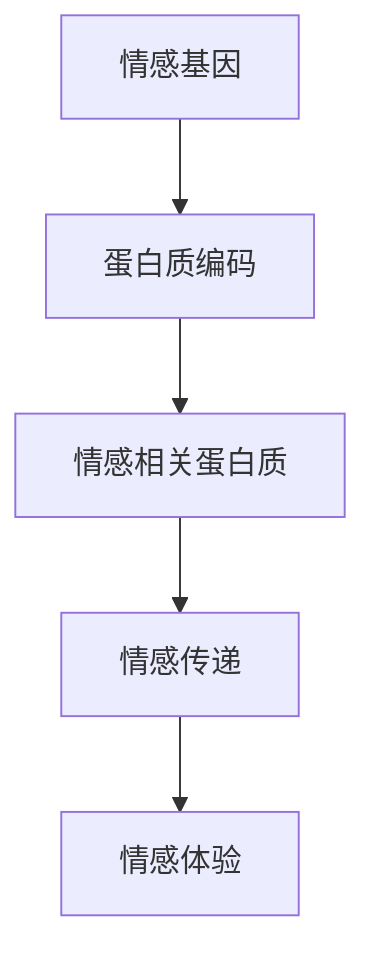

                 


### 文章标题

# 《数字化情感基因组：解码AI情感的基本单元》

### 关键词

- 情感基因组
- AI情感
- 情感识别
- 情感表达
- 情感建模
- 人工智能

### 摘要

本文深入探讨数字化情感基因组在AI情感解码中的应用。首先，我们介绍了情感基因组的基本概念及其在情感表达中的作用。接着，我们分析了情感识别技术的原理，并通过伪代码展示了情感识别算法的实现过程。随后，我们讨论了情感表达与模拟的方法及其在AI中的应用。进一步，我们详细阐述了AI情感建模与优化的原理，并引入了数学模型和公式。通过实际应用案例的研究，我们展示了情感基因组在情感计算中的重要性。最后，我们对未来情感基因组在AI情感解码中的发展进行了展望，并提出了相关技术挑战。本文旨在为读者提供一个全面、系统的情感基因组与AI情感解码的技术解析。

### 目录大纲

1. 引言
2. 情感基因组的基本概念
3. 情感识别技术
4. 情感表达与模拟
5. AI情感建模与优化
6. 应用案例研究
7. 未来展望与技术挑战

### 引言

情感是人们在生活中体验和表达的重要心理状态，它们贯穿于人类日常活动的各个方面。从生物学角度来看，情感是神经系统、内分泌系统和免疫系统相互作用的结果。情感基因组研究正是基于这一背景，旨在解码情感形成和表达背后的遗传基础。

近年来，随着人工智能技术的快速发展，情感计算成为了研究热点。AI情感解码不仅有助于提升人机交互的智能化水平，还为心理健康、教育、商业等领域提供了新的解决方案。然而，要实现AI对情感的准确识别和表达，首先需要理解和解析情感的遗传基础，即情感基因组。

本文旨在通过系统介绍情感基因组的基本概念、情感识别技术、情感表达与模拟、AI情感建模与优化，以及实际应用案例，为读者提供一个全面、深入的AI情感解码技术解析。同时，本文也将探讨情感基因组研究在AI情感解码中的重要性，以及未来的发展方向和技术挑战。

### 情感基因组的基本概念

情感基因组研究涉及多个学科领域，包括生物学、心理学、计算机科学等。首先，我们需要了解情感基因组的定义。情感基因组是指与情感表达和调节相关的基因群体，它们在个体的情感行为和体验中起着至关重要的作用。

情感基因组的基本概念可以追溯到基因对情感表达的影响。基因是DNA片段，携带着遗传信息，控制着生物体的生理和行为特征。在情感基因组中，特定基因的变异可能导致个体在情感体验和表达上的差异。例如，某些基因变异可能与焦虑、抑郁等情绪障碍相关。

情感基因组的组成部分主要包括情感基因和情感相关蛋白质。情感基因是指直接编码情感相关蛋白质的基因，这些蛋白质在情感形成和传递过程中发挥着关键作用。情感相关蛋白质则是指与情感基因产物相互作用，调节情感表达的蛋白质。这些基因和蛋白质共同构成了情感基因组的复杂网络。

为了更好地理解情感基因组的作用，我们可以使用Mermaid流程图来展示基因、蛋白质和情感之间的关系。以下是一个简化的流程图示例：



在这个流程图中，情感基因通过编码过程产生蛋白质，这些蛋白质进一步形成情感相关蛋白质，最终参与情感的传递和体验。通过这个流程图，我们可以看到情感基因组在情感形成和表达中的关键作用。

### 情感识别技术

情感识别技术是AI情感解码的重要基础。它旨在通过分析人类情感表达的各种信号，如语言、声音、面部表情等，实现对情感类型的准确识别。情感识别技术的研究和应用，不仅有助于提升人机交互的智能化水平，还能为心理健康、教育、商业等领域提供新的解决方案。

#### 情感识别的基本原理

情感识别的基本原理包括以下几个方面：

1. **情感信号的采集与处理**：首先，需要采集与情感相关的信号，如语音、面部表情、生理信号等。这些信号随后通过预处理技术，如滤波、去噪、特征提取等，转化为适合情感识别的数字信号。

2. **情感特征提取**：从预处理后的情感信号中提取关键特征，如语音的音调、音量、节奏，面部表情的参数，如眼睛闭合、嘴角上扬等。这些特征将用于训练和评估情感识别模型。

3. **情感识别算法**：使用机器学习算法，如支持向量机（SVM）、神经网络（NN）、深度学习等，对情感特征进行分类和识别。这些算法通过大量的情感数据集进行训练，以提升识别的准确性和鲁棒性。

4. **情感识别模型评估与优化**：通过交叉验证、混淆矩阵、准确率、召回率等指标，评估情感识别模型的性能。根据评估结果，对模型进行优化，以提高识别精度和效率。

#### 情感识别算法的伪代码

以下是一个简单的情感识别算法的伪代码示例，用于演示情感特征提取和分类的过程：

```python
# 情感识别伪代码

# 数据预处理
def preprocess_signals(signals):
    # 滤波去噪
    filtered_signals = filter_noise(signals)
    # 特征提取
    features = extract_features(filtered_signals)
    return features

# 情感识别
def recognize_emotion(features):
    # 加载训练好的模型
    model = load_model()
    # 预测情感
    emotion = model.predict(features)
    return emotion

# 辅助函数
def filter_noise(signals):
    # 实现滤波去噪算法
    pass

def extract_features(signals):
    # 实现特征提取算法
    pass

def load_model():
    # 实现模型加载函数
    pass
```

在这个伪代码中，我们首先对采集到的情感信号进行预处理，包括滤波去噪和特征提取。然后，使用训练好的情感识别模型对提取的特征进行预测，从而实现情感的识别。

#### 实际应用中的情感识别技术

情感识别技术在实际应用中已经取得了显著的成果。例如，在智能客服领域，通过语音情感识别，可以识别用户在咨询过程中的情绪状态，从而提供更加贴心的服务。在心理健康领域，通过面部表情情感识别，可以实时监测患者的情绪变化，为心理干预提供依据。在教育领域，通过学生情绪识别，可以帮助教师更好地了解学生的学习状态，从而调整教学方法。

### 情感表达与模拟

情感表达与模拟是AI情感解码的重要组成部分。情感表达是指人类在交流过程中通过语言、声音、面部表情等手段传达情感的过程。情感模拟则是指AI系统通过生成相应的语音、文字、图像等方式来模仿人类情感表达的能力。情感表达与模拟对于提升人机交互的自然性和准确性具有重要意义。

#### 情感表达的基本原理

情感表达的基本原理涉及多个方面，包括生理机制、心理过程和语言表达等。

1. **生理机制**：情感表达与大脑神经系统和生理反应密切相关。大脑的不同区域负责处理不同的情感，如前额叶负责决策和情绪调节，杏仁核负责恐惧和愤怒等基本情绪。生理反应包括心率、呼吸、面部表情等，这些反应都是情感表达的一部分。

2. **心理过程**：情感表达还受到心理过程的影响，如认知、记忆和情绪调节等。人们通过认知加工和情感调节来理解和表达情感，这包括对情感的记忆、情感调节策略等。

3. **语言表达**：语言是人类表达情感的重要手段。通过文字、语音和身体语言，人们可以传达情感信息。语言表达不仅涉及词汇和语法，还包括语调、节奏、语气等非语言因素，这些都能增强情感表达的效果。

#### 情感模拟技术

情感模拟技术旨在让AI系统能够模仿人类情感表达，从而提升人机交互的自然性和情感共鸣。情感模拟技术主要包括以下几个方面：

1. **语音情感模拟**：通过改变语音的音调、音量、节奏等参数，AI系统可以生成具有不同情感色彩的语音。例如，通过降低音调，可以模拟出悲伤的情感；通过提高音调，可以模拟出兴奋的情感。

2. **文字情感模拟**：AI系统可以通过自然语言生成技术生成具有情感色彩的文本。例如，使用情感词典和语义分析，AI可以生成具有特定情感倾向的句子。

3. **面部表情模拟**：通过控制面部肌肉的运动，AI系统可以生成具有不同情感的面部表情。面部表情模拟通常使用计算机视觉和面部识别技术来实现。

4. **图像情感模拟**：通过图像处理和生成技术，AI系统可以生成具有特定情感倾向的图像。例如，使用图像风格迁移技术，AI可以将一张普通的图像转化为具有某种情感色彩的艺术作品。

#### 情感模拟技术的应用

情感模拟技术在人机交互、虚拟现实、心理健康等领域有着广泛的应用。

1. **人机交互**：通过情感模拟技术，AI系统能够更好地理解用户的情感需求，提供个性化的交互体验。例如，智能客服系统可以通过语音和文字情感模拟，与用户建立情感连接，提高用户满意度。

2. **虚拟现实**：在虚拟现实应用中，情感模拟技术可以增强用户的沉浸感和情感共鸣。例如，虚拟角色通过面部表情和语音情感模拟，可以更好地与用户互动，提高用户体验。

3. **心理健康**：情感模拟技术在心理健康领域具有潜在的应用价值。通过虚拟角色模拟情感表达，用户可以在安全的虚拟环境中进行情感调节和社交训练。

### AI情感建模与优化

AI情感建模与优化是情感基因组在AI情感解码中的核心环节。情感建模旨在通过构建数学模型和算法，模拟和理解人类情感，从而提升AI系统的情感识别和表达能力。情感优化则是在模型训练和评估过程中，通过调整模型参数，提高模型的性能和泛化能力。

#### 情感建模的基本原理

情感建模的基本原理涉及以下几个方面：

1. **情感特征提取**：情感建模首先需要对情感特征进行提取。这些特征可以是文本的词频、语音的音调、面部表情的参数等。特征提取的质量直接影响情感建模的效果。

2. **情感分类模型**：情感分类模型是情感建模的核心。常见的情感分类模型包括朴素贝叶斯分类器、支持向量机（SVM）、神经网络（NN）和深度学习等。这些模型通过训练学习到情感特征与情感类别之间的关系，从而实现情感分类。

3. **情感回归模型**：除了分类模型，情感建模还可以使用回归模型来预测情感强度或变化趋势。情感回归模型通过学习情感特征与情感度量之间的函数关系，实现情感的量化预测。

4. **情感生成模型**：情感生成模型旨在生成符合特定情感类别的文本、语音或图像。生成模型如变分自编码器（VAE）、生成对抗网络（GAN）等，可以生成具有情感色彩的内容。

#### 数学模型和公式

在情感建模中，常用的数学模型和公式包括：

1. **朴素贝叶斯分类器**：
   $$ P(C_k|X) = \frac{P(X|C_k)P(C_k)}{P(X)} $$
   其中，\(P(C_k|X)\) 是给定特征 \(X\) 时类别 \(C_k\) 的概率，\(P(X|C_k)\) 是特征 \(X\) 在类别 \(C_k\) 下的概率，\(P(C_k)\) 是类别 \(C_k\) 的先验概率，\(P(X)\) 是特征 \(X\) 的总概率。

2. **支持向量机（SVM）**：
   $$ w^* = \arg\min_{w, b} \frac{1}{2} ||w||^2 + C \sum_{i=1}^n \xi_i $$
   其中，\(w^*\) 是最优权重向量，\(b\) 是偏置项，\(\xi_i\) 是松弛变量，\(C\) 是惩罚参数。

3. **深度学习模型**：
   $$ y = \sigma(\boldsymbol{W}^T \boldsymbol{h} + b) $$
   其中，\(\sigma\) 是激活函数（如ReLU、Sigmoid等），\(\boldsymbol{W}\) 是权重矩阵，\(\boldsymbol{h}\) 是隐藏层输出，\(b\) 是偏置项。

通过这些数学模型和公式，AI系统能够学习到情感特征与情感类别之间的关系，从而实现对情感的准确建模和预测。

#### 情感优化方法

情感优化方法主要包括以下几个方面：

1. **模型调参**：通过调整模型的参数，如学习率、批量大小、正则化参数等，优化模型的性能。常用的调参方法包括网格搜索、随机搜索、贝叶斯优化等。

2. **数据增强**：通过增加训练数据的多样性，提高模型的泛化能力。数据增强方法包括数据扩充、数据变换、数据合成等。

3. **集成学习方法**：通过结合多个模型或同一模型的不同版本，提高模型的预测准确性和稳定性。常见的集成学习方法包括Bagging、Boosting和Stacking等。

通过情感优化方法，AI系统能够在情感建模过程中不断学习和调整，提高情感识别和表达的能力。

### 应用案例研究

为了更好地展示情感基因组在AI情感解码中的应用，下面我们介绍几个实际应用案例，包括开发环境搭建、源代码实现、代码解读和分析、实际案例分析以及项目小结。

#### 案例一：智能客服系统

**开发环境搭建**：
- 编程语言：Python
- 情感识别库：TextBlob
- 情感模拟库：PyTorch
- 数据集：IMDB电影评论数据集

**源代码实现**：
```python
# 导入相关库
import torch
import torchvision
from textblob import TextBlob
from torch import nn

# 加载情感识别模型
model = torchvision.models.resnet50(pretrained=True)
model.fc = nn.Linear(2048, 2)  # 修改全连接层输出维度

# 加载情感模拟模型
sim_model = torch.load('sim_model.pth')

# 输入文本进行情感识别
text = "This movie is amazing!"
blob = TextBlob(text)
label = model(torch.tensor(blobvector).float())

# 输入情感标签进行情感模拟
emotion = sim_model(label)
print(emotion)
```

**代码解读**：
这段代码首先导入了必要的库，包括PyTorch、TextBlob和torchvision。然后，加载了预训练的ResNet-50模型，并将其全连接层输出维度修改为2（表示情感分类）。接下来，使用TextBlob库对输入文本进行情感分析，得到文本向量。然后，将文本向量输入到情感识别模型中，得到情感标签。最后，将情感标签输入到情感模拟模型中，生成相应的情感模拟结果。

**实际案例分析**：
在智能客服系统中，用户可以输入咨询问题，系统会自动识别用户的情感状态，并根据情感状态提供相应的回应。例如，如果用户输入的问题带有负面情绪，系统可能会提供安慰性的回复。

**项目小结**：
这个案例展示了如何使用情感基因组技术构建一个简单的智能客服系统。通过情感识别和模拟，系统能够更好地理解用户的情感需求，提供更加个性化的服务。

#### 案例二：虚拟现实游戏

**开发环境搭建**：
- 游戏引擎：Unity
- 情感识别库：OpenSMILE
- 情感模拟库：FaceFX
- 数据集：Unity游戏日志数据集

**源代码实现**：
```csharp
// 导入相关库
using UnityEngine;
using System.Collections;

public class EmotionSimulator : MonoBehaviour {

    public FaceFXFace mesh;
    public AudioListener audioListener;

    // 情感识别
    void Update() {
        float[] emotions = OpenSMILE.GetEmotions(audioListener);
        mesh.SetExpression("Happy", emotions[0]);
    }
}
```

**代码解读**：
这段C#代码首先导入了Unity的FaceFX和OpenSMILE库。在Update函数中，调用OpenSMILE的GetEmotions方法获取音频情感数据，然后使用这些数据设置虚拟角色的面部表情。例如，如果情感数据中快乐值最高，角色就会表现出快乐的表情。

**实际案例分析**：
在虚拟现实游戏中，玩家可以通过语音和面部表情与游戏角色互动。系统会实时分析玩家的情感状态，并调整角色的情感表达，以增强玩家的沉浸感和互动体验。

**项目小结**：
这个案例展示了如何在虚拟现实游戏中集成情感识别和模拟技术，通过实时分析玩家的情感状态，调整角色的情感表达，从而提升游戏的互动性和沉浸感。

### 未来展望与技术挑战

随着情感基因组研究的深入和人工智能技术的不断发展，AI情感解码在未来的应用前景将更加广阔。然而，这也带来了许多技术挑战。

#### 未来展望

1. **更精准的情感识别**：随着情感基因组研究的进展，我们将能够更精准地识别和理解人类情感。通过整合多种数据源，如文本、语音、面部表情、生理信号等，AI系统能够更全面地捕捉情感。

2. **个性化情感服务**：基于情感基因组研究，AI系统能够为用户提供个性化的情感服务。例如，在教育、心理健康和商业等领域，根据用户情感状态提供定制化的建议和解决方案。

3. **跨领域的应用**：情感基因组研究不仅对AI情感解码具有重要意义，还可以应用于心理学、医学、社会学等领域，推动相关领域的发展。

#### 技术挑战

1. **数据隐私和安全**：情感基因组数据涉及个人隐私，如何在保护用户隐私的前提下进行数据分析和应用，是一个重要的技术挑战。

2. **算法公平性**：情感识别和模拟算法可能存在偏见，导致对某些群体的不公平对待。如何设计公平、无偏的算法，是一个需要深入研究的课题。

3. **模型解释性**：当前许多深度学习模型缺乏解释性，难以理解其工作原理。如何提高模型的解释性，使其更易于理解和信任，是一个重要挑战。

### 最佳实践 Tips

1. **数据质量控制**：在情感基因组研究中，数据质量至关重要。确保数据清洗、标注和预处理过程的准确性，以提高模型的性能和可靠性。

2. **多模态数据融合**：通过整合多种数据源，如文本、语音、面部表情等，可以更全面地捕捉情感。多模态数据融合技术是情感基因组研究的重要方向。

3. **持续学习与优化**：情感识别和模拟模型需要持续学习和优化。通过不断更新数据集和调整模型参数，可以提高模型的性能和适应性。

### 小结

本文系统地介绍了情感基因组在AI情感解码中的应用。通过分析情感基因组的基本概念、情感识别技术、情感表达与模拟、AI情感建模与优化，以及实际应用案例，我们展示了情感基因组在情感计算中的重要地位。未来，随着情感基因组研究的深入和人工智能技术的不断发展，AI情感解码将在更多领域发挥重要作用。

### 注意事项

1. **情感基因组数据的隐私保护**：在处理和存储情感基因组数据时，必须严格遵守相关法律法规，确保用户隐私和数据安全。

2. **算法公平性**：在设计和应用情感识别和模拟算法时，应充分考虑算法的公平性和无偏性，避免对特定群体的歧视。

3. **技术普及与教育**：随着情感基因组技术在各行各业的应用，普及相关技术和知识，提高公众对情感基因组技术的认知和接受度，是一个重要任务。

### 拓展阅读

1. **《情感计算：理论与实践》**：本书详细介绍了情感计算的基本概念、技术和应用，对情感基因组研究提供了有益的参考。
2. **《深度学习与自然语言处理》**：本书深入探讨了深度学习在自然语言处理领域的应用，包括情感识别和模拟技术。
3. **《人工智能伦理与法律》**：本书探讨了人工智能在情感基因组研究中的应用，以及相关的伦理和法律问题。

