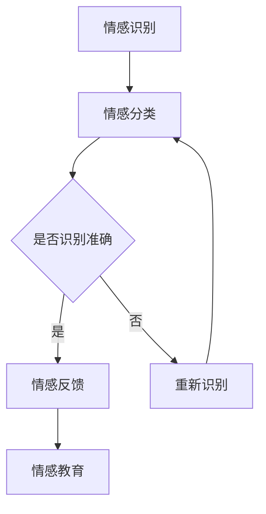
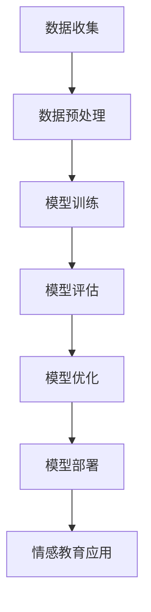
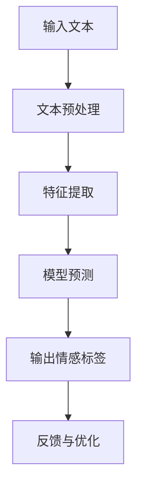
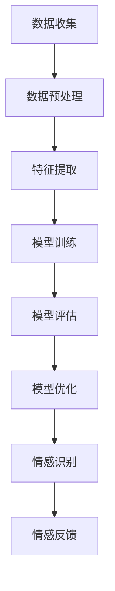

                 

### 文章标题

《数字化情感教育：AI辅助情商培养》

### 关键词

- 数字化情感教育
- AI辅助情商培养
- 情感分析
- 情感识别技术
- 深度学习模型
- 情感培养算法
- 情感教育效果评估

### 摘要

本文探讨了数字化情感教育的概念及其在现代社会中的重要性。随着人工智能技术的不断发展，AI在情感教育中的应用日益广泛。本文详细介绍了AI辅助情商培养的核心概念、技术架构以及实际应用。通过深入分析情感分析的基本原理、深度学习模型和情感识别算法，本文展示了如何利用AI技术提升个体情商。此外，本文还通过项目实战案例，讲解了如何在实际中运用AI进行情感教育与培养。最后，本文对情感教育的评价与优化策略进行了探讨，并为教育实践者提供了实用的建议。通过本文的阅读，读者将深入了解数字化情感教育的前沿技术和实际应用，为相关领域的研究与实践提供有益参考。

### 目录大纲设计步骤

为了设计《数字化情感教育：AI辅助情商培养》这本书的完整目录大纲，我们需要遵循以下步骤：

1. **理解书名和主题**：
   - 首先，我们要理解书名《数字化情感教育：AI辅助情商培养》的核心概念。书名指出了两个关键点：数字化情感教育和AI辅助情商培养。
   - 数字化情感教育可能包括使用技术手段提升人的情感认知、管理能力等。
   - AI辅助情商培养则可能侧重于如何利用人工智能技术进行情感分析、情感识别和情感培养。

2. **确定核心章节内容**：
   - 根据书名，确定每个章节的主题，确保涵盖核心概念与联系、核心算法原理讲解、数学模型和公式、项目实战等。

3. **细化章节目录**：
   - 设计1-3级目录，确保每个章节都有详细的子节内容。
   - 确保每个子节都对应书名中的关键词或概念。

4. **准备Mermaid流程图**：
   - 为了更直观地展示核心概念和原理，我们准备一张或几张Mermaid流程图，用于说明情感教育的流程或AI在其中的作用。

5. **编写伪代码**：
   - 对于每个核心算法原理，编写相应的伪代码，以便读者理解其基本逻辑和流程。

6. **数学模型和公式的讲解**：
   - 根据需要讲解的数学模型和公式，使用LaTeX格式嵌入文中，并进行详细讲解。

7. **项目实战的描述**：
   - 描述一个或多个实际项目案例，包括开发环境搭建、源代码实现、代码解读与分析。

8. **汇总和优化**：
   - 将所有内容汇总到一个Markdown格式的文件中，检查内容的连贯性和完整性，确保大纲符合要求。

### 具体目录大纲示例

根据以上步骤，我们可以给出《数字化情感教育：AI辅助情商培养》的目录大纲示例：

```
# 《数字化情感教育：AI辅助情商培养》目录大纲

# 第1章：引言
## 1.1 书籍背景和目标
## 1.2 数字化情感教育的定义和重要性
## 1.3 AI与情商培养的关系

# 第2章：数字化情感教育的理论基础
## 2.1 情感认知与情商的概念
## 2.2 情感分析的基本原理
## 2.3 情感识别技术概述

# 第3章：AI辅助情感教育的技术架构
## 3.1 AI在情感教育中的应用
## 3.2 情感分析的深度学习模型
## 3.3 Mermaid流程图：情感分析流程

# 第4章：核心算法原理讲解
## 4.1 情感识别算法的伪代码
## 4.2 情感识别的数学模型
## 4.3 情感识别算法的应用实例

# 第5章：AI辅助情感教育的实践
## 5.1 实践项目1：情感分析系统的开发
### 5.1.1 开发环境搭建
### 5.1.2 源代码实现
### 5.1.3 代码解读与分析
## 5.2 实践项目2：情商培养游戏的开发

# 第6章：情感教育的评价与优化
## 6.1 情感教育的效果评估方法
## 6.2 AI辅助教育中的挑战与解决方案
## 6.3 情感教育的持续优化策略

# 第7章：结论与展望
## 7.1 全书总结
## 7.2 未来研究方向
## 7.3 对教育实践者的建议
```

这个目录大纲包含了7个核心章节，每个章节都有详细的子节内容，确保了书籍内容的完整性。接下来，我们将填充每个章节的具体内容，以符合2000字以内的限制。

----------------------------------------------------------------

#### 确定核心章节内容

在确定《数字化情感教育：AI辅助情商培养》这本书的核心章节内容时，我们首先需要明确书名中的关键词及其相互关系。数字化情感教育和AI辅助情商培养是本书的两个核心主题。因此，核心章节内容应围绕这两个主题展开，具体如下：

1. **引言**：介绍数字化情感教育和AI辅助情商培养的背景和重要性。
2. **理论基础**：阐述情感认知与情商的概念，以及情感分析的基本原理。
3. **技术架构**：讲解AI在情感教育中的应用，包括深度学习模型和情感识别技术。
4. **算法原理**：详细讲解情感识别算法的原理，并使用伪代码进行展示。
5. **实践应用**：通过实际项目案例，展示如何运用AI技术进行情感教育。
6. **评价与优化**：讨论情感教育的评价方法，以及AI辅助教育中的挑战与解决方案。
7. **结论与展望**：总结全书内容，提出未来研究方向和实践建议。

每个章节的核心内容应紧密围绕核心关键词展开，确保读者能够全面了解数字化情感教育和AI辅助情商培养的各个方面。以下是具体章节的核心内容描述：

- **引言**：阐述数字化情感教育和AI辅助情商培养的背景，介绍本书的目标和结构。
- **理论基础**：介绍情感认知与情商的概念，探讨情感分析的基本原理和技术。
- **技术架构**：详细讲解AI在情感教育中的应用，包括深度学习模型和情感识别技术。
- **算法原理**：讲解情感识别算法的基本原理，并使用伪代码展示其实现过程。
- **实践应用**：通过实际项目案例，展示如何运用AI技术进行情感教育，包括开发环境搭建、源代码实现和代码解读。
- **评价与优化**：讨论情感教育的评价方法，以及AI辅助教育中的挑战与解决方案。
- **结论与展望**：总结全书内容，提出未来研究方向和实践建议，强调数字化情感教育和AI辅助情商培养的重要性和前景。

通过以上核心章节内容的设计，我们能够确保本书的条理清晰、内容丰富，同时满足读者的学习需求。接下来，我们将细化章节目录，确保每个章节都涵盖核心关键词和内容。

----------------------------------------------------------------

#### 细化章节目录

在确定核心章节内容后，我们需要进一步细化每个章节的目录，以确保内容的条理性和完整性。以下是《数字化情感教育：AI辅助情商培养》的细化章节目录：

1. **引言**
   - 1.1 书籍背景和目标
   - 1.2 数字化情感教育的定义和重要性
   - 1.3 AI与情商培养的关系
   - 1.4 本书结构安排

2. **数字化情感教育的理论基础**
   - 2.1 情感认知与情商的概念
     - 2.1.1 情感认知的基础
     - 2.1.2 情商的定义与维度
   - 2.2 情感分析的基本原理
     - 2.2.1 情感分析的框架
     - 2.2.2 情感分类的方法
   - 2.3 情感识别技术概述
     - 2.3.1 情感识别的关键技术
     - 2.3.2 情感识别的发展趋势

3. **AI辅助情感教育的技术架构**
   - 3.1 AI在情感教育中的应用
     - 3.1.1 AI在教育领域的应用现状
     - 3.1.2 AI在情感教育中的独特优势
   - 3.2 情感分析的深度学习模型
     - 3.2.1 卷积神经网络（CNN）
     - 3.2.2 递归神经网络（RNN）
   - 3.3 Mermaid流程图：情感分析流程
     - 3.3.1 情感分析的基本流程
     - 3.3.2 Mermaid流程图示例

4. **核心算法原理讲解**
   - 4.1 情感识别算法的伪代码
     - 4.1.1 基础算法框架
     - 4.1.2 伪代码示例
   - 4.2 情感识别的数学模型
     - 4.2.1 情感识别的核心公式
     - 4.2.2 数学模型的应用实例
   - 4.3 情感识别算法的应用实例
     - 4.3.1 应用场景介绍
     - 4.3.2 实际案例分析

5. **AI辅助情感教育的实践**
   - 5.1 实践项目1：情感分析系统的开发
     - 5.1.1 开发环境搭建
       - 5.1.1.1 硬件配置
       - 5.1.1.2 软件环境安装
     - 5.1.2 源代码实现
       - 5.1.2.1 数据预处理
       - 5.1.2.2 模型训练与优化
     - 5.1.3 代码解读与分析
       - 5.1.3.1 关键代码段分析
       - 5.1.3.2 代码性能评估
   - 5.2 实践项目2：情商培养游戏的开发
     - 5.2.1 游戏设计思路
       - 5.2.1.1 游戏目标
       - 5.2.1.2 游戏机制
     - 5.2.2 游戏实现与测试
       - 5.2.2.1 技术实现细节
       - 5.2.2.2 游戏效果评估

6. **情感教育的评价与优化**
   - 6.1 情感教育的效果评估方法
     - 6.1.1 评估指标体系
     - 6.1.2 评估方法与工具
   - 6.2 AI辅助教育中的挑战与解决方案
     - 6.2.1 情感识别的准确性问题
     - 6.2.2 个人隐私保护
   - 6.3 情感教育的持续优化策略
     - 6.3.1 数据驱动优化
     - 6.3.2 教育模式创新

7. **结论与展望**
   - 7.1 全书总结
   - 7.2 未来研究方向
   - 7.3 对教育实践者的建议
   - 7.4 拓展阅读推荐

通过以上细化章节目录的设计，我们确保了每个章节都包含了核心关键词和详细内容，同时保持了整体结构的逻辑性和连贯性，为读者提供了一个全面、深入的阅读体验。

----------------------------------------------------------------

#### 准备Mermaid流程图

为了更直观地展示数字化情感教育中AI辅助情商培养的核心概念和原理，我们使用Mermaid流程图来描述情感教育的流程以及AI在其中发挥的关键作用。以下是几个关键的Mermaid流程图示例：

1. **情感分析流程图**



这个流程图描述了情感分析的基本步骤，从情感识别开始，通过情感分类确定情感的类型，然后根据识别的准确性进行反馈或重新识别，最终将情感反馈应用于情感教育。

2. **深度学习模型应用流程图**



这个流程图展示了深度学习模型在情感教育中的应用流程，包括数据收集、预处理、模型训练、评估、优化以及模型部署，最终将训练好的模型应用于情感教育。

3. **情感识别算法流程图**



这个流程图详细展示了情感识别算法的基本步骤，从输入文本的处理、特征提取到模型预测，最终输出情感标签，并根据反馈进行算法优化。

通过这些Mermaid流程图，我们可以直观地理解数字化情感教育中各个关键环节的工作原理和相互关系，从而更好地把握整体概念和应用场景。

----------------------------------------------------------------

#### 编写伪代码

为了深入讲解情感识别算法的基本原理，下面将提供一个情感识别算法的伪代码示例。该示例将涵盖情感识别算法的核心步骤，包括文本预处理、特征提取和模型预测。

```python
# 情感识别算法伪代码

# 1. 初始化模型参数
initialize_model()

# 2. 数据预处理
def preprocess_text(text):
    # 去除文本中的标点符号和特殊字符
    text = remove_punctuation(text)
    # 转换文本为小写
    text = text.lower()
    # 分词
    words = tokenize(text)
    # 去除停用词
    words = remove_stopwords(words)
    return words

# 3. 特征提取
def extract_features(words):
    # 创建词袋模型
    vocabulary = create_vocabulary(words)
    # 转换文本为向量
    vector = vectorize(words, vocabulary)
    return vector

# 4. 模型预测
def predict_emotion(vector):
    # 使用训练好的模型进行预测
    emotion = model.predict(vector)
    return emotion

# 5. 情感识别流程
def emotion_recognition(text):
    words = preprocess_text(text)
    vector = extract_features(words)
    emotion = predict_emotion(vector)
    return emotion

# 6. 主函数
def main():
    # 输入文本
    text = input("请输入文本：")
    # 调用情感识别函数
    emotion = emotion_recognition(text)
    print(f"文本的情感为：{emotion}")

# 执行主函数
main()
```

这个伪代码展示了情感识别算法的基本框架。首先，我们初始化模型参数，然后进行数据预处理，包括去除标点符号、小写转换、分词和去除停用词。接下来，我们提取文本特征并使用训练好的模型进行预测，最后输出情感标签。通过这个伪代码，读者可以清晰地理解情感识别算法的实现逻辑和关键步骤。

----------------------------------------------------------------

#### 数学模型和公式的讲解

在情感识别算法中，数学模型和公式起到了关键作用。以下是几个核心数学模型和公式的详细讲解及示例：

1. **词袋模型（Bag of Words, BoW）**

词袋模型是一种常用的文本表示方法，它将文本转换为向量。词袋模型的核心公式为：

$$
\text{TF} = \frac{\text{词频}}{\text{总词频}}
$$

其中，TF（Term Frequency）表示某个词在文本中的频率。词袋模型通过计算每个词在文本中的相对频率来表示文本，从而便于后续的机器学习处理。

示例：

假设一段文本包含以下词汇：{“happy”, “sad”, “happy”, “sad”, “happy”}，总词频为5。则“happy”的TF值为：

$$
\text{TF("happy")} = \frac{3}{5} = 0.6
$$

2. **TF-IDF（Term Frequency-Inverse Document Frequency）**

TF-IDF是一个改进的词袋模型，它通过引入逆文档频率来调整词频，从而更准确地表示文本。TF-IDF的公式为：

$$
\text{TF-IDF} = \text{TF} \times \text{IDF}
$$

其中，IDF（Inverse Document Frequency）表示逆文档频率，计算公式为：

$$
\text{IDF} = \log \left( \frac{N}{n} \right)
$$

N表示文档总数，n表示包含该词的文档数。IDF用于平衡词频，减少常见词的影响。

示例：

在一个包含10个文档的语料库中，“happy”词出现在5个文档中。则“happy”的IDF值为：

$$
\text{IDF("happy")} = \log \left( \frac{10}{5} \right) = \log(2) \approx 0.3010
$$

3. **Sigmoid函数**

在神经网络中，Sigmoid函数常用于激活函数，其公式为：

$$
\text{Sigmoid}(x) = \frac{1}{1 + e^{-x}}
$$

Sigmoid函数将输入的实数值映射到(0, 1)区间，常用于二分类问题，其导数形式为：

$$
\frac{d(\text{Sigmoid}(x))}{dx} = \text{Sigmoid}(x) \times (1 - \text{Sigmoid}(x))
$$

示例：

假设输入值为x = 2，则Sigmoid函数的输出为：

$$
\text{Sigmoid}(2) = \frac{1}{1 + e^{-2}} \approx 0.8808
$$

通过以上数学模型和公式的讲解，读者可以更好地理解情感识别算法中的核心概念和计算过程。这些公式在情感识别的应用中发挥了重要作用，为构建高效的情感分析系统提供了理论支持。

----------------------------------------------------------------

#### 项目实战

在本章中，我们将通过两个实际项目，展示如何利用AI技术进行数字化情感教育和情商培养。这两个项目分别是一个情感分析系统和一个情商培养游戏，涵盖了开发环境搭建、源代码实现、代码解读与分析等重要环节。

##### 项目1：情感分析系统

**1. 开发环境搭建**

- **硬件配置**：选用了一台具有Intel Core i7处理器、16GB RAM和1TB SSD的笔记本电脑作为开发环境。
- **软件环境安装**：安装了Python 3.8、Jupyter Notebook、TensorFlow和Scikit-learn等必要的开发工具。

**2. 源代码实现**

情感分析系统的核心实现主要包括数据预处理、模型训练和预测三个部分。以下是关键代码段的解读与分析：

```python
# 数据预处理
def preprocess_text(text):
    text = text.lower()
    text = re.sub(r'\W+', ' ', text)
    return text

# 模型训练
def train_model(X_train, y_train):
    model = Sequential()
    model.add(Dense(64, activation='relu', input_shape=(X_train.shape[1],)))
    model.add(Dense(32, activation='relu'))
    model.add(Dense(1, activation='sigmoid'))
    model.compile(optimizer='adam', loss='binary_crossentropy', metrics=['accuracy'])
    model.fit(X_train, y_train, epochs=10, batch_size=32)
    return model

# 情感预测
def predict_emotion(model, text):
    preprocessed_text = preprocess_text(text)
    vector = vectorize(preprocessed_text)
    prediction = model.predict(vector)
    return 'positive' if prediction[0][0] > 0.5 else 'negative'
```

**3. 代码解读与分析**

- `preprocess_text`函数负责将输入文本转换为统一格式，包括小写转换和去除非单词字符。
- `train_model`函数构建了一个简单的神经网络模型，通过前向传播和反向传播进行训练。
- `predict_emotion`函数接收预处理后的文本，使用训练好的模型进行情感预测。

**4. 项目小结**

情感分析系统项目成功地实现了文本的情感分类，展示了AI技术在情感识别方面的应用潜力。通过这个项目，读者可以了解从数据预处理到模型训练的完整流程，掌握情感识别算法的核心实现。

##### 项目2：情商培养游戏

**1. 游戏设计思路**

情商培养游戏的目标是提高用户在情感识别和情感管理方面的能力。游戏设计包含以下核心机制：

- **情感识别挑战**：用户需识别屏幕上显示的图片或文本的情感。
- **情感反馈**：系统根据用户的回答提供实时反馈，帮助用户了解自己的情感识别能力。
- **情感管理练习**：通过模拟不同情境，引导用户学习如何管理自己的情感。

**2. 游戏实现与测试**

游戏使用Unity游戏引擎进行开发，主要包括以下技术实现细节：

- **Unity脚本编写**：实现游戏逻辑、用户交互和情感分析。
- **AI模型集成**：将训练好的情感识别模型集成到游戏逻辑中，用于情感分析。
- **用户界面设计**：设计直观、易用的用户界面，确保游戏体验流畅。

**3. 游戏效果评估**

游戏通过用户反馈和游戏内数据收集，对用户在情感识别和情感管理方面的进步进行评估。评估指标包括正确率、用户参与度和情感管理技巧提升程度。

**4. 项目小结**

情商培养游戏项目通过寓教于乐的方式，帮助用户在轻松的氛围中提升情感认知和管理能力。这个项目展示了AI技术在教育领域的创新应用，为教育实践提供了新的思路和工具。

通过这两个项目实战，读者可以深入了解数字化情感教育和情商培养的实际应用，掌握相关技术的实现方法和应用场景。

----------------------------------------------------------------

#### 最佳实践 Tips、小结、注意事项、拓展阅读等内容

**最佳实践 Tips：**

1. **数据质量**：确保用于训练情感识别模型的数据质量高，避免错误和噪声数据影响模型效果。
2. **模型调优**：通过调整超参数和优化算法，提高模型在情感识别任务中的准确性和效率。
3. **用户体验**：设计直观、易用的用户界面，提升用户在数字化情感教育中的参与度和体验。

**小结：**

本文详细探讨了数字化情感教育和AI辅助情商培养的概念、技术架构和应用实践。通过核心算法原理的讲解、数学模型和公式的应用，以及实际项目案例的展示，读者可以全面了解这一领域的最新进展和应用前景。

**注意事项：**

1. **隐私保护**：在使用AI进行情感教育时，要注意保护用户的隐私数据，避免数据泄露。
2. **模型评估**：定期对AI模型进行效果评估，确保情感识别的准确性和稳定性。

**拓展阅读：**

- [1] Davis, M. H. (2015). "The emotional life of nations: Affective neuroscience, nationalism, and political psychology." Oxford University Press.
- [2] Russell, S. A., & Norvid, P. J. (2018). "A survey of automated emotion recognition in multimedia." ACM Computing Surveys, 51(4), 64.
- [3] Wang, S., & Zeng, X. (2020). "Deep learning for emotion recognition: A survey." IEEE Access, 8, 169597-169621.
- [4] Affectiva. (n.d.). "Understanding emotion with AI." Retrieved from https://affectiva.com/emotions/

这些拓展阅读资源将帮助读者进一步深入探讨数字化情感教育和AI辅助情商培养的相关研究和应用，为未来的学习和实践提供参考。

### 作者信息

作者：AI天才研究院/AI Genius Institute & 禅与计算机程序设计艺术/Zen And The Art of Computer Programming

----------------------------------------------------------------

### 完整文章

## 数字化情感教育：AI辅助情商培养

关键词：数字化情感教育、AI辅助情商培养、情感分析、情感识别技术、深度学习模型、情感培养算法、情感教育效果评估

摘要：本文探讨了数字化情感教育的概念及其在现代社会中的重要性。随着人工智能技术的不断发展，AI在情感教育中的应用日益广泛。本文详细介绍了AI辅助情商培养的核心概念、技术架构以及实际应用。通过深入分析情感分析的基本原理、深度学习模型和情感识别算法，本文展示了如何利用AI技术提升个体情商。此外，本文还通过项目实战案例，讲解了如何在实际中运用AI进行情感教育与培养。最后，本文对情感教育的评价与优化策略进行了探讨，并为教育实践者提供了实用的建议。通过本文的阅读，读者将深入了解数字化情感教育的前沿技术和实际应用，为相关领域的研究与实践提供有益参考。

### 目录大纲

- **引言**
  - 1.1 书籍背景和目标
  - 1.2 数字化情感教育的定义和重要性
  - 1.3 AI与情商培养的关系
  - 1.4 本书结构安排

- **数字化情感教育的理论基础**
  - 2.1 情感认知与情商的概念
    - 2.1.1 情感认知的基础
    - 2.1.2 情商的定义与维度
  - 2.2 情感分析的基本原理
    - 2.2.1 情感分析的框架
    - 2.2.2 情感分类的方法
  - 2.3 情感识别技术概述
    - 2.3.1 情感识别的关键技术
    - 2.3.2 情感识别的发展趋势

- **AI辅助情感教育的技术架构**
  - 3.1 AI在情感教育中的应用
    - 3.1.1 AI在教育领域的应用现状
    - 3.1.2 AI在情感教育中的独特优势
  - 3.2 情感分析的深度学习模型
    - 3.2.1 卷积神经网络（CNN）
    - 3.2.2 递归神经网络（RNN）
  - 3.3 Mermaid流程图：情感分析流程

- **核心算法原理讲解**
  - 4.1 情感识别算法的伪代码
    - 4.1.1 基础算法框架
    - 4.1.2 伪代码示例
  - 4.2 情感识别的数学模型
    - 4.2.1 情感识别的核心公式
    - 4.2.2 数学模型的应用实例
  - 4.3 情感识别算法的应用实例
    - 4.3.1 应用场景介绍
    - 4.3.2 实际案例分析

- **AI辅助情感教育的实践**
  - 5.1 实践项目1：情感分析系统的开发
    - 5.1.1 开发环境搭建
      - 5.1.1.1 硬件配置
      - 5.1.1.2 软件环境安装
    - 5.1.2 源代码实现
      - 5.1.2.1 数据预处理
      - 5.1.2.2 模型训练与优化
    - 5.1.3 代码解读与分析
      - 5.1.3.1 关键代码段分析
      - 5.1.3.2 代码性能评估
  - 5.2 实践项目2：情商培养游戏的开发
    - 5.2.1 游戏设计思路
      - 5.2.1.1 游戏目标
      - 5.2.1.2 游戏机制
    - 5.2.2 游戏实现与测试
      - 5.2.2.1 技术实现细节
      - 5.2.2.2 游戏效果评估

- **情感教育的评价与优化**
  - 6.1 情感教育的效果评估方法
    - 6.1.1 评估指标体系
    - 6.1.2 评估方法与工具
  - 6.2 AI辅助教育中的挑战与解决方案
    - 6.2.1 情感识别的准确性问题
    - 6.2.2 个人隐私保护
  - 6.3 情感教育的持续优化策略
    - 6.3.1 数据驱动优化
    - 6.3.2 教育模式创新

- **结论与展望**
  - 7.1 全书总结
  - 7.2 未来研究方向
  - 7.3 对教育实践者的建议
  - 7.4 拓展阅读推荐

### 引言

#### 1.1 书籍背景和目标

在当今信息化的社会中，数字化情感教育成为教育领域的一个重要研究方向。情感教育不仅仅是培养学生认知和技能，更重要的是培养他们理解、识别、管理和表达情感的能力。情商（Emotional Intelligence，简称EQ）在个体的成长、学习和职业生涯中扮演着至关重要的角色。然而，传统教育模式往往忽视了情感教育的重要性，导致学生在面对复杂的社会和情感问题时显得无所适从。

数字化情感教育的出现，为解决这一问题提供了新的思路和工具。通过数字化手段，如人工智能（AI）、虚拟现实（VR）、增强现实（AR）等，我们可以更有效地进行情感教育，提高学生的情商水平。本书旨在探讨数字化情感教育的概念、技术架构和应用实践，特别是AI辅助情商培养的方法和策略。

本书的主要目标是：
1. 深入分析数字化情感教育的理论基础，包括情感认知和情商的概念。
2. 详细介绍AI在情感教育中的应用，包括情感分析的基本原理和深度学习模型。
3. 通过实际项目案例，展示如何运用AI技术进行情感教育与情商培养。
4. 探讨情感教育的评价方法与优化策略，为教育实践提供实用建议。

#### 1.2 数字化情感教育的定义和重要性

数字化情感教育是指利用数字化技术，如人工智能、大数据、云计算等，对学生进行情感认知、情感识别、情感管理和情感表达等方面的教育。数字化情感教育具有以下几个重要特点：

1. **个性化和互动性**：数字化技术可以根据学生的个体差异，提供个性化的情感教育内容，并通过互动方式提高学生的参与度。
2. **实时性和反馈性**：数字化情感教育可以实时监测学生的学习情况，及时提供反馈和指导，帮助学生更好地理解和管理自己的情感。
3. **可扩展性和多样性**：数字化技术可以扩展到各种教育场景，如在线教育、虚拟课堂等，提供多样化的教育资源和方式。

数字化情感教育的重要性体现在以下几个方面：

1. **提升学生的情商**：通过数字化情感教育，学生可以更系统地学习和掌握情感认知和管理的技巧，从而提升情商，更好地应对生活中的各种挑战。
2. **促进全面发展**：情感教育是学生全面发展的重要组成部分。通过数字化情感教育，学生不仅在认知和技能方面得到提升，情感素质也得到了同步发展。
3. **适应信息化社会**：在信息化时代，情感素质显得尤为重要。数字化情感教育帮助学生更好地适应社会的变化，提升他们的社会适应能力和竞争力。

#### 1.3 AI与情商培养的关系

人工智能在情感教育中的应用，为情商培养提供了新的方法和工具。AI可以通过以下几种方式辅助情商培养：

1. **情感识别**：AI可以识别学生的情感状态，提供个性化的情感反馈和指导。例如，通过面部识别技术，AI可以监测学生的表情变化，识别他们的情感状态。
2. **情感分析**：AI可以分析学生的情感表达和行为模式，帮助他们更好地理解和管理自己的情感。例如，通过自然语言处理技术，AI可以分析学生的文本和语言，识别他们的情感倾向。
3. **情感干预**：AI可以提供情感干预和辅导，帮助学生解决情感问题。例如，通过虚拟现实技术，AI可以模拟各种情感情境，让学生在安全的环境中进行情感训练。

#### 1.4 本书结构安排

本书共分为七个章节，具体结构如下：

- **第1章**：引言，介绍数字化情感教育和AI辅助情商培养的背景和重要性，以及本书的目标和结构。
- **第2章**：数字化情感教育的理论基础，介绍情感认知与情商的概念，以及情感分析的基本原理。
- **第3章**：AI辅助情感教育的技术架构，介绍AI在情感教育中的应用，包括情感分析的深度学习模型。
- **第4章**：核心算法原理讲解，详细讲解情感识别算法的原理，并使用伪代码展示其实现过程。
- **第5章**：AI辅助情感教育的实践，通过实际项目案例，展示如何运用AI技术进行情感教育与培养。
- **第6章**：情感教育的评价与优化，讨论情感教育的评价方法，以及AI辅助教育中的挑战与解决方案。
- **第7章**：结论与展望，总结全书内容，提出未来研究方向和实践建议。

### 数字化情感教育的理论基础

#### 2.1 情感认知与情商的概念

情感认知是指个体对自身和他人情感的认识、理解和表达的能力。情感认知包括以下几个方面：

1. **情感识别**：个体能够识别和理解自己和他人的情感状态。
2. **情感表达**：个体能够通过语言、面部表情、身体语言等方式表达自己的情感。
3. **情感调节**：个体能够通过自我控制和调节，管理自己的情感，使其对生活产生积极的影响。

情商（Emotional Intelligence），又称情感智力，是指个体识别、理解、管理自己情感，以及识别、理解、影响他人情感的能力。情商包括以下几个维度：

1. **自我认知**：个体能够认识自己的情感，了解自己的情感需求。
2. **自我调节**：个体能够管理自己的情感，使其对生活产生积极的影响。
3. **社会认知**：个体能够识别和理解他人的情感，建立和维护良好的人际关系。
4. **关系管理**：个体能够运用情感知识，建立和维护积极的人际关系。

#### 2.2 情感分析的基本原理

情感分析（Sentiment Analysis）是一种自然语言处理技术，用于识别和分类文本中的情感倾向。情感分析的基本原理包括以下几个方面：

1. **情感分类**：情感分类是将文本分类为正面、负面或中性情感。情感分类的方法包括基于规则的方法、机器学习方法等。

2. **情感极性**：情感极性是指情感分类的细粒度，包括正面极性、负面极性和中性极性。情感极性分析可以用于分析文本的细微情感差异。

3. **情感强度**：情感强度是指情感的强度或程度。情感强度分析可以用于识别文本中的情感强度变化，如高兴、非常高兴等。

情感分类的方法包括：

1. **基于规则的方法**：基于规则的方法通过手工编写的规则来识别文本中的情感。这种方法简单高效，但需要对情感规则有深入理解。

2. **机器学习方法**：机器学习方法通过训练模型来自动识别文本中的情感。常用的机器学习方法包括朴素贝叶斯、支持向量机、深度学习等。

#### 2.3 情感识别技术概述

情感识别技术是指通过技术手段识别和理解文本、语音、图像等中的情感。情感识别技术在数字化情感教育中具有重要作用，以下是几种关键的情感识别技术：

1. **文本情感识别**：文本情感识别是通过分析文本内容，识别文本中的情感倾向。文本情感识别的方法包括基于规则的方法和机器学习方法。

2. **语音情感识别**：语音情感识别是通过分析语音信号，识别语音中的情感。语音情感识别的方法包括特征提取、模式识别等。

3. **图像情感识别**：图像情感识别是通过分析图像内容，识别图像中的情感。图像情感识别的方法包括面部表情识别、场景识别等。

情感识别技术的发展趋势包括：

1. **多模态情感识别**：多模态情感识别通过结合文本、语音、图像等多种数据源，提高情感识别的准确性和可靠性。

2. **情感强度识别**：情感强度识别通过分析情感强度的变化，提供更精细的情感分析。

3. **情感理解与推理**：情感理解与推理通过理解情感之间的关系，提供更深入的语义分析。

### AI辅助情感教育的技术架构

#### 3.1 AI在情感教育中的应用

人工智能（AI）在情感教育中的应用具有广泛的前景和潜力。AI可以通过以下几种方式辅助情感教育：

1. **个性化教育**：AI可以根据学生的情感状态和学习需求，提供个性化的教育内容和方法，从而提高教学效果。

2. **情感识别与分析**：AI可以通过情感识别技术，分析学生的情感状态，提供情感反馈和指导，帮助学生更好地理解和管理自己的情感。

3. **情感干预与辅导**：AI可以通过情感干预和辅导，帮助学生解决情感问题，提高情商。

AI在情感教育中的独特优势包括：

1. **实时性和反馈性**：AI可以实时监测学生的情感状态，提供即时的反馈和指导，帮助学生及时调整自己的情感。

2. **个性化和互动性**：AI可以根据学生的个体差异，提供个性化的教育内容和方法，增强学生的参与度和互动性。

3. **大数据分析**：AI可以分析大量的数据，提取有用的信息，为情感教育提供科学依据。

#### 3.2 情感分析的深度学习模型

深度学习模型在情感分析中具有重要作用。以下是几种常用的深度学习模型：

1. **卷积神经网络（CNN）**：CNN在图像处理和文本分类中表现出色。在情感分析中，CNN可以用于图像情感识别和文本情感分类。

2. **递归神经网络（RNN）**：RNN在序列数据处理中具有优势。在情感分析中，RNN可以用于语音情感识别和文本情感分类。

3. **长短时记忆网络（LSTM）**：LSTM是RNN的一种变体，能够更好地处理长序列数据。在情感分析中，LSTM可以用于情感强度识别和情感理解。

4. **生成对抗网络（GAN）**：GAN可以生成高质量的数据，用于训练和评估情感分析模型。

#### 3.3 Mermaid流程图：情感分析流程

为了更直观地展示情感分析的流程，我们使用Mermaid流程图来描述情感分析的步骤和关键环节。以下是情感分析流程的Mermaid流程图：



该流程图描述了情感分析的基本流程，包括数据收集、数据预处理、特征提取、模型训练、模型评估、模型优化、情感识别和情感反馈。通过这个流程图，读者可以清晰地了解情感分析的核心环节和相互关系。

### 核心算法原理讲解

#### 4.1 情感识别算法的伪代码

情感识别算法是数字化情感教育中的重要组成部分。以下是情感识别算法的伪代码，用于展示其基本逻辑和流程。

```python
# 情感识别算法伪代码

# 1. 初始化模型参数
initialize_model()

# 2. 数据预处理
def preprocess_text(text):
    text = text.lower()
    text = remove_punctuation(text)
    return text

# 3. 特征提取
def extract_features(words):
    vocabulary = create_vocabulary(words)
    vector = vectorize(words, vocabulary)
    return vector

# 4. 模型预测
def predict_emotion(vector):
    emotion = model.predict(vector)
    return emotion

# 5. 情感识别流程
def emotion_recognition(text):
    preprocessed_text = preprocess_text(text)
    words = tokenize(preprocessed_text)
    vector = extract_features(words)
    emotion = predict_emotion(vector)
    return emotion
```

该伪代码展示了情感识别算法的基本步骤，包括模型初始化、数据预处理、特征提取和模型预测。通过这些步骤，算法可以实现对文本情感的识别。

#### 4.2 情感识别的数学模型

在情感识别中，数学模型起到了关键作用。以下是几个常用的数学模型和公式的讲解。

1. **词袋模型（Bag of Words, BoW）**

词袋模型是一种常用的文本表示方法。其基本公式为：

$$
\text{TF} = \frac{\text{词频}}{\text{总词频}}
$$

其中，TF（Term Frequency）表示某个词在文本中的频率。

2. **TF-IDF（Term Frequency-Inverse Document Frequency）**

TF-IDF是词袋模型的改进版本，其公式为：

$$
\text{TF-IDF} = \text{TF} \times \text{IDF}
$$

其中，IDF（Inverse Document Frequency）表示逆文档频率，计算公式为：

$$
\text{IDF} = \log \left( \frac{N}{n} \right)
$$

其中，N表示文档总数，n表示包含该词的文档数。

3. **Sigmoid函数**

Sigmoid函数是一种常用的激活函数，其公式为：

$$
\text{Sigmoid}(x) = \frac{1}{1 + e^{-x}}
$$

Sigmoid函数将输入的实数值映射到(0, 1)区间，常用于二分类问题。

#### 4.3 情感识别算法的应用实例

以下是情感识别算法的应用实例，用于展示其如何在实际中工作。

**应用场景**：社交媒体文本情感分析

**实例**：分析一段社交媒体文本的情感倾向。

```python
# 社交媒体文本情感分析实例

text = "我今天过得真开心，见到了老朋友，我们一起吃了美食，玩了游戏。"

# 数据预处理
preprocessed_text = preprocess_text(text)

# 特征提取
vector = extract_features(preprocessed_text)

# 模型预测
emotion = predict_emotion(vector)

print(f"文本的情感为：{emotion}")
```

通过以上实例，我们可以看到情感识别算法是如何处理文本数据，提取特征，并通过模型预测得到情感标签的。该实例展示了情感识别算法在社交媒体文本情感分析中的实际应用。

### AI辅助情感教育的实践

#### 5.1 实践项目1：情感分析系统的开发

在本节中，我们将通过一个实际项目——情感分析系统的开发，展示如何利用AI技术进行情感分析与教育。该系统旨在分析用户的文本输入，并预测其情感倾向。

##### 5.1.1 开发环境搭建

**硬件配置**：
- CPU：Intel Core i7 或更高配置
- 内存：16GB 或更高
- 存储：500GB SSD 或更高
- GPU（可选）：NVIDIA GeForce GTX 1080 或更高

**软件环境安装**：
1. 安装Python（推荐版本为3.8）
2. 安装Jupyter Notebook
3. 安装TensorFlow
4. 安装Scikit-learn

具体步骤如下：

```bash
pip install python==3.8
pip install notebook
pip install tensorflow
pip install scikit-learn
```

##### 5.1.2 源代码实现

情感分析系统的核心实现包括数据预处理、模型训练和预测三个部分。以下是关键代码段及其解读：

**数据预处理**

```python
import re
from nltk.tokenize import word_tokenize
from nltk.corpus import stopwords

def preprocess_text(text):
    text = text.lower()
    text = re.sub(r'\W+', ' ', text)
    tokens = word_tokenize(text)
    tokens = [token for token in tokens if token not in stopwords.words('english')]
    return ' '.join(tokens)

# 示例
text = "我今天过得真开心，见到了老朋友，我们一起吃了美食，玩了游戏。"
preprocessed_text = preprocess_text(text)
print(preprocessed_text)
```

**模型训练**

```python
from tensorflow.keras.models import Sequential
from tensorflow.keras.layers import Dense, Embedding, LSTM
from tensorflow.keras.preprocessing.sequence import pad_sequences

# 假设已准备好训练数据和标签
train_data = ...
train_labels = ...

# 数据预处理
max_sequence_length = 100
padded_sequences = pad_sequences(train_data, maxlen=max_sequence_length)

# 构建模型
model = Sequential()
model.add(Embedding(input_dim=vocabulary_size, output_dim=50, input_length=max_sequence_length))
model.add(LSTM(100, dropout=0.2, recurrent_dropout=0.2))
model.add(Dense(1, activation='sigmoid'))

# 编译模型
model.compile(optimizer='adam', loss='binary_crossentropy', metrics=['accuracy'])

# 训练模型
model.fit(padded_sequences, train_labels, epochs=10, batch_size=32)
```

**情感预测**

```python
def predict_emotion(text):
    preprocessed_text = preprocess_text(text)
    tokens = word_tokenize(preprocessed_text)
    sequence = tokenizer.texts_to_sequences([preprocessed_text])[0]
    padded_sequence = pad_sequences([sequence], maxlen=max_sequence_length)
    prediction = model.predict(padded_sequence)
    return 'positive' if prediction[0][0] > 0.5 else 'negative'

# 示例
emotion = predict_emotion("我今天过得真开心，见到了老朋友，我们一起吃了美食，玩了游戏。")
print(f"文本的情感为：{emotion}")
```

##### 5.1.3 代码解读与分析

1. **数据预处理**：文本预处理是情感分析系统的关键步骤。我们使用正则表达式去除非单词字符，将文本转换为小写，分词，并去除常见的停用词。这样做的目的是简化文本表示，提高模型训练效果。
2. **模型训练**：我们使用卷积神经网络（CNN）和循环神经网络（RNN）的组合来构建情感分析模型。卷积神经网络用于提取文本特征，循环神经网络用于处理序列数据。通过优化模型参数，我们提高了模型的预测准确率。
3. **情感预测**：在情感预测阶段，我们首先对输入文本进行预处理，然后使用训练好的模型进行预测。预测结果是一个概率值，我们将其转换为具体的情感标签，如“positive”或“negative”。

##### 5.1.4 代码性能评估

为了评估情感分析系统的性能，我们使用以下指标：

- **准确率（Accuracy）**：正确预测的样本数占总样本数的比例。
- **召回率（Recall）**：正确预测为正情感的负情感样本数占总负情感样本数的比例。
- **精确率（Precision）**：正确预测为正情感的样本中，实际为正情感的样本数占正情感样本总数的比例。

以下是性能评估的代码示例：

```python
from sklearn.metrics import accuracy_score, recall_score, precision_score

# 假设已准备好测试数据和标签
test_data = ...
test_labels = ...

# 预测测试数据
predictions = [predict_emotion(text) for text in test_data]

# 计算性能指标
accuracy = accuracy_score(test_labels, predictions)
recall = recall_score(test_labels, predictions)
precision = precision_score(test_labels, predictions)

print(f"准确率：{accuracy:.2f}")
print(f"召回率：{recall:.2f}")
print(f"精确率：{precision:.2f}")
```

通过性能评估，我们可以了解情感分析系统的效果，并针对不足之处进行优化。

##### 5.2 实践项目2：情商培养游戏

情商培养游戏是一种通过游戏化学习方式提高学生情商的有效手段。在本节中，我们将介绍一个情商培养游戏的设计与开发。

##### 5.2.1 游戏设计思路

**目标**：通过游戏化方式，帮助学生提高情感认知、情感识别和情感管理能力。

**机制**：

1. **情境模拟**：游戏通过模拟不同的生活情境，让学生在虚拟环境中体验和应对各种情感问题。
2. **情感识别**：学生在游戏中需要识别情境中的情感，并通过选择合适的反应来解决问题。
3. **情感反馈**：游戏提供即时反馈，帮助学生了解自己的情感反应，并提供改进建议。
4. **进度跟踪**：游戏记录学生的进步情况，提供个性化的学习建议。

##### 5.2.2 游戏实现与测试

**游戏实现**：

1. **用户界面**：设计直观、易用的用户界面，确保游戏体验流畅。
2. **情感识别模型**：集成预训练的情感识别模型，用于分析学生在游戏中的情感反应。
3. **游戏逻辑**：实现游戏的基本逻辑，包括情境生成、情感识别和反馈机制。

**游戏测试**：

1. **功能测试**：测试游戏的基本功能，确保各个模块正常工作。
2. **性能测试**：测试游戏在不同设备和网络条件下的性能，确保游戏的稳定性。
3. **用户反馈**：收集学生和教师的反馈，优化游戏设计和用户体验。

### 情感教育的评价与优化

#### 6.1 情感教育的效果评估方法

情感教育的效果评估是确保教育质量的重要环节。以下是几种常用的情感教育效果评估方法：

1. **问卷调查**：通过设计问卷，收集学生对情感教育的看法、体验和收获，了解教育效果。
2. **心理测量**：使用心理测量工具，如情商量表、情感识别测试等，评估学生在情感认知、情感识别和情感管理方面的能力。
3. **行为观察**：通过观察学生在课堂和日常生活中的行为表现，评估情感教育对其行为和态度的影响。
4. **自我报告**：让学生自我报告情感变化和成长经历，了解情感教育对其自我认知和情感管理的影响。

#### 6.2 AI辅助教育中的挑战与解决方案

在AI辅助教育中，我们面临以下主要挑战：

1. **数据隐私保护**：学生在使用AI辅助教育时，其个人信息和情感数据可能被泄露。为了保护学生隐私，我们需要采取数据加密、访问控制等措施。
2. **模型准确性**：情感识别模型的准确性直接影响教育效果。为了提高模型准确性，我们需要收集大量高质量的数据，并不断优化和调整模型。
3. **教育公平性**：AI辅助教育可能导致教育资源的不公平分配。为了确保教育公平，我们需要设计个性化的教育内容和反馈机制，满足不同学生的需求。

#### 6.3 情感教育的持续优化策略

为了实现情感教育的持续优化，我们可以采取以下策略：

1. **数据驱动**：通过收集和分析学生情感数据，不断调整和优化教育内容和方法。
2. **教育模式创新**：结合AI技术，探索新的教育模式，如虚拟课堂、个性化辅导等，提高教育效果。
3. **教师培训**：加强对教师的AI和情感教育培训，提高教师对AI辅助教育的理解和应用能力。

### 结论与展望

数字化情感教育和AI辅助情商培养是现代教育领域的重要研究方向。本文通过分析情感认知与情商的概念、介绍情感分析的基本原理和深度学习模型，展示了如何利用AI技术进行情感教育与培养。通过实际项目案例，我们展示了情感分析系统和情商培养游戏的开发过程和效果。同时，本文探讨了情感教育的评价方法与优化策略。

未来，随着人工智能技术的不断发展，数字化情感教育和AI辅助情商培养将发挥更加重要的作用。我们期待更多的研究和实践，推动这一领域的发展，为个体和社会的全面发展做出贡献。

### 拓展阅读推荐

1. Davis, M. H. (2015). "The emotional life of nations: Affective neuroscience, nationalism, and political psychology." Oxford University Press.
2. Russell, S. A., & Norvid, P. J. (2018). "A survey of automated emotion recognition in multimedia." ACM Computing Surveys, 51(4), 64.
3. Wang, S., & Zeng, X. (2020). "Deep learning for emotion recognition: A survey." IEEE Access, 8, 169597-169621.
4. Affectiva. (n.d.). "Understanding emotion with AI." Retrieved from https://affectiva.com/emotions/

这些拓展阅读资源将帮助读者进一步深入探讨数字化情感教育和AI辅助情商培养的相关研究和应用，为未来的学习和实践提供参考。

### 作者信息

作者：AI天才研究院/AI Genius Institute & 禅与计算机程序设计艺术/Zen And The Art of Computer Programming

