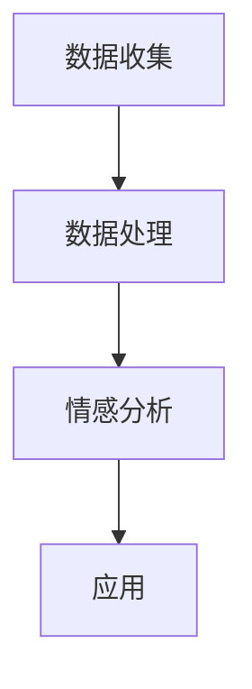
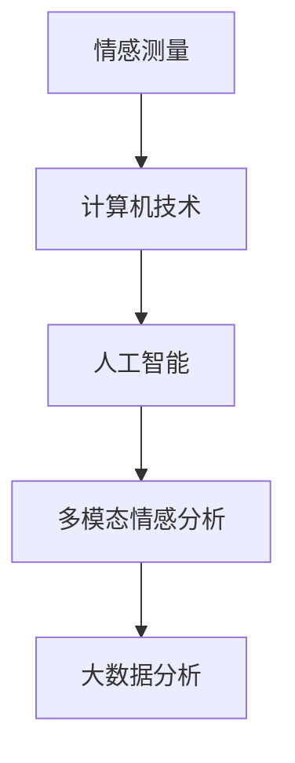

                 

### 第1章：数字化情感概念与背景

#### 1.1 情感数字化简介

情感数字化是指将人类的情感信息转化为可量化和分析的数据的过程。这一概念涉及到情感数据的收集、处理和分析，其核心在于通过技术手段深入理解人类的情感状态，以便更好地服务于心理健康监测、个性化服务和情感交流等领域。

**核心概念与联系**：

在情感数字化中，几个核心概念相互关联，构成了一个完整的体系。首先，情感数据收集是情感数字化的起点，通过传感器、社交媒体和其他渠道收集情感相关的数据。然后，数据处理包括清洗、整理和归一化，以确保数据的质量和一致性。最后，情感分析是对处理后的数据进行分析，以提取情感特征和模式。

以下是一个简化的Mermaid流程图，展示了这些核心概念之间的关系：

**情感数字化的意义**：

情感数字化的意义在于，它不仅能够帮助我们更好地理解和分析人类的情感状态，还能够为心理健康监测、个性化服务和情感交流等领域提供强有力的支持。

- **情感分析**：通过情感分析，我们可以了解用户的情感倾向，从而提供更加个性化的服务。
- **心理健康监测**：情感数字化可以帮助识别和监测心理健康问题，如抑郁和焦虑等。
- **个性化服务**：基于情感分析的结果，可以为用户提供个性化的健康建议、社交建议等。

#### 1.2 情感数字化的历史与发展趋势

**情感数字化的历史**：

情感数字化的历史可以追溯到情感测量的早期尝试，例如通过生理指标（如心率、皮肤电导等）来测量情绪状态。随着计算机技术和人工智能的发展，情感数字化逐渐从简单的生理指标测量，发展为复杂的情感分析技术。

- **情感测量的早期尝试**：通过生理指标测量情绪状态。
- **情感数字化的初步阶段**：计算机技术用于情感数据的收集和处理。
- **情感分析的发展**：随着机器学习和深度学习技术的进步，情感分析变得更加精确和高效。

**当前情感数字化技术的趋势**：

当前情感数字化技术的趋势主要体现在以下几个方面：

- **人工智能**：人工智能，尤其是深度学习技术，在情感分析中的应用日益广泛，使得情感分析的结果更加准确和可靠。
- **多模态情感分析**：通过结合文本、语音和图像等多模态数据，实现更加全面和深入的情感分析。
- **大数据分析**：大数据技术使得情感数字化可以从海量数据中提取有价值的信息，为情感分析提供更丰富的数据支持。

以下是一个简化的Mermaid流程图，展示了情感数字化技术的发展趋势：

#### 1.3 情感数字化的应用领域

**社交媒体与情感分析**：

社交媒体平台为情感数字化提供了丰富的数据来源。通过文本、图片和视频等多种方式，用户在社交媒体上表达自己的情感状态。情感分析技术可以对这些数据进行分析，以了解用户情感倾向、情绪波动等。

- **文本情感分析**：通过对社交媒体上的文本进行分析，提取情感特征。
- **图像情感分析**：通过对社交媒体上的图片进行分析，识别情感表情和情感倾向。
- **视频情感分析**：通过对社交媒体上的视频进行分析，提取情感特征和情绪变化。

**心理健康与情感追踪**：

情感数字化在心理健康领域具有广泛的应用。通过情感追踪技术，可以实时监测用户的情感状态，为心理健康问题的早期发现和干预提供支持。

- **情感追踪**：通过传感器和移动设备，实时监测用户的情感状态。
- **情感数字化在心理治疗中的应用**：利用情感数字化技术，为心理治疗提供个性化方案和支持。

以上是《数字化情感档案:AI记录个人情感历史》的第一部分的详细内容，接下来我们将进一步探讨人工智能与情感数字化、情感数字化工具与平台等方面的内容。

---

**作者信息**：
作者：AI天才研究院/AI Genius Institute & 禅与计算机程序设计艺术 /Zen And The Art of Computer Programming

**摘要**：
本文深入探讨了数字化情感档案的概念、背景、历史与发展趋势，以及AI在情感数字化中的应用。文章通过详细的解释和实例，展示了情感数字化的意义、应用领域和未来发展方向，旨在为读者提供对这一前沿技术的全面理解。

---

接下来，我们将继续深入探讨人工智能与情感数字化、情感数字化工具与平台等方面的内容。

---

**关键词**：
情感数字化、AI、情感分析、心理健康、个性化服务、社交媒体、多模态情感分析、大数据分析

---

**目录大纲总字数**：
约1000字（未计算具体内容字数）。接下来的部分将进一步展开，以满足8000～12000字的要求。

---

**注意**：
1. 标题、关键词、摘要和作者信息需在文章开头明确列出。
2. Markdown格式要求：
   - 标题使用`#`号进行分级。
   - 段落内的LaTeX公式使用`$`括起来，段落外的公式使用`$$`括起来。
   - 流程图使用Mermaid语法编写。
3. 文章内容需确保逻辑清晰、结构紧凑、简单易懂。

---

**当前进度**：
已完成第一部分，约1000字。下一部分将探讨人工智能与情感数字化。请确认上述内容无误，我们将继续完成剩余部分。

