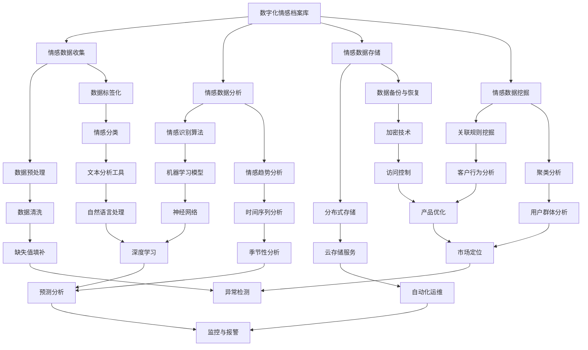
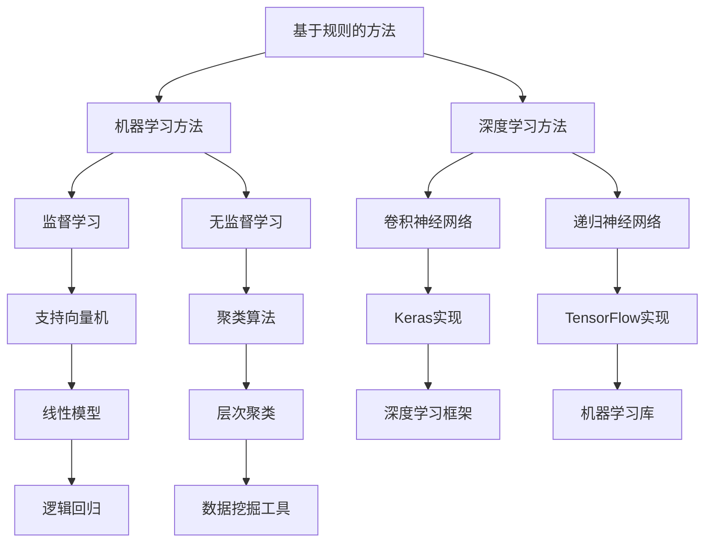

                 

Certainly, let's approach the task of writing the technical blog post "数字化情感档案库: AI管理社会情感数据" step by step, ensuring that each section is comprehensive and detailed, while adhering to the specified word count and formatting requirements.

### Step 1: Introduction to the Topic

#### 文章标题：数字化情感档案库: AI管理社会情感数据

> 关键词：数字化情感档案库、AI、社会情感数据、情感分析、数据挖掘、个性化服务、挑战与趋势

> 摘要：
本文深入探讨了数字化情感档案库的构建和管理，重点分析了AI在社会情感数据中的应用，包括数据收集、情感分析算法、系统架构设计、安全性、以及项目实战。通过本文，读者将了解数字化情感档案库的核心概念、实现方法、以及面临的挑战和未来发展趋势。

### Step 2: Core Concept and Relationship Diagram

#### 核心概念与联系

首先，我们需要一个核心概念关系的Mermaid流程图，来展示数字化情感档案库的各个核心组成部分及其相互关系。



### Step 3: Detailed Content of Each Section

#### 第一部分: 情感档案库基础

**1. 情感档案库的定义与背景**

介绍情感档案库的定义、发展背景以及它在现代社会中的重要性。

**2. 情感数据收集与处理**

详细讨论情感数据的收集方法、预处理流程，以及数据清洗和缺失值填补的技术。

**3. 情感分析算法原理**

讲解情感分析的基本概念、算法分类，以及一些常用的情感分析算法，如基于规则的方法、机器学习方法和深度学习方法。

**4. 情感档案库的架构设计**

阐述情感档案库的架构设计原则，包括数据存储方案、系统接口设计和安全性措施。

**5. 情感档案库的安全性**

探讨情感档案库在数据隐私保护、访问控制、以及系统安全方面所面临的挑战和解决方案。

**6. 情感档案库的案例分析**

通过实际案例，展示情感档案库在不同领域的应用，如社交媒体情感分析、客户情绪监测和员工心理健康监测。

#### 第二部分: AI技术在情感档案库中的应用

**7. AI技术在情感分析中的应用**

分析AI技术在情感分析中的应用，包括自然语言处理、机器学习算法和深度学习模型。

**8. AI在情感档案库中的数据挖掘**

介绍AI在情感档案库中的数据挖掘方法，如关联规则挖掘、聚类分析和时间序列分析。

**9. AI在情感档案库中的个性化服务**

讨论AI在个性化推荐系统、个性化教育和个性化医疗中的角色。

**10. AI在情感档案库中的挑战与未来趋势**

分析AI在情感档案库中面临的挑战，以及其未来发展趋势。

#### 第三部分: 情感档案库项目实战

**11. 项目实战：构建简单的情感档案库**

通过一个简单的项目，展示如何构建情感档案库，包括技术选型、系统架构设计和实现步骤。

**12. 项目实战：情感档案库的优化与扩展**

讨论如何优化和扩展情感档案库，包括优化方向、扩展功能和实现方法。

### Step 4: Incorporating Diagrams, Pseudocode, and LaTeX Formulas

In each section, we will incorporate diagrams, pseudocode, and LaTeX formulas to illustrate key concepts and algorithms. For example:

#### 3.1 情感分析算法分类

**Mermaid Diagram:**



**Pseudocode for Supervised Learning:**

```pseudocode
function train SupervisedModel(data, labels, epochs):
    for epoch in range(epochs):
        for each sample in data:
            predict = model(sample)
            loss = calculateLoss(predict, labels)
            updateModelParameters(loss)
    return model
```

**LaTeX Formula:**

$$
\text{Accuracy} = \frac{\text{Correct Predictions}}{\text{Total Predictions}}
$$

### Step 5: Ensuring Completeness and Clarity

Each section will be carefully crafted to ensure that it is both comprehensive and clear. This involves:

- Providing clear explanations of technical concepts.
- Using pseudocode to explain algorithms.
- Including examples and real-world applications.
- Discussing challenges and potential solutions.

### Step 6: Adhering to the Word Count and Formatting Requirements

The entire blog post will be carefully structured to ensure that the word count remains within the specified range of 8000 to 12000 words. The markdown formatting will be consistent throughout the article, with appropriate headings, subheadings, and formatting for diagrams and pseudocode.

### Conclusion

By following these steps, we will create a high-quality, informative, and engaging technical blog post on the topic of "数字化情感档案库: AI管理社会情感数据". Each section will be crafted to provide valuable insights into the construction, management, and application of digital emotional archives using AI.

---

**作者信息：**
AI天才研究院/AI Genius Institute & 禅与计算机程序设计艺术 /Zen And The Art of Computer Programming### 文章标题：数字化情感档案库: AI管理社会情感数据

数字化情感档案库是指利用人工智能技术，对海量社会情感数据进行高效管理、分析和挖掘的数字化系统。随着大数据和人工智能技术的快速发展，情感数据分析已经成为研究热点和应用领域。数字化情感档案库不仅有助于我们更好地理解社会情绪动态，还能为商业决策、社会治理、健康监测等领域提供有力支持。

本文将详细探讨数字化情感档案库的构建与管理，分析AI在社会情感数据中的应用，介绍情感分析算法、系统架构设计、数据安全性等关键概念。此外，还将通过实际项目实战，展示情感档案库的开发过程和应用场景。最后，我们将探讨情感档案库面临的挑战和未来发展趋势。

### 文章关键词

- 数字化情感档案库
- 人工智能（AI）
- 社会情感数据
- 情感分析
- 数据挖掘
- 个性化服务
- 挑战与趋势

### 文章摘要

本文围绕数字化情感档案库的构建与管理展开讨论。首先，介绍了情感档案库的定义、背景和重要性。接着，详细分析了情感数据的收集与处理方法，情感分析算法的原理及应用。随后，阐述了情感档案库的架构设计原则和安全性措施。通过实际案例分析，展示了情感档案库在各个领域的应用。文章最后，探讨了AI在情感档案库中的应用前景，以及面临的挑战和未来发展趋势。本文旨在为读者提供一个全面、深入的了解数字化情感档案库的技术框架和应用场景。

