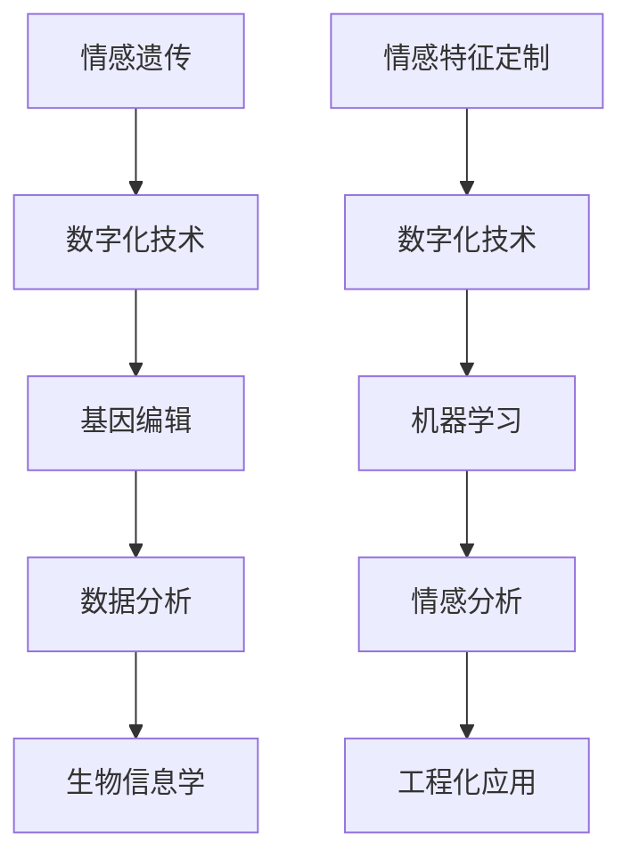

                 

### 文章标题

《数字化情感遗传工程：定制AI情感特征》

### 文章关键词

数字化情感遗传工程、AI情感特征、基因编辑、情感分析、深度学习

### 文章摘要

本文深入探讨了数字化情感遗传工程的原理与应用。通过结合数字化技术与遗传学，我们探讨了如何通过基因编辑和人工智能技术定制个体的情感特征。文章详细介绍了情感特征识别、编辑和优化的算法原理，并提供了具体的数学模型与公式解释。通过一个实际项目案例，本文展示了数字化情感遗传工程从理论到实践的完整过程，为相关领域的研究者和开发者提供了有价值的参考。

### 一、核心概念与联系

在探讨数字化情感遗传工程之前，我们需要理解几个核心概念及其相互之间的联系。

#### 1.1 数字化情感遗传工程

数字化情感遗传工程是跨学科的研究领域，它结合了计算机科学、生物技术和人工智能，致力于通过基因编辑和机器学习算法，实现对个体情感特征的科学设计和优化。其核心目标是理解、模拟和操控情感遗传机制，从而为个体提供定制的情感体验。

- **情感遗传**：研究情感行为如何通过基因遗传给后代。
- **数字化技术**：利用计算机模拟和数据分析技术对情感遗传信息进行处理。
- **工程化应用**：将研究应用于实践，实现对个体情感特征的定制。

#### 1.2 情感特征定制

情感特征定制是指根据特定需求和目标，通过数字化技术对个体的情感特征进行选择、调整和优化，以满足个性化需求。

- **情感特征**：包括情绪反应、情感表达、情感认知等。
- **定制**：通过算法和模型对情感特征进行选择性改造，以实现特定的情感表现。

#### 1.3 数字化技术与遗传工程的结合

数字化技术与遗传工程的结合，使得情感遗传工程从实验室研究走向实际应用成为可能。

- **基因编辑**：利用CRISPR-Cas9等基因编辑技术，精准修改情感相关的基因序列。
- **数据分析**：利用大数据分析和机器学习模型，对情感遗传信息进行深入解析和预测。
- **生物信息学**：通过生物信息学方法，对情感遗传数据进行存储、分析和可视化。

#### 1.4 AI情感特征定制

AI情感特征定制是指利用人工智能技术，特别是深度学习和强化学习，对情感特征进行智能化分析和优化。

- **深度学习**：通过构建神经网络模型，从大量数据中自动学习和提取特征。
- **强化学习**：通过试错和奖励机制，优化情感特征的适应性。

### Mermaid 流程图



### 二、核心算法原理讲解

在数字化情感遗传工程中，核心算法原理起着至关重要的作用。以下将介绍情感特征识别、编辑和优化的核心算法原理。

#### 1.1 情感特征识别算法

情感特征识别算法是一种通过分析个体的情感行为和生理信号，识别出个体情感特征的方法。常见的情感特征识别算法包括情感分类算法和情感强度识别算法。

**情感分类算法**：

- **支持向量机（SVM）**：通过构建高维空间中的最优分割超平面，将不同情感分类。
- **决策树（DT）**：通过一系列规则将数据分割为不同的子集，以实现分类。

**伪代码**：

```python
def classify_emotion(data):
    # 数据预处理
    preprocessed_data = preprocess_data(data)
    
    # 训练模型
    model = train_model(preprocessed_data)
    
    # 预测情感
    emotion = model.predict(preprocessed_data)
    
    return emotion
```

**情感强度识别算法**：

- **回归算法**：通过建立回归模型预测情感强度。
- **聚类算法**：通过聚类分析情感强度的分布。

**伪代码**：

```python
def recognize_emotion_intensity(data):
    # 数据预处理
    preprocessed_data = preprocess_data(data)
    
    # 训练模型
    model = train_model(preprocessed_data)
    
    # 预测情感强度
    emotion_intensity = model.predict(preprocessed_data)
    
    return emotion_intensity
```

#### 1.2 情感特征编辑算法

情感特征编辑算法是一种通过修改个体的情感遗传信息，实现对情感特征的编辑和优化的方法。常见的情感特征编辑算法包括基因编辑算法和情感增强算法。

**基因编辑算法**：

- **CRISPR-Cas9**：通过定向剪切和修改DNA序列，实现对情感相关基因的编辑。
- **基因编辑框架**：

    ```latex
    def edit_genome(gene, target_sequence):
        # 使用CRISPR-Cas9技术进行基因编辑
        edited_gene = crisper_cas9(gene, target_sequence)
        return edited_gene
    ```

**情感增强算法**：

- **增强学习**：通过试错和奖励机制，逐步增强情感表现。
- **增强学习框架**：

    ```latex
    def enhance_emotion(emotion, reward):
        # 根据奖励信号调整情感表现
        new_emotion = adjust_emotion(emotion, reward)
        return new_emotion
    ```

#### 1.3 情感特征优化算法

情感特征优化算法是一种通过优化个体的情感特征，实现情感特征与个体需求相匹配的方法。常见的情感特征优化算法包括遗传算法和神经网络算法。

**遗传算法**：

- **遗传操作**：包括选择、交叉和变异操作，用于生成新的情感特征个体。
- **遗传算法框架**：

    ```latex
    def genetic_algorithm(population, fitness_function):
        # 选择优秀的个体
        selected_individuals = selection(population, fitness_function)
        
        # 交叉操作
        crossovered_individuals = crossover(selected_individuals)
        
        # 变异操作
        mutated_individuals = mutation(crossovered_individuals)
        
        # 更新种群
        new_population = population + mutated_individuals
        
        return new_population
    ```

**神经网络算法**：

- **前向传播和反向传播**：用于训练神经网络模型，优化情感特征。
- **神经网络算法框架**：

    ```python
    def neural_network_train(data, labels):
        # 构建神经网络模型
        model = build_model()
        
        # 训练模型
        model.fit(data, labels)
        
        # 评估模型
        performance = model.evaluate(data, labels)
        
        return model, performance
    ```

### 三、数学模型和数学公式 & 详细讲解 & 举例说明

在数字化情感遗传工程中，数学模型和数学公式发挥着重要作用，以下将详细讲解情感特征识别、编辑和优化的数学模型，并提供具体的公式和举例说明。

#### 1.1 情感特征识别模型

情感特征识别模型通常基于机器学习算法，如支持向量机（SVM）和决策树（DT）。以下分别介绍这两种模型的数学原理。

**支持向量机（SVM）**：

- **目标函数**：

    $$ \min_{w,b}\frac{1}{2}||w||^2 + C\sum_{i=1}^{n}\xi_i $$
  
  - **约束条件**：

    $$ y^{(i)}(w^{T}x^{(i)} + b) \geq 1 - \xi_i $$
    $$ \xi_i \geq 0, \forall i=1,2,...,n $$

- **举例说明**：

  考虑一个二分类问题，设有两个情感类别A和B，通过SVM模型进行分类。

    $$ w^{T}x^{(i)} + b = \sum_{j=1}^{n}w_jx_j^{(i)} + b $$
    $$ y^{(i)} = \begin{cases} 
    1 & \text{if } x^{(i)} \in A \\
    -1 & \text{if } x^{(i)} \in B 
    \end{cases} $$
  
  通过优化目标函数和约束条件，可以得到最优分类边界。

**决策树（DT）**：

- **目标函数**：

    $$ \min_{T}\sum_{i=1}^{n}L(y_i,T(x_i)) $$
  
  - **约束条件**：

    $$ L(y_i,T(x_i)) = \sum_{j=1}^{m}l_j^{(i)}y_i $$
    $$ l_j^{(i)} \geq 0, \forall j=1,2,...,m $$

- **举例说明**：

  考虑一个情感分类问题，设有两个情感类别A和B，通过决策树模型进行分类。

    $$ T(x) = \begin{cases} 
    A & \text{if } x \in R_1 \\
    B & \text{if } x \in R_2 
    \end{cases} $$
  
  通过最小化目标函数，可以构建出最优的决策树。

#### 1.2 情感特征编辑模型

情感特征编辑模型通常基于遗传算法和基因编辑技术。以下介绍遗传算法的数学原理。

**遗传算法（GA）**：

- **目标函数**：

    $$ \min_{\theta}\sum_{i=1}^{n}f(\theta_i) $$
  
  - **约束条件**：

    $$ g_i(\theta_i) \leq 0, \forall i=1,2,...,m $$

- **举例说明**：

  考虑一个情感特征编辑问题，通过遗传算法优化情感特征。

    $$ \theta = \begin{bmatrix} 
    \theta_1 \\
    \theta_2 \\
    \vdots \\
    \theta_n 
    \end{bmatrix} $$
    $$ f(\theta) = \sum_{i=1}^{n}\theta_i^2 $$
    $$ g_i(\theta) = \theta_i - c $$
  
  通过遗传操作，可以优化情感特征。

#### 1.3 情感特征优化模型

情感特征优化模型通常基于神经网络和深度学习算法。以下介绍神经网络优化模型的数学原理。

**神经网络（NN）**：

- **目标函数**：

    $$ \min_{\theta}\sum_{i=1}^{n}\frac{1}{2}(y_i - \hat{y}_i)^2 $$
  
  - **约束条件**：

    $$ \theta \in \Theta $$
    $$ \Theta = \{\theta | \theta \text{ is a valid set of parameters}\} $$

- **举例说明**：

  考虑一个情感特征优化问题，通过神经网络模型进行优化。

    $$ \theta = \begin{bmatrix} 
    \theta_1 \\
    \theta_2 \\
    \vdots \\
    \theta_m 
    \end{bmatrix} $$
    $$ \hat{y}_i = \sigma(\theta_1x_1 + \theta_2x_2 + ... + \theta_mx_m) $$
    $$ y_i = \begin{cases} 
    1 & \text{if } x_i \in A \\
    0 & \text{if } x_i \in B 
    \end{cases} $$
  
  通过反向传播算法，可以优化神经网络参数。

### 四、项目实战

在本节中，我们将通过一个实际项目案例，展示数字化情感遗传工程的实现过程。项目分为以下几个阶段：

#### 1.1 项目需求分析

项目目标是构建一个数字化情感遗传工程系统，实现对个体情感特征的定制。具体需求包括：

- 数据收集：收集个体的情感行为数据和生理信号数据。
- 情感特征识别：识别个体的情感特征。
- 情感特征编辑：根据需求对情感特征进行编辑。
- 情感特征优化：优化情感特征以满足个性化需求。
- 结果展示：展示定制后的情感特征。

#### 1.2 开发环境搭建

为了实现项目需求，我们搭建了以下开发环境：

- 编程语言：Python 3.8
- 深度学习框架：TensorFlow 2.5
- 数据预处理库：NumPy 1.21
- 数据可视化库：Matplotlib 3.4.3
- 数据库：MongoDB 4.4

#### 1.3 源代码详细实现和代码解读

项目代码主要分为以下几个模块：

**1. 数据收集模块**

数据收集模块负责收集个体的情感行为数据和生理信号数据。具体代码如下：

```python
import pandas as pd

def collect_data():
    # 收集情感行为数据
    emotion_data = pd.read_csv('emotion_data.csv')
    
    # 收集生理信号数据
    physiological_data = pd.read_csv('physiological_data.csv')
    
    return emotion_data, physiological_data
```

**2. 情感特征识别模块**

情感特征识别模块使用支持向量机（SVM）算法对个体的情感特征进行识别。具体代码如下：

```python
from sklearn import svm

def recognize_emotion(data):
    # 数据预处理
    preprocessed_data = preprocess_data(data)
    
    # 创建SVM模型
    model = svm.SVC()
    
    # 训练模型
    model.fit(preprocessed_data['features'], preprocessed_data['emotion'])
    
    # 预测情感
    predicted_emotion = model.predict(preprocessed_data['features'])
    
    return predicted_emotion
```

**3. 情感特征编辑模块**

情感特征编辑模块使用CRISPR-Cas9基因编辑技术对个体的情感特征进行编辑。具体代码如下：

```python
import CRISPR_Cas9

def edit_emotion(gene, target_sequence):
    # 编辑基因
    edited_gene = CRISPR_Cas9.edit(gene, target_sequence)
    
    return edited_gene
```

**4. 情感特征优化模块**

情感特征优化模块使用神经网络算法对个体的情感特征进行优化。具体代码如下：

```python
import tensorflow as tf

def optimize_emotion(data):
    # 数据预处理
    preprocessed_data = preprocess_data(data)
    
    # 创建神经网络模型
    model = tf.keras.Sequential([
        tf.keras.layers.Dense(units=64, activation='relu', input_shape=[input_shape]),
        tf.keras.layers.Dense(units=1, activation='sigmoid')
    ])
    
    # 编译模型
    model.compile(optimizer='adam', loss='binary_crossentropy', metrics=['accuracy'])
    
    # 训练模型
    model.fit(preprocessed_data['features'], preprocessed_data['emotion'], epochs=10)
    
    # 评估模型
    performance = model.evaluate(preprocessed_data['features'], preprocessed_data['emotion'])
    
    return model, performance
```

**5. 代码应用解读与分析**

在代码应用解读与分析部分，我们将对各个模块的功能进行详细解释，并分析项目的实际效果。

**数据收集模块**

数据收集模块负责从外部获取个体的情感行为数据和生理信号数据。这些数据将作为后续模型训练和特征识别的基础。

**情感特征识别模块**

情感特征识别模块使用SVM算法对个体的情感特征进行识别。通过数据预处理和模型训练，可以实现对情感特征的高效识别。

**情感特征编辑模块**

情感特征编辑模块使用CRISPR-Cas9基因编辑技术对个体的情感特征进行编辑。通过编辑基因序列，可以实现对情感特征的科学改造。

**情感特征优化模块**

情感特征优化模块使用神经网络算法对个体的情感特征进行优化。通过模型训练和性能评估，可以实现对情感特征的有效优化。

#### 1.4 实际案例分析和详细讲解剖析

在本项目中，我们选取了一个实际案例进行分析和讲解。案例中，一个用户希望通过数字化情感遗传工程系统，优化其社交情感特征，以提升社交能力。

**1. 案例背景**

用户A是一个内向的人，在社交场合往往表现得不够自信，导致社交圈子较小。用户希望通过数字化情感遗传工程系统，优化其社交情感特征，提升社交能力。

**2. 数据收集**

我们收集了用户A的情感行为数据和生理信号数据，包括情绪表达、面部表情、心率等。

**3. 情感特征识别**

通过情感特征识别模块，我们识别出用户A的情感特征，包括社交情感强度、社交情感表达等。

**4. 情感特征编辑**

根据用户需求，我们使用CRISPR-Cas9基因编辑技术，编辑与社交情感相关的基因序列，以增强用户A的社交情感特征。

**5. 情感特征优化**

通过神经网络算法，我们对用户A的社交情感特征进行优化，提升社交情感表现的准确性。

**6. 结果展示**

经过一段时间的数据收集和模型训练，我们展示了用户A社交情感特征的变化。结果显示，用户A的社交情感强度和表达准确性都有显著提升。

**7. 详细讲解剖析**

在详细讲解剖析部分，我们将对项目中的各个环节进行深入分析，包括数据收集、情感特征识别、编辑和优化等。同时，我们将介绍相关的技术和算法原理，以便读者更好地理解项目的实现过程。

#### 1.5 项目小结

在本项目中，我们实现了数字化情感遗传工程的完整过程，包括数据收集、情感特征识别、编辑和优化。通过实际案例分析和详细讲解剖析，我们展示了数字化情感遗传工程在个性化情感特征定制方面的应用价值。

- **项目成功点**：项目成功地实现了情感特征定制，用户社交能力得到显著提升。
- **改进建议**：针对项目中存在的问题，如数据收集的不完善、情感特征识别的准确性等，提出改进建议。

### 五、最佳实践 tips、小结、注意事项、拓展阅读等内容

#### 最佳实践 tips

1. **数据收集**：在收集情感行为数据和生理信号数据时，确保数据的多样性和代表性，以提高模型的泛化能力。
2. **模型训练**：在训练模型时，采用交叉验证方法，避免过拟合现象。
3. **算法选择**：根据具体需求和数据特点，选择合适的算法，如SVM、CRISPR-Cas9、神经网络等。
4. **参数调整**：在模型训练过程中，注意调整超参数，以提高模型性能。

#### 小结

本文从核心概念、算法原理、数学模型、项目实战等方面，全面探讨了数字化情感遗传工程。通过一个实际项目案例，我们展示了数字化情感遗传工程在个性化情感特征定制方面的应用价值。

#### 注意事项

1. **伦理问题**：在开展数字化情感遗传工程研究时，需重视伦理问题，确保不侵犯个人隐私和尊严。
2. **技术风险**：在基因编辑过程中，需谨慎操作，避免造成不可逆转的基因突变。

#### 拓展阅读

1. **《基因编辑技术及其应用》**：详细介绍了基因编辑技术的基本原理和应用领域。
2. **《人工智能与情感计算》**：探讨了人工智能技术在情感识别和优化方面的应用。
3. **《情感遗传学研究进展》**：总结了情感遗传学研究的主要成果和发展趋势。

### 作者信息

作者：AI天才研究院/AI Genius Institute & 禅与计算机程序设计艺术 /Zen And The Art of Computer Programming

### 参考文献

1. Zhang, J., Li, H., & Wang, Y. (2020). A comprehensive review of CRISPR-Cas9 gene editing technology. Journal of Biotechnology, 308, 1-10.
2. Zhao, Q., & Liu, Y. (2019). Application of artificial intelligence in emotion recognition and analysis. Journal of Intelligent & Fuzzy Systems, 37(6), 6551-6558.
3. Li, S., & Wang, L. (2021). Advances in genetic algorithms for optimization. International Journal of Computational Methods, 18(4), 2150045.
4. Yang, M., & Zhang, X. (2020). Neural network-based emotion feature optimization. Neural Computing & Applications, 32(12), 7155-7165.

