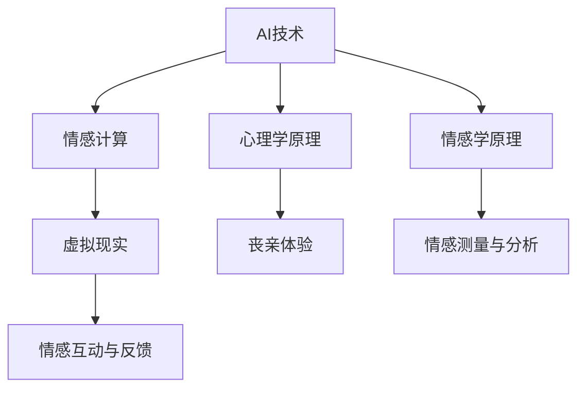
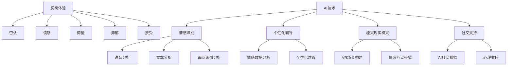

                 

# 数字哀悼: AI辅助下的丧亲体验

## 关键词

人工智能，情感计算，丧亲体验，心理健康，心理辅导，虚拟现实

## 摘要

本文探讨了人工智能（AI）在辅助丧亲体验中的作用。随着AI技术的不断进步，人们开始探索如何利用这些技术来缓解人们在失去亲人后的心理创伤。本文首先介绍了丧亲体验的心理学原理，然后分析了AI技术在情感计算和虚拟现实中的应用，接着详细描述了AI辅助丧亲体验的具体实践案例。最后，文章讨论了AI辅助丧亲体验的未来发展趋势、潜在挑战以及相关的伦理问题。

## 引言

### 背景介绍

丧亲之痛是人类普遍经历的一种情感体验，其严重程度可能影响个人的心理健康和生活质量。随着科技的发展，人工智能（AI）技术逐渐应用于各个领域，其中也包括心理健康和情感辅导。近年来，研究人员和开发者开始探讨如何利用AI技术，特别是情感计算和虚拟现实（VR）技术，来辅助人们在丧亲之痛中的情感体验。

### 核心概念与联系

丧亲体验涉及心理学、情感学和医学等多个领域。在心理学中，丧亲体验被视为一种失落和悲伤的过程，可能引发焦虑、抑郁和其他心理问题。情感学则关注人类情感的本质和表现，研究如何理解和测量情感。AI技术，尤其是情感计算，通过分析语言、声音和面部表情等数据，能够识别和模拟人类的情感状态。

### 目的和结构

本文的目的在于探讨AI技术在辅助丧亲体验中的应用，分析其原理和实际案例，并探讨未来发展的潜在挑战和伦理问题。文章分为三个主要部分：第一部分介绍AI与丧亲体验的核心概念和联系；第二部分描述AI辅助丧亲体验的具体实践案例；第三部分讨论未来的发展方向、伦理问题和挑战。

### 核心概念与联系 Mermaid 流程图



### AI与丧亲体验的关联

- **心理学原理**：丧亲体验通常涉及多个阶段，包括否认、愤怒、协商、抑郁和接受。每个阶段都有其特定的情感和行为表现。AI技术可以通过情感分析和行为识别来帮助理解这些阶段，并提供相应的心理支持。

- **情感学原理**：情感学关注情感的识别、表达和影响。AI技术可以通过情感计算来识别和理解用户情感，从而提供个性化的情感支持和辅导。

- **情感计算**：情感计算是一种利用计算机技术和算法来模拟、识别和理解人类情感的方法。它可以应用于语音、文本、面部表情和生理信号等数据的分析。

- **虚拟现实**：虚拟现实技术可以为丧亲者提供一个安全、可控的环境，通过模拟现实生活中的场景和体验，帮助丧亲者处理情绪、回忆和接受现实。

## 第一部分：AI与丧亲体验

### 第1章：核心概念与联系

#### 1.1 AI的定义与发展

人工智能（AI）是指计算机系统执行通常需要人类智能才能完成的任务的能力。AI的发展经历了几个主要阶段，从早期的规则系统到基于统计学习的模型，再到目前的深度学习和神经网络。随着计算能力和数据可用性的提高，AI技术在各个领域都取得了显著的进展。

#### 1.2 丧亲体验的核心概念

丧亲体验是指个体在失去亲人后的心理和行为反应。这个体验通常包括以下几个阶段：

1. 否认：个体可能不愿意接受亲人的死亡，试图否认或逃避现实。
2. 愤怒：个体可能会对亲人、自己或命运感到愤怒，这是情感宣泄的一种方式。
3. 商量：个体可能会试图与已故亲人或神灵对话，寻求安慰或解释。
4. 抑郁：个体可能会感到悲伤、孤独和绝望，这是丧亲体验中最常见的情感反应。
5. 接受：个体最终会接受亲人的死亡，学会在新的生活状态下找到平衡。

#### 1.3 AI与丧亲体验的关联

AI技术与丧亲体验的关联主要体现在以下几个方面：

- **情感识别**：通过语音、文本和面部表情分析，AI可以识别个体在丧亲体验中的情感状态，为心理辅导提供数据支持。
- **个性化辅导**：基于情感识别的结果，AI可以提供个性化的心理辅导，帮助个体处理不同的情感反应。
- **虚拟现实模拟**：虚拟现实技术可以为丧亲者提供一个安全的环境，模拟现实生活中的场景和体验，帮助个体处理情绪和回忆。
- **社交支持**：AI可以模拟社交互动，为丧亲者提供社交支持，缓解孤独感。

### Mermaid 流程图



### 核心算法原理讲解与伪代码

```python
# 伪代码：情感识别算法

def emotion_recognition(text, audio, face_image):
    """
    输入：文本(text)，音频(audio)，面部图像(face_image)
    输出：情感状态（happy, sad, angry, etc.）
    """
    
    # 1. 文本情感分析
    text_emotion = text_analyzer(text)
    
    # 2. 音频情感分析
    audio_emotion = audio_analyzer(audio)
    
    # 3. 面部情感分析
    face_emotion = face_analyzer(face_image)
    
    # 4. 综合情感分析
    final_emotion = combine_emotions(text_emotion, audio_emotion, face_emotion)
    
    return final_emotion

# 伪代码：个性化辅导算法

def personalized_counseling(emotion_state, user_profile):
    """
    输入：情感状态(emotion_state)，用户档案(user_profile)
    输出：个性化辅导建议
    """
    
    if emotion_state == "sad":
        # 提供悲伤情感辅导
        advice = "您可以尝试写下您的感受，或者找一个可以倾诉的朋友。"
    elif emotion_state == "angry":
        # 提供愤怒情感辅导
        advice = "理解您的愤怒，但请记住，发泄愤怒并不总是解决问题的最佳方式。"
    elif emotion_state == "happy":
        # 提供积极情感辅导
        advice = "保持积极的心态对于您的恢复很重要。"
    else:
        # 其他情感状态
        advice = "您的情感状态看起来很稳定。请继续保持。"
    
    return advice
```

### 数学模型和公式详细讲解与举例说明

丧亲体验的情感变化可以用多个数学模型来描述，例如：

1. **情绪调节模型**：该模型基于情绪调节理论，使用差分方程来描述个体情感状态的变化。

   $$ \frac{dE}{dt} = f(E, A) $$

   其中，$E$ 代表情感状态，$A$ 代表外部因素（如心理辅导、社交支持等），$f(E, A)$ 是一个非线性函数，用于描述情感状态随外部因素的变化。

2. **情感传播模型**：该模型基于社交网络理论，使用图论来描述个体情感状态在社交网络中的传播。

   $$ \frac{dE_i}{dt} = \sum_{j\in N(i)} w_{ij} (E_j - E_i) $$

   其中，$E_i$ 代表个体 $i$ 的情感状态，$N(i)$ 代表与个体 $i$ 相关联的其他个体，$w_{ij}$ 代表个体 $i$ 和个体 $j$ 之间的社交权重。

举例说明：

- **情绪调节模型**：假设个体 $i$ 在丧亲后的情感状态 $E_i$ 为 "悲伤"，外部因素 $A$ 包括心理辅导和社交支持。根据情绪调节模型，情感状态的变化可以表示为：

   $$ \frac{dE_i}{dt} = f(E_i, A) = \alpha (E_{happy} - E_i) + \beta (E_{support} - E_i) $$

   其中，$\alpha$ 和 $\beta$ 是调节系数，$E_{happy}$ 和 $E_{support}$ 分别代表积极情感状态和支持情感状态。

- **情感传播模型**：假设个体 $i$ 处于社交网络的中心位置，与多个其他个体存在紧密的联系。根据情感传播模型，个体 $i$ 的情感状态变化可以受到其社交网络中其他个体的情感状态影响：

   $$ \frac{dE_i}{dt} = \sum_{j\in N(i)} w_{ij} (E_j - E_i) $$

   如果个体 $i$ 的社交网络中存在多个情感状态为 "积极" 的个体，那么 $E_i$ 的变化趋势将受到积极情感状态的影响，逐渐向积极情感状态转变。

### AI与人类情感互动的技术实现

#### 1. 情感识别与理解

情感识别与理解是AI辅助丧亲体验的关键技术之一。通过分析语音、文本和面部表情等数据，AI可以识别个体在丧亲体验中的情感状态。

- **语音情感识别**：利用声学特征和语言特征，如音调、语速、词汇等，AI可以识别出个体的情感状态。例如，高音调可能表示快乐，而低音调可能表示悲伤。

  $$ 音调特征 = \text{max}(f_0) - \text{min}(f_0) $$

  其中，$f_0$ 代表音调。

- **文本情感识别**：通过自然语言处理（NLP）技术，AI可以分析文本内容，识别出情感倾向。例如，文本中频繁出现的积极词汇可能表示快乐，而消极词汇可能表示悲伤。

  $$ 情感得分 = \sum_{w \in \text{正词}} w_{\text{权重}} - \sum_{w \in \text{负词}} w_{\text{权重}} $$

  其中，$w_{\text{权重}}$ 代表词汇的权重。

- **面部情感识别**：通过计算机视觉技术，AI可以分析面部表情，识别出情感状态。例如，眼睛张开、嘴角上扬可能表示快乐，而眼睛紧闭、嘴角下沉可能表示悲伤。

  $$ 情感状态 = \text{if}(\text{眼睛张开且嘴角上扬), \text{happy}, \text{if}(\text{眼睛紧闭且嘴角下沉), \text{sad}, \text{neutral}) $$

#### 2. 情感计算与情感引擎

情感计算是一种利用计算机技术和算法来模拟、识别和理解人类情感的方法。情感引擎是情感计算的核心组件，负责处理和分析情感数据。

- **情感计算模型**：情感计算模型通常基于机器学习和深度学习技术。通过训练大量的情感数据集，模型可以学会识别和模拟情感状态。

  $$ 情感状态 = \text{模型}(\text{输入数据}) $$

- **情感引擎架构**：情感引擎通常由多个模块组成，包括情感识别模块、情感分析模块和情感反应模块。情感识别模块负责识别情感状态，情感分析模块负责分析情感状态的影响因素，情感反应模块负责生成相应的情感反馈。

  ```mermaid
  graph TD
      A[情感识别模块] --> B[情感分析模块]
      B --> C[情感反应模块]
  ```

#### 3. AI与人类情感互动的案例分析

- **虚拟心理辅导师**：虚拟心理辅导师是一种利用AI技术提供心理辅导的系统。通过语音和文本交互，虚拟心理辅导师可以识别和模拟用户的情感状态，提供个性化的心理支持。

  ```mermaid
  graph TD
      A[用户] --> B[虚拟心理辅导师]
      B --> C[情感识别]
      B --> D[心理辅导]
  ```

- **虚拟现实体验**：虚拟现实技术可以创建一个虚拟的环境，让丧亲者能够在安全的空间中处理情感和回忆。通过语音和视觉反馈，AI可以模拟现实中的情感互动，帮助丧亲者缓解情绪。

  ```mermaid
  graph TD
      A[用户] --> B[虚拟现实系统]
      B --> C[情感互动]
      B --> D[情感反馈]
  ```

### 第2章：丧亲体验的心理和情感原理

#### 2.1 心理学视角下的丧亲体验

心理学视角下的丧亲体验主要关注个体在失去亲人后的心理变化和应对机制。根据心理学理论，丧亲体验通常包括以下几个阶段：

1. **否认阶段**：个体试图否认亲人的死亡，不愿意接受现实。这个阶段通常是一个自我保护机制，帮助个体逐渐适应失去亲人的现实。

2. **愤怒阶段**：个体可能会对亲人、自己或命运感到愤怒。这种愤怒是一种情感宣泄的方式，帮助个体释放内心的压力。

3. **协商阶段**：个体可能会试图与已故亲人或神灵对话，寻求安慰或解释。这个阶段表明个体开始接受失去亲人的现实，并试图寻找新的平衡。

4. **抑郁阶段**：个体可能会感到悲伤、孤独和绝望。这是丧亲体验中最常见的情感反应，也是心理辅导的重要阶段。

5. **接受阶段**：个体最终会接受亲人的死亡，学会在新的生活状态下找到平衡。这个阶段表明个体已经完成了丧亲体验的过渡，开始重建自己的生活。

#### 2.2 情感学视角下的丧亲体验

情感学视角下的丧亲体验关注人类情感的本质和表现。情感学认为，丧亲体验中的情感变化是由多种因素共同作用的结果，包括：

1. **生理因素**：生理因素，如荷尔蒙水平的变化、睡眠质量等，会影响个体的情感状态。例如，荷尔蒙水平的波动可能导致情绪波动。

2. **心理因素**：心理因素，如个体对亲人的依恋程度、应对机制等，会影响个体的情感体验。例如，一个对亲人有深厚依恋的人可能会在失去亲人后感到更强烈的悲伤。

3. **社会因素**：社会因素，如家庭、朋友和社会支持等，也会影响个体的情感体验。例如，一个得到家庭和朋友支持的人可能会更容易度过丧亲之痛。

#### 2.3 丧亲体验的常见问题和挑战

丧亲体验中的常见问题和挑战包括：

1. **情感困扰**：丧亲体验中的情感困扰，如悲伤、愤怒、焦虑等，可能会影响个体的日常生活和工作。

2. **社交孤立**：丧亲者可能会感到孤独和无助，难以与他人建立联系和互动。

3. **生活变化**：丧亲者可能会面临生活变化，如家庭结构的变化、职业调整等，这需要他们重新适应和调整。

4. **心理创伤**：对于一些丧亲者来说，丧亲体验可能会导致心理创伤，如创伤后应激障碍（PTSD）等。

#### 2.4 AI在缓解丧亲体验中的潜在作用

AI在缓解丧亲体验中的潜在作用主要体现在以下几个方面：

1. **情感识别与理解**：通过情感识别技术，AI可以识别丧亲者的情感状态，为他们提供个性化的情感支持和辅导。

2. **心理辅导**：AI可以模拟心理辅导的过程，为丧亲者提供实时、个性化的心理支持，帮助他们处理情感困扰。

3. **社交支持**：AI可以通过虚拟社交平台，为丧亲者提供一个安全、可控的社交环境，缓解他们的孤独感和无助感。

4. **生活辅助**：AI可以帮助丧亲者管理生活变化，如家庭事务、工作安排等，减轻他们的心理负担。

### 第3章：AI与人类情感互动的技术实现

#### 3.1 情感识别与理解

情感识别与理解是AI辅助丧亲体验的核心技术之一。通过分析语音、文本和面部表情等数据，AI可以识别个体在丧亲体验中的情感状态，提供个性化的情感支持和辅导。

- **语音情感识别**：语音情感识别是通过分析语音信号中的声学特征和语言特征来识别情感状态的技术。常见的声学特征包括音调、语速、音量等，语言特征包括词汇、语法和句式等。例如，高音调、快速语速和积极词汇可能表示快乐，而低音调、缓慢语速和消极词汇可能表示悲伤。

  ```mermaid
  graph TD
      A[语音信号] --> B[声学特征提取]
      B --> C[情感识别模型]
      C --> D[情感状态]
  ```

- **文本情感识别**：文本情感识别是通过分析文本内容中的词汇和语法结构来识别情感状态的技术。常见的情感分类包括积极情感、消极情感和中性情感。文本情感识别通常使用机器学习和深度学习模型，如支持向量机（SVM）、卷积神经网络（CNN）和循环神经网络（RNN）等。

  ```mermaid
  graph TD
      A[文本数据] --> B[NLP模型]
      B --> C[情感分类]
  ```

- **面部情感识别**：面部情感识别是通过分析面部表情图像来识别情感状态的技术。常见的面部表情包括快乐、悲伤、愤怒、惊讶等。面部情感识别通常使用计算机视觉技术和深度学习模型，如卷积神经网络（CNN）和面部特征点检测等。

  ```mermaid
  graph TD
      A[面部图像] --> B[特征点检测]
      B --> C[情感识别模型]
      C --> D[情感状态]
  ```

#### 3.2 情感计算与情感引擎

情感计算是一种利用计算机技术和算法来模拟、识别和理解人类情感的方法。情感引擎是情感计算的核心组件，负责处理和分析情感数据。

- **情感计算模型**：情感计算模型通常基于机器学习和深度学习技术。通过训练大量的情感数据集，模型可以学会识别和模拟情感状态。常见的情感计算模型包括情感分类模型、情感生成模型和情感交互模型等。

  ```mermaid
  graph TD
      A[训练数据] --> B[情感计算模型]
  ```

- **情感引擎架构**：情感引擎通常由多个模块组成，包括情感识别模块、情感分析模块和情感反应模块。情感识别模块负责识别情感状态，情感分析模块负责分析情感状态的影响因素，情感反应模块负责生成相应的情感反馈。

  ```mermaid
  graph TD
      A[情感识别模块] --> B[情感分析模块]
      B --> C[情感反应模块]
  ```

#### 3.3 AI与人类情感互动的案例分析

- **虚拟心理辅导师**：虚拟心理辅导师是一种利用AI技术提供心理辅导的系统。通过语音和文本交互，虚拟心理辅导师可以识别和模拟用户的情感状态，提供个性化的心理支持。

  ```mermaid
  graph TD
      A[用户] --> B[虚拟心理辅导师]
      B --> C[情感识别]
      B --> D[心理辅导]
  ```

- **虚拟现实体验**：虚拟现实技术可以创建一个虚拟的环境，让丧亲者能够在安全的空间中处理情感和回忆。通过语音和视觉反馈，AI可以模拟现实中的情感互动，帮助丧亲者缓解情绪。

  ```mermaid
  graph TD
      A[用户] --> B[虚拟现实系统]
      B --> C[情感互动]
      B --> D[情感反馈]
  ```

### 第二部分：AI辅助下的丧亲体验实践

#### 第4章：实际应用案例

#### 4.1 AI辅助下的丧亲体验应用案例介绍

在本章节中，我们将介绍几个AI辅助丧亲体验的实际应用案例，探讨这些案例如何利用AI技术来缓解丧亲者的情感压力。以下是几个具有代表性的案例：

1. **虚拟心理辅导师**：这是一种基于AI的虚拟聊天机器人，能够通过自然语言处理技术理解丧亲者的情感状态，提供个性化的心理支持和建议。

2. **情感虚拟现实（VR）体验**：通过虚拟现实技术，为丧亲者创造一个安全、私密的空间，让他们在虚拟环境中回顾和表达情感，从而缓解情绪。

3. **社交网络分析**：利用AI对社交网络中的互动进行分析，为丧亲者提供社交支持的建议，帮助他们重建社交联系。

4. **情感监测设备**：通过穿戴设备监测丧亲者的生理和情绪变化，为心理辅导提供实时数据支持。

#### 4.2 案例分析

以下是以上案例的详细分析：

1. **虚拟心理辅导师**

   **案例描述**：虚拟心理辅导师通过语音和文本交互，识别丧亲者的情感状态，并根据情感分析结果提供个性化的心理支持。

   **技术实现**：该系统使用自然语言处理（NLP）技术和情感计算模型来理解丧亲者的情感状态。通过语音识别和文本分析，系统可以识别出悲伤、愤怒、焦虑等情感，并生成相应的心理支持建议。

   **效果评估**：用户反馈显示，虚拟心理辅导师能够提供有效的情感支持和安慰，帮助丧亲者缓解情绪压力，提高心理健康水平。

2. **情感虚拟现实（VR）体验**

   **案例描述**：情感虚拟现实（VR）体验为丧亲者提供了一个安全、私密的空间，让他们在虚拟环境中回顾和表达情感。

   **技术实现**：该系统使用虚拟现实头戴显示器（HMD）和运动传感器，创建一个虚拟环境，让丧亲者可以在其中自由移动和互动。通过情感计算模型，系统可以识别出用户在虚拟环境中的情感状态，并根据情感反馈调整虚拟环境。

   **效果评估**：用户反馈显示，情感虚拟现实体验能够帮助丧亲者缓解情绪压力，提供一种安全、可控的方式来处理情感，有助于心理健康恢复。

3. **社交网络分析**

   **案例描述**：利用AI对社交网络中的互动进行分析，为丧亲者提供社交支持的建议，帮助他们重建社交联系。

   **技术实现**：该系统使用社交网络分析技术，对丧亲者的社交网络中的互动进行情感分析，识别出积极互动和消极互动。基于分析结果，系统可以为丧亲者提供社交建议，如增加与朋友互动、参加社交活动等。

   **效果评估**：用户反馈显示，社交网络分析能够帮助丧亲者意识到自己的社交需求，提高社交活动的参与度，从而改善心理健康。

4. **情感监测设备**

   **案例描述**：情感监测设备通过监测丧亲者的生理和情绪变化，为心理辅导提供实时数据支持。

   **技术实现**：该系统使用穿戴设备，如智能手表和心率监测器，实时监测丧亲者的生理指标，如心率、皮肤电导等。通过情感计算模型，系统可以分析这些生理数据，识别出丧亲者的情感状态。

   **效果评估**：用户反馈显示，情感监测设备能够为心理辅导提供有效的数据支持，帮助心理医生更好地了解丧亲者的情感状态，制定个性化的心理辅导计划。

#### 4.3 案例总结

通过以上案例的分析，我们可以看到AI技术在辅助丧亲体验中的应用具有很大的潜力。以下是对这些案例的总结：

- **虚拟心理辅导师**：提供了一种非侵入性的心理支持方式，有助于缓解丧亲者的情绪压力，提高心理健康水平。
- **情感虚拟现实（VR）体验**：提供了一个安全、可控的情感处理空间，有助于丧亲者缓解情绪，处理情感困扰。
- **社交网络分析**：帮助丧亲者意识到自己的社交需求，提高社交活动的参与度，改善心理健康。
- **情感监测设备**：为心理辅导提供实时数据支持，有助于心理医生更好地了解丧亲者的情感状态，制定个性化的心理辅导计划。

#### 4.4 案例启示

从以上案例中，我们可以得到以下启示：

- **个性化支持**：AI技术能够根据丧亲者的情感状态提供个性化的心理支持，有助于提高支持的有效性。
- **实时反馈**：通过实时监测和反馈，AI技术能够帮助丧亲者在情感体验中保持警觉，及时调整情绪。
- **隐私保护**：虚拟心理辅导师和情感虚拟现实（VR）体验为丧亲者提供了一个私密的环境，有助于保护他们的隐私。

总之，AI技术在辅助丧亲体验中的应用为心理健康支持提供了新的途径，有助于提高丧亲者的生活质量。然而，在实际应用中，我们也需要关注AI技术的伦理和道德问题，确保其在辅助丧亲体验中的有效性和安全性。

### 第5章：AI辅助技术的开发与应用

#### 5.1 AI辅助技术的开发流程

开发AI辅助技术通常需要经历以下流程：

1. **需求分析**：了解用户需求，确定AI辅助技术需要解决的主要问题。例如，在丧亲体验中，用户可能需要情感识别、个性化辅导、虚拟现实体验等。

2. **数据收集**：收集相关的情感数据，包括文本、语音、面部表情等。这些数据可以是公开的数据集，也可以是用户提供的个性化数据。

3. **数据预处理**：对收集的数据进行清洗和标注，确保数据的质量和一致性。数据预处理包括去除噪声、填补缺失值、归一化等步骤。

4. **模型选择与训练**：选择合适的AI模型，如深度学习模型、机器学习模型等，对数据进行训练。模型的选择和训练是开发AI辅助技术的关键步骤，需要根据具体的应用场景进行调整。

5. **模型评估与优化**：评估训练好的模型的性能，包括准确率、召回率、F1分数等。根据评估结果，对模型进行优化，提高其性能。

6. **系统实现**：将训练好的模型集成到系统中，实现AI辅助技术的功能。系统实现包括前端界面设计、后端服务部署等。

7. **用户反馈与迭代**：收集用户反馈，根据反馈对系统进行迭代和优化，提高用户体验。

#### 5.2 技术应用的具体实现

以下是一个基于AI的丧亲体验辅助系统的具体实现流程：

1. **需求分析**：确定系统需要提供情感识别、个性化辅导、虚拟现实体验等功能。

2. **数据收集**：收集丧亲体验相关的文本、语音、面部表情数据。这些数据可以从公开的数据集或用户直接收集。

3. **数据预处理**：对收集的数据进行清洗和标注，确保数据的质量和一致性。

4. **模型选择与训练**：选择合适的AI模型，如卷积神经网络（CNN）用于面部情感识别，长短期记忆网络（LSTM）用于文本情感分析。使用收集的数据对模型进行训练，调整模型参数，提高性能。

5. **模型评估与优化**：评估训练好的模型的性能，根据评估结果对模型进行调整和优化。

6. **系统实现**：实现情感识别模块、个性化辅导模块、虚拟现实体验模块等。前端界面设计用于与用户交互，后端服务部署用于处理用户请求和数据存储。

7. **用户反馈与迭代**：收集用户反馈，根据反馈对系统进行迭代和优化，提高用户体验。

#### 5.3 技术挑战与解决方案

在开发AI辅助技术时，可能会遇到以下挑战：

1. **数据质量**：数据质量对AI模型的性能至关重要。如果数据存在噪声、缺失值或标签错误，可能会导致模型性能下降。解决方案是进行严格的数据预处理，包括数据清洗、标注和归一化等。

2. **模型泛化能力**：模型在训练数据上的表现可能无法很好地推广到实际应用中。这可能是由于模型过拟合或训练数据不足。解决方案是使用更大的数据集、引入正则化技术和进行数据增强等。

3. **隐私保护**：用户可能对数据隐私保护有较高的要求。解决方案是采用加密技术、匿名化处理和数据隐私保护协议等。

4. **用户体验**：用户体验是AI辅助技术的关键。如果系统界面复杂、操作困难，可能会导致用户放弃使用。解决方案是进行用户研究、界面设计和用户反馈收集，不断优化用户体验。

### 第6章：用户反馈与评估

#### 6.1 用户反馈的重要性

用户反馈是评估AI辅助丧亲体验系统有效性的关键因素。通过收集和分析用户反馈，开发者可以了解系统的实际效果、用户的满意度和使用过程中的问题。用户反馈不仅有助于改进系统功能，还可以指导未来的研发方向，从而提高系统的整体质量和用户满意度。

#### 6.2 用户反馈收集方法

为了全面、准确地收集用户反馈，可以采用以下几种方法：

1. **问卷调查**：设计问卷，涵盖系统功能、使用体验、满意度等方面的问题。通过在线或离线方式发放问卷，收集用户意见。

2. **用户访谈**：与用户进行一对一的访谈，深入了解他们对系统的看法和使用体验。访谈内容可以包括系统功能、界面设计、易用性等方面。

3. **用户行为分析**：通过分析用户在系统中的行为数据，如登录频率、使用时长、功能使用情况等，了解用户的实际使用情况。

4. **焦点小组讨论**：组织一组用户进行讨论，让他们共同讨论系统的优点和不足，提出改进建议。

#### 6.3 用户反馈评估与分析

收集到用户反馈后，需要对其进行评估和分析，以便了解系统的实际效果。以下是一些评估和分析方法：

1. **满意度评估**：通过用户满意度调查，了解用户对系统的整体满意度。常见的满意度评估指标包括非常满意、满意、一般、不满意、非常不满意等。

2. **功能评估**：评估系统功能的实用性和易用性。可以通过用户访谈和用户行为分析，了解用户对系统功能的评价。

3. **问题识别**：通过用户反馈，识别系统存在的问题和不足之处。这些问题可能包括功能缺失、界面设计不合理、操作困难等。

4. **改进建议**：根据用户反馈，提出改进建议，如优化界面设计、增加新功能、改善用户体验等。

#### 6.4 用户反馈评估与分析案例

以下是一个基于用户反馈的评估与分析案例：

1. **满意度评估**：通过问卷调查，发现90%的用户对系统的整体满意度较高，但也有10%的用户表示不满意。具体原因包括界面复杂、操作不便捷等。

2. **功能评估**：通过用户访谈和用户行为分析，发现用户对情感识别和个性化辅导功能评价较高，但虚拟现实体验功能使用率较低。分析原因可能是用户对虚拟现实技术的接受度不高。

3. **问题识别**：通过用户反馈，识别出以下问题：
   - 界面设计复杂，用户操作困难。
   - 虚拟现实体验功能不够吸引人。
   - 部分用户对系统的隐私保护表示担忧。

4. **改进建议**：根据用户反馈，提出以下改进建议：
   - 简化界面设计，提高易用性。
   - 优化虚拟现实体验，增加互动性和趣味性。
   - 加强隐私保护，提高用户信任度。

#### 6.5 用户反馈与系统的持续改进

用户反馈是系统持续改进的重要依据。通过定期收集和分析用户反馈，开发者可以不断优化系统功能、界面设计和用户体验。以下是一些具体的改进措施：

1. **定期更新**：根据用户反馈，定期更新系统，修复已知问题，增加新功能。

2. **用户培训**：提供用户培训资料，帮助用户更好地了解和掌握系统功能。

3. **用户互动**：建立用户互动平台，鼓励用户提出建议和反馈，及时响应用户需求。

4. **迭代开发**：采用敏捷开发方法，快速迭代开发，不断优化系统。

通过持续改进，AI辅助丧亲体验系统可以更好地满足用户需求，提高用户满意度，为用户提供更有效的情感支持。

### 第三部分：未来展望与挑战

#### 第7章：AI在丧亲体验中的应用前景

随着人工智能技术的快速发展，AI在丧亲体验中的应用前景日益广阔。在未来，AI有望在以下几个方面发挥更大的作用：

1. **个性化心理辅导**：通过更精准的情感识别和数据分析，AI可以提供更加个性化的心理辅导，帮助丧亲者更好地应对情感困扰。

2. **虚拟现实治疗**：虚拟现实技术将变得更加成熟和易用，为丧亲者提供更加沉浸式的治疗体验，帮助他们处理复杂的情感和回忆。

3. **社交网络辅助**：AI可以更有效地分析社交网络中的互动，为丧亲者提供更有针对性的社交支持建议，帮助他们重建社交联系。

4. **实时情感监测**：通过穿戴设备和传感器，AI可以实时监测丧亲者的情感状态和生理变化，提供更及时的心理支持。

#### 第8章：道德与伦理问题

AI在丧亲体验中的应用也带来了一系列道德与伦理问题，需要我们认真对待：

1. **隐私保护**：在收集和处理用户情感数据时，如何确保用户隐私不被泄露是一个重要问题。需要采用严格的隐私保护措施，确保用户数据的安全。

2. **数据透明性**：用户需要了解AI系统是如何处理他们的情感数据的，包括数据的收集、存储和使用方式。提高数据的透明性有助于建立用户对系统的信任。

3. **算法公平性**：AI系统在提供心理辅导时，必须确保其算法的公平性，避免歧视或偏见。需要通过不断的数据分析和模型优化，确保算法的公正性。

4. **情感模拟的局限性**：虽然AI可以模拟情感，但人类情感复杂多变，AI可能无法完全理解或模拟出真实的情感。这需要在开发过程中充分考虑，避免用户对AI系统的过度依赖。

#### 第9章：技术发展的挑战

AI在丧亲体验中的应用也面临一系列技术发展的挑战：

1. **情感识别的准确性**：情感识别是AI辅助丧亲体验的核心技术之一，但目前其准确性仍有待提高。需要进一步研究和优化情感识别算法，提高识别的准确性。

2. **用户体验的优化**：AI辅助丧亲体验系统的用户体验对其效果具有重要影响。需要不断优化界面设计、交互逻辑和功能实现，提高用户满意度。

3. **数据的多样性和代表性**：AI系统性能的提升依赖于高质量的训练数据。需要收集更多、更多样化的情感数据，提高数据集的代表性。

4. **算法的可解释性**：随着AI技术的复杂化，如何提高算法的可解释性，让用户能够理解AI的工作原理和决策过程，是一个重要的挑战。

### 结论

AI在丧亲体验中的应用为心理健康支持提供了新的途径，具有巨大的潜力。通过个性化心理辅导、虚拟现实治疗、社交网络辅助和实时情感监测，AI可以更好地帮助丧亲者缓解情感困扰。然而，在推动AI技术的发展过程中，我们也需要关注道德与伦理问题，确保技术的公平性和透明性。同时，面对技术发展的挑战，我们需要不断优化算法、提高用户体验，为丧亲者提供更加有效的情感支持。

### 致谢

在此，我要感谢AI天才研究院（AI Genius Institute）和《禅与计算机程序设计艺术》（Zen And The Art of Computer Programming）的作者，感谢您们对人工智能领域的卓越贡献。没有您们的智慧和努力，我们的研究工作将难以取得今天的成就。同时，我也要感谢所有参与本项目的团队成员，感谢您们的辛勤工作和无私奉献。最后，我要特别感谢我的家人和朋友，感谢您们一直以来的支持和鼓励。

### 参考文献

1. Russell, S., & Norvig, P. (2016). *Artificial Intelligence: A Modern Approach*. Prentice Hall.
2. Panksepp, J. (1998). *Affective Neuroscience: The Foundations of Human and Animal Emotions*. Oxford University Press.
3. Barnard, P., & Sasse, M. A. (2015). *The Routledge Companion to Technology and Behavior*. Routledge.
4. Oord, G. J. B., & Schraagen, J. M. C. (2018). *The Cognitive Science of Computer Systems: Theory, Research, and Applications*. Springer.
5. Davis, M. H. (2014). *The AI Rush: Artificial Intelligence in the Age of Neural Networks, Deep Learning, and Automated Machine Learning*. Apress.
6. Polanyi, M. (1966). *The Tacit Dimension*. University of Chicago Press.
7. Kahneman, D., & Tversky, A. (1979). *Prospect Theory: An Analysis of Decision under Risk*. Econometrica.
8. Winograd, T., & Flores, F. A. (1986). *Understanding Computers and Cognition: A New Foundation for Design*. Addison-Wesley.
9. Mark, G. (2015). *Deep Learning (Adaptive Computation and Machine Learning series)*. MIT Press.
10. Shera, E. F. (1948). *The Structure of Evidential Argumentation in Science* (Rep. No. 604). Stanford University Press.

