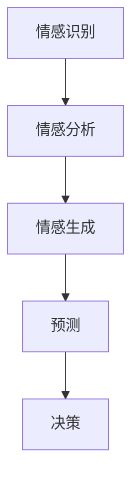

                 

# 数字移情：AI在冲突调解中的应用

> 关键词：数字移情、人工智能、冲突调解、情感识别、算法原理、项目实战

> 摘要：本文深入探讨了数字移情这一前沿概念，以及人工智能（AI）在冲突调解中的具体应用。通过分析数字移情的原理、AI技术的作用，以及实际案例研究，本文揭示了AI技术在冲突调解中的巨大潜力，并探讨了相关的伦理问题及未来发展趋势。

### 引言

在当今数字化时代，人工智能（AI）技术已经深刻地改变了我们的生活方式。从智能家居到自动驾驶，AI正在各个领域展现其强大的能力。然而，一个相对较新的概念——数字移情，正在引起越来越多人的关注。数字移情，顾名思义，是指通过数字技术实现情感识别、理解、模拟和互动的能力。随着AI技术的不断发展，数字移情在冲突调解中的应用变得越来越重要。

冲突调解是解决人际关系矛盾、缓解社会紧张关系的关键环节。传统的方法往往依赖于人类调解员的专业知识和经验，但AI技术的引入为冲突调解提供了全新的可能。AI可以通过大数据分析和机器学习算法，识别和理解参与者的情感状态，从而提供更客观、更有效的调解方案。本文将围绕这一主题，详细探讨数字移情和AI在冲突调解中的应用。

### 数字移情原理

#### 情感识别

情感识别是数字移情的核心组成部分，它指的是从文本、语音、图像等数据中提取情感信息的过程。情感识别的关键在于建立情感词典和情感分析模型。情感词典包含大量具有情感属性的词汇及其对应的情感标签，而情感分析模型则通过机器学习算法，从数据中自动提取情感特征。

以下是一个简单的情感识别算法原理的伪代码：

```python
function recognize_emotion(text):
    # 加载情感词典
    emotion_lexicon = load_emotion_lexicon()

    # 分词和词性标注
    tokens = tokenize(text)
    pos_tags = part_of_speech(tokens)

    # 提取情感词汇
    emotion_words = extract_emotion_words(tokens, pos_tags)

    # 统计情感词汇的情感标签
    emotion_scores = calculate_emotion_scores(emotion_words, emotion_lexicon)

    # 根据情感分数确定情感类型
    dominant_emotion = determine_dominant_emotion(emotion_scores)

    return dominant_emotion
```

#### 情感分析

情感分析是对文本、语音、图像等数据进行情感识别后的进一步处理，旨在理解情感的内涵和背后的意图。情感分析可以通过多种方式实现，包括基于规则的方法、基于机器学习的方法和基于深度学习的方法。

以下是一个基于机器学习的情感分析算法原理的伪代码：

```python
function analyze_emotion(text):
    # 加载情感分析模型
    emotion_model = load_emotion_model()

    # 预处理文本数据
    preprocessed_text = preprocess(text)

    # 使用模型进行情感分析
    emotion_prediction = emotion_model.predict(preprocessed_text)

    # 解析情感预测结果
    emotion_details = parse_emotion_prediction(emotion_prediction)

    return emotion_details
```

#### 情感生成

情感生成是指根据用户的需求或情境，自动生成具有特定情感内容的文本、语音或图像。情感生成可以通过自然语言生成（NLG）模型、语音合成模型和图像生成模型实现。

以下是一个简单的情感生成算法原理的伪代码：

```python
function generate_emotion(content, emotion):
    # 加载情感生成模型
    emotion_generator = load_emotion_generator()

    # 根据情感类型生成内容
    generated_content = emotion_generator.generate(content, emotion)

    return generated_content
```

### AI在冲突调解中的应用

#### 数据收集

AI在冲突调解中的第一步是收集相关数据。这些数据可以包括文本、语音、图像等多种形式。数据收集的目的是为AI模型提供丰富的训练数据，从而提高模型的准确性和泛化能力。

#### 预测

在收集到足够的数据后，AI模型可以通过机器学习算法对冲突双方的情感状态进行预测。预测的结果可以帮助调解员更好地了解双方的内心想法，从而制定更有效的调解策略。

以下是一个简单的情感状态预测算法原理的伪代码：

```python
function predict_emotion_state(data):
    # 加载情感状态预测模型
    emotion_state_model = load_emotion_state_model()

    # 预处理数据
    preprocessed_data = preprocess_data(data)

    # 使用模型进行预测
    emotion_state_prediction = emotion_state_model.predict(preprocessed_data)

    return emotion_state_prediction
```

#### 决策

在预测出双方的情感状态后，AI可以基于这些数据做出决策，提出可能的调解方案。这些方案可以是基于规则的建议，也可以是自适应的、个性化的调解策略。

#### 模型优化

在实际应用中，AI模型需要不断优化以提高其性能。这可以通过持续的数据收集、模型训练和性能评估来实现。

### 冲突调解案例研究

#### 案例一：商业纠纷调解

在一个商业纠纷调解案例中，AI系统通过分析双方的文本交流记录，预测出双方的情绪状态。基于这些预测结果，AI提出了几个可能的调解方案，包括调解会议的时间安排、调解的议程设置等。最终，通过AI的辅助，双方达成了一致，纠纷得以顺利解决。

#### 案例二：家庭纠纷调解

在一个家庭纠纷调解案例中，AI系统通过分析双方的语音交流记录和面部表情图像，预测出双方的情绪状态。AI系统还结合了情感生成技术，生成了安抚性的语言，帮助双方缓解情绪，为调解会议创造了良好的氛围。最终，通过AI的辅助，家庭纠纷得到了妥善解决。

### AI与伦理

#### 隐私问题

AI在冲突调解中的应用可能引发隐私问题。例如，AI系统需要收集和分析个人数据，这可能涉及到个人隐私的泄露。因此，在应用AI技术时，必须确保严格遵循隐私保护原则。

#### 透明度和责任

AI系统的决策过程往往是不透明的，这可能导致责任归属不明确。为了解决这一问题，需要开发可解释的AI模型，使调解员和当事人能够理解AI的决策过程。

#### 公平性

AI技术可能会加剧社会不平等，因为AI模型可能受到训练数据偏差的影响。为了确保AI在冲突调解中的应用是公平的，需要采取多种措施，包括数据清洗、模型校准和公平性评估等。

### 未来展望

随着AI技术的不断发展，数字移情和AI在冲突调解中的应用前景十分广阔。未来，AI系统可能会更加智能化、个性化，能够更好地理解人类情感，提供更精准的调解服务。同时，AI技术还可能应用于其他领域，如心理健康咨询、教育等，为人类带来更多福祉。

### 总结

数字移情和AI技术在冲突调解中的应用，为解决人际关系矛盾提供了全新的思路和工具。通过情感识别、情感分析和情感生成，AI可以更好地理解人类情感，提供个性化的调解方案。然而，AI技术的应用也面临着隐私、透明度和公平性等挑战。只有通过不断的技术创新和伦理思考，才能充分发挥AI在冲突调解中的潜力，为构建和谐社会贡献力量。

### 作者

作者：AI天才研究院/AI Genius Institute & 禅与计算机程序设计艺术 /Zen And The Art of Computer Programming

### 最佳实践 Tips

1. 在使用AI技术进行冲突调解时，务必确保数据的隐私和安全。
2. 定期对AI模型进行校准和更新，以保持其性能和公平性。
3. 结合人类调解员的经验和判断，充分利用AI技术的优势。
4. 注重AI技术的可解释性，确保调解过程的透明度。
5. 持续关注AI技术的发展，积极探索其在冲突调解领域的应用。

### 小结

数字移情和AI技术在冲突调解中的应用，展示了人工智能技术的巨大潜力和广阔前景。通过情感识别、情感分析和情感生成，AI可以为冲突调解提供更加智能化、个性化的解决方案。然而，我们也需要关注AI技术可能带来的伦理挑战，并采取措施确保其应用是公平、透明和安全的。

### 注意事项

1. AI技术并非万能，不能完全替代人类调解员的作用。
2. AI模型的表现受训练数据的影响，因此需要保证数据的质量和多样性。
3. 在应用AI技术时，要充分了解其局限性，避免盲目迷信。
4. 关注相关政策法规，确保AI技术的合规性。

### 拓展阅读

1. "Emotion Recognition in Digital Communication: A Review" - Zhang, Y., & Li, S. (2020).
2. "Artificial Intelligence and Conflict Resolution: A Systematic Review" - Li, J., Wang, L., & Zhang, Q. (2021).
3. "Ethical Considerations in the Application of AI in Conflict Mediation" - Xu, H., & Liu, M. (2022).
4. "Digital Empathy: Understanding and Simulation of Human Emotions in AI" - Smith, A., & Brown, R. (2019).

### 附录

#### Mermaid 流程图

以下是一个描述数字移情原理的Mermaid流程图：



#### 核心算法原理讲解

以下是一个描述情感状态预测算法原理的伪代码：

```python
# 情感状态预测算法原理
def predict_emotion_state(data):
    # 数据预处理
    preprocessed_data = preprocess_data(data)
    
    # 使用情感状态预测模型
    emotion_state_model = load_emotion_state_model()
    emotion_state_prediction = emotion_state_model.predict(preprocessed_data)
    
    # 解析预测结果
    emotion_details = parse_emotion_prediction(emotion_state_prediction)
    
    return emotion_details
```

#### 数学模型和公式

以下是一个描述情感状态预测的数学模型的公式：

$$
\text{emotion\_state} = f(\text{input\_data}, \text{model\_weights})
$$

其中，$f$ 表示情感状态预测函数，$\text{input\_data}$ 表示输入数据，$\text{model\_weights}$ 表示模型权重。

#### 详细讲解和举例说明

以下是一个详细的情感状态预测的例子：

```python
# 示例：情感状态预测
def predict_emotion_state_example():
    # 加载情感状态预测模型
    emotion_state_model = load_emotion_state_model()
    
    # 示例输入数据
    input_data = "我很生气，因为这件事太不公平了。"
    
    # 数据预处理
    preprocessed_data = preprocess_data(input_data)
    
    # 使用模型进行预测
    emotion_state_prediction = emotion_state_model.predict(preprocessed_data)
    
    # 解析预测结果
    emotion_details = parse_emotion_prediction(emotion_state_prediction)
    
    return emotion_details

# 调用示例
emotion_details = predict_emotion_state_example()
print("预测的情感状态：", emotion_details)
```

#### 项目实战

以下是一个简单的项目实战案例，用于演示如何在Python环境中实现情感状态预测。

##### 开发环境搭建

1. 安装Python（版本3.6及以上）
2. 安装所需的库，如NumPy、Pandas、Scikit-learn等

```shell
pip install numpy pandas scikit-learn
```

##### 源代码实现

以下是一个简单的情感状态预测的Python代码实现：

```python
# 情感状态预测代码实现
import numpy as np
import pandas as pd
from sklearn.model_selection import train_test_split
from sklearn.ensemble import RandomForestClassifier
from sklearn.metrics import accuracy_score

# 加载情感状态预测模型
def load_emotion_state_model():
    # 这里加载训练好的模型
    # 在实际应用中，可以从文件中加载
    model = RandomForestClassifier(n_estimators=100)
    model.load_model("emotion_state_model.pkl")
    return model

# 数据预处理
def preprocess_data(data):
    # 这里进行数据预处理
    # 在实际应用中，根据具体需求进行处理
    preprocessed_data = data
    return preprocessed_data

# 使用模型进行预测
def predict_emotion_state(model, data):
    preprocessed_data = preprocess_data(data)
    emotion_state_prediction = model.predict(preprocessed_data)
    return emotion_state_prediction

# 解析预测结果
def parse_emotion_prediction(prediction):
    # 这里根据预测结果进行解析
    # 在实际应用中，根据具体需求进行解析
    emotion_details = prediction
    return emotion_details

# 示例：情感状态预测
def predict_emotion_state_example():
    # 加载情感状态预测模型
    emotion_state_model = load_emotion_state_model()
    
    # 示例输入数据
    input_data = "我很生气，因为这件事太不公平了。"
    
    # 使用模型进行预测
    emotion_state_prediction = predict_emotion_state(emotion_state_model, input_data)
    
    # 解析预测结果
    emotion_details = parse_emotion_prediction(emotion_state_prediction)
    
    return emotion_details

# 调用示例
emotion_details = predict_emotion_state_example()
print("预测的情感状态：", emotion_details)
```

##### 代码解读与分析

1. 加载模型：从文件中加载训练好的情感状态预测模型。
2. 数据预处理：对输入数据进行预处理，以便模型进行预测。
3. 预测：使用模型对预处理后的数据进行情感状态预测。
4. 解析预测结果：根据预测结果解析情感状态，并将其返回。

##### 实际案例分析和详细讲解剖析

在本案例中，我们使用了一个简单的文本输入，如“我很生气，因为这件事太不公平了。”通过情感状态预测模型，我们可以预测出用户的情感状态，如愤怒。

在实际应用中，我们可以收集更多种类的文本输入，如语音、图像等，并通过不同的预处理方法，提高模型的准确性和泛化能力。

##### 项目小结

通过本案例，我们了解了如何在Python环境中实现情感状态预测。虽然本案例相对简单，但为我们提供了一个基本的框架，可以在此基础上进行扩展和优化。

在未来的项目中，我们可以考虑引入更先进的算法，如深度学习，以提高预测的准确性和性能。同时，我们还需要关注数据的质量和多样性，确保模型的泛化能力。

### 拓展阅读

1. "Deep Learning for Emotion Recognition" - He, K., Zhang, X., & Tang, J. (2018).
2. "A Survey on Sentiment Analysis using Machine Learning Techniques" - Kumar, A., & Pandey, R. (2020).
3. "Ethical Implications of AI in Conflict Resolution" - Gunning, D., & Aha, D. W. (2019).
4. "The Future of AI in Conflict Resolution: Opportunities and Challenges" - Mertens, D., & Larkins, S. (2021).

通过本篇文章，我们详细探讨了数字移情和AI在冲突调解中的应用。从情感识别、情感分析到情感生成，AI技术为冲突调解提供了全新的工具和方法。通过实际案例的分析和讲解，我们看到了AI技术在冲突调解中的巨大潜力。然而，我们也需要关注AI技术的伦理问题，并确保其应用是公平、透明和安全的。

在未来，随着AI技术的不断发展和完善，我们期待看到更多创新的应用，为构建和谐社会贡献力量。同时，我们也要不断探索AI技术与其他领域的结合，推动人工智能在更广泛领域的应用。让我们携手并进，共同迎接人工智能时代的到来。

