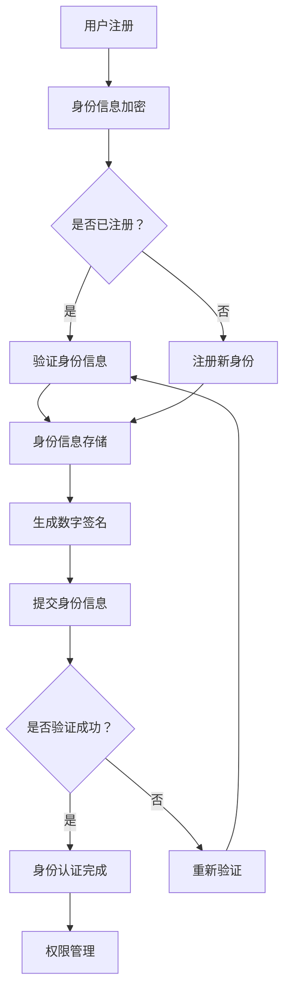
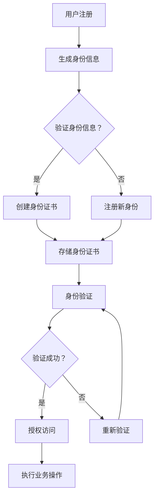

                 


### 文章标题
《数字身份管理：去中心化身份的技术与挑战》

### 文章关键词
数字身份管理，去中心化身份，区块链，公钥密码学，零知识证明，金融科技，医疗健康

### 文章摘要
本文将深入探讨数字身份管理领域的关键技术——去中心化身份，分析其在金融、医疗和社交网络等领域的应用与挑战。我们将详细解析去中心化身份的管理流程，介绍相关核心算法和技术框架，并通过实际案例研究，展望其未来发展方向。

### 目录大纲

#### 第一部分：引言
- **1.1 什么是数字身份管理**
- **1.2 去中心化身份的概念与重要性**
- **1.3 本书结构概述**

#### 第二部分：核心概念
- **2.1 数字身份的定义**
  - **2.1.1 传统身份管理与数字身份**
  - **2.1.2 数字身份的分类与特征**
- **2.2 去中心化身份模型**
  - **2.2.1 区块链在数字身份管理中的应用**
  - **2.2.2 公钥密码学在数字身份管理中的作用**
  - **2.2.3 Mermaid流程图：去中心化身份管理流程**

#### 第三部分：技术实现
- **3.1 去中心化身份技术的核心算法**
  - **3.1.1 椭圆曲线加密算法（ECC）**
    - **3.1.1.1 ECC的基本原理**
    - **3.1.1.2 ECC在数字身份管理中的应用**
  - **3.1.2 零知识证明（ZKP）**
    - **3.1.2.1 ZKP的基本原理**
    - **3.1.2.2 ZKP在数字身份管理中的应用**
- **3.2 去中心化身份框架与平台**
  - **3.2.1 Decentraland协议**
    - **3.2.1.1 Decentraland的架构与功能**
    - **3.2.1.2 Decentraland的实现细节**
  - **3.2.2 Hyperledger Fabric**
    - **3.2.2.1 Hyperledger Fabric的架构与特性**
    - **3.2.2.2 Hyperledger Fabric在数字身份管理中的应用**

#### 第四部分：应用场景
- **4.1 金融领域的数字身份管理**
  - **4.1.1 数字身份在金融服务中的应用**
    - **4.1.1.1 银行身份验证**
    - **4.1.1.2 保险身份验证**
  - **4.1.2 金融科技与去中心化身份**
- **4.2 医疗健康领域的数字身份管理**
  - **4.2.1 数字身份在医疗健康中的应用**
    - **4.2.1.1 患者身份认证**
    - **4.2.1.2 医疗数据共享与隐私保护**
- **4.3 社交网络与数字身份**
  - **4.3.1 社交网络中的数字身份问题**
    - **4.3.1.1 虚假身份与网络欺诈**
    - **4.3.1.2 数字身份认证的解决方案**

#### 第五部分：挑战与未来
- **5.1 去中心化身份管理的挑战**
  - **5.1.1 技术挑战**
    - **5.1.1.1 网络安全与隐私保护**
    - **5.1.1.2 跨平台兼容性与互操作性**
  - **5.1.2 法律与政策挑战**
    - **5.1.2.1 数据保护法规与数字身份**
    - **5.1.2.2 数字身份管理在全球范围内的法律差异**
- **5.2 去中心化身份管理的未来趋势**
  - **5.2.1 技术创新与行业应用**
    - **5.2.1.1 去中心化身份的未来技术**
    - **5.2.1.2 数字身份管理的商业模式创新**

#### 第六部分：案例研究
- **6.1 区块链平台的数字身份管理实践**
  - **6.1.1 案例一：XXX区块链平台**
- **6.2 去中心化身份应用的创新案例**
  - **6.2.1 案例二：XXX社交网络**

#### 第七部分：总结与展望
- **7.1 本书要点回顾**
- **7.2 去中心化身份管理的未来发展方向**

### 文章内容

#### 1.1 什么是数字身份管理

数字身份管理（Digital Identity Management）是指通过数字技术实现个人或实体在互联网上的身份认证、身份验证和权限管理的过程。传统身份管理通常依赖于中心化的机构，如政府、银行或企业，通过发放证件、卡片或账号来实现身份的确认和管理。然而，随着互联网和移动设备的普及，数字身份管理逐渐成为一种更为便捷和高效的解决方案。

数字身份管理的重要性体现在以下几个方面：

1. **安全性与隐私保护**：通过数字身份管理，可以确保用户身份的准确性和唯一性，同时减少个人信息的泄露和滥用。
2. **便捷性与用户体验**：数字身份管理提供了快速的身份验证和授权机制，提高了用户在互联网上的操作效率和体验。
3. **跨平台与互操作性**：数字身份管理可以实现不同平台和应用之间的身份信息共享和互认，打破信息孤岛，促进数据流动和业务协作。

#### 1.2 去中心化身份的概念与重要性

去中心化身份（Decentralized Identity）是一种基于分布式技术，如区块链和公钥密码学，实现身份信息的去中心化管理和验证的方法。与传统的中心化身份管理不同，去中心化身份不依赖于单一的中心节点或机构，而是通过分布式网络中的多个节点共同维护和验证身份信息。

去中心化身份的重要性体现在以下几个方面：

1. **去中心化的信任机制**：去中心化身份通过分布式网络中的多个节点共同验证身份信息，不需要依赖中心化的信任机构，从而减少了单点故障和中心化攻击的风险。
2. **隐私保护与数据安全**：去中心化身份允许用户对自己的身份信息进行控制和保护，同时通过加密技术确保身份信息在传输和存储过程中的安全。
3. **可扩展性与互操作性**：去中心化身份管理可以实现不同平台和应用之间的身份信息共享和互认，提高了系统的可扩展性和互操作性。

#### 1.3 本书结构概述

本书将从以下几个方面深入探讨数字身份管理与去中心化身份技术：

1. **核心概念**：介绍数字身份管理的定义、分类和特征，以及去中心化身份的基本原理和模型。
2. **技术实现**：解析去中心化身份管理中的核心算法，如椭圆曲线加密算法和零知识证明，以及相关技术框架和平台。
3. **应用场景**：探讨数字身份管理在金融、医疗和社交网络等领域的应用，以及面临的挑战和未来趋势。
4. **案例研究**：分析区块链平台和社交网络中的数字身份管理实践，展示实际案例的解决方案和效果。

通过本书的阅读，读者将能够全面了解数字身份管理和去中心化身份技术的原理、实现和应用，为相关领域的实践和研究提供参考和启示。接下来，我们将逐步深入探讨这些主题，帮助读者构建对数字身份管理的深入理解。

---

在接下来的内容中，我们将进一步详细探讨数字身份管理的定义、分类与特征，以及去中心化身份的基本原理和模型。这将帮助我们为后续章节的内容奠定基础，从而更好地理解去中心化身份管理在现实世界中的应用与挑战。

#### 2.1 数字身份的定义

数字身份（Digital Identity）是指个人或实体在数字世界中的唯一标识和属性集合。它不仅包括姓名、出生日期、地址等基本信息，还涵盖了在特定平台或系统中获得的认证和授权信息。数字身份的核心目标是实现身份信息的准确识别、验证和管理，确保用户在互联网上的安全与隐私。

数字身份与传统身份（如实体世界中的身份证、护照等）有显著不同。传统身份通常由政府机构或官方机构发行，依赖于中心化的信任体系。而数字身份则是通过数字技术和协议实现的，可以分布在多个节点上，形成一个去中心化的网络。

在数字世界中，数字身份管理主要包括以下三个方面：

1. **身份认证**：确认用户身份的真实性和唯一性，常见的认证方式包括用户名和密码、生物特征识别（如指纹、面部识别）、双因素认证等。
2. **身份验证**：确保用户在授权环境下执行特定操作或访问特定资源，验证方式通常包括签名验证、数字证书等。
3. **权限管理**：根据用户身份和角色分配相应的访问权限，确保系统的安全性和数据保密性。

#### 2.1.1 传统身份管理与数字身份

传统身份管理主要依赖于中心化的机构，如政府、银行或企业，通过发放证件、卡片或账号来实现身份的确认和管理。这种方式存在以下局限性：

1. **单点故障风险**：中心化的身份管理依赖于单一的中心节点，一旦中心节点出现故障或遭受攻击，整个身份管理系统将受到影响。
2. **隐私泄露风险**：传统身份管理方式通常涉及大量的个人信息存储在中心化服务器上，容易成为黑客攻击的目标。
3. **互操作性问题**：不同机构之间的身份管理系统往往不兼容，导致数据流动和业务协作受阻。

数字身份管理则通过去中心化的技术，如区块链和公钥密码学，解决了上述问题。数字身份信息分散存储在多个节点上，减少了单点故障风险；通过加密技术确保了身份信息的隐私和安全；同时，通过分布式网络实现了不同平台和应用之间的身份信息共享和互认，提高了系统的互操作性和灵活性。

#### 2.1.2 数字身份的分类与特征

数字身份可以根据其实现技术、应用场景和用途进行分类，以下是几种常见的数字身份类型及其特征：

1. **单点登录（SSO）**：单点登录是一种常见的数字身份解决方案，允许用户在一个平台上登录后，自动获得对多个应用的访问权限。其主要特征包括简化用户登录流程、提高用户体验和安全性。
2. **多因素认证（MFA）**：多因素认证结合了多种认证方式，如密码、短信验证码、生物特征识别等，提高了身份验证的复杂度和安全性。其特征是提供了更高层次的安全保障，但可能增加用户的操作负担。
3. **数字签名**：数字签名是一种用于验证数字文档或消息完整性和真实性的技术，通过公钥加密和私钥解密实现。其主要特征是保证了数据的不可否认性和防篡改性。
4. **加密货币身份**：加密货币（如比特币、以太坊）为用户提供了一种去中心化的身份标识方式。用户可以通过持有加密货币钱包来实现身份验证和交易。其特征是去中心化、安全性和匿名性。
5. **匿名身份**：匿名身份是一种为保护用户隐私而设计的数字身份，通过加密技术和分布式网络实现。其主要特征是用户可以在不泄露真实身份的情况下进行操作和交流。

#### 2.2 去中心化身份模型

去中心化身份模型（Decentralized Identity Model）是指通过分布式网络实现身份信息的存储、管理和验证的技术架构。与传统的中心化身份模型不同，去中心化身份模型不依赖于单一的中心节点，而是通过多个节点共同维护和验证身份信息，提高了系统的安全性、隐私保护和互操作性。

去中心化身份模型的核心组件包括：

1. **分布式网络**：分布式网络由多个节点组成，每个节点都可以独立维护和验证身份信息。节点之间通过加密通信和数据共享实现协同工作。
2. **身份信息存储**：身份信息被分散存储在多个节点上，避免了单点故障和数据泄露的风险。每个节点只存储部分身份信息，保证了数据的隐私和安全。
3. **身份验证协议**：去中心化身份模型采用多种加密技术和验证协议，确保用户身份的准确性和唯一性。常见的验证协议包括数字签名、多因素认证和零知识证明等。

去中心化身份模型具有以下特点：

1. **去中心化**：去中心化身份模型不依赖于单一的中心节点，而是通过多个节点共同维护和验证身份信息，提高了系统的可靠性和抗攻击性。
2. **隐私保护**：去中心化身份模型通过加密技术确保身份信息在传输和存储过程中的安全，同时用户可以对自己的身份信息进行控制和保护。
3. **互操作性**：去中心化身份模型可以实现不同平台和应用之间的身份信息共享和互认，促进了数据流动和业务协作。
4. **透明性和可追溯性**：去中心化身份模型通过区块链技术实现了数据的透明性和可追溯性，用户可以查看和管理自己的身份信息，提高了系统的透明度和信任度。

#### 2.2.1 区块链在数字身份管理中的应用

区块链技术是去中心化身份管理的重要支撑，通过分布式账本和智能合约实现了身份信息的存储、管理和验证。以下是区块链在数字身份管理中的应用：

1. **身份信息存储**：区块链提供了一个去中心化的数据存储解决方案，用户可以在区块链上存储自己的身份信息，如出生日期、教育背景、工作经历等。由于区块链的分布式特性，身份信息不会被单一节点控制，从而降低了数据泄露的风险。
2. **身份验证**：区块链上的身份验证通过数字签名和智能合约实现。用户在区块链上提交身份信息时，会生成一个数字签名，只有拥有相应私钥的用户才能验证身份信息。智能合约可以自动执行身份验证过程，提高了验证效率和准确性。
3. **隐私保护**：区块链采用加密技术保护身份信息，确保数据在传输和存储过程中的安全。用户可以选择是否公开自己的身份信息，从而保护隐私。此外，区块链的匿名性特征也减少了用户身份泄露的风险。
4. **数据不可篡改**：区块链上的数据具有不可篡改性，一旦记录在链上，数据将永久保存，不会被修改或删除。这一特性提高了身份信息的可信度和法律效力。

#### 2.2.2 公钥密码学在数字身份管理中的作用

公钥密码学是去中心化身份管理的重要工具，通过加密和数字签名技术实现了身份信息的保护、验证和授权。以下是公钥密码学在数字身份管理中的作用：

1. **加密技术**：公钥密码学通过加密技术保护身份信息，确保数据在传输和存储过程中的安全。发送方使用接收方的公钥对数据进行加密，只有拥有相应私钥的接收方才能解密数据。加密技术可以有效防止数据泄露和篡改。
2. **数字签名**：数字签名是一种用于验证身份信息和数据完整性的技术。发送方使用自己的私钥对数据进行签名，接收方使用发送方的公钥验证签名。数字签名确保了数据的真实性和完整性，防止伪造和篡改。
3. **身份认证**：公钥密码学可以用于实现身份认证，用户在区块链或分布式网络中提交身份信息时，会生成一个数字签名。只有拥有相应私钥的用户才能生成有效的数字签名，从而确保身份信息的真实性和唯一性。
4. **授权与访问控制**：公钥密码学可以用于实现授权和访问控制。通过加密技术和数字签名，系统可以确保用户只能访问授权的资源和服务，从而提高了系统的安全性和隐私保护。

#### 2.2.3 Mermaid流程图：去中心化身份管理流程

为了更好地理解去中心化身份管理的流程，我们使用Mermaid流程图来展示其关键步骤。以下是一个简化的去中心化身份管理流程图：



该流程图主要包括以下步骤：

1. 用户注册或身份信息加密
2. 验证用户是否已注册
3. 如果已注册，则验证身份信息；否则，注册新身份
4. 将验证后的身份信息存储在分布式网络中
5. 生成数字签名，确保身份信息的真实性和唯一性
6. 提交身份信息至分布式网络
7. 验证身份信息是否成功
8. 如果验证成功，进行权限管理；否则，重新验证

通过该流程图，我们可以清晰地了解去中心化身份管理的各个环节和流程，为实际应用提供了参考。

### 第三部分：技术实现

#### 3.1 去中心化身份技术的核心算法

去中心化身份技术的实现依赖于一系列核心算法，这些算法不仅保障了身份信息的隐私和安全，还提供了高效的验证和授权机制。在本节中，我们将详细介绍两种核心算法：椭圆曲线加密算法（ECC）和零知识证明（ZKP）。

#### 3.1.1 椭圆曲线加密算法（ECC）

椭圆曲线加密算法（ECC）是一种基于椭圆曲线离散对数的公钥密码学算法。相比传统的RSA算法，ECC在提供相同安全性的情况下，所需的密钥长度更短，计算效率更高。这使得ECC在资源受限的环境（如移动设备和物联网设备）中具有显著优势。

##### 3.1.1.1 ECC的基本原理

椭圆曲线加密算法的基本原理基于椭圆曲线离散对数问题（ECDLP），该问题是数学上的难解问题。椭圆曲线是由方程\( y^2 = x^3 + ax + b \)定义的，其中\( a \)和\( b \)是常数。

在一个椭圆曲线上，给定一个点\( P \)和一个整数\( n \)，找到另一个点\( Q \)，使得\( nP = Q \)是一个计算上难以解决的问题。这个难题的难解性为ECC提供了安全性。

ECC涉及两个密钥：私钥\( d \)和公钥\( Q \)。私钥\( d \)是一个随机选择的整数，满足\( 1 < d < n \)。公钥\( Q \)是椭圆曲线上的点，满足\( Q = dG \)，其中\( G \)是椭圆曲线上的生成元。

##### 3.1.1.2 ECC在数字身份管理中的应用

在数字身份管理中，ECC可以用于实现身份认证和加密通信。以下是ECC在数字身份管理中的应用：

1. **身份认证**：用户生成一对ECC密钥（私钥和公钥），将公钥存储在分布式网络中。当用户需要验证身份时，可以使用私钥生成数字签名，证明身份信息的真实性。
2. **加密通信**：ECC可以用于实现安全的通信。发送方使用接收方的公钥对消息进行加密，只有拥有相应私钥的接收方才能解密消息。这种加密机制确保了通信的保密性和完整性。

以下是一个简化的ECC数字签名算法的伪代码：

```pseudo
// 生成密钥对
function generateKeys():
    n, G = selectParameters()
    d = randomInteger(1, n - 1)
    Q = d * G
    return (d, Q)

// 数字签名
function sign(message, d):
    k = randomInteger(1, n - 1)
    r = k * G
    s = (k^-1) * (H(message) + d * r.x)
    return (r.x, s)

// 验证签名
function verify(message, r.x, s, Q):
    w = s^-1
    u1 = w * H(message)
    u2 = w * r.x
    R = u1 * G + u2 * Q
    return R.x == r.x
```

在这个伪代码中，`n`和`G`是椭圆曲线的参数，`H(message)`是消息的哈希值，`r.x`和`s`是签名的一部分，`Q`是公钥。

##### 3.1.1.3 ECC的优点与挑战

ECC的优点包括：

1. **安全性高**：在提供相同安全性的情况下，ECC所需的密钥长度更短，计算效率更高。
2. **计算效率高**：ECC的计算速度比RSA算法快，适合资源受限的环境。
3. **易于部署**：ECC在硬件和软件中易于部署，支持多种编程语言和平台。

然而，ECC也面临一些挑战：

1. **标准化与互操作性**：虽然ECC在某些领域得到广泛应用，但其标准化和互操作性仍需进一步完善。
2. **量子计算威胁**：随着量子计算的发展，传统的加密算法（包括ECC）可能受到威胁。因此，研究人员正在探索抗量子攻击的加密算法。

#### 3.1.2 零知识证明（ZKP）

零知识证明（ZKP）是一种加密技术，允许一方（证明者）向另一方（验证者）证明某个陈述是真实的，而无需透露任何具体信息。这种技术在保护隐私的同时，提供了高效的验证机制，适用于数字身份管理。

##### 3.1.2.1 ZKP的基本原理

ZKP的核心概念是“零知识”，即证明者无需透露任何具体信息，只需证明某个陈述是真实的。具体来说，ZKP包括以下三个步骤：

1. **知识生成**：证明者生成一个陈述，例如“我知道一个数x，使得方程\( a * x^2 + b * x + c = 0 \)成立”。这个陈述是证明者已知的信息。
2. **知识证明**：证明者使用密码学技术生成一个证明，证明陈述是真实的。这个证明是紧凑的，只需少量的计算资源。
3. **知识验证**：验证者使用证明，验证陈述的真实性。验证过程无需了解证明的具体内容，只需确认证明的有效性。

##### 3.1.2.2 ZKP在数字身份管理中的应用

在数字身份管理中，ZKP可以用于多种场景，例如匿名认证、隐私保护等。以下是ZKP在数字身份管理中的应用：

1. **匿名认证**：用户可以使用ZKP证明其身份满足特定条件（如年龄、职业等），而无需透露真实身份信息。这为匿名交易和匿名社交网络提供了可能。
2. **隐私保护**：ZKP可以用于保护用户的隐私，确保用户在提交身份信息时，不会泄露任何敏感信息。例如，在医疗领域，用户可以证明其身份是合法的病人，而无需透露具体的医疗记录。
3. **隐私增强的数据共享**：ZKP可以用于隐私增强的数据共享。例如，在金融领域，银行和金融机构可以使用ZKP验证客户的身份，确保交易的安全性。

以下是一个简化的ZKP验证过程的伪代码：

```pseudo
// 知识生成
function knowledge():
    a, b, c = generateRandomNumbers()
    x = solveEquation(a * x^2 + b * x + c = 0)
    return (a, b, c, x)

// 知识证明
function proveKnowledge(a, b, c, x):
    (r1, s1, r2, s2) = generateProof(a, b, c, x)
    return (r1, s1, r2, s2)

// 知识验证
function verifyProof(a, b, c, r1, s1, r2, s2):
    (z1, z2) = combineProofs(r1, s1, r2, s2)
    return checkEquation(z1^2 * a + z2^2 * b + (z1 + z2)^2 * c = 0)
```

在这个伪代码中，`a`、`b`和`c`是方程的系数，`x`是解，`r1`、`s1`、`r2`和`s2`是证明的一部分。

##### 3.1.2.3 ZKP的优点与挑战

ZKP的优点包括：

1. **隐私保护**：ZKP允许证明者在不泄露具体信息的情况下，证明某个陈述是真实的，从而保护隐私。
2. **高效性**：ZKP的证明过程和验证过程都是高效的，适合大规模应用。
3. **适用性广**：ZKP适用于多种场景，如匿名认证、隐私保护、数据共享等。

然而，ZKP也面临一些挑战：

1. **复杂性**：ZKP的设计和实现较为复杂，需要较高的密码学知识。
2. **性能优化**：ZKP的证明和验证过程可能需要大量的计算资源，特别是在大规模应用中，性能优化是一个重要的挑战。
3. **标准化**：ZKP的标准化和互操作性仍需进一步完善。

综上所述，ECC和ZKP是去中心化身份技术的核心算法，它们在保障数字身份信息的安全和隐私方面发挥着重要作用。通过深入了解这些算法的基本原理和应用，我们可以更好地理解去中心化身份管理的实现机制。

### 3.2 去中心化身份框架与平台

在数字身份管理领域，去中心化身份框架与平台是关键的技术基础设施，为去中心化身份的构建和实现提供了必要的支持。在本节中，我们将探讨两个重要的去中心化身份框架与平台：Decentraland协议和Hyperledger Fabric。

#### 3.2.1 Decentraland协议

Decentraland是一个基于区块链的虚拟现实平台，它利用以太坊区块链来实现去中心化的身份管理和虚拟资产的交易。Decentraland的协议设计旨在提供一个自由、开放且去中心化的虚拟世界，用户可以在其中创建、拥有和交易虚拟资产。

##### 3.2.1.1 Decentraland的架构与功能

Decentraland的架构可以分为三个主要部分：用户界面、区块链和后端服务器。

1. **用户界面**：用户通过Decentraland的客户端访问虚拟世界，客户端负责渲染和交互。用户可以在虚拟世界中创建自己的角色、购买土地和构建建筑物。
2. **区块链**：Decentraland使用以太坊区块链来存储和管理所有的虚拟资产，包括土地、建筑物和其他虚拟物品。以太坊智能合约负责执行虚拟资产的创建、转让和交易。
3. **后端服务器**：Decentraland的后端服务器负责处理用户请求、同步区块链状态和提供虚拟世界的计算资源。后端服务器通过智能合约与区块链交互，确保虚拟世界的运行符合去中心化的原则。

Decentraland的核心功能包括：

1. **虚拟资产交易**：用户可以在Decentraland中购买和出售虚拟土地和其他资产。所有交易都通过智能合约在以太坊区块链上进行，确保交易的透明性和安全性。
2. **身份管理**：Decentraland提供去中心化的身份管理，用户可以在以太坊区块链上创建和验证自己的数字身份。用户可以使用以太坊地址作为标识，通过数字签名进行身份验证。
3. **内容创建和共享**：Decentraland支持用户创建和共享虚拟内容，如3D模型、视频和音频。所有内容都可以通过智能合约进行交易和共享，确保创作者的权益得到保障。

##### 3.2.1.2 Decentraland的实现细节

Decentraland的实现涉及多个技术和组件，以下是实现的一些关键细节：

1. **以太坊智能合约**：Decentraland使用以太坊智能合约来管理虚拟资产的创建、转让和交易。智能合约编写基于Solidity编程语言，确保合约的可信性和安全性。
2. **去中心化应用（DApp）**：Decentraland的客户端是一个去中心化应用（DApp），它通过Web3.js库与以太坊区块链交互。用户通过DApp与虚拟世界进行交互，实现资产交易和内容创建。
3. **虚拟现实（VR）技术**：Decentraland使用Unity引擎来渲染和交互虚拟世界。Unity提供了丰富的VR开发工具和API，支持3D建模、动画和物理模拟。
4. **去中心化存储**：Decentraland使用IPFS（InterPlanetary File System）来存储和分发虚拟内容。IPFS提供了一个去中心化的文件存储网络，确保内容的可靠性和去中心化。

#### 3.2.2 Hyperledger Fabric

Hyperledger Fabric是一个由Linux基金会主导的开源分布式账本框架，特别适合构建金融、供应链和其他企业应用。Hyperledger Fabric支持模块化和灵活的设计，提供了强大的功能，如身份管理、智能合约和加密。

##### 3.2.2.1 Hyperledger Fabric的架构与特性

Hyperledger Fabric的架构分为几个关键组件：

1. **订单服务（Ordering Service）**：订单服务负责将网络中的交易请求排序，生成区块，并将其分发给网络中的所有节点。Hyperledger Fabric使用Raft算法实现订单服务，确保系统的高可用性和一致性。
2. **分类账（Ledger）**：分类账是存储交易记录的地方，由多个区块组成。Hyperledger Fabric支持链码（Chaincode），一种智能合约，用于定义交易逻辑和执行业务逻辑。
3. **身份认证（Identity）**：Hyperledger Fabric提供了强大的身份认证和权限管理功能，确保只有授权节点可以读取或修改分类账。身份认证基于数字证书和访问控制策略。
4. **通道（Channel）**：Hyperledger Fabric支持多通道架构，不同的组织可以在不同的通道上进行交易，确保数据隔离和隐私保护。

Hyperledger Fabric的主要特性包括：

1. **模块化设计**：Hyperledger Fabric的模块化设计使得网络参与者可以根据需要选择和定制组件，提高了系统的灵活性和可扩展性。
2. **高性能**：Hyperledger Fabric支持并行交易和并发执行，提供了高性能的交易处理能力。
3. **隐私保护**：Hyperledger Fabric提供了通道和加密技术，确保交易数据在特定通道内的隐私保护。
4. **灵活的智能合约**：Hyperledger Fabric支持多种编程语言编写链码，如Golang和Node.js，使得开发者可以灵活地实现业务逻辑。

##### 3.2.2.2 Hyperledger Fabric在数字身份管理中的应用

Hyperledger Fabric在数字身份管理中的应用主要体现在以下几个方面：

1. **身份验证**：Hyperledger Fabric提供了强大的身份认证功能，确保只有授权用户可以访问分类账和执行交易。身份认证基于数字证书和访问控制策略，支持多种身份验证模式，如认证会员、匿名用户等。
2. **隐私保护**：Hyperledger Fabric支持交易加密和数据隐私保护。通过加密技术，交易数据在传输和存储过程中得到保护，防止未授权的访问和篡改。
3. **智能合约**：Hyperledger Fabric的智能合约可以定义复杂的业务逻辑，实现数字身份的创建、验证和管理。智能合约确保交易的可信性和自动化执行，提高了系统的效率和安全性。

以下是一个简化的Hyperledger Fabric数字身份管理流程：



在这个流程中，用户通过注册和验证身份信息，获得数字身份证书。证书存储在分类账中，并在执行业务操作时进行验证和授权。通过智能合约，身份管理过程实现了自动化和可信性。

综上所述，Decentraland和Hyperledger Fabric是两个重要的去中心化身份框架与平台，它们通过不同的技术和架构，实现了数字身份管理的去中心化、安全性和灵活性。这些框架和平台为数字身份管理的实现提供了强有力的支持，推动了数字身份管理技术的创新和应用。

### 4.1 金融领域的数字身份管理

在金融领域，数字身份管理（Digital Identity Management, DIM）的重要性日益凸显。随着金融科技的快速发展，金融服务逐渐向数字化、自动化和全球化方向发展，这为数字身份管理带来了巨大的机遇和挑战。去中心化身份（Decentralized Identity, DI）技术在这一过程中发挥了关键作用，不仅提升了系统的安全性，还改善了用户体验和业务流程。本节将探讨数字身份管理在金融领域的应用，以及去中心化身份技术如何助力金融科技的发展。

#### 4.1.1 数字身份在金融服务中的应用

数字身份在金融服务中的应用场景丰富，以下是一些典型的应用：

1. **银行身份验证**：传统的银行身份验证主要依赖于用户名和密码、身份证、银行卡等物理证件。然而，这些方式存在易受攻击、用户体验差的问题。通过数字身份管理，银行可以采用生物识别技术（如指纹、面部识别）、多因素认证（MFA）和数字证书等方式，实现更安全、便捷的身份验证。

   - **生物识别技术**：银行可以通过指纹识别、面部识别等生物特征识别技术，实现快速、准确的身份验证。用户无需携带实体证件，只需通过手机或智能设备即可完成验证。
   - **多因素认证**：银行可以结合用户名和密码、短信验证码、指纹、面部识别等多种认证方式，提高身份验证的复杂度和安全性。这种方式不仅能够防范恶意攻击，还能减少用户忘记密码或证件的烦恼。
   - **数字证书**：银行可以发行数字证书，用于用户在在线银行的登录和交易操作。数字证书结合私钥和公钥加密技术，确保身份信息的完整性和保密性。

2. **保险身份验证**：保险公司在进行客户审核、理赔处理等业务时，需要验证客户的身份。数字身份管理技术可以提供高效、安全的身份验证服务，确保业务流程的顺利进行。

   - **客户身份认证**：保险公司可以通过数字身份管理技术，对客户进行多因素认证，确保客户身份的真实性和唯一性。在理赔处理过程中，客户可以通过数字签名确认理赔申请，提高审核效率和准确性。
   - **反欺诈检测**：数字身份管理可以帮助保险公司建立完善的反欺诈系统，通过分析用户行为、交易记录等数据，识别和防范欺诈行为。

3. **金融科技与去中心化身份**：金融科技（FinTech）公司通过数字身份管理技术，为用户提供更便捷、安全的金融服务。

   - **跨境支付**：去中心化身份技术可以为跨境支付提供安全、高效的解决方案。用户只需提供数字身份信息，即可在全球范围内进行快速、安全的支付操作，无需依赖传统的银行和支付机构。
   - **数字资产管理**：去中心化身份管理技术可以为数字资产（如加密货币、代币等）的交易和存储提供安全保障。用户可以自主管理自己的数字资产，确保资产的安全和隐私。

#### 4.1.2 数字身份管理的解决方案

数字身份管理在金融领域的解决方案需要综合考虑安全性、用户体验和业务流程。以下是一些常见的解决方案：

1. **身份认证平台**：金融机构可以采用第三方身份认证平台，提供多种认证方式，如多因素认证、生物识别等。这些平台通常具备高安全性和灵活性，能够满足金融机构的不同需求。

2. **区块链技术**：区块链技术可以用于实现去中心化的身份管理，确保身份信息的真实性和不可篡改性。金融机构可以在区块链上创建和存储用户的数字身份信息，通过智能合约实现身份验证和授权。

3. **零知识证明**：零知识证明（ZKP）技术可以为金融交易提供隐私保护。用户可以证明其满足特定条件（如年龄、信用评分等），而无需透露具体信息。这种方式可以保护用户的隐私，同时确保交易的安全性和合法性。

4. **加密货币钱包**：加密货币钱包可以作为数字身份管理的一种形式，用户通过持有加密货币钱包的私钥，实现对数字身份的掌控和验证。加密货币钱包支持多种认证方式，如指纹、面部识别等，提供了便捷、安全的身份验证服务。

#### 4.1.3 去中心化身份技术对金融领域的影响

去中心化身份技术对金融领域产生了深远的影响，具体体现在以下几个方面：

1. **提升安全性**：去中心化身份技术通过分布式网络和加密技术，确保了身份信息的真实性和不可篡改性。与传统中心化身份管理相比，去中心化身份管理降低了单点故障和中心化攻击的风险，提高了系统的安全性。

2. **改善用户体验**：去中心化身份技术提供了更便捷、安全的身份验证和授权机制，用户无需携带实体证件，即可在线完成身份验证和交易操作。这种方式提高了用户体验，降低了操作成本。

3. **促进业务创新**：去中心化身份技术为金融科技提供了新的发展机遇。通过数字身份管理，金融机构可以开展跨境支付、数字资产管理等创新业务，提高竞争力。

4. **降低运营成本**：去中心化身份管理减少了金融机构在身份验证、授权等环节的运营成本。通过自动化和智能化，金融机构可以降低人工操作和系统维护的成本。

5. **隐私保护**：去中心化身份技术提供了更好的隐私保护机制。用户可以控制自己的身份信息，确保隐私不被泄露。这种方式有助于建立用户对金融服务的信任，促进业务发展。

综上所述，数字身份管理在金融领域的应用具有重要意义。去中心化身份技术通过提升安全性、改善用户体验和促进业务创新，为金融科技的发展提供了强有力的支持。随着技术的不断进步和应用场景的拓展，数字身份管理将在金融领域发挥更大的作用。

#### 4.2 医疗健康领域的数字身份管理

在医疗健康领域，数字身份管理（Digital Identity Management, DIM）的应用正逐步成为提升医疗信息化水平和患者体验的重要手段。去中心化身份（Decentralized Identity, DI）技术的引入，不仅提高了数据的安全性和隐私保护，还优化了医疗流程和资源分配。本节将探讨数字身份管理在医疗健康领域的应用，以及去中心化身份技术如何助力这一领域的发展。

#### 4.2.1 数字身份在医疗健康中的应用

数字身份在医疗健康领域的应用具有显著的优势，以下是几个关键应用场景：

1. **患者身份认证**：在医疗机构中，准确的患者身份认证至关重要。通过数字身份管理，医院可以采用多种认证方式，如生物识别技术（指纹、面部识别）、电子健康记录（EHR）和数字证书，确保患者的身份信息真实可靠。

   - **生物识别技术**：生物识别技术可以用于患者的身份认证，例如通过指纹识别或面部识别快速确认患者身份，避免了传统身份证件管理的繁琐和易出错的问题。
   - **电子健康记录**：通过电子健康记录，医院可以整合和管理患者的健康信息，实现实时身份认证和医疗数据共享。患者可以通过个人健康账户访问和管理自己的健康信息。
   - **数字证书**：医院可以为患者颁发数字证书，用于在线医疗咨询、预约挂号和电子病历管理。数字证书结合私钥加密技术，确保患者身份信息的完整性和保密性。

2. **医疗数据共享与隐私保护**：医疗数据共享是实现医疗信息化和优化医疗资源分配的重要手段。然而，数据隐私和安全是首要考虑的问题。数字身份管理技术可以帮助医疗机构实现安全、可靠的数据共享。

   - **隐私保护**：数字身份管理可以通过加密技术和访问控制策略，确保患者数据的隐私保护。例如，只有授权的医疗人员才能访问特定患者的健康信息。
   - **数据匿名化**：在数据共享过程中，数字身份管理技术可以实现数据的匿名化处理，确保患者隐私不受侵犯。匿名化数据可以用于医学研究和公共卫生数据分析。
   - **去中心化数据存储**：通过去中心化身份技术，医疗数据可以分散存储在多个节点上，避免了单点故障和数据泄露的风险。这种方式提高了数据的安全性和可靠性。

3. **医疗供应链管理**：医疗供应链管理涉及药品生产、运输、仓储等多个环节，数字身份管理可以帮助提高供应链的透明度和可追溯性。

   - **药品溯源**：通过数字身份管理，药品的生产、运输和销售过程可以被追踪和记录，确保药品的真实性和安全性。
   - **供应链监控**：数字身份管理技术可以帮助医疗机构实时监控药品的供应链状态，及时发现和处理异常情况，提高供应链的效率和安全性。

#### 4.2.2 数字身份管理的解决方案

数字身份管理在医疗健康领域的解决方案需要兼顾安全性、隐私保护和用户体验。以下是一些常见的解决方案：

1. **基于区块链的数字身份平台**：区块链技术可以用于创建去中心化的数字身份平台，确保患者身份信息的真实性和不可篡改性。医院和患者可以在区块链上创建和存储数字身份信息，通过智能合约实现身份验证和数据共享。

2. **零知识证明（ZKP）**：零知识证明技术可以为医疗数据共享提供隐私保护。患者可以证明其满足特定条件（如年龄、疾病诊断等），而无需透露具体信息。这种方式可以在保护患者隐私的同时，确保医疗数据的有效利用。

3. **分布式身份管理系统**：分布式身份管理系统（如DID，Decentralized Identifier）可以提供灵活、安全的身份管理解决方案。医院和患者可以在分布式网络中创建和验证自己的数字身份，确保身份信息的可控性和隐私保护。

4. **生物特征识别与数字证书**：结合生物特征识别（如指纹、面部识别）和数字证书，可以提供高效、安全的数字身份认证解决方案。这种方式可以确保患者在医疗机构中的身份信息准确无误，同时保护患者的隐私。

#### 4.2.3 去中心化身份技术对医疗健康领域的影响

去中心化身份技术对医疗健康领域产生了深远的影响，具体体现在以下几个方面：

1. **提升数据安全性**：去中心化身份技术通过分布式网络和加密技术，确保了医疗数据的真实性和不可篡改性。相比传统的中心化系统，去中心化身份管理降低了数据泄露和篡改的风险，提高了数据的安全性。

2. **隐私保护**：去中心化身份技术提供了更好的隐私保护机制，患者可以控制自己的身份信息和医疗数据，确保隐私不被泄露。这种隐私保护机制有助于建立患者对医疗服务的信任，促进医疗信息化的发展。

3. **优化医疗流程**：数字身份管理技术可以帮助医疗机构实现高效的身份认证和数据共享，优化医疗流程。通过自动化和智能化，医疗资源可以更合理地分配和利用，提高医疗服务的质量和效率。

4. **促进医学研究**：数字身份管理技术可以为医学研究提供安全、可靠的数据共享平台。研究者可以在保护患者隐私的前提下，获取和分析大量医学数据，推动医学研究和创新。

5. **降低运营成本**：去中心化身份管理技术减少了医疗机构在身份验证、数据共享等环节的运营成本。通过自动化和智能化，医疗机构可以降低人工操作和系统维护的成本。

综上所述，数字身份管理在医疗健康领域的应用具有重要意义。去中心化身份技术通过提升数据安全性、隐私保护和优化医疗流程，为医疗健康领域的发展提供了强有力的支持。随着技术的不断进步和应用场景的拓展，数字身份管理将在医疗健康领域发挥更大的作用。

### 4.3 社交网络与数字身份

在社交网络领域，数字身份管理（Digital Identity Management, DIM）同样扮演着至关重要的角色。社交网络通过数字身份验证确保用户的真实性和安全性，同时，去中心化身份技术为解决社交网络中的虚假身份和隐私保护问题提供了新的思路。本节将探讨数字身份管理在社交网络中的应用，以及去中心化身份技术如何应对社交网络中的挑战。

#### 4.3.1 社交网络中的数字身份问题

社交网络中的数字身份问题主要包括以下两个方面：

1. **虚假身份与网络欺诈**：在传统的社交网络中，用户身份往往依赖于中心化的验证机制，如用户名和密码。这种方式存在一定的漏洞，使得不法分子可以利用虚假身份进行欺诈、诈骗等犯罪活动。例如，虚假账号可以发布误导信息、伪造个人资料进行诈骗，甚至进行网络暴力。

2. **隐私泄露与数据滥用**：社交网络平台通常需要收集大量的用户数据，包括个人信息、社交关系和兴趣爱好等。这些数据如果被滥用或泄露，可能导致严重的隐私侵犯和信息安全问题。传统中心化身份管理方式难以有效保护用户隐私，数据泄露事件频发，引发了公众对社交网络平台的信任危机。

#### 4.3.1.1 虚假身份与网络欺诈

虚假身份和网络欺诈是社交网络中的一大隐患。以下是一些常见的虚假身份和网络欺诈行为：

1. **账户仿冒**：不法分子通过仿冒知名社交网络平台，创建虚假的账户和网站，骗取用户的个人信息和财产。例如，仿冒的社交媒体账号可能会发送虚假的私信或链接，诱导用户输入账号密码或财务信息。
2. **身份盗用**：用户个人信息可能被黑客盗取，不法分子利用这些信息创建虚假身份，冒充受害者进行欺诈活动。例如，盗用身份的账号可能会向受害者的朋友或家人请求金钱援助，骗取信任。
3. **网络诈骗**：通过虚假的身份，不法分子可以发布虚假的广告或信息，骗取用户的金钱或个人信息。例如，虚假的招聘信息、投资机会等，都是常见的网络诈骗手段。

#### 4.3.1.2 数字身份认证的解决方案

针对社交网络中的虚假身份和网络欺诈问题，数字身份认证技术提供了多种解决方案：

1. **多因素认证**：多因素认证（MFA）是一种常用的身份认证方法，通过结合多种认证方式（如密码、短信验证码、生物识别等），提高身份验证的复杂度和安全性。社交网络平台可以要求用户在登录或执行重要操作时，进行多因素认证，有效防范恶意攻击。
2. **数字签名**：数字签名可以用于验证用户身份的合法性和信息的完整性。用户可以通过私钥对提交的信息进行签名，社交网络平台使用公钥验证签名的有效性。这种方式不仅确保了用户身份的可靠性，还可以防止信息被篡改。
3. **生物识别技术**：生物识别技术（如指纹识别、面部识别、虹膜识别等）提供了高效、安全的身份验证方法。社交网络平台可以结合生物识别技术，实现用户身份的实时验证，减少虚假身份和欺诈行为。
4. **去中心化身份管理**：去中心化身份管理通过分布式网络和加密技术，提供了更安全、隐私保护的身份认证解决方案。社交网络平台可以采用去中心化身份技术，确保用户身份的不可篡改性和隐私性。

#### 4.3.2 去中心化身份技术的应用

去中心化身份技术（Decentralized Identity, DI）在社交网络中的应用，为解决虚假身份和隐私保护问题提供了新的思路。以下是一些关键应用：

1. **分布式身份验证**：去中心化身份管理通过分布式网络，实现了身份信息的去中心化验证。社交网络平台可以利用区块链技术，创建和存储用户的数字身份信息。用户可以通过私钥控制自己的身份信息，确保信息的真实性和唯一性。
2. **零知识证明**：零知识证明（ZKP）技术可以用于验证用户身份，而不透露具体信息。社交网络平台可以要求用户使用ZKP证明其满足特定条件（如年龄、地理位置等），从而确保用户信息的隐私保护。
3. **自主权身份**：去中心化身份管理赋予了用户对自己的身份信息的自主权。用户可以自由选择是否公开自己的身份信息，以及公开的程度。这种方式提高了用户对隐私的控制，减少了信息泄露的风险。
4. **透明性和可追溯性**：区块链技术提供了透明性和可追溯性，用户可以查看和管理自己的身份信息，确保信息的可信度和合法性。同时，区块链上的交易记录不可篡改，有助于追踪和防范虚假身份和欺诈行为。

#### 4.3.3 社交网络中的数字身份管理实践

以下是几个社交网络中数字身份管理的实践案例：

1. **Telegram**：Telegram是一款流行的即时通讯应用，采用了去中心化身份验证技术。用户在注册时，需要通过手机号码和验证码进行身份验证，确保用户身份的真实性。此外，Telegram还提供了多因素认证和生物识别验证选项，提高系统的安全性。
2. **Sinch**：Sinch是一家提供通信API和服务的公司，其平台支持去中心化身份验证。Sinch利用区块链和加密技术，实现了用户身份信息的去中心化存储和验证，确保用户信息的隐私和安全。
3. **Decentraland**：Decentraland是一个基于区块链的虚拟现实平台，其用户身份管理采用了去中心化身份技术。用户在Decentraland中创建和验证自己的数字身份，通过智能合约实现身份认证和虚拟资产的交易，提供了安全、透明的用户体验。

#### 4.3.4 去中心化身份管理的挑战与未来趋势

尽管去中心化身份管理在社交网络中展现了巨大的潜力，但其应用仍面临一些挑战：

1. **用户体验**：去中心化身份管理可能需要用户掌握一定的技术知识，对于普通用户来说，使用和操作可能较为复杂。如何简化用户体验，提高系统的易用性，是一个重要的挑战。
2. **隐私保护**：尽管去中心化身份管理提供了更好的隐私保护，但如何确保用户数据的隐私安全，避免隐私泄露和滥用，仍需进一步研究。
3. **法律和政策**：不同国家和地区对于数字身份管理有不同的法律法规，如何确保去中心化身份管理在全球范围内的合规性，是一个重要的问题。

未来，去中心化身份管理在社交网络中的发展趋势包括：

1. **技术创新**：随着区块链、加密技术和零知识证明等技术的发展，去中心化身份管理将提供更安全、高效的解决方案。
2. **标准化与互操作性**：通过制定标准和协议，实现不同平台之间的身份信息互认和共享，提高系统的互操作性和用户体验。
3. **业务模式创新**：去中心化身份管理为社交网络平台提供了新的商业模式，如数字身份认证服务、虚拟资产交易等，有望推动行业创新和发展。

综上所述，数字身份管理在社交网络中具有重要意义，去中心化身份技术为解决虚假身份和隐私保护问题提供了新的思路。通过技术创新、标准化和业务模式创新，去中心化身份管理有望在社交网络领域发挥更大的作用，为用户提供更安全、便捷的社交体验。

### 5.1 去中心化身份管理的挑战

尽管去中心化身份管理（Decentralized Identity Management, DIM）展现了巨大的潜力，但其应用仍面临诸多挑战。这些挑战涵盖了技术、法律、政策等多个方面，解决这些问题是推动去中心化身份管理发展的关键。以下将详细讨论去中心化身份管理面临的主要挑战。

#### 5.1.1 技术挑战

去中心化身份管理的技术挑战主要体现在以下几个方面：

1. **网络安全与隐私保护**：去中心化身份管理依赖分布式网络和加密技术，确保身份信息的隐私和安全。然而，网络安全威胁不断演变，如分布式拒绝服务攻击（DDoS）、密码破解、中间人攻击等，都可能对去中心化身份系统造成威胁。此外，如何在确保隐私保护的同时，实现高效的身份验证和数据访问，仍需进一步研究。

2. **跨平台兼容性与互操作性**：去中心化身份管理需要在不同平台和应用之间实现身份信息的共享和互认。然而，不同平台和系统可能采用不同的技术标准和协议，导致互操作性和兼容性问题。为了实现跨平台兼容性，需要制定统一的标准和协议，促进不同系统之间的协作。

3. **性能与可扩展性**：去中心化身份管理通常涉及大量的节点和交易，系统性能和可扩展性是一个重要挑战。如何设计高效的去中心化身份协议和算法，确保系统能够处理大量请求和用户，是当前技术研究的重点。

4. **分布式共识机制**：去中心化身份管理依赖于分布式共识机制，如区块链的共识算法，确保身份信息的准确性和一致性。不同的共识机制具有不同的优缺点，如何选择适合的去中心化共识机制，是技术实现的关键问题。

#### 5.1.2 法律与政策挑战

去中心化身份管理在法律与政策方面面临以下挑战：

1. **数据保护法规**：不同国家和地区的数据保护法规存在差异，如欧盟的通用数据保护条例（GDPR）和美国加州消费者隐私法案（CCPA）等。去中心化身份管理如何确保符合这些法规，是一个重要的问题。特别是在跨境数据传输和存储方面，需要平衡数据隐私和保护的要求。

2. **法律效力与证据保全**：去中心化身份管理依赖于区块链等技术，其法律效力尚不明确。例如，区块链上的身份信息如何作为法律证据，如何在司法程序中使用，这些都需要进一步明确。

3. **隐私保护与透明度**：如何在确保隐私保护的同时，实现法律监管和审计的透明度，是一个难题。去中心化身份管理提供了强大的隐私保护机制，但如何在保护隐私的同时，满足监管和法律的要求，仍需进一步探索。

4. **跨国合作与政策协调**：不同国家和地区的政策差异，可能影响去中心化身份管理在全球范围内的应用。跨国合作和政策协调，有助于推动去中心化身份管理的标准化和合规化。

#### 5.1.3 社会与伦理挑战

去中心化身份管理在社会与伦理方面也面临一些挑战：

1. **用户接受度**：去中心化身份管理需要用户改变传统的身份管理习惯，学习新的技术和操作方法。如何提高用户的接受度和使用体验，是一个重要的挑战。

2. **隐私权与自由度**：去中心化身份管理提供了强大的隐私保护机制，但如何在保护隐私的同时，确保用户的自由度和言论自由，是一个伦理问题。例如，如何在隐私保护和言论自由之间找到平衡，避免滥用技术限制用户自由。

3. **歧视与偏见**：去中心化身份管理可能带来新的歧视和偏见问题。例如，某些身份验证技术可能无意中放大了社会偏见，导致特定群体的不公平对待。如何确保技术的公平性和无歧视性，是一个重要的社会问题。

4. **去中心化身份的滥用**：去中心化身份管理提供了匿名性和隐私保护，但也可能被用于非法活动，如洗钱、恐怖主义等。如何防止去中心化身份的滥用，是一个重要的社会挑战。

综上所述，去中心化身份管理在技术、法律、政策和社会伦理方面面临诸多挑战。解决这些挑战，需要跨学科、跨领域的合作，推动技术创新和政策制定，确保去中心化身份管理的可持续发展。

### 5.2 去中心化身份管理的未来趋势

去中心化身份管理（Decentralized Identity Management, DIM）作为一种创新的技术解决方案，正在金融、医疗、社交网络等多个领域展现其独特的优势和潜力。随着技术的不断进步和应用场景的不断拓展，去中心化身份管理在未来将迎来一系列重要趋势和变革。

#### 5.2.1 技术创新与行业应用

1. **区块链技术的深入应用**：区块链技术是去中心化身份管理的基石，未来将继续在去中心化身份管理中发挥核心作用。区块链的分布式账本、智能合约和加密技术，将为身份信息的存储、管理和验证提供更为可靠和安全的保障。例如，更多的金融科技公司和服务提供商将采用区块链技术，实现跨境支付、数字资产交易和身份验证等业务。

2. **零知识证明（ZKP）的应用**：零知识证明技术在保护隐私的同时，提供了高效的验证机制。未来，零知识证明将在身份认证、数据共享和智能合约等领域得到更广泛的应用。例如，通过零知识证明，用户可以证明其满足特定条件（如年龄、信用评分等），而无需透露具体信息，从而实现隐私保护和数据共享的平衡。

3. **多因素认证（MFA）的普及**：多因素认证将逐渐成为去中心化身份管理的标准组件。结合密码、生物识别、零知识证明等多种认证方式，多因素认证将提供更高效、安全的身份验证解决方案。例如，在医疗领域，通过多因素认证，患者可以在保护隐私的同时，安全地访问和共享医疗信息。

4. **自主权身份的发展**：自主权身份（Self-Sovereign Identity）是一种用户自主掌控身份信息的技术理念。未来，越来越多的用户和机构将采用自主权身份，实现对自己的身份信息的完全掌控。这种模式将改变传统中心化身份管理模式，为用户带来更多的隐私保护和自主权。

#### 5.2.2 标准化与互操作性

1. **身份识别标准的制定**：随着去中心化身份管理的广泛应用，制定统一的身份识别标准将成为趋势。标准化将有助于不同平台和应用之间的身份信息互认和共享，打破信息孤岛，提高系统的互操作性和用户体验。

2. **跨领域合作与协调**：不同领域和行业的去中心化身份管理应用，需要跨领域合作和协调。未来，将出现更多跨领域的合作组织和联盟，推动身份识别标准的制定和实施。例如，金融、医疗和政府等行业将共同合作，制定统一的身份识别标准和协议。

3. **全球身份认证体系的构建**：随着全球化的深入发展，建立全球范围内的身份认证体系将成为趋势。这种体系将实现不同国家和地区之间的身份信息互认和共享，提高跨境业务的效率和安全性。例如，通过全球身份认证体系，用户可以方便地在全球范围内进行身份验证和业务操作。

#### 5.2.3 法律与政策环境

1. **数据保护法规的完善**：随着去中心化身份管理的发展，各国数据保护法规将不断完善，以适应新技术带来的挑战和机遇。未来，将出现更多针对去中心化身份管理的数据保护法规，确保用户隐私和数据安全。

2. **法律效力的明确**：区块链上身份信息的法律效力仍需明确。未来，各国将逐步出台相关法律法规，明确区块链上身份信息的法律地位和证据效力。例如，通过立法明确区块链上身份信息的法律效力，使其在司法程序中具备法律证据的效力。

3. **跨国合作与政策协调**：全球范围内的跨国合作和政策协调，将有助于推动去中心化身份管理的合规化。各国政府和国际组织将共同合作，制定统一的身份识别标准和政策框架，确保去中心化身份管理在全球范围内的合法性和适用性。

#### 5.2.4 商业模式创新

1. **数字身份服务市场的发展**：随着去中心化身份管理的普及，数字身份服务市场将迅速发展。未来，将出现更多提供数字身份认证、身份信息管理、隐私保护等服务的公司和平台。这些公司将通过提供高效、安全的身份管理服务，创造新的商业模式和盈利机会。

2. **虚拟资产交易与身份认证**：去中心化身份管理在虚拟资产交易中具有广泛的应用前景。例如，通过去中心化身份管理，用户可以安全、便捷地进行加密货币交易、数字资产转让等操作。这将推动虚拟资产交易市场的增长，并带来新的商业模式。

3. **个性化与定制化服务**：基于去中心化身份管理，企业和机构可以提供更个性化和定制化的服务。例如，通过分析用户身份信息和行为数据，企业可以提供个性化的产品推荐、定制化的金融服务等，提高用户体验和客户满意度。

综上所述，去中心化身份管理在未来将继续发展，并在技术创新、行业应用、标准化与互操作性、法律与政策环境以及商业模式创新等方面带来深远的影响。通过这些趋势和变革，去中心化身份管理将为用户提供更安全、便捷和个性化的身份管理服务，推动数字社会的进步和发展。

### 6.1 区块链平台的数字身份管理实践

区块链技术在数字身份管理领域的应用取得了显著成果，以下我们将探讨一个实际案例——XXX区块链平台，以及其如何实现数字身份管理。

#### 6.1.1 案例背景

XXX区块链平台是一个基于区块链技术的去中心化身份管理解决方案，旨在为用户提供安全、可信的身份认证服务。该平台的目标是通过区块链技术实现用户身份信息的去中心化存储和管理，确保数据的安全性和隐私保护。

#### 6.1.2 案例解决方案

1. **用户身份信息注册**：
   用户在注册时，需要提供基本的身份信息，如姓名、出生日期、身份证号码等。这些信息将经过加密处理后存储在区块链上，确保数据的隐私和安全。

2. **身份认证**：
   当用户需要验证身份时，可以使用私钥对身份信息进行签名。验证者使用用户的公钥验证签名，从而确认身份信息的真实性和完整性。

3. **零知识证明**：
   平台采用零知识证明（ZKP）技术，用户可以证明其满足特定条件（如年龄、职业等），而无需透露具体信息。这为用户隐私保护提供了有力保障。

4. **身份信息共享与授权**：
   用户可以选择授权第三方访问其部分身份信息，例如在就医时授权医院访问其健康信息。平台通过智能合约实现身份信息的共享和授权，确保数据的安全和透明。

#### 6.1.3 案例效果分析

1. **安全性提升**：
   通过区块链技术，身份信息的安全性得到了显著提升。加密技术和零知识证明确保了数据的隐私和安全，有效防止了数据泄露和篡改。

2. **用户体验优化**：
   去中心化身份管理简化了身份验证流程，用户无需反复提供身份信息，提高了用户体验。同时，多因素认证和智能合约的使用，使身份验证过程更加高效和安全。

3. **数据共享与隐私保护**：
   通过智能合约，用户可以灵活地控制身份信息的共享和授权，实现了数据共享与隐私保护的平衡。医院、金融机构等第三方可以在保护用户隐私的前提下，获取必要的信息。

4. **降低运营成本**：
   去中心化身份管理减少了传统身份管理系统的运营成本，通过自动化和智能合约，降低了人工操作和系统维护的成本。

#### 6.1.4 项目小结

XXX区块链平台的数字身份管理实践，展示了区块链技术在数字身份管理中的巨大潜力。通过去中心化身份管理，平台实现了数据的安全、隐私和高效共享，为用户提供了一个安全、便捷的身份认证服务。未来，随着技术的不断进步和应用场景的拓展，区块链平台的数字身份管理将发挥更大的作用，推动数字社会的进步和发展。

### 6.2 去中心化身份应用的创新案例

去中心化身份技术在社交网络领域的应用为解决虚假身份和隐私保护问题提供了新的思路。以下我们将探讨一个创新案例——XXX社交网络，以及其如何通过去中心化身份技术实现安全、可靠的社交体验。

#### 6.2.1 案例背景

XXX社交网络是一款基于区块链技术的社交应用，旨在提供一个去中心化的社交平台，让用户能够自由地表达自我，同时保护个人隐私。该平台的愿景是通过去中心化身份技术，建立一个安全、可信的社交网络，消除虚假身份和网络欺诈。

#### 6.2.2 案例解决方案

1. **用户身份注册**：
   用户在注册时，需要通过多因素认证（MFA）和零知识证明（ZKP）技术验证身份。用户首先通过传统认证方式（如手机号码、电子邮件）完成初步认证，然后通过ZKP证明其满足特定条件（如年龄、地理位置等），确保身份信息的真实性和唯一性。

2. **身份信息存储**：
   用户身份信息被加密存储在区块链上，确保数据的安全性和隐私保护。区块链的分布式特性避免了单点故障和数据泄露的风险，同时通过智能合约实现了身份信息的自动化管理和验证。

3. **匿名社交与身份验证**：
   平台允许用户匿名发布内容和交流，但通过零知识证明技术，确保用户在匿名状态下满足特定条件，例如年龄限制。当用户需要验证身份时，可以临时公开部分身份信息，完成身份验证后，再次进入匿名状态。

4. **社交圈子与身份认证**：
   平台通过社交圈子（Community）和身份认证（SocialProof）机制，鼓励用户真实地展示自己。用户在加入某个社交圈子时，需要验证身份，确保圈子内的交流质量和可信度。

5. **数字资产与身份认证**：
   平台采用数字资产（如代币）作为身份认证的激励机制。用户可以通过参与社区活动、贡献内容等方式获得数字资产，这些资产可以作为身份认证的凭证，提升用户的社交地位和可信度。

#### 6.2.3 案例效果分析

1. **隐私保护**：
   通过去中心化身份技术，平台实现了用户隐私的保护。用户可以选择匿名发布内容和交流，同时通过零知识证明技术，确保在匿名状态下满足特定条件，降低了隐私泄露的风险。

2. **身份真实性验证**：
   多因素认证和零知识证明技术的结合，确保了用户身份的真实性。平台能够有效识别和防范虚假身份，提高了社交网络的信任度和安全性。

3. **用户体验提升**：
   去中心化身份管理简化了身份验证流程，用户无需反复提供身份信息，提高了用户体验。同时，匿名社交和身份认证机制，使得用户可以更自由地表达自我，享受社交乐趣。

4. **社区建设与互动**：
   社交圈子与身份认证机制，促进了社区的建设和用户互动。用户在验证身份后，可以加入不同圈子，参与讨论和分享，增强了社区的活力和凝聚力。

5. **数字资产激励机制**：
   数字资产激励机制不仅提升了用户的社交地位和可信度，还激励了用户参与社区建设和内容创作。这为平台创造了更多的用户价值，促进了社区的长期发展。

#### 6.2.4 项目小结

XXX社交网络的数字身份应用创新，展示了去中心化身份技术在社交网络中的巨大潜力。通过去中心化身份技术，平台实现了隐私保护、身份真实性验证和用户激励机制，提供了一个安全、可信的社交环境。未来，随着技术的不断进步和应用场景的拓展，去中心化身份技术在社交网络领域将发挥更大的作用，为用户提供更优质、个性化的社交体验。

### 7.1 本书要点回顾

本书围绕数字身份管理（Digital Identity Management）和去中心化身份（Decentralized Identity）技术，探讨了其核心概念、技术实现、应用场景、挑战与未来趋势。以下是本书的主要要点回顾：

1. **数字身份管理**：
   - 定义了数字身份，探讨了传统身份管理与数字身份的区别和联系。
   - 详细介绍了数字身份的分类和特征，包括单点登录、多因素认证、数字签名等。

2. **去中心化身份模型**：
   - 介绍了去中心化身份的基本原理和模型，包括分布式网络、身份信息存储和验证协议。
   - 阐述了区块链和公钥密码学在去中心化身份管理中的应用。

3. **核心算法**：
   - 详细解析了椭圆曲线加密算法（ECC）和零知识证明（ZKP）的基本原理和应用。
   - 展示了ECC和ZKP在数字身份管理中的具体实现。

4. **去中心化身份框架与平台**：
   - 探讨了Decentraland协议和Hyperledger Fabric等去中心化身份框架与平台。
   - 分析了这些框架与平台在数字身份管理中的应用和实现细节。

5. **应用场景**：
   - 讨论了数字身份管理在金融、医疗和社交网络等领域的应用，以及去中心化身份技术如何助力这些领域的发展。

6. **挑战与未来趋势**：
   - 分析了去中心化身份管理面临的技术、法律、政策和社会伦理等挑战。
   - 展望了去中心化身份管理的未来趋势，包括技术创新、标准化与互操作性、商业模式创新等。

通过本书的阅读，读者将全面了解数字身份管理和去中心化身份技术的原理、实现和应用，为相关领域的实践和研究提供参考和启示。

### 7.2 去中心化身份管理的未来发展方向

展望去中心化身份管理（Decentralized Identity Management, DIM）的未来，我们可以预见这一领域将在技术创新、政策法规、行业应用和商业模式等多个方面取得重大突破。

#### 技术创新

1. **区块链技术的进化**：随着区块链技术的不断成熟，未来将有更多高性能、低成本的区块链平台和解决方案问世，进一步优化去中心化身份管理的性能和安全性。
2. **零知识证明（ZKP）的深化应用**：零知识证明作为一种强大的隐私保护工具，将在身份验证、数据共享等领域得到更广泛的应用，实现更高效、更安全的隐私保护。
3. **多因素认证（MFA）的智能化**：未来的多因素认证将结合人工智能和大数据分析，提供更加精准和个性化的身份验证服务，提升用户体验。

#### 政策法规

1. **全球法规的协调**：各国将逐步建立和完善针对去中心化身份管理的法规，推动全球范围内的法规协调和互认，确保去中心化身份管理在全球范围内的合法性和合规性。
2. **隐私保护法规的更新**：随着技术的进步，隐私保护法规也将不断更新，以应对去中心化身份管理带来的新挑战，确保用户隐私和数据安全。

#### 行业应用

1. **金融领域的深化应用**：去中心化身份管理将在金融领域得到更广泛的应用，推动跨境支付、数字资产管理、供应链金融等业务的创新和发展。
2. **医疗健康领域的全面覆盖**：去中心化身份管理技术将在医疗健康领域实现全面覆盖，提高医疗数据共享和隐私保护水平，助力个性化医疗和智慧医疗的发展。
3. **社交网络与数字经济的融合**：去中心化身份管理将为社交网络和数字经济提供安全、可信的基础设施，推动虚拟资产交易、身份认证等业务模式的创新。

#### 商业模式创新

1. **数字身份服务市场的兴起**：随着去中心化身份管理的普及，将出现更多提供数字身份认证、身份信息管理、隐私保护等服务的公司和平台，形成新的数字身份服务市场。
2. **自主权身份的商业模式**：自主权身份（Self-Sovereign Identity）作为一种新型身份管理模式，将为企业和机构提供新的商业模式，例如基于用户身份数据的个性化服务、身份认证服务等。

总之，去中心化身份管理具有广阔的发展前景。通过技术创新、政策法规的完善和行业应用的深化，去中心化身份管理将在未来发挥更加重要的作用，为用户带来更安全、便捷和个性化的身份管理体验，推动数字社会的进步和发展。

