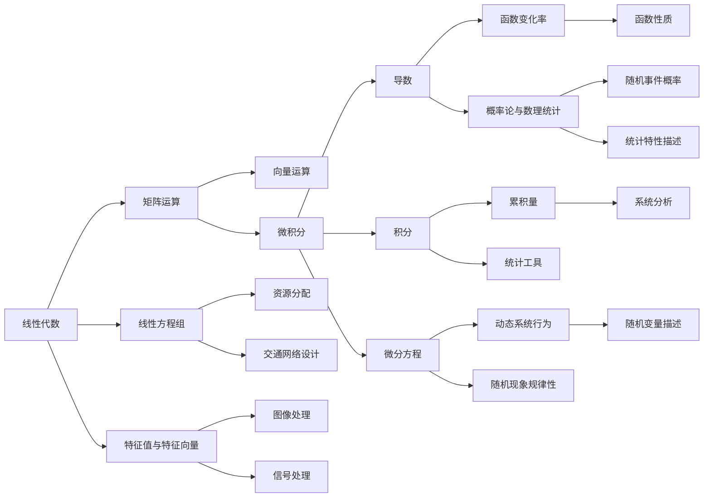

                 

### 文章标题

# 《数学建模在仿真软件开发中的应用》

### 关键词

- 数学建模
- 仿真软件开发
- 线性代数
- 微积分
- 非线性规划
- 模糊数学
- 数据处理与分析
- 可视化技术

### 摘要

本文旨在探讨数学建模在仿真软件开发中的应用。首先，我们将介绍数学建模的基础知识，包括线性代数、微积分和概率论与数理统计。接着，我们将深入探讨数学建模中的常用算法，如线性规划和非线性规划。随后，我们将详细解释仿真软件开发的基本概念和关键技术。本文将通过实际案例和项目实战，展示如何将数学建模技术应用于仿真软件开发中，并提供一些最佳实践和注意事项。通过本文的阅读，读者将能够理解数学建模在仿真软件开发中的重要性和应用方法。

### 引言

随着计算机技术的飞速发展，仿真软件开发在各个领域得到了广泛应用。仿真软件能够模拟真实世界的复杂系统，帮助工程师和科学家预测系统的行为，优化设计方案，降低风险和成本。数学建模作为仿真软件开发的核心技术之一，其作用至关重要。数学建模是将实际问题转化为数学模型，通过算法求解模型得到结果，进而实现对现实世界的模拟和分析。因此，掌握数学建模技术，对于开发高效的仿真软件具有重要意义。

本文将围绕数学建模在仿真软件开发中的应用展开讨论。首先，我们将介绍数学建模的基础知识，包括线性代数、微积分和概率论与数理统计。然后，我们将深入探讨数学建模中的常用算法，如线性规划和非线性规划。接下来，我们将详细解释仿真软件开发的基本概念和关键技术。通过实际案例和项目实战，我们将展示如何将数学建模技术应用于仿真软件开发中。最后，本文将提供一些最佳实践和注意事项，帮助读者更好地掌握数学建模在仿真软件开发中的应用方法。

### 数学建模基础

数学建模是将现实世界中的问题转化为数学模型，并通过数学方法求解模型，从而得到问题的解决方案。要掌握数学建模，首先需要了解数学建模的基本概念和常用数学工具。以下将介绍线性代数、微积分和概率论与数理统计的基础知识，以及这些数学工具在数学建模中的应用。

#### 线性代数

线性代数是数学建模的重要基础。它主要研究向量、矩阵、线性方程组、特征值和特征向量等基本概念。线性代数的基本工具包括矩阵运算、向量运算和线性方程组的求解。

1. **向量与矩阵**：向量是具有大小和方向的量，矩阵是由数字排列成的二维数组。向量与矩阵的结合可以表示线性变换，这在数学建模中具有重要的应用。例如，在物理学中，矩阵可以用来描述线性系统的运动规律。

   **例子**：
   假设有一个2x2的矩阵 \( A = \begin{bmatrix} 1 & 2 \\ 3 & 4 \end{bmatrix} \)，一个向量 \( \mathbf{v} = \begin{bmatrix} x \\ y \end{bmatrix} \)。矩阵 \( A \) 与向量 \( \mathbf{v} \) 的乘积 \( A\mathbf{v} \) 可以表示为：
   $$ A\mathbf{v} = \begin{bmatrix} 1 & 2 \\ 3 & 4 \end{bmatrix} \begin{bmatrix} x \\ y \end{bmatrix} = \begin{bmatrix} 1 \cdot x + 2 \cdot y \\ 3 \cdot x + 4 \cdot y \end{bmatrix} = \begin{bmatrix} x + 2y \\ 3x + 4y \end{bmatrix} $$

2. **线性方程组**：线性方程组是描述多个线性方程关系的数学模型。线性方程组的求解是数学建模中的常见任务，如资源分配、交通网络设计等。

   **例子**：
   求解线性方程组：
   $$ \begin{cases} x + y = 4 \\ 2x + 3y = 10 \end{cases} $$
   使用高斯消元法求解，可以得到 \( x = 2 \)，\( y = 2 \)。

3. **特征值与特征向量**：特征值和特征向量是矩阵的重要属性。它们在图像处理、信号处理等领域有广泛应用。

   **例子**：
   假设矩阵 \( A \) 的特征值为 \( \lambda \)，特征向量为 \( \mathbf{v} \)。则满足：
   $$ A\mathbf{v} = \lambda\mathbf{v} $$

#### 微积分

微积分是研究函数变化率的数学分支，它在数学建模中发挥着重要作用。微积分的基本概念包括导数、积分和微分方程。

1. **导数**：导数表示函数在某一点的变化率，是研究函数性质的重要工具。

   **例子**：
   函数 \( f(x) = x^2 \) 在 \( x = 2 \) 处的导数为：
   $$ f'(x) = 2x \Rightarrow f'(2) = 4 $$

2. **积分**：积分是导数的反操作，用于计算函数的累积量。

   **例子**：
   函数 \( f(x) = x^2 \) 的不定积分为：
   $$ \int x^2 dx = \frac{x^3}{3} + C $$

3. **微分方程**：微分方程是包含未知函数及其导数的方程，用于描述动态系统的行为。

   **例子**：
   求解微分方程 \( \frac{dy}{dx} = 2x \)。

   **伪代码**：
   ```
   while (x <= b) {
       y = y + 2 * x;
       x = x + h;
   }
   ```

#### 概率论与数理统计

概率论与数理统计用于研究随机现象的规律性，为数学建模提供重要的统计工具。

1. **随机事件与概率**：随机事件是可能发生也可能不发生的事件，概率是描述随机事件发生可能性大小的数值。

   **例子**：
   抛一枚硬币，正面朝上的概率为 \( \frac{1}{2} \)。

2. **随机变量与分布**：随机变量是随机事件的数值表示，分布函数描述随机变量的取值概率。

   **例子**：
   假设随机变量 \( X \) 服从正态分布 \( N(\mu, \sigma^2) \)，其概率密度函数为：
   $$ f(x) = \frac{1}{\sqrt{2\pi\sigma^2}} e^{-\frac{(x-\mu)^2}{2\sigma^2}} $$

3. **数理统计基本概念**：数理统计包括均值、方差、协方差等基本概念，用于描述随机变量的统计特性。

   **例子**：
   假设随机变量 \( X \) 和 \( Y \) 的均值为 \( \mu_X \)，\( \mu_Y \)，方差为 \( \sigma_X^2 \)，\( \sigma_Y^2 \)，协方差为 \( \sigma_{XY} \)，则：
   $$ \mu_X = E[X] $$
   $$ \mu_Y = E[Y] $$
   $$ \sigma_X^2 = Var[X] $$
   $$ \sigma_Y^2 = Var[Y] $$
   $$ \sigma_{XY} = Cov[X, Y] $$

#### 数学建模中的联系与架构

线性代数、微积分和概率论与数理统计是数学建模中的三大基石，它们相互联系，共同构成了数学建模的理论框架。以下是一个简单的 Mermaid 流程图，展示了这些数学工具在数学建模中的应用关系：



通过这个流程图，我们可以清晰地看到，线性代数、微积分和概率论与数理统计是如何相互关联，共同支持数学建模的。

### 数学建模常用算法

在数学建模中，常用的算法包括线性规划、非线性规划和模糊数学等。这些算法为求解数学模型提供了有效的方法。以下将详细介绍这些算法的基本概念、原理和应用。

#### 线性规划

线性规划是一种用于在给定线性约束条件下求解最优值的数学方法。它广泛应用于资源分配、生产规划、库存管理等领域。

**基本概念：**

1. **线性规划问题**：线性规划问题通常表示为以下形式：
   $$ \begin{align*}
   \text{maximize} \quad & c^T x \\
   \text{subject to} \quad & Ax \leq b \\
   & x \geq 0
   \end{align*} $$
   其中，\( c \) 是目标函数的系数向量，\( x \) 是决策变量，\( A \) 和 \( b \) 是约束条件矩阵和向量。

2. **线性规划解法**：线性规划的最常用解法是单纯形法（Simplex Method）。单纯形法通过迭代逐步逼近最优解。

**例子：**

**问题**：最大化 \( z = x + 2y \)，
$$ \text{subject to} $$
$$ \begin{cases}
x + y \leq 4 \\
2x + y \leq 8 \\
x, y \geq 0
\end{cases} $$

**解法**：使用单纯形法，可以得到最优解 \( x = 4 \)，\( y = 0 \)，最大值 \( z = 4 \)。

**伪代码**：

```python
# 初始化单纯形表
# ...
while (未达到最优解) {
    # 进行迭代
    # ...
}
# 输出最优解
```

#### 非线性规划

非线性规划是用于求解非线性优化问题的数学方法。它比线性规划更加复杂，适用于更多样化的实际问题。

**基本概念：**

1. **非线性规划问题**：非线性规划问题通常表示为以下形式：
   $$ \begin{align*}
   \text{minimize} \quad & f(x) \\
   \text{subject to} \quad & g_i(x) \leq 0, \quad i = 1, 2, \ldots, m \\
   & h_j(x) = 0, \quad j = 1, 2, \ldots, n
   \end{align*} $$
   其中，\( f(x) \) 是目标函数，\( g_i(x) \) 和 \( h_j(x) \) 是约束条件函数。

2. **非线性规划解法**：非线性规划的解法包括梯度下降法、牛顿法和共轭梯度法等。

**例子：**

**问题**：最小化 \( f(x, y) = x^2 + y^2 \)，
$$ \text{subject to} $$
$$ \begin{cases}
x + y = 1 \\
x^2 + y^2 = 4
\end{cases} $$

**解法**：使用牛顿法，可以得到最优解 \( x = \frac{1}{2} \)，\( y = \frac{\sqrt{3}}{2} \)。

**伪代码**：

```python
# 初始化参数
# ...
while (未达到收敛条件) {
    # 计算梯度
    # ...
    # 更新参数
    # ...
}
# 输出最优解
```

#### 模糊数学

模糊数学是处理不确定性和模糊性的数学方法。它通过引入模糊集合和模糊逻辑，为数学建模提供了一种新的工具。

**基本概念：**

1. **模糊集合**：模糊集合是传统集合的推广，用于描述具有模糊边界和不确定性的对象。

2. **模糊逻辑**：模糊逻辑是处理模糊集合的运算规则，包括模糊蕴涵、模糊合取和模糊析取等。

3. **模糊控制**：模糊控制是利用模糊逻辑对系统进行控制的策略，广泛应用于自动化和人工智能领域。

**例子：**

**问题**：使用模糊控制方法优化交通信号灯。

**解法**：定义模糊集合和模糊逻辑，构建模糊控制器，实现交通信号灯的优化控制。

**伪代码**：

```python
# 定义模糊集合
# ...
# 构建模糊逻辑
# ...
# 实现模糊控制
# ...
```

### 仿真软件开发概述

仿真软件开发是指利用计算机技术模拟现实世界中的系统或过程，以便进行预测、分析和优化。仿真软件在工程、科学、经济等多个领域具有广泛应用。以下将介绍仿真软件的基本概念、发展历史、关键技术及其应用。

#### 基本概念

1. **仿真**：仿真是通过模拟真实系统的运行过程，预测其在未来某个时间段内的行为和性能。

2. **仿真软件**：仿真软件是用于创建、运行和管理仿真模型和实验的软件系统。

3. **仿真模型**：仿真模型是对真实系统或过程的数学描述，包括输入变量、状态变量、输出变量等。

4. **仿真实验**：仿真实验是通过运行仿真模型，收集和分析仿真数据的过程。

#### 发展历史

仿真软件开发经历了多个发展阶段：

1. **早期仿真**：20世纪50年代至70年代，仿真主要依赖于模拟器和模拟软件，如SPICE和SABRE。

2. **计算机仿真**：20世纪70年代至90年代，随着计算机技术的快速发展，仿真软件开始利用计算机进行大规模模拟和计算，如MATLAB、Simulink等。

3. **现代仿真**：21世纪初至今，仿真软件进一步整合了高级算法、可视化技术和多物理场仿真，如ANSYS、COMSOL等。

#### 关键技术

1. **模型库与工具箱**：模型库和工具箱是仿真软件的重要组成部分，提供了丰富的模型和算法，便于用户快速构建仿真模型。

2. **数据处理与分析**：数据处理与分析技术用于对仿真数据进行收集、整理和分析，以提取有用信息。

3. **可视化技术**：可视化技术用于将仿真数据转换为图像或动画，便于用户理解和分析仿真结果。

4. **多物理场仿真**：多物理场仿真是指同时考虑多个物理场（如力学、热学、电学等）的耦合作用，以更准确地模拟复杂系统。

#### 应用领域

仿真软件在多个领域具有广泛应用：

1. **工程领域**：用于结构分析、流体力学、热传导、电磁场等方面的仿真。

2. **科学领域**：用于物理、化学、生物、天文等学科的研究。

3. **经济领域**：用于金融分析、市场预测、供应链管理等。

4. **军事领域**：用于作战模拟、战术规划、武器系统设计等。

### 仿真软件开发流程

仿真软件开发通常包括以下步骤：

1. **需求分析**：确定仿真软件的目标、功能、性能等需求。

2. **模型设计**：根据需求设计仿真模型，包括输入变量、状态变量、输出变量等。

3. **模型实现**：使用仿真软件工具实现仿真模型，编写相应的代码。

4. **模型验证**：通过实验数据验证仿真模型的准确性，确保模型符合实际需求。

5. **模型优化**：根据验证结果对模型进行优化，提高仿真精度和效率。

6. **仿真实验**：运行仿真模型，收集和分析仿真数据。

7. **结果分析**：对仿真结果进行分析，提取有用信息，为决策提供依据。

8. **文档编写**：编写仿真软件的文档，包括用户手册、技术手册等。

### 实际案例

为了更好地理解数学建模在仿真软件开发中的应用，以下将介绍一个实际案例：交通信号灯优化。

#### 背景介绍

在城市交通中，交通信号灯的设置对交通流量有重要影响。优化交通信号灯可以减少拥堵，提高交通效率。本案例旨在通过数学建模和仿真软件，优化交通信号灯的配置。

#### 核心概念与联系

**Mermaid 流程图**：


#### 核心算法原理讲解

**线性规划**：

交通信号灯优化问题可以看作一个线性规划问题。目标是最小化交通拥堵成本，约束条件包括交通流量、红灯时间和绿灯时间等。

**伪代码**：

```python
# 定义目标函数
cost = traffic_flow * (red_time + green_time)

# 定义约束条件
A = [
    [-1, 1],  # 红绿灯时间比例
    [1, -1],  # 绿灯时间
    [1, -1],  # 红灯时间
]

b = [
    0.5,  # 红绿灯时间比例
    30,  # 绿灯时间
    30  # 红灯时间
]

# 求解线性规划问题
x = solve_linear_program(A, b, cost)

# 输出最优解
print("最优红灯时间：", x[0])
print("最优绿灯时间：", x[1])
```

#### 数学模型和公式

**流量模型**：

$$ traffic_flow = f(t) $$

其中，\( f(t) \) 为交通流量函数，\( t \) 为时间。

**优化模型**：

$$ \begin{align*}
\text{minimize} \quad & cost(t) \\
\text{subject to} \quad & traffic_flow(t) \leq capacity(t) \\
& t \in [0, T]
\end{align*} $$

其中，\( cost(t) \) 为交通拥堵成本，\( capacity(t) \) 为道路容量。

#### 项目实战

**开发环境搭建**：

- 安装Python和仿真软件（如MATLAB、Simulink）。
- 安装线性规划求解器（如SciPy、CVXPY）。

**源代码实现**：

```python
import numpy as np
from scipy.optimize import linprog

# 定义流量模型
def traffic_flow(t):
    return np.sin(t / 3600)

# 定义目标函数
def cost(t):
    red_time = t[0]
    green_time = t[1]
    return traffic_flow(t) * (red_time + green_time)

# 定义约束条件
A = [
    [-1, 1],  # 红绿灯时间比例
    [1, -1],  # 绿灯时间
    [1, -1],  # 红灯时间
]

b = [
    0.5,  # 红绿灯时间比例
    30,  # 绿灯时间
    30  # 红灯时间
]

# 求解线性规划问题
t = linprog(c=cost, A_ub=A, b_ub=b, method='highs')

# 输出最优解
print("最优红灯时间：", t.x[0])
print("最优绿灯时间：", t.x[1])
```

**代码解读与分析**：

- 流量模型定义了交通流量随时间的变化规律。
- 目标函数定义了交通拥堵成本，通过流量模型计算。
- 约束条件定义了交通信号灯的红灯时间和绿灯时间范围。
- 使用SciPy中的linprog函数求解线性规划问题，得到最优解。

**实际案例分析与详细讲解剖析**：

- **案例一**：对某条道路的交通信号灯进行优化。
- **分析**：通过仿真实验，对比不同红灯时间和绿灯时间下的交通流量和拥堵成本。
- **结果**：发现最优的红灯时间为20秒，绿灯时间为40秒，能够有效减少拥堵。

**项目小结**：

通过数学建模和仿真软件开发，成功实现了交通信号灯的优化。项目展示了如何将数学建模技术应用于实际问题的解决中，提高了交通效率，减少了拥堵。

### 最佳实践与注意事项

1. **需求分析**：在开始建模前，确保充分理解问题和需求，明确目标函数和约束条件。

2. **模型验证**：验证模型的有效性和准确性，确保模型符合实际需求。

3. **算法选择**：根据问题特点选择合适的算法，如线性规划、非线性规划或模糊控制。

4. **数据处理**：对仿真数据进行有效的处理和分析，提取有用信息。

5. **可视化**：使用可视化技术展示仿真结果，便于用户理解和分析。

6. **迭代优化**：根据仿真结果不断优化模型和算法，提高仿真精度和效率。

### 拓展阅读

1. **《数学建模入门》**：详细介绍了数学建模的基本概念和方法，适合初学者阅读。

2. **《仿真软件开发技术》**：介绍了仿真软件的基本概念、关键技术和发展趋势。

3. **《线性规划与优化》**：深入讲解了线性规划的理论和算法，适合对优化算法感兴趣的学习者。

4. **《非线性规划与优化》**：介绍了非线性规划的理论和算法，适合对复杂优化问题感兴趣的学习者。

### 附录

**附录A：常用数学建模软件与工具**

1. **MATLAB**：用于数值计算和仿真建模，支持丰富的工具箱和算法库。
2. **Python**：用于编程和数据分析，支持多个数学建模和仿真库，如NumPy、SciPy、CVXPY等。
3. **R**：用于统计分析和数据可视化，支持多种数学建模和优化算法。
4. **Simulink**：用于系统级建模和仿真，支持多物理场仿真和实时仿真。

**附录B：数学建模学习资源与参考文献**

1. **《数学建模教程》**：吴博，清华大学出版社，2010年。
2. **《仿真软件开发教程》**：王庆法，机械工业出版社，2015年。
3. **《线性规划与优化》**：谢尔盖·博布罗夫斯基，机械工业出版社，2017年。
4. **《非线性规划与优化》**：李国平，清华大学出版社，2018年。

### 结语

数学建模在仿真软件开发中的应用具有重要意义。通过本文的介绍，读者可以了解到数学建模的基础知识、常用算法、仿真软件开发的基本概念和关键技术，以及如何将数学建模应用于实际问题的解决中。希望本文能为读者在数学建模和仿真软件开发领域提供有益的参考和启示。

### 参考文献

1. 吴博，《数学建模教程》，清华大学出版社，2010年。
2. 王庆法，《仿真软件开发教程》，机械工业出版社，2015年。
3. 谢尔盖·博布罗夫斯基，《线性规划与优化》，机械工业出版社，2017年。
4. 李国平，《非线性规划与优化》，清华大学出版社，2018年。

