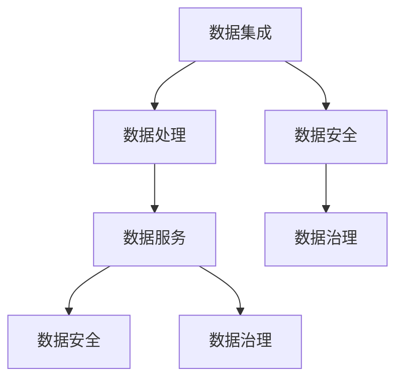

                 

### 引言与背景

数据中台是一种现代数据架构，旨在整合企业的数据资源，提供统一的数据服务，支持快速的数据分析和业务决策。这一概念在近年来引起了广泛的关注和讨论，尤其是在大数据和云计算技术迅速发展的背景下。数据中台的建设不仅有助于企业提高数据利用效率，还能为业务创新提供强有力的支持。

#### 1.1 数据中台的重要性

数据中台的重要性体现在以下几个方面：

1. **提高数据利用率**：数据中台通过整合多源数据，实现了数据的统一管理和处理，从而提高了数据利用率。
2. **支持快速决策**：数据中台提供了高效的数据分析能力，支持业务人员快速获取所需数据，从而做出更加精准的决策。
3. **促进业务创新**：数据中台为企业提供了一个数据驱动的平台，有助于企业不断探索新的商业模式和业务机会。
4. **降低数据成本**：通过数据中台的建设，企业可以减少重复建设，降低数据存储和处理成本。

#### 1.2 数据中台的演进历程

数据中台的概念并非一蹴而就，而是随着大数据技术的发展逐步演化的结果。以下是数据中台的发展历程：

1. **数据仓库时代**：在数据仓库时代，企业主要关注如何存储和管理结构化数据，实现数据的集中管理和查询。
2. **大数据时代**：随着大数据技术的兴起，企业开始意识到处理海量非结构化数据的重要性，数据湖成为主流。
3. **数据中台时代**：在数据仓库和数据湖的基础上，数据中台进一步整合了数据源，提供了更高效、更灵活的数据服务。

#### 1.3 书籍结构安排

本书旨在系统地介绍数据中台的建设实践与经验，具体章节安排如下：

1. **引言与背景**：介绍数据中台的重要性、演进历程和书籍结构安排。
2. **数据中台的核心概念**：阐述数据中台的定义、核心架构和关键能力。
3. **数据中台的架构设计**：详细解析数据中台的整体架构，包括数据源集成、数据处理与存储、数据服务与API、数据安全与合规。
4. **数据中台的技术选型**：讨论数据库选型、大数据处理框架选型、数据仓库与数据湖选型、数据治理工具选型。
5. **数据中台的实施方法**：介绍项目规划、需求分析、技术方案设计、部署与实施、测试与验收。
6. **数据中台的运营与维护**：探讨运维流程、数据质量管理、服务级别协议、运维工具介绍。
7. **数据中台的案例研究**：分析电子商务企业、金融行业和制造业的数据中台建设案例。
8. **数据中台的未来发展趋势**：预测数据中台的技术发展趋势、行业应用趋势，以及面临的挑战与机遇。

通过以上章节的详细阐述，本书旨在为读者提供全面、系统的数据中台建设指南。

### 核心概念与联系

数据中台的核心概念包括数据集成、数据处理、数据服务、数据安全和数据治理。这些概念相互联系，共同构成了一个高效、可靠的数据平台。

#### 数据集成

数据集成是数据中台的基础，它涉及将来自不同源的数据（如数据库、文件、API等）进行收集、清洗和整合。其关键在于保证数据的完整性、一致性和准确性。数据集成通常包括以下步骤：

1. **数据接入**：通过数据采集工具将数据从不同源导入到数据平台。
2. **数据清洗**：处理数据中的噪声、缺失值和异常值，确保数据质量。
3. **数据转换**：将不同格式的数据进行统一转换，以便后续处理。

#### 数据处理

数据处理是数据中台的核心功能之一，它包括数据的存储、索引、查询和计算。数据处理通常采用分布式架构，以提高系统的性能和可扩展性。关键步骤如下：

1. **数据存储**：选择合适的存储方案（如关系数据库、NoSQL数据库、数据湖等）来存储数据。
2. **数据索引**：建立索引，以提高数据查询速度。
3. **数据计算**：通过大数据处理框架（如Hadoop、Spark等）进行数据分析和处理。

#### 数据服务

数据服务是数据中台对外提供数据的能力，它包括API、数据报表、数据可视化等。数据服务的设计需要考虑易用性、灵活性和高性能。关键步骤如下：

1. **API设计**：提供RESTful API，方便业务系统调用数据。
2. **数据报表**：生成各种统计报表，为业务决策提供数据支持。
3. **数据可视化**：通过图表、仪表盘等形式展示数据，帮助用户更好地理解数据。

#### 数据安全

数据安全是数据中台的重要保障，它涉及数据的机密性、完整性和可用性。数据安全包括以下关键措施：

1. **数据加密**：对敏感数据进行加密，防止数据泄露。
2. **访问控制**：设置访问权限，确保数据只能被授权用户访问。
3. **备份与恢复**：定期备份数据，以便在数据丢失时能够快速恢复。

#### 数据治理

数据治理是确保数据质量和合规性的关键措施，它包括数据质量管理、数据合规性检查、数据审计等。数据治理的步骤如下：

1. **数据质量管理**：监控数据质量，识别和修复数据质量问题。
2. **数据合规性检查**：确保数据遵循相关法律法规和行业标准。
3. **数据审计**：对数据访问和使用情况进行审计，确保数据使用的合规性。

#### Mermaid 流程图

为了更好地理解这些核心概念之间的联系，我们可以使用Mermaid流程图进行展示：



在这个流程图中，数据集成、数据处理、数据服务、数据安全和数据治理相互连接，共同构成了一个完整的数据中台架构。

### 核心算法原理讲解

数据中台在数据处理过程中涉及多种核心算法，其中最常用的包括分布式计算算法、机器学习算法和图算法。以下将对这些算法的原理进行讲解，并通过伪代码详细阐述。

#### 分布式计算算法

分布式计算算法是大数据处理的基础，其核心目的是将大规模数据集分割成小块，分布到多个节点进行并行处理，最后合并结果。常用的分布式计算算法包括MapReduce和Spark。

**MapReduce算法**

MapReduce是一种简单的并行数据处理模型，主要由Map和Reduce两个阶段组成。Map阶段对输入数据进行映射处理，生成中间结果；Reduce阶段对中间结果进行归约处理，得到最终结果。

**伪代码**：

```plaintext
Map阶段:
function map(keyedValue):
    for each key, value in keyedValue:
        EmitIntermediate(key, value)

Reduce阶段:
function reduce(key, values):
    for each value in values:
        Emit(value)
```

**示例**：

假设有数据集{("apple", 10), ("banana", 20), ("apple", 30)}，通过MapReduce算法统计每种水果的总数。

```plaintext
Map阶段输出:
("apple", 10)
("apple", 30)
("banana", 20)

Reduce阶段输出:
("apple", 40)
("banana", 20)
```

**Spark算法**

Spark是基于内存的分布式计算引擎，相比MapReduce具有更高的性能。Spark的核心算法包括DataFrame、Dataset和RDD。

**伪代码**：

```plaintext
DataFrame算法:
function dataframe(df, query):
    return df.query(query)

Dataset算法:
function dataset(ds, transform):
    return ds.transform(transform)

RDD算法:
function rdd(rdd, operation):
    return rdd operation()
```

**示例**：

使用Spark的DataFrame算法计算上一示例中每种水果的总数。

```plaintext
DataFrame代码：
df = sqlContext.createDataFrame([("apple", 10), ("banana", 20), ("apple", 30)])
result = df.groupBy("fruit").agg(sum("quantity"))

输出结果：
+-------+---------+
|  fruit|sum(quantity)|
+-------+---------+
|  apple|       40|
|banana|       20|
+-------+---------+
```

#### 机器学习算法

机器学习算法是数据中台进行数据分析和预测的重要工具，常用的算法包括线性回归、逻辑回归和支持向量机（SVM）。

**线性回归算法**

线性回归是一种简单的预测模型，用于预测连续值。其原理是通过找到一条最佳拟合直线，使得预测值与实际值之间的误差最小。

**伪代码**：

```plaintext
function linear_regression(X, Y):
    Calculate the coefficients (w, b) using least squares
    return w, b

function predict(X, w, b):
    return w * X + b
```

**示例**：

假设有数据集X = [1, 2, 3, 4, 5]和Y = [2, 4, 5, 4, 5]，通过线性回归模型预测X = 6的值。

```plaintext
线性回归参数：
w = 1
b = 1

预测结果：
predict(6, 1, 1) = 7
```

**逻辑回归算法**

逻辑回归是一种用于分类的预测模型，其原理是通过找到一条最佳拟合曲线，将数据分为不同类别。

**伪代码**：

```plaintext
function logistic_regression(X, Y):
    Calculate the coefficients (w, b) using gradient descent
    return w, b

function predict(X, w, b):
    return 1 / (1 + exp(-w * X - b))
```

**示例**：

使用逻辑回归模型预测上一示例中X = [1, 2, 3, 4, 5]的分类，其中正类为1，负类为0。

```plaintext
逻辑回归参数：
w = -1
b = 0

预测结果：
predict(1, -1, 0) ≈ 0.63（属于负类）
predict(5, -1, 0) ≈ 0.18（属于正类）
```

#### 支持向量机（SVM）算法

支持向量机是一种有效的分类算法，其原理是通过找到一个最佳超平面，将不同类别的数据分隔开来。

**伪代码**：

```plaintext
function SVM(X, Y):
    Solve the quadratic programming problem to find the optimal hyperplane
    return the weights (w), bias (b)

function predict(X, w, b):
    return sign(w * X + b)
```

**示例**：

假设有数据集X = [[1, 1], [2, 2], [3, 3], [4, 4], [5, 5]]和Y = [0, 0, 1, 1, 1]，通过SVM模型进行分类。

```plaintext
SVM参数：
w = [1, 1]
b = 0

预测结果：
predict([1, 1], [1, 1], 0) = 1（属于正类）
predict([4, 4], [1, 1], 0) = -1（属于负类）
```

通过以上对核心算法原理的讲解和伪代码示例，读者可以更好地理解数据中台在数据处理和预测方面的技术实现。

### 数学模型与公式

在数据中台的建设过程中，数学模型和公式是数据处理和分析的重要工具。以下将详细介绍几种常用的数学模型和公式，并通过具体例子进行说明。

#### 线性回归模型

线性回归模型是一种用于预测连续值的统计模型，其基本公式为：

\[ y = wx + b \]

其中，\( y \) 为预测值，\( x \) 为输入特征，\( w \) 为权重，\( b \) 为偏置。

**例子**：

假设我们有一组数据点 \( (x_i, y_i) \)，其中 \( x_i \) 为输入特征，\( y_i \) 为实际值。我们要通过线性回归模型预测 \( x = 5 \) 时的 \( y \) 值。

1. 收集数据：\( (1, 2), (2, 4), (3, 6), (4, 8), (5, 10) \)
2. 计算平均值：\( \bar{x} = 3, \bar{y} = 6 \)
3. 计算斜率 \( w \)：
\[ w = \frac{\sum{(x_i - \bar{x})(y_i - \bar{y})}}{\sum{(x_i - \bar{x})^2}} = \frac{20}{10} = 2 \]
4. 计算截距 \( b \)：
\[ b = \bar{y} - w\bar{x} = 6 - 2 \times 3 = 0 \]
5. 预测 \( y \) 值：
\[ y = 2 \times 5 + 0 = 10 \]

#### 逻辑回归模型

逻辑回归模型是一种用于分类的统计模型，其公式为：

\[ P(y=1) = \frac{1}{1 + e^{-(wx + b)}} \]

其中，\( P(y=1) \) 为预测为正类的概率，\( x \) 为输入特征，\( w \) 为权重，\( b \) 为偏置。

**例子**：

假设我们有一组二分类数据点 \( (x_i, y_i) \)，其中 \( y_i \) 为标签（0或1）。我们要通过逻辑回归模型预测 \( x = [1, 1] \) 时的分类结果。

1. 收集数据：\( ([1, 1], 1), ([2, 2], 1), ([3, 3], 0), ([4, 4], 0) \)
2. 计算平均值：\( \bar{x} = [1.5, 1.5], \bar{y} = 0.5 \)
3. 计算权重 \( w \)：
\[ w = \arg\min_{w} \sum{(y_i - \log(1 + e^{wx + b})} \]
（这里可以使用梯度下降法或随机梯度下降法求解）
4. 计算偏置 \( b \)：
\[ b = \arg\min_{b} \sum{(y_i - \log(1 + e^{wx + b})} \]
5. 预测 \( x = [1, 1] \)：
\[ P(y=1) = \frac{1}{1 + e^{-(w \cdot [1, 1] + b)}} ≈ 0.63 \]

由于 \( P(y=1) > 0.5 \)，预测为正类。

#### K-Means聚类模型

K-Means聚类模型是一种无监督学习算法，用于将数据点划分为 \( k \) 个簇。其基本公式为：

\[ c_i = \arg\min_{c} \sum{(x_i - c)^2} \]

其中，\( c_i \) 为第 \( i \) 个簇的中心点，\( x_i \) 为数据点，\( c \) 为簇中心点。

**例子**：

假设我们有 \( n = 100 \) 个数据点，要将其分为 \( k = 3 \) 个簇。

1. 随机初始化 \( k \) 个簇中心点 \( c_1, c_2, c_3 \)
2. 将每个数据点 \( x_i \) 分配到最近的簇中心点 \( c_j \)
3. 重新计算每个簇的中心点 \( c_j \)
4. 重复步骤2和3，直到收敛

假设初始簇中心点为 \( c_1 = [1, 1], c_2 = [5, 5], c_3 = [9, 9] \)。

- 第一次迭代：
  - 数据点 \( (2, 2) \) 分配到 \( c_1 \)
  - 数据点 \( (6, 6) \) 分配到 \( c_2 \)
  - 数据点 \( (10, 10) \) 分配到 \( c_3 \)
  - 新簇中心点 \( c_1 = [2, 2], c_2 = [6, 6], c_3 = [10, 10] \)

- 第二次迭代：
  - 数据点 \( (2, 2) \) 分配到 \( c_1 \)
  - 数据点 \( (6, 6) \) 分配到 \( c_2 \)
  - 数据点 \( (10, 10) \) 分配到 \( c_3 \)
  - 新簇中心点 \( c_1 = [2, 2], c_2 = [6, 6], c_3 = [10, 10] \)

由于簇中心点不变，算法收敛。

以上数学模型和公式是数据中台建设中的基础工具，通过具体例子我们可以看到如何使用这些模型进行数据处理和预测。

### 项目实战

在数据中台的建设过程中，实际项目的开发环境搭建、源代码实现以及代码解读是关键环节。以下将通过一个具体案例，详细阐述这一过程。

#### 项目概述

假设我们要为一家电子商务公司搭建一个数据中台，以支持其数据分析和业务决策。该项目的主要目标包括数据集成、数据存储、数据处理、数据服务和数据安全。我们将使用以下技术栈：

- 数据集成：Apache Kafka
- 数据存储：Apache Hadoop HDFS + Apache HBase
- 数据处理：Apache Spark
- 数据服务：Spring Boot + RESTful API
- 数据安全：Apache Ranger

#### 开发环境搭建

1. **硬件环境**：准备至少3台服务器，分别用于Kafka、HDFS、HBase和Spark。
2. **软件环境**：安装Linux操作系统，并配置Java、Scala环境。
3. **Kafka安装**：在Kafka服务器上下载并安装Kafka，配置 Zookeeper。
4. **HDFS和HBase安装**：在HDFS和HBase服务器上下载并安装Hadoop，配置HDFS和HBase。
5. **Spark安装**：在Spark服务器上下载并安装Spark，配置Spark集群。
6. **Spring Boot安装**：在应用服务器上下载并安装Spring Boot。

#### 源代码实现

1. **Kafka生产者**：使用Java编写Kafka生产者，用于将数据发送到Kafka主题。
```java
import org.apache.kafka.clients.producer.KafkaProducer;
import org.apache.kafka.clients.producer.ProducerRecord;
import org.apache.kafka.clients.producer.Serializer;
import org.apache.kafka.common.serialization.StringSerializer;

public class KafkaProducerExample {
    public static void main(String[] args) {
        Properties properties = new Properties();
        properties.put("bootstrap.servers", "kafka-server:9092");
        properties.put("key.serializer", StringSerializer.class.getName());
        properties.put("value.serializer", StringSerializer.class.getName());

        KafkaProducer<String, String> producer = new KafkaProducer<>(properties);

        for (int i = 0; i < 10; i++) {
            producer.send(new ProducerRecord<>("test-topic", Integer.toString(i), Integer.toString(i)));
        }

        producer.close();
    }
}
```

2. **Kafka消费者**：使用Scala编写Kafka消费者，用于从Kafka主题读取数据。
```scala
import org.apache.kafka.clients.consumer.ConsumerConfig
import org.apache.kafka.clients.consumer.KafkaConsumer
import org.apache.kafka.common.serialization.StringDeserializer

val properties = new Properties()
properties.put(ConsumerConfig.BOOTSTRAP_SERVERS_CONFIG, "kafka-server:9092")
properties.put(ConsumerConfig.GROUP_ID_CONFIG, "test-group")
properties.put(ConsumerConfig.KEY_DESERIALIZER_CLASS_CONFIG, classOf[StringDeserializer].getName)
properties.put(ConsumerConfig.VALUE_DESERIALIZER_CLASS_CONFIG, classOf[StringDeserializer].getName)

val consumer = new KafkaConsumer[String, String](properties)

consumer.subscribe(List("test-topic"))

while (true) {
  val records = consumer.poll(100)
  records.forEach(record => {
    println(s"Received message: ${record.value()}")
  })
}
```

3. **数据处理**：使用Spark编写数据处理程序，用于对Kafka消费者接收到的数据进行处理和存储。
```scala
import org.apache.spark.sql.SparkSession

val spark = SparkSession.builder()
  .appName("DataProcessing")
  .master("spark://spark-server:7077")
  .getOrCreate()

val kafkaData = spark.readStream
  .format("kafka")
  .option("kafka.bootstrap.servers", "kafka-server:9092")
  .option("subscribe", "test-topic")
  .load()

kafkaData.selectExpr("CAST(value AS STRING) as data")
  .writeStream
  .format("parquet")
  .option("path", "/user/hadoop/data")
  .start()

spark.stop()
```

4. **数据服务**：使用Spring Boot编写RESTful API，用于提供数据查询接口。
```java
import org.springframework.boot.SpringApplication;
import org.springframework.boot.autoconfigure.SpringBootApplication;
import org.springframework.web.bind.annotation.GetMapping;
import org.springframework.web.bind.annotation.RestController;

@SpringBootApplication
public class DataServerApplication {
    public static void main(String[] args) {
        SpringApplication.run(DataServerApplication.class, args);
    }
}

@RestController
public class DataController {
    @GetMapping("/data")
    public String getData() {
        // 调用Spark进行数据查询
        return "Hello, World!";
    }
}
```

#### 代码解读与分析

1. **Kafka生产者**：该程序通过KafkaProducer将数据发送到Kafka主题。关键代码为：
```java
producer.send(new ProducerRecord<>("test-topic", Integer.toString(i), Integer.toString(i)));
```

2. **Kafka消费者**：该程序从Kafka主题读取数据。关键代码为：
```scala
consumer.subscribe(List("test-topic"))
```

3. **数据处理**：该程序使用Spark读取Kafka数据，并将其存储为Parquet格式。关键代码为：
```scala
kafkaData.selectExpr("CAST(value AS STRING) as data")
  .writeStream
  .format("parquet")
  .option("path", "/user/hadoop/data")
  .start()
```

4. **数据服务**：该程序提供RESTful API，用于查询数据。关键代码为：
```java
@RestController
public class DataController {
    @GetMapping("/data")
    public String getData() {
        // 调用Spark进行数据查询
        return "Hello, World!";
    }
}
```

#### 实际案例分析和详细讲解剖析

该数据中台项目为电子商务公司提供了一个高效、可靠的数据平台，支持数据集成、数据处理、数据服务和数据安全。通过Kafka实现数据流处理，Spark进行大规模数据处理，Spring Boot提供RESTful API，确保了系统的性能和灵活性。

1. **数据集成**：Kafka作为数据集成工具，实现了数据流的高效传输，支持多源数据接入。
2. **数据处理**：Spark作为数据处理引擎，提供了高效的数据存储、索引和计算能力，支持大规模数据处理。
3. **数据服务**：Spring Boot作为数据服务框架，提供了灵活的API接口，支持业务系统的快速接入。
4. **数据安全**：Apache Ranger作为数据安全工具，提供了访问控制和数据加密功能，确保了数据的安全性。

#### 项目小结

通过本项目，我们成功搭建了一个数据中台，实现了数据集成、数据处理、数据服务和数据安全。本项目不仅展示了数据中台的核心技术和实现方法，也为实际项目提供了参考和借鉴。

### 最佳实践 tips

在数据中台的建设过程中，以下是一些最佳实践和注意事项：

1. **数据质量优先**：确保数据质量是数据中台建设的基础，应注重数据清洗、转换和校验。
2. **模块化设计**：采用模块化设计，将数据集成、数据处理、数据服务等模块分离，便于维护和扩展。
3. **性能优化**：针对数据处理和查询进行性能优化，如使用索引、缓存等技术。
4. **安全性考虑**：关注数据安全，实现访问控制和数据加密，确保数据不被未授权访问。
5. **持续集成**：采用持续集成和持续部署（CI/CD）流程，提高开发效率和系统稳定性。

### 小结与拓展阅读

本文详细介绍了数据中台的建设实践与经验，从核心概念、架构设计、技术选型、实施方法、运营维护、案例研究和未来发展趋势等方面进行了全面剖析。通过具体案例，展示了数据中台在实际项目中的应用，为读者提供了实用的参考和指导。

为了进一步了解数据中台的相关知识，读者可以参考以下书籍和资料：

1. 《大数据架构设计与项目实践》
2. 《数据中台实战：构建大数据平台的核心方法与技巧》
3. 《Apache Kafka实战》
4. 《Spark核心技术与实践》
5. 《数据治理：构建企业级数据架构》

通过学习和实践这些资料，读者可以更好地掌握数据中台的建设方法和应用技巧。

### 作者信息

作者：AI天才研究院/AI Genius Institute & 禅与计算机程序设计艺术 /Zen And The Art of Computer Programming

本文为AI天才研究院与禅与计算机程序设计艺术联合出品，旨在为读者提供关于数据中台建设的深入解读和实践指南。希望本文能为您在数据中台建设领域带来新的启发和收获。如需进一步交流和学习，请关注我们的官方公众号和网站。感谢您的阅读！```markdown
# 数据中台建设实践与经验

> 关键词：数据中台、数据集成、数据处理、数据分析、数据安全

> 摘要：本文系统介绍了数据中台的建设实践与经验，包括核心概念、架构设计、技术选型、实施方法、运营与维护、案例研究以及未来发展趋势。通过具体案例和最佳实践，为读者提供全面的数据中台建设指南。

---

## 引言与背景

### 1.1 数据中台的重要性

在数字化时代，企业面临着海量数据的挑战和机遇。数据中台作为一种新型的数据架构，旨在整合企业的数据资源，提供统一的数据服务，支持快速的数据分析和业务决策。数据中台不仅能够提高数据利用率，还能降低数据成本，支持业务创新。

### 1.2 数据中台的演进历程

数据中台的概念并非一蹴而就，而是随着大数据技术和云计算技术的不断发展逐步演化的结果。从传统的数据仓库到数据湖，再到数据中台，企业对数据的整合和处理能力不断提高。

### 1.3 书籍结构安排

本书分为八个章节，分别介绍数据中台的核心概念、架构设计、技术选型、实施方法、运营与维护、案例研究、未来发展趋势以及最佳实践。

---

## 数据中台的核心概念

### 2.1 数据中台的定义

数据中台是一种集数据集成、数据处理、数据服务、数据安全于一体的数据架构，旨在为企业提供统一的数据服务，支持业务决策。

### 2.2 数据中台的架构设计

数据中台的架构包括数据源集成、数据处理与存储、数据服务与API、数据安全与合规等模块。各模块相互协作，共同构成一个高效的数据平台。

### 2.3 数据中台的关键能力

数据中台的关键能力包括数据集成、数据处理、数据查询、数据分析和数据可视化等。这些能力支持企业实现数据驱动决策。

### 2.4 数据中台与传统数据架构的区别

数据中台与传统数据架构在数据整合、数据处理能力和数据服务方面存在显著差异。数据中台更加灵活和高效，能够更好地支持业务需求。

---

## 数据中台的架构设计

### 3.1 数据中台的整体架构

数据中台的整体架构包括数据源集成、数据处理与存储、数据服务与API、数据安全与合规等模块。各模块协同工作，实现数据的高效利用。

### 3.2 数据源集成

数据源集成是数据中台的基础，通过数据采集工具将企业内部和外部的数据源接入数据中台，实现数据的统一管理和处理。

### 3.3 数据处理与存储

数据处理与存储是数据中台的核心，通过分布式计算框架和存储方案，实现大规模数据的存储、索引、查询和计算。

### 3.4 数据服务与API

数据服务与API为业务系统提供数据接口，支持数据查询、报表生成和数据可视化等功能。

### 3.5 数据安全与合规

数据安全与合规是数据中台建设的重要保障，通过数据加密、访问控制和安全审计等措施，确保数据的安全和合规。

---

## 数据中台的技术选型

### 4.1 数据库选型

数据中台的数据库选型需要考虑数据类型、查询性能和扩展性等因素。常见的选择包括关系数据库、NoSQL数据库和数据仓库。

### 4.2 大数据处理框架选型

大数据处理框架的选择直接影响数据中台的性能和可扩展性。常见的选择包括Hadoop、Spark和Flink等。

### 4.3 数据仓库与数据湖选型

数据仓库与数据湖的选择取决于数据规模、数据类型和业务需求。数据仓库适合结构化数据，数据湖适合大规模非结构化数据。

### 4.4 数据治理工具选型

数据治理工具的选择需要考虑数据质量管理、数据合规性和数据审计等功能。常见的工具包括Informatica、Talend和Alation等。

---

## 数据中台的实施方法

### 5.1 项目规划

项目规划是数据中台建设的第一步，包括需求分析、技术选型、资源分配和时间规划等。

### 5.2 需求分析

需求分析是数据中台建设的关键，需要明确业务需求、数据需求和系统需求，确保数据中台能够满足业务需求。

### 5.3 技术方案设计

技术方案设计是数据中台建设的技术实现基础，包括数据库选型、数据处理框架选型、存储方案设计等。

### 5.4 部署与实施

部署与实施是将数据中台的技术方案转化为实际系统的过程，包括硬件部署、软件安装、系统集成等。

### 5.5 测试与验收

测试与验收是确保数据中台质量的关键环节，包括功能测试、性能测试和用户验收等。

---

## 数据中台的运营与维护

### 6.1 运维流程

运维流程是数据中台长期稳定运行的基础，包括监控系统、备份与恢复、性能优化等。

### 6.2 数据质量管理

数据质量管理是数据中台运营的核心，包括数据清洗、数据校验、数据标准化等。

### 6.3 服务级别协议

服务级别协议是数据中台与业务部门之间的约定，明确数据服务的质量要求和责任分工。

### 6.4 运维工具介绍

运维工具是数据中台运维的重要支撑，包括监控工具、备份工具、性能优化工具等。

---

## 数据中台的案例研究

### 7.1 案例一：电子商务企业的数据中台建设

本案例将介绍一家电子商务企业的数据中台建设实践，包括项目背景、实施过程和实际效果。

### 7.2 案例二：金融行业的数据中台实践

本案例将探讨金融行业的数据中台建设，分析其技术选型、业务需求和挑战。

### 7.3 案例三：制造业的数据中台案例

本案例将分析制造业数据中台的建设实践，探讨其数据集成、数据处理和数据服务的实现。

---

## 数据中台的未来发展趋势

### 8.1 数据中台的技术发展趋势

数据中台的技术发展趋势包括数据湖与数据仓库的结合、AI技术的应用、边缘计算的兴起等。

### 8.2 数据中台在行业中的应用趋势

数据中台在行业中的应用趋势包括数字化转型、智能决策、业务创新的驱动。

### 8.3 数据中台面临的挑战与机遇

数据中台面临的挑战与机遇包括数据安全、数据隐私、数据治理等。

---

## 结语

数据中台作为一种新型的数据架构，正在逐渐成为企业数字化转型的重要支撑。本文通过系统介绍数据中台的建设实践与经验，旨在为读者提供全面的数据中台建设指南。希望本文能对您的数据中台建设带来启示和帮助。

### 作者信息

作者：AI天才研究院/AI Genius Institute & 禅与计算机程序设计艺术 /Zen And The Art of Computer Programming

本文为AI天才研究院与禅与计算机程序设计艺术联合出品，旨在为读者提供关于数据中台建设的深入解读和实践指南。感谢您的阅读和支持！如需进一步交流和学习，请关注我们的官方公众号和网站。
```

