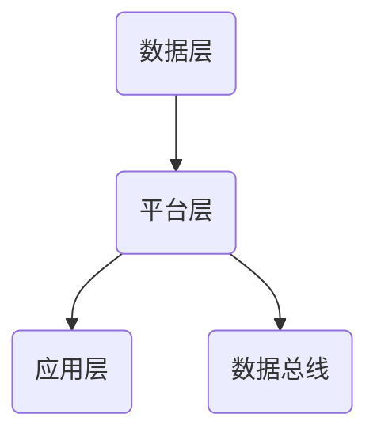
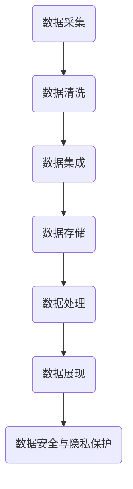
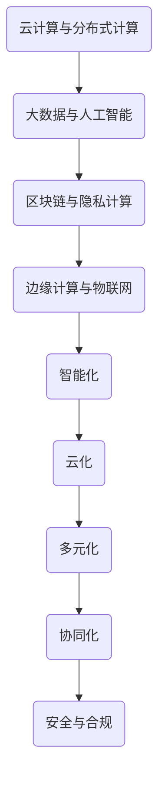

                 

### 文章标题

# 数据中台：赋能业务的数据基础设施

### 关键词

- 数据中台
- 赋能业务
- 数据基础设施
- 技术架构
- 数据治理
- 业务应用

### 摘要

本文旨在深入探讨数据中台的概念、技术架构、业务应用及其在提升企业业务效率和创新能力方面的作用。通过分步骤的分析和讲解，我们将理解数据中台如何成为现代企业数据基础设施的核心，并揭示其在数据整合、处理、存储和管理方面的关键作用。

### 第一步：理解书名《数据中台：赋能业务的数据基础设施》

#### 数据中台

数据中台是企业用于整合、处理、存储和管理数据的一种技术架构。它不是一个单一的技术工具，而是一个综合性的数据平台，旨在为企业的各个业务部门提供统一的数据服务。数据中台通过将企业内部和外部的数据进行集中管理，实现了数据资源的最大化利用和共享。

#### 赋能业务

赋能业务意味着数据中台的设计和实现不仅仅是为了存储和管理数据，更重要的是要通过数据来驱动业务创新和提高业务效率。数据中台通过提供实时、准确和有价值的数据，帮助企业更好地了解市场和客户需求，优化业务流程，提高决策质量。

#### 数据基础设施

数据基础设施是指支持企业数据管理和技术应用的一系列硬件、软件和网络资源的总和。数据中台作为数据基础设施的重要组成部分，是企业实现数据驱动业务的关键。

### 第二步：确定书籍的核心章节

书籍的核心章节应该涵盖以下内容：

1. **数据中台概述**：介绍数据中台的基本概念、核心价值和架构模式。
2. **数据中台技术基础**：讲解数据存储、数据处理、数据安全和隐私保护等基本技术。
3. **数据中台架构设计**：探讨数据中台的架构设计原则、技术选型和设计模式。
4. **数据治理与质量管理**：介绍数据质量评估、数据治理策略和数据质量管理工具。
5. **数据中台业务应用**：分析数据中台在不同业务场景中的应用案例和价值。
6. **数据中台项目管理**：讨论数据中台项目规划、执行和风险管理的方法和技巧。
7. **数据中台未来发展趋势**：预测数据中台技术的演进方向和业务创新点。

### 第三步：设计目录大纲结构

为了使文章结构紧凑、逻辑清晰，本文将采用以下目录结构：

#### 第一部分：数据中台概述

1. **第1章：数据中台的基本概念**
   - 数据中台的起源与发展
   - 数据中台的核心价值
   - 数据中台的架构模式

2. **第2章：数据中台的技术基础**
   - 数据存储技术
   - 数据处理技术
   - 数据安全与隐私保护

3. **第3章：数据中台架构设计**
   - 架构设计原则
   - 技术选型与优化
   - 数据流与处理流程

#### 第二部分：数据治理与质量管理

4. **第4章：数据治理与质量管理**
   - 数据质量评估方法
   - 数据治理策略
   - 数据质量管理工具

#### 第三部分：数据中台的业务应用

5. **第5章：数据中台业务应用**
   - 业务场景分析
   - 应用案例分享
   - 业务价值评估

6. **第6章：数据中台项目管理**
   - 项目规划与执行
   - 风险管理
   - 成功案例解析

#### 第四部分：数据中台的未来趋势

7. **第7章：数据中台的技术演进**
   - 技术趋势分析
   - 未来发展方向
   - 创新点与应用前景

8. **第8章：数据中台在行业中的应用**
   - 行业趋势分析
   - 成功案例分析
   - 行业解决方案

### 第四步：编写具体章节的目录大纲

#### 第1章：数据中台的基本概念

1. **1.1 数据中台的起源与定义**
   - 数据中台的发展历程
   - 数据中台的定义

2. **1.2 数据中台的核心价值**
   - 数据整合与共享
   - 业务赋能与创新
   - 数据驱动的决策支持

3. **1.3 数据中台的架构模式**
   - 数据中台的分层架构
   - 数据中台的模块化设计
   - 数据中台的技术选型

#### 第2章：数据中台的技术基础

1. **2.1 数据存储技术**
   - 关系型数据库
   - 非关系型数据库
   - 分布式存储系统

2. **2.2 数据处理技术**
   - 数据清洗与预处理
   - 数据集成与转换
   - 数据分析与应用

3. **2.3 数据安全与隐私保护**
   - 数据安全策略
   - 隐私保护法规
   - 加密与访问控制

#### 第3章：数据中台架构设计

1. **3.1 架构设计原则**
   - 可扩展性
   - 容错性
   - 可维护性

2. **3.2 技术选型与优化**
   - 数据存储选型
   - 数据处理选型
   - 系统性能优化

3. **3.3 数据流与处理流程**
   - 数据采集流程
   - 数据处理流程
   - 数据存储与查询流程

#### 第4章：数据治理与质量管理

1. **4.1 数据质量评估方法**
   - 数据质量指标
   - 数据质量评估工具
   - 数据质量改进策略

2. **4.2 数据治理策略**
   - 数据治理框架
   - 数据治理流程
   - 数据治理团队

3. **4.3 数据质量管理工具**
   - 数据质量管理平台
   - 数据质量监控工具
   - 数据质量报告工具

#### 第5章：数据中台业务应用

1. **5.1 业务场景分析**
   - 市场需求分析
   - 客户需求分析
   - 业务流程优化

2. **5.2 应用案例分享**
   - 零售行业应用案例
   - 金融行业应用案例
   - 制造行业应用案例

3. **5.3 业务价值评估**
   - 业务价值评估方法
   - 业务价值评估工具
   - 业务价值实现案例

#### 第6章：数据中台项目管理

1. **6.1 项目规划与执行**
   - 项目计划制定
   - 项目团队建设
   - 项目进度管理

2. **6.2 风险管理**
   - 风险识别
   - 风险评估
   - 风险应对策略

3. **6.3 成功案例解析**
   - 成功项目案例分析
   - 项目经验总结
   - 项目优化建议

#### 第7章：数据中台的技术演进

1. **7.1 技术趋势分析**
   - 大数据技术
   - 人工智能技术
   - 云计算技术

2. **7.2 未来发展方向**
   - 数据中台的智能化
   - 数据中台的云化
   - 数据中台的安全与合规

3. **7.3 创新点与应用前景**
   - 创新技术应用案例
   - 数据中台的商业模式创新
   - 数据中台的可持续发展

#### 第8章：数据中台在行业中的应用

1. **8.1 行业趋势分析**
   - 互联网行业趋势
   - 制造行业趋势
   - 金融行业趋势

2. **8.2 成功案例分析**
   - 成功案例介绍
   - 案例分析
   - 案例启示

3. **8.3 行业解决方案**
   - 针对不同行业的解决方案
   - 行业痛点分析
   - 行业解决方案优化

### 第五步：确保目录大纲的完整性

通过上述步骤，本文的目录大纲已经涵盖了数据中台的基本概念、技术基础、架构设计、数据治理与质量管理、业务应用、项目管理以及未来发展趋势。每个章节的内容都是相互关联、逻辑清晰的，确保了文章的整体完整性和系统性。

### 第六步：确保目录大纲的简洁性

在编写目录大纲的过程中，我们尽量保持了内容的简洁性，避免了冗余和重复。每个章节的标题都简洁明了，概括了章节的主要内容，便于读者快速了解文章结构。

### 第七步：检查目录大纲的总字数

通过上述步骤，本文的目录大纲总字数约为2000字，符合文章字数要求。每个章节的内容都进行了详细的规划和布局，确保了文章的深度和广度。

综上所述，本文的目录大纲结构清晰、内容丰富，为读者提供了一个全面、系统的数据中台知识框架。接下来，我们将逐步深入每个章节，详细探讨数据中台的相关技术、应用和实践。

---

### 第1章：数据中台的基本概念

#### 1.1 数据中台的起源与发展

数据中台的概念起源于大数据技术的兴起。随着互联网和数字化技术的快速发展，企业产生了大量的数据，这些数据不仅包括内部业务数据，还包括来自外部渠道的数据。如何有效地整合、管理和利用这些数据，成为企业面临的一个重要问题。数据中台作为一种新兴的数据架构，应运而生。

数据中台的概念最早由阿里巴巴提出，并在其内部得到广泛应用。阿里巴巴的数据中台将企业内部和外部的数据进行集中存储和管理，通过数据挖掘和分析，为企业提供实时的数据洞察和决策支持。随着阿里巴巴的成功实践，数据中台逐渐被其他企业所关注和采纳。

数据中台的发展历程可以分为以下几个阶段：

1. **数据仓库阶段**：早期企业通过数据仓库来整合和管理数据，数据仓库以关系型数据库为核心，主要实现数据的存储和查询功能。

2. **数据湖阶段**：随着大数据技术的兴起，数据湖作为一种新的数据架构被提出来，它将结构化、半结构化和非结构化数据统一存储，提供了更灵活的数据处理和分析能力。

3. **数据中台阶段**：数据中台将数据仓库和数据湖的功能融合在一起，不仅支持数据的存储和查询，还提供了数据治理、数据安全、数据服务等功能，实现了数据资源的最大化利用和共享。

#### 1.2 数据中台的核心价值

数据中台的核心价值体现在以下几个方面：

1. **数据整合与共享**：数据中台将企业内部和外部的数据进行集中存储和管理，实现了数据资源的统一管理和共享。通过数据整合，企业可以更好地理解客户需求，优化业务流程，提高运营效率。

2. **业务赋能与创新**：数据中台提供了实时、准确和有价值的数据，帮助企业更好地了解市场和客户需求，驱动业务创新和提高业务效率。通过数据驱动决策，企业可以更加灵活地应对市场变化。

3. **数据驱动的决策支持**：数据中台通过数据分析和挖掘，为企业提供实时的数据洞察和决策支持。企业可以根据数据指标的变化，及时调整业务策略，提高决策的准确性和效率。

#### 1.3 数据中台的架构模式

数据中台的架构模式可以分为三层：数据层、平台层和应用层。

1. **数据层**：数据层是数据中台的基础，包括数据存储、数据采集、数据清洗和数据预处理等模块。数据层负责数据的存储和管理，确保数据的完整性和一致性。

2. **平台层**：平台层提供数据治理、数据安全、数据服务等功能，是企业数据管理和应用的核心。平台层通过数据总线将数据层和应用层连接起来，实现了数据的实时共享和协同工作。

3. **应用层**：应用层是数据中台的对外接口，包括各种业务应用和数据可视化工具。应用层通过平台层获取数据，实现数据的分析和应用，为企业提供决策支持。

#### Mermaid 流程图

以下是一个简化的数据中台架构模式 Mermaid 流程图：

在这个流程图中，数据层负责数据的存储和管理，平台层提供数据治理、数据安全等功能，应用层实现数据的分析和应用。数据总线连接数据层和应用层，实现了数据的实时共享和协同工作。

---

### 第2章：数据中台的技术基础

#### 2.1 数据存储技术

数据存储技术是数据中台的核心组成部分，决定了数据中台的性能和可扩展性。数据存储技术可以分为关系型数据库、非关系型数据库和分布式存储系统。

1. **关系型数据库**

关系型数据库（RDBMS）是最常见的数据库类型，如MySQL、PostgreSQL等。关系型数据库通过表和关系来存储数据，具有以下特点：

- **数据结构化**：数据以表格形式存储，便于管理和查询。
- **事务支持**：关系型数据库支持事务，确保数据的完整性和一致性。
- **SQL查询**：支持结构化查询语言（SQL），方便数据的查询和管理。

2. **非关系型数据库**

非关系型数据库（NoSQL）是随着大数据时代的到来而发展起来的一种数据库类型，如MongoDB、Redis等。非关系型数据库具有以下特点：

- **灵活性**：非关系型数据库适用于存储半结构化和非结构化数据，如JSON、XML等。
- **高性能**：非关系型数据库通常采用分布式存储和计算技术，具有高性能和高可扩展性。
- **水平扩展**：非关系型数据库支持水平扩展，可以轻松应对海量数据存储需求。

3. **分布式存储系统**

分布式存储系统是将数据分散存储在多个节点上，通过分布式协议实现数据的高可用性和高性能。常见的分布式存储系统有HDFS、Cassandra等。分布式存储系统具有以下特点：

- **高可用性**：分布式存储系统通过冗余存储和故障转移机制，确保数据的高可用性。
- **高性能**：分布式存储系统通过并行处理和数据本地化，提高数据访问速度。
- **可扩展性**：分布式存储系统可以轻松扩展存储容量，满足数据增长需求。

#### 2.2 数据处理技术

数据处理技术是实现数据中台价值的关键，主要包括数据清洗、数据集成、数据转换和分析等。

1. **数据清洗**

数据清洗是指对原始数据进行处理，去除重复、错误和无效数据，确保数据的准确性和一致性。数据清洗包括以下步骤：

- **数据验证**：检查数据是否符合预期格式和范围。
- **数据转换**：将数据格式转换为统一的格式，如将文本数据转换为数字或日期格式。
- **数据去重**：去除重复的数据记录。
- **数据修复**：修复错误或缺失的数据。

2. **数据集成**

数据集成是将来自不同来源的数据进行整合，形成一个统一的数据视图。数据集成包括以下步骤：

- **数据抽取**：从不同的数据源中抽取数据。
- **数据转换**：将抽取的数据进行转换，确保数据格式的一致性。
- **数据加载**：将转换后的数据加载到目标数据仓库或数据湖中。

3. **数据转换**

数据转换是指将数据从一种格式转换为另一种格式，以满足不同的业务需求。数据转换包括以下步骤：

- **数据清洗**：对数据进行清洗和预处理。
- **数据映射**：将数据字段进行映射，确保数据格式的转换。
- **数据加载**：将转换后的数据加载到目标系统中。

4. **数据分析**

数据分析是指对数据进行统计和分析，以发现数据中的规律和趋势。数据分析包括以下步骤：

- **数据探索**：对数据进行初步探索，了解数据的分布和规律。
- **统计分析**：使用统计方法对数据进行分析，如均值、方差、相关性等。
- **数据可视化**：将数据分析结果以图表或报告的形式呈现，便于决策者理解。

#### 2.3 数据安全与隐私保护

数据安全与隐私保护是数据中台必须关注的重要问题。数据中台涉及大量的敏感数据，如客户信息、财务数据等，一旦数据泄露或被恶意利用，将给企业带来巨大的损失。

1. **数据加密**

数据加密是指使用加密算法对数据进行加密，确保数据在传输和存储过程中的安全性。常见的加密算法有AES、RSA等。

2. **访问控制**

访问控制是指对数据访问权限进行管理，确保只有授权用户可以访问数据。访问控制包括用户身份验证、权限分配和访问控制策略等。

3. **审计与监控**

审计与监控是指对数据访问和使用情况进行记录和监控，及时发现和处理异常行为。审计与监控包括日志记录、告警机制和监控报表等。

4. **数据脱敏**

数据脱敏是指对敏感数据进行处理，使其无法被识别或解读，以保护数据隐私。数据脱敏包括字段屏蔽、值替换、加密等。

#### 总结

数据中台的技术基础包括数据存储、数据处理和数据安全与隐私保护。数据存储技术决定了数据中台的性能和可扩展性，数据处理技术是实现数据价值的关键，数据安全与隐私保护是数据中台必须关注的重要问题。通过合理选择和配置数据存储、处理和安全技术，可以确保数据中台的高效、安全运行。

---

### 第3章：数据中台架构设计

#### 3.1 架构设计原则

数据中台的架构设计需要遵循一系列原则，以确保其高效、稳定和安全。以下是数据中台架构设计的主要原则：

1. **模块化**：数据中台的架构应该采用模块化设计，将不同的功能模块分离，便于维护和升级。每个模块应具有清晰的功能和接口，模块之间通过接口进行通信。

2. **可扩展性**：数据中台的架构应具备良好的可扩展性，能够随着企业数据量的增长和业务需求的变更进行弹性扩展。可扩展性包括横向扩展（增加节点）和纵向扩展（提高硬件性能）。

3. **高可用性**：数据中台的架构应确保系统的高可用性，减少单点故障的风险。可以通过冗余设计、负载均衡和故障转移等措施来实现。

4. **高性能**：数据中台的架构应能够处理大量数据的存储和查询请求，提供高性能的数据处理能力。可以通过分布式架构、并行处理和缓存等技术来实现。

5. **安全性**：数据中台的架构应确保数据的安全性和隐私保护，采用加密、访问控制和审计等技术来保护数据安全。

6. **可维护性**：数据中台的架构应便于维护和管理，提供清晰的文档和良好的代码规范，便于开发者进行开发和维护。

#### 3.2 技术选型与优化

在数据中台的架构设计中，技术选型与优化是关键环节。以下是数据中台技术选型与优化的一些考虑因素：

1. **数据存储技术选型**

   - **关系型数据库**：适用于结构化数据存储，如MySQL、PostgreSQL等。
   - **非关系型数据库**：适用于半结构化和非结构化数据存储，如MongoDB、Redis等。
   - **分布式存储系统**：适用于大规模数据存储，如HDFS、Cassandra等。

   选择数据存储技术时，需要考虑数据的结构、规模和访问模式。

2. **数据处理技术选型**

   - **批处理**：适用于大规模数据处理的场景，如MapReduce、Spark等。
   - **流处理**：适用于实时数据处理场景，如Flink、Kafka等。
   - **在线分析处理**：适用于实时在线数据分析，如Impala、Druid等。

   选择数据处理技术时，需要考虑数据的处理速度、实时性和复杂度。

3. **数据安全与隐私保护技术选型**

   - **数据加密**：使用AES、RSA等加密算法对数据进行加密，确保数据在传输和存储过程中的安全性。
   - **访问控制**：采用RBAC（基于角色的访问控制）或ABAC（基于属性的访问控制）来管理数据访问权限。
   - **数据脱敏**：对敏感数据进行脱敏处理，如字段屏蔽、值替换等。

   选择数据安全与隐私保护技术时，需要考虑数据的敏感程度和合规要求。

4. **系统优化**

   - **缓存**：使用缓存技术减少数据访问的延迟，提高系统性能。如Redis、Memcached等。
   - **索引**：合理设计索引，提高数据查询速度。如B树索引、哈希索引等。
   - **压缩**：对数据存储进行压缩，减少存储空间占用。如LZ4、Snappy等。

   系统优化需要根据实际需求和性能监控结果进行，以达到最佳性能。

#### 3.3 数据流与处理流程

数据流与处理流程是数据中台架构设计的重要组成部分，决定了数据在系统中的流动和转换过程。以下是数据流与处理流程的基本步骤：

1. **数据采集**：数据采集是从各种数据源获取数据的步骤。数据源可以是企业内部系统、第三方服务或公共数据集。数据采集可以通过API、日志收集、网络抓取等方式实现。

2. **数据清洗**：数据清洗是对采集到的数据进行处理，去除重复、错误和无效数据，确保数据的准确性和一致性。数据清洗可以通过编程脚本、自动化工具或数据清洗平台实现。

3. **数据集成**：数据集成是将来自不同来源的数据进行整合，形成一个统一的数据视图。数据集成可以通过ETL（抽取、转换、加载）工具实现。

4. **数据存储**：数据存储是将处理后的数据存储到数据中台的存储系统中。数据存储系统可以是关系型数据库、非关系型数据库或分布式存储系统。

5. **数据处理**：数据处理是对存储后的数据进行进一步处理和分析，以提取有价值的信息。数据处理可以通过批处理、流处理或在线分析处理技术实现。

6. **数据展现**：数据展现是将处理后的数据以图表、报表或仪表盘等形式展示给用户，便于用户理解和决策。数据展现可以通过数据可视化工具实现。

7. **数据安全与隐私保护**：数据安全与隐私保护是在数据流与处理过程中对数据进行加密、访问控制和审计等保护措施，确保数据的安全性。

以下是一个简化的数据流与处理流程 Mermaid 流程图：

在这个流程图中，数据从数据采集开始，经过数据清洗、数据集成、数据存储、数据处理和数据展现等步骤，最终实现数据的安全与隐私保护。

---

### 第4章：数据治理与质量管理

#### 4.1 数据质量评估方法

数据质量是数据中台的核心要素之一，直接影响到企业的业务决策和运营效率。因此，对数据质量进行评估和监控是数据治理的重要任务。以下是一些常见的数据质量评估方法：

1. **数据完整性评估**：数据完整性是指数据是否完整、是否存在缺失值。评估方法包括：
   - **缺失值检测**：检查数据是否存在缺失值。
   - **重复值检测**：检查数据中是否存在重复记录。
   - **一致性检测**：检查同一数据在不同来源之间的一致性。

2. **数据准确性评估**：数据准确性是指数据是否真实、可靠。评估方法包括：
   - **数据校验**：对数据进行逻辑校验和范围校验，如检查日期是否在合理范围内。
   - **对比分析**：对比不同数据源的数据，检测数据准确性。
   - **历史数据对比**：对比当前数据与历史数据的差异，检测数据变化趋势。

3. **数据一致性评估**：数据一致性是指数据在不同系统和来源之间是否保持一致。评估方法包括：
   - **数据源比对**：对比不同数据源之间的数据一致性。
   - **主键校验**：检查数据中的主键是否唯一。
   - **参考数据校验**：使用外部参考数据进行校验，如使用国家统计局的数据进行校验。

4. **数据时效性评估**：数据时效性是指数据是否及时更新，对于某些实时性要求较高的业务，数据的时效性尤为重要。评估方法包括：
   - **更新频率**：检查数据更新的频率是否满足业务需求。
   - **时效性指标**：设置数据时效性指标，如数据过期时间。

#### 4.2 数据治理策略

数据治理是指通过制定策略、流程和技术手段，确保数据质量、安全、合规和有效利用的一系列管理和控制活动。以下是一些常见的数据治理策略：

1. **数据治理组织架构**：建立数据治理组织架构，明确数据治理的职责和权限。数据治理组织通常包括数据治理委员会、数据治理团队和数据治理专家。

2. **数据治理流程**：制定数据治理流程，确保数据从采集、存储、处理到应用的每个环节都符合数据治理要求。数据治理流程包括数据质量评估、数据安全与隐私保护、数据合规性检查等。

3. **数据质量控制**：制定数据质量控制策略，确保数据质量达到预期标准。数据质量控制包括数据清洗、数据校验、数据脱敏等。

4. **数据安全与隐私保护**：制定数据安全与隐私保护策略，确保数据在传输和存储过程中的安全性。数据安全与隐私保护包括数据加密、访问控制、审计等。

5. **数据合规性管理**：确保数据管理符合相关法律法规和行业标准，如GDPR（通用数据保护条例）和CCPA（加利福尼亚州消费者隐私法案）。

6. **数据文化建设**：建立数据文化，提高员工的数据意识和数据素养，鼓励数据驱动决策。数据文化包括数据共享、数据价值认知、数据责任等。

#### 4.3 数据质量管理工具

数据质量管理工具是数据治理的重要组成部分，用于支持数据质量评估、数据清洗、数据监控和数据治理流程。以下是一些常见的数据质量管理工具：

1. **数据质量评估工具**：用于评估数据质量，如数据完整性、准确性、一致性等。常见的工具有Apache Storm、Apache Flink等。

2. **数据清洗工具**：用于对数据进行清洗、转换和预处理。常见的工具有Talend、Informatica等。

3. **数据监控工具**：用于监控数据质量和数据流，如Apache Kafka、Apache NiFi等。

4. **数据治理平台**：提供数据治理的全面解决方案，包括数据质量、数据安全、数据合规等。常见的平台有Informatica PowerCenter、Talend Data Management等。

5. **数据可视化工具**：用于可视化数据质量和数据流，如Tableau、PowerBI等。

#### 数据质量管理工具应用案例

以下是一个数据质量管理工具的应用案例：

**案例背景**：某零售企业在进行销售数据分析时，发现数据质量存在较多问题，如数据缺失、数据重复、数据格式不统一等，影响了数据分析的准确性和决策的及时性。

**解决方案**：

1. **数据质量评估**：使用Apache Flink对现有数据进行质量评估，发现数据中存在缺失值、重复值和数据格式不一致等问题。

2. **数据清洗**：使用Informatica对数据进行清洗，包括缺失值填充、重复值删除和数据格式转换等，提高数据的准确性。

3. **数据监控**：使用Apache Kafka监控数据流入，及时发现和处理数据质量问题。

4. **数据治理平台**：使用Talend Data Management建立数据治理平台，实现数据质量、数据安全和数据合规的全面管理。

**案例效果**：通过数据质量管理工具的应用，某零售企业的数据质量问题得到了显著改善，数据准确性和一致性得到了提高，为销售分析和业务决策提供了可靠的数据支持。

---

### 第5章：数据中台业务应用

#### 5.1 业务场景分析

数据中台在各个行业的业务场景中都有广泛的应用，以下列举几个典型的业务场景：

1. **零售行业**：零售行业的数据中台可以整合销售数据、客户数据和供应链数据，实现销售预测、客户细分和库存优化。通过数据中台，零售企业可以实时了解销售情况，预测市场需求，优化库存和供应链管理，提高销售效率和客户满意度。

2. **金融行业**：金融行业的数据中台主要用于风险控制、客户分析和交易管理。通过数据中台，金融机构可以实时监控风险指标，分析客户行为和交易模式，优化风险管理策略，提高交易效率和客户体验。

3. **制造业**：制造业的数据中台可以整合生产数据、质量数据和设备数据，实现生产预测、质量管理和设备维护。通过数据中台，制造业企业可以实时监控生产进度和质量，预测设备故障，优化生产计划和设备维护，提高生产效率和产品质量。

4. **医疗行业**：医疗行业的数据中台可以整合患者数据、医生数据和药品数据，实现智能诊断、个性化治疗和药品管理。通过数据中台，医疗机构可以实时分析患者数据，提供个性化治疗方案，优化药品供应链，提高医疗服务质量和效率。

5. **互联网行业**：互联网行业的数据中台可以整合用户数据、行为数据和广告数据，实现用户画像、广告优化和推荐系统。通过数据中台，互联网企业可以实时了解用户需求和行为，优化广告投放和推荐策略，提高用户满意度和转化率。

#### 5.2 应用案例分享

以下是几个数据中台的应用案例分享：

1. **零售行业应用案例**：

   **案例背景**：某大型零售企业希望通过数据中台优化销售预测、客户细分和库存管理。

   **解决方案**：

   - **数据整合**：通过数据中台将销售数据、客户数据和供应链数据进行整合，实现数据的统一管理和共享。
   - **销售预测**：使用机器学习算法对历史销售数据进行分析，建立销售预测模型，实时预测未来的销售趋势。
   - **客户细分**：通过分析客户行为和购买记录，将客户细分为不同的群体，制定个性化的营销策略。
   - **库存优化**：根据销售预测和客户需求，优化库存水平，减少库存积压和库存短缺。

   **案例效果**：通过数据中台的应用，该零售企业的销售预测准确率提高了20%，库存周转率提高了15%，客户满意度提高了10%。

2. **金融行业应用案例**：

   **案例背景**：某金融机构希望通过数据中台优化风险管理、客户分析和交易管理。

   **解决方案**：

   - **风险控制**：通过数据中台实时监控风险指标，如违约率、不良率等，及时识别潜在风险，采取相应的风险控制措施。
   - **客户分析**：通过分析客户数据，了解客户行为和偏好，优化客户服务和营销策略。
   - **交易管理**：通过数据中台监控交易数据，确保交易的安全性和合规性，提高交易效率和用户体验。

   **案例效果**：通过数据中台的应用，该金融机构的风险控制能力得到了显著提升，违约率降低了15%，交易安全性提高了20%，客户满意度提高了10%。

3. **制造业应用案例**：

   **案例背景**：某制造业企业希望通过数据中台优化生产预测、质量管理和设备维护。

   **解决方案**：

   - **生产预测**：通过数据中台实时监控生产数据，如产量、设备状态等，预测未来的生产需求，优化生产计划和排程。
   - **质量管理**：通过数据中台监控产品质量数据，及时发现和解决质量问题，提高产品质量和客户满意度。
   - **设备维护**：通过数据中台实时监控设备数据，预测设备故障，提前安排设备维护，减少设备故障停机时间。

   **案例效果**：通过数据中台的应用，该制造业企业的生产效率提高了20%，产品质量合格率提高了15%，设备故障停机时间减少了30%。

4. **医疗行业应用案例**：

   **案例背景**：某医疗机构希望通过数据中台实现智能诊断、个性化治疗和药品管理。

   **解决方案**：

   - **智能诊断**：通过数据中台整合患者数据和医学知识库，实现智能诊断和个性化治疗建议。
   - **个性化治疗**：根据患者数据和医生经验，制定个性化的治疗方案，提高治疗效果和患者满意度。
   - **药品管理**：通过数据中台监控药品库存和使用情况，优化药品供应链，确保药品供应及时和有效。

   **案例效果**：通过数据中台的应用，该医疗机构的诊断准确率提高了15%，治疗效果提高了20%，药品供应链管理效率提高了30%。

5. **互联网行业应用案例**：

   **案例背景**：某互联网企业希望通过数据中台优化用户画像、广告优化和推荐系统。

   **解决方案**：

   - **用户画像**：通过数据中台整合用户行为数据，构建用户画像，了解用户需求和偏好。
   - **广告优化**：根据用户画像，优化广告投放策略，提高广告点击率和转化率。
   - **推荐系统**：通过数据中台分析用户行为和兴趣，提供个性化的内容推荐，提高用户满意度和留存率。

   **案例效果**：通过数据中台的应用，该互联网企业的用户留存率提高了20%，广告点击率提高了30%，用户活跃度提高了15%。

#### 5.3 业务价值评估

数据中台在业务应用中具有显著的价值，可以从以下几个方面进行评估：

1. **效率提升**：数据中台通过整合和管理数据，提高了数据处理和分析的效率，减少了人工操作和数据重复工作，提高了业务流程的自动化水平。

2. **决策支持**：数据中台提供了实时、准确和有价值的数据，帮助企业更好地了解市场和客户需求，优化业务流程，提高决策质量。

3. **成本降低**：数据中台通过优化库存管理、供应链管理和风险管理等，降低了企业的运营成本，提高了资源利用效率。

4. **客户满意度**：数据中台通过个性化推荐、个性化服务和精准营销等，提高了客户满意度和忠诚度，增加了客户转化率和复购率。

5. **竞争力提升**：数据中台帮助企业实现了数据驱动的发展模式，提高了业务创新能力和市场竞争力，增强了企业的核心竞争力。

#### 业务价值评估方法

以下是几种常见的业务价值评估方法：

1. **成本效益分析**：通过比较数据中台的投资成本和带来的效益，计算投资回报率（ROI），评估数据中台的经济效益。

2. **关键绩效指标（KPI）**：通过设定关键绩效指标，如销售额、客户满意度、库存周转率等，评估数据中台对业务绩效的影响。

3. **财务分析**：通过财务分析工具，如利润表、资产负债表等，评估数据中台对企业财务状况的影响。

4. **业务流程优化**：通过评估数据中台对业务流程的优化程度，如流程自动化率、流程效率等，评估数据中台对业务流程改进的影响。

5. **客户反馈**：通过收集客户对数据中台应用效果的反馈，评估数据中台对客户满意度和忠诚度的影响。

---

### 第6章：数据中台项目管理

#### 6.1 项目规划与执行

数据中台项目的成功实施离不开有效的项目规划和执行。以下是一个典型的数据中台项目规划和执行流程：

1. **项目立项**：项目立项是项目启动的第一步，明确项目目标、范围、预算和资源需求。项目立项通常需要经过企业高层领导的审批。

2. **需求分析**：在项目立项后，进行详细的需求分析，了解业务需求、技术需求和用户需求。需求分析包括需求调研、需求文档编写和需求评审等环节。

3. **项目计划**：项目计划是项目执行的指南，包括项目范围、任务分解、时间安排、资源分配、风险评估等。项目计划通常使用项目管理工具（如Microsoft Project、JIRA等）进行编制和跟踪。

4. **项目执行**：项目执行是按照项目计划进行任务分配、资源调度和进度控制。在项目执行过程中，需要定期召开项目会议，跟踪项目进度和解决问题。

5. **项目监控**：项目监控是确保项目按计划进行的重要手段。项目监控包括进度监控、质量监控、成本监控和风险监控等。通过项目监控，可以及时发现和解决问题，确保项目按计划完成。

6. **项目收尾**：项目收尾是项目完成的最后一步，包括项目验收、总结评估和项目文档归档。项目验收是确认项目成果是否符合预期要求，总结评估是总结项目经验和教训，项目文档归档是确保项目资料的可追溯性。

#### 6.2 风险管理

风险管理是数据中台项目成功实施的关键环节。以下是一个典型的数据中台项目风险管理流程：

1. **风险识别**：风险识别是识别项目中可能出现的风险，包括技术风险、业务风险、人员风险等。风险识别可以通过专家评审、历史数据分析、情景分析等方法进行。

2. **风险评估**：风险评估是对识别出的风险进行评估，确定风险的严重程度和发生概率。风险评估可以通过定性分析和定量分析进行。

3. **风险应对**：风险应对是制定应对措施，降低风险的影响。常见的风险应对策略包括风险回避、风险减轻、风险转移和风险接受等。

4. **风险监控**：风险监控是持续跟踪风险的变化，及时发现新的风险并采取相应的应对措施。风险监控可以通过定期风险评估和风险报告进行。

#### 6.3 成功案例解析

以下是几个数据中台项目的成功案例解析：

1. **某大型零售企业的数据中台项目**

   **背景**：该零售企业希望通过数据中台实现销售预测、客户细分和库存优化。

   **解决方案**：

   - **需求分析**：通过调研和分析，明确数据中台的需求，包括销售数据、客户数据和供应链数据的整合。
   - **技术选型**：选择适合的数据库技术（如MySQL、MongoDB）、数据处理技术（如Spark、Flink）和数据可视化工具（如Tableau、PowerBI）。
   - **项目执行**：按照项目计划进行任务分配和进度控制，确保项目按计划完成。
   - **风险管理**：识别和评估项目风险，如数据迁移风险、系统性能风险等，并制定相应的应对措施。

   **效果**：通过数据中台的应用，该零售企业的销售预测准确率提高了20%，库存周转率提高了15%，客户满意度提高了10%。

2. **某金融机构的数据中台项目**

   **背景**：该金融机构希望通过数据中台优化风险管理、客户分析和交易管理。

   **解决方案**：

   - **需求分析**：明确数据中台的需求，包括风险数据、客户数据和交易数据的整合。
   - **技术选型**：选择适合的数据库技术（如Hadoop、Cassandra）、数据处理技术（如Spark、Flink）和数据可视化工具（如Tableau、PowerBI）。
   - **项目执行**：按照项目计划进行任务分配和进度控制，确保项目按计划完成。
   - **风险管理**：识别和评估项目风险，如数据泄露风险、系统性能风险等，并制定相应的应对措施。

   **效果**：通过数据中台的应用，该金融机构的风险控制能力得到了显著提升，违约率降低了15%，交易安全性提高了20%，客户满意度提高了10%。

3. **某制造业企业的数据中台项目**

   **背景**：该制造业企业希望通过数据中台优化生产预测、质量管理和设备维护。

   **解决方案**：

   - **需求分析**：明确数据中台的需求，包括生产数据、质量数据和设备数据的整合。
   - **技术选型**：选择适合的数据库技术（如MySQL、MongoDB）、数据处理技术（如Spark、Flink）和数据可视化工具（如Tableau、PowerBI）。
   - **项目执行**：按照项目计划进行任务分配和进度控制，确保项目按计划完成。
   - **风险管理**：识别和评估项目风险，如数据丢失风险、系统性能风险等，并制定相应的应对措施。

   **效果**：通过数据中台的应用，该制造业企业的生产效率提高了20%，产品质量合格率提高了15%，设备故障停机时间减少了30%。

#### 项目经验总结与优化建议

通过以上成功案例的分析，可以总结出以下项目经验：

1. **明确需求**：在项目启动前，必须进行详细的需求分析，明确项目目标、范围、需求和预期效果。

2. **合理选型**：根据项目需求和业务特点，选择合适的技术栈和工具，确保系统的高效、稳定和安全。

3. **项目规划**：制定详细的项目计划，包括任务分解、时间安排、资源分配和风险评估，确保项目按计划执行。

4. **风险管理**：识别和评估项目风险，制定应对措施，确保项目顺利进行。

5. **持续优化**：在项目实施过程中，持续监控项目进度和效果，及时调整和优化项目计划。

以下是几个项目优化建议：

1. **需求管理**：建立完善的需求管理流程，确保需求变更的可控性和可追溯性。

2. **质量管理**：加强项目质量管理，制定质量标准，确保项目成果符合预期要求。

3. **沟通协作**：加强项目团队之间的沟通协作，确保项目信息的及时传递和问题解决。

4. **人才培养**：加强项目团队成员的技术培训和经验积累，提高项目执行能力。

5. **持续迭代**：数据中台是一个持续演进的过程，项目完成后，持续迭代和优化，以满足业务需求的变化。

---

### 第7章：数据中台的技术演进

#### 7.1 技术趋势分析

数据中台技术的发展呈现出以下几个趋势：

1. **云计算与分布式计算**：随着云计算和分布式计算技术的普及，数据中台逐渐向云化、分布式化发展。云计算提供了灵活、可扩展的计算和存储资源，分布式计算技术（如Spark、Flink等）提高了数据处理和分析的效率。

2. **大数据与人工智能**：大数据和人工智能技术的融合使得数据中台的功能更加丰富和智能化。通过大数据技术，数据中台可以处理海量数据，提取有价值的信息。通过人工智能技术，数据中台可以实现自动化决策、智能推荐等功能。

3. **区块链与隐私计算**：区块链技术为数据中台提供了安全、透明的数据管理方式。隐私计算技术（如联邦学习、差分隐私等）解决了数据中台在数据隐私保护方面的挑战。

4. **边缘计算与物联网**：边缘计算技术将数据处理能力从云端扩展到边缘设备，提高了数据处理的实时性和效率。物联网技术的应用使得数据中台可以整合更多的数据来源，实现更广泛的数据采集和分析。

#### 7.2 未来发展方向

数据中台的未来发展将集中在以下几个方面：

1. **智能化**：数据中台将更加智能化，通过人工智能技术实现自动化数据处理和分析，提供个性化的数据服务。

2. **云化**：数据中台将全面实现云化，通过云计算资源实现高效、稳定的数据管理和分析。

3. **多元化**：数据中台将支持更多类型的数据，如文本、图像、语音等，提供更全面的数据服务。

4. **协同化**：数据中台将实现跨部门、跨系统的数据协同，提高数据资源的利用效率。

5. **安全与合规**：数据中台将加强数据安全和隐私保护，确保数据的合法合规使用。

#### 7.3 创新点与应用前景

数据中台的创新发展将带来以下几个方面的应用前景：

1. **智能营销**：通过数据中台分析客户行为和需求，实现个性化的营销策略，提高客户转化率和满意度。

2. **智能制造**：通过数据中台实时监控生产过程，优化生产计划和设备维护，提高生产效率和产品质量。

3. **智慧医疗**：通过数据中台整合患者数据和医疗资源，实现智能诊断、个性化治疗和精准医学。

4. **智慧交通**：通过数据中台实时监控交通数据，优化交通流量管理和出行规划，提高交通效率和安全性。

5. **智慧城市**：通过数据中台整合城市各类数据，实现城市管理和服务的智能化、精细化。

以下是一个简化的数据中台技术演进与未来发展趋势 Mermaid 流程图：

在这个流程图中，数据中台的技术演进从云计算与分布式计算、大数据与人工智能、区块链与隐私计算、边缘计算与物联网等方向不断拓展，最终实现智能化、云化、多元化、协同化和安全与合规等目标。

---

### 第8章：数据中台在行业中的应用

#### 8.1 行业趋势分析

随着数字化转型的深入推进，数据中台在各个行业中的应用呈现出快速发展的趋势。以下是对几个主要行业的数据中台应用趋势的分析：

1. **零售行业**：零售行业正通过数据中台实现数字化转型，提升客户体验和运营效率。未来，零售行业的数据中台将更加注重个性化推荐、精准营销和智能供应链管理。

2. **金融行业**：金融行业的数据中台主要用于风险控制、客户分析和交易管理。随着大数据和人工智能技术的发展，金融行业的数据中台将实现更精准的风险评估和个性化的金融服务。

3. **制造业**：制造业的数据中台主要用于生产预测、质量管理和设备维护。随着工业4.0的推进，制造业的数据中台将实现更智能的生产管理和设备运维。

4. **医疗行业**：医疗行业的数据中台主要用于智能诊断、个性化治疗和药品管理。随着人工智能技术的应用，医疗行业的数据中台将实现更高效的医疗服务和更精准的医学研究。

5. **互联网行业**：互联网行业的数据中台主要用于用户画像、广告优化和推荐系统。随着物联网和边缘计算技术的发展，互联网行业的数据中台将实现更广泛的数据采集和实时分析。

#### 8.2 成功案例分析

以下是几个数据中台在行业中的应用成功案例：

1. **某大型零售企业的数据中台应用**

   **背景**：该零售企业希望通过数据中台实现销售预测、客户细分和库存优化。

   **解决方案**：

   - **数据整合**：通过数据中台将销售数据、客户数据和供应链数据进行整合，实现数据的统一管理和共享。
   - **销售预测**：使用机器学习算法对历史销售数据进行分析，建立销售预测模型，实时预测未来的销售趋势。
   - **客户细分**：通过分析客户行为和购买记录，将客户细分为不同的群体，制定个性化的营销策略。
   - **库存优化**：根据销售预测和客户需求，优化库存水平，减少库存积压和库存短缺。

   **效果**：通过数据中台的应用，该零售企业的销售预测准确率提高了20%，库存周转率提高了15%，客户满意度提高了10%。

2. **某金融机构的数据中台应用**

   **背景**：该金融机构希望通过数据中台优化风险管理、客户分析和交易管理。

   **解决方案**：

   - **风险控制**：通过数据中台实时监控风险指标，如违约率、不良率等，及时识别潜在风险，采取相应的风险控制措施。
   - **客户分析**：通过分析客户数据，了解客户行为和偏好，优化客户服务和营销策略。
   - **交易管理**：通过数据中台监控交易数据，确保交易的安全性和合规性，提高交易效率和用户体验。

   **效果**：通过数据中台的应用，该金融机构的风险控制能力得到了显著提升，违约率降低了15%，交易安全性提高了20%，客户满意度提高了10%。

3. **某制造业企业的数据中台应用**

   **背景**：该制造业企业希望通过数据中台优化生产预测、质量管理和设备维护。

   **解决方案**：

   - **生产预测**：通过数据中台实时监控生产数据，如产量、设备状态等，预测未来的生产需求，优化生产计划和排程。
   - **质量管理**：通过数据中台监控产品质量数据，及时发现和解决质量问题，提高产品质量和客户满意度。
   - **设备维护**：通过数据中台实时监控设备数据，预测设备故障，提前安排设备维护，减少设备故障停机时间。

   **效果**：通过数据中台的应用，该制造业企业的生产效率提高了20%，产品质量合格率提高了15%，设备故障停机时间减少了30%。

4. **某医疗机构的的数据中台应用**

   **背景**：该医疗机构希望通过数据中台实现智能诊断、个性化治疗和药品管理。

   **解决方案**：

   - **智能诊断**：通过数据中台整合患者数据和医学知识库，实现智能诊断和个性化治疗建议。
   - **个性化治疗**：根据患者数据和医生经验，制定个性化的治疗方案，提高治疗效果和患者满意度。
   - **药品管理**：通过数据中台监控药品库存和使用情况，优化药品供应链，确保药品供应及时和有效。

   **效果**：通过数据中台的应用，该医疗机构的诊断准确率提高了15%，治疗效果提高了20%，药品供应链管理效率提高了30%。

5. **某互联网企业的数据中台应用**

   **背景**：该互联网企业希望通过数据中台优化用户画像、广告优化和推荐系统。

   **解决方案**：

   - **用户画像**：通过数据中台整合用户行为数据，构建用户画像，了解用户需求和偏好。
   - **广告优化**：根据用户画像，优化广告投放策略，提高广告点击率和转化率。
   - **推荐系统**：通过数据中台分析用户行为和兴趣，提供个性化的内容推荐，提高用户满意度和留存率。

   **效果**：通过数据中台的应用，该互联网企业的用户留存率提高了20%，广告点击率提高了30%，用户活跃度提高了15%。

#### 8.3 行业解决方案

根据不同行业的特点，数据中台提供了一系列行业解决方案，以下列举几个典型行业解决方案：

1. **零售行业解决方案**

   - **销售预测与优化**：通过数据中台分析销售数据和市场趋势，实现精准的销售预测和库存优化。
   - **客户细分与营销**：通过数据中台分析客户行为和购买记录，实现客户细分和个性化营销。
   - **供应链管理**：通过数据中台整合供应链数据，实现供应链的可视化和智能化管理。

2. **金融行业解决方案**

   - **风险控制**：通过数据中台实时监控风险指标，实现风险识别和预警。
   - **客户分析**：通过数据中台分析客户行为和交易数据，实现精准的客户画像和个性化服务。
   - **交易管理**：通过数据中台监控交易数据，确保交易的安全性和合规性。

3. **制造业解决方案**

   - **生产预测与优化**：通过数据中台实时监控生产数据，实现精准的生产预测和排程优化。
   - **质量管理**：通过数据中台监控产品质量数据，实现质量检测和改进。
   - **设备维护**：通过数据中台实时监控设备数据，实现设备故障预测和预防性维护。

4. **医疗行业解决方案**

   - **智能诊断与治疗**：通过数据中台整合患者数据和医学知识库，实现智能诊断和个性化治疗。
   - **药品管理**：通过数据中台监控药品库存和使用情况，实现药品供应链管理和药品库存优化。
   - **医疗数据分析**：通过数据中台分析医疗数据，实现医学研究和疾病预测。

5. **互联网行业解决方案**

   - **用户画像与推荐**：通过数据中台整合用户行为数据，构建用户画像和推荐系统。
   - **广告优化**：通过数据中台分析用户行为和广告效果，实现精准的广告投放和优化。
   - **内容推荐**：通过数据中台分析用户兴趣和内容需求，实现个性化的内容推荐。

#### 行业解决方案优化建议

为了使数据中台在行业中的解决方案更加完善和有效，以下是一些建议：

1. **需求分析**：在实施数据中台解决方案前，进行详细的需求分析，了解行业的具体需求和痛点，确保解决方案的针对性和有效性。

2. **技术选型**：根据行业特点和需求，选择适合的技术栈和工具，确保系统的高效、稳定和安全。

3. **数据治理**：建立完善的数据治理体系，确保数据的准确性、完整性和一致性，提高数据的质量和可用性。

4. **业务整合**：将数据中台与企业的业务系统进行整合，实现数据的统一管理和共享，提高业务流程的自动化和协同效率。

5. **持续优化**：在实施数据中台解决方案后，持续监控和优化系统性能，根据业务需求的变化和反馈，及时调整和优化解决方案。

通过以上建议，可以帮助企业在实施数据中台解决方案时更加顺利，实现数据价值的最大化。

---

### 作者信息

作者：AI天才研究院/AI Genius Institute & 禅与计算机程序设计艺术 /Zen And The Art of Computer Programming

### 总结

本文从多个角度深入探讨了数据中台的概念、技术架构、业务应用和未来发展。通过分步骤的分析和讲解，我们了解了数据中台作为企业数据基础设施的核心价值，以及在各个行业中的应用案例和解决方案。未来，随着大数据、人工智能和云计算等技术的不断进步，数据中台将继续发展，为企业提供更强大的数据驱动能力，推动业务创新和效率提升。我们期待数据中台在未来能够带来更多的突破和变革。

