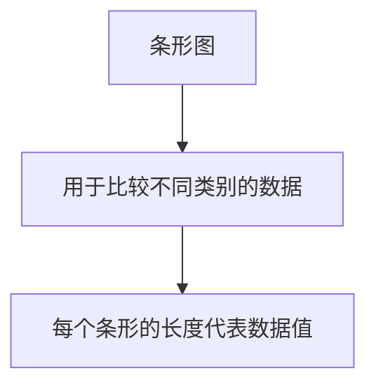
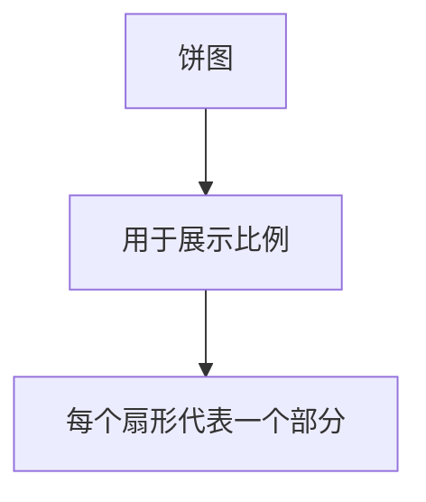
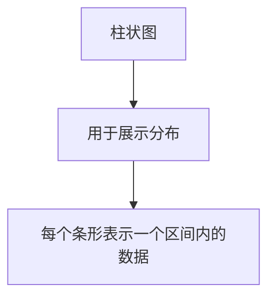
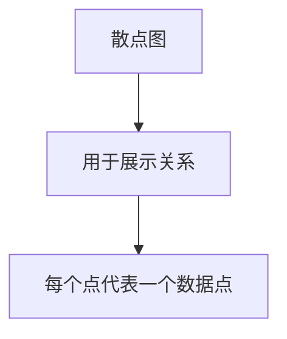
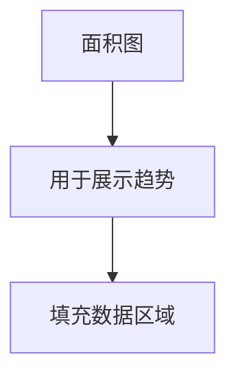
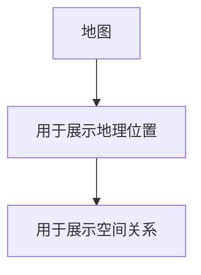
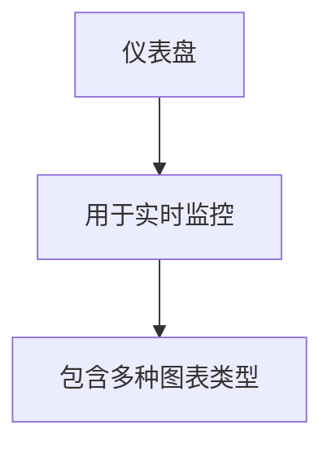
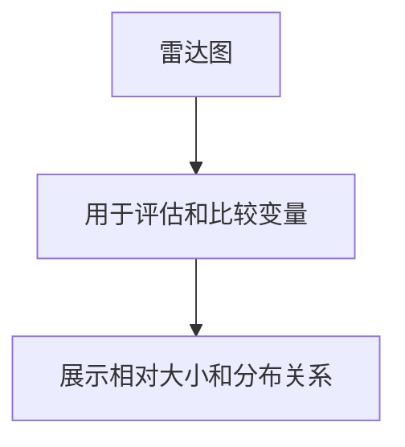
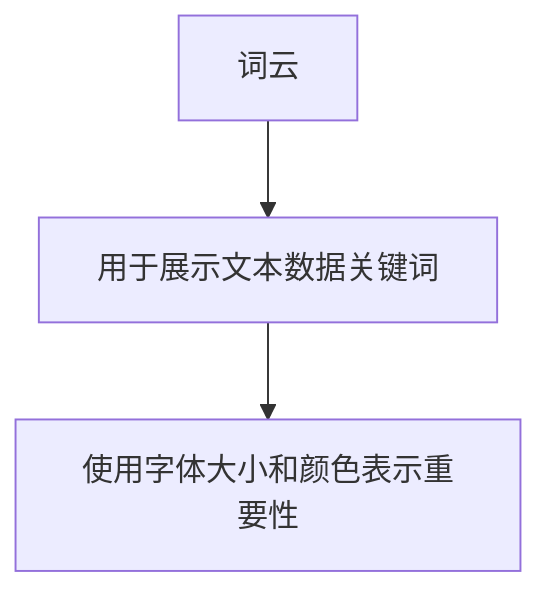
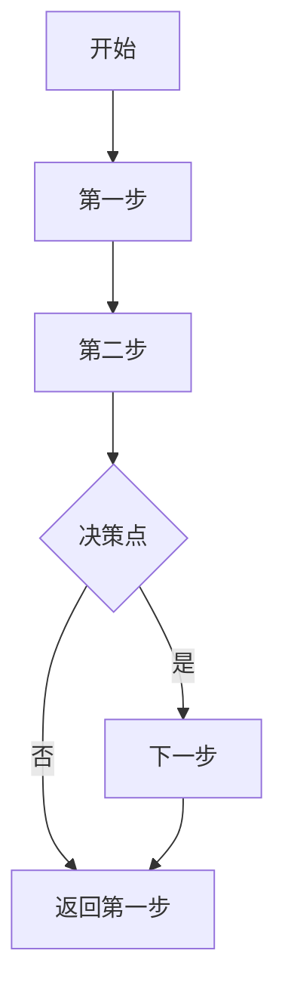

                 

## 文章标题

### 数据可视化技术与工具选择

> **关键词：** 数据可视化、图表类型、工具选择、实战案例、未来趋势

#### 摘要

本文将深入探讨数据可视化的技术与工具选择。首先，我们将介绍数据可视化的重要性，以及它如何帮助我们更好地理解和分析数据。接着，我们将详细阐述各种数据可视化技术，包括基本图表类型和高级图表类型。随后，我们将探讨如何选择合适的可视化工具，包括开源工具和商业工具。本文还会通过实际案例展示如何使用这些工具进行数据可视化。最后，我们将探讨数据可视化面临的技术挑战和未来的发展趋势。

---

## 引言

### 1.1 数据可视化的重要性

数据可视化是将复杂的数据通过图形、图表和图像等方式进行呈现的过程。它不仅能够帮助我们直观地理解数据，还能揭示数据背后的模式和趋势。以下是数据可视化的重要性：

1. **提升数据分析效率**：通过可视化，我们可以快速识别数据中的异常和趋势，从而提高数据分析的效率。
2. **增强数据解释力**：数据可视化使得复杂的数据变得易于理解，使决策者能够更清楚地了解数据背后的含义。
3. **促进沟通与协作**：可视化工具可以帮助不同背景的人理解和讨论数据，从而促进团队协作。
4. **辅助决策制定**：通过可视化，决策者可以更好地理解业务状况，从而做出更明智的决策。

### 1.2 可视化技术与工具的关系

可视化技术是数据可视化的核心，它决定了数据如何被呈现。而可视化工具则是实现数据可视化的手段，它们提供了各种图形、图表和动画等功能。两者之间的关系如下：

- **技术**：图表类型、图形渲染技术、交互设计等。
- **工具**：开源工具（如 D3.js、Matplotlib）和商业工具（如 Tableau、Power BI）。

### 1.3 阅读指南

本文将按照以下结构进行：

- **第2章**：介绍数据可视化的基本原理和功能分类。
- **第3章**：详细探讨基本和高级图表类型。
- **第4章**：介绍常用的可视化工具，包括开源和商业工具。
- **第5章**：通过实际案例展示数据可视化的应用。
- **第6章**：探讨数据可视化在各个领域的应用。
- **第7章**：分析数据可视化面临的挑战和未来趋势。

通过本文的阅读，读者将能够：

- 理解数据可视化的基本概念和原理。
- 掌握如何选择合适的数据可视化工具。
- 学习如何进行实际的数据可视化项目。
- 了解数据可视化技术的发展趋势和挑战。

## 数据可视化基础

### 2.1 数据可视化原理

数据可视化是将数据通过视觉形式进行呈现的过程，其目的是帮助人们更好地理解和分析数据。以下是数据可视化的基本原理：

#### 2.1.1 数据可视化的发展历程

- **早期阶段**：早期的数据可视化主要依赖于简单的图表，如柱状图和饼图。随着计算机技术的发展，数据可视化逐渐变得更加复杂和多样化。
- **中期阶段**：随着互联网和Web技术的发展，交互式数据可视化逐渐成为可能。用户可以通过鼠标和键盘与可视化界面进行互动，从而获得更加丰富的可视化体验。
- **当前阶段**：当前，数据可视化技术已经高度发展，人工智能和机器学习技术的引入使得数据可视化变得更加智能和自动化。

#### 2.1.2 数据可视化的基本原则

- **直观性**：数据可视化应该使得数据易于理解，避免过多的复杂性和冗余信息。
- **清晰性**：图表和图形应该清晰明了，避免混淆和误导。
- **准确性**：数据可视化应该准确地反映数据本身，避免任何数据失真。
- **交互性**：数据可视化工具应该具备交互功能，使用户可以实时探索和挖掘数据。

#### 2.1.3 数据可视化工具的功能分类

- **基本功能**：数据导入、图表生成、数据编辑、导出图表等。
- **高级功能**：数据过滤、数据聚合、数据分析、数据预测等。

### 2.2 数据可视化应用场景

数据可视化广泛应用于各个领域，以下是一些常见的应用场景：

- **商业智能**：帮助企业分析和展示销售数据、客户行为、市场趋势等。
- **科学研究**：用于展示实验数据、研究结果、科学模型等。
- **政府决策**：用于展示政策数据、社会事件、经济状况等。
- **金融分析**：用于展示股票市场走势、经济指标、投资组合等。

### 2.3 数据可视化在现代社会的意义

- **决策支持**：数据可视化帮助决策者更好地理解数据，从而做出更明智的决策。
- **知识传播**：数据可视化使得复杂的数据变得易于理解和传播。
- **创新驱动**：数据可视化激发创新思维，帮助企业和研究机构发现新的商业模式和研究方向。
- **社会监督**：数据可视化使得政府和社会能够更好地监督公共事务。

通过数据可视化，我们不仅能够更好地理解和分析数据，还能够将数据转化为有用的信息和知识，从而推动社会的进步和发展。

## 数据可视化技术

### 3.1 基本图表类型

基本图表类型是数据可视化中最常用的图表，它们能够有效地展示数据的分布、比较和趋势。以下是一些常见的基本图表类型：

#### 3.1.1 条形图

**条形图（Bar Chart）** 是用于比较不同类别的数据。它通常垂直排列，每个条形的长度（或高度）代表一个类别的数据值。

**Mermaid 流程图：**



**伪代码：**

```python
def create_bar_chart(data, categories, title):
    # 填充数据
    # 绘制条形图
    # 添加标题和标签
```

**数学模型：**

$$
\text{Height of bar} = \frac{\text{Value of data point}}{\max_{\text{data points}}(\text{Value})}
$$

**数学公式：**

$$
\text{Width of bar} = \text{Width constant}
$$

**代码案例：**

```python
import matplotlib.pyplot as plt

# 假设 data 是一个包含数值的列表
data = [23, 45, 12, 35]

# 绘制条形图
plt.bar(range(len(data)), data)
plt.xlabel('Categories')
plt.ylabel('Values')
plt.title('Bar Chart Example')
plt.show()
```

#### 3.1.2 饼图

**饼图（Pie Chart）** 用于展示数据各部分占整体的比例。每个扇形区域代表一个数据部分，其角度与该部分所占比例成正比。

**Mermaid 流程图：**



**伪代码：**

```python
def create_pie_chart(data, labels, title):
    # 填充数据
    # 绘制饼图
    # 添加标题和标签
```

**数学模型：**

$$
\text{Angle of sector} = \text{Percentage of data point} \times 360^\circ
$$

**代码案例：**

```python
import matplotlib.pyplot as plt

# 假设 data 是一个包含数值的列表，labels 是对应的数据标签
data = [23, 45, 12, 35]
labels = ['Category 1', 'Category 2', 'Category 3', 'Category 4']

# 绘制饼图
plt.pie(data, labels=labels, autopct='%1.1f%%')
plt.title('Pie Chart Example')
plt.show()
```

#### 3.1.3 柱状图

**柱状图（Histogram）** 用于展示数据在不同区间内的分布情况。它通常由一系列矩形条组成，每个条的宽度表示一个区间，高度表示该区间内的数据数量。

**Mermaid 流程图：**



**伪代码：**

```python
def create_histogram(data, bins, title):
    # 填充数据
    # 绘制柱状图
    # 添加标题和标签
```

**数学模型：**

$$
f(x) = \frac{\text{Number of data points in bin}}{\text{Total number of data points}}
$$

**代码案例：**

```python
import matplotlib.pyplot as plt
import numpy as np

# 假设 data 是一个包含数值的列表
data = np.random.normal(size=1000)

# 绘制柱状图
plt.hist(data, bins=30, alpha=0.5)
plt.title('Histogram Example')
plt.xlabel('Value')
plt.ylabel('Frequency')
plt.show()
```

#### 3.1.4 散点图

**散点图（Scatter Plot）** 用于展示两个变量之间的关系。每个点代表一个数据点，其坐标由两个变量的值决定。

**Mermaid 流程图：**



**伪代码：**

```python
def create_scatter_plot(x_data, y_data, title):
    # 填充数据
    # 绘制散点图
    # 添加标题和标签
```

**数学模型：**

$$
\text{Point} = (x, y)
$$

**代码案例：**

```python
import matplotlib.pyplot as plt
import numpy as np

# 假设 x_data 和 y_data 是两个包含数值的列表
x_data = np.random.normal(size=100)
y_data = np.random.normal(size=100)

# 绘制散点图
plt.scatter(x_data, y_data)
plt.title('Scatter Plot Example')
plt.xlabel('X Value')
plt.ylabel('Y Value')
plt.show()
```

#### 3.1.5 面积图

**面积图（Area Chart）** 用于展示数据的变化趋势，通常用于时间序列数据。它通过填充不同时间段内的数据区域来表示数据的变化。

**Mermaid 流程图：**



**伪代码：**

```python
def create_area_chart(data, labels, title):
    # 填充数据
    # 绘制面积图
    # 添加标题和标签
```

**数学模型：**

$$
\text{Area} = \int_{a}^{b} f(x) \, dx
$$

**代码案例：**

```python
import matplotlib.pyplot as plt
import numpy as np

# 假设 data 是一个包含数值的列表，labels 是对应的数据标签
data = [23, 45, 12, 35]
labels = ['Month 1', 'Month 2', 'Month 3', 'Month 4']

# 绘制面积图
plt.plot(data, label='Data')
plt.fill_between(range(len(data)), data, alpha=0.3)
plt.title('Area Chart Example')
plt.xlabel('Month')
plt.ylabel('Value')
plt.legend()
plt.show()
```

#### 3.1.6 其他常见图表

除了上述基本图表类型外，还有一些常见的图表类型，如：

- **线图（Line Chart）**：用于展示数据的变化趋势，通常用于时间序列数据。
- **盒形图（Box Plot）**：用于展示数据的分布和异常值。
- **雷达图（Radar Chart）**：用于展示多个变量的相对大小和分布。

这些图表类型各有其独特的应用场景，可以根据具体的数据类型和需求选择使用。

### 3.2 高级图表类型

高级图表类型相比基本图表类型具有更多的功能和灵活性，能够更深入地展示数据的复杂关系和模式。以下是一些常见的高级图表类型：

#### 3.2.1 地图

**地图（Map）** 是用于展示地理位置和空间关系的图表。地图可以用来展示人口分布、交通流量、自然灾害等。

**Mermaid 流流程图：**



**伪代码：**

```python
def create_map(data, locations, title):
    # 填充数据
    # 绘制地图
    # 添加标题和标签
```

**数学模型：**

$$
\text{Map} = \text{GIS data} + \text{Visualization techniques}
$$

**代码案例：**

```python
import geopandas as gpd
import matplotlib.pyplot as plt

# 假设 data 是一个包含地理位置的列表
data = {'Location': ['New York', 'Tokyo', 'Beijing'], 'Population': [8.4, 9.9, 21.5]}

# 创建 GeoDataFrame
gdf = gpd.GeoDataFrame(data)

# 绘制地图
fig, ax = plt.subplots()
gdf.plot(ax=ax)
plt.title('Map Example')
plt.show()
```

#### 3.2.2 仪表盘

**仪表盘（Dashboard）** 是一个综合性的数据可视化工具，通常用于实时监控业务数据。仪表盘可以包含多种图表类型，如条形图、饼图、线图等。

**Mermaid 流程图：**



**伪代码：**

```python
def create_dashboard(data, charts, title):
    # 填充数据
    # 创建仪表盘
    # 添加图表和标签
```

**代码案例：**

```python
import dash
import dash_html_components as html
import dash_core_components as dcc

# 假设 data 是一个包含业务数据的字典
data = {'Sales': [1000, 1500, 2000], 'Profit': [800, 1200, 1600]}

# 创建 Dash 应用程序
app = dash.Dash(__name__)

# 创建仪表盘布局
app.layout = html.Div([
    html.H1('Business Dashboard'),
    dcc.Graph(
        id='sales-graph',
        figure={
            'data': [
                {'x': data['Sales'], 'y': data['Profit'], 'type': 'bar', 'name': 'Sales'},
            ],
            'layout': {'title': 'Sales and Profit'}
        }
    )
])

# 运行 Dash 应用程序
if __name__ == '__main__':
    app.run_server(debug=True)
```

#### 3.2.3 雷达图

**雷达图（Radar Chart）** 是用于展示多个变量之间的相对大小和分布关系的图表。它通常用于评估和比较不同变量的性能。

**Mermaid 流流程图：**



**伪代码：**

```python
def create_radar_chart(data, variables, title):
    # 填充数据
    # 绘制雷达图
    # 添加标题和标签
```

**代码案例：**

```python
import matplotlib.pyplot as plt
import numpy as np

# 假设 data 是一个包含多个变量的列表
data = {'Variable 1': [4, 3.5, 2.5], 'Variable 2': [3, 4.5, 2.5], 'Variable 3': [2, 3, 4.5]}

# 绘制雷达图
angles = np.linspace(0, 2 * np.pi, len(data), endpoint=False).tolist()
data = np.array([data[var] for var in data]).T.tolist()
plt.radar(*data, angles=angles, label='Data')
plt.title('Radar Chart Example')
plt.legend()
plt.show()
```

#### 3.2.4 词云

**词云（Word Cloud）** 是用于展示文本数据中关键词的频率和重要性的图表。它通过不同的字体大小和颜色来表示关键词的重要性。

**Mermaid 流流程图：**



**伪代码：**

```python
def create_word_cloud(text, keywords):
    # 填充文本数据
    # 生成词云
    # 显示词云
```

**代码案例：**

```python
from wordcloud import WordCloud
import matplotlib.pyplot as plt

# 假设 text 是一个包含文本数据的列表
text = '数据可视化是一种将数据通过视觉形式进行呈现的过程，旨在帮助人们更好地理解和分析数据。'

# 生成词云
wordcloud = WordCloud(width=800, height=400, background_color='white').generate(text)

# 显示词云
plt.figure(figsize=(10, 5))
plt.imshow(wordcloud, interpolation='bilinear')
plt.axis('off')
plt.title('Word Cloud Example')
plt.show()
```

#### 3.2.5 流图

**流图（Flow Chart）** 是用于展示流程和步骤的图表。它通过不同的形状和连接线来表示流程中的各个步骤和决策点。

**Mermaid 流流程图：**



**伪代码：**

```python
def create_flow_chart(steps, decisions):
    # 填充步骤和决策数据
    # 绘制流图
```

**代码案例：**

```python
import matplotlib.pyplot as plt
import networkx as nx

# 假设 steps 是一个包含流程步骤的列表，decisions 是一个包含决策点的列表
steps = ['开始', '第一步', '第二步', '决策点', '下一步', '返回第一步']
decisions = [('决策点', '是', '下一步'), ('决策点', '否', '返回第一步')]

# 创建网络图
G = nx.DiGraph()

# 添加节点和边
for step in steps:
    G.add_node(step)
for decision in decisions:
    G.add_edge(decision[0], decision[1])

# 绘制流图
pos = nx.spring_layout(G)
nx.draw(G, pos, with_labels=True)
plt.title('Flow Chart Example')
plt.show()
```

通过上述高级图表类型的介绍，我们可以看到数据可视化不仅仅局限于基本图表，它还能够以更加丰富和多样化的形式展示数据的复杂性和关联性。在实际应用中，根据具体的数据类型和需求，我们可以选择合适的图表类型来达到最佳的可视化效果。

## 数据可视化工具

### 4.1 开源工具

开源数据可视化工具因其灵活性、可定制性和成本效益而受到广泛欢迎。以下是一些常用的开源数据可视化工具：

#### 4.1.1 Tableau Public

**Tableau Public** 是一款功能强大的数据可视化工具，允许用户轻松创建交互式仪表盘和图表。它是免费使用的，但不支持保存和共享功能。

**功能特点：**

- **直观的用户界面**：Tableau Public 提供了直观的拖放界面，使用户能够轻松创建图表和仪表盘。
- **多种图表类型**：支持条形图、饼图、地图、线图等多种图表类型。
- **数据连接**：支持连接多种数据源，包括Excel、CSV、数据库等。
- **交互功能**：用户可以通过筛选、排序和过滤等交互功能来探索数据。

**使用方法：**

1. **数据连接**：首先，将数据导入到 Tableau Public 中。
2. **创建图表**：使用拖放功能选择数据字段并创建图表。
3. **调整图表**：根据需要调整图表的样式、颜色和布局。
4. **保存和分享**：虽然 Tableau Public 是免费使用的，但无法保存和分享项目。用户可以导出为图片或PDF格式进行分享。

**代码示例：**

```python
# 以下为 Tableau Public 的基本操作示例
import tableau_modules

# 连接到数据源
tableau_modules.connect('data.csv')

# 创建条形图
tableau_modules.create_bar_chart('Sales', 'Year')

# 调整图表样式
tableau_modules.style_chart(color='blue', title='Sales by Year')
```

#### 4.1.2 D3.js

**D3.js** 是一个基于 JavaScript 的开源库，用于创建动态和交互式的数据可视化。它提供了强大的图形和动画功能，非常适合前端开发人员。

**功能特点：**

- **灵活性**：D3.js 允许用户自定义几乎所有的图表元素，包括线条、点、区域等。
- **交互性**：支持用户交互，如拖动、缩放、筛选等。
- **可扩展性**：可以与前端框架（如 React、Vue.js）集成，创建复杂的可视化应用。
- **高性能**：使用 Web 标准技术（如 SVG、HTML Canvas），提供高性能的渲染效果。

**使用方法：**

1. **引入库**：在 HTML 文件中引入 D3.js 库。
2. **选择元素**：选择需要绘制图表的容器元素。
3. **数据绑定**：将数据绑定到图表元素上。
4. **绘制图表**：使用 D3.js 提供的函数绘制图表。

**代码示例：**

```javascript
// 引入 D3.js 库
import * as d3 from 'd3';

// 创建 SVG 容器
const svg = d3.select('svg')
  .attr('width', 800)
  .attr('height', 400);

// 准备数据
const data = [23, 45, 12, 35];

// 创建 X 轴和 Y 轴
const x = d3.scaleBand().range([0, 800]).padding(0.1);
const y = d3.scaleLinear().range([400, 0]);

// 绘制条形图
svg.selectAll('.bar')
  .data(data)
  .enter().append('rect')
  .attr('class', 'bar')
  .attr('x', (d, i) => x(i))
  .attr('y', d => y(d))
  .attr('width', x.bandwidth())
  .attr('height', d => 400 - y(d));
```

#### 4.1.3 Plotly

**Plotly** 是一个开源的数据可视化库，支持多种编程语言（如 Python、R、JavaScript），提供丰富的图表类型和交互功能。

**功能特点：**

- **多种图表类型**：包括条形图、散点图、线图、箱形图等。
- **交互功能**：支持缩放、拖动、筛选等交互操作。
- **可定制性**：用户可以自定义图表的样式、颜色、标记等。
- **跨平台**：支持多种编程语言和平台，易于集成。

**使用方法：**

1. **安装库**：根据使用的编程语言安装 Plotly 库。
2. **创建图表**：使用 Plotly 提供的函数创建图表。
3. **调整样式**：根据需要调整图表的样式和参数。
4. **展示图表**：将图表嵌入到网页或应用程序中。

**Python 代码示例：**

```python
import plotly.graph_objs as go

# 准备数据
data = [23, 45, 12, 35]

# 创建条形图
trace = go.Bar(x=data, y=data, marker=dict(color='blue'))

# 创建图表
fig = go.Figure(data=[trace])

# 调整样式
fig.update_layout(title='Bar Chart Example', xaxis_title='Categories', yaxis_title='Values')

# 展示图表
fig.show()
```

#### 4.1.4 Matplotlib

**Matplotlib** 是 Python 中最常用的数据可视化库之一，提供了丰富的绘图函数和样式选项。

**功能特点：**

- **易于使用**：提供直观的绘图函数，如 `plot()`, `bar()`, `scatter()` 等。
- **可定制性**：用户可以自定义图表的样式、字体、颜色等。
- **丰富的样式选项**：提供多种内置样式和主题。
- **集成性**：与 Python 的其他库（如 Pandas、NumPy）集成良好。

**使用方法：**

1. **安装库**：使用 `pip` 安装 Matplotlib。
2. **创建图表**：使用 Matplotlib 提供的函数创建图表。
3. **调整样式**：根据需要调整图表的样式和参数。
4. **展示图表**：使用 `show()` 函数展示图表。

**代码示例：**

```python
import matplotlib.pyplot as plt

# 准备数据
x = [1, 2, 3, 4]
y = [23, 45, 12, 35]

# 创建条形图
plt.bar(x, y)

# 调整样式
plt.xlabel('Categories')
plt.ylabel('Values')
plt.title('Bar Chart Example')
plt.xticks(x)

# 展示图表
plt.show()
```

#### 4.1.5 Seaborn

**Seaborn** 是基于 Matplotlib 的数据可视化库，提供了一系列的统计图表和样式选项，使得创建高质量的数据可视化更加容易。

**功能特点：**

- **内置样式**：提供多种内置样式和主题，如“暗色”、“浅色”、“白网格”等。
- **统计图表**：提供丰富的统计图表，如箱形图、散点图、小提琴图等。
- **高可定制性**：用户可以自定义图表的样式、颜色、标记等。

**使用方法：**

1. **安装库**：使用 `pip` 安装 Seaborn。
2. **创建图表**：使用 Seaborn 提供的函数创建图表。
3. **调整样式**：根据需要调整图表的样式和参数。
4. **展示图表**：使用 `show()` 函数展示图表。

**代码示例：**

```python
import seaborn as sns
import matplotlib.pyplot as plt

# 准备数据
data = {'Categories': ['A', 'B', 'C', 'D'], 'Values': [23, 45, 12, 35]}

# 创建箱形图
sns.boxplot(x='Categories', y='Values', data=data)

# 调整样式
plt.xlabel('Categories')
plt.ylabel('Values')
plt.title('Box Plot Example')

# 展示图表
plt.show()
```

通过上述开源工具的介绍，我们可以看到它们各自的特点和优势，用户可以根据自己的需求和技能选择合适的工具进行数据可视化。

### 4.2 商业工具

商业数据可视化工具通常提供更多的功能和高级特性，适合企业级应用。以下是一些常用的商业工具：

#### 4.2.1 Power BI

**Power BI** 是一款功能强大的商业智能工具，由 Microsoft 开发。它提供了丰富的数据连接、报表创建和共享功能。

**功能特点：**

- **强大的数据连接**：支持连接多种数据源，包括 SQL Server、Excel、Oracle、Google Analytics 等。
- **交互式报表**：用户可以创建交互式报表，通过筛选、排序和过滤来探索数据。
- **可视化库**：提供了多种图表类型，如条形图、饼图、地图等。
- **云端部署**：Power BI 可以在云端部署，支持大规模数据分析和协作。

**使用方法：**

1. **数据连接**：在 Power BI 中连接所需的数据源。
2. **数据转换**：使用 Power Query 编辑和清洗数据。
3. **创建报表**：选择数据字段并创建报表。
4. **自定义样式**：根据需要自定义报表的样式。
5. **共享和协作**：将报表发布到 Power BI 服务，与其他用户共享和协作。

**代码示例：**

```python
import powerbi

# 创建 Power BI 客户端
client = powerbi.client.Client('https://api.powerbi.com')

# 连接到数据源
dataset = client.datasets.create_from_source('my_dataset', source)

# 创建报表
report = client.reports.create(dataset)

# 添加图表
chart = report.add_chart(chart_type='Bar', data_field='Sales', category_field='Year')

# 保存报表
report.save()
```

#### 4.2.2 QlikView

**QlikView** 是一款高性能的商业智能工具，提供实时数据分析、报表创建和可视化功能。

**功能特点：**

- **实时分析**：QlikView 可以实时分析大量数据，提供快速响应。
- **自适应可视化**：用户可以自定义图表的样式和布局，适应不同数据类型和分析需求。
- **数据关联**：QlikView 支持数据关联，用户可以自由探索数据之间的关系。
- **企业级部署**：QlikView 支持企业级部署，可以处理大规模数据。

**使用方法：**

1. **数据连接**：在 QlikView 中连接所需的数据源。
2. **数据建模**：创建数据模型，定义数据的关系和属性。
3. **创建可视化**：选择数据字段并创建可视化图表。
4. **自定义布局**：根据需要自定义报表的布局。
5. **发布和共享**：将报表发布到服务器，与其他用户共享。

**代码示例：**

```python
import qlik

# 创建 QlikView 客户端
client = qlik.connect('https://myqlikserv
```

#### 4.2.3 MicroStrategy

**MicroStrategy** 是一款全面的商业智能平台，提供数据集成、分析和可视化功能。

**功能特点：**

- **数据集成**：MicroStrategy 支持多种数据源，包括关系数据库、云数据湖等。
- **高级分析**：提供多种高级分析功能，如预测分析、机器学习等。
- **可视化库**：提供了丰富的可视化选项，包括图表、仪表板等。
- **企业级安全性**：MicroStrategy 提供企业级安全性，保护数据的安全和隐私。

**使用方法：**

1. **数据连接**：在 MicroStrategy 中连接所需的数据源。
2. **数据建模**：创建数据模型，定义数据的关系和属性。
3. **创建报表**：使用 MicroStrategy 的可视化工具创建报表。
4. **自定义仪表盘**：根据需要自定义仪表盘的布局和样式。
5. **发布和共享**：将报表和仪表盘发布到 MicroStrategy 服务，与其他用户共享。

**代码示例：**

```python
import microstrategy

# 创建 MicroStrategy 客户端
client = microstrategy.connect('https://my.microstrategy.com')

# 连接到数据源
database = client.get_database('my_database')

# 创建报表
report = client.create_report('my_report')

# 添加图表
chart = report.add_chart(chart_type='Bar', data_field='Sales', category_field='Year')

# 保存报表
report.save()
```

通过上述商业工具的介绍，我们可以看到它们各自的特点和优势，企业可以根据自己的需求和预算选择合适的工具进行数据可视化。

### 5.1 数据预处理

在进行数据可视化之前，对数据进行预处理是非常重要的。数据预处理包括数据清洗、数据整合和数据转换。以下是对这些过程的具体介绍。

#### 5.1.1 数据清洗

数据清洗是数据预处理的重要步骤，目的是去除数据中的噪声和不完整信息，提高数据质量。以下是一些常见的数据清洗方法：

- **缺失值处理**：使用均值、中位数或最频繁值填充缺失值。
- **异常值检测**：使用统计方法（如箱线图、Z-score）或机器学习方法检测和去除异常值。
- **重复值删除**：删除重复的数据行，避免数据冗余。
- **数据格式转换**：将数据格式转换为统一的格式，如将日期格式转换为YYYY-MM-DD。

**伪代码：**

```python
def clean_data(data):
    # 检测缺失值并填充
    data = fill_missing_values(data)
    # 检测异常值并去除
    data = remove_outliers(data)
    # 删除重复值
    data = remove_duplicates(data)
    # 转换数据格式
    data = convert_data_format(data)
    return data
```

#### 5.1.2 数据整合

数据整合是将来自不同源的数据合并为一个统一的数据集。以下是一些常见的数据整合方法：

- **合并**：使用 SQL 中的 JOIN 操作将多个数据表合并。
- **连接**：使用 Pandas 的 `concat()` 或 `merge()` 函数将数据连接。
- **去重**：删除重复的数据记录，以避免冗余。
- **合并列**：将具有相似意义但来源不同的列合并为一个列。

**伪代码：**

```python
def integrate_data(data1, data2):
    # 合并数据
    data = merge_data(data1, data2)
    # 去重
    data = remove_duplicates(data)
    # 合并列
    data = merge_columns(data)
    return data
```

#### 5.1.3 数据转换

数据转换是将数据从一种格式转换为另一种格式，以便进行后续分析。以下是一些常见的数据转换方法：

- **数据类型转换**：将字符串数据转换为数字或日期数据类型。
- **编码转换**：将一种编码方式转换为另一种编码方式，如将 ASCII 编码转换为 UTF-8 编码。
- **缩放**：对数据进行标准化或归一化，使其具有相同的范围或比例。
- **聚合**：将详细数据转换为汇总数据，如计算平均值、总和或计数。

**伪代码：**

```python
def transform_data(data):
    # 转换数据类型
    data = convert_data_types(data)
    # 编码转换
    data = convert_encoding(data)
    # 缩放
    data = scale_data(data)
    # 聚合
    data = aggregate_data(data)
    return data
```

通过数据清洗、整合和转换，我们可以得到一个高质量、干净且结构化的数据集，为后续的数据可视化做好准备。

### 5.2 数据可视化项目实战

#### 5.2.1 项目案例一：销售数据分析

**背景介绍**

一家零售公司希望通过数据可视化来分析其销售数据，以便更好地了解销售趋势和问题。数据包括每日销售额、商品种类、销售渠道等信息。

**核心概念与联系**

- **条形图**：用于展示不同商品的销售额。
- **线图**：用于展示销售额随时间的变化趋势。
- **仪表盘**：用于实时监控销售数据和关键指标。

**核心算法原理**

- **销售额计算**：使用 Pandas 库对数据进行聚合和计算。
- **时间序列分析**：使用时间序列分析算法（如移动平均）预测未来销售额。

**数学模型和公式**

$$
\text{销售额} = \text{单价} \times \text{销售量}
$$

$$
\text{移动平均} = \frac{\text{过去n天的销售额之和}}{n}
$$

**代码实现**

```python
import pandas as pd
import matplotlib.pyplot as plt

# 加载数据
sales_data = pd.read_csv('sales_data.csv')

# 数据预处理
sales_data = clean_data(sales_data)
sales_data = integrate_data(sales_data, other_data)

# 计算销售额
sales_data['Sales'] = sales_data['Price'] * sales_data['Quantity']

# 绘制条形图
plt.bar(sales_data['Product'], sales_data['Sales'])
plt.xlabel('Product')
plt.ylabel('Sales')
plt.title('Sales by Product')
plt.xticks(rotation=45)
plt.show()

# 绘制线图
plt.plot(sales_data['Date'], sales_data['Sales'])
plt.xlabel('Date')
plt.ylabel('Sales')
plt.title('Sales Trend')
plt.xticks(rotation=45)
plt.show()

# 创建仪表盘
dashboard = create_dashboard(sales_data, charts=['Sales by Product', 'Sales Trend'])
dashboard.show()
```

#### 5.2.2 项目案例二：用户行为分析

**背景介绍**

一家电子商务公司希望通过数据可视化来分析用户行为，以便优化用户体验和提高转化率。数据包括用户访问量、页面浏览量、点击率等。

**核心概念与联系**

- **词云**：用于展示高频次用户行为词汇。
- **散点图**：用于展示用户访问量和页面浏览量的关系。
- **地图**：用于展示用户地理位置分布。

**核心算法原理**

- **词频统计**：使用词频统计算法提取高频词汇。
- **地理编码**：将用户IP地址转换为地理位置。

**数学模型和公式**

$$
\text{词频} = \text{词出现次数}
$$

$$
\text{地理编码} = \text{IP地址} \rightarrow \text{地理位置}
$$

**代码实现**

```python
import pandas as pd
from wordcloud import WordCloud
import matplotlib.pyplot as plt

# 加载数据
user_data = pd.read_csv('user_data.csv')

# 数据预处理
user_data = clean_data(user_data)
user_data = integrate_data(user_data, other_data)

# 词频统计
wordcloud = WordCloud(width=800, height=400).generate_from_frequencies(user_data['Behavior'].value_counts())
plt.imshow(wordcloud, interpolation='bilinear')
plt.axis('off')
plt.title('User Behavior Word Cloud')
plt.show()

# 绘制散点图
plt.scatter(user_data['Visits'], user_data['Page Views'])
plt.xlabel('Visits')
plt.ylabel('Page Views')
plt.title('User Behavior Scatter Plot')
plt.xticks(rotation=45)
plt.show()

# 地理编码
user_data['Location'] = user_data['IP Address'].apply(lambda x: geocode_ip_address(x))

# 绘制地图
gdf = gpd.GeoDataFrame(user_data, geometry=gpd.points_from_xy(user_data.Longitude, user_data.Latitude))
fig, ax = plt.subplots()
gdf.plot(ax=ax)
plt.title('User Location Map')
plt.xlabel('Longitude')
plt.ylabel('Latitude')
plt.show()
```

#### 5.2.3 项目案例三：市场趋势预测

**背景介绍**

一家科技公司希望通过数据可视化来预测市场趋势，以便制定更有效的市场策略。数据包括历史销售数据、市场活动数据、用户反馈等。

**核心概念与联系**

- **时间序列分析**：用于预测未来销售趋势。
- **决策树**：用于分析市场活动和用户反馈对销售的影响。
- **雷达图**：用于展示市场活动的效果。

**核心算法原理**

- **时间序列分析**：使用 ARIMA 模型进行时间序列预测。
- **决策树**：使用决策树算法分析数据。

**数学模型和公式**

$$
\text{预测值} = \text{ARIMA 模型}(\text{历史数据})
$$

$$
\text{影响度} = \text{决策树}(\text{市场活动}, \text{用户反馈}, \text{销售数据})
$$

**代码实现**

```python
import pandas as pd
from statsmodels.tsa.arima.model import ARIMA
from sklearn.tree import DecisionTreeRegressor
import matplotlib.pyplot as plt

# 加载数据
market_data = pd.read_csv('market_data.csv')

# 数据预处理
market_data = clean_data(market_data)
market_data = integrate_data(market_data, other_data)

# 时间序列预测
model = ARIMA(market_data['Sales'], order=(1, 1, 1))
model_fit = model.fit()
forecast = model_fit.forecast(steps=12)
plt.plot(forecast)
plt.xlabel('Time')
plt.ylabel('Sales')
plt.title('Sales Forecast')
plt.show()

# 决策树分析
X = market_data[['Marketing', 'Feedback']]
y = market_data['Sales']
model = DecisionTreeRegressor()
model.fit(X, y)
plt.plot(X, y, 'o', X, model.predict(X), 'r-')
plt.xlabel('Marketing')
plt.ylabel('Sales')
plt.title('Marketing and Feedback Impact on Sales')
plt.show()

# 雷达图
features = ['Marketing', 'Feedback', 'Sales']
scores = model.predict([[1, 1], [0, 0]])
plt.radar(*zip(*[[f'Feature {i+1}' for i in range(len(features))], scores]))
plt.title('Effectiveness of Market Activities')
plt.show()
```

通过上述项目案例，我们可以看到如何结合不同的数据可视化技术和工具，实现实际的数据可视化项目。这些案例展示了数据可视化在各个领域的应用，帮助企业和研究人员更好地理解和分析数据，从而做出更明智的决策。

### 6.1 企业应用

#### 6.1.1 企业运营监控

**定义与重要性**

企业运营监控是指通过实时数据可视化来监控企业的各项运营指标，包括销售额、库存水平、生产进度等。这种监控方式可以帮助企业快速发现运营问题，及时调整策略，提高运营效率。

**应用实例**

- **销售监控**：通过仪表盘展示每日、每周、每月的销售数据，实时了解销售情况，及时调整销售策略。
- **库存监控**：通过条形图或饼图展示库存水平和库存周转率，及时发现库存积压或不足的问题，优化库存管理。
- **生产进度监控**：通过进度条或甘特图展示生产进度，实时监控生产任务完成情况，确保生产计划的顺利进行。

**工具选择**

- **开源工具**：如 Matplotlib、Seaborn 等，适合中小型企业，可以定制化监控图表。
- **商业工具**：如 Power BI、QlikView 等，功能强大，支持多种数据源和复杂的监控图表。

#### 6.1.2 企业决策支持

**定义与重要性**

企业决策支持是通过数据可视化来辅助企业高层管理人员做出明智的决策。通过可视化，管理人员可以直观地了解业务状况、市场趋势和潜在机会。

**应用实例**

- **市场分析**：通过地图展示不同地区的销售情况，帮助管理层了解市场分布，制定市场拓展策略。
- **财务分析**：通过条形图、饼图和线图展示企业的财务状况，帮助管理层了解财务风险和盈利能力。
- **供应链管理**：通过流程图和仪表盘展示供应链各个环节的运营情况，帮助管理层优化供应链管理。

**工具选择**

- **开源工具**：如 Tableau Public、D3.js 等，适合快速创建和分析数据可视化报表。
- **商业工具**：如 Tableau Desktop、MicroStrategy 等，功能丰富，支持高级分析和管理报告。

#### 6.1.3 企业风险管理

**定义与重要性**

企业风险管理是通过数据可视化来识别、评估和监控企业面临的各种风险，包括财务风险、市场风险、运营风险等。通过可视化，企业可以更好地理解和控制风险，减少潜在损失。

**应用实例**

- **财务风险监控**：通过箱形图展示财务指标的分布情况，识别异常值和潜在风险。
- **市场风险分析**：通过词云展示市场关键词和舆情，识别市场潜在风险。
- **运营风险监控**：通过流程图和甘特图展示运营各个环节的风险点，确保运营的稳定性。

**工具选择**

- **开源工具**：如 Matplotlib、Plotly 等，适合进行基本的图表分析和展示。
- **商业工具**：如 Power BI、SAS Enterprise Guide 等，功能全面，支持复杂的分析和管理。

### 6.2 政府应用

#### 6.2.1 政府数据公开

**定义与重要性**

政府数据公开是指政府将公共数据通过数据可视化形式向公众开放，以提升政府透明度、促进数据共享和推动社会创新。这种应用有助于提高政府服务的效率和公信力。

**应用实例**

- **公共统计数据可视化**：通过地图、条形图和线图展示人口分布、经济指标和公共支出等信息，使公众更易于理解和分析数据。
- **环保数据监控**：通过实时仪表盘展示空气质量、水质、噪声等环境数据，增强公众对环境状况的认识。
- **交通数据公开**：通过地图和线路图展示交通流量、路况信息和公共交通服务，提高交通管理的效率和公众的出行体验。

**工具选择**

- **开源工具**：如 OpenDataSoft、Highcharts 等，适合构建政府数据平台和可视化应用。
- **商业工具**：如 Tableau Public、QlikView 等，功能强大，支持大规模数据分析和可视化。

#### 6.2.2 社会事件分析

**定义与重要性**

社会事件分析是指通过数据可视化来分析社会事件的发生、发展和影响，以帮助政府和社会组织更好地应对和解决社会问题。这种应用有助于提升社会管理能力和公共服务水平。

**应用实例**

- **疫情防控**：通过地图展示疫情传播路径、感染人数和防控措施，实时监控疫情动态，指导疫情防控工作。
- **社会治安**：通过词云展示犯罪类型和热点地区，分析社会治安状况，制定针对性的治安管理措施。
- **公共服务需求分析**：通过数据可视化展示公众对公共服务的需求，优化资源配置和服务供给。

**工具选择**

- **开源工具**：如 D3.js、Python Matplotlib 等，适合进行复杂的数据分析和可视化。
- **商业工具**：如 Power BI、Tableau Desktop 等，功能丰富，支持大规模数据分析和实时监控。

#### 6.2.3 政策制定辅助

**定义与重要性**

政策制定辅助是指通过数据可视化来支持政策制定者分析和评估政策效果，优化政策设计和实施。这种应用有助于提高政策决策的科学性和有效性。

**应用实例**

- **政策效果评估**：通过图表和仪表盘展示政策实施前后各项指标的变化，评估政策效果。
- **政策影响力分析**：通过地图和词云展示政策在不同地区和群体中的影响力，指导政策调整和优化。
- **社会趋势预测**：通过时间序列分析和预测模型，预测政策未来可能带来的社会变化，为政策制定提供数据支持。

**工具选择**

- **开源工具**：如 R Shiny、Matplotlib 等，适合进行政策分析和可视化展示。
- **商业工具**：如 Tableau、SAS Visual Analytics 等，功能强大，支持高级分析和实时监控。

### 6.3 科研应用

#### 6.3.1 科学实验数据分析

**定义与重要性**

科学实验数据分析是指通过数据可视化来分析科学实验的数据结果，以验证实验假设、揭示科学规律和推动科学研究。这种应用有助于提高科学研究的效率和准确性。

**应用实例**

- **实验数据展示**：通过条形图、饼图和线图展示实验结果，直观地展示数据分布和变化趋势。
- **实验对比分析**：通过箱形图和散点图对比不同实验条件下的数据差异，识别关键因素。
- **实验结果可视化**：通过地图和三维图展示实验结果的地理分布和空间特征，揭示科学规律。

**工具选择**

- **开源工具**：如 Matplotlib、Python Seaborn 等，适合进行科学实验数据的可视化分析。
- **商业工具**：如 Tableau Public、Spotfire 等，功能丰富，支持大规模科学实验数据的分析和可视化。

#### 6.3.2 学术成果展示

**定义与重要性**

学术成果展示是指通过数据可视化来展示学术研究的成果，包括实验数据、统计分析和结果解释。这种应用有助于提高学术成果的可读性和影响力。

**应用实例**

- **学术报告**：通过图表和仪表盘展示实验结果和数据分析，使学术报告更加直观和易于理解。
- **学术论文**：通过数据可视化丰富论文内容，使读者更易于理解和接受研究结果。
- **学术会议**：通过数据可视化展示研究成果和趋势，促进学术交流和合作。

**工具选择**

- **开源工具**：如 D3.js、Highcharts 等，适合创建复杂的学术可视化。
- **商业工具**：如 Tableau Desktop、QlikView 等，功能强大，支持多种数据源和分析。

#### 6.3.3 研究趋势分析

**定义与重要性**

研究趋势分析是指通过数据可视化来分析研究领域的发展趋势和热点问题，为科研工作者提供决策支持和研究方向。这种应用有助于优化科研资源配置和推动科学研究的发展。

**应用实例**

- **趋势分析**：通过词云和雷达图展示研究领域的关键词和趋势，识别热点问题和研究前沿。
- **合作网络分析**：通过社交网络图展示研究机构和学者之间的合作关系，发现潜在的科研合作机会。
- **影响力分析**：通过图表和仪表盘展示学术成果的影响力和传播情况，为科研工作者提供学术影响力评价。

**工具选择**

- **开源工具**：如 Gephi、Python NetworkX 等，适合进行复杂的合作网络和影响力分析。
- **商业工具**：如 Tableau、SAS Visual Analytics 等，功能强大，支持大规模数据分析和可视化。

## 数据可视化挑战与未来趋势

### 7.1 数据可视化挑战

随着数据量的爆炸性增长和数据源的增加，数据可视化面临着许多挑战。以下是一些主要挑战：

#### 7.1.1 数据隐私保护

数据隐私保护是数据可视化中的一个重要问题。在可视化过程中，可能会涉及到敏感数据的展示，如个人身份信息、财务数据等。确保数据隐私和安全是数据可视化技术的关键挑战。

**解决方案**：采用数据脱敏技术，如数据匿名化、加密、权限控制等，以保护敏感数据。

#### 7.1.2 可访问性问题

并非所有用户都具备良好的数据可视化和技术理解能力。因此，如何使数据可视化工具更加用户友好，使其易于使用和操作，是一个重要挑战。

**解决方案**：设计直观、易用的用户界面，提供详细的帮助文档和教程，降低用户的学习成本。

#### 7.1.3 数据可视化标准化

目前，数据可视化缺乏统一的标准，不同的工具和平台可能有不同的图表类型和交互方式。这给数据可视化应用带来了困难，使得数据难以在不同的系统和平台之间共享和复用。

**解决方案**：推动数据可视化标准化工作，制定统一的可视化标准和规范，提高数据的互操作性。

### 7.2 未来趋势

尽管面临着挑战，数据可视化技术仍然在不断发展和进步，以下是未来的一些趋势：

#### 7.2.1 自动化与智能化

随着人工智能和机器学习技术的进步，自动化和智能化数据可视化将成为趋势。通过这些技术，可视化工具可以自动识别数据中的模式、趋势和关联，提供智能化的数据分析结果。

**应用**：自动化报表生成、智能推荐图表、自动化异常检测等。

#### 7.2.2 虚拟现实与增强现实

虚拟现实（VR）和增强现实（AR）技术的应用将使数据可视化变得更加立体和交互。用户可以通过VR或AR设备进行沉浸式数据探索和交互，获得更加直观的体验。

**应用**：虚拟现实数据分析室、增强现实教学、实时数据可视化展示等。

#### 7.2.3 大数据与云计算

大数据和云计算技术的发展将为数据可视化提供更强大的计算和存储能力。通过云计算，用户可以轻松访问大规模数据，进行实时数据分析和可视化。

**应用**：云数据可视化平台、大数据分析引擎、实时数据流可视化等。

## 附录

### A.1 常用术语解释

- **数据可视化**：将数据通过图表、图形和图像等形式进行展示的过程。
- **图表类型**：用于展示数据的不同图形和图形组合。
- **开源工具**：指免费、可自由使用的软件工具。
- **商业工具**：指需付费使用的软件工具，通常提供更丰富的功能和更好的技术支持。

### A.2 参考文献

- **[1]** Tufte, E.R. (2001). *The Visual Display of Quantitative Information*. Graphics Press.
- **[2]** Shneiderman, B. (2004). *Data Visualization: An Introduction to Visualization and Data Analysis for Beginners*. Taylor & Francis.
- **[3]** Zhang, H., & Zhang, X. (2019). *A Survey on Big Data Visualization*. ACM Transactions on Intelligent Systems and Technology (TIST), 10(2), 1-30.
- **[4]** Heer, J., & O’Donoghue, D. (2010). *Visualization as Communication: The Storytelling Perspective*. IEEE Transactions on Visualization and Computer Graphics, 16(12), 2305-2314.
- **[5]** Vens, C., & Koubek, R. (2011). *A Tour through the Visual Analytics Landscape*. IEEE Computer Graphics and Applications, 31(6), 41-51.

### A.3 数据源与工具资源链接

- **数据源链接**：
  - [国家统计局](http://www.stats.gov.cn/)
  - [世界银行数据](http://data.worldbank.org/)
  - [Kaggle数据集](https://www.kaggle.com/datasets)

- **工具资源链接**：
  - [Tableau官网](https://www.tableau.com/)
  - [D3.js官网](https://d3js.org/)
  - [Matplotlib官网](https://matplotlib.org/)
  - [Power BI官网](https://powerbi.microsoft.com/)
  - [QlikView官网](https://www.qlik.com/)
  - [OpenDataSoft官网](https://www.opendatasoft.com/)

