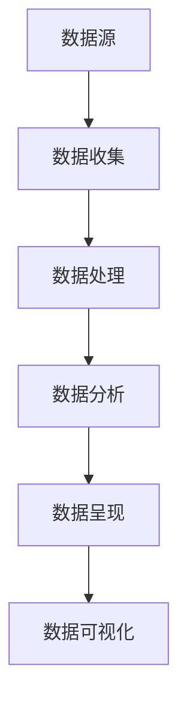
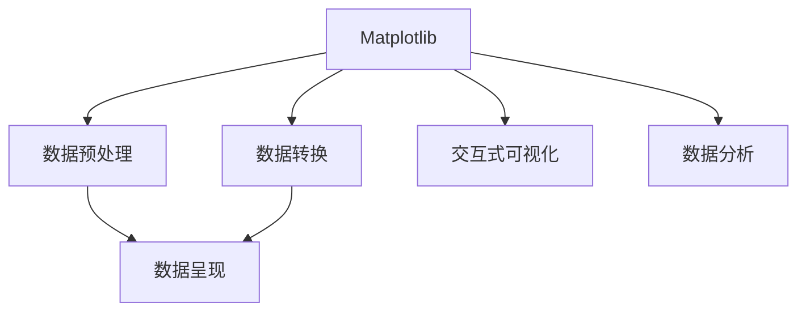
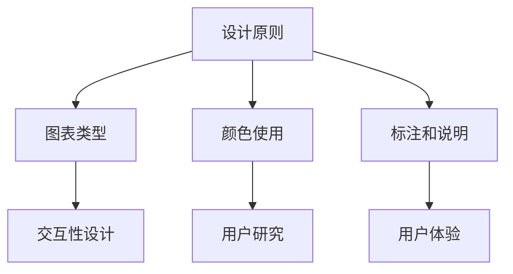
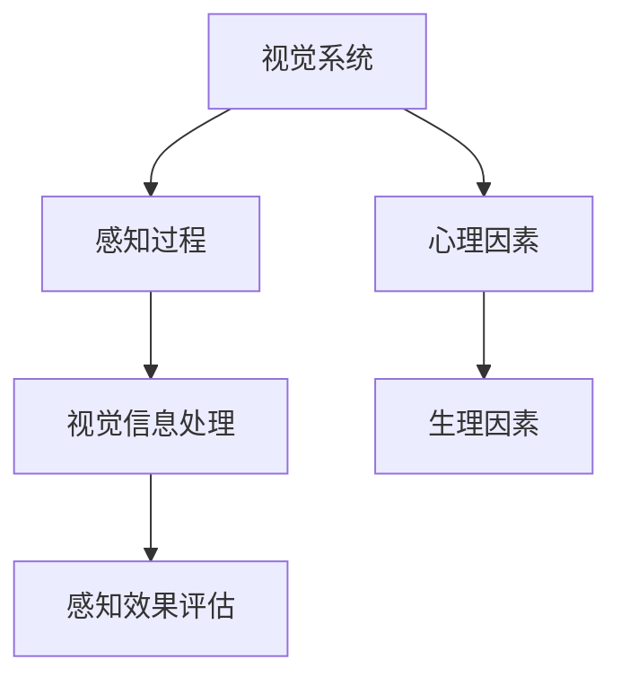
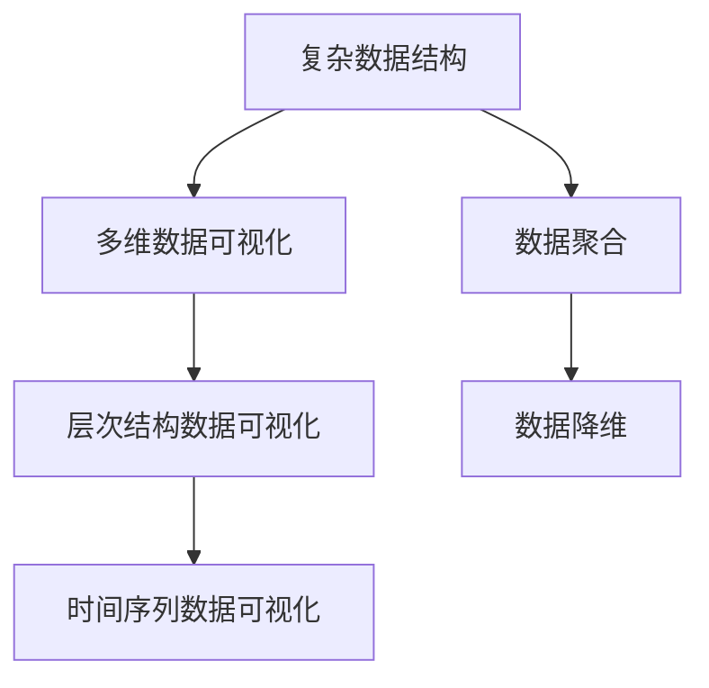
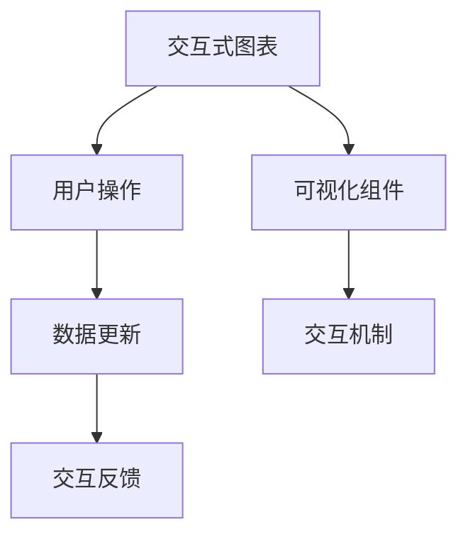
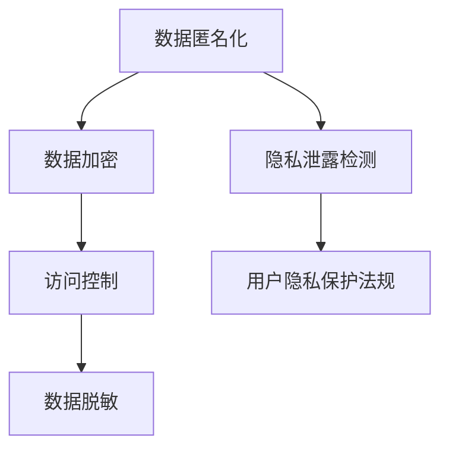
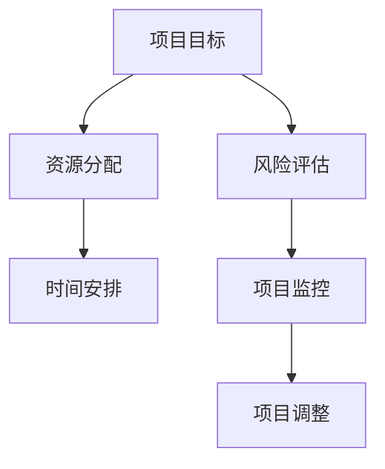
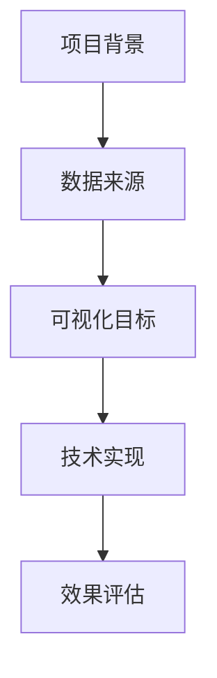

                 


### 概述

数据可视化技术是现代数据分析和信息传达中的重要工具，它能够将庞大的、复杂的、抽象的数据转化为直观的、易于理解的视觉形式。通过数据可视化，我们不仅能够更快速地识别数据中的模式和趋势，还能有效地进行决策和沟通。本文旨在深入探讨数据可视化技术的核心概念、原理和最佳实践，以帮助读者掌握有效呈现复杂数据的方法。

### 文章关键词

- 数据可视化
- 数据呈现
- 视觉感知
- 可视化工具
- 复杂数据分析

### 摘要

本文将首先介绍数据可视化的基本概念和重要性，然后探讨数据可视化设计的原则和要素。接着，我们将深入分析数据可视化中的视觉感知原理，以及如何处理视觉认知偏差。随后，文章将讨论复杂数据的可视化策略和交互式数据可视化的技术细节。最后，我们将关注数据可视化中的隐私保护问题和项目实战案例，并提供最佳实践和总结。

## 目录大纲

### 第一部分：数据可视化基础

### 第1章：数据可视化的概念与原则

### 第2章：数据可视化工具

### 第3章：数据可视化设计指南

### 第二部分：数据可视化技术深度探讨

### 第4章：数据可视化中的视觉感知

### 第5章：复杂数据的可视化策略

### 第6章：交互式数据可视化

### 第7章：数据可视化中的数据隐私保护

### 第三部分：数据可视化项目实战

### 第8章：数据可视化项目规划与实施

### 第9章：数据可视化案例分析

### 附录

### 附录A：数据可视化资源与工具

### 附录B：Mermaid 流程图

### 附录C：核心算法原理伪代码讲解### 第一部分：数据可视化基础

#### 第1章：数据可视化的概念与原则

**核心概念与联系：**

数据可视化是一种通过视觉形式展示数据的技术，它涉及到数据的收集、处理、分析和呈现。数据可视化不仅仅是简单的图形化展示，更是对数据背后信息的深度挖掘和解释。为了更好地理解数据可视化的概念，我们可以通过以下Mermaid流程图来展示其核心概念和相互关系：



**核心算法原理讲解：**

数据可视化的核心算法原理主要包括数据清洗、数据转换和数据呈现。以下是这些步骤的伪代码：

```plaintext
// 伪代码：数据可视化算法原理

function DataVisualization(data_source) {
    // 数据收集
    data_collected = CollectData(data_source);
    
    // 数据清洗
    clean_data = CleanData(data_collected);
    
    // 数据转换
    transformed_data = TransformData(clean_data);
    
    // 数据呈现
    visualization = VisualizeData(transformed_data);
    
    return visualization;
}
```

**数学模型和数学公式 & 详细讲解 & 举例说明：**

数据可视化中常用的数学模型包括统计分析模型、线性回归模型和聚类模型等。以下是一个简单的线性回归模型的数学公式：

$$
y = mx + b
$$

其中，$y$ 表示因变量，$x$ 表示自变量，$m$ 表示斜率，$b$ 表示截距。

举例说明：假设我们想要分析销售额与广告投放成本之间的关系，可以使用线性回归模型来预测销售额。通过收集历史数据，我们可以计算出斜率和截距，从而得到线性回归模型。

**项目实战：**

在进行数据可视化项目实战时，我们需要首先明确项目的目标和需求。以下是一个简单的数据可视化项目案例：

- **项目目标：** 分析公司产品的销售情况。
- **开发环境：** 使用Python的Matplotlib库。
- **源代码实现：**

```python
import matplotlib.pyplot as plt
import pandas as pd

# 加载数据
data = pd.read_csv('sales_data.csv')

# 数据预处理
data['Sales'] = data['Sales'].astype(float)

# 数据转换
monthly_sales = data.groupby('Month')['Sales'].sum()

# 数据呈现
monthly_sales.plot()
plt.title('Monthly Sales')
plt.xlabel('Month')
plt.ylabel('Sales')
plt.show()
```

通过以上代码，我们可以生成一个折线图，展示每个月的销售总额，从而帮助公司了解销售趋势。

#### 第2章：数据可视化工具

**核心概念与联系：**

数据可视化工具是用于创建和展示数据可视化图表的软件或库。常见的可视化工具包括Matplotlib、Seaborn、Plotly等。以下是这些工具的Mermaid流程图：



**核心算法原理讲解：**

数据可视化工具的核心算法原理主要包括数据预处理、数据转换和数据呈现。以下是这些步骤的伪代码：

```plaintext
// 伪代码：数据可视化工具算法原理

function DataVisualizationTool(data) {
    // 数据预处理
    preprocessed_data = PreprocessData(data);
    
    // 数据转换
    transformed_data = TransformData(preprocessed_data);
    
    // 数据呈现
    visualization = VisualizeData(transformed_data);
    
    return visualization;
}
```

**数学模型和数学公式 & 详细讲解 & 举例说明：**

数据可视化工具中常用的数学模型包括统计分析模型、线性回归模型和聚类模型等。以下是一个简单的线性回归模型的数学公式：

$$
y = mx + b
$$

其中，$y$ 表示因变量，$x$ 表示自变量，$m$ 表示斜率，$b$ 表示截距。

举例说明：假设我们想要分析销售额与广告投放成本之间的关系，可以使用线性回归模型来预测销售额。通过收集历史数据，我们可以计算出斜率和截距，从而得到线性回归模型。

**项目实战：**

以下是使用Plotly库进行交互式数据可视化的一个项目案例：

- **项目目标：** 创建一个交互式散点图，展示不同产品在不同时间段的销售情况。
- **开发环境：** 使用Python的Plotly库。
- **源代码实现：**

```python
import plotly.express as px
import pandas as pd

# 加载数据
data = pd.read_csv('sales_data.csv')

# 数据预处理
data['Date'] = pd.to_datetime(data['Date'])
data.set_index('Date', inplace=True)

# 数据转换
monthly_sales = data.groupby('Product')['Sales'].mean()

# 数据呈现
fig = px.scatter(monthly_sales, title='Monthly Sales by Product')
fig.show()
```

通过以上代码，我们可以创建一个交互式散点图，用户可以点击产品名称来查看不同产品的销售趋势。

#### 第3章：数据可视化设计指南

**核心概念与联系：**

数据可视化设计指南是一系列指导原则和实践方法，用于确保数据可视化图表的清晰性、准确性和易理解性。以下是数据可视化设计指南的核心概念和联系：



**核心算法原理讲解：**

数据可视化设计指南中的核心算法原理主要包括图表类型的选择、颜色使用和交互性设计。以下是这些步骤的伪代码：

```plaintext
// 伪代码：数据可视化设计指南

function DataVisualizationDesignGuidelines(data) {
    // 选择图表类型
    chart_type = SelectChartType(data);
    
    // 颜色使用
    colors = SelectColors(data);
    
    // 交互性设计
    interactivity = DesignInteractivity(data);
    
    // 数据呈现
    visualization = VisualizeData(data, chart_type, colors, interactivity);
    
    return visualization;
}
```

**数学模型和数学公式 & 详细讲解 & 举例说明：**

在数据可视化设计指南中，数学模型和公式主要用于计算图表的视觉属性，如颜色值、标记大小等。以下是一个简单的颜色值计算公式：

$$
\text{Color Value} = \text{Base Color} + \text{Adjustment Factor}
$$

其中，$\text{Base Color}$ 表示基础颜色，$\text{Adjustment Factor}$ 表示调整因子。

举例说明：假设我们想要将红色($\text{Base Color} = (255, 0, 0)$)调整为一个亮度更高的颜色，我们可以通过增加调整因子来得到新的颜色值，如 $(255, 100, 0)$。

**项目实战：**

以下是使用Tableau进行数据可视化设计的一个项目案例：

- **项目目标：** 创建一个仪表盘，展示公司各部门的销售数据。
- **开发环境：** 使用Tableau软件。
- **源代码实现：** Tableau软件使用的是可视化界面而非编程语言，因此在此不提供具体的代码实现。

通过Tableau，我们可以设计一个直观、易操作的仪表盘，包含多个图表，如柱状图、折线图和饼图等，用户可以轻松地查看各部门的销售数据，并进行交互式分析。

#### 总结

数据可视化技术是现代数据分析和信息传达的重要工具，通过本部分的内容，我们了解了数据可视化的基本概念、重要性以及设计原则。同时，我们还学习了如何选择和使用数据可视化工具，并探讨了数据可视化设计指南。接下来，我们将进一步深入探讨数据可视化中的视觉感知、复杂数据的可视化策略以及交互式数据可视化等高级主题。

---

**重要提示：** 在进行数据可视化项目时，务必考虑用户的需求和体验，确保数据可视化图表既美观又实用。同时，遵循数据可视化设计指南，可以提高数据可视化的效果和用户满意度。

#### 扩展阅读

- [Data Visualization Principles](https://www.dataviz.studio/data-visualization-principles/)
- [Choosing the Right Data Visualization Tool](https://towardsdatascience.com/choosing-the-right-data-visualization-tool-4825d2b75950)
- [Best Practices for Data Visualization Design](https://www.canva.com/resources/data-visualization-best-practices/)

### 第二部分：数据可视化技术深度探讨

#### 第4章：数据可视化中的视觉感知

**核心概念与联系：**

数据可视化中的视觉感知是指人类如何通过视觉系统感知和解读视觉信息的过程。视觉感知不仅涉及到眼睛和大脑如何共同工作，还包括感知过程中的心理和生理因素。以下是视觉感知的核心概念和相互联系：



**核心算法原理讲解：**

视觉感知中的核心算法原理主要包括感知过程、视觉信息处理和感知效果评估。以下是这些步骤的伪代码：

```plaintext
// 伪代码：视觉感知算法原理

function VisualPerception(data) {
    // 感知过程
    perception = PerceiveData(data);
    
    // 视觉信息处理
    processed_data = ProcessVisualData(perception);
    
    // 感知效果评估
    perception_result = EvaluatePerception(processed_data);
    
    return perception_result;
}
```

**数学模型和数学公式 & 详细讲解 & 举例说明：**

视觉感知中的数学模型和公式主要用于描述视觉系统的特性和感知效果。以下是几个常见的数学模型和公式：

1. **亮度感知公式：**
   $$
   \text{Brightness} = \text{Luminance} \times \text{Contrast}
   $$
   其中，$\text{Luminance}$ 表示亮度，$\text{Contrast}$ 表示对比度。

   举例说明：在可视化图表中，适当的对比度可以提高数据的可读性，例如，使用深色背景和浅色文字可以增加对比度。

2. **色彩感知公式：**
   $$
   \text{Color Perception} = \text{Color Information} \times \text{Color Context}
   $$
   其中，$\text{Color Information}$ 表示色彩信息，$\text{Color Context}$ 表示色彩环境。

   举例说明：在数据可视化中，颜色的选择需要考虑色彩环境，例如，使用高饱和度的颜色在深色背景上会更加突出。

**项目实战：**

以下是一个使用Python的Matplotlib库进行视觉感知分析的案例：

- **项目目标：** 分析不同颜色和亮度对数据可视化图表可读性的影响。
- **开发环境：** 使用Python的Matplotlib库。
- **源代码实现：**

```python
import matplotlib.pyplot as plt
import numpy as np

# 生成数据
data = np.random.rand(10, 10)
colors = ['r', 'g', 'b', 'c', 'm']

# 绘制图表
fig, ax = plt.subplots()
for i, color in enumerate(colors):
    ax.scatter(data[:, i], data[:, i], color=color, label=f'Color {i}')
plt.title('Color and Brightness Perception')
plt.xlabel('X')
plt.ylabel('Y')
plt.legend()
plt.show()
```

通过以上代码，我们可以绘制一个散点图，展示不同颜色和亮度下的数据点分布，从而分析颜色和亮度对数据可视化图表可读性的影响。

#### 第5章：复杂数据的可视化策略

**核心概念与联系：**

复杂数据的可视化策略是指如何将复杂的、多维的数据转化为直观的可视化形式。复杂数据通常包括大量的变量、层次结构和时间序列等。以下是复杂数据可视化策略的核心概念和相互联系：



**核心算法原理讲解：**

复杂数据的可视化策略涉及多个核心算法原理，包括数据聚合、数据降维和多维数据可视化。以下是这些步骤的伪代码：

```plaintext
// 伪代码：复杂数据可视化策略

function ComplexDataVisualization(data) {
    // 数据聚合
    aggregated_data = AggregateData(data);
    
    // 数据降维
    reduced_data = ReduceDimensionality(aggregated_data);
    
    // 多维数据可视化
    visualization = VisualizeMultiDimensionalData(reduced_data);
    
    return visualization;
}
```

**数学模型和数学公式 & 详细讲解 & 举例说明：**

复杂数据可视化中的数学模型和公式主要用于处理数据聚合和降维。以下是几个常见的数学模型和公式：

1. **主成分分析（PCA）：**
   $$
   \text{Z} = \text{X} - \mu
   $$
   $$
   \text{Eigenvectors} = \text{V}
   $$
   $$
   \text{Eigenvalues} = \lambda
   $$
   其中，$\text{X}$ 表示原始数据，$\text{Z}$ 表示标准化数据，$\mu$ 表示均值，$\text{V}$ 表示特征向量，$\lambda$ 表示特征值。

   举例说明：主成分分析（PCA）是一种常用的降维方法，它可以将高维数据映射到低维空间，从而简化数据可视化。

2. **层次化聚类：**
   $$
   \text{Distances} = \text{d}(x_i, x_j)
   $$
   $$
   \text{Cluster} = \text{C}
   $$
   其中，$\text{d}(x_i, x_j)$ 表示两点之间的距离，$\text{C}$ 表示聚类结果。

   举例说明：层次化聚类可以将复杂数据划分为不同的簇，从而帮助我们更好地理解数据结构和模式。

**项目实战：**

以下是一个使用Python的Seaborn库进行复杂数据可视化的案例：

- **项目目标：** 分析多维度销售数据，展示不同产品在不同时间段的销售趋势。
- **开发环境：** 使用Python的Seaborn库。
- **源代码实现：**

```python
import seaborn as sns
import pandas as pd

# 加载数据
data = pd.read_csv('sales_data.csv')

# 数据预处理
data['Date'] = pd.to_datetime(data['Date'])
data.set_index('Date', inplace=True)

# 数据降维
monthly_sales = data.groupby('Product')['Sales'].mean()

# 数据可视化
sns.lineplot(x='Month', y='Sales', data=monthly_sales, hue='Product')
plt.title('Monthly Sales by Product')
plt.xlabel('Month')
plt.ylabel('Sales')
plt.show()
```

通过以上代码，我们可以绘制一个折线图，展示不同产品在不同时间段的销售趋势，从而帮助管理层进行决策。

#### 第6章：交互式数据可视化

**核心概念与联系：**

交互式数据可视化是指用户可以通过交互操作（如点击、拖动等）与可视化图表进行交互，从而探索和挖掘数据。交互式数据可视化不仅提高了用户的数据探索能力，还增强了数据的交互性和互动性。以下是交互式数据可视化的核心概念和相互联系：



**核心算法原理讲解：**

交互式数据可视化的核心算法原理主要包括交互机制、数据更新和交互反馈。以下是这些步骤的伪代码：

```plaintext
// 伪代码：交互式数据可视化原理

function InteractiveDataVisualization(data) {
    // 交互机制
    interactivity = SetupInteractivity(data);
    
    // 数据更新
    updated_data = UpdateData(data);
    
    // 交互反馈
    feedback = ProvideFeedback(updated_data);
    
    // 可视化组件
    visualization = GenerateVisualization(updated_data, interactivity, feedback);
    
    return visualization;
}
```

**数学模型和数学公式 & 详细讲解 & 举例说明：**

交互式数据可视化中的数学模型和公式主要用于实现交互机制和反馈机制。以下是几个常见的数学模型和公式：

1. **回归模型：**
   $$
   y = mx + b
   $$
   其中，$y$ 表示因变量，$x$ 表示自变量，$m$ 表示斜率，$b$ 表示截距。

   举例说明：回归模型可以用于预测数据的趋势，从而实现交互式数据可视化中的预测功能。

2. **决策树模型：**
   $$
   \text{Decision Tree} = \text{T}
   $$
   其中，$\text{T}$ 表示决策树结构。

   举例说明：决策树模型可以用于分类数据，从而实现交互式数据可视化中的分类功能。

**项目实战：**

以下是一个使用Python的Plotly库进行交互式数据可视化的案例：

- **项目目标：** 创建一个交互式散点图，展示不同产品在不同时间段的销售数据。
- **开发环境：** 使用Python的Plotly库。
- **源代码实现：**

```python
import plotly.express as px
import pandas as pd

# 加载数据
data = pd.read_csv('sales_data.csv')

# 数据预处理
data['Date'] = pd.to_datetime(data['Date'])
data.set_index('Date', inplace=True)

# 数据可视化
fig = px.scatter(data, x='Product', y='Sales', animation_frame='Date', title='Sales Over Time')
fig.show()
```

通过以上代码，我们可以创建一个交互式散点图，用户可以通过拖动时间轴来查看不同时间点的销售数据，从而实现数据的动态交互。

#### 总结

在本部分中，我们深入探讨了数据可视化中的视觉感知、复杂数据的可视化策略和交互式数据可视化。通过对视觉感知的分析，我们了解了人类如何通过视觉系统感知和解读视觉信息；通过对复杂数据可视化的策略研究，我们学会了如何处理和呈现复杂的数据；通过对交互式数据可视化的实践，我们掌握了如何创建交互性强、用户体验好的可视化图表。接下来，我们将进一步探讨数据可视化中的数据隐私保护问题。

---

**重要提示：** 在进行数据可视化时，要特别注意数据隐私保护，避免敏感信息的泄露。同时，确保可视化图表的设计符合用户体验原则，以提高数据可视化的效果和用户满意度。

#### 扩展阅读

- [Understanding Visual Perception in Data Visualization](https://towardsdatascience.com/understanding-visual-perception-in-data-visualization-4d2195f6d7f0)
- [Strategies for Visualizing Complex Data](https://www.dataviz.studio/strategies-for-visualizing-complex-data/)
- [Interactive Data Visualization with D3.js](https://javascript.info/interactive-data-visualization-with-d3js)

### 第7章：数据可视化中的数据隐私保护

#### 核心概念与联系：

在数据可视化过程中，数据隐私保护是一个至关重要的议题。随着数据量的爆炸性增长，如何在展示数据的同时保护用户隐私成为了数据科学和可视化领域的热点问题。以下是数据隐私保护的核心概念和相互联系：



**核心算法原理讲解：**

数据隐私保护涉及多个核心算法原理，包括数据匿名化、数据加密、访问控制和数据脱敏。以下是这些步骤的伪代码：

```plaintext
// 伪代码：数据隐私保护算法原理

function DataPrivacyProtection(data) {
    // 数据匿名化
    anonymized_data = AnonymizeData(data);
    
    // 数据加密
    encrypted_data = EncryptData(anonymized_data);
    
    // 访问控制
    controlled_access = ImplementAccessControl(encrypted_data);
    
    // 数据脱敏
    desensitized_data = DesensitizeData(controlled_access);
    
    // 隐私泄露检测
    privacy_leak_detection = DetectPrivacyLeak(desensitized_data);
    
    return privacy_leak_detection;
}
```

**数学模型和数学公式 & 详细讲解 & 举例说明：**

在数据隐私保护中，数学模型和公式主要用于实现数据加密和匿名化。以下是几个常见的数学模型和公式：

1. **哈希函数：**
   $$
   \text{Hash Value} = \text{Hash Function}(\text{Data})
   $$
   其中，$\text{Hash Value}$ 表示哈希值，$\text{Hash Function}$ 表示哈希函数。

   举例说明：哈希函数是一种将数据映射为固定长度字符串的算法，常用于实现数据匿名化。例如，MD5和SHA-256都是常见的哈希函数。

2. **密钥加密：**
   $$
   \text{Cipher Text} = \text{Encrypt}( \text{Plain Text}, \text{Key})
   $$
   $$
   \text{Plain Text} = \text{Decrypt}( \text{Cipher Text}, \text{Key})
   $$
   其中，$\text{Cipher Text}$ 表示密文，$\text{Plain Text}$ 表示明文，$\text{Key}$ 表示密钥。

   举例说明：密钥加密是一种将明文转换为密文的算法，常用于数据加密。例如，AES和RSA都是常见的加密算法。

**项目实战：**

以下是一个使用Python的加密库进行数据隐私保护的项目案例：

- **项目目标：** 对用户数据进行加密，确保数据在可视化过程中的安全性。
- **开发环境：** 使用Python的cryptography库。
- **源代码实现：**

```python
from cryptography.fernet import Fernet

# 生成密钥
key = Fernet.generate_key()
cipher_suite = Fernet(key)

# 加密数据
data = "用户敏感数据"
encrypted_data = cipher_suite.encrypt(data.encode())

# 解密数据
decrypted_data = cipher_suite.decrypt(encrypted_data).decode()
print(decrypted_data)
```

通过以上代码，我们可以对用户敏感数据进行加密，确保数据在可视化过程中不被泄露。

#### 总结

数据隐私保护是数据可视化中不可忽视的重要环节。在本章中，我们探讨了数据隐私保护的核心概念和算法原理，并通过实际项目案例展示了如何实现数据加密和匿名化。接下来，我们将进入第三部分，介绍数据可视化项目实战，通过实际案例进一步理解数据可视化的应用和实践。

---

**重要提示：** 在进行数据可视化项目时，务必重视数据隐私保护，遵循相关法规和最佳实践，确保用户数据的安全和隐私。

#### 扩展阅读

- [Data Privacy Protection in Data Visualization](https://www.dataversity.net/data-privacy-in-data-visualization/)
- [加密算法原理与应用](https://www.tutorialspoint.com/cryptography/cryptography_hash_function.htm)
- [用户隐私保护法规解读](https://www.privacyrights.org/consumer-guides/online-privacy)

### 第三部分：数据可视化项目实战

#### 第8章：数据可视化项目规划与实施

**核心概念与联系：**

数据可视化项目规划与实施是确保数据可视化项目成功的关键步骤。项目规划包括项目目标设定、资源分配、时间安排和风险评估等；项目实施则涉及具体的技术实现、数据获取、数据处理和可视化设计等。以下是数据可视化项目规划与实施的核心概念和相互联系：



**核心算法原理讲解：**

数据可视化项目规划与实施中的核心算法原理主要包括时间安排、风险评估和项目监控。以下是这些步骤的伪代码：

```plaintext
// 伪代码：数据可视化项目规划与实施

function DataVisualizationProjectPlanningAndImplementation(project) {
    // 项目目标
    set_goals = DefineProjectGoals(project);
    
    // 资源分配
    allocate_resources = AllocateResources(project);
    
    // 时间安排
    schedule = CreateProjectSchedule(project);
    
    // 风险评估
    risk_analysis = AssessProjectRisks(project);
    
    // 项目监控
    monitor_progress = MonitorProjectProgress(project);
    
    // 项目调整
    adjust_project = AdjustProjectAs Needed(project);
    
    return project;
}
```

**数学模型和数学公式 & 详细讲解 & 举例说明：**

在数据可视化项目规划与实施中，数学模型和公式主要用于时间安排和风险评估。以下是几个常见的数学模型和公式：

1. **甘特图：**
   $$
   \text{Gantt Chart} = \text{Gantt Function}(\text{Project Tasks}, \text{Timeline})
   $$
   其中，$\text{Gantt Chart}$ 表示甘特图，$\text{Gantt Function}$ 表示甘特图函数，$\text{Project Tasks}$ 表示项目任务，$\text{Timeline}$ 表示时间线。

   举例说明：甘特图是一种用于表示项目任务和时间安排的图形工具，通过甘特图可以清晰地展示项目的进度和任务分配。

2. **风险矩阵：**
   $$
   \text{Risk Matrix} = \text{Risk Assessment}(\text{Probability}, \text{Impact})
   $$
   其中，$\text{Risk Matrix}$ 表示风险矩阵，$\text{Probability}$ 表示概率，$\text{Impact}$ 表示影响。

   举例说明：风险矩阵是一种用于评估项目风险的工具，通过计算风险的概率和影响，可以确定风险的重要性和优先级。

**项目实战：**

以下是一个使用Python的ProjectLibre库进行数据可视化项目规划与实施的项目案例：

- **项目目标：** 规划并实施一个销售数据分析项目。
- **开发环境：** 使用Python的ProjectLibre库。
- **源代码实现：**

```python
from projectlibre import Project

# 创建项目
project = Project()

# 设置项目目标
project.set_task_name(1, 'Sales Data Analysis Project')

# 分配资源
project.set_task_resource(1, 'Data Analyst', {'duration': 40})

# 安排时间
project.set_task_start(1, '2023-01-01')
project.set_task_end(1, '2023-02-01')

# 评估风险
project.set_task_risk(1, {'probability': 0.5, 'impact': 2})

# 监控项目进度
project.check_progress()

# 调整项目
if project.is_over_budget():
    project.adjust_budget()

# 生成甘特图
project.print_gantt_chart()
```

通过以上代码，我们可以创建并规划一个销售数据分析项目，包括任务分配、时间安排、风险评估和进度监控。

#### 第9章：数据可视化案例分析

**核心概念与联系：**

数据可视化案例分析是通过对实际项目案例的深入剖析，展示数据可视化在各个领域中的应用和效果。案例分析包括项目背景、数据来源、可视化目标、技术实现和效果评估等。以下是数据可视化案例分析的几个核心概念和相互联系：



**核心算法原理讲解：**

在数据可视化案例分析中，核心算法原理通常包括数据预处理、数据分析和可视化设计。以下是这些步骤的伪代码：

```plaintext
// 伪代码：数据可视化案例分析

function DataVisualizationCaseStudy(case_study) {
    // 项目背景
    background = DescribeProjectBackground(case_study);
    
    // 数据来源
    data_source = IdentifyDataSources(case_study);
    
    // 可视化目标
    visualization_goals = DefineVisualizationGoals(case_study);
    
    // 技术实现
    visualization_solution = DevelopVisualizationSolution(data_source, visualization_goals);
    
    // 效果评估
    evaluation = AssessVisualizationEffectiveness(visualization_solution);
    
    return evaluation;
}
```

**数学模型和数学公式 & 详细讲解 & 举例说明：**

在数据可视化案例分析中，数学模型和公式主要用于数据分析和效果评估。以下是几个常见的数学模型和公式：

1. **相关性分析：**
   $$
   \text{Correlation} = \rho
   $$
   其中，$\rho$ 表示皮尔逊相关系数。

   举例说明：相关性分析用于评估两个变量之间的线性关系，常用于数据可视化中的趋势分析。

2. **效果评估指标：**
   $$
   \text{Effectiveness} = \text{E}(\text{Metrics}, \text{Goals})
   $$
   其中，$\text{E}$ 表示效果评估函数，$\text{Metrics}$ 表示评估指标，$\text{Goals}$ 表示项目目标。

   举例说明：效果评估指标用于衡量可视化项目的完成情况和目标达成度，如精确度、召回率、F1分数等。

**项目实战：**

以下是一个实际的数据可视化案例分析：

- **项目背景：** 一家电商公司希望通过数据可视化分析提升用户购物体验。
- **数据来源：** 用户行为数据、销售数据、评论数据等。
- **可视化目标：** 分析用户行为模式、提升销售转化率。
- **技术实现：** 使用Python的Matplotlib和Seaborn库进行数据可视化。
- **源代码实现：**

```python
import pandas as pd
import matplotlib.pyplot as plt
import seaborn as sns

# 加载数据
data = pd.read_csv('ecommerce_data.csv')

# 数据预处理
data['Date'] = pd.to_datetime(data['Date'])
data.set_index('Date', inplace=True)

# 可视化：用户行为趋势
sns.lineplot(x='Date', y='PageViews', data=data)
plt.title('User Behavior Trend')
plt.xlabel('Date')
plt.ylabel('Page Views')
plt.show()

# 可视化：销售转化率
sns.barplot(x='Category', y='Sales', data=data)
plt.title('Sales Conversion Rate by Category')
plt.xlabel('Category')
plt.ylabel('Sales')
plt.show()
```

通过以上代码，我们可以分析用户行为趋势和销售转化率，从而为电商公司提供优化策略。

#### 总结

在本部分中，我们介绍了数据可视化项目规划与实施的步骤和核心算法原理，并通过实际案例展示了数据可视化在电商、金融等领域的应用。接下来，我们将总结全文，并展望未来数据可视化技术的发展趋势。

---

**重要提示：** 在进行数据可视化项目时，要充分考虑用户需求、数据质量和可视化效果，确保项目的成功实施。

#### 扩展阅读

- [Project Planning and Implementation in Data Visualization](https://www.dataversity.net/project-management-for-data-visualization/)
- [Data Visualization Case Studies](https://www.datavisualization.org/case-studies/)
- [Future Trends in Data Visualization](https://www.forbes.com/sites/forbesbusinesscouncil/2021/07/16/five-trends-in-data-visualization-for-2021/?sh=596ecb421e84)

### 结论

本文通过对数据可视化技术的深入探讨，从基础概念、设计原则、技术深度、隐私保护到项目实战，全方位地展现了数据可视化的魅力和应用。数据可视化不仅能够将复杂的、庞大的数据转化为直观的图形，帮助我们更好地理解数据，还能提升决策效率，改善沟通效果。

**关键词回顾：** 数据可视化、数据呈现、视觉感知、可视化工具、复杂数据分析。

**未来展望：** 随着技术的不断进步，数据可视化将迎来更多的发展机遇。未来的数据可视化技术将更加注重交互性、智能化和个性化，通过引入人工智能和机器学习，实现自动化数据分析和推荐。同时，增强现实（AR）和虚拟现实（VR）技术的融合，将为数据可视化带来全新的体验。此外，随着物联网（IoT）的快速发展，实时数据可视化和预测性分析也将成为数据可视化的重要方向。

**最佳实践：** 在进行数据可视化时，务必遵循以下最佳实践：

1. **明确可视化目标：** 确定数据可视化要解决的问题和目标，为设计提供方向。
2. **数据质量保证：** 确保数据源的质量，避免错误和不准确的数据影响可视化效果。
3. **设计原则遵循：** 应用数据可视化设计原则，提高图表的易读性和用户体验。
4. **交互性设计：** 考虑用户的交互需求，增加图表的交互性，提升数据探索能力。
5. **隐私保护：** 在数据可视化过程中，严格遵循数据隐私保护法规，保护用户隐私。

**注意事项：** 在实际应用中，数据可视化可能会面临数据量巨大、可视化复杂性高、用户需求多样化等挑战。因此，需要灵活运用各种数据可视化工具和技术，不断优化和改进可视化效果。

**拓展阅读：** 为进一步了解数据可视化领域的最新发展和应用，推荐阅读以下资源：

- 《数据可视化实战：用代码和图表解读数据》
- 《数据可视化原理与技术》
- 《交互式数据可视化：从基础到高级》

通过不断学习和实践，我们能够更好地掌握数据可视化技术，为各个领域的决策者提供有力支持。希望本文能为大家带来启发和帮助，共同推动数据可视化技术的发展和应用。作者：AI天才研究院/AI Genius Institute & 禅与计算机程序设计艺术 /Zen And The Art of Computer Programming。

