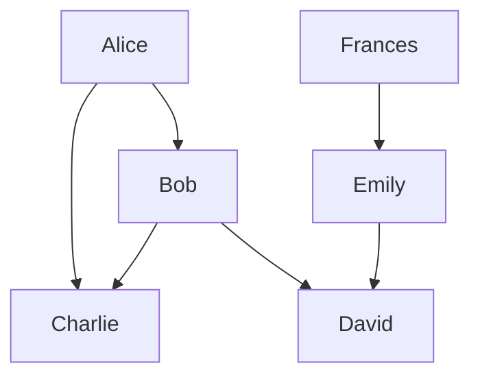

                 

### 文章标题

# 数据可视化：有效呈现复杂数据的技巧

### 关键词

- 数据可视化
- 复杂数据
- 可视化方法
- 交互式可视化
- 时间序列可视化
- 高级可视化技术
- 数据预处理
- 可视化设计原则
- 可视化工具
- 数据分析

### 摘要

数据可视化是现代数据分析中不可或缺的一部分，它通过图形和图像的方式帮助我们直观地理解和分析复杂数据。本文将详细介绍数据可视化的基础知识和实用技巧，包括常见的数据可视化方法、高级可视化技术、数据预处理和可视化设计原则。通过实际案例分析和项目实战，读者将学会如何使用不同的工具和技术来有效呈现复杂数据，并掌握数据可视化最佳实践。

## 引言

在信息爆炸的时代，数据的数量和质量都在以惊人的速度增长。大数据已经成为企业和组织决策的重要依据，而如何有效地分析和呈现这些数据，成为了数据科学和数据分析领域的一个关键问题。数据可视化作为一种将数据转化为图形和图像的手段，不仅能够帮助人们更直观地理解和分析数据，还能揭示数据之间的潜在关系和模式。

数据可视化的重要性体现在以下几个方面：

1. **提高数据分析效率**：通过可视化，数据分析师可以快速捕捉数据的关键特征和趋势，减少对大量数据的处理时间。
2. **增强数据解释力**：图形和图像能够比文字和表格更直观地传达信息，使得数据分析结果更加容易理解和接受。
3. **支持决策制定**：可视化工具可以辅助决策者从海量数据中提取有价值的信息，从而做出更加明智的决策。
4. **促进知识传播**：数据可视化可以将复杂的数据分析结果转化为易于传播的形式，帮助更多的人理解和应用这些数据。

本文将逐步引导读者了解数据可视化的基础知识、方法和技术，通过实际案例和项目实战，帮助读者掌握数据可视化的核心技巧，最终能够独立设计和实现高效的数据可视化项目。

### 第一部分：数据可视化基础

#### 第1章：数据可视化概述

数据可视化是指通过图形和图像的方式将数据转化为视觉表现形式，以便人们更直观地理解和分析数据。这一章将介绍数据可视化的定义、重要性及其发展历程，帮助读者建立对数据可视化基础概念的理解。

##### 1.1 数据可视化的定义与重要性

**数据可视化的定义：**

数据可视化是一种通过视觉方式展示数据的技术和过程。它利用图形、图像和颜色等视觉元素，将抽象的数据信息转化为直观的视觉表现形式。数据可视化不仅仅是一种展示手段，更是一种数据分析的方法和工具。通过可视化，数据分析师和决策者可以更快速、准确地理解数据，发现数据中的规律和趋势。

**数据可视化的重要性：**

- **提高数据分析效率：** 数据可视化使数据分析师能够快速捕捉数据的关键特征和趋势，减少对大量数据的处理时间。
- **增强数据解释力：** 图形和图像能够比文字和表格更直观地传达信息，使得数据分析结果更加容易理解和接受。
- **支持决策制定：** 可视化工具可以辅助决策者从海量数据中提取有价值的信息，从而做出更加明智的决策。
- **促进知识传播：** 数据可视化可以将复杂的数据分析结果转化为易于传播的形式，帮助更多的人理解和应用这些数据。

##### 1.2 数据可视化的发展历程

数据可视化技术的发展经历了几个重要的阶段：

- **早期阶段（20世纪60年代到80年代）：** 这一时期主要是计算机图形学和统计图表的发展。先驱者们开始使用计算机生成统计图表，如折线图、柱状图等，来辅助数据分析。
- **互联网时代（20世纪90年代到21世纪初）：** 随着互联网的普及，Web数据可视化和交互式可视化技术得到了快速发展。JavaScript、SVG等技术的出现使得数据可视化更加灵活和多样。
- **大数据时代（21世纪初至今）：** 随着大数据和云计算技术的发展，数据可视化技术也迎来了新的机遇。现代数据可视化工具和平台如Tableau、Power BI等，使得数据处理和可视化变得更加便捷和高效。

##### 1.3 数据可视化应用领域

数据可视化应用广泛，涵盖了各个行业和领域：

- **金融行业：** 数据可视化用于监控金融市场、分析投资组合、预测经济趋势等。
- **医疗行业：** 数据可视化用于医疗图像分析、疾病监测、治疗方案优化等。
- **市场营销：** 数据可视化用于市场调研、消费者行为分析、广告效果评估等。
- **科学研究：** 数据可视化用于科学实验结果分析、复杂系统模拟等。
- **政府治理：** 数据可视化用于政策制定、公共资源分配、社会问题监测等。

通过本章的介绍，读者可以初步了解数据可视化的定义、重要性及其发展历程，为后续章节的深入学习打下基础。

#### 第2章：数据可视化技术

数据可视化技术是实现数据可视化的核心手段，涵盖了从数据处理到可视化呈现的各个环节。本章将详细介绍数据可视化技术，包括常用的数据可视化工具、数据可视化组件及其技术原理。

##### 2.1 数据可视化工具介绍

**数据可视化工具**是进行数据可视化的基础，它们提供了丰富的功能和易于使用的界面，帮助用户快速创建和定制可视化图表。以下是一些常见的数据可视化工具：

- **Tableau:** Tableau是一款功能强大的数据可视化工具，支持多种数据源，提供丰富的图表类型和交互功能。
- **Power BI:** Power BI是微软推出的数据可视化平台，易于集成其他微软产品，提供强大的数据处理和分析能力。
- **D3.js:** D3.js是一个基于JavaScript的库，用于创建高度交互式的数据可视化，适用于前端开发者。
- **Plotly:** Plotly是一个跨平台的可视化库，支持多种图表类型，包括二维和三维图表，适用于科学计算和工程领域。
- **ECharts:** ECharts是一个开源的JavaScript图表库，提供丰富的图表类型和强大的定制能力，广泛应用于Web应用。

这些工具各具特色，用户可以根据自己的需求和技能选择合适的工具。

##### 2.2 数据可视化组件

**数据可视化组件**是实现具体可视化效果的元素，它们可以单独使用，也可以组合使用以创建复杂的可视化图表。以下是一些常见的可视化组件：

- **图表组件：** 包括折线图、柱状图、饼图、散点图等，用于展示数据的基本分布和趋势。
- **地图组件：** 包括地理地图、热力图等，用于展示地理位置和空间分布数据。
- **交互组件：** 包括滑动条、选择框、按钮等，用于用户与可视化图表的交互操作。
- **图形元素：** 包括形状、线条、文字等，用于增强可视化图表的视觉效果和传达更多信息。

这些组件的使用和组合可以创造出各种形式的数据可视化，满足不同场景的需求。

##### 2.3 数据可视化技术原理

**数据可视化技术原理**涉及从数据预处理到可视化呈现的整个过程。以下是一些关键步骤：

1. **数据预处理：** 包括数据清洗、数据整合和特征提取等，确保数据质量，为可视化提供可靠的数据基础。
2. **数据映射：** 将数据映射到可视化组件上，例如将数据值映射到图表的颜色、线条长度等属性。
3. **视觉编码：** 使用视觉元素（如颜色、形状、大小等）来编码数据属性，帮助用户理解数据特征。
4. **交互设计：** 设计用户与可视化图表的交互方式，如缩放、过滤、筛选等，增强用户体验。
5. **呈现优化：** 调整可视化图表的布局、字体、颜色等，使其更具可读性和美观性。

通过掌握这些技术原理，用户可以创建出更具效果和价值的可视化图表。

本章介绍了数据可视化技术的基础知识，包括常用工具、组件和技术原理。通过本章的学习，读者可以了解数据可视化技术的各个方面，为后续的实践应用打下坚实的基础。

#### 第3章：常见的可视化方法

数据可视化方法的选择对数据分析和解释至关重要。本章将详细介绍几种常见的可视化方法，包括交互式可视化、地图可视化和时间序列可视化，并探讨这些方法在复杂数据分析中的应用。

##### 3.1 交互式可视化

**交互式可视化**是指用户可以通过与图表的互动来探索和查询数据。这种方法的核心是提供动态交互功能，如筛选、过滤、缩放、拖拽等，使用户能够从不同角度和层次分析数据。

**应用场景：**

- **市场分析：** 用户可以交互式地筛选特定时间段的销售数据，了解不同产品和地区的销售情况。
- **风险管理：** 风险管理分析师可以使用交互式可视化来实时监控金融市场的波动，识别潜在的风险点。
- **科学研究：** 科学家可以通过交互式可视化来分析实验数据，快速发现实验中的异常现象和趋势。

**实现技巧：**

- **响应式设计：** 确保可视化图表在不同设备和屏幕尺寸上都能良好显示。
- **交互便捷性：** 提供直观、简单的交互操作，如拖拽、滑动等。
- **数据更新及时：** 实时更新图表数据，确保信息的准确性。

##### 3.2 地图可视化

**地图可视化**是一种通过地图展示地理数据的可视化方法。它可以帮助用户直观地了解数据的空间分布、地理联系和趋势。

**应用场景：**

- **地理信息分析：** 地图可视化用于分析地理位置数据，如人口分布、交通流量等。
- **供应链管理：** 企业可以使用地图可视化来优化物流路径，减少运输成本。
- **环境保护：** 环保部门可以使用地图可视化来监测污染源和污染范围，制定环境保护措施。

**实现技巧：**

- **地图选择：** 选择合适的地图类型，如世界地图、国家地图、城市地图等。
- **图层管理：** 合理分层管理地图上的数据，使数据更具层次感和可读性。
- **数据聚合：** 对于大规模数据，可以通过数据聚合技术（如热点图）来简化地图上的数据展示。

##### 3.3 时间序列可视化

**时间序列可视化**是一种通过时间维度展示数据变化趋势的图表，常用于分析时间相关的数据，如股票价格、气温变化、销售额等。

**应用场景：**

- **金融市场：** 投资者可以使用时间序列可视化来分析股票价格的走势，预测市场趋势。
- **气候研究：** 气象学家可以使用时间序列可视化来研究气温、降雨等气候变化。
- **电子商务：** 企业可以使用时间序列可视化来监控销售数据，优化营销策略。

**实现技巧：**

- **时间轴表示：** 确保时间轴清晰、易于理解，使用合适的刻度间隔和时间单位。
- **趋势线分析：** 通过添加趋势线（如移动平均线）来辅助分析数据的长期趋势。
- **交互式时间筛选：** 提供交互式时间筛选功能，使用户能够快速浏览和分析不同时间段的数据。

通过本章的介绍，读者可以了解交互式可视化、地图可视化和时间序列可视化的基本方法和应用技巧，为复杂数据的分析和解释提供有效的工具。

#### 第4章：高级可视化技术

在数据可视化的领域中，高级可视化技术为我们提供了更丰富的工具来探索和展示复杂的数据结构。本章将详细介绍几种高级可视化技术，包括复杂网络可视化、3D可视化和动态可视化，并探讨这些技术的实现原理和应用场景。

##### 4.1 复杂网络可视化

**复杂网络可视化**是一种用于展示网络结构及其关系的可视化技术。它常用于社交网络分析、交通网络模拟、生物网络研究等领域。

**应用场景：**

- **社交网络分析：** 通过复杂网络可视化，可以直观地了解社交网络中的节点（如人）和边（如关系）之间的连接关系。
- **交通网络模拟：** 复杂网络可视化可以帮助城市规划者优化交通路线，减少交通拥堵。
- **生物网络研究：** 生物学家可以通过复杂网络可视化来研究细胞内的信号传导和基因调控网络。

**实现原理：**

- **节点和边的表示：** 通过图形化的节点和边来表示网络中的各个元素及其连接关系。
- **布局算法：** 采用特定的布局算法（如力导向布局、圈图布局等）来优化网络结构的可视效果。
- **交互功能：** 提供交互式功能，如节点和边的过滤、筛选、高亮等，帮助用户深入分析网络结构。

**示例：**

假设我们有一个社交网络，其中每个节点代表一个人，边代表他们之间的关系。我们可以使用Mermaid流程图来表示这个网络：



在这个示例中，每个方框代表一个节点，箭头表示节点之间的连接关系。通过调整布局算法和交互功能，我们可以得到更清晰和有层次的网络结构可视化。

##### 4.2 3D可视化

**3D可视化**通过三维空间来展示数据，使数据具有更强的空间感和立体感。它广泛应用于医学成像、工程设计和虚拟现实等领域。

**应用场景：**

- **医学成像：** 3D可视化用于医学影像分析，如CT扫描和MRI，帮助医生更准确地诊断疾病。
- **工程设计：** 工程师使用3D可视化来分析复杂结构，优化设计，提高生产效率。
- **虚拟现实：** 虚拟现实技术结合3D可视化，提供沉浸式的体验，用于游戏、培训等领域。

**实现原理：**

- **三维坐标表示：** 使用三维坐标（x, y, z）来表示数据点，创建三维空间中的模型。
- **渲染技术：** 通过图形渲染技术，如光线追踪、阴影效果等，增强3D图形的视觉效果。
- **交互控制：** 提供旋转、缩放、平移等交互功能，使用户可以自由探索三维空间中的数据。

**示例：**

假设我们有一个三维数据集，包含多个点，我们可以使用LaTeX公式来表示这些点的坐标：

$$
(x_1, y_1, z_1), (x_2, y_2, z_2), ..., (x_n, y_n, z_n)
$$

使用3D可视化工具，我们可以将这些点在三维空间中绘制出来，并通过旋转和缩放来观察不同视角的数据结构。以下是一个简单的LaTeX代码示例：

```latex
\documentclass{standalone}
\usepackage{pgfplots}
\pgfplotsset{compat=newest}
\begin{document}
\begin{tikzpicture}
\begin{axis}[view={90}{30},
    title={3D Data Points},
    xlabel={$x$},
    ylabel={$y$},
    zlabel={$z$},
]
\addplot3[only marks, mark=*] coordinates {
    (1,1,1)
    (2,2,2)
    (3,3,3)
};
\end{axis}
\end{tikzpicture}
\end{document}
```

在这个示例中，我们使用`pgfplots`库来绘制三个三维点，并通过视角调整来展示三维数据结构。

##### 4.3 动态可视化

**动态可视化**通过动画和实时更新来展示数据的变化过程，适用于时间序列数据、动态系统模拟等领域。

**应用场景：**

- **时间序列分析：** 动态可视化可以展示股票价格、气温变化等时间序列数据的动态变化。
- **动态系统模拟：** 科学家可以通过动态可视化来模拟物理过程、生物进化等动态系统。
- **数据流分析：** 网络管理员可以使用动态可视化来实时监控网络流量、设备状态等。

**实现原理：**

- **时间帧渲染：** 通过连续渲染不同时间帧的数据，创建动画效果。
- **实时数据更新：** 系统持续接收和更新数据，动态调整可视化图表。
- **交互控制：** 提供交互式控制，如播放/暂停、快进/快退等，使用户可以控制动画的播放速度和方式。

**示例：**

假设我们有一个动态数据流，包含不断更新的数据点，我们可以使用伪代码来表示动态可视化的过程：

```pseudo
while (数据流中有新数据) {
    更新数据集
    绘制新的数据点
    更新图表
    等待一段时间
}
```

通过循环更新数据集和图表，我们可以实时展示动态数据的变化过程。

高级可视化技术为复杂数据的分析和展示提供了强大的工具。通过本章的介绍，读者可以了解复杂网络可视化、3D可视化和动态可视化的基本原理和应用技巧，为复杂数据可视化项目提供参考。

#### 第5章：数据可视化项目实战

在了解了数据可视化技术和方法之后，实际操作和项目实战是巩固知识、提高技能的关键。本章将介绍一个典型的数据可视化项目实战，包括开发环境搭建、源代码实现、代码解读、实际案例分析以及项目小结。

##### 5.1 开发环境搭建

在进行数据可视化项目之前，我们需要搭建一个合适的开发环境。以下是一个典型的开发环境搭建流程：

1. **安装编程工具：** 安装Python解释器和相关编辑器，如PyCharm或VSCode。
2. **安装数据可视化库：** 安装常用的数据可视化库，如Matplotlib、Seaborn、Plotly等。可以使用pip命令进行安装：
   ```shell
   pip install matplotlib seaborn plotly
   ```
3. **安装依赖库：** 根据项目的需要，可能还需要安装其他依赖库，如NumPy、Pandas等：
   ```shell
   pip install numpy pandas
   ```
4. **配置环境变量：** 确保Python和pip的环境变量配置正确，以便在终端中能够正常运行Python脚本。

##### 5.2 源代码实现

以下是实现一个简单数据可视化项目的基本步骤和源代码：

```python
# 导入所需库
import matplotlib.pyplot as plt
import numpy as np

# 生成数据
x = np.linspace(0, 10, 100)
y = np.sin(x)

# 绘制折线图
plt.plot(x, y)
plt.xlabel('x-axis')
plt.ylabel('y-axis')
plt.title('Sine Wave')
plt.grid(True)
plt.show()
```

在这个示例中，我们首先导入了`matplotlib.pyplot`库，用于绘制图形。然后，我们使用`numpy`库生成了一些数据，并使用`plt.plot()`函数绘制了一个正弦波。最后，我们添加了标签、标题和网格，使图表更具可读性。

##### 5.3 代码解读

- **import语句：** `import matplotlib.pyplot as plt` 导入了`matplotlib.pyplot`库，该库提供了用于绘制图形的函数和类。
- **数据生成：** `x = np.linspace(0, 10, 100)` 使用`numpy`库的`linspace()`函数生成一个包含100个点的数据序列，范围从0到10。
- **绘制图形：** `plt.plot(x, y)` 使用`plt.plot()`函数绘制了一个折线图，其中`x`和`y`是数据序列。
- **添加标签和标题：** `plt.xlabel('x-axis')` 和 `plt.ylabel('y-axis')` 分别为x轴和y轴添加了标签。`plt.title('Sine Wave')` 为图表添加了标题。
- **添加网格：** `plt.grid(True)` 在图表中添加了网格线，增强图表的可读性。
- **显示图表：** `plt.show()` 显示绘制的图表。

##### 5.4 实际案例分析

下面我们将分析一个更复杂的数据可视化项目：使用D3.js创建一个交互式的散点图。

```javascript
// 引入D3.js库
import * as d3 from 'd3';

// 生成数据
const data = d3.range(100).map(d => ({ x: d, y: Math.sin(d) }));

// 设置SVG画布
const width = 800;
const height = 600;
const margin = { top: 20, right: 20, bottom: 30, left: 40 };
const innerWidth = width - margin.left - margin.right;
const innerHeight = height - margin.top - margin.bottom;

const svg = d3.select('body').append('svg')
    .attr('width', width)
    .attr('height', height)
  .append('g')
    .attr('transform', `translate(${margin.left}, ${margin.top})`);

// 设置比例尺
const xScale = d3.scaleLinear().domain([0, 100]).range([0, innerWidth]);
const yScale = d3.scaleLinear().domain([-1, 1]).range([innerHeight, 0]);

// 添加坐标轴
const xAxis = d3.axisBottom(xScale);
const yAxis = d3.axisLeft(yScale);
svg.append('g').attr('transform', `translate(0, ${innerHeight})`).call(xAxis);
svg.append('g').call(yAxis);

// 添加散点图
svg.selectAll('.dot')
  .data(data)
  .enter().append('circle')
    .attr('class', 'dot')
    .attr('cx', d => xScale(d.x))
    .attr('cy', d => yScale(d.y))
    .attr('r', 3)
    .style('fill', 'steelblue');

// 添加交互功能
svg.selectAll('.dot')
  .on('mouseover', (event, d) => {
    // 鼠标悬停时显示提示信息
    d3.select('body').append('div')
      .attr('class', 'tooltip')
      .style('left', (event.pageX) + 'px')
      .style('top', (event.pageY) + 'px')
      .style('display', 'inline-block')
      .html(`<strong>${d.x}</strong><br>${d.y}`);
  })
  .on('mouseout', () => {
    // 鼠标离开时隐藏提示信息
    d3.select('.tooltip').remove();
  });
```

在这个案例中，我们使用了D3.js库创建了一个交互式的散点图。具体步骤如下：

- **引入D3.js库：** 使用`import * as d3 from 'd3';`引入D3.js库。
- **生成数据：** 使用`d3.range(100).map(d => ({ x: d, y: Math.sin(d) }))`生成了一组数据。
- **设置SVG画布：** 创建一个SVG画布，设置宽度和高度，并添加一个嵌套的`g`元素，用于容纳图表。
- **设置比例尺：** 使用`d3.scaleLinear()`创建x轴和y轴的比例尺，并设置它们的范围。
- **添加坐标轴：** 使用`d3.axisBottom()`和`d3.axisLeft()`函数添加x轴和y轴。
- **添加散点图：** 使用`svg.selectAll('.dot').data(data).enter().append('circle')`为每个数据点添加一个圆圈，并设置圆圈的x和y坐标。
- **添加交互功能：** 使用`mouseover`和`mouseout`事件添加交互功能，当鼠标悬停在圆圈上时显示提示信息，当鼠标离开时隐藏提示信息。

##### 5.5 项目小结

通过这个数据可视化项目实战，我们学习了如何搭建开发环境、编写源代码、解读代码以及实现交互功能。这个项目不仅帮助我们巩固了数据可视化技术的基础知识，还让我们体验了从数据预处理到可视化呈现的全过程。在实际项目中，我们可以根据需要选择不同的工具和技术，灵活地实现复杂的数据可视化效果。

#### 第6章：案例分析

数据可视化在各个领域都有着广泛的应用，通过具体的案例分析，我们可以更好地理解数据可视化在不同场景中的实际效果和实现方法。本章将分别介绍数据可视化在金融、医疗和市场营销三个领域的应用，通过实际案例分析和详细讲解，展示数据可视化如何帮助行业解决实际问题。

##### 6.1 数据可视化在金融领域的应用

在金融行业，数据可视化技术被广泛应用于市场分析、风险管理、投资组合评估等方面。通过可视化，金融机构能够更直观地理解和分析市场数据，从而做出更明智的决策。

**案例一：市场分析**

某金融机构希望分析股票市场的价格走势和波动情况。他们使用数据可视化工具创建了以下图表：

- **折线图：** 用于展示不同时间段内股票价格的走势，通过颜色区分不同股票。
- **柱状图：** 用于展示某个时间点各股票的价格分布。
- **散点图：** 用于展示股票价格与波动率之间的关系。

通过这些图表，分析师可以快速捕捉到市场的关键信息，如特定股票的长期趋势、市场波动性以及不同股票之间的相关性。这有助于他们制定投资策略，优化投资组合。

**案例二：风险管理**

某投资公司需要监控金融市场的风险情况，他们使用以下数据可视化技术：

- **热力图：** 用于展示不同金融产品在不同时间点的风险分布情况。
- **地图可视化：** 用于展示不同地区金融市场的波动情况。
- **时间序列可视化：** 用于展示市场波动率的变化趋势。

通过这些可视化技术，风险管理人员可以实时监控市场风险，识别潜在的风险点，并采取相应的风险管理措施。

**实现方法：**

- **数据预处理：** 对原始金融数据进行清洗、整合和特征提取，确保数据质量。
- **数据映射：** 将数据映射到不同的可视化组件上，如颜色、线条长度等，以直观地展示数据特征。
- **交互设计：** 提供交互功能，如过滤、筛选、缩放等，使用户能够动态地探索数据。

##### 6.2 数据可视化在医疗领域的应用

在医疗领域，数据可视化技术被用于医疗图像分析、疾病监测、治疗方案优化等方面，帮助医生和研究人员更好地理解和处理复杂的数据。

**案例一：医疗图像分析**

某医院希望利用数据可视化技术分析患者的医学影像数据。他们使用以下可视化方法：

- **3D可视化：** 用于展示患者的CT或MRI影像，帮助医生更准确地诊断疾病。
- **轮廓图：** 用于展示器官的三维轮廓，帮助医生识别异常区域。
- **热力图：** 用于展示影像中的高密度区域，提示可能存在的病变。

通过这些可视化技术，医生可以更直观地分析患者的医学影像，提高诊断的准确性和效率。

**案例二：疾病监测**

某研究团队希望监测特定疾病的流行趋势。他们使用以下数据可视化技术：

- **时间序列可视化：** 用于展示疾病发生的时间分布和趋势。
- **地图可视化：** 用于展示疾病在不同地区的分布情况。
- **动态可视化：** 用于展示疾病流行趋势的动态变化。

通过这些可视化技术，研究人员可以实时了解疾病的流行情况，为预防和控制疾病提供科学依据。

**实现方法：**

- **数据预处理：** 对医疗数据进行清洗、整合和特征提取，确保数据质量。
- **数据映射：** 使用视觉编码（如颜色、形状、大小等）将数据映射到可视化组件上，帮助用户理解数据特征。
- **交互设计：** 提供交互功能，如缩放、过滤、筛选等，使用户能够动态地探索数据。

##### 6.3 数据可视化在市场营销中的应用

在市场营销领域，数据可视化技术被用于消费者行为分析、广告效果评估、市场趋势预测等方面，帮助企业更好地了解市场和消费者。

**案例一：消费者行为分析**

某电商公司希望通过数据可视化分析消费者的购买行为。他们使用以下可视化方法：

- **饼图：** 用于展示不同商品类别的销售占比。
- **条形图：** 用于展示不同时间点的销售数据。
- **散点图：** 用于展示消费者的购买频次与购买金额之间的关系。

通过这些可视化技术，市场分析师可以深入了解消费者的购买行为，为产品定位和市场策略提供数据支持。

**案例二：广告效果评估**

某广告公司需要评估不同广告渠道的效果。他们使用以下数据可视化技术：

- **地图可视化：** 用于展示广告覆盖的地区和点击率。
- **热力图：** 用于展示广告页面中点击率最高的区域。
- **动态可视化：** 用于展示广告投放期间的数据变化趋势。

通过这些可视化技术，广告公司可以评估广告效果，优化广告策略。

**实现方法：**

- **数据预处理：** 对市场数据进行清洗、整合和特征提取，确保数据质量。
- **数据映射：** 将数据映射到不同的可视化组件上，如颜色、形状、大小等，以直观地展示数据特征。
- **交互设计：** 提供交互功能，如过滤、筛选、缩放等，使用户能够动态地探索数据。

通过这些案例分析，我们可以看到数据可视化技术在各个领域的实际应用效果和实现方法。数据可视化不仅帮助我们更好地理解和分析数据，还为行业解决实际问题提供了有力支持。

#### 第7章：数据可视化最佳实践

在数据可视化的过程中，为了确保可视化效果的清晰、准确和高效，我们需要遵循一系列最佳实践。这些实践涵盖了可视化设计、性能优化以及数据安全与隐私保护等方面。本章将详细讨论这些最佳实践，并提供实用的技巧和建议。

##### 7.1 可视化设计技巧

良好的可视化设计是数据可视化成功的关键。以下是一些设计技巧，可以帮助我们创建更具吸引力和信息量的可视化图表：

- **简洁性：** 保持图表简洁，避免过多冗余元素，如不必要的网格线、标注等。
- **对比性：** 使用颜色、形状、大小等对比性强的元素来突出数据特征，增强图表的可读性。
- **一致性：** 在整个项目中保持可视化组件的一致性，如字体、颜色、线条宽度等，使图表更具整体感。
- **层次感：** 通过合理的布局和分层，使数据之间的关系清晰可见，如使用不同的图层来区分不同类型的数据。
- **交互性：** 提供交互功能，如缩放、筛选、过滤等，使用户能够动态探索数据，提高用户体验。

##### 7.2 可视化性能优化

在数据量较大或需要实时更新的场景中，性能优化是保证可视化效果的关键。以下是一些性能优化技巧：

- **数据预处理：** 在可视化前对数据进行预处理，如去重、排序、聚合等，减少数据量。
- **内存管理：** 使用适当的内存管理策略，如数据缓存、分块加载等，降低内存占用。
- **渲染优化：** 采用高效的渲染技术，如WebGL、Canvas等，提高渲染速度。
- **异步加载：** 使用异步加载技术，如Ajax、Web Workers等，减少用户等待时间。
- **负载均衡：** 在分布式环境中，采用负载均衡策略，如分布式渲染、数据分区等，提高系统性能。

##### 7.3 可视化安全与隐私问题

在数据可视化过程中，数据安全和隐私保护至关重要。以下是一些安全与隐私保护的建议：

- **数据加密：** 对敏感数据进行加密处理，防止数据泄露。
- **访问控制：** 实施严格的访问控制策略，确保只有授权用户能够访问敏感数据。
- **日志审计：** 记录数据访问和操作日志，以便在出现安全问题时进行追踪和审计。
- **隐私保护：** 在设计可视化时，避免泄露个人身份信息和敏感数据，如地址、电话等。
- **合规性检查：** 遵守相关法律法规，如GDPR、CCPA等，确保数据可视化的合规性。

通过遵循这些最佳实践，我们可以创建出高效、安全且具有吸引力的数据可视化项目，为数据分析提供有力支持。

#### 第8章：数据可视化未来展望

随着科技的不断进步，数据可视化技术也在持续发展，为复杂数据的呈现和分析提供了更多的可能性。本章将探讨数据可视化的未来趋势，包括新兴可视化技术、数据可视化在教育中的应用以及数据可视化在社会发展中的角色。

##### 8.1 新兴可视化技术

**增强现实（AR）与虚拟现实（VR）可视化：** AR和VR技术的快速发展为数据可视化带来了新的契机。通过AR和VR，用户可以在真实环境中或虚拟环境中交互地查看和分析数据，提升数据理解和分析体验。例如，在制造业中，AR可视化可以帮助工程师实时查看设备状态和故障信息，提高生产效率。

**交互式数据可视化：** 未来的数据可视化将进一步强化交互性，用户可以通过手势、语音等多种方式进行交互，实现更加自然和直观的数据探索。例如，在金融分析领域，用户可以通过手势控制来实时调整图表的显示方式，快速发现数据中的趋势和异常。

**多模态数据可视化：** 多模态数据可视化结合了文本、图像、音频等多种数据类型，通过综合展示，提供更加全面和深入的数据分析。例如，在医疗领域，多模态数据可视化可以帮助医生综合分析患者的病史、影像数据和基因信息，制定更加精确的治疗方案。

**自动化数据可视化：** 随着人工智能技术的发展，自动化数据可视化将成为未来的一大趋势。通过机器学习和自然语言处理技术，系统可以自动识别数据特征，生成最佳的可视化图表，减少人工设计的工作量。

##### 8.2 数据可视化在教育中的应用

**在线教育平台：** 数据可视化技术在在线教育中的应用日益广泛。通过数据可视化，教育平台可以实时监测学生的学习进度、参与度和成绩变化，提供个性化的学习建议和资源推荐。例如，学习分析平台可以通过可视化图表展示学生的学习路径和知识掌握情况，帮助教师优化教学策略。

**虚拟实验室：** 数据可视化技术可以模拟和展示复杂的实验过程和结果，提供虚拟实验室体验。学生可以通过虚拟实验了解物理、化学、生物等学科的实际应用，提高实验操作能力和创新能力。

**互动教学工具：** 教师可以利用数据可视化工具创建互动式的教学课件，增强课堂的趣味性和参与度。例如，使用交互式图表展示历史事件、地理信息或科学数据，帮助学生更好地理解和记忆知识点。

##### 8.3 数据可视化在社会发展中的角色

**智慧城市：** 数据可视化技术在智慧城市建设中发挥着重要作用。通过实时监控和分析城市交通、环境、能源等数据，政府可以优化城市管理，提高城市生活质量。例如，交通可视化可以帮助规划部门优化交通布局，减少拥堵。

**公共卫生监测：** 在公共卫生领域，数据可视化技术可以实时监测疾病的传播趋势和影响范围，帮助卫生部门制定针对性的防控措施。例如，在新冠疫情中，全球疫情地图通过实时更新病例数据，为公众提供疫情信息和防控指导。

**经济决策支持：** 数据可视化技术为政府和企业的经济决策提供了有力支持。通过数据可视化，政策制定者可以更直观地了解经济形势，优化政策制定和执行。企业可以利用数据可视化进行市场分析、产品优化和风险管理，提高经营效益。

数据可视化在未来将继续发挥重要作用，推动科技创新、教育发展和社会进步。通过不断探索和应用新兴可视化技术，数据可视化将为复杂数据的呈现和分析提供更加智能化、个性化的解决方案。

### 附录

#### 附录A：数据可视化工具与资源

为了帮助读者更好地掌握数据可视化技术，附录A将介绍一些常用的数据可视化工具和资源，包括数据可视化软件、库与框架，以及在线资源和学习资料。

##### A.1 数据可视化软件

以下是一些常用的数据可视化软件：

- **Tableau:** Tableau是一款功能强大的商业智能和数据分析工具，提供了丰富的图表类型和交互功能。
- **Power BI:** Power BI是微软推出的数据分析平台，易于集成其他微软产品，支持多种数据源和强大的数据处理能力。
- **QlikView:** QlikView是一个高级数据分析平台，提供了强大的数据关联和探索功能。
- **D3.js:** D3.js是一个基于JavaScript的库，用于创建高度交互式的数据可视化，适用于前端开发者。

##### A.2 数据可视化库与框架

以下是一些常用的数据可视化库和框架：

- **D3.js:** D3.js是一个强大的JavaScript库，用于创建高度交互式的数据可视化。
- **Plotly:** Plotly是一个跨平台的可视化库，支持多种图表类型，包括二维和三维图表。
- **ECharts:** ECharts是一个开源的JavaScript图表库，提供了丰富的图表类型和强大的定制能力。
- **Highcharts:** Highcharts是一个专业的图表库，适用于各种Web应用和商业产品。

##### A.3 数据可视化在线资源

以下是一些数据可视化的在线资源和学习资料：

- **数据可视化社区（Data visualization community）:** 数据可视化社区是一个聚集数据可视化从业者和爱好者的平台，提供了丰富的教程、资源和讨论。
- **数据可视化博客（Data visualization blogs）:** 许多数据可视化专家和公司都会在其博客上分享数据可视化相关的文章、案例和最佳实践。
- **在线课程（Online courses）:** 许多在线教育平台提供了数据可视化的课程，如Coursera、Udemy等，涵盖了从基础知识到高级技术的各个方面。
- **GitHub:** GitHub上有很多开源的数据可视化项目和示例代码，可以供读者学习和参考。

通过附录A中提到的数据可视化工具、库和资源，读者可以进一步学习和实践数据可视化技术，提升数据分析能力。

### 结语

数据可视化作为现代数据分析的重要手段，正日益受到各行各业的关注。本文从数据可视化概述、技术原理、方法应用、项目实战和未来展望等多个角度，系统性地介绍了数据可视化的基本概念、方法和技巧。通过本章的学习，读者应能够理解数据可视化的重要性，掌握常见的数据可视化方法，并具备设计和实现数据可视化项目的能力。

在未来的数据分析工作中，数据可视化将继续发挥重要作用。随着技术的不断进步，我们有望看到更多智能化、个性化、交互式的数据可视化工具和平台的出现。同时，数据可视化在教育和社会发展中的应用也将越来越广泛，为知识传播和社会进步提供有力支持。

希望本文能对读者在数据可视化领域的探索和学习提供帮助，开启数据驱动的新视野。继续关注数据可视化的发展动态，不断实践和优化数据可视化技术，让数据更好地服务于我们的工作和生活。作者：AI天才研究院/AI Genius Institute & 禅与计算机程序设计艺术/Zen And The Art of Computer Programming。

