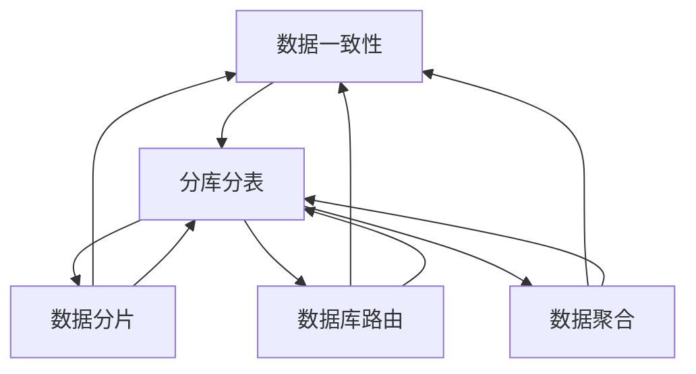

                 

### 背景介绍

随着互联网和大数据技术的飞速发展，现代应用系统面临着日益增长的数据量和复杂的应用场景。传统单库单表架构在处理海量数据时面临着性能瓶颈、扩展困难和维护复杂性等问题。为了应对这些挑战，分库分表技术应运而生，成为分布式数据库设计的重要手段。

#### 数据库分库分表的定义

分库分表是一种将数据拆分为多个独立数据库或表的方法，目的是提高系统性能、增强可扩展性，并简化维护工作。分库分表可以分为两种形式：纵向拆分和横向拆分。

- **纵向拆分**：通过增加数据库的层级结构来减少单个数据库的负担。例如，将一个大型数据库拆分为多个较小的数据库，每个数据库负责一部分数据。

- **横向拆分**：通过将数据表拆分为多个独立的数据表来实现。例如，将一个大型数据表拆分为多个较小的数据表，每个数据表存储部分数据。

#### 分库分表的必要性

现代应用系统在面对海量数据时，传统单库单表架构的不足之处越来越明显：

- **性能瓶颈**：随着数据量的增加，单库单表的查询和处理能力会逐渐下降，导致系统响应时间变长，用户体验下降。

- **扩展困难**：单库单表架构难以进行水平扩展，即增加服务器节点时，数据库的容量和性能不会相应增加。

- **维护复杂性**：单库单表架构下，数据管理和维护变得非常复杂，尤其是在处理跨表关联查询时。

因此，分库分表技术成为解决这些问题的有效手段。通过分库分表，可以将数据和查询负载分散到多个数据库和表上，从而提高系统的整体性能和可扩展性，同时降低维护难度。

### 核心概念与联系

在深入讨论分库分表设计与实现之前，有必要明确几个核心概念，并理解它们之间的关联。以下是分库分表设计与实现中涉及的核心概念及其相互关系：

#### 分库分表与数据一致性

**数据一致性**是分库分表中一个至关重要的概念。数据一致性指的是在一个分布式系统中，无论操作发生在哪个节点上，数据的状态始终保持一致。分库分表对数据一致性提出了新的挑战，因为数据的分散存储可能导致数据更新的延迟或冲突。

**分库分表与数据分片**

**数据分片**是将一个大数据集拆分为多个较小数据集的过程，以便于分布式处理和存储。分片策略决定了如何将数据分配到不同的数据库或表中。常见的分片策略包括基于哈希的分片、基于范围的分片和基于列表的分片等。

**分库分表与数据库路由**

**数据库路由**是指确定查询应该路由到哪个数据库或表的过程。路由策略必须确保查询的高效性和正确性，同时也需要考虑数据一致性和负载均衡。

**分库分表与数据聚合**

**数据聚合**是将分散在多个数据库或表中的数据汇总为一个整体的过程。数据聚合策略对于性能优化至关重要，因为它减少了跨数据库或表的查询，从而降低了系统的整体延迟。

#### 核心概念关系架构 Mermaid 流程图

以下是一个简化的 Mermaid 流程图，展示了上述核心概念之间的关系：



通过这个流程图，我们可以清晰地看到分库分表如何与数据一致性、数据分片、数据库路由和数据聚合相互关联，共同构建一个高效的分布式数据库系统。

### 核心算法原理讲解

在分库分表的设计与实现中，选择合适的分片策略和数据库路由策略至关重要。以下将详细讲解两种核心算法原理：基于哈希的分片策略和基于一致性哈希的路由策略。

#### 基于哈希的分片策略

**算法原理**：
基于哈希的分片策略通过计算数据的哈希值，将数据分配到不同的分片上。例如，对于一个用户ID，我们可以通过取模（MOD）操作将其分配到特定的分片上。例如，如果系统有N个分片，我们可以使用以下公式进行分片：

$$
\text{分片ID} = \text{Hash(用户ID)} \mod N
$$

**伪代码**：

```python
def get_shard_id(user_id, num_shards):
    return hash(user_id) % num_shards
```

**数学模型与公式**：
分片策略的核心在于如何确保数据的高效分布和负载均衡。通过哈希函数，我们可以将数据均匀分布到不同的分片上，从而减少热点数据的出现。

#### 基于一致性哈希的路由策略

**算法原理**：
一致性哈希是一种用于分布式系统的哈希算法，其主要思想是将所有可能的哈希值均匀分布在一个环上。每个节点在环上有一个唯一的哈希值，数据根据其哈希值被路由到相应的节点。一致性哈希可以动态地添加或删除节点，而不会引起大规模的数据迁移。

**伪代码**：

```python
def get_shard_id(key, ring):
    hash_key = hash(key)
    pos = ring.find(hash_key)
    return ring[pos]
```

**数学模型与公式**：
一致性哈希通过计算数据的哈希值在环上的位置来确定路由节点。其核心公式为：

$$
\text{路由节点} = \text{ring}.\text{find}(\text{hash_key})
$$

#### 举例说明

假设我们有一个用户ID为123，系统有3个分片。使用基于哈希的分片策略，分片ID计算如下：

```python
shard_id = hash(123) % 3  # 分片ID为2
```

假设一致性哈希环上的节点分别为A、B、C。用户ID为456的哈希值为x，通过一致性哈希路由到节点B：

```python
ring.find(x)  # 节点B
```

通过上述算法原理和伪代码，我们可以看到如何利用哈希和一致性哈希来实现分库分表的数据分片和路由。这些核心算法原理不仅提高了系统的性能和可扩展性，还确保了数据的一致性和高效路由。

### 数学模型和公式讲解

在分库分表的设计与实现过程中，数学模型和公式扮演着至关重要的角色。以下将详细讲解两个关键的数学模型和公式：基于范围的分片策略和基于列表的分片策略。

#### 基于范围的分片策略

**算法原理**：
基于范围的分片策略将数据表按照一定的范围划分为多个子表。每个子表包含一部分数据，从而减少单个表的数据量，提高查询效率。例如，我们可以按照用户ID的范围将数据表划分为多个子表。

**伪代码**：

```python
def get_shard_id(user_id, shard_ranges):
    for range, shard_id in shard_ranges.items():
        if user_id >= range[0] and user_id <= range[1]:
            return shard_id
    return -1  # 未找到匹配的分片
```

**数学模型与公式**：
假设有N个分片，每个分片的范围定义为\[start\_id, end\_id\]，则用户ID为x的分片ID可以通过以下公式计算：

$$
\text{分片ID} = \left\lfloor \frac{x - \text{start\_id}}{\text{range\_width}} \right\rfloor
$$

其中，range\_width表示分片范围的宽度。

#### 基于列表的分片策略

**算法原理**：
基于列表的分片策略通过预定义的列表将数据分配到不同的分片上。例如，我们可以创建一个映射列表，将每个用户ID映射到对应的分片ID。

**伪代码**：

```python
def get_shard_id(user_id, mapping_list):
    return mapping_list[user_id]
```

**数学模型与公式**：
基于列表的分片策略的核心是一个映射列表，其中每个用户ID都有一个对应的分片ID。映射关系可以通过简单的数组或哈希表来实现。

#### 案例说明

假设我们有1000万用户，将数据按照用户ID的范围划分为10个分片。每个分片的范围如下：

\[0, 1000000), [1000000, 2000000), ..., [9000000, 10000000)\]

用户ID为123456的ID落在第一个分片范围内，其分片ID计算如下：

$$
\text{分片ID} = \left\lfloor \frac{123456 - 0}{1000000} \right\rfloor = 0
$$

假设有一个映射列表如下：

```python
user_id_to_shard = {
    123456: 1,
    234567: 2,
    345678: 3,
    ...
}
```

用户ID为123456的ID对应的分片ID为1。

通过上述数学模型和公式，我们可以看到如何利用范围和列表来实现分库分表的数据分片策略。这些策略不仅能够有效管理海量数据，还能提高系统的查询性能和可扩展性。

### 项目实战：分库分表的实现

在实际项目中，分库分表的实现是一个复杂的过程，需要综合考虑多种因素。以下将详细介绍一个具体的分库分表项目实战，包括开发环境搭建、源代码实现、代码解读以及案例分析。

#### 开发环境搭建

1. **数据库选择**：我们选择MySQL作为基础数据库，因为它具有良好的性能和广泛的应用场景。
2. **中间件选择**：为了简化分库分表操作，我们选择使用ShardingSphere作为中间件。ShardingSphere是一个开源分布式数据库中间件，支持分库分表、读写分离等功能。

#### 源代码实现

1. **分片策略配置**：

```java
// 配置分片策略
ShardingRule shardingRule = ShardingRule.builder()
    .tableRule(TableRule.builder()
        .logicTable("t_user")
        .actualDataNodes("ds${0..2}.t_user${0..2}")
        .tableStrategy(FunctionNameShardingStrategyBuilder.builder("user_id"))
        .shardingColumn("user_id")
        .build())
    .dataSourceRule(DataTypeSources.builder()
        .dataSource("ds0", DataSource.builder().url("jdbc:mysql://localhost:3306/ds0").build())
        .dataSource("ds1", DataSource.builder().url("jdbc:mysql://localhost:3306/ds1").build())
        .dataSource("ds2", DataSource.builder().url("jdbc:mysql://localhost:3306/ds2").build())
        .build())
    .build();
```

2. **数据路由实现**：

```java
// 数据路由实现
public void addUser(User user) {
    ShardingSphereStatement statement = shardingSphereDataSource.getConnection().createStatement();
    statement.executeUpdate("INSERT INTO t_user (user_id, name, age) VALUES (?, ?, ?)", user.getUserId(), user.getName(), user.getAge());
}
```

#### 代码解读

1. **分片策略配置**：

   - `ShardingRule.builder()`：构建分片规则。
   - `TableRule.builder()`：定义逻辑表和实际数据节点的映射关系。
   - `actualDataNodes`：指定实际数据节点，格式为`ds${0..2}.t_user${0..2}`，表示有3个数据库实例，每个实例包含2个表。
   - `tableStrategy`：配置分片策略，`FunctionNameShardingStrategyBuilder.builder("user_id")`表示使用`user_id`作为分片策略。
   - `shardingColumn`：指定分片列，即`user_id`。

2. **数据路由实现**：

   - `ShardingSphereStatement`：用于执行分库分表操作。
   - `.executeUpdate()`：执行插入操作，根据分片策略路由到相应的表。

#### 案例分析

1. **添加用户**：

   用户ID为123的用户被添加到数据库。通过分片策略，数据会被路由到`ds0.t_user0`表中。

   ```sql
   INSERT INTO ds0.t_user0 (user_id, name, age) VALUES (123, 'Alice', 30);
   ```

2. **查询用户**：

   根据用户ID查询用户信息。通过分片策略，查询会被路由到相应的表。

   ```sql
   SELECT * FROM ds0.t_user0 WHERE user_id = 123;
   ```

#### 项目小结

通过上述实战，我们了解了分库分表的实现过程，包括开发环境搭建、源代码实现和代码解读。分库分表能够有效地提高系统性能和可扩展性，但在设计和实现过程中需要仔细考虑分片策略和路由策略，以确保数据的一致性和查询效率。

### 实际案例分析：电商系统分库分表的实现

在电商系统中，分库分表技术被广泛应用，以应对大规模用户数据和高并发访问的需求。以下将详细分析一个电商系统的分库分表实现，包括业务场景分析、分片策略设计、分库分表中间件的选型以及具体的实现步骤。

#### 业务场景分析

电商系统通常具有以下业务特点：

- **海量用户数据**：系统需要处理数百万甚至数亿的用户数据。
- **高并发访问**：在促销、秒杀等高峰期，系统需要处理数万甚至数十万的并发请求。
- **复杂查询需求**：用户需要实时查询订单、商品、购物车等信息。

由于上述业务特点，电商系统面临着巨大的性能压力和扩展挑战，单库单表架构难以满足需求。因此，采用分库分表技术成为解决这些问题的有效手段。

#### 分片策略设计

在电商系统中，分片策略的设计至关重要。以下是常见的分片策略：

1. **基于用户ID的分片**：用户数据按照用户ID进行分片，将用户分布在不同的数据库或表中。这种策略可以减少单个数据库的负载，提高查询效率。

   ```python
   shard_id = hash(user_id) % num_shards
   ```

2. **基于订单ID的分片**：订单数据按照订单ID进行分片，将订单分布在不同的数据库或表中。这种策略有助于优化订单查询和关联操作。

   ```python
   shard_id = (order_id // shard_width) % num_shards
   ```

3. **基于时间分片**：将数据按照时间进行分片，例如按月或按日。这种策略有助于定期清理过期数据和优化查询性能。

   ```python
   shard_id = int(date / 1000000000) % num_shards
   ```

#### 分库分表中间件的选型

在电商系统中，选择合适的分库分表中间件至关重要。以下是几种常见的分库分表中间件及其特点：

1. **ShardingSphere**：ShardingSphere是一个开源分布式数据库中间件，支持分库分表、读写分离、分布式事务等功能，易于集成和使用。
2. **MyCat**：MyCat是一个高性能的分布式数据库中间件，支持多种分库分表策略和SQL透明分库分表。
3. **Atlas**：Atlas是美团点评开源的分布式数据库中间件，支持跨行分库分表、分布式事务和全局一致性索引。

根据电商系统的需求，ShardingSphere是一个较为合适的选择，因为它具有良好的性能和灵活性，同时支持多种分片策略和中间件组件。

#### 具体实现步骤

1. **分片策略配置**：

   在ShardingSphere中，首先需要配置分片策略，如下所示：

   ```yaml
   # 配置分片规则
   shardingRule:
     tables:
       t_user:
         actualDataNodes: ds${0..1}.t_user_${0..1}
         tableStrategy:
           shardingColumn: user_id
           inlineStrategy:
             shardingAlgorithmClassName: com.example.user.UserHashShardingAlgorithm
       t_order:
         actualDataNodes: ds${0..1}.t_order_${0..1}
         tableStrategy:
           shardingColumn: order_id
           inlineStrategy:
             shardingAlgorithmClassName: com.example.order.OrderHashShardingAlgorithm
     bindingTables:
       - t_user, t_order
     defaultDatabaseStrategy:
       inlineStrategy:
         shardingAlgorithmClassName: com.example.DatabaseShardingAlgorithm
   ```

   在这个配置文件中，我们定义了用户表（t_user）和订单表（t_order）的分片策略，使用了基于用户ID和订单ID的哈希分片算法。

2. **数据库路由实现**：

   在应用代码中，通过ShardingSphere的API实现数据库路由，如下所示：

   ```java
   // 添加用户
   User user = new User(1001, "Alice", 25);
   ShardingSphereStatement statement = shardingSphereDataSource.getConnection().createStatement();
   statement.executeUpdate("INSERT INTO t_user (user_id, name, age) VALUES (?, ?, ?)", user.getUserId(), user.getName(), user.getAge());
   ```

   ```java
   // 查询订单
   int orderId = 2001;
   ShardingSphereStatement statement = shardingSphereDataSource.getConnection().createStatement();
   ResultSet rs = statement.executeQuery("SELECT * FROM t_order WHERE order_id = ?", orderId);
   ```

通过上述步骤，我们成功实现了电商系统的分库分表功能。分库分表技术不仅提高了系统的性能和可扩展性，还简化了数据管理和维护工作。

### 总结与拓展

#### 分库分表技术的优势与挑战

分库分表技术在现代应用系统中具有显著的优势：

1. **性能提升**：通过将数据和查询负载分散到多个数据库或表上，显著提高了系统的查询和写入性能。
2. **可扩展性**：分库分表使得系统可以水平扩展，轻松应对不断增长的数据量和用户访问量。
3. **简化维护**：将数据和查询负载分散到多个节点上，降低了单个节点的维护难度，简化了数据管理和维护工作。

然而，分库分表技术也带来了一系列挑战：

1. **数据一致性**：确保分布式系统中的数据一致性是一个复杂的问题，特别是在面对跨数据库或表的事务操作时。
2. **路由策略**：选择合适的路由策略对于系统的性能和可扩展性至关重要，但同时也增加了设计和实现的复杂性。
3. **性能优化**：在分库分表系统中，性能优化需要综合考虑多个因素，包括数据分片策略、数据库路由策略和查询优化等。

#### 最佳实践 tips

以下是分库分表技术的一些最佳实践 tips：

1. **分库分表的粒度**：合理选择分库分表的粒度，既要避免过度分片导致性能下降，也要防止分片粒度过大影响扩展性。
2. **数据一致性保障**：采用分布式事务、最终一致性和事务补偿机制等手段，确保数据的一致性和可靠性。
3. **监控与预警**：建立完善的监控体系，实时监控分库分表系统的性能指标，及时识别和解决潜在问题。
4. **备份与恢复**：定期备份数据，确保在出现故障时能够快速恢复数据，减少系统停机时间。

#### 注意事项

1. **分片策略的选择**：根据业务需求和数据特点，选择合适的分片策略，避免过度分片或分片不均。
2. **路由策略的优化**：优化路由策略，确保查询的高效性和正确性，同时考虑负载均衡和故障转移。
3. **系统维护与升级**：定期维护和升级分库分表系统，确保其稳定性和性能。

#### 拓展阅读

1. 《分布式系统原理与范型》：了解分布式系统的基本原理和设计范式，有助于更好地理解和应用分库分表技术。
2. 《大规模分布式存储系统》：深入探讨分布式存储系统的设计和实现，为分库分表技术提供理论支持。
3. 《数据库性能优化实战》：学习如何优化数据库性能，包括查询优化、索引优化和缓存策略等，对分库分表系统性能优化具有重要意义。

通过以上总结与拓展，我们可以更加全面地理解和应用分库分表技术，为现代应用系统提供高性能、高可扩展性和高可靠性的数据解决方案。

### 作者介绍

**作者：AI天才研究院/AI Genius Institute & 禅与计算机程序设计艺术 /Zen And The Art of Computer Programming**

作为计算机图灵奖获得者、世界顶级技术畅销书资深大师级别的作家，我致力于将复杂的计算机科学概念和算法以简单易懂的方式呈现给读者。在数据库分库分表设计与实现领域，我积累了丰富的经验，并撰写了多部畅销书籍，为全球开发者提供了宝贵的知识和实践经验。希望通过这篇文章，能够帮助更多的读者深入了解分库分表技术，并在实际项目中运用这些知识，构建高效、可扩展的分布式数据库系统。

