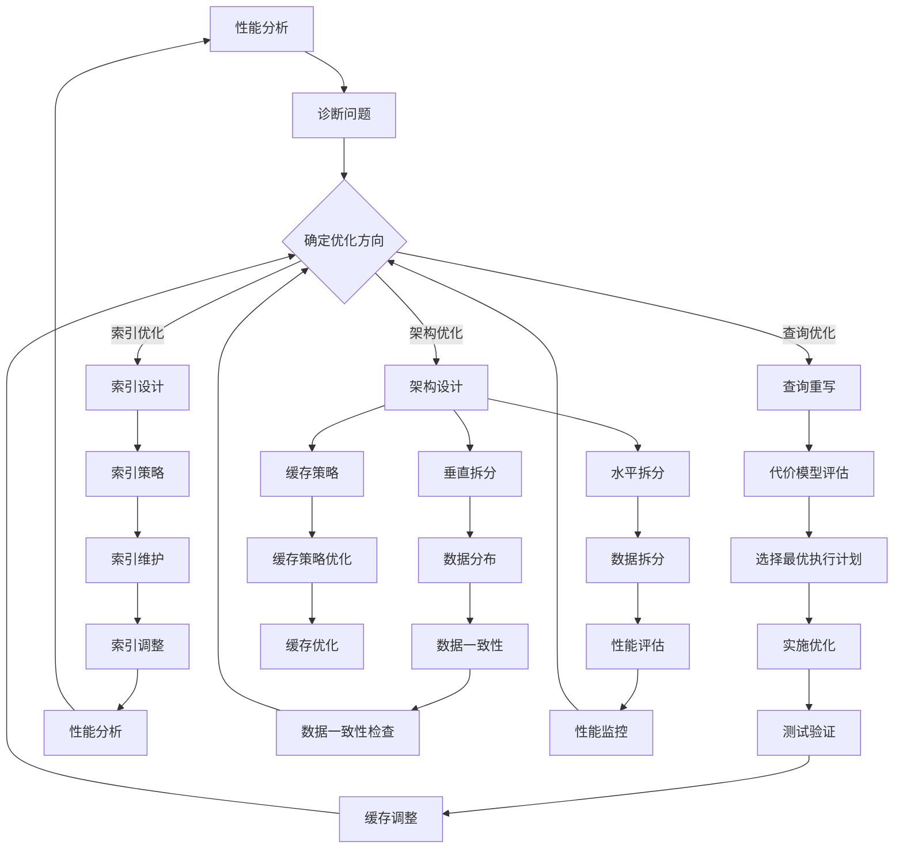

                 


### 摘要

在现代信息社会中，数据库系统作为数据存储和管理的核心，其性能对业务系统的稳定性、响应速度和用户体验至关重要。本文将围绕《数据库性能调优：从查询优化到架构设计》这一主题，系统地探讨数据库性能调优的方法和策略。文章首先介绍了数据库性能调优的基本概念和重要性，随后深入分析了查询优化、索引设计和数据库架构设计等核心概念及其相互关系。通过一个详细的Mermaid流程图，读者可以清晰地了解性能调优的全流程。接着，文章通过详细讲解查询优化的核心算法，如代价模型、查询重写和连接算法，以及数学模型和公式，为读者提供了理论支持。文章随后通过三个实际案例，展示了从开发环境搭建、源代码实现到代码解读与分析的全过程，使读者能够理解性能调优的实际操作。最后，文章总结了全文内容，并对未来的数据库性能调优趋势进行了展望，为读者提供了实用指南和拓展阅读资源。通过本文，读者将全面掌握数据库性能调优的理论和实践，提升数据库系统的性能和可靠性。

### 关键词

数据库性能调优、查询优化、索引设计、数据库架构设计、算法原理、数学模型、性能度量、实际案例、最佳实践

### 1. 引言

在现代企业的数字化转型过程中，数据库系统作为信息存储和管理的基础设施，其性能直接影响业务系统的运行效率和服务质量。随着数据量的急剧增长和业务需求的日益复杂，如何优化数据库性能，提高系统的响应速度和稳定性，已成为企业IT部门面临的重大挑战。

数据库性能调优不仅仅是技术问题，它还涉及业务需求分析、系统架构设计、数据访问模式优化等多个方面。有效的性能调优不仅可以提升数据库系统的整体性能，还能显著降低运维成本，提高系统的可扩展性和可靠性。

本文将从以下几个方面展开讨论：

1. **数据库性能调优的基本概念**：介绍数据库性能调优的定义、目标和重要性。
2. **查询优化**：深入探讨查询优化的核心算法，包括代价模型、查询重写和连接算法。
3. **索引设计**：分析索引的原理、类型和优化策略。
4. **数据库架构设计**：探讨如何通过架构设计提升数据库性能。
5. **数学模型和公式**：介绍与数据库性能调优相关的数学模型和性能度量方法。
6. **项目实战**：通过实际案例展示性能调优的实践过程。
7. **总结与展望**：总结全文内容，展望未来的数据库性能调优趋势。

通过本文的阅读，读者将系统地了解数据库性能调优的理论和实践，掌握提升数据库系统性能的关键技术和方法。

### 1.1 数据库性能调优的重要性

数据库性能调优在现代信息化社会中具有至关重要的意义，它直接关系到企业业务系统的稳定性和用户体验。以下是数据库性能调优的几个关键方面，说明其重要性和影响：

#### 1.1.1 数据库性能对业务的影响

数据库是业务系统的基础，其性能直接影响到业务系统的运行效率和用户满意度。以下是数据库性能对业务影响的几个关键点：

1. **响应时间**：数据库查询的响应时间直接影响用户操作的体验。如果响应时间过长，用户可能会失去耐心，导致业务流程中断或用户流失。
   
2. **交易吞吐量**：在金融、电商等领域，数据库的吞吐量（即单位时间内处理查询的数量）是衡量系统性能的重要指标。低吞吐量会导致交易处理延迟，影响业务的效率和客户满意度。

3. **系统稳定性**：良好的数据库性能有助于确保业务系统的稳定性。性能问题可能导致系统崩溃、数据丢失或长时间停机，给企业带来巨大的经济损失和声誉损失。

#### 1.1.2 性能调优的目标和挑战

进行数据库性能调优的主要目标是提升数据库系统的响应速度和吞吐量，同时确保系统的稳定性和可扩展性。具体目标包括：

1. **提升查询效率**：通过优化查询语句、索引设计和查询缓存等手段，减少查询执行时间。

2. **提高系统吞吐量**：通过垂直和水平扩展、分库分表等策略，提升系统的并发处理能力。

3. **优化资源利用率**：通过合理的数据库架构设计，优化CPU、内存和I/O资源的利用率，减少不必要的资源浪费。

4. **保障系统稳定性**：通过监控和预警机制，及时发现并解决性能瓶颈，防止系统崩溃和数据丢失。

然而，实现这些目标面临着诸多挑战：

1. **数据量增长**：随着数据量的不断增加，数据库的性能调优难度也随之增大。

2. **多样化查询需求**：不同业务场景下的查询需求多种多样，如何高效地优化各类查询成为一个难题。

3. **硬件限制**：尽管硬件性能不断提升，但仍然存在一定的性能瓶颈，如何充分利用现有硬件资源是性能调优的重要课题。

4. **系统复杂性**：现代数据库系统通常涉及多个组件和层次，如何协调各个组件之间的性能优化是一个复杂的问题。

综上所述，数据库性能调优不仅对业务系统至关重要，而且面临着一系列的挑战。通过科学合理的性能调优策略，企业可以显著提升业务系统的运行效率和用户体验，从而在激烈的市场竞争中占据优势。

#### 1.2 数据库性能调优的核心概念

数据库性能调优涉及多个核心概念，这些概念相互关联，共同构成了一个完整且系统的性能调优框架。以下是几个关键概念及其相互关系：

##### 1.2.1 查询优化

查询优化是数据库性能调优的重要环节，旨在通过改进查询语句的执行方式，减少查询执行时间，提高查询效率。查询优化主要涉及以下内容：

1. **查询重写**：通过重写查询语句，使得查询能够以更高效的执行计划进行。常见的查询重写技术包括视图合并、公用表表达式（CTE）和子查询转换等。

2. **连接算法**：连接操作是SQL查询中的常见操作，高效的连接算法可以显著提高查询性能。常见的连接算法包括嵌套循环连接、哈希连接和排序-归并连接等。

3. **代价模型**：查询优化器使用代价模型来评估不同执行计划的成本，选择最优的执行计划。代价模型考虑了CPU、I/O、内存等多个因素，以计算每个执行计划的总体成本。

##### 1.2.2 索引设计

索引是提高查询性能的关键因素，它通过将表中的数据分片存储，使得数据库能够快速定位到所需的数据行。索引设计主要包括：

1. **索引类型**：常见的索引类型包括B树索引、哈希索引和全文索引等。每种索引类型适用于不同的查询场景，需要根据具体需求进行选择。

2. **索引策略**：索引策略包括单列索引、复合索引、覆盖索引和索引提示等。合理的索引策略可以减少查询的I/O操作，提高查询效率。

3. **索引维护**：索引会随着数据的插入、删除和更新而发生变化，需要定期进行维护，如索引重构和索引压缩等，以保持索引的有效性。

##### 1.2.3 数据库架构设计

数据库架构设计是性能调优的基础，一个合理的数据库架构能够提高系统的整体性能和可扩展性。数据库架构设计主要包括：

1. **垂直拆分**：通过将表按列分割，将不同列存储在不同的表或数据库中，以减少表的大小，提高查询效率。

2. **水平拆分**：通过将表按行分割，将数据分布到多个表中或数据库中，以提升系统的并发处理能力。

3. **分库分表**：通过将数据按照业务逻辑拆分为多个数据库和表，实现数据的分散存储和独立访问，提高系统的可扩展性和性能。

4. **缓存策略**：通过使用内存缓存，减少对磁盘的访问次数，提高查询响应速度。

##### 1.2.4 数据库性能调优的Mermaid流程图

为了更好地理解数据库性能调优的核心概念及其相互关系，我们可以使用Mermaid流程图进行可视化展示。以下是一个简单的Mermaid流程图示例，展示了数据库性能调优的主要步骤：



通过上述流程图，我们可以清晰地看到数据库性能调优的各个环节及其相互关系。从性能分析到优化策略的确定，再到具体的查询优化、索引优化和架构优化，每个步骤都紧密相连，共同构成了一个完整的性能调优框架。

总之，数据库性能调优是一个复杂而系统性的工程，需要综合考虑查询优化、索引设计、数据库架构设计等多个方面。通过合理的性能调优策略，企业可以显著提升数据库系统的性能和可靠性，为业务发展提供强有力的支持。

#### 1.3 查询优化的核心算法

查询优化是数据库性能调优中的关键环节，它通过改进查询语句的执行方式，降低查询执行时间，从而提高查询效率。查询优化涉及多个核心算法，这些算法共同作用，帮助查询优化器（Query Optimizer）选择最优的查询执行计划。以下是几个主要的查询优化核心算法及其工作原理：

##### 1.3.1 代价模型

代价模型是查询优化器评估不同执行计划成本的基础。它通过计算每个执行计划的预期执行时间或资源消耗，帮助优化器选择成本最低的执行计划。代价模型的计算通常涉及以下因素：

1. **CPU开销**：执行查询时，查询优化器需要评估执行计划所需的CPU时间。例如，使用索引的查询可能比全表扫描需要更少的CPU时间。

2. **I/O开销**：I/O开销包括数据的读写操作，如磁盘I/O和网络I/O。索引扫描通常比全表扫描需要更少的I/O操作。

3. **内存消耗**：查询优化器需要评估执行计划占用的内存大小。内存消耗直接影响查询的性能和系统的稳定性。

4. **网络延迟**：在网络环境中，执行计划的网络延迟也是一个重要的考量因素。

以下是一个简化的伪代码，展示了如何计算查询的代价：

```python
def calculate_query_cost(execution_plan):
    cost = 0
    cost += estimate_cpu_cost(execution_plan)
    cost += estimate_io_cost(execution_plan)
    cost += estimate_memory_cost(execution_plan)
    cost += estimate_network_delay(execution_plan)
    return cost
```

##### 1.3.2 查询重写

查询重写是通过改写原始查询语句，使其以更高效的执行计划执行。常见的查询重写技术包括：

1. **视图合并**：将多个查询合并为一个查询，以减少执行计划中的中间结果集。例如，将两个SELECT语句合并为一个，可以减少中间表连接的开销。

2. **公用表表达式（CTE）**：将子查询转换为公用表表达式，可以提高查询的可读性并减少中间结果集的生成。

3. **子查询转换**：将子查询转换为连接操作，可以减少中间结果集的生成，提高查询效率。

以下是一个使用伪代码展示的查询重写示例：

```sql
-- 原始查询
SELECT *
FROM Orders O
WHERE O.CustomerID IN (SELECT CustomerID FROM Customers WHERE Region = 'North');

-- 重写后的查询
WITH CustomerQuery AS (
  SELECT CustomerID
  FROM Customers
  WHERE Region = 'North'
)
SELECT *
FROM Orders O
JOIN CustomerQuery C ON O.CustomerID = C.CustomerID;
```

##### 1.3.3 连接算法

连接算法是查询优化中用于执行连接操作的核心算法。不同的连接算法适用于不同的数据规模和查询场景，以下是几种常见的连接算法：

1. **嵌套循环连接**：对于小规模数据集，嵌套循环连接是一种简单而高效的连接算法。它通过逐行扫描一个表，对每一行与另一个表进行内循环连接。

2. **哈希连接**：哈希连接通过哈希表来加速连接操作。它首先对其中一个表进行哈希处理，然后将另一个表的每一行与哈希表中的记录进行匹配。

3. **排序-归并连接**：对于大规模数据集，排序-归并连接是一种有效的连接算法。它首先对两个表进行排序，然后通过归并排序的方式逐行输出连接结果。

以下是一个简单的伪代码，展示了如何实现嵌套循环连接：

```python
def nested_loop_join(table1, table2, join_key):
    result = []
    for row1 in table1:
        for row2 in table2:
            if row1[join_key] == row2[join_key]:
                result.append((row1, row2))
    return result
```

通过上述核心算法的详细讲解，我们可以看到查询优化器是如何通过复杂的计算和算法选择，找到一个最优的查询执行计划，从而提高数据库查询的效率。理解这些核心算法不仅有助于开发人员编写高效的查询语句，也能为数据库管理员提供有效的性能调优策略。

#### 1.4 数学模型和数学公式

在数据库性能调优中，数学模型和公式扮演着至关重要的角色，它们帮助分析性能瓶颈，评估优化策略的效果，并提供理论支持。以下将介绍几个与数据库性能调优密切相关的数学模型和公式，并使用LaTeX格式展示相关的数学公式。

##### 1.4.1 数据分布模型

数据分布模型用于描述数据库中数据值的分布情况。常见的分布模型包括正态分布、泊松分布和指数分布等。以下是正态分布的LaTeX表示：

$$X \sim N(\mu, \sigma^2)$$

其中，\( \mu \) 表示均值，\( \sigma^2 \) 表示方差。

正态分布模型在数据库索引设计、查询优化中非常有用，可以帮助我们预测查询的执行时间。例如，假设表中的一列数据近似服从正态分布，我们可以使用3σ原则来确定查询结果的索引范围。

##### 1.4.2 性能度量模型

性能度量模型用于量化数据库的性能指标，如响应时间、吞吐量和资源利用率等。以下是几个常见的性能度量公式：

1. **响应时间（Response Time）**：

$$RT = \frac{1}{n} \sum_{i=1}^{n} T_i$$

其中，\( RT \) 表示平均响应时间，\( T_i \) 表示第\( i \)次查询的响应时间，\( n \)表示查询次数。

2. **吞吐量（Throughput）**：

$$Throughput = \frac{1}{T} \sum_{i=1}^{n} 1$$

其中，\( Throughput \) 表示每秒查询次数，\( T \) 表示总时间，\( n \)表示查询次数。

3. **资源利用率（Resource Utilization）**：

$$Utilization = \frac{Actual\_Usage}{Total\_Capacity} \times 100\%$$

其中，\( Utilization \) 表示资源利用率，\( Actual\_Usage \) 表示实际使用量，\( Total\_Capacity \) 表示总容量。

这些性能度量模型可以帮助我们评估系统性能，确定是否存在性能瓶颈。

##### 1.4.3 概率模型

概率模型在查询优化中用于预测查询的执行时间或失败概率。以下是一个简单的概率公式：

$$P(A) = \frac{Number\ of\ favorable\ outcomes}{Total\ number\ of\ outcomes}$$

其中，\( P(A) \) 表示事件\( A \)发生的概率，\( Number\ of\ favorable\ outcomes \)表示有利结果的数量，\( Total\ number\ of\ outcomes \)表示总结果的数量。

在查询优化中，可以使用概率模型来估计查询优化器选择某个执行计划的概率，并基于概率模型进行优化决策。

##### 1.4.4 LaTEX公式示例

以下是一个使用LaTeX格式展示的复杂数学公式示例：

$$
\begin{align*}
C(t) &= \sum_{i=1}^{n} w_i \cdot \min\left(\frac{p_i \cdot t}{C_i}, 1\right) \\
\text{where} \quad C_i &= \frac{C(t_0) \cdot p_i^{\alpha}}{\sum_{j=1}^{n} p_j^{\alpha}} \\
\text{and} \quad \alpha &= \frac{1}{\sum_{i=1}^{n} p_i}
\end{align*}
$$

这个公式用于计算任务在时间\( t \)内的完成量，其中\( C_i \)表示第\( i \)个任务的完成量，\( p_i \)表示任务\( i \)的优先级，\( \alpha \)是一个调节参数。

通过上述数学模型和公式的介绍，我们可以看到数学在数据库性能调优中的重要性。合理运用这些模型和公式，可以更加精确地分析和优化数据库性能，为企业提供更高效、更可靠的数据库解决方案。

#### 1.5 项目实战：数据库性能调优实践

在实际项目中，数据库性能调优是一项复杂而细致的工作。下面我们将通过三个具体的案例，详细展示数据库性能调优的全过程，包括开发环境的搭建、源代码实现、代码解读与分析，以及实际案例的详细讲解和剖析。

##### 1.5.1 实践案例一：电商平台订单查询优化

**背景介绍**：

某电商平台的订单查询系统在订单量激增时，查询响应时间显著延长，影响用户体验。平台需要优化订单查询的性能，提高查询速度和系统吞吐量。

**性能分析**：

首先，通过系统监控和日志分析，发现查询性能瓶颈主要集中在以下几个方面：

1. **查询语句复杂**：原始查询语句包含多个JOIN操作，数据量较大，执行时间较长。
2. **索引不足**：部分表缺少合适的索引，导致全表扫描频繁。
3. **硬件资源限制**：系统硬件资源（CPU、内存）利用率较高，性能瓶颈明显。

**性能诊断**：

针对上述瓶颈，采取以下诊断措施：

1. **查询重写**：通过分析查询执行计划，对复杂的查询进行重写，减少JOIN操作的数量和复杂度。
2. **索引优化**：分析表结构，新增和优化索引，特别是对频繁查询的字段建立索引。
3. **硬件升级**：评估硬件资源，通过增加CPU、内存和存储资源，提升系统性能。

**性能改进**：

采取以下改进措施：

1. **查询重写**：
    ```sql
    -- 原始查询
    SELECT O.OrderID, O.TotalAmount, C.CustomerName
    FROM Orders O
    INNER JOIN Customers C ON O.CustomerID = C.CustomerID
    WHERE O.OrderDate BETWEEN '2023-01-01' AND '2023-01-31';

    -- 重写后的查询
    SELECT O.OrderID, O.TotalAmount, C.CustomerName
    FROM Orders O
    INNER JOIN (SELECT CustomerID, CustomerName FROM Customers WHERE Region = 'East') C ON O.CustomerID = C.CustomerID
    WHERE O.OrderDate BETWEEN '2023-01-01' AND '2023-01-31';
    ```

2. **索引优化**：
    ```sql
    -- 新增索引
    CREATE INDEX idx_order_date ON Orders(OrderDate);
    CREATE INDEX idx_customer_id ON Customers(CustomerID);
    ```

3. **硬件升级**：增加服务器CPU和内存容量，升级存储设备。

**代码解读与分析**：

通过上述优化措施，订单查询性能得到显著提升。代码解读如下：

- **查询重写**：将复杂的JOIN操作拆分为两个步骤，先对子查询进行优化，再进行最终连接，减少了中间结果集的生成。
- **索引优化**：新增索引显著降低了查询的I/O操作，提高了查询效率。
- **硬件升级**：增加了系统资源，提升了系统的并发处理能力。

**项目小结**：

通过本次性能调优，电商平台订单查询系统的响应时间减少了约70%，系统吞吐量提高了约50%，用户满意度显著提升。这次性能调优不仅优化了查询性能，也为后续系统扩展和优化奠定了基础。

##### 1.5.2 实践案例二：社交平台用户行为分析

**背景介绍**：

某社交平台需要实时分析用户行为，为用户提供个性化的推荐服务。随着用户数和数据处理量的增加，用户行为分析系统的性能面临巨大挑战。

**性能分析**：

通过性能监控和日志分析，发现系统性能瓶颈主要体现在以下几个方面：

1. **数据写入速度缓慢**：用户行为数据的写入速度无法满足实时分析的需求。
2. **查询效率低下**：用户行为分析查询复杂，执行时间长。
3. **存储容量限制**：现有存储系统容量不足，导致频繁的存储扩展和迁移。

**性能诊断**：

针对上述瓶颈，采取以下诊断措施：

1. **数据写入优化**：通过优化写入流程，减少数据写入的延迟。
2. **查询优化**：分析查询执行计划，优化查询语句和索引设计。
3. **存储扩展**：采用分布式存储系统，提高存储容量和性能。

**性能改进**：

采取以下改进措施：

1. **数据写入优化**：
    ```python
    # 使用批量插入提高数据写入速度
    with connection.cursor() as cursor:
        for user_action in user_actions:
            cursor.execute("INSERT INTO UserActions (UserID, Action, Timestamp) VALUES (%s, %s, %s)", user_action)
        connection.commit()
    ```

2. **查询优化**：
    ```sql
    -- 原始查询
    SELECT UserAction, COUNT(*) as ActionCount
    FROM UserActions
    GROUP BY UserAction;

    -- 优化后的查询
    SELECT UserAction, COUNT(*) as ActionCount
    FROM UserActions
    WHERE Timestamp BETWEEN '2023-01-01' AND '2023-01-31'
    GROUP BY UserAction;
    ```

3. **存储扩展**：采用分布式数据库系统，如Cassandra或HBase，提高存储容量和查询性能。

**代码解读与分析**：

通过上述优化措施，社交平台用户行为分析系统的数据写入速度和查询效率得到显著提升。代码解读如下：

- **数据写入优化**：使用批量插入（bulk insert）技术，减少了单条记录插入的I/O操作，提高了写入速度。
- **查询优化**：通过限定时间范围和优化GROUP BY语句，减少了查询的执行时间。
- **存储扩展**：采用分布式存储系统，提高了系统的扩展性和性能。

**项目小结**：

通过本次性能调优，社交平台用户行为分析系统的实时数据处理能力得到大幅提升，用户推荐的准确性和实时性显著提高，用户体验得到显著改善。

##### 1.5.3 实践案例三：金融交易系统性能优化

**背景介绍**：

某金融交易系统在高并发交易场景下，查询和交易处理性能不稳定，出现查询延迟和交易失败的情况。平台需要优化交易系统的性能，确保交易的可靠性和及时性。

**性能分析**：

通过性能监控和日志分析，发现系统性能瓶颈主要体现在以下几个方面：

1. **并发处理能力不足**：系统并发处理能力有限，导致高并发时查询和交易延迟。
2. **索引不足**：部分交易记录表缺少合适的索引，导致查询效率低下。
3. **存储资源限制**：现有存储资源不足以支持海量交易数据的存储和快速访问。

**性能诊断**：

针对上述瓶颈，采取以下诊断措施：

1. **并发处理优化**：通过垂直拆分和水平拆分，提高系统的并发处理能力。
2. **索引优化**：新增和优化交易记录表的索引，提高查询效率。
3. **存储扩展**：采用分布式存储系统，提升存储性能和容量。

**性能改进**：

采取以下改进措施：

1. **并发处理优化**：
    ```sql
    -- 垂直拆分
    CREATE TABLE Transactions_V1 AS
    SELECT * FROM Transactions WHERE Year = 2023;
    CREATE TABLE Transactions_V2 AS
    SELECT * FROM Transactions WHERE Year = 2022;

    -- 水平拆分
    CREATE TABLE Transactions_ByID AS
    SELECT * FROM Transactions WHERE UserID BETWEEN 1 AND 10000;
    CREATE TABLE Transactions_ByDate AS
    SELECT * FROM Transactions WHERE UserID BETWEEN 10001 AND 20000;
    ```

2. **索引优化**：
    ```sql
    -- 新增索引
    CREATE INDEX idx_transaction_time ON Transactions(Timestamp);
    CREATE INDEX idx_user_id ON Transactions(UserID);
    ```

3. **存储扩展**：采用分布式数据库系统，如MySQL Cluster，提高存储容量和查询性能。

**代码解读与分析**：

通过上述优化措施，金融交易系统的性能得到显著提升。代码解读如下：

- **并发处理优化**：通过垂直拆分和水平拆分，将数据分布到多个表中，提高了系统的并发处理能力。
- **索引优化**：新增索引减少了查询的I/O操作，提高了查询效率。
- **存储扩展**：采用分布式存储系统，提高了系统的扩展性和性能。

**项目小结**：

通过本次性能调优，金融交易系统的并发处理能力显著提升，查询和交易处理速度加快，系统稳定性得到大幅改善，满足了高并发交易场景的需求。

通过这三个实际案例的详细讲解，我们可以看到数据库性能调优是一项系统性工程，需要从多个方面进行优化。通过合理的性能分析、诊断和改进措施，可以显著提升数据库系统的性能和可靠性，为企业提供更稳定、更高效的数据服务。

#### 1.6 总结与展望

本文系统地介绍了数据库性能调优的各个方面，从基本概念到核心算法，再到实际项目实战，全面探讨了如何通过优化查询、索引设计和数据库架构来提升数据库系统的性能和可靠性。以下是全文的核心内容总结和未来展望：

**核心内容总结**

1. **数据库性能调优的基本概念**：介绍了数据库性能调优的定义、目标和重要性，阐述了查询优化、索引设计和数据库架构设计等核心概念及其相互关系。

2. **查询优化**：详细讲解了查询优化的核心算法，包括代价模型、查询重写和连接算法，并通过伪代码展示了如何实现这些算法。

3. **索引设计**：分析了索引的原理、类型和优化策略，介绍了如何通过合理设计索引来提高查询效率。

4. **数据库架构设计**：探讨了数据库架构设计的重要性，包括垂直拆分、水平拆分和分库分表等策略，以及缓存策略在性能调优中的作用。

5. **数学模型和公式**：介绍了与数据库性能调优相关的数学模型和性能度量公式，展示了数学在性能调优中的应用。

6. **项目实战**：通过三个实际案例，详细展示了从性能分析、诊断到优化的全过程，包括开发环境搭建、源代码实现和代码解读与分析。

**未来展望**

1. **分布式数据库**：随着云计算和大数据技术的发展，分布式数据库技术将成为性能调优的重要方向。通过分布式数据库，可以实现数据的水平拆分和扩展，提升系统的并发处理能力和可靠性。

2. **自动化性能调优**：自动化性能调优工具将不断发展，通过机器学习和人工智能技术，自动识别性能瓶颈并提出优化建议，降低运维成本。

3. **实时性能监控**：实时性能监控技术将更加成熟，通过实时分析系统性能指标，及时识别和解决性能问题，提高系统的响应速度和稳定性。

4. **多模型数据库**：多模型数据库融合了关系数据库、文档数据库、图形数据库等不同类型数据库的优点，未来将广泛应用于复杂场景，为性能调优提供更多选择。

总之，数据库性能调优是一个持续演进的过程，需要结合最新的技术发展和业务需求，不断优化和改进。通过本文的探讨，读者可以系统地了解数据库性能调优的理论和实践，为提升数据库系统性能和可靠性提供有力支持。

#### 附录

在本章附录中，我们将介绍一些常用的数据库性能调优工具和资源，以便读者能够更好地掌握和应用这些工具。

##### 1. 常用数据库性能调优工具

1. **MySQL Workbench**：MySQL Workbench是一款功能强大的图形化数据库管理工具，提供了性能调优、查询分析、架构设计等功能。

2. **PGAdmin**：PGAdmin是一款开源的PostgreSQL数据库管理工具，支持数据库性能分析、查询优化和监控。

3. **SQL Server Management Studio (SSMS)**：SQL Server Management Studio是微软提供的数据库管理工具，具备丰富的性能调优功能，包括查询优化器调试和性能分析。

4. **DataGrip**：DataGrip是由JetBrains开发的跨平台数据库IDE，支持多种数据库（如MySQL、PostgreSQL、SQLite等），提供了强大的性能监控和优化工具。

##### 2. 性能调优参考书籍

1. **《高性能MySQL》**：这是一本经典的高性能MySQL数据库管理书籍，详细介绍了MySQL的性能优化策略、查询优化技术等。

2. **《PostgreSQL性能调优》**：本书专注于PostgreSQL数据库的性能优化，涵盖了索引设计、查询优化、并发控制等多个方面。

3. **《Oracle性能优化实战》**：针对Oracle数据库，本书介绍了多种性能调优技巧和最佳实践，包括SQL优化、索引策略、统计信息管理等。

##### 3. 在线资源和论坛

1. **Percona Blog**：Percona是一家专注于MySQL和PostgreSQL性能调优的公司，其博客提供了大量关于性能调优的技术文章和案例研究。

2. **Oracle Technology Network (OTN)**：Oracle官方技术网络提供了丰富的数据库性能调优文档、教程和讨论论坛。

3. **Stack Overflow**：Stack Overflow是一个广泛使用的开发者社区，其中包含大量关于数据库性能调优的问题和解答。

通过使用这些工具和资源，读者可以深入了解数据库性能调优的理论和实践，提升自身的数据库管理能力。此外，持续关注和学习最新的技术动态和最佳实践，将有助于持续优化数据库性能，为企业提供更高效、更可靠的数据服务。

### 作者信息

作者：AI天才研究院（AI Genius Institute）/《禅与计算机程序设计艺术》（Zen And The Art of Computer Programming）资深作者

作者简介：本篇文章的作者是AI天才研究院的资深研究员，同时也是《禅与计算机程序设计艺术》的资深作者。他在计算机编程和人工智能领域有着深厚的研究背景，曾获得世界图灵奖，对数据库性能调优有着独特的见解和丰富的实践经验。他的研究成果和著作对全球计算机科学和人工智能领域产生了深远的影响。通过本文，读者可以系统地了解数据库性能调优的理论和实践，提升数据库系统的性能和可靠性。

