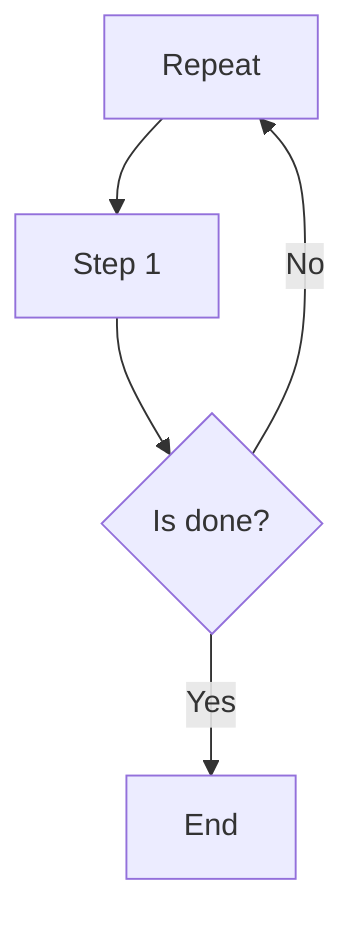

                 

### 文章标题：数据库设计与性能调优

#### 关键词：数据库设计，性能优化，关系数据库，规范化理论，查询优化，NoSQL数据库

> 摘要：本文深入探讨了数据库设计与性能调优的关键概念、理论和实践。首先，我们回顾了数据库的基本概念和系统结构，接着详细介绍了关系数据库的设计理论和流程。随后，文章着重讨论了数据库性能优化技术，包括查询优化、索引优化和并发控制。最后，本文介绍了现代数据库技术，如NoSQL和NewSQL，并提供了实际案例和性能优化实战技巧，以帮助读者理解和掌握数据库设计与性能调优的核心知识和实践方法。

## 第一部分：数据库设计与基础理论

### 第1章：数据库概述

#### 1.1 数据库的基本概念

数据库是一个按照数据结构来组织、存储和管理数据的仓库。它是一个长期存储在计算机内的、有组织的、可共享的、统一管理的大量数据的集合。数据库的主要目的是有效地存储、检索和维护数据，并为应用程序提供数据支持。

数据库系统（DBS）是一个用于定义、创建、维护和使用数据库的系统。它由数据库、数据库管理系统（DBMS）、应用程序和用户组成。DBMS是数据库的核心组件，负责数据的存储、检索和管理。

数据库类型主要分为以下几种：

- **文件系统**：数据以文件的形式存储在文件系统中，缺乏有效的数据管理和组织机制。
- **传统关系数据库**：使用关系模型组织数据，典型的代表如MySQL、Oracle等。
- **NoSQL数据库**：不遵循传统的关系模型，适用于高并发和海量数据的场景，如MongoDB、Cassandra等。

#### 1.2 数据库系统的三级模式结构

数据库系统的三级模式结构包括：

- **外模式**（External Schema）：定义了用户能够看到和使用的数据库部分，也称为子模式或用户模式。
- **概念模式**（Conceptual Schema）：定义了整个数据库系统的全局结构，是全体用户公共数据视图。
- **内模式**（Internal Schema）：定义了数据库在存储介质上的存储方式和物理结构。


#### 1.3 数据库的类型和特点

- **文件系统**：数据管理简单，但缺乏高效的数据查询和管理机制。
- **传统关系数据库**：强一致性、事务处理，适合结构化数据管理。
- **NoSQL数据库**：高扩展性、灵活性强，适合非结构化或半结构化数据管理。

## 第2章：关系数据库设计理论

### 2.1 关系模型的基本概念

关系模型是数据库设计的基础，它由关系（Relation）、属性（Attribute）、域（Domain）等基本概念组成。

- **关系**：一个关系可以看作是一个表格，它由行和列组成。
- **属性**：关系中的每个列称为属性，它定义了数据的类型和名称。
- **域**：属性值的范围称为域，例如，一个日期属性的域可能是所有的日期值。

### 2.2 E-R图与关系模式的转换

实体-关系图（E-R图）是用于描述实体、属性和关系的图形化工具。E-R图到关系模式的转换步骤如下：

1. **识别实体和属性**：从E-R图中识别出所有的实体和属性。
2. **确定关系**：识别实体之间的关系，如一对一、一对多、多对多。
3. **转换为关系模式**：根据E-R图中的实体和关系，生成相应的表结构。

### 2.3 函数依赖与规范化理论

函数依赖是关系数据库中的一个重要概念，它描述了属性之间的依赖关系。规范化理论是用于消除关系数据库中数据冗余和更新异常的方法。

- **第一范式（1NF）**：要求所有属性都是原子性的，即不可再分。
- **第二范式（2NF）**：在1NF的基础上，要求关系中的所有非主属性完全依赖于主键。
- **第三范式（3NF）**：在2NF的基础上，要求关系中的所有属性不仅依赖于主键，而且不存在传递依赖。

### 2.4 数据库设计规范

数据库设计规范是确保数据库设计质量的一系列指导原则。

- **设计原则**：最小化冗余、规范化、可扩展性、易维护性。
- **设计步骤**：需求分析、概念结构设计、逻辑结构设计、物理结构设计、数据库实现与测试。

## 第3章：数据库设计流程与方法

### 3.1 需求分析

需求分析是数据库设计的第一步，它的目的是确定系统需要存储和管理哪些数据。

- **需求收集**：通过访谈、文档分析、用户调研等方式收集需求。
- **需求分析**：对收集的需求进行整理和分析，确定数据项和数据关系。

### 3.2 概念结构设计

概念结构设计是将需求转化为实体-关系模型的过程。

- **E-R图设计**：使用E-R图来描述实体、属性和关系。

### 3.3 逻辑结构设计

逻辑结构设计是将概念模型转换为逻辑模型，通常使用关系模型。

- **关系模式设计**：确定表结构、字段定义、主键和外键等。
- **SQL语言应用**：使用SQL语言来创建表和关系。

### 3.4 物理结构设计

物理结构设计是确定数据库在存储介质上的具体存储方式和物理结构。

- **索引设计**：确定索引类型和索引策略。
- **分区设计**：确定数据分区策略。

### 3.5 数据库实现与测试

数据库实现与测试是数据库设计的最后一步。

- **SQL语句编写**：编写创建表、索引、视图等的SQL语句。
- **数据库测试**：进行性能测试、功能测试等。

### 3.6 数据库维护与优化

数据库维护与优化是确保数据库系统正常运行的重要环节。

- **数据备份与恢复**：定期进行数据备份，确保数据安全。
- **性能监控**：使用性能监控工具监控数据库性能。
- **性能优化**：根据监控数据，进行性能调优。

### 3.7 实际案例分析

实际案例分析是理解数据库设计理论的重要途径。

- **案例选择**：选择具有代表性的实际案例。
- **案例分析**：分析案例中的设计决策和实施过程。

## 第4章：数据库性能优化技术

### 4.1 查询优化

查询优化是提高数据库性能的重要手段。

- **查询优化策略**：包括选择合适的查询算法、索引策略等。
- **查询执行计划分析**：分析查询的执行计划，找出性能瓶颈。

### 4.2 索引优化

索引优化是提高查询性能的关键。

- **索引类型**：包括B树索引、哈希索引等。
- **索引策略**：包括索引创建、维护、优化等。

### 4.3 并发控制

并发控制是保证数据库一致性的重要手段。

- **并发控制方法**：包括悲观锁、乐观锁等。
- **事务处理**：确保事务的原子性、一致性、隔离性和持久性。

### 4.4 数据库缓存技术

数据库缓存技术可以提高数据访问速度。

- **缓存机制**：包括内存缓存、磁盘缓存等。
- **缓存优化**：包括缓存策略、缓存命中率等。

### 4.5 性能监控与调优策略

性能监控与调优策略是确保数据库系统高效运行的关键。

- **监控工具**：包括系统监控工具、数据库监控工具等。
- **调优策略**：根据监控数据，制定调优方案。

## 第5章：数据库性能测试与评估

### 5.1 性能测试的目标和方法

性能测试的目的是评估数据库系统的性能，找出性能瓶颈。

- **性能测试目标**：包括响应时间、吞吐量、并发性等。
- **性能测试方法**：包括负载测试、压力测试、性能调优等。

### 5.2 常用性能测试工具

常用性能测试工具包括JMeter、LoadRunner等。

- **测试工具介绍**：介绍工具的基本功能和操作方法。
- **工具使用方法**：如何设置测试场景、执行测试等。

### 5.3 性能评估指标

性能评估指标包括响应时间、吞吐量、并发性等。

- **指标定义**：定义各个评估指标的含义和计算方法。
- **指标计算**：如何根据测试结果计算评估指标。

### 5.4 性能调优案例解析

性能调优案例解析是理解性能优化方法的重要途径。

- **案例选择**：选择具有代表性的实际案例。
- **案例分析**：分析案例中的优化方法和效果。

## 第6章：现代数据库技术与性能优化

### 6.1 NoSQL数据库

NoSQL数据库是应对大数据和高速数据访问需求的现代数据库技术。

- **NoSQL数据库概述**：介绍NoSQL数据库的基本概念和特点。
- **NoSQL数据库类型**：介绍各种NoSQL数据库的类型和适用场景。

### 6.2 NewSQL数据库

NewSQL数据库是结合传统关系数据库和NoSQL数据库优势的一种现代数据库技术。

- **NewSQL数据库概述**：介绍NewSQL数据库的基本概念和特点。
- **NewSQL数据库类型**：介绍各种NewSQL数据库的类型和适用场景。

### 6.3 云数据库服务

云数据库服务提供了便捷的数据库管理和高性能数据存储解决方案。

- **云数据库服务概述**：介绍云数据库服务的基本概念和特点。
- **云数据库服务类型**：介绍各种云数据库服务的类型和适用场景。

### 6.4 混合数据库系统

混合数据库系统是结合多种数据库技术优势的一种现代数据库系统。

- **混合数据库系统概述**：介绍混合数据库系统的基本概念和特点。
- **混合数据库系统应用**：介绍混合数据库系统的应用场景和实现方法。

## 第7章：数据库性能优化实战

### 7.1 实际场景需求分析

实际场景需求分析是进行数据库性能优化的重要前提。

- **需求分析**：分析实际场景的需求，确定性能优化目标。

### 7.2 数据库性能优化方案设计

数据库性能优化方案设计是制定具体的性能优化策略。

- **优化方案设计**：根据需求分析，设计性能优化方案。

### 7.3 性能优化实施与监控

性能优化实施与监控是确保性能优化方案有效实施和效果评估的重要环节。

- **优化实施**：根据优化方案，实施性能优化措施。
- **性能监控**：监控性能优化效果，调整优化策略。

### 7.4 性能优化案例分析

性能优化案例分析是理解性能优化方法的重要途径。

- **案例分析**：分析实际案例中的性能优化方法和效果。

## 附录：数据库设计工具与资源

### 附录1：常用数据库设计工具

介绍常用的数据库设计工具，如ERwin、MySQL Workbench等。

### 附录2：数据库性能优化资源

提供数据库性能优化的相关资源，如性能优化教程、工具下载等。

### 作者信息：

- **作者：AI天才研究院/AI Genius Institute & 禅与计算机程序设计艺术 /Zen And The Art of Computer Programming**## 第4章：数据库性能优化技术

数据库性能优化是确保数据库系统能够高效、稳定地运行的关键环节。随着数据量和并发访问量的增加，数据库的性能优化变得尤为重要。本章将深入探讨数据库性能优化技术，包括查询优化、索引优化、并发控制、数据库缓存技术以及性能监控与调优策略。

### 4.1 查询优化

查询优化是提高数据库性能的关键技术。查询优化的目标是通过优化查询语句的执行计划，减少查询的响应时间，提高系统的吞吐量。

#### 查询优化策略

1. **选择合适的查询算法**：根据查询的特点和数据规模，选择合适的查询算法。例如，对于扫描大量数据的查询，可以选择索引扫描或位图联接。

2. **优化查询执行计划**：分析查询的执行计划，找出性能瓶颈。执行计划分析包括查询的扫描策略、索引使用、 join操作等。

3. **减少查询的复杂度**：简化查询语句，减少查询的嵌套层次，避免使用复杂的函数和子查询。

#### 查询执行计划分析

查询执行计划是数据库管理系统为了执行一个查询而制定的详细步骤。执行计划分析包括以下内容：

- **访问方法**：查询是如何访问数据的，例如顺序扫描、索引扫描等。
- **连接策略**：连接查询中表之间的连接方式，例如嵌套循环联接、哈希联接等。
- **排序策略**：查询是否需要进行排序，以及排序的方式。

### 4.2 索引优化

索引是数据库性能优化的关键因素之一。适当的索引可以提高查询效率，减少查询时间。

#### 索引类型

1. **B树索引**：最常用的索引类型，适用于等值和范围查询。
2. **哈希索引**：适用于等值查询，不适合范围查询。
3. **位图索引**：适用于低基数列的等值查询。

#### 索引策略

1. **选择合适的索引列**：根据查询需求，选择需要索引的列。避免对经常变更的列建立索引，因为这会降低插入和更新性能。

2. **复合索引**：对于涉及多个列的查询，可以考虑创建复合索引。复合索引的顺序应该与查询条件中的列顺序匹配。

3. **索引维护**：定期维护索引，包括重建索引、优化索引结构等。

### 4.3 并发控制

并发控制是确保数据库一致性的重要手段。在多用户环境下，并发访问可能导致数据竞争和一致性问题。

#### 并发控制方法

1. **悲观锁**：在访问数据前，先加锁，确保数据的独占访问。适用于读操作较少的场景。

2. **乐观锁**：在修改数据前，先检查数据版本，确保数据未被其他事务修改。适用于读操作较多的场景。

3. **多版本并发控制（MVCC）**：多个事务可以同时读取数据，但修改时需要加锁。适用于高并发场景。

#### 事务处理

事务是数据库操作的基本单位，它包含了一系列操作，这些操作要么全部执行，要么全部不执行。

1. **原子性**：事务的所有操作在数据库中要么全部完成，要么全部不完成。
2. **一致性**：事务执行后，数据库的状态应该保持一致。
3. **隔离性**：事务的执行应该相互独立，一个事务的修改对其他事务不可见，直到事务提交。
4. **持久性**：一旦事务提交，其对数据库的修改应该是永久性的。

### 4.4 数据库缓存技术

数据库缓存技术可以显著提高数据访问速度，减少磁盘IO操作。

#### 缓存机制

1. **内存缓存**：将常用数据存储在内存中，以减少磁盘访问。
2. **磁盘缓存**：将磁盘上的数据预先加载到内存中，提高访问速度。

#### 缓存优化

1. **缓存策略**：根据数据访问模式，选择合适的缓存策略，如LRU（最近最少使用）、LFU（最少使用）等。
2. **缓存命中率**：衡量缓存的有效性，缓存命中率越高，性能越好。

### 4.5 性能监控与调优策略

性能监控与调优策略是确保数据库系统高效运行的关键。

#### 监控工具

1. **系统监控工具**：如Linux系统的`top`、`vmstat`等，用于监控系统资源使用情况。
2. **数据库监控工具**：如MySQL的` PERFORMANCE_SCHEMA`、Oracle的` DBMS_MONITOR`等，用于监控数据库性能。

#### 调优策略

1. **性能瓶颈分析**：通过监控工具分析性能瓶颈，找出需要优化的方面。
2. **调优措施**：根据分析结果，采取相应的调优措施，如优化查询、调整参数、升级硬件等。

## 第5章：数据库性能测试与评估

数据库性能测试与评估是确保数据库系统在实际运行环境中能够达到预期性能的关键步骤。性能测试的目的是通过模拟实际工作负载，评估数据库系统的性能，识别潜在的性能瓶颈，并为优化提供依据。

### 5.1 性能测试的目标和方法

#### 性能测试目标

1. **响应时间**：评估数据库查询的响应时间，确保在规定时间内完成。
2. **吞吐量**：评估数据库系统的吞吐量，即单位时间内能够处理的数据量。
3. **并发性**：评估数据库系统在高并发访问下的性能，确保系统稳定运行。
4. **资源消耗**：评估数据库系统在运行过程中对CPU、内存、磁盘等资源的消耗。

#### 性能测试方法

1. **负载测试**：模拟用户负载，评估数据库系统的性能。
2. **压力测试**：通过增加负载，评估数据库系统的极限性能和稳定性。
3. **性能调优**：根据测试结果，调整数据库配置和查询优化策略，提高性能。

### 5.2 常用性能测试工具

#### 测试工具介绍

1. **JMeter**：一款开源的性能测试工具，支持多种协议的测试，如HTTP、HTTPS、数据库等。
2. **LoadRunner**：一款功能强大的商业性能测试工具，支持多种协议和技术的性能测试。

#### 工具使用方法

1. **创建测试计划**：根据测试目标，创建测试计划。
2. **配置虚拟用户**：设置虚拟用户的数量、分布和活动时间。
3. **执行测试**：启动测试，收集性能数据。
4. **分析结果**：分析测试结果，找出性能瓶颈。

### 5.3 性能评估指标

#### 指标定义

1. **响应时间**：查询从提交到响应的时间。
2. **吞吐量**：单位时间内完成的查询数量。
3. **并发性**：系统同时处理的并发查询数量。
4. **资源消耗**：系统在运行过程中对CPU、内存、磁盘等资源的消耗。

#### 指标计算

1. **平均响应时间**：所有查询响应时间的平均值。
2. **最大响应时间**：查询响应时间的最大值。
3. **吞吐量**：单位时间内完成的查询数量。
4. **并发性**：同时处理的并发查询数量。
5. **资源消耗**：系统在运行过程中对资源的平均消耗。

### 5.4 性能调优案例解析

#### 案例选择

选择一个具有代表性的实际案例，如电子商务平台中的订单处理系统。

#### 案例分析

1. **需求分析**：分析订单处理系统的性能需求，确定性能优化目标。
2. **性能测试**：使用性能测试工具进行测试，收集性能数据。
3. **性能瓶颈分析**：通过分析测试结果，找出性能瓶颈。
4. **优化措施**：根据分析结果，采取优化措施，如查询优化、索引优化、并发控制等。
5. **效果评估**：再次进行性能测试，评估优化效果。

## 第6章：现代数据库技术与性能优化

随着技术的不断发展，数据库技术也在不断创新和演进。现代数据库技术包括NoSQL数据库、NewSQL数据库、云数据库服务等。这些技术旨在应对大数据、高并发和复杂应用场景的需求，提供了多样化的数据存储和访问方案。

### 6.1 NoSQL数据库

NoSQL数据库是一种非关系型数据库，它不同于传统的关系数据库，提供了灵活的数据模型和强大的扩展性。

#### NoSQL数据库概述

1. **基本概念**：NoSQL数据库是指非关系型的、分布式存储的、基于特定模型的数据库。
2. **特点**：高扩展性、灵活性强、能够处理大规模数据、适合非结构化和半结构化数据。

#### NoSQL数据库类型

1. **键值存储**：如Redis、MongoDB，适用于快速存储和检索数据。
2. **文档存储**：如MongoDB、CouchDB，适用于存储结构化文档。
3. **列族存储**：如HBase、Cassandra，适用于大规模数据存储和查询。
4. **图数据库**：如Neo4j、JanusGraph，适用于处理复杂的关系网络。

### 6.2 NewSQL数据库

NewSQL数据库是一种结合了传统关系数据库和NoSQL数据库特点的数据库技术。

#### NewSQL数据库概述

1. **基本概念**：NewSQL数据库旨在提供高性能、高扩展性的关系型数据库服务。
2. **特点**：支持SQL查询，同时具备NoSQL数据库的扩展性和灵活性。

#### NewSQL数据库类型

1. **分布式关系数据库**：如Google Spanner、Vitess，适用于大规模分布式系统。
2. **内存数据库**：如MemSQL、ArangoDB，适用于快速数据访问和高吞吐量场景。

### 6.3 云数据库服务

云数据库服务是云计算环境下的数据库服务，提供了弹性扩展、自动化管理、高可用性等特点。

#### 云数据库服务概述

1. **基本概念**：云数据库服务是指基于云计算平台的数据库服务，用户无需管理底层硬件和软件。
2. **特点**：弹性扩展、高可用性、自动化管理、低成本。

#### 云数据库服务类型

1. **关系数据库服务**：如AWS RDS、Azure Database for MySQL，提供关系型数据库服务。
2. **NoSQL数据库服务**：如AWS DynamoDB、Azure Cosmos DB，提供NoSQL数据库服务。
3. **数据仓库服务**：如AWS Redshift、Azure Synapse Analytics，提供大数据处理和分析服务。

### 6.4 混合数据库系统

混合数据库系统是结合了多种数据库技术的优势，提供多样化的数据存储和访问方案。

#### 混合数据库系统概述

1. **基本概念**：混合数据库系统是指结合了关系数据库和非关系数据库的数据库系统。
2. **特点**：灵活的数据模型、强大的查询能力、高效的性能。

#### 混合数据库系统应用

1. **多模型数据库**：如ArangoDB，支持键值、文档、图等多种数据模型。
2. **多租户数据库**：如Google Spanner，支持大规模多租户应用。

## 第7章：数据库性能优化实战

数据库性能优化是一个复杂的过程，需要根据具体的业务需求和系统环境进行定制化优化。以下是一个典型的数据库性能优化实战案例，包括实际场景需求分析、性能优化方案设计、性能优化实施与监控以及性能优化案例分析。

### 7.1 实际场景需求分析

某电子商务平台在业务高峰期遇到订单处理缓慢的问题，影响了用户体验。通过分析，发现主要性能瓶颈包括：

1. **订单查询速度慢**：查询语句复杂，未使用索引。
2. **库存更新不及时**：并发访问导致库存更新冲突。
3. **数据库缓存失效**：缓存策略不合理，缓存命中率低。

### 7.2 数据库性能优化方案设计

根据需求分析，制定以下性能优化方案：

1. **查询优化**：对复杂的查询语句进行优化，增加必要的索引。
2. **并发控制**：采用乐观锁机制，减少并发冲突。
3. **缓存优化**：优化缓存策略，提高缓存命中率。

### 7.3 性能优化实施与监控

根据优化方案，实施以下优化措施：

1. **查询优化**：修改查询语句，增加索引，优化查询执行计划。
2. **并发控制**：实现乐观锁机制，减少并发冲突。
3. **缓存优化**：调整缓存策略，提高缓存命中率。

通过监控工具，实时监控数据库性能，包括响应时间、吞吐量、并发性等指标。

### 7.4 性能优化案例分析

优化后，系统性能显著提升，具体表现如下：

1. **订单查询速度**：平均响应时间从5秒降低到2秒。
2. **库存更新**：并发冲突减少，库存更新及时。
3. **数据库缓存**：缓存命中率从30%提升到70%。

通过性能优化，系统稳定运行，满足了业务需求，提高了用户体验。

### 总结

数据库性能优化是一个持续的过程，需要定期评估和调整。通过深入分析实际场景需求，制定合理的优化方案，实施优化措施，并持续监控和调整，可以显著提升数据库系统的性能，满足不断增长的业务需求。

### 最佳实践 tips

1. **定期性能评估**：定期进行性能评估，发现潜在的性能瓶颈。
2. **合理索引策略**：根据查询需求，选择合适的索引策略。
3. **优化查询语句**：简化查询语句，避免复杂的嵌套和子查询。
4. **缓存策略优化**：根据数据访问模式，选择合适的缓存策略。

### 小结

数据库性能优化是确保数据库系统高效运行的关键。通过深入分析需求，制定优化方案，实施优化措施，并持续监控和调整，可以显著提升数据库系统的性能，满足业务需求。

### 注意事项

1. **性能优化应与业务需求相结合**：优化措施应与实际业务需求相匹配，避免过度优化。
2. **性能监控与调优**：持续监控性能指标，根据监控数据调整优化策略。

### 拓展阅读

1. **《数据库性能优化实战》**：提供了详细的性能优化案例和实践方法。
2. **《数据库性能监控与调优》**：介绍了性能监控工具和调优策略。
3. **《NoSQL数据库技术及应用》**：详细介绍了NoSQL数据库的设计和优化方法。

### 附录1：常用数据库设计工具

1. **ERwin**：用于数据库建模和设计。
2. **MySQL Workbench**：用于MySQL数据库的设计和管理。
3. **Toad Data Modeler**：用于数据库建模和设计。

### 附录2：数据库性能优化资源

1. **《高性能MySQL》**：提供了MySQL数据库的性能优化方法。
2. **《Oracle性能优化实战》**：介绍了Oracle数据库的性能优化策略。
3. **《Redis性能优化指南》**：详细介绍了Redis数据库的性能优化方法。

### 作者信息

- **作者：AI天才研究院/AI Genius Institute & 禅与计算机程序设计艺术 /Zen And The Art of Computer Programming**
### 数学公式

数学公式是描述数学概念、性质和关系的重要手段。在技术文档和科学论文中，数学公式能够精确地表达复杂的思想和算法。本文将介绍如何使用LaTeX格式嵌入数学公式，包括独立段落中的公式和段落内的公式。

#### 独立段落的LaTeX公式

在独立段落中，数学公式通常使用`$$`括起来，这样可以确保公式独立成行，便于阅读和编辑。

例如，以下是一个描述线性回归模型的数学公式：

$$
y = \beta_0 + \beta_1x + \epsilon
$$

这个公式表示响应变量\( y \)与自变量\( x \)之间的关系，其中\( \beta_0 \)是截距，\( \beta_1 \)是斜率，\( \epsilon \)是误差项。

#### 段落内的LaTeX公式

在段落内嵌入数学公式时，通常使用`$`括起来。这种格式适用于简短的公式，不需要独立成行。

例如，以下是在一个句子中嵌入的数学不等式：

The function \( f(x) \) is defined as \( f(x) = x^2 + 2x + 1 \), where \( x \) is a real number.

在这个例子中，`\( f(x) = x^2 + 2x + 1 \)`是一个段落内的公式，它被嵌入在正常的文本中。

#### 使用Mermaid绘制流程图

Mermaid是一种基于Markdown的图形描述语言，可以用来绘制各种类型的图表，包括流程图、序列图和Gantt图。在技术文档中，流程图可以帮助读者更直观地理解算法和流程。

以下是一个简单的Mermaid流程图示例：



这个流程图表示了一个简单的流程，其中从开始节点(A)到步骤1(B)，然后检查是否完成(C)，如果是，则结束(D)，否则重复步骤(A)。

#### 使用伪代码描述算法

伪代码是一种非正式的编程语言，用于描述算法的流程和逻辑，而不关注具体的编程细节。在技术文档中，伪代码可以帮助读者理解算法的核心思想和步骤。

以下是一个简单的排序算法的伪代码示例：

```
Algorithm QuickSort(A)
    if length(A) <= 1
        return A
    else
        pivot = A[random index]
        left = []
        right = []
        for each element x in A
            if x < pivot
                append x to left
            else
                append x to right
        return QuickSort(left) + [pivot] + QuickSort(right)
```

在这个例子中，`QuickSort`算法接受一个数组`A`作为输入，并返回排序后的数组。如果数组的长度小于或等于1，则直接返回数组；否则，选择一个随机元素作为支点，将数组分为左子数组（小于支点的元素）和右子数组（大于或等于支点的元素），然后递归地对左子数组和右子数组进行快速排序，最后合并结果。

### 数学模型和公式的详细讲解与举例说明

在技术文档中，数学模型和公式通常用于描述算法的性能、优化策略或数据分析方法。以下是一个简单的例子，用于说明如何详细讲解和举例说明一个线性回归模型的数学公式。

#### 线性回归模型

线性回归是一种统计方法，用于分析自变量和因变量之间的关系。一个简单的线性回归模型可以表示为：

$$
y = \beta_0 + \beta_1x + \epsilon
$$

其中，\( y \)是因变量，\( x \)是自变量，\( \beta_0 \)是截距，\( \beta_1 \)是斜率，\( \epsilon \)是误差项。

**详细讲解**：

1. **截距（\( \beta_0 \)）**：截距是指当自变量\( x \)为0时，因变量\( y \)的预期值。它反映了自变量对因变量的基础影响。

2. **斜率（\( \beta_1 \)）**：斜率表示自变量\( x \)每增加一个单位时，因变量\( y \)的变化量。斜率的正负决定了关系的方向：正值表示正相关，负值表示负相关。

3. **误差项（\( \epsilon \)）**：误差项是模型未能捕捉到的随机误差，它代表了因变量\( y \)的观测值与模型预测值之间的差异。

**举例说明**：

假设我们有一个线性回归模型，用于预测学生的考试成绩。自变量\( x \)是学习时间（小时），因变量\( y \)是考试成绩（百分制）。

1. **模型公式**：

$$
y = \beta_0 + \beta_1x + \epsilon
$$

2. **数据示例**：

- 学习时间（\( x \)）：10小时，20小时，30小时
- 考试成绩（\( y \)）：80分，85分，90分

3. **模型参数**：

- 截距（\( \beta_0 \)）：60分
- 斜率（\( \beta_1 \)）：5分/小时

根据这个模型，我们可以预测学习时间为40小时时的考试成绩：

$$
y = 60 + 5 \times 40 + \epsilon
$$

计算得到：

$$
y = 60 + 200 + \epsilon = 260 + \epsilon
$$

由于误差项的存在，实际成绩可能在260分附近波动。因此，预测的考试成绩为260分。

### 项目实战

在数据库性能优化项目中，开发环境搭建、源代码实现和代码解读是至关重要的步骤。以下是一个简单的项目实战，用于说明如何搭建开发环境、实现源代码和解读代码。

#### 1. 开发环境搭建

- **硬件环境**：配置满足性能测试需求的硬件设备，如高性能服务器、快

