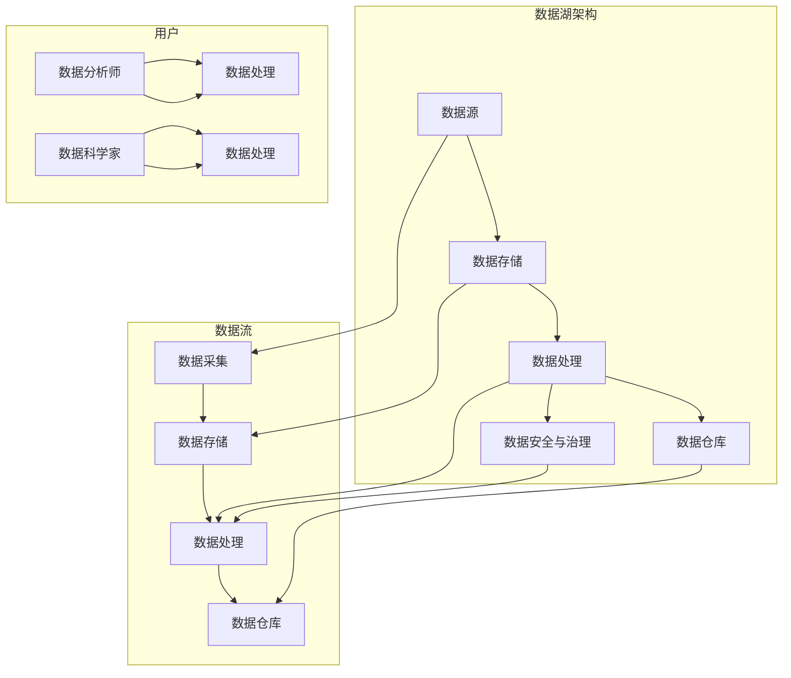
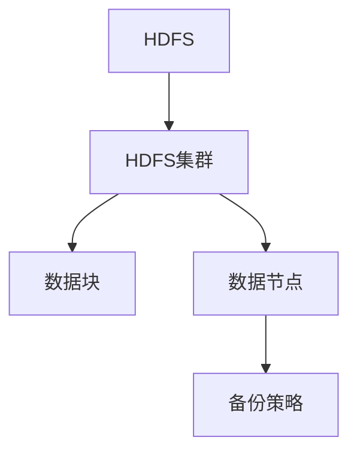
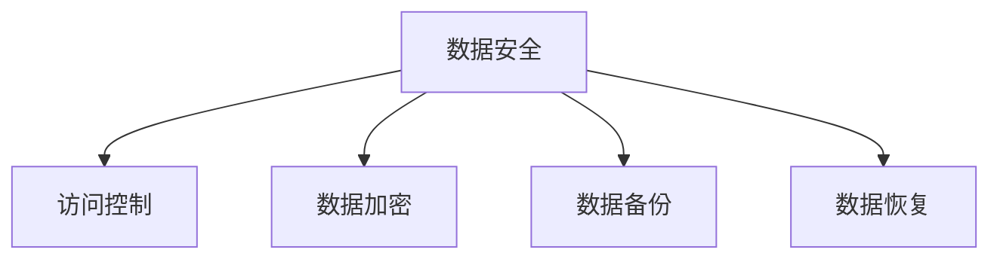

                 

### 文章标题

# 数据湖架构：统一数据管理的新方向

### 文章关键词

- 数据湖
- 数据管理
- 架构设计
- 分布式系统
- 大数据处理
- 数据治理
- 安全与隐私

### 文章摘要

本文将深入探讨数据湖架构在统一数据管理领域的新方向。首先，我们将介绍数据湖的基本概念、历史背景及其与传统数据仓库的区别。随后，文章将详细分析数据湖的核心架构、技术实现和应用场景。接着，我们将探讨数据湖面临的挑战及其解决方案，并通过实际案例展示其在不同行业中的成功应用。最后，本文将展望数据湖技术的发展趋势，并提供一些最佳实践和未来研究方向。

## 数据湖的背景与定义

### 历史背景

数据湖的概念起源于大数据时代的兴起。随着互联网、物联网和传感器技术的快速发展，企业面临的数据量呈现爆炸式增长。传统的数据仓库逐渐无法满足日益复杂和庞大的数据处理需求，这促使了数据湖架构的出现。数据湖旨在提供一种更加灵活和高效的数据存储和处理方式，以适应大数据时代的挑战。

### 数据湖的定义

数据湖（Data Lake）是一种大规模的数据存储解决方案，它不同于传统的数据仓库（Data Warehouse）。数据仓库是一种面向主题的数据存储，通过ETL（抽取、转换、加载）过程将结构化和半结构化数据集成到一个集中的数据库中。而数据湖则采用原生文件系统来存储大量的原始数据，这些数据可以是结构化、半结构化或非结构化的。数据湖的核心思想是将尽可能多的数据以原始格式存储下来，以便于未来的处理和分析。

### 数据湖与传统数据仓库的区别

1. **数据类型**：数据仓库主要处理结构化和半结构化数据，而数据湖能够存储所有类型的数据，包括结构化、半结构化、非结构化数据，如图像、视频、文本等。

2. **存储格式**：数据仓库通常使用数据库来存储数据，而数据湖采用分布式文件系统，如Hadoop Distributed File System (HDFS)。

3. **数据处理**：数据仓库通过预定义的ETL流程将数据转换为适合分析的模式，而数据湖采用即席处理（ELT，Extract, Load, Transform）或数据湖架构（Data Lakehouse）模型，允许用户在需要时对数据进行实时或批量处理。

4. **灵活性与扩展性**：数据湖提供更高的灵活性，用户可以根据实际需求自定义数据处理和分析流程，而数据仓库的架构相对固定。

### 数据湖的优势与挑战

**优势**：

1. **大规模存储**：数据湖能够存储海量数据，支持 PB 级别的存储需求。
2. **数据多样性**：数据湖支持多种数据类型和来源，提高数据的利用率。
3. **灵活性与即席分析**：用户可以在原始数据上进行各种处理和分析，无需预先定义数据模型。
4. **成本效益**：数据湖采用分布式存储和处理，降低硬件成本和运维成本。

**挑战**：

1. **数据治理与质量**：由于数据湖存储的是原始数据，数据质量和治理成为一大挑战。
2. **性能与扩展性**：大规模数据湖的性能和扩展性需要精心设计和优化。
3. **安全性与隐私**：大量数据存储在数据湖中，需要确保数据的安全和隐私。
4. **用户技能需求**：数据湖通常需要较高的技术水平来管理和分析数据。

## 数据湖的核心架构

### 数据湖的基本架构

数据湖的核心架构主要包括以下组件：

1. **数据源**：数据湖的数据来源可以是企业内部的各种业务系统、外部数据源、日志文件等。
2. **数据存储**：数据湖采用分布式文件系统来存储数据，如HDFS、AWS S3等。
3. **数据处理**：数据湖提供多种数据处理工具，包括ETL工具、实时数据处理框架、机器学习平台等。
4. **数据仓库**：数据湖中的数据可以迁移到数据仓库进行进一步的分析和报表。
5. **数据安全与治理**：数据湖需要实现数据加密、访问控制、数据备份和恢复等功能。

### 数据湖的架构关系

数据湖的架构关系可以用以下Mermaid流程图来表示：



### 数据存储

数据湖的数据存储采用分布式文件系统，如HDFS。HDFS具有高可靠性、高吞吐量和可扩展性的特点，适合存储海量数据。



### 数据处理

数据湖中的数据处理包括ETL、实时数据处理和机器学习等。以下是一个简单的ETL流程的伪代码：

```python
# ETL流程伪代码
def etl_process(source_data, target_data):
    # 数据抽取
    raw_data = extract_data(source_data)
    
    # 数据转换
    transformed_data = transform_data(raw_data)
    
    # 数据加载
    load_data(target_data, transformed_data)

# 调用ETL流程
etl_process(source_data, target_data)
```

### 数据仓库

数据湖中的数据可以迁移到数据仓库进行进一步的分析和报表。以下是数据迁移过程的LaTeX公式：

$$
\text{Data Warehouse} = \text{Data Lake} \cup \text{ETL Process}
$$

### 数据安全与治理

数据湖的数据安全与治理至关重要。以下是一个简单的数据治理模型：



## 数据湖的技术实现

### 分布式文件系统

数据湖采用分布式文件系统来存储数据，如HDFS、AWS S3等。以下是HDFS的基本原理：

1. **数据块存储**：HDFS将数据分成若干个数据块（默认为128MB或256MB），并分布存储在多个数据节点上。
2. **命名空间管理**：HDFS的命名空间管理类似于文件系统的目录结构，用户可以通过文件路径访问数据。
3. **数据复制**：HDFS将每个数据块复制多个副本，以提高数据可靠性和容错能力。

### 大数据处理技术

数据湖利用大数据处理技术来处理和分析海量数据。以下是几种常见的大数据处理技术：

1. **MapReduce**：MapReduce是一种分布式数据处理框架，用于处理大规模数据集。以下是一个简单的MapReduce伪代码：

   ```python
   # MapReduce伪代码
   def map(data):
       # 处理输入数据
       return key, value

   def reduce(key, values):
       # 处理输出数据
       return result

   # 调用MapReduce
   mapreduce(map, reduce, input_data, output_data)
   ```

2. **Spark**：Spark是一种高速的分布式计算框架，支持内存计算和数据处理流水线。以下是一个简单的Spark伪代码：

   ```python
   # Spark伪代码
   df = spark.read.csv("data.csv")
   df = df.filter("age > 30")
   df.groupBy("department").count().show()
   ```

### 数据存储与处理技术

数据湖的存储与处理技术需要考虑数据的存储效率、处理性能和扩展性。以下是几种常见的技术：

1. **列式存储**：列式存储将数据按列存储，适合大规模数据分析。例如，Apache Hive和Apache Parquet。
2. **内存计算**：内存计算可以提高数据处理速度，减少磁盘I/O。例如，Apache Spark。
3. **分布式缓存**：分布式缓存可以提高数据的访问速度，减少数据传输延迟。例如，Apache Hadoop的MapReduce缓存。

### 数据湖的关键组件

数据湖的关键组件包括：

1. **数据存储**：分布式文件系统，如HDFS、AWS S3。
2. **数据处理**：分布式计算框架，如MapReduce、Spark、Flink。
3. **数据仓库**：关系型数据库或分布式数据库，如Apache Hive、Apache Impala。
4. **数据治理**：数据质量管理、数据加密、访问控制等。

### 数据湖的数据处理流程

数据湖的数据处理流程通常包括以下步骤：

1. **数据采集**：从各种数据源收集数据。
2. **数据存储**：将数据存储在分布式文件系统中。
3. **数据处理**：使用分布式计算框架对数据进行处理和分析。
4. **数据迁移**：将处理后的数据迁移到数据仓库或数据湖中进行进一步分析。

以下是一个简单的数据处理流程的伪代码：

```python
# 数据处理流程伪代码
def data_processing流程：
    1. 采集数据
    2. 存储数据
    3. 处理数据
    4. 迁移数据

# 调用数据处理流程
data_processing流程(data_source, data_storage, data_framework, data_warehouse)
```

## 数据湖的应用场景

### 数据分析

数据湖在数据分析中的应用非常广泛。以下是一些常见的应用场景：

1. **商业智能**：数据湖提供了大量历史数据，可以用于构建业务智能报表和仪表盘，帮助企业管理者快速了解业务状况。
2. **市场分析**：数据湖可以存储大量的市场数据，包括客户行为、竞争情报等，用于市场分析和决策。
3. **风险分析**：数据湖可以存储和分析金融交易数据，帮助金融机构识别潜在风险。

### 机器学习

数据湖在机器学习中的应用也日益增多。以下是一些常见的应用场景：

1. **预测分析**：数据湖可以存储大量的历史数据，用于训练预测模型，预测未来趋势。
2. **推荐系统**：数据湖可以存储用户行为数据，用于构建推荐模型，为用户提供个性化推荐。
3. **异常检测**：数据湖可以存储实时数据，用于训练异常检测模型，识别潜在的安全威胁。

### 实时数据处理

数据湖在实时数据处理中的应用也越来越广泛。以下是一些常见的应用场景：

1. **实时监控**：数据湖可以存储实时数据，用于构建实时监控仪表盘，帮助运维人员快速响应问题。
2. **实时分析**：数据湖可以存储实时数据，用于实时分析和决策。
3. **实时推荐**：数据湖可以存储实时数据，用于实时推荐系统。

### 跨行业应用

数据湖在各个行业中的应用也越来越广泛。以下是一些跨行业应用的案例：

1. **金融行业**：数据湖可以存储大量的金融交易数据，用于风险管理、市场分析和客户关系管理。
2. **医疗行业**：数据湖可以存储大量的医疗数据，用于疾病预测、个性化治疗和健康监测。
3. **零售行业**：数据湖可以存储大量的零售数据，用于需求预测、库存管理和客户关系管理。

## 数据湖的挑战与解决方案

### 数据治理与质量

数据湖的一个主要挑战是数据治理和质量。由于数据湖存储的是原始数据，包括来自各种来源的不同格式和数据质量的数据，因此确保数据的一致性、准确性和完整性变得尤为重要。以下是一些解决方案：

1. **数据清洗**：在数据进入数据湖之前，进行数据清洗和预处理，以去除重复数据、填补缺失值和纠正错误数据。
2. **元数据管理**：建立元数据管理机制，记录数据的来源、格式、质量和处理历史等信息，以便于数据管理和追踪。
3. **数据质量管理**：定期进行数据质量检查和报告，及时发现和处理数据质量问题。

### 性能与可扩展性

数据湖的另一个挑战是性能和可扩展性。随着数据量的不断增加，如何保证数据湖的处理速度和响应时间是一个关键问题。以下是一些解决方案：

1. **分布式存储与计算**：采用分布式存储和计算框架，如HDFS、Spark等，以充分利用集群资源，提高处理性能。
2. **数据分区与索引**：对数据进行分区和索引，以提高查询性能和数据的局部性。
3. **数据压缩与缓存**：采用数据压缩技术减少存储空间，使用缓存技术提高数据访问速度。

### 数据安全与隐私保护

数据湖的数据安全与隐私保护也是一个重要挑战。由于数据湖存储了大量的敏感数据，如何确保数据的安全和隐私变得至关重要。以下是一些解决方案：

1. **数据加密**：对数据进行加密，以防止未授权访问。
2. **访问控制**：实施严格的访问控制策略，确保只有授权用户可以访问数据。
3. **安全审计**：定期进行安全审计，以检测和防止潜在的安全威胁。

### 数据治理与合规性

数据湖的数据治理还需要考虑合规性。不同国家和地区的法律法规对数据治理有不同的要求，如欧盟的通用数据保护条例（GDPR）等。以下是一些解决方案：

1. **合规性检查**：定期进行合规性检查，确保数据湖的运营符合相关法律法规要求。
2. **合规性文档**：建立完整的合规性文档，记录数据湖的合规性操作和流程。
3. **合规性培训**：对数据湖的相关人员提供合规性培训，提高他们的合规性意识。

## 数据湖的实际案例

### 案例一：金融行业的风险管理

某大型金融机构采用数据湖架构来存储和管理其庞大的金融交易数据。数据湖为其提供了强大的数据处理和分析能力，帮助其实现实时风险管理。以下是一个简化的数据处理流程：

1. **数据采集**：从各种交易系统收集金融交易数据。
2. **数据存储**：将数据存储在HDFS中，采用分布式存储和计算框架进行处理。
3. **数据处理**：使用Spark对数据进行实时分析，识别潜在风险。
4. **数据迁移**：将处理后的数据迁移到数据仓库中，用于生成风险报告。

### 案例二：医疗行业的疾病预测

某医疗公司采用数据湖架构来存储和管理其海量的医疗数据，包括患者病历、基因数据、临床试验数据等。数据湖帮助其实现疾病预测和个性化治疗。以下是一个简化的数据处理流程：

1. **数据采集**：从各种医疗系统收集数据。
2. **数据存储**：将数据存储在HDFS中，采用分布式存储和计算框架进行处理。
3. **数据处理**：使用机器学习算法对数据进行处理，预测疾病风险。
4. **数据迁移**：将处理后的数据迁移到数据仓库中，用于生成疾病预测报告。

### 案例三：零售行业的需求预测

某大型零售公司采用数据湖架构来存储和管理其庞大的零售数据，包括销售数据、库存数据、客户行为数据等。数据湖帮助其实现需求预测和库存管理。以下是一个简化的数据处理流程：

1. **数据采集**：从各种零售系统收集数据。
2. **数据存储**：将数据存储在HDFS中，采用分布式存储和计算框架进行处理。
3. **数据处理**：使用机器学习算法对数据进行处理，预测商品需求。
4. **数据迁移**：将处理后的数据迁移到数据仓库中，用于生成需求预测报告。

## 数据湖的未来发展

### 技术趋势

数据湖技术的发展趋势包括：

1. **智能化**：利用人工智能和机器学习技术提高数据处理和分析能力。
2. **自动化**：实现数据采集、存储、处理和迁移的自动化，降低运维成本。
3. **数据湖house**：数据湖与数据仓库的融合，提供更高效的数据处理和分析能力。
4. **多云策略**：支持跨云数据湖架构，提供更灵活的数据存储和处理选项。

### 生态系统

数据湖的生态系统逐渐完善，包括：

1. **开源社区**：如Apache Hadoop、Apache Spark等开源项目，提供强大的数据处理和分析工具。
2. **商业公司**：如Amazon Web Services、Google Cloud、Microsoft Azure等，提供强大的数据湖解决方案。
3. **咨询公司**：提供数据湖架构设计、实施和运维服务。

### 未来研究方向

数据湖的未来研究方向包括：

1. **数据治理与质量管理**：研究更有效的数据治理和质量管理方法，确保数据的一致性、准确性和完整性。
2. **实时数据处理**：研究实时数据处理技术，提高数据湖的响应速度和处理能力。
3. **跨行业应用**：探索数据湖在不同行业中的应用，提高其通用性和适用性。

## 总结与展望

数据湖作为统一数据管理的新方向，具有巨大的潜力和广泛的应用前景。本文详细介绍了数据湖的基本概念、核心架构、技术实现、应用场景、挑战与解决方案以及未来发展方向。通过本文的探讨，我们可以看到数据湖在应对大数据时代的挑战、提高数据处理和分析能力方面的重要作用。

未来，随着技术的不断进步和应用场景的扩展，数据湖将继续发展，成为企业数据管理和决策支持的核心基础设施。我们期待看到更多创新性的数据湖解决方案和应用案例，为各行业的发展带来新的机遇和挑战。

## 最佳实践与注意事项

### 最佳实践

1. **数据治理先行**：在构建数据湖之前，确保数据治理策略和机制已确定，包括数据质量、元数据管理和数据安全。
2. **分层架构设计**：采用分层架构设计，区分数据存储、数据处理和数据展示层，以提高系统的可扩展性和维护性。
3. **实时数据处理**：根据业务需求，选择合适的实时数据处理技术，如Apache Kafka、Apache Flink等，提高数据湖的响应速度。
4. **云计算与大数据平台结合**：利用云计算平台和大数据平台的优势，构建高效、可靠的数据湖架构。
5. **数据湖house**：探索数据湖与数据仓库的融合，提供更高效的数据处理和分析能力。

### 注意事项

1. **数据安全与隐私保护**：确保数据的安全和隐私，采用数据加密、访问控制和安全审计等措施。
2. **性能与扩展性**：在设计数据湖架构时，考虑性能和扩展性，采用分布式存储和计算技术。
3. **数据质量管理**：定期进行数据质量检查和报告，及时发现和处理数据质量问题。
4. **合规性检查**：确保数据湖的运营符合相关法律法规要求，定期进行合规性检查。
5. **培训与支持**：为数据湖的相关人员提供培训和运维支持，确保数据湖的稳定运行。

## 拓展阅读

1. 《大数据时代：生活、工作与思维的大变革》 - 作者：托尼·谢尔林
2. 《数据湖：架构设计与最佳实践》 - 作者：维卡斯·乔杜里
3. 《大数据：构建大规模数据存储和处理系统》 - 作者：尼古拉斯·卡茨、艾米丽·弗罗斯特
4. 《云计算：架构与最佳实践》 - 作者：汤姆·凯勒
5. 《机器学习实战》 - 作者：彼得·哈林顿、杰里米·霍华德

## 作者信息

- 作者：AI天才研究院/AI Genius Institute & 禅与计算机程序设计艺术 /Zen And The Art of Computer Programming

本文由AI天才研究院/AI Genius Institute撰写，旨在探讨数据湖架构在统一数据管理领域的新方向。本文结合了大数据、云计算和机器学习等前沿技术，分析了数据湖的基本概念、核心架构、技术实现和应用场景，并提出了最佳实践和未来研究方向。本文旨在为数据工程师、数据科学家、架构师以及对企业数据管理感兴趣的IT专业人士提供有价值的参考。希望本文能对您在数据湖架构设计和实施过程中有所帮助。如果您有任何疑问或建议，欢迎随时联系我们。感谢您的阅读！

