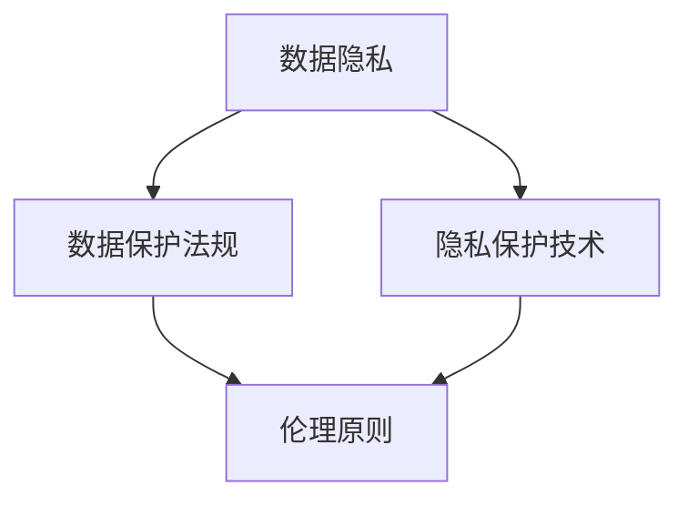

                 


## 文章标题：数据隐私与AI伦理：平衡创新与个人权利

### 关键词：数据隐私，AI伦理，个人权利，平衡，创新

### 摘要：本文旨在探讨数据隐私与AI伦理之间的关系，分析两者在创新与个人权利保护方面的平衡策略。通过对数据隐私的基本概念、重要性、法规标准以及AI伦理的基本原则、现实挑战、案例分析、教育审查等方面的深入剖析，本文提出了一系列平衡数据隐私与AI伦理的创新策略，旨在推动科技发展同时保障个人权利。

### 目录大纲：

# 数据隐私与AI伦理：平衡创新与个人权利

## 第一部分：数据隐私概述

## 第1章：数据隐私的基本概念与重要性

### 1.1 数据隐私的定义

### 1.2 数据隐私的重要性

### 1.3 数据隐私与个人权利的关系

## 第2章：数据隐私法规与标准

### 2.1 国际数据隐私法规概述

### 2.2 我国数据隐私法规解析

### 2.3 企业数据隐私保护实践

## 第二部分：AI伦理问题探讨

## 第3章：AI伦理的基本原则

### 3.1 AI伦理的概念与内涵

### 3.2 AI伦理的基本原则

### 3.3 AI伦理的现实挑战

## 第4章：AI伦理案例分析

### 4.1 AI伦理案例一：自动驾驶

### 4.2 AI伦理案例二：人工智能医疗

### 4.3 AI伦理案例三：人工智能招聘

## 第5章：AI伦理教育与伦理审查

### 5.1 AI伦理教育的重要性

### 5.2 AI伦理教育的内容与方法

### 5.3 AI伦理审查机制

## 第三部分：数据隐私与AI伦理的平衡策略

## 第6章：数据隐私保护技术

### 6.1 数据加密技术

### 6.2 同态加密技术

### 6.3 隐私计算技术

## 第7章：AI伦理与数据隐私的平衡策略

### 7.1 平衡策略的理论基础

### 7.2 平衡策略的实践应用

### 7.3 平衡策略的挑战与未来展望

## 附录

### 附录A：相关法律法规与政策文件

### 附录B：AI伦理案例分析资料

### 附录C：推荐阅读文献与资源

### Mermaid 流程图：



### 核心算法原理讲解：

#### 加密算法原理（伪代码）：

```python
# 加密算法伪代码

def encrypt(message, key):
    encrypted_message = ""
    for char in message:
        encrypted_message += chr(ord(char) + key)
    return encrypted_message

def decrypt(encrypted_message, key):
    message = ""
    for char in encrypted_message:
        message += chr(ord(char) - key)
    return message
```

### 数学模型与公式讲解：

#### 伦理决策模型（公式）：

$$
E = \frac{R \cdot S}{C}
$$

其中，$E$ 表示伦理得分，$R$ 表示权利保护程度，$S$ 表示社会利益，$C$ 表示成本。

### 项目实战：

#### 代码实际案例（部分）：

```python
# 数据隐私保护项目案例

import pandas as pd
from sklearn.model_selection import train_test_split

# 数据准备
data = pd.read_csv("data.csv")
X = data.drop("sensitive_data", axis=1)
y = data["sensitive_data"]

# 数据预处理
X_train, X_test, y_train, y_test = train_test_split(X, y, test_size=0.2, random_state=42)

# 模型训练
from sklearn.ensemble import RandomForestClassifier
model = RandomForestClassifier()
model.fit(X_train, y_train)

# 模型评估
from sklearn.metrics import accuracy_score
y_pred = model.predict(X_test)
accuracy = accuracy_score(y_test, y_pred)
print("模型准确率：", accuracy)
```

### 代码解读与分析：

#### 数据隐私保护代码解读

```python
# 数据隐私保护代码解读

# 导入必要的
----------------------------------------------------------------
## 第一部分：数据隐私概述

### 第1章：数据隐私的基本概念与重要性

#### 1.1 数据隐私的定义

数据隐私是指个体对其个人信息的控制权，包括信息的收集、存储、使用、共享和披露。简单来说，数据隐私关乎个体能否自主决定自己的个人信息如何被他人访问和使用。

#### 1.2 数据隐私的重要性

数据隐私的重要性体现在以下几个方面：

1. **保护个人权利**：数据隐私是个人权利的重要组成部分，保障个人对其信息的控制权，有助于维护个人的尊严和自由。
2. **预防隐私泄露**：在数字化时代，个人数据泄露事件频发，数据隐私的保护有助于防止隐私泄露带来的风险。
3. **促进公平竞争**：数据隐私保护有助于防止数据滥用，促进市场的公平竞争。
4. **推动科技创新**：在确保数据隐私的前提下，科技创新才能得到更好的发展，进而推动社会进步。

#### 1.3 数据隐私与个人权利的关系

数据隐私与个人权利密切相关。个人权利中的知情权、选择权和被遗忘权等都与数据隐私紧密相关。具体来说：

1. **知情权**：个人有权知道自己的信息被如何收集、使用和共享。
2. **选择权**：个人有权决定是否提供个人信息，以及如何使用这些信息。
3. **被遗忘权**：个人有权要求删除其个人信息，以防止信息被滥用。

### 第2章：数据隐私法规与标准

#### 2.1 国际数据隐私法规概述

全球范围内，数据隐私保护法规日趋完善。以下是一些重要的国际数据隐私法规：

1. **通用数据保护条例（GDPR）**：GDPR 是欧盟推出的数据隐私保护法规，对数据隐私保护提出了严格要求。
2. **加州消费者隐私法（CCPA）**：CCPA 是美国加州推出的数据隐私保护法规，旨在保护消费者个人信息。
3. **个人信息保护法（PIPL）**：PIPL 是中国推出的数据隐私保护法规，对个人信息保护提出了全面要求。

#### 2.2 我国数据隐私法规解析

我国的数据隐私保护法规主要包括《网络安全法》、《数据安全法》和《个人信息保护法》等。以下是对这些法规的简要解析：

1. **网络安全法**：网络安全法是我国网络安全领域的基石性法律，对网络运营者的数据保护义务进行了明确规定。
2. **数据安全法**：数据安全法是我国数据安全领域的首要法律，对数据安全保护提出了全面要求。
3. **个人信息保护法**：个人信息保护法是我国个人信息保护领域的核心法律，对个人信息收集、使用、存储、处理和传输等环节进行了详细规定。

#### 2.3 企业数据隐私保护实践

企业在数据隐私保护方面需要遵循以下原则和实践：

1. **最小化原则**：企业在收集和使用个人信息时，应遵循最小化原则，仅收集和使用必要的个人信息。
2. **合法性原则**：企业收集和使用个人信息应当遵循合法性原则，确保个人信息的收集和使用有明确的法律依据。
3. **安全原则**：企业应采取有效的技术和管理措施，确保个人信息的存储安全、传输安全和处理安全。

## 第二部分：AI伦理问题探讨

### 第3章：AI伦理的基本原则

#### 3.1 AI伦理的概念与内涵

AI伦理是指研究人工智能在道德、法律和社会责任等方面的原则和规范。其内涵包括：

1. **公平性**：AI 应该公平对待所有人，不应因性别、种族、年龄等因素导致歧视。
2. **透明性**：AI 的决策过程和算法应该透明，以便人们理解和监督。
3. **责任性**：AI 系统的创建者和使用者应承担相应的责任，确保 AI 的行为符合伦理标准。

#### 3.2 AI伦理的基本原则

AI伦理的基本原则包括：

1. **尊重个体权利**：AI 应尊重个体的隐私权和知情权，确保个人数据的保护。
2. **公平公正**：AI 应公平对待所有人，不应因算法偏见导致歧视。
3. **透明公开**：AI 的决策过程和算法应公开透明，便于社会监督。
4. **责任明确**：AI 系统的创建者和使用者应承担相应的责任，确保 AI 的行为符合伦理标准。

#### 3.3 AI伦理的现实挑战

AI伦理在现实应用中面临以下挑战：

1. **算法偏见**：AI 算法可能因为训练数据的不公平而导致偏见，进而影响决策的公平性。
2. **隐私泄露**：AI 在处理个人数据时可能存在隐私泄露的风险。
3. **责任归属**：当 AI 系统出现问题时，如何确定责任归属成为一大挑战。
4. **伦理困境**：AI 在某些场景下可能面临伦理困境，如自动驾驶中的道德决策问题。

### 第4章：AI伦理案例分析

#### 4.1 AI伦理案例一：自动驾驶

自动驾驶技术的发展引发了诸多伦理问题。以下是一个案例：

**案例背景**：一辆自动驾驶汽车在城市道路上行驶，前方出现一位突然冲出的行人。汽车需要在短时间内做出决策，是选择保护行人还是乘客。

**伦理困境**：这是一个典型的伦理困境，涉及到保护人的生命权和财产权之间的权衡。

**解决方案**：自动驾驶系统需要基于伦理原则进行设计，如使用最大幸福原则来平衡不同利益。同时，需要法律法规明确自动驾驶汽车的责任归属。

#### 4.2 AI伦理案例二：人工智能医疗

人工智能医疗应用在疾病诊断、治疗等方面具有重要意义，但也引发了伦理问题。以下是一个案例：

**案例背景**：一种基于人工智能的诊断系统被用于癌症筛查，但由于算法偏见，对某些特定种族或性别的癌症诊断准确率较低。

**伦理困境**：算法偏见可能导致医疗不公，影响患者的治疗机会。

**解决方案**：需要加强算法的公平性评估，确保人工智能医疗应用不会因为算法偏见而损害患者权益。同时，需要建立伦理审查机制，对人工智能医疗应用进行监管。

#### 4.3 AI伦理案例三：人工智能招聘

人工智能招聘系统在提高招聘效率的同时，也可能引发伦理问题。以下是一个案例：

**案例背景**：一种基于人工智能的招聘系统在筛选简历时，对某些特定性别或种族的简历存在歧视。

**伦理困境**：人工智能招聘系统可能因为算法偏见而歧视某些群体，影响招聘的公平性。

**解决方案**：需要加强算法的公平性评估，确保人工智能招聘系统不会因为算法偏见而歧视任何群体。同时，需要加强招聘过程的监管，确保招聘决策的公平性。

### 第5章：AI伦理教育与伦理审查

#### 5.1 AI伦理教育的重要性

AI伦理教育对于培养具备道德责任感的 AI 研发者和使用者具有重要意义。以下是其重要性：

1. **培养道德责任感**：AI伦理教育有助于培养 AI 研发者和使用者对伦理问题的敏感性和责任感。
2. **提升伦理素养**：AI伦理教育有助于提升 AI 研发者和使用者的伦理素养，确保 AI 技术的道德应用。
3. **推动科技发展**：AI伦理教育有助于推动 AI 技术的健康发展，避免因伦理问题导致的技术停滞。

#### 5.2 AI伦理教育的内容与方法

AI伦理教育的内容包括：

1. **伦理原则**：教授 AI 伦理的基本原则，如公平性、透明性、责任性等。
2. **案例分析**：通过真实案例分析，让学生了解 AI 伦理问题的复杂性和挑战。
3. **伦理决策**：培养学生如何在实际情境中做出符合伦理的决策。

AI伦理教育的方法包括：

1. **课堂教学**：通过课堂教学，让学生系统地了解 AI 伦理的基本概念和原则。
2. **案例研讨**：通过案例研讨，让学生分析 AI 伦理问题的现实挑战。
3. **实践活动**：通过实践活动，让学生实际操作 AI 伦理决策过程，提高实践能力。

#### 5.3 AI伦理审查机制

AI伦理审查机制对于确保 AI 技术的道德应用具有重要意义。以下是其作用：

1. **规范研发**：AI伦理审查机制可以规范 AI 研发的伦理标准，避免技术滥用。
2. **保障权益**：AI伦理审查机制可以保障个人和社会的权益，防止 AI 技术对个体和社会的负面影响。
3. **推动创新**：AI伦理审查机制可以促进 AI 技术的健康发展，推动技术创新。

AI伦理审查机制包括：

1. **内部审查**：企业内部设立 AI 伦理审查委员会，对 AI 项目进行审查。
2. **外部审查**：邀请第三方机构对 AI 项目进行独立审查。
3. **法律法规**：制定相关法律法规，对 AI 项目的伦理审查进行规范。

## 第三部分：数据隐私与AI伦理的平衡策略

### 第6章：数据隐私保护技术

#### 6.1 数据加密技术

数据加密技术是保护数据隐私的重要手段。以下是其原理和分类：

**原理**：数据加密技术通过加密算法将明文数据转换为密文，确保数据在传输和存储过程中的安全性。

**分类**：

1. **对称加密**：使用相同的密钥进行加密和解密。
2. **非对称加密**：使用不同的密钥进行加密和解密。
3. **混合加密**：结合对称加密和非对称加密的优势，提高加密性能。

#### 6.2 同态加密技术

同态加密技术是一种在加密状态下进行数据操作的技术，不改变数据的加密形式。以下是其原理和应用：

**原理**：同态加密技术允许在密文空间内执行某些计算操作，而不需要解密数据。

**应用**：同态加密技术在云计算、大数据分析等领域具有广泛应用，可以保护数据隐私的同时进行计算。

#### 6.3 隐私计算技术

隐私计算技术是一种在不暴露数据内容的情况下进行数据计算的技术。以下是其原理和应用：

**原理**：隐私计算技术通过加密算法、安全多方计算等手段，实现数据的安全计算。

**应用**：隐私计算技术在金融、医疗、政府等领域具有广泛应用，可以保护数据隐私的同时进行数据分析。

### 第7章：AI伦理与数据隐私的平衡策略

#### 7.1 平衡策略的理论基础

平衡策略的理论基础包括：

1. **伦理原则**：遵循 AI 伦理的基本原则，如公平性、透明性、责任性等，确保 AI 技术的道德应用。
2. **数据隐私法规**：遵循数据隐私保护法规，确保个人数据的合法收集和使用。
3. **技术手段**：利用数据加密、同态加密、隐私计算等技术手段，保护数据隐私。

#### 7.2 平衡策略的实践应用

平衡策略的实践应用包括：

1. **数据最小化原则**：在数据收集阶段，遵循数据最小化原则，仅收集必要的个人信息。
2. **透明性**：在数据处理和使用阶段，确保数据操作的透明性，便于用户监督。
3. **责任归属**：在数据泄露或滥用时，明确责任归属，确保责任人承担相应责任。

#### 7.3 平衡策略的挑战与未来展望

平衡策略面临以下挑战：

1. **技术挑战**：数据加密、同态加密、隐私计算等技术尚未完全成熟，需要进一步研究和优化。
2. **法规挑战**：数据隐私保护法规不断更新，需要及时调整平衡策略以适应法规变化。
3. **伦理挑战**：AI 伦理问题日益复杂，需要进一步完善 AI 伦理原则和规范。

未来展望：

1. **技术创新**：随着技术的发展，数据隐私保护技术将更加成熟，为平衡策略提供有力支持。
2. **法规完善**：数据隐私保护法规将进一步完善，为平衡策略提供明确的法律依据。
3. **伦理教育**：加强 AI 伦理教育，提高 AI 研发者和使用者的伦理素养，推动 AI 技术的道德应用。

## 附录

### 附录A：相关法律法规与政策文件

1. **通用数据保护条例（GDPR）**
2. **加州消费者隐私法（CCPA）**
3. **个人信息保护法（PIPL）**
4. **网络安全法**
5. **数据安全法**
6. **人工智能发展计划**

### 附录B：AI伦理案例分析资料

1. **自动驾驶伦理案例分析**
2. **人工智能医疗伦理案例分析**
3. **人工智能招聘伦理案例分析**

### 附录C：推荐阅读文献与资源

1. **《人工智能伦理导论》**
2. **《数据隐私与保护技术》**
3. **《同态加密技术综述》**
4. **《隐私计算技术与应用》**

### 作者信息

作者：AI天才研究院/AI Genius Institute & 禅与计算机程序设计艺术 /Zen And The Art of Computer Programming

本文分析了数据隐私与AI伦理的关系，探讨了平衡创新与个人权利的平衡策略。通过深入剖析数据隐私的基本概念、重要性、法规标准，以及AI伦理的基本原则、现实挑战、案例分析、教育审查等方面，本文提出了一系列平衡数据隐私与AI伦理的创新策略。文章还介绍了数据隐私保护技术，如数据加密、同态加密、隐私计算等，以及AI伦理与数据隐私的平衡策略。未来，随着技术的发展和法规的完善，数据隐私与AI伦理的平衡将得到更好的实现。作者呼吁加强 AI 伦理教育，推动技术创新，确保 AI 技术的道德应用。希望本文能为相关领域的研究者和从业者提供有益的参考。

