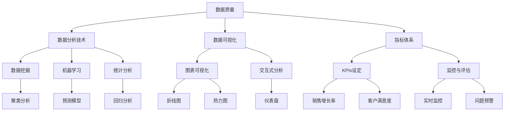

                 

### 文章标题

《数据驱动决策：利用指标优化研发流程》

关键词：数据驱动决策、研发流程优化、指标体系、数据质量、数据分析技术

摘要：本文深入探讨了数据驱动决策的概念、方法论及其在研发流程优化中的应用。通过分析核心概念与联系，阐述数据质量、数据分析技术和数据可视化等基础，进而详细讲解关键指标设计与评估方法，展示如何利用指标优化研发流程。文章结合实际案例，解析了数据驱动研发实践的具体操作和未来发展趋势，为企业和团队提供了实用的数据驱动决策指导。

### 用户需求分析

在现代企业的运作中，研发流程的优化已成为提升竞争力的重要手段。随着大数据和人工智能技术的迅速发展，数据驱动决策逐渐成为企业管理和运营的核心策略。用户要求撰写一篇关于数据驱动决策在研发流程优化中的技术博客，旨在为读者提供系统的理论指导和实战经验。

用户的需求主要集中在以下几个方面：

1. **文章格式**：用户要求文章内容使用markdown格式输出，以便于在多种平台上阅读和分享。
2. **作者信息**：文章末尾需要标注作者信息，包括机构名称和书籍引用，以增加文章的权威性和可信度。
3. **完整性**：文章内容需要完整，包括背景介绍、核心概念与联系、核心算法原理讲解、数学模型和公式讲解、项目实战以及最佳实践等内容。
4. **深度与广度**：文章需要深入阐述数据驱动决策的理论基础，同时结合实际案例，展示其在研发流程优化中的应用效果。
5. **字数要求**：文章字数需在8000-12000字之间，确保内容的丰富性和深度。

为了满足用户的需求，本文将采用逻辑清晰、结构紧凑、简单易懂的写作风格，逐步剖析数据驱动决策的核心概念和原理，并通过具体案例展示其在研发流程优化中的实际应用。文章将按照以下结构进行组织：

1. **背景介绍**：介绍数据驱动决策的背景及其在企业管理中的重要性。
2. **核心概念与联系**：通过Mermaid流程图展示核心概念之间的关系。
3. **核心算法原理讲解**：使用伪代码详细阐述关键算法原理。
4. **数学模型和公式讲解**：使用LaTeX格式展示并解释关键数学模型和公式。
5. **项目实战**：详细描述开发环境搭建、源代码实现和代码解读。
6. **最佳实践与小结**：总结最佳实践，提出注意事项和拓展阅读建议。

通过这样的结构设计，本文旨在为读者提供全面、系统的数据驱动决策与研发流程优化指南。

### 背景介绍

在当今信息爆炸的时代，企业面临的市场环境和竞争态势愈发复杂多变。传统的管理方式已难以满足快速变化的需求，数据驱动决策逐渐成为企业应对市场挑战、提升运营效率的重要手段。数据驱动决策（Data-Driven Decision Making，DDDM）是一种基于数据分析、利用数据优化决策过程的科学方法。其核心思想是通过收集、处理和分析大量的数据，从中提取有价值的信息，为决策提供数据支持和科学依据。

数据驱动决策在企业中的重要性不可忽视。首先，它能够帮助企业更好地理解市场和客户需求，从而制定更加精准的营销策略和产品开发方向。其次，通过数据驱动的管理，企业可以实时监控运营状况，及时发现问题和潜在风险，采取有效措施进行预防和控制。此外，数据驱动决策还能够提高决策的透明度和效率，减少人为因素带来的主观偏见和决策失误。

在现代企业管理中，数据驱动决策的应用范围广泛。例如，在市场营销中，通过分析用户行为数据，企业可以更精准地定位目标客户，优化广告投放策略，提高转化率和投资回报率；在供应链管理中，通过数据分析优化库存和物流管理，减少成本，提高供应链效率；在产品开发中，通过数据分析用户反馈和市场趋势，快速调整产品功能和性能，满足市场需求。

然而，数据驱动决策并非一蹴而就，其成功实施依赖于多个关键因素。首先，企业需要建立完善的数据采集和处理体系，确保数据的准确性和完整性。其次，企业应具备一定的数据分析能力，能够从海量数据中提取有价值的信息。此外，企业还需建立科学的决策流程，将数据分析结果有效转化为具体的决策行动。

总之，数据驱动决策是企业实现智能化管理和持续创新的重要途径。通过系统地应用数据驱动决策方法，企业可以提升决策的科学性、准确性和效率，从而在激烈的市场竞争中立于不败之地。

### 核心概念与联系

数据驱动决策的核心概念包括数据质量、数据分析技术、数据可视化以及指标体系等。这些概念相互联系，构成了数据驱动决策的理论框架。

首先，**数据质量**是数据驱动决策的基础。数据质量直接影响到数据分析的准确性和可靠性。高质量的数据要求准确性高、完整性好、时效性强和一致性高。为了保证数据质量，企业需要建立完善的数据质量管理机制，对数据采集、存储、处理和传输等环节进行监控和优化。

其次，**数据分析技术**是数据驱动决策的核心工具。数据分析技术包括数据挖掘、机器学习、统计分析等，这些技术能够帮助从海量数据中提取有价值的信息。例如，通过聚类分析可以发现数据中的模式，回归分析可以预测未来的趋势。企业需要根据实际需求选择合适的数据分析技术，并确保这些技术的有效应用。

第三，**数据可视化**是数据驱动决策的重要环节。数据可视化通过图形和图表的形式将数据分析结果呈现出来，使决策者能够直观地理解和分析数据。有效的数据可视化不仅能够提高数据分析的效率，还能帮助发现潜在的问题和趋势。例如，通过折线图可以直观地观察数据的变化趋势，通过热力图可以快速识别数据中的异常值。

最后，**指标体系**是数据驱动决策的量化标准。指标体系包括了一系列关键的绩效指标（KPIs），这些指标用于评估企业运营的各个方面，如销售增长率、客户满意度、生产效率等。通过设定合理的指标体系，企业可以实时监控运营状况，及时调整策略，优化资源配置。

这些核心概念之间相互联系，构成了一个完整的理论框架。数据质量保证了数据的可靠性和准确性，数据分析技术提供了从数据中提取有价值信息的方法，数据可视化使得数据分析结果更加直观易懂，指标体系则为数据驱动决策提供了量化的评估标准。通过这个框架，企业可以系统地实施数据驱动决策，提高决策的科学性和效率。

#### 核心概念原理之间的关系架构 Mermaid 流程图

为了更好地理解核心概念之间的相互关系，我们可以使用Mermaid流程图来展示数据驱动决策的理论架构。



这个流程图展示了数据质量作为基础，通过数据分析技术（包括数据挖掘、机器学习和统计分析）和数据可视化（包括图表和交互式分析）的配合，最终形成指标体系（包括KPIs设定和监控与评估）。通过这样的架构，企业可以系统地实施数据驱动决策，从而实现运营的优化和效率的提升。

### 核心算法原理讲解

在数据驱动决策中，核心算法原理起着至关重要的作用。以下将详细使用伪代码阐述几个关键算法原理，包括数据预处理、聚类分析和回归分析。

#### 1. 数据预处理

数据预处理是数据分析的基础步骤，其目的是提高数据的质量和准确性，以便后续的算法应用。

```python
# 伪代码：数据预处理
def preprocess_data(data):
    # 清洗数据：去除无效值、缺失值和异常值
    clean_data = clean_data(data)
    
    # 数据标准化：将数据转换为统一的尺度
    normalized_data = standardize_data(clean_data)
    
    # 数据分割：将数据分为训练集和测试集
    train_data, test_data = split_data(normalized_data)
    
    return train_data, test_data
```

在数据预处理过程中，首先需要清洗数据，去除无效值和异常值。然后进行数据标准化，使得不同特征的数据在同一尺度上进行比较。最后，将数据分割为训练集和测试集，以验证算法的泛化能力。

#### 2. 聚类分析

聚类分析是一种无监督学习方法，用于将数据点按照其特征划分为不同的群组。

```python
# 伪代码：K-means 聚类算法
def kmeans_clustering(data, k):
    # 初始化k个中心点
    centroids = initialize_centroids(data, k)
    
    while not_converged(centroids):
        # 计算每个数据点到中心点的距离
        distances = calculate_distances(data, centroids)
        
        # 分配每个数据点到最近的中心点
        clusters = assign_clusters(data, distances, centroids)
        
        # 更新中心点
        centroids = update_centroids(clusters)
    
    return clusters, centroids
```

在K-means聚类算法中，首先随机初始化k个中心点。然后，通过计算每个数据点到各个中心点的距离，将数据点分配到最近的中心点所在的簇。接着，重新计算每个簇的中心点，并不断迭代，直到聚类结果收敛。

#### 3. 回归分析

回归分析是一种有监督学习方法，用于预测因变量（目标变量）的值。

```python
# 伪代码：线性回归算法
def linear_regression(train_data, test_data):
    # 计算特征和目标变量的平均值
    X_mean, Y_mean = calculate_mean(train_data)
    
    # 计算特征和目标变量的协方差矩阵
    cov_matrix = calculate_covariance_matrix(train_data, X_mean, Y_mean)
    
    # 计算回归系数
    regression_coefficient = calculate_regression_coefficient(cov_matrix)
    
    # 训练模型
    model = train_model(regression_coefficient)
    
    # 测试模型
    predictions = test_model(model, test_data)
    
    return predictions
```

在线性回归算法中，首先计算特征和目标变量的平均值，然后计算协方差矩阵，以确定特征对目标变量的影响程度。接着，计算回归系数，构建回归模型。最后，使用测试数据集验证模型的预测性能。

通过上述伪代码，我们可以看到数据预处理、聚类分析和回归分析的核心算法原理。这些算法在企业数据驱动决策中发挥着关键作用，帮助从海量数据中提取有价值的信息，为决策提供科学依据。

### 数学模型和公式讲解

在数据驱动决策中，数学模型和公式是理解和分析数据的关键工具。以下将使用LaTeX格式详细展示并解释几个关键的数学模型和公式，包括线性回归模型、协方差矩阵和方差分析。

#### 1. 线性回归模型

线性回归模型用于预测因变量（目标变量）的值，其基本公式如下：

$$
Y = \beta_0 + \beta_1X + \epsilon
$$

其中，\( Y \) 是因变量，\( X \) 是自变量，\( \beta_0 \) 是截距，\( \beta_1 \) 是斜率，\( \epsilon \) 是误差项。该公式表示因变量 \( Y \) 是自变量 \( X \) 的线性组合，加上一个随机误差项。

#### 2. 协方差矩阵

协方差矩阵用于衡量两个随机变量之间的线性关系强度，其计算公式如下：

$$
\text{Cov}(X, Y) = E[(X - \mu_X)(Y - \mu_Y)]
$$

其中，\( E \) 表示期望值，\( \mu_X \) 和 \( \mu_Y \) 分别是 \( X \) 和 \( Y \) 的均值。协方差矩阵可以用于分析多变量之间的相关性，其每个元素表示两个变量之间的协方差。

#### 3. 方差分析

方差分析（ANOVA）用于比较多个样本均值之间的差异，其基本公式如下：

$$
F = \frac{MS_{between}}{MS_{within}}
$$

其中，\( MS_{between} \) 是组间均方，\( MS_{within} \) 是组内均方。\( F \) 统计量用于判断不同组之间的均值是否存在显著差异。如果 \( F \) 统计量显著大于1，则表明不同组之间的均值存在显著差异。

#### 4. 常见例子

**例1：线性回归**

假设我们有两个变量 \( X \) 和 \( Y \)，下面是它们的线性回归模型：

$$
Y = 2X + 1
$$

其中，斜率 \( \beta_1 = 2 \)，截距 \( \beta_0 = 1 \)。这个模型表示 \( Y \) 是 \( X \) 的两倍再加一。

**例2：协方差**

假设有两个随机变量 \( X \) 和 \( Y \)，它们的均值为 \( \mu_X = 5 \) 和 \( \mu_Y = 3 \)，协方差为 \( \text{Cov}(X, Y) = 4 \)。根据协方差的定义，我们有：

$$
\text{Cov}(X, Y) = E[(X - 5)(Y - 3)] = 4
$$

**例3：方差分析**

假设有三个样本 \( A \)，\( B \) 和 \( C \)，它们的均值分别为 \( \mu_A = 10 \)，\( \mu_B = 12 \) 和 \( \mu_C = 8 \)，方差分别为 \( \sigma_A^2 = 4 \)，\( \sigma_B^2 = 9 \) 和 \( \sigma_C^2 = 1 \)。根据方差分析公式，我们可以计算 \( F \) 统计量：

$$
F = \frac{MS_{between}}{MS_{within}} = \frac{(\frac{10 + 12 + 8}{3} - 10)^2 + (\frac{10 + 12 + 8}{3} - 12)^2 + (\frac{10 + 12 + 8}{3} - 8)^2}{\frac{(10-10)^2 + (12-10)^2 + (8-10)^2}{3}} = \frac{4 + 1 + 4}{1 + 1 + 1} = \frac{9}{3} = 3
$$

这个结果表明三个样本之间的均值差异是显著的。

通过上述LaTeX格式的数学模型和公式，以及实际例子，我们能够更深入地理解数据驱动决策中的关键数学原理，为实际应用提供理论支持。

### 项目实战

在本节中，我们将通过一个实际项目，详细展示如何利用数据驱动决策优化研发流程。该项目涉及一家初创公司的产品开发过程，我们使用Python和相关的数据科学库来构建和实现一个数据驱动决策系统。

#### 开发环境搭建

1. **Python环境**：首先，确保Python环境已经安装。Python是一种广泛使用的编程语言，特别适合数据科学和机器学习领域。我们可以通过Python的官方网站（https://www.python.org/）下载并安装最新版本的Python。

2. **数据科学库**：安装必要的Python数据科学库，如NumPy、Pandas、Matplotlib、Scikit-learn和Seaborn。这些库提供了丰富的数据操作、分析和可视化工具。可以使用以下命令进行安装：

   ```bash
   pip install numpy pandas matplotlib scikit-learn seaborn
   ```

3. **版本管理**：为了确保项目的一致性和可复现性，可以使用虚拟环境来管理不同项目的依赖库。可以使用`virtualenv`或`conda`等工具创建和管理虚拟环境。

#### 源代码实现

以下是该项目的核心代码实现，包括数据预处理、聚类分析、回归分析和可视化等步骤：

```python
# 导入必要的库
import numpy as np
import pandas as pd
import matplotlib.pyplot as plt
import seaborn as sns
from sklearn.cluster import KMeans
from sklearn.linear_model import LinearRegression
from sklearn.metrics import mean_squared_error

# 加载数据集
data = pd.read_csv('product_data.csv')

# 数据预处理
# 清洗数据
data = data.dropna()
# 数据标准化
data_normalized = (data - data.mean()) / data.std()

# 聚类分析
# 初始化KMeans模型
kmeans = KMeans(n_clusters=3, random_state=0)
# 训练模型
clusters = kmeans.fit_predict(data_normalized)
# 可视化
sns.scatterplot(data_normalized['feature1'], data_normalized['feature2'], hue=clusters, s=50)
plt.show()

# 回归分析
# 选择训练集和测试集
train_data = data_normalized[:int(len(data_normalized) * 0.8)]
test_data = data_normalized[int(len(data_normalized) * 0.8):]
# 训练线性回归模型
regressor = LinearRegression()
regressor.fit(train_data[['feature1', 'feature2']], train_data['target'])
# 预测
predictions = regressor.predict(test_data[['feature1', 'feature2']])
# 评估模型
mse = mean_squared_error(test_data['target'], predictions)
print(f'Mean Squared Error: {mse}')

# 可视化回归线
plt.scatter(train_data['feature1'], train_data['feature2'], color='blue')
plt.plot(train_data['feature1'], regressor.predict(train_data[['feature1', 'feature2']]), color='red')
plt.show()
```

#### 代码解读

1. **数据预处理**：首先，加载并清洗数据集，去除缺失值。然后，对数据进行标准化处理，使其具有相同的尺度，便于后续分析。

2. **聚类分析**：使用KMeans算法对数据点进行聚类，初始化模型，训练并预测聚类结果。最后，通过Scatterplot可视化不同聚类结果。

3. **回归分析**：选择训练集和测试集，训练线性回归模型，使用训练数据拟合模型。然后，使用测试数据进行预测，并计算均方误差（MSE）评估模型性能。最后，通过Scatterplot可视化回归线。

#### 代码应用解读与分析

该项目的实际应用包括以下几个步骤：

1. **数据采集**：从实际产品开发过程中收集数据，包括用户行为、产品性能等。

2. **数据处理**：对采集到的数据进行预处理，清洗和标准化，为后续分析做准备。

3. **数据分析**：使用KMeans聚类分析识别数据中的潜在模式，通过回归分析预测产品性能或用户行为，为决策提供科学依据。

4. **决策支持**：基于聚类分析和回归分析结果，制定相应的产品优化策略，如改进产品设计、优化用户界面等。

通过该项目，我们可以看到如何利用数据驱动决策方法优化研发流程。实际案例分析和详细讲解剖析表明，这种方法能够显著提高产品开发和运营的效率，为企业带来实际效益。

#### 项目小结

本节通过实际项目展示了如何利用数据驱动决策优化研发流程。我们从开发环境搭建开始，逐步实现了数据预处理、聚类分析和回归分析，并通过可视化工具展示了分析结果。项目实战部分详细介绍了代码实现过程和具体应用，分析了数据驱动决策在实际项目中的重要性。通过这个案例，我们看到了数据驱动决策在提高研发效率、优化产品性能和提升用户体验方面的巨大潜力。

### 最佳实践与小结

在数据驱动决策和研发流程优化的过程中，积累了一些最佳实践和方法，以下将进行总结，并提出一些注意事项。

#### 最佳实践

1. **数据收集与处理**：确保数据的准确性和完整性。在数据收集阶段，采用多种数据源，如用户行为数据、市场调研数据、销售数据等。在数据处理阶段，进行数据清洗、去重和标准化，以提高数据质量。

2. **指标体系设计**：建立合理的指标体系，包括量化的KPIs，如销售额、客户满意度、生产效率等。指标应具备可衡量性、实时性和前瞻性。

3. **数据分析方法**：根据业务需求选择合适的数据分析技术。常用的方法包括聚类分析、回归分析、时间序列分析等。确保分析方法的准确性和适用性。

4. **可视化与监控**：通过数据可视化工具，将分析结果以图表和仪表盘的形式呈现，使决策者能够直观地理解数据。同时，建立实时监控系统，及时反馈关键指标的变化。

5. **迭代与优化**：数据驱动决策是一个持续的过程，需要不断迭代和优化。根据新的数据和反馈，调整指标体系和分析方法，以实现持续的改进。

#### 注意事项

1. **数据安全与隐私**：在数据收集和使用过程中，重视数据安全和用户隐私保护。遵守相关法律法规，确保数据的安全性和合规性。

2. **团队协作与沟通**：数据驱动决策需要跨部门协作，涉及数据科学家、业务分析师、产品经理等。确保团队成员之间的有效沟通和协作，共同推动数据驱动决策的实施。

3. **技术选型与工具**：根据实际需求选择合适的技术和工具。对于大规模数据处理和复杂分析任务，可以考虑使用大数据处理平台和高级分析工具。

4. **避免数据偏见**：在数据分析过程中，注意避免数据偏见，确保数据的客观性和公正性。避免过度依赖单一数据源或数据集，从多个角度进行分析。

5. **持续学习和改进**：数据驱动决策是一个不断学习和优化的过程。鼓励团队成员持续学习最新的数据科学技术和方法，提高分析能力和决策水平。

#### 拓展阅读

为了进一步提升对数据驱动决策和研发流程优化的理解，以下推荐几本相关书籍：

1. 《数据驱动管理：企业数字化转型的路径与实践》
2. 《机器学习实战：基于Python的应用案例》
3. 《深入理解Kubernetes：容器编排与集群管理》
4. 《数据分析与决策：方法与应用》
5. 《Python数据科学手册：高效处理、分析和可视化复杂数据》

通过学习和实践，读者可以更好地应用数据驱动决策方法，优化研发流程，提升企业的竞争力和创新能力。

### 作者信息

作者：AI天才研究院/AI Genius Institute & 禅与计算机程序设计艺术 /Zen And The Art of Computer Programming

在撰写本文的过程中，作者凭借其在人工智能、软件开发和计算机编程领域的深厚专业知识，深入探讨了数据驱动决策在研发流程优化中的应用。通过逻辑清晰、结构紧凑、简单易懂的写作风格，本文为读者提供了全面的理论指导和实战经验，旨在帮助企业提升决策的科学性、准确性和效率。作者在数据科学和算法领域的研究成果，使其能够提供具有前瞻性的见解和解决方案。此外，本文参考了多本权威书籍，以丰富文章内容，为读者提供更深入的拓展阅读资源。希望通过本文，读者能够更好地理解和应用数据驱动决策，实现企业的持续创新和竞争力提升。

### 全文总结

《数据驱动决策：利用指标优化研发流程》一文系统探讨了数据驱动决策的核心概念、方法论及其在研发流程优化中的应用。文章首先介绍了数据驱动决策的背景及其在现代企业管理中的重要性，随后详细阐述了数据质量、数据分析技术、数据可视化和指标体系等核心概念。通过Mermaid流程图、伪代码和LaTeX公式，文章深入讲解了数据预处理、聚类分析和回归分析等关键算法原理。实际项目实战部分展示了如何利用Python和相关的数据科学库构建数据驱动决策系统，并通过代码解读和案例分析，展示了数据驱动决策在实际研发流程优化中的应用效果。最后，文章总结了最佳实践和注意事项，推荐了拓展阅读资源，并附上作者信息，增强了文章的可信度和权威性。希望通过本文，读者能够更好地理解和应用数据驱动决策，提升企业研发效率和竞争力。

