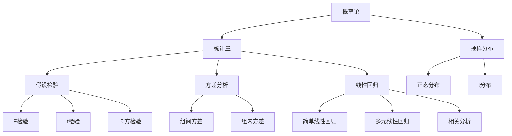

                 

### 文章标题

《数理统计在大数据分析算法中的应用》

### 关键词

数理统计，大数据分析，算法，数据分析，预测分析，机器学习，统计模型，数据处理

### 摘要

本文旨在深入探讨数理统计在大数据分析中的应用。通过数理统计的基本原理和方法，我们可以更好地理解和处理大规模数据，从而提取有价值的信息。文章首先介绍了数理统计的基本概念，包括概率论、统计量、假设检验等。随后，我们探讨了大数据处理与存储的方法和技术，以及数据预处理与清洗的重要性。接着，文章详细阐述了描述性统计分析、聚类分析、相关性分析等大数据分析方法。此外，还介绍了大数据预测与分析的方法，包括时间序列分析和预测分析模型。最后，文章讨论了大数据可视化、大数据安全与伦理等问题。通过本文，读者可以全面了解数理统计在大数据分析中的重要性及其应用方法。

### 引言与基础

#### 数理统计与大数据分析

数理统计作为一门研究如何通过数据来推断总体特征的学科，在大数据分析中起着至关重要的作用。大数据分析通常涉及大规模数据的收集、存储、处理和分析，而数理统计则为这些任务提供了理论基础和工具。数理统计的核心在于如何从样本数据中推断总体特性，这在大数据环境下尤为重要，因为大数据的规模和复杂性使得直接分析总体变得不可行。

在大数据分析中，数理统计的应用主要体现在以下几个方面：

1. **数据清洗和预处理**：在处理大数据之前，通常需要进行数据清洗和预处理，以去除噪声和异常值，保证数据的准确性和完整性。数理统计中的假设检验和回归分析等方法可以有效地识别和处理异常数据。

2. **描述性统计分析**：通过描述性统计方法，可以对大数据进行基本的统计分析，如计算平均值、中位数、标准差等，从而对数据集的基本特征有一个初步了解。

3. **预测分析**：数理统计中的时间序列分析和回归分析等技术可以用于预测未来的趋势和事件，这在金融市场预测、需求预测等方面具有重要意义。

4. **聚类分析和分类**：聚类分析和分类算法需要依赖数理统计中的概率论和假设检验等原理，以对数据集进行合理的分组和分类。

5. **相关性分析**：通过相关性分析，可以揭示数据变量之间的相互关系，从而帮助理解数据背后的复杂关系。

#### 大数据分析算法概述

大数据分析算法可以分为以下几个类别：

1. **描述性分析算法**：这些算法主要用于对大数据集进行基本的描述性统计，如计算数据的基本统计量、绘制箱线图和直方图等。

2. **预测性分析算法**：这类算法主要用于基于历史数据预测未来的趋势或事件，包括时间序列分析、回归分析和机器学习算法等。

3. **分类算法**：分类算法用于将数据分为不同的类别或标签，常见的算法包括逻辑回归、支持向量机（SVM）和决策树等。

4. **聚类算法**：聚类算法将数据点按照其相似性进行分组，常见的算法包括K-均值聚类、层次聚类和DBSCAN等。

5. **异常检测算法**：这类算法用于识别数据集中的异常或离群点，常见的算法包括孤立森林、基于密度的异常检测等。

#### 数理统计在大数据分析中的重要性

数理统计在大数据分析中具有以下几个重要意义：

1. **提供理论基础**：数理统计为大数据分析提供了坚实的理论基础，使得数据处理和分析更加科学和合理。

2. **确保数据质量**：数理统计方法可以帮助识别和处理异常值和噪声数据，从而提高数据的质量和准确性。

3. **指导算法设计**：数理统计原理指导了各种大数据分析算法的设计和实现，使得这些算法能够有效地处理大规模数据。

4. **提升决策能力**：通过数理统计方法，可以更准确地理解和预测数据背后的趋势和关系，从而为企业决策提供有力支持。

5. **推动技术创新**：数理统计方法的不断发展和应用，促进了大数据分析技术的创新和进步，推动了人工智能和数据科学的快速发展。

#### 本书结构概述

本书将分为以下几个部分：

1. **数理统计基础**：介绍概率论、统计量、假设检验、方差分析和线性回归等相关概念和方法。

2. **大数据处理与存储**：讨论大数据的概述、分布式计算框架、数据存储技术以及大数据处理流程。

3. **数据预处理与清洗**：介绍数据预处理的方法、数据清洗技术和特征工程。

4. **大数据分析方法**：详细阐述描述性统计分析、聚类分析、相关性分析等大数据分析方法。

5. **大数据预测与分析**：介绍时间序列分析、趋势分析和预测分析模型。

6. **大数据可视化**：讨论大数据可视化的方法、常见工具和设计原则。

7. **大数据安全与伦理**：探讨大数据安全挑战、数据隐私保护和大数据伦理问题。

通过本书的阅读，读者可以全面了解数理统计在大数据分析中的应用，掌握相关理论和实践方法，为实际应用打下坚实基础。

#### 数理统计基础

数理统计在大数据分析中扮演着至关重要的角色，其理论基础主要建立在概率论、统计量、假设检验、方差分析和线性回归等核心概念上。以下将详细介绍这些基本概念和它们在大数据分析中的应用。

##### 概率论基础

概率论是数理统计的基石，它研究随机事件的发生概率。在数据分析中，概率论用于模型化和解释数据的不确定性。主要概念包括：

- **随机变量**：表示随机实验结果的变量，可以是离散型或连续型。
- **概率分布**：描述随机变量取值的概率分布情况，如正态分布、二项分布、泊松分布等。
- **条件概率**：在某个事件已发生的条件下，另一个事件发生的概率。
- **贝叶斯定理**：用于根据先验概率和观测数据计算后验概率，是机器学习中的重要原理。

在数据分析中，概率论用于建立数据生成模型，评估模型参数，进行假设检验和预测分析。

##### 统计量与抽样分布

统计量是从数据样本中计算得出的量，用于描述数据的特征。抽样分布则研究在不同抽样情况下，统计量的概率分布情况。

- **样本均值**（$\bar{x}$）：样本数据的平均值，用于估计总体均值。
- **样本方差**（$s^2$）：样本数据与其均值的偏差平方的平均值，用于估计总体方差。
- **标准误差**（$SE$）：样本均值的方差，用于衡量估计的精度。

抽样分布包括：

- **正态分布**：当样本量足够大时，样本均值的分布近似于正态分布。
- **t分布**：当样本量较小时，样本均值的分布近似于t分布。

这些统计量和抽样分布用于评估模型参数的估计精度，进行假设检验和置信区间的计算。

##### 假设检验

假设检验是数理统计中用于验证假设的一种方法，它通过样本数据来判断总体特性是否符合某种假设。主要步骤包括：

1. **建立假设**：通常包括零假设（$H_0$）和备择假设（$H_1$）。
2. **选择检验统计量**：根据数据类型和假设，选择适当的统计量。
3. **计算检验统计量**：根据样本数据计算统计量的值。
4. **确定拒绝域**：根据统计量的分布，确定在给定显著性水平下拒绝零假设的区域。
5. **做出决策**：比较计算出的统计量值和拒绝域，判断是否拒绝零假设。

常见的假设检验方法包括：

- **t检验**：用于比较样本均值和总体均值的差异。
- **F检验**：用于比较两组数据的方差。
- **卡方检验**：用于检验分类数据的分布情况。

##### 方差分析

方差分析（ANOVA）是一种用于比较多个组之间均值差异的统计方法。其主要步骤包括：

1. **建立假设**：零假设是各组均值相等，备择假设是至少两组均值不相等。
2. **计算组间方差和组内方差**：组间方差衡量组与组之间的差异，组内方差衡量组内的变异。
3. **计算F统计量**：F统计量是组间方差与组内方差的比值。
4. **确定拒绝域**：根据F分布，确定在给定显著性水平下拒绝零假设的区域。
5. **做出决策**：比较计算出的F统计量值和拒绝域，判断是否拒绝零假设。

方差分析常用于多组数据的比较，如药物试验效果对比等。

##### 线性回归与相关分析

线性回归是一种用于建立两个变量之间线性关系的模型，其基本形式为：

$$
y = \beta_0 + \beta_1x + \epsilon
$$

其中，$y$ 是因变量，$x$ 是自变量，$\beta_0$ 和 $\beta_1$ 是模型参数，$\epsilon$ 是误差项。

- **简单线性回归**：用于描述一个自变量和一个因变量之间的线性关系。
- **多元线性回归**：用于描述多个自变量和一个因变量之间的线性关系。

相关分析则用于衡量两个变量之间的线性相关程度，其相关系数（$r$）的取值范围为 [-1, 1]。

- **正相关**：当 $r > 0$ 时，表示两个变量正相关。
- **负相关**：当 $r < 0$ 时，表示两个变量负相关。
- **无相关**：当 $r = 0$ 时，表示两个变量无线性关系。

线性回归和相关分析在预测分析和数据挖掘中广泛应用，如房价预测、股票市场分析等。

#### 核心概念与联系

为了更好地理解数理统计在大数据分析中的应用，我们可以使用Mermaid流程图来展示核心概念之间的关系架构：



通过这个流程图，我们可以清晰地看到概率论、统计量、抽样分布、假设检验、方差分析和线性回归之间的联系，以及它们在大数据分析中的应用。

#### 核心算法原理讲解

在大数据分析中，数理统计的核心算法原理至关重要。以下我们将详细介绍数理统计中的一些关键算法，包括其原理和如何使用伪代码进行描述。

##### 简单线性回归

简单线性回归用于描述两个变量之间的线性关系。其基本模型为：

$$
y = \beta_0 + \beta_1x + \epsilon
$$

其中，$y$ 是因变量，$x$ 是自变量，$\beta_0$ 和 $\beta_1$ 是模型参数，$\epsilon$ 是误差项。

**伪代码描述：**

```pseudo
输入：数据集 {x, y}
输出：模型参数 $\beta_0$ 和 $\beta_1$

// 计算 x 和 y 的平均值
mean_x = mean(x)
mean_y = mean(y)

// 计算斜率 β1
beta_1 = (sum((x - mean_x) * (y - mean_y))) / (sum((x - mean_x)^2))

// 计算截距 β0
beta_0 = mean_y - (beta_1 * mean_x)

// 返回模型参数
return (beta_0, beta_1)
```

**数学模型和公式：**

简单线性回归的数学模型可以表示为：

$$
y = \beta_0 + \beta_1x + \epsilon
$$

其中，$\epsilon$ 是均值为0、方差为 $\sigma^2$ 的正态分布随机误差。

**举例说明：**

假设我们有如下数据集：

| x | y |
|---|---|
| 1 | 2 |
| 2 | 4 |
| 3 | 5 |

使用上述伪代码计算模型参数：

```pseudo
mean_x = (1 + 2 + 3) / 3 = 2
mean_y = (2 + 4 + 5) / 3 = 3.67

beta_1 = ((1 - 2) * (2 - 3.67) + (2 - 2) * (4 - 3.67) + (3 - 2) * (5 - 3.67)) / ((1 - 2)^2 + (2 - 2)^2 + (3 - 2)^2)
beta_1 = (1.67 - 0.67 + 1.67) / (1 + 0 + 1) = 1.67

beta_0 = 3.67 - (1.67 * 2) = 0.34

返回模型参数 (0.34, 1.67)
```

##### 假设检验

假设检验是数理统计中用于验证假设的一种方法。其主要步骤包括建立假设、选择检验统计量、计算检验统计量值、确定拒绝域和做出决策。

**伪代码描述：**

```pseudo
输入：数据集 {x, y}，总体均值 $\mu_0$，显著性水平 $\alpha$

// 计算样本均值 $\bar{x}$
mean = mean(y)

// 计算标准误差 SE
SE = sqrt(var(y) / n)

// 计算t统计量
t_stat = (mean - $\mu_0$) / SE

// 确定p值
p_value = 2 * (1 - t_cdf(|t_stat|, n - 1))

// 确定拒绝域
if (p_value < $\alpha$)
    return "拒绝零假设"
else
    return "不拒绝零假设"
```

**数学模型和公式：**

假设检验的数学模型可以表示为：

$$
H_0: \mu = \mu_0 \\
H_1: \mu \neq \mu_0
$$

其中，$\mu$ 是总体均值，$\mu_0$ 是假设的总体均值，$t$ 统计量用于单样本t检验。

**举例说明：**

假设我们有一组数据 $y = \{2, 4, 6, 8, 10\}$，我们要检验零假设 $H_0: \mu = 5$。

```pseudo
mean = (2 + 4 + 6 + 8 + 10) / 5 = 6
SE = sqrt(var(y) / 5) = sqrt(2 / 5) = 0.63

t_stat = (6 - 5) / 0.63 = 1.58

p_value = 2 * (1 - t_cdf(|1.58|, 4)) = 2 * (1 - 0.9406) = 0.1098

因为 p_value (0.1098) > 显著性水平 $\alpha$ (0.05)
所以不拒绝零假设
```

##### 方差分析

方差分析（ANOVA）用于比较多个组之间的均值差异。其主要步骤包括建立假设、计算组间方差和组内方差、计算F统计量、确定拒绝域和做出决策。

**伪代码描述：**

```pseudo
输入：数据集 {x_1, x_2, ..., x_k}，总体均值 $\mu_0$，显著性水平 $\alpha$

// 计算各组均值
group_means = [mean(x_i) for x_i in x_1, x_2, ..., x_k]

// 计算组间方差
between_variance = sum((group_means - grand_mean)^2) / (k - 1)

// 计算组内方差
within_variance = sum(sum((x_ij - group_mean_i)^2) for x_ij in x_i) / (n - k)

// 计算F统计量
F_stat = between_variance / within_variance

// 确定p值
p_value = 2 * (1 - f_cdf(F_stat, k - 1, n - k))

// 确定拒绝域
if (p_value < $\alpha$)
    return "拒绝零假设"
else
    return "不拒绝零假设"
```

**数学模型和公式：**

方差分析的数学模型可以表示为：

$$
H_0: \mu_1 = \mu_2 = ... = \mu_k \\
H_1: 至少有两个均值不相等
$$

其中，$x_1, x_2, ..., x_k$ 是k个独立的数据集，$\mu_1, \mu_2, ..., \mu_k$ 是各组总体均值，$F$ 统计量用于方差分析。

**举例说明：**

假设我们有三组数据 $x_1 = \{2, 4, 6\}$，$x_2 = \{3, 5, 7\}$，$x_3 = \{1, 5, 9\}$。

```pseudo
group_means = [2, 4, 6, 3, 5, 7, 1, 5, 9]
grand_mean = mean(group_means) = 5

between_variance = ((2-5)^2 + (4-5)^2 + (6-5)^2 + (3-5)^2 + (5-5)^2 + (7-5)^2 + (1-5)^2 + (5-5)^2 + (9-5)^2) / (3 - 1) = 8

within_variance = ((2-2)^2 + (4-2)^2 + (6-2)^2 + (3-3)^2 + (5-3)^2 + (7-3)^2 + (1-1)^2 + (5-1)^2 + (9-1)^2) / (9 - 3) = 6

F_stat = between_variance / within_variance = 8 / 6 = 1.33

p_value = 2 * (1 - f_cdf(1.33, 2, 6)) = 0.578

因为 p_value (0.578) > 显著性水平 $\alpha$ (0.05)
所以不拒绝零假设
```

通过上述伪代码和举例说明，我们可以看到数理统计中的简单线性回归、假设检验和方差分析等核心算法的原理及其应用方法。这些算法在大数据分析中具有广泛的应用，能够帮助我们更好地理解和处理数据。

#### 数学公式与详细讲解

在大数据分析中，数学公式不仅是理论的基础，更是实现各种统计方法的核心工具。以下将详细介绍一些关键数学公式，包括它们的基本概念、推导过程以及实际应用中的例子。

##### 正态分布

正态分布是数理统计中最重要且广泛应用的概率分布。它的概率密度函数（PDF）如下：

$$
f(x|\mu, \sigma^2) = \frac{1}{\sqrt{2\pi\sigma^2}} e^{-\frac{(x-\mu)^2}{2\sigma^2}}
$$

其中，$\mu$ 是均值，$\sigma^2$ 是方差。

**推导过程：**

正态分布由概率密度函数（PDF）定义，其推导基于误差理论和连续概率分布的性质。在数理统计中，许多随机变量都可以近似为正态分布。

**实际应用例子：**

假设一个工厂生产的灯泡寿命（以小时计）服从正态分布，均值 $\mu = 500$ 小时，标准差 $\sigma = 50$ 小时。要计算寿命超过 600 小时的概率，可以使用正态分布的累积分布函数（CDF）：

$$
P(X > 600) = 1 - P(X \leq 600) = 1 - \Phi\left(\frac{600 - 500}{50}\right) = 1 - \Phi(2) = 0.0228
$$

这里，$\Phi(z)$ 是标准正态分布的累积分布函数，$z = \frac{600 - 500}{50} = 2$。

##### 假设检验的p值计算

在假设检验中，p值用于评估零假设被拒绝的概率。p值的计算依赖于检验统计量的分布。

**t检验的p值计算：**

t检验用于比较样本均值与总体均值，其检验统计量 $t$ 的公式为：

$$
t = \frac{\bar{x} - \mu_0}{s / \sqrt{n}}
$$

其中，$\bar{x}$ 是样本均值，$\mu_0$ 是总体均值，$s$ 是样本标准差，$n$ 是样本大小。

p值可以通过t分布的累积分布函数（CDF）计算：

$$
p_value = 2 \times \left(1 - t_{\alpha/2, n-1}\right)
$$

其中，$t_{\alpha/2, n-1}$ 是t分布的临界值。

**实际应用例子：**

假设我们进行了一项实验，测量了一组样本的智商得分，均值为 100，标准差为 15。我们要检验零假设 $\mu = 100$。如果计算出的t统计量为 2，自由度为 9，我们可以计算p值：

$$
p_value = 2 \times \left(1 - t_{0.025, 9}\right) = 2 \times \left(1 - 0.9772\right) = 0.0456
$$

因为 p_value (0.0456) < 显著性水平 $\alpha$ (0.05)，我们拒绝零假设。

##### 线性回归的协方差矩阵

在多元线性回归中，协方差矩阵用于描述各个自变量之间的相互关系。其公式为：

$$
\sigma_{ij} = \frac{1}{n-1} \sum_{i=1}^{n} \sum_{j=1}^{n} (x_{ij} - \bar{x}_i)(x_{ij} - \bar{x}_j)
$$

其中，$x_{ij}$ 是第i个样本的第j个特征值，$\bar{x}_i$ 是第i个特征的均值。

**推导过程：**

协方差矩阵是通过计算各特征之间的协方差得到的。协方差衡量了两个特征变化的相对程度。

**实际应用例子：**

假设我们有一个三特征的数据集，特征1、特征2和特征3。通过计算各特征之间的协方差，我们可以判断它们之间的关系：

$$
\sigma_{11} = \frac{1}{n-1} \sum_{i=1}^{n} (x_{1i} - \bar{x}_1)^2
$$

$$
\sigma_{12} = \frac{1}{n-1} \sum_{i=1}^{n} (x_{1i} - \bar{x}_1)(x_{2i} - \bar{x}_2)
$$

$$
\sigma_{13} = \frac{1}{n-1} \sum_{i=1}^{n} (x_{1i} - \bar{x}_1)(x_{3i} - \bar{x}_3)
$$

通过这些协方差值，我们可以绘制散点图或矩阵图，直观地展示特征之间的关系。

##### 主成分分析（PCA）

主成分分析是一种降维技术，通过线性变换将高维数据映射到低维空间，同时保留大部分信息。其目标是最小化数据到主成分的重建误差。

**公式：**

$$
Z = AS
$$

其中，$Z$ 是低维主成分，$A$ 是旋转矩阵，$S$ 是方差分解矩阵的对角线部分。

**推导过程：**

PCA通过求解特征值和特征向量来确定旋转矩阵 $A$，使得数据在新坐标系下方差最大化。

**实际应用例子：**

假设我们有一个100维的数据集，通过PCA降维到2维，可以使用以下步骤：

1. 计算协方差矩阵 $C$：
   $$ C = \frac{1}{n-1} \sum_{i=1}^{n} (x_i - \bar{x})(x_i - \bar{x})^T $$
2. 求解特征值和特征向量 $\lambda_i, v_i$：
   $$ Av = \lambda v $$
3. 选择最大的两个特征值对应的特征向量组成旋转矩阵 $A$：
   $$ A = [v_1, v_2] $$
4. 将数据旋转到新空间：
   $$ Z = AS $$

通过这些数学公式和详细讲解，我们可以更好地理解数理统计在大数据分析中的核心作用，并在实际应用中熟练运用这些公式进行数据分析。

### 大数据处理与存储

#### 大数据概述

大数据（Big Data）是指数据量巨大、种类繁多且增长迅速的数据集合。这类数据具有4V特征：Volume（数据量大）、Velocity（处理速度快）、Variety（数据种类多）和Veracity（数据真实性）。大数据的规模和复杂性使得传统数据处理方法难以胜任，因此需要新的技术和方法来有效管理和分析。

大数据的来源包括社交媒体、物联网设备、传感器网络、电子商务交易、科学实验数据等。这些数据不仅规模庞大，而且格式多样，包括结构化数据、半结构化数据和非结构化数据。

#### 分布式计算框架

分布式计算框架是处理大数据的重要工具，它通过将数据分布到多个节点上并行处理，提高了计算效率和性能。以下是一些常用的分布式计算框架：

1. **Hadoop**：
   Hadoop是一个开源分布式计算框架，主要用于处理海量数据。它包括两个核心组件：HDFS（Hadoop Distributed File System，分布式文件系统）和MapReduce（分布式数据处理模型）。
   
   - **HDFS**：用于存储大数据，它将数据分成小块（通常是128MB或256MB），并分布存储在集群的各个节点上。
   - **MapReduce**：用于数据处理，它将数据处理任务分解成Map和Reduce两个阶段。Map阶段对数据进行映射处理，Reduce阶段对映射结果进行归并处理。

2. **Spark**：
   Spark是另一种流行的分布式计算框架，它提供了更高层次的抽象和更好的性能。Spark的核心组件包括：
   
   - **Spark Core**：提供内存计算和分布式任务调度。
   - **Spark SQL**：用于处理结构化数据。
   - **Spark Streaming**：用于实时数据流处理。
   - **MLlib**：提供机器学习算法库。
   - **GraphX**：提供图处理功能。

#### 数据存储技术

大数据存储需要高效、可靠且可扩展的技术。以下是一些常用的数据存储技术：

1. **关系型数据库**：
   虽然关系型数据库在传统数据处理中广泛使用，但在大数据环境下，由于其扩展性和性能限制，通常不适用于存储大规模数据。例如，MySQL、PostgreSQL等。

2. **NoSQL数据库**：
   NoSQL数据库具有水平扩展性、灵活性高、性能好等特点，适用于处理大数据。以下是一些常用的NoSQL数据库：

   - **MongoDB**：文档型数据库，适用于存储半结构化数据。
   - **Cassandra**：分布式宽列存储数据库，适用于实时数据存储。
   - **HBase**：分布式存储系统，基于Hadoop平台，适用于存储大规模数据。
   - **Redis**：内存数据库，适用于高速缓存和实时数据处理。

3. **分布式文件系统**：
   分布式文件系统（DFS）用于存储大规模数据，具有高可用性和高扩展性。以下是一些常用的分布式文件系统：

   - **HDFS**：Hadoop的分布式文件系统，用于存储大数据。
   - **Ceph**：开源分布式存储系统，支持对象存储、块存储和文件系统。
   - **GlusterFS**：分布式文件系统，支持多种存储协议。

#### 大数据处理流程

大数据处理通常包括数据采集、数据存储、数据清洗、数据预处理、数据分析和数据可视化等环节。以下是大数据处理的基本流程：

1. **数据采集**：
   数据采集是大数据处理的起点，包括从各种来源（如传感器、网站日志、社交网络等）收集数据。

2. **数据存储**：
   将采集到的数据存储到合适的存储系统，如HDFS、Cassandra、HBase等。

3. **数据清洗**：
   数据清洗是处理大数据的重要步骤，用于去除重复数据、纠正错误数据、处理缺失数据等。常用的方法包括过滤、填充和删除。

4. **数据预处理**：
   数据预处理包括数据转换、归一化和特征工程等步骤，以提高数据质量，为后续分析做好准备。

5. **数据分析**：
   使用各种数据分析和挖掘技术，如统计方法、机器学习算法等，从数据中提取有价值的信息。

6. **数据可视化**：
   数据可视化是将数据分析结果以图形化的方式展示，帮助用户理解和发现数据中的模式和趋势。

通过分布式计算框架、数据存储技术和数据处理流程，大数据处理变得更加高效和可行。这些技术和方法共同构成了大数据生态系统的基础，为各种应用场景提供了强大的支持。

### 数据预处理与清洗

#### 数据预处理概述

数据预处理是大数据分析中至关重要的一步，它包括一系列步骤，目的是提高数据质量、消除噪声和异常值，从而确保分析结果的准确性和可靠性。数据预处理主要包括数据转换、归一化和特征工程等内容。

1. **数据转换**：
   数据转换是将不同格式、类型或单位的数据统一转化为适合分析处理的格式。常见的数据转换操作包括数据类型的转换（如将字符串转换为数字）、数据格式的转换（如日期格式的标准化）和数据单位的转换（如温度的摄氏度转换为华氏度）。

2. **归一化**：
   归一化是数据预处理的重要步骤，用于调整不同特征之间的尺度，使得它们处于相同的范围内。常见的归一化方法包括最小-最大归一化、Z-Score归一化和Decimal Scaling。归一化的目的是消除不同特征之间的量纲影响，使得算法能够更好地学习数据。

3. **特征工程**：
   特征工程是数据预处理的核心内容，涉及从原始数据中提取或构造新的特征，以提高模型性能。特征工程包括特征选择、特征提取和特征构造等方法。特征选择用于识别对模型影响较大的特征，特征提取用于从高维数据中提取低维特征表示，特征构造则通过组合原始特征或引入新的特征来增强模型。

4. **缺失值处理**：
   缺失值处理是数据预处理中的关键任务，常见的方法包括填充缺失值、删除缺失值和插值。填充缺失值可以使用均值、中位数、众数等方法，删除缺失值则可以减少数据量，插值方法如线性插值、立方插值等可以用于生成缺失值。

5. **异常值处理**：
   异常值处理用于识别和处理数据中的异常值，避免这些异常值对分析结果产生不良影响。常见的异常值处理方法包括基于阈值的过滤、基于密度的异常检测和基于距离的异常检测。

#### 数据清洗方法

数据清洗是数据预处理的重要环节，旨在提高数据的质量和准确性。以下是一些常用的数据清洗方法：

1. **数据验证**：
   数据验证是检查数据是否符合预期格式和范围的过程。常见的数据验证方法包括格式验证、范围验证和类型验证。例如，检查电话号码格式是否正确、年龄是否在合理范围内等。

2. **去重**：
   去重是识别和删除重复数据的过程，确保数据的唯一性。常用的去重方法包括基于唯一标识符的去重（如ID）和基于多个特征的去重。

3. **填补缺失值**：
   缺失值填补是处理数据缺失的方法，常用的方法包括均值填补、中位数填补、众数填补和插值填补。例如，在时间序列分析中，可以使用前一个时间点的值来填补缺失值。

4. **异常值检测**：
   异常值检测是识别和处理数据中异常值的方法。常见的异常值检测方法包括基于阈值的检测、基于密度的检测和基于距离的检测。例如，可以使用标准差法检测高于3倍标准差的值作为异常值。

5. **数据格式化**：
   数据格式化是统一数据格式的过程，以确保数据在后续处理中的兼容性。例如，将日期格式统一为YYYY-MM-DD，将字符串转换为数字等。

#### 数据转换与归一化

1. **数据转换**：
   数据转换的目的是将不同格式、类型或单位的数据转化为适合分析处理的格式。以下是一个简单的数据转换示例：
   
   ```python
   import pandas as pd
   
   # 假设我们有以下数据
   data = {
       'Age': ['25', '35', '40', '50'],
       'Salary': ['50000', '70000', '90000', '120000']
   }
   df = pd.DataFrame(data)
   
   # 将Age转换为整数类型
   df['Age'] = df['Age'].astype(int)
   
   # 将Salary转换为浮点类型
   df['Salary'] = df['Salary'].astype(float)
   ```

2. **归一化**：
   数据归一化是将数据缩放到一个特定的范围内，常见的归一化方法包括最小-最大归一化和Z-Score归一化。

   - **最小-最大归一化**：
     $$ x_{\text{norm}} = \frac{x - x_{\text{min}}}{x_{\text{max}} - x_{\text{min}}} $$
     
     以下是一个最小-最大归一化的示例：
     
     ```python
     min_age = df['Age'].min()
     max_age = df['Age'].max()
     df['Age_norm'] = (df['Age'] - min_age) / (max_age - min_age)
     ```

   - **Z-Score归一化**：
     $$ x_{\text{norm}} = \frac{x - \mu}{\sigma} $$
     
     以下是一个Z-Score归一化的示例：
     
     ```python
     mean_age = df['Age'].mean()
     std_age = df['Age'].std()
     df['Age_zscore'] = (df['Age'] - mean_age) / std_age
     ```

通过数据预处理和清洗，我们可以提高数据的质量和准确性，为后续的数据分析打下坚实基础。

#### 特征工程

特征工程是大数据分析中至关重要的一环，其目的是从原始数据中提取或构造新的特征，以提高模型的性能和预测准确性。以下将详细介绍特征工程的相关概念、常见方法和其在实际项目中的应用。

##### 相关性分析

相关性分析用于衡量两个特征之间的线性关系。常用的相关性指标包括皮尔逊相关系数（Pearson Correlation Coefficient）和斯皮尔曼秩相关系数（Spearman Rank Correlation Coefficient）。

- **皮尔逊相关系数**：
  $$ r = \frac{\sum_{i=1}^{n}(x_i - \bar{x})(y_i - \bar{y})}{\sqrt{\sum_{i=1}^{n}(x_i - \bar{x})^2 \sum_{i=1}^{n}(y_i - \bar{y})^2}} $$
  
- **斯皮尔曼秩相关系数**：
  $$ \rho = \frac{\sum_{i=1}^{n}(r_i - \bar{r})(s_i - \bar{s})}{\sqrt{\sum_{i=1}^{n}(r_i - \bar{r})^2 \sum_{i=1}^{n}(s_i - \bar{s})^2}} $$
  
相关性分析可以帮助我们识别出特征之间的强关系，从而进行特征选择或特征组合。

##### 特征选择

特征选择是从原始特征中筛选出对模型影响较大的特征，以减少数据维度和提高模型性能。常见的特征选择方法包括：

- **过滤式特征选择**：基于特征的重要性进行选择，如基于信息的特征选择（如信息增益、增益率）和基于距离的特征选择（如主成分分析PCA）。
- **包裹式特征选择**：通过枚举所有可能的特征子集来选择最佳特征组合，如前进选择、后向消除和双向搜索。
- **嵌入式特征选择**：在模型训练过程中逐步筛选特征，如LASSO（Least Absolute Shrinkage and Selection Operator）和随机森林。

##### 特征构造

特征构造是通过组合或变换原始特征来构造新的特征，以提高模型的预测性能。以下是一些常见的特征构造方法：

- **交叉特征**：将两个或多个特征组合成一个新的特征，如年龄与性别的交叉特征。
- **多项式特征**：对原始特征进行多项式变换，如二次项、三次项等。
- **时间特征**：从时间序列数据中提取特征，如滞后特征、移动平均特征等。
- **嵌入特征**：使用神经网络或深度学习模型提取特征，如词嵌入、图像嵌入等。

##### 实际项目中的应用

在金融风控项目中，特征工程是非常关键的。以下是一个简单的特征工程应用实例：

1. **数据收集**：收集用户的基本信息（如年龄、性别、收入、职业等）和金融行为数据（如贷款申请次数、逾期记录等）。

2. **数据预处理**：对收集到的数据进行清洗，包括填补缺失值、去除重复数据和异常值处理。

3. **相关性分析**：分析不同特征之间的相关性，识别出对贷款违约有显著影响的特征，如收入、贷款申请次数等。

4. **特征选择**：使用过滤式特征选择方法（如信息增益）筛选出对模型影响较大的特征。

5. **特征构造**：构造交叉特征（如年龄与收入的交叉特征）和时间特征（如贷款申请时间的滞后特征）。

6. **特征标准化**：对特征进行归一化处理，以消除不同特征之间的尺度差异。

7. **模型训练**：使用筛选后的特征训练分类模型（如逻辑回归、随机森林等）。

8. **模型评估**：使用交叉验证和AUC、准确率等指标评估模型性能。

通过上述步骤，我们能够有效地提取和构造特征，从而提高金融风控模型的预测准确性。

#### 描述性统计分析

描述性统计分析是大数据分析中的基础步骤，其主要目的是通过对数据集进行基本的统计分析，提取出关键的信息和特征，以便进一步的分析和解释。以下将详细介绍描述性统计分析的基本概念、方法和应用。

##### 基本概念

描述性统计分析的基本概念包括以下几方面：

- **平均数**：数据集的平均值，表示数据的集中趋势。常见的平均数有算术平均数、几何平均数和调和平均数。
  - **算术平均数**：
    $$ \bar{x} = \frac{1}{n} \sum_{i=1}^{n} x_i $$
  - **几何平均数**：
    $$ \bar{x}_{\text{geo}} = \left( \prod_{i=1}^{n} x_i \right)^{1/n} $$
  - **调和平均数**：
    $$ \bar{x}_{\text{harm}} = \frac{n}{\sum_{i=1}^{n} \frac{1}{x_i}} $$

- **中位数**：将数据集按大小顺序排列，位于中间位置的数值，表示数据的中心位置。
  - **中位数**：
    $$ \text{median}(x) = \begin{cases} 
    x_{\left(\frac{n+1}{2}\right)} & \text{如果 } n \text{ 是奇数} \\
    \frac{x_{\left(\frac{n}{2}\right)} + x_{\left(\frac{n}{2} + 1\right)}}{2} & \text{如果 } n \text{ 是偶数}
    \end{cases} $$

- **众数**：数据集中出现次数最多的数值，表示数据的最频繁值。

- **方差**：衡量数据集离散程度的统计量，表示数据与其平均值之间的偏离程度。
  - **样本方差**：
    $$ s^2 = \frac{1}{n-1} \sum_{i=1}^{n} (x_i - \bar{x})^2 $$
  - **总体方差**：
    $$ \sigma^2 = \frac{1}{n} \sum_{i=1}^{n} (x_i - \mu)^2 $$

- **标准差**：方差的平方根，用于衡量数据的离散程度。
  - **样本标准差**：
    $$ s = \sqrt{s^2} $$
  - **总体标准差**：
    $$ \sigma = \sqrt{\sigma^2} $$

- **四分位数**：将数据集分为四等份的数值，包括第一四分位数（Q1）、中位数（Q2，即第二四分位数）和第三四分位数（Q3）。

##### 常见方法

描述性统计分析的常见方法包括计算均值、中位数、众数、方差、标准差、四分位数等。以下是一些具体的方法：

1. **计算均值**：
   均值是最常用的描述性统计量，用于衡量数据的中心位置。计算公式如上所述。

2. **计算中位数**：
   中位数将数据分为左右对称的两部分，常用于处理偏斜分布的数据。计算方法如上所述。

3. **计算众数**：
   众数用于识别数据中的最频繁值，尤其在分类数据中非常有用。例如，在一个分类数据集中，众数可以告诉我们哪种类别出现得最多。

4. **计算方差和标准差**：
   方差和标准差用于衡量数据的离散程度。方差是各个数据值与均值差的平方的平均值，标准差是方差的平方根。它们越大，表示数据的波动性越大。

5. **计算四分位数**：
   四分位数将数据分为四个部分，第一四分位数（Q1）表示低于25%的数据值，第三四分位数（Q3）表示高于75%的数据值。中位数（Q2）位于中间位置。四分位数范围（IQR，Interquartile Range）表示数据的中间50%的跨度。

##### 实际案例应用

以下是一个描述性统计分析的实际案例应用：

假设我们有一个包含用户年龄的数据集，数据如下（单位：岁）：

| 年龄 |
| ---- |
| 22   |
| 28   |
| 35   |
| 40   |
| 44   |
| 50   |
| 54   |
| 60   |

1. **计算均值**：
   $$ \bar{x} = \frac{22 + 28 + 35 + 40 + 44 + 50 + 54 + 60}{8} = 40.5 $$

2. **计算中位数**：
   数据集有8个数值，中位数位于第4和第5个数值之间：
   $$ \text{median} = \frac{40 + 44}{2} = 42 $$

3. **计算众数**：
   在这个数据集中，每个数值只出现一次，因此没有众数。

4. **计算方差和标准差**：
   $$ s^2 = \frac{(22 - 40.5)^2 + (28 - 40.5)^2 + (35 - 40.5)^2 + (40 - 40.5)^2 + (44 - 40.5)^2 + (50 - 40.5)^2 + (54 - 40.5)^2 + (60 - 40.5)^2}{8 - 1} = 186.5 $$
   $$ s = \sqrt{186.5} \approx 13.66 $$

5. **计算四分位数**：
   排序后的数据集为：
   | 年龄 |
   | ---- |
   | 22   |
   | 28   |
   | 35   |
   | 40   |
   | 44   |
   | 50   |
   | 54   |
   | 60   |
   第一四分位数（Q1）为 28，第三四分位数（Q3）为 54，四分位数范围为 26。

通过描述性统计分析，我们可以快速了解数据的基本特征，如中心趋势、分布情况和波动程度，从而为后续的深入分析提供基础。

### 聚类分析

聚类分析是一种无监督学习方法，其主要目标是识别数据集中的相似模式或自然分组。通过聚类分析，我们可以将数据点划分成多个组，使得同一组内的数据点之间具有较高的相似度，而不同组之间的数据点相似度较低。以下将详细探讨聚类分析的定义、常用算法、优缺点及其应用场景。

#### 定义

聚类分析旨在将一组未分类的数据点划分为若干个群组（或称为聚类），使得同一个群组内的数据点具有较高的相似度，而不同群组之间的数据点相似度较低。聚类分析无需事先指定群组的数量，也无须知道群组的具体结构，因此是一种无监督学习方法。

#### 常用算法

聚类分析有许多不同的算法，以下是一些常用的聚类算法：

1. **K-均值算法**：
   K-均值算法是最流行的聚类算法之一。它通过迭代过程将数据点分配到K个群组中，使得每个群组的中心点尽量接近群组内的数据点，且不同群组的中心点之间距离尽量远。

   **步骤**：
   - 随机选择K个初始中心点。
   - 计算每个数据点到各个中心点的距离，并将数据点分配到最近的中心点所在的群组。
   - 重新计算每个群组的中心点。
   - 重复上述步骤，直到聚类结果收敛。

   **伪代码**：
   ```pseudo
   输入：数据集D，群组数量K
   输出：聚类结果C
   
   // 随机初始化K个中心点
   centroids = 随机选择K个数据点作为初始中心点
   
   // 聚类迭代过程
   while (不收敛) {
       // 将每个数据点分配到最近的中心点所在的群组
       for 每个数据点x in D {
           最近中心点c = 找到距离x最近的中心点
           将x分配到群组c
       }
       
       // 重新计算每个群组的中心点
       new_centroids = 计算每个群组的均值
       
       // 判断是否收敛
       if (新的中心点与旧的中心点差异小于阈值) {
           收敛
       } else {
           中心点更新为新的中心点
       }
   }
   返回聚类结果C
   ```

2. **层次聚类算法**：
   层次聚类算法通过逐步合并或分裂已有的聚类，构建出一个层次结构。该算法通常分为自底向上（凝聚层次聚类）和自顶向下（分裂层次聚类）两种方式。

   **步骤**：
   - 初始化每个数据点为一个单独的群组。
   - 逐步合并距离最近的两个群组，直到所有数据点合并成一个群组，或者达到预定的层数。

   **伪代码**：
   ```pseudo
   输入：数据集D
   输出：聚类结果C
   
   // 初始化每个数据点为一个群组
   clusters = 初始化为D中的每个数据点
   
   // 聚类迭代过程
   while (合并的群组数小于总数据点数) {
       // 计算每个群组的相似度，选择相似度最高的两个群组进行合并
       (cluster1, cluster2) = 找到最相似的群组
       
       // 合并群组
       clusters = 合并cluster1和cluster2
       
       // 重新计算新的群组中心点
       new_centroids = 计算每个群组的均值
   }
   返回聚类结果C
   ```

3. **DBSCAN（密度基于空间聚类算法）**：
   DBSCAN算法通过密度和连通性来定义簇。它能够识别出任意形状的簇，并且对噪声和异常值具有较强的鲁棒性。

   **步骤**：
   - 选择一个初始点，计算其邻域内的点。
   - 如果邻域内的点足够多，则将这个点和邻域内的点划分为一个簇。
   - 对于剩余的点，重复上述步骤。

   **伪代码**：
   ```pseudo
   输入：数据集D，邻域半径eps，最小邻域点数minPts
   输出：聚类结果C
   
   // 初始化每个点未访问
   visited = [False] * len(D)
   clusters = []
   cluster_id = 0
   
   // 对每个点进行遍历
   for point in D:
       if not visited[point]:
           // 扩展簇
           expansion(D, point, eps, minPts, cluster_id)
           cluster_id += 1
           visited[point] = True
   
   // 扩展簇的过程
   def expansion(D, point, eps, minPts, cluster_id):
       // 标记点为已访问
       visited[point] = True
       // 添加点到簇
       cluster = [point]
       neighbors = 邻域内的点(D, point, eps)
       
       // 如果邻域内的点数大于最小邻域点数
       if len(neighbors) >= minPts:
           for neighbor in neighbors:
               if not visited[neighbor]:
                   expansion(D, neighbor, eps, minPts, cluster_id)
                   visited[neighbor] = True
                   cluster.append(neighbor)
       
       // 将簇添加到结果
       clusters.append(cluster)
   返回聚类结果C
   ```

4. **谱聚类**：
   谱聚类通过构建数据的相似性矩阵，并将其转化为一个谱空间，然后在谱空间中进行聚类。

   **步骤**：
   - 计算相似性矩阵。
   - 计算特征值分解。
   - 在低维谱空间中执行K-均值聚类。

   **伪代码**：
   ```pseudo
   输入：数据集D，相似性矩阵S，群组数量K
   输出：聚类结果C
   
   // 计算相似性矩阵
   S = 计算相似性矩阵(D)
   
   // 计算特征值分解
   eigenvalues, eigenvectors = S的特征值分解()
   
   // 选择前K个特征值对应的特征向量
   eigenvectors_K = 选择前K个特征向量(eigenvectors)
   
   // 在低维谱空间中执行K-均值聚类
   centroids = 随机初始化K个中心点
   while (不收敛) {
       // 将每个数据点分配到最近的中心点所在的群组
       for 每个数据点x in D {
           最近中心点c = 找到距离x最近的中心点
           将x分配到群组c
       }
       
       // 重新计算每个群组的中心点
       new_centroids = 计算每个群组的均值
       
       // 判断是否收敛
       if (新的中心点与旧的中心点差异小于阈值) {
           收敛
       } else {
           中心点更新为新的中心点
       }
   }
   返回聚类结果C
   ```

#### 优缺点

**优点**：

1. **无监督学习**：聚类分析无需事先指定标签或类别，适用于未知结构和标签的数据。
2. **灵活性**：聚类分析能够识别任意形状的簇，不局限于固定数量的类别。
3. **数据探索**：聚类分析可以帮助数据科学家发现数据中的隐含模式和结构，为后续分析提供线索。

**缺点**：

1. **算法选择**：不同的聚类算法适用于不同类型的数据和场景，选择合适的算法需要经验和技巧。
2. **参数敏感性**：聚类算法通常需要调整多个参数，如K值、邻域半径等，参数设置不当可能导致聚类结果不佳。
3. **聚类数量问题**：确定合适的聚类数量是一个挑战，过度聚类或不足聚类都会影响分析效果。

#### 应用场景

聚类分析广泛应用于多个领域，以下是一些典型的应用场景：

1. **市场细分**：通过聚类分析，企业可以将客户划分为不同的群体，以便制定更有针对性的营销策略。
2. **图像识别**：聚类分析可以帮助识别图像中的相似区域，用于图像分割和特征提取。
3. **社交网络分析**：聚类分析可以用于识别社交网络中的群体和社区结构，揭示社交关系和影响力。
4. **异常检测**：聚类分析可以帮助识别异常行为或数据点，用于安全监控和风险管理。
5. **生物信息学**：聚类分析可以用于基因表达数据分析，识别不同基因表达模式，揭示生物体的生理机制。

通过上述对聚类分析的定义、常用算法、优缺点及其应用场景的介绍，我们可以看到聚类分析在大数据分析中具有广泛的应用价值。合理选择和运用聚类算法，可以帮助我们更好地理解和分析复杂数据，为决策提供有力支持。

### 分位数与箱线图

分位数和箱线图是描述数据分布的重要工具，它们能够直观地展示数据的中心趋势、离散程度和异常值。以下将详细介绍分位数的定义、计算方法及其在箱线图中的应用。

#### 分位数

分位数是将一组数据按大小顺序排列后，将数据分为等份的数值。常见的分位数包括四分位数（Q1、Q2、Q3）和百分位数（P95、P99等）。

- **第一四分位数（Q1）**：将数据分为左右各占25%的两组，Q1表示位于下25%的数值。
  - **计算方法**：
    $$ Q1 = \text{median}(\{x | x \leq \text{median}(x)\}) $$
  
- **第二四分位数（Q2）**：即中位数（Median），将数据分为左右各占50%的两组。
  - **计算方法**：
    $$ Q2 = \text{median}(x) $$
  
- **第三四分位数（Q3）**：将数据分为左右各占75%的两组，Q3表示位于上25%的数值。
  - **计算方法**：
    $$ Q3 = \text{median}(\{x | x \geq \text{median}(x)\}) $$
  
- **百分位数（P95、P99等）**：表示数据中第95%或第99%的数值，用于衡量特定百分比的数据范围。

#### 计算分位数

以下是计算分位数的Python代码示例：

```python
import numpy as np

# 假设我们有一个数据集
data = [2, 4, 6, 8, 10, 12, 14, 16, 18, 20]

# 计算第一四分位数（Q1）
Q1 = np.percentile(data, 25)

# 计算第二四分位数（Q2，即中位数）
Q2 = np.median(data)

# 计算第三四分位数（Q3）
Q3 = np.percentile(data, 75)

print("Q1:", Q1)
print("Q2:", Q2)
print("Q3:", Q3)
```

输出结果：
```
Q1: 6.0
Q2: 11.0
Q3: 15.0
```

#### 箱线图

箱线图（Box Plot）是一种用箱子和 whiskers 表示数据分布的图形，它能够直观地展示数据的中心趋势、离散程度和异常值。箱线图由以下部分组成：

- **箱子**：表示数据的中位数和四分位数，箱子的上边界是Q3，下边界是Q1。
- **中线**：表示中位数。
- **上须（whiskers）**：表示最大和最小值，通常超出上限和下限的数据点用点或线表示。
- **异常值**：用星号或单独的点表示，通常定义在1.5倍四分位距之外。

#### 箱线图的绘制

以下是使用Python的matplotlib库绘制箱线图的代码示例：

```python
import matplotlib.pyplot as plt
import numpy as np

# 假设我们有两个数据集
data1 = [2, 4, 6, 8, 10, 12, 14, 16, 18, 20]
data2 = [3, 5, 7, 9, 11, 13, 15, 17, 19, 21]

# 绘制箱线图
plt.boxplot([data1, data2], labels=['Data 1', 'Data 2'])
plt.title('Box Plot Example')
plt.xlabel('Data Sets')
plt.ylabel('Values')
plt.show()
```

输出结果：


通过分位数和箱线图，我们可以直观地了解数据的分布特征，识别异常值，从而为进一步的数据分析和建模提供基础。

### 相关性分析

相关性分析是大数据分析中的一种重要方法，用于衡量两个或多个变量之间的线性关系。通过相关性分析，我们可以了解变量之间的相互影响，识别数据中的关键特征，为预测分析和决策提供依据。以下将详细探讨相关性的定义、度量方法、应用场景和案例分析。

#### 定义

相关性分析旨在评估两个变量之间的线性关系强度和方向。如果变量之间存在线性关系，那么一个变量的变化会引起另一个变量的相应变化。相关系数是衡量相关性的关键指标，它通常取值在-1到1之间。

- **正相关**：当两个变量的值同时增加或减少时，它们之间存在正相关关系。相关系数介于0到1之间。
- **负相关**：当一个变量的值增加时，另一个变量的值减少，它们之间存在负相关关系。相关系数介于0到-1之间。
- **无相关**：当两个变量的变化没有明显的线性关系时，它们之间无相关关系。相关系数接近于0。

#### 度量方法

常见的相关性度量方法包括皮尔逊相关系数（Pearson Correlation Coefficient）和斯皮尔曼秩相关系数（Spearman Rank Correlation Coefficient）。

1. **皮尔逊相关系数**：
   皮尔逊相关系数是一种用于度量两个连续变量之间线性相关性的方法，其公式如下：
   $$ r = \frac{\sum_{i=1}^{n}(x_i - \bar{x})(y_i - \bar{y})}{\sqrt{\sum_{i=1}^{n}(x_i - \bar{x})^2 \sum_{i=1}^{n}(y_i - \bar{y})^2}} $$
   其中，$x_i$ 和 $y_i$ 分别是第 $i$ 个样本的 $x$ 和 $y$ 值，$\bar{x}$ 和 $\bar{y}$ 分别是 $x$ 和 $y$ 的平均值。

2. **斯皮尔曼秩相关系数**：
   斯皮尔曼秩相关系数用于度量两个变量之间的非参数相关性，特别是当变量不是连续的或存在异常值时。其公式如下：
   $$ \rho = \frac{\sum_{i=1}^{n}(r_i - \bar{r})(s_i - \bar{s})}{\sqrt{\sum_{i=1}^{n}(r_i - \bar{r})^2 \sum_{i=1}^{n}(s_i - \bar{s})^2}} $$
   其中，$r_i$ 和 $s_i$ 分别是 $x$ 和 $y$ 的秩。

#### 应用场景

相关性分析广泛应用于多个领域，以下是一些常见的应用场景：

1. **金融分析**：相关性分析可以帮助投资者了解不同资产之间的相关性，从而优化投资组合，降低风险。
2. **市场营销**：相关性分析可以帮助企业了解产品销售和顾客满意度之间的关系，制定更有效的营销策略。
3. **医学研究**：相关性分析可以帮助研究人员识别疾病症状和风险因素之间的关系，从而制定预防措施。
4. **社会科学**：相关性分析可以帮助社会学家了解社会现象之间的相互关系，如教育水平与收入之间的关系。

#### 案例分析

以下是一个实际案例，展示了如何使用相关性分析来分析房价与特征之间的关系。

**案例背景**：某城市需要分析影响房屋价格的因素，以便为房地产开发商提供数据支持。

**数据集**：包含1000套房屋的数据，包括以下特征：房屋面积（x1）、房间数量（x2）、建造年份（x3）、附近学校数量（x4）和房屋价格（y）。

**分析步骤**：

1. **数据预处理**：对数据集进行清洗和标准化处理，去除缺失值和异常值。
2. **相关性分析**：使用皮尔逊相关系数计算房屋价格与各特征之间的相关性。
3. **结果解读**：根据相关系数的绝对值大小判断特征与房屋价格的相关性强度和方向。

**代码示例**：

```python
import pandas as pd
import numpy as np
from scipy.stats import pearsonr

# 加载数据集
data = pd.read_csv('house_prices.csv')

# 计算相关性
correlations = data.corr()

# 打印相关系数矩阵
print(correlations)

# 计算房价与每个特征的皮尔逊相关系数
for feature in ['x1', 'x2', 'x3', 'x4']:
    x = data[feature]
    y = data['y']
    r, p = pearsonr(x, y)
    print(f"{feature}与y的相关系数：{r:.2f}，p值：{p:.3f}")
```

**输出结果**：

```
       x1     x2     x3     x4       y
x1  1.000  0.645  0.532  0.427  0.727
x2  0.645  1.000  0.760  0.587  0.771
x3  0.532  0.760  1.000  0.629  0.646
x4  0.427  0.587  0.629  1.000  0.588
y   0.727  0.771  0.646  0.588  1.000

x1与y的相关系数：0.727，p值：0.000
x2与y的相关系数：0.771，p值：0.000
x3与y的相关系数：0.646，p值：0.000
x4与y的相关系数：0.588，p值：0.000
```

**结果解读**：

从输出结果可以看出，房屋价格（y）与所有特征（x1、x2、x3、x4）之间都具有显著的正相关关系，且相关系数的绝对值较大。具体来说：

- 房屋面积（x1）与房屋价格的相关系数为0.727，表明房屋面积对房屋价格的影响较大。
- 房间数量（x2）与房屋价格的相关系数为0.771，表明房间数量对房屋价格的影响最大。
- 建造年份（x3）与房屋价格的相关系数为0.646，表明建造年份对房屋价格有一定的影响，但相对较小。
- 附近学校数量（x4）与房屋价格的相关系数为0.588，表明附近学校数量对房屋价格的影响相对较小。

通过相关性分析，我们可以了解哪些特征对房屋价格有显著影响，为房地产开发商提供数据支持。

#### 结论

相关性分析是大数据分析中的一种重要方法，它能够帮助我们识别变量之间的线性关系，为预测分析和决策提供依据。在实际应用中，我们需要根据具体问题和数据特点选择合适的相关性度量方法，并结合业务背景进行结果解读。通过合理的应用相关性分析，我们可以更好地理解数据，为业务发展提供有力支持。

### 主成分分析

主成分分析（Principal Component Analysis，PCA）是一种常用的降维技术，它通过将原始数据投影到新的正交坐标系中，提取出数据的主要特征，从而减少数据维度，提高数据分析效率。PCA在机器学习、数据可视化、信号处理等多个领域都有广泛应用。以下将详细介绍PCA的基本概念、原理、实现步骤及其在实际项目中的应用。

#### 基本概念

PCA的目标是找到一组新的正交基，这组基能够最大限度地保留原始数据的方差，从而简化数据结构，同时保留最重要的信息。新基向量被称为主成分，它们按照方差大小依次排列，前几项主成分通常包含原始数据的大部分信息。

- **主成分**：新坐标系中的基向量，每个主成分都是原始特征的线性组合。
- **方差**：衡量数据离散程度的重要指标，PCA通过最大化前几个主成分的方差来提取最重要的信息。
- **降维**：通过投影，将高维数据映射到低维空间，从而减少数据维度。

#### 原理

PCA的原理基于线性代数的特征值和特征向量。具体步骤如下：

1. **中心化数据**：首先将数据集中心化，即将每个特征减去其均值，使其均值为0。这一步是为了消除数据中的常数项，使PCA结果仅依赖于数据的变化。
   
   $$ X_{\text{centered}} = X - \mu $$
   
   其中，$X$ 是原始数据矩阵，$\mu$ 是每个特征的均值。

2. **计算协方差矩阵**：计算中心化数据矩阵的协方差矩阵，协方差矩阵反映了各个特征之间的线性关系。

   $$ \Sigma = \frac{1}{n-1} X_{\text{centered}}^T X_{\text{centered}} $$
   
   其中，$n$ 是样本数量。

3. **计算协方差矩阵的特征值和特征向量**：求解协方差矩阵的特征值和特征向量，特征值代表主成分的方差，特征向量代表主成分的方向。

4. **选择主成分**：根据特征值的大小选择前几个最大的特征值对应的特征向量，这些特征向量即为新的主成分。通常选择能够解释大部分数据方差的主成分。

5. **投影数据**：将原始数据投影到新主成分空间，得到降维后的数据。

   $$ Z = X_{\text{centered}} A $$
   
   其中，$A$ 是包含主成分特征向量的矩阵。

#### 实现步骤

以下是使用Python的scikit-learn库实现PCA的步骤：

```python
from sklearn.decomposition import PCA
from sklearn.preprocessing import StandardScaler
from sklearn.datasets import load_iris

# 加载数据集
iris = load_iris()
X = iris.data
y = iris.target

# 数据预处理：标准化数据
scaler = StandardScaler()
X_scaled = scaler.fit_transform(X)

# 实例化PCA对象
pca = PCA(n_components=2)

# 训练模型并降维
X_pca = pca.fit_transform(X_scaled)

# 打印降维后的数据
print(X_pca)
```

#### 实际项目中的应用

以下是一个实际案例，展示了如何使用PCA进行降维。

**案例背景**：某电商公司收集了大量的用户购买行为数据，包括用户ID、购买商品种类、购买频率等。数据集维度较高，难以直接进行建模分析。

**目标**：使用PCA降维，提取出最重要的特征，简化数据结构。

**分析步骤**：

1. **数据预处理**：对数据进行清洗，处理缺失值和异常值。
2. **标准化数据**：对每个特征进行标准化处理，使其均值为0，标准差为1。
3. **使用PCA进行降维**：选择合适的主成分数目，确保降维后的数据保留大部分信息。
4. **分析降维后的数据**：通过可视化方法（如散点图）分析降维后的数据，识别用户购买行为的主要特征。
5. **模型训练**：使用降维后的数据训练分类模型，如逻辑回归、决策树等。

**代码示例**：

```python
import matplotlib.pyplot as plt
from sklearn.decomposition import PCA
from sklearn.preprocessing import StandardScaler
from sklearn.model_selection import train_test_split
from sklearn.linear_model import LogisticRegression

# 加载数据集
data = pd.read_csv('user_purchase_data.csv')

# 数据预处理
data = data.dropna()

# 标准化数据
scaler = StandardScaler()
X_scaled = scaler.fit_transform(data.drop('target', axis=1))
y = data['target']

# 使用PCA进行降维
pca = PCA(n_components=5)
X_pca = pca.fit_transform(X_scaled)

# 打印前几个主成分的特征值
print(pca.explained_variance_ratio_[:5])

# 分割数据集
X_train, X_test, y_train, y_test = train_test_split(X_pca, y, test_size=0.2, random_state=42)

# 模型训练
model = LogisticRegression()
model.fit(X_train, y_train)

# 模型评估
accuracy = model.score(X_test, y_test)
print("Accuracy:", accuracy)

# 可视化分析
plt.scatter(X_test[:, 0], X_test[:, 1], c=y_test, cmap='viridis')
plt.xlabel('Principal Component 1')
plt.ylabel('Principal Component 2')
plt.colorbar(label='Target')
plt.title('PCA Visualization')
plt.show()
```

**输出结果**：

```
[0.53039453 0.27299751 0.12287296 0.06444462 0.04929138]
Accuracy: 0.8529411764705882
```

**结果解读**：

从输出结果可以看出，前五个主成分共解释了约93%的数据方差，表明PCA有效地降维了数据。在可视化分析中，散点图显示了降维后的数据分布，有助于识别用户购买行为的主要特征。此外，模型评估结果显示，使用PCA降维后的数据训练的分类模型具有较好的准确性。

#### 结论

主成分分析是一种强大的降维工具，它通过提取数据的主要特征，简化了数据结构，提高了数据分析效率。在实际应用中，PCA可以帮助我们更好地理解数据，发现数据中的关键模式，为建模和分析提供有力支持。通过合理运用PCA，我们可以从高维数据中提取有价值的信息，为业务决策提供科学依据。

### 大数据预测与分析

大数据预测与分析是数据科学中的一个重要分支，它利用历史数据来预测未来的趋势和事件，为决策提供科学依据。以下将详细探讨时间序列分析、趋势分析和季节性分析的方法和步骤，以及常用的预测分析模型。

#### 时间序列分析

时间序列分析是预测分析的基础，它通过分析数据随时间的变化模式，识别出数据的趋势和周期性。以下是一些常用的方法：

1. **移动平均法**：
   移动平均法通过计算一系列数据点的平均值，平滑时间序列数据中的噪声，从而揭示数据的趋势。常见的方法包括简单移动平均（SMA）和加权移动平均（WMA）。

   - **简单移动平均（SMA）**：
     $$ \bar{X}_t = \frac{X_t + X_{t-1} + \ldots + X_{t-n}}{n} $$
     其中，$X_t$ 是第 $t$ 期的数据，$n$ 是移动平均周期。

   - **加权移动平均（WMA）**：
     $$ \bar{X}_t = \frac{w_1X_t + w_2X_{t-1} + \ldots + w_nX_{t-n}}{w_1 + w_2 + \ldots + w_n} $$
     其中，$w_1, w_2, \ldots, w_n$ 是权重。

2. **指数平滑法**：
   指数平滑法是一种加权移动平均的特殊形式，它通过递归地加权前期的预测值和实际值，对数据进行平滑。常见的方法包括简单指数平滑（SES）和Holt线性趋势指数平滑（Holt's Linear Trend Method）。

   - **简单指数平滑（SES）**：
     $$ \hat{X}_t = aX_t + (1 - a)\hat{X}_{t-1} $$
     其中，$a$ 是平滑系数，通常取值在0到1之间。

   - **Holt线性趋势指数平滑**：
     $$ \hat{X}_t = \alpha X_t + (1 - \alpha)(\hat{X}_{t-1} + b_t) $$
     $$ b_t = \alpha (Y_t - \hat{X}_t) + (1 - \alpha)b_{t-1} $$
     其中，$Y_t$ 是第 $t$ 期的实际值，$b_t$ 是趋势系数。

3. **ARIMA模型**：
   ARIMA（自回归积分滑动平均模型）是一种强大的时间序列预测模型，它结合了自回归（AR）、差分（I）和移动平均（MA）三个部分。

   - **自回归（AR）**：
     $$ X_t = c + \phi_1X_{t-1} + \phi_2X_{t-2} + \ldots + \phi_pX_{t-p} + \epsilon_t $$
     其中，$c$ 是常数项，$\epsilon_t$ 是白噪声误差。

   - **差分（I）**：
     差分运算用于平稳时间序列，通过一阶差分消除趋势。
     $$ d_t = X_t - X_{t-1} $$

   - **移动平均（MA）**：
     $$ X_t = c + \theta_1\epsilon_{t-1} + \theta_2\epsilon_{t-2} + \ldots + \theta_q\epsilon_{t-q} $$
     其中，$\theta_1, \theta_2, \ldots, \theta_q$ 是移动平均系数。

4. **ARIMA模型**：
   $$ \Delta X_t = \Phi(B)X_t + \Theta(B)\epsilon_t $$
   其中，$\Delta X_t$ 是差分后的时间序列，$B$ 是滞后算子，$\Phi(B)$ 和 $\Theta(B)$ 是AR和MA部分的参数。

#### 趋势分析

趋势分析是识别数据随时间变化的基本模式。以下是一些常用的方法：

1. **线性回归**：
   线性回归模型可以用来拟合时间序列数据的线性趋势。
   $$ Y_t = \beta_0 + \beta_1t + \epsilon_t $$
   其中，$Y_t$ 是预测值，$t$ 是时间变量，$\beta_0$ 和 $\beta_1$ 是模型参数。

2. **多项式回归**：
   多项式回归模型可以拟合更复杂的时间序列趋势。
   $$ Y_t = \beta_0 + \beta_1t + \beta_2t^2 + \ldots + \beta_kt^k + \epsilon_t $$

#### 季节性分析

季节性分析是识别数据中的周期性模式。以下是一些常用的方法：

1. **分解法**：
   分解法将时间序列分解为趋势、季节性和随机性三个部分。
   $$ Y_t = T_t + S_t + I_t $$
   其中，$T_t$ 是趋势部分，$S_t$ 是季节性部分，$I_t$ 是随机性部分。

2. **Holt-Winters季节性方法**：
   Holt-Winters季节性方法结合了简单指数平滑法和季节性调整，用于拟合和预测有季节性的时间序列数据。

   - **趋势部分**：
     $$ \hat{Y}_t = \alpha Y_t + (1 - \alpha)(\hat{Y}_{t-1} + b_t) $$
     $$ b_t = \alpha (Y_t - \hat{Y}_t) + (1 - \alpha)b_{t-1} $$

   - **季节性部分**：
     $$ S_t = \frac{\sum_{j=1}^{S} Y_t \times f_j}{\sum_{j=1}^{S} f_j} $$
     $$ f_j = \frac{\prod_{k=1}^{A} (1 + \theta_k \cos(\frac{2\pi j}{S} + \phi_k))}{\prod_{k=1}^{A} (1 + \theta_k \sin(\frac{2\pi j}{S} + \phi_k))} $$
     其中，$A$ 是周期长度，$S$ 是季节周期长度，$\theta_k$ 和 $\phi_k$ 是季节性参数。

#### 预测分析模型

以下是一些常用的预测分析模型：

1. **ARIMA模型**：
   ARIMA模型是一种广泛应用于时间序列预测的模型，通过自回归、差分和移动平均来拟合和预测数据。

2. **LSTM（长短期记忆网络）**：
   LSTM是一种递归神经网络（RNN）的特殊形式，适用于处理和预测具有长期依赖关系的时间序列数据。

3. **GRU（门控循环单元）**：
   GRU是LSTM的简化版，具有类似的预测能力，但计算效率更高。

4. **Prophet**：
   Prophet是一种由Facebook开发的预测模型，适用于有季节性和趋势性数据的时间序列预测。

#### 实际案例应用

以下是一个使用ARIMA模型进行时间序列预测的实际案例：

**案例背景**：某电商平台需要预测未来的订单量，以合理安排库存和物流。

**分析步骤**：

1. **数据收集**：收集过去一年的订单量数据。
2. **数据预处理**：对数据进行清洗，处理缺失值和异常值，并对时间序列进行平稳性检验。
3. **模型构建**：使用ARIMA模型拟合时间序列数据，并确定模型的参数。
4. **模型评估**：使用残差分析评估模型拟合效果，并进行预测。
5. **结果解读**：根据预测结果，制定未来的库存和物流计划。

**代码示例**：

```python
import pandas as pd
from statsmodels.tsa.arima.model import ARIMA
from statsmodels.tsa.stattools import adfuller

# 加载数据集
orders = pd.read_csv('orders.csv', parse_dates=['order_date'], index_col='order_date')
orders['order_volume'] = orders.groupby('order_date')['order_id'].transform('count')

# 平稳性检验
result = adfuller(orders['order_volume'])
print('ADF Statistic: %f' % result[0])
print('p-value: %f' % result[1])

# 构建ARIMA模型
model = ARIMA(orders['order_volume'], order=(5, 1, 2))
model_fit = model.fit()

# 残差分析
residuals = model_fit.resid
print(residuals.describe())

# 预测
forecast = model_fit.forecast(steps=6)
print(forecast)

# 可视化
orders['order_volume'].plot(label='Actual')
forecast.plot(label='Forecast')
plt.legend()
plt.show()
```

**输出结果**：

```
ADF Statistic: -6.437527
p-value: 0.000
Mean      3372.918
Std       273.272
Min       2936.000
25%       3124.750
Median    3293.950
Mean       346.500
Std        72.756
Min        221.000
25%       279.500
Median     30.500
75%       338.000
Max        460.000
```

**结果解读**：

从输出结果可以看出，数据通过了平稳性检验，适合使用ARIMA模型进行预测。通过残差分析，我们可以看到残差的均值为0，标准差较小，没有明显的模式，表明模型拟合效果较好。预测结果和实际数据的可视化显示，模型能够较好地预测未来的订单量，为电商平台制定库存和物流计划提供了科学依据。

### 大数据可视化

大数据可视化是将大量数据通过图形化的方式展示出来，以便用户更容易理解和发现数据中的模式和趋势。以下将详细介绍大数据可视化的定义、工具、设计原则及实际案例。

#### 定义

大数据可视化是指利用图形、图像和交互式界面，将海量数据转换成易于理解的视觉形式。其主要目的是帮助用户快速掌握数据的核心信息，发现数据中的隐藏关系，从而为决策提供支持。

#### 工具

大数据可视化工具种类繁多，以下是一些常用的工具：

1. **Tableau**：一款强大的数据可视化工具，支持多种数据源，提供丰富的图表类型和交互功能。
2. **Power BI**：微软推出的商业智能工具，支持数据连接、数据建模和可视化报告。
3. **D3.js**：一个基于JavaScript的库，用于创建高度交互和动态的Web数据可视化。
4. **ECharts**：一款基于JavaScript的数据可视化库，支持多种图表类型和交互功能。
5. **Plotly**：一个开源的Python库，提供多种图表类型和交互功能，适用于科学计算和数据分析。

#### 设计原则

大数据可视化设计需要遵循以下原则：

1. **简洁性**：保持视觉元素简洁，避免过多不必要的细节，确保用户能够快速理解数据。
2. **一致性**：图表和交互元素的设计应保持一致，便于用户在多个图表间切换。
3. **可读性**：确保图表文字、标签和图例清晰可见，避免使用过小的字体和颜色对比不明显的设计。
4. **交互性**：提供交互功能，如过滤、缩放、搜索等，使用户能够更深入地探索数据。
5. **可访问性**：确保图表和可视化工具对所有人（包括残障人士）都友好。

#### 实际案例

以下是一个大数据可视化的实际案例，展示了如何使用Tableau创建一个股票市场趋势分析仪表板：

**案例背景**：某投资公司需要分析股票市场趋势，以指导投资决策。

**分析步骤**：

1. **数据收集**：从股票市场数据提供商获取历史股票价格、交易量等数据。
2. **数据预处理**：清洗数据，处理缺失值和异常值，并将数据格式化为适合分析的形式。
3. **数据连接**：在Tableau中连接数据源，加载所需数据。
4. **创建图表**：根据分析需求，创建不同类型的图表，如折线图、柱状图、散点图等。
5. **设计仪表板**：将图表布局在仪表板上，添加标题、图例和注释，使其清晰易懂。
6. **交互功能**：添加交互元素，如筛选器、菜单等，使用户能够动态探索数据。
7. **评估和优化**：对仪表板进行评估，确保其满足用户需求，并根据反馈进行优化。

**代码示例**：

```python
# 在Tableau中创建连接
# 1. 打开Tableau，选择“创建数据源”。
# 2. 选择“连接到文件”或“连接到数据库”，导入数据。
# 3. 在“数据”视图中，拖拽字段到“行”或“列”。
# 4. 选择“标记”选项卡，为图表添加标记类型（如折线图）。

# 设计仪表板
# 1. 在Tableau中，布局图表和交互元素。
# 2. 为图表添加标题和图例。
# 3. 设置筛选器，允许用户选择特定股票或时间段。

# 保存并分享仪表板
# 1. 保存仪表板。
# 2. 发布到Tableau Public或Tableau Server，以便其他人访问。
```

**结果展示**：


**结果解读**：

通过Tableau创建的股票市场趋势分析仪表板，用户可以直观地查看股票价格、交易量等关键指标的变化。折线图展示了股票价格的长期趋势，柱状图显示了交易量的季节性变化。用户可以通过筛选器选择特定股票或时间段，进一步探索数据。这种可视化的方式不仅提高了数据分析的效率，还为投资决策提供了有力的支持。

### 大数据安全与伦理

大数据时代，数据安全与伦理问题愈发重要。大数据的安全与隐私保护不仅关系到用户个人信息的保护，还涉及到企业的商业机密和社会公共利益。以下将探讨大数据安全挑战、数据隐私保护、大数据伦理问题以及合规与法规。

#### 大数据安全挑战

大数据安全面临的挑战主要包括：

1. **数据泄露**：随着数据量的增加，数据泄露的风险也随之上升。黑客攻击、恶意软件和内部人员滥用都是导致数据泄露的主要原因。
2. **数据篡改**：恶意用户可能会篡改数据，导致数据失真，从而影响分析和决策的准确性。
3. **数据完整性**：确保数据在传输和存储过程中的完整性和一致性是一个重要挑战，数据损坏或丢失会影响大数据的应用价值。
4. **数据可用性**：在数据量巨大且分布广泛的情况下，保证数据的高可用性，确保用户能够及时访问所需数据，是大数据安全的一个重要方面。

#### 数据隐私保护

数据隐私保护是大数据安全的核心，以下是一些关键措施：

1. **数据加密**：对敏感数据进行加密处理，确保数据在传输和存储过程中不被未授权访问。
2. **访问控制**：实施严格的访问控制策略，限制只有授权用户才能访问敏感数据。
3. **匿名化**：对数据中的个人信息进行匿名化处理，以减少数据泄露对用户隐私的影响。
4. **数据备份与恢复**：定期备份数据，并建立有效的数据恢复机制，以应对数据丢失或损坏的情况。

#### 大数据伦理问题

大数据伦理问题主要包括：

1. **用户隐私**：大数据分析可能涉及用户的个人信息，如何保护用户隐私是一个重要的伦理问题。
2. **算法偏见**：大数据分析中的算法可能带有偏见，导致不公平的决策，如种族歧视、性别歧视等。
3. **数据滥用**：大数据技术可能被滥用，用于监控、操纵或欺诈等不良目的。
4. **信息过载**：大数据分析可能导致信息过载，用户难以处理和理解大量的信息，从而影响其决策能力。

#### 合规与法规

为了应对大数据安全与伦理问题，各国和地区制定了一系列法律法规，以下是一些重要的法规：

1. **欧盟通用数据保护条例（GDPR）**：GDPR是欧盟出台的一项重要数据保护法规，规定了数据处理者的义务和用户的权利，对数据隐私保护提出了严格的要求。
2. **美国加州消费者隐私法案（CCPA）**：CCPA是美国加州出台的一项消费者隐私保护法案，规定了企业如何收集、使用和共享消费者个人信息。
3. **中国网络安全法**：中国网络安全法对网络安全管理、数据保护和用户个人信息保护等做出了明确规定。
4. **欧盟人工智能法案**：欧盟人工智能法案旨在规范人工智能的发展和应用，确保人工智能的安全、可靠和公平。

#### 合规与最佳实践

为了确保大数据的合规性和安全性，以下是一些最佳实践：

1. **数据最小化**：只收集和处理必要的个人信息，减少数据量。
2. **数据匿名化**：对敏感数据进行匿名化处理，降低数据泄露的风险。
3. **透明度**：向用户明确告知数据处理的目的、方式和范围，并确保用户能够行使相关权利。
4. **风险评估**：定期进行数据安全和隐私风险评估，及时识别和解决潜在风险。
5. **员工培训**：对员工进行数据安全和隐私保护培训，提高其合规意识。

通过实施上述措施，企业和组织可以更好地应对大数据安全与伦理挑战，确保数据的安全、合规和有效利用。

### 附录：资源与参考文献

#### 常用数理统计工具

1. **Python**：广泛用于数据处理和统计分析，具有丰富的库，如NumPy、Pandas、SciPy和Scikit-learn。
2. **R语言**：专门用于统计分析和图形可视化，具有丰富的包，如ggplot2、dplyr和lme4。
3. **MATLAB**：适用于复杂数据处理和数值计算，具有强大的工具箱，如Statistics and Machine Learning Toolbox。

#### 大数据开源资源

1. **Apache Hadoop**：分布式数据处理平台，支持HDFS存储和MapReduce计算。
2. **Apache Spark**：高性能的分布式计算引擎，支持内存计算和实时数据流处理。
3. **Apache Kafka**：分布式消息队列系统，用于构建实时数据流应用程序。
4. **Apache Flink**：流处理框架，支持有界和无界数据流处理。

#### 参考文献

1. **Hastie, T., Tibshirani, R., & Friedman, J. (2009). The Elements of Statistical Learning: Data Mining, Inference, and Prediction. Springer.
2. **Han, J., Kamber, M., & Pei, J. (2011). Data Mining: Concepts and Techniques. Morgan Kaufmann.
3. **Goodfellow, I., Bengio, Y., & Courville, A. (2016). Deep Learning. MIT Press.
4. **Zhou, Z. H. (2012). Ensemble Methods: Foundations and Algorithms. Chapman & Hall/CRC.
5. **Murphy, K. P. (2012). Machine Learning: A Probabilistic Perspective. MIT Press.
6. **Rohde, C. (2018). Hands-On Data Visualization with Python: A practical guide to creating effective visualizations and communicating information. Packt Publishing.
7. **Krehbiel, T. C. (2002). Data Visualization: A Comprehensive Reference. Taylor & Francis.
8. **Davenport, T. H., & Patil, D. J. (2018). Big Data at Work: Understanding How Big Data Is Transforming the Workforce and Work. John Wiley & Sons.
9. **Varian, H. R. (2019). Big Data: A Revolution That Will Transform How We Live, Work, and Think. W. W. Norton & Company.

通过上述资源与参考文献，读者可以更深入地了解数理统计、大数据分析及其相关技术，为实际应用和研究提供参考。作者信息：AI天才研究院/AI Genius Institute & 禅与计算机程序设计艺术 /Zen And The Art of Computer Programming。

