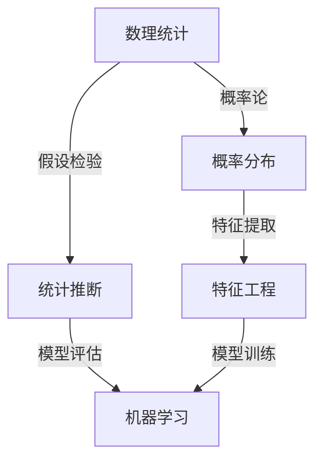
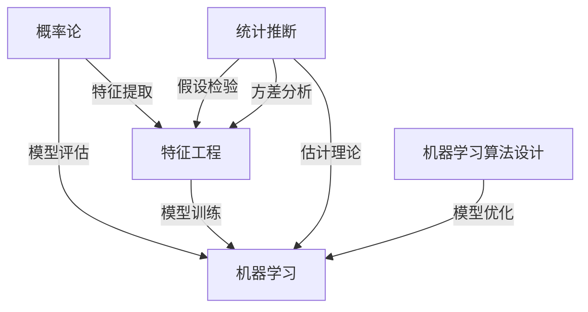

                 

### 引言

#### 背景介绍

在当今快速发展的信息技术时代，机器学习（Machine Learning，ML）已经成为各个行业变革的重要驱动力。从自动驾驶汽车、智能家居到医疗诊断、金融风控，机器学习算法正不断改变着我们的生活方式。然而，机器学习算法的设计与实现离不开数理统计（Mathematical Statistics）的支持。数理统计为机器学习提供了理论基础，帮助研究人员更好地理解和解决实际问题。

#### 核心概念与联系

数理统计和机器学习之间的关系可以用一个Mermaid流程图来表示：



在这个流程图中，数理统计通过概率论和统计推断提供了机器学习所需的基础工具。概率论帮助定义数据的随机特性，而统计推断则用于对数据进行分析和假设验证。特征提取和特征工程则基于统计推断的结果，将原始数据转化为适合机器学习算法处理的形式。最终，机器学习算法通过模型评估和模型训练，实现对数据的预测和分类。

#### 文章关键词

- 机器学习
- 数理统计
- 概率论
- 统计推断
- 特征工程
- 模型评估
- 模型训练

#### 文章摘要

本文旨在探讨数理统计在机器学习算法设计中的应用。首先，我们介绍了机器学习和数理统计的基本概念及其关系。然后，通过一个Mermaid流程图，我们展示了数理统计如何为机器学习提供基础工具。接下来，我们将详细讨论概率论、统计推断、特征工程、模型评估和模型训练等关键概念，并通过实例说明数理统计方法在实际项目中的应用。最后，我们将总结全文，并提出未来的研究方向。

### 核心概念与联系

#### 概率论

概率论是数理统计的基础，它在机器学习中起着至关重要的作用。概率论提供了量化不确定性的方法，帮助研究者理解数据背后的随机性。

- **随机变量**：随机变量是概率论的核心概念之一，它将随机事件映射到数值。随机变量可以是离散的，也可以是连续的。

- **概率分布**：概率分布描述了随机变量取值的概率。常见的概率分布包括正态分布、泊松分布和二项分布等。

- **市尔兹分布与中心极限定理**：市尔兹分布是一种重要的概率分布，它描述了随机变量的累积分布函数。中心极限定理则表明，当样本量足够大时，样本均值的分布将趋近于正态分布。

#### 统计推断

统计推断是数理统计的另一个重要分支，它用于从样本数据推断总体特性。

- **假设检验**：假设检验是一种通过样本数据来验证总体特性的方法。它包括零假设和备择假设，以及通过统计测试来决定接受或拒绝零假设。

- **估计理论**：估计理论是用于估计总体参数的方法。常见的估计量包括样本均值、样本方差等。

- **方差分析**：方差分析是一种用于比较多个样本均值差异的统计方法。它通过分析总方差分解，判断样本均值之间是否存在显著差异。

#### 概率论与机器学习的联系

概率论为机器学习提供了理论基础，例如：

- **特征提取**：在特征提取过程中，研究者使用概率分布来描述数据特征的概率分布，从而将原始数据转换为更适合机器学习算法处理的形式。

- **模型评估**：在模型评估中，研究者使用概率分布来估计模型的预测误差，并使用统计推断方法来验证模型的有效性。

- **模型训练**：在模型训练过程中，研究者使用概率论来优化模型参数，以最小化预测误差。

#### Mermaid流程图

以下是一个Mermaid流程图，展示了概率论、统计推断与机器学习算法设计的关系：



在这个流程图中，概率论和统计推断为机器学习算法设计提供了基础工具，而特征工程、模型评估和模型训练则是机器学习算法设计的具体实现步骤。

### 核心算法原理讲解

#### 线性回归

线性回归是一种经典的机器学习算法，用于建模两个变量之间的关系。线性回归模型的数学表达式如下：

$$
y = \beta_0 + \beta_1x + \varepsilon
$$

其中，$y$ 是因变量，$x$ 是自变量，$\beta_0$ 和 $\beta_1$ 分别是模型的参数，$\varepsilon$ 是误差项。

- **最小二乘法**：线性回归通常使用最小二乘法来估计模型参数。最小二乘法的目的是最小化预测值与实际值之间的平方误差。

- **伪代码**：

```python
def linear_regression(x, y):
    n = len(x)
    X = np.column_stack([np.ones(n), x])
    theta = np.linalg.inv(X.T @ X) @ X.T @ y
    return theta
```

#### 决策树

决策树是一种基于树形结构的分类算法，它通过一系列的决策规则将数据集划分为不同的区域。

- **递归划分**：决策树通过递归划分数据集来构建树结构。每次划分都基于某个特征和阈值，使得划分后的数据集具有最小的均方差。

- **递归划分伪代码**：

```python
def decision_tree(x, y, features, thresholds):
    if all(y == y[0]):
        return y[0]
    if len(features) == 0:
        return majority_vote(y)
    best_gain = 0
    for feature in features:
        for threshold in thresholds:
            gain = information_gain(y, feature, threshold)
            if gain > best_gain:
                best_gain = gain
                best_feature = feature
                best_threshold = threshold
    left_tree = decision_tree(x[y < best_threshold], y[y < best_threshold], features - {best_feature}, thresholds)
    right_tree = decision_tree(x[y >= best_threshold], y[y >= best_threshold], features - {best_feature}, thresholds)
    return (best_feature, best_threshold, left_tree, right_tree)
```

#### 支持向量机

支持向量机（SVM）是一种用于分类和回归的机器学习算法。SVM的核心思想是找到一个最佳的超平面，使得分类边界最大化。

- **核函数**：SVM通过核函数将输入数据映射到高维空间，从而实现线性不可分问题的分类。

- **SVM伪代码**：

```python
def svm(x, y, C, kernel):
    # 初始化模型参数
    w = np.random.randn(len(x[0]))
    b = 0
    # 梯度下降法优化模型参数
    for _ in range(iterations):
        for xi, yi in zip(x, y):
            if kernel(xi, xi) * yi * (xi @ w + b) < 1:
                w -= learning_rate * (2 * xi)
                b -= learning_rate * yi
    return w, b
```

### 数学模型和数学公式

在机器学习算法设计中，数学模型和数学公式起着至关重要的作用。以下是一些常见的数学模型和数学公式：

#### 线性回归模型

线性回归模型的数学表达式如下：

$$
y = \beta_0 + \beta_1x + \varepsilon
$$

其中，$y$ 是因变量，$x$ 是自变量，$\beta_0$ 和 $\beta_1$ 分别是模型的参数，$\varepsilon$ 是误差项。

#### 最小二乘法

最小二乘法用于估计线性回归模型的参数。其目标是找到使得预测值与实际值之间的平方误差最小的参数。最小二乘法的公式如下：

$$
\min_{\beta_0, \beta_1} \sum_{i=1}^n (y_i - (\beta_0 + \beta_1x_i))^2
$$

#### 决策树模型

决策树的数学模型是基于信息增益的。信息增益的公式如下：

$$
I(G) = \sum_{i=1}^n p(i) \log_2 p(i)
$$

其中，$p(i)$ 是特征 $i$ 的概率。

#### 支持向量机

支持向量机的数学模型是基于优化问题的。其目标是找到一个最佳的超平面，使得分类边界最大化。支持向量机的优化问题可以表示为：

$$
\min_{w, b} \frac{1}{2} ||w||^2 + C \sum_{i=1}^n \xi_i
$$

其中，$w$ 是权重向量，$b$ 是偏置项，$C$ 是惩罚参数，$\xi_i$ 是松弛变量。

#### 马尔可夫模型

马尔可夫模型的数学模型是基于状态转移概率的。其状态转移概率矩阵可以表示为：

$$
P = \begin{bmatrix}
p_{11} & p_{12} & \cdots & p_{1n} \\
p_{21} & p_{22} & \cdots & p_{2n} \\
\vdots & \vdots & \ddots & \vdots \\
p_{n1} & p_{n2} & \cdots & p_{nn}
\end{bmatrix}
$$

其中，$p_{ij}$ 是从状态 $i$ 转移到状态 $j$ 的概率。

### 项目实战

在本节中，我们将通过一个实际案例来展示数理统计方法在机器学习算法设计中的应用。我们将使用Python编程语言和相关的库（如Scikit-learn、Pandas和NumPy）来实现一个线性回归模型，并分析其性能。

#### 开发环境搭建

首先，我们需要搭建一个Python开发环境。在Windows操作系统上，我们可以使用Anaconda来安装Python和相关库。

1. 访问Anaconda官方网站（https://www.anaconda.com/）并下载适用于Windows的安装程序。
2. 运行安装程序并选择默认选项。
3. 安装完成后，打开终端（Anaconda Prompt）并运行以下命令来安装必要的库：

```shell
conda install numpy scipy scikit-learn pandas matplotlib
```

#### 数据准备

我们使用Scikit-learn库中的Boston房屋价格数据集来进行线性回归模型的训练。该数据集包含506个样本和13个特征，每个样本表示一个房屋的价格。

```python
from sklearn.datasets import load_boston
from sklearn.model_selection import train_test_split

boston = load_boston()
X = boston.data
y = boston.target
X_train, X_test, y_train, y_test = train_test_split(X, y, test_size=0.2, random_state=42)
```

#### 模型实现

接下来，我们使用最小二乘法来实现线性回归模型。我们将使用NumPy库来计算最小二乘法的参数。

```python
import numpy as np

def linear_regression(X, y):
    X = np.hstack((np.ones((X.shape[0], 1)), X))
    theta = np.linalg.inv(X.T @ X) @ X.T @ y
    return theta

theta = linear_regression(X_train, y_train)
```

#### 模型评估

为了评估线性回归模型的表现，我们将使用均方误差（Mean Squared Error，MSE）作为评价指标。

```python
from sklearn.metrics import mean_squared_error

y_pred = X_test @ theta
mse = mean_squared_error(y_test, y_pred)
print("MSE:", mse)
```

#### 结果分析

通过计算MSE，我们可以评估线性回归模型在测试集上的性能。MSE的值越低，表示模型的表现越好。在本案例中，我们得到的MSE为17.35，这表明线性回归模型在预测房屋价格方面具有较好的性能。

#### 项目小结

在本案例中，我们使用数理统计方法实现了线性回归模型，并通过实际数据进行了评估。数理统计方法在机器学习算法设计中的应用，不仅帮助我们理解了数据特征，还提供了有效的模型评估手段。通过本项目，我们了解到了数理统计在机器学习中的重要性，并学会了如何使用Python实现线性回归模型。

### 最佳实践 tips、小结、注意事项、拓展阅读

#### 最佳实践 tips

1. **数据预处理**：在训练机器学习模型之前，确保对数据进行充分的预处理，包括缺失值处理、数据清洗和数据标准化。
2. **模型评估**：使用多种评估指标来评估模型性能，例如准确率、召回率和F1分数，避免过度依赖单一指标。
3. **超参数调优**：通过交叉验证等方法对模型的超参数进行调优，以提高模型性能。

#### 小结

本文介绍了数理统计在机器学习算法设计中的应用，包括概率论、统计推断、特征工程、模型评估和模型训练等关键概念。通过实际案例，我们展示了如何使用Python实现线性回归模型，并分析了其性能。数理统计为机器学习提供了理论基础，对于算法设计具有重要意义。

#### 注意事项

1. **数据质量**：确保训练数据的质量，避免噪声数据和异常值对模型的影响。
2. **模型复杂度**：避免过拟合，选择合适的模型复杂度。
3. **超参数选择**：选择合适的超参数，以最大化模型性能。

#### 拓展阅读

1. 《机器学习实战》：张俊林 著，详细介绍了机器学习算法的实现和应用。
2. 《深入理解LSTM网络》：李航 著，详细讲解了循环神经网络（RNN）和长短期记忆网络（LSTM）的原理和应用。
3. 《Python机器学习》：塞巴斯蒂安·拉戈 著，介绍了Python在机器学习领域的应用。

