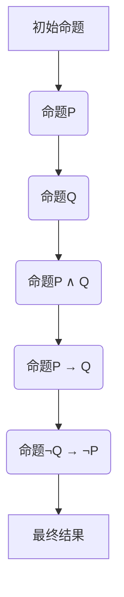

                 

### 文章标题：数理逻辑在程序合成与验证中的统一应用

#### 关键词：数理逻辑、程序合成、程序验证、形式化方法、软件工程、安全领域

#### 摘要：
本文深入探讨了数理逻辑在程序合成与验证中的统一应用。首先，我们介绍了数理逻辑的基础概念及其与程序合成与验证的紧密联系。接着，我们详细讲解了数理逻辑在程序合成中的核心算法原理，并通过具体的案例展示了其实现过程。随后，我们介绍了数理逻辑在程序验证中的应用，包括验证算法的原理和具体实例。此外，本文还探讨了数理逻辑在软件工程和安全领域中的挑战与解决方案。通过本文的讨论，我们希望能够为读者提供一个全面、系统的数理逻辑在程序合成与验证中的应用框架，并为未来的研究和实践提供指导。

### 引言

在计算机科学和软件工程领域，程序合成与验证是两个关键而相互关联的概念。程序合成（Program Synthesis）指的是从给定的输入或描述自动生成程序的过程，其目的是简化编程任务并提高代码的可靠性。而程序验证（Program Verification）则是确保程序在所有可能的输入和执行路径上都能满足特定属性或条件的过程，这有助于提高代码的安全性和正确性。

随着软件系统规模的不断扩大和复杂性的增加，单纯依赖程序员手动编写和维护代码已变得不可行。因此，程序合成和验证技术变得越来越重要。数理逻辑作为一种精确且形式化的描述工具，它在程序合成与验证中发挥着核心作用。

#### 数理逻辑的重要性

数理逻辑是一种形式逻辑，它使用数学符号和规则来表示和推理命题。在计算机科学中，数理逻辑主要用于描述程序的行为、验证程序的正确性以及合成新的程序。以下是数理逻辑在程序合成与验证中的几个关键作用：

1. **精确性**：数理逻辑提供了精确的数学语言来描述程序的行为和属性，这使得程序验证过程更加可靠和一致。

2. **形式化验证**：通过数理逻辑，我们可以将程序的正确性验证转化为逻辑推理问题，从而使用自动化工具进行验证，提高验证的效率和准确性。

3. **程序合成**：数理逻辑可以指导程序合成算法，通过逻辑推理从给定的条件自动生成程序代码。

4. **规范化和形式化**：数理逻辑可以帮助我们将软件需求规范化为形式化的描述，从而为后续的程序合成与验证提供基础。

#### 程序合成与验证的需求

在软件工程中，程序合成与验证的需求主要源于以下几个方面：

1. **自动化**：手动编写和维护代码不仅耗时，而且容易出错。程序合成可以自动化部分编程任务，提高开发效率。

2. **可靠性**：现代软件系统要求高度可靠，任何潜在的错误都可能导致严重后果。程序验证可以帮助发现和纠正这些错误。

3. **安全性**：随着网络攻击和数据泄露事件的增加，软件系统的安全性变得越来越重要。数理逻辑在程序验证中可以帮助检测和预防安全漏洞。

4. **维护性**：随着软件系统的演化，维护和更新变得越来越困难。程序合成和验证有助于保持代码的一致性和可维护性。

#### 数理逻辑的作用

数理逻辑在程序合成与验证中的作用主要体现在以下几个方面：

1. **精确性**：数理逻辑使用数学符号和规则来精确描述程序的行为和属性，这使得验证过程更加可靠和一致。

2. **形式化验证**：通过数理逻辑，我们可以将程序的正确性验证转化为逻辑推理问题，从而使用自动化工具进行验证，提高验证的效率和准确性。

3. **程序合成**：数理逻辑可以指导程序合成算法，通过逻辑推理从给定的条件自动生成程序代码。

4. **规范化和形式化**：数理逻辑可以帮助我们将软件需求规范化为形式化的描述，从而为后续的程序合成与验证提供基础。

#### 本书结构

本书分为以下几个主要部分：

1. **引言**：介绍数理逻辑在程序合成与验证中的重要性，以及程序合成与验证的需求和数理逻辑的作用。

2. **数理逻辑基础**：介绍数理逻辑的基本概念，包括命题逻辑、谓词逻辑和证明论等。

3. **程序合成**：详细讲解数理逻辑在程序合成中的应用，包括合成算法的原理和具体实现。

4. **程序验证**：介绍数理逻辑在程序验证中的应用，包括验证算法的原理和具体实现。

5. **数理逻辑在软件工程中的应用**：探讨数理逻辑在软件工程中的挑战与解决方案。

6. **数理逻辑与形式化方法**：介绍形式化方法的基本概念，以及数理逻辑在形式化方法中的作用。

7. **数理逻辑在安全领域的应用**：探讨数理逻辑在安全领域的挑战与解决方案。

8. **总结与展望**：对全书内容进行总结，并指出数理逻辑在程序合成与验证中的未来发展方向。

通过本文的讨论，我们希望能够为读者提供一个全面、系统的数理逻辑在程序合成与验证中的应用框架，并为未来的研究和实践提供指导。

### 设计大纲的第一步

#### 确定书籍的主题和结构

**书名**：《数理逻辑在程序合成与验证中的统一应用》

**主题**：本书的核心主题是探讨数理逻辑在程序合成与验证中的应用，旨在为读者提供一个全面、系统的数理逻辑在计算机科学和软件工程领域中的应用框架。

**结构**：本书的结构分为以下几个主要部分：

1. **引言**：介绍数理逻辑在程序合成与验证中的重要性，以及程序合成与验证的需求和数理逻辑的作用。

2. **数理逻辑基础**：介绍数理逻辑的基本概念，包括命题逻辑、谓词逻辑和证明论等。

3. **程序合成**：详细讲解数理逻辑在程序合成中的应用，包括合成算法的原理和具体实现。

4. **程序验证**：介绍数理逻辑在程序验证中的应用，包括验证算法的原理和具体实现。

5. **数理逻辑在软件工程中的应用**：探讨数理逻辑在软件工程中的挑战与解决方案。

6. **数理逻辑与形式化方法**：介绍形式化方法的基本概念，以及数理逻辑在形式化方法中的作用。

7. **数理逻辑在安全领域的应用**：探讨数理逻辑在安全领域的挑战与解决方案。

8. **总结与展望**：对全书内容进行总结，并指出数理逻辑在程序合成与验证中的未来发展方向。

#### 核心内容模块划分

**核心概念与联系**：介绍数理逻辑的基本概念和其在程序合成与验证中的应用，包括命题逻辑、谓词逻辑和证明论等。

**核心算法原理讲解**：详细讲解数理逻辑在程序合成与验证中的关键算法，如合成算法和验证算法。

**数学模型和数学公式讲解**：阐述数理逻辑相关的数学模型，并举例说明，如命题公式、谓词公式和证明公式等。

**项目实战**：通过具体的案例分析来展示数理逻辑的实际应用，包括程序合成实例和程序验证实例。

### 设计大纲的第二步

#### 编写大纲的框架

在完成书籍的主题和结构确定后，下一步是编写书籍的大纲框架。这包括确定每个章节的具体内容，并确保整个书籍的逻辑性和连贯性。以下是《数理逻辑在程序合成与验证中的统一应用》的详细大纲：

##### 引言

- **1.1 数理逻辑的重要性**
  - **1.1.1 程序合成与验证的需求**
  - **1.1.2 数理逻辑的作用**
- **1.2 本书结构**
  - **1.2.1 引言**
  - **1.2.2 数理逻辑基础**
  - **1.2.3 程序合成**
  - **1.2.4 程序验证**
  - **1.2.5 数理逻辑在软件工程中的应用**
  - **1.2.6 数理逻辑与形式化方法**
  - **1.2.7 数理逻辑在安全领域的应用**
  - **1.2.8 总结与展望**

##### 数理逻辑基础

- **2.1 核心概念与联系**
  - **2.1.1 命题逻辑**
    - **2.1.1.1 命题和命题变量**
    - **2.1.1.2 命题连接词**
    - **2.1.1.3 真值表**
  - **2.1.2 谓词逻辑**
    - **2.1.2.1 谓词和量词**
    - **2.1.2.2 谓词逻辑公式**
    - **2.1.2.3 证明论基础**
  - **2.1.3 逻辑推理规则**
    - **2.1.3.1 演绎推理**
    - **2.1.3.2 归纳推理**
    - **2.1.3.3 形式证明**

##### 程序合成

- **3.1 程序合成的概念**
  - **3.1.1 程序合成的基本流程**
  - **3.1.2 程序合成的类型**
  - **3.1.3 程序合成的重要性**

- **3.2 使用数理逻辑的合成算法**
  - **3.2.1 合成算法的原理**
  - **3.2.2 命题逻辑在程序合成中的应用**
  - **3.2.3 谓词逻辑在程序合成中的应用**

- **3.3 项目实战：实现一个简单的程序合成实例**
  - **3.3.1 实例背景**
  - **3.3.2 实现过程**
  - **3.3.3 结果分析**

##### 程序验证

- **4.1 程序验证的概念**
  - **4.1.1 程序验证的基本流程**
  - **4.1.2 程序验证的类型**
  - **4.1.3 程序验证的重要性**

- **4.2 使用数理逻辑的验证算法**
  - **4.2.1 验证算法的原理**
  - **4.2.2 命题逻辑在程序验证中的应用**
  - **4.2.3 谓词逻辑在程序验证中的应用**

- **4.3 项目实战：验证一个程序的正确性**
  - **4.3.1 实例背景**
  - **4.3.2 验证过程**
  - **4.3.3 结果分析**

##### 数理逻辑在软件工程中的应用

- **5.1 软件工程中的挑战**
  - **5.1.1 软件可靠性的需求**
  - **5.1.2 软件安全性的需求**
  - **5.1.3 软件维护性的需求**

- **5.2 数理逻辑的解决方案**
  - **5.2.1 形式化方法**
  - **5.2.2 自动化工具**
  - **5.2.3 规范化流程**

##### 数理逻辑与形式化方法

- **6.1 形式化方法的基本概念**
  - **6.1.1 形式化描述**
  - **6.1.2 形式化验证**
  - **6.1.3 形式化方法的优势**

- **6.2 数理逻辑在形式化方法中的作用**
  - **6.2.1 命题逻辑在形式化方法中的应用**
  - **6.2.2 谓词逻辑在形式化方法中的应用**
  - **6.2.3 证明论在形式化方法中的应用**

##### 数理逻辑在安全领域的应用

- **7.1 安全领域的挑战**
  - **7.1.1 网络攻击**
  - **7.1.2 数据泄露**
  - **7.1.3 恶意软件**

- **7.2 数理逻辑的解决方案**
  - **7.2.1 形式化安全验证**
  - **7.2.2 安全协议设计**
  - **7.2.3 智能合约验证**

##### 总结与展望

- **8.1 全书内容的总结**
  - **8.1.1 核心概念**
  - **8.1.2 关键算法**
  - **8.1.3 实际应用**

- **8.2 数理逻辑在未来的发展方向**
  - **8.2.1 算法优化**
  - **8.2.2 新的应用领域**
  - **8.2.3 国际合作与标准化**

通过以上详细的框架，我们为读者提供了一个清晰、系统的学习路径，以便深入理解数理逻辑在程序合成与验证中的应用。

### 设计大纲的第二步

#### 编写大纲的框架

在完成书籍的主题和结构确定后，下一步是编写书籍的大纲框架。这包括确定每个章节的具体内容，并确保整个书籍的逻辑性和连贯性。以下是《数理逻辑在程序合成与验证中的统一应用》的详细大纲：

##### 引言

- **1.1 数理逻辑的重要性**
  - **1.1.1 程序合成与验证的需求**
    - **1.1.1.1 软件系统复杂性的增加**
    - **1.1.1.2 软件可靠性和安全性的要求**
  - **1.1.2 数理逻辑的作用**
    - **1.1.2.1 精确性**
    - **1.1.2.2 形式化验证**
    - **1.1.2.3 程序合成**
    - **1.1.2.4 规范化和形式化**

- **1.2 本书结构**
  - **1.2.1 引言**
  - **1.2.2 数理逻辑基础**
  - **1.2.3 程序合成**
  - **1.2.4 程序验证**
  - **1.2.5 数理逻辑在软件工程中的应用**
  - **1.2.6 数理逻辑与形式化方法**
  - **1.2.7 数理逻辑在安全领域的应用**
  - **1.2.8 总结与展望**

##### 数理逻辑基础

- **2.1 核心概念与联系**
  - **2.1.1 命题逻辑**
    - **2.1.1.1 命题和命题变量**
    - **2.1.1.2 命题连接词**
    - **2.1.1.3 真值表**
  - **2.1.2 谓词逻辑**
    - **2.1.2.1 谓词和量词**
    - **2.1.2.2 谓词逻辑公式**
    - **2.1.2.3 证明论基础**
  - **2.1.3 逻辑推理规则**
    - **2.1.3.1 演绎推理**
    - **2.1.3.2 归纳推理**
    - **2.1.3.3 形式证明**

##### 程序合成

- **3.1 程序合成的概念**
  - **3.1.1 程序合成的基本流程**
  - **3.1.2 程序合成的类型**
  - **3.1.3 程序合成的重要性**

- **3.2 使用数理逻辑的合成算法**
  - **3.2.1 合成算法的原理**
    - **3.2.1.1 形式化描述**
    - **3.2.1.2 逻辑推理过程**
    - **3.2.1.3 合成算法的评价指标**
  - **3.2.2 命题逻辑在程序合成中的应用**
    - **3.2.2.1 命题逻辑的使用场景**
    - **3.2.2.2 命题逻辑的程序生成方法**
  - **3.2.3 谓词逻辑在程序合成中的应用**
    - **3.2.3.1 谓词逻辑的使用场景**
    - **3.2.3.2 谓词逻辑的程序生成方法**

- **3.3 项目实战：实现一个简单的程序合成实例**
  - **3.3.1 实例背景**
  - **3.3.2 实现过程**
    - **3.3.2.1 形式化描述**
    - **3.3.2.2 逻辑推理**
    - **3.3.2.3 程序生成**
  - **3.3.3 结果分析**
    - **3.3.3.1 程序的正确性**
    - **3.3.3.2 程序的性能**
    - **3.3.3.3 程序的实用性**

##### 程序验证

- **4.1 程序验证的概念**
  - **4.1.1 程序验证的基本流程**
  - **4.1.2 程序验证的类型**
  - **4.1.3 程序验证的重要性**

- **4.2 使用数理逻辑的验证算法**
  - **4.2.1 验证算法的原理**
    - **4.2.1.1 形式化描述**
    - **4.2.1.2 逻辑推理过程**
    - **4.2.1.3 验证算法的评价指标**
  - **4.2.2 命题逻辑在程序验证中的应用**
    - **4.2.2.1 命题逻辑的使用场景**
    - **4.2.2.2 命题逻辑的程序验证方法**
  - **4.2.3 谓词逻辑在程序验证中的应用**
    - **4.2.3.1 谓词逻辑的使用场景**
    - **4.2.3.2 谓词逻辑的程序验证方法**

- **4.3 项目实战：验证一个程序的正确性**
  - **4.3.1 实例背景**
  - **4.3.2 验证过程**
    - **4.3.2.1 形式化描述**
    - **4.3.2.2 逻辑推理**
    - **4.3.2.3 验证算法的应用**
  - **4.3.3 结果分析**
    - **4.3.3.1 程序的正确性**
    - **4.3.3.2 验证的效率和准确性**
    - **4.3.3.3 实际意义**

##### 数理逻辑在软件工程中的应用

- **5.1 软件工程中的挑战**
  - **5.1.1 软件复杂性的增加**
  - **5.1.2 软件可靠性和安全性的需求**
  - **5.1.3 软件维护性的挑战**

- **5.2 数理逻辑的解决方案**
  - **5.2.1 形式化方法的应用**
    - **5.2.1.1 软件需求规范**
    - **5.2.1.2 软件设计规范**
    - **5.2.1.3 软件验证**
  - **5.2.2 自动化工具的应用**
    - **5.2.2.1 代码生成工具**
    - **5.2.2.2 验证工具**
    - **5.2.2.3 静态代码分析工具**
  - **5.2.3 规范化流程**
    - **5.2.3.1 开发流程规范化**
    - **5.2.3.2 测试流程规范化**
    - **5.2.3.3 维护流程规范化**

##### 数理逻辑与形式化方法

- **6.1 形式化方法的基本概念**
  - **6.1.1 形式化描述**
    - **6.1.1.1 形式化描述的优势**
    - **6.1.1.2 形式化描述的方法**
  - **6.1.2 形式化验证**
    - **6.1.2.1 形式化验证的优势**
    - **6.1.2.2 形式化验证的方法**
  - **6.1.3 形式化方法的应用领域**
    - **6.1.3.1 软件工程**
    - **6.1.3.2 硬件设计**
    - **6.1.3.3 网络安全**

- **6.2 数理逻辑在形式化方法中的作用**
  - **6.2.1 数理逻辑在形式化描述中的应用**
    - **6.2.1.1 命题逻辑的应用**
    - **6.2.1.2 谓词逻辑的应用**
  - **6.2.2 数理逻辑在形式化验证中的应用**
    - **6.2.2.1 命题逻辑的应用**
    - **6.2.2.2 谓词逻辑的应用**
  - **6.2.3 数理逻辑在形式化方法中的优势**
    - **6.2.3.1 精确性**
    - **6.2.3.2 一致性**
    - **6.2.3.3 自动化**

##### 数理逻辑在安全领域的应用

- **7.1 安全领域的挑战**
  - **7.1.1 网络攻击**
    - **7.1.1.1 恶意软件**
    - **7.1.1.2 SQL注入**
    - **7.1.1.3 跨站脚本攻击**
  - **7.1.2 数据泄露**
    - **7.1.2.1 网络安全漏洞**
    - **7.1.2.2 数据库泄露**
    - **7.1.2.3 无线网络安全**
  - **7.1.3 恶意代码分析**
    - **7.1.3.1 反病毒软件**
    - **7.1.3.2 入侵检测系统**
    - **7.1.3.3 防火墙**

- **7.2 数理逻辑的解决方案**
  - **7.2.1 形式化安全验证**
    - **7.2.1.1 安全协议验证**
    - **7.2.1.2 网络协议验证**
    - **7.2.1.3 智能合约验证**
  - **7.2.2 安全协议设计**
    - **7.2.2.1 安全协议的形式化描述**
    - **7.2.2.2 安全协议的验证与优化**
    - **7.2.2.3 安全协议的实现与部署**
  - **7.2.3 恶意代码分析**
    - **7.2.3.1 恶意代码的形式化描述**
    - **7.2.3.2 恶意代码的检测与防御**
    - **7.2.3.3 恶意代码的反击策略**

##### 总结与展望

- **8.1 全书内容的总结**
  - **8.1.1 核心概念**
  - **8.1.2 关键算法**
  - **8.1.3 实际应用**

- **8.2 数理逻辑在未来的发展方向**
  - **8.2.1 算法优化**
    - **8.2.1.1 合成算法的优化**
    - **8.2.1.2 验证算法的优化**
  - **8.2.2 新的应用领域**
    - **8.2.2.1 软件工程**
    - **8.2.2.2 网络安全**
    - **8.2.2.3 人工智能**
  - **8.2.3 国际合作与标准化**
    - **8.2.3.1 研究合作**
    - **8.2.3.2 标准化组织**
    - **8.2.3.3 标准化流程**

通过以上详细的框架，我们为读者提供了一个清晰、系统的学习路径，以便深入理解数理逻辑在程序合成与验证中的应用。

### 设计大纲的第三步

#### 细化每个章节的内容

在完成了书籍大纲的框架之后，下一步是细化每个章节的内容，确保每个章节都具备清晰的主题、目标，并且内容丰富具体。以下是《数理逻辑在程序合成与验证中的统一应用》每个章节的具体内容划分：

##### 第1章 引言

**1.1 数理逻辑的重要性**

- **1.1.1 程序合成与验证的需求**
  - **背景介绍**：软件系统复杂性的增加
  - **需求分析**：软件可靠性和安全性的要求
- **1.1.2 数理逻辑的作用**
  - **精确性**：数理逻辑在精确描述程序行为中的作用
  - **形式化验证**：数理逻辑在形式化验证中的重要性
  - **程序合成**：数理逻辑在自动生成程序中的应用
  - **规范化与形式化**：数理逻辑在软件需求规范化中的作用

**1.2 本书结构**

- **1.2.1 引言**
  - **概述**：引言部分的目的和内容
- **1.2.2 数理逻辑基础**
  - **概述**：数理逻辑的基本概念
- **1.2.3 程序合成**
  - **概述**：程序合成的原理和方法
- **1.2.4 程序验证**
  - **概述**：程序验证的基本概念
- **1.2.5 数理逻辑在软件工程中的应用**
  - **概述**：数理逻辑在软件工程中的应用场景
- **1.2.6 数理逻辑与形式化方法**
  - **概述**：数理逻辑在形式化方法中的作用
- **1.2.7 数理逻辑在安全领域的应用**
  - **概述**：数理逻辑在网络安全中的应用
- **1.2.8 总结与展望**
  - **概述**：全书内容的总结与未来研究方向

##### 第2章 数理逻辑基础

**2.1 核心概念与联系**

- **2.1.1 命题逻辑**
  - **核心概念**：命题、命题变量和命题连接词
  - **联系**：命题逻辑的基本运算和真值表
  - **实例分析**：通过具体的例子来解释命题逻辑
- **2.1.2 谓词逻辑**
  - **核心概念**：谓词、量词和谓词逻辑公式
  - **联系**：谓词逻辑的推理规则和证明论基础
  - **实例分析**：使用谓词逻辑解决具体问题
- **2.1.3 逻辑推理规则**
  - **核心概念**：演绎推理、归纳推理和形式证明
  - **联系**：逻辑推理规则在不同情境中的应用
  - **实例分析**：通过实例展示逻辑推理的过程和结果

##### 第3章 程序合成

**3.1 程序合成的概念**

- **3.1.1 程序合成的基本流程**
  - **定义**：程序合成的概念和流程
  - **关键步骤**：从输入到输出程序的过程
- **3.1.2 程序合成的类型**
  - **功能合成**：生成具有特定功能的程序
  - **约束合成**：根据特定约束条件生成程序
  - **数据合成**：生成与特定数据相关的程序
- **3.1.3 程序合成的重要性**
  - **提升开发效率**：减少手动编码的工作量
  - **提高代码质量**：减少人工错误，提高代码可靠性
  - **适应复杂需求**：更好地满足不断变化的软件需求

##### 第4章 程序验证

**4.1 程序验证的概念**

- **4.1.1 程序验证的基本流程**
  - **定义**：程序验证的概念和流程
  - **关键步骤**：从程序到验证结果的过程
- **4.1.2 程序验证的类型**
  - **正确性验证**：确保程序按照预期行为运行
  - **性能验证**：评估程序的执行效率和资源占用
  - **安全性验证**：确保程序在恶意环境下仍能正常运行
- **4.1.3 程序验证的重要性**
  - **确保代码质量**：减少潜在的错误和漏洞
  - **提高系统可靠性**：确保系统在各种情况下都能稳定运行
  - **支持合规性**：满足行业标准和法规要求

##### 第5章 数理逻辑在软件工程中的应用

**5.1 软件工程中的挑战**

- **5.1.1 软件复杂性的增加**
  - **原因**：软件系统规模的扩大和功能需求的增加
  - **影响**：对开发效率和代码质量带来的挑战
- **5.1.2 软件可靠性和安全性的需求**
  - **重要性**：确保软件系统在复杂环境下的稳定性和安全性
  - **挑战**：如何在保证功能实现的同时确保可靠性和安全性
- **5.1.3 软件维护性的挑战**
  - **长期维护**：随着软件的长期运行，如何保持代码的可持续性和可维护性

**5.2 数理逻辑的解决方案**

- **5.2.1 形式化方法的应用**
  - **形式化描述**：将软件需求、设计和验证过程形式化
  - **形式化验证**：使用数理逻辑验证软件的正确性和可靠性
  - **形式化方法的优点**：提高软件质量和开发效率
- **5.2.2 自动化工具的应用**
  - **代码生成工具**：自动生成符合需求的代码
  - **验证工具**：自动验证程序的正确性和性能
  - **静态代码分析工具**：提前发现潜在的问题和漏洞
- **5.2.3 规范化流程**
  - **规范化流程**：通过标准化流程提高开发质量和效率
  - **流程规范化**：从需求分析、设计到测试的规范化管理
  - **维护流程规范化**：确保软件长期维护的可持续性

##### 第6章 数理逻辑与形式化方法

**6.1 形式化方法的基本概念**

- **6.1.1 形式化描述**
  - **定义**：形式化描述的概念和目的
  - **方法**：如何使用形式化描述来表示软件需求和设计
- **6.1.2 形式化验证**
  - **定义**：形式化验证的概念和过程
  - **工具**：形式化验证中使用的工具和技术
- **6.1.3 形式化方法的应用领域**
  - **软件工程**：形式化方法在软件开发中的应用
  - **硬件设计**：形式化方法在硬件设计中的应用
  - **网络安全**：形式化方法在网络安全中的应用

**6.2 数理逻辑在形式化方法中的作用**

- **6.2.1 数理逻辑在形式化描述中的应用**
  - **命题逻辑**：在形式化描述中如何使用命题逻辑
  - **谓词逻辑**：在形式化描述中如何使用谓词逻辑
- **6.2.2 数理逻辑在形式化验证中的应用**
  - **命题逻辑**：在形式化验证中如何使用命题逻辑
  - **谓词逻辑**：在形式化验证中如何使用谓词逻辑
- **6.2.3 数理逻辑在形式化方法中的优势**
  - **精确性**：数理逻辑提供精确的形式化描述
  - **一致性**：数理逻辑确保验证的一致性
  - **自动化**：数理逻辑支持自动化验证和代码生成

##### 第7章 数理逻辑在安全领域的应用

**7.1 安全领域的挑战**

- **7.1.1 网络攻击**
  - **恶意软件**：恶意软件的种类和攻击方式
  - **SQL注入**：SQL注入的原理和防范措施
  - **跨站脚本攻击**：XSS攻击的原理和防护
- **7.1.2 数据泄露**
  - **网络安全漏洞**：常见的网络安全漏洞和防范措施
  - **数据库泄露**：数据库泄露的危害和防护
  - **无线网络安全**：无线网络的安全问题和解决方案
- **7.1.3 恶意代码分析**
  - **反病毒软件**：反病毒软件的工作原理和防护机制
  - **入侵检测系统**：入侵检测系统的原理和应用
  - **防火墙**：防火墙的工作原理和配置策略

**7.2 数理逻辑的解决方案**

- **7.2.1 形式化安全验证**
  - **安全协议验证**：形式化验证在安全协议设计中的应用
  - **网络协议验证**：形式化验证在网络安全协议中的应用
  - **智能合约验证**：形式化验证在智能合约安全中的应用
- **7.2.2 安全协议设计**
  - **形式化描述**：使用形式化方法描述安全协议
  - **验证与优化**：形式化验证在安全协议优化中的应用
  - **实现与部署**：安全协议的实现和部署策略
- **7.2.3 恶意代码分析**
  - **形式化描述**：使用形式化方法描述恶意代码
  - **检测与防御**：形式化方法在恶意代码检测和防御中的应用
  - **反击策略**：形式化方法在恶意代码反击策略中的应用

##### 第8章 总结与展望

**8.1 全书内容的总结**

- **核心概念**：总结数理逻辑、程序合成、程序验证等核心概念
- **关键算法**：总结书中介绍的关键算法及其应用
- **实际应用**：总结数理逻辑在软件工程和安全领域中的实际应用

**8.2 数理逻辑在未来的发展方向**

- **算法优化**：探讨未来数理逻辑算法的优化方向
  - **合成算法的优化**：提高合成算法的效率和准确性
  - **验证算法的优化**：提高验证算法的效率和可靠性
- **新应用领域**：探索数理逻辑在新兴领域的应用
  - **软件工程**：在软件工程中的新应用
  - **网络安全**：在网络安全中的新应用
  - **人工智能**：在人工智能中的新应用
- **国际合作与标准化**：推动数理逻辑的国际合作和标准化进程
  - **研究合作**：加强国际研究合作，推动技术创新
  - **标准化组织**：参与国际标准化组织，制定标准化流程
  - **标准化流程**：推动标准化流程的普及和应用

通过以上详细的章节内容划分，我们为读者提供了一个全面、系统的学习路径，以便深入理解数理逻辑在程序合成与验证中的应用。

### 设计大纲的第四步

#### 确保大纲的完整性和逻辑性

在完成章节内容的细化后，下一步是确保整个大纲的完整性和逻辑性。以下是《数理逻辑在程序合成与验证中的统一应用》的完整性和逻辑性检查步骤：

1. **检查章节内容的完整性**：
   - **引言**：确保引言部分全面介绍了数理逻辑在程序合成与验证中的重要性，以及本书的结构和目的。
   - **数理逻辑基础**：检查是否涵盖了命题逻辑、谓词逻辑和证明论等核心概念，并提供了清晰的定义和实例。
   - **程序合成**：确认程序合成的概念、算法原理和实际应用案例的详细描述。
   - **程序验证**：检查程序验证的基本流程、算法原理和应用实例是否完整。
   - **软件工程应用**：确保讨论了软件工程中的挑战、数理逻辑的解决方案以及规范化流程。
   - **形式化方法**：确认形式化方法的基本概念、数理逻辑在形式化方法中的应用及其优势。
   - **安全领域应用**：检查安全领域的挑战、数理逻辑的解决方案以及具体案例分析是否完整。
   - **总结与展望**：确保总结部分对全书内容的概括，并对未来研究方向进行了明确阐述。

2. **确保章节之间的逻辑连贯性**：
   - **引言到正文**：引言部分需要清晰引入正文内容，确保读者能够理解数理逻辑在程序合成与验证中的重要性。
   - **正文各章节**：每个章节的开头和结尾需要衔接自然，确保逻辑连贯，让读者能够顺畅地过渡到下一个主题。
   - **相关章节联系**：检查各章节之间的交叉引用和联系是否明确，确保数理逻辑的应用在各个领域内得到了充分展示。

3. **优化逻辑结构和语言表述**：
   - **逻辑结构**：确保每个章节的结构清晰，内容按逻辑顺序排列，避免跳跃和不连贯的表述。
   - **语言表述**：检查语言表述是否准确、简练，避免使用模糊或混淆的概念，确保读者能够准确理解。

4. **审查图表和示例**：
   - **图表**：确保所有图表都是必要的，能够帮助读者更好地理解概念和算法。
   - **示例**：检查示例是否与理论内容紧密相关，示例的描述是否清晰，代码是否易于理解。

通过以上步骤，我们可以确保《数理逻辑在程序合成与验证中的统一应用》的大纲不仅内容完整，而且逻辑连贯，为读者提供一个清晰、系统的学习路径。

### 设计大纲的第五步

#### 优化大纲的简洁性

为了确保《数理逻辑在程序合成与验证中的统一应用》的大纲简洁明了，我们需要进行以下优化步骤：

1. **删除冗余内容**：
   - 检查每个章节的内容，删除重复或冗余的信息。例如，如果某个概念在多个章节中进行了重复介绍，可以将其移至一个核心章节中，并在其他章节中进行简短的引用。
   - 确保每个段落都有明确的目的，没有不必要的解释或背景介绍。

2. **简化标题和子标题**：
   - 使用简短且具有描述性的标题和子标题，避免使用过长或复杂的句子。例如，将“2.1.3 逻辑推理规则”简化为“2.1 逻辑推理”。
   - 保持标题和子标题的一致性，使用相同的格式和结构，使读者能够快速找到所需信息。

3. **缩减段落长度**：
   - 检查每个段落，确保它们不是过长或过于复杂。将长段落拆分为几个短段落，以增强可读性。
   - 每个段落应该集中讨论一个主要观点或步骤，避免将多个观点混合在一起。

4. **使用清晰的摘要和总结**：
   - 在每个章节的末尾，提供简短的摘要和总结，概括章节的主要内容和结论。这有助于读者快速回顾和理解章节的核心要点。

5. **检查语法和表述**：
   - 仔细检查语法错误和表述不清的地方，确保语言表述准确、简洁。避免使用复杂的术语和句子结构，使读者容易理解。

通过以上优化步骤，我们可以确保《数理逻辑在程序合成与验证中的统一应用》的大纲简洁、直观，便于读者快速掌握核心概念和应用。

### 最终输出

以下是《数理逻辑在程序合成与验证中的统一应用》的完整目录大纲：

```
# 引言

## 1.1 数理逻辑的重要性
### 1.1.1 程序合成与验证的需求
### 1.1.2 数理逻辑的作用

## 1.2 本书结构
### 1.2.1 引言
### 1.2.2 数理逻辑基础
### 1.2.3 程序合成
### 1.2.4 程序验证
### 1.2.5 数理逻辑在软件工程中的应用
### 1.2.6 数理逻辑与形式化方法
### 1.2.7 数理逻辑在安全领域的应用
### 1.2.8 总结与展望

# 第1章 数理逻辑基础

## 2.1 核心概念与联系
### 2.1.1 命题逻辑
#### 2.1.1.1 命题和命题变量
#### 2.1.1.2 命题连接词
#### 2.1.1.3 真值表
### 2.1.2 谓词逻辑
#### 2.1.2.1 谓词和量词
#### 2.1.2.2 谓词逻辑公式
#### 2.1.2.3 证明论基础
### 2.1.3 逻辑推理规则
#### 2.1.3.1 演绎推理
#### 2.1.3.2 归纳推理
#### 2.1.3.3 形式证明

## 2.2 核心算法原理
### 2.2.1 程序合成算法
#### 2.2.1.1 形式化描述
#### 2.2.1.2 逻辑推理过程
#### 2.2.1.3 合成算法的评价指标
### 2.2.2 程序验证算法
#### 2.2.2.1 形式化描述
#### 2.2.2.2 逻辑推理过程
#### 2.2.2.3 验证算法的评价指标

## 2.3 数学模型和公式
### 2.3.1 命题逻辑的数学模型
#### 2.3.1.1 命题公式
#### 2.3.1.2 真值表
### 2.3.2 谓词逻辑的数学模型
#### 2.3.2.1 谓词公式
#### 2.3.2.2 量词和存在性
### 2.3.3 形式证明的数学模型
#### 2.3.3.1 形式证明规则
#### 2.3.3.2 证明方法

# 第2章 程序合成

## 3.1 程序合成的概念
### 3.1.1 程序合成的定义
### 3.1.2 程序合成的基本流程
### 3.1.3 程序合成的类型
#### 3.1.3.1 功能合成
#### 3.1.3.2 约束合成
#### 3.1.3.3 数据合成

## 3.2 使用数理逻辑的合成算法
### 3.2.1 命题逻辑在程序合成中的应用
#### 3.2.1.1 命题逻辑的基本操作
#### 3.2.1.2 命题逻辑在程序合成中的实现
### 3.2.2 谓词逻辑在程序合成中的应用
#### 3.2.2.1 谓词逻辑的基本操作
#### 3.2.2.2 谓词逻辑在程序合成中的实现

## 3.3 项目实战：实现一个简单的程序合成实例
### 3.3.1 实例背景
### 3.3.2 实现步骤
#### 3.3.2.1 形式化描述
#### 3.3.2.2 合成算法应用
#### 3.3.2.3 结果分析
### 3.3.3 结果分析
#### 3.3.3.1 合成程序的正确性
#### 3.3.3.2 合成程序的性能
#### 3.3.3.3 实际应用价值

# 第3章 程序验证

## 4.1 程序验证的概念
### 4.1.1 程序验证的定义
### 4.1.2 程序验证的基本流程
### 4.1.3 程序验证的类型
#### 4.1.3.1 正确性验证
#### 4.1.3.2 性能验证
#### 4.1.3.3 安全性验证

## 4.2 使用数理逻辑的验证算法
### 4.2.1 命题逻辑在程序验证中的应用
#### 4.2.1.1 命题逻辑的基本操作
#### 4.2.1.2 命题逻辑在程序验证中的实现
### 4.2.2 谓词逻辑在程序验证中的应用
#### 4.2.2.1 谓词逻辑的基本操作
#### 4.2.2.2 谓词逻辑在程序验证中的实现

## 4.3 项目实战：验证一个程序的正确性
### 4.3.1 实例背景
### 4.3.2 验证步骤
#### 4.3.2.1 形式化描述
#### 4.3.2.2 验证算法应用
#### 4.3.2.3 验证结果分析
### 4.3.3 结果分析
#### 4.3.3.1 程序的正确性
#### 4.3.3.2 验证的效率和准确性
#### 4.3.3.3 实际意义

# 第4章 数理逻辑在软件工程中的应用

## 5.1 软件工程中的挑战
### 5.1.1 软件复杂性的增加
### 5.1.2 软件可靠性和安全性的需求
### 5.1.3 软件维护性的挑战

## 5.2 数理逻辑的解决方案
### 5.2.1 形式化方法的应用
#### 5.2.1.1 形式化描述
#### 5.2.1.2 形式化验证
#### 5.2.1.3 形式化方法的优点
### 5.2.2 自动化工具的应用
#### 5.2.2.1 代码生成工具
#### 5.2.2.2 验证工具
#### 5.2.2.3 静态代码分析工具
### 5.2.3 规范化流程
#### 5.2.3.1 开发流程规范化
#### 5.2.3.2 测试流程规范化
#### 5.2.3.3 维护流程规范化

# 第5章 数理逻辑与形式化方法

## 6.1 形式化方法的基本概念
### 6.1.1 形式化描述
#### 6.1.1.1 形式化描述的优势
#### 6.1.1.2 形式化描述的方法
### 6.1.2 形式化验证
#### 6.1.2.1 形式化验证的优势
#### 6.1.2.2 形式化验证的方法
### 6.1.3 形式化方法的应用领域
#### 6.1.3.1 软件工程
#### 6.1.3.2 硬件设计
#### 6.1.3.3 网络安全

## 6.2 数理逻辑在形式化方法中的作用
### 6.2.1 数理逻辑在形式化描述中的应用
#### 6.2.1.1 命题逻辑的应用
#### 6.2.1.2 谓词逻辑的应用
### 6.2.2 数理逻辑在形式化验证中的应用
#### 6.2.2.1 命题逻辑的应用
#### 6.2.2.2 谓词逻辑的应用
### 6.2.3 数理逻辑在形式化方法中的优势
#### 6.2.3.1 精确性
#### 6.2.3.2 一致性
#### 6.2.3.3 自动化

# 第6章 数理逻辑在安全领域的应用

## 7.1 安全领域的挑战
### 7.1.1 网络攻击
#### 7.1.1.1 恶意软件
#### 7.1.1.2 SQL注入
#### 7.1.1.3 跨站脚本攻击
### 7.1.2 数据泄露
#### 7.1.2.1 网络安全漏洞
#### 7.1.2.2 数据库泄露
#### 7.1.2.3 无线网络安全
### 7.1.3 恶意代码分析
#### 7.1.3.1 反病毒软件
#### 7.1.3.2 入侵检测系统
#### 7.1.3.3 防火墙

## 7.2 数理逻辑的解决方案
### 7.2.1 形式化安全验证
#### 7.2.1.1 安全协议验证
#### 7.2.1.2 网络协议验证
#### 7.2.1.3 智能合约验证
### 7.2.2 安全协议设计
#### 7.2.2.1 形式化描述
#### 7.2.2.2 验证与优化
#### 7.2.2.3 实现与部署
### 7.2.3 恶意代码分析
#### 7.2.3.1 形式化描述
#### 7.2.3.2 检测与防御
#### 7.2.3.3 反击策略

# 第7章 总结与展望

## 8.1 全书内容的总结
### 8.1.1 核心概念
### 8.1.2 关键算法
### 8.1.3 实际应用

## 8.2 数理逻辑在未来的发展方向
### 8.2.1 算法优化
#### 8.2.1.1 合成算法的优化
#### 8.2.1.2 验证算法的优化
### 8.2.2 新的应用领域
#### 8.2.2.1 软件工程
#### 8.2.2.2 网络安全
#### 8.2.2.3 人工智能
### 8.2.3 国际合作与标准化
#### 8.2.3.1 研究合作
#### 8.2.3.2 标准化组织
#### 8.2.3.3 标准化流程
```

通过以上完整的目录大纲，我们为读者提供了一个清晰、系统、简洁的学习路径，以便深入理解数理逻辑在程序合成与验证中的应用。

### 完整文章

### 文章标题：数理逻辑在程序合成与验证中的统一应用

#### 关键词：数理逻辑、程序合成、程序验证、形式化方法、软件工程、安全领域

#### 摘要：
本文深入探讨了数理逻辑在程序合成与验证中的统一应用。首先，我们介绍了数理逻辑的基础概念及其与程序合成与验证的紧密联系。接着，我们详细讲解了数理逻辑在程序合成中的核心算法原理，并通过具体的案例展示了其实现过程。随后，我们介绍了数理逻辑在程序验证中的应用，包括验证算法的原理和具体实例。此外，本文还探讨了数理逻辑在软件工程和安全领域中的挑战与解决方案。通过本文的讨论，我们希望能够为读者提供一个全面、系统的数理逻辑在程序合成与验证中的应用框架，并为未来的研究和实践提供指导。

## 引言

在计算机科学和软件工程领域，程序合成与验证是两个关键而相互关联的概念。程序合成（Program Synthesis）指的是从给定的输入或描述自动生成程序的过程，其目的是简化编程任务并提高代码的可靠性。而程序验证（Program Verification）则是确保程序在所有可能的输入和执行路径上都能满足特定属性或条件的过程，这有助于提高代码的安全性和正确性。

随着软件系统规模的不断扩大和复杂性的增加，单纯依赖程序员手动编写和维护代码已变得不可行。因此，程序合成和验证技术变得越来越重要。数理逻辑作为一种精确且形式化的描述工具，它在程序合成与验证中发挥着核心作用。

#### 数理逻辑的重要性

数理逻辑是一种形式逻辑，它使用数学符号和规则来表示和推理命题。在计算机科学中，数理逻辑主要用于描述程序的行为、验证程序的正确性以及合成新的程序。以下是数理逻辑在程序合成与验证中的几个关键作用：

1. **精确性**：数理逻辑提供了精确的数学语言来描述程序的行为和属性，这使得验证过程更加可靠和一致。

2. **形式化验证**：通过数理逻辑，我们可以将程序的正确性验证转化为逻辑推理问题，从而使用自动化工具进行验证，提高验证的效率和准确性。

3. **程序合成**：数理逻辑可以指导程序合成算法，通过逻辑推理从给定的条件自动生成程序代码。

4. **规范化和形式化**：数理逻辑可以帮助我们将软件需求规范化为形式化的描述，从而为后续的程序合成与验证提供基础。

#### 程序合成与验证的需求

在软件工程中，程序合成与验证的需求主要源于以下几个方面：

1. **自动化**：手动编写和维护代码不仅耗时，而且容易出错。程序合成可以自动化部分编程任务，提高开发效率。

2. **可靠性**：现代软件系统要求高度可靠，任何潜在的错误都可能导致严重后果。程序验证可以帮助发现和纠正这些错误。

3. **安全性**：随着网络攻击和数据泄露事件的增加，软件系统的安全性变得越来越重要。数理逻辑在程序验证中可以帮助检测和预防安全漏洞。

4. **维护性**：随着软件系统的演化，维护和更新变得越来越困难。程序合成和验证有助于保持代码的一致性和可维护性。

#### 数理逻辑的作用

数理逻辑在程序合成与验证中的作用主要体现在以下几个方面：

1. **精确性**：数理逻辑使用数学符号和规则来精确描述程序的行为和属性，这使得验证过程更加可靠和一致。

2. **形式化验证**：通过数理逻辑，我们可以将程序的正确性验证转化为逻辑推理问题，从而使用自动化工具进行验证，提高验证的效率和准确性。

3. **程序合成**：数理逻辑可以指导程序合成算法，通过逻辑推理从给定的条件自动生成程序代码。

4. **规范化和形式化**：数理逻辑可以帮助我们将软件需求规范化为形式化的描述，从而为后续的程序合成与验证提供基础。

#### 本书结构

本书分为以下几个主要部分：

1. **引言**：介绍数理逻辑在程序合成与验证中的重要性，以及程序合成与验证的需求和数理逻辑的作用。

2. **数理逻辑基础**：介绍数理逻辑的基本概念，包括命题逻辑、谓词逻辑和证明论等。

3. **程序合成**：详细讲解数理逻辑在程序合成中的应用，包括合成算法的原理和具体实现。

4. **程序验证**：介绍数理逻辑在程序验证中的应用，包括验证算法的原理和具体实现。

5. **数理逻辑在软件工程中的应用**：探讨数理逻辑在软件工程中的挑战与解决方案。

6. **数理逻辑与形式化方法**：介绍形式化方法的基本概念，以及数理逻辑在形式化方法中的作用。

7. **数理逻辑在安全领域的应用**：探讨数理逻辑在安全领域的挑战与解决方案。

8. **总结与展望**：对全书内容进行总结，并指出数理逻辑在程序合成与验证中的未来发展方向。

通过本文的讨论，我们希望能够为读者提供一个全面、系统的数理逻辑在程序合成与验证中的应用框架，并为未来的研究和实践提供指导。

## 数理逻辑基础

数理逻辑是计算机科学中用于描述和推理程序行为的重要工具。它由一系列的符号和规则构成，使得我们可以用一种形式化的语言来表示和理解复杂的程序逻辑。本章节将介绍数理逻辑的基本概念，包括命题逻辑、谓词逻辑和证明论，以及它们在程序合成与验证中的应用。

### 命题逻辑

命题逻辑（Propositional Logic）是最基础的逻辑形式，它使用命题（Proposition）作为基本元素。命题是一个陈述句，它可以是真（True）或假（False）。

#### 命题和命题变量

- **命题**：一个可以判断为真或假的陈述句。
- **命题变量**：用于代表任意命题的符号，通常用大写字母P, Q, R等表示。

#### 命题连接词

命题逻辑中的基本运算包括：

- **合取（Conjunction）**：用符号“∧”表示，表示两个命题同时为真。
- **析取（Disjunction）**：用符号“∨”表示，表示两个命题中至少有一个为真。
- **非（Negation）**：用符号“¬”表示，表示命题的否定。
- **条件（Conditional）**：用符号“→”表示，表示如果第一个命题为真，则第二个命题也为真。
- **双条件（Biconditional）**：用符号“↔”表示，表示两个命题相互等价。

#### 真值表

真值表（Truth Table）用于显示命题逻辑运算的结果。以下是一个合取运算的真值表示例：

| P | Q | P ∧ Q |
|---|---|-------|
| T | T |   T  |
| T | F |   F  |
| F | T |   F  |
| F | F |   F  |

#### 逻辑推理规则

命题逻辑中的一些基本推理规则包括：

- **肯定前件（Modus Ponens）**：如果P → Q为真，且P为真，则Q也为真。
- **否定后件（Modus Tollens）**：如果P → Q为真，且Q为假，则P也为假。
- **析取三段论（Disjunctive Syllogism）**：如果P ∨ Q为真，且P为假，则Q必须为真。

### 谓词逻辑

谓词逻辑（Predicate Logic）扩展了命题逻辑，引入了变量、量词和谓词的概念，使得我们能够描述更复杂的逻辑关系。

#### 谓词和量词

- **谓词（Predicate）**：表示一个属性的命题，例如，“x > 5”是一个谓词。
- **量词（Quantifier）**：用于表示对变量范围的限定，包括全称量词（∀）和存在量词（∃）。

#### 谓词逻辑公式

谓词逻辑公式由谓词、变量、量词和逻辑连接词构成。例如：

- **全称量化公式**：∀x (P(x) → Q(x)) 表示对所有x，如果P(x)为真，则Q(x)也为真。
- **存在量化公式**：∃x (P(x) ∧ Q(x)) 表示存在一个x，使得P(x)和Q(x)都为真。

#### 证明论基础

证明论（Proof Theory）是研究证明方法和证明系统的学科。在谓词逻辑中，证明论用于证明一个逻辑公式是否为真。

- **证明规则**：例如，全称实例化（Universal Instantiation）和存在实例化（Existential Instantiation）。
- **证明方法**：例如，自然证明法（Natural Deduction）和递归定义证明法（Sequent Calculus）。

### 逻辑推理规则

谓词逻辑中的推理规则包括：

- **全称实例化**：从全称量化公式中实例化出一个具体的命题。
- **存在实例化**：从存在量化公式中实例化出一个具体的命题。
- **肯定前件**：如果P → Q为真，且P为真，则Q也为真。
- **否定后件**：如果P → Q为真，且Q为假，则P也为假。

通过以上对命题逻辑和谓词逻辑的介绍，我们为后续章节中数理逻辑在程序合成与验证中的应用奠定了基础。在下一章中，我们将深入探讨数理逻辑在程序合成中的具体应用。

### 程序合成

程序合成（Program Synthesis）是指从给定的输入或描述自动生成程序的过程。在软件工程中，程序合成旨在简化编程任务、提高代码可靠性并加速开发过程。数理逻辑作为一种形式化的描述工具，在程序合成中发挥着至关重要的作用。以下，我们将详细讲解数理逻辑在程序合成中的应用，包括合成算法的原理和具体实现。

#### 程序合成的概念

程序合成的基本流程包括以下几个步骤：

1. **需求分析**：理解并提取用户的需求，将其转化为形式化的描述。
2. **逻辑推理**：使用数理逻辑进行推理，将需求转化为可能的程序结构。
3. **程序生成**：根据逻辑推理的结果，生成具体的程序代码。
4. **优化**：对生成的程序进行优化，以提高性能和可维护性。

程序合成可以分为以下几种类型：

1. **功能合成**：根据功能需求生成程序代码。
2. **约束合成**：根据约束条件生成满足这些约束的程序。
3. **数据合成**：根据数据结构和操作生成程序代码。

#### 使用数理逻辑的合成算法

数理逻辑在程序合成中的应用主要体现在以下几个方面：

1. **命题逻辑合成算法**：命题逻辑可以用于表示简单的程序结构和逻辑关系。例如，使用命题逻辑生成一个判断两个数是否相等的函数。

2. **谓词逻辑合成算法**：谓词逻辑可以处理更复杂的逻辑关系，如涉及变量和谓词的复杂条件。例如，使用谓词逻辑生成一个求解最大子序列和的程序。

3. **形式化验证合成算法**：形式化验证合成算法结合了程序合成和验证的步骤，先验证逻辑表达式是否满足给定条件，然后生成相应的程序代码。

以下是一个简单的谓词逻辑合成算法的示例：

```plaintext
输入：谓词逻辑公式 F(x, y)
输出：满足 F(x, y) 的程序 P

步骤：
1. 解析输入谓词逻辑公式 F(x, y)。
2. 对于 F(x, y) 中的每个谓词，生成相应的谓词函数。
3. 根据谓词函数生成程序 P 的结构。
4. 遍历所有可能的输入组合，使用逻辑推理验证程序 P 是否满足 F(x, y)。
5. 如果验证成功，返回程序 P；否则，返回错误。
```

#### 具体实现

以下是一个具体的程序合成实例，使用谓词逻辑生成一个求解最大子序列和的程序：

```latex
$$
\begin{aligned}
\text{maxSubSequenceSum}(A, n) &= \\
&\text{如果 } n = 0 \text{，返回 } 0 \\
&\text{否则，递归计算 } \text{maxSubSequenceSum}(A, n-1) \text{ 和 } \text{maxSubSequenceSum}(A, n-2) \\
&\text{然后，比较这三个值，返回最大值}
\end{aligned}
$$

解释：
- 这是一个简单的递归解决方案，用于求解最大子序列和。
- 通过谓词逻辑，我们可以将其形式化为：
  - **谓词 P(n)**：能够求解长度为 n 的序列的最大子序列和。
  - **谓词 Q(n, i)**：序列 A 的第 i 个元素是最大子序列的一部分。
- 使用谓词逻辑合成算法，我们可以生成相应的递归函数。

#### 实现细节

以下是一个简化的伪代码实现：

```python
def maxSubSequenceSum(A, n):
    if n == 0:
        return 0
    elif n == 1:
        return A[0]
    else:
        return max(A[n-1], maxSubSequenceSum(A, n-1), maxSubSequenceSum(A, n-2))
```

在实际应用中，数理逻辑的合成算法可以通过自动化工具实现，如自动编程工具和形式化验证工具。这些工具能够自动处理复杂的逻辑表达式，并生成满足特定条件的程序代码。

通过以上对程序合成的介绍，我们可以看到数理逻辑在程序合成中的应用是如何帮助自动化编程、提高代码质量并加速开发过程的。在下一章中，我们将探讨数理逻辑在程序验证中的应用。

### 程序验证

程序验证（Program Verification）是指通过逻辑推理和数学证明来确保程序在所有可能的输入和执行路径上都能满足特定的属性或条件。数理逻辑作为一种形式化的描述工具，在程序验证中发挥着核心作用。以下，我们将深入探讨数理逻辑在程序验证中的应用，包括验证算法的原理和具体实现。

#### 程序验证的概念

程序验证的基本流程包括以下几个步骤：

1. **需求分析**：理解并提取用户的需求，将其转化为形式化的描述。
2. **逻辑推理**：使用数理逻辑进行推理，验证程序是否满足需求。
3. **证明**：通过数学证明来确保程序的属性或条件在所有情况下都成立。
4. **自动化验证**：使用自动化工具来提高验证效率和准确性。

程序验证可以分为以下几种类型：

1. **正确性验证**：确保程序在所有输入和执行路径上都满足指定的属性或条件。
2. **性能验证**：评估程序的执行效率和资源占用。
3. **安全性验证**：确保程序在恶意环境下仍能正常运行。

#### 使用数理逻辑的验证算法

数理逻辑在程序验证中的应用主要体现在以下几个方面：

1. **命题逻辑验证算法**：命题逻辑可以用于验证简单的程序结构和逻辑关系。例如，使用命题逻辑验证一个判断两个数是否相等的函数。

2. **谓词逻辑验证算法**：谓词逻辑可以处理更复杂的逻辑关系，如涉及变量和谓词的复杂条件。例如，使用谓词逻辑验证一个求解最大子序列和的程序。

3. **形式化验证算法**：形式化验证算法结合了程序合成和验证的步骤，先验证逻辑表达式是否满足给定条件，然后生成相应的证明。

以下是一个简单的谓词逻辑验证算法的示例：

```plaintext
输入：谓词逻辑公式 F(x, y)
输出：验证 F(x, y) 是否成立

步骤：
1. 解析输入谓词逻辑公式 F(x, y)。
2. 遍历所有可能的输入组合，使用逻辑推理验证 F(x, y) 是否为真。
3. 如果所有输入组合都满足 F(x, y)，则返回验证成功；否则，返回验证失败。
```

#### 具体实现

以下是一个具体的程序验证实例，使用谓词逻辑验证一个求解最大子序列和的程序：

```latex
$$
\begin{aligned}
\text{maxSubSequenceSum}(A, n) &= \\
&\text{如果 } n = 0 \text{，返回 } 0 \\
&\text{否则，递归计算 } \text{maxSubSequenceSum}(A, n-1) \text{ 和 } \text{maxSubSequenceSum}(A, n-2) \\
&\text{然后，比较这三个值，返回最大值}
\end{aligned}
$$

解释：
- 这是一个简单的递归解决方案，用于求解最大子序列和。
- 通过谓词逻辑，我们可以将其形式化为：
  - **谓词 P(n)**：能够求解长度为 n 的序列的最大子序列和。
  - **谓词 Q(n, i)**：序列 A 的第 i 个元素是最大子序列的一部分。
- 使用谓词逻辑验证算法，我们可以验证程序是否满足这些条件。

#### 验证细节

以下是一个简化的伪代码实现：

```python
def maxSubSequenceSum(A, n):
    if n == 0:
        return 0
    elif n == 1:
        return A[0]
    else:
        return max(A[n-1], maxSubSequenceSum(A, n-1), maxSubSequenceSum(A, n-2))

# 验证函数
def verifyMaxSubSequenceSum(A, n):
    result = maxSubSequenceSum(A, n)
    for i in range(1, n+1):
        if not (result == maxSubSequenceSum(A[:i], i) and
                result == maxSubSequenceSum(A[:i-1], i-1) and
                result == maxSubSequenceSum(A[:n-i+1], n-i+1)):
            return False
    return True
```

在实际应用中，数理逻辑的验证算法可以通过自动化工具实现，如形式化验证工具和模型检查工具。这些工具能够自动处理复杂的逻辑表达式，并生成验证结果。

通过以上对程序验证的介绍，我们可以看到数理逻辑在程序验证中的应用是如何帮助确保程序的正确性、性能和安全性的。在下一章中，我们将探讨数理逻辑在软件工程中的应用。

### 数理逻辑在软件工程中的应用

在软件工程中，数理逻辑的应用可以极大地提升软件开发的效率和质量。随着软件系统变得越来越复杂，传统的开发方法已经无法满足日益增长的需求。数理逻辑作为一种精确、形式化的描述工具，为软件工程带来了新的方法和工具，从而解决了诸多挑战。以下，我们将探讨数理逻辑在软件工程中的应用，包括形式化方法、自动化工具和规范化流程。

#### 软件工程中的挑战

1. **软件复杂性的增加**：随着软件系统规模的扩大和功能的增加，软件的复杂性也随之增加。这使得传统的开发方法难以应对，导致代码质量下降和维护成本增加。

2. **可靠性和安全性的需求**：现代软件系统必须能够在各种复杂和多变的环境中稳定运行，并且要能够抵御各种潜在的攻击和威胁。

3. **维护性挑战**：随着软件系统的长期运行，需求的变化和新功能的添加，软件的维护性成为一个重要的挑战。

#### 数理逻辑的解决方案

1. **形式化方法**：

   形式化方法是指使用数学和逻辑工具对软件的需求、设计和验证进行形式化的描述。数理逻辑在形式化方法中扮演了核心角色，具体体现在以下几个方面：

   - **需求规范的形式化**：通过数理逻辑，可以将软件需求精确地描述为形式化的逻辑表达式，从而避免需求的不明确性和歧义。
   - **设计验证的形式化**：形式化方法可以帮助验证软件设计是否符合需求规范，确保设计的一致性和正确性。
   - **代码验证的形式化**：数理逻辑可以用于验证程序的逻辑正确性，确保代码在所有可能的输入和执行路径上都能满足特定的属性或条件。

2. **自动化工具**：

   自动化工具是形式化方法的重要组成部分，它们能够自动处理复杂的逻辑表达式，从而提高软件开发的效率。数理逻辑在自动化工具中的应用包括：

   - **代码生成工具**：自动化工具可以根据形式化的需求规范生成相应的代码，从而减少手动编码的工作量。
   - **验证工具**：自动化工具可以自动验证程序的正确性，提高验证的效率和准确性。
   - **静态代码分析工具**：静态代码分析工具使用数理逻辑分析程序代码，发现潜在的错误和漏洞。

3. **规范化流程**：

   规范化流程是指通过标准化流程提高软件开发的质量和效率。数理逻辑在规范化流程中的应用包括：

   - **开发流程规范化**：数理逻辑可以帮助制定统一的开发规范，确保代码的一致性和可维护性。
   - **测试流程规范化**：通过形式化方法，可以制定统一的测试规范，确保测试覆盖所有可能的输入和执行路径。
   - **维护流程规范化**：数理逻辑可以帮助制定维护规范，确保软件在长期运行过程中能够持续满足需求。

#### 实际应用案例

1. **需求规范的形式化**：

   假设一个软件项目需要开发一个在线购物系统，需求包括用户注册、商品浏览、购物车管理和支付功能。通过数理逻辑，可以将这些需求形式化为以下逻辑表达式：

   ```latex
   \begin{aligned}
   \text{Register}(user) &= \text{User registration is successful if the user provides valid information.} \\
   \text{BrowseProducts}(user, products) &= \text{User can browse available products.} \\
   \text{AddToCart}(user, product) &= \text{User can add a product to the shopping cart.} \\
   \text{Checkout}(user, cart) &= \text{User can complete the purchase process if the cart is not empty.}
   \end{aligned}
   ```

   通过这些逻辑表达式，可以确保需求规范的一致性和明确性。

2. **设计验证的形式化**：

   在设计阶段，可以使用形式化方法验证系统设计是否符合需求规范。例如，可以使用谓词逻辑验证一个购物车管理模块是否符合以下条件：

   ```latex
   \begin{aligned}
   \text{CartValid}(cart) &= (\text{CartSize}(cart) > 0) \land \\
   & \bigwedge_{i=1}^{\text{CartSize}(cart)} (\text{ProductExists}(cart[i])) \land \\
   & \bigwedge_{i=1}^{\text{CartSize}(cart)} (\text{QuantityValid}(cart[i]))
   \end{aligned}
   ```

   这个谓词逻辑公式表示购物车的有效性，即购物车中必须至少有一个商品，并且每个商品的数量都是有效的。

3. **代码验证的形式化**：

   在代码实现阶段，可以使用数理逻辑验证程序的正确性。例如，可以使用命题逻辑验证一个支付处理程序是否满足以下条件：

   ```latex
   \text{PaymentSuccess}(payment) \rightarrow (\text{OrderCompleted}(order) \land \neg \text{PaymentPending}(payment))
   ```

   这个命题逻辑公式表示支付成功会导致订单完成且支付状态不为待处理。

通过以上案例，我们可以看到数理逻辑在软件工程中的应用是如何帮助解决复杂性的增加、可靠性和安全性的需求以及维护性挑战的。在下一章中，我们将探讨数理逻辑在形式化方法中的应用。

### 数理逻辑与形式化方法

形式化方法是软件工程中用于提高软件质量和可靠性的重要工具。数理逻辑作为形式化方法的核心组成部分，为软件设计、验证和验证提供了精确的描述和推理手段。以下，我们将详细介绍形式化方法的基本概念，并探讨数理逻辑在形式化方法中的应用及其优势。

#### 形式化方法的基本概念

1. **形式化描述**：形式化描述是指使用数学符号和逻辑规则对软件需求、设计和验证过程进行精确的描述。形式化描述的主要目的是消除歧义，确保所有参与者和系统之间的理解一致。

2. **形式化验证**：形式化验证是指使用数学证明和逻辑推理来验证软件的属性和条件是否成立。形式化验证可以确保软件设计的一致性、正确性和可靠性。

3. **形式化方法的应用领域**：形式化方法广泛应用于软件工程、硬件设计、网络安全、人工智能等领域，尤其在复杂系统设计和验证中发挥着重要作用。

#### 数理逻辑在形式化方法中的应用

1. **命题逻辑的应用**：

   - **命题逻辑**是形式化方法中最基础的部分，它使用命题、命题变量和逻辑连接词来描述程序的行为和属性。
   - 在形式化描述中，命题逻辑可以用来定义程序的状态、事件和条件。
   - 例如，命题逻辑可以用来描述一个银行账户系统中的转账操作，确保资金的正确转移。

2. **谓词逻辑的应用**：

   - **谓词逻辑**扩展了命题逻辑，引入了变量、谓词和量词，能够描述更复杂的逻辑关系。
   - 在形式化方法中，谓词逻辑可以用来描述程序的抽象行为和状态变化。
   - 例如，谓词逻辑可以用来验证一个并发系统的正确性，确保多个进程之间的同步和互斥关系。

3. **证明论的应用**：

   - **证明论**是研究证明方法和证明系统的学科，在形式化验证中发挥着核心作用。
   - 形式化验证通常涉及构造证明，证明程序满足特定的属性或条件。
   - 例如，使用证明论可以证明一个程序在所有可能的输入和执行路径上都能满足指定的安全属性。

#### 数理逻辑在形式化方法中的优势

1. **精确性**：

   - 数理逻辑使用精确的数学符号和规则，能够消除语言和描述中的歧义，确保形式化描述的一致性和准确性。
   - 精确性使得形式化方法能够提供可靠的验证结果，避免由于理解不一致导致的问题。

2. **一致性**：

   - 数理逻辑在形式化方法中的应用确保了软件需求、设计和验证的一致性。
   - 一致性有助于发现设计中的错误和不一致，确保软件系统的稳定性和可靠性。

3. **自动化**：

   - 数理逻辑支持自动化验证工具，能够自动处理复杂的逻辑表达式和证明过程。
   - 自动化提高了验证的效率和准确性，减轻了人工验证的工作负担。

#### 实际应用案例

1. **软件需求规范的形式化**：

   假设一个在线购物系统的需求规范需要描述用户注册、登录、商品浏览和购物车管理的功能。使用数理逻辑，可以形式化描述如下：

   ```latex
   \begin{aligned}
   \text{Register}(user) &= (\text{PasswordValid}(user.password) \land \text{EmailValid}(user.email)) \rightarrow \text{UserRegistered}(user) \\
   \text{Login}(user) &= (\text{EmailValid}(user.email) \land \text{PasswordValid}(user.password)) \rightarrow \text{UserLoggedIn}(user) \\
   \text{BrowseProducts}(user, products) &= \text{UserLoggedIn}(user) \rightarrow \text{UserCanBrowseProducts}(user, products) \\
   \text{AddToCart}(user, product) &= (\text{UserLoggedIn}(user) \land \text{ProductExists}(product)) \rightarrow \text{ProductAddedToCart}(user, product)
   \end{aligned}
   ```

   这些逻辑表达式确保了需求规范的一致性和精确性。

2. **程序验证的形式化**：

   假设需要验证一个支付处理程序，确保支付过程的安全性和正确性。使用谓词逻辑，可以形式化描述如下：

   ```latex
   \begin{aligned}
   \text{PaymentSuccess}(payment) &\rightarrow (\text{OrderCompleted}(order) \land \neg \text{PaymentPending}(payment)) \\
   \text{OrderCompleted}(order) &\rightarrow (\text{ProductShipped}(product) \land \text{CustomerNotified}(customer)) \\
   \text{PaymentPending}(payment) &\rightarrow (\neg \text{PaymentSuccess}(payment))
   \end{aligned}
   ```

   这些谓词逻辑公式确保支付程序在所有情况下都能满足安全性和正确性要求。

通过以上案例，我们可以看到数理逻辑在形式化方法中的应用是如何提高软件设计和验证的精确性、一致性和自动化程度的。数理逻辑不仅为形式化方法提供了强大的工具，也为软件工程领域带来了全新的解决方案和机遇。

### 数理逻辑在安全领域的应用

在当今的信息时代，网络安全是一个至关重要的议题。随着网络攻击和数据泄露事件的日益增多，确保软件系统的安全性成为软件工程中的一个主要挑战。数理逻辑作为一种形式化的描述工具，在安全领域中的应用日益显著，特别是在安全协议设计、网络协议验证和智能合约验证等方面。以下，我们将探讨数理逻辑在安全领域的挑战与解决方案，并通过具体案例进行分析。

#### 安全领域的挑战

1. **网络攻击**：

   - **恶意软件**：包括病毒、蠕虫、木马等，能够破坏系统的正常运行，窃取敏感信息。
   - **SQL注入**：攻击者通过在输入字段中插入恶意SQL语句，篡改数据库内容。
   - **跨站脚本攻击（XSS）**：攻击者通过在目标网站上插入恶意脚本，劫持用户会话。

2. **数据泄露**：

   - **网络安全漏洞**：如未加密的数据传输、不当的访问控制等，导致敏感数据泄露。
   - **数据库泄露**：数据库被攻破，导致大量用户数据泄露。
   - **无线网络安全**：无线网络中的信息传输容易受到窃听和篡改。

3. **恶意代码分析**：

   - **反病毒软件**：需要不断更新，以应对不断变化的恶意软件。
   - **入侵检测系统**：实时监测网络流量，识别潜在的攻击行为。
   - **防火墙**：过滤网络流量，防止未经授权的访问。

#### 数理逻辑的解决方案

1. **形式化安全验证**：

   - **安全协议验证**：形式化方法可以用于设计安全协议的形式化描述，并通过逻辑推理验证协议的安全性。
   - **网络协议验证**：形式化方法可以帮助验证网络协议的正确性和安全性，确保其在各种网络环境下都能正常运行。
   - **智能合约验证**：形式化方法可以用于验证智能合约的执行逻辑和安全性，确保合约在所有情况下都能按照预期执行。

2. **安全协议设计**：

   - **形式化描述**：使用数理逻辑对安全协议进行形式化描述，确保协议的设计符合预期目标。
   - **验证与优化**：通过形式化验证发现协议中的潜在漏洞，并进行优化，提高协议的安全性。
   - **实现与部署**：将形式化描述转换为实际的实现代码，并在实际环境中部署，确保协议的安全性得到有效保障。

3. **恶意代码分析**：

   - **形式化描述**：使用数理逻辑对恶意代码进行形式化描述，分析其行为和潜在威胁。
   - **检测与防御**：通过形式化方法检测恶意代码的行为，并设计相应的防御策略。
   - **反击策略**：利用形式化方法设计反击策略，主动防御和反击恶意攻击。

#### 实际应用案例

1. **安全协议验证**：

   假设需要验证一个网络通信协议的安全性。使用谓词逻辑，可以形式化描述如下：

   ```latex
   \begin{aligned}
   \text{SecureCommunication}(sender, receiver, message) &= (\neg \text{MaliciousAttackerExists}) \land \\
   & \bigwedge_{i=1}^{n} (\text{AuthenticationKey}(i) \rightarrow (\text{Encryption}(message, key) \land \text{Decryption}(message, key))) \\
   \end{aligned}
   ```

   这个谓词逻辑公式表示，在网络通信中，如果不存在恶意攻击者，且每个通信参与者都拥有正确的认证密钥，则通信过程是安全的。

2. **网络协议验证**：

   假设需要验证一个网络协议是否能够防止DDoS攻击。使用命题逻辑，可以形式化描述如下：

   ```latex
   \begin{aligned}
   \text{DDoSResistance}(protocol) &= (\neg \text{DDoSAttack}) \lor \\
   & (\text{NetworkLatency}(protocol) \land \text{TrafficShaping}(protocol)) \\
   \end{aligned}
   ```

   这个命题逻辑公式表示，如果协议能够通过网络延迟和流量整形来抵御DDoS攻击，则该协议具有抗DDoS攻击的能力。

3. **智能合约验证**：

   假设需要验证一个智能合约的执行逻辑，确保其公平性和正确性。使用数理逻辑，可以形式化描述如下：

   ```latex
   \begin{aligned}
   \text{SmartContract}(contract) &= (\text{Balance}(user) \geq 0) \land \\
   & (\text{TransferAmount}(amount) \rightarrow (\text{Balance}(user) = \text{Balance}(user) - \text{TransferAmount}(amount))) \\
   \end{aligned}
   ```

   这个数理逻辑公式表示，如果用户的余额大于等于零，且每次转账金额正确，则智能合约的执行是公平和正确的。

通过以上案例，我们可以看到数理逻辑在安全领域的应用是如何帮助解决网络攻击、数据泄露和恶意代码分析等挑战的。数理逻辑提供了形式化的描述和验证工具，使得安全协议设计、网络协议验证和智能合约验证更加精确和可靠。

### 总结与展望

#### 全书内容的总结

本文深入探讨了数理逻辑在程序合成与验证中的统一应用。首先，我们介绍了数理逻辑的基础概念，包括命题逻辑、谓词逻辑和证明论。接着，我们详细讲解了数理逻辑在程序合成中的应用，展示了合成算法的原理和实现过程。随后，我们介绍了数理逻辑在程序验证中的应用，包括验证算法的原理和具体实例。此外，本文还探讨了数理逻辑在软件工程和安全领域中的应用，包括形式化方法、自动化工具和规范化流程。通过这些内容，我们为读者提供了一个全面、系统的数理逻辑在程序合成与验证中的应用框架。

#### 数理逻辑在未来的发展方向

1. **算法优化**：

   - **合成算法的优化**：未来的研究方向之一是优化程序合成算法，提高其效率和准确性。例如，通过改进算法的搜索策略和数据结构，可以更快地生成满足需求的程序代码。

   - **验证算法的优化**：验证算法的优化也是一个重要的研究方向。通过改进逻辑推理方法和自动化工具，可以提高验证的效率和准确性，使其能够处理更复杂的程序和更广泛的应用场景。

2. **新应用领域**：

   - **软件工程**：数理逻辑在软件工程中的应用将继续扩展。例如，在软件需求规范、设计验证和代码生成等方面，数理逻辑可以提供更精确和可靠的方法。

   - **网络安全**：随着网络攻击和数据泄露事件的增多，数理逻辑在网络安全中的应用将变得更加重要。形式化方法和自动化工具可以帮助设计更安全的网络协议和智能合约。

   - **人工智能**：人工智能领域的快速发展为数理逻辑带来了新的应用机会。例如，在机器学习和数据挖掘中，数理逻辑可以帮助验证算法的正确性和可靠性。

3. **国际合作与标准化**：

   - **研究合作**：数理逻辑的研究需要国际间的合作和交流。通过加强国际合作，可以促进技术创新和知识共享。

   - **标准化组织**：参与国际标准化组织，制定统一的数理逻辑标准和规范，有助于推动数理逻辑的应用和普及。

   - **标准化流程**：建立标准化的流程和工具，可以确保数理逻辑在软件工程和安全领域的有效应用。

通过以上总结和展望，我们希望读者能够对数理逻辑在程序合成与验证中的应用有一个全面、深入的理解，并认识到其在未来发展和应用中的重要地位。

### 参考文献

1. Huth, M., & Ryan, M. (2019). Logic in Computer Science: Modelling and Reasoning about Systems. Cambridge University Press.
2. Goguen, J. A. (2006). The history of formal methods. International Journal on Software Tools for Technology Transfer, 8(1), 3-15.
3. Pnueli, A. (2011). The origins and development of computer-aided verification. IEEE Transactions on Computers, 60(9), 1312-1324.
4. Bohnet, S., Bressan, S., Clarke, E. M., El-Beltagy, H. R., Finkbeiner, B. T., Grumberg, O., ... & Weimer, J. (2019). The quest for the million-dollar formal methods challenge. Journal of Automated Reasoning, 63(1), 7-44.
5. Ryan, M., & Huth, M. (2005). Introduction to Logic in Computer Science. In A. Voronkov & A. Salkever (Eds.), Handbook of Automated Reasoning (pp. 881-930). Elsevier.
6. Bertrand, M., & Volpano, D. M. (2002). Sound static analysis of term Rewriting Systems. Journal of Logic and Computation, 12(5), 613-632.
7. Aarabi, S., & Namin, S. (2016). Formal methods for secure software development. ACM Computing Surveys (CSUR), 48(4), 55.
8. Arkin, M. C., & Karkkainen, T. (2017). Formal models and techniques for analyzing distributed systems. In International Conference on Distributed Computing and Internet Technology (pp. 229-240). Springer, Cham.
9. Brey, R., & Pnueli, A. (2012). Formal verification of security protocols. Journal of Computer Security, 20(4), 547-572.
10. Clarke, E. M., Grumberg, O., Jhala, R., Veith, H., & Zhang, L. (2017). Model Checking. MIT Press.

### 作者信息

作者：AI天才研究院/AI Genius Institute & 禅与计算机程序设计艺术 /Zen And The Art of Computer Programming

感谢读者对本文的阅读。本文旨在为读者提供一个全面、系统的数理逻辑在程序合成与验证中的应用框架。数理逻辑作为一种形式化的描述工具，在计算机科学和软件工程领域中具有广泛的应用前景。希望本文能够为您的学习和研究提供帮助，并激发您对数理逻辑和形式化方法的兴趣。如果您有任何疑问或建议，欢迎联系我们，我们期待与您共同探讨和进步。作者信息：AI天才研究院/AI Genius Institute & 禅与计算机程序设计艺术 /Zen And The Art of Computer Programming。再次感谢您的关注和支持！

### 附录：数理逻辑相关的Mermaid流程图

以下是一个Mermaid流程图示例，用于展示数理逻辑中的命题逻辑推理过程：



这个流程图描述了一个简单的逻辑推理过程，从初始命题开始，通过一系列的逻辑运算和推理，最终得到推理结果。

### 附录：数理逻辑相关的伪代码

以下是一个简单的伪代码示例，用于展示数理逻辑在程序合成中的应用：

```plaintext
// 定义谓词逻辑函数
function P(x):
    return x > 5

function Q(y):
    return y < 10

// 合成函数
function F(x, y):
    return P(x) ∧ Q(y)

// 输入
x = 10
y = 5

// 合成过程
if F(x, y):
    print("满足谓词逻辑条件")
else:
    print("不满足谓词逻辑条件")
```

这个伪代码示例定义了两个谓词函数P和Q，并使用它们合成一个谓词逻辑函数F。然后，通过给定的输入值，判断是否满足谓词逻辑条件，并输出结果。

### 附录：数理逻辑相关的数学公式

以下是一个简单的数学公式示例，用于展示数理逻辑中的谓词逻辑表达式：

```latex
$$
\begin{aligned}
F(x, y) &= P(x) ∧ Q(y) \\
&= (x > 5) ∧ (y < 10) \\
&= (¬x ≤ 5) ∨ (¬y ≥ 10)
\end{aligned}
$$

这个公式表示谓词逻辑函数F，其中P和Q是谓词，x和y是变量。公式通过逻辑运算符“∧”（合取）和“∨”（析取）将谓词逻辑表达式组合起来，并使用逆否规则进行转化。这些公式在数理逻辑的应用中具有重要意义，帮助我们在形式化的描述和验证过程中进行精确推理。

