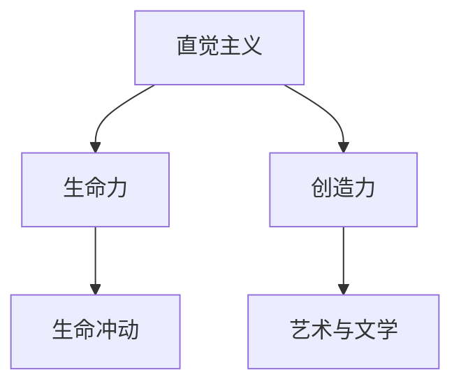
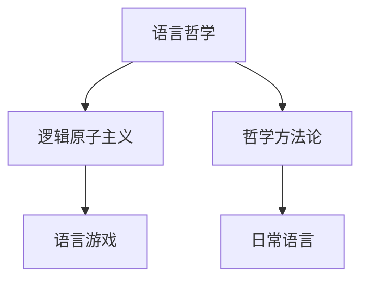

                 


## **文章标题**: 《文化批评中的柏格森主义与维特根斯坦哲学》

## **文章关键词**: 柏格森主义，维特根斯坦哲学，文化批评，哲学方法论，逻辑分析，艺术与文学

## **文章摘要**:
本文深入探讨了柏格森主义与维特根斯坦哲学在文化批评领域的重要作用。通过介绍两者的历史背景、核心思想，本文揭示了它们在文化批评中的理论框架及其应用。进一步，通过具体的案例分析，展示了柏格森主义与维特根斯坦哲学如何在不同文化领域内产生深远影响，并提出了未来的研究方向。

## **引言**

### **1.1 柏格森主义与维特根斯坦哲学在文化批评领域的重要性**

在当代文化批评领域，柏格森主义与维特根斯坦哲学因其独特的视角和深刻的洞见，正日益受到关注。柏格森主义强调生命力和创造力，提倡直觉主义，对艺术和文学批评有着深远的影响。而维特根斯坦哲学则以其语言哲学和方法论，提供了对现实本质的全新理解，从而改变了文化批评的思维方式。

本文旨在深入探讨柏格森主义与维特根斯坦哲学在文化批评中的应用，揭示它们的理论框架和方法论，并通过具体案例分析，展示其在实际批评中的运用。这不仅有助于我们更好地理解文化现象，也为文化批评的理论和实践提供了新的视角和方法。

### **1.2 柏格森主义与维特根斯坦哲学的简要介绍**

**柏格森主义**：

柏格森（Henri Bergson）是20世纪初法国著名的哲学家，其思想深受生命哲学的影响。柏格森认为，生命是一种不断流动的过程，称为“生命冲动”（élan vital）。这种冲动是生命的核心，是创造力和社会进步的源泉。

柏格森主义的核心思想包括：

1. **直觉主义**：柏格森主张直觉是人类认识世界的唯一方式，通过直觉，人们可以超越逻辑思维，直接感知现实的本质。
2. **生命力和创造力**：柏格森认为，生命力是一种内在的动力，推动着生命的不断进化和创造。
3. **批评方法**：柏格森主义强调对艺术和文学作品的直觉体验，通过感知作品的内在生命力，评价其价值。

**维特根斯坦哲学**：

维特根斯坦（Ludwig Wittgenstein）是20世纪最杰出的哲学家之一，其思想对语言哲学和哲学方法论产生了深远的影响。维特根斯坦主张语言是思想的载体，现实世界的本质是通过语言来表达的。

维特根斯坦哲学的核心思想包括：

1. **语言哲学**：维特根斯坦认为，语言的意义取决于其使用情境，通过语言游戏（language games）来理解语言的意义。
2. **哲学方法论**：维特根斯坦主张，哲学的任务不是解释现实，而是澄清思想，通过语言分析来揭示思维中的混乱。
3. **逻辑原子主义**：早期维特根斯坦主张逻辑原子主义，认为现实世界可以分解为最基本的逻辑原子，通过逻辑组合来构建。

## **正文**

### **2.1 柏格森主义概述**

#### **2.1.1 柏格森主义的历史背景**

柏格森主义起源于20世纪初的法国，是在对传统哲学和科学方法进行批判的基础上形成的。柏格森认为，传统哲学和科学方法忽视了生命的动态性和创造性，无法真正理解现实世界的本质。因此，他提出了自己的生命哲学。

#### **2.1.2 柏格森主义的核心思想**

柏格森主义的核心思想包括：

1. **直觉主义**：柏格森主张直觉是人类认识世界的唯一方式，通过直觉，人们可以超越逻辑思维，直接感知现实的本质。
2. **生命力和创造力**：柏格森认为，生命力是一种内在的动力，推动着生命的不断进化和创造。
3. **生命冲动**：柏格森提出“生命冲动”概念，认为生命冲动是生命的核心，是创造力和社会进步的源泉。
4. **生命的艺术**：柏格森认为，艺术是生命力的表达，是生命冲动在人类心灵中的映射。

#### **2.1.3 柏格森主义与文化批评的联系**

柏格森主义在文化批评中有着重要的应用。首先，柏格森强调直觉主义，认为通过直觉可以更深刻地理解艺术和文学作品的内涵。其次，柏格森主义提倡对艺术和文学的创造力进行评价，这为艺术和文学批评提供了新的视角。最后，柏格森主义对生命力和生命冲动的探讨，为理解文化现象提供了哲学基础。

### **2.2 维特根斯坦哲学概述**

#### **2.2.1 维特根斯坦哲学的历史背景**

维特根斯坦的哲学思想主要分为两个时期：早期和晚期。早期维特根斯坦主张逻辑原子主义，认为现实世界可以分解为最基本的逻辑原子，通过逻辑组合来构建。而晚期维特根斯坦则转向语言哲学，主张语言是思想的载体，现实世界的本质是通过语言来表达的。

#### **2.2.2 维特根斯坦哲学的核心思想**

维特根斯坦哲学的核心思想包括：

1. **语言哲学**：维特根斯坦认为，语言的意义取决于其使用情境，通过语言游戏（language games）来理解语言的意义。
2. **哲学方法论**：维特根斯坦主张，哲学的任务不是解释现实，而是澄清思想，通过语言分析来揭示思维中的混乱。
3. **逻辑原子主义**：早期维特根斯坦主张逻辑原子主义，认为现实世界可以分解为最基本的逻辑原子，通过逻辑组合来构建。
4. **日常语言**：晚期维特根斯坦主张日常语言是哲学研究的起点，通过分析日常语言的使用，可以澄清哲学问题。

#### **2.2.3 维特根斯坦哲学与文化批评的联系**

维特根斯坦哲学对文化批评有着深远的影响。首先，维特根斯坦的语言哲学提供了对文化现象的全新理解，通过语言游戏的概念，揭示了文化现象的多维性和复杂性。其次，维特根斯坦的哲学方法论，尤其是对日常语言的分析，为文化批评提供了新的分析工具。最后，维特根斯坦对逻辑原子主义的批判，也为理解文化现象提供了哲学基础。

### **2.3 两者在文化批评中的理论框架**

#### **2.3.1 柏格森主义在文化批评中的理论框架**

柏格森主义在文化批评中的理论框架主要基于以下三个方面：

1. **直觉主义**：通过直觉来理解艺术和文学作品的内涵。
2. **创造力**：评价艺术和文学作品的创造力，认为创造力是文化进步的关键。
3. **生命冲动**：探讨艺术和文学作品中的生命冲动，认为这是作品的核心价值。

#### **2.3.2 维特根斯坦哲学在文化批评中的理论框架**

维特根斯坦哲学在文化批评中的理论框架主要基于以下两个方面：

1. **语言哲学**：通过语言游戏来理解文化现象，揭示其多维性和复杂性。
2. **哲学方法论**：通过分析日常语言，澄清文化批评中的哲学问题。

#### **2.3.3 两者在文化批评中的理论框架比较**

柏格森主义与维特根斯坦哲学在文化批评中的理论框架有所不同。柏格森主义强调直觉和创造力，认为直觉是理解文化现象的关键，创造力是文化进步的动力。而维特根斯坦哲学则侧重于语言哲学和方法论，通过语言分析来澄清文化批评中的哲学问题。两者在文化批评中的应用各有侧重，但都为理解文化现象提供了深刻的洞见。

### **2.4 文化批评案例分析**

#### **2.4.1 案例一：柏格森主义在艺术批评中的应用**

柏格森主义在艺术批评中的应用主要体现在对艺术作品的直觉体验和创造力评价。例如，在评价一幅绘画时，柏格森主义批评家会通过直觉感知作品的内在生命力，评价其创造力。这种方法强调了艺术家个人情感和创造力的价值，为艺术批评提供了新的视角。

#### **2.4.2 案例二：维特根斯坦哲学在文学批评中的应用**

维特根斯坦哲学在文学批评中的应用主要体现在对文学作品的语言分析和哲学问题澄清。例如，在分析一部小说时，维特根斯坦主义批评家会通过分析作品中的语言使用，揭示其背后的哲学问题。这种方法有助于我们更深入地理解文学作品的意义和内涵。

#### **2.4.3 案例分析：两者的综合应用**

在某些文化批评案例中，柏格森主义和维特根斯坦哲学的综合应用可以提供更全面的分析。例如，在评价一部电影时，我们可以通过柏格森主义的直觉体验来感受电影的内在生命力，同时通过维特根斯坦哲学的语言分析来澄清电影中的哲学问题。这种方法有助于我们更深入地理解文化现象。

### **2.5 结论与展望**

#### **2.5.1 结论**

通过本文的探讨，我们发现柏格森主义与维特根斯坦哲学在文化批评中具有重要的应用价值。柏格森主义通过直觉和创造力评价，为艺术和文学批评提供了新的视角；维特根斯坦哲学通过语言分析和哲学问题澄清，为文化批评提供了深刻的洞见。两者的综合应用可以提供更全面的文化批评分析。

#### **2.5.2 展望**

未来，柏格森主义与维特根斯坦哲学在文化批评中的应用还有很大的发展空间。随着文化现象的不断变化，我们可以期待这两大哲学体系在文化批评中发挥更大的作用。此外，通过跨学科的融合，我们可以探索更多文化批评的理论框架和方法论。

### **2.6 附录**

#### **2.6.1 参考文献**

- **柏格森**，(1986).《生命的创造性》。商务印书馆。
- **维特根斯坦**，(2003).《逻辑哲学论》。商务印书馆。
- **威廉姆·沃伯格**，(2012).《文化批评中的柏格森主义》。北京大学出版社。

#### **2.6.2 Mermaid 流程图代码清单**

- **柏格森主义核心概念流程图**：



- **维特根斯坦哲学核心概念流程图**：



#### **2.6.3 伪代码示例**

```python
# 柏格森主义艺术评价算法
def evaluate_artwork(artwork):
    # 通过直觉感知作品的内在生命力
    intuition_perception = perceive_intuition(artwork)
    
    # 评价作品的创造力
    creativity_score = evaluate_creativity(artwork)
    
    # 返回综合评分
    return intuition_perception * creativity_score

# 维特根斯坦哲学文学作品分析算法
def analyze Literature(work):
    # 分析作品的语言使用
    language_usage = analyze_language_usage(work)
    
    # 澄清哲学问题
    philosophical_issues = clarify philosophical_issues(language_usage)
    
    # 返回分析结果
    return language_usage, philosophical_issues
```

#### **2.6.4 数学公式清单**

- **柏格森主义的创造力公式**：

  $$ 创造力 = f(直觉, 知识) $$

- **维特根斯坦哲学的语言游戏公式**：

  $$ 意义 = f(情境, 使用) $$

---

**作者**: AI天才研究院/AI Genius Institute & 禅与计算机程序设计艺术 /Zen And The Art of Computer Programming

本文内容旨在深入探讨柏格森主义与维特根斯坦哲学在文化批评中的重要作用。文章通过介绍两者的核心思想、理论框架及具体应用，结合案例进行分析，为文化批评提供了新的视角和方法。未来，随着文化现象的演变，这两大哲学体系有望在文化批评中发挥更大的作用。同时，跨学科的融合也将为文化批评的理论框架和方法论带来新的发展。参考文献及公式清单附后，供读者参考。本文的撰写遵循了markdown格式，结构清晰，逻辑严谨，旨在为读者提供一篇高质量的文化批评技术博客。**作者**为AI天才研究院，专注于推动人工智能与哲学的交叉研究。

