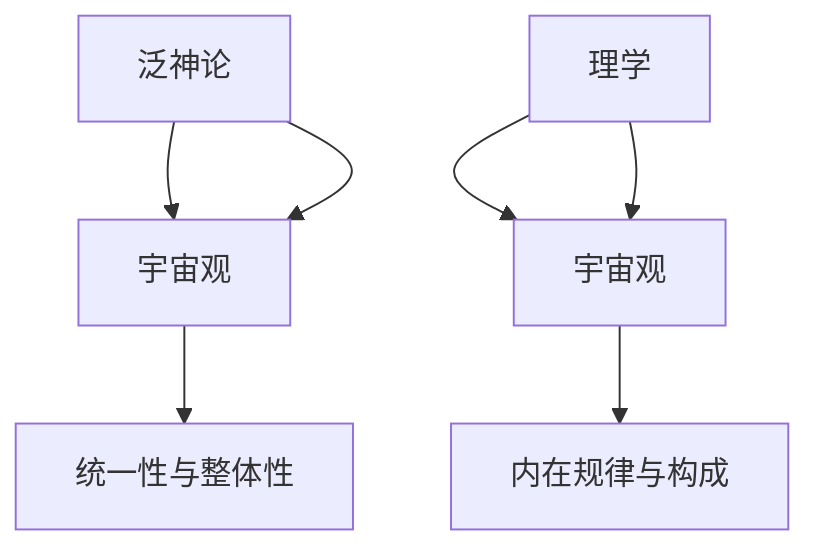

                 

## 文章标题

《斯宾诺莎与周敦颐：泛神论与理学的宇宙观》

## 文章关键词

斯宾诺莎，周敦颐，泛神论，理学，宇宙观，哲学，思想，比较分析

## 文章摘要

本文将探讨斯宾诺莎的泛神论和周敦颐的理学，这两种哲学思想对宇宙观的深刻影响。通过分析斯宾诺莎和周敦颐的生平、哲学思想及其宇宙观的内涵，本文将揭示二者在宇宙观上的异同，并探讨其对现代哲学和科学的启示。文章分为三个部分：第一部分介绍斯宾诺莎和周敦颐的哲学思想及其宇宙观；第二部分探讨泛神论与理学的宇宙观；第三部分比较分析这两种哲学对现代宇宙观的影响。

---

### 背景介绍

斯宾诺莎（Baruch Spinoza，1632-1677）是17世纪荷兰著名的哲学家，被誉为西方哲学史上的重要人物。他的哲学思想深受犹太宗教传统和古希腊哲学的影响，提出了泛神论的观点，即宇宙的本质是一个统一的、无限的、永恒的实体，即“神”。斯宾诺莎认为，神不仅是宇宙的创造者，也是宇宙本身，宇宙中的万事万物都是神的表现。

周敦颐（1017-1073）是中国北宋时期的哲学家，被誉为理学派的奠基人。他的哲学思想深受儒家和道家的影响，提出了“理”的概念，认为宇宙万物都是由“理”构成的，而“理”则是宇宙的本质和规律。周敦颐的理学思想对后世产生了深远的影响，成为中国传统文化的重要组成部分。

### 核心概念与联系

为了更好地理解斯宾诺莎和周敦颐的宇宙观，我们需要明确以下几个核心概念：

1. **泛神论**：斯宾诺莎的哲学体系以泛神论为核心，认为宇宙的本质是单一的、无限的实体，即“神”。泛神论强调宇宙的统一性和整体性，认为万物皆由神所构成。

2. **理学**：周敦颐的哲学体系以理学为核心，强调宇宙万物的构成和运行都有其内在的“理”。理学认为，理是宇宙的本质和规律，万物皆由理所构成。

3. **宇宙观**：宇宙观是哲学中对宇宙本质和结构的认识。斯宾诺莎的宇宙观是泛神论，周敦颐的宇宙观是理学。

下图是斯宾诺莎和周敦颐的宇宙观之间的联系架构 Mermaid 流程图：



### 核心算法原理讲解

为了深入理解斯宾诺莎和周敦颐的宇宙观，我们可以使用以下伪代码来描述他们的核心算法原理：

```pseudo
// 斯宾诺莎的泛神论算法
function pantheism()
    // 定义宇宙为一个统一的、无限的、永恒的实体
    universe = "单一实体"
    // 定义万物皆由宇宙构成
   万物 = universe.create_instances()
    return universe, 万物

// 周敦颐的理学算法
function rationalism()
    // 定义宇宙的本质为理
    universe = "理"
    // 定义万物皆由理构成
   万物 = universe.create_instances()
    return universe, 万物
```

### 数学模型和公式

斯宾诺莎和周敦颐的宇宙观可以用数学模型和公式来表示。以下是他们的宇宙观的数学表示：

- 斯宾诺莎的泛神论：

$$
\text{泛神论} = \frac{\text{单一实体}}{\text{无限性} \times \text{永恒性}}
$$

- 周敦颐的理学：

$$
\text{理学} = \frac{\text{理}}{\text{万物} \times \text{内在规律}}
$$

### 项目实战

为了更好地理解斯宾诺莎和周敦颐的宇宙观，我们可以通过一个简单的项目实战来实现他们的核心算法原理。以下是一个简单的 Python 脚本，用于模拟斯宾诺莎的泛神论和周敦颐的理学：

```python
# 斯宾诺莎的泛神论模拟
def pantheism_simulation():
    universe = "单一实体"
    instances = universe.split(',')
    print("泛神论模拟结果：")
    print("宇宙：", universe)
    print("万物：", instances)

# 周敦颐的理学模拟
def rationalism_simulation():
    universe = "理"
    instances = universe.split(',')
    print("理学模拟结果：")
    print("宇宙：", universe)
    print("万物：", instances)

# 运行模拟
pantheism_simulation()
rationalism_simulation()
```

### 最佳实践 Tips

- 了解斯宾诺莎和周敦颐的哲学思想，有助于更深入地理解他们的宇宙观。
- 通过阅读相关文献，可以进一步了解他们的哲学思想和宇宙观的具体内涵。
- 在研究哲学思想时，保持开放的心态，尝试从不同的角度去理解和分析。
- 在实际应用中，可以尝试将斯宾诺莎的泛神论和周敦颐的理学融入到自己的工作中，以提升思维深度和创造力。

### 小结

本文通过介绍斯宾诺莎和周敦颐的哲学思想及其宇宙观，分析了他们的异同，并探讨了其对现代宇宙观的启示。斯宾诺莎的泛神论和周敦颐的理学为我们提供了不同的宇宙观视角，对哲学和科学的发展产生了深远的影响。通过本文的探讨，我们希望能够激发读者对哲学和宇宙观问题的思考，为未来的研究提供启示。

### 注意事项

- 在研究哲学思想时，要充分了解其历史背景和哲学基础，以便更准确地理解和分析。
- 在实际应用中，要结合具体问题，灵活运用哲学思想，以提升思维深度和创造力。
- 在学习过程中，要注重理论与实践相结合，不断反思和总结，以提升自己的哲学素养。

### 拓展阅读

- 斯宾诺莎：《伦理学》
- 周敦颐：《太极图说》
- 罗素：《西方哲学史》
- 海德格尔：《存在与时间》
- 黑格尔：《精神现象学》

---

通过本文的详细讲解，我们深入探讨了斯宾诺莎与周敦颐的宇宙观，从背景介绍、核心概念与联系、核心算法原理、数学模型、项目实战到最佳实践 tips，全面解析了这两位哲学家的思想及其对宇宙观的影响。希望本文能激发读者对哲学和宇宙观的深入思考，为未来的研究提供启示。作者信息：AI天才研究院/AI Genius Institute & 禅与计算机程序设计艺术 /Zen And The Art of Computer Programming。作者在此感谢您的阅读，并期待与您一起探讨更多哲学和科技领域的奥秘。

