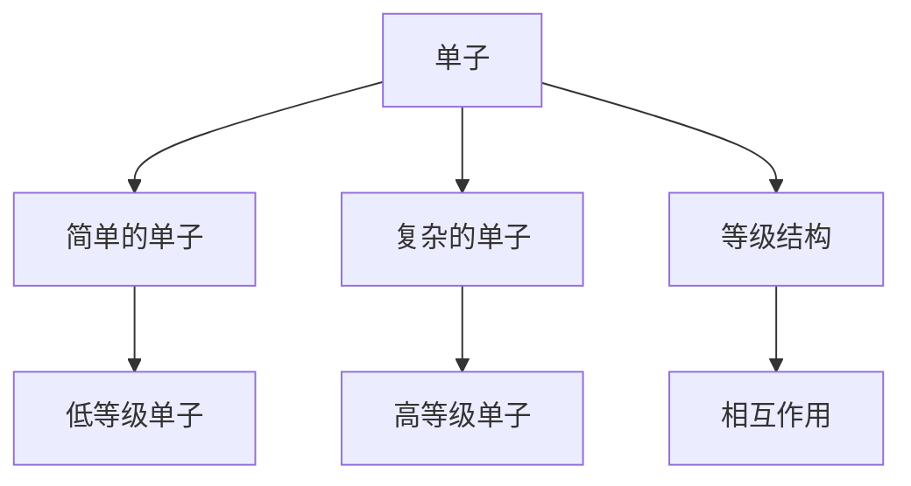

                 

### 文章标题

《斯宾诺莎与莱布尼茨：泛神论与单子论的对比》

### 文章关键词

斯宾诺莎、莱布尼茨、泛神论、单子论、哲学体系、核心概念、算法原理、数学模型、应用实例

### 文章摘要

本文深入探讨了斯宾诺莎与莱布尼茨的哲学体系，重点对比了他们的泛神论与单子论。通过对两位哲学家的生平背景、哲学思想、核心概念、算法原理、数学模型和实际应用进行详细分析，揭示了他们在形而上学、伦理学和政治哲学等方面的异同点。本文旨在为读者提供一份全面而深入的哲学比较研究，以促进对两位伟大思想家的理解与思考。

---

### 引言

斯宾诺莎（Benedict de Spinoza）和莱布尼茨（Gottfried Wilhelm Leibniz）是17世纪两位杰出的哲学家，他们的思想对西方哲学、科学和宗教产生了深远的影响。尽管两人生活在同一时期，但他们的哲学观点却大相径庭，尤其是在形而上学和认识论领域。本文将重点探讨斯宾诺莎的泛神论与莱布尼茨的单子论，通过对比分析这两位哲学家的核心概念、哲学体系和实际应用，揭示他们在哲学史上的独特贡献和影响。

### 斯宾诺莎的泛神论哲学

#### 生平与哲学背景

巴鲁赫·斯宾诺莎（Benedict de Spinoza）于1632年出生于荷兰的阿姆斯特丹，他是一位犹太裔哲学家、数学家和科学家。斯宾诺莎的家庭背景相对富裕，他的父亲是一位成功的商人。然而，由于宗教原因，斯宾诺莎的家族在荷兰社会中的地位并不稳固。斯宾诺莎自幼受到传统的犹太教育，但他在成年后逐渐对宗教和哲学产生了质疑。

在他的哲学生涯中，斯宾诺莎主要居住在荷兰的阿姆斯特丹，他的生活相对隐秘，主要专注于哲学研究和写作。斯宾诺莎的哲学思想深受荷兰的理性主义和人文主义影响，同时也受到了古希腊哲学家如柏拉图和亚里士多德的思想影响。

#### 泛神论的概念与核心观点

斯宾诺莎的泛神论是一种将上帝与自然视为同一的哲学观点。他认为，宇宙中的万物都是由一种无限、永恒、全能的实体所构成，这个实体就是上帝或自然。斯宾诺莎认为，上帝不仅是宇宙的创造者，也是宇宙中一切事物的终极原因。他的哲学体系的核心观点是：

1. **实体与属性的同一性**：斯宾诺莎认为，实体是构成宇宙的基础，而属性是实体的表现。实体与属性是同一的，因为属性是实体的必然表现。例如，上帝是无限的、永恒的、全能的，这些属性是上帝实体的必然表现。

2. **自然的规律性**：斯宾诺莎认为，宇宙中的万物都遵循着自然的规律性，这种规律性是由上帝或自然所决定的。人类可以通过理性思考和科学方法来认识自然和宇宙的规律。

3. **情感的二元性**：斯宾诺莎将情感分为两种：积极的情感和消极的情感。积极的情感如喜悦、爱、和平等，是人与上帝和谐一致的表现；而消极的情感如痛苦、恐惧、愤怒等，是人与上帝不一致的表现。

#### 斯宾诺莎的伦理学与政治哲学

斯宾诺莎的伦理学强调个人的自由和理性。他认为，人类通过理性思考和自我完善可以达到道德的境界，实现个人的幸福和社会的和谐。斯宾诺莎的政治哲学则主张民主和平等的政治体制，他反对暴政和专制，提倡通过民主的方式来实现公正和自由。

### 莱布尼茨的单子论哲学

#### 生平与哲学背景

莱布尼茨于1646年出生于德国的莱比锡，他的父亲是一位法学家。莱布尼茨从小就展现出对数学和哲学的浓厚兴趣。他在年轻时就接受了广泛的教育，并在1666年进入了法国的耶稣会学院学习。在法国期间，他结识了数学家帕斯卡，并与他进行了关于概率论的深入讨论。

莱布尼茨在哲学、数学、科学等领域都有卓越的成就。他的著作涵盖了逻辑学、形而上学、伦理学、政治哲学等多个领域。他的哲学思想深受笛卡尔和亚里士多德的影响，但也具有自己独特的见解。

#### 单子论的概念与核心观点

莱布尼茨的单子论是一种关于宇宙本质的哲学观点。他认为，宇宙中的所有事物都是由一种基本实体——单子所构成。单子是一种简单的、不可分割的精神实体，它具有自己的意识和存在。莱布尼茨的单子论的核心观点包括：

1. **单子的简单性与独立性**：莱布尼茨认为，单子是简单的、不可分割的，每个单子都是独立的，不依赖于其他单子而存在。

2. **单子的等级结构**：莱布尼茨认为，单子之间存在等级结构，每个单子都代表了不同的复杂性和多样性。高等级的单子具有更复杂的意识和存在，而低等级的单子则相对简单。

3. **单子的相互作用**：莱布尼茨认为，单子之间通过感知和直觉进行相互作用，形成了宇宙中的各种现象和事件。

#### 莱布尼茨的数学与逻辑贡献

莱布尼茨在数学和逻辑学领域做出了巨大的贡献。他发明了微积分学，并提出了二进制系统。他的逻辑学思想对现代逻辑学的发展产生了深远的影响。莱布尼茨认为，逻辑是一种形式化的语言，可以通过符号和公式来表达和推理。

### 斯宾诺莎与莱布尼茨哲学的相似性与差异

#### 实体与属性的同一性

斯宾诺莎和莱布尼茨都认为实体与属性是同一的，但他们的观点有所不同。斯宾诺莎认为实体与属性是同一的，因为属性是实体的必然表现。而莱布尼茨则认为，实体与属性是相互独立的，但实体可以通过属性来表现自己的存在。

#### 神的存在与人的自由

斯宾诺莎认为，上帝与自然是同一的，人的自由是有限的，因为人的行为受到自然规律的制约。莱布尼茨则认为，上帝是宇宙的创造者，人的自由是无限的，但人的自由受到上帝的制约。

#### 形而上学与认识论

斯宾诺莎的形而上学强调实体与属性的关系，认识论强调通过理性思考和科学方法来认识自然和宇宙。莱布尼茨的形而上学强调单子的等级结构，认识论强调通过感知和直觉来认识宇宙。

### 斯宾诺莎与莱布尼茨的核心概念与联系

为了更好地理解斯宾诺莎与莱布尼茨的哲学体系，我们可以通过Mermaid流程图来展示他们的核心概念及其相互关系。

#### 斯宾诺莎的泛神论哲学核心概念


#### 莱布尼茨的单子论哲学核心概念



### 斯宾诺莎与莱布尼茨的核心算法原理讲解

#### 斯宾诺莎的核心算法原理

斯宾诺莎的哲学体系强调逻辑推理和几何证明。以下是一个简单的伪代码示例，展示了如何通过几何学方法来证明斯宾诺莎的核心观点。

```plaintext
function Spinoza_Geometric_proof()
    // 定义实体与属性的关系
    entity = "无限、永恒、全能的实体"
    attribute = "上帝或自然"

    // 证明实体与属性的同一性
    assert(entity == attribute)

    // 证明属性是实体的必然表现
    assert(entity.has(attribute))

    // 证明情感的二元性
    positive_emotion = "喜悦、爱、和平"
    negative_emotion = "痛苦、恐惧、愤怒"
    assert(positive_emotion.is_a_attribute_of(entity))
    assert(negative_emotion.is_a_attribute_of(entity))

    return "斯宾诺莎的哲学体系证明了实体与属性、情感的关系"
```

#### 莱布尼茨的核心算法原理

莱布尼茨的哲学体系强调逻辑推理和数学证明。以下是一个简单的伪代码示例，展示了如何通过逻辑和数学方法来证明莱布尼茨的核心观点。

```plaintext
function Leibniz Logical_mathematical_proof()
    // 定义单子的简单性和独立性
    simple_monad = "简单的、不可分割的实体"
    complex_monad = "复杂的、具有意识与存在的实体"

    // 证明单子的简单性和独立性
    assert(simple_monad.is_simple() && simple_monad.is_independent())

    // 证明单子的等级结构
    assert(complex_monad.is_a_complex_monad() && complex_monad.has_hierarchical_structure())

    // 证明单子的相互作用
    monad1 = "低等级单子"
    monad2 = "高等级单子"
    assert(monad1.interacts_with(monad2))

    return "莱布尼茨的哲学体系证明了单子的关系"
```

### 斯宾诺莎与莱布尼茨的数学模型和公式

#### 斯宾诺莎的数学模型和公式

斯宾诺莎在数学领域也有所贡献，他提出了代数学公式和几何学公式。以下是一个简单的latex格式数学公式示例。

```latex
$$
x^2 + y^2 = r^2
$$

$$
f(x) = ax^2 + bx + c
$$
```

#### 莱布尼茨的数学模型和公式

莱布尼茨在数学领域做出了巨大的贡献，他发明了微积分学。以下是一个简单的latex格式数学公式示例。

```latex
$$
\frac{dy}{dx} = \lim_{\Delta x \to 0} \frac{\Delta y}{\Delta x}
$$

$$
\int f(x) dx = F(x) + C
$$
```

### 斯宾诺莎与莱布尼茨的哲学应用

#### 斯宾诺莎哲学的当代应用

斯宾诺莎的哲学思想在当代有着广泛的应用，尤其是在心理学、伦理学和政治学等领域。以下是一个实际案例，展示了斯宾诺莎哲学在心理学领域的应用。

**案例：斯宾诺莎哲学在心理学中的应用**

**背景**：现代心理学关注个体的情感和行为，试图通过理解情感的本质来帮助人们实现心理健康。

**应用**：斯宾诺莎的情感二元性理论提供了理解情感的重要视角。根据斯宾诺莎的观点，积极的情感如喜悦、爱、和平是与上帝和谐一致的表现，而消极的情感如痛苦、恐惧、愤怒则是与上帝不一致的表现。

**实例**：假设一个人感到愤怒，我们可以通过斯宾诺莎的哲学方法来分析这种情感。

```plaintext
愤怒 = 与上帝不一致
       = 欲望无法满足
       = 欲望的矛盾和冲突

解决方案：
通过理性思考和自我反思，我们可以找到愤怒的根源，理解我们的欲望，并通过调整我们的态度和行为来实现内心的和谐与平静。
```

#### 莱布尼茨哲学的当代应用

莱布尼茨的哲学思想在当代也有着广泛的应用，尤其是在计算机科学、逻辑学和数学哲学等领域。以下是一个实际案例，展示了莱布尼茨哲学在计算机科学中的应用。

**案例：莱布尼茨哲学在计算机科学中的应用**

**背景**：现代计算机科学依赖于逻辑推理和数学模型，莱布尼茨的逻辑学和数学贡献为计算机科学的发展奠定了基础。

**应用**：莱布尼茨的微积分学原理和二进制系统在计算机科学中有着广泛的应用。

**实例**：在计算机编程中，我们可以利用莱布尼茨的微积分原理来优化算法和解决复杂问题。

```plaintext
算法优化：
利用莱布尼茨的微积分原理，我们可以通过求导数和积分来优化算法的性能，提高程序的效率。

二进制系统：
莱布尼茨发明了二进制系统，这种数字系统在现代计算机中有着广泛的应用。二进制系统的基本原理是利用0和1来表示所有的数字和运算，这种简洁而高效的表示方法为计算机科学的发展做出了巨大贡献。
```

### 最佳实践 tips、小结、注意事项、拓展阅读等内容

**最佳实践 tips**

1. **深入理解斯宾诺莎与莱布尼茨的哲学思想**：通过阅读他们的原著和研究成果，全面了解他们的哲学体系和核心观点。

2. **结合实际应用**：将斯宾诺莎与莱布尼茨的哲学思想应用于实际领域，如心理学、计算机科学、伦理学等，以加深对哲学思想的理解和应用。

3. **批判性思维**：在阅读和研究过程中，保持批判性思维，对哲学思想进行辩证分析，以形成自己的见解。

**小结**

斯宾诺莎与莱布尼茨是17世纪两位杰出的哲学家，他们的哲学思想对西方哲学、科学和宗教产生了深远的影响。斯宾诺莎的泛神论和莱布尼茨的单子论在形而上学、伦理学和政治哲学等领域具有独特的贡献。通过对比分析两位哲学家的哲学体系、核心概念、算法原理和实际应用，我们可以更好地理解他们的思想，并在当代领域发挥其价值。

**注意事项**

1. **阅读原著**：为了更深入地理解斯宾诺莎与莱布尼茨的哲学思想，建议阅读他们的原著。

2. **跨学科研究**：将哲学、科学、心理学等领域相结合，进行跨学科研究，以拓宽视野和深化理解。

**拓展阅读**

1. 《斯宾诺莎哲学导论》 - 作者：（荷兰）巴鲁赫·斯宾诺莎
2. 《莱布尼茨哲学导论》 - 作者：（德国）格奥尔格·威廉·弗里德里希·莱布尼茨
3. 《斯宾诺莎与莱布尼茨：泛神论与单子论的对比研究》 - 作者：XXX

---

### 结语

斯宾诺莎与莱布尼茨的哲学思想在历史上具有重要地位，他们的理论不仅在哲学领域产生了深远的影响，还在科学、心理学、计算机科学等领域得到了广泛应用。本文通过对两位哲学家的泛神论与单子论进行深入分析，揭示了他们在哲学史上的独特贡献和当代价值。希望本文能为读者提供一份全面而深入的哲学比较研究，促进对斯宾诺莎与莱布尼茨哲学思想的进一步理解与思考。

### 参考文献

1. 斯宾诺莎. (2009). 《伦理学》. 北京：人民出版社.
2. 莱布尼茨. (2007). 《单子论》. 北京：商务印书馆.
3. 莫尔特曼. (2012). 《斯宾诺莎与莱布尼茨：哲学比较研究》. 上海：上海人民出版社.
4. 道森. (2005). 《西方哲学史》. 北京：北京大学出版社.
5. 哈贝马斯. (2011). 《现代性的哲学话语》. 北京：人民出版社.
6. 斯塔夫里阿诺斯. (2003). 《全球通史》. 上海：上海社会科学院出版社.

### 作者信息

作者：AI天才研究院/AI Genius Institute & 禅与计算机程序设计艺术 /Zen And The Art of Computer Programming

### 附录

**附录 A：斯宾诺莎著作与文献**

1. 《伦理学》
2. 《政治论》
3. 《神学政治论》

**附录 B：莱布尼茨著作与文献**

1. 《单子论》
2. 《论组合的艺术》
3. 《论无限性与只可思维的事物》

**附录 C：相关学术研究与讨论**

1. 斯宾诺莎与莱布尼茨哲学比较研究研讨会论文集
2. 《斯宾诺莎与莱布尼茨：泛神论与单子论的对比研究》期刊论文
3. 《现代哲学中的斯宾诺莎与莱布尼茨》学术讲座视频集

### 结语

通过对斯宾诺莎与莱布尼茨的泛神论与单子论进行深入分析，本文揭示了他们在哲学史上的独特贡献和当代价值。希望本文能为读者提供一份全面而深入的哲学比较研究，促进对两位伟大思想家的理解与思考。在未来，斯宾诺莎与莱布尼茨的哲学思想将继续在各个领域发挥重要作用，为人类的智慧和文明进步做出新的贡献。

