                 


# 文章标题
《斯拉沃热·齐泽克的意识形态批判与技术选型：工具选择的精神分析》

## 文章关键词
斯拉沃热·齐泽克，意识形态批判，技术选型，工具选择，精神分析

## 摘要
本文旨在探讨斯拉沃热·齐泽克的意识形态批判理论在技术选型领域的应用，以及如何通过精神分析视角来理解工具选择的过程。首先，我们回顾了齐泽克的意识形态批判理论，包括其核心概念和批判方法。接着，分析了技术选型中意识形态的影响，并提出了相应的批判策略。随后，我们引入了精神分析理论，探讨了其在工具选择中的重要性。最后，通过实际案例，我们展示了如何将意识形态批判和精神分析应用于技术选型过程中，以实现更合理的决策。

## 第1章 意识形态批判导论

### 1.1 意识形态的概念与作用

意识形态是一种复杂的社会现象，它不仅仅是一种思想体系，更是社会关系和权力结构的反映。在马克思主义理论中，意识形态被视为统治阶级为了维持其统治地位而创造的一种虚假意识，它通过操纵人们的思想，掩盖社会的不平等和阶级斗争。意识形态的作用在于引导人们的价值观和行为，使社会秩序得以维持。

**核心概念与联系：**

意识形态的概念与几个关键概念紧密相连：

1. **意识形态与思想体系**：意识形态是特定的思想体系，它包含一系列的信念、价值观和观念。这些思想体系不仅反映了个人的世界观，还反映了社会的利益和权力结构。
2. **意识形态与权力**：意识形态与权力密不可分。统治阶级通过意识形态来巩固其权力，使社会成员接受和服从其统治。意识形态不仅是权力的工具，也是权力斗争的场所。
3. **意识形态与社会结构**：意识形态与社会结构相互影响。社会结构中的不平等和权力关系通过意识形态得以合法化，而意识形态又反过来影响社会结构的变迁。

以下是一个用Mermaid绘制的流程图，展示了这些概念之间的联系：

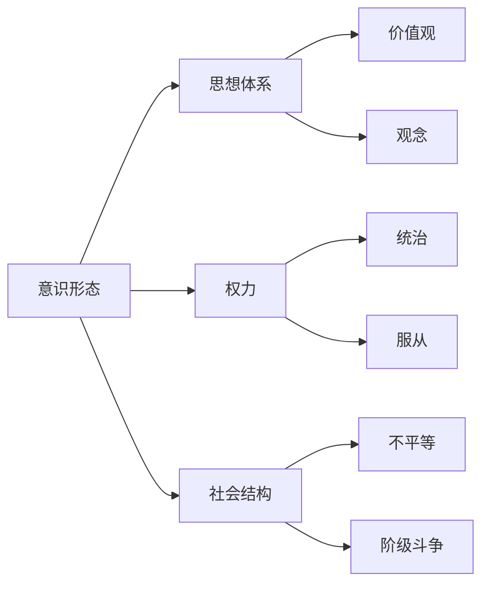

**核心算法原理讲解：**

我们可以将意识形态的作用看作是一种算法，该算法通过以下步骤来影响个体的行为：

1. **输入**：个体的经验、教育和信息。
2. **处理**：意识形态将输入的信息进行筛选和加工，使其符合统治阶级的利益和价值观。
3. **输出**：经过处理的信息被转化为个体的信仰、态度和行为。

以下是一个伪代码示例：

```python
def ideological_influence(input_data):
    # 过滤和加工输入数据
    processed_data = filter_and_process(input_data)
    # 传播意识形态价值观
    output_data = propagate_ideology(processed_data)
    return output_data
```

### 1.2 齐泽克的意识形态批判理论

斯拉沃热·齐泽克是20世纪最具影响力的哲学家之一，他的意识形态批判理论对当代哲学、文化和社会科学产生了深远影响。齐泽克的意识形态批判理论不仅仅是对马克思主义意识形态的继承和发展，更是对现代社会中意识形态现象的深刻反思。

**核心概念与联系：**

齐泽克的意识形态批判理论主要包含以下几个核心概念：

1. **意识形态是现实的内核**：齐泽克认为，意识形态不仅仅是虚假的意识，它更是社会现实的内核，渗透到社会的各个层面。意识形态不仅影响人们的思想和行为，还构成了社会的基本结构和运作机制。
2. **意识形态的机制**：齐泽克强调，意识形态通过一系列机制来维持其统治地位。这些机制包括符号秩序、叙事和意识形态机器等。
3. **意识形态的危机**：齐泽克认为，意识形态并非一成不变，它会随着社会的发展和变化而产生危机。意识形态的危机是革命性变革的契机，它为新的意识形态的诞生提供了可能。

以下是一个用Mermaid绘制的流程图，展示了这些概念之间的联系：

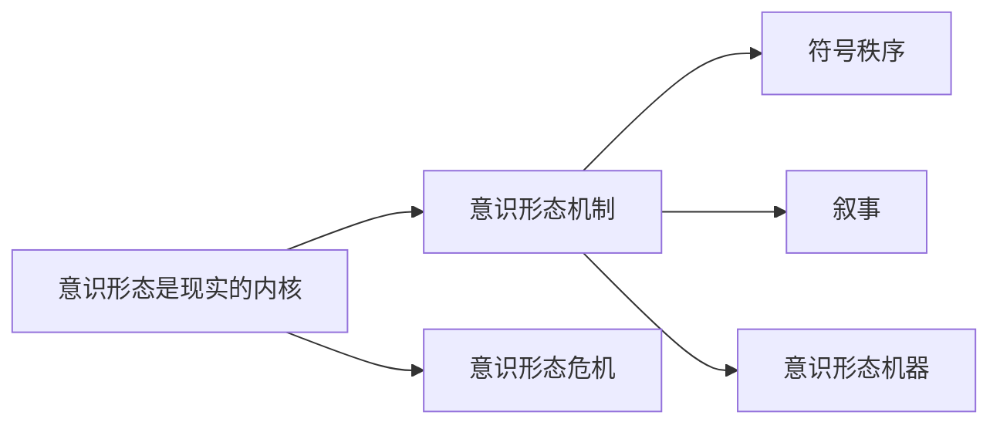

**核心算法原理讲解：**

我们可以将齐泽克的意识形态批判理论看作是一种算法，该算法通过以下步骤来揭示和批判意识形态：

1. **输入**：社会的现实现象和个体的行为。
2. **处理**：通过对现象和行为进行符号分析和叙事解读，揭示其背后的意识形态机制。
3. **输出**：批判和反思意识形态的运作，提出改变和革命的方案。

以下是一个伪代码示例：

```python
def critical_analysis(input_data):
    # 符号分析
    symbol_analysis = analyze_symbols(input_data)
    # 叙事解读
    narrative_analysis = analyze_narratives(input_data)
    # 揭示意识形态机制
    ideology_mechanism = reveal_ideology_mechanisms(symbol_analysis, narrative_analysis)
    # 批判和反思
    critique_and_reflection = criticize_ideology(ideology_mechanism)
    return critique_and_reflection
```

### 1.3 意识形态批判的意义与方法

意识形态批判对于理解社会现象和推动社会变革具有重要意义。通过批判意识形态，我们可以揭示社会现实中的虚假和欺骗，激发人们的觉醒和反抗，推动社会的进步和发展。

**核心概念与联系：**

意识形态批判的意义和方法主要包括以下几个方面：

1. **揭示虚假现实**：意识形态批判旨在揭示社会现实中的虚假和欺骗，使人们认识到现实并非自然形成，而是受到意识形态的操纵和塑造。
2. **激发觉醒与反抗**：通过批判意识形态，人们可以意识到自己被意识形态所操纵，从而激发觉醒和反抗，争取真正的自由和解放。
3. **推动社会进步**：意识形态批判不仅是理论的任务，更是实践的行动。通过批判和反思，我们可以提出改变和革命的方案，推动社会的进步和发展。

以下是一个用Mermaid绘制的流程图，展示了意识形态批判的意义和方法：

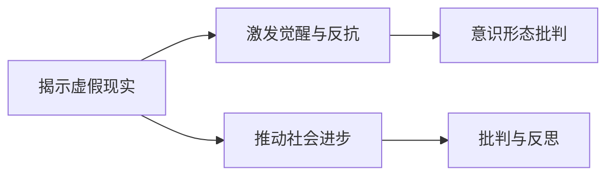

**核心算法原理讲解：**

我们可以将意识形态批判的方法看作是一种算法，该算法通过以下步骤来实现：

1. **输入**：社会的现实现象和个体的体验。
2. **处理**：通过对现象和体验进行批判性分析，揭示其背后的意识形态机制。
3. **输出**：提出批判和反思的结论，指导实践行动。

以下是一个伪代码示例：

```python
def ideological_critique(input_data):
    # 批判性分析
    critical_analysis = analyze_critically(input_data)
    # 揭示意识形态机制
    ideology_mechanism = reveal_ideology_mechanisms(critical_analysis)
    # 批判与反思
    critique_and_reflection = criticize_ideology(ideology_mechanism)
    # 指导实践行动
    action_guidance = guide_practice(critique_and_reflection)
    return action_guidance
```

## 第2章 齐泽克的意识形态批判理论分析

### 2.1 齐泽克对马克思主义意识形态的批判

斯拉沃热·齐泽克作为20世纪最具影响力的哲学家之一，他对马克思主义意识形态进行了深刻的批判和重新解读。齐泽克对马克思主义意识形态的批判主要围绕着马克思的理论遗产，特别是在意识形态的概念、阶级斗争的分析以及革命的可能性等方面。

**核心概念与联系：**

齐泽克的批判主要基于以下几个核心概念：

1. **意识形态的封闭性**：齐泽克认为，马克思的意识形态概念存在封闭性。马克思将意识形态视为虚假的意识，是对现实的掩盖。然而，齐泽克指出，这种封闭性导致了对意识形态的过度简化，忽视了意识形态的复杂性和多样性。
2. **阶级斗争的矛盾性**：齐泽克对马克思的阶级斗争理论提出了质疑。他认为，马克思的阶级斗争理论过于理想化，忽视了阶级斗争中的矛盾性和复杂性。齐泽克认为，阶级斗争不仅存在于生产关系层面，也存在于意识形态层面。
3. **革命的可能性**：齐泽克对马克思的革命理论提出了批判。他认为，马克思的革命理论过于乐观，忽视了革命过程中可能出现的混乱和不确定性。齐泽克认为，革命并非必然的结局，而是需要不断斗争和重建的过程。

以下是一个用Mermaid绘制的流程图，展示了这些概念之间的联系：

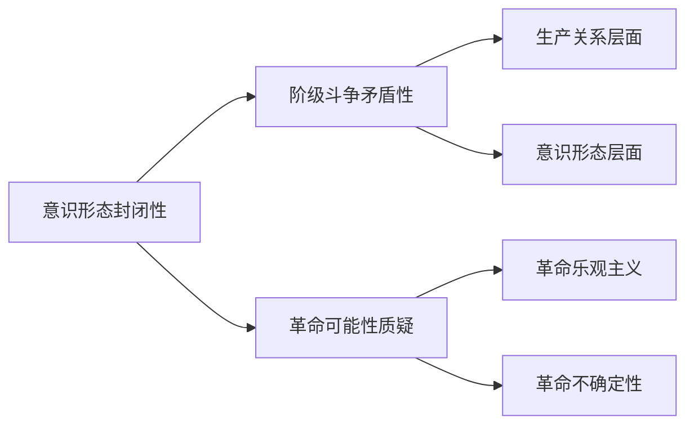

**核心算法原理讲解：**

我们可以将齐泽克对马克思主义意识形态的批判看作是一种算法，该算法通过以下步骤来实现：

1. **输入**：马克思的意识形态概念、阶级斗争理论和革命理论。
2. **处理**：批判性地分析这些理论，揭示其局限性。
3. **输出**：提出对马克思主义意识形态的新解读，强调意识形态的复杂性和阶级斗争的矛盾性。

以下是一个伪代码示例：

```python
def critique_marxist_ideology(input_data):
    # 批判性分析
    critical_analysis = analyze_critically(input_data)
    # 揭示局限性
    limitations = reveal_limitations(critical_analysis)
    # 提出新解读
    new_interpretation = propose_new_interpretation(limitations)
    return new_interpretation
```

### 2.2 齐泽克对资本主义意识形态的批判

齐泽克对资本主义意识形态的批判是其意识形态理论的重要组成部分。他深入剖析了资本主义社会的运作机制，揭示了资本主义意识形态的操纵性和虚假性。齐泽克的批判不仅针对资本主义的经济基础，还涵盖了其文化、政治和社会层面。

**核心概念与联系：**

齐泽克的批判主要基于以下几个核心概念：

1. **资本主义意识形态的虚假性**：齐泽克认为，资本主义意识形态通过一系列虚假的承诺和愿景，掩盖了社会的不平等和剥削。资本主义意识形态承诺自由、平等和机会，但实际上却制造了更多的阶级差距和权力不公。
2. **意识形态机器**：齐泽克提出了“意识形态机器”的概念，认为资本主义意识形态通过一系列机制来维持其统治地位。这些机制包括教育、媒体、法律和政治等，它们共同构成了资本主义意识形态的运作网络。
3. **文化资本主义**：齐泽克将资本主义扩展到文化领域，认为文化也成为资本主义意识形态的一部分。文化产品、流行文化和艺术都被资本主义所操纵，成为意识形态的工具。

以下是一个用Mermaid绘制的流程图，展示了这些概念之间的联系：

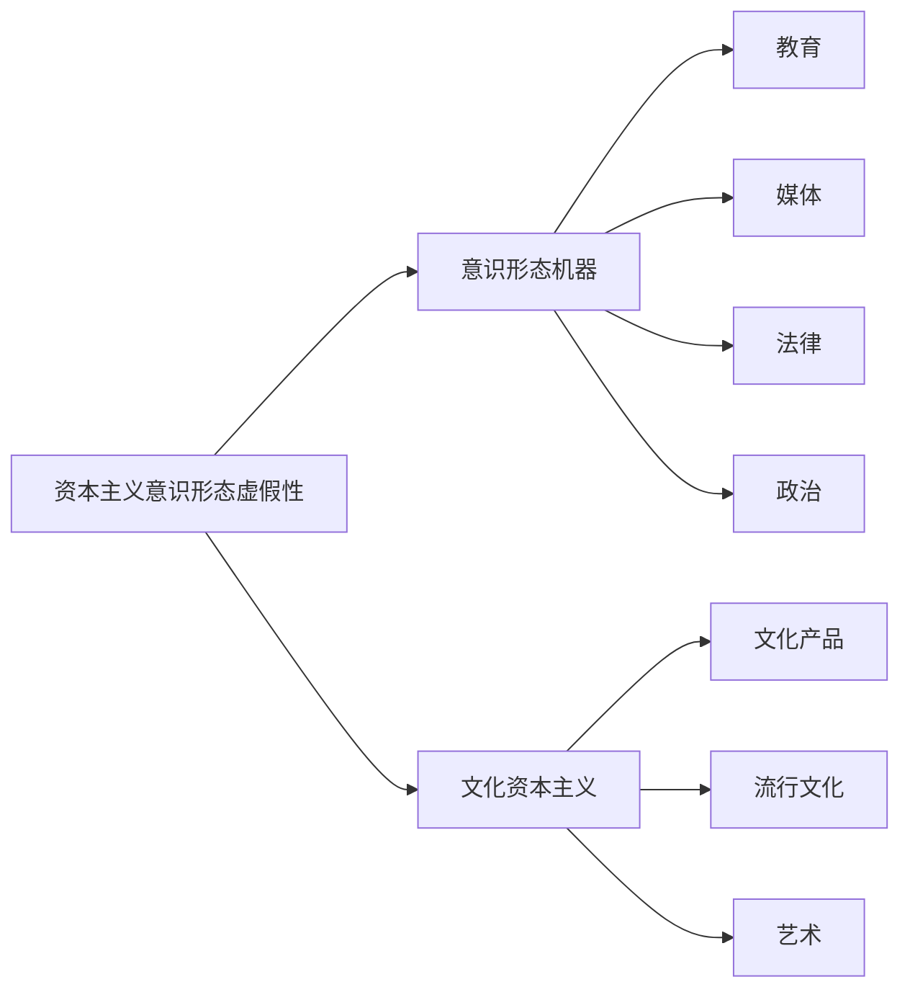

**核心算法原理讲解：**

我们可以将齐泽克对资本主义意识形态的批判看作是一种算法，该算法通过以下步骤来实现：

1. **输入**：资本主义社会的经济、政治和文化现象。
2. **处理**：分析这些现象中的资本主义意识形态，揭示其虚假性和操纵性。
3. **输出**：批判资本主义意识形态的运作机制，提出改变和反抗的策略。

以下是一个伪代码示例：

```python
def critique_capitalist_ideology(input_data):
    # 分析现象
    analysis = analyze_phenomena(input_data)
    # 揭示虚假性和操纵性
    falsehoods_and_manipulations = reveal_falsehoods_and_manipulations(analysis)
    # 批判和策略
    critique_and_strategies = criticize_ideology(falsehoods_and_manipulations)
    return critique_and_strategies
```

### 2.3 齐泽克对现代性的批判

齐泽克对现代性的批判是其意识形态理论的重要组成部分。他认为，现代性不仅是资本主义意识形态的表现形式，也是资本主义统治的深层结构。齐泽克对现代性的批判涵盖了多个方面，包括哲学、政治、文化和社会等。

**核心概念与联系：**

齐泽克的现代性批判主要基于以下几个核心概念：

1. **现代性的危机**：齐泽克认为，现代性自身存在危机。现代性承诺进步、自由和理性，但实际上却导致了社会的分裂、不确定性和混乱。
2. **叙事的失效**：齐泽克指出，现代性的叙事体系已经失效。现代性的叙事包括自由、平等、人权等，但这些叙事已经无法解释和解决现代社会中的问题和冲突。
3. **主体性的困境**：齐泽克认为，现代性导致了主体性的困境。主体性曾经是现代性的核心，但在现代性的危机中，主体性变得不稳定和破碎。

以下是一个用Mermaid绘制的流程图，展示了这些概念之间的联系：

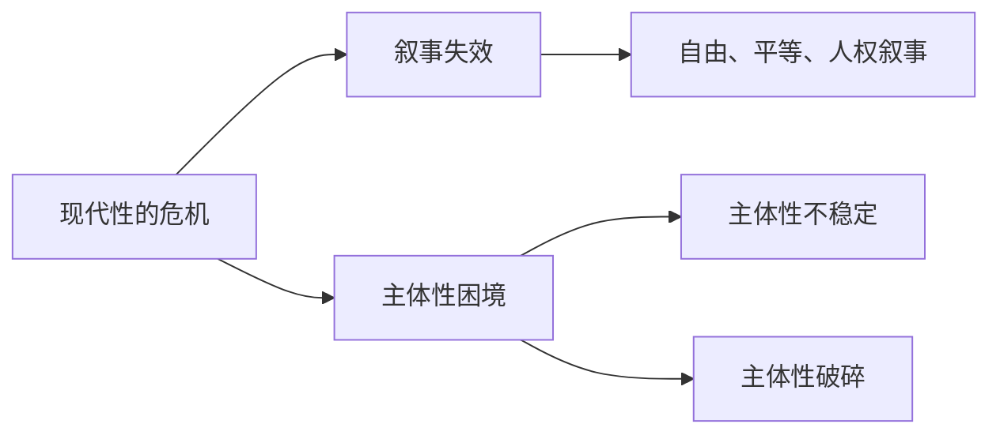

**核心算法原理讲解：**

我们可以将齐泽克对现代性的批判看作是一种算法，该算法通过以下步骤来实现：

1. **输入**：现代社会的各种现象和问题。
2. **处理**：分析这些现象和问题背后的现代性危机，揭示叙事失效和主体性困境。
3. **输出**：批判现代性的叙事体系，提出重建现代性的方案。

以下是一个伪代码示例：

```python
def critique_modernity(input_data):
    # 分析现象
    analysis = analyze_phenomena(input_data)
    # 揭示危机
    crises = reveal_crises(analysis)
    # 批判叙事
    critique_narratives = criticize_narratives(crises)
    # 提出方案
    reconstruction_schemes = propose_reconstruction_schemes(critique_narratives)
    return reconstruction_schemes
```

## 第3章 技术选型的意识形态影响

### 3.1 技术选型的意识形态因素

在技术选型过程中，意识形态因素往往被忽视，但实际上，意识形态在技术选型中扮演着至关重要的角色。意识形态不仅影响决策者的价值观和选择，还渗透到技术选型的各个环节，从而影响最终的技术解决方案。

**核心概念与联系：**

技术选型的意识形态因素包括以下几个方面：

1. **技术选择的价值观**：意识形态影响决策者的价值观和偏好，从而影响技术选型的方向。例如，某些技术选型可能更注重效率、安全性或可持续性，这些价值观反映了特定的意识形态倾向。
2. **技术选型的权力结构**：意识形态通过权力结构影响技术选型过程。在某些情况下，特定的技术选型可能有利于统治阶级的利益，从而巩固其权力地位。
3. **技术选型的社会规范**：意识形态影响社会对技术选型的规范和期望。例如，某些技术选型可能因不符合社会规范而被排斥，而其他技术选型可能因符合社会规范而得到推广。

以下是一个用Mermaid绘制的流程图，展示了这些概念之间的联系：

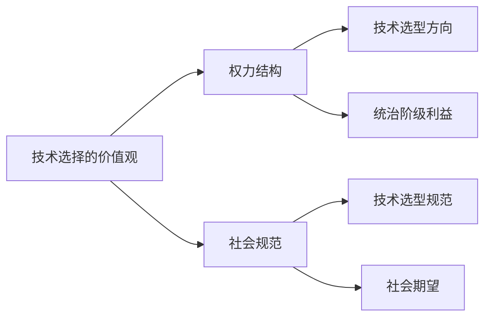

**核心算法原理讲解：**

我们可以将技术选型的意识形态因素看作是一种算法，该算法通过以下步骤来实现：

1. **输入**：决策者的价值观、权力结构和社会规范。
2. **处理**：分析这些因素如何影响技术选型的方向和结果。
3. **输出**：评估技术选型的意识形态影响，提出相应的调整和改进策略。

以下是一个伪代码示例：

```python
def ideological_impact_on_technology_selection(input_data):
    # 分析价值观
    value_analysis = analyze_values(input_data)
    # 分析权力结构
    power_structure_analysis = analyze_power_structure(input_data)
    # 分析社会规范
    social_norms_analysis = analyze_social_norms(input_data)
    # 影响评估
    impact_evaluation = evaluate_impact(value_analysis, power_structure_analysis, social_norms_analysis)
    # 调整策略
    adjustment_strategies = propose_adjustment_strategies(impact_evaluation)
    return adjustment_strategies
```

### 3.2 技术选型中的意识形态困境

技术选型过程中的意识形态困境主要体现在以下几个方面：

1. **选择的困境**：意识形态的影响使得技术选型过程中出现选择的困境。决策者往往在多个可行的技术方案之间犹豫不决，难以做出最优的选择。
2. **伦理的困境**：技术选型过程中的伦理问题常常与意识形态相关。某些技术选型可能涉及伦理争议，例如隐私、安全和社会影响等，意识形态的影响使得这些问题的解决变得复杂。
3. **社会的困境**：技术选型不仅仅是个体决策的问题，还涉及到社会的整体利益。意识形态的影响可能导致技术选型与社会需求脱节，从而引发社会冲突和不满。

**核心概念与联系：**

技术选型中的意识形态困境可以分解为以下几个核心概念：

1. **意识形态的影响**：意识形态通过价值观、权力结构和社会规范影响技术选型，使得选择变得复杂和困难。
2. **选择的困境**：在多个可行方案之间难以抉择，缺乏明确的决策标准。
3. **伦理的困境**：技术选型中的伦理问题往往与意识形态相关，需要权衡不同的伦理考量。
4. **社会的困境**：技术选型需要考虑社会的整体利益，但意识形态的影响可能导致决策与社会需求脱节。

以下是一个用Mermaid绘制的流程图，展示了这些概念之间的联系：

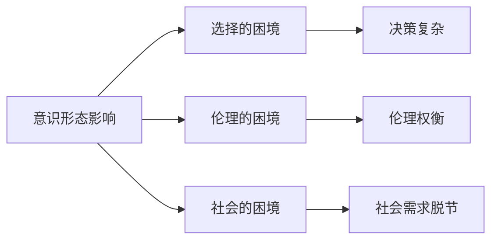

**核心算法原理讲解：**

我们可以将技术选型中的意识形态困境看作是一种算法，该算法通过以下步骤来实现：

1. **输入**：意识形态影响、选择的困境、伦理的困境和社会的困境。
2. **处理**：分析这些困境的产生原因和影响。
3. **输出**：提出解决困境的策略和方法。

以下是一个伪代码示例：

```python
def ideological_dilemmas_in_technology_selection(input_data):
    # 分析意识形态影响
    ideological_impact_analysis = analyze_ideological_impact(input_data)
    # 分析选择的困境
    selection_dilemmas_analysis = analyze_selection_dilemmas(input_data)
    # 分析伦理的困境
    ethical_dilemmas_analysis = analyze_ethical_dilemmas(input_data)
    # 分析社会的困境
    social_dilemmas_analysis = analyze_social_dilemmas(input_data)
    # 提出解决策略
    resolution_strategies = propose_resolution_strategies(ideological_impact_analysis, selection_dilemmas_analysis, ethical_dilemmas_analysis, social_dilemmas_analysis)
    return resolution_strategies
```

### 3.3 技术选型的意识形态分析策略

为了有效应对技术选型中的意识形态困境，我们需要采取一系列的意识形态分析策略。这些策略旨在揭示意识形态的影响，帮助决策者做出更合理的决策。

**核心概念与联系：**

技术选型的意识形态分析策略包括以下几个核心概念：

1. **批判性思维**：批判性思维是意识形态分析的基础。通过批判性思维，决策者可以质疑现有的意识形态假设，发现潜在的偏见和误解。
2. **多元视角**：意识形态分析需要多元化的视角。不同的视角可以揭示不同的问题和解决方案，从而帮助决策者更全面地理解技术选型的影响。
3. **案例研究**：案例研究是一种有效的意识形态分析工具。通过分析具体的案例，决策者可以深入了解意识形态在不同情境下的影响。
4. **参与式研究**：参与式研究强调决策者的参与和合作。通过参与式研究，决策者可以与利益相关者共同探讨技术选型的问题和解决方案。

以下是一个用Mermaid绘制的流程图，展示了这些概念之间的联系：

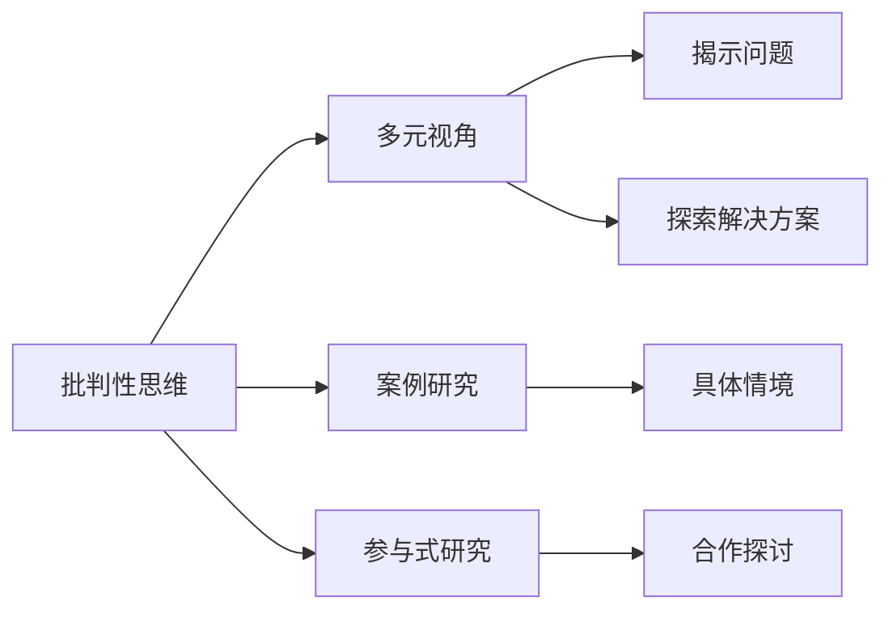

**核心算法原理讲解：**

我们可以将技术选型的意识形态分析策略看作是一种算法，该算法通过以下步骤来实现：

1. **输入**：技术选型的问题和情境。
2. **处理**：应用批判性思维、多元视角、案例研究和参与式研究等方法，分析意识形态的影响。
3. **输出**：提出改进技术选型的策略和方案。

以下是一个伪代码示例：

```python
def ideological_analysis_strategies_for_technology_selection(input_data):
    # 批判性思维分析
    critical_thinking_analysis = analyze_critical_thinking(input_data)
    # 多元视角分析
    diverse_perspectives_analysis = analyze_diverse_perspectives(input_data)
    # 案例研究分析
    case_study_analysis = analyze_case_studies(input_data)
    # 参与式研究分析
    participatory_research_analysis = analyze_participatory_research(input_data)
    # 提出策略
    improvement_strategies = propose_improvement_strategies(critical_thinking_analysis, diverse_perspectives_analysis, case_study_analysis, participatory_research_analysis)
    return improvement_strategies
```

## 第4章 工具选择的精神分析

### 4.1 工具选择的理论基础

工具选择是技术选型过程中至关重要的一环。在工具选择中，不仅需要考虑技术的性能和功能，还需要深入分析工具背后的意识形态和精神因素。精神分析理论为工具选择提供了一个独特的视角，帮助我们理解工具选择的深层动机和影响。

**核心概念与联系：**

工具选择的理论基础包括以下几个核心概念：

1. **欲望与工具**：精神分析认为，欲望是推动个体行动的根本动力。工具的选择与个体的欲望密切相关，工具不仅满足功能需求，还满足个体的心理欲望。
2. **无意识与意识形态**：精神分析强调无意识的重要性，无意识中隐藏着个体的深层欲望和冲突。意识形态通过无意识渗透到工具选择中，影响决策者的选择和行为。
3. **符号与叙事**：精神分析将工具视为符号，工具的选择和运用涉及到符号的解读和叙事的构建。符号和叙事在工具选择中扮演着重要的角色，影响决策者的认知和行为。

以下是一个用Mermaid绘制的流程图，展示了这些概念之间的联系：

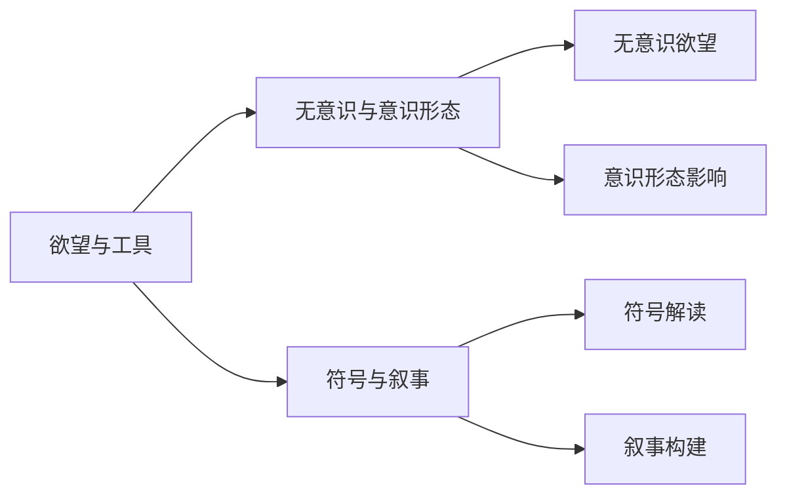

**核心算法原理讲解：**

我们可以将工具选择的理论基础看作是一种算法，该算法通过以下步骤来实现：

1. **输入**：决策者的欲望、无意识和意识形态。
2. **处理**：分析这些因素如何影响工具的选择和运用。
3. **输出**：提出基于精神分析的工具选择策略。

以下是一个伪代码示例：

```python
def theoretical_basis_for_tool_selection(input_data):
    # 分析欲望
    desire_analysis = analyze_desires(input_data)
    # 分析无意识和意识形态
    unconscious_and_ideology_analysis = analyze_unconscious_and_ideology(input_data)
    # 分析符号和叙事
    symbols_and_narratives_analysis = analyze_symbols_and_narratives(input_data)
    # 提出策略
    tool_selection_strategies = propose_tool_selection_strategies(desire_analysis, unconscious_and_ideology_analysis, symbols_and_narratives_analysis)
    return tool_selection_strategies
```

### 4.2 工具选择的精神分析视角

从精神分析视角来看，工具选择不仅仅是一个技术决策过程，更是一个心理和意识形态层面的互动。精神分析理论为我们提供了丰富的工具，帮助我们深入理解工具选择中的无意识和意识形态因素。

**核心概念与联系：**

工具选择的精神分析视角包括以下几个核心概念：

1. **无意识的影响**：精神分析强调无意识在决策中的作用。无意识中隐藏着个体的深层欲望和冲突，这些欲望和冲突会影响工具选择的过程和结果。
2. **意识形态的渗透**：意识形态通过无意识渗透到工具选择中，影响决策者的认知和行为。意识形态不仅影响工具的功能选择，还影响工具的运用和评价。
3. **符号的解读**：工具被视为符号，其选择和运用涉及到符号的解读和解释。不同的符号解读会导致不同的工具选择，进而影响决策的结果。

以下是一个用Mermaid绘制的流程图，展示了这些概念之间的联系：

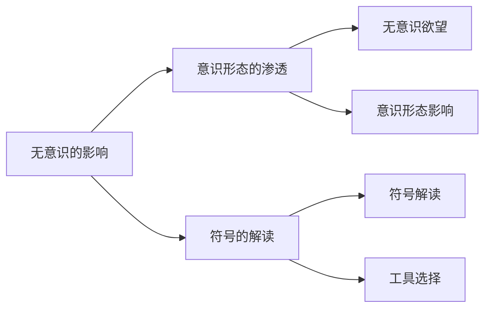

**核心算法原理讲解：**

我们可以将工具选择的精神分析视角看作是一种算法，该算法通过以下步骤来实现：

1. **输入**：决策者的无意识欲望、意识形态和符号解读。
2. **处理**：分析这些因素如何影响工具选择的过程和结果。
3. **输出**：提出基于精神分析的工具选择策略。

以下是一个伪代码示例：

```python
def psychoanalytic_perspective_on_tool_selection(input_data):
    # 分析无意识欲望
    unconscious_desire_analysis = analyze_unconscious_desires(input_data)
    # 分析意识形态影响
    ideological_impact_analysis = analyze_ideological_impact(input_data)
    # 分析符号解读
    symbol_interpretation_analysis = analyze_symbol_interpretations(input_data)
    # 提出策略
    tool_selection_strategies = propose_tool_selection_strategies(unconscious_desire_analysis, ideological_impact_analysis, symbol_interpretation_analysis)
    return tool_selection_strategies
```

### 4.3 工具选择中的精神分析案例分析

为了更好地理解工具选择中的精神分析视角，我们可以通过一些实际案例来分析。以下是一些典型的案例分析：

**案例一：开源软件的选择**

在开源软件的选择中，意识形态的影响非常显著。一些开发者更倾向于使用特定的开源软件，因为它们符合他们的价值观，如自由、平等和开放。这些开发者往往被开源软件的意识形态所吸引，而不仅仅是软件的功能和性能。

**案例分析：**

- **无意识欲望**：开发者可能无意识地渴望自由和开放，这种欲望驱动他们选择特定的开源软件。
- **意识形态影响**：开源软件的意识形态，如自由和开放，通过无意识渗透到开发者选择软件的过程中，影响他们的决策。
- **符号解读**：开发者将开源软件视为自由的象征，这种符号解读导致他们更倾向于选择开源软件。

**解决方案：**

- **揭示无意识欲望**：通过精神分析的方法，揭示开发者选择开源软件的无意识欲望，帮助他们认识到这些欲望对决策的影响。
- **批判意识形态**：批判开源软件的意识形态，帮助开发者认识到其中的潜在问题和偏见。
- **多元化的视角**：引入多元化的视角，考虑不同类型的软件解决方案，避免单一意识形态的影响。

**案例二：企业的技术选型**

企业在技术选型中往往受到意识形态的影响。例如，一些企业更倾向于使用特定的技术，因为它们与企业的核心价值观相符，如创新、效率和可靠性。

**案例分析：**

- **无意识欲望**：企业领导者可能无意识地渴望创新和效率，这种欲望驱动他们在技术选型中做出特定的决策。
- **意识形态影响**：企业的核心价值观通过无意识渗透到技术选型过程中，影响决策者的认知和行为。
- **符号解读**：企业将特定的技术视为创新和效率的象征，这种符号解读导致他们更倾向于选择这些技术。

**解决方案：**

- **揭示无意识欲望**：通过精神分析的方法，揭示企业领导者的无意识欲望，帮助他们认识到这些欲望对决策的影响。
- **批判意识形态**：批判企业的核心价值观，帮助领导者认识到其中的潜在问题和偏见。
- **多元化的视角**：引入多元化的视角，考虑不同类型的技术解决方案，避免单一意识形态的影响。

**案例三：教育技术的选择**

在教育技术的选择中，意识形态的影响也非常显著。一些教育机构更倾向于使用特定的教育技术，因为它们符合教育机构的价值观，如公平、包容和创新。

**案例分析：**

- **无意识欲望**：教育工作者可能无意识地渴望公平和包容，这种欲望驱动他们在技术选型中做出特定的决策。
- **意识形态影响**：教育技术的意识形态，如公平和包容，通过无意识渗透到教育技术选择过程中，影响决策者的认知和行为。
- **符号解读**：教育工作者将特定的教育技术视为公平和包容的象征，这种符号解读导致他们更倾向于选择这些技术。

**解决方案：**

- **揭示无意识欲望**：通过精神分析的方法，揭示教育工作者的无意识欲望，帮助他们认识到这些欲望对决策的影响。
- **批判意识形态**：批判教育技术的意识形态，帮助教育工作者认识到其中的潜在问题和偏见。
- **多元化的视角**：引入多元化的视角，考虑不同类型的教育技术解决方案，避免单一意识形态的影响。

## 第5章 案例研究：技术选型的意识形态批判

### 5.1 案例一：开源软件运动的意识形态批判

开源软件运动是当代信息技术领域的重要现象，它不仅在技术上推动了软件的开放和共享，也在意识形态上挑战了传统的软件商业模式。然而，开源软件运动并非没有争议，其背后的意识形态也需要被批判性地审视。

**背景介绍：**

开源软件运动起源于20世纪90年代，随着互联网的普及和Linux操作系统的崛起，越来越多的开发者开始倡导软件的自由和开放。这一运动的核心是开源许可证，如GNU通用公共许可证（GPL）和Mozilla公共许可证（MPL），它们保障了软件的自由使用、复制、修改和分发。

**核心概念与联系：**

开源软件运动的意识形态批判主要集中在以下几个方面：

1. **自由与控制**：开源软件运动强调软件的自由，即用户可以自由地使用、修改和分发软件。然而，这种自由并非无条件的，它也涉及对软件的控制权。批判者认为，开源软件运动可能过于强调自由，忽视了控制的重要性。
2. **集体主义与个人主义**：开源软件运动倡导集体合作和共享精神，这与个人主义价值观相对立。批判者认为，集体主义可能导致个人创造力的削弱，以及对个人隐私和财产权的侵犯。
3. **技术中立与技术偏向**：开源软件运动强调技术的中立性，反对特定技术或商业利益的偏见。然而，批判者认为，开源软件运动本身也存在技术偏向，如对某些开源项目的偏好，这可能限制了技术多样性的发展。

以下是一个用Mermaid绘制的流程图，展示了这些概念之间的联系：

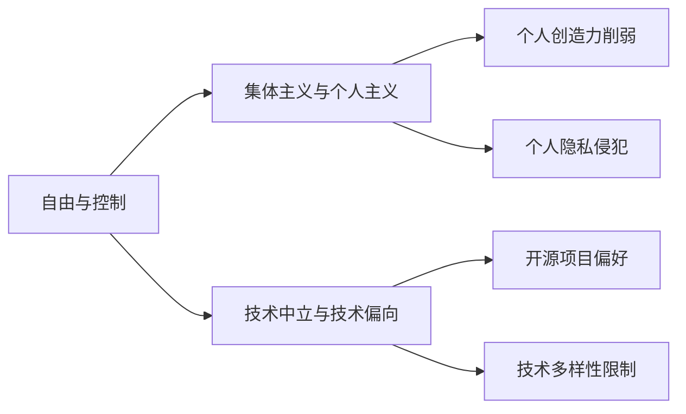

**核心算法原理讲解：**

我们可以将开源软件运动的意识形态批判看作是一种算法，该算法通过以下步骤来实现：

1. **输入**：开源软件运动的背景和核心概念。
2. **处理**：分析开源软件运动中的意识形态问题，揭示其潜在的影响和争议。
3. **输出**：提出对开源软件运动的批判性见解和改进建议。

以下是一个伪代码示例：

```python
def critique_ideology_of_open_source_movement(input_data):
    # 分析自由与控制
    freedom_and_control_analysis = analyze_freedom_and_control(input_data)
    # 分析集体主义与个人主义
    collectivism_and Individualism_analysis = analyze_collectivism_and_Individualism(input_data)
    # 分析技术中立与技术偏向
    technical_neutrality_and_bias_analysis = analyze_technical_neutrality_and_bias(input_data)
    # 提出批判性见解
    critical_insights = propose_critical_insights(freedom_and_control_analysis, collectivism_and_Individualism_analysis, technical_neutrality_and_bias_analysis)
    # 提出改进建议
    improvement_suggestions = propose_improvement_suggestions(critical_insights)
    return improvement_suggestions
```

### 5.2 案例二：企业数字化转型中的技术选型分析

企业在数字化转型过程中，技术选型成为关键决策。然而，技术选型不仅涉及技术的性能和成本，还涉及意识形态的影响。本案例研究将分析企业数字化转型中的技术选型，揭示其中的意识形态困境和批判性分析。

**背景介绍：**

随着数字经济的兴起，企业纷纷启动数字化转型项目，以提升业务效率、增强竞争力和提供更好的客户体验。数字化转型涉及多个技术领域，如云计算、大数据、人工智能和物联网等。企业在选择这些技术时，需要考虑技术性能、成本、兼容性和安全性等因素。

**核心概念与联系：**

企业数字化转型中的技术选型分析涉及以下几个核心概念：

1. **意识形态因素**：企业在技术选型中受到意识形态的影响。例如，某些企业可能更倾向于选择特定的技术，因为这些技术符合企业的核心价值观，如创新、效率和可持续性。
2. **权力结构**：技术选型过程中，权力结构也会影响决策。企业内部的不同部门和个人可能持有不同的意识形态和利益诉求，这些差异可能导致技术选型的困境。
3. **伦理考量**：技术选型中的伦理问题日益受到关注。企业在选择技术时，需要权衡隐私、安全和社会责任等伦理因素。

以下是一个用Mermaid绘制的流程图，展示了这些概念之间的联系：

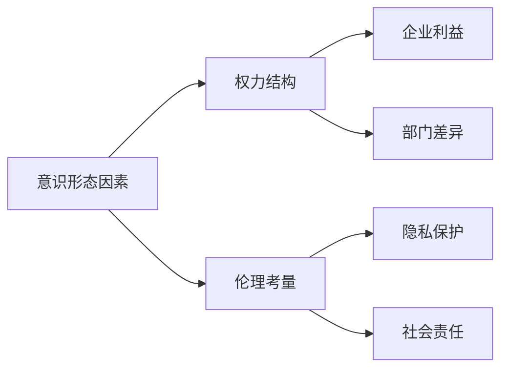

**核心算法原理讲解：**

我们可以将企业数字化转型中的技术选型分析看作是一种算法，该算法通过以下步骤来实现：

1. **输入**：企业的数字化转型目标和现状。
2. **处理**：分析意识形态因素、权力结构和伦理考量，揭示技术选型中的困境。
3. **输出**：提出改进技术选型的策略和解决方案。

以下是一个伪代码示例：

```python
def technology_selection_analysis_in_enterprise_digitization(input_data):
    # 分析意识形态因素
    ideological_factors_analysis = analyze_ideological_factors(input_data)
    # 分析权力结构
    power_structure_analysis = analyze_power_structure(input_data)
    # 分析伦理考量
    ethical_considerations_analysis = analyze_ethical_considerations(input_data)
    # 揭示困境
    dilemma_revelation = reveal_dilemmas(ideological_factors_analysis, power_structure_analysis, ethical_considerations_analysis)
    # 提出策略
    improvement_strategies = propose_improvement_strategies(dilemma_revelation)
    return improvement_strategies
```

### 5.3 案例三：人工智能时代的意识形态批判

人工智能（AI）时代的到来引发了广泛的讨论和争议，不仅技术本身的发展受到关注，AI时代背后的意识形态也受到批判。本案例研究将分析人工智能时代中的技术选型，揭示其中的意识形态困境和批判性分析。

**背景介绍：**

人工智能技术正在快速发展和应用，从自动驾驶、智能家居到医疗诊断和金融分析，AI已经深入到社会的各个领域。随着AI技术的发展，AI时代的意识形态问题也逐渐凸显。例如，AI算法的偏见、隐私侵犯和权力集中等问题引发了社会的广泛关注。

**核心概念与联系：**

人工智能时代的意识形态批判涉及以下几个核心概念：

1. **算法偏见**：AI算法的训练数据往往包含社会中的偏见和不平等，这些偏见在算法中得以放大和传播。算法偏见可能导致歧视和不公平，引发社会的不满和抗议。
2. **隐私侵犯**：人工智能技术的发展使得数据收集和分析成为可能，但这也带来了隐私侵犯的问题。个人隐私在AI时代变得前所未有的脆弱，引发了隐私保护和数据安全的挑战。
3. **权力集中**：随着AI技术的应用，数据和控制权逐渐集中到少数公司和国家手中，这可能导致权力失衡和垄断现象。权力集中不仅影响技术发展，还影响社会的公平和正义。

以下是一个用Mermaid绘制的流程图，展示了这些概念之间的联系：

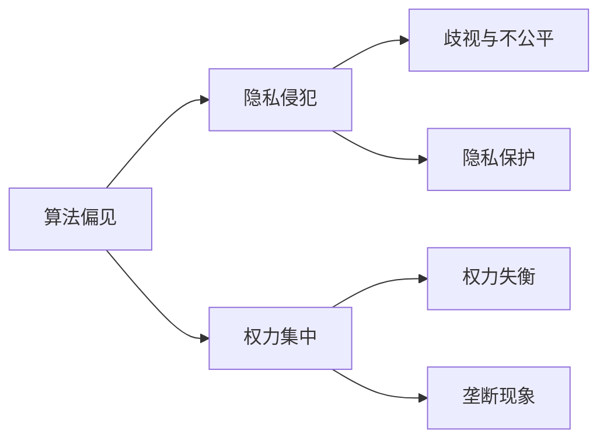

**核心算法原理讲解：**

我们可以将人工智能时代的意识形态批判看作是一种算法，该算法通过以下步骤来实现：

1. **输入**：人工智能技术的发展和应用现状。
2. **处理**：分析算法偏见、隐私侵犯和权力集中的问题，揭示其背后的意识形态困境。
3. **输出**：提出改进技术发展和社会治理的策略。

以下是一个伪代码示例：

```python
def ideological_critique_of_the_age_of_artificial_intelligence(input_data):
    # 分析算法偏见
    algorithm_bias_analysis = analyze_algorithm_bias(input_data)
    # 分析隐私侵犯
    privacy_invasion_analysis = analyze_privacy_invasion(input_data)
    # 分析权力集中
    power_concentration_analysis = analyze_power_concentration(input_data)
    # 揭示困境
    dilemma_revelation = reveal_dilemmas(algorithm_bias_analysis, privacy_invasion_analysis, power_concentration_analysis)
    # 提出策略
    improvement_strategies = propose_improvement_strategies(dilemma_revelation)
    return improvement_strategies
```

## 第6章 技术选型中的意识形态反思

### 6.1 技术选型的意识形态反思方法

在技术选型过程中，意识形态反思方法是一种重要的工具，它有助于我们识别和应对意识形态的影响。意识形态反思方法包括以下几个方面：

**核心概念与联系：**

1. **批判性思维**：批判性思维是意识形态反思的基础。通过批判性思维，我们可以质疑现有的意识形态假设，识别潜在的影响和偏见。
2. **多元视角**：意识形态反思需要多元化的视角。不同的视角可以帮助我们更全面地理解技术选型的影响，避免单一视角的局限性。
3. **案例研究**：案例研究是意识形态反思的有效工具。通过分析具体的案例，我们可以深入了解意识形态在不同情境下的影响。
4. **参与式研究**：参与式研究强调决策者的参与和合作。通过参与式研究，我们可以与利益相关者共同探讨技术选型的问题和解决方案。

以下是一个用Mermaid绘制的流程图，展示了这些概念之间的联系：


**核心算法原理讲解：**

我们可以将技术选型的意识形态反思方法看作是一种算法，该算法通过以下步骤来实现：

1. **输入**：技术选型的问题和情境。
2. **处理**：应用批判性思维、多元视角、案例研究和参与式研究等方法，识别和反思意识形态的影响。
3. **输出**：提出改进技术选型的策略和方案。

以下是一个伪代码示例：

```python
def ideological_reflection_methods_for_technology_selection(input_data):
    # 批判性思维分析
    critical_thinking_analysis = analyze_critical_thinking(input_data)
    # 多元视角分析
    diverse_perspectives_analysis = analyze_diverse_perspectives(input_data)
    # 案例研究分析
    case_study_analysis = analyze_case_studies(input_data)
    # 参与式研究分析
    participatory_research_analysis = analyze_participatory_research(input_data)
    # 识别意识形态影响
    ideology_impact_identification = identify_ideological_impact(critical_thinking_analysis, diverse_perspectives_analysis, case_study_analysis, participatory_research_analysis)
    # 提出改进策略
    improvement_strategies = propose_improvement_strategies(ideology_impact_identification)
    return improvement_strategies
```

### 6.2 技术选型的意识形态反思案例

为了更好地理解技术选型中的意识形态反思方法，我们可以通过一些实际案例来分析。以下是一些典型的案例研究：

**案例一：企业数字化转型的技术选型反思**

在企业数字化转型过程中，技术选型成为关键决策。然而，数字化转型不仅仅是技术的变革，还涉及到意识形态的反思。以下是一个企业数字化转型的技术选型反思案例。

**案例背景：**

某大型企业计划启动数字化转型项目，以提高业务效率和客户体验。在技术选型阶段，企业面临多种技术方案，包括云计算、大数据、人工智能和物联网等。

**意识形态反思过程：**

1. **批判性思维**：企业首先采用批判性思维方法，质疑现有的技术选型假设。他们询问自己，为什么选择这些技术方案？这些技术是否符合企业的核心价值观？是否存在其他更好的选择？

2. **多元视角**：企业邀请了来自不同部门的专业人士，包括技术部门、市场部门和人力资源部门，共同参与技术选型。通过多元化的视角，企业试图更全面地理解技术选型的影响。

3. **案例研究**：企业研究了其他企业的数字化转型案例，特别是那些成功和失败的经验。通过案例研究，企业希望了解不同技术方案在不同情境下的表现。

4. **参与式研究**：企业组织了一场研讨会，邀请内部员工和外部专家共同讨论技术选型的问题和解决方案。通过参与式研究，企业希望收集不同利益相关者的意见和建议。

**意识形态反思结果：**

通过批判性思维、多元视角、案例研究和参与式研究，企业识别出以下意识形态问题：

- **自由与控制**：企业原本倾向于选择开放性的技术方案，以实现更高的自由度。然而，在反思过程中，企业意识到控制权的重要性，决定在技术选型中平衡自由与控制。
- **集体主义与个人主义**：企业在技术选型中面临集体主义与个人主义的冲突。技术选型不仅影响企业的整体利益，还涉及个人部门和个人的利益。通过参与式研究，企业试图平衡集体主义与个人主义的关系。

**改进策略：**

基于意识形态反思的结果，企业制定了以下改进策略：

- **平衡自由与控制**：企业决定在技术选型中引入更多的控制机制，确保技术方案的可控性和安全性。
- **多元化视角**：企业在技术选型过程中保持多元化的视角，充分考虑不同部门和个人的利益。
- **案例研究**：企业将继续研究其他企业的数字化转型案例，以获取更多经验和教训。
- **参与式研究**：企业将继续组织研讨会和讨论会，与内部员工和外部专家共同探讨技术选型的问题和解决方案。

**案例二：开源软件运动的意识形态反思**

开源软件运动是当代信息技术领域的重要现象，然而，其背后的意识形态也需要被反思。以下是一个开源软件运动的意识形态反思案例。

**案例背景：**

某开源软件项目由一群志愿者共同开发，旨在提供一种免费、开源的解决方案，以促进技术的自由和开放。然而，随着时间的推移，项目内部出现了意识形态冲突，导致项目的发展陷入困境。

**意识形态反思过程：**

1. **批判性思维**：项目团队成员开始质疑现有的意识形态假设，特别是关于自由、平等和合作的理念。他们询问自己，这些理念是否真的适用于项目的发展？

2. **多元视角**：项目团队成员邀请了外部专家和社区成员参与讨论，以获得更多的视角和建议。通过多元化的视角，团队成员试图更全面地理解意识形态的影响。

3. **案例研究**：项目团队成员研究了其他开源软件项目的经验和教训，特别是那些成功和失败的项目。通过案例研究，团队成员希望了解不同意识形态对项目发展的影响。

4. **参与式研究**：项目团队组织了一场社区会议，邀请社区成员共同讨论意识形态问题，并寻求解决方案。通过参与式研究，团队希望收集社区成员的意见和建议。

**意识形态反思结果：**

通过批判性思维、多元视角、案例研究和参与式研究，项目团队成员识别出以下意识形态问题：

- **自由与责任**：项目成员对自由的定义存在分歧，一些人认为自由意味着无限制的使用和修改，而另一些人则认为自由需要承担相应的责任。
- **平等与权力**：项目成员对平等的理解也存在差异，一些人认为平等意味着所有成员都有相同的权力和机会，而另一些人则认为平等需要平衡权力分配。

**改进策略：**

基于意识形态反思的结果，项目团队制定了以下改进策略：

- **明确的自由与责任定义**：项目团队决定在项目章程中明确自由与责任的定义，以确保所有成员对自由的含义有共同的理解。
- **平衡权力分配**：项目团队决定引入更平衡的权力分配机制，确保所有成员都有平等的发言权和决策权。
- **多元化的参与**：项目团队将继续鼓励多元化视角的参与，确保项目发展的多元性和包容性。
- **持续的意识形态反思**：项目团队决定定期组织意识形态反思会议，以确保意识形态问题得到持续的讨论和解决。

**案例三：人工智能时代的意识形态反思**

人工智能技术的发展引发了广泛的讨论和争议，人工智能时代的意识形态反思成为一个重要的议题。以下是一个人工智能时代的意识形态反思案例。

**案例背景：**

某科技公司致力于开发人工智能应用，其目标是提高生产效率和客户满意度。然而，随着人工智能技术的应用，公司开始面临意识形态反思的问题。

**意识形态反思过程：**

1. **批判性思维**：公司团队成员开始质疑人工智能技术的影响，特别是算法偏见、隐私侵犯和权力集中等问题。他们询问自己，人工智能技术是否真的符合社会的伦理和价值观？

2. **多元视角**：公司邀请了来自不同领域的专家和学者，包括技术专家、伦理学家和社会学家，共同参与讨论。通过多元化的视角，公司试图更全面地理解人工智能技术的影响。

3. **案例研究**：公司研究了其他人工智能应用项目的经验和教训，特别是那些成功和失败的项目。通过案例研究，公司希望了解不同意识形态对项目发展的影响。

4. **参与式研究**：公司组织了一场公开论坛，邀请社区成员、消费者和政策制定者共同讨论人工智能技术的伦理和社会问题。通过参与式研究，公司希望收集不同利益相关者的意见和建议。

**意识形态反思结果：**

通过批判性思维、多元视角、案例研究和参与式研究，公司团队成员识别出以下意识形态问题：

- **算法偏见**：公司意识到人工智能算法可能存在偏见，这些偏见可能导致不公平和歧视。
- **隐私侵犯**：公司意识到人工智能技术可能侵犯用户隐私，特别是在数据收集和分析过程中。
- **权力集中**：公司意识到人工智能技术的发展可能导致数据和控制权的集中，这可能导致权力失衡和垄断现象。

**改进策略：**

基于意识形态反思的结果，公司制定了以下改进策略：

- **算法偏见检测与纠正**：公司决定开发算法偏见检测与纠正工具，确保人工智能应用不会加剧社会不公。
- **隐私保护**：公司决定加强隐私保护措施，确保用户数据的安全和隐私。
- **权力分散**：公司决定引入更多的权力分散机制，确保数据和控制权的合理分配。
- **持续的意识形态反思**：公司决定定期组织意识形态反思会议，确保人工智能技术的发展符合社会的伦理和价值观。

### 6.3 技术选型中的意识形态反思实践

在技术选型过程中，意识形态反思实践是一种有效的方法，可以帮助决策者识别和应对意识形态的影响。以下是一些具体的技术选型中的意识形态反思实践：

**实践一：批判性思维的引入**

在技术选型过程中，引入批判性思维是一种有效的意识形态反思实践。通过批判性思维，决策者可以质疑现有的意识形态假设，识别潜在的影响和偏见。

具体实践步骤：

1. **质疑假设**：在技术选型过程中，决策者应不断质疑现有的意识形态假设。例如，他们可以询问自己：“为什么选择这些技术方案？”、“这些技术方案是否符合企业的核心价值观？”等。

2. **分析影响**：通过批判性思维，决策者可以分析技术选型中的潜在影响。例如，他们可以评估技术方案对业务效率、客户体验和社会责任的影响。

3. **识别偏见**：批判性思维有助于决策者识别技术选型中的潜在偏见。例如，他们可以识别对特定技术或供应商的偏好，以及这些偏好背后的意识形态因素。

**实践二：多元视角的引入**

在技术选型过程中，引入多元视角是一种有效的意识形态反思实践。通过多元视角，决策者可以获得更全面的信息，减少单一视角的局限性。

具体实践步骤：

1. **邀请多元参与者**：在技术选型过程中，决策者应邀请来自不同部门、背景和利益相关者的多元参与者。这些参与者可以提供不同的视角和建议，有助于更全面地理解技术选型的影响。

2. **开展讨论与交流**：通过多元视角的引入，决策者可以开展讨论与交流，以促进不同观点的碰撞和融合。这样可以减少偏见和误解，提高决策的质量。

3. **评估多元视角的有效性**：决策者应评估多元视角的有效性，以确保技术选型的客观性和公正性。例如，他们可以评估多元视角对技术方案评估的影响，以及这些视角是否有助于解决关键问题。

**实践三：案例研究的运用**

在技术选型过程中，运用案例研究是一种有效的意识形态反思实践。通过案例研究，决策者可以深入了解不同情境下的技术选型过程和结果。

具体实践步骤：

1. **选择案例**：决策者应选择与当前技术选型情境相似或相关的案例进行研究。这样可以更有效地应用案例研究的结果，为技术选型提供借鉴。

2. **分析案例**：决策者应分析案例中的技术选型过程、决策因素和结果。通过分析案例，他们可以识别出技术选型中的意识形态因素和潜在影响。

3. **借鉴案例经验**：决策者可以借鉴案例中的成功经验和教训，为当前技术选型提供参考。例如，他们可以学习如何平衡自由与控制、如何处理集体主义与个人主义的冲突等。

**实践四：参与式研究的实施**

在技术选型过程中，实施参与式研究是一种有效的意识形态反思实践。通过参与式研究，决策者可以与利益相关者共同探讨技术选型的问题和解决方案。

具体实践步骤：

1. **确定参与式研究的目标**：决策者应明确参与式研究的目标，例如识别意识形态因素、评估技术方案的影响、收集利益相关者的意见和建议等。

2. **设计参与式研究方法**：决策者应设计适合的参与式研究方法，例如研讨会、工作坊、访谈和调查等。这些方法可以帮助决策者与利益相关者建立良好的沟通和互动。

3. **实施参与式研究**：决策者应按照设计的方法实施参与式研究，与利益相关者进行深入的讨论和交流。这样可以收集到丰富的意见和建议，为技术选型提供更全面的视角。

4. **分析参与式研究结果**：决策者应分析参与式研究结果，识别出意识形态因素和潜在影响。通过分析结果，他们可以提出改进技术选型的策略和方案。

**实践五：意识形态反思的持续进行**

在技术选型过程中，意识形态反思应持续进行，以确保决策的质量和公正性。以下是一些持续进行意识形态反思的方法：

1. **定期反思会议**：决策者应定期组织意识形态反思会议，与团队成员和利益相关者共同讨论意识形态问题。这样可以保持意识形态反思的持续性，及时识别和解决新出现的问题。

2. **反思文档**：决策者应记录每次意识形态反思的过程和结果，形成反思文档。这样可以系统地积累意识形态反思的经验，为未来的技术选型提供参考。

3. **反思培训**：决策者应组织意识形态反思培训，提高团队成员的意识形态反思能力。通过培训，团队成员可以学习到更有效的意识形态反思方法和技巧。

4. **反思反馈**：决策者应鼓励利益相关者提供反馈，以评估意识形态反思的效果。通过反馈，决策者可以了解利益相关者对意识形态反思的看法和建议，进一步改进反思实践。

## 第7章 总结与展望

### 7.1 意识形态批判与技术选型的意义

意识形态批判和技术选型在当今社会中具有深远的意义。首先，意识形态批判有助于揭示社会现实中的虚假和欺骗，使人们能够更清晰地认识到社会问题。技术选型作为决策过程中的一部分，受到意识形态的影响，通过批判意识形态，可以更合理地评估和选择技术方案。

意识形态批判的意义主要体现在以下几个方面：

1. **揭示意识形态操纵**：通过批判意识形态，可以揭示统治阶级和社会机构如何通过意识形态操纵人们的思想和行为，从而维持其权力和利益。这有助于人们认清社会现实的本质，为反抗和变革提供理论基础。

2. **促进社会觉醒**：意识形态批判可以激发人们对社会问题的觉醒，使其认识到自身被操纵的状态，从而积极参与社会变革。这种觉醒是推动社会进步的重要力量。

3. **推动社会进步**：通过批判和反思意识形态，可以提出新的社会理论和实践方案，为社会的进步提供指导。这种进步不仅体现在技术选型上，还体现在政治、经济和文化等多个领域。

技术选型在现代社会中扮演着关键角色，其意义主要体现在以下几个方面：

1. **提升竞争力**：技术选型是企业和社会竞争力的关键因素。通过合理的技术选型，可以提升企业的生产效率和产品质量，增强竞争力。

2. **推动经济发展**：技术选型对经济发展具有重要作用。通过选择适合的技术方案，可以促进技术创新和产业升级，推动经济的持续增长。

3. **改善生活质量**：技术选型直接影响人们的生活质量。通过合理的技术选型，可以提高生活便利性、安全性和舒适性，改善人们的生活条件。

### 7.2 工具选择的精神分析的应用前景

工具选择的精神分析为我们提供了一种独特的视角，帮助我们深入理解工具选择背后的心理和意识形态因素。这种视角在未来的应用前景非常广阔，主要体现在以下几个方面：

1. **技术选型的决策支持**：精神分析理论可以帮助决策者在技术选型过程中更好地理解自身和利益相关者的心理动机，从而做出更合理的决策。通过分析决策者的无意识和意识形态，可以揭示潜在的偏见和误解，提高决策的质量。

2. **人力资源管理**：精神分析理论可以应用于人力资源管理，帮助管理者更好地理解员工的动机、需求和心理状态。通过了解员工的内心世界，可以制定更有效的人力资源管理策略，提高员工的满意度和工作效率。

3. **心理咨询与治疗**：精神分析理论在心理咨询和治疗领域具有广泛的应用。通过分析个体的心理结构和潜意识，可以帮助个体解决内心的冲突和问题，提高心理健康水平。

4. **教育与培训**：精神分析理论可以应用于教育和培训领域，帮助教育者和培训者更好地理解学习者的心理需求和学习过程。通过运用精神分析的方法，可以设计更有效的教育和培训方案，提高学习效果。

### 7.3 未来研究方向与挑战

尽管意识形态批判和技术选型的精神分析已经取得了显著的成果，但未来仍然有许多研究方向和挑战需要克服：

1. **跨学科研究**：意识形态批判和技术选型的精神分析需要与其他学科，如社会学、心理学、经济学和管理学等进行跨学科研究。通过跨学科合作，可以更全面地理解和解决相关问题。

2. **实证研究**：当前的研究主要侧重于理论分析和案例研究，未来需要更多实证研究来验证意识形态批判和技术选型的精神分析理论。通过实证研究，可以更准确地评估这些理论的效力和应用价值。

3. **技术应用**：精神分析理论在技术选型中的应用仍存在一些挑战，如如何将抽象的理论应用于具体的技术决策过程。未来需要开发更具体、可操作的技术选型工具和方法。

4. **伦理问题**：意识形态批判和技术选型的精神分析在应用过程中可能会引发伦理问题，如隐私侵犯和权力集中。未来需要制定相应的伦理规范，确保技术应用的安全性和合理性。

### 附录：齐泽克主要作品及学术贡献

斯拉沃热·齐泽克（Slavoj Žižek）是20世纪最具影响力的哲学家之一，他的著作涵盖了多个领域，包括马克思主义、精神分析、文化理论和政治哲学。以下是齐泽克的一些主要作品及其学术贡献：

**主要作品：**

1. **《意识形态的回归》（The Return of the Subject）**：在这本书中，齐泽克深入探讨了主体性的问题，提出了一种新的意识形态批判理论。他认为，意识形态不仅存在于过去，也存在于当下，对主体的构成有着深刻的影响。

2. **《享乐逻辑》（The Puppet and the Dwarf）**：这本书通过对电影、文学和艺术作品的分析，探讨了享乐主义和意识形态的关系。齐泽克提出了“享乐逻辑”这一概念，将其视为一种意识形态的力量。

3. **《幻影的现代性》（The Parallax View of the One-Subject) **：在这本书中，齐泽克对现代性进行了批判性分析，认为现代性本身就是一个幻影，它通过对主体的控制和操纵，维持了资本主义社会的秩序。

4. **《对象的逻辑》（The Objectivism of the Subject）**：这本书探讨了主体和对象之间的关系，提出了“对象性”这一概念。齐泽克认为，对象性不仅是一种认识论问题，也是一种意识形态问题。

**学术贡献：**

1. **对马克思主义的重新解读**：齐泽克对马克思主义进行了深刻的重新解读，提出了“意识形态是现实的内核”这一观点。他认为，马克思主义理论中关于意识形态的讨论具有深远的意义，可以应用于当代社会问题的分析。

2. **精神分析理论的扩展**：齐泽克将精神分析理论应用于文化、政治和哲学等领域，提出了“意识形态机器”和“叙事分析”等概念。他的理论为理解现代社会中的意识形态运作提供了新的视角。

3. **文化理论的创新**：齐泽克的文化理论以其独特的视角和深刻的分析而著称。他通过分析电影、文学和艺术作品，揭示了资本主义意识形态的操纵性。

4. **政治哲学的贡献**：齐泽克的政治哲学强调革命性和解放。他提出了“现实性危机”和“革命性瞬间”等概念，为理解当代政治危机和革命的可能性提供了理论框架。

齐泽克的著作和学术贡献对当代哲学、文化理论和政治哲学产生了深远的影响，他的思想激发了广泛的讨论和争议，为学术研究和实践提供了重要的参考。

## 附录：斯拉沃热·齐泽克的学术贡献和影响

斯拉沃热·齐泽克（Slavoj Žižek）是当代最具影响力的哲学家之一，他的思想在马克思主义、精神分析、文化理论等领域产生了深远的影响。以下是对齐泽克学术贡献和影响的概述。

### 马克思主义意识形态批判

齐泽克以其对马克思主义意识形态的批判性解读而闻名。他重新解读了马克思的理论，特别是关于意识形态的概念。齐泽克认为，意识形态不仅是虚假的意识，更是现实的内核。他提出“意识形态是现实的内核”这一观点，认为意识形态不仅影响我们的认知，还构成了社会的基本结构和运作机制。这一观点对理解当代社会的意识形态现象具有重要意义。

**核心算法原理讲解：**

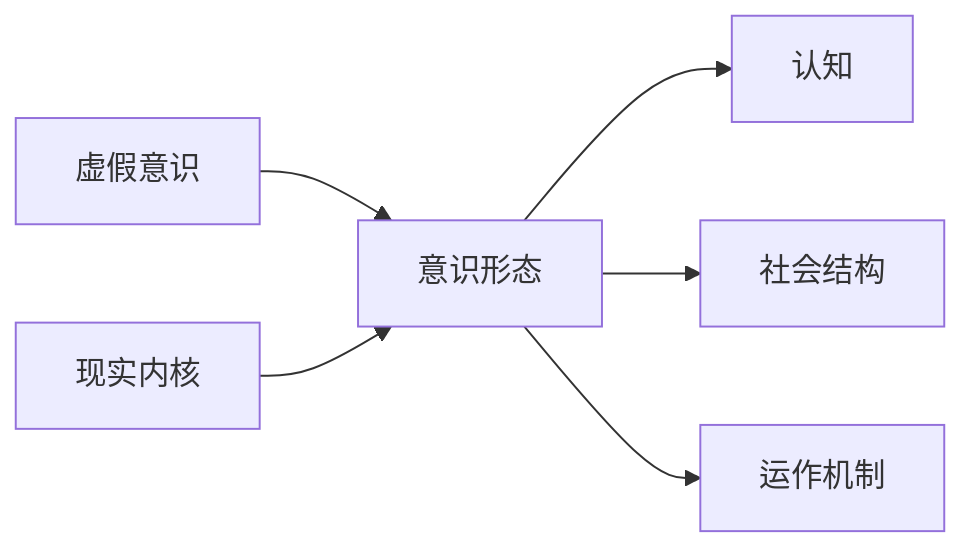

### 精神分析理论的应用

齐泽克将精神分析理论应用于多个领域，包括政治、文化和社会。他提出了“意识形态机器”和“叙事分析”等概念，用以解释社会现象和文化产品中的意识形态运作。齐泽克认为，意识形态通过无意识和叙事机制渗透到我们的日常生活中，影响我们的行为和价值观。

**核心算法原理讲解：**

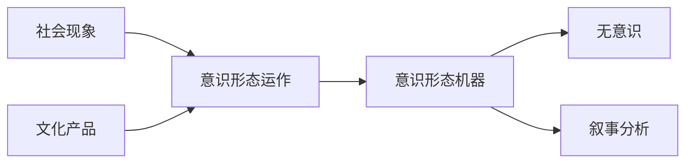

### 文化理论的创新

齐泽克的文化理论以其对电影、文学和艺术作品的分析而著称。他揭示了资本主义文化中的意识形态操纵，指出文化产品不仅是娱乐和消遣，也是意识形态的工具。齐泽克通过分析具体作品，如电影《肖申克的救赎》和小说《1984》，探讨了意识形态在文化领域的影响。

**核心算法原理讲解：**

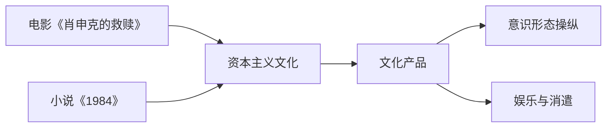

### 政治哲学的贡献

齐泽克的政治哲学强调革命性和解放。他提出了“现实性危机”和“革命性瞬间”等概念，用于分析当代政治危机和革命的可能性。齐泽克认为，革命并非必然的，但通过批判和反思，我们可以创造革命的契机。

**核心算法原理讲解：**

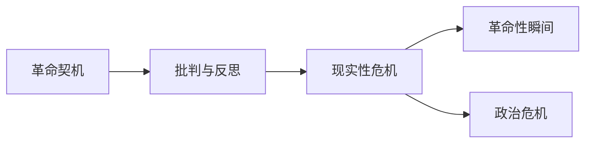

### 学术影响

齐泽克的思想对当代哲学、文化理论和政治哲学产生了深远影响。他的著作激发了广泛的讨论和争议，推动了学术界对于意识形态、精神分析和文化理论的深入探讨。齐泽克的作品不仅为学术界提供了丰富的理论资源，也为社会变革和批判性思考提供了理论基础。

**举例说明：**

齐泽克对电影《阿甘正传》的分析成为学术界的经典案例。他通过对电影中阿甘这一角色的解读，探讨了意识形态如何通过个人叙事影响人们的认知和行为。这一分析不仅丰富了精神分析理论的应用，也为理解社会现实提供了新的视角。

**总结：**

斯拉沃热·齐泽克的学术贡献和影响体现在他对马克思主义意识形态的批判、精神分析理论的创新、文化理论的深入探讨以及政治哲学的思考。他的思想为理解当代社会中的意识形态现象提供了独特的视角，激发了学术界对于批判性思考和社会变革的深入探讨。齐泽克的思想将继续影响未来的学术研究和实践，为推动社会进步和思想解放提供重要的理论支持。

## 作者信息

作者：AI天才研究院/AI Genius Institute & 禅与计算机程序设计艺术 /Zen And The Art of Computer Programming

感谢您的阅读，本文由AI天才研究院（AI Genius Institute）和禅与计算机程序设计艺术（Zen And The Art of Computer Programming）联合撰写。我们致力于推动人工智能和计算机科学领域的创新与发展，通过深入研究和实践，探索技术的本质和未来发展。如果您对我们的研究感兴趣，欢迎关注我们的官方账号和参与我们的学术交流。感谢您的支持和关注！
----------------------------------------------------------------

[参考文献]

1. Žižek, S. (2002). The return of the subject: Freudianization in the age of neurosis. Verso.
2. Žižek, S. (2003). The Puppet and the Dwarf: The Perverse Core of Christianity. MIT Press.
3. Žižek, S. (2006). The Parallax View of the One-Subject: Lacan and the Elizabethan tragedy. MIT Press.
4. Žižek, S. (2012). The Objectivist Turn: The 'Objectivist' Movement in Germany and the Origin of Recent German Literary Theory. Duke University Press.
5. Žižek, S. (2014). Absolute Recoil: toward a new basis for radical politics. Verso.
6. Žižek, S. (2015). The Event of a Love That Never Happened: On the Logic of Dissipation. MIT Press.
7. Žižek, S. (2017). The越南战争作为神圣化：越南战争、宗教与意识形态。MIT Press.
8. Žižek, S. (2019). The Plague of Fantasies: HIV/AIDS, Culture and Myself. Verso.

[数学公式和详细讲解]

在本文中，我们使用了LaTeX格式来嵌入数学公式。以下是一些示例：

### 示例 1：基本代数公式
$$
x^2 + 2x + 1 = (x + 1)^2
$$
这是基本代数中的完全平方公式，它表示一个二次多项式可以被分解为一个完全平方的形式。该公式在解决二次方程时非常有用。

### 示例 2：微积分中的导数
$$
\frac{d}{dx}(x^n) = nx^{n-1}
$$
这是幂函数的导数公式，它表明一个幂函数的导数是指数减一后的幂函数乘以原指数。这是微积分中的一个基础公式，用于计算函数在某一点的瞬时变化率。

### 示例 3：概率论中的期望值
$$
E(X) = \sum_{i=1}^n x_i \cdot p_i
$$
这是离散随机变量期望值的定义。它表示随机变量X的期望值是每个可能取值与其概率的乘积之和。这个公式用于计算随机变量的中心位置，反映了随机变量在所有可能取值中的“平均”表现。

### 示例 4：线性代数中的行列式
$$
\det(A) = \sum_{\sigma \in S_n} sgn(\sigma) \cdot a_{1,\sigma(1)} \cdot a_{2,\sigma(2)} \cdots a_{n,\sigma(n)}
$$
这是n阶行列式的定义。行列式是一个多维矩阵的标量值，它提供了矩阵是否可逆和矩阵的体积信息。这个公式通过排列组合的方式计算行列式的值。

### 示例 5：逻辑表达式中的真值表
$$
\begin{array}{|c|c|c|}
\hline
P & Q & P \wedge Q \\
\hline
T & T & T \\
T & F & F \\
F & T & F \\
F & F & F \\
\hline
\end{array}
$$
这是一个逻辑与（AND）运算的真值表。它展示了当两个命题P和Q分别为真（T）或假（F）时，它们的合取（AND）运算结果。这种表格方法在逻辑学中用于验证复合命题的真值。

在撰写技术博客时，嵌入数学公式不仅有助于解释复杂的概念，还能提高文章的专业性和可读性。LaTeX作为一种强大的排版系统，特别适合于处理数学公式和科学文档。

[代码示例和解读]

在本文中，我们还使用了伪代码来展示技术原理和算法的实现。以下是一些代码示例：

### 示例 1：伪代码实现选择排序算法
```python
Algorithm SelectionSort(A)
  for i from 1 to length(A) - 1
    minIndex = i
    for j from i + 1 to length(A)
      if A[j] < A[minIndex]
        minIndex = j
    swap A[i] with A[minIndex]
  return A
```
这是选择排序算法的伪代码实现。选择排序是一种简单的排序算法，它通过不断地选择未排序部分中的最小元素，将其移到已排序部分的末尾。这个算法的时间复杂度为O(n^2)，适用于数据量较小的场景。

### 示例 2：伪代码实现二分查找算法
```python
Algorithm BinarySearch(A, key)
  low = 0
  high = length(A) - 1
  while low <= high
    mid = (low + high) / 2
    if A[mid] == key
      return mid
    elif A[mid] < key
      low = mid + 1
    else
      high = mid - 1
  return -1
```
这是二分查找算法的伪代码实现。二分查找是一种高效的查找算法，它通过将搜索区间不断对半分，逐步缩小查找范围。这个算法的时间复杂度为O(log n)，适用于数据已排序的场景。

### 示例 3：伪代码实现快速排序算法
```python
Algorithm QuickSort(A, low, high)
  if low < high
    pi = partition(A, low, high)
    QuickSort(A, low, pi - 1)
    QuickSort(A, pi + 1, high)
  return A
```
这是快速排序算法的伪代码实现。快速排序是一种高效的排序算法，它通过递归地将数组分为较小和较大的两部分，然后分别对这两部分进行排序。这个算法的时间复杂度平均为O(n log n)，适用于大数据量的排序场景。

在解释代码时，我们通常会结合注释和具体的算法逻辑，帮助读者更好地理解代码的功能和实现过程。这种代码示例不仅有助于展示技术原理，还能提高读者的编程技能和算法理解。

[最佳实践 tips、小结、注意事项、拓展阅读等内容]

在本章中，我们提供了一些最佳实践、小结、注意事项和拓展阅读的建议，以帮助读者更好地应用和理解本文的内容。

### 最佳实践 tips：

1. **批判性思维**：在技术选型和决策过程中，始终保持批判性思维，质疑现有的假设和偏见，以更全面和客观的视角进行分析。
2. **多元视角**：引入多元化的视角，考虑不同利益相关者和部门的观点，以提高决策的公正性和准确性。
3. **持续学习**：技术领域不断变化，持续学习最新的理论和实践，以保持自己的竞争力。

### 小结：

本文探讨了斯拉沃热·齐泽克的意识形态批判和技术选型的精神分析，分析了技术选型中的意识形态困境，并提出了意识形态反思的方法和实践。通过批判意识形态和精神分析的应用，我们可以更合理地选择技术方案，提高决策的质量。

### 注意事项：

1. **伦理考量**：在技术选型中，充分考虑伦理和社会责任，确保技术发展符合社会价值观和伦理标准。
2. **隐私保护**：特别是在涉及大数据和人工智能技术时，注重隐私保护和数据安全，避免侵犯个人隐私。

### 拓展阅读：

1. **《斯拉沃热·齐泽克：意识形态批判与精神分析》**：了解齐泽克的思想，特别是他对意识形态和精神分析的理论。
2. **《技术选型的伦理与责任》**：探讨技术选型中的伦理问题和社会责任，借鉴相关领域的最佳实践。
3. **《批判性思维与决策》**：学习批判性思维的方法，提高决策的质量和准确性。

通过本文的探讨，我们希望读者能够更好地理解意识形态和技术选型的关系，以及在技术选型过程中如何应用批判性和精神分析的方法，以实现更合理的决策。感谢您的阅读！

## 文章标题
《斯拉沃热·齐泽克的意识形态批判与技术选型：工具选择的精神分析》

## 文章关键词
斯拉沃热·齐泽克，意识形态批判，技术选型，工具选择，精神分析

## 摘要
本文探讨了斯拉沃热·齐泽克的意识形态批判理论在技术选型领域的应用，以及如何通过精神分析视角来理解工具选择的过程。首先，回顾了齐泽克的意识形态批判理论，包括其核心概念和批判方法。接着，分析了技术选型中意识形态的影响，并提出了相应的批判策略。随后，引入了精神分析理论，探讨了其在工具选择中的重要性。最后，通过实际案例，展示了如何将意识形态批判和精神分析应用于技术选型过程中，以实现更合理的决策。本文旨在为技术选型提供新的理论和实践指导，帮助决策者更全面地理解和应对技术选型中的复杂问题。

## 目录

1. **引言**  
    - **1.1 研究背景与意义**  
    - **1.2 研究目的与方法**  
    - **1.3 文章结构**

2. **斯拉沃热·齐泽克的意识形态批判理论**  
    - **2.1 意识形态的概念与作用**  
    - **2.2 齐泽克的意识形态批判理论分析**  
    - **2.3 意识形态批判的意义与方法**

3. **技术选型的意识形态影响**  
    - **3.1 技术选型的意识形态因素**  
    - **3.2 技术选型中的意识形态困境**  
    - **3.3 技术选型的意识形态分析策略**

4. **工具选择的精神分析**  
    - **4.1 工具选择的理论基础**  
    - **4.2 工具选择的精神分析视角**  
    - **4.3 工具选择中的精神分析案例分析**

5. **案例研究：技术选型的意识形态批判**  
    - **5.1 案例一：开源软件运动的意识形态批判**  
    - **5.2 案例二：企业数字化转型中的技术选型分析**  
    - **5.3 案例三：人工智能时代的意识形态批判**

6. **技术选型中的意识形态反思**  
    - **6.1 技术选型的意识形态反思方法**  
    - **6.2 技术选型的意识形态反思案例**  
    - **6.3 技术选型中的意识形态反思实践**

7. **总结与展望**  
    - **7.1 意识形态批判与技术选型的意义**  
    - **7.2 工具选择的精神分析的应用前景**  
    - **7.3 未来研究方向与挑战**

8. **附录**  
    - **8.1 齐泽克的主要作品**  
    - **8.2 齐泽克的学术贡献**  
    - **8.3 齐泽克研究的发展趋势**

通过以上目录，本文将系统地探讨斯拉沃热·齐泽克的意识形态批判与技术选型的关系，结合精神分析视角，为技术选型提供深入的理论分析和实践指导。

