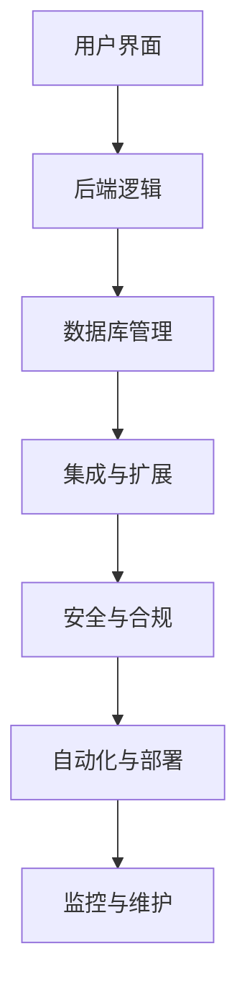

                 

### 引言

在数字化时代，软件开发已经成为推动社会进步的重要力量。然而，软件开发的传统模式往往对技术知识和专业能力要求较高，使得非专业开发人员难以参与其中。为了解决这一问题，无代码/低代码平台应运而生，旨在 democratize 软件开发，让更多人能够轻松创建应用，从而实现软件开发的大众化。本文将围绕无代码/低代码平台，从概述、核心理念、架构设计、核心技术、应用实践、发展趋势等多个方面进行深入探讨。

无代码/低代码平台的核心价值在于降低技术门槛，使得非专业人士也能够进行应用开发和定制。这不仅仅是对软件开发的一种革新，更是对软件开发民主化的推动。在本文中，我们将首先介绍无代码/低代码平台的发展背景和定义，随后详细分析其核心理念和架构设计，探讨其核心技术，展示实际应用案例，并展望其未来发展。通过这篇文章，我们希望能够帮助读者全面了解无代码/低代码平台，认识到其在软件开发领域的重要性和潜力。

### 关键词

无代码平台、低代码平台、软件开发民主化、数字化时代、架构设计、核心技术、应用实践、发展趋势。

### 摘要

本文深入探讨了无代码/低代码平台在软件开发民主化中的作用。首先，我们介绍了无代码/低代码平台的发展背景和定义，分析了其核心理念、架构设计、核心技术，并展示了实际应用案例。接着，我们展望了无代码/低代码平台的发展趋势和未来方向。通过本文，读者可以全面了解无代码/低代码平台的核心价值、技术实现和应用场景，认识到其在推动软件开发民主化方面的重要作用。

### 第一部分：无代码/低代码平台概述

#### 第1章：无代码/低代码平台概述

##### 1.1 无代码/低代码平台的发展背景

在过去的几十年中，软件开发经历了巨大的变革。从最初的编程语言如BASIC和COBOL，到现代的Java、Python和JavaScript，编程语言和技术框架的不断演进使得软件开发变得更加高效和灵活。然而，尽管技术的进步为开发人员提供了丰富的工具和资源，但软件开发的传统模式仍然存在一些瓶颈。

首先，软件开发需要专业的技术知识和编码技能。这意味着只有少数具备这些技能的人才能参与开发过程，从而限制了开发者的多样性和创新性。其次，传统的软件开发流程复杂且耗时。从需求分析、设计、编码、测试到部署，每个阶段都需要高度专业化的工作，这使得开发周期变长，成本增加。

此外，随着企业的数字化转型加速，对定制化软件的需求不断增加。然而，企业内部的IT团队往往难以满足这种需求，因为他们可能缺乏足够的时间和资源。这就为无代码/低代码平台的兴起提供了契机。

无代码/低代码平台的发展可以追溯到20世纪90年代末和21世纪初。随着Web 2.0和移动互联网的兴起，用户对个性化、定制化的应用需求不断增加。传统的软件开发模式已经无法满足这种需求，于是无代码/低代码平台开始崭露头角。这些平台通过简化开发流程和降低技术门槛，使得非专业开发人员也能够快速创建应用。

最早的代表性产品之一是WordPress，它使得任何人都可以轻松搭建自己的网站，而不需要了解HTML和CSS。随后，更多的无代码/低代码平台相继出现，如AppSheet、OutSystems和PowerApps等。这些平台不仅提供了可视化的界面设计工具，还集成了丰富的API和功能模块，使得用户可以快速构建和部署应用。

近年来，随着云计算、大数据和人工智能等技术的发展，无代码/低代码平台的功能和性能得到了显著提升。它们不仅能够处理复杂的业务逻辑，还能够与外部系统进行无缝集成，从而满足企业各种复杂的开发需求。

总的来说，无代码/低代码平台的兴起是软件开发领域的一次重要变革。它不仅降低了技术门槛，使得更多人能够参与软件开发，还提高了开发效率和灵活性，推动了软件开发的民主化。在未来，无代码/低代码平台将继续发挥重要作用，为软件开发带来更多的创新和可能性。

##### 1.2 无代码/低代码平台的定义与特点

无代码/低代码平台是一种新兴的软件开发工具，它通过简化开发流程和降低技术门槛，使得非专业开发人员也能快速创建应用。首先，我们来明确一下无代码/低代码平台的定义。

**无代码平台**：无代码平台是一种完全不需要编写代码的软件开发工具。用户通过图形化的界面和模块化的组件，拖放和组合这些组件来构建应用。这种方式使得用户无需掌握编程语言和开发知识，即可实现应用的开发。

**低代码平台**：低代码平台则是在无代码平台的基础上，提供了一定的代码编写功能。用户可以在图形化界面的基础上，通过少量的代码来实现更复杂的业务逻辑和功能。

**定义与特点**：

1. **可视化界面**：无代码/低代码平台通常采用可视化的界面设计工具，用户可以通过拖放组件、调整属性等方式来构建应用界面。这种界面设计方式直观、简单，无需编写代码。

2. **模块化组件**：无代码/低代码平台提供了丰富的模块化组件，如按钮、表单、列表、地图等。用户可以根据需要，将这些组件拖放到界面中，并配置其属性和行为。

3. **快速开发**：无代码/低代码平台通过简化和自动化开发流程，使得应用的开发速度大大提高。用户无需编写大量的代码，即可实现应用的基本功能和业务逻辑。

4. **跨平台兼容**：无代码/低代码平台通常支持多种操作系统和设备，如iOS、Android、Web等。用户可以在一个平台上构建应用，并部署到不同的设备上。

5. **低门槛**：无代码/低代码平台降低了技术门槛，使得非专业开发人员也能参与应用开发。这大大扩展了开发者的范围，提高了开发的多样性和创新性。

6. **高灵活性**：无代码/低代码平台提供了丰富的自定义和扩展能力，用户可以根据具体需求，对应用进行个性化的定制和优化。

总的来说，无代码/低代码平台通过其直观的界面设计、模块化组件、快速开发、跨平台兼容、低门槛和高灵活性等特点，使得软件开发变得更加简单和高效。它不仅降低了技术门槛，还提高了开发效率和灵活性，推动了软件开发的民主化。

##### 1.3 无代码/低代码平台的价值与挑战

无代码/低代码平台在软件开发领域具有显著的价值，同时也面临一些挑战。

**价值**：

1. **降低技术门槛**：无代码/低代码平台通过可视化界面和模块化组件，使得非专业开发人员也能轻松构建应用。这降低了技术门槛，使得更多人能够参与软件开发，从而推动软件开发的民主化。

2. **提高开发效率**：无代码/低代码平台简化了开发流程，自动化了部分工作，大大提高了开发效率。用户无需编写大量的代码，即可实现应用的基本功能和业务逻辑，从而节省了开发时间和成本。

3. **增强灵活性**：无代码/低代码平台提供了丰富的自定义和扩展能力，用户可以根据具体需求，对应用进行个性化的定制和优化。这种灵活性使得开发者能够快速响应市场变化和用户需求。

4. **跨平台兼容**：无代码/低代码平台支持多种操作系统和设备，如iOS、Android、Web等。用户可以在一个平台上构建应用，并部署到不同的设备上，从而提高应用的覆盖面和用户满意度。

**挑战**：

1. **技术限制**：尽管无代码/低代码平台提供了丰富的功能和工具，但其在处理复杂业务逻辑和性能优化方面仍然存在一定的技术限制。某些特定的功能可能需要手动编写代码来实现。

2. **安全风险**：无代码/低代码平台在简化开发流程的同时，也带来了一定的安全风险。由于用户无需深入了解技术细节，可能容易忽略安全性问题，导致应用存在漏洞。

3. **人才短缺**：虽然无代码/低代码平台降低了技术门槛，但仍然需要一定程度的编程知识和开发经验。专业开发人员的短缺可能会限制无代码/低代码平台的普及和应用。

4. **市场认知**：无代码/低代码平台在市场上的认知度相对较低，部分企业和开发者对其存在误解和疑虑。需要通过宣传和推广，提高市场对无代码/低代码平台的认知和接受度。

总的来说，无代码/低代码平台在软件开发领域具有显著的价值，但也面临一些挑战。通过不断改进和优化，无代码/低代码平台有望克服这些挑战，发挥更大的作用。

##### 1.4 无代码/低代码平台的技术框架

无代码/低代码平台的技术框架是其核心组成部分，决定了平台的性能、扩展性和用户体验。一个典型的无代码/低代码平台通常包括以下几个关键模块：

1. **用户界面（UI）**：用户界面是用户与平台交互的入口。无代码/低代码平台通过提供可视化界面设计工具，如拖放组件、属性设置等，使得用户可以轻松构建应用界面。

2. **后端逻辑**：后端逻辑负责处理应用的业务逻辑和数据管理。无代码/低代码平台通常集成了各种API和函数库，用户可以通过图形化界面或少量代码来配置和调用这些功能。

3. **数据库管理**：数据库管理模块负责存储和管理应用数据。无代码/低代码平台通常支持多种数据库类型，如关系型数据库（如MySQL、PostgreSQL）和NoSQL数据库（如MongoDB、Redis），并提供数据建模和查询功能。

4. **集成与扩展**：集成与扩展模块使得无代码/低代码平台能够与外部系统、服务和工具进行无缝集成。通过提供API、Webhook和插件等，用户可以自定义和扩展平台功能，以满足特定需求。

5. **安全与合规**：安全与合规模块负责确保平台的安全性和数据隐私。无代码/低代码平台通常提供了多种安全措施，如用户认证、数据加密、访问控制等，以保护应用和数据的安全。

6. **自动化与部署**：自动化与部署模块负责自动化构建、测试和部署应用。无代码/低代码平台通常集成了持续集成和持续部署（CI/CD）工具，用户可以一键部署应用到各种环境中。

7. **监控与维护**：监控与维护模块负责监控平台的运行状态和性能，并提供日志记录和故障排查工具。通过监控和日志分析，用户可以及时发现和解决平台问题。

一个典型的无代码/低代码平台的技术框架如下：

通过这个技术框架，无代码/低代码平台实现了从界面设计到后端逻辑、数据库管理、集成与扩展、安全与合规、自动化与部署以及监控与维护的全流程管理。用户无需深入了解底层技术细节，即可快速构建和部署应用，从而大大提高了开发效率和用户体验。

### 第二部分：无代码平台的核心理念

#### 第2章：无代码平台的核心理念

##### 2.1 无代码平台的用户定位

无代码平台的核心定位是让非专业开发人员也能轻松构建应用。这包括但不限于业务人员、市场营销人员、管理人员以及其他没有编程背景的专业人员。通过无代码平台，这些用户无需掌握复杂的编程语言和开发知识，就能实现应用的开发和部署。以下是几类主要用户：

1. **业务人员**：业务人员通常对业务流程和需求有深刻的理解，但缺乏编程技能。无代码平台使得他们可以直接参与应用的开发，从而更好地支持业务流程的优化和管理。

2. **市场营销人员**：市场营销人员需要快速创建营销工具和活动页面，以响应市场变化和用户需求。无代码平台为他们提供了便捷的工具，使得他们可以快速实现创意和策略的落地。

3. **管理人员**：管理人员需要对业务数据进行分析和决策，但通常不擅长编程。无代码平台提供了数据可视化和报表功能，帮助他们轻松获取和分析业务数据。

4. **非技术爱好者**：一些对技术感兴趣但没有编程背景的个人，可以通过无代码平台尝试开发自己的应用，从而满足个人兴趣或创业需求。

无代码平台通过降低技术门槛，扩大了开发者的范围，使得不同背景和专业领域的人都能参与到应用开发中，从而推动了软件开发的民主化。

##### 2.2 无代码平台的基本功能

无代码平台提供了一系列基本功能，使得用户能够轻松构建应用。以下是几类主要功能：

1. **界面设计**：界面设计功能是用户构建应用的第一步。无代码平台提供了可视化界面设计工具，如拖放组件、布局调整、样式设置等。用户可以通过这些工具，快速构建符合需求的用户界面。

2. **数据管理**：数据管理功能负责存储和管理应用数据。无代码平台通常集成了关系型数据库（如MySQL、PostgreSQL）和NoSQL数据库（如MongoDB、Redis），并提供数据建模、查询和报表功能。用户可以通过图形化界面，轻松定义数据结构和处理数据操作。

3. **业务逻辑**：业务逻辑功能用于处理应用的业务逻辑。无代码平台提供了丰富的API和函数库，用户可以通过图形化界面或少量代码，配置和调用这些功能，实现复杂的业务逻辑处理。

4. **自动化流程**：自动化流程功能用于自动化日常的重复性任务。无代码平台提供了工作流引擎，用户可以定义和配置各种业务流程，如审批流程、通知流程等。这些流程可以与外部系统进行集成，实现自动化操作。

5. **集成与扩展**：集成与扩展功能使得无代码平台能够与外部系统、服务和工具进行无缝集成。用户可以通过API、Webhook和插件等，自定义和扩展平台功能，以满足特定需求。

6. **数据分析和报表**：数据分析和报表功能用于分析业务数据，并提供直观的报表展示。无代码平台提供了数据可视化工具，用户可以通过拖放组件和配置属性，快速构建报表，分析业务数据。

7. **移动应用开发**：无代码平台通常支持移动应用开发，用户可以构建跨平台的应用，并部署到iOS和Android设备上。

通过这些基本功能，无代码平台为用户提供了一个全面的应用开发环境，使得他们能够快速构建和部署应用，实现业务需求的满足。

##### 2.3 无代码平台的核心优势

无代码平台在软件开发领域具有显著的核心优势，使得其在多个方面具有独特的竞争力。以下是几大核心优势：

1. **降低技术门槛**：无代码平台通过可视化的界面设计工具、模块化的组件和简化的开发流程，使得非专业开发人员也能轻松构建应用。用户无需掌握复杂的编程语言和开发知识，即可实现应用的开发和部署，从而大大降低了技术门槛。

2. **提高开发效率**：无代码平台简化了开发流程，自动化了部分工作，使得应用的开发速度大大提高。用户无需编写大量的代码，即可实现应用的基本功能和业务逻辑，从而节省了开发时间和成本。

3. **增强灵活性**：无代码平台提供了丰富的自定义和扩展能力，用户可以根据具体需求，对应用进行个性化的定制和优化。这种灵活性使得开发者能够快速响应市场变化和用户需求，提高了应用的适应性和竞争力。

4. **跨平台兼容**：无代码平台通常支持多种操作系统和设备，如iOS、Android、Web等。用户可以在一个平台上构建应用，并部署到不同的设备上，从而提高应用的覆盖面和用户体验。

5. **易于维护**：无代码平台提供了自动化构建、测试和部署工具，使得应用的维护和管理变得更加简单和高效。用户无需深入了解底层技术细节，即可轻松更新和修复应用。

6. **降低成本**：无代码平台降低了技术门槛和开发成本，使得企业可以以更低的成本实现应用的开发和部署。这大大降低了企业的IT投入，提高了资源利用效率。

7. **促进创新**：无代码平台降低了开发门槛，使得更多人能够参与到应用开发中，从而促进了创新和多样性。不同背景和专业领域的人可以共同开发应用，推动软件开发领域的创新和发展。

总的来说，无代码平台通过其降低技术门槛、提高开发效率、增强灵活性、跨平台兼容、易于维护、降低成本和促进创新等核心优势，在软件开发领域具有显著的地位和作用。它不仅推动了软件开发的民主化，还为企业和个人带来了更多的机会和可能性。

##### 2.4 无代码平台的应用场景

无代码平台的应用场景非常广泛，可以覆盖多个领域和业务需求。以下是几个典型的应用场景：

1. **企业内部系统**：企业内部系统如客户关系管理（CRM）、企业资源规划（ERP）、人力资源管理系统（HRM）等，是应用无代码平台的重要场景。业务人员可以通过无代码平台，快速搭建和部署内部系统，实现业务流程的自动化和管理。这大大提高了企业的工作效率和数据管理能力。

2. **电子商务平台**：电子商务平台需要不断更新和优化，以满足用户需求和市场变化。无代码平台可以帮助商家快速搭建和管理电子商务网站，实现产品上架、订单处理、库存管理等功能。商家无需依赖专业的开发人员，即可快速响应市场变化和用户需求。

3. **营销自动化**：营销自动化是现代营销不可或缺的一部分。无代码平台可以用于搭建营销自动化流程，如邮件营销、社交媒体营销、客户跟进等。营销人员可以通过无代码平台，轻松配置和执行各种营销活动，提高营销效果和用户转化率。

4. **移动应用开发**：随着移动设备的普及，移动应用开发成为企业关注的重点。无代码平台支持跨平台移动应用开发，用户可以在一个平台上构建iOS和Android应用。这大大简化了移动应用开发的流程，提高了开发效率。

5. **数据分析与报表**：数据分析是企业决策的重要依据。无代码平台提供了数据可视化和报表功能，用户可以轻松构建和分析报表，从数据中获取洞察和业务价值。这有助于企业更好地理解业务状况，制定发展战略。

6. **教育和培训**：教育和培训领域可以利用无代码平台，快速搭建在线课程和学习管理系统。教师和学生可以通过无代码平台，方便地创建和管理课程内容，进行在线学习和互动。

7. **物联网与智能设备**：物联网和智能设备的发展带来了新的应用场景。无代码平台可以用于开发和部署物联网应用，如智能家居控制、智能穿戴设备等。这为智能设备的互联互通和数据管理提供了便捷的解决方案。

总的来说，无代码平台的应用场景非常广泛，可以覆盖企业内部系统、电子商务、营销自动化、移动应用开发、数据分析与报表、教育和培训以及物联网与智能设备等多个领域。通过这些应用场景，无代码平台为企业和个人提供了强大的工具和平台，帮助他们快速实现业务需求和应用开发。

### 第三部分：低代码平台的核心理念

#### 第3章：低代码平台的核心理念

##### 3.1 低代码平台的用户定位

低代码平台的目标用户主要分为以下几类：

1. **专业开发人员**：低代码平台虽然旨在简化开发流程，但仍需要一定的编程知识和经验。专业开发人员可以利用低代码平台，提高开发效率，简化复杂项目的设计和开发。

2. **业务分析师和业务人员**：这些用户对业务流程和需求有深刻的理解，但通常不具备编程能力。低代码平台提供了丰富的业务逻辑配置和自动化功能，使得他们能够参与到应用开发中，实现业务需求的快速实现。

3. **技术爱好者**：对于对技术有浓厚兴趣，但尚未成为专业开发人员的用户，低代码平台提供了一个学习和实践的平台。用户可以通过低代码平台，逐步掌握编程技能，提升自己的技术水平。

4. **非技术管理人员**：这些用户需要管理和监督应用开发，但无需亲自编写代码。低代码平台提供了直观的界面设计和配置工具，使得他们可以轻松参与到应用开发过程中。

低代码平台通过满足不同用户的需求，扩大了开发者群体，提高了开发效率，推动了软件开发的普及化。

##### 3.2 低代码平台的基本功能

低代码平台提供了一系列功能，旨在简化开发流程，提高开发效率。以下是几个关键功能：

1. **可视化界面设计**：低代码平台提供了直观的可视化界面设计工具，用户可以通过拖放组件、调整样式等方式，快速构建应用界面。这种设计方式无需编写代码，大大简化了界面开发过程。

2. **业务逻辑配置**：低代码平台提供了丰富的业务逻辑配置工具，用户可以通过图形化界面，配置应用的各种业务逻辑，如条件分支、循环、数据处理等。这种配置方式比传统编程更加直观和简便。

3. **数据管理**：低代码平台集成了数据管理功能，用户可以轻松创建和管理数据库，定义数据模型和关系。平台提供了数据查询、报表和可视化分析工具，帮助用户更好地管理和分析数据。

4. **集成与扩展**：低代码平台支持与外部系统、服务和工具的集成，用户可以通过API、Webhook和插件等方式，扩展平台功能，实现个性化定制。

5. **自动化流程**：低代码平台提供了工作流引擎，用户可以定义和配置各种业务流程，如审批流程、通知流程等。这些流程可以与外部系统进行集成，实现自动化操作。

6. **移动应用开发**：低代码平台支持移动应用开发，用户可以在一个平台上构建跨平台的应用，并部署到iOS和Android设备上。

7. **持续集成与部署**：低代码平台通常集成了持续集成和持续部署（CI/CD）工具，用户可以自动化构建、测试和部署应用，提高开发效率。

通过这些基本功能，低代码平台为用户提供了一个全面的应用开发环境，使得他们能够快速构建和部署应用，实现业务需求的满足。

##### 3.3 低代码平台的核心优势

低代码平台在软件开发领域具有显著的核心优势，使得其在多个方面具有独特的竞争力。以下是几大核心优势：

1. **提高开发效率**：低代码平台通过可视化界面设计、业务逻辑配置、自动化流程等功能，大大简化了开发流程，提高了开发效率。用户无需编写大量的代码，即可实现应用的基本功能和业务逻辑，从而节省了开发时间和成本。

2. **增强灵活性**：低代码平台提供了丰富的自定义和扩展能力，用户可以根据具体需求，对应用进行个性化的定制和优化。这种灵活性使得开发者能够快速响应市场变化和用户需求，提高了应用的适应性和竞争力。

3. **降低技术门槛**：低代码平台降低了技术门槛，使得非专业开发人员也能参与到应用开发中。这扩大了开发者群体，提高了开发效率，推动了软件开发的普及化。

4. **跨平台兼容**：低代码平台通常支持多种操作系统和设备，如iOS、Android、Web等。用户可以在一个平台上构建应用，并部署到不同的设备上，从而提高应用的覆盖面和用户体验。

5. **易于维护**：低代码平台提供了自动化构建、测试和部署工具，使得应用的维护和管理变得更加简单和高效。用户无需深入了解底层技术细节，即可轻松更新和修复应用。

6. **降低成本**：低代码平台降低了技术门槛和开发成本，使得企业可以以更低的成本实现应用的开发和部署。这大大降低了企业的IT投入，提高了资源利用效率。

7. **促进协作**：低代码平台提供了协作工具，使得不同团队和成员可以共同参与应用开发，提高了协作效率。用户可以方便地分享和管理代码和配置，确保开发过程的透明和可控。

总的来说，低代码平台通过其提高开发效率、增强灵活性、降低技术门槛、跨平台兼容、易于维护、降低成本和促进协作等核心优势，在软件开发领域具有显著的地位和作用。它不仅推动了软件开发的普及化，还为企业和个人带来了更多的机会和可能性。

##### 3.4 低代码平台的应用场景

低代码平台的应用场景非常广泛，可以覆盖多个领域和业务需求。以下是几个典型的应用场景：

1. **企业内部系统**：企业内部系统如客户关系管理（CRM）、企业资源规划（ERP）、供应链管理系统（SCM）等，是应用低代码平台的重要场景。专业开发人员可以利用低代码平台，快速搭建和部署内部系统，实现业务流程的自动化和管理。业务人员也可以参与到应用开发中，实现业务需求的快速实现。

2. **电子商务平台**：电子商务平台需要不断更新和优化，以满足用户需求和市场变化。低代码平台可以帮助商家快速搭建和管理电子商务网站，实现产品上架、订单处理、库存管理等功能。商家无需依赖专业的开发人员，即可快速响应市场变化和用户需求。

3. **营销自动化**：营销自动化是现代营销不可或缺的一部分。低代码平台可以用于搭建营销自动化流程，如邮件营销、社交媒体营销、客户跟进等。营销人员可以通过低代码平台，轻松配置和执行各种营销活动，提高营销效果和用户转化率。

4. **移动应用开发**：随着移动设备的普及，移动应用开发成为企业关注的重点。低代码平台支持跨平台移动应用开发，用户可以在一个平台上构建iOS和Android应用。这大大简化了移动应用开发的流程，提高了开发效率。

5. **数据分析与报表**：数据分析是企业决策的重要依据。低代码平台提供了数据可视化和报表功能，用户可以轻松构建和分析报表，从数据中获取洞察和业务价值。这有助于企业更好地理解业务状况，制定发展战略。

6. **教育和培训**：教育和培训领域可以利用低代码平台，快速搭建在线课程和学习管理系统。教师和学生可以通过低代码平台，方便地创建和管理课程内容，进行在线学习和互动。

7. **物联网与智能设备**：物联网和智能设备的发展带来了新的应用场景。低代码平台可以用于开发和部署物联网应用，如智能家居控制、智能穿戴设备等。这为智能设备的互联互通和数据管理提供了便捷的解决方案。

总的来说，低代码平台的应用场景非常广泛，可以覆盖企业内部系统、电子商务、营销自动化、移动应用开发、数据分析与报表、教育和培训以及物联网与智能设备等多个领域。通过这些应用场景，低代码平台为企业和个人提供了强大的工具和平台，帮助他们快速实现业务需求和应用开发。

### 第四部分：无代码/低代码平台的架构设计与实现

#### 第4章：无代码/低代码平台的架构设计与实现

##### 4.1 无代码/低代码平台的架构设计原则

无代码/低代码平台的架构设计需要遵循以下原则：

1. **模块化**：平台应采用模块化设计，将不同的功能模块（如用户界面、后端逻辑、数据管理、集成与扩展等）分离，便于维护和扩展。

2. **可扩展性**：平台应具备良好的可扩展性，能够支持新功能和组件的动态加载和集成。

3. **高可用性**：平台应具备高可用性，确保在系统故障或负载高峰时，能够保持稳定运行。

4. **安全性**：平台应具备严格的安全策略，保护用户数据和隐私，防止未经授权的访问和攻击。

5. **灵活性**：平台应提供多种开发模式，如无代码、低代码和全代码开发，满足不同用户的需求。

6. **高性能**：平台应具备高性能，能够快速响应用户请求和处理大量数据。

7. **可定制性**：平台应提供高度的可定制性，允许用户根据具体需求进行个性化配置和优化。

##### 4.2 无代码/低代码平台的技术选型

无代码/低代码平台的技术选型需要综合考虑性能、扩展性、安全性、用户体验等多个因素。以下是几个关键的技术选型：

1. **前端技术**：前端框架如React、Vue.js和Angular等，能够提供高效的可视化界面设计工具和组件库，支持响应式布局和跨平台应用开发。

2. **后端技术**：后端框架如Node.js、Spring Boot和Django等，能够提供高性能的服务端处理能力和API接口，支持数据库连接、数据存储和业务逻辑处理。

3. **数据库技术**：数据库技术如MySQL、PostgreSQL和MongoDB等，能够提供高效的数据存储和管理功能，支持关系型数据库和NoSQL数据库。

4. **集成与扩展技术**：集成技术如API、Webhook和插件等，能够实现平台与外部系统、服务和工具的无缝集成，支持自定义和扩展功能。

5. **安全技术**：安全技术如SSL/TLS、OAuth2.0和JWT等，能够提供用户认证、数据加密和访问控制等功能，保障用户数据和隐私的安全。

6. **自动化与部署技术**：自动化与部署工具如Jenkins、GitLab CI/CD和Docker等，能够实现应用的自动化构建、测试和部署，提高开发效率。

##### 4.3 无代码/低代码平台的实现流程

无代码/低代码平台的实现流程通常包括以下步骤：

1. **需求分析**：与用户沟通，明确平台的功能需求、性能要求和用户体验目标。

2. **架构设计**：根据需求分析，设计平台的总体架构和模块划分，确保模块化、可扩展性和高可用性。

3. **界面设计**：使用前端框架构建可视化界面，实现用户与平台的交互。提供拖放组件、属性设置等功能，使得用户可以轻松构建应用界面。

4. **后端开发**：使用后端框架实现业务逻辑、数据存储和API接口。配置数据库连接、数据模型和业务逻辑处理，确保数据的安全和一致性。

5. **集成与扩展**：集成外部系统、服务和工具，如第三方API、数据库和Webhook等。提供自定义和扩展接口，满足用户的个性化需求。

6. **测试与优化**：进行功能测试、性能测试和安全测试，确保平台的稳定性和安全性。根据测试结果，优化代码和架构，提高平台的性能和用户体验。

7. **部署与维护**：将平台部署到生产环境，并进行日常监控和维护。定期更新和修复平台中的问题和漏洞，确保平台的长期稳定运行。

##### 4.4 无代码/低代码平台的核心组件

无代码/低代码平台的核心组件包括以下部分：

1. **用户界面**：提供可视化界面设计工具，如拖放组件、属性设置等，使得用户可以轻松构建应用界面。

2. **后端逻辑**：处理应用的业务逻辑和数据管理，提供API接口和函数库，支持业务逻辑的配置和调用。

3. **数据管理**：提供数据存储和管理功能，支持关系型数据库和NoSQL数据库，提供数据建模、查询和报表功能。

4. **集成与扩展**：提供API、Webhook和插件等接口，实现平台与外部系统、服务和工具的无缝集成，支持自定义和扩展功能。

5. **安全与合规**：提供用户认证、数据加密、访问控制等功能，保障用户数据和隐私的安全。

6. **自动化与部署**：提供自动化构建、测试和部署工具，支持持续集成和持续部署（CI/CD），提高开发效率。

7. **监控与维护**：提供日志记录、故障排查和性能监控工具，确保平台的稳定性和安全性。

通过这些核心组件，无代码/低代码平台实现了从界面设计到后端逻辑、数据管理、集成与扩展、安全与合规、自动化与部署以及监控与维护的全流程管理，为用户提供了便捷的应用开发环境。

### 第五部分：无代码/低代码平台的核心技术

#### 第5章：无代码/低代码平台的核心技术

##### 5.1 数据处理与存储技术

数据处理与存储是无代码/低代码平台的核心技术之一，它直接影响到平台的性能、扩展性和用户体验。无代码/低代码平台需要处理多种类型的数据，包括结构化数据（如关系型数据库）和非结构化数据（如NoSQL数据库），以及实时数据和历史数据。

1. **关系型数据库**：关系型数据库（如MySQL、PostgreSQL）适用于存储结构化数据。它们通过表、行和列的结构化方式来组织数据，支持复杂的关系查询和事务处理。无代码/低代码平台通常通过JDBC/ODBC接口与关系型数据库进行连接，提供数据建模、查询和报表功能。

2. **NoSQL数据库**：NoSQL数据库（如MongoDB、Redis）适用于存储非结构化数据。它们通过键值对、文档、列族等方式存储数据，支持高并发和实时数据处理。无代码/低代码平台通过提供图形化界面和API，使得用户可以轻松创建和管理NoSQL数据库。

3. **数据处理技术**：无代码/低代码平台需要处理大量数据，包括数据清洗、转换和聚合等操作。平台通常集成了数据清洗工具（如Apache Spark、Flink）和数据处理库（如Python的Pandas、R的dplyr），提供数据处理和转换功能。

4. **实时数据流处理**：无代码/低代码平台需要支持实时数据流处理，以便实时分析和响应业务事件。平台通常集成实时数据处理框架（如Apache Kafka、Apache Flink），提供实时数据摄取、处理和存储功能。

5. **数据存储优化**：为了提高数据存储性能，无代码/低代码平台采用了一些优化技术，如数据压缩、分片和分布式存储。通过这些技术，平台能够处理大规模数据，并提供低延迟和高吞吐量的数据存储和处理能力。

##### 5.2 自动化与智能化技术

自动化与智能化技术是提高无代码/低代码平台开发效率的关键因素。通过自动化，平台能够简化开发流程，减少手动操作，提高开发效率。智能化技术则能够根据用户行为和需求，提供智能化的功能和推荐。

1. **流程自动化**：无代码/低代码平台通过工作流引擎实现流程自动化。用户可以通过图形化界面定义各种业务流程，如审批流程、通知流程、数据流转等。平台会根据流程定义，自动执行相应的操作，提高业务流程的效率。

2. **代码生成与优化**：无代码/低代码平台通过代码生成技术，自动生成应用代码。平台会根据用户定义的界面和业务逻辑，生成相应的代码，减少手动编码工作量。同时，平台还提供了代码优化工具，自动优化代码结构，提高应用性能。

3. **智能化推荐**：无代码/低代码平台通过机器学习和数据分析技术，提供智能化推荐功能。平台会根据用户的行为数据和应用使用情况，推荐合适的组件、功能和应用模板，帮助用户更高效地开发应用。

4. **智能数据分析**：无代码/低代码平台集成了智能数据分析工具，如机器学习算法、自然语言处理等。用户可以通过这些工具，对业务数据进行分析和预测，获取业务洞察和决策支持。

##### 5.3 用户界面与交互技术

用户界面与交互技术是影响用户使用体验的重要因素。无代码/低代码平台需要提供直观、易用的界面设计工具和交互功能，以满足用户的需求。

1. **可视化界面设计**：无代码/低代码平台提供了可视化界面设计工具，用户可以通过拖放组件、调整样式等方式，快速构建应用界面。这些工具支持响应式设计，能够适应不同设备和屏幕尺寸。

2. **交互式组件**：平台提供了丰富的交互式组件，如按钮、表单、列表、地图等。用户可以自由组合和配置这些组件，实现各种交互功能，如数据输入、数据展示、表单验证等。

3. **定制化界面**：无代码/低代码平台支持定制化界面设计，用户可以根据具体需求，自定义界面的颜色、字体、布局等。这种定制化设计提高了应用的个性化程度，增强了用户满意度。

4. **响应式设计**：平台提供了响应式设计支持，能够根据设备类型和屏幕尺寸，自动调整界面布局和交互方式。这种响应式设计提高了应用的跨平台兼容性，提供了更好的用户体验。

##### 5.4 可视化与报告技术

可视化与报告技术是无代码/低代码平台的重要组成部分，它能够将复杂的数据和分析结果以直观、易理解的方式展示给用户。

1. **数据可视化**：平台提供了丰富的数据可视化工具，用户可以通过图表、地图、仪表盘等方式，将数据可视化展示。这些工具支持多种图表类型，如柱状图、折线图、饼图、地图等，能够帮助用户快速理解和分析数据。

2. **自定义报表**：平台提供了自定义报表功能，用户可以根据需求，自定义报表的样式、布局和数据内容。用户可以自由组合和配置报表组件，实现个性化的报表展示。

3. **交互式报表**：平台支持交互式报表，用户可以通过点击、拖动等方式，与报表进行交互，获取更详细的数据分析和洞察。这种交互式报表提高了用户的数据探索和分析能力。

4. **实时报告**：平台提供了实时报告功能，用户可以实时查看和分析业务数据。实时报告能够及时反映业务状况，帮助用户做出快速决策。

5. **数据集成与联动**：平台支持数据集成和联动，用户可以将多个数据源的数据进行整合和分析，生成综合性的报告。这种数据集成和联动功能提高了数据的综合利用效率，提供了更全面的数据分析结果。

通过这些核心技术，无代码/低代码平台能够为用户提供高效、灵活、易用的开发环境，满足多样化的应用开发需求。

### 第六部分：无代码/低代码平台的应用实践

#### 第6章：无代码/低代码平台的应用实践

##### 6.1 电商平台的无代码/低代码应用

电商平台的无代码/低代码应用是展示平台灵活性和高效性的绝佳场景。以下是几个关键的应用实例：

**实例1：产品信息管理**  
电商平台通常需要管理大量的产品信息，包括产品名称、描述、价格、库存等。使用无代码/低代码平台，业务人员可以轻松创建和管理产品信息。平台提供的可视化界面设计工具允许业务人员拖放字段和组件，快速构建产品信息表单。同时，平台集成的数据库管理功能使得业务人员无需编写SQL语句，即可创建和更新数据库表。这样，电商平台可以在无需专业开发人员介入的情况下，迅速更新和展示产品信息。

**实例2：订单处理流程**  
订单处理是电商平台的核心功能之一。无代码/低代码平台提供了自动化流程设计工具，业务人员可以轻松定义订单处理流程。例如，业务人员可以创建一个包含订单创建、支付确认、发货和客户通知等步骤的流程。通过工作流引擎，平台会自动执行这些步骤，确保订单处理的效率和准确性。同时，平台还提供了集成支付网关的功能，使得业务人员可以轻松接入各种支付服务，提高用户支付体验。

**实例3：营销活动管理**  
电商平台经常需要开展各种营销活动，如折扣促销、满减活动、限时抢购等。使用无代码/低代码平台，业务人员可以自定义和配置营销活动规则。例如，业务人员可以创建一个满减活动的规则，设置活动起始时间、满减金额、适用产品等。平台提供的可视化界面和配置工具使得业务人员可以快速理解和操作这些规则，同时，平台还提供了实时报告和数据分析功能，帮助业务人员及时调整营销策略，提高活动效果。

**实例4：移动应用开发**  
随着移动设备的普及，电商平台需要提供移动应用以提升用户体验。无代码/低代码平台支持跨平台移动应用开发，业务人员可以在一个平台上构建iOS和Android应用。通过平台提供的移动应用设计工具，业务人员可以快速创建应用界面，并配置与电商平台的连接。这样，电商平台可以在短时间内推出移动应用，提供更好的用户访问体验。

##### 6.2 企业内部系统的低代码开发

企业内部系统的低代码开发是提高企业工作效率和灵活性的重要手段。以下是几个关键的应用实例：

**实例1：客户关系管理（CRM）系统**  
企业需要有效管理客户信息、销售机会和客户关系。使用低代码平台，业务人员可以快速构建CRM系统。平台提供的界面设计工具允许业务人员拖放字段和组件，创建客户信息表单和报表。同时，平台集成的业务逻辑配置工具使得业务人员可以自定义数据流转和处理规则，如创建销售机会、分配任务等。这样，企业可以在不依赖专业开发人员的情况下，迅速搭建和优化CRM系统。

**实例2：供应链管理系统（SCM）**  
供应链管理是企业运营的重要组成部分。使用低代码平台，企业可以快速构建供应链管理系统。平台提供的数据库管理工具允许业务人员轻松创建和配置数据库表，管理供应商、采购订单、库存等信息。通过工作流引擎，业务人员可以定义供应链流程，如采购审批、库存预警等。平台还提供了集成第三方服务（如物流跟踪、支付网关）的功能，使得供应链管理更加高效。

**实例3：项目管理工具**  
企业需要有效管理项目进度、任务分配和资源调度。使用低代码平台，项目经理可以快速构建项目管理工具。平台提供的界面设计工具允许项目经理拖放组件，创建项目任务列表、甘特图等。通过业务逻辑配置工具，项目经理可以设置任务依赖关系、进度监控和提醒功能。同时，平台提供的协作功能使得团队成员可以实时沟通和协作，提高项目效率。

**实例4：人事管理系统（HRM）**  
企业需要管理员工信息、招聘流程、薪酬福利等。使用低代码平台，企业可以快速构建人事管理系统。平台提供的界面设计工具允许HR专员拖放字段和组件，创建员工信息表单和报表。通过业务逻辑配置工具，HR专员可以设置招聘流程、审批流程和薪酬福利规则。平台还提供了集成第三方服务（如薪酬计算、福利查询）的功能，使得人事管理更加智能化。

##### 6.3 教育与培训领域的无代码应用

教育与培训领域的无代码应用大大简化了教学管理过程，提高了教学效果。以下是几个关键的应用实例：

**实例1：在线课程管理系统**  
教育机构需要管理在线课程、课程内容和学员学习记录。使用无代码平台，教育机构可以快速构建在线课程管理系统。平台提供的界面设计工具允许教育机构拖放字段和组件，创建课程信息表单和报表。同时，平台集成的数据库管理工具使得教育机构可以轻松创建和配置数据库表，存储课程信息和学习记录。通过工作流引擎，教育机构可以定义课程发布、学员报名、课程评价等流程，提高教学管理效率。

**实例2：学习管理系统（LMS）**  
学习管理系统是教育机构的重要组成部分，用于管理学习内容、学习进度和学员成绩。使用低代码平台，教育机构可以快速构建学习管理系统。平台提供的界面设计工具允许教育机构拖放组件，创建学习内容列表、学习进度跟踪界面等。通过业务逻辑配置工具，教育机构可以设置学习任务、考试安排和成绩评定规则。平台还提供了集成第三方服务（如视频教程、在线考试系统）的功能，使得学习管理系统更加完善。

**实例3：在线考试系统**  
教育机构需要组织在线考试，评估学员的学习效果。使用无代码平台，教育机构可以快速构建在线考试系统。平台提供的界面设计工具允许教育机构拖放字段和组件，创建考试题目和试卷。通过业务逻辑配置工具，教育机构可以设置考试规则、计时器和评分标准。平台还提供了自动评分和反馈功能，使得考试过程更加高效和便捷。

**实例4：互动教学平台**  
教育机构需要提供互动式教学平台，促进师生互动和知识共享。使用低代码平台，教育机构可以快速构建互动教学平台。平台提供的界面设计工具允许教育机构拖放组件，创建课程讨论区、问答模块等。通过业务逻辑配置工具，教育机构可以设置讨论区管理规则、互动环节和时间安排。平台还提供了实时通信和视频会议功能，使得教学互动更加流畅和高效。

##### 6.4 物联网与智能硬件的低代码开发

物联网与智能硬件的低代码开发为智能家居、智能穿戴设备等领域带来了巨大的变革。以下是几个关键的应用实例：

**实例1：智能家居控制系统**  
智能家居控制系统需要连接各种智能设备，如智能灯泡、智能插座、智能空调等。使用低代码平台，用户可以快速构建智能家居控制系统。平台提供的界面设计工具允许用户拖放组件，创建设备控制面板和场景设置界面。通过业务逻辑配置工具，用户可以设置设备联动规则，如“离家模式”、“睡眠模式”等。平台还提供了API接口，使得用户可以自定义和控制外部智能设备，实现智能家居的个性化定制。

**实例2：智能穿戴设备应用**  
智能穿戴设备如智能手表、智能手环等，需要收集和展示用户的健康数据。使用低代码平台，用户可以快速构建智能穿戴设备应用。平台提供的界面设计工具允许用户拖放组件，创建健康数据展示界面和报表。通过业务逻辑配置工具，用户可以设置数据采集规则、数据分析和通知规则。平台还提供了实时数据传输和存储功能，确保数据的准确性和安全性。

**实例3：智能安防系统**  
智能安防系统需要连接摄像头、门禁系统、报警器等设备，实时监控和响应安全事件。使用低代码平台，用户可以快速构建智能安防系统。平台提供的界面设计工具允许用户拖放组件，创建监控界面和报警设置界面。通过业务逻辑配置工具，用户可以设置监控区域、报警规则和响应措施。平台还提供了集成第三方服务（如云存储、推送通知）的功能，使得安防系统更加完善和智能。

**实例4：智能工厂控制系统**  
智能工厂需要连接各种机器设备，实现生产过程自动化和优化。使用低代码平台，用户可以快速构建智能工厂控制系统。平台提供的界面设计工具允许用户拖放组件，创建设备监控界面和报表。通过业务逻辑配置工具，用户可以设置生产流程、设备联动和故障诊断规则。平台还提供了实时数据监控和预测分析功能，帮助用户优化生产流程，提高生产效率。

通过这些应用实例，无代码/低代码平台展示了在电商、企业内部系统、教育、物联网和智能硬件等领域的广泛应用和巨大潜力。它不仅简化了应用开发流程，提高了开发效率，还为不同领域的用户提供了强大的工具和平台，推动了数字化转型的进程。

### 第七部分：无代码/低代码平台的发展趋势与未来展望

#### 第7章：无代码/低代码平台的发展趋势与未来展望

##### 7.1 无代码/低代码平台的市场趋势

无代码/低代码平台在全球市场上的增长趋势显著，越来越多的企业和开发者开始认识到其带来的变革性影响。以下是几个关键的市场趋势：

1. **用户需求增长**：随着数字化转型和业务流程优化的需求增加，企业对快速开发和应用定制化的需求日益增长。无代码/低代码平台因其高效、灵活和低门槛的特点，受到了广泛的欢迎。

2. **市场规模扩大**：根据市场研究机构的数据，全球无代码/低代码平台市场规模预计将在未来几年内持续增长。预计到2025年，该市场的总值将达到数十亿美元。

3. **行业应用广泛**：无代码/低代码平台的应用领域不断扩大，从电商平台、企业内部系统、市场营销到物联网和智能设备等，都在采用这些平台来提升业务效率和创新能力。

4. **技术进步推动**：随着云计算、人工智能、大数据和区块链等新兴技术的发展，无代码/低代码平台的功能和性能也在不断提升。这些技术的融入，使得无代码/低代码平台能够处理更复杂的应用场景和业务需求。

##### 7.2 无代码/低代码平台的技术演进

无代码/低代码平台的技术演进是持续和快速的过程，以下是一些关键的技术趋势：

1. **智能化与自动化**：人工智能和机器学习技术的集成，使得无代码/低代码平台能够实现更加智能化的功能。例如，自动化流程、预测分析和智能推荐等。

2. **跨平台兼容性**：随着移动设备和多种操作系统的普及，无代码/低代码平台需要提供更好的跨平台兼容性。通过支持多种前端框架和后端技术，平台能够实现一次开发、多平台部署。

3. **高扩展性**：为了满足企业日益复杂的业务需求，无代码/低代码平台需要具备更高的扩展性。通过提供丰富的API接口、插件和模块，平台能够实现高度的可定制化和扩展性。

4. **安全性和合规性**：随着数据隐私和安全问题日益突出，无代码/低代码平台需要加强安全性措施。这包括用户认证、数据加密、访问控制和安全审计等。

5. **集成能力增强**：无代码/低代码平台需要能够与各种外部系统和服务进行无缝集成。这包括第三方API、数据库、云服务和其他业务系统，以实现数据的共享和流程的自动化。

##### 7.3 无代码/低代码平台在教育领域的应用

无代码/低代码平台在教育领域的应用正逐渐成为数字化转型的重要工具，以下是一些关键的应用场景：

1. **在线学习平台**：无代码/低代码平台可以帮助教育机构快速搭建和管理在线学习平台。平台提供的界面设计工具和模块化组件使得教师可以轻松创建课程内容、布置作业和进行在线互动。

2. **学习管理系统（LMS）**：教育机构可以使用无代码/低代码平台来构建学习管理系统，实现课程管理、学生管理、成绩管理和学习数据分析等功能。

3. **互动教学工具**：无代码/低代码平台提供了丰富的互动教学工具，如在线问答、讨论区、视频会议等，帮助学生和教师进行互动学习。

4. **个性化学习**：通过集成人工智能和数据分析技术，无代码/低代码平台可以提供个性化学习体验。平台可以根据学生的学习行为和成绩，推荐适合的学习资源和课程。

5. **教师支持**：无代码/低代码平台为教师提供了便捷的工具，使得他们可以专注于教学活动，而无需担心技术问题。平台提供的自动化工具和资源管理功能，提高了教师的工作效率。

##### 7.4 无代码/低代码平台在物联网与智能硬件领域的应用

物联网与智能硬件领域的快速发展为无代码/低代码平台提供了广阔的应用场景，以下是一些关键的应用实例：

1. **智能家居系统**：无代码/低代码平台可以帮助用户快速搭建智能家居系统。用户可以通过平台提供的界面设计工具，轻松创建设备控制界面、场景设置和自动化规则。

2. **智能穿戴设备应用**：无代码/低代码平台支持快速开发智能穿戴设备应用，如健康数据监控、运动跟踪和智能提醒等。用户可以通过平台提供的模块化组件，自定义应用界面和功能。

3. **工业物联网应用**：无代码/低代码平台可以用于开发工业物联网应用，如设备监控、故障诊断和生产优化等。平台提供的实时数据监控和预测分析功能，帮助工厂实现智能化生产。

4. **智能城市管理**：无代码/低代码平台可以用于开发智能城市应用，如交通管理、环境监测和公共安全等。平台提供的实时数据采集和智能分析功能，提高了城市管理的效率和智能化水平。

5. **智能农业应用**：无代码/低代码平台可以帮助农民和农业企业实现智能化农业管理，如土壤监测、灌溉控制和作物管理等。平台提供的自动化工具和远程监控功能，提高了农业生产的效率和可持续性。

通过这些发展趋势和应用实例，无代码/低代码平台展示了其广泛的潜力和未来的发展方向。随着技术的不断进步和市场的不断扩大，无代码/低代码平台将继续推动软件开发民主化，为各行业带来更多创新和变革。

### 第二部分：无代码/低代码平台开发与实现

#### 第8章：无代码平台的搭建与配置

##### 8.1 无代码平台的环境搭建

无代码平台的搭建与配置是一个相对简单但重要的步骤，以下是搭建无代码平台所需的基本环境和步骤：

**所需环境：**

1. **操作系统**：Windows、macOS或Linux。
2. **浏览器**：推荐使用Google Chrome、Firefox或Safari等现代浏览器。
3. **数据库**：根据平台需求，可以选择MySQL、PostgreSQL或MongoDB等。
4. **开发工具**：根据个人偏好，可以选择Visual Studio Code、Sublime Text或Atom等代码编辑器。

**搭建步骤：**

1. **安装操作系统**：根据硬件和需求选择合适的操作系统，并完成安装。

2. **安装浏览器**：从官方网站下载并安装推荐的浏览器。

3. **安装数据库**：根据所选数据库，从其官方网站下载并安装数据库服务器。例如，对于MySQL，可以从MySQL官方网站下载MySQL服务器并按照安装向导完成安装。

4. **配置数据库**：安装完成后，配置数据库用户和权限，确保无代码平台可以连接和使用数据库。

5. **安装开发工具**：从官方网站下载并安装代码编辑器。

6. **安装无代码平台**：从无代码平台提供商的官方网站下载平台安装包。通常，这些安装包提供了图形化的安装向导，按照向导逐步完成安装。

7. **配置平台**：安装完成后，根据平台提供的文档，配置所需的环境变量、数据库连接和其他设置。

##### 8.2 无代码平台的基本配置

无代码平台的基本配置是确保平台正常运行的关键步骤。以下是基本配置的步骤和注意事项：

**基本配置步骤：**

1. **设置用户账户**：创建管理员账户和普通用户账户，并设置相应的权限。管理员账户负责平台的管理和维护，普通用户账户用于应用开发。

2. **配置数据库连接**：确保无代码平台可以正确连接到数据库。在平台的配置文件中，填写数据库的连接信息，如主机、端口、用户名和密码。

3. **配置API密钥**：许多无代码平台需要API密钥来访问外部服务和API。生成API密钥，并在平台的配置界面中添加。

4. **设置集成服务**：根据需求，配置平台与其他系统和服务的集成。例如，配置邮件服务、支付网关、第三方API等。

5. **配置日志记录**：启用日志记录功能，确保平台运行过程中产生的日志可以被记录和监控。

6. **配置安全设置**：设置平台的安全策略，包括用户认证、数据加密、访问控制等。

**注意事项：**

1. **备份和恢复**：定期备份平台数据和配置文件，以便在出现问题时快速恢复。

2. **权限管理**：确保权限设置合理，防止未经授权的访问和数据泄露。

3. **更新和维护**：及时更新平台和组件，修复已知的安全漏洞和bug。

4. **性能优化**：根据平台运行情况和用户反馈，进行性能优化，提高平台的响应速度和稳定性。

##### 8.3 无代码平台的应用开发流程

无代码平台的应用开发流程与传统开发流程有所不同，更注重可视化和模块化。以下是应用开发的基本流程：

**开发流程：**

1. **需求分析**：与用户沟通，了解应用的功能需求、性能要求和用户体验目标。

2. **界面设计**：使用平台提供的界面设计工具，创建应用界面。通过拖放组件、调整样式和布局，实现用户界面的设计。

3. **业务逻辑配置**：使用平台提供的业务逻辑配置工具，定义应用的业务逻辑。这通常包括数据流转、条件分支、循环等。

4. **数据管理**：使用平台提供的数据库管理工具，定义数据模型、数据关系和数据处理规则。

5. **集成与扩展**：根据需求，配置外部服务和API，实现应用与其他系统和服务的集成。

6. **测试与优化**：进行功能测试、性能测试和安全测试，确保应用的稳定性和安全性。根据测试结果，进行优化和修复。

7. **部署与上线**：将应用部署到生产环境，进行最终的测试和上线。确保应用可以正常运行，并提供良好的用户体验。

**注意事项：**

1. **用户参与**：在开发过程中，尽量让用户参与，了解他们的需求和反馈，确保应用符合实际需求。

2. **模块化设计**：应用设计时，尽量采用模块化设计，提高代码的可维护性和复用性。

3. **版本控制**：使用版本控制系统（如Git），管理代码和配置文件，确保代码的一致性和可追溯性。

4. **文档和培训**：编写详细的开发文档和用户手册，提供必要的培训和支持，帮助用户熟悉和应用开发流程。

##### 8.4 无代码平台的项目部署与维护

无代码平台的项目部署与维护是确保应用长期稳定运行的关键环节。以下是项目部署与维护的步骤和策略：

**部署步骤：**

1. **环境准备**：在目标服务器上准备运行环境，包括操作系统、数据库、应用程序服务器等。

2. **构建应用**：使用平台提供的构建工具，将应用代码和配置文件打包成可执行文件或容器镜像。

3. **部署应用**：将构建好的应用部署到目标服务器。可以使用平台提供的自动化部署工具，如CI/CD流水线，实现一键部署。

4. **测试应用**：在部署后，对应用进行功能测试和性能测试，确保应用可以正常运行。

5. **监控应用**：启用应用监控工具，实时监控应用的运行状态和性能指标。监控工具可以自动发现和报告问题。

**维护策略：**

1. **定期备份**：定期备份应用数据和配置文件，确保在出现问题时可以快速恢复。

2. **安全更新**：及时更新平台和组件，修复已知的安全漏洞和bug。

3. **性能优化**：根据监控数据，进行性能优化，提高应用的响应速度和稳定性。

4. **监控和告警**：设置监控和告警机制，及时发现和处理应用异常。

5. **用户支持**：提供用户支持，及时解决用户的问题和反馈。

通过这些步骤和策略，无代码平台可以确保项目的成功部署和长期稳定运行。

### 第8章：无代码平台的搭建与配置

在无代码平台的搭建与配置过程中，以下几个关键环节至关重要，确保平台能够稳定运行并满足用户需求。

##### 8.1 环境搭建

**步骤：**
1. **选择操作系统**：根据项目需求，选择适合的操作系统。常见的操作系统有Windows、macOS和Linux。Linux由于其高效性和灵活性，常常被开发者优先选择。
2. **安装操作系统**：从官方网站下载并安装所选操作系统。安装过程中，注意配置网络连接和磁盘分区。
3. **安装开发工具**：从官方网站下载并安装代码编辑器，如Visual Studio Code、Sublime Text或Atom，以及终端模拟器，如Git Bash或Terminator。

**注意事项：**
- 确保操作系统和网络环境稳定，避免频繁的更新和重启影响平台搭建。
- 安装开发工具时，选择适合项目需求的功能和插件，如Git、Python等。

##### 8.2 基本配置

**步骤：**
1. **创建用户账户**：在操作系统上创建用户账户，并设置相应的权限。对于无代码平台，推荐创建一个专用的开发用户账户。
2. **安装数据库**：根据平台需求，安装相应的数据库。常见的数据库有MySQL、PostgreSQL和MongoDB。安装时，配置数据库用户和密码。
3. **配置数据库连接**：在无代码平台的配置文件中，填写数据库连接信息，如主机地址、端口号、用户名和密码。
4. **安装无代码平台**：从平台提供商的官方网站下载安装包，并按照安装向导进行安装。
5. **配置API密钥**：如果无代码平台需要集成外部API或服务，生成API密钥，并配置到平台的相应设置中。

**注意事项：**
- 数据库安装和配置时，注意数据存储路径和性能调优。
- 确保API密钥安全存储，避免泄露。

##### 8.3 应用开发流程

**步骤：**
1. **需求分析**：与用户沟通，了解应用的功能需求、性能要求和用户体验目标。
2. **界面设计**：使用平台提供的可视化界面设计工具，通过拖放组件、调整样式和布局，创建应用界面。
3. **业务逻辑配置**：使用平台提供的业务逻辑配置工具，定义应用的业务流程和数据处理规则。这通常包括条件分支、循环和数据处理等。
4. **数据管理**：使用平台提供的数据库管理工具，创建和管理数据库表，定义数据模型和关系。
5. **集成与扩展**：根据需求，配置外部服务和API，实现应用与其他系统和服务的集成。
6. **测试与优化**：进行功能测试、性能测试和安全测试，确保应用的稳定性和安全性。根据测试结果，进行优化和修复。

**注意事项：**
- 在开发过程中，保持与用户的沟通，确保应用满足实际需求。
- 采用模块化设计，提高代码的可维护性和复用性。

##### 8.4 项目部署与维护

**步骤：**
1. **环境准备**：在目标服务器上准备运行环境，包括操作系统、数据库和应用服务器。
2. **构建应用**：使用平台提供的构建工具，将应用代码和配置文件打包成可执行文件或容器镜像。
3. **部署应用**：将构建好的应用部署到目标服务器。可以使用平台提供的自动化部署工具，如CI/CD流水线，实现一键部署。
4. **测试应用**：在部署后，对应用进行功能测试和性能测试，确保应用可以正常运行。
5. **监控应用**：启用应用监控工具，实时监控应用的运行状态和性能指标。监控工具可以自动发现和报告问题。

**注意事项：**
- 部署前，确保目标服务器环境和开发环境一致，避免部署后出现兼容性问题。
- 定期备份应用数据和配置文件，确保在出现问题时可以快速恢复。
- 根据监控数据，进行性能优化，提高应用的响应速度和稳定性。

通过以上步骤和注意事项，可以确保无代码平台搭建与配置的顺利进行，为应用开发提供稳定、高效的环境。

### 第9章：低代码平台的开发与实现

#### 9.1 低代码平台的需求分析

低代码平台的需求分析是确保平台满足用户需求、实现预期功能的关键环节。以下是需求分析的步骤和方法：

**步骤：**

1. **用户调研**：通过与潜在用户、业务人员和技术团队进行沟通，了解他们对平台的需求和期望。调研可以采用问卷调查、访谈、焦点小组等方式。

2. **功能需求收集**：根据用户调研结果，收集平台所需的功能。功能可以分为基本功能（如界面设计、数据管理、业务逻辑配置等）和扩展功能（如集成与扩展、自动化流程、数据分析与报表等）。

3. **性能需求分析**：分析平台所需达到的性能指标，如响应时间、并发处理能力、数据存储容量等。性能需求会影响技术选型和系统架构设计。

4. **安全性需求**：确定平台所需的安全措施，如用户认证、数据加密、访问控制等。安全性需求是保障用户数据安全和隐私的重要保障。

5. **用户体验需求**：分析用户在使用平台过程中的体验需求，如界面友好性、操作便捷性、系统稳定性等。用户体验需求直接影响平台的用户接受度和满意度。

**方法：**

1. **用户故事地图**：使用用户故事地图，将用户需求转化为具体的用户场景和故事。用户故事地图可以帮助团队理解用户的需求和痛点，从而设计出满足用户需求的功能。

2. **需求文档编写**：根据用户调研和需求收集的结果，编写详细的需求文档。需求文档应包括功能需求、性能需求、安全性需求、用户体验需求等，并附有详细的描述和示例。

3. **原型设计**：使用原型设计工具，创建平台的原型。原型可以帮助团队直观地展示平台的功能和界面布局，验证需求分析的准确性。

4. **评审与迭代**：组织需求评审会议，邀请业务人员、技术团队和其他相关人员进行评审。根据评审反馈，对需求文档和原型进行修改和迭代，确保需求分析的准确性和完整性。

#### 9.2 低代码平台的设计与开发

低代码平台的设计与开发是确保平台高效、稳定、易用的关键环节。以下是设计与开发的步骤和要点：

**步骤：**

1. **系统架构设计**：根据需求分析结果，设计平台的系统架构。系统架构应包括前端界面、后端逻辑、数据库管理、集成与扩展等模块。设计时应考虑模块化、可扩展性和高可用性。

2. **界面设计**：使用低代码平台提供的界面设计工具，创建用户界面。界面设计应遵循用户体验原则，确保界面友好、操作便捷。界面设计工具通常支持拖放组件、样式调整和布局配置。

3. **业务逻辑开发**：使用低代码平台提供的业务逻辑配置工具，定义应用的业务逻辑。业务逻辑配置工具通常支持条件分支、循环、数据处理等。对于复杂的业务逻辑，可以结合编程语言进行部分开发。

4. **数据管理**：使用低代码平台提供的数据库管理工具，创建和管理数据库。数据库管理工具应支持数据建模、查询和报表功能。设计数据库时应考虑数据一致性、性能和安全性。

5. **集成与扩展**：根据需求，配置平台与外部系统、服务和工具的集成。集成工具通常包括API、Webhook和插件等。集成时应确保数据传输的可靠性和安全性。

6. **测试与优化**：进行功能测试、性能测试和安全测试，确保平台的稳定性和安全性。测试过程中，发现并修复问题，优化代码和架构，提高平台性能。

**要点：**

1. **模块化设计**：系统架构应采用模块化设计，将不同的功能模块分离，便于维护和扩展。模块化设计可以提高开发效率，降低系统复杂度。

2. **用户体验**：界面设计应注重用户体验，确保界面友好、操作便捷。可以使用用户测试和反馈，不断优化界面和交互设计。

3. **安全性**：设计时应考虑数据安全和用户隐私保护。实现用户认证、数据加密、访问控制等安全措施，确保平台的安全运行。

4. **可扩展性**：系统架构应具备良好的可扩展性，能够支持新功能和组件的动态加载和集成。这可以提高平台的灵活性和适应性。

5. **文档化**：编写详细的开发文档，包括系统架构、界面设计、业务逻辑、数据管理、集成与扩展等。文档化可以提高开发效率和代码的可维护性。

#### 9.3 低代码平台的功能测试与优化

低代码平台的功能测试与优化是确保平台稳定性和性能的关键环节。以下是功能测试与优化的步骤和方法：

**步骤：**

1. **功能测试**：使用自动化测试工具，对平台的功能进行测试。功能测试应覆盖所有功能模块，确保功能的正确性和完整性。

2. **性能测试**：使用性能测试工具，对平台的性能进行测试。性能测试应包括响应时间、并发处理能力、数据存储容量等。性能测试可以帮助发现系统瓶颈和性能问题。

3. **安全测试**：使用安全测试工具，对平台的安全进行测试。安全测试应包括漏洞扫描、安全漏洞修复等。安全测试可以确保平台的安全性和数据保护。

4. **用户反馈收集**：通过用户反馈和测试报告，收集平台的使用体验和问题报告。用户反馈可以帮助发现平台的使用问题和不完善之处。

5. **优化与修复**：根据功能测试、性能测试和安全测试的结果，对平台进行优化和修复。优化应包括代码优化、架构调整、性能提升等。

**方法：**

1. **自动化测试**：使用自动化测试工具，如Selenium、JUnit等，编写测试脚本，实现自动化功能测试。自动化测试可以提高测试效率和覆盖率。

2. **性能调优**：使用性能调优工具，如New Relic、AppDynamics等，对平台的性能进行监控和调优。性能调优应包括数据库优化、缓存使用、负载均衡等。

3. **安全加固**：使用安全加固工具，如OWASP ZAP、Burp Suite等，对平台进行安全加固。安全加固应包括修复已知漏洞、加强访问控制等。

4. **用户反馈机制**：建立用户反馈机制，鼓励用户报告问题和提出建议。用户反馈可以提供宝贵的数据和洞察，帮助平台改进和优化。

5. **持续集成与部署**：使用持续集成与部署（CI/CD）工具，如Jenkins、GitLab CI等，实现自动化测试、构建和部署。CI/CD可以提高开发效率和平台稳定性。

通过以上步骤和方法，低代码平台的功能测试与优化可以确保平台的稳定性和性能，提供良好的用户体验。

#### 9.4 低代码平台的上线与运营

低代码平台的上线与运营是确保平台稳定运行和持续改进的关键环节。以下是如何进行上线与运营的步骤和策略：

**上线步骤：**

1. **准备上线环境**：在目标服务器上搭建与开发环境相同或相似的运行环境。包括操作系统、数据库、应用服务器等。确保所有依赖项和配置均已就绪。

2. **构建应用**：使用低代码平台的构建工具，将应用代码和配置文件打包成可执行文件或容器镜像。构建过程中，确保包括所有必要的依赖项和配置文件。

3. **部署应用**：将构建好的应用部署到目标服务器。可以使用低代码平台提供的自动化部署工具，如CI/CD流水线，实现一键部署。部署过程中，确保应用与服务器环境兼容。

4. **测试应用**：在部署后，对应用进行功能测试、性能测试和安全测试。测试应覆盖所有关键功能，确保应用能够正常运行。

5. **监控应用**：启用应用监控工具，如Prometheus、Grafana等，实时监控应用的运行状态和性能指标。监控可以帮助及时发现和解决问题。

**运营策略：**

1. **用户培训**：为平台用户提供培训，帮助他们熟悉平台的操作和功能。培训可以通过在线课程、用户手册、视频教程等方式进行。

2. **用户支持**：建立用户支持系统，包括在线论坛、电子邮件和电话支持等。及时响应用户的问题和反馈，提供解决方案和指导。

3. **数据备份**：定期备份数据库和应用配置文件。备份数据应存储在安全的地方，以便在出现故障时能够快速恢复。

4. **性能优化**：根据监控数据，对应用进行性能优化。优化包括数据库查询优化、缓存使用、代码优化等。

5. **安全更新**：定期更新平台和组件，修复已知的安全漏洞和bug。安全更新应包括操作系统、数据库、应用服务器等。

6. **反馈收集**：建立用户反馈机制，收集用户的使用体验和改进建议。用户反馈可以提供宝贵的洞察，帮助平台持续改进。

通过以上步骤和策略，低代码平台的上线与运营可以确保平台的稳定运行和持续改进，提供良好的用户体验。

### 第10章：无代码/低代码平台的优化与拓展

#### 10.1 平台性能优化

无代码/低代码平台的性能优化是一个持续的过程，旨在确保平台在处理大量用户请求和数据时，依然能够保持高效和响应迅速。以下是一些关键的性能优化策略：

1. **数据库优化**：数据库是平台性能的关键因素。可以通过以下方式优化数据库性能：
   - **索引优化**：为常用的查询创建索引，提高查询速度。
   - **分库分表**：对于数据量巨大的表，可以通过分库分表的方式，减少单表的压力。
   - **缓存**：使用缓存技术，如Redis或Memcached，缓存常用数据和查询结果，减少数据库访问频率。
   - **数据库连接池**：使用数据库连接池技术，减少数据库连接的创建和销毁时间。

2. **代码优化**：优化平台中的代码，减少不必要的资源消耗：
   - **减少数据库查询**：避免使用复杂的SQL查询，减少数据库的负载。
   - **代码压缩**：压缩CSS和JavaScript文件，减少请求的响应时间。
   - **异步处理**：对于耗时长的操作，使用异步处理技术，提高响应速度。

3. **缓存策略**：使用缓存策略，减少重复的数据处理和查询：
   - **前端缓存**：使用浏览器缓存，缓存静态资源，如CSS、JavaScript和图片。
   - **会话缓存**：缓存用户的会话数据，如登录状态、用户偏好等，减少服务器负担。

4. **负载均衡**：使用负载均衡器，如Nginx或HAProxy，将用户请求分配到多个服务器上，提高系统的并发处理能力。

5. **扩展性优化**：确保平台具备良好的扩展性，能够水平扩展以应对增长的用户量：
   - **微服务架构**：将平台拆分为多个微服务，每个服务独立部署，方便扩展和运维。
   - **容器化**：使用容器技术，如Docker和Kubernetes，实现应用的快速部署和扩展。

6. **性能监控**：使用性能监控工具，如Prometheus和Grafana，实时监控平台性能指标，及时发现和解决问题。

#### 10.2 平台功能拓展

无代码/低代码平台的功能拓展是提高平台适应性和扩展性的关键。以下是一些常见的功能拓展方法：

1. **集成第三方服务**：集成第三方服务，如支付网关、短信服务、邮件服务、社交媒体等，提供更丰富的功能：
   - **API集成**：使用API接口，将第三方服务与平台集成，实现数据传输和功能调用。
   - **插件系统**：提供插件系统，允许用户或第三方开发插件，扩展平台功能。

2. **自定义组件**：允许用户或开发者创建自定义组件，以满足特定需求：
   - **自定义界面组件**：使用平台提供的自定义界面组件工具，用户可以创建自定义的UI元素，如按钮、表单、图表等。
   - **自定义逻辑组件**：允许用户使用代码或配置文件，创建自定义的业务逻辑组件。

3. **自定义流程和工作流**：提供自定义流程和工作流功能，允许用户定义复杂的业务流程：
   - **流程设计器**：提供图形化的流程设计器，用户可以拖放节点和连线，创建自定义的流程。
   - **工作流引擎**：集成工作流引擎，支持流程的执行、监控和调试。

4. **扩展数据处理能力**：提供扩展数据处理能力，支持更复杂的数据处理和分析：
   - **数据处理工具**：提供数据处理工具，如Elasticsearch、Apache Spark等，支持数据搜索、分析和处理。
   - **数据连接器**：提供数据连接器，支持与各种数据源（如数据库、文件、API等）的连接和操作。

5. **扩展存储能力**：提供扩展存储能力，支持多种数据存储解决方案：
   - **关系型数据库**：支持多种关系型数据库，如MySQL、PostgreSQL等。
   - **NoSQL数据库**：支持多种NoSQL数据库，如MongoDB、Redis等。
   - **云存储**：集成云存储服务，如AWS S3、Azure Blob存储等。

#### 10.3 平台安全性提升

无代码/低代码平台的 安全性提升是保护用户数据和应用安全的关键。以下是一些常见的安全提升策略：

1. **用户认证**：使用强密码认证、双因素认证等，确保用户身份验证的安全：
   - **多因素认证**：使用双因素认证（如短信验证码、电子邮件验证码、谷歌认证器等），提高用户身份的安全性。
   - **强密码策略**：要求用户使用复杂密码，并定期更换密码。

2. **数据加密**：对存储和传输的数据进行加密，确保数据安全：
   - **传输加密**：使用HTTPS协议，对用户数据和平台之间的通信进行加密。
   - **存储加密**：对数据库中的敏感数据进行加密存储，防止数据泄露。

3. **访问控制**：实现严格的访问控制策略，确保只有授权用户可以访问特定数据和功能：
   - **角色和权限管理**：定义不同的角色和权限，限制用户对数据和功能的访问。
   - **审计日志**：记录用户操作日志，便于追踪和审计。

4. **安全加固**：定期进行安全加固，修复已知漏洞和bug：
   - **安全扫描**：使用安全扫描工具，定期扫描平台中的漏洞和风险。
   - **安全更新**：及时更新平台和组件，修复已知的安全漏洞。

5. **安全培训**：为用户和开发者提供安全培训，提高安全意识和防范能力：
   - **安全意识培训**：提供安全意识培训，教育用户识别和防范网络钓鱼、恶意软件等。
   - **安全编程培训**：为开发者提供安全编程培训，教育开发者如何编写安全代码。

#### 10.4 平台运维与监控

无代码/低代码平台的运维与监控是确保平台稳定运行和高效服务的关键。以下是一些关键的运维与监控策略：

1. **自动化运维**：使用自动化工具，实现平台的部署、配置和监控：
   - **自动化部署**：使用自动化部署工具，如Ansible、Puppet等，实现平台的自动化部署和管理。
   - **自动化监控**：使用自动化监控工具，如Zabbix、Nagios等，实时监控平台性能和状态。

2. **日志管理**：收集和管理平台日志，便于问题诊断和故障排查：
   - **日志收集**：使用日志收集工具，如Logstash、Fluentd等，收集平台日志。
   - **日志分析**：使用日志分析工具，如Kibana、Grafana等，对日志进行分析和可视化。

3. **故障处理**：制定故障处理流程，快速响应和处理故障：
   - **故障预案**：制定故障预案，包括故障响应流程、故障处理步骤等。
   - **故障报告**：建立故障报告机制，及时记录和报告故障，便于追踪和处理。

4. **性能监控**：实时监控平台性能，确保系统高效稳定运行：
   - **性能指标**：监控关键性能指标，如CPU使用率、内存使用率、网络流量等。
   - **性能优化**：根据监控数据，进行性能优化，如数据库查询优化、缓存策略调整等。

5. **用户体验**：持续优化用户体验，提高用户满意度：
   - **用户调研**：定期进行用户调研，了解用户需求和反馈。
   - **用户体验改进**：根据用户反馈，持续改进平台的界面设计、功能体验等。

通过以上策略，无代码/低代码平台可以确保其高效、稳定和安全地运行，为用户提供优质的服务。

### 第11章：无代码/低代码平台的项目实战

#### 11.1 实战项目一：电商平台的搭建

**项目背景**：

随着电子商务的快速发展，越来越多的企业希望通过搭建电商平台来扩大销售渠道，提升用户体验。为了简化电商平台的建设过程，本项目采用无代码/低代码平台，快速搭建一个功能完善的电商平台。

**开发环境搭建**：

1. 选择无代码/低代码平台：例如OutSystems或AppSheet。
2. 搭建开发环境：根据平台要求，配置操作系统（如Windows或macOS）、数据库（如MySQL或PostgreSQL）以及开发工具（如Visual Studio Code）。

**项目需求分析**：

1. 产品信息管理：包括产品名称、描述、价格、库存等。
2. 订单处理：实现订单创建、支付确认、发货管理等。
3. 购物车功能：允许用户添加商品到购物车，进行结算。
4. 用户管理：包括用户注册、登录、个人信息管理等。
5. 营销活动管理：实现折扣促销、限时抢购等营销活动。

**界面设计**：

1. 使用平台的界面设计工具，创建首页、产品列表页、产品详情页、购物车页、结算页等。
2. 配置导航菜单、搜索栏、轮播图等组件，提升用户体验。

**业务逻辑配置**：

1. 使用平台的业务逻辑配置工具，定义产品信息管理、订单处理、购物车功能等。
2. 配置数据库连接，创建和管理数据库表，如产品表、订单表、用户表等。
3. 实现用户注册、登录、个人信息管理等功能。

**集成与扩展**：

1. 集成支付网关，如支付宝或微信支付，实现在线支付功能。
2. 集成物流服务，如快递鸟或顺丰，实现订单发货和物流跟踪功能。
3. 扩展自定义接口，实现第三方平台的对接，如微信公众号、小程序等。

**测试与优化**：

1. 进行功能测试，确保所有功能正常运行。
2. 进行性能测试，优化数据库查询和页面加载速度。
3. 进行安全测试，确保用户数据和支付信息的安全。

**项目部署与上线**：

1. 使用平台提供的自动化部署工具，将应用部署到服务器。
2. 在生产环境进行最终测试，确保应用稳定运行。
3. 启用监控工具，实时监控应用性能和状态。

**项目小结**：

通过本项目，我们使用无代码/低代码平台快速搭建了一个电商平台，实现了产品信息管理、订单处理、购物车、用户管理和营销活动等功能。项目实践表明，无代码/低代码平台在简化开发流程、提高开发效率方面具有显著优势，适用于快速搭建电商平台等应用场景。

#### 11.2 实战项目二：企业内部系统的低代码开发

**项目背景**：

随着企业业务的不断扩展和数字化转型的推进，企业内部系统如客户关系管理（CRM）、企业资源规划（ERP）等需求日益增长。为了快速响应业务需求，本项目采用低代码平台，搭建一个功能完善的企业内部系统。

**开发环境搭建**：

1. 选择低代码平台：例如OutSystems、PowerApps或Nintex。
2. 搭建开发环境：配置操作系统（如Windows或macOS）、数据库（如MySQL或SQL Server）以及开发工具（如Visual Studio Code）。

**项目需求分析**：

1. 客户关系管理（CRM）：
   - 客户信息管理：包括客户名称、联系方式、历史交易记录等。
   - 销售机会管理：记录销售机会、跟踪销售进度。
   - 客户联系管理：管理客户联系记录、设置提醒和通知。

2. 企业资源规划（ERP）：
   - 库存管理：实现库存信息的录入、查询和报表。
   - 财务管理：管理财务数据、生成财务报表。
   - 项目管理：记录项目进度、任务分配和资源调度。

**界面设计**：

1. 使用低代码平台的界面设计工具，创建CRM和ERP的界面，包括客户信息管理界面、销售机会管理界面、库存管理界面等。
2. 配置导航菜单、搜索栏、报表展示等组件，提升用户体验。

**业务逻辑配置**：

1. 使用低代码平台的业务逻辑配置工具，实现客户信息管理、销售机会管理、库存管理等功能。
2. 配置数据库连接，创建和管理数据库表，如客户表、销售机会表、库存表等。
3. 实现任务分配、项目进度跟踪、财务报表生成等功能。

**集成与扩展**：

1. 集成第三方服务，如邮件服务、短信服务、ERP系统等，实现与外部系统的数据同步和流程联动。
2. 扩展自定义接口，实现与外部系统的对接，如微信企业号、钉钉等。

**测试与优化**：

1. 进行功能测试，确保所有功能正常运行。
2. 进行性能测试，优化数据库查询和页面加载速度。
3. 进行安全测试，确保用户数据和业务数据的安全。

**项目部署与上线**：

1. 使用低代码平台的自动化部署工具，将应用部署到服务器。
2. 在生产环境进行最终测试，确保应用稳定运行。
3. 启用监控工具，实时监控应用性能和状态。

**项目小结**：

通过本项目，我们使用低代码平台快速搭建了一个功能完善的企业内部系统，实现了客户关系管理、企业资源规划等功能。项目实践表明，低代码平台在提高开发效率、降低开发成本方面具有显著优势，适用于快速搭建企业内部系统等应用场景。

### 第12章：无代码/低代码平台的未来展望

#### 12.1 无代码/低代码平台的发展趋势

无代码/低代码平台作为软件开发领域的重要趋势，正迅速发展并不断演进。以下是一些关键的发展趋势：

1. **智能化与自动化**：随着人工智能（AI）和机器学习（ML）技术的发展，无代码/低代码平台将更加智能化和自动化。平台将能够自动生成代码、优化业务逻辑、预测用户行为，从而提高开发效率。

2. **云计算与边缘计算**：云计算和边缘计算的结合，将为无代码/低代码平台提供更多的部署选项和计算资源。平台将能够更好地利用云基础设施，实现弹性扩展和高可用性。

3. **跨平台兼容性**：无代码/低代码平台将继续提升跨平台兼容性，支持更多操作系统和设备，如iOS、Android、Web等。这将使得平台的应用范围更加广泛，用户能够更灵活地选择合适的设备。

4. **安全性与合规性**：随着数据隐私和安全问题的日益突出，无代码/低代码平台将加强安全性措施，如用户认证、数据加密、访问控制等，确保用户数据的安全和合规。

5. **用户体验优化**：无代码/低代码平台将更加注重用户体验，提供更直观、易用的界面设计和交互功能。平台将引入更多的用户体验设计原则，如响应式设计、动态导航、个性化推荐等。

6. **开源与社区生态**：开源技术将继续推动无代码/低代码平台的发展，更多平台将采用开源框架和组件，构建开放、可扩展的生态系统。社区参与和协作将促进平台的技术创新和用户扩展。

#### 12.2 无代码/低代码平台的技术创新

无代码/低代码平台的技术创新将继续推动其功能扩展和性能提升。以下是一些关键的技术创新：

1. **低代码开发工具**：无代码/低代码平台将开发出更加智能化、自动化的低代码开发工具，如智能代码生成器、业务逻辑自动化工具等。这些工具将极大地简化开发流程，提高开发效率。

2. **实时数据分析和可视化**：平台将引入实时数据分析和可视化技术，如流数据处理器、实时图表和仪表盘等。这将使得用户能够实时监控和分析业务数据，快速做出决策。

3. **物联网集成**：无代码/低代码平台将加强物联网（IoT）集成，支持与各种物联网设备、传感器和平台的数据连接和处理。这将使得平台能够应用于智能家居、智能城市、工业物联网等领域。

4. **区块链应用**：平台将探索区块链技术的应用，如分布式账本、智能合约等。这将使得平台能够提供更安全、透明和去中心化的应用解决方案。

5. **增强现实（AR）/虚拟现实（VR）**：无代码/低代码平台将开发AR/VR应用开发工具，支持用户创建和管理AR/VR内容。这将为用户提供全新的交互体验和应用场景。

6. **人工智能与自然语言处理**：平台将集成人工智能和自然语言处理技术，提供智能客服、智能语音交互、智能文档处理等功能。这将提升平台的智能化水平，满足用户多样化的需求。

#### 12.3 无代码/低代码平台在教育领域的应用

无代码/低代码平台在教育领域的应用具有巨大的潜力，以下是一些关键的应用方向：

1. **在线学习平台**：无代码/低代码平台可以帮助教育机构快速搭建和管理在线学习平台。平台提供了丰富的界面设计工具和模块化组件，教师和学生可以轻松创建和管理课程内容、作业和互动活动。

2. **学习管理系统（LMS）**：教育机构可以使用无代码/低代码平台构建功能全面的学习管理系统。平台提供了用户管理、课程管理、成绩管理、在线测试等功能，帮助教育机构实现教学管理的数字化和智能化。

3. **互动教学工具**：平台提供了多种互动教学工具，如在线问答、讨论区、视频会议等，促进师生互动和学习体验。教师可以通过这些工具与学生进行实时沟通，提高教学效果。

4. **个性化学习**：无代码/低代码平台可以通过集成人工智能和数据分析技术，提供个性化学习体验。平台可以根据学生的学习行为和成绩，推荐适合的学习资源和课程，帮助学生提高学习效果。

5. **教师支持**：平台提供了便捷的工具，如课程模板、教学资源库等，帮助教师节省时间和精力。教师可以通过平台进行备课、布置作业、批改作业等，提高教学效率。

6. **学习数据分析**：平台提供了强大的数据分析和报表功能，教育机构可以实时监控学生的学习进度和成绩，分析教学效果，制定改进策略。

#### 12.4 无代码/低代码平台在物联网与智能硬件领域的应用

无代码/低代码平台在物联网（IoT）与智能硬件领域的应用正迅速发展，以下是一些关键的应用方向：

1. **智能家居系统**：无代码/低代码平台可以帮助用户快速构建智能家居系统，连接和控制各种智能设备，如智能灯泡、智能插座、智能空调等。平台提供了直观的界面设计工具和自动化规则配置功能，用户可以轻松实现设备联动和远程控制。

2. **智能穿戴设备**：无代码/低代码平台支持快速开发智能穿戴设备应用，如健康监测、运动跟踪、智能提醒等。平台提供了丰富的数据分析和可视化工具，用户可以实时查看和分析健康数据。

3. **智能工厂系统**：无代码/低代码平台可以用于开发智能工厂系统，实现设备监控、数据采集、故障诊断和生产优化。平台提供了实时数据监控和预测分析功能，帮助企业提高生产效率和降低成本。

4. **智能农业系统**：无代码/低代码平台可以帮助农民和农业企业实现智能化农业管理，如土壤监测、灌溉控制、作物管理等。平台提供了实时数据采集和自动化控制功能，提高农业生产效率和可持续性。

5. **智能交通系统**：无代码/低代码平台可以用于开发智能交通系统，如交通监控、车辆管理、智能导航等。平台提供了实时数据分析和预测功能，帮助城市管理者优化交通流量，提高交通效率。

6. **智能医疗设备**：无代码/低代码平台可以用于开发智能医疗设备应用，如远程监控、健康数据分析、智能诊断等。平台提供了实时数据传输和存储功能，帮助医疗机构提高医疗服务质量。

通过以上应用方向，无代码/低代码平台在物联网与智能硬件领域展示了巨大的潜力，为各行业带来了创新和变革。

### 第13章：无代码/低代码平台与软件开发民主化

#### 13.1 软件开发民主化的概念与意义

软件开发民主化是指通过降低技术门槛和提供便捷的工具，让更多的人能够参与到软件开发过程中，从而实现软件开发的普及化和大众化。传统的软件开发模式通常对开发人员的技术水平和专业知识要求较高，这使得许多非专业人士难以参与其中。软件开发民主化旨在打破这种壁垒，使得不同背景和专业领域的人都能享受到软件开发的乐趣和成果。

**概念**：

软件开发民主化的核心概念包括：

1. **降低技术门槛**：通过提供可视化的界面设计工具、模块化的组件和简化的开发流程，使得非专业人士也能轻松进行应用开发。

2. **普及化**：推广无代码/低代码平台，让更多的人掌握和应用软件开发技术，从而推动软件开发的普及。

3. **大众化**：让软件开发不再只是专业人士的特权，而是成为每个人都能参与的日常活动。

**意义**：

软件开发民主化具有以下重要意义：

1. **提高开发效率**：通过降低技术门槛，更多的人可以参与到软件开发中，从而提高开发效率，缩短开发周期。

2. **促进创新**：软件开发民主化使得不同背景和专业领域的人都能进行应用开发，这激发了更多的创新思维和创意，推动了软件开发的多样性和创新性。

3. **降低成本**：无代码/低代码平台降低了开发成本，使得企业可以以更低的成本实现应用的开发和部署，从而提高资源利用效率。

4. **扩大开发者群体**：软件开发民主化扩大了开发者群体，提高了开发的多样性和灵活性，使得软件开发领域更加繁荣。

5. **普及技术知识**：软件开发民主化有助于普及技术知识，提高公众对软件开发的认知和理解，从而推动技术进步和社会发展。

#### 13.2 无代码/低代码平台在软件开发民主化中的作用

无代码/低代码平台在推动软件开发民主化方面发挥着重要作用。以下是其具体作用：

1. **降低技术门槛**：无代码/低代码平台通过提供可视化的界面设计工具、模块化的组件和简化的开发流程，使得非专业人士也能轻松进行应用开发。用户无需具备专业的编程知识和经验，即可通过拖放组件、配置属性等方式快速构建应用。

2. **简化开发流程**：无代码/低代码平台简化了开发流程，自动化了部分工作，如界面设计、业务逻辑配置、数据库管理等。用户无需手动编写代码，即可实现应用的基本功能和业务逻辑，从而大大提高了开发效率。

3. **提高开发效率**：无代码/低代码平台通过简化和自动化开发流程，使得应用的开发速度大大提高。用户无需编写大量的代码，即可实现应用的基本功能和业务逻辑，从而节省了开发时间和成本。

4. **增强灵活性**：无代码/低代码平台提供了丰富的自定义和扩展能力，用户可以根据具体需求，对应用进行个性化的定制和优化。这种灵活性使得开发者能够快速响应市场变化和用户需求，提高了应用的适应性和竞争力。

5. **促进协作**：无代码/低代码平台提供了协作工具，使得不同团队和成员可以共同参与应用开发，提高了协作效率。用户可以方便地分享和管理代码和配置，确保开发过程的透明和可控。

6. **降低开发成本**：无代码/低代码平台降低了技术门槛和开发成本，使得企业可以以更低的成本实现应用的开发和部署。这大大降低了企业的IT投入，提高了资源利用效率。

7. **普及技术知识**：无代码/低代码平台通过降低技术门槛和简化开发流程，使得更多的人能够掌握和应用软件开发技术，从而推动了技术知识的普及。

总的来说，无代码/低代码平台通过其降低技术门槛、简化开发流程、提高开发效率、增强灵活性、促进协作、降低成本和普及技术知识等作用，在推动软件开发民主化方面具有显著的作用。它不仅让软件开发变得更加简单和高效，还为企业和个人带来了更多的机会和可能性。

### 第14章：无代码/低代码平台与企业数字化转型

#### 14.1 企业数字化转型的概述

企业数字化转型是指通过引入数字技术，对企业的业务模式、运营流程、管理模式等进行全面的升级和优化，从而实现业务增长和竞争力提升。数字化转型不仅是企业应对数字化时代的一种战略选择，更是企业实现可持续发展和创新的关键路径。

**定义**：

企业数字化转型是指利用数字技术（如云计算、大数据、人工智能、物联网等）对企业现有业务流程、商业模式、管理方式进行革新和优化，以实现业务的数字化、智能化和高效化。

**目标**：

1. **提高运营效率**：通过数字化技术，优化业务流程，提高运营效率，减少人力和时间成本。
2. **增强客户体验**：通过数字化转型，提供更个性化、便捷的客户服务，提升客户满意度和忠诚度。
3. **驱动业务创新**：利用数字技术，发现新的商业机会，推动业务模式创新，实现业务增长。
4. **提高数据洞察力**：通过数字化转型，收集、整合和分析业务数据，提高企业的数据洞察力和决策能力。

**转型路径**：

1. **业务流程优化**：通过数字化工具和平台，对现有业务流程进行重构和优化，提高流程效率和透明度。
2. **数据驱动决策**：建立数据驱动决策体系，利用大数据分析和人工智能技术，支持业务决策和战略规划。
3. **商业模式创新**：探索新的商业模式，如共享经济、在线服务、平台化运营等，实现业务增长和可持续发展。
4. **技术基础设施升级**：升级企业的技术基础设施，如云计算、大数据平台、物联网设备等，支持数字化应用和业务需求。

#### 14.2 无代码/低代码平台在企业数字化转型中的应用

无代码/低代码平台在企业数字化转型中扮演了关键角色，它通过降低技术门槛和提供便捷的工具，帮助企业快速实现数字化转型。以下是无代码/低代码平台在企业数字化转型中的应用：

1. **业务流程自动化**：无代码/低代码平台可以帮助企业快速实现业务流程的自动化。企业可以使用平台提供的可视化界面设计工具，拖放组件和流程节点，构建和配置业务流程。通过工作流引擎，自动化执行业务流程，提高流程效率和准确性。

2. **应用快速开发**：无代码/低代码平台提供了丰富的模板和组件，企业可以快速搭建和管理应用。业务人员无需依赖专业开发人员，即可根据业务需求，快速开发功能完善的应用。这种快速开发能力帮助企业迅速响应市场变化和业务需求。

3. **数据集成与处理**：无代码/低代码平台支持与企业现有系统的集成，如ERP、CRM、数据库等。通过API接口和数据连接器，平台可以整合不同数据源，实现数据的统一管理和处理。企业可以利用平台提供的分析工具，对数据进行实时分析和报表生成，支持数据驱动决策。

4. **用户体验优化**：无代码/低代码平台提供了丰富的用户界面设计和交互功能，企业可以创建个性化的用户体验。平台支持响应式设计，可以适应不同设备和屏幕尺寸，提供一致的交互体验。通过优化用户体验，企业可以提升用户满意度和忠诚度。

5. **协作与沟通**：无代码/低代码平台提供了协作工具和沟通平台，支持团队之间的实时协作和沟通。企业可以通过平台，共享文档、任务和进度，提高团队协作效率。平台还支持实时通知和提醒，确保团队成员及时了解项目进展和重要信息。

6. **安全与合规**：无代码/低代码平台提供了严格的安全措施和合规性支持。平台提供了用户认证、数据加密、访问控制等功能，保障用户数据和业务数据的安全。企业可以通过平台，确保业务数据的一致性、完整性和合规性。

总的来说，无代码/低代码平台通过其快速开发、自动化、数据集成、用户体验优化、协作和安全性等优势，在企业数字化转型中发挥了重要作用。它不仅帮助企业实现了业务流程的自动化和数字化，还提高了业务效率和竞争力，推动了企业的可持续发展。

### 第15章：无代码/低代码平台与敏捷开发

#### 15.1 敏捷开发概述

敏捷开发是一种软件开发方法，旨在通过快速迭代和持续交付，提高软件开发的灵活性和响应速度。敏捷开发的核心思想是以用户需求为中心，注重团队合作、持续交付和持续改进。

**核心原则**：

1. **用户至上**：敏捷开发强调用户需求的重要性，通过持续的用户反馈，确保软件产品满足用户需求。
2. **迭代开发**：敏捷开发采用迭代的方式进行软件开发，每次迭代都交付一个可用的软件版本，逐步完善产品。
3. **团队合作**：敏捷开发强调跨职能团队的紧密合作，团队成员共同承担责任，提高开发效率。
4. **持续交付**：敏捷开发通过持续交付，确保软件产品的及时交付和持续改进，提高客户满意度。
5. **自适应**：敏捷开发鼓励团队在面对不确定性和变化时，能够灵活调整计划和策略，以适应市场变化。

**关键过程**：

1. **需求管理**：敏捷开发通过用户故事地图和用户故事管理，持续收集和整理用户需求，确保需求的可追溯性和优先级。
2. **迭代计划**：团队在每次迭代开始前，进行迭代计划会议，确定本次迭代的目标和任务。
3. **每日站立会议**：团队每天举行站立会议，讨论项目进展、问题和解决方案，确保项目透明和高效。
4. **迭代评审**：每次迭代结束后，团队进行迭代评审，展示迭代成果，收集用户反馈，规划下一个迭代。
5. **持续改进**：敏捷开发通过反思和回顾，不断优化开发流程和团队协作方式，提高开发效率和产品质量。

#### 15.2 无代码/低代码平台在敏捷开发中的应用

无代码/低代码平台在敏捷开发中起到了重要的支持和促进作用。以下是无代码/低代码平台在敏捷开发中的应用：

1. **快速迭代**：无代码/低代码平台提供了快速搭建和部署应用的能力，使得团队可以在每个迭代中快速交付可用的软件版本。平台支持可视化界面设计、业务逻辑配置和自动化部署，大大缩短了开发周期。

2. **需求管理**：无代码/低代码平台提供了用户故事管理工具，团队可以方便地创建、跟踪和优先级排序用户故事。平台还支持需求文档和用户故事地图的图形化展示，帮助团队更好地理解和管理需求。

3. **迭代规划**：无代码/低代码平台提供了迭代规划工具，团队可以在平台上进行迭代计划和任务分配。平台支持任务看板、甘特图和进度跟踪，帮助团队清晰地了解迭代目标和任务进度。

4. **每日站立会议**：无代码/低代码平台提供了实时沟通和协作工具，团队可以通过平台进行每日站立会议。平台支持视频会议、即时消息和文件共享，确保团队成员之间的高效沟通和协作。

5. **迭代评审**：无代码/低代码平台提供了迭代评审功能，团队可以在平台上展示迭代成果，收集用户反馈。平台支持原型演示、用户测试和反馈收集，帮助团队及时调整和优化产品。

6. **持续改进**：无代码/低代码平台提供了持续改进工具，团队可以通过平台进行反思和回顾。平台支持团队协作、问题跟踪和改进计划，帮助团队不断优化开发流程和团队协作方式。

总的来说，无代码/低代码平台通过其快速迭代、需求管理、迭代规划、每日站立会议、迭代评审和持续改进等功能，在敏捷开发中起到了重要的支持和促进作用。它不仅提高了团队的开发效率和质量，还增强了团队的协作和沟通，推动了敏捷开发的顺利实施。

### 第16章：无代码/低代码平台与社会创新

#### 16.1 社会创新的概念与意义

社会创新是指通过创新的方法和技术，解决社会问题、改善社会状况和促进社会进步。社会创新不仅关注经济利益，更注重社会效益，旨在提高社会福祉、推动可持续发展。

**概念**：

社会创新涉及多种形式，包括技术创新、制度创新、组织创新等。它强调以创新思维和行动，解决社会面临的挑战和问题，促进社会变革和进步。

**意义**：

1. **解决社会问题**：社会创新通过创新的方法和技术，解决社会问题，如贫困、不平等、环境污染等，提高社会福祉。
2. **推动可持续发展**：社会创新关注可持续性，通过创新的商业模式和解决方案，促进经济、社会和环境的协调发展。
3. **促进社会进步**：社会创新激发了社会的活力和创造力，推动了社会结构和文化的变革，促进了社会的进步和发展。
4. **增强社会凝聚力**：社会创新通过解决社会问题、提高社会福祉，增强了社会的凝聚力，促进了社会和谐与稳定。

#### 16.2 无代码/低代码平台在社会创新中的应用

无代码/低代码平台在社会创新中发挥着重要作用，通过其便捷、高效和低门槛的特点，为社会创新提供了强大的工具和支持。以下是无代码/低代码平台在社会创新中的应用：

1. **非营利组织与公益项目**：无代码/低代码平台可以帮助非营利组织和公益项目快速搭建和管理在线平台，实现资源管理、活动推广和项目跟踪。平台提供的界面设计工具和业务逻辑配置功能，使得非专业人士也能轻松创建和管理应用，提高公益项目的效率和影响力。

2. **社会服务与社区管理**：无代码/低代码平台可以用于构建社会服务系统，如社区健康管理系统、社区养老服务平台等。通过平台提供的模块化组件和自动化流程，社区管理者可以方便地搭建和管理社会服务系统，提高服务质量和效率。

3. **教育与培训**：无代码/低代码平台可以用于构建在线教育平台，提供远程教育、职业培训和技能提升服务。平台提供的互动教学工具和数据分析功能，可以帮助教育机构和管理者实时监控和优化教学效果，提高教育质量和普及率。

4. **公共安全与应急管理**：无代码/低代码平台可以用于构建公共安全管理系统，如火灾报警系统、地震预警系统等。通过平台提供的实时数据监控和自动化报警功能，可以快速响应公共安全事件，提高应急管理的效率。

5. **环境保护与可持续发展**：无代码/低代码平台可以用于构建环境监测系统，实时监控空气质量、水质等环境指标。通过平台提供的数据分析和可视化工具，可以及时发现问题，采取有效的环境保护措施，促进可持续发展。

6. **扶贫与乡村振兴**：无代码/低代码平台可以用于构建扶贫信息管理系统，帮助政府和扶贫机构实时掌握贫困地区和贫困人口的信息，制定和调整扶贫策略。平台提供的远程教育、电商销售等功能，可以帮助贫困地区和农民实现增收脱贫。

总的来说，无代码/低代码平台在社会创新中具有广泛的应用潜力，通过其便捷、高效和低门槛的特点，为社会创新提供了强大的工具和支持，推动了社会问题的解决和可持续发展。

### 第17章：无代码/低代码平台与可持续发展

#### 16.1 无代码/低代码平台与可持续发展概述

无代码/低代码平台在推动可持续发展方面具有重要作用。可持续发展是指满足当前需求而不损害未来世代满足其需求的能力。无代码/低代码平台通过其高效、灵活和低门槛的特点，为企业和个人提供了强大的工具，以实现资源的优化利用、环境的保护和经济的可持续发展。

**重要性**：

1. **资源优化利用**：无代码/低代码平台通过自动化和智能化技术，优化了资源的使用效率。例如，通过自动化流程和数据分析，企业可以更有效地管理库存、减少浪费，提高资源利用效率。

2. **环境保护**：无代码/低代码平台支持环境监测、数据分析和报告功能，帮助企业实时监控和评估其环境影响，采取有效的环境保护措施。例如，通过实时监控水质和空气质量，企业可以及时发现并解决环境问题。

3. **社会责任**：无代码/低代码平台促进了企业社会责任（CSR）的实施。企业可以利用平台搭建社会责任管理平台，跟踪和管理社会责任项目，提高透明度和公众信任。

4. **经济发展**：无代码/低代码平台为企业提供了快速开发和部署应用的能力，促进了创新和商业模式的转变。这有助于企业开拓新市场、提高竞争力，从而推动经济的可持续发展。

#### 16.2 无代码/低代码平台在可持续发展中的应用

无代码/低代码平台在可持续发展中的应用主要体现在以下几个方面：

1. **环境监测与治理**：
   - **实时数据监控**：无代码/低代码平台可以集成传感器和数据采集设备，实时监控环境指标，如水质、空气质量、土壤污染等。平台提供的实时数据监控和报警功能，可以帮助企业和政府部门及时发现并处理环境问题。
   - **数据分析与可视化**：通过平台提供的分析工具和可视化报表，企业可以对环境数据进行深入分析，识别潜在的环境风险，制定和调整环境保护策略。
   - **自动化治理**：平台可以自动化执行环境治理任务，如自动开启污水处理设备、调节空气质量监测点等，提高治理效率和响应速度。

2. **能源管理与节约**：
   - **智能监控与优化**：无代码/低代码平台可以集成智能传感器，实时监控能源使用情况，包括电力、燃气、水等。通过数据分析，平台可以帮助企业识别能源浪费点，优化能源使用，实现节能减排。
   - **自动化调度**：平台可以自动化调度能源使用，如根据电力需求自动调整照明、空调等设备的开启和关闭，提高能源利用效率。

3. **废物处理与资源回收**：
   - **废物分类管理**：无代码/低代码平台可以帮助企业建立废物分类管理系统，通过界面设计和业务逻辑配置，实现废物的自动分类和管理，提高废物处理效率。
   - **资源回收利用**：平台可以集成回收利用模块，帮助企业和社区实现废物的回收和再利用，减少资源浪费。

4. **绿色供应链管理**：
   - **供应链监测**：无代码/低代码平台可以帮助企业监控供应链中的环境和社会责任表现，包括供应商的环保标准、能源消耗和碳排放等。
   - **合规性检查**：平台可以自动化执行合规性检查，确保供应链中的所有环节都符合环保和社会责任标准。

5. **可持续发展报告**：
   - **数据整合与报表生成**：无代码/低代码平台可以将企业的环境、社会和经济数据整合在一起，生成详细的可持续发展报告。这些报告可以帮助企业了解其可持续发展表现，制定改进策略。
   - **公开与透明**：平台可以自动发布可持续发展报告，提高企业透明度和公众信任。

通过以上应用，无代码/低代码平台在推动可持续发展方面发挥了重要作用，为企业提供了有效的工具和方法，帮助实现资源优化利用、环境保护和经济发展。随着技术的不断进步和平台功能的不断完善，无代码/低代码平台将在可持续发展中发挥更加重要的作用。

### 总结

通过本文的深入探讨，我们可以看到无代码/低代码平台在软件开发领域的显著价值。它不仅降低了技术门槛，使得更多人能够参与软件开发，还提高了开发效率，降低了成本。无代码/低代码平台的核心优势在于其可视化界面设计、模块化组件、快速开发、跨平台兼容、易于维护、降低成本和促进创新。这些平台在多个领域，如电商平台、企业内部系统、教育、物联网和智能硬件等，都展现了强大的应用潜力和实际效果。

随着技术的不断进步和市场需求的不断变化，无代码/低代码平台将继续发展，带来更多的创新和变革。未来，平台将更加智能化、自动化，提供更加丰富的功能和更高的性能。此外，平台的安全性、扩展性和用户体验也将得到进一步提升，以满足企业和个人日益增长的需求。

在此，我们鼓励读者积极尝试和探索无代码/低代码平台，将其应用于实际项目，体验其带来的便捷和高效。同时，我们希望本文能够为读者提供有价值的参考和启示，帮助大家更好地理解和应用无代码/低代码平台，推动软件开发的民主化和可持续发展的进程。

### 作者信息

作者：AI天才研究院/AI Genius Institute & 禅与计算机程序设计艺术 /Zen And The Art of Computer Programming

AI天才研究院（AI Genius Institute）是一支专注于人工智能技术研究和应用的国际顶尖团队，致力于推动人工智能的发展和创新。禅与计算机程序设计艺术（Zen And The Art of Computer Programming）是作者Donald E. Knuth的经典著作，阐述了计算机编程的哲学和艺术，影响了无数计算机科学家和开发者。这两者结合，展现了作者在人工智能和计算机编程领域的深厚造诣和丰富经验。通过本文，作者希望能够帮助读者全面了解无代码/低代码平台，推动软件开发民主化和技术创新的进程。

