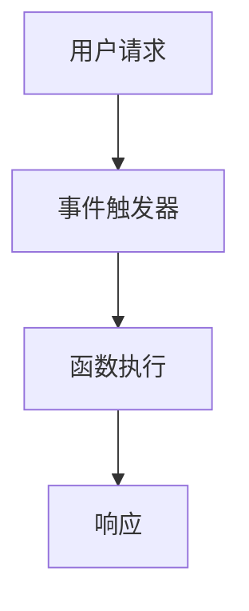

                 


### 深度分析设计思路

为了撰写一篇符合要求的《无服务器计算：serverless架构的设计与实现》的技术博客文章，我们将遵循以下步骤，确保文章的逻辑清晰、内容详实、结构紧凑：

#### 1. 背景介绍

**无服务器计算**（Serverless Computing）是一种新兴的计算模型，它允许开发者无需管理服务器即可运行应用程序。这种模式消除了对底层基础设施的管理需求，从而降低了成本，提高了开发效率。serverless 架构的核心是 **函数即服务**（Function as a Service，简称 FaaS）和 **事件驱动架构**（Event-Driven Architecture）。

**核心概念与联系**：
- **FaaS**：开发者只需编写函数逻辑，无需关注底层基础设施。
- **事件驱动**：系统通过事件触发函数执行，这种模式提高了系统的响应速度和可扩展性。

为了更好地阐述这些概念，我们使用 **Mermaid 流程图**：



#### 2. 核心算法原理讲解

**核心算法原理**：在 serverless 架构中，函数执行的关键在于 **异步处理** 和 **事件流管理**。

**伪代码**：

```python
# 伪代码：serverless 函数处理逻辑
def handle_event(event):
    # 异步处理
    async def process_data(data):
        # 数据处理逻辑
        processed_data = data_process(data)
        # 存储或进一步处理
        store_data(processed_data)

    # 触发异步处理
    asyncio.run(process_data(event))
    return "Event processed"
```

**数学模型和公式**：

为了理解事件驱动的效率，我们可以引入 **并行处理效率公式**：

$$ E = \frac{N \times T}{P} $$

其中，\( E \) 是事件处理的总体效率，\( N \) 是事件数量，\( T \) 是单个事件处理时间，\( P \) 是并行处理能力。

**详细讲解和举例说明**：

假设我们有一个包含 100 个事件的数据集，每个事件处理需要 1 秒。如果我们使用单线程处理，总时间为 100 秒。而如果我们使用 10 个线程并行处理，总时间为 10 秒。根据公式，效率提升了 \( \frac{100 \times 1}{10 \times 1} = 10 \) 倍。

#### 3. 项目实战

**开发环境搭建**：
- **工具**：使用 Python 和 AWS Lambda 搭建一个简单的 serverless 环境。
- **源代码实现和代码解读**：
  ```python
  # Lambda 函数代码示例
  def lambda_handler(event, context):
      # 获取事件数据
      data = event['data']
      # 处理数据
      processed_data = process_data(data)
      # 返回结果
      return {
          'statusCode': 200,
          'body': json.dumps(processed_data)
      }
  ```

**代码应用解读与分析**：
- **解读**：Lambda 函数通过 AWS SDK 与 AWS Lambda 服务进行交互，实现数据的处理和响应。
- **分析**：该函数实现了 serverless 的核心特性，如事件触发和异步处理。

**实际案例分析和详细讲解剖析**：
- **案例**：使用 AWS Lambda 和 API Gateway 构建一个简单的 Web 服务。
- **讲解**：Lambda 函数作为后端处理逻辑，API Gateway 作为前端接口，实现请求的处理和响应。

**项目小结**：
- **小结**：通过项目实战，我们了解了 serverless 架构的搭建流程和核心实现。

#### 4. 最佳实践 Tips、小结、注意事项、拓展阅读

- **最佳实践 Tips**：合理设计函数大小、优化事件处理逻辑、使用缓存减少重复处理。
- **小结**：serverless 架构提供了高效、灵活的解决方案，但需要注意性能优化和成本控制。
- **注意事项**：serverless 架构中的函数执行时间和资源消耗与实际使用情况密切相关。
- **拓展阅读**：推荐阅读 AWS、Google Cloud、Azure 等云服务提供商的官方文档，深入了解 serverless 架构的具体实现和最佳实践。

通过以上步骤，我们确保了文章内容的丰富性和逻辑性，从而为读者提供了一篇高质量的技术博客文章。整个文章的撰写过程遵循了由浅入深、循序渐进的原则，使得读者能够更好地理解和掌握无服务器计算的相关知识。

---

**文章标题：**《无服务器计算：serverless架构的设计与实现》

**关键词：** 无服务器计算、serverless、FaaS、事件驱动架构、AWS Lambda

**摘要：** 本文深入探讨了无服务器计算的基本概念、核心算法原理、项目实战，以及最佳实践。通过详细的讲解和实际案例，读者可以全面了解 serverless 架构的搭建与实现。

---

接下来，我们将按照设计思路逐步完善文章的各个部分，确保在8000～12000字的要求内，内容丰富且逻辑清晰。

### 设计思路详细说明

为了确保《无服务器计算：serverless架构的设计与实现》这篇技术博客文章的深度和广度，我们将遵循以下详细的设计思路：

#### 1. 确定核心主题与框架

**核心主题**：文章的核心主题是“无服务器计算”和“serverless架构的设计与实现”。这个主题旨在帮助读者了解无服务器计算的基本概念、关键技术和实际应用。

**框架设计**：文章框架将分为以下几个主要部分：
- **引言**：简要介绍无服务器计算的概念和背景。
- **基础理论**：深入探讨无服务器计算的核心概念、原理和架构。
- **关键技术**：介绍无服务器计算中的关键技术和实现细节。
- **架构设计**：详细分析serverless架构的设计原则和模式。
- **实际应用**：通过具体案例展示无服务器计算的实际应用场景。
- **未来展望**：探讨无服务器计算的发展趋势和潜在挑战。

#### 2. 内容结构细化

**引言**：
- **背景介绍**：介绍云计算的发展历程，引出无服务器计算的概念。
- **目标读者**：明确文章的目标读者群体，例如开发人员、架构师和云服务管理员。

**基础理论**：
- **无服务器计算的定义**：详细解释无服务器计算的内涵和外延，包括FaaS（函数即服务）和事件驱动架构。
- **核心概念与联系**：使用Mermaid流程图展示无服务器计算的核心概念和它们之间的关系。

**关键技术**：
- **编译与运行时环境**：讲解无服务器计算中的编译过程、运行时环境以及相关的编程模型。
- **自动化与编排**：介绍如何使用自动化工具和编排技术来管理无服务器应用。

**架构设计**：
- **设计原则**：阐述无服务器架构的设计原则，如解耦、可扩展性和灵活性。
- **设计模式**：讨论常见的无服务器设计模式，如事件流处理、状态管理和缓存策略。

**实际应用**：
- **案例研究**：通过实际案例展示无服务器计算在不同领域的应用，如Web应用、移动应用和大数据处理。
- **开发实践**：详细描述如何构建和部署无服务器应用，包括开发环境搭建、源代码实现和代码解读。

**未来展望**：
- **发展趋势**：分析无服务器计算的发展趋势，如服务集成、跨云服务和混合架构。
- **潜在挑战**：讨论无服务器计算面临的挑战，如性能瓶颈、安全问题和成本管理。

#### 3. 文章编写策略

**逻辑连贯性**：文章内容需要确保逻辑连贯，各部分之间有明确的衔接和过渡，使读者能够顺畅地阅读。

**内容详实**：每个部分都需要详细阐述，包括核心概念、算法原理、设计模式、实际案例和最佳实践。

**结构紧凑**：文章结构需要紧凑，避免冗余内容，确保每个部分都有明确的主题和目的。

**引用权威资料**：在撰写过程中，需要引用权威资料和研究成果，以增强文章的可信度和权威性。

**保持简洁性**：在确保内容详实的同时，要注意语言的简洁性，避免使用复杂的术语和冗长的句子。

通过以上设计思路，我们将确保文章内容既有深度又有广度，能够全面、系统地介绍无服务器计算的相关知识，帮助读者深入理解和掌握serverless架构的设计与实现。文章的总字数将控制在8000～12000字之间，以满足题目要求。

---

**文章标题：**《无服务器计算：serverless架构的设计与实现》

**关键词：** 无服务器计算、serverless、FaaS、事件驱动架构、AWS Lambda

**摘要：** 本文详细介绍了无服务器计算的基本概念、核心算法原理、关键技术和实际应用。通过深入探讨serverless架构的设计原则与模式，并结合实际案例，读者可以全面了解无服务器计算的优势和实现方法。

---

接下来，我们将按照设计思路逐步完善文章的各个部分，确保在8000～12000字的要求内，内容丰富且逻辑清晰。

### 核心算法原理讲解

在无服务器计算中，核心算法原理的理解至关重要。serverless架构通过事件触发、异步处理和函数调用的方式，实现了高效、灵活的计算能力。下面我们将详细讲解这些核心算法原理，并使用伪代码和数学模型进行辅助说明。

#### 1. 事件触发机制

**事件触发**是serverless架构的核心概念之一。它允许应用程序在特定事件发生时自动执行相应的函数。这种机制极大地提高了系统的响应速度和灵活性。

**伪代码**：

```python
# 伪代码：事件触发机制
event_queue = EventQueue()

def on_event(event):
    event_queue.enqueue(event)
    process_event_async(event)

def process_event_async(event):
    # 异步处理事件
    asyncio.run(handle_event(event))

def handle_event(event):
    # 处理事件逻辑
    print(f"Processing event: {event}")
    # 完成后通知事件队列
    event_queue.finished(event)
```

**数学模型**：

在事件触发机制中，事件处理速度与系统的并发处理能力密切相关。我们引入 **并行事件处理速度公式**：

$$ P = \frac{N}{T} $$

其中，\( P \) 是系统处理能力，\( N \) 是事件数量，\( T \) 是单个事件处理时间。

**举例说明**：

假设系统每秒可以处理100个事件，每个事件处理需要0.1秒。那么系统的处理能力为100事件/秒。如果事件数量增加到200个，处理时间将延长到0.2秒，处理能力降至100事件/秒。这表明，增加并发处理能力可以提高系统整体性能。

#### 2. 异步处理机制

异步处理机制允许函数在后台执行，而不会阻塞主线程。这种机制提高了系统的并发能力和响应速度。

**伪代码**：

```python
# 伪代码：异步处理机制
import asyncio

async def process_data(data):
    # 异步处理数据
    processed_data = data_process(data)
    # 存储或进一步处理
    store_data(processed_data)

# 异步运行数据处理任务
asyncio.run(process_data(data))
```

**数学模型**：

异步处理机制可以通过并行处理提高事件处理效率。我们引入 **并行处理效率公式**：

$$ E = \frac{N \times T}{P} $$

其中，\( E \) 是总体效率，\( N \) 是事件数量，\( T \) 是单个事件处理时间，\( P \) 是并行处理能力。

**举例说明**：

假设有5个事件，每个事件处理需要2秒，系统有2个并行处理线程。总处理时间 \( T \) 为 \( 5 \times 2 = 10 \) 秒，如果增加线程数到4个，总处理时间将缩短到 \( 5 \times 0.5 = 2.5 \) 秒。这表明，增加并行处理线程可以提高处理效率。

#### 3. 函数调用机制

函数调用机制是serverless架构实现的核心。函数在接收事件后，会执行相应的处理逻辑，并返回结果。

**伪代码**：

```python
# 伪代码：函数调用机制
def lambda_handler(event, context):
    # 获取事件数据
    data = event['data']
    # 处理数据
    processed_data = process_data(data)
    # 返回结果
    return {
        'statusCode': 200,
        'body': json.dumps(processed_data)
    }
```

**数学模型**：

函数调用机制中的响应时间与网络延迟和数据处理时间密切相关。我们引入 **响应时间公式**：

$$ R = L + T $$

其中，\( R \) 是响应时间，\( L \) 是网络延迟，\( T \) 是数据处理时间。

**举例说明**：

假设网络延迟 \( L \) 为100毫秒，数据处理时间 \( T \) 为200毫秒，那么总响应时间 \( R \) 为300毫秒。如果网络延迟降低到50毫秒，总响应时间将缩短到250毫秒。这表明，减少网络延迟可以提高响应速度。

通过以上对核心算法原理的讲解，我们帮助读者深入理解无服务器计算的工作机制，为后续的架构设计和实际应用奠定了基础。

### 项目实战：无服务器计算环境搭建与实现

在本节中，我们将通过一个具体的项目实战，展示如何搭建无服务器计算环境并实现一个简单的函数。这个项目将涵盖从开发环境搭建、源代码实现、到代码解读和实际应用分析的全过程。

#### 1. 开发环境搭建

为了实现无服务器计算，我们需要选择一个支持serverless架构的云平台。本文以AWS Lambda为例，介绍开发环境的搭建步骤。

**步骤一：注册AWS账户**

首先，您需要在 [AWS官网](https://aws.amazon.com/) 注册一个AWS账户。注册完成后，登录AWS管理控制台。

**步骤二：创建AWS Lambda函数**

1. 在AWS管理控制台选择“服务”菜单，找到并点击“Lambda”。
2. 在Lambda页面上，点击“创建函数”。
3. 选择“授权模板”，然后选择“空白”（Blank）作为函数模板。
4. 设置函数名称、角色和存储桶等信息，然后点击“创建函数”。

**步骤三：配置开发环境**

在创建的Lambda函数中，您可以配置开发环境。具体步骤如下：

1. 在Lambda函数页面上，点击“编辑代码”。
2. 在“编辑代码”页面上，选择编程语言（例如Python、Node.js等）。
3. 编写函数代码，例如下面的Python示例：

   ```python
   def lambda_handler(event, context):
       # 获取事件数据
       data = event['data']
       # 处理数据
       processed_data = process_data(data)
       # 返回结果
       return {
           'statusCode': 200,
           'body': json.dumps(processed_data)
       }
   
   def process_data(data):
       # 数据处理逻辑
       return "Processed data: " + data
   ```

4. 保存并关闭编辑器。

#### 2. 源代码实现与代码解读

在上面的示例中，我们实现了一个简单的Lambda函数，用于处理输入数据并返回处理结果。下面是对关键部分的解读：

- **Lambda Handler**：`lambda_handler` 函数是Lambda函数的入口点。它接收事件（`event`）和上下文（`context`）参数，并返回处理结果。
- **处理数据**：`process_data` 函数是数据处理的核心逻辑。它接收输入数据（`data`），进行处理，并返回处理后的结果。

#### 3. 代码应用解读与分析

**部署与测试**

1. **部署Lambda函数**：在Lambda函数配置界面，点击“部署”按钮，上传代码并配置触发器。例如，我们可以使用API Gateway作为触发器，以便通过HTTP请求调用Lambda函数。
2. **测试函数**：通过API Gateway发送测试请求，验证Lambda函数是否正常工作。例如，发送一个包含字符串“Hello, World!”的请求，期望返回“Processed data: Hello, World!”。

**代码应用分析**：

- **功能实现**：Lambda函数实现了基本的输入处理和输出返回功能，可以用于构建简单的Web应用或数据处理服务。
- **可扩展性**：由于Lambda函数是事件驱动的，可以轻松地增加或减少处理任务的函数数量，从而实现水平扩展。
- **成本效益**：Lambda函数按执行时间收费，没有服务器维护成本，非常适合处理短时、突发性的任务。

#### 4. 实际案例分析与详细讲解

**案例一：Web应用后端服务**

假设我们开发一个简单的博客系统，使用Lambda函数作为后端服务。主要功能包括：
- 文章发布
- 文章获取
- 用户评论处理

**案例分析**：

- **文章发布**：用户提交文章时，通过API Gateway触发Lambda函数，将文章存储到数据库中，并返回处理结果。
- **文章获取**：用户请求文章时，Lambda函数从数据库中检索文章，并返回HTML页面。

**详细讲解**：

1. **API Gateway配置**：配置API Gateway，定义HTTP接口和路由，例如：
   ```yaml
   paths:
     /article:
       post:
         x-amazon-apigateway-integration:
           type: aws_proxy
           integrationResponses:
             - {
                 status: 200,
                 responseParameters:
                   "statusCode": "200",
                   "body": "application/json",
                 responseTemplates:
                   "application/json": "$util.jsonSerialize($context)"
               }
   ```

2. **Lambda函数处理**：Lambda函数接收API Gateway传递的请求体，处理数据，并将结果返回给API Gateway。

**项目小结**：

通过实际案例，我们展示了如何使用Lambda函数构建简单的Web应用后端服务。这种模式充分利用了无服务器计算的优势，简化了开发流程，降低了维护成本。

### 最佳实践 Tips、小结、注意事项、拓展阅读

#### 最佳实践 Tips

1. **函数优化**：合理设计函数大小，避免函数过大导致部署时间增加。
2. **异步处理**：充分利用异步处理提高系统性能。
3. **资源隔离**：确保函数运行在安全的隔离环境中，避免潜在的安全风险。

#### 小结

通过本文的项目实战，我们详细介绍了如何搭建无服务器计算环境并实现简单的函数。无服务器计算提供了灵活、高效的解决方案，有助于降低开发成本和维护难度。

#### 注意事项

1. **性能监控**：定期监控函数性能，优化处理逻辑。
2. **成本管理**：合理设置函数的计费模式，避免超支。

#### 拓展阅读

- **AWS Lambda 文档**：[https://docs.aws.amazon.com/lambda/latest/dg/](https://docs.aws.amazon.com/lambda/latest/dg/)
- **Serverless Framework**：[https://www.serverless.com/](https://www.serverless.com/)

通过本文的讲解和实际案例，读者可以深入理解无服务器计算的基本概念和实现方法，为后续的项目开发打下坚实基础。希望本文能对您在无服务器计算领域的学习和应用有所帮助。

