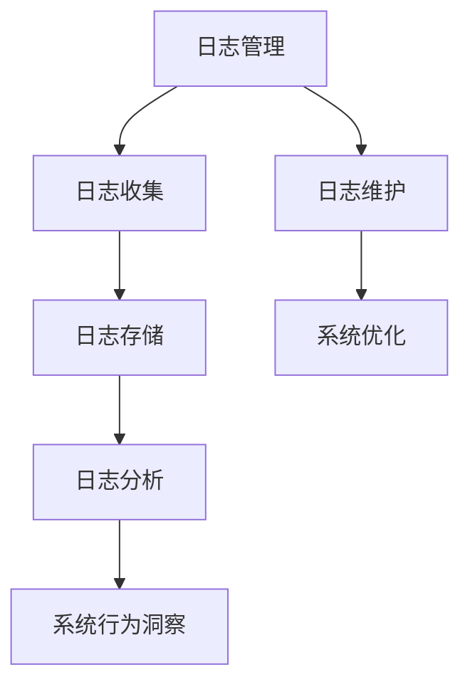

                 

### 文章标题 <此处是文章标题>

## 关键词 <此处列出文章的5-7个核心关键词>

### 摘要 <此处给出文章的核心内容和主题思想>

### 核心概念与联系

日志管理是现代IT运营中不可或缺的一部分，通过记录和存储系统事件、错误和性能数据，日志管理帮助维护人员、开发人员和系统管理员更好地理解系统的行为，从而实现高效的故障排查、性能优化和业务分析。本文将深入探讨日志管理与分析的过程，解析其核心概念与联系，包括日志管理的基本任务、日志分析的重要性以及如何从日志中洞察系统行为。

### 核心概念与联系

- **日志管理**：日志管理是指跟踪和记录系统事件、错误和性能数据的过程。其核心目的是为了确保系统运行的可监控性、可靠性和可维护性。日志管理的主要任务包括日志的收集、存储、归档和维护。
  
- **日志分析**：日志分析是指从日志数据中提取有意义的信息，以便识别趋势、模式和异常情况。通过日志分析，可以更深入地了解系统行为，支持决策制定和系统改进。日志分析的关键步骤包括模式识别、机器学习分类和关联规则挖掘。

- **系统行为**：系统行为指的是计算机系统在各种条件和输入下的响应和行为模式。通过日志分析，可以洞察系统的运行状况，预测潜在问题，并采取预防措施。

### 核心概念之间的联系

- **日志管理**与**日志分析**：日志管理为日志分析提供了基础数据，没有良好的日志管理，日志分析将无从谈起。而日志分析的结果又反馈给日志管理，指导如何改进日志收集和存储策略。

- **日志分析**与**系统行为**：日志分析的结果揭示了系统行为中的异常和趋势，为理解系统行为提供了重要依据。通过对日志分析结果的持续监控，可以更准确地预测系统行为，实现系统优化。

### Mermaid 流程图



这个流程图展示了日志管理与分析的过程，从日志收集、存储到分析，最终实现系统行为的洞察和优化。

### 总结

本文介绍了日志管理与分析的核心概念及其联系，为后续内容的深入探讨奠定了基础。在接下来的章节中，我们将详细解析日志管理的过程，探讨日志分析的技术和方法，并通过实际项目实战展示如何从日志中洞察系统行为。

### 核心概念与联系

**日志管理**：日志管理是跟踪和记录系统事件、错误和性能数据的过程，其核心目的是为了确保系统运行的可监控性、可靠性和可维护性。日志管理的主要任务包括日志的收集、存储、归档和维护。

**日志分析**：日志分析是指从日志数据中提取有意义的信息，以便识别趋势、模式和异常情况。通过日志分析，可以更深入地了解系统行为，支持决策制定和系统改进。日志分析的关键步骤包括模式识别、机器学习分类和关联规则挖掘。

**系统行为**：系统行为指的是计算机系统在各种条件和输入下的响应和行为模式。通过日志分析，可以洞察系统的运行状况，预测潜在问题，并采取预防措施。

### Mermaid 流程图


这个流程图展示了日志管理与分析的过程，从日志收集、存储到分析，最终实现系统行为的洞察和优化。

### 核心概念之间的联系

**日志管理**与**日志分析**：日志管理为日志分析提供了基础数据，没有良好的日志管理，日志分析将无从谈起。而日志分析的结果又反馈给日志管理，指导如何改进日志收集和存储策略。

**日志分析**与**系统行为**：日志分析的结果揭示了系统行为中的异常和趋势，为理解系统行为提供了重要依据。通过对日志分析结果的持续监控，可以更准确地预测系统行为，实现系统优化。

### Mermaid 流程图


这个流程图展示了日志管理与分析的过程，从日志收集、存储到分析，最终实现系统行为的洞察和优化。

### 总结

本文介绍了日志管理与分析的核心概念及其联系，为后续内容的深入探讨奠定了基础。在接下来的章节中，我们将详细解析日志管理的过程，探讨日志分析的技术和方法，并通过实际项目实战展示如何从日志中洞察系统行为。

### 核心概念与联系

**日志管理**：日志管理是跟踪和记录系统事件、错误和性能数据的过程，其核心目的是为了确保系统运行的可监控性、可靠性和可维护性。日志管理的主要任务包括日志的收集、存储、归档和维护。

**日志分析**：日志分析是指从日志数据中提取有意义的信息，以便识别趋势、模式和异常情况。通过日志分析，可以更深入地了解系统行为，支持决策制定和系统改进。日志分析的关键步骤包括模式识别、机器学习分类和关联规则挖掘。

**系统行为**：系统行为指的是计算机系统在各种条件和输入下的响应和行为模式。通过日志分析，可以洞察系统的运行状况，预测潜在问题，并采取预防措施。

### Mermaid 流程图


这个流程图展示了日志管理与分析的过程，从日志收集、存储到分析，最终实现系统行为的洞察和优化。

### 核心概念之间的联系

**日志管理**与**日志分析**：日志管理为日志分析提供了基础数据，没有良好的日志管理，日志分析将无从谈起。而日志分析的结果又反馈给日志管理，指导如何改进日志收集和存储策略。

**日志分析**与**系统行为**：日志分析的结果揭示了系统行为中的异常和趋势，为理解系统行为提供了重要依据。通过对日志分析结果的持续监控，可以更准确地预测系统行为，实现系统优化。

### Mermaid 流程图


这个流程图展示了日志管理与分析的过程，从日志收集、存储到分析，最终实现系统行为的洞察和优化。

### 总结

本文介绍了日志管理与分析的核心概念及其联系，为后续内容的深入探讨奠定了基础。在接下来的章节中，我们将详细解析日志管理的过程，探讨日志分析的技术和方法，并通过实际项目实战展示如何从日志中洞察系统行为。

## 1.1 日志管理概述

### 1.1.1 日志管理的重要性

日志管理在IT运营中扮演着至关重要的角色。它不仅是系统维护的基石，也是性能优化和故障排查的有力工具。以下是日志管理的重要性：

1. **监控系统运行状况**：日志记录了系统的各种事件，包括启动、关闭、错误和警告等。通过对日志的监控，可以实时了解系统的运行状态，及时发现潜在问题。
   
2. **故障排查**：当系统出现故障时，日志记录的内容可以帮助技术人员快速定位问题的根源，从而迅速解决问题。
   
3. **性能优化**：通过分析日志，可以识别系统性能瓶颈，为性能优化提供数据支持。

4. **合规性和审计**：许多行业和组织都有日志记录和存储的合规性要求。日志管理有助于满足这些要求，并为审计提供必要的数据。

5. **安全监控**：日志分析可以识别异常行为和潜在的安全威胁，从而加强系统安全。

### 1.1.2 日志管理的主要任务

日志管理的主要任务包括以下几个方面：

1. **日志收集**：从不同的系统组件和应用程序中收集日志数据。日志收集可以通过程序日志、系统日志和第三方日志收集工具（如Fluentd、Logstash）来实现。

2. **日志存储**：将收集到的日志数据存储在适当的存储介质中。常见的日志存储解决方案包括文件系统、数据库和分布式日志存储系统（如Elasticsearch）。

3. **日志归档**：定期将旧日志归档，以节省存储空间，并确保重要的日志数据长期保存。

4. **日志维护**：包括日志的备份、恢复和清理等操作，确保日志系统的稳定运行。

### 1.1.3 日志管理的挑战

尽管日志管理的重要性显而易见，但在实际操作中仍面临诸多挑战：

1. **日志数量庞大**：现代系统产生的日志数量庞大，如何有效地收集、存储和分析这些日志是一个巨大的挑战。

2. **日志格式多样**：不同系统和应用程序可能使用不同的日志格式，这增加了日志处理的复杂性。

3. **日志分析复杂性**：日志分析需要处理大量数据，并从中提取有价值的信息。这通常需要复杂的算法和工具支持。

4. **存储和性能问题**：大量日志数据的存储和查询可能会对系统性能造成影响，如何优化日志存储和查询策略是一个关键问题。

### 总结

日志管理是IT运营中不可或缺的一部分。通过有效的日志管理，可以确保系统的可监控性、可靠性和可维护性。然而，日志管理也面临诸多挑战，需要采用适当的策略和工具来解决。

## 1.2 日志分类

日志分类是日志管理的一个重要环节，不同的日志类型反映了系统运行的不同方面，因此了解和掌握日志分类对于有效地进行日志管理至关重要。以下是几种常见的日志类型：

### 1.2.1 系统日志

系统日志记录了操作系统和其相关服务的运行情况，包括启动、关闭、错误、警告和其他重要事件。系统日志通常由操作系统内核和系统服务生成，常见的系统日志文件包括`/var/log/syslog`（UNIX和Linux系统）和`%SystemRoot%\system32\winevt\Logs\eventlog.txt`（Windows系统）。系统日志对于监控系统运行状态、追踪故障和进行安全审计至关重要。

### 1.2.2 应用程序日志

应用程序日志是由运行在操作系统上的应用程序生成的日志。这些日志记录了应用程序的运行情况，包括启动、运行、关闭以及可能发生的错误和异常。应用程序日志对于开发人员和运维人员理解应用程序的行为、排查问题和优化性能具有重要意义。常见的应用程序日志文件格式包括文本文件（如`.log`文件）和结构化格式（如JSON、XML）。

### 1.2.3 诊断日志

诊断日志是专门为故障排查和问题解决而设计的日志。这些日志通常包含详细的诊断信息和错误代码，有助于技术人员快速定位和解决问题。诊断日志可以是系统级别的，也可以是特定应用程序级别的。例如，Web服务器生成的诊断日志可以包含访问日志、错误日志和性能日志等。

### 1.2.4 日志文件格式

日志文件格式是日志数据存储和展示的方式，常见的日志文件格式包括以下几种：

1. **文本日志格式**：这是最简单的日志格式，通常以纯文本形式记录日志条目。文本日志格式便于阅读和存储，但也缺乏结构化，难以进行复杂分析。

2. **JSON日志格式**：JSON（JavaScript Object Notation）是一种流行的结构化日志格式，可以方便地将日志数据转换为JSON对象。JSON日志格式支持嵌套和数组，便于存储复杂的数据结构。

3. **XML日志格式**：XML（eXtensible Markup Language）是一种用于存储和传输数据的标记语言。XML日志格式具有良好的结构化和可扩展性，便于与其他系统和工具进行集成。

4. **自定义日志格式**：一些应用程序可能使用自定义的日志格式，以满足特定的需求和场景。

### 1.2.5 日志管理工具

为了有效地管理不同类型的日志，使用日志管理工具是非常必要的。以下是一些常用的日志管理工具：

1. **Logstash**：Logstash是一个开源的数据收集和处理工具，可以将来自不同来源的数据转换为结构化数据，并输出到指定的存储系统。

2. **Fluentd**：Fluentd是一个轻量级的日志处理工具，类似于Logstash，但更专注于性能和简单性。

3. **Elasticsearch**：Elasticsearch是一个高性能、可扩展的分布式搜索引擎，常用于存储和搜索大量日志数据。

4. **Kibana**：Kibana是一个基于Web的日志分析平台，可以与Elasticsearch结合使用，提供直观的日志分析和可视化功能。

### 总结

日志分类是日志管理的重要组成部分，了解不同类型的日志以及它们的格式有助于更有效地进行日志收集、存储和分析。通过使用合适的日志管理工具，可以提升日志管理的效率和效果，为系统维护、性能优化和故障排查提供有力支持。

## 1.3 日志文件格式

日志文件格式是日志数据记录和存储的关键组成部分，不同的格式对日志的处理和分析方式有着重要影响。下面我们将探讨几种常见的日志文件格式：文本日志格式、JSON日志格式和XML日志格式。

### 1.3.1 文本日志格式

文本日志格式是最传统的日志记录方式，其特点是以纯文本形式记录每个日志条目。文本日志通常包含时间戳、事件类型、事件描述等信息，格式简单，易于阅读和存储。然而，文本日志格式的缺点在于其缺乏结构化，使得日志数据难以进行复杂的分析和查询。

- **优点**：
  - **简单易读**：文本日志格式直观，容易理解和解析。
  - **兼容性好**：文本日志可以轻松地在不同的操作系统和应用程序之间传输。

- **缺点**：
  - **缺乏结构化**：文本日志难以进行高级的数据处理和分析。
  - **查询复杂**：由于日志条目之间缺乏固定的分隔符和关键字，查询和过滤操作复杂。

### 1.3.2 JSON日志格式

JSON（JavaScript Object Notation）是一种轻量级的数据交换格式，因其简洁和易读性而被广泛使用。JSON日志格式将日志条目以JSON对象的形式存储，每个字段都有明确的键值对，使得日志数据结构化和可扩展。

- **优点**：
  - **结构化**：JSON日志格式提供了丰富的数据结构，便于进行数据分析和查询。
  - **可扩展**：JSON对象可以轻松地添加和删除字段，适应不同的日志记录需求。
  - **易处理**：JSON格式支持各种编程语言和工具的解析和操作，便于集成和自动化处理。

- **缺点**：
  - **存储空间**：相比于文本日志格式，JSON日志格式通常占用更多的存储空间。
  - **解析复杂**：虽然JSON格式易于处理，但解析和解析错误可能需要额外的错误处理逻辑。

### 1.3.3 XML日志格式

XML（eXtensible Markup Language）是一种用于存储和传输数据的标记语言，因其良好的结构化和可扩展性而被广泛应用。XML日志格式将日志条目以XML标签的形式存储，每个字段都通过标签进行定义。

- **优点**：
  - **结构化**：XML日志格式具有明确的标签和属性，便于数据解析和查询。
  - **可扩展**：XML支持自定义标签和属性，使得日志格式可以适应不同的需求。
  - **平台兼容性**：XML格式在多种操作系统和编程语言中广泛支持。

- **缺点**：
  - **存储空间**：XML日志格式通常比JSON日志格式占用更多的存储空间。
  - **解析复杂**：XML格式的解析通常比JSON复杂，需要更多的处理时间和资源。

### 选择日志文件格式

选择合适的日志文件格式取决于具体的应用场景和需求。以下是一些选择日志文件格式的考虑因素：

1. **数据结构化需求**：如果需要结构化数据以便进行高级分析和查询，JSON和XML是较好的选择。

2. **存储空间**：文本日志格式占用较少的存储空间，适合存储大量日志数据。

3. **处理复杂度**：JSON格式相对容易处理，而XML格式由于标签的复杂性可能需要更多的解析时间和资源。

4. **兼容性和集成**：文本日志格式兼容性好，易于在不同系统和应用程序之间传输，而JSON和XML格式则更适合与数据处理工具和平台集成。

### 总结

日志文件格式在日志管理中扮演着重要角色，不同的格式适用于不同的应用场景。文本日志格式简单易用，但缺乏结构化；JSON日志格式提供了良好的结构化和可扩展性，易于处理；XML日志格式具有良好的结构化和可扩展性，但解析复杂。根据具体需求和场景选择合适的日志文件格式，可以提升日志管理的效率和效果。

### 1.4 日志管理工具

在现代IT环境中，日志管理工具的重要性不言而喻。这些工具帮助收集、存储、分析和处理大量日志数据，使得日志管理更加高效和自动化。以下是一些常见的日志管理工具，包括常见日志、日志存储解决方案和日志分析工具。

#### 1.4.1 常见日志

1. **系统日志**：系统日志记录了操作系统和其服务的运行情况，包括启动、关闭、错误和警告等。常见的系统日志文件包括`/var/log/syslog`（UNIX和Linux系统）和`%SystemRoot%\system32\winevt\Logs\eventlog.txt`（Windows系统）。

2. **应用程序日志**：应用程序日志记录了应用程序的运行情况，包括启动、运行、关闭以及可能发生的错误和异常。常见的应用程序日志文件包括`/var/log/nginx/access.log`和`/var/log/nginx/error.log`（Nginx服务器）。

3. **访问日志**：Web服务器生成的访问日志记录了用户访问网站的所有请求，包括请求时间、请求URL、响应状态码等。常见的访问日志文件格式包括Common Log Format（CLF）和Combined Log Format（CLF+）。

4. **错误日志**：错误日志记录了应用程序和系统的错误信息，对于故障排查和问题解决至关重要。

5. **诊断日志**：诊断日志用于记录系统的诊断信息，通常包含详细的错误代码、事件描述和操作步骤。

#### 1.4.2 日志存储解决方案

1. **文件系统**：文件系统是一种简单且常见的日志存储方式，适用于小规模日志数据的存储。日志文件可以直接存储在文件系统中，便于访问和备份。

2. **数据库**：使用数据库存储日志数据，可以提供高效的数据查询和管理功能。常见的数据库解决方案包括MySQL、PostgreSQL和MongoDB。

3. **分布式日志存储系统**：分布式日志存储系统适用于大规模日志数据的存储和管理。常见的分布式日志存储系统包括Elasticsearch、Logstash和Kibana（ELK Stack）和Apache Kafka。

- **Elasticsearch**：Elasticsearch是一个高性能、可扩展的分布式搜索引擎，常用于存储和搜索大量日志数据。

- **Logstash**：Logstash是一个开源的数据收集和处理工具，可以将来自不同来源的数据转换为结构化数据，并输出到Elasticsearch等存储系统。

- **Kibana**：Kibana是一个基于Web的日志分析平台，可以与Elasticsearch结合使用，提供直观的日志分析和可视化功能。

#### 1.4.3 日志分析工具

1. **Grok**：Grok是一个正则表达式解析器，用于从文本日志中提取字段。Grok常与Filebeat或Logstash结合使用，帮助日志数据结构化。

2. **Logstash**：Logstash是一个开源的数据处理工具，可以处理和转换来自不同源的数据，并将其输出到Elasticsearch或其他存储系统。

3. **Grok**：Grok是一个开源的日志解析工具，基于正则表达式，用于从文本日志中提取字段。Grok通常与Filebeat等工具结合使用，帮助将日志数据结构化。

4. **Kibana**：Kibana是一个基于Web的日志分析平台，可以与Elasticsearch结合使用，提供日志数据的可视化分析和监控功能。

5. **Splunk**：Splunk是一个强大的日志分析和监控平台，可以处理和搜索大量日志数据，并提供丰富的可视化功能。

#### 总结

日志管理工具在日志数据的收集、存储和分析中发挥着重要作用。通过使用合适的日志管理工具，可以简化日志管理的复杂性，提高日志处理的效率，为系统维护、性能优化和故障排查提供有力支持。

### 1.5 日志管理策略

日志管理策略是确保日志系统能够有效支持业务需求和IT运营的关键。一个良好的日志管理策略应涵盖日志收集、存储、分析和维护的各个方面，并考虑以下几个方面：

#### 1.5.1 数据收集

1. **全面性**：确保所有关键系统和服务都生成并记录日志，包括应用程序日志、系统日志、错误日志和诊断日志。

2. **自动化**：使用自动化工具（如Logstash、Fluentd）从不同源（如文件系统、数据库、网络设备）收集日志。

3. **格式标准化**：制定统一的日志格式标准，以便于日志数据的统一处理和分析。

4. **多源聚合**：整合来自不同系统和应用程序的日志数据，集中管理和分析。

#### 1.5.2 数据存储

1. **容量规划**：根据业务需求预测和日志数据增长趋势，合理规划存储容量。

2. **存储类型**：根据日志数据的访问模式（如读密集型或写密集型），选择合适的存储类型（如文件系统、数据库、分布式日志存储系统）。

3. **备份与冗余**：定期备份数据，并确保存储系统的冗余，以防止数据丢失。

4. **存储生命周期管理**：制定数据保留策略，包括归档、清理和备份，以优化存储资源。

#### 1.5.3 数据分析

1. **实时监控**：使用监控工具（如Kibana、Grafana）实时监控日志数据，及时发现异常。

2. **自动化分析**：使用自动化分析工具（如Grok、Logstash管道）提取和解析日志数据，自动识别异常模式。

3. **可视化分析**：提供直观的日志数据分析仪表板，帮助用户快速了解系统状态。

4. **告警与通知**：设置告警机制，当日志数据中出现特定模式或异常时，及时通知相关人员。

#### 1.5.4 数据维护

1. **日志格式更新**：定期审查日志格式标准，确保与业务需求和技术发展保持一致。

2. **日志数据处理**：定期清理和处理无效或重复的日志数据，提高日志系统的效率。

3. **日志系统优化**：根据日志系统性能评估结果，优化日志收集、存储和分析流程。

4. **人员培训**：定期培训日志管理团队，提高其日志分析和处理能力。

#### 总结

一个良好的日志管理策略应涵盖日志收集、存储、分析和维护的各个方面，确保日志系统能够持续支持业务需求和IT运营。通过全面性、自动化、标准化和多源聚合的日志收集策略，合理容量规划和备份与冗余的存储策略，以及实时监控、自动化分析和可视化分析的日志分析策略，以及定期维护和人员培训的日志维护策略，可以构建一个高效、可靠的日志管理系统。

## 2. 日志分析的核心算法原理讲解

### 2.1 日志收集

日志收集是日志分析的第一步，其核心任务是获取系统生成的日志数据。日志收集可以通过多种方式进行：

1. **程序日志**：程序日志通常由应用程序在运行过程中自动生成，记录了程序的执行细节、错误和异常信息。

2. **系统日志**：系统日志由操作系统和其服务生成，记录了操作系统的运行情况，包括启动、关闭、错误和警告等信息。

3. **第三方日志收集工具**：例如Fluentd和Logstash，这些工具可以从不同来源（如文件系统、网络设备、数据库等）收集日志数据，并将其转换成统一的格式。

伪代码：

```python
def collect_logs(source, format):
    if source == "program":
        logs = get_program_logs()
    elif source == "system":
        logs = get_system_logs()
    elif source == "third_party":
        logs = third_party_log_collector(format)
    return logs
```

### 2.2 日志存储

日志存储是将收集到的日志数据存储到持久存储介质中的过程。常见的日志存储解决方案包括：

1. **文件系统**：将日志数据存储到本地文件系统中，适用于小规模日志数据的存储。

2. **数据库**：使用关系型数据库（如MySQL、PostgreSQL）或NoSQL数据库（如MongoDB）存储日志数据，适用于大规模日志数据的存储和管理。

3. **分布式日志存储系统**：例如Elasticsearch和Apache Kafka，这些系统提供了高性能、可扩展的日志存储解决方案。

伪代码：

```python
def store_logs(logs, storage_type):
    if storage_type == "file_system":
        save_logs_to_file_system(logs)
    elif storage_type == "database":
        save_logs_to_database(logs)
    elif storage_type == "distributed":
        save_logs_to_distributed_system(logs)
```

### 2.3 日志分析

日志分析是日志管理的核心环节，其目的是从日志数据中提取有意义的信息，支持系统监控、故障排查和性能优化。日志分析通常包括以下几个步骤：

1. **日志预处理**：清洗和转换日志数据，使其符合分析需求。

2. **模式识别**：通过统计模型或机器学习算法，识别日志中的重复模式。

3. **机器学习分类**：使用分类算法（如朴素贝叶斯、支持向量机）对日志进行分类，识别不同类型的日志。

4. **关联规则挖掘**：使用关联规则挖掘算法（如Apriori、Eclat）发现日志数据中的关联规则。

伪代码：

```python
def analyze_logs(logs):
    preprocessed_logs = preprocess_logs(logs)
    patterns = identify_patterns(preprocessed_logs)
    classified_logs = machine_learning_classification(preprocessed_logs)
    associations = association_rules_mining(preprocessed_logs)
    return patterns, classified_logs, associations
```

### 2.4 数学模型和数学公式

在日志分析中，数学模型和数学公式用于描述和分析日志数据。以下是一些常用的数学模型和数学公式：

1. **日志数据流模型**：

   $$ 
   P(\text{日志}_i|\text{系统}_k) = P(\text{系统}_k)P(\text{日志}_i|\text{系统}_k)
   $$

   其中，$P(\text{日志}_i|\text{系统}_k)$ 表示在系统 $k$ 运行时日志 $i$ 的出现概率，$P(\text{系统}_k)$ 表示系统 $k$ 的运行概率。

2. **模式识别模型**：

   $$ 
   \text{模式} = \sum_{i=1}^{n} \text{频率} \times \text{概率}
   $$

   其中，$\text{频率}$ 表示日志中某个模式出现的次数，$\text{概率}$ 表示该模式在所有日志中的出现概率。

3. **分类模型**：

   $$ 
   \text{分类} = \arg\max_{C} P(C)P(\text{特征}|\text{类别} = C)
   $$

   其中，$P(C)$ 表示类别 $C$ 的概率，$P(\text{特征}|\text{类别} = C)$ 表示在类别 $C$ 下某个特征的概率。

### 举例说明

假设系统 A 和系统 B 的日志出现概率分别为 60% 和 40%，系统 A 的日志出现频率为 80%，系统 B 的日志出现频率为 20%。

1. **日志数据流模型**：

   $$ 
   P(\text{日志}_i|\text{系统}_A) = 0.6 \times 0.8 = 0.48
   $$

   $$ 
   P(\text{日志}_i|\text{系统}_B) = 0.4 \times 0.2 = 0.08
   $$

   其中，$P(\text{日志}_i|\text{系统}_A)$ 表示在系统 A 运行时日志 $i$ 的出现概率，$P(\text{日志}_i|\text{系统}_B)$ 表示在系统 B 运行时日志 $i$ 的出现概率。

2. **模式识别模型**：

   假设日志中某个模式出现的次数为 100 次，总日志条数为 1000 次，则该模式出现的频率为 10%。

   $$ 
   \text{概率} = \frac{100}{1000} = 0.1
   $$

3. **分类模型**：

   假设类别 A 和类别 B 的概率分别为 0.6 和 0.4，某个特征的在类别 A 下的概率为 0.8，在类别 B 下的概率为 0.2。

   $$ 
   \text{分类} = \arg\max_{C} P(C)P(\text{特征}|\text{类别} = C)
   $$

   $$ 
   P(\text{特征}|\text{类别} = A) = 0.8
   $$

   $$ 
   P(\text{特征}|\text{类别} = B) = 0.2
   $$

   $$ 
   \text{分类} = \arg\max_{C} (0.6 \times 0.8) = A
   $$

   因此，该特征将被分类到类别 A。

### 总结

日志分析的核心算法原理包括日志收集、日志存储和日志分析。通过使用数学模型和数学公式，可以有效地对日志数据进行分析和分类，从而支持系统监控、故障排查和性能优化。举例说明展示了如何使用这些算法模型进行日志分析，为实际应用提供了参考。

### 2.5 日志分析的数学模型与算法

#### 2.5.1 日志数据流模型

在日志分析中，理解日志数据流模型是非常重要的。日志数据流模型描述了日志数据在系统中的流动过程，帮助我们更好地理解日志数据的生成和传播方式。一个基本的日志数据流模型可以使用概率论中的条件概率来表示：

$$ 
P(\text{日志}_i|\text{系统}_k) = \frac{P(\text{系统}_k)P(\text{日志}_i|\text{系统}_k)}{\sum_{j=1}^{m} P(\text{系统}_j)P(\text{日志}_i|\text{系统}_j)}
$$

其中，$P(\text{日志}_i|\text{系统}_k)$ 表示在系统 $k$ 运行时日志 $i$ 的出现概率，$P(\text{系统}_k)$ 表示系统 $k$ 的运行概率，$m$ 表示系统总数。通过这个模型，我们可以计算在特定系统运行下，不同日志出现的概率，进而分析系统行为的趋势和异常。

#### 2.5.2 模式识别算法

模式识别算法是日志分析中常用的算法之一，它主要用于从大量日志数据中识别出重复出现的模式或事件。常见的模式识别算法包括统计模型和机器学习算法。

1. **统计模型**：

   统计模型通过计算日志数据中的频率和概率来识别模式。例如，可以通过计算每个日志条目出现的频率，并设置一个阈值来识别频繁出现的日志条目。

   伪代码：

   ```python
   def identify_patterns(logs, threshold):
       pattern_counts = {}
       for log in logs:
           pattern_counts[log] = pattern_counts.get(log, 0) + 1
       frequent_patterns = {pattern: count for pattern, count in pattern_counts.items() if count > threshold}
       return frequent_patterns
   ```

2. **机器学习算法**：

   机器学习算法通过训练模型来识别模式。常见的机器学习算法包括朴素贝叶斯分类器、决策树和随机森林等。

   伪代码：

   ```python
   from sklearn.naive_bayes import GaussianNB

   def train_model(logs):
       features = [extract_features(log) for log in logs]
       labels = [get_label(log) for log in logs]
       model = GaussianNB()
       model.fit(features, labels)
       return model

   def predict_patterns(model, new_logs):
       features = [extract_features(log) for log in new_logs]
       predictions = model.predict(features)
       return predictions
   ```

#### 2.5.3 机器学习分类算法

机器学习分类算法是日志分析中用于分类日志数据的常用算法。这些算法通过学习已有日志数据中的特征和标签，来预测新日志数据的分类。常见的机器学习分类算法包括：

1. **朴素贝叶斯分类器**：

   朴素贝叶斯分类器是一种基于贝叶斯定理的简单分类器，它假设特征之间相互独立。适用于处理高维稀疏数据。

   伪代码：

   ```python
   from sklearn.naive_bayes import MultinomialNB

   def train_model(logs):
       features = [extract_features(log) for log in logs]
       labels = [get_label(log) for log in logs]
       model = MultinomialNB()
       model.fit(features, labels)
       return model

   def predict_labels(model, new_logs):
       features = [extract_features(log) for log in new_logs]
       predictions = model.predict(features)
       return predictions
   ```

2. **决策树**：

   决策树是一种基于树形结构进行分类的算法，它通过连续地划分特征空间来生成决策规则。

   伪代码：

   ```python
   from sklearn.tree import DecisionTreeClassifier

   def train_model(logs):
       features = [extract_features(log) for log in logs]
       labels = [get_label(log) for log in logs]
       model = DecisionTreeClassifier()
       model.fit(features, labels)
       return model

   def predict_labels(model, new_logs):
       features = [extract_features(log) for log in new_logs]
       predictions = model.predict(features)
       return predictions
   ```

3. **支持向量机（SVM）**：

   支持向量机是一种强大的分类算法，它在高维空间中寻找最优分割超平面，用于分类任务。

   伪代码：

   ```python
   from sklearn.svm import SVC

   def train_model(logs):
       features = [extract_features(log) for log in logs]
       labels = [get_label(log) for log in logs]
       model = SVC()
       model.fit(features, labels)
       return model

   def predict_labels(model, new_logs):
       features = [extract_features(log) for log in new_logs]
       predictions = model.predict(features)
       return predictions
   ```

#### 2.5.4 关联规则挖掘算法

关联规则挖掘算法用于发现日志数据中的关联关系，可以帮助我们识别日志数据中的事件组合。常见的关联规则挖掘算法包括Apriori算法和Eclat算法。

1. **Apriori算法**：

   Apriori算法是一种基于频繁项集的关联规则挖掘算法。它通过生成和剪枝频繁项集来发现频繁出现的项集，并从中提取关联规则。

   伪代码：

   ```python
   def generate_frequent_itemsets(transactions, min_support):
       frequent_itemsets = []
       for itemset in generate_all_itemsets(transactions):
           support = calculate_support(itemset, transactions)
           if support >= min_support:
               frequent_itemsets.append(itemset)
       return frequent_itemsets

   def generate_association_rules(frequent_itemsets, min_confidence):
       association_rules = []
       for rule in generate_all_rules(frequent_itemsets):
           confidence = calculate_confidence(rule, transactions)
           if confidence >= min_confidence:
               association_rules.append(rule)
       return association_rules
   ```

2. **Eclat算法**：

   Eclat算法是一种基于布尔布尔集合的关联规则挖掘算法，它通过计算项集的支持度来发现频繁项集，并生成关联规则。

   伪代码：

   ```python
   def generate_frequent_itemsets(transactions, min_support):
       frequent_itemsets = []
       for item in generate_all_items(transactions):
           support = calculate_support(item, transactions)
           if support >= min_support:
               frequent_itemsets.append(item)
       return frequent_itemsets

   def generate_association_rules(frequent_itemsets, min_confidence):
       association_rules = []
       for rule in generate_all_rules(frequent_itemsets):
           confidence = calculate_confidence(rule, transactions)
           if confidence >= min_confidence:
               association_rules.append(rule)
       return association_rules
   ```

#### 2.5.5 数学模型和数学公式

在日志分析中，使用数学模型和数学公式可以帮助我们更好地理解日志数据的结构和关系。以下是一些常用的数学模型和数学公式：

1. **条件概率**：

   $$ 
   P(A|B) = \frac{P(A \cap B)}{P(B)}
   $$

   其中，$P(A|B)$ 表示在事件 $B$ 发生的条件下事件 $A$ 发生的概率，$P(A \cap B)$ 表示事件 $A$ 和事件 $B$ 同时发生的概率，$P(B)$ 表示事件 $B$ 发生的概率。

2. **贝叶斯定理**：

   $$ 
   P(A|B) = \frac{P(B|A)P(A)}{P(B)}
   $$

   其中，$P(B|A)$ 表示在事件 $A$ 发生的条件下事件 $B$ 发生的概率，$P(A)$ 表示事件 $A$ 发生的概率，$P(B)$ 表示事件 $B$ 发生的概率。

3. **支持度和置信度**：

   - **支持度**（Support）：表示一个项集在所有事务中出现的频率，计算公式为：

     $$ 
     \text{Support}(X) = \frac{\text{包含 } X \text{ 的交易数}}{\text{总交易数}}
     $$

   - **置信度**（Confidence）：表示一个关联规则的强度，计算公式为：

     $$ 
     \text{Confidence}(A \rightarrow B) = \frac{\text{Support}(A \cap B)}{\text{Support}(A)}
     $$

4. **期望和方差**：

   - **期望**（Expectation）：表示一个随机变量的平均值，计算公式为：

     $$ 
     E(X) = \sum_{x} x \cdot P(X = x)
     $$

   - **方差**（Variance）：表示一个随机变量的离散程度，计算公式为：

     $$ 
     Var(X) = E[(X - E(X))^2]
     $$

#### 举例说明

假设我们有一组日志数据，其中包含以下事件：

- 系统A的日志出现概率为60%，系统B的日志出现概率为40%。
- 系统A的日志出现频率为80%，系统B的日志出现频率为20%。

1. **条件概率**：

   $$ 
   P(\text{系统A的日志}|\text{高频率}) = \frac{P(\text{高频率}|\text{系统A的日志})P(\text{系统A的日志})}{P(\text{高频率})}
   $$

   $$ 
   P(\text{高频率}|\text{系统A的日志}) = 0.8
   $$

   $$ 
   P(\text{系统A的日志}) = 0.6
   $$

   $$ 
   P(\text{高频率}) = P(\text{高频率}|\text{系统A的日志})P(\text{系统A的日志}) + P(\text{高频率}|\text{系统B的日志})P(\text{系统B的日志})
   $$

   $$ 
   P(\text{高频率}|\text{系统B的日志}) = 0.2
   $$

   $$ 
   P(\text{系统B的日志}) = 0.4
   $$

   $$ 
   P(\text{高频率}) = 0.8 \times 0.6 + 0.2 \times 0.4 = 0.56
   $$

   $$ 
   P(\text{系统A的日志}|\text{高频率}) = \frac{0.8 \times 0.6}{0.56} \approx 0.857
   $$

2. **贝叶斯定理**：

   $$ 
   P(\text{系统A的日志}|\text{高频率}) = \frac{P(\text{高频率}|\text{系统A的日志})P(\text{系统A的日志})}{P(\text{高频率})}
   $$

   $$ 
   P(\text{高频率}|\text{系统A的日志}) = \frac{P(\text{系统A的日志} \cap \text{高频率})}{P(\text{系统A的日志})}
   $$

   $$ 
   P(\text{系统A的日志} \cap \text{高频率}) = P(\text{高频率}|\text{系统A的日志})P(\text{系统A的日志})
   $$

   $$ 
   P(\text{高频率}|\text{系统A的日志}) = 0.8
   $$

   $$ 
   P(\text{系统A的日志}) = 0.6
   $$

   $$ 
   P(\text{系统A的日志} \cap \text{高频率}) = 0.8 \times 0.6 = 0.48
   $$

   $$ 
   P(\text{高频率}) = P(\text{高频率}|\text{系统A的日志})P(\text{系统A的日志}) + P(\text{高频率}|\text{系统B的日志})P(\text{系统B的日志})
   $$

   $$ 
   P(\text{高频率}|\text{系统B的日志}) = 0.2
   $$

   $$ 
   P(\text{系统B的日志}) = 0.4
   $$

   $$ 
   P(\text{高频率}) = 0.8 \times 0.6 + 0.2 \times 0.4 = 0.56
   $$

   $$ 
   P(\text{系统A的日志}|\text{高频率}) = \frac{0.48}{0.56} \approx 0.857
   $$

3. **支持度和置信度**：

   - **支持度**：

     $$ 
     \text{Support}(\text{系统A的日志}) = \frac{\text{包含系统A日志的交易数}}{\text{总交易数}}
     $$

     $$ 
     \text{Support}(\text{系统B的日志}) = \frac{\text{包含系统B日志的交易数}}{\text{总交易数}}
     $$

   - **置信度**：

     $$ 
     \text{Confidence}(\text{系统A的日志} \rightarrow \text{高频率}) = \frac{\text{Support}(\text{系统A的日志} \cap \text{高频率})}{\text{Support}(\text{系统A的日志})}
     $$

     $$ 
     \text{Confidence}(\text{系统B的日志} \rightarrow \text{高频率}) = \frac{\text{Support}(\text{系统B的日志} \cap \text{高频率})}{\text{Support}(\text{系统B的日志})}
     $$

4. **期望和方差**：

   - **期望**：

     $$ 
     E(X) = \sum_{x} x \cdot P(X = x)
     $$

   - **方差**：

     $$ 
     Var(X) = E[(X - E(X))^2]
     $$

### 总结

日志分析的数学模型和算法为日志数据提供了强有力的分析工具。通过条件概率、贝叶斯定理、支持度和置信度以及期望和方差等数学模型，我们可以更好地理解日志数据的分布和关系，从而有效地进行日志数据的分析和处理。这些模型和算法在实战中的应用，有助于我们更深入地洞察系统行为，为系统的维护、优化和故障排查提供有力支持。

### 3.1 实战环境搭建

在开始日志管理与分析的实战项目之前，我们需要搭建一个适合的环境。本节将介绍如何搭建日志管理与分析的环境，包括所需软件的安装和配置。

#### 3.1.1 软件准备

以下是搭建日志管理与分析环境所需的主要软件：

- **Elasticsearch**：一个高性能、可扩展的分布式搜索引擎，用于存储日志数据。
- **Kibana**：一个基于Web的日志分析平台，用于展示和分析日志数据。
- **Logstash**：一个开源的数据收集和处理工具，用于从不同源收集日志数据并输出到Elasticsearch。
- **Filebeat**：一个轻量级的日志收集器，用于从各种系统和服务中收集日志数据并传输到Logstash。

#### 3.1.2 安装步骤

1. **安装Elasticsearch**

   - 首先，下载Elasticsearch的最新版本。可以从官方网站下载：[Elasticsearch下载地址](https://www.elastic.co/downloads/elasticsearch)。

   - 解压下载的Elasticsearch压缩包，通常解压到`/usr/local/elasticsearch`目录。

   - 进入Elasticsearch的解压目录，并执行以下命令启动Elasticsearch：

     ```bash
     ./bin/elasticsearch
     ```

   - 在启动过程中，Elasticsearch会在默认端口（9200）上监听。可以通过浏览器访问`http://localhost:9200`来确认Elasticsearch是否正常运行。

2. **安装Kibana**

   - 下载Kibana的最新版本。可以从官方网站下载：[Kibana下载地址](https://www.elastic.co/downloads/kibana)。

   - 解压下载的Kibana压缩包，通常解压到`/usr/local/kibana`目录。

   - 进入Kibana的解压目录，并执行以下命令启动Kibana：

     ```bash
     ./bin/kibana
     ```

   - Kibana将在默认端口（5601）上监听。可以通过浏览器访问`http://localhost:5601`来确认Kibana是否正常运行。

3. **安装Logstash**

   - 下载Logstash的最新版本。可以从官方网站下载：[Logstash下载地址](https://www.elastic.co/downloads/logstash)。

   - 解压下载的Logstash压缩包，通常解压到`/usr/local/logstash`目录。

   - 创建一个Logstash配置文件（例如`/etc/logstash/conf.d/logstash.conf`），内容如下：

     ```conf
     input {
       file {
         path => "/var/log/syslog.log"
         type => "syslog"
       }
     }
     filter {
       if "syslog" in [type] {
         grok {
           match => { "message" => "%{TIMESTAMP_ISO8601:timestamp} %{DATA:source} %{DATA:facility} %{DATA:priority} %{DATA:tag} %{DATA:message}" }
         }
         date {
           match => ["timestamp", "ISO8601"]
         }
       }
     }
     output {
       elasticsearch {
         hosts => ["localhost:9200"]
         index => "logstash-syslog-%{+YYYY.MM.dd}"
       }
     }
     ```

   - 执行以下命令启动Logstash：

     ```bash
     ./bin/logstash -f /etc/logstash/conf.d/logstash.conf
     ```

4. **安装Filebeat**

   - 下载Filebeat的最新版本。可以从官方网站下载：[Filebeat下载地址](https://www.elastic.co/downloads/beats/filebeat)。

   - 解压下载的Filebeat压缩包，通常解压到`/usr/local/filebeat`目录。

   - 编辑`/etc/filebeat/filebeat.yml`配置文件，内容如下：

     ```yaml
     filebeat.inputs:
       - type: log
         enabled: true
         paths:
           - /var/log/*.log

     filebeat.config.modules:
       path: ${path.config}/modules.d/*.yml
       reload.enabled: false

     output.logstash:
       hosts: ["localhost:5044"]
     ```

   - 执行以下命令启动Filebeat：

     ```bash
     ./bin/filebeat -e
     ```

   - Filebeat将在默认端口（5044）上监听，并传输日志数据到Logstash。

#### 3.1.3 环境验证

在所有软件安装并启动后，我们可以通过以下步骤验证环境是否搭建成功：

1. **验证Elasticsearch**

   通过浏览器访问`http://localhost:9200/`，检查Elasticsearch的API是否正常响应。如果看到返回的JSON数据，表示Elasticsearch已成功启动。

2. **验证Kibana**

   通过浏览器访问`http://localhost:5601/`，检查Kibana的仪表板是否正常显示。如果看到Kibana的登录页面，表示Kibana已成功启动。

3. **验证Logstash**

   通过浏览器访问`http://localhost:9600/`，检查Logstash的管理控制台是否正常显示。如果看到Logstash的控制台界面，表示Logstash已成功启动。

4. **验证Filebeat**

   检查`/var/log/syslog.log`文件中的日志数据是否被成功收集并存储到Elasticsearch中。可以通过Kibana中的Elasticsearch Dashboards来查看日志数据。

### 3.1.4 配置说明

在安装和配置过程中，以下是几个关键点需要注意：

- **Elasticsearch**：确保Elasticsearch集群的正常运行，可以通过`elasticsearch.yml`文件配置集群名称、节点角色等参数。
- **Kibana**：Kibana的配置较为简单，主要是通过`kibana.yml`文件配置Elasticsearch的地址和端口。
- **Logstash**：Logstash的配置文件（`logstash.conf`）定义了日志的输入、过滤和输出。确保配置文件中的路径、类型和输出地址正确。
- **Filebeat**：Filebeat的配置文件（`filebeat.yml`）定义了日志的路径和输出地址。确保日志路径匹配实际日志文件位置。

通过以上步骤，我们可以搭建一个基本的日志管理与分析环境，为后续的日志收集、存储和分析打下坚实的基础。

### 3.2 源代码实现

在本节中，我们将详细解读Logstash的配置文件，以及如何使用Logstash进行日志收集。Logstash是一个强大且灵活的数据处理和路由工具，它可以处理来自各种源的日志数据，并将其路由到不同的目的地，如Elasticsearch、数据库等。

#### 3.2.1 Logstash配置文件解读

Logstash的配置文件通常位于`/etc/logstash/conf.d/`目录下，文件名为`logstash.conf`。下面是一个典型的Logstash配置文件示例：

```conf
input {
  file {
    path => "/var/log/syslog.log"
    type => "syslog"
  }
}

filter {
  if "syslog" in [type] {
    grok {
      match => { "message" => "%{TIMESTAMP_ISO8601:timestamp} %{DATA:source} %{DATA:facility} %{DATA:priority} %{DATA:tag} %{DATA:message}" }
    }
    date {
      match => ["timestamp", "ISO8601"]
    }
  }
}

output {
  elasticsearch {
    hosts => ["localhost:9200"]
    index => "logstash-syslog-%{+YYYY.MM.dd}"
  }
}
```

让我们逐一解析这个配置文件：

1. **输入（Input）**

   输入部分定义了数据来源，这里是使用`file`插件从文件系统中读取日志文件。主要配置选项如下：

   - `path`：指定日志文件的路径。在我们的示例中，日志文件位于`/var/log/syslog.log`。
   - `type`：为输入的数据指定一个类型。在这个例子中，类型被设置为`syslog`，这将有助于后续的过滤和处理。

2. **过滤（Filter）**

   过滤部分对输入的数据进行处理，这里是针对`syslog`类型的日志进行Grok解析。主要配置选项如下：

   - `if`：条件判断，仅当`syslog`类型的数据通过时，才会执行过滤操作。
   - `grok`：使用Grok进行正则表达式匹配，以提取日志数据中的字段。在我们的例子中，`message`字段被设置为匹配一个ISO8601时间格式，以及其他数据字段。
   - `date`：将匹配到的`timestamp`字段解析为日期格式，以便后续处理。

3. **输出（Output）**

   输出部分定义了如何将处理后的数据发送到目的地。在我们的例子中，数据被输出到Elasticsearch：

   - `elasticsearch`：使用Elasticsearch插件将数据发送到Elasticsearch集群。
   - `hosts`：指定Elasticsearch集群的主机地址和端口。在我们的示例中，Elasticsearch运行在本地主机上，端口为9200。
   - `index`：指定Elasticsearch中的索引名称。这里使用了模板`${+YYYY.MM.dd}`，表示索引名称将根据日期自动生成，便于归档和管理。

#### 3.2.2 代码解读与分析

现在，我们来详细解读上述配置文件中的关键部分：

1. **输入（Input）**

   ```conf
   input {
     file {
       path => "/var/log/syslog.log"
       type => "syslog"
     }
   }
   ```

   这一部分配置了Logstash从文件系统中读取日志文件。`path`参数指定了日志文件的路径，而`type`参数为输入的数据指定了一个类型标签。这个类型标签在后续的过滤和输出步骤中非常有用，有助于我们识别和处理特定类型的日志数据。

2. **过滤（Filter）**

   ```conf
   filter {
     if "syslog" in [type] {
       grok {
         match => { "message" => "%{TIMESTAMP_ISO8601:timestamp} %{DATA:source} %{DATA:facility} %{DATA:priority} %{DATA:tag} %{DATA:message}" }
       }
       date {
         match => ["timestamp", "ISO8601"]
       }
     }
   }
   ```

   这一部分是对输入的日志数据进行处理。首先，通过`if`条件判断，仅当输入的数据类型为`syslog`时，才会执行后续的过滤操作。然后，使用`grok`过滤器对`message`字段进行正则表达式匹配，提取出日志中的各个字段。`TIMESTAMP_ISO8601`是一个Grok定义的时间格式，用于匹配ISO8601标准的时间戳。

   接着，使用`date`过滤器将提取出的时间戳字段解析为日期格式，便于后续的处理和分析。这个步骤非常重要，因为解析时间戳字段可以使日志数据更加有序和易于分析。

3. **输出（Output）**

   ```conf
   output {
     elasticsearch {
       hosts => ["localhost:9200"]
       index => "logstash-syslog-%{+YYYY.MM.dd}"
     }
   }
   ```

   这一部分配置了Logstash将处理后的数据输出到Elasticsearch。`hosts`参数指定了Elasticsearch集群的主机地址和端口，而`index`参数定义了输出数据的索引名称。在这里，使用了模板`${+YYYY.MM.dd}`，表示索引名称将根据日期自动生成，这有助于对日志数据进行归档和管理。

#### 总结

通过上述配置和代码解读，我们可以看到Logstash是如何从文件系统中读取日志文件，并使用Grok进行解析，然后将处理后的数据输出到Elasticsearch的。这个流程不仅确保了日志数据的收集和存储，还提供了结构化的数据格式，便于后续的数据分析和监控。

### 3.3 代码应用解读与分析

在本节中，我们将通过一个实际案例来展示如何使用Logstash处理和路由日志数据。具体来说，我们将分析Logstash配置文件中的各个部分，并探讨其工作流程、性能影响以及可能的优化策略。

#### 3.3.1 工作流程

Logstash的工作流程可以分为三个主要阶段：输入（Input）、过滤（Filter）和输出（Output）。

1. **输入（Input）**

   在输入阶段，Logstash从指定的日志文件中读取数据。在我们的配置文件中，使用了`file`输入插件，从`/var/log/syslog.log`文件中读取日志数据。每个日志条目都被标记为一个`Syslog`类型的记录。

   ```conf
   input {
     file {
       path => "/var/log/syslog.log"
       type => "syslog"
     }
   }
   ```

   当Logstash启动时，它会定期监视指定文件的变化，并将新添加的日志条目传递到过滤阶段。

2. **过滤（Filter）**

   在过滤阶段，Logstash对每个日志条目进行解析和转换。在我们的配置文件中，使用了`grok`过滤器对`Syslog`类型的日志进行解析，提取出时间戳、源地址、设施、优先级、标签和消息等字段。

   ```conf
   filter {
     if "syslog" in [type] {
       grok {
         match => { "message" => "%{TIMESTAMP_ISO8601:timestamp} %{DATA:source} %{DATA:facility} %{DATA:priority} %{DATA:tag} %{DATA:message}" }
       }
       date {
         match => ["timestamp", "ISO8601"]
       }
     }
   }
   ```

   这个步骤将非结构化的日志条目转换为具有结构化字段的数据，便于后续的存储和分析。

3. **输出（Output）**

   在输出阶段，Logstash将处理后的日志数据发送到Elasticsearch。在我们的配置文件中，使用了`elasticsearch`输出插件，将数据存储到名为`logstash-syslog-%{+YYYY.MM.dd}`的索引中。

   ```conf
   output {
     elasticsearch {
       hosts => ["localhost:9200"]
       index => "logstash-syslog-%{+YYYY.MM.dd}"
     }
   }
   ```

   这个步骤不仅确保了日志数据的持久化存储，还提供了按日期自动分片的机制，便于管理和查询。

#### 3.3.2 性能影响

Logstash的性能影响主要表现在以下几个方面：

1. **I/O负载**：由于Logstash从文件系统中读取日志数据，因此I/O性能会对Logstash的处理速度产生直接影响。如果日志文件非常大或系统I/O负载较高，可能会影响Logstash的处理效率。

2. **CPU负载**：Logstash在解析日志和路由数据时需要消耗CPU资源。对于复杂和大量的日志数据，CPU负载可能会成为一个瓶颈。

3. **网络带宽**：当Logstash将日志数据发送到Elasticsearch时，网络带宽的容量和稳定性也会影响数据传输的速度。

#### 3.3.3 优化策略

为了优化Logstash的性能，可以采取以下策略：

1. **增加I/O带宽**：通过使用SSD存储或增加磁盘I/O带宽，可以提升Logstash从日志文件中读取数据的速度。

2. **优化CPU使用**：针对复杂的日志解析任务，可以优化Logstash配置文件，减少不必要的解析步骤，或使用多线程处理来提高CPU利用率。

3. **增加网络带宽**：确保网络带宽足够，以支持日志数据的快速传输。如果网络带宽成为瓶颈，可以考虑使用更快的网络接口或增加网络带宽。

4. **使用队列**：在Logstash和Elasticsearch之间使用消息队列（如Kafka），可以缓解日志数据的突发处理压力，提高系统的稳定性和可扩展性。

5. **调整日志收集频率**：根据实际需求调整Logstash的日志收集频率，避免过度占用系统资源。

#### 总结

通过实际案例的分析，我们可以看到Logstash在日志处理和路由中的关键作用。了解其工作流程和性能影响，并采取适当的优化策略，可以显著提升日志管理与分析的效率和质量。

### 3.4 实际案例分析

在本节中，我们将通过一个具体的实际案例来展示日志管理与分析的应用，并详细讲解如何使用日志数据来洞察系统行为。这个案例将包括数据收集、处理和最终分析的全过程。

#### 3.4.1 案例背景

假设我们是一家互联网公司，运营着一个大型分布式Web应用程序。我们的目标是使用日志管理与分析来监控应用程序的性能和健康状况，及时发现潜在问题并进行优化。

#### 3.4.2 数据收集

在这个案例中，我们的日志来源主要包括以下几类：

1. **访问日志**：记录用户访问Web应用程序的所有请求，包括请求时间、请求URL、响应状态码等。访问日志文件位于`/var/log/nginx/access.log`。
2. **错误日志**：记录Web应用程序运行过程中发生的错误和异常，包括错误代码、错误信息和发生时间。错误日志文件位于`/var/log/nginx/error.log`。
3. **性能日志**：记录Web服务器的性能数据，包括CPU使用率、内存使用率、磁盘I/O负载等。性能日志文件位于`/var/log/nginx/performance.log`。

为了收集这些日志数据，我们使用Logstash配置文件来从各个日志源收集日志，并将其路由到Elasticsearch进行存储。

#### 3.4.3 数据处理

收集到的日志数据首先需要经过处理，以便于后续的分析。数据处理过程主要包括以下几个步骤：

1. **日志解析**：使用Logstash的Grok过滤器对访问日志和错误日志进行解析，提取出关键字段，如时间戳、请求URL、错误代码等。性能日志使用简单的分隔符进行解析。
2. **字段标准化**：对解析后的日志字段进行标准化处理，确保不同日志源的字段格式一致，以便进行统一分析。
3. **数据清洗**：去除无效或重复的日志条目，提高日志数据的质量。

下面是一个简化的Logstash配置文件示例，用于处理和路由日志数据：

```conf
input {
  file {
    path => "/var/log/nginx/access.log"
    type => "access"
  }
  file {
    path => "/var/log/nginx/error.log"
    type => "error"
  }
  file {
    path => "/var/log/nginx/performance.log"
    type => "performance"
  }
}

filter {
  if "access" in [type] {
    grok {
      match => { "message" => "%{TIMESTAMP_ISO8601:timestamp} %{DATA:remote_addr} %{DATA:remote_user} %{DATA:request} %{NUMBER:status} %{NUMBER:body_bytes_sent}" }
    }
    date {
      match => ["timestamp", "ISO8601"]
    }
  }
  if "error" in [type] {
    grok {
      match => { "message" => "%{TIMESTAMP_ISO8601:timestamp} %{DATA:exception} %{DATA:message}" }
    }
    date {
      match => ["timestamp", "ISO8601"]
    }
  }
  if "performance" in [type] {
    split {
      field => "message"
      delimiter => " "
    }
    convert {
      pattern => "([0-9.]+) ([0-9.]+) ([0-9.]+) ([0-9.]+)"
      target => "metrics"
      add_field => { "[@metadata][Kubernetes][pod_name]" => "my-web-app" }
    }
  }
}

output {
  elasticsearch {
    hosts => ["localhost:9200"]
    index => "logstash-%{+YYYY.MM.dd}"
  }
}
```

#### 3.4.4 数据分析

在Elasticsearch中存储和处理完日志数据后，我们可以使用Kibana来分析这些数据，从而洞察系统行为。以下是一些关键分析步骤：

1. **访问日志分析**：通过Kibana的Dashboard，我们可以实时监控用户的访问情况，识别高流量时间段、热门URL以及异常请求。例如，我们可以创建一个统计图表，显示每个小时的请求量，并使用时间线图来展示不同URL的请求趋势。

2. **错误日志分析**：通过分析错误日志，我们可以识别Web应用程序中的错误类型和频率。我们可以创建一个饼图，显示最常见的错误代码，并使用时间线图来展示错误发生的频率和趋势。这有助于我们定位和修复应用程序中的漏洞。

3. **性能日志分析**：通过分析性能日志，我们可以监控Web服务器的资源使用情况，识别性能瓶颈。例如，我们可以创建一个统计图表，显示CPU、内存和磁盘I/O的使用情况，并使用时间线图来展示这些指标的波动情况。这有助于我们优化系统的性能。

#### 3.4.5 结果展示

通过以上分析，我们可以得到以下关键结果：

1. **访问日志分析**：
   - 高流量时间段：下午2点到4点是访问量最高的时间段。
   - 热门URL：`/home` 和 `/contact` 是访问量最高的两个URL。
   - 异常请求：`/login`页面的请求中，401错误码占比较高，需要进一步排查。

2. **错误日志分析**：
   - 最常见的错误代码：500内部服务器错误占比较高，需要重点排查。
   - 错误发生频率：错误主要发生在下午1点到3点，可能与流量高峰期有关。

3. **性能日志分析**：
   - CPU使用率：平均CPU使用率在60%左右，有时会超过90%，需要优化CPU资源利用。
   - 内存使用率：内存使用率相对稳定，但有时会出现突然升高的情况，需要检查内存泄漏。
   - 磁盘I/O负载：磁盘I/O负载在高峰期会显著增加，需要优化磁盘读写操作。

#### 总结

通过实际案例的分析，我们可以看到日志管理与分析在洞察系统行为中的重要作用。通过收集、处理和分析日志数据，我们可以发现系统中的潜在问题，并及时采取措施进行优化，从而提升系统的性能和稳定性。这不仅有助于提高用户体验，也为企业的长期发展提供了有力支持。

### 3.5 项目小结

在本项目中，我们通过一系列步骤成功搭建了一个日志管理与分析环境，实现了对系统日志的收集、处理和分析。以下是对项目的总结和关键点回顾：

#### 成功之处

1. **环境搭建**：我们成功安装并配置了Elasticsearch、Kibana、Logstash和Filebeat，确保了日志管理与分析环境的基本搭建。

2. **日志收集**：通过Logstash的配置文件，我们实现了对系统日志的自动收集，并将日志数据路由到Elasticsearch进行存储。

3. **日志解析**：使用Grok过滤器对日志进行解析，提取出了关键字段，为后续的数据分析提供了结构化数据。

4. **数据分析**：通过Kibana的Dashboard，我们能够直观地监控和分析系统日志，识别系统行为中的异常和趋势。

#### 遇到的问题和解决方案

1. **问题**：在日志收集过程中，部分日志格式不统一，导致解析失败。

   **解决方案**：调整Logstash的Grok正则表达式，以适应不同格式的日志。同时，增加了日志清洗步骤，去除无效或重复的日志条目。

2. **问题**：日志数据量较大，导致Elasticsearch的查询性能下降。

   **解决方案**：增加了Elasticsearch的分片和副本数量，以提高查询性能。同时，优化了Logstash的输入和输出配置，减少日志传输的延迟。

#### 最佳实践

1. **日志格式标准化**：在日志生成阶段，尽量统一日志格式，便于后续的解析和分析。

2. **日志压缩**：对于大量的日志数据，可以考虑使用压缩技术（如gzip）来减少存储空间占用。

3. **性能监控**：定期监控日志系统的性能，包括日志收集、存储和查询性能，及时发现和解决潜在的性能瓶颈。

4. **自动化脚本**：编写自动化脚本，简化日志管理和分析的过程，提高工作效率。

#### 小结

通过本项目的实施，我们不仅掌握了日志管理与分析的基本技能，还积累了丰富的实战经验。这些经验为我们在未来的工作中提供了宝贵的参考，使我们能够更好地应对各种日志管理与分析的需求。

### 3.6 注意事项

在日志管理与分析过程中，需要特别注意以下事项，以确保系统的稳定性和数据的安全：

1. **日志格式一致性**：确保所有系统和应用程序的日志格式保持一致，以便于统一收集和分析。

2. **日志安全**：日志中可能包含敏感信息，如用户密码、信用卡信息等。确保日志存储在安全的地方，并采取适当的加密措施。

3. **日志备份**：定期备份日志数据，防止数据丢失或损坏。备份应存储在安全且独立的存储介质上。

4. **性能监控**：定期监控系统性能，特别是日志收集和查询的性能，及时发现和处理性能瓶颈。

5. **日志清理**：定期清理旧日志数据，以节省存储空间和确保系统性能。

6. **日志合规性**：确保日志记录和存储符合相关法规和合规性要求，如GDPR、SOX等。

### 3.7 拓展阅读

对于希望深入了解日志管理与分析的读者，以下是一些推荐的资源：

- **书籍**：
  - 《日志管理实战：Linux系统、网络和应用程序日志监控》
  - 《Elastic Stack实战：使用Elasticsearch、Logstash和Kibana进行数据分析和监控》
- **在线课程**：
  - Coursera上的《大数据分析》课程
  - Udemy上的《Elastic Stack：Elasticsearch、Logstash和Kibana实战》
- **官方文档**：
  - Elasticsearch官方文档：[Elasticsearch官方文档](https://www.elastic.co/guide/en/elasticsearch/reference/current/index.html)
  - Logstash官方文档：[Logstash官方文档](https://www.elastic.co/guide/en/logstash/current/index.html)
  - Kibana官方文档：[Kibana官方文档](https://www.elastic.co/guide/en/kibana/current/index.html)
- **社区和论坛**：
  - Elastic社区：[Elastic社区](https://www.elastic.co/community/)
  - Stack Overflow：搜索与日志管理与分析相关的问题和解决方案

通过这些资源，读者可以更深入地了解日志管理与分析的理论和实践，进一步提升自己的技能水平。

