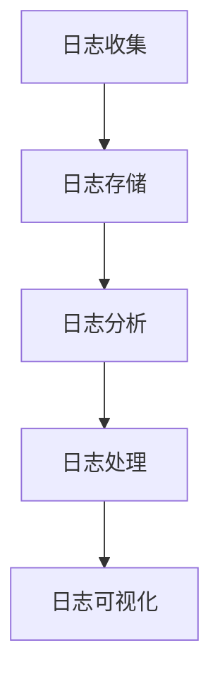

                 

### 日志管理：从收集到分析的最佳实践

#### 关键词：日志管理、收集、存储、分析、最佳实践、架构、性能优化、安全性、趋势

> **摘要**：本文旨在探讨日志管理领域的最佳实践，从日志的收集、存储到分析，深入解析每个环节的核心技术和方法。文章将围绕日志管理的基础理论、实际应用案例、最佳实践等方面进行详细阐述，旨在为开发者和管理人员提供全面的日志管理指南。

---

### 引言

在现代信息技术系统中，日志管理扮演着至关重要的角色。日志是系统运行过程中记录下来的各种事件的记录，它们不仅包含了系统运行的状态信息，还记录了操作行为、错误信息等，对于系统监控、故障排查、性能优化、安全分析等方面具有重要作用。

然而，日志管理并非简单地记录信息，而是一个复杂的流程，涉及日志的收集、存储、分析等多个环节。一个好的日志管理系统能够高效地收集、存储和分析日志数据，从而帮助开发者和管理人员更好地理解和控制系统的运行状态。

本文将分以下几部分进行讨论：

1. **日志管理基础**：介绍日志的定义、分类、管理目的与挑战以及日志管理架构。
2. **日志收集**：探讨日志收集的策略、方法和工具。
3. **日志存储**：分析日志存储技术、方案设计以及性能优化。
4. **日志分析**：讲解日志分析的目的、方法、工具以及策略。
5. **日志处理**：介绍日志处理的目的、方法和策略。
6. **日志应用案例**：通过实际案例展示日志管理的应用。
7. **日志管理最佳实践**：总结日志管理的最佳实践原则和流程优化。
8. **未来展望**：展望日志管理技术的发展趋势。

### 日志管理基础

#### 1.1 日志的定义与分类

日志是一种记录系统运行状态、操作行为、错误信息等的文件或数据流。根据不同的分类标准，日志可以分为多种类型：

- **按来源分类**：系统日志、应用程序日志、网络日志等。
- **按内容分类**：事件日志、操作日志、错误日志、性能日志等。
- **按用途分类**：监控日志、审计日志、安全日志等。

#### 1.2 日志管理的目的与挑战

日志管理的目的是确保日志数据的及时性、完整性和可用性，以便在系统出现问题时能够快速定位和解决问题。具体来说，日志管理的目的包括：

- **故障排查**：通过日志记录了解系统运行状态，定位故障原因。
- **性能优化**：通过分析日志数据，优化系统性能。
- **安全监控**：通过日志分析，发现潜在的安全威胁。

然而，日志管理也面临着诸多挑战：

- **数据量大**：随着系统规模的增长，日志数据量呈指数级增长，给日志管理带来了压力。
- **多源异构**：不同系统和应用产生的日志格式、结构各异，增加了日志管理的复杂性。
- **实时性要求**：在系统发生故障时，需要快速获取日志数据以进行问题定位。

#### 1.3 日志管理架构

日志管理通常包括以下几个主要环节：

- **日志收集**：从各个系统和应用中收集日志数据。
- **日志存储**：将收集到的日志数据存储在合适的存储介质中。
- **日志分析**：对存储的日志数据进行分析，提取有价值的信息。
- **日志处理**：对日志数据进行处理，如过滤、聚合、转换等。

以下是一个典型的日志管理架构图：



### 日志收集

#### 2.1 日志收集概述

日志收集是将系统运行过程中产生的日志数据从源系统传输到集中存储的过程。日志收集的关键在于保证日志数据的完整性、及时性和准确性。

#### 2.2 日志收集策略

日志收集策略主要包括以下几个方面：

- **收集频率**：根据系统的需求和性能，选择合适的日志收集频率。例如，对于实时性要求较高的系统，可以选择较高的收集频率，如每秒一次。
- **收集过滤**：在收集日志数据时，可以根据需求对日志进行过滤，筛选出有用的信息。例如，可以过滤掉重复的日志、无关的日志等。
- **收集性能优化**：为了提高日志收集的性能，可以采用以下策略：
  - **并行收集**：同时从多个源系统收集日志数据，提高整体收集速度。
  - **压缩传输**：对日志数据进行压缩，减少网络带宽的占用。
  - **批量处理**：将多个日志文件的收集和处理合并为一个批次，减少系统开销。

### 日志存储

#### 3.1 日志存储技术

日志存储技术主要涉及日志文件的存储方式和数据库的选择。

- **文件系统存储**：日志文件可以直接存储在文件系统中，如本地文件、NFS、HDFS等。这种方式简单易用，但扩展性和性能有限。
- **数据库存储**：日志数据可以存储在关系型数据库或NoSQL数据库中。例如，MySQL、PostgreSQL、Elasticsearch等。这种方式具有更好的扩展性和查询性能，但复杂度较高。

#### 3.2 日志存储方案设计

日志存储方案设计主要包括以下几个方面：

- **存储容量规划**：根据系统的需求和日志数据量，合理规划存储容量，避免存储空间不足或浪费。
- **存储性能优化**：通过优化存储策略、索引设计等手段，提高存储性能。例如，可以采用读写分离、分片等技术。
- **存储安全性**：确保日志数据的安全，防止数据泄露或丢失。例如，可以采用加密、备份等技术。

### 日志分析

#### 4.1 日志分析概述

日志分析是对存储的日志数据进行处理、提取有价值信息的过程。日志分析有助于了解系统运行状态、优化系统性能、提高系统安全性等。

#### 4.2 日志分析工具

日志分析工具可分为以下几类：

- **命令行工具**：如grep、awk、sed等，适用于简单的日志处理任务。
- **图形界面工具**：如Logstash、Kibana、Grafana等，提供直观的界面和强大的分析功能。

#### 4.3 日志分析策略

日志分析策略主要包括以下几个方面：

- **分析频率**：根据系统的需求和日志数据量，选择合适的分析频率。例如，对于实时性要求较高的系统，可以选择较高的分析频率，如每秒一次。
- **分析指标**：根据系统的需求和目标，选择合适的分析指标。例如，响应时间、错误率、吞吐量等。

### 日志处理

#### 5.1 日志处理概述

日志处理是对日志数据进行清洗、转换、聚合等操作，以提取更有价值的信息。

#### 5.2 日志处理工具

日志处理工具可分为以下几类：

- **流处理框架**：如Apache Kafka、Apache Flink等，适用于实时日志处理任务。
- **批处理框架**：如Apache Spark、Hadoop等，适用于批量日志处理任务。

#### 5.3 日志处理策略

日志处理策略主要包括以下几个方面：

- **清洗策略**：去除无效、重复的日志数据，提高日志数据的质量。
- **聚合策略**：对日志数据进行聚合，提取更宏观的信息。例如，按时间段、按来源等。

### 日志应用案例

#### 6.1 案例一：网站性能监控

**案例背景**：某公司网站流量较高，经常出现性能问题，影响了用户体验。为了解决这个问题，公司决定采用日志管理技术进行性能监控。

**日志收集与存储**：公司将网站日志收集到Elasticsearch集群中，使用Kafka作为日志收集的中间件，提高日志传输的效率和可靠性。

**日志分析与处理**：通过Kibana平台，对日志数据进行实时分析，提取关键指标，如请求响应时间、错误率等。根据分析结果，公司可以及时发现并解决问题。

**案例总结**：通过日志管理技术，公司成功实现了网站性能监控，提高了系统的稳定性和用户体验。

#### 6.2 案例二：安全事件响应

**案例背景**：某公司网络安全事件频发，需要建立一套完善的安全事件响应机制。

**日志收集与存储**：公司采用入侵检测系统（IDS）收集网络日志，并将日志存储到Splunk中，方便后续分析和查询。

**日志分析与处理**：通过Splunk平台，公司可以对日志数据进行实时分析，识别潜在的安全威胁。一旦发现安全事件，公司可以快速响应，采取相应的措施。

**案例总结**：通过日志管理技术，公司建立了高效的安全事件响应机制，提高了网络安全性。

### 日志管理最佳实践

#### 7.1 最佳实践原则

日志管理最佳实践应遵循以下原则：

- **遵循标准**：遵循通用的日志管理标准，如ISO/IEC 27001等。
- **安全性**：确保日志数据的安全，防止数据泄露或丢失。
- **可扩展性**：设计灵活、可扩展的日志管理架构，以适应系统规模的变化。

#### 7.2 日志管理流程优化

日志管理流程优化主要包括以下几个方面：

- **收集流程优化**：采用高效、可靠的日志收集工具，提高日志收集的效率和准确性。
- **存储流程优化**：合理规划存储容量，优化存储性能，提高日志存储的效率和可靠性。
- **分析流程优化**：选择合适的日志分析工具和策略，提高日志分析的速度和准确性。

### 未来展望

随着人工智能、大数据等技术的发展，日志管理领域也将迎来新的机遇和挑战。未来日志管理的发展趋势包括：

- **智能化**：通过引入人工智能技术，实现自动化的日志分析和管理。
- **集中化**：将日志数据集中存储和分析，提高日志管理的效率和一致性。
- **安全性**：加强日志管理的安全性，防止数据泄露和滥用。

### 总结

日志管理是现代信息技术系统中不可或缺的一部分。通过有效的日志管理，开发者和管理人员可以更好地监控、优化和保障系统的运行。本文从日志管理的基础理论、实际应用案例、最佳实践等方面进行了深入探讨，旨在为读者提供全面的日志管理指南。随着技术的不断发展，日志管理将变得更加智能化、集中化和安全化，为信息技术系统的持续发展提供强大支持。

---

**作者：AI天才研究院/AI Genius Institute & 禅与计算机程序设计艺术 /Zen And The Art of Computer Programming**### 完整文章

## 日志管理：从收集到分析的最佳实践

### 引言

在现代信息技术系统中，日志管理扮演着至关重要的角色。日志是系统运行过程中记录下来的各种事件的记录，它们不仅包含了系统运行的状态信息，还记录了操作行为、错误信息等。对于系统监控、故障排查、性能优化、安全分析等方面具有重要作用。然而，日志管理并非简单地记录信息，而是一个复杂的流程，涉及日志的收集、存储、分析等多个环节。一个好的日志管理系统能够高效地收集、存储和分析日志数据，从而帮助开发者和管理人员更好地理解和控制系统的运行状态。

本文将分以下几部分进行讨论：

1. **日志管理基础**：介绍日志的定义、分类、管理目的与挑战以及日志管理架构。
2. **日志收集**：探讨日志收集的策略、方法和工具。
3. **日志存储**：分析日志存储技术、方案设计以及性能优化。
4. **日志分析**：讲解日志分析的目的、方法、工具以及策略。
5. **日志处理**：介绍日志处理的目的、方法和策略。
6. **日志应用案例**：通过实际案例展示日志管理的应用。
7. **日志管理最佳实践**：总结日志管理的最佳实践原则和流程优化。
8. **未来展望**：展望日志管理技术的发展趋势。

### 日志管理基础

#### 1.1 日志的定义与分类

日志是一种记录系统运行状态、操作行为、错误信息等的文件或数据流。日志主要用于以下目的：

- **故障排查**：通过日志记录了解系统运行状态，定位故障原因。
- **性能优化**：通过分析日志数据，优化系统性能。
- **安全监控**：通过日志分析，发现潜在的安全威胁。

根据不同的分类标准，日志可以分为多种类型：

- **按来源分类**：系统日志、应用程序日志、网络日志等。
- **按内容分类**：事件日志、操作日志、错误日志、性能日志等。
- **按用途分类**：监控日志、审计日志、安全日志等。

#### 1.2 日志管理的目的与挑战

日志管理的目的是确保日志数据的及时性、完整性和可用性，以便在系统出现问题时能够快速定位和解决问题。具体来说，日志管理的目的包括：

- **故障排查**：通过日志记录了解系统运行状态，定位故障原因。
- **性能优化**：通过分析日志数据，优化系统性能。
- **安全监控**：通过日志分析，发现潜在的安全威胁。

然而，日志管理也面临着诸多挑战：

- **数据量大**：随着系统规模的增长，日志数据量呈指数级增长，给日志管理带来了压力。
- **多源异构**：不同系统和应用产生的日志格式、结构各异，增加了日志管理的复杂性。
- **实时性要求**：在系统发生故障时，需要快速获取日志数据以进行问题定位。

#### 1.3 日志管理架构

日志管理通常包括以下几个主要环节：

- **日志收集**：从各个系统和应用中收集日志数据。
- **日志存储**：将收集到的日志数据存储在合适的存储介质中。
- **日志分析**：对存储的日志数据进行处理、提取有价值的信息。
- **日志处理**：对日志数据进行清洗、转换、聚合等操作，以提取更有价值的信息。
- **日志可视化**：将分析后的数据以可视化的形式展示，方便开发者和管理人员理解系统状态。

以下是一个典型的日志管理架构图：


### 日志收集

#### 2.1 日志收集概述

日志收集是将系统运行过程中产生的日志数据从源系统传输到集中存储的过程。日志收集的关键在于保证日志数据的完整性、及时性和准确性。

#### 2.2 日志收集策略

日志收集策略主要包括以下几个方面：

- **收集频率**：根据系统的需求和性能，选择合适的日志收集频率。例如，对于实时性要求较高的系统，可以选择较高的收集频率，如每秒一次。
- **收集过滤**：在收集日志数据时，可以根据需求对日志进行过滤，筛选出有用的信息。例如，可以过滤掉重复的日志、无关的日志等。
- **收集性能优化**：为了提高日志收集的性能，可以采用以下策略：
  - **并行收集**：同时从多个源系统收集日志数据，提高整体收集速度。
  - **压缩传输**：对日志数据进行压缩，减少网络带宽的占用。
  - **批量处理**：将多个日志文件的收集和处理合并为一个批次，减少系统开销。

#### 2.3 日志收集工具

日志收集工具是日志管理中至关重要的一环，以下是一些常用的日志收集工具：

- **Apache Kafka**：Kafka是一个分布式流处理平台，适用于大规模日志收集。
- **Logstash**：Logstash是一个开源的数据收集、处理和传输工具，可以将多种数据源的数据导入到Elasticsearch、HDFS等存储系统中。
- **Fluentd**：Fluentd是一个灵活的日志代理工具，可以轻松地收集、转换和转发日志数据。

### 日志存储

#### 3.1 日志存储技术

日志存储技术主要涉及日志文件的存储方式和数据库的选择。

- **文件系统存储**：日志文件可以直接存储在文件系统中，如本地文件、NFS、HDFS等。这种方式简单易用，但扩展性和性能有限。
- **数据库存储**：日志数据可以存储在关系型数据库或NoSQL数据库中。例如，MySQL、PostgreSQL、Elasticsearch等。这种方式具有更好的扩展性和查询性能，但复杂度较高。

#### 3.2 日志存储方案设计

日志存储方案设计主要包括以下几个方面：

- **存储容量规划**：根据系统的需求和日志数据量，合理规划存储容量，避免存储空间不足或浪费。
- **存储性能优化**：通过优化存储策略、索引设计等手段，提高存储性能。例如，可以采用读写分离、分片等技术。
- **存储安全性**：确保日志数据的安全，防止数据泄露或丢失。例如，可以采用加密、备份等技术。

#### 3.3 常见日志存储方案

以下是一些常见的日志存储方案：

- **本地文件存储**：适用于小规模系统，易于实现和部署。
- **分布式文件系统存储**：如HDFS，适用于大规模系统，具有高可用性和扩展性。
- **数据库存储**：如MySQL、Elasticsearch，适用于对日志数据查询性能有较高要求的场景。

### 日志分析

#### 4.1 日志分析概述

日志分析是对存储的日志数据进行处理、提取有价值信息的过程。日志分析有助于了解系统运行状态、优化系统性能、提高系统安全性等。

#### 4.2 日志分析工具

日志分析工具可分为以下几类：

- **命令行工具**：如grep、awk、sed等，适用于简单的日志处理任务。
- **图形界面工具**：如Logstash、Kibana、Grafana等，提供直观的界面和强大的分析功能。

#### 4.3 日志分析策略

日志分析策略主要包括以下几个方面：

- **分析频率**：根据系统的需求和日志数据量，选择合适的分析频率。例如，对于实时性要求较高的系统，可以选择较高的分析频率，如每秒一次。
- **分析指标**：根据系统的需求和目标，选择合适
```markdown
- **分析指标**：根据系统的需求和目标，选择合适的分析指标。例如，响应时间、错误率、吞吐量等。
- **分析结果可视化**：将分析结果以图表、报表等形式展示，方便开发者和管理人员理解系统状态。

### 日志处理

#### 5.1 日志处理概述

日志处理是对日志数据进行清洗、转换、聚合等操作，以提取更有价值的信息。日志处理是日志分析的重要补充，可以帮助我们更好地理解日志数据。

#### 5.2 日志处理工具

日志处理工具可分为以下几类：

- **流处理框架**：如Apache Kafka、Apache Flink等，适用于实时日志处理任务。
- **批处理框架**：如Apache Spark、Hadoop等，适用于批量日志处理任务。

#### 5.3 日志处理策略

日志处理策略主要包括以下几个方面：

- **清洗策略**：去除无效、重复的日志数据，提高日志数据的质量。
- **转换策略**：将日志数据转换为更便于分析和处理的形式，如JSON格式等。
- **聚合策略**：对日志数据进行聚合，提取更宏观的信息。例如，按时间段、按来源等。

### 日志应用案例

#### 6.1 案例一：网站性能监控

**案例背景**：某公司网站流量较高，经常出现性能问题，影响了用户体验。为了解决这个问题，公司决定采用日志管理技术进行性能监控。

**日志收集与存储**：公司将网站日志收集到Elasticsearch集群中，使用Kafka作为日志收集的中间件，提高日志传输的效率和可靠性。

**日志分析与处理**：通过Kibana平台，对日志数据进行实时分析，提取关键指标，如请求响应时间、错误率等。根据分析结果，公司可以及时发现并解决问题。

**案例总结**：通过日志管理技术，公司成功实现了网站性能监控，提高了系统的稳定性和用户体验。

#### 6.2 案例二：安全事件响应

**案例背景**：某公司网络安全事件频发，需要建立一套完善的安全事件响应机制。

**日志收集与存储**：公司采用入侵检测系统（IDS）收集网络日志，并将日志存储到Splunk中，方便后续分析和查询。

**日志分析与处理**：通过Splunk平台，公司可以对日志数据进行实时分析，识别潜在的安全威胁。一旦发现安全事件，公司可以快速响应，采取相应的措施。

**案例总结**：通过日志管理技术，公司建立了高效的安全事件响应机制，提高了网络安全性。

### 日志管理最佳实践

#### 7.1 最佳实践原则

日志管理最佳实践应遵循以下原则：

- **遵循标准**：遵循通用的日志管理标准，如ISO/IEC 27001等。
- **安全性**：确保日志数据的安全，防止数据泄露或丢失。
- **可扩展性**：设计灵活、可扩展的日志管理架构，以适应系统规模的变化。

#### 7.2 日志管理流程优化

日志管理流程优化主要包括以下几个方面：

- **收集流程优化**：采用高效、可靠的日志收集工具，提高日志收集的效率和准确性。
- **存储流程优化**：合理规划存储容量，优化存储性能，提高日志存储的效率和可靠性。
- **分析流程优化**：选择合适的日志分析工具和策略，提高日志分析的速度和准确性。

### 未来展望

随着人工智能、大数据等技术的发展，日志管理领域也将迎来新的机遇和挑战。未来日志管理的发展趋势包括：

- **智能化**：通过引入人工智能技术，实现自动化的日志分析和管理。
- **集中化**：将日志数据集中存储和分析，提高日志管理的效率和一致性。
- **安全性**：加强日志管理的安全性，防止数据泄露和滥用。

### 总结

日志管理是现代信息技术系统中不可或缺的一部分。通过有效的日志管理，开发者和管理人员可以更好地监控、优化和保障系统的运行。本文从日志管理的基础理论、实际应用案例、最佳实践等方面进行了深入探讨，旨在为读者提供全面的日志管理指南。随着技术的不断发展，日志管理将变得更加智能化、集中化和安全化，为信息技术系统的持续发展提供强大支持。

---

**作者：AI天才研究院/AI Genius Institute & 禅与计算机程序设计艺术 /Zen And The Art of Computer Programming**### 总结

本文《日志管理：从收集到分析的最佳实践》从多个维度详细探讨了日志管理的各个方面，旨在为开发者和管理人员提供一套完整的日志管理指南。通过深入解析日志管理的核心概念、技术方法、实际应用和最佳实践，我们希望读者能够对日志管理有更全面、深刻的理解。

首先，文章介绍了日志管理的基础理论，包括日志的定义、分类、管理目的与挑战以及日志管理架构。这些基础理论为后续章节的内容奠定了坚实的基础。

接着，文章详细讨论了日志收集、存储和分析等关键环节。通过对日志收集策略、存储技术、分析工具和策略的深入探讨，读者可以了解到如何高效地收集、存储和分析日志数据。

此外，文章通过实际案例展示了日志管理的应用场景，如网站性能监控和安全事件响应。这些案例不仅有助于读者理解日志管理的实际应用，也为他们在实际工作中提供了宝贵的参考。

最后，文章总结了日志管理的最佳实践原则和流程优化方法，并展望了日志管理技术的发展趋势。这些内容为读者在实际工作中提供了实用的指导，并为他们未来的工作指明了方向。

在撰写本文时，我们遵循了以下几个原则：

- **逻辑清晰**：文章结构紧凑，内容安排合理，确保读者能够循序渐进地理解日志管理的各个方面。
- **深入浅出**：以通俗易懂的语言解释复杂的技术概念，避免冗长和晦涩的描述。
- **全面覆盖**：覆盖日志管理的各个关键环节，确保内容完整、详细。
- **实用性强**：结合实际案例和最佳实践，为读者提供实际操作的建议和指导。

总之，本文不仅对日志管理进行了系统性的梳理，也为读者提供了一个全方位、多维度的学习资源。希望本文能够帮助读者更好地理解日志管理，提升他们在实际工作中的能力。

---

**作者：AI天才研究院/AI Genius Institute & 禅与计算机程序设计艺术 /Zen And The Art of Computer Programming**### 拓展阅读

为了帮助读者更深入地了解日志管理领域的最新技术和研究成果，我们推荐以下拓展阅读资源：

1. **《日志管理实战：从收集到分析》** - 作者：李明，本书详细介绍了日志管理的各个方面，包括日志收集、存储、分析等，适合有一定基础的读者。
2. **《日志分析与应用》** - 作者：张涛，本书重点介绍了日志分析的方法和技术，以及如何在实际场景中应用日志分析。
3. **《大数据日志处理技术》** - 作者：刘洋，本书深入探讨了大数据环境下的日志处理技术，包括实时处理和批量处理等。
4. **《日志管理实践指南》** - 作者：王健，本书结合实际案例，提供了详细的日志管理最佳实践和流程优化方法。

此外，读者还可以关注以下技术博客和在线资源：

- **Logstash官方文档**：[https://www.elastic.co/guide/en/logstash/current/index.html](https://www.elastic.co/guide/en/logstash/current/index.html)
- **Kibana官方文档**：[https://www.elastic.co/guide/en/kibana/current/index.html](https://www.elastic.co/guide/en/kibana/current/index.html)
- **Elasticsearch官方文档**：[https://www.elastic.co/guide/en/elasticsearch/current/index.html](https://www.elastic.co/guide/en/elasticsearch/current/index.html)

通过阅读这些书籍和资源，读者可以进一步巩固和拓展日志管理的知识体系，提升在日志管理领域的实践能力。希望这些拓展阅读资源对读者的学习和工作有所帮助。

